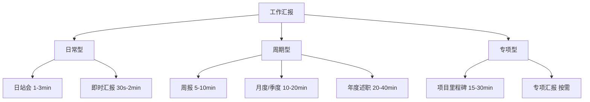
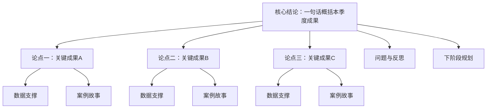
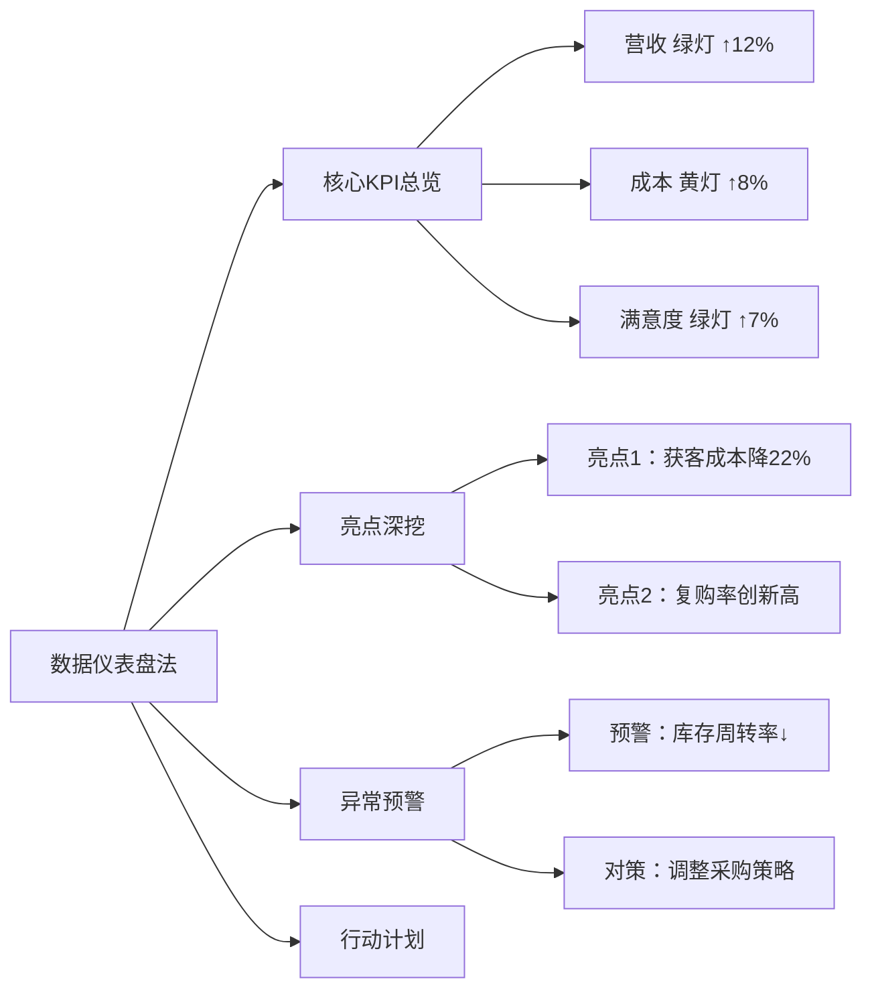

## 场景一：工作汇报

工作汇报是职场中最高频、最具战略价值的演讲场景。它不仅是一次信息传递，更是一次展示专业能力、争取资源、影响决策的关键机会。很多人把汇报当成"念流水账"，白白浪费了这个向上管理和个人品牌建设的黄金通道。本节将从底层逻辑到实战话术，系统拆解工作汇报的完整方法论。

### 一、工作汇报的本质与分类

#### 1.1 汇报的本质：一场有目的的信息交换

工作汇报的本质不是"告诉领导你干了什么"，而是**帮助决策者做出更好的决策**。理解这一点，你的汇报逻辑会彻底改变：

| 错误认知 | 正确认知 |
|----------|----------|
| 汇报 = 念工作清单 | 汇报 = 传递决策所需信息 |
| 听众想知道我做了什么 | 听众想知道结果、影响和下一步 |
| 越详细越显努力 | 越精炼越显专业 |
| 好消息多说，坏消息少说 | 关键风险必须第一时间暴露 |
| 汇报完了就完了 | 汇报是争取资源和支持的窗口 |

#### 1.2 工作汇报的六种常见形态

不同类型的汇报，准备策略和结构选择完全不同：

**日站会汇报（Daily Standup）**
- 时长：每人1-3分钟
- 核心框架：昨天完成了什么 → 今天计划做什么 → 有什么阻碍需要帮助
- 关键原则：不展开细节，只说结论和卡点
- 示例："昨天完成了用户模块的接口联调，今天开始写支付模块，目前没有阻塞。"

**周报汇报（Weekly Report）**
- 时长：5-10分钟（口头）或1页文档
- 核心框架：本周关键成果（3件）→ 关键数据变化 → 下周重点计划 → 需要协调的事项
- 关键原则：聚焦增量，不要重复上周已说的内容
- 常见错误：把每天做的事情逐条罗列，变成"日记"

**月度/季度汇报（Monthly/Quarterly Review）**
- 时长：10-20分钟
- 核心框架：核心成果总结 → 数据驱动分析 → 问题与反思 → 下阶段规划
- 关键原则：要有数据对比（同比/环比），要有归因分析
- 这是本节重点拆解的场景

**项目里程碑汇报（Milestone Review）**
- 时长：15-30分钟
- 核心框架：项目目标回顾 → 里程碑完成情况 → 风险与应对 → 资源需求
- 关键原则：用"红黄绿灯"标记各模块状态，让风险一目了然

**年度述职（Annual Review）**
- 时长：20-40分钟
- 核心框架：年度目标回顾 → 核心成果展示 → 能力成长复盘 → 来年规划
- 关键原则：要体现个人成长轨迹，不只是罗列成果

**电梯汇报（Elevator Pitch）**
- 时长：30秒-2分钟
- 核心框架：一句话说清现状 → 一句话说清问题/需求 → 一句话说清预期
- 关键原则：极度精炼，只说决策者此刻需要知道的信息
- 示例："王总，A项目目前进度正常，但供应商交付可能延迟两周，我建议启动备选方案，需要您今天给个方向。"

### 二、听众分析：你的汇报是讲给谁听的

#### 2.1 不同听众的关注点差异

同一个工作成果，面对不同听众，汇报的侧重点完全不同：

| 听众角色 | 核心关注点 | 你应该强调的 | 你应该避免的 |
|----------|-----------|-------------|-------------|
| 直属上级 | 进度、风险、资源需求 | 执行细节、问题解决方案 | 过度包装成果 |
| 高层领导 | 战略价值、ROI、趋势 | 业务影响、数据结论 | 技术细节、过程描述 |
| 跨部门同事 | 协作价值、接口依赖 | 互利共赢、协同方案 | 只讲自己部门的事 |
| 团队成员 | 方向明确、资源到位 | 下阶段计划、支持措施 | 空洞的口号和画饼 |
| 外部客户 | 成果交付、质量保障 | 价值交付、专业能力 | 内部问题和矛盾 |

#### 2.2 向上汇报的底层逻辑：管理预期

向上汇报的核心不是"汇报工作"，而是**管理上级对你的预期**。这包含三个层次：

**第一层：让上级放心（透明度）**
- 定期同步进展，不要让上级来问你
- 关键风险提前预警，不要等到爆雷才说
- 遇到卡点及时上报，附带你的解决方案

**第二层：让上级认可（专业度）**
- 用数据说话，不用感觉说话
- 展示你的分析能力，不只是执行能力
- 主动发现问题比被动暴露问题更有价值

**第三层：让上级依赖（不可替代性）**
- 成为某个领域的"信息枢纽"
- 汇报中展示你的全局视野，不只是自己的一亩三分地
- 提供决策选项和建议，不只抛问题

#### 2.3 "电梯汇报"的黄金公式

当你只有30秒到2分钟的时间，使用**SBI-E模型**：

- **S（Situation）**：一句话说清背景
- **B（Behavior/Result）**：一句话说清结果或现状
- **I（Impact）**：一句话说清影响
- **E（Expectation）**：一句话说清你需要什么

示例：
> "王总，关于A项目（S），本周完成了核心功能开发，比计划提前3天（B），这意味着我们可以在下周提前进入测试阶段（I），需要您协调测试团队在下周二前到位（E）。"

### 三、结构框架：四种经过验证的汇报结构

#### 3.1 框架一：金字塔汇报法（推荐：季度汇报、年度述职）

这是麦肯锡顾问最常用的汇报结构，核心原则是**结论先行**。

**时间分配（以15分钟为例）**：

| 环节 | 时间 | 内容 | 目的 |
|------|------|------|------|
| 开场定调 | 1.5min | 一句话核心结论 + 本季度亮点数字 | 让听众立即知道结论 |
| 成果一 | 3min | 数据 + 背景故事 + 价值说明 | 展示最大亮点 |
| 成果二 | 3min | 数据 + 背景故事 + 价值说明 | 展示第二亮点 |
| 成果三 | 2.5min | 数据 + 背景故事 + 价值说明 | 展示第三亮点 |
| 反思挑战 | 2min | 一个关键问题 + 根因分析 + 改进措施 | 展示自我认知和成长 |
| 下季规划 | 2.5min | 三个重点方向 + 关键里程碑 + 资源需求 | 展示前瞻性思维 |
| 收尾 | 0.5min | 感谢 + 表达信心 | 留下积极印象 |

**语言范例——金字塔汇报法完整脚本**：

> **开场**：
> "各位好。本季度我们团队交出了一份在人员缩减20%的条件下逆势增长的成绩单：交付量提升35%，客户满意度从87%跃升到94%，新增47家企业客户。接下来我用12分钟，汇报三个关键成果、一个反思和下季度的三个重点。"
>
> **成果一**：
> "第一个成果是获客效率的突破。本季度新增47家企业客户，同比增长62%，而销售成本反而下降了15%。这个转折发生在三月份——当时我们发现传统电话获客的转化率已经从年初的8%跌到3.5%，团队的小王提出了一个假设：与其大海捞针式地打电话，不如用高质量内容吸引有需求的客户主动找我们。我们用了两周时间试跑内容营销方案，第一个月就带来了12个高质量线索，转化率达到22%，是电话获客的6倍。到季度末，内容营销已经占到我们总获客量的40%。"
>
> **成果二**：
> "第二个成果是产品交付质量的提升。本季度交付的12个项目中，客户一次验收通过率从上季度的65%提升到83%，返工工时减少了40%。关键改进是我们引入了'交付前内部评审'机制——每个项目在交付给客户前，先经过跨团队的Peer Review，由不参与该项目的同事从客户视角审视交付物。这个机制的灵感来自代码审查，第一个月大家还不太适应，但当返工率真的降下来后，团队从被动接受变成了主动要求评审。"
>
> **成果三**：
> "第三个成果是团队能力建设。本季度我们完成了两名初级工程师的培养，他们现在已经能独立负责中型项目。具体做法是'一人一课'制度——每人每周分享一个自己踩过的坑，15分钟，不讲理论只讲实战。一个季度下来，我们积累了36个实战案例，形成了团队内部的知识库，新人入职培训时间从原来的6周缩短到了4周。"
>
> **反思**：
> "但我必须坦诚分享一个挑战：我们的项目交付周期比目标超出了5天，平均从22天延长到27天。根因分析后发现，问题出在两个大项目并行时，资源调度不够灵活——我们没有预见到项目B的高峰期和项目A的收尾期重叠了。下季度我们将引入敏捷项目管理工具做资源热力图，同时增加一名项目经理专门负责多项目协调。"
>
> **规划**：
> "下季度我们有三个重点方向。第一，完成新产品X的市场验证——我们计划在8月底前完成10家种子客户的试用，验证PMF。第二，将交付周期压缩回22天以内——通过资源管理优化和标准化交付模板。第三，培养两名新的团队leader——小李和小张已经展现了leadership潜力，下季度给他们各自带领一个完整项目的机会。"
>
> **收尾**：
> "感谢各位领导和兄弟部门的支持。下季度我们会继续保持进攻态势，也希望在新产品验证和资源协调方面得到更多支持。谢谢。"

#### 3.2 框架二：STAR汇报法（推荐：项目复盘、单事件汇报）

STAR结构来自面试方法论，但同样适用于工作汇报中讲述单一事件或项目：

- **S（Situation）**：当时的情况和背景
- **T（Task）**：你面临的任务和目标
- **A（Action）**：你采取的具体行动
- **R（Result）**：取得的结果和收获

**适用场景**：客户投诉处理汇报、突发事件应对汇报、单项目复盘

**语言范例**：

> "上个月我们遇到了一个危机——大客户A突然提出要在两周内将系统容量提升3倍，否则将考虑更换供应商（S）。我们的任务是在不中断现有服务的前提下完成扩容（T）。我带领团队72小时内完成了三件事：一是紧急采购了云服务器资源做临时扩容，保障业务不中断；二是用48小时完成了架构优化方案的编写和评审；三是与客户技术团队开了两次协调会，对齐了技术方案和时间表（R）。最终我们提前两天完成了永久扩容方案的部署，客户不仅没有流失，反而因为我们的响应速度增加了20%的合同金额。"

#### 3.3 框架三：问题-方案-成果法（推荐：改进型汇报、提案型汇报）

当你需要汇报一个改进项目或说服领导批准某个方案时：

| 环节 | 时间占比 | 核心内容 |
|------|---------|---------|
| 问题定义 | 20% | 现状是什么？痛点在哪里？影响有多大？ |
| 方案设计 | 30% | 你提出了什么方案？为什么选择这个方案？ |
| 执行过程 | 20% | 关键行动步骤、遇到的困难、如何克服 |
| 成果验证 | 20% | 数据对比、效果评估、ROI计算 |
| 经验沉淀 | 10% | 可复制的经验、改进建议、推广价值 |

**语言范例**：

> "我想汇报一下客服响应效率的改进项目。年初我们的客服平均首次响应时间是4.2小时，客户投诉率高达12%（问题）。我们分析后发现，60%的工单是重复性问题，客服花大量时间在重复回答上。于是我们决定搭建智能知识库+自动回复系统（方案）。执行分三步：第一周梳理了TOP 100高频问题并编写标准答案，第二周部署了基于关键词匹配的自动回复，第三周做了灰度上线和调优（执行）。上线一个月后，平均首次响应时间从4.2小时降到47分钟，客户投诉率从12%降到3.8%，客服团队人均处理工单量提升了65%（成果）。这个方案的核心经验是'先标准化再自动化'，我们已经整理了完整的方法论文档，其他业务线可以直接复用（经验）。"

#### 3.4 框架四：数据仪表盘法（推荐：周报、月报等高频汇报）

对于高频、常规性的汇报，听众更关注数据变化而非故事叙事：

**结构设计**：
1. **关键指标总览**（1分钟）：用3-5个核心KPI一图概览
2. **亮点指标深挖**（3分钟）：1-2个表现突出的指标，分析原因
3. **异常指标预警**（2分钟）：1-2个偏离预期的指标，说明原因和对策
4. **下周/月重点**（1分钟）：基于数据洞察确定的行动重点

**可视化建议**：
- 使用"交通灯"系统：绿色（达标）、黄色（预警）、红色（危险）
- 同比/环比数据并排展示，趋势一目了然
- 关键数据用大字号突出，辅助数据用小字号

### 四、汇报准备的完整流程

#### 4.1 汇报前一周：素材收集与结构搭建

**第一步：收集原始素材**
- 从项目管理工具（Jira、飞书、钉钉等）导出数据
- 整理本周期的关键事件记录
- 收集客户反馈、同事评价等定性素材
- 准备关键数据的截图或报表

**第二步：提炼核心信息**
- 用一句话概括本周期的核心成果（不超过25个字）
- 用三个关键词标记三个核心亮点
- 用一句话概括最大的挑战或反思
- 用三个方向概括下阶段计划

**第三步：选择结构框架**
根据汇报类型和听众，选择最合适的结构（参考第三节的四种框架）。

**第四步：搭建内容大纲**

推荐使用"卡片法"搭建大纲：
1. 把每个要讲的点写在一张便签上
2. 按逻辑关系排列这些便签
3. 删掉非核心的便签（最多保留5-7张）
4. 调整顺序，确保逻辑流畅
5. 转化为PPT大纲或演讲提纲

#### 4.2 汇报前三天：内容打磨与视觉设计

**PPT设计的五条铁律**：

| 铁律 | 说明 | 反面案例 | 正面案例 |
|------|------|---------|---------|
| 一页一主题 | 每页只讲一个核心点 | 一页塞5个要点 | 拆成5页，每页一个重点 |
| 数据可视化 | 数字要做成图表 | 写"增长35%" | 画柱状图显示趋势 |
| 文字极简 | 每页不超过30字 | 满屏都是文字 | 关键词+图表 |
| 对比突出 | 用对比制造冲击力 | 只展示当前数据 | 当前vs目标/上期对比 |
| 一致性 | 配色、字体、排版统一 | 每页风格不同 | 使用统一模板 |

**PPT的核心页面设计**：

**封面页**：汇报标题 + 你的名字 + 日期 + 部门
**议程页**：用1页列出汇报的主要环节，让听众有预期
**数据页**：核心数据用大字号突出，趋势用图表展示
**结论页**：每3-5页数据后，用1页给出结论
**总结页**：回顾核心要点 + 下一步行动

#### 4.3 汇报前一天：预演与风险预案

**预演清单**：
- [ ] 至少完整预演2遍，计时
- [ ] 对着镜子或录像练习，检查表情和肢体语言
- [ ] 预演时大声说出来，不要只在心里默念
- [ ] 找一个同事做模拟听众，收集反馈
- [ ] 准备好开场白和结束语（这两部分要能脱稿）

**风险预案**：

| 可能的风险 | 应对方案 |
|-----------|---------|
| PPT打不开 | 准备PDF备份版本，存U盘+云盘 |
| 投影仪故障 | 准备纸质打印版，或直接口述 |
| 时间被压缩（领导迟到/前面超时） | 准备3分钟精简版和10分钟完整版 |
| 被打断提问 | 准备好关键数据的备用页 |
| 领导问到你不了解的数据 | "这个数据我需要确认后回复您，今天下午5点前给您" |
| 被挑战某个决策 | 先认可对方的关切，再用数据和逻辑解释 |

#### 4.4 汇报当天：执行与应变

**汇报前30分钟**：
- 到达会场，测试设备（投影、麦克风、翻页器）
- 打开PPT确认格式正常
- 在座位上做3-5组深呼吸（4-7-8呼吸法）
- 喝一小口水，润润嗓子
- 再看一遍小卡片上的关键数据和开场白

**汇报中的注意事项**：

- **站位**：站在屏幕旁边，面向听众，不要背对屏幕念PPT
- **眼神**：轮流看向不同区域的听众，每人停留3-5秒
- **手势**：用开放式手势强调重点，避免双手插兜或交叉抱胸
- **语速**：比平时说话稍慢，关键数据前后停顿1-2秒
- **翻页**：每翻一页，先停顿2秒让听众看图，再开始讲解
- **互动**：适时抛出问题或征求认同，如"各位觉得这个方向如何？"

### 五、汇报中的高频难题与应对策略

#### 5.1 如何汇报坏消息

汇报坏消息是工作汇报中最考验功力的环节。核心原则：**不回避、不推诿、有方案**。

**三步法**：
1. **直接说事实**，不绕弯子："本季度客户流失率上升了8个百分点"
2. **给出根因分析**，不甩锅："主要原因是竞品X在上月推出了低价方案，我们的价格优势被削弱"
3. **提出解决方案**，显示主动性："我已经拉通了产品和市场团队，方案一是推出轻量版产品线对冲，方案二是加强增值服务差异化。我建议方案一，预计两个月内可以上线"

**绝对不要说的话**：
- ❌ "这个事情不是我负责的"（推诿）
- ❌ "之前也没人告诉我会这样"（甩锅）
- ❌ "我觉得问题不大"（粉饰太平）
- ❌ "这是市场环境的问题，我们没办法"（推卸责任）

#### 5.2 如何汇报好消息（避免自吹自擂）

汇报好消息的难点在于：既要充分展示成果，又要避免让同事觉得你在邀功、让领导觉得你浮夸。

**技巧一：归因于团队和系统**
- ❌ "我一个人完成了这个项目"
- ✅ "这个成果是团队协作的结果，特别是小王在技术方案上的贡献和小李在客户沟通上的努力"

**技巧二：强调过程和方法**
- ❌ "业绩增长了50%"
- ✅ "我们尝试了三种获客策略，最终发现内容营销的ROI是电话销售的6倍，这个方法论已经被整理成SOP，团队其他成员也可以复用"

**技巧三：关联业务价值**
- ❌ "我完成了10个需求的开发"
- ✅ "这10个需求上线后，用户留存率提升了12%，预计年度营收贡献在200万左右"

#### 5.3 如何应对领导的突然提问

领导在汇报中突然提问，往往不是真的想听答案，而是在**测试你的思考深度和反应速度**。

**应对框架——AREA模型**：
- **A（Acknowledge）**：认可问题的价值——"这是个很好的问题"
- **R（Respond）**：给出你目前的判断——"根据我的分析……"
- **E（Evidence）**：提供支撑依据——"数据显示……"
- **A（Action）**：说明后续行动——"我会进一步验证，明天给您详细数据"

**当你不知道答案时**：
- ❌ 瞎编一个答案（必被拆穿）
- ❌ "我不知道"（显得准备不足）
- ✅ "这个数据我需要核实一下，今天下午5点前给您准确回复"（诚实且有deadline）
- ✅ "目前我掌握的信息是……但还不完整，我可以会后进一步调研"（展示已有的思考）

#### 5.4 如何在有限时间内讲清楚复杂项目

**策略一：类比法**
> "我们的微服务架构改造，就像把一个大超市拆成多个专卖店——每个店独立经营、独立装修，但共享同一个停车场和物流系统。"

**策略二：分层法**
> "这个项目我可以从三个层面来讲。战略层：解决的是系统扩展性瓶颈；执行层：我们拆分了12个服务模块，分三批上线；成果层：上线后系统响应时间从800毫秒降到120毫秒。"

**策略三：故事法**
> "我想用一个具体的客户案例来说明。上个月客户A的系统在促销活动期间宕机了2小时，直接损失300万。我们的微服务改造完成后，同样的促销场景下系统平稳运行，峰值处理能力提升了5倍。"

### 六、不同场景的汇报范例

#### 6.1 范例一：技术团队周报（5分钟版本）

> "本周团队核心进展三件事。
>
> 第一，支付模块重构完成。我们把原来的同步支付改成了异步消息队列方案，支付成功率从97.2%提升到99.8%，这个改进已经在周三灰度上线，目前运行稳定。
>
> 第二，数据库性能优化。上周预警的慢查询问题，我们通过添加复合索引和优化SQL语句解决了。平均查询时间从1.2秒降到了80毫秒，这为下周的大促活动扫清了隐患。
>
> 第三，新人培训。新入职的小陈已经完成了第一个模块的独立开发，代码质量评分4.2分（满分5分），下周开始参与核心模块的开发。
>
> 下周重点：大促活动的技术保障，我会在周三前完成全链路压测，确保系统支撑10倍峰值流量。"

#### 6.2 范例二：产品负责人季度汇报（15分钟版本）

> **开场**：
> "各位好。本季度产品团队的核心成果可以概括为三个数字：DAU增长40%，用户留存率从35%提升到52%，NPS从32分提升到61分。这三个数字的背后，是我们做对了两件事，也踩了一个坑。"
>
> **成果一（做对的事之一：用户分层运营）**：
> "我们发现，用户群体实际上可以清晰地分成三层——核心用户（日活7天以上）、边缘用户（周活1-3天）和流失用户（30天未登录）。之前我们对所有用户用同一套运营策略，就像用同一把钥匙开所有的锁。本季度我们针对不同层级设计了差异化策略：给核心用户推高级功能，给边缘用户推个性化内容召回，给流失用户推优惠券。结果是：核心用户的ARPU提升了25%，边缘用户的激活率提升了40%，流失用户的召回率达到18%。"
>
> **成果二（做对的事之二：产品体验重构）**：
> "我们花了6周时间对核心流程做了深度优化。最大的改动是把注册流程从5步简化到2步，用手机号一键注册替代了原来的表单填写。注册转化率从32%飙升到67%。另一个关键改动是搜索功能的智能推荐——用户搜索时不仅显示精确匹配，还推荐相关内容。搜索使用率提升了55%，搜索后的留存率提升了28%。"
>
> **反思（踩的坑）**：
> "但我要坦诚地说，我们在社交功能的投入上效果不及预期。我们花了8周时间开发的社区功能，上线后DAU占比只有3%，远低于预期的15%。复盘后发现，我们的产品定位是工具型，用户来这里是解决问题的，不是来社交的。这个教训是：功能设计不能脱离用户的核心使用场景。下季度我们会把社区功能的维护成本降低80%，把资源投入到用户真正需要的功能上。"
>
> **规划**：
> "下季度三个重点：一是智能推荐系统的全面升级，目标是内容点击率再提升20%；二是国际化版本的MVP开发，目标是9月底前完成东南亚市场的测试版本；三是会员体系的搭建，目标是提升付费转化率5个百分点。"

#### 6.3 范例三：跨部门协作汇报（10分钟版本）

> "感谢各位抽时间参加这个汇报。今天我想分享的是市场部和技术部联合做的获客效率提升项目。
>
> **背景**：年初我们的单客获客成本是3200元，而行业平均是2100元，差距超过50%。分析后发现，问题不在预算不够，而在'钱没花对地方'——市场部的投放和销售部的转化之间存在严重的信息断裂。
>
> **协作方案**：我们组建了一个跨部门的虚拟小组，市场、销售、技术各出2人。技术部搭建了线索评分系统——用算法对每条线索的质量打分，高分线索优先分配给销售，低分线索进入自动化培育流程。市场部根据评分数据优化投放策略，砍掉了ROI低于1.5的渠道，把预算集中到高转化渠道。
>
> **成果**：三个月后，单客获客成本从3200元降到1900元，低于行业平均。更重要的是，这个协作模式可以复制——我们已经把线索评分系统开放给了其他业务线。
>
> **经验分享**：跨部门协作最大的障碍不是技术，而是信任。第一个月双方都有顾虑，怕数据共享后被追责。我们定了一个规则：'数据只用于优化，不用于考核'，这个规则打破了僵局。"

### 七、常见误区与纠正方法

#### 误区一：流水账式汇报

**症状**："周一做了A，周二做了B，周三做了C……"

**诊断**：把"做了什么"当成汇报的核心，忽略了"做成了什么"和"有什么价值"。

**纠正方法**：用**"成果-价值-方法"三要素法**重写每一条内容。
- ❌ "本周完成了用户模块的重构"
- ✅ "用户模块重构完成，页面加载时间从3.2秒降到0.8秒，用户跳出率预计降低15%"

#### 误区二：只报喜不报忧

**症状**：汇报全是好消息，风险和问题一笔带过或完全不提。

**诊断**：害怕暴露问题会影响领导对自己的评价。

**纠正方法**：**主动暴露问题反而能建立信任**。正确的做法是：
1. 如实说明问题的严重程度
2. 给出你已经做的分析和尝试
3. 提出解决方案或请求支持
4. 设定解决问题的时间节点

#### 误区三：过度使用专业术语

**症状**：面对非技术听众，满口"微服务""容器化""CI/CD"。

**诊断**：用专业术语代替通俗表达，听众听不懂但不好意思问。

**纠正方法**：使用**"祖母测试法"**——如果你的祖母听不懂，就需要换一种说法。
- ❌ "我们做了服务网格的sidecar注入"
- ✅ "我们在每个服务旁边放了一个'交通指挥员'，让服务之间的通信更安全、更高效"

#### 误区四：PPT文字过多

**症状**：每页PPT密密麻麻都是字，听众在念PPT和听你讲之间纠结。

**诊断**：把PPT当成文档来写，而不是当成演讲辅助工具。

**纠正方法**：遵循**"6×6法则"**——每页不超过6行文字，每行不超过6个词。PPT是给听众看的提示，不是你的演讲稿。把详细内容放在备注里。

#### 误区五：没有结论和行动项

**症状**：讲了很多内容，但听众不知道"所以呢？"和"然后呢？"

**诊断**：只做了信息传递，没有做信息加工。

**纠正方法**：每3-5页PPT后加一个"结论页"，整个汇报最后必须有"行动项页"——明确谁、在什么时间、做什么。

#### 误区六：忽视汇报时机

**症状**：出了问题才汇报，或者在不合适的场合汇报敏感信息。

**诊断**：不懂得选择汇报的时机和场合。

**纠正方法**：
- 坏消息要在第一时间私下汇报，不要等到公开会议上被追问
- 敏感话题（如人员调整、预算争议）先一对一沟通，达成共识后再公开讨论
- 好消息可以在公开场合汇报，但要注意归因方式

#### 误区七：汇报没有"观众思维"

**症状**：从自己的角度出发准备内容，忽略听众真正关心什么。

**诊断**：在"我要说什么"和"他们想听什么"之间，选择了前者。

**纠正方法**：汇报前问自己三个问题：
1. 我的听众是谁？他们最关心什么？
2. 听完我的汇报，他们需要做什么决定？
3. 他们最可能问什么问题？我准备好答案了吗？

### 八、进阶技巧：从"会汇报"到"汇报高手"

#### 8.1 用故事思维包装数据

数据是骨架，故事是血肉。纯粹的数据汇报让人昏昏欲睡，但数据+故事的组合让人过目不忘。

**"数据+故事"公式**：先说数据制造冲击力 → 再用故事解释数据 → 最后回扣数据强化记忆

**示例**：
> "本季度客户满意度从87%跃升到94%（数据）。这个变化源于一个真实的教训——三月份，一位老客户给我发了一条微信，说'你们的产品很好，但每次找客服都像在跟机器人说话，冷冰冰的'（故事）。这句话让我们反思：我们追求的是效率指标——平均响应时间、工单处理量，但忽略了客户的情感体验。于是我们做了一个简单但有效的改变：要求客服在回复中加入客户的称呼和一句个性化回应。就是这么小的改变，满意度在一个月内提升了5个百分点（数据回扣）。"

#### 8.2 "管理上级"的汇报策略

向上管理不是"拍马屁"，而是**帮助你的上级做出更好的决策**。汇报是向上管理的核心工具。

**策略一：提供选项，不只抛问题**
- ❌ "这个问题怎么办？"
- ✅ "这个问题我分析了三种方案：A方案成本低但周期长，B方案快但风险高，C方案折中，我建议选C。"

**策略二：提前沟通，不要在会议上"惊喜"**
- 重要决策或敏感问题，提前和上级一对一沟通
- 在正式汇报中，你和上级已经达成共识，汇报只是走流程
- 这不是形式主义，而是尊重决策流程

**策略三：用上级的语言汇报**
- 如果上级是财务背景：强调ROI、成本控制、利润率
- 如果上级是技术背景：强调技术方案、架构合理性、可扩展性
- 如果上级是销售背景：强调客户价值、市场份额、增长潜力

#### 8.3 线上汇报的特殊技巧

远程办公时代，线上汇报越来越普遍，但很多人仍然用线下汇报的方式做线上汇报，效果大打折扣。

| 线下汇报 | 线上汇报 | 调整原因 |
|---------|---------|---------|
| 可以讲20分钟 | 最多讲10分钟 | 线上注意力衰减更快 |
| 可以看听众表情 | 看不到听众反应 | 需要更频繁的互动检查 |
| 可以用肢体语言 | 只有脸部可见 | 需要更夸张的表情和语调变化 |
| PPT一页讲3分钟 | PPT一页讲1-2分钟 | 需要更频繁的视觉刺激 |
| 可以自然过渡 | 需要显式信号 | 网络延迟会打断节奏感 |

**线上汇报的五条建议**：
1. **提前5分钟进入会议室**，测试音频和共享屏幕
2. **打开摄像头**，增加信任感和连接感
3. **每3分钟做一次互动检查**："大家跟得上吗？有问题可以随时打断我"
4. **共享屏幕时放大关键数据**，不要让听众眯着眼看小字
5. **结束前留3-5分钟Q&A**，主动提问比等别人提问更有效

#### 8.4 汇报后的跟进动作

汇报不是结束，而是新的开始。汇报后的跟进决定了你的汇报是否真正产生了价值。

**汇报后24小时内**：
- 发送汇报纪要给所有参会者（核心结论 + 数据 + 行动项 + 截止日期）
- 回复汇报中承诺"会后回复"的问题
- 收集领导和同事的反馈意见

**汇报后一周内**：
- 跟进行动项的执行进度
- 将汇报中的经验教训整理成文档
- 更新下一阶段的工作计划

### 九、自检清单

汇报前用以下清单做最后检查：

**内容层面**：
- [ ] 核心结论能用一句话概括吗？
- [ ] 每个成果都有数据支撑吗？
- [ ] 每个数据都有归因分析吗？
- [ ] 反思部分真诚且有改进方案吗？
- [ ] 规划部分具体且可执行吗？
- [ ] 准备了应对关键提问的答案吗？

**形式层面**：
- [ ] PPT每页只有一个核心信息吗？
- [ ] 数据都做了可视化处理吗？
- [ ] 预演了至少2遍并计时吗？
- [ ] 准备了精简版（时间被压缩时使用）吗？
- [ ] 检查了所有技术设备吗？

**心态层面**：
- [ ] 记住了汇报的目的是帮助决策，不是展示自己吗？
- [ ] 准备好了汇报坏消息的话术吗？
- [ ] 做了深呼吸或放松练习吗？
- [ ] 记住了"真诚比完美更重要"吗？

***

> **本节要点回顾**：
> 1. 工作汇报的本质是帮助决策者做出更好的决策，不是念工作清单
> 2. 根据汇报类型和听众选择合适的结构框架（金字塔法、STAR法、问题-方案-成果法、数据仪表盘法）
> 3. 汇报准备遵循"一周前收集素材→三天前打磨内容→一天前预演→当天执行"的节奏
> 4. 汇报坏消息的核心原则：不回避、不推诿、有方案
> 5. 避免七大常见误区，用数据+故事的方式增强说服力
> 6. 汇报后24小时内发送纪要并跟进行动项
