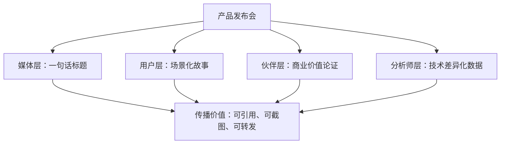
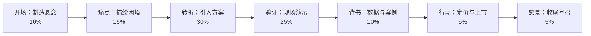

## 场景二：产品发布会

产品发布会是所有演讲场景中综合性最强、技术要求最高的一种。它不是简单的"介绍产品"，而是一场精心编排的**说服工程**——你需要在一场演讲中同时完成传递信息、建立信任、激发欲望、促成行动四个目标。苹果、特斯拉、小米等公司的发布会之所以成为标杆，不是因为产品本身有多惊艳，而是因为它们将产品发布会的"道法术器"做到了极致。

### 深度情境分析

#### 听众构成与心理模型

产品发布会的听众绝非单一群体，而是至少四类角色的**复合听众**，每类人的关注点和决策逻辑截然不同：

| 听众类型 | 核心关注点 | 决策逻辑 | 信息需求深度 | 你在演讲中的角色 |
|----------|-----------|----------|-------------|----------------|
| **媒体记者** | 新闻点、话题性、"金句" | 这个能写成什么标题？ | 表层，需要通俗易懂的结论 | 为他们准备"标题级"表述 |
| **行业KOL/分析师** | 技术差异化、市场格局 | 这个比竞品强在哪？ | 深层，需要数据和逻辑链 | 提供足够的对比数据和逻辑支撑 |
| **潜在商业伙伴** | 商业模式、合作机会 | 我能从中赚到什么？ | 中层，需要商业价值论证 | 展示市场空间和合作可能性 |
| **终端用户/粉丝** | 能解决我的什么问题？ | 用了会怎样？不用会怎样？ | 表层，需要场景化体验 | 用场景演示替代功能罗列 |

**关键洞察**：你不可能让每一类人都满意到100分，但你必须让每一类人都觉得"这场发布会是为我准备的"。这就需要**分层叙事**——同一段内容，表层是故事（给用户），中层是数据（给伙伴），深层是逻辑（给分析师），金句是素材（给媒体）。



#### 发布会类型与策略差异

不同类型的产品发布会，策略完全不同：

**全新品类发布会**（如初代iPhone发布）：重点是**教育市场**，你需要先让听众理解"为什么需要这个东西"，再展示你的产品。70%时间花在痛点和愿景上，30%花在产品上。

**迭代升级发布会**（如iPhone年度更新）：重点是**展示进化**，听众已经有基础认知，你需要回答"这一代比上一代好在哪里"。50%花在新特性上，50%花在体验提升的叙事上。

**功能/补丁发布会**（如软件版本更新）：重点是**解决具体问题**，听众是现有用户，需要直接展示问题修复和体验改进。节奏更快，信息密度更高。

### 全流程作战方案

#### 第一阶段：战略筹备（发布会前4-8周）

**1. 明确核心信息（Message House）**

在写任何一句演讲稿之前，先回答三个问题：

- **一句话核心信息**：如果听众走出会场只记住一句话，你希望是什么？这句话必须满足：通俗到不需要解释 + 有立场到可以引发讨论 + 真实到经得起检验。
- **三个支撑论点**：为核心信息提供逻辑支撑，每个论点都需要有数据或案例背书。
- **一个情感锚点**：这场发布会想让听众感受到什么情绪？自豪？好奇？兴奋？紧迫？

> 示例——某AI办公产品发布会：
> - 核心信息："你的下一个同事，不是人。"
> - 支撑论点：(1) 80%的重复性工作可以被AI接管；(2) 我们的模型在办公场景准确率达到97%；(3) 已有50家企业验证，人效提升3倍。
> - 情感锚点：从疲惫到兴奋——"你值得把时间花在更有价值的事上"。

**2. 听众调研与预期管理**

- 收集目标听众近期关注的行业热点、痛点、争议话题
- 预判媒体可能的提问和报道角度（正面和负面都要准备）
- 在社交媒体上提前释放少量信息，测试反应并校准演讲重点

**3. 演示环境搭建与压力测试**

产品演示是发布会的**最高风险环节**。现场演示失败的案例数不胜数——微软Surface发布时蓝屏、三星Galaxy Fold评测机屏幕碎裂、特斯拉Cybertruck"防弹玻璃"演示失败。

演示准备的铁律：

- **永远准备三套方案**：主方案（现场实时演示）、备选方案（录制好的演示视频）、兜底方案（静态截图+解说）。如果现场演示失败，你必须能在3秒内切换到备选方案，不能让听众感受到任何犹豫。
- **提前在真实场地测试**：网络延迟、投影设备、音响系统、灯光角度——每一个变量都可能导致演示失败。
- **准备"可控的惊喜"**：最好的演示不是完美无缺，而是有一个"看起来有风险但结果出人意料"的时刻，这种张力能带来最强烈的现场反应。

#### 第二阶段：演讲稿撰写

##### 结构框架：问题-解决 + 英雄之旅

产品发布会最有效的结构是将"问题-解决"框架与"英雄之旅"叙事融合：听众是英雄，产品是英雄获得的武器，发布会就是英雄踏上征程的起点。



以下是每个环节的深度拆解：

##### 开场：制造悬念（占总时长10%）

开场的唯一目标是**让听众放下手机，集中注意力**。你只有30秒时间完成这个任务。

**五种高效开场模式：**

| 开场模式 | 适用场景 | 示例 |
|----------|---------|------|
| **历史对比法** | 全新品类，需要建立认知 | "2007年，乔布斯站在这个舞台上，重新定义了手机。今天，我们将重新定义人与AI的关系。"（停顿3秒，等待反应） |
| **数据冲击法** | 痛点明确，需要制造紧迫感 | "在中国，每年有120亿小时被浪费在填写各种表格上。120亿小时——相当于137万个成年人一整年的工作量。今天，我们要把这些时间还给你们。" |
| **故事代入法** | 面向C端用户，需要情感共鸣 | "上个月，我接到一个用户的电话。她是两个孩子的妈妈，也是一个创业者。她说：'我每天凌晨两点才能把当天的报表做完。'各位，这不是个别现象——这是整个行业的常态。今天，我们要改变这个常态。" |
| **颠覆认知法** | 产品有明显差异化优势 | "在座各位可能认为，做一份专业的市场分析报告至少需要3天。接下来我要告诉你们的事实是：只需要30秒。"（停顿，让质疑在空气中弥漫） |
| **现场互动法** | 氛围需要快速升温 | "在座有多少人今天早上用AI写过邮件？请举手……好的，再问一个问题：有多少人觉得AI写的邮件比你自己写的好？（等待反应）——今天发布的产品，会让第二次举手的人数翻倍。" |

**开场的雷区：**
- 不要用"感谢各位百忙之中莅临"开头——这30秒是黄金时间，浪费在客套上等于自杀
- 不要在开场就介绍公司背景——听众不关心你是谁，关心你能给他们什么
- 不要念PPT上的标题——PPT应该在你说话时提供视觉辅助，不是让你当人肉播放器

##### 痛点描绘：建立共鸣（占总时长15%）

痛点环节的目标是让听众产生强烈的"没错，我就是这样"的认同感。好的痛点描述不是泛泛而谈，而是**精确到场景、数据、情绪三层面**。

**三层面痛点描述法：**

第一层——**场景还原**（让听众看到自己）：
> "各位，让我们面对一个现实：你是不是也有过这样的经历——打开邮箱，发现有87封未读邮件，其中60封是抄送，15封是通知，只有12封真正需要你回复。但你需要花40分钟才能把它们筛选出来。"

第二层——**数据量化**（让痛点变得不可回避）：
> "调查显示，中国职场人平均每天花4.2小时在重复性信息处理上：整理邮件、生成报表、安排日程、整理会议纪要。一年下来，这意味着你有107个工作日——整整5个月——花在了AI都能做的事情上。"

第三层——**情绪共鸣**（让痛点变成行动动力）：
> "78%的职场人认为自己的潜力没有被充分发挥。不是因为能力不够，而是因为时间被琐碎事务吞噬了。你不是在工作——你是在当一台人形复印机。"

**注意**：痛点描绘时间不能太长，否则听众会从"共鸣"滑向"沮丧"。痛点铺垫到70%时就要开始暗示"解决方案即将到来"，给听众一个期待的支点。

##### 解决方案：产品登场（占总时长30%）

这是演讲的核心，也是信息密度最高的部分。你不能简单地罗列功能，而要遵循**"价值先行，功能跟上"**的原则。

**功能展示的正确格式：场景→问题→方案→效果**

| 错误示范（功能罗列） | 正确示范（价值叙事） |
|--------------------|--------------------|
| "我们的产品支持智能邮件分类。" | "还记得那87封邮件吗？我们的AI助手在你打开邮箱之前，就已经把12封重要邮件标记出来了，附带每封邮件的一句话摘要和建议回复。" |
| "产品具备语音转文字功能。" | "上个月那位凌晨两点做报表的妈妈，现在只需要对着手机说一句话：'帮我把今天的销售数据整理成周报。'——5秒钟，报表自动生成。她现在每天早一个小时回家陪孩子。" |
| "支持多人协作编辑。" | "你的团队还在用'最终版v3.2修订'这种文件名吗？我们的实时协作让5个人同时编辑一份文档，每个人都能看到其他人的光标在移动，就像大家坐在同一张桌子前。" |

**产品展示的节奏控制**：
- 核心功能不超过3个（人的一次性工作记忆只能处理3-4个信息单元）
- 每个功能展示遵循"先说结果，再说原理"的顺序
- 功能之间的过渡要有逻辑关联，不能是"接下来我们看第二个功能"
- 用"但是"制造转折："这个功能已经很好了——但是，还不够。我们还做了另一件事。"

**技术深度的拿捏**：对媒体和用户，只说"是什么"和"有多好"；对KOL和分析师，在PPT的附录页或备注里放技术细节，可以会后单独交流。永远不要在台上解释模型架构或训练方法——除非你的听众全是工程师。

##### 现场演示：制造"哇"时刻（占总时长25%）

演示环节是发布会的**高潮**，也是最容易翻车的环节。一个成功的演示需要满足三个条件：**可感知的价值**（听众能立刻理解这有多好）、**戏剧性的时刻**（有出人意料的"哇"点）、**流畅的节奏**（不能卡顿、冷场、等待）。

**演示脚本的编写原则**：

每一个演示动作都要有**预设的"哇"点**。不是随便操作给听众看，而是精心设计一个"看起来很难，但产品轻松搞定"的场景。

> **示例——AI文档助手的演示脚本**：
>
> **设置**："现在我打开应用。我是一个销售经理，明天要跟一个新客户开会。我需要准备什么？——通常这需要2个小时。"
>
> **操作**：（对着麦克风说）"帮我准备明天和星辰科技的会议材料。"
>
> **等待**：（5秒内结果生成，PPT上显示倒计时）
>
> **展示**："大家看——它做了什么？第一，从CRM里拉出了星辰科技的背景资料和历史合作记录。第二，分析了他们的财报，标注了三个业务增长点。第三，根据我们的产品线，推荐了三个可以匹配的方案。第四，甚至预测了客户可能会问的五个问题，并给出了建议回答。"
>
> **点睛**："这5秒钟的工作，如果用人来做——需要2个小时。各位，这不是未来。这是我们今天发布的产品。"

**演示的应急方案**：

```mermaid
graph TD
    A[演示开始] --> B{实时演示成功?}
    B -->|是| C[完美执行，展示真实效果]
    B -->|否| D{能在10秒内修复?}
    D -->|是| E[口头过渡，修复后继续]
    D -->|否| F[切换到录屏方案]
    F --> G[自然过渡："让我们看一个已经录制好的完整流程"]
    G --> H[播放视频，保持解说]
    E --> C
    C --> I[演示结束，引出下一个环节]
    H --> I
```

关键原则：**切换到备选方案时不要解释原因**。不要说"不好意思网络出了问题"，而是自然地过渡，好像本来就是这个安排。你的紧张和道歉比演示失败本身更破坏气氛。

##### 数据与案例：建立可信度（占总时长10%）

空口无凭的数据比没有数据更糟糕。每个数据都需要**来源、上下文、对比基准**三要素。

**数据引用的黄金格式**：

> "在为期3个月的内测中，我们邀请了50家企业、共1200名员工参与测试。结果如下：人均日工作时长减少2.3小时，文档处理效率提升340%，员工满意度从62分提升到89分——满分100。"

这个数据为什么有说服力？因为它同时满足了：**样本量**（50家、1200人）、**时间跨度**（3个月）、**具体指标**（2.3小时、340%、62→89）、**可验证性**（内测企业可以被查证）。

**用户故事的选择标准**：
- 选择与目标听众最相似的用户（如果听众是中小企业主，就别用世界500强的案例）
- 故事要有**转变**：使用前的困境 → 使用中的惊喜 → 使用后的改变
- 最好能邀请用户本人到场或播放视频证言——第三方背书比自说自话强10倍

##### 定价与上市信息（占总时长5%）

定价环节看似简单，实则暗藏玄机。定价的**呈现方式**直接影响听众的购买意愿。

**价格锚定技巧**：

> "这个级别的AI办公助手，市场上同类产品的年费通常在5000到8000元。我们今天的定价是——每年1999元。而且，首批1000名注册用户，终身免费。"

这段话做了三件事：**先建立参照系**（5000-8000），**再抛出真实价格**（1999），**最后给出无法拒绝的钩子**（终身免费）。价格在对比之下显得极具吸引力。

**上市信息的明确性**：
- 准确的日期（"即日起"比"近期"有力10倍）
- 明确的渠道（官网、App Store、线下门店）
- 具体的限量信息（"首批1000名"比"限量"更有紧迫感）

##### 收尾：愿景与行动号召（占总时长5%）

收尾的唯一目标是**让听众带着行动冲动离开会场**。

**收尾的三层递进**：

第一层——**重申核心信息**：
> "回到开场的那个问题——每天4.2小时，一年107个工作日。今天，我们把这107天还给你。"

第二层——**上升到愿景**：
> "我们相信，未来不是AI取代人类，而是AI赋能人类。每个人都有权利把时间花在真正重要的事情上——创造、思考、陪伴家人。"

第三层——**明确的行动号召**：
> "即日起，访问我们的官网预约。首批1000名用户获得终身免费使用权。扫码就在大屏幕上——行动吧。"

**收尾的禁忌**：
- 不要在最后突然加新的信息点——这会削弱行动号召的冲击力
- 不要用"谢谢大家"结尾——用行动号召代替感谢
- 不要在Q&A之后再做总结——如果必须有Q&A，把它放在定价和收尾之间，收尾永远是最后一段

### 语言范例库

以下是完整的产品发布会演讲片段示例，覆盖不同环节，可直接改编使用：

**开场——历史对比法**：

> "2007年1月9日，乔布斯穿着黑色高领毛衣走上这个舞台，说了一句改变世界的话：'今天，苹果要重新发明手机。'当时没有人相信——手机就是打电话发短信的东西，有什么好发明的？16年后的今天，你能想象没有智能手机的生活吗？
>
> 今天，我们站在同样的起点上。我们要重新发明的，不是手机——是工作本身。"

**痛点——场景还原法**：

> "各位，我想请大家回忆一下昨天的工作。你到公司打开电脑，第一件事是什么？——查看邮件。好，你有87封未读。你花了20分钟筛选，发现60封不需要回复。然后你打开日历，发现今天有5个会。你开始准备第一个会的材料，花了40分钟。会开了1个小时，产生了一堆待办。你花30分钟整理会议纪要，发给所有参会人。然后你开始准备下一个会的材料……
>
> 各位，这就是我们每天的工作方式。不是在解决问题——是在处理信息。不是在创造价值——是在充当人肉路由器。"

**演示——AI助手现场演示**：

> "好，让我们来看一个真实的场景。我现在是一个产品总监，明天要跟CEO做季度汇报。我需要一份30页的PPT——通常这需要我花一整天。
>
> （打开应用，语音输入）'帮我准备明天跟CEO的季度产品汇报，重点是Q3的用户增长和留存数据。'
>
> （等待8秒）大家看到了什么？它做了四件事：第一，从我们的数据分析平台拉取了Q3的核心指标；第二，自动生成了12页数据图表；第三，对比了Q2和Q3的趋势，标注了三个关键拐点；第四，基于数据给出了Q4的策略建议。
>
> 8秒钟。如果用人来做——一个产品总监加一个数据分析师，至少需要8个小时。这不是效率的提升，这是生产力的重新定义。"

### 常见误区与纠正方法

| 误区 | 为什么是错的 | 正确做法 |
|------|-------------|---------|
| 上来就介绍公司和团队 | 听众不关心你是谁，关心你能给他们什么 | 先建立共鸣（痛点），再引入方案，最后才提到公司 |
| 罗列20个功能 | 人的工作记忆只能处理3-4个信息单元 | 只讲3个核心功能，每个功能讲透场景和价值 |
| 演示时念PPT上的文字 | 听众会先看完PPT再听你说话，信息不同步 | PPT只放视觉元素（图片、数据图表），你负责讲故事 |
| 用专业术语和技术名词 | 90%的听众听不懂也不想听懂 | 用类比和场景替代术语："像给照片加滤镜一样简单" |
| 承诺"革命性""颠覆性" | 空洞的形容词只会降低可信度 | 用具体数据替代形容词："效率提升340%"比"大幅提升"有力 |
| 全程自己讲，没有互动 | 听众注意力在7分钟后开始衰减 | 每7-10分钟设置一个互动点：提问、投票、现场演示 |
| 没有准备演示失败的方案 | 网络故障、服务器宕机随时可能发生 | 准备三套方案：实时演示、录屏、静态截图 |
| Q&A环节现场发挥 | 被问到敏感问题时容易失言 | 提前准备20个可能的问题和标准答案，训练现场应对 |

### 进阶技巧

#### "One More Thing"策略

乔布斯最著名的发布会技巧之一：在发布会尾声看似已经结束时，突然抛出一个额外的惊喜。这个技巧之所以有效，是因为它利用了**峰终定律**——人们对一段经历的记忆主要取决于高峰时刻和结束时刻。"One More Thing"同时占据了这两个位置。

使用要点：
- 惊喜必须足够震撼，配得上这个位置
- 不能是前面已经提过的内容的延伸，必须是全新信息
- 语气要从正式转为轻松："对了，还有一件事……"——好像突然想起来一样

#### 多媒体协同设计

PPT不是演讲稿的视觉版，而是**独立的沟通通道**。你的嘴巴负责讲故事，PPT负责呈现你嘴巴讲不出来的东西——数据图表、产品图片、对比效果图、用户证言视频。

PPT设计原则：
- **一页一个信息**：如果一页PPT需要你解释超过30秒，就拆成两页
- **图片优先于文字**：能用图片说明的，绝不用文字
- **数据用图表**：柱状图比表格直观，折线图比数字直观
- **配色克制**：发布会PPT通常只用2-3种颜色，背景深色（黑或深蓝），文字白色，强调色用品牌色

#### 媒体金句预制

发布会的传播力取决于**有多少话值得被引用**。在撰写演讲稿时，要有意识地"预埋"可供媒体直接引用的金句：

- **对比式金句**："我们不是在做更好的搜索引擎，我们是在做搜索的终结者。"
- **数据式金句**："5秒钟完成8小时的工作——这不是效率提升，这是时间折叠。"
- **愿景式金句**："未来十年，每个知识工作者都会有一个AI搭档。今天我们发布的，就是这个搭档的第一个版本。"
- **挑战式金句**："如果你还在用2015年的工具做2025年的工作，你需要的不是升级——你需要的是重新开始。"

金句的检验标准：**是否能在不加任何上下文的情况下被截图转发**？如果需要上下文才能理解，就不算金句。

### 发布会前的终极检查清单

在发布会开始前48小时，逐项确认：

- [ ] 核心信息能用一句话说清楚，团队所有人都能复述
- [ ] 演示环境在真实场地测试通过（网络、投影、音响、灯光）
- [ ] 三套演示方案准备就绪（实时→录屏→静态截图）
- [ ] PPT每页只有一个信息点，无冗余文字
- [ ] 每个数据都有来源和对比基准
- [ ] 20个可能的Q&A问题已准备标准答案
- [ ] 演讲稿中的金句已高亮，媒体可直接引用
- [ ] 定价信息、上市日期、购买渠道全部确认无误
- [ ] 提前踩台：站位、走动路线、大屏幕视角确认
- [ ] 应急方案已与技术团队对齐（灯光暗场切换、备用电脑、有线网络）
