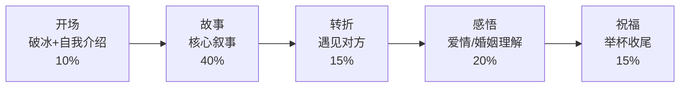

## 场景三：婚礼致辞

婚礼致辞是所有公开演讲场景中最特殊的一种——你不是主角，却要在所有人的注视下说出一段既私密又公开的话。说得好，全场举杯欢笑；说得差，尴尬到空气凝固。这一节将从致辞的本质出发，覆盖不同角色、不同风格、不同婚俗下的完整打法。

### 婚礼致辞的本质

#### 为什么婚礼致辞如此特殊

婚礼致辞和工作汇报、产品发布截然不同。它有三个独特的矛盾张力：

| 矛盾维度 | 一面 | 另一面 |
|-----------|------|--------|
| 公开 vs 私密 | 面对几十上百位听众 | 讲的是两个人之间的真实故事 |
| 庄重 vs 轻松 | 婚礼是人生大事 | 但没人想听一段新闻联播 |
| 表达 vs 克制 | 你有满腔感情 | 但主角不是你，不能喧宾夺主 |

理解这三对矛盾，才能把握婚礼致辞的分寸感——**真诚但不煽情，幽默但不低俗，个性但不失礼**。

#### 婚礼致辞的社会功能

一场婚礼中，致辞承载着三层社会功能：

1. **见证功能**：你是新人故事的见证者，你的讲述让在场所有人"看见"这段感情
2. **过渡功能**：婚礼是从"两个家庭"到"一个新家庭"的仪式转折点，致辞帮宾客完成这个心理过渡
3. **社区功能**：你代表的是新人的某个社交圈（同学、同事、家人），你的致辞让两个家庭的宾客产生连接

理解这些功能，你就明白为什么婚礼致辞不能只讲"我"——它要让在场每一个人都感受到这对新人值得被祝福。

### 致辞角色全解析

不同角色上台致辞，视角、任务和禁忌完全不同。

#### 伴郎/好友致辞

**核心任务**：用第三方视角讲述新郎（或新娘）的成长，让宾客看到新人不为人知的温暖面。

**视角公式**：我认识的他/她 → 他/她遇到对方后的变化 → 我对这段感情的见证与祝福

**语言风格**：轻松幽默为主，结尾收束到温暖感动。比例大约是幽默70%、感动30%。

**关键禁忌**：
- 不要讲前任，一个字都不要提
- 不要讲过于私密的事（醉酒丑事、感情低谷的细节）
- 不要只夸一方而忽略另一方
- 不要变成你自己的个人脱口秀

#### 伴娘/闺蜜致辞

**核心任务**：展现新娘（或新郎）的另一面，往往是更柔软、更真实的那一面。

**视角公式**：闺蜜眼中的她/他 → 甜蜜细节的见证 → 对新郎的"托付"与祝福

**语言风格**：可以温柔细腻，也可以活泼俏皮，取决于你和新人的性格。

**关键禁忌**：
- 不要哭太久，控制在30秒内平复情绪
- 不要暴露新娘的秘密（减肥经历、整容、前任等）
- 不要暗讽或比较

#### 父母致辞

**核心任务**：以养育者的视角讲述孩子的成长，表达对新人的接纳和祝福。

**视角公式**：回忆孩子的成长 → 见证恋爱过程 → 对新家庭成员的欢迎 → 对未来的祝福

**语言风格**：庄重温暖，可以有泪点，但不能崩溃。

**父母致辞的特殊要点**：
- **新郎父母**：要表达对新娘的欢迎和喜爱，让新娘家人放心
- **新娘父母**：要表达对女儿的不舍和对新郎的信任，这是全场最容易催泪的角色
- **单亲家庭**：不需要回避，真诚地讲述自己抚养孩子的经历反而更有力量
- **继父母/养父母**：同样有资格致辞，重点放在共同经历的美好时光

#### 兄弟姐妹致辞

**核心任务**：用最亲近的同辈视角，讲述从小到大的共同记忆，是最容易引起共鸣的角色。

**视角公式**：童年/成长中的趣事 → 你眼中的ta是什么样的人 → ta找到了对的人 → 祝福

**语言风格**：亲切自然，可以"损"但要有分寸，最终要回到真诚。

#### 祖辈/长辈致辞

**核心任务**：用长辈的人生智慧为婚姻送上祝福，往往言简意赅但分量十足。

**特殊注意事项**：
- 时间控制在2分钟以内
- 语速放慢，让所有人听清楚
- 不要讲太长的故事，一个就好
- 用朴素的语言比用华丽的辞藻更有力量

### 情境分析与准备流程

#### 了解婚礼信息

致辞前必须确认以下信息：

□ 婚礼形式（中式/西式/中西合璧/户外/室内）
□ 致辞顺序（你在第几个发言）
□ 你的前后分别是谁（避免内容撞车）
□ 时间限制（问清楚精确到分钟）
□ 是否有音响设备（决定是否需要麦克风技巧）
□ 新人父母的名字和称谓（避免现场叫错）
□ 是否有新人忌讳的话题
□ 新人的恋爱时间线和关键节点

#### 了解听众构成

婚礼听众是所有演讲场景中年龄跨度最大的：

| 听众群体 | 关注点 | 你要注意的 |
|----------|--------|-----------|
| 新人同龄朋友 | 有趣、有共鸣 | 可以用流行梗和年轻人的语言 |
| 双方父母 | 体面、尊重 | 不要讲粗俗笑话 |
| 远房亲戚 | 认识新人 | 需要交代人物关系背景 |
| 同事/领导 | 得体、有分寸 | 不要暴露职场八卦 |
| 小孩/老人 | 听不懂太复杂的内容 | 语言要通俗易懂 |

**策略**：以新人为中心讲故事，让所有群体都能感受到温暖。幽默部分控制在"全年龄段安全"的范围内。

### 结构框架：故事线 + 情感递进

#### 标准五段式框架

| 环节 | 内容 | 时间占比 | 要点 |
|------|------|----------|------|
| 开场破冰 | 简短介绍自己和新人的关系，一个吸引注意力的开头 | 10% | 不要从"大家好我是XX"开始，而是从一个画面或细节切入 |
| 核心故事 | 一个关于新人的温暖或有趣的故事，展现ta的性格特质 | 40% | 故事要具体，有时间、地点、对话、细节 |
| 情感转折 | 遇到对方后的变化，用细节而非概括来展现 | 15% | "从那以后"是最好用的转折词 |
| 主题升华 | 对爱情或婚姻的理解，可以引用但要结合自身感受 | 20% | 不要变成鸡汤文，要有你自己的声音 |
| 祝福收尾 | 对新人的祝愿，邀请全场举杯 | 15% | 祝福要具体，不要只说"百年好合" |

#### 不同角色的框架变体

**伴郎/好友版**：
开场（轻松吐槽）→ 趣事（展现性格）→ 遇见对方（变化）→ 感悟 → 祝福（可以带一个"内部梗"收尾）

**父母版**：
开场（回忆出生/童年）→ 成长片段（2-3个）→ 初次见到对方的感受 → 对新家庭成员的欢迎 → 对未来的嘱托和祝福

**兄弟姐妹版**：
开场（一句话定位关系）→ 童年趣事（引发共鸣）→ 你观察到的ta的变化 → 祝福

### 语言技巧详解

#### 开场的五种方式

**方式一：画面切入法**
> "三年前一个冬天的晚上，我接到李强的电话。电话那头沉默了五秒钟，然后他说了一句话：'我可能恋爱了。'"

**方式二：悬念法**
> "我要告诉你们一个秘密——王芳第一次见李强的时候，给我的评价只有四个字：'还行吧。'但今天她站在了这里，所以各位，永远不要被第一印象骗了。"

**方式三：时间对比法**
> "十年前，李强是一个能把泡面煮糊的人。十年后的今天，他能做出一桌让丈母娘满意的菜。这中间发生了什么？答案就在他旁边。"

**方式四：共同记忆法**
> "在座有没有李强的大学同学？你们还记得他大一军训的样子吗？黑得像块炭，瘦得像根竹竿。看看今天的新郎，简直判若两人。"

**方式五：直抒胸臆法**（适合父母/长辈）
> "站在这个台上，我想起了二十八年前在产房外第一次抱起你的那个下午。"

#### 故事讲述的STAR-R技巧

婚礼故事不是随便讲个段子就行，需要结构化：

- **S（Situation）**：交代背景——"那是在2019年的夏天"
- **T（Tension）**：制造张力——"李强那天紧张得连衬衫扣子都扣错了"
- **A（Action）**：推动行动——"王芳走过去，一个一个帮他重新扣好"
- **R（Result）**：展示结果——"从那天起，李强再也没有自己扣过衬衫扣子"
- **R（Reflection）**：引发感悟——"有人说爱情就是这样，替你做好你做不好的小事"

#### 幽默的三个安全区

婚礼上的幽默必须"有分寸"。以下三个区域是最安全的：

1. **自嘲**："作为伴郎，我今天最大的任务就是确保自己不要比新郎帅太多——虽然这很难。"
2. **夸张**："李强追王芳那阵子，他的手机相册里有300张照片，其中299张是王芳发给他让他'参考'的餐厅。"
3. **反差**："我认识李强十年，从没见他哭过。但求婚那天晚上，他给我打电话说'明哥，我成功了'，声音里全是鼻涕。"

**绝对禁区**：
- 涉及外貌的玩笑（胖/矮/丑）
- 涉及收入/家境的玩笑
- 涉及前任的任何提及
- 涉及生育压力的暗示
- 低俗/荤段子（哪怕新郎私下说可以讲）

#### 情感表达的层次

好的婚礼致辞不是一上来就煽情，而是层层递进：

第一层：轻松愉快 → 让大家放松，建立好感
第二层：温暖共鸣 → 故事触发情感共鸣
第三层：触动泪点 → 一个细节击中内心
第四层：升华祝福 → 从感动转向美好祝愿

**关键技巧**：泪点之后一定要"拉回来"，用一句轻松的话化解过度的感动，让气氛重新温暖起来。

> "……说到这里我有点控制不住了（停顿，平复情绪），但没关系，今天最大的好消息是——李强终于不用再半夜给我发消息问'怎么哄女朋友开心'了。"

### 中式与西式婚礼致辞差异

| 维度 | 中式婚礼 | 西式婚礼 |
|------|----------|----------|
| 时间 | 通常在婚宴中间，宾客边吃边听 | 仪式期间，宾客专注聆听 |
| 氛围 | 热闹、喜庆，可以有互动 | 庄重、浪漫，相对安静 |
| 称谓 | 按辈分称呼，要准确 | 直呼名字，相对随意 |
| 内容 | 可以提到"早生贵子"等祝福 | 避免涉及生育压力 |
| 饮酒 | 致辞后通常要喝酒 | 可以举杯但不一定喝完 |
| 语言 | 可以用方言增加亲切感 | 通常用普通话或英语 |

**中式婚礼特别注意**：
- 要称呼新人父母（"叔叔阿姨"或"伯父伯母"），不能只说"大家"
- 可以用四字成语祝福，但不要堆砌，1-2个就好
- 如果有司仪，提前沟通你的致辞时长和互动环节
- 敬酒环节可能在致辞之后，注意衔接

**西式婚礼特别注意**：
- Best Man/Maid of Honor的致辞通常是全场焦点，准备要更充分
- 可以准备几个"toast点"——在场宾客会在某些时刻举杯呼应
- 致辞时面向新人和宾客，不要只盯着稿子
- 结尾通常是"Ladies and gentlemen, please raise your glasses to..."

### 肢体语言与声音控制

#### 站位与姿态

正确站位：
  ┌─────────────────────┐
  │     主舞台           │
  │  ┌───┐    ┌───┐     │
  │  │新郎│    │新娘│     │
  │  └───┘    └───┘     │
  │       ┌───┐         │
  │       │ 你 │  ←侧身面向宾客，与新人成45°角│
  │       └───┘         │
  └─────────────────────┘

- 不要背对新人，也不要完全背对宾客
- 双手自然下垂或一只手轻握另一只手，不要交叉抱胸
- 不要来回走动，站定就好
- 眼神扫视全场，每说一两句换一个方向

#### 声音控制要点

| 要素 | 技巧 |
|------|------|
| 音量 | 比平时说话大20%，有麦克风也要注意不要贴太近 |
| 语速 | 每分钟160-180字，比演讲慢，比聊天稍快 |
| 停顿 | 故事高潮前停顿1-2秒，让全场屏息；讲完笑点后停顿等笑声 |
| 情绪 | 允许声音带感情，但不要哭到说不出话 |
| 眼神 | 不要全程低头念稿，每讲完一段抬头看新人和宾客 |

#### 情绪管理

婚礼致辞最容易出问题的就是情绪失控。以下是实战策略：

**预防措施**：
- 提前通读全文3遍，标记情绪激动的段落
- 在标记段落准备一个"情绪锚点"——比如握一下口袋里的钥匙、深吸一口气
- 提前彩排时试着哭一次，把最强烈的情绪释放掉

**现场应对**：
- 如果感觉要哭，停顿，深呼吸，喝一口水
- 不要说"抱歉我太激动了"，直接平复继续讲
- 如果真的哭了，没关系——真情流露是最好的致辞，但控制在30秒内平复
- 准备纸巾在口袋里，不要让别人递给你（打断节奏）

### 完整范例集

#### 范例一：伴郎致辞（幽默温暖型）

> 大家好，我是新郎的大学室友张明。认识李强十年了。
>
> 说实话，接到伴郎邀请的时候我挺意外的。因为十年前，李强在我们宿舍的"最不可能结婚"排行榜上，年年稳居第一。不是因为他条件不好，而是因为他对浪漫这件事的理解，实在让人担忧。
>
> 举个例子：大三那年情人节，他说要给当时的 crush 一个惊喜。他买了99朵玫瑰，但他觉得直接送太普通了，于是他把花瓣一片片摘下来铺在女生宿舍楼下。结果被保安大叔追着跑了三条街，最后花没送成，还倒赔了200块保洁费。
>
> 所以当我第一次听他说起王芳，听他认真地分析"她喜欢什么花、什么口味、什么电影"的时候，我就知道——这次是真的。一个愿意为另一个人改变自己笨拙方式的人，那是认真的。
>
> 王芳，我跟你说，你做了正确的选择。李强这个人，笨是笨了点，但他对人好是发自内心的。现在他会做饭了、会收拾房间了、甚至会记住纪念日了——这些全是你的功劳。
>
> 最后，我想说：李强，你终于不用再半夜给我发消息问"怎么哄女朋友开心"了。王芳，欢迎加入我们的兄弟群，以后有什么需要"情报支持"的，随时找我们。
>
> 请大家举杯，祝李强和王芳——执子之手，与子偕老。干杯！

**范例分析**：
- 开场用"最不可能结婚"排行榜制造悬念和笑点
- 用具体故事（情人节花瓣事件）展现性格
- 用对比（笨拙→认真）展现变化
- 结尾既幽默（兄弟群"情报支持"）又温暖（执子之手）

#### 范例二：父母致辞（深情厚重型）

> 各位亲朋好友，大家好。我是新郎李强的父亲。
>
> 二十八年前的一个冬天，我在产房外面等了整整四个小时。护士把一个皱巴巴的小家伙递到我手里的时候，我紧张得浑身发抖。我跟自己说：这个小东西，我要用一辈子去爱他、保护他。
>
> 二十八年后的今天，我站在这里，看着他西装笔挺地牵着另一个人的手，心里的感受很难用语言形容。骄傲是有的，欣慰是有的，但更多的是感谢——感谢王芳，让我儿子从一个只知道打游戏的小伙子，变成了一个有担当、有温度的男人。
>
> 我还记得李强第一次带王芳回家吃饭。那顿饭是我做的，四菜一汤，我觉得发挥得不错。吃完饭王芳主动去洗碗，还把我厨房收拾得比我自己收拾的都干净。我当时就跟老伴说：这个姑娘，认定了。
>
> 今天，我想对王芳说：从今天起，你就是我们家的女儿了。不管你和李强以后遇到什么，家里的门永远为你们敞开，家里的饭桌上永远有你们的位子。
>
> 最后，祝福你们：婚姻不是爱情的终点，而是另一段旅程的起点。愿你们在这段旅程中，互相扶持，彼此成就，把平凡的日子过成想要的样子。
>
> 请大家举杯，祝孩子们百年好合，幸福美满！

**范例分析**：
- 用"产房等待"的回忆开场，直接建立情感连接
- 用"四菜一汤"的小故事展现接纳
- 对新娘说的话"你就是我们家的女儿"是全场最有分量的一句
- 结尾的祝福有哲理但不空洞

#### 范例三：闺蜜致辞（细腻走心型）

> 大家好，我是新娘王芳的闺蜜刘悦，认识她十二年了。
>
> 十二年前，我们第一次见面是在大学宿舍。她拎着一个比她还大的行李箱，满头大汗，嘴里还在说"没事没事我自己能行"。我帮她搬上去之后，她从箱子里掏出来一大袋家乡特产，硬塞给我一半。那一刻我就知道，这个人值得交。
>
> 这十二年，我见过王芳很多面。见过她加班到凌晨两点还在改方案的倔强，见过她失恋时躲在被窝里哭的脆弱，见过她为了给妈妈买生日礼物攒了三个月工资的孝顺。但在我心里，她最好看的样子，是三年前她跟我视频，眼睛亮亮地说："悦悦，我好像遇到对的人了。"
>
> 李强，我今天不叫你新郎，我叫你一声"哥们儿"。我把王芳交给你，不是因为你是完美的，而是因为我看得出来，你在努力成为配得上她的人。这就够了。
>
> 但我也要提醒你：王芳这个人，嘴上说"不用了"的时候，其实心里在说"你再坚持一下我就要了"。这个密码我今天交给你了，以后能不能破解，看你自己的修行。
>
> 最后，祝你们：愿你们的厨房有烟火气，客厅有笑声，卧室有拥抱，余生有彼此。

**范例分析**：
- 用行李箱和特产的故事展现新娘的性格
- "最好看的样子"是细腻的观察，比直接夸更打动人
- "密码交接"的幽默既实用又有趣
- 结尾祝福用具体画面（厨房、客厅、卧室）代替抽象词语

### 常见误区与纠正

| 误区 | 问题 | 纠正方法 |
|------|------|----------|
| 从"大家好我是XX"开始 | 平淡无奇，没有吸引力 | 用画面、悬念或细节切入，自我介绍放在故事中自然带出 |
| 讲太多"我觉得" | 变成说教，不像祝福 | 用故事代替评价，让宾客自己得出结论 |
| 堆砌名言警句 | 空洞，不像你自己的话 | 至多引用一句，且要和你的故事有关联 |
| 只夸一方忽略另一方 | 让另一方尴尬，让另一方的家人不满 | 始终围绕"两个人在一起"的故事 |
| 念稿一字不差 | 缺乏感染力，像在背课文 | 用提纲式卡片，记住关键句，中间用自己的话连接 |
| 时间严重超时 | 影响婚宴节奏，宾客注意力下降 | 提前计时彩排，宁可讲短不要讲长 |
| 开黄腔/荤段子 | 让长辈尴尬，降低婚礼格调 | 保持幽默但干净，宁可不够好笑也不要冒犯 |
| 说完就溜 | 显得不够重视 | 留到婚宴结束，和新人合影，表达你的陪伴 |

### 突发情况应对

#### 情况一：现场太吵，没人听

**应对**：不要提高音量大喊，而是停下来，微笑着等3-5秒。安静会传染，前排的人会示意后面安静。如果还是不行，可以加一句："看来我的魅力还不够，那我尽量讲短一点。"用自嘲化解尴尬。

#### 情况二：你讲到一半哭了

**应对**：不要道歉，停顿，深吸一口气，低头看一眼稿子上的关键词，继续。全场会给你掌声鼓励。这是真情流露，不是失误。

#### 情况三：你讲的笑话没人笑

**应对**：不要慌，不要解释"这是一个笑话"。直接继续讲下一段。如果实在尴尬，可以自嘲一句："看来我今天的幽默感跟新郎的酒量一样不太行。"

#### 情况四：音响/麦克风出问题

**应对**：不要干等技术人员修。如果可以，走近新人和前排宾客，用自然的音量继续讲。如果完全不能讲，微笑说"看来技术想让我长话短说"，等修好再继续。

#### 情况五：你忘词了

**应对**：不要说"我忘了"。停顿一下，看一下新人，说一句真诚的话："看到你们今天这个样子，我什么话都不想说了，只想说——真好。"然后直接跳到祝福段。

### 准备清单与时间线

#### 致辞前两周

□ 确认你的致辞角色和时长
□ 了解婚礼形式和流程
□ 收集素材：回忆你们的共同经历，问新人要几张旧照片
□ 确认新人的忌讳话题
□ 确认婚礼现场是否有音响设备

#### 致辞前一周

□ 写好初稿，大声朗读一遍计时
□ 删减到目标时长（通常3-5分钟，约500-800字）
□ 找一个信任的人听你读一遍，收集反馈
□ 标记情绪激动的段落，准备应对策略
□ 准备提纲卡片（不要带完整稿子）

#### 致辞前三天

□ 完整彩排3遍，每遍计时
□ 确认着装（正式但不抢新人风头）
□ 准备纸巾放在口袋里
□ 如果需要喝酒，提前想好喝多少
□ 和司仪确认上台时间和流程

#### 致辞当天

□ 提前到场，熟悉环境和麦克风位置
□ 再默读一遍提纲
□ 致辞前少喝酒，保持清醒
□ 深呼吸三次再上台
□ 致辞结束后和新人拥抱/合影

### 致辞自检清单

写完致辞后，用以下清单自检：

□ 有没有提到新人双方？（不能只夸一方）
□ 有没有至少一个具体的故事？（不是泛泛而谈）
□ 时长是否控制在3-5分钟？（超过就删）
□ 有没有涉及禁忌话题？（前任/外貌/收入/生育压力）
□ 幽默部分是否"全年龄段安全"？
□ 有没有真实的自己在里面？（不是在写公关稿）
□ 结尾有没有一个明确的"举杯"信号？
□ 高潮段落有没有预设情绪管理策略？
□ 是否提前彩排过至少3遍？
□ 是否知道现场的应急预案？（麦克风故障、忘词等）

### 进阶：从"能讲"到"讲得好"

#### 制造"记忆点"

一场婚礼可能有5-6个人致辞，宾客很难记住每个人说了什么。你需要一个"记忆点"——一个让宾客在婚礼结束后还能提起的瞬间。

**记忆点公式**：一个意外的细节 + 一个真诚的情感

比如：
- "李强有一个习惯，每次和王芳视频挂电话前都会说'注意安全'，哪怕王芳只是在家里。"（意外细节：在家里也说注意安全）
- "后来我问他为什么，他说'因为她就是我的安全'。"（真诚情感）

#### 与新人的"暗号"

如果你和新人有只有你们懂的"暗号"——一个手势、一句暗语、一个梗——在致辞中自然地用出来。新人会瞬间被击中，而其他人虽然不懂，但会被新人的反应感动。

#### 结尾的仪式感

好的致辞结尾要有仪式感，让全场自然地进入"举杯"的状态：

普通结尾："祝你们幸福，干杯！"
↓
有仪式感的结尾：
"最后，我想请在座的每一位，
举起你手中的杯——
不管里面装的是酒、是饮料、还是白水，
让我们一起，用这一杯，
祝福这对从今天开始共同书写人生的人。
李强，王芳——
愿你们的故事，从今天起，只有更精彩的篇章。
干杯！"

这个结尾给了宾客一个明确的"动作指令"（举杯），一个包容的细节（不管你喝什么），和一个有画面感的祝福（共同书写人生），这就是仪式感。

***

婚礼致辞的本质，不是表演，而是**见证**。你不是在台上"讲话"，你是在替新人向世界说："我见证过他们的爱情，它是真实的、值得被祝福的。"带着这个心态上台，你的每一句话都会是真诚的——而真诚，永远是婚礼致辞中最有力量的东西。
