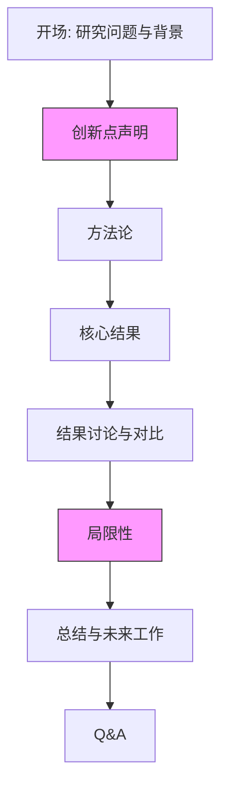
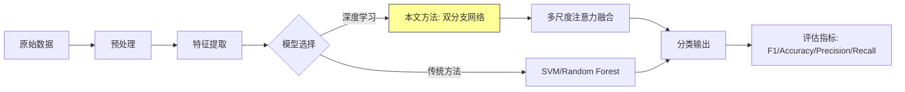

## 场景四：课堂演讲/学术报告

课堂演讲与学术报告是知识传播和学术交流的核心形式。无论是大学课堂上的课题展示、毕业论文答辩，还是国际学术会议上的论文报告，本质上都是**将研究过程和成果转化为听众可理解、可吸收的口头表达**。这个场景的独特之处在于：听众具备专业背景，对逻辑严密性和证据可靠性有极高要求，同时又容易因内容过于技术化而走神。如何在"学术严谨"与"表达生动"之间找到平衡，是本章要解决的核心问题。

### 场景细分与差异

课堂演讲和学术报告虽然常被并列提及，但不同子场景的规则、听众期待和表达策略差异显著：

| 维度 | 课堂课题展示 | 本科毕业答辩 | 硕博学位答辩 | 学术会议报告 |
|------|------------|------------|------------|------------|
| 时间 | 10-15分钟 | 10-15分钟 | 20-40分钟 | 10-20分钟 |
| 听众 | 同学+任课老师 | 3-5位评审老师 | 5-7位专家+同行 | 领域研究者 |
| 核心目标 | 展示学习成果 | 证明学术能力 | 贡献新知识 | 交流+建立合作 |
| 评判标准 | 内容完整性、逻辑性 | 规范性、工作量 | 创新性、学术贡献 | 新颖性、启发性 |
| 提问难度 | 较温和 | 中等 | 严格且深入 | 专业聚焦 |
| 紧张程度 | 中 | 高 | 很高 | 高 |

理解这些差异至关重要。课堂展示重在"讲清楚"，学位答辩重在"讲透彻"，学术会议重在"讲出价值"。用同一种方式应对所有场景，必然导致效果打折。

### 情境深度分析

**听众画像与期待**

课堂和学术场景的听众有几个鲜明特征：

- **专业知识储备高**：他们不需要你解释基础概念，反而期待你展示对领域的深入理解
- **批判性思维强**：会本能地审视你的逻辑链条、研究方法和数据解读
- **注意力曲线特殊**：前3分钟高度集中，中间容易走神（尤其是方法论部分），讨论环节再次集中
- **对"包装"敏感**：过于花哨的表达反而会引起怀疑，认为你在掩盖内容不足

**核心挑战**

1. **信息密度与可吸收性的矛盾**：研究内容往往庞杂，但时间有限，必须学会取舍
2. **专业性与可读性的矛盾**：术语太多听众疲劳，术语太少显得不专业
3. **展示成果与承认局限的矛盾**：过度自信显得傲慢，过度谦虚削弱贡献
4. **预设回答与灵活应对的矛盾**：Q&A环节无法完全预测，需要即兴能力

### 演讲结构：IMRAD及变体

学术报告最经典的结构是IMRAD——Introduction（引言）、Methods（方法）、Results（结果）、And Discussion（讨论）。但实际使用时需要根据场景调整。

#### 标准IMRAD结构

| 环节 | 核心内容 | 时间占比 | 关键动作 |
|------|---------|---------|---------|
| 引言 | 研究背景、问题、为什么重要 | 15-20% | 建立紧迫感，明确研究缺口 |
| 方法 | 研究设计、数据来源、分析方法 | 15-20% | 证明方法的合理性和可靠性 |
| 结果 | 核心发现，数据呈现 | 30-35% | 突出关键数据，可视化展示 |
| 讨论 | 结果的意义、与已有研究的对比 | 15-20% | 解释"所以呢"，连接大图景 |
| 总结 | 结论、局限、未来方向 | 5-10% | 一句话记忆点，开放讨论 |

**为什么结果占比最大？** 因为听众最想知道"你发现了什么"。很多演讲者犯的错误是在背景和方法上花了太多时间，到了结果部分时间不够，只能草草带过。这就像一部电影花了80%时间铺垫，高潮只有几分钟。

#### 课堂展示的简化结构

课堂展示通常时间更短，听众背景更杂，建议采用**问题驱动结构**：

1. **问题是什么**（1-2分钟）：用一个具体场景或数据引入
2. **为什么重要**（1-2分钟）：这个问题的影响范围和紧迫性
3. **我们怎么做的**（2-3分钟）：方法概述，不过度展开
4. **发现了什么**（3-5分钟）：核心发现，图表说话
5. **意味着什么**（1-2分钟）：结论和启示

#### 答辩场景的增强结构

学位答辩需要在标准IMRAD基础上增加两个关键部分：

- **贡献声明**（穿插在引言末尾）：明确说出"本文的创新点是……"，让评审从一开始就带着这个框架听
- **局限性讨论**（放在讨论部分）：主动承认局限比被评审指出来好得多，展示学术诚信

### 开场设计：三秒定生死

学术演讲的开场不同于商业演讲，不需要夸张的"钩子"，但需要快速建立**学术相关性**——让听众在30秒内明白"这个研究和我的领域有什么关系"。

#### 开场三要素

1. **领域定位**：一句话说清你研究的大领域
2. **问题聚焦**：从大领域收窄到你的具体问题
3. **价值预告**：为什么听众应该关心这个问题

#### 开场范例对比

**范例一：课堂展示——社交媒体研究**

> "各位老师、同学好。今天我要分享的是关于社交媒体使用方式与大学生心理健康关系的研究。（领域定位）大家都知道社交媒体对心理健康有影响，但过去的研究主要关注'用多久'，很少区分'怎么用'。（问题聚焦）我们的研究将使用方式分为主动和被动两种，发现了截然不同的影响模式——这对高校心理健康教育有直接的指导意义。（价值预告）"

**范例二：学术会议——机器学习论文**

> "各位同行好。我是来自XX大学的XXX，今天报告的题目是'基于图神经网络的蛋白质功能预测方法'。（领域定位）蛋白质功能预测是计算生物学的核心问题之一，现有方法在处理蛋白质相互作用网络的拓扑信息时存在信息损失。（问题聚焦）我们提出了一种新的图注意力机制，在三个基准数据集上取得了SOTA结果，准确率平均提升4.7%。（价值预告，含具体数据）"

**范例三：硕士答辩**

> "尊敬的各位评审老师好。我的论文题目是'基于深度学习的遥感图像变化检测方法研究'。变化检测是遥感领域的基础任务，对城市规划、灾害评估等应用至关重要。现有深度学习方法在多尺度特征融合和边界精度方面仍有不足。本文提出了融合多尺度注意力的双分支网络结构，在LEVIR-CD数据集上F1分数达到0.923，较最优基线提升3.1个百分点。下面我从研究背景、方法设计、实验结果和总结展望四个方面进行汇报。"

**反面范例（常见错误）：**

> "各位老师好，今天我汇报的题目是……嗯，这个研究是关于……其实也没什么特别的，就是做了一些实验……" ❌ 自我贬低，浪费开场黄金时间

> "首先感谢老师给我这次机会，感谢同学们来听……" ❌ 客套话过多，30秒内没有进入正题

### 方法论呈现：证明你做对了

方法论部分是学术演讲中最容易变得枯燥的环节，但它也是建立听众信任的关键。如果方法不可信，后面的结果再好也没用。

#### 呈现原则

1. **说清选择的理由**：不要只说"我们用了X方法"，要说"我们选择X方法是因为……"
2. **类比降低理解门槛**：用听众熟悉的概念解释复杂方法
3. **可视化流程**：用流程图代替文字描述
4. **突出创新点**：你的方法和别人的方法区别在哪里

#### 方法论流程图示例

#### 常见的方法论陷阱

| 陷阱 | 表现 | 纠正方式 |
|------|------|---------|
| 堆砌术语 | 用了大量缩写和专有名词，听众跟不上 | 首次出现时给出全称和一句解释 |
| 跳过数据来源 | 直接讲方法，没交代数据从哪来、多少样本 | 先用一张表展示数据概况 |
| 过度展开细节 | 把论文里的数学公式全放上去 | 只保留核心公式，其余放supplementary |
| 忽略对比基线 | 没说"和什么比" | 明确列出对比方法，并简述选择原因 |

### 结果呈现：让数据说话

结果部分是整个演讲的核心，也是最容易出错的地方。常见问题不是数据不好，而是**展示方式让好数据失去了冲击力**。

#### 数据可视化原则

**图表选择指南：**

| 数据类型 | 推荐图表 | 避免使用 |
|---------|---------|---------|
| 趋势变化 | 折线图 | 饼图（不适合展示趋势） |
| 数值对比 | 柱状图/条形图 | 3D图表（扭曲感知） |
| 占比分布 | 饼图/堆叠柱状图 | 饼图超过5个分类 |
| 相关性 | 散点图+回归线 | 只展示相关系数数字 |
| 多维对比 | 雷达图/热力图 | 过于复杂的表格 |

**关键数据突出技巧：**

- 用**颜色对比**标记关键数据（如红色标注最优结果）
- 用**箭头或标注框**指向图表中的关键趋势
- 先给**结论**，再展示数据，而不是让听众自己从图表中猜
- 关键数字要**念出来**，不要只指一下图表

#### 结果呈现范例

**好的呈现方式：**

> "请大家看这张图。（指向图表）横轴是被动使用社交媒体的时间，纵轴是焦虑量表得分。可以清楚地看到一条正向趋势线——被动使用时间每增加1小时，焦虑水平上升12%，p值小于0.001。但有趣的是，当我们看主动使用的情况时，趋势完全相反——（切换到下一张图）主动使用每增加1小时，社会支持感提升8%。这说明问题不在于社交媒体本身，而在于使用方式。"

**差的呈现方式：**

> "这张图展示了我们的实验结果，大家可以自己看……嗯，基本上结果还行吧，效果不错。" ❌ 没有引导，没有数据支撑，没有解读

#### 学术演讲PPT设计要点

| 要素 | 规范 | 反面案例 |
|------|------|---------|
| 字体大小 | 标题≥32pt，正文≥24pt，注释≥18pt | 用12pt放一大段文字 |
| 每页信息量 | 一个核心观点，不超过3个要点 | 一页放6个图表+大段说明 |
| 配色 | 白底深字或深底浅字，重点用对比色 | 五颜六色的渐变背景 |
| 图表 | 矢量图，坐标轴标签清晰 | 截图模糊，坐标轴看不清 |
| 动画 | 仅用于逐步展示复杂内容 | 每页都有飞入/旋转动画 |
| 页码 | 右下角显示，方便提问时定位 | 没有页码，听众无法定位 |
| 参考文献 | 最后一页列出核心引用 | PPT里一个引用都没有 |

**一个实用的PPT检查清单：**

1. 投影到大屏幕上能否看清所有文字？（在家时把PPT缩小到25%查看）
2. 每张幻灯片能否在10秒内理解核心信息？
3. 图表是否有标题、坐标轴标签和单位？
4. 公式是否有文字解释？（非公式导向的演讲中）
5. 是否有页码？（方便Q&A时快速定位）
6. 整体配色是否一致？（不超过3种主色）

### 语言与表达技巧

#### 学术语言的平衡术

学术演讲需要在"严谨"和"易懂"之间找到平衡点。以下是具体的技巧：

**过渡句模板（让结构更清晰）：**

- 引言→方法："明确了研究问题后，接下来介绍我们的研究设计。"
- 方法→结果："基于上述方法，我们得到了以下核心发现。"
- 结果→讨论："这些结果意味着什么？让我从三个层面来解读。"
- 讨论→总结："总结一下今天报告的核心贡献……"

**学术表达的口语化转换：**

| 书面学术用语 | 演讲口语化表达 |
|-------------|--------------|
| "本研究旨在探讨……" | "我们的研究想要回答一个问题：……" |
| "实验结果表明……" | "数据显示了一个有趣的趋势：……" |
| "与既有研究一致" | "这和之前XX团队的发现一致" |
| "存在显著正相关" | "两者之间有明显的正向关系" |
| "鉴于上述分析" | "基于这些发现，我们认为……" |

**注意：口语化不等于不专业。** 术语照常用，只是句式从书面语转向口语。

#### 声音控制

学术演讲中声音控制的常见问题：

- **语速过快**：紧张时语速会加快，尤其是方法论部分。提醒自己：方法论部分放慢到平时语速的80%
- **音量下降**：说到不确定的内容时音量会变小，显得不自信。保持一致的音量
- **语调平铺**：全程一个语调会让听众昏昏欲睡。在关键数据和结论处提高语调，制造"重点感"
- **口头禅**："嗯""然后""就是说"——录一段自己练习的音频，数一下口头禅频率

**节奏控制的黄金法则：**

在每个关键结论之后，**停顿2-3秒**。这个停顿的作用是：
1. 给听众消化的时间
2. 强调这句话的重要性
3. 给自己一个呼吸和调整的机会

### Q&A环节：危机与机遇并存

Q&A环节是学术演讲中最具挑战性的部分，也是最能展示学术素养的部分。很多演讲者前面表现很好，却在Q&A环节翻车。

#### Q&A的底层逻辑

评审/听众提问的动机通常分为四类：

| 提问类型 | 动机 | 应对策略 |
|---------|------|---------|
| 求知型 | 真的没听懂，想搞清楚 | 认真重新解释，用更简单的语言 |
| 验证型 | 想确认自己的理解是否正确 | 先肯定对方的理解，再补充 |
| 建设型 | 提出改进建议或补充视角 | 感谢建议，讨论可行性 |
| 质疑型 | 对方法或结论有不同意见 | 承认局限，用数据回应 |

#### Q&A的六条实战法则

**1. 听完整个问题再回答**

不要打断提问者，不要在对方说到一半时就开始想答案。听完后可以停顿1-2秒组织语言。

**2. 复述问题（尤其是大场合）**

> "您问的是我们的方法在小样本数据集上是否仍然有效，对吗？"

这样做有两个好处：确保你理解正确；让全场听众都听到了问题（有时只有前排能听清提问者的声音）。

**3. 不知道就说不知道**

> "这是一个很好的问题。目前我们的研究没有涵盖这个方面，但您的问题指出了一个非常有价值的未来研究方向。"

承认不知道远比胡编乱造强。评审能一眼看穿编造的答案，而且会因此对你的其他回答也产生怀疑。

**4. 用数据回应质疑**

> "关于这个方法的选择，我们在消融实验中对比了三种方案，结果是A方案的F1分数比B高了2.3%，比C高了4.1%，所以我们选择了A。"

有数据支撑的回应比"我觉得A更好"有力一百倍。

**5. 把尖锐问题转化为讨论机会**

> "您提出的这个角度确实是我们没有考虑到的。如果从您说的XX理论框架来看，结果可能会有所不同。这确实是一个值得深入探讨的方向。"

不卑不亢，既承认对方观点的价值，又暗示这是学术讨论的正常现象。

**6. 准备一个"万能回答"**

对于完全预料之外的问题：

> "感谢您提出这个问题。这超出了本次研究的范围，但确实是一个重要的相关议题。如果后续有机会，我会认真考虑将这个方向纳入研究计划。"

#### 答辩场景的特殊Q&A策略

学位答辩的Q&A比普通学术报告更严格。额外注意事项：

- **论文细节**：评审可能翻到某一页问"这个数据怎么来的"——对自己论文的每张表格、每个图表都要能脱口而出
- **方法论深度**：评审会追问"为什么不用X方法""你的方法和Y方法有什么区别"
- **创新点**：准备好用一句话概括你的创新贡献
- **工作量**：答辩评审可能会问"你在这个项目上花了多长时间"来评估工作量

**答辩前的模拟练习清单：**

1. 请同学扮演评审，随机提问10个问题
2. 练习用30秒内回答任何一个关于论文的问题
3. 准备3个你最怕被问到的问题，写好答案反复练习
4. 准备一份"论文快速索引"——每张图表在第几页，方便翻找

### 紧张管理：学术场景的特殊性

学术演讲中的紧张不同于一般公众演讲。一般的紧张来源是"怕丢面子"，而学术演讲的紧张来源更多是**"怕暴露无知"**。

#### 认知重构

- **评审不是敌人**：他们的工作是帮你提升研究质量，不是刁难你
- **不完美是正常的**：没有哪篇论文是完美的，承认局限是学术素养的体现
- **你是这个话题的专家**：在你研究的这个具体问题上，你花了几个月甚至几年时间，你比在场任何人都了解细节

#### 实用减压技巧

| 时间节点 | 技巧 | 原理 |
|---------|------|------|
| 演讲前一天 | 完整走一遍流程，计时 | 用确定性对抗不确定性 |
| 演讲前30分钟 | 深呼吸4-7-8法（吸4秒、屏7秒、呼8秒） | 激活副交感神经，降低心率 |
| 上台前 | 握拳再松开，重复3次 | 释放肌肉紧张 |
| 演讲中忘词 | 停顿，看一眼PPT，继续 | 停顿比乱说好得多 |
| Q&A被问住 | "让我想一下"（停顿3秒） | 给大脑争取处理时间 |

### 完整案例：课堂课题展示

以下是一个完整课堂展示的全流程示例，主题为"社交媒体使用与大学生心理健康"。

#### 演讲稿全文

**[第1页：标题页]**

> "各位老师、同学好。我是XXX，今天要分享的课题是'社交媒体使用方式与大学生心理健康的关系研究'。"

**[第2页：问题引入]**

> "先看一组数据：2024年中国大学生平均每天使用社交媒体3.2小时。如果按四年大学算，总计超过4600小时——相当于192天。（停顿）这么长的时间，对我们的心理健康到底有什么影响？是好的还是坏的？"

**[第3页：文献缺口]**

> "过去的研究给出了矛盾的结论：有的说社交媒体有害，有的说无害。我们发现问题出在测量方式上——绝大多数研究只关注'用多久'，忽略了'怎么用'。（展示文献对比表格）我们把使用方式分为主动使用——发布内容、和朋友互动；和被动使用——浏览、点赞、社会比较。这是一个被严重忽略的维度。"

**[第4-5页：方法]**

> "我们招募了486名在校大学生，使用经验取样法——每天3次，连续14天，记录社交媒体使用方式和时长，同时填写简版心理健康量表。（展示流程图）数据收集完成后，使用多层次线性模型进行分析，控制了性别、年级、人格特质等变量。"

**[第6-8页：结果]**

> "核心发现有三个。（指向第一张图表）第一，被动使用社交媒体的时间每增加1小时，焦虑水平上升12%，这个关系在控制所有变量后依然显著。第二，（切换图表）主动使用社交媒体的时间每增加1小时，社会支持感提升8%，但对焦虑没有显著影响。第三，（展示交互效应图）两种使用方式存在显著的交互效应——即使是大量使用社交媒体的人，如果以主动使用为主，焦虑水平并不高。"

**[第9页：讨论]**

> "这意味着什么？不是社交媒体本身有害，而是使用方式决定了影响。被动浏览引发社会比较，社会比较导致焦虑——这个心理机制在我们的中介分析中得到了验证。这也解释了为什么过去的研究结果矛盾：有的研究把所有社交媒体使用混为一谈，掩盖了主动和被动使用的差异。"

**[第10页：实践意义与局限]**

> "对高校心理健康教育的启示：不应该简单劝学生少用社交媒体，而应该引导他们更积极地使用。当然，我们的研究也有局限：样本来自单一高校，使用自报测量可能存在偏差，未来可以结合屏幕时间追踪数据进行验证。"

**[第11页：致谢+Q&A]**

> "总结一句话：与其限制社交媒体使用，不如教会学生怎么用。以上是我的汇报，请各位老师同学批评指正。"

### 常见误区与纠正

| 误区 | 为什么错误 | 正确做法 |
|------|-----------|---------|
| 逐字读PPT上的文字 | PPT是视觉辅助，不是讲稿；读文字会让听众觉得你准备不足 | PPT只放关键词和图表，详细内容靠口头讲述 |
| 方法论部分放大量公式 | 除非是方法导向的会议，否则多数听众不关心具体推导 | 放核心公式，用文字解释直觉，细节放补充材料 |
| 回避研究局限 | 评审一定会问，回避显得不诚实或不自知 | 主动提出局限，展示学术成熟度 |
| 结果部分只说好的 | 选择性报告会让评审质疑你的分析是否完整 | 报告所有相关结果，包括不显著的 |
| 没有时间观念 | 超时是学术演讲的大忌，会议主席会直接打断 | 反复排练并计时，留出2分钟缓冲 |
| PPT最后没有参考文献 | 学术规范要求，缺少会显得不严谨 | 至少列出5-10篇核心参考文献 |
| Q&A时争论 | 即使评审说错了，争论也是输 | 先表示感谢，再温和地用数据回应 |

### 进阶：从"能讲"到"讲得好"

#### 学术叙事技巧

顶级学者的学术报告往往不是罗列事实，而是讲一个**研究故事**：

1. **设置悬念**："我们最初假设X会是最重要的因素，但结果出乎意料……"
2. **制造转折**："当我们排除了所有常规解释后，发现真正的原因是……"
3. **建立共鸣**："我相信在座各位都有过这样的经历——刷了半小时短视频后感到空虚……"
4. **留下记忆点**：整个演讲结束时，听众应该能用一句话复述你的核心发现

#### 从学术报告到学术影响力

高水平的学术演讲不仅仅是展示研究，更是建立学术网络和影响力的机会：

- **会后交流**：准备名片或联系方式二维码，在演讲结束后主动和感兴趣的听众交流
- **论文预印本**：如果研究已有预印本，可以在最后一页放链接或二维码
- **合作邀请**：在讨论部分可以主动提出"如果有人对这个方向感兴趣，欢迎交流"
- **社交媒体传播**：用一句话概括研究发现，方便听众在社交媒体上转发

### 工具与资源

| 工具 | 用途 | 推荐理由 |
|------|------|---------|
| Beamer/LaTeX | 学术PPT制作 | 公式排版专业，风格统一 |
| reveal.js | 网页版演示 | 开源免费，支持代码高亮 |
| Miro/FigJam | 协作白板 | 适合工作坊式的学术讨论 |
| Timer+ | 计时 | 演讲排练计时，支持震动提醒 |
| Otter.ai | 实时转录 | Q&A环节实时记录提问内容 |
| Zotero | 文献管理 | 确保引用准确，自动生成参考文献 |
| Excalidraw | 快速绘图 | 方法论流程图、概念框架图 |

### 自检清单

演讲前用这份清单逐项检查：

- [ ] 开场30秒内是否说清了研究问题和价值？
- [ ] 方法论部分是否有"为什么选这个方法"的解释？
- [ ] 核心结果是否用了可视化图表？关键数字是否念出来了？
- [ ] 讨论部分是否回答了"所以呢"这个问题？
- [ ] PPT字体是否够大（标题≥32pt，正文≥24pt）？
- [ ] 是否计时排练过至少2遍？是否在规定时间内？
- [ ] 是否准备了5个最可能被问到的问题及答案？
- [ ] 是否主动提到了研究局限？
- [ ] 参考文献是否在最后一页列出？
- [ ] 是否有清晰的"一句话记忆点"供听众带走？
