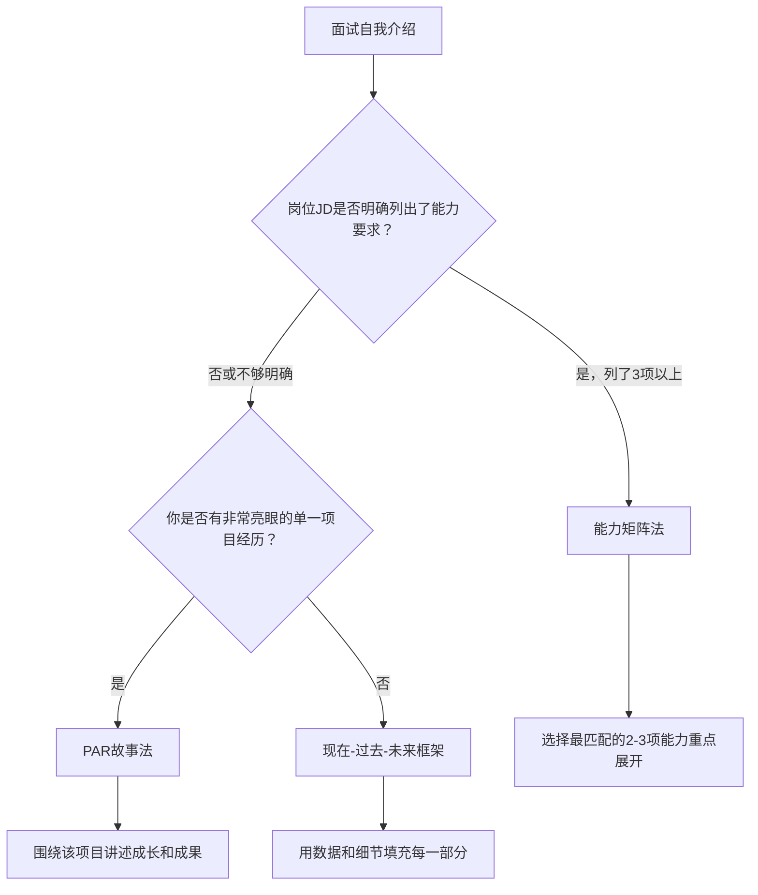
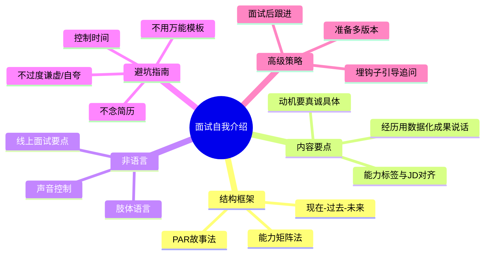

## 场景五：面试自我介绍

面试自我介绍是求职过程中第一个、也是最关键的展示窗口。研究表明，面试官在前90秒内就会形成对候选人的初步判断，而自我介绍往往是这段黄金时间的唯一内容。一个出色的自我介绍不是简历的口头复述，而是一次精心设计的"个人品牌发布会"——它要在极短时间内回答面试官心中的三个核心问题：你能做什么？你做过什么？你为什么来这里？

### 情境分析

#### 场景特征

| 维度 | 具体描述 |
|------|----------|
| 场景 | 求职面试开场环节，面试官请你"简单介绍一下自己" |
| 时间 | 通常1-3分钟，部分结构化面试可能压缩到60秒 |
| 听众 | HR（关注文化匹配）、部门负责人（关注专业能力）、高管（关注战略视野） |
| 目的 | 建立专业形象、展示岗位匹配度、引导面试后续方向 |
| 风险 | 说得太泛等于没说，说得太杂抓不住重点，说得太短浪费机会，说得太长令人不耐 |

#### 面试官的真实心理

理解面试官的决策心理，才能精准投喂信息：

- **首因效应（Primacy Effect）**：面试官对你的第一印象会影响后续所有评价的基调。自我介绍的质量直接决定了面试官是"带着好感找证据"还是"带着怀疑挑毛病"。
- **光环效应（Halo Effect）**：一个亮点会让面试官自动脑补你在其他方面也很优秀。所以与其面面俱到，不如在一两个点上做到极致印象。
- **确认偏差（Confirmation Bias）**：面试官会在你开口后不自觉地寻找证据来验证自己的初始判断。你的自我介绍其实在"设定"面试官寻找什么证据。
- **认知负荷**：面试官一天可能面试5-10个人，信息过载时会自动过滤。结构清晰、有记忆锚点的介绍才能被记住。

### 核心框架：三种经典结构

#### 框架一：现在-过去-未来（WPF框架）

这是最通用、最安全的结构，适用于绝大多数场景。

| 环节 | 内容 | 时间占比 | 核心任务 |
|------|------|----------|----------|
| 现在（Present） | 当前身份、核心能力标签 | 25-30% | 快速建立认知坐标 |
| 过去（Past） | 与岗位相关的经历和成就 | 45-50% | 用事实证明能力 |
| 未来（Future） | 为什么选择这家公司/岗位 | 20-25% | 展示动机和诚意 |

**适用场景**：有相关工作经验的求职者、跨行业但同职能的转岗者。

#### 框架二：PAR故事法（Problem-Action-Result）

用一个完整的故事串联所有信息，更具感染力。

结构拆解：
P - Problem（问题）：我在什么场景下遇到了什么挑战
A - Action（行动）：我采取了什么关键行动
R - Result（结果）：取得了什么可量化的成果

**适用场景**：需要展示解决问题能力的岗位（产品经理、项目经理、咨询顾问），或经历比较集中在一个领域的候选人。

#### 框架三：能力矩阵法

先抛出岗位需要的3项核心能力，然后逐一用经历证明。

结构拆解：
开场：我认为这个岗位需要三项核心能力——A、B、C
第一项能力 A：用一段经历证明
第二项能力 B：用一段经历证明
第三项能力 C：用一段经历证明
收尾：这三项能力的结合让我确信能胜任这个岗位

**适用场景**：岗位要求非常明确的场景（JD写得很详细）、技术岗位、需要证明多项能力的高级职位。

#### 如何选择框架

### 逐段拆解与实操技巧

#### 第一段：开场（10-15秒）

开场的目标是用一句话让面试官知道"你是谁"，建立认知坐标。

**公式**：姓名 + 当前身份/状态 + 一句话能力标签

**好的开场**：
- "您好，我是张伟，目前在字节跳动担任高级后端工程师，专注高并发系统架构设计，有6年千万级用户系统的实战经验。"
- "面试官好，我是陈思雨，北京大学计算机硕士应届生，研究方向是大语言模型的推理优化，在ACL和EMNLP上各有一篇一作论文。"
- "您好，我是王浩然，做了8年市场营销，最近3年专注B2B SaaS领域的增长黑客，帮两家公司实现了从0到1的ARR突破。"

**差的开场**：
- "我叫XXX，来自XXX大学XXX专业。"（没有信息量）
- "我是一个热爱学习、积极向上的人。"（自评没有说服力）
- "我之前在好几家公司工作过。"（没有记忆点）

**技巧**：能力标签要和岗位JD的关键词对齐。如果JD写的是"负责用户增长"，你的标签就应该是"用户增长"而不是笼统的"互联网运营"。

#### 第二段：核心经历（60-90秒）

这是自我介绍的主体，需要用具体经历证明你的能力。

**原则：选2-3个最匹配的经历，每个经历用"情境-行动-数据结果"的结构展开。**

**数据化表达的模板**：

| 模糊表达 | 数据化表达 |
|----------|------------|
| 提升了用户体验 | 用户NPS评分从32提升到67，差评率下降58% |
| 负责过大型项目 | 主导了涉及12个部门、47人协作的ERP系统迁移项目 |
| 带过团队 | 管理15人的产品团队，年度离职率控制在5%以下 |
| 有数据分析能力 | 搭建了覆盖全链路的数据看板，日均处理2亿条行为数据 |
| 业绩不错 | 连续3个季度超额完成KPI，最高达成率147% |

**经历选择的优先级**：
1. 与目标岗位最直接相关的经历（匹配度最高）
2. 最能体现你核心竞争力的经历（差异化最大）
3. 最近1-2年的经历（时效性最强）
4. 有明确数据成果的经历（可信度最高）

**注意**：如果面试官说"简单介绍一下"，控制在2个经历；如果说"详细聊聊"，可以展开3个。观察面试官的肢体语言——如果他开始看表或翻简历，立刻收尾。

#### 第三段：动机与收尾（15-30秒）

收尾要回答"为什么是这家公司"和"为什么是这个岗位"。

**三要素**：
1. **公司认同**：说明你了解并认同公司的产品/文化/战略（证明做过功课）
2. **岗位匹配**：说明你的能力如何匹配岗位需求（证明能胜任）
3. **价值承诺**：说明你能为公司带来什么具体价值（证明值得投资）

**好的收尾**：
> "我注意到贵公司正在推进AI+教育的战略方向，我在上一家公司刚好做过类似的AI辅助学习产品，从0到1做到了50万月活。我相信这段经验能帮助贵公司的智能教育产品线更快落地，同时也非常期待能在更大的平台上把这件事做得更好。"

**差的收尾**：
- "我觉得贵公司很好，我想来学习。"（你是来工作的，不是来上学的）
- "我没有什么特别的原因，就是想换个工作。"（没有动机等于没有诚意）
- "贵公司工资高、离我家近。"（虽然可能是真话，但不是面试该说的）

### 不同人群的定制策略

#### 应届生/零经验求职者

应届生没有工作经历，但可以用以下素材替代：

**可用素材**：
- 实习经历（即使是不相关的实习，也可以提炼通用能力）
- 课程项目/毕业设计（如果足够复杂且与岗位相关）
- 竞赛经历（ACM、数学建模、创业大赛等）
- 社团/学生会管理经历（体现组织协调能力）
- 自学项目/开源贡献（体现主动学习能力）

**应届生自我介绍范例**（应聘数据分析岗）：
> "面试官好，我是刘小明，北京大学统计学专业应届硕士。我对数据驱动决策有强烈的热情，在校期间通过三个项目积累了扎实的分析能力。
>
> 第一个项目是为校就业指导中心做的毕业生去向分析，我用Python清洗了3届共12000条数据，用聚类分析发现了5类典型职业路径，这个报告被学校采纳作为就业指导的参考材料。第二个是在美团实习期间，我独立搭建了一个商家流失预警模型，AUC达到0.83，帮助运营团队提前识别高风险商家，实习期间模型覆盖了3000多个商家。第三个是我作为队长参加了全国统计建模大赛，获得了全国二等奖。
>
> 我选择贵公司的数据分析岗位，是因为我非常认同贵公司用数据说话的文化，同时我在用户行为分析方面的项目经验能够快速上手业务。希望能有机会加入团队。"

#### 转行者/跨行业求职者

转行者的核心挑战是"为什么你能做好一个你没做过的工作"。

**策略**：强调可迁移能力 + 展示转型准备 + 用新领域的成果证明

**可迁移能力对照表**：

| 原行业 | 可迁移能力 | 目标行业 |
|--------|-----------|----------|
| 教师 | 表达能力、课程设计、用户理解 | 培训、产品、运营 |
| 销售 | 客户洞察、谈判、目标管理 | 商务拓展、客户成功、咨询 |
| 工程师 | 逻辑思维、问题拆解、系统设计 | 产品经理、技术管理、创业 |
| 记者 | 信息收集、写作、快速学习 | 公关、内容运营、市场 |

**转行者自我介绍范例**（从教师转行产品经理）：
> "您好，我是赵雪梅，过去5年在公立学校担任高中数学教师，现在转型做教育科技方向的产品经理。
>
> 这个转型不是一时冲动。在教学过程中，我发现很多学生的学习痛点其实可以通过技术手段更好地解决。去年我主动发起了一个项目——和学校信息中心合作，设计了一个错题分析系统的需求文档，从学生错题数据中提取知识点薄弱环节，自动生成个性化练习。这个系统上线后，试点班级的平均成绩提升了8分。在这个过程中，我完整走了一遍需求调研、原型设计、开发跟进、数据验证的流程。
>
> 同时，我系统学习了产品方法论，考取了NPDP认证，在人人都是产品经理社区发表了12篇教育科技方向的文章，累计阅读量超过50万。
>
> 我相信，一个既懂教育又懂产品的复合型人才，正是贵公司教育产品团队所需要的。"

#### 高级职位/管理层求职者

高级职位的自我介绍需要展示战略视野和领导力，而不仅仅是执行能力。

**策略**：
- 开场用"管理规模"建立分量感（团队大小、业务体量、营收规模）
- 经历部分重点讲"决策"而非"执行"——你做了什么判断，为什么这么判断
- 收尾讲"战略价值"——你能为公司解决什么层面的问题

**高管自我介绍范例**（应聘VP of Engineering）：
> "我是孙鹏程，过去12年一直在做技术团队管理，最近4年在某独角兽公司担任技术VP，管理80人的工程团队，支撑年营收15亿的业务体量。
>
> 我在这家公司做了三件比较关键的事。第一，完成了技术架构从单体到微服务的迁移，系统可用性从99.5%提升到99.99%，这个过程没有停服一秒钟。第二，搭建了完整的技术人才培养体系，3年内培养出5个技术总监，团队年度离职率从28%降到9%。第三，主导了公司的出海技术方案，在东南亚市场零基础搭建了完整的技术基础设施，6个月内支撑了200万海外用户。
>
> 我了解到贵公司正处于全球化扩张的关键阶段，面临跨区域技术架构和国际化团队管理的挑战。这恰好是我最有经验的领域。我希望能把之前踩过的坑和积累的方法论带到贵公司，帮助技术团队更平稳地度过这个阶段。"

### 非语言表达技巧

面试自我介绍不仅仅是"说什么"，更是"怎么说"。非语言信息在第一印象中的权重高达55%（梅拉比安法则）。

#### 肢体语言

| 要素 | 正确做法 | 常见错误 |
|------|----------|----------|
| 坐姿 | 坐直，微微前倾表示投入 | 靠在椅背上显得松散，前倾太多显得压迫 |
| 眼神 | 与面试官保持60-70%的目光接触 | 全程低头背稿，或眼神飘忽不定 |
| 手势 | 自然的辅助手势，强调关键数据时可以用手比划 | 双手交叉抱胸（防御姿态），频繁摸脸/头发（紧张信号） |
| 微笑 | 开场和收尾时自然微笑 | 全程严肃像在做检讨，或全程假笑 |

#### 声音控制

| 要素 | 建议 | 练习方法 |
|------|------|----------|
| 语速 | 每分钟180-220字（中文） | 用手机录音，数一分钟内说了多少字 |
| 音量 | 适中偏亮，确保对方听得清楚但不刺耳 | 在3米外请朋友确认是否听得清 |
| 停顿 | 关键数据前后停顿0.5秒，段落之间停顿1秒 | 在稿子上标注停顿符号，刻意练习 |
| 语调 | 平铺直叙会催眠，重点词适当提高音调 | 用不同的情绪读同一段话，找到最佳版本 |
| 口头禅 | 避免"然后"、"就是"、"那个"、"嗯" | 录音回放，统计口头禅出现次数 |

#### 线上面试的特殊注意事项

远程面试（Zoom/腾讯会议/飞书）已经成为常态，需要注意：

- **摄像头位置**：与眼睛平齐或略高，避免俯拍或仰拍。用几本书垫高笔记本电脑。
- **光线**：面朝窗户或灯光，确保面部光线均匀。逆光会让你变成黑影。
- **背景**：简洁干净，纯色墙面最佳。避免书架上放奇怪的东西、避免虚拟背景（容易闪烁，显得不真诚）。
- **眼神接触**：看摄像头而不是屏幕上的面试官。这是最难的习惯——可以在摄像头旁边贴一个笑脸贴纸提醒自己。
- **网络**：提前测试网络，准备手机热点作为备用方案。网络卡顿会严重影响面试官的体验。
- **屏幕共享**：如果可能需要展示作品集，提前准备好PPT或作品链接，确保分享屏幕时只展示相关内容。

### 常见误区与纠正

#### 误区一：把自我介绍变成简历朗读

**错误示例**：
> "我2018年毕业于XX大学，然后去了A公司做了2年，然后去了B公司做了3年，期间负责了XXX项目，然后我觉得……"

**问题**：面试官手里有你的简历，他不需要你再念一遍。这种介绍没有任何增量信息。

**纠正**：简历是"你做了什么"，自我介绍是"你为什么能做好"。选择简历中最有亮点的1-2段经历，用简历上没有的细节和数据展开。

#### 误区二：过度谦虚或过度自夸

**过度谦虚**：
> "我觉得我的经验可能不太够，但我学习能力很强，希望贵公司能给我一个机会……"

**过度自夸**：
> "我在上一家公司是最核心的员工，没有我那个项目肯定做不成，领导都特别依赖我……"

**纠正**：用客观事实代替主观评价。不要说"我很厉害"，说"这个项目的指标提升了40%"。让数据替你说话，让面试官自己得出"这个人很厉害"的结论。

#### 误区三：没有针对性，万能模板走天下

**错误**：用同一份自我介绍面所有公司。

**纠正**：每次面试前，至少花1小时研究：
- 公司官网的"关于我们"和最新新闻
- 岗位JD中反复出现的关键词
- 面试官的LinkedIn/脉脉背景（如果知道面试官是谁）
- 该公司所在行业的最新趋势

把这些研究融入自我介绍，让面试官感受到"这个人是专门为这个岗位来的"。

#### 误区四：时间失控

**错误**：说了5分钟还没收尾，或者30秒就说完了。

**纠正**：
- 提前写稿并计时朗读，控制在要求时间的80-90%（留出面试官反应的时间）
- 准备1分钟版、2分钟版、3分钟版三个版本
- 如果面试官打断你或看起来不耐烦，立刻跳到收尾

#### 误区五：只讲硬技能，忽略软实力

**错误**：只说技术栈、项目经历，完全不提沟通协作、团队管理、抗压能力。

**纠正**：在讲述经历时，自然地嵌入软实力。比如"我协调了3个部门的资源"体现了跨部门沟通能力，"在上线前一周需求变更，我48小时内重新调整了方案"体现了抗压和应变能力。

#### 误区六：结尾说"以上就是我的自我介绍"

**错误**：用一句干巴巴的"以上就是我的自我介绍，谢谢"结尾。

**纠正**：结尾是最后的印象，应该用一句有力的价值陈述或热情表态收尾。比如"我很期待能和团队一起把这个产品做到行业第一"或者"我相信我的经验能帮助团队在这个方向上少走弯路"。

### 面试前的准备清单

#### 信息准备

- [ ] 研究目标公司的产品、业务模式、竞争对手
- [ ] 阅读公司最新新闻、融资动态、战略方向
- [ ] 分析岗位JD，提取关键词和核心能力要求
- [ ] 了解面试官背景（如能提前知道）
- [ ] 准备1-2个"为什么选择这家公司"的真诚理由

#### 内容准备

- [ ] 写出自我介绍完整稿（书面稿，不是脑子里想想）
- [ ] 准备1分钟版、2分钟版、3分钟版
- [ ] 每段经历都准备好数据化成果
- [ ] 预判面试官可能追问的问题，准备好回答
- [ ] 准备2-3个要问面试官的问题（面试最后通常会问"你有什么想问的"）

#### 练习准备

- [ ] 至少完整朗读5遍以上，直到自然流畅
- [ ] 录音/录像回放，检查语速、口头禅、表情
- [ ] 找朋友模拟面试，获取反馈
- [ ] 在镜子前练习，观察自己的表情和手势
- [ ] 准备好面试当天的着装（提前一天检查是否干净整洁）

#### 技术准备（线上面试）

- [ ] 测试摄像头和麦克风
- [ ] 测试网络稳定性
- [ ] 关闭电脑上的通知和弹窗
- [ ] 准备好备用设备（手机/另一台电脑）
- [ ] 提前10分钟进入会议室

### 高级技巧：引导面试走向

一个被低估的策略是：**通过自我介绍的内容设计，引导面试官问你准备好的问题**。

**原理**：面试官通常会根据你的自我介绍追问细节。如果你在介绍中埋下了"钩子"，就可以把面试的主动权掌握在自己手里。

**示例**：
> "在上一家公司，我用了一个非常规的方法解决了用户留存问题……"

面试官几乎一定会问："什么非常规的方法？"——而这正是你准备好的精彩故事。

> "我最近在研究AIGC在教育场景的应用，有一些有趣的发现……"

面试官会好奇你发现了什么——你可以展开讲你的思考深度。

**注意**：钩子必须是你真正擅长且有准备的领域。如果你放了钩子但被追问时答不上来，效果会适得其反。

### 完整范例库

#### 范例一：产品经理（2分钟版）

> "面试官您好，我是李明，目前在ABC公司担任高级产品经理，负责企业级SaaS产品线，管理一个8人的产品团队。
>
> 在过去五年的产品管理经历中，我有几个比较有代表性的成果。第一个是2023年主导了公司核心产品的2.0版本升级，通过400+用户深度访谈重新设计了核心工作流，上线后用户活跃度提升了40%，续费率从78%提升到91%。第二个是我从零搭建了一套数据驱动的产品决策体系，包括AB测试平台、用户行为分析看板和需求优先级评分模型，将产品迭代周期从3个月缩短到2周，团队决策效率提升了5倍。
>
> 我选择贵公司有两个原因：一是我非常认同贵公司'让技术服务于人'的产品理念，和我一直坚持的'以用户为中心'的产品观高度契合；二是贵公司正在从B端向B+C融合转型，这正是我最有经验和热情的方向。我之前做的2.0升级本质上就是一次从B端思维向用户思维的转型，我相信这段经验能帮助贵公司的产品战略更顺利地推进。"

#### 范例二：Java后端工程师（90秒版）

> "您好，我是张伟，6年Java后端开发经验，最近3年在一家日活千万的社交平台担任核心服务负责人。
>
> 我的技术专长集中在高并发和分布式系统两个方向。在上一家公司，我主导了消息系统的重构，把原来基于MySQL轮询的方案替换为Kafka+Redis的架构，消息延迟从平均3秒降到200毫秒，同时服务器成本降低了60%。另一个是我在去年设计并落地了公司的服务网格方案，用Istio替换了原有的硬编码服务发现，部署效率提升了3倍，故障定位时间从小时级降到分钟级。
>
> 我了解到贵公司的核心系统正在经历从单体到微服务的迁移，而且用户规模在快速增长。这和我之前经历过的阶段非常相似，我知道哪些坑必须提前规避。希望能加入团队，把之前积累的架构经验用在更大的平台上。"

#### 范例三：应届生-运营岗（90秒版）

> "面试官好，我是陈思雨，复旦大学新闻学院传播学硕士，研究方向是社交媒体用户行为。
>
> 虽然我还没有正式工作经验，但通过三个实践项目积累了运营相关的实战能力。第一个是在小红书运营了一个校园美食账号，从0做到2.3万粉丝，产出了6篇10万+笔记，这个过程让我完整理解了内容运营的选题、创作、投放、复盘全流程。第二个是在字节跳动实习期间，负责一个活动运营项目的落地执行，从方案策划到物料制作到数据回收全程参与，活动期间DAU提升了12%。第三个是我的毕业论文研究了Z世代用户的社群参与动机，访谈了60个用户，形成了完整的用户画像和运营策略建议。
>
> 我选择贵公司的用户运营岗位，是因为我既有学术研究的理论基础，又有从0到1做增长的实战经验，能够快速上手社群运营和用户增长的工作。"

### 面试后的跟进

自我介绍的影响力不仅限于面试当场。面试后的跟进可以强化你的专业形象：

- **面试当天**：发一封简短的感谢邮件，重申你对岗位的热情，可以补充面试中没有展开的一个亮点。
- **面试后1-2天**：如果面试中提到了某个话题你没有答好，可以在邮件中补充一个更完善的回答（展示你的学习能力和认真态度）。
- **一周后未收到回复**：礼貌地发一封跟进邮件询问进展。

**感谢邮件模板**：
> 主题：感谢今天的交流 - [姓名] - [岗位名称]
>
> [面试官姓名]您好，
>
> 感谢您今天抽出时间和我交流[岗位名称]的职位。通过今天的对话，我对贵公司[具体了解到了什么]有了更深入的了解，也更加坚定了加入团队的想法。
>
> 面试中我们聊到了[某个话题]，回来后我又仔细思考了一下，[补充一个有深度的观点或方案]。
>
> 再次感谢您的时间，期待后续的交流。
>
> 祝好，
> [姓名]

### 本节要点回顾

记住：面试自我介绍不是临场发挥，而是精心准备后的自然呈现。每一次面试都是一次不可重复的展示机会，值得你花足够的时间去打磨。最好的自我介绍，是让面试官在你说完后迫不及待地想继续聊下去。
