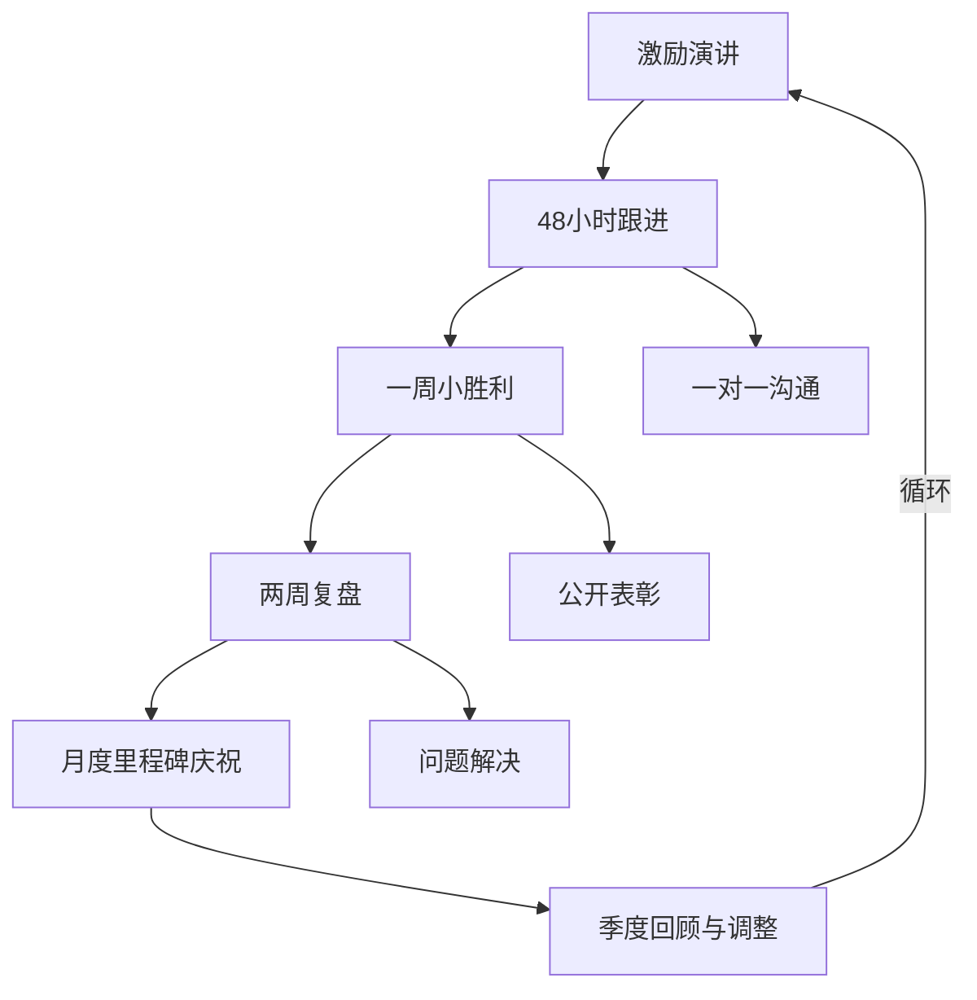

## 场景六：团队激励

团队激励演讲是领导者最核心的沟通能力之一。当团队面临危机、低谷或重大变革时，一次精准有力的激励讲话，能够将涣散的人心重新凝聚，将消极的情绪转化为积极的行动力。这不是简单的"打鸡血"，而是一门融合心理学、叙事学和领导力的综合艺术。

### 为什么团队激励演讲如此重要

团队激励演讲的重要性远超多数管理者的认知。哈佛商学院的研究表明，团队绩效的30%-40%差异可以归因于领导者的情绪传递和激励能力。在危机时刻，这个比例更高。

从神经科学角度看，人类大脑中的镜像神经元系统会自动模仿和共鸣他人的情绪状态。当领导者展现出坚定、乐观但又真实的情绪基调时，团队成员的神经回路会同步调整。这就是为什么一个焦虑的领导会传染整个团队，而一个沉稳的领导能让慌乱的团队恢复冷静。

从组织行为学角度看，团队激励演讲解决的是三个根本性问题：

| 问题层级 | 具体表现 | 激励演讲的作用 |
|----------|----------|----------------|
| 认知层 | 不知道为什么要做 | 重建意义感和使命感 |
| 情感层 | 不想做、害怕做、不信任 | 疏导情绪、重建信任 |
| 行为层 | 不知道怎么做、优先级混乱 | 明确行动路径和分工 |

如果只解决其中一两个层面，激励效果就会大打折扣。空洞的口号只触及情感层，却没有认知和行为支撑；冰冷的任务分配只触及行为层，却忽略了人的情感需求。

### 激励心理学：理论基础

#### 马斯洛需求层次与激励策略

理解团队成员处于哪个需求层次，决定了激励的切入点：

                 ┌─────────────┐
                 │  自我实现    │  ← 赋予挑战性使命、描绘成长蓝图
                 ├─────────────┤
                 │  尊重需求    │  ← 认可贡献、强调团队价值
                 ├─────────────┤
                 │  社交需求    │  ← 强化归属感、团结协作
                 ├─────────────┤
                 │  安全需求    │  ← 明确保障、消除不确定性
                 ├─────────────┤
                 │  生理需求    │  ← 确保基本工作条件和补偿
                 └─────────────┘

当团队处于危机中时，成员的需求层次通常会下降——原本追求自我实现的人可能退回到安全需求层面。有效的激励演讲需要先稳定底层需求（"你的工作是安全的，补偿会到位"），再逐层向上激发。

#### 赫茨伯格双因素理论

赫茨伯格将影响工作动力的因素分为两类：

**保健因素**（缺失会导致不满，但存在不会带来满意）：
- 薪资待遇、工作环境、公司政策、人际关系

**激励因素**（存在会带来满足，缺失不会直接导致不满）：
- 成就感、认可、工作本身的意义、成长机会、责任

团队激励演讲的核心任务是激活激励因素，同时承认并承诺解决保健因素的短板。例如，先承认"这段时间的高强度工作确实不合理"（保健因素），再转向"但正是这种挑战让我们每个人都获得了常规工作中无法获得的成长"（激励因素）。

#### 自我决定理论（SDT）

心理学家Deci和Ryan提出的自我决定理论指出，人类有三个基本心理需求：

1. **自主性**（Autonomy）：感到自己的行为是自由选择的
2. **胜任感**（Competence）：感到自己有能力完成任务
3. **归属感**（Relatedness）：感到与他人有联结和归属

有效的激励演讲必须同时满足这三个需求：
- 自主性："这是我们共同的选择，没有人强迫我们"
- 胜任感："我们具备成功的条件，过去的经验已经证明了这一点"
- 归属感："我们是一个整体，谁也不是孤军奋战"

### 激励演讲的五种典型场景

不同场景需要不同的激励策略。以下是五种最常见的团队激励场景及其核心差异：

| 场景 | 团队情绪 | 核心挑战 | 激励重点 |
|------|----------|----------|----------|
| 项目危机 | 焦虑、疲惫 | 缺乏信心 | 承认困难 + 重塑信心 + 明确行动 |
| 业绩压力 | 沮丧、自我怀疑 | 恐惧失败 | 分解目标 + 小胜利策略 + 激发斗志 |
| 组织变革 | 不安、抵触、迷茫 | 抗拒变化 | 解释原因 + 展望未来 + 承诺支持 |
| 长期低谷 | 倦怠、麻木、流失 | 意义感丧失 | 重新连接使命感 + 小胜利 + 关怀 |
| 重大项目启动 | 期待但不确定 | 方向不清 | 传递愿景 + 赋予角色 + 激发兴奋 |

#### 场景一：项目危机

这是最考验领导力的场景。团队正在经历高强度工作，项目进展不顺利，可能面临失败的风险。

**核心策略：共情-现实-愿景-行动四步框架**

**第一步：共情（20%）**

共情不是同情，不是居高临下地说"我理解你们"，而是具体地描述你观察到的事实，证明你真正看到了每个人的付出。

错误示范："我知道大家都很辛苦。"——空洞，缺乏温度。

正确示范："小王连续三天工作到凌晨，小李为了赶进度推掉了家人的生日聚会，设计组的同事这周改了七个版本的方案。这些我都看在眼里，记在心里。"

关键技巧：
- 列举具体的人和事，而不是泛泛而谈
- 用"我看到""我注意到"而非"我知道"
- 不要急于转折，给情绪留出缓冲空间
- 如果可能，现场回应个别成员的情绪

**第二步：现实（20%）**

诚实面对困难，不粉饰太平。团队成员都是成年人，他们比你更清楚实际情况。如果你说假话，信任会瞬间崩塌。

关键原则：
- 用数据说话，不用模糊描述
- 承认已知的问题，不回避
- 区分"已知事实"和"我们的判断"
- 不要把问题归咎于个人或外部

示范："实话实说：我们确实遇到了困难。客户的需求变更了两次，核心算法的性能还差15%，距离交付还有10天。这是客观现实，我不会跟大家说'形势一片大好'。"

**第三步：愿景与意义（25%）**

这是整个演讲的情感高峰。你需要回答一个根本问题："我们为什么要坚持？"

答案不是"因为老板要求"或"因为合同签了"，而是连接到更深层的意义——团队的使命、个人的成长、行业的价值。

技巧：
- 回到项目启动时的初心
- 连接到团队的长期愿景
- 展示成功后的具体画面
- 唤起团队的荣誉感和使命感

示范："我想请大家回到最初：我们为什么要接这个项目？不是为了KPI，是因为它有机会改变整个部门的命运。如果成功了，我们不仅拿下了行业标杆客户，更证明了我们团队有能力承接最复杂的项目。这个项目的意义，远超过项目本身。"

**第四步：信心与行动（35%）**

愿景之后，必须迅速落地到具体可执行的行动计划。光有热血没有路径，会让人更加焦虑。

行动计划的SMART原则：
- **S**pecific：明确谁做什么
- **M**easurable：有可衡量的里程碑
- **A**chievable：目标切实可达
- **R**elevant：与核心问题直接相关
- **T**ime-bound：有明确的截止时间

示范："接下来三天的计划：第一，明天上午我和客户做最终需求确认，锁定范围，不再变更；第二，技术瓶颈我已协调架构组的张工周三加入；第三，本周的加班补偿我已和HR确认，双倍计算，下周一开始安排轮休。"

完整框架对比：

空洞的激励（常见错误）           有效的激励（推荐做法）
─────────────────────────       ─────────────────────────
"大家加油！"                     → 具体承认每个人的努力
"一定能成功的！"                 → 诚实分析困难和机会
"领导很看好我们！"               → 连接深层意义和使命
"冲就完了！"                     → 给出分步骤行动计划

#### 场景二：业绩压力

当团队面临KPI压力、季度目标未达标时，成员容易陷入自我怀疑和焦虑。此时的激励需要"拆解恐惧、制造小胜利"。

**核心策略：拆解-聚焦-庆祝**

**拆解大目标**

将看似不可能的年度/季度目标拆解为可管理的小目标，降低心理压力。

示范："本季度的目标是增长30%，看起来很难。但拆开来看，只要我们每周多成交2个客户，每次拜访多争取5%的转化率，这个目标就能达成。这不是天方夜谭，这是可执行的数学题。"

**聚焦可控因素**

团队容易被不可控因素（市场环境、竞争对手、政策变化）消耗精力。激励演讲需要帮助他们把注意力拉回到可控范围。

示范："市场环境确实不好，但我们能控制什么？能控制每天的拜访量，能控制方案的质量，能控制客户关系的深度。与其焦虑不可控的，不如全力做到可控的。"

**制造小胜利**

心理学研究表明，"小胜利"（small wins）能够显著提升自我效能感，形成正向循环。

示范："我建议我们设一个'周冠军'：每周五下午公布本周最佳战绩，不管大小。第一个成交的新客户、第一次成功约见决策者、第一个客户转介绍——都值得被看见和庆祝。"

#### 场景三：组织变革

裁员、重组、业务转型、新领导上任——组织变革会引发最深层的不安全感。此时的激励需要"解释-共情-承诺"。

**解释变革的必要性**

人们抗拒变革的根本原因是"不理解为什么要变"。先用清晰的逻辑解释变革的必要性。

示范："我来和大家聊聊为什么要做这次调整。过去半年，我们的客户留存率下降了12%，核心原因是我们的服务响应速度跟不上市场节奏。现有的组织架构已经无法支撑我们需要的速度，所以调整不是为了裁员，而是为了让组织跑得更快。"

**承认不确定性**

不要假装你有所有答案。承认"有些事我也不知道"反而能建立信任。

示范："坦率地说，有些具体细节我还没有完全确定，比如新架构下的具体分工。但有三点我可以承诺：第一，不会有无预警的裁员；第二，每个人都会有一对一的沟通机会；第三，过渡期内，现有业务不会中断。"

**描绘变革后的新可能**

将变革从"失去"重新框架为"获得"。

示范："这次调整不是让我们变得更少，而是让我们有机会做更大的事。新的架构会让更多人有独当一面的机会，会有更多跨部门协作的项目，会有更清晰的晋升通道。"

#### 场景四：长期低谷

长期业绩不佳、项目反复受挫、核心成员流失——这种场景下，团队已经对"打鸡血"产生了免疫力。

**核心策略：真实-关怀-小胜利**

**彻底的真实**

此时任何包装过的语言都会被识破。唯一有效的策略是极端的真实。

示范："我不想再给大家画饼了。过去半年确实很难，三个项目折了两个，骨干走了两个，我也一度怀疑这个方向到底对不对。"

**重新连接使命感**

在最黑暗的时刻，帮助团队找到"为什么要继续"的深层理由。

示范："但我反复想了一个问题：我们当初为什么选这条路？是因为我们相信这件事有价值。这个判断没有变，变的是市场环境。而市场会变回来，但如果我们放弃了，就真的输了。"

**小胜利策略**

此时不适合设宏大目标，而应该设计"触手可及的小胜利"，用成功来修复信心。

示范："下周的目标很简单：找到一个真正有意向的潜在客户，不需要成交，只需要让他表现出兴趣。做到了，我们就知道方向是对的。"

#### 场景五：重大项目启动

项目启动时的激励目标是"点燃热情、明确方向、赋予角色"。

**核心策略：愿景-角色-节奏**

**传递愿景画面**

不是读PPT，而是用生动的画面让团队"看到"成功后的场景。

示范："想象一下：六个月后，我们站在客户现场，看着我们开发的系统在他们的大屏幕上运行，几千名员工在使用我们创造的工具。那个画面，就是我们要一起创造的。"

**赋予每个人角色**

每个人都需要知道"在这个故事里，我扮演什么角色"。

示范："前端组是这个项目的门面，用户的第一印象靠你们；后端组是骨架，系统的稳定性和性能全系于你们；测试组是最后一道防线，质量由你们把关。每个角色都不可替代。"

**设定启动节奏**

项目启动的前两周是团队形成期（Forming），需要更多结构化引导。

示范："第一周我们做三件事：技术方案评审、接口协议对齐、环境搭建。第二周进入开发冲刺。每天早上15分钟站会，每周五下午复盘。我会全程参与第一个迭代，确保大家不会卡在任何地方。"

### 激励演讲的结构模型

除了"共情-现实-愿景-行动"四步框架外，还有几种经过验证的结构模型：

#### 变革曲线模型

库伯勒-罗斯变革曲线可以帮助你判断团队目前处于哪个阶段，从而调整激励策略：

| 阶段 | 团队表现 | 激励策略 |
|------|----------|----------|
| 冲击 | 惊讶、困惑 | 先稳定情绪，提供基本信息 |
| 否认 | "不会影响到我" | 温和但诚实地说明现实 |
| 愤怒 | 抱怨、指责 | 允许发泄，不要压制 |
| 讨价还价 | "如果...也许可以..." | 引导聚焦可控因素 |
| 沮丧 | 士气低落、效率下降 | 展示小胜利，注入希望 |
| 接受 | 开始适应新状态 | 赋予新角色，激发新动力 |

#### 峰终定律框架

诺贝尔奖得主丹尼尔·卡尼曼提出的"峰终定律"指出，人们对一段体验的记忆取决于两个时刻：情绪最强烈的时刻（峰）和结束时刻（终）。

应用到激励演讲中：
- **峰值**：放在演讲的中后段，安排最能触动情感的内容（个人故事、团队成就回顾）
- **终值**：演讲的结尾必须是清晰、有力、令人振奋的，不要以模糊的"大家加油"收尾

#### 英雄之旅框架

将团队正在经历的困难重新框架为"英雄之旅"叙事：

普通世界 → 冒险召唤 → 拒绝召唤 → 遇见导师
    → 跨越第一道门槛 → 试炼、盟友和敌人
    → 接近最深的洞穴 → 严峻的考验
    → 获得奖赏 → 返回的路 → 复活 → 携万灵药归来

示范："我们从舒适区出发（普通世界），接到这个不可能的任务（冒险召唤），一开始我也怀疑能不能做到（拒绝召唤）。但我们有最好的团队（盟友），经历了无数困难（试炼），现在我们正站在最后的关卡前（严峻的考验）。只要再坚持一下，我们就将创造属于我们的传奇（奖赏）。"

### 语言技巧与表达策略

#### 词汇选择

激励演讲中，词汇的选择直接影响情绪传递效果：

| 避免使用 | 推荐使用 | 原因 |
|----------|----------|------|
| 必须、应该 | 让我们、一起 | 后者强调团队而非命令 |
| 问题、困难 | 挑战、机会 | 后者暗示可克服 |
| 失败、输了 | 学习、成长 | 后者强调过程而非结果 |
| 努力就好 | 全力以赴 | 后者传递更高的期望 |
| 可能、也许 | 我相信、我确定 | 后者传递信心和确定性 |

#### 句式技巧

**三段式排比**：人类大脑对三段式结构有天然的偏好，因为它既不冗长又有节奏感。

示范：
- "我们经历过更难的时刻，我们克服过更大的挑战，我们绝不会在这里倒下。"
- "这个项目考验的不是我们的技术，不是我们的资源，而是我们的意志。"

**对比转折**：先说负面现实，再转折到正面可能，制造情绪落差。

示范：
- "是的，我们落后了两个版本。但正因如此，我们知道哪些路走不通，这本身就是最大的优势。"
- "市场确实在收缩，但收缩意味着有人会退出，而退出意味着留下来的我们有更大的空间。"

**提问激发**：用反问句引导团队自己得出结论，比直接说教更有效。

示范：
- "去年那个被所有人认为不可能完成的项目，我们做到了吗？做到了。那这一次，我们有什么理由做不到？"
- "我们当初为什么选择这条最难的路？是因为容易的路走不出意义。"

#### 声音控制

激励演讲不是播音腔，而是"讲故事的口吻"。具体技巧：

| 要素 | 技巧 | 效果 |
|------|------|------|
| 语速 | 重要内容放慢，叙述部分正常 | 慢速强调重要性 |
| 音量 | 关键句降低音量而非提高 | 低音量反而更引人注意 |
| 停顿 | 在关键信息后停顿2-3秒 | 让信息沉淀，制造张力 |
| 语调 | 平稳叙述+突然转折 | 对比制造冲击力 |
| 呼吸 | 在停顿处深呼吸 | 传递从容和掌控感 |

### 肢体语言与非语言沟通

研究表明，在面对面沟通中，非语言信息占信息传递总效果的55%-93%。激励演讲中，肢体语言比语言本身更重要。

**站姿**：双脚与肩同宽，重心稳定，不晃动。传递稳定感和信心。

**手势**：
- 开放性手势（手掌向上、双手展开）传递接纳和信任
- 指向性手势（手指方向、握拳）传递决心和力量
- 避免交叉手臂、手插口袋、摸鼻子等防御性动作

**眼神**：
- 与每位成员有眼神接触，不要只看一个人或只看天花板
- 在说重要的话时，选择一个人注视几秒，然后再转移
- 眼神要温暖而坚定，不是锐利的审视

**移动**：
- 适度走动传递能量和参与感
- 在关键信息时停下来，面对团队
- 不要背对任何人

### 不同团队规模的激励策略

#### 一对一激励（1人）

核心目标：建立深度信任，解决个人困惑。

**关键原则**：
- 先倾听，后激励。80%的时间让对方说
- 用提问引导而非直接给答案
- 关注个人动机而非团队目标

示范问题：
- "你觉得目前最大的障碍是什么？"
- "如果有一个方面可以改善，你希望是哪个？"
- "你在这个项目中最想获得什么？"

#### 小团队激励（3-10人）

核心目标：强化归属感，激活内部互助。

**关键原则**：
- 鼓励成员之间的互动和支持
- 每个人都感到被看见和被认可
- 创造"共同经历"的记忆点

#### 大团队激励（10-50人）

核心目标：传递清晰信息，创造集体情绪共鸣。

**关键原则**：
- 信息要简洁有力，避免复杂细节
- 使用故事和画面而非数据和逻辑
- 利用"情绪传染"效应——前排的情绪会向后排传递
- 提前安排几个情绪积极的成员坐在前排

#### 全员大会激励（50人以上）

核心目标：传递战略愿景，塑造组织文化。

**关键原则**：
- 更像一场演讲而非一次对话
- 使用多媒体（视频、图片、音乐）增强感染力
- 安排"仪式感"环节（举手宣誓、集体口号等）
- 演讲后安排小组讨论，让信息逐层消化

### 五种激励风格的对比

不同的领导者适合不同的激励风格。找到你的主导风格，然后有意识地发展其他风格作为补充：

| 风格 | 特点 | 适用场景 | 代表人物 |
|------|------|----------|----------|
| 愿景型 | 描绘美好未来，激发梦想 | 变革期、新项目启动 | 马丁·路德·金、乔布斯 |
| 亲和型 | 建立情感联结，关注个人 | 低谷期、信任危机 | 丹尼尔·高曼 |
| 标杆型 | 以身作则，追求卓越 | 团队能力提升、紧急任务 | 杰克·韦尔奇 |
| 教练型 | 发掘潜力，促进成长 | 长期发展、人才培养 | 约翰·伍登 |
| 民主型 | 集思广益，共同决策 | 专业团队、创新项目 | 本·科恩 |

大多数优秀的领导者会根据情境灵活切换风格，而非固守一种。

### 常见错误与纠正方法

#### 错误一：虚假乐观

**表现**："放心，一切都会好的！""我们一定能成功！"

**问题**：团队成员都是成年人，他们清楚实际情况。虚假的乐观会迅速消耗信任。

**纠正**：承认困难，但展示应对方案。"确实很难，但这是我们的计划。"

#### 错误二：空洞口号

**表现**："冲就完了！""没有做不到，只有想不到！"

**问题**：没有任何信息增量，只是噪音。

**纠正**：每一句激励都要有"落地支撑"——具体的行动计划、已有的资源、过往的成功案例。

#### 错误三：自上而下的说教

**表现**：全程"我"视角，"我认为""我要你们""我的计划"。

**问题**：团队感到被命令而非被激励。

**纠正**：转换为"我们"视角。"我们一起面对""我们的计划""我们能做到"。

#### 错误四：忽略情绪只谈理性

**表现**：直接讲数据、讲方案、讲目标，不处理任何情绪。

**问题**：人在情绪激动时，理性脑（前额叶皮层）功能会下降。不先处理情绪，理性信息根本进不去。

**纠正**：先共情，再理性。至少花20%的时间处理情绪。

#### 错误五：承诺无法兑现的事

**表现**："我保证大家不会加班了""年底一定给大家加薪"。

**问题**：如果无法兑现，信任将彻底崩塌，且无法修复。

**纠正**：只承诺你能100%兑现的事。对于不确定的事，用"我会尽全力争取"代替"我保证"。

#### 错误六：只激励不跟进

**表现**：演讲完就结束了，没有后续行动。

**问题**：激励效果会在24-72小时内衰减。如果没有跟进，一切回到原点。

**纠正**：演讲后立即跟进——48小时内开一次小范围会议、一周内兑现第一个承诺、两周内做一次复盘。

#### 错误七：忽视沉默的大多数

**表现**：只关注积极响应的人，忽视沉默的成员。

**问题**：沉默可能意味着困惑、抵触或恐惧，不等于认同。

**纠正**：演讲后安排一对一或小组沟通，主动触达沉默的成员。

### 从演讲到持续激励：跟进机制

激励演讲不是终点，而是起点。真正有效的激励是一个持续的系统：

**48小时跟进**：演讲后两天内，安排一次15分钟的简短沟通，确认大家理解了行动计划，解答疑问。

**一周小胜利**：在演讲后一周内，找到一个可以庆祝的小胜利并公开表彰。这验证了"我们能行"的信念。

**两周复盘**：两周后，正式复盘进展，调整计划，解决遇到的新问题。

**月度里程碑庆祝**：每月一次的里程碑庆祝，保持团队的动力和节奏感。

### 激励工具箱

#### 激励演讲准备清单

演讲前，用这个清单确认你已经准备好了：

- [ ] 了解团队当前的情绪状态（通过一对一或观察）
- [ ] 明确本次激励的核心目标（不是"鼓舞士气"，而是具体的行为改变）
- [ ] 准备了至少3个具体的、与团队相关的案例或故事
- [ ] 设计了清晰的行动计划（谁做什么、什么时候完成）
- [ ] 确认所有承诺都是可兑现的
- [ ] 选择了合适的时间和场合（不要在周五下午5点讲变革）
- [ ] 安排了演讲后的跟进动作

#### 激励效果自评表

演讲后一周，用这个表格评估效果：

| 评估维度 | 问题 | 1-5分 |
|----------|------|-------|
| 情绪变化 | 团队的焦虑/沮丧程度是否有所缓解？ | |
| 行动力 | 团队是否按照计划开始行动了？ | |
| 信任感 | 团队对你的信任是增强了还是削弱了？ | |
| 归属感 | 团队成员之间的协作是否更紧密了？ | |
| 持续性 | 激励效果是否持续超过了一周？ | |

#### 速效激励话术库

当你只有5分钟而不是一场正式演讲时，这些话术可以快速提振士气：

**肯定付出型**：
- "你昨天处理那个客户投诉的方式，是我见过最专业的。"
- "你知道吗，上周的方案评审，客户对你那部分评价最高。"

**信任授权型**：
- "这件事交给你我完全放心，按你的方式来。"
- "你比我更了解这个领域，你的判断我支持。"

**连接意义型**：
- "你写的那个功能，昨天用户反馈说帮他们每天节省了两小时。"
- "你优化的那个流程，让整个团队的效率提升了15%。"

**凝聚团队型**：
- "上周最让我骄傲的不是签下了客户，是看到你们互相补位的样子。"
- "我们这个团队最厉害的地方，不是个人能力，是从来不抛弃任何一个人。"

### 进阶：高级激励技术

#### 情绪锚定技术

在团队经历过一次高峰体验（成功完成任务、获得重大认可）之后，有意识地强化这个记忆的"锚点"——特定的词语、手势、仪式。

在未来的激励演讲中，再次激活这个锚点，唤起当时的积极情绪。

示范："还记得我们上次在XX项目庆功会上一起喊的那句口号吗？现在，让我们再一次做到。"

#### 反向激励技术

适用于高度自驱的精英团队。不是说"你行"，而是设置一个有意义的挑战，激发他们"不服输"的心理。

示范："这个任务，说实话我不确定我们能不能做到。行业里还没有人做到过。如果有谁觉得做不到，现在退出完全可以理解。"（精英团队的反应通常是："你在小看我们？"）

但注意：这种技术必须在你非常了解团队文化的前提下使用，否则容易适得其反。

#### 脆弱性领导力

Brené Brown的研究表明，领导者适度展现脆弱性（承认自己的不确定和恐惧），反而能建立更深的信任和联结。

示范："我也害怕失败。这个项目如果搞砸了，我的责任比你们任何人都大。但正是这种害怕让我更认真地做了准备，也让我更珍惜和你们并肩作战的机会。"

关键：脆弱性要有限度——承认"我也害怕"可以，但"我也不知道怎么办"会适得其反。脆弱之后必须紧跟信心和行动。

### 跨文化团队激励注意事项

如果你的团队有文化多样性，需要注意以下差异：

| 维度 | 高语境文化（东亚、中东） | 低语境文化（欧美） |
|------|--------------------------|---------------------|
| 沟通方式 | 含蓄、暗示、非语言信息 | 直接、明确、语言信息 |
| 面子问题 | 避免公开批评 | 可以公开讨论问题 |
| 集体vs个人 | 强调团队荣誉 | 强调个人贡献 |
| 权力距离 | 接受层级差异 | 倾向平等对话 |
| 情感表达 | 内敛克制 | 外放热情 |

对跨文化团队，最安全的策略是：用具体事实代替抽象修辞，用行动承诺代替情感煽动，用一对一沟通补充集体演讲。

***

团队激励演讲的本质不是"表演"，而是"联结"。你不需要成为一个天生的演说家，你需要的是真正关心你的团队、诚实面对现实、清晰描绘方向、坚定采取行动。做到这四点，你的每一次团队讲话都会产生真实的力量。
