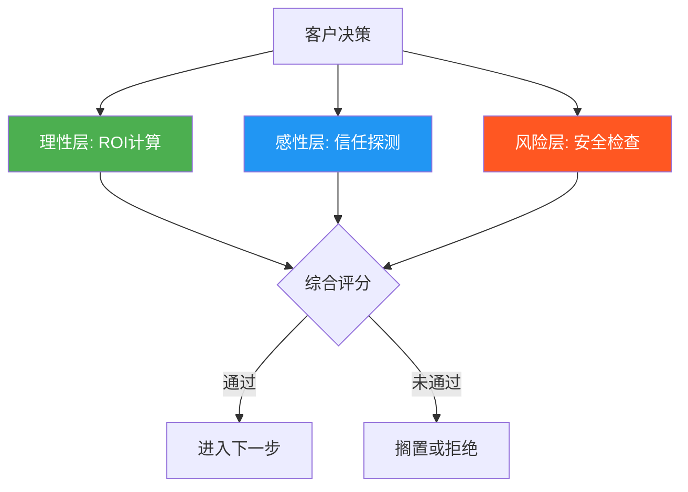
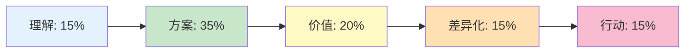

## 场景七：客户提案

客户提案是商业演讲中技术含量最高的场景之一。它不同于产品发布会的单向输出，也不同于内部汇报的上下级关系——提案是一场多方博弈：你需要同时说服决策者、打动使用者、通过技术评估者的审查，而对方手里握着预算和替代方案。一次成功的提案，能在30-60分钟内将潜在客户转化为签约客户；一次失败的提案，不仅丢掉当前项目，还可能在行业内留下负面口碑。

### 一、客户提案的本质：信任转移

#### 1.1 为什么客户提案是最难的演讲类型

客户提案面临三重不对称：

| 不对称维度 | 具体表现 | 应对策略 |
|-----------|---------|---------|
| 信息不对称 | 客户了解自己的业务，你了解解决方案，但双方的交叉地带存在大量盲区 | 投入大量前期调研，缩小信息差距 |
| 信任不对称 | 客户对你和你的公司了解有限，但你要他们投入真金白银 | 通过案例、数据、背书建立信任 |
| 利益不对称 | 客户想花最少的钱获得最好的效果，你想用合理的成本交付合理的成果 | 打造双赢方案，强调价值而非价格 |

#### 1.2 客户决策的心理模型

客户在听提案时，大脑里同时运行着三个评估程序：

**理性层（ROI计算器）**：这个方案能带来多少回报？投入产出比是否合理？周期多长？

**感性层（信任探测器）**：这个人/团队靠不靠谱？出了问题他们会不会负责？我和他们合作舒不舒服？

**风险层（安全检查器）**：最坏情况会怎样？有没有失败案例？出问题了怎么止损？

成功的提案必须同时激活理性层的认可、感性层的信任，同时关闭风险层的警报。很多提案失败的原因，就是只关注了理性层（堆数据、讲方案），忽略了感性层和风险层。

### 二、提案前的深度准备

#### 2.1 客户调研清单

提案的成败，70%取决于准备阶段。以下是必须完成的调研项目：

**基础信息层：**
- 公司规模、营收、行业地位、近年发展轨迹
- 核心业务模式、盈利方式、增长瓶颈
- 组织架构、关键决策人及其背景
- 近期重大事件（融资、并购、产品发布、人事变动）

**需求洞察层：**
- 客户提出需求的背景和触发事件
- 客户内部对这个问题的不同声音（支持者和反对者）
- 客户之前尝试过哪些方案，为什么没成功
- 客户的预算范围和决策周期

**竞争情报层：**
- 同时在竞争的还有哪些公司
- 各家的优劣势对比
- 客户倾向性（如果能打听到）
- 行业内的标杆案例

**关键人物画像：**

| 角色 | 关注重点 | 你需要准备的内容 |
|------|---------|----------------|
| 最终决策者（CEO/VP） | 战略价值、ROI、风险 | 高层视角的价值故事、行业趋势、竞对动态 |
| 业务负责人 | 效率提升、可落地性 | 具体场景解决方案、里程碑计划、资源投入 |
| 技术评估者 | 可行性、安全性、兼容性 | 技术架构、安全方案、迁移路径、性能指标 |
| 财务审批者 | 成本控制、付款方式 | 详细报价、ROI测算、分期方案 |
| 最终用户 | 易用性、学习成本 | 产品演示、培训计划、用户体验 |

#### 2.2 需求确认的预沟通技巧

在正式提案前，至少安排一次非正式的需求确认沟通。这次沟通的目标不是展示方案，而是：

**收集情报：** 用开放式问题引导客户多说。比如"这个问题对业务的影响有多大？""之前有尝试过什么方案吗？""这次评估主要会看哪些维度？"

**建立关系：** 让关键决策者在正式提案前就对你有印象。正式提案时，面对一个"认识的人"比面对"陌生人"的信任门槛低得多。

**校准预期：** 提前了解客户心中的"理想方案"是什么样的，避免提案当天才发现方向偏差。

**埋下伏笔：** 在预沟通中可以适当展示专业度，为正式提案的权威性做铺垫。比如分享一个行业洞察，让客户觉得"这个人很懂行"。

#### 2.3 提案材料的三层结构

一份完整的提案材料应包含三层：

**第一层：提案演示文件（PPT/Keynote）**
用于现场讲解，视觉为主、文字为少。每页一个核心信息，配图表和关键词。这层面向所有人。

**第二层：详细方案文档（Word/PDF）**
完整的解决方案文档，包含技术细节、实施计划、报价明细、团队介绍等。提案结束后留给客户内部传阅。这层面向技术评估者和执行层。

**第三层：辅助材料包**
案例详情、资质证书、团队简历、测试报告、第三方评测等。根据客户关注点选择性展示。这层用于应对具体质疑。

### 三、提案现场的结构框架

#### 3.1 经典四段式结构

推荐使用"理解→方案→价值→行动"四段式结构：

| 环节 | 时间占比 | 核心目标 | 关键动作 |
|------|---------|---------|---------|
| 理解 | 15% | 证明你懂客户 | 复述需求、确认理解、展示调研深度 |
| 方案 | 35% | 展示解决方案 | 分阶段方案、核心功能演示、技术架构 |
| 价值 | 20% | 证明方案有效 | 案例数据、ROI测算、效果预测 |
| 差异化 | 15% | 证明你是最优选择 | 竞对对比、独特优势、风险保障 |
| 行动 | 15% | 推动决策 | 明确下一步、时间计划、紧迫感 |

#### 3.2 "理解"环节：黄金15分钟

这是整个提案最关键的环节。如果前15分钟不能让客户觉得"你懂我"，后面讲得再好也会打折扣。

**开场公式：** 感谢→确认背景→复述需求→请求确认

**具体话术示例：**

> "王总、各位领导，感谢给我们这个机会来分享我们的方案。在正式开始之前，我想先花两分钟确认一下我们对贵公司需求的理解，确保接下来的内容是有的放矢的。
>
> 通过前期的调研和三次深度沟通，我们理解到贵公司目前面临三个核心挑战：第一，线下门店客流同比下降23%，急需建立线上获客渠道来弥补缺口；第二，CRM、ERP、小程序三套系统的数据完全割裂，无法形成客户360度视图；第三，团队的数字化运营能力是短板，现有12人的数字营销团队缺乏体系化的方法论。
>
> 这三个理解是否准确？有没有我们遗漏的重要信息？"

**这段话术的精妙之处：**
- "三次深度沟通"——展示你投入了时间，不是敷衍
- "同比下降23%"——具体数字说明你做了功课，不是泛泛而谈
- "CRM、ERP、小程序"——说出具体系统名称，证明你真的调研了
- "12人的数字营销团队"——连团队规模都了解，客户会感到被重视
- 最后请求确认——给客户补充和纠正的机会，也是互动的开始

#### 3.3 "方案"环节：分阶段递进展示

方案展示最忌讳一次性倾倒所有信息。正确的方式是分阶段、分层次地展示。

**方案展示的"剥洋葱"法：**

第一层（宏观）：整体方案架构图，让客户看到全貌
第二层（中观）：分阶段实施计划，每阶段的目标、时间、产出
第三层（微观）：核心模块的详细设计，聚焦客户最关心的1-2个点深入展开

**分阶段方案模板：**

| 阶段 | 时间 | 目标 | 关键交付物 | 预期效果 |
|------|------|------|-----------|---------|
| 速赢期 | 1-3个月 | 快速见效，建立信心 | 私域运营体系上线 | 线上获客渠道打通，月增线索500+ |
| 深化期 | 3-6个月 | 系统打通，数据驱动 | 数据中台上线 | 运营效率提升30%，决策周期缩短50% |
| 优化期 | 6-12个月 | 智能化，规模化 | AI营销引擎上线 | 营销ROI提升200%，人效提升40% |

**关键技巧：** 在展示方案时，每个功能点都要回到客户的痛点上。不要说"我们有XX功能"，而要说"针对贵公司XX问题，我们的XX功能可以这样解决……"

#### 3.4 "价值"环节：用案例说话

价值环节的核心是"证人证词"——用别人的成功来证明你的方案有效。

**案例展示的STAR法则：**
- **S（Situation）**：客户的背景和挑战（和当前客户越相似越好）
- **T（Task）**：需要解决的具体问题
- **A（Action）**：你们采取的解决方案（简述，突出亮点）
- **R（Result）**：量化的效果数据

**案例话术示例：**

> "这个方案已经在XX行业头部企业得到了验证。他们的背景和贵公司非常相似——同样是线下连锁品牌，同样面临线上转型的挑战。
>
> 我们为他们制定了类似的三阶段方案。第一阶段用了8周时间搭建私域运营体系，上线第一个月就通过企业微信沉淀了3万私域用户；第二阶段用4个月打通了CRM和ERP系统，实现了客户数据的统一管理；第三阶段引入智能推荐引擎，实现了千人千面的精准营销。
>
> 一年后的效果：线上收入占比从5%提升到30%，整体运营效率提升40%，营销费用率下降了8个百分点。这是他们CFO签字的效果评估报告，各位可以参考。"

**数据呈现技巧：**
- 使用具体数字而非模糊表述："提升40%"比"大幅提升"有力10倍
- 提供可验证的证据：报告、截图、第三方评测
- 将数据转化为客户能感知的价值："40%效率提升意味着你的团队可以少招6个人"

#### 3.5 "差异化"环节：为什么选我们

这是最容易变成自吹自擂的环节。正确的方式不是说"我们最好"，而是通过对比让客户自己得出结论。

**差异化展示框架——三维度对比法：**

| 对比维度 | 我们 | 传统方案 | 纯技术供应商 |
|---------|------|---------|------------|
| 行业经验 | 同行业5家成功案例 | 通用方案，行业适配性弱 | 技术强但不懂业务 |
| 服务模式 | 全程陪跑+知识转移 | 交付即结束 | 只提供技术工具 |
| 风险控制 | 分阶段交付，每阶段可退出 | 大项目，一次性投入 | 技术风险自担 |
| 长期价值 | 培养客户团队能力 | 持续依赖外部 | 需要客户自建团队 |

**关键原则：** 不要直接点名竞争对手的缺点，而是通过对比让客户看到差异。把选择权交给客户，而不是替客户做判断。

#### 3.6 "行动"环节：推动决策

很多提案虎头蛇尾，方案讲得很精彩，到最后却说"我们等您回复"，然后就没有然后了。行动环节必须明确、具体、有紧迫感。

**行动环节的三要素：**

**明确的下一步：** 不要说"我们等您消息"，要说"我们建议下一步安排一次为期两周的免费诊断，由我们的首席顾问带队，深入分析贵公司的数字化现状，两周后给出一份详细的诊断报告和精准方案。"

**时间计划：** "如果本周确认启动诊断，我们可以在下周一进场，两周后的周五提交报告。这样如果进展顺利，整个项目可以在Q3启动，赶在双十一之前完成第一阶段。"

**决策推动：** 制造合理的紧迫感。"我们目前在同行业还有两个类似项目在谈，如果贵公司能在这个月内确认，我们可以确保由张总监（行业TOP专家）亲自带队。"

### 四、不同类型客户提案的策略调整

#### 4.1 新客户首次提案 vs 老客户续约提案

| 维度 | 新客户首次提案 | 老客户续约提案 |
|------|--------------|--------------|
| 信任基础 | 零基础，需要大量建立 | 有合作基础，重点维护 |
| 时间分配 | 理解和差异化环节多花时间 | 价值回顾和新规划多花时间 |
| 案例策略 | 用行业标杆案例建立信心 | 用客户自己的数据说话 |
| 风险应对 | 重点解决"凭什么信你" | 重点解决"为什么继续" |
| 行动设计 | 给低门槛的下一步（免费诊断） | 给升级方案或扩展合作 |

#### 4.2 竞标型提案的特殊处理

竞标型提案（多家供应商同时竞争）需要特别注意：

**情报收集：** 尽可能了解还有谁在竞标，各家的优劣势。如果知道竞争对手的方案思路，可以有针对性地突出自己的差异化。

**方案创新：** 竞标中，"安全但平庸"的方案很难胜出。需要在方案中加入1-2个创新点，让客户眼前一亮。但创新必须建立在可行性的基础上，不要为了新奇而冒险。

**演示冲击力：** 竞标提案中，现场演示效果的影响权重很高。准备一个高完成度的产品Demo或原型，比100页PPT更有说服力。

**评委心理：** 竞标评委通常需要写评标报告。给评委提供"评标素材"——清晰的对比表格、可引用的数据、结构化的评分参考——会让评委倾向于给你高分。

#### 4.3 小型客户的轻量化提案

不是所有提案都需要大阵仗。面对小型客户（预算有限、决策链短），过度正式反而会让对方紧张。

**轻量化策略：**
- 时间控制在20-30分钟，去掉冗余的公司介绍
- 用一页纸方案替代50页PPT
- 报价透明直接，不要让客户猜
- 提供标准化方案+可选增值服务的菜单式选择

### 五、现场演示与互动技巧

#### 5.1 产品Demo的演示技巧

如果提案中包含产品演示，以下技巧能大幅提升效果：

**场景化演示：** 不要按功能菜单逐个介绍，而是按照客户的业务流程串联。比如："当一位新客户在小程序上下单后，系统会自动……然后运营人员在后台看到……接着触发自动化的营销流程……"

**准备Plan B：** 现场演示随时可能出问题——网络断了、数据加载失败、功能Bug。永远准备一个录屏版本作为备份。

**让客户参与：** 如果条件允许，邀请客户亲自操作。触觉记忆比视觉记忆更深刻。准备一台测试设备，让关键决策者亲手体验核心功能。

**控制节奏：** 演示不是越长越好。聚焦客户最关心的3-5个核心场景，每个场景控制在3-5分钟。宁可少展示，也要确保每个展示都完美。

#### 5.2 提案中的互动设计

单向输出的提案效果远不如互动式提案。以下是经过验证的互动设计：

**开场确认互动：** 前文提到的"需求确认"就是第一个互动点。让客户点头确认，能建立"共同认知"的心理契约。

**中途检查点：** 每讲完一个大模块，暂停30秒询问："关于这部分，各位有什么问题或想深入了解的吗？"这比讲完所有内容再留Q&A更有效——因为客户的疑问在产生的那一刻就需要解答，过了那个时间窗口，疑问要么被遗忘，要么变成疑虑。

**痛点共鸣互动：** "在座有没有遇到过这样的情况——花了三个月搭建的系统，上线后发现业务部门根本不用？"这种问题能引发客户的共鸣，当客户点头时，就是在心理上认同你的方案是为了解决他的真实痛点。

**选择式互动：** "接下来我可以从两个方向展开：一是深入讲技术架构，二是重点讲实施计划。各位更希望先听哪个？"让客户参与内容选择，既能确保讲到客户最关心的，又能让客户感到被尊重。

#### 5.3 提案中的肢体语言和声音控制

提案场景对演讲者的非语言表达要求极高：

**站位：** 如果有投影屏幕，站在屏幕的左侧（观众视角的右侧），因为人的阅读习惯是从左到右，先看到屏幕内容，再看向你。不要站在投影仪光束中。

**手势：** 讲到方案架构时，用手势指向PPT上的对应模块。讲到数据增长时，手势向上。讲到成本下降时，手势向下。手势要和内容方向一致。

**眼神：** 在多人提案中，眼神要覆盖所有人，但重点放在决策者身上。讲ROI和战略价值时看决策者，讲技术细节时看技术评估者，讲用户体验时看业务负责人。

**声音节奏：** 讲数据时放慢语速，给听众消化时间。讲故事时加快语速，营造紧迫感。讲关键结论时停顿2秒，让结论沉淀。

### 六、异议处理与现场应变

#### 6.1 常见异议及应对策略

客户提案中最常见的五类异议，每类都需要不同的应对策略：

**异议一："你们的价格太贵了"**

错误应对："我们可以再打折。"——这会立刻拉低你的专业形象。

正确应对：先认同，再重构价值。
> "理解您的顾虑。我来算一笔账：我们的方案第一年投入是200万，但预计带来的是800万的增量收入和150万的成本节省。也就是说，投资回报周期大约在4个月。而且我们提供的是三阶段方案，第一阶段的投入只有50万，您可以在验证效果后再决定是否继续。"

**异议二："你们有同行业经验吗？"**

错误应对："有的有的，我们做过很多。"——太笼统，没有说服力。

正确应对：具体到案例名称、规模、效果。
> "有的。过去两年我们在XX行业服务了5家企业，其中包括行业排名前三的A公司和B公司。A公司的项目我刚才提到了，B公司的项目更有参考价值，因为他们的规模和贵公司接近——年营收在5-10亿区间，面临的痛点也很相似。如果您方便的话，我们可以安排一次与B公司CTO的交流。"

**异议三："能不能先做一个小的试点？"**

这通常是一个积极信号——客户对方案有兴趣，但想降低风险。

正确应对：主动设计试点方案。
> "完全可以，而且我们建议这样做。试点方案可以这样设计：选择一个区域或一个业务线，用4-6周时间完成第一阶段的核心功能上线。验收标准我们提前约定好，达到标准了再进入下一阶段。这样您的风险可控，我们也有机会证明自己的交付能力。"

**异议四："我需要回去和团队讨论一下"**

这可能是真实的，也可能是委婉的拒绝。

正确应对：识别真实意图，提供决策支持。
> "完全理解，这毕竟是一个重要的决策。为了让您和团队的讨论更高效，我准备一份详细方案的电子版，里面包含了今天讲的所有内容以及详细的数据支撑。另外，如果您的团队有任何技术或商务方面的具体问题，我们可以安排一次针对性的答疑会。您看下周什么时间方便？"

**异议五："竞争对手X公司的方案看起来也不错"**

错误应对：直接攻击竞争对手。——这会显得不专业，而且客户可能和竞争对手关系也不错。

正确应对：客观对比，突出差异。
> "X公司确实是行业的优秀选手。据我了解，他们的优势在XX方面。但基于贵公司的具体需求，我认为我们的方案在三个方面更适合：第一，XX；第二，XX；第三，XX。当然，最终选择权在您，我建议您可以从XX维度做进一步评估。"

#### 6.2 无法当场回答的问题处理

面对无法当场回答的技术或商务问题，不要硬答。硬答的风险远大于说"我需要回去确认"。

**标准话术：** "这是一个非常好的问题。为了给您一个准确的回答，我需要和技术团队确认最新的技术细节。我会在明天下午之前通过邮件给您一个书面回复，确保信息准确。"

**关键原则：** 承诺的回复时间必须兑现。如果说明天下午回复，明天上午12点之前就要发出。超时回复比不回复更糟糕——它不仅失信，还暴露了你的团队执行力问题。

### 七、提案后的跟进策略

#### 7.1 提案结束后的黄金48小时

提案结束不等于工作结束。事实上，提案结束后的48小时是最关键的跟进窗口。

**当天（提案结束后2小时内）：**
- 发送感谢邮件，附上提案演示文件和详细方案文档
- 针对现场提到的问题，发送补充材料
- 如果现场有未回答的问题，在邮件中一并回复

**第二天：**
- 发送一份精炼的"一页纸摘要"，包含方案核心价值、关键数据、下一步建议
- 如果是竞标，这份摘要就是评委能记住你的关键工具

**第三天：**
- 如果客户没有主动联系，礼貌地询问是否有进一步的问题
- 不要催促决策，而是提供价值——比如分享一篇行业报告或案例

#### 7.2 长周期提案的关系维护

对于大型项目，决策周期可能长达数周甚至数月。在这个过程中，需要持续维护关系但不能让客户感到压力。

**价值型跟进：** 每隔1-2周分享一条对客户有价值的信息——行业报告、政策解读、竞品动态、技术趋势。让客户觉得你是一个"行业顾问"，而不仅仅是一个"供应商"。

**关系型跟进：** 节日问候、生日祝福、朋友圈互动。建立超越项目的关系连接。

**节点型跟进：** 关注客户的关键节点——财报发布、新产品上线、重大活动。在节点前后表达关心，比日常寒暄更有效果。

### 八、客户提案的常见误区

#### 误区一：开场花20分钟介绍公司历史

客户关心的是"你能帮我解决什么问题"，而不是"你公司成立于哪一年、有多少员工、得过什么奖"。公司介绍应该压缩到2分钟以内，而且要和客户需求挂钩："我们在XX行业深耕8年，服务过XX家企业，这个经验意味着我们能帮您少走弯路。"

#### 误区二：方案讲得面面俱到但没有重点

什么都讲等于什么都没讲。提案时间有限，必须做减法。把80%的时间花在客户最关心的2-3个核心问题上，其他内容放在详细方案文档中留给客户自行阅读。

#### 误区三：用专业术语炫技

技术评估者可能听得懂"微服务架构""中台""数据湖"，但决策者和业务负责人不一定。提案中的技术表述要分层：给决策者讲价值，给业务负责人讲流程，给技术评估者讲架构。

#### 误区四：忽略"人"的因素

提案不只是一场方案评审，更是一次人际关系的建立。客户选择供应商，很多时候选的是"人"——这个团队靠不靠谱、沟通顺不顺畅、合作愉不愉快。提案现场展现的专业度、态度、细节（比如准时到场、材料整齐、对客户信息的保密意识），都在影响客户的判断。

#### 误区五：不做排练就上场

提案是需要排练的正式演出。至少完整排练两遍：第一遍对镜子或录像，检查内容流畅度和时间控制；第二遍找同事模拟客户提问，练习异议应对。排练中发现的问题，远比现场暴露要好处理得多。

### 九、实战案例：数字化转型咨询提案完整话术

以下是一次数字化转型咨询提案的完整话术示例，覆盖从开场到收尾的全流程：

---

**【开场——理解环节，5分钟】**

> "王总、各位领导，感谢给我们这个机会来分享我们的方案。在正式开始之前，我想先花两分钟确认一下我们对贵公司需求的理解。
>
> 通过前期的调研和三次深度沟通，我们理解到贵公司目前面临三个核心挑战：第一，线下门店客流同比下降23%，急需建立线上获客渠道来弥补缺口；第二，CRM、ERP、小程序三套系统的数据完全割裂，无法形成客户360度视图；第三，团队的数字化运营能力是短板，现有12人的数字营销团队缺乏体系化的方法论。
>
> 这三个理解是否准确？有没有我们遗漏的重要信息？"

*（等待客户确认或补充，认真记录）*

> "感谢确认。接下来我将围绕这三个问题展开我们的方案。"

**【方案环节，15分钟】**

> "我们的方案分为三个阶段，核心思路是'先见效、再打通、后智能'——不搞大跃进，每一步都让您看到实实在在的效果。
>
> 第一阶段是速赢期，1-3个月。核心目标是快速搭建私域运营体系，让线上获客渠道跑起来。具体做法是：基于企业微信搭建私域流量池，配合小程序商城实现从获客到转化的闭环。我们预估这个阶段可以带来月均500条以上有效线索，按行业平均转化率15%计算，月增75个成交客户。
>
> 第二阶段是深化期，3-6个月。核心目标是打通三套系统的数据，建立统一的数据中台。这一步是关键——数据不通，后面的精准营销就是空中楼阁。我们会采用API对接+ETL的方式，先打通核心数据链路，再逐步扩展。这个阶段完成后，运营效率预计提升30%，客户画像完整度从目前的35%提升到85%以上。
>
> 第三阶段是优化期，6-12个月。基于前面的数据基础，引入智能推荐和自动化营销引擎，实现千人千面的精准触达。这个阶段的预期效果是营销ROI提升200%，人效提升40%。"

**【价值环节，8分钟】**

> "这个方案已经在XX行业头部企业A公司得到了验证。A公司的背景和贵公司非常相似——同样是线下连锁品牌，300多家门店，年营收20亿左右。
>
> 他们实施一年后的效果：线上收入占比从5%提升到30%，整体运营效率提升40%，营销费用率下降了8个百分点——换算成金额，一年节省了大约1600万的营销费用。这是他们CFO签字的效果评估报告，各位可以参考。
>
> 特别要提的是，A公司项目的第一阶段只用了6周就完成了上线，第一个月就通过私域沉淀了3万用户。这证明速赢期的效果是可以快速兑现的。"

**【差异化环节，5分钟】**

> "在座的各位可能也在接触其他供应商。据我了解，市场上主要有两类竞争者：一类是传统咨询公司，强在方法论但缺技术落地能力；一类是纯技术公司，强在产品但缺业务理解。
>
> 我们的差异化在于三点：第一，我们有同行业5家成功实施的经验，不是通用方案套模板，而是真正理解行业Know-how；第二，我们是'咨询+技术+运营'三位一体的服务模式，从方案设计到系统搭建到日常运营，全程陪跑；第三，我们采用分阶段交付模式，每个阶段都有明确的验收标准，如果效果不达标，您可以选择不进入下一阶段——这意味着我们用交付质量来绑定自己的利益。"

**【行动环节，3分钟】**

> "最后，关于下一步，我们建议先做一个为期两周的免费诊断。由我们的首席顾问张博士带队，深入贵公司进行业务流程梳理、系统现状评估和团队能力摸底。两周后提交一份详细的诊断报告，包含现状分析、方案细化和精准报价。
>
> 如果本周确认启动，下周一可以进场，两周后提交报告。这样如果进展顺利，整个项目可以在Q3启动，赶在双十一促销季之前完成第一阶段上线，抓住年度最大的营销节点。
>
> 王总，您看这个安排是否合适？"

---

### 十、从提案到成交：提案能力的进阶路径

提案能力的成长分为四个阶段：

**阶段一：执行型（初级）**
能按照模板完成提案，但缺乏灵活性，遇到意外情况容易慌。这个阶段的目标是"不犯大错"。

**阶段二：策略型（中级）**
能根据不同客户调整提案策略，懂得提前调研和差异化定位。这个阶段的目标是"赢下该赢的"。

**阶段三：洞察型（高级）**
能洞察客户的隐性需求和未说出口的顾虑，提案直击要害。客户会说"你怎么比我还了解我的问题"。这个阶段的目标是"创造需求"。

**阶段四：影响型（专家）**
提案本身成为行业标杆，客户慕名而来。不再需要主动找客户，而是客户排队等你提案。这个阶段的目标是"定义标准"。

每个阶段的跃迁都需要刻意练习：多提案、多复盘、多向优秀案例学习。建议每次提案后做一次自我复盘，回答三个问题：哪些地方客户反应积极？哪些地方客户走神或质疑？如果重来一次，我会怎么改？这些复盘日积月累，就是你最宝贵的提案经验库。
