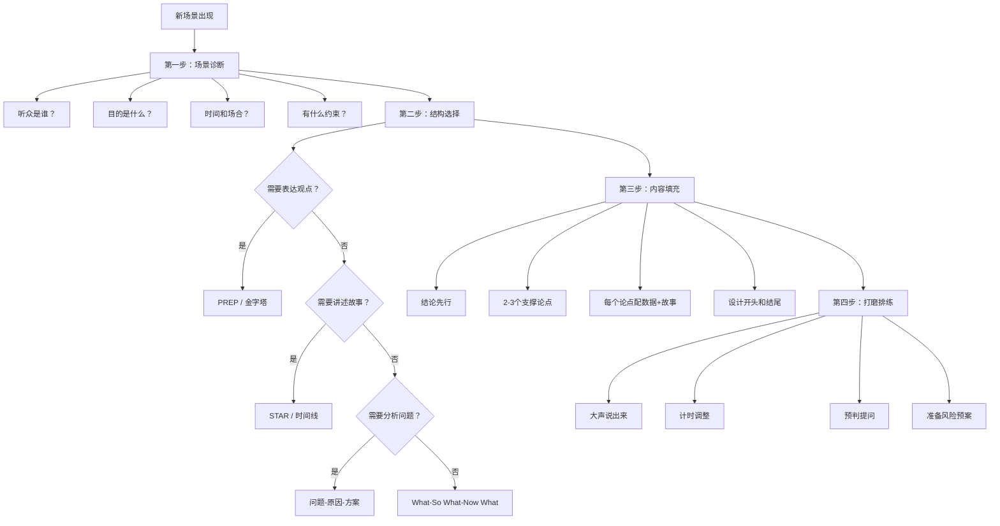

## 本节小结

以上八个实战案例覆盖了从职场到生活、从正式到即兴的完整演讲场景谱系。本节不是简单地重复各场景的要点，而是从更高的维度提炼跨场景的通用规律，帮助你建立一套可以迁移的演讲思维模型——无论未来遇到什么新场景，都能快速搭建出高质量的演讲方案。

### 一、八大场景的核心逻辑复盘

#### 1.1 每个场景的本质是什么

理解场景的本质，比记住具体技巧更重要。技巧会过时，但本质逻辑永远有效：

| 场景 | 本质定义 | 核心目标 | 最大陷阱 |
|------|----------|----------|----------|
| 工作汇报 | 一场有目的的信息交换 | 帮助决策者做出更好的决策 | 变成流水账式的任务清单 |
| 产品发布会 | 一次集体情绪的引导和激发 | 让听众从"知道"变为"想要" | 陷入功能参数的技术细节 |
| 婚礼致辞 | 一段有温度的情感表达 | 让新人和宾客感受到真诚祝福 | 背诵套话、讲不合时宜的段子 |
| 学术报告 | 一次严谨的知识传递与讨论 | 清晰呈现研究发现并接受检验 | 照搬论文、忽视听众理解门槛 |
| 面试自我介绍 | 一场个人品牌的战略发布会 | 让面试官主动想深入了解你 | 复述简历、没有记忆锚点 |
| 团队激励 | 一次信念的传递与能量的注入 | 让团队从"要我做"变为"我要做" | 空喊口号、画大饼不兑现 |
| 客户提案 | 一次基于信任的价值交换 | 让客户相信你是最佳选择 | 只讲方案不讲客户的痛点 |
| 即兴演讲 | 素材库的快速调取与组合 | 在零准备时间下展现真实表达力 | 说"我没准备"、试图面面俱到 |

#### 1.2 八大场景的能力要求矩阵

不同场景对演讲者的六项核心能力要求程度不同。了解自己的短板，才能有针对性地训练：

| 能力维度 | 工作汇报 | 产品发布 | 婚礼致辞 | 学术报告 | 面试介绍 | 团队激励 | 客户提案 | 即兴演讲 |
|----------|:--------:|:--------:|:--------:|:--------:|:--------:|:--------:|:--------:|:--------:|
| 逻辑结构 | ★★★★★ | ★★★★ | ★★ | ★★★★★ | ★★★★ | ★★★ | ★★★★★ | ★★★★ |
| 情感共鸣 | ★★ | ★★★★★ | ★★★★★ | ★ | ★★★ | ★★★★★ | ★★★ | ★★★★ |
| 数据说服 | ★★★★★ | ★★★★ | ★ | ★★★★★ | ★★★ | ★★ | ★★★★★ | ★★ |
| 故事能力 | ★★★ | ★★★★★ | ★★★★ | ★★ | ★★★★ | ★★★★★ | ★★★★ | ★★★★ |
| 应变能力 | ★★★ | ★★★ | ★★ | ★★★★ | ★★★★ | ★★ | ★★★★ | ★★★★★ |
| 气场控场 | ★★★ | ★★★★★ | ★★ | ★★★ | ★★★ | ★★★★★ | ★★★★ | ★★★★ |

从这个矩阵可以看出两个重要规律：

**规律一：逻辑结构和故事能力是"万金油"能力**。几乎所有场景都需要，优先提升这两项，回报率最高。

**规律二：没有一个场景只需要单项能力**。即使是看起来最简单的婚礼致辞，也需要情感共鸣、故事能力和基本的结构感。演讲能力的提升不是单点突破，而是组合优化。

### 二、跨场景的六大通用原则

回顾所有八个案例，有六条原则贯穿始终。这些原则不是某个场景的专属技巧，而是演讲这件事的底层操作系统。

#### 原则一：听众导向，而非自我导向

这是所有原则中最重要的一条。在八个场景中，凡是失败的演讲，几乎都犯了同一个错误——从"我要说什么"出发，而不是从"他们需要听什么"出发。

**工作汇报**中，领导想听的是决策所需的信息，而不是你每天的工作日志。**产品发布会**中，用户想知道这个产品如何改变他们的生活，而不是你用了什么技术栈。**客户提案**中，客户关心的是你能否解决他们的痛点，而不是你的公司有多厉害。

**落地方法**：准备任何演讲前，先回答三个问题——
1. 我的听众是谁？他们此刻最关心什么？
2. 听完我的演讲，他们需要做出什么决定或采取什么行动？
3. 什么信息能让他们最快地理解和认同我的核心观点？

#### 原则二：结论先行，金字塔表达

麦肯锡的金字塔原理在八个场景中无一例外地适用。人类大脑的工作记忆容量有限（心理学家米勒的"7±2法则"），听众不可能在你铺垫了五分钟之后还记得你最开始说了什么。

**反面模式**："先说背景，再说过程，最后说结论"——这是学术论文的写法，不是演讲的讲法。当你铺垫太久，听众的注意力已经流失，你精心准备的结论反而无人在意。

**正面模式**："先说结论，再给理由，最后补充细节"——开场30秒内让听众知道你要说什么、你的核心观点是什么。然后用数据和案例支撑这个观点。听众在知道结论后，会主动在你的论述中寻找支撑，注意力反而更集中。

**各场景中的具体表现**：
- 工作汇报："本季度核心成果一句话——交付量提升35%，客户满意度跃升到94%。"
- 产品发布会："今天，我们重新发明了手机。"
- 面试自我介绍："我是有5年用户增长经验的产品经理，核心能力是用数据驱动决策。"
- 即兴演讲（PREP框架）：第一句话就是观点——"我支持这个方向，但建议分阶段推进。"

#### 原则三：用故事承载观点，用数据支撑故事

单纯的数据是冰冷的，单纯的故事是空洞的。最有力的表达是"故事+数据"的组合。

**案例对比**：

| 表达方式 | 示例 | 效果评估 |
|----------|------|----------|
| 纯数据 | "我们的客户满意度从87%提升到94%" | 有说服力但无记忆点 |
| 纯故事 | "有个客户专门打电话来感谢我们" | 有温度但缺乏普遍性 |
| 故事+数据 | "有个客户专门打电话来感谢我们——本季度这样的正面反馈有47条，推动满意度从87%跃升到94%" | 既有温度又有说服力 |

故事让数据变得可信，数据让故事变得普遍。在工作汇报、产品发布会、客户提案这三个"硬"场景中，数据的权重更大；在婚礼致辞、团队激励这两个"软"场景中，故事的权重更大。但两者缺一不可。

#### 原则四：结构是骨架，灵活是灵魂

本节所有案例都提供了明确的结构框架——金字塔法、STAR法、PREP法、时间线法等。这些框架的价值在于：让你在准备阶段有章可循，不至于对着空白页发呆；让你在表达阶段有路径可依，不至于说着说着跑题。

但框架不是牢笼。在实际演讲中，你需要根据现场情况灵活调整：

- 领导突然打断提问——暂停原有结构，先回应问题，再回到主线上来
- 发现听众对某个点特别感兴趣——临时增加该部分的深度，压缩后面的内容
- 时间被压缩——砍掉次要内容，保留最核心的结论和一个支撑案例
- 现场气氛比预期严肃或轻松——调整语言风格和互动方式

**判断何时该坚持框架、何时该灵活调整的唯一标准**：听众的注意力和需求。如果你严格按照框架讲，但听众已经走神了，框架就失去了意义。

#### 原则五：开头和结尾的权重远高于中间

心理学中的"首因效应"和"近因效应"告诉我们：人们对一段经历的记忆，主要集中在开头和结尾，中间部分会被自动压缩。

这意味着什么？如果你的演讲有10分钟，至少花2分钟准备开头，1.5分钟准备结尾。开头决定了听众是否愿意继续听下去，结尾决定了听众离开时带走什么印象。

**八个场景中被验证有效的开头模式**：
- **数据冲击**："35%的增长率、94%的满意度——这是本季度我们交出的成绩单。"
- **故事悬念**："去年冬天的一个凌晨两点，我在办公室盯着屏幕上的红色告警……"
- **问题共鸣**："你有没有遇到过这种情况——准备了一个月的方案，客户只听了五分钟就否了？"
- **场景代入**："想象一下，你站在300人面前，突然忘词了。"

**八个场景中被验证有效的结尾模式**：
- **行动号召**："明天就从一个小的改变开始——先试着用结论先行的方式写一封邮件。"
- **情感升华**："这三个字——不要怕——是我创业五年最深的感悟。"
- **首尾呼应**：回到开头的故事或数据，形成闭环
- **金句收束**："机会不会等你准备好才来，它只会在你准备的过程中出现。"

#### 原则六：排练是不可压缩的底线投入

八个场景无一例外地强调了排练的重要性。这不是老生常谈，而是有认知科学依据的：排练的本质是把"有意识的思考"转化为"无意识的自动化"。当你不需要在"想说什么"上消耗认知资源时，才能把全部注意力放在"怎么说"和"听众的反应"上。

**最低限度的排练标准**：

| 场景类型 | 最低排练次数 | 排练重点 |
|----------|:----------:|----------|
| 正式演讲（产品发布、学术报告） | 3-5遍 | 全流程走通+计时+录像回看 |
| 工作汇报 | 2-3遍 | 开场和数据页+预判提问 |
| 客户提案 | 3遍以上 | 要点逻辑+异议应对话术 |
| 即兴场景（婚礼、获奖、会议发言） | 0遍（但要有素材库） | 平时积累素材，现场调用框架 |

即兴场景看似不需要排练，但真正的即兴高手在平时做了大量"隐性排练"——积累素材库、练习框架内化、模拟各种话题。就像顶级棋手的"直觉"，其实是数万小时训练的结果。

### 三、从八个案例中提炼的"场景适配模型"

遇到一个新的演讲场景时，你不需要从零开始思考。用以下四步模型，5分钟内就能搭建出演讲方案的基本框架：

**这个模型的使用示例**：

假设你被邀请在一个行业论坛上做10分钟的分享（你之前没做过这种场景）：

1. **场景诊断**：听众是同行从业者（专业度中等偏高），目的是分享经验建立个人品牌，时间10分钟（紧凑），场合正式但不严肃
2. **结构选择**：需要讲述经验→STAR+时间线混合结构
3. **内容填充**：开场用一个数据或悬念抓住注意力→分享2-3个关键经验，每个用STAR展开→结尾用一句金句收束
4. **打磨排练**：至少排练3遍，计时确保不超时，预判听众可能问的3个问题

### 四、演讲能力自评清单

完成八大案例的学习后，用以下清单评估自己的掌握程度。每个条目用1-5分自评，总分低于60分说明基础还不扎实，60-80分说明可以应对大部分场景，80分以上说明已经具备演讲高手的潜质。

#### 结构与内容能力（满分25分）

- [ ] 我能在5分钟内为任意话题搭建一个清晰的演讲大纲（5分）
- [ ] 我习惯结论先行，先说"所以"再说"因为"（5分）
- [ ] 我的每个核心观点都有至少一个数据和一个故事支撑（5分）
- [ ] 我能在时间压缩时快速砍掉次要内容，保留核心主线（5分）
- [ ] 我的开头能在30秒内抓住听众注意力（5分）

#### 表达与呈现能力（满分25分）

- [ ] 我能控制语速，在关键信息前有意识地停顿（5分）
- [ ] 我的眼神能覆盖全场，不只盯着PPT或某一个区域（5分）
- [ ] 我的手势自然且有信息量，不会双手插兜或无意义挥动（5分）
- [ ] 我能在讲故事时调动情感，在讲数据时保持冷静（5分）
- [ ] 我的结尾有力且干净，不会用"我就说这些吧"草率收场（5分）

#### 应变与互动能力（满分25分）

- [ ] 我能在被突然提问时不慌张，用框架组织回答（5分）
- [ ] 我能根据听众的反应实时调整内容深度和节奏（5分）
- [ ] 我能在不知道答案时得体地回应，而不是瞎编或说"不知道"（5分）
- [ ] 我能在设备故障、时间被压缩等意外情况下从容应对（5分）
- [ ] 我能用互动问题保持听众的参与感（5分）

#### 心理素质（满分25分）

- [ ] 我上台前的紧张感在可控范围内，不会影响发挥（5分）
- [ ] 我能在被质疑时保持冷静，对事不对人地回应（5分）
- [ ] 我不会因为一次失误就心态崩盘，能快速调整继续（5分）
- [ ] 我对自己的演讲有客观的复盘习惯（5分）
- [ ] 我把每次演讲都当作学习机会，而非评判考试（5分）

**总分评估**：

| 分数段 | 等级 | 建议 |
|:------:|------|------|
| 20-40 | 入门期 | 从低风险场景（小范围汇报、朋友聚会）开始练习，重点提升结构能力 |
| 41-60 | 成长期 | 有意识地挑战中等难度场景，每次演讲后做15分钟复盘 |
| 61-80 | 进阶期 | 开始挑战高难度场景（大型演讲、即兴发言），打磨个人风格 |
| 81-100 | 精通期 | 将经验传授给他人，教学相长，持续精进 |

### 五、从案例到实践的行动建议

学完八个案例，最重要的不是"记住了多少"，而是"用了多少"。以下是分阶段的行动路线：

#### 第一阶段：建立基础（第1-2周）

1. **选一个最熟悉的场景**（大概率是工作汇报），把对应的案例完整阅读三遍
2. **用案例中的框架写一份真实的工作汇报稿**，不要只是在脑子里想，要写出来
3. **对着手机录像排练一遍**，回看时关注：开头是否抓人、结构是否清晰、语速是否过快
4. **找一个信任的同事做模拟听众**，收集三个具体的改进建议

#### 第二阶段：扩展场景（第3-4周）

1. **挑战一个你不常遇到的场景**（如客户提案或团队激励）
2. **用"场景适配模型"自己搭建大纲**，然后对照案例查漏补缺
3. **主动创造演讲机会**：主动申请做一次团队分享、在会议上多发言、给朋友做一个非正式的演讲
4. **每次演讲后做书面复盘**：记录三个做得好的点和一个需要改进的点

#### 第三阶段：刻意精进（第5-8周）

1. **主攻你的弱项**。根据自评清单，找到得分最低的维度，针对性训练
2. **练习即兴表达**。每天用一个随机话题练习1分钟即兴演讲，坚持30天
3. **收集真实反馈**。在每次演讲后，向2-3位听众收集具体反馈（不是"讲得好不好"，而是"哪个部分最打动你""哪里走神了"）
4. **建立个人素材库**。积累10个个人故事、20个行业案例、30个好用的开场和结尾

#### 第四阶段：形成风格（长期）

1. **观摩优秀演讲者的视频**。TED演讲、行业大佬的分享、甚至综艺节目中嘉宾的发言，都可以学习
2. **找到自己的表达特色**。你是擅长用数据说话的理性派，还是擅长讲故事的感性派？是幽默轻松风，还是严谨专业风？
3. **教学相长**。把你学到的方法教给同事或朋友，在教的过程中你会发现自己理解得更深
4. **保持谦逊和好奇**。即使是演讲高手，每次演讲也是一次新的学习机会

### 六、关键概念速查索引

为了方便日后快速查阅，以下是八大案例中出现的所有核心框架和方法的索引：

| 框架/方法 | 适用场景 | 出处章节 | 核心要点 |
|-----------|----------|----------|----------|
| 金字塔汇报法 | 季度汇报、年度述职 | 场景一 | 结论先行，逐层支撑 |
| STAR汇报法 | 项目复盘、单事件汇报 | 场景一/场景八 | 情境→任务→行动→结果 |
| 问题-方案-成果法 | 改进型汇报、提案 | 场景一 | 从痛点切入，用数据验证 |
| 数据仪表盘法 | 周报、月报等高频汇报 | 场景一 | KPI总览→亮点深挖→异常预警→行动 |
| SBI-E模型 | 电梯汇报、即时沟通 | 场景一 | 背景→结果→影响→期望 |
| AREA模型 | 应对突然提问 | 场景一 | 认可→回应→证据→行动 |
| 三幕式结构 | 产品发布会 | 场景二 | 现状困境→转折点→新世界 |
| 情感四阶递进 | 婚礼致辞 | 场景三 | 温暖开场→回忆故事→情感升华→真诚祝福 |
| IMRaD结构 | 学术报告 | 场景四 | 引言→方法→结果→讨论 |
| WPF框架 | 面试自我介绍 | 场景五 | 现在→过去→未来 |
| PAR故事法 | 面试自我介绍 | 场景五 | 问题→行动→结果 |
| 愿景-差距-路径 | 团队激励 | 场景六 | 描绘愿景→承认差距→指明路径 |
| PREP框架 | 即兴演讲（表达观点） | 场景八 | 观点→理由→案例→重申 |
| What-So What-Now What | 即兴演讲（快速点评） | 场景八 | 事实→意义→行动 |
| 问题-原因-方案 | 即兴演讲（分析问题） | 场景八 | 诊断→归因→处方 |
| 过去-现在-未来 | 即兴演讲（回顾展望） | 场景八 | 时间线叙事 |

### 七、下一步学习预告

掌握了八个实战案例后，你已经具备了应对主流演讲场景的能力储备。但"知道怎么做"和"实际能做到"之间，还有一道鸿沟——这道鸿沟里埋伏着各种常见的误区和陷阱。

下一节我们将系统梳理**演讲中的常见误区**，包括：为什么你明明准备充分却依然讲不好？为什么你的PPT做得很漂亮但听众不买账？为什么你讲得很流畅但没有说服力？这些问题的根源往往不是"能力不够"，而是"方向错了"——你在错误的方向上越努力，离目标反而越远。

识别并避开这些误区，比学习新技巧更重要。因为技巧是加法，而误区是减法——先堵住减法的漏洞，加法才有意义。
