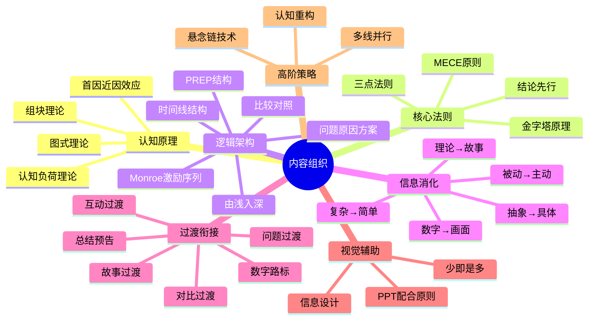

## 二、内容组织

开场抓住了听众的注意力，故事提供了情感连接，但一场演讲的"骨架"——内容组织——决定了信息能否被有效接收、理解和记住。认知心理学家约翰·斯威勒（John Sweller）的认知负荷理论指出：人的工作记忆一次只能处理4±1个信息块（Cowan, 2001）。这意味着，如果你的内容组织不合理，即使素材再精彩，听众的大脑也会"过载"——信息进去了，但什么也没留下。

内容组织不是简单地"把想说的话排个顺序"。它是一门融合了认知科学、修辞学和信息设计的系统工程。本章从底层认知原理出发，系统讲解内容组织的核心法则、逻辑架构、信息消化技术、过渡衔接艺术、不同演讲类型的组织模板，以及高阶演讲者使用的深度组织策略。

---

### 2.1 内容组织的底层认知原理

在讨论具体方法之前，先理解为什么某些组织方式比其他方式更有效。这背后有四条经过验证的认知科学原理。

#### 2.1.1 认知负荷理论（Cognitive Load Theory）

约翰·斯威勒在1988年提出的认知负荷理论是内容组织最重要的理论基础。该理论将认知负荷分为三类：

| 负荷类型 | 定义 | 演讲中的表现 | 应对策略 |
|----------|------|-------------|---------|
| **内在负荷**（Intrinsic） | 内容本身的复杂度 | 主题的难度和深度 | 分层递进，先简后繁 |
| **外在负荷**（Extraneous） | 组织方式造成的额外负担 | 结构混乱、信息冗余、逻辑跳跃 | 优化结构，消除冗余 |
| **相关负荷**（Germane） | 用于理解和内化的认知资源 | 听众将新知识与已有知识关联 | 提供类比、案例、框架 |

**实操含义**：内容组织的核心目标是**最小化外在负荷，最大化相关负荷**。每一条过渡语、每一页PPT、每一个举例，都应该帮助听众节省认知资源，而不是消耗它。

#### 2.1.2 组块理论（Chunking）

1956年，乔治·米勒（George Miller）发表了经典论文《神奇的数字7±2》，揭示了人类短期记忆的容量限制。后来的研究（Cowan, 2001）将这个数字修正为4±1个"组块"。

**什么是组块**：组块是大脑将多个零散信息整合为一个有意义单元的能力。例如：

- 无组织的12个数字：`1 9 8 4 0 7 0 4 1 7 7 6` → 难以记忆
- 组块后的3个有意义单元：`1984` `0704` `1776` → 容易记忆

**演讲中的应用**：

差的组织（10个独立要点）：
1. 市场规模  2. 增长率  3. 竞争格局  4. 用户画像
5. 产品定位  6. 定价策略  7. 推广渠道  8. 团队配置
9. 财务预测  10. 风险分析

好的组织（3个组块，每个包含子要点）：
一、市场机会（市场规模 + 增长率 + 竞争格局）
二、产品策略（用户画像 + 产品定位 + 定价策略）
三、执行计划（推广渠道 + 团队配置 + 财务预测 + 风险分析）

同样是10个信息点，第二种组织方式让听众只需要记住3个"组块"，每个组块内部的子要点通过逻辑关联自动"打包"。

#### 2.1.3 首因-近因效应（Primacy-Recency Effect）

心理学研究发现，在一系列信息中：
- **最先呈现的信息**被记住的概率最高（首因效应）
- **最后呈现的信息**被记住的概率次高（近因效应）
- **中间的信息**最容易被遗忘（"U型曲线"）

记忆留存率
  ^
  |  ■                           ■
  |  ■ ■                     ■ ■
  |  ■ ■ ■               ■ ■ ■
  |  ■ ■ ■ ■         ■ ■ ■ ■
  |  ■ ■ ■ ■ ■   ■ ■ ■ ■ ■
  |  ■ ■ ■ ■ ■ ■ ■ ■ ■ ■ ■
  └──────────────────────────→ 信息顺序
    第1  第2  第3  第4  第5  第6  第7
    ↑                              ↑
  首因效应                      近因效应

**实操含义**：

1. **最重要的信息放在第一个或最后一个**——不要埋在中间
2. **中间位置放最不重要或最有趣的内容**——用趣味性对抗遗忘
3. **结尾部分要强力收束**——听众对最后30秒的记忆比中间10分钟更深刻
4. **在中间位置安排互动**——打破"U型曲线"的下凹

#### 2.1.4 图式理论（Schema Theory）

皮亚杰（Jean Piaget）提出的图式理论指出：人类理解新信息的方式，是将其与大脑中已有的知识结构（图式）进行匹配和整合。当新信息能接入已有图式时，理解和记忆效率大幅提升；当新信息找不到对应的图式时，理解变得困难，遗忘加速。

**演讲中的应用**：

- **先激活已有图式**：在引入新概念之前，先唤醒听众已有的相关知识（"你们都知道……那么想象一下……"）
- **用类比建立新图式**：用听众熟悉的事物解释陌生的概念（"API就像餐厅的服务员——你告诉它你想要什么，它去厨房帮你拿"）
- **用框架固化图式**：给听众一个清晰的思维框架，让他们用这个框架组织所有接收到的信息

---

### 2.2 "三点法则"的深度应用

三点法则（Rule of Three）是演讲内容组织中最强大的工具之一，但大多数演讲者只停留在表面——知道"讲三点"，却不知道为什么、怎么用、以及什么时候不该用。

#### 2.2.1 为什么是"三"——认知科学解释

"三"之所以成为演讲的"魔法数字"，不是巧合，而是多条认知规律的交汇：

**解释一：工作记忆容量**。米勒的7±2法则（后修正为4±1）意味着，人的工作记忆能同时处理大约3-5个独立信息块。"三"恰好在这个范围的低端，是最"安全"的选择——即使听众的认知能力有限，也能轻松处理三个要点。

**解释二：模式识别**。人类大脑是"模式识别机器"。两个点不足以形成模式，四个点会产生"哪个更不重要"的比较焦虑，而三个点刚好形成一个完整、对称、可识别的模式。

**解释三：修辞传统**。从亚里士多德的三段论（大前提→小前提→结论），到黑格尔的辩证法（正题→反题→合题），"三"在西方修辞传统中根深蒂固。中国文化中同样有"三"的传统——"事不过三"、"三思而后行"、"三个臭皮匠"。

**解释四：神经科学证据**。2011年的一项神经科学研究（Ginsburg & Jablonka）发现，人类在处理信息序列时，对第三个元素会产生一个"闭合信号"——大脑自动将其视为"完成"的标志。这就是为什么笑话通常有三个角色（金发女郎、红发女郎、棕发女郎），为什么广告语用三个词（"Just Do It"、"I'm lovin' it"）。

#### 2.2.2 三点法则的五种组织结构

| 结构类型 | 排列方式 | 认知效果 | 适用场景 | 经典案例 |
|----------|---------|---------|---------|---------|
| **并列式** | A、B、C 三个独立维度 | 全面覆盖，各角度权重相等 | 多维度分析、方案展示 | "今天我将从市场、产品、团队三个维度来分析" |
| **递进式** | A→B→C，重要性/难度递增 | 制造"越来越重要"的紧迫感 | 说服型演讲、能力提升 | "第一步是认识自己，第二步是改变习惯，第三步是——彻底重新定义自己" |
| **时间式** | 过去→现在→未来 | 自然流畅，符合时间直觉 | 战略规划、项目汇报、变革推动 | "三年前我们的处境是……今天的现状是……未来三年的规划是……" |
| **问题式** | 问题→原因→方案 | 逻辑严密，说服力强 | 决策建议、变革推动 | "我们的客户流失率达到了20%。为什么？因为……解决方案是……" |
| **故事式** | 起因→经过→结果 | 情感驱动，记忆深刻 | 叙事型演讲、经验分享 | "一切始于一个偶然的发现……经过三个月的验证……最终的结果让我们震惊" |

#### 2.2.3 三点法则的进阶用法

**嵌套三层**：每个大点内部再用三点展开，形成"三的三次方"结构——总共包含9个信息点，但听众只需要处理三层"三"。

核心观点
├── 论点一（三点法则第一层）
│   ├── 支撑论据 1.1
│   ├── 支撑论据 1.2
│   └── 支撑论据 1.3
├── 论点二
│   ├── 支撑论据 2.1
│   ├── 支撑论据 2.2
│   └── 支撑论据 2.3
└── 论点三
    ├── 支撑论据 3.1
    ├── 支撑论据 3.2
    └── 支撑论据 3.3

**变体：2+1结构**：先讲两个相似的要点建立模式，然后用第三个"意外"的要点打破模式，制造惊喜。

> "成功的创业者都有两个共同点：第一，他们极其勤奋；第二，他们善于抓住时机。但还有第三点，也是最重要的一点——他们敢于在所有人反对的时候坚持自己的判断。"

**变体：1+2结构**：先用一个强有力的核心观点，然后用两个不同角度的论据支撑——一个理性（数据），一个感性（故事）。

#### 2.2.4 什么时候不用三点法则

三点法则是"默认选择"，但不是唯一选择。以下情况需要调整：

| 场景 | 建议要点数 | 原因 |
|------|-----------|------|
| 30秒电梯演讲 | 1个核心观点 | 时间太短，只能传达一个信息 |
| 10分钟简短分享 | 2-3个要点 | 简洁有力，不贪多 |
| 30分钟主题演讲 | 3个要点（嵌套） | 经典结构，深度与广度平衡 |
| 60分钟工作坊 | 4-5个要点 | 时间充裕，可以覆盖更多内容 |
| 法律/技术论证 | 按需要，不限数量 | 逻辑严密性优先于记忆友好性 |

---

### 2.3 金字塔原理在演讲中的深度应用

麦肯锡顾问芭芭拉·明托（Barbara Minto）在1987年提出的金字塔原理，是咨询行业组织思维和表达的标准框架。在演讲中应用金字塔原理，可以让你的内容逻辑无懈可击。

#### 2.3.1 四条核心原则

**原则一：结论先行（Lead with the Conclusion）**

先说结论，再说论据。这与学术写作的"引言→方法→结果→讨论"顺序完全相反——学术写作追求的是"证明过程"，而演讲追求的是"传达效率"。

学术写作的逻辑（归纳法）：
证据A → 证据B → 证据C → 因此，结论X

演讲的逻辑（演绎法）：
结论X → 因为证据A → 因为证据B → 因为证据C

**为什么结论先行更有效**：认知心理学中的"锚定效应"表明，人们在接收到第一个信息后，会将其作为"锚点"来解读后续所有信息。当你先给出结论时，听众会用这个结论作为框架来理解和组织后续的论据——每个论据都在强化你的结论。反之，如果你先铺垫论据再给结论，听众在听到结论之前就已经消耗了大量认知资源来"猜你想说什么"。

**原则二：以上统下（Each Level Summarizes the Level Below）**

金字塔的每一层都应该是下一层的概括。这意味着：
- 核心观点是三个论点的总结
- 每个论点是其下所有论据的总结
- 听众在任何层级"下车"，都能得到完整的信息

**原则三：归类分组（Group Similar Ideas Together）**

同一层级的内容必须属于同一逻辑范畴。违反这条原则的典型错误是把"市场规模"和"团队配置"放在同一个层级下——它们属于完全不同的逻辑范畴。

**检验方法——MECE原则**：明托提出MECE（Mutually Exclusive, Collectively Exhaustive）原则——各组之间互不重叠（相互独立），合在一起完全穷尽（完全穷尽）。

差的分组（不MECE）：
一、用户增长    ← "增长"是目标
二、社交媒体    ← "社交媒体"是手段
三、提高留存率  ← "留存"是目标

好的分组（MECE）：
一、拉新（获客渠道、转化漏斗、获客成本）
二、留存（用户激活、使用习惯、流失预警）
三、变现（付费转化、客单价、复购率）

**原则四：逻辑递进（Logical Ordering Within Groups）**

同一组内的内容必须按照某种逻辑顺序排列。常见的逻辑顺序：

| 逻辑顺序 | 适用场景 | 示例 |
|----------|---------|------|
| 时间顺序 | 流程、步骤、历史 | 第一步→第二步→第三步 |
| 结构顺序 | 组织、系统、地图 | 销售部→市场部→技术部 |
| 重要性顺序 | 说服、优先级 | 最重要→次重要→第三重要 |
| 因果顺序 | 分析、诊断 | 原因A→原因B→原因C→结果 |
| 对比顺序 | 评估、选择 | 方案A的优劣 vs 方案B的优劣 |

#### 2.3.2 两种构建方法

**方法一：自上而下法（Top-Down）——适合主题明确时**

步骤：
1. 确定核心观点（你最想让听众记住的一句话）
2. 提出3个支撑论点（回答"为什么这么说？"）
3. 为每个论点准备2-3个论据（数据、案例、故事）
4. 检查MECE：各论点是否互不重叠、完全覆盖？

**方法二：自下而上法（Bottom-Up）——适合素材丰富但主题模糊时**

步骤：
1. 列出所有你想讲的内容点（头脑风暴，不限数量）
2. 将相似的内容点分组（归类）
3. 为每组提炼一个总结性论点（以上统下）
4. 从各组论点中提炼核心观点
5. 检查逻辑：核心观点→论点→论据，链条是否完整？

#### 2.3.3 金字塔原理的实战案例

**案例：产品发布会的内容组织**

核心观点：我们的新产品将重新定义行业标准

├── 论点一：技术突破（为什么能做到）
│   ├── 数据：处理速度比竞品快10倍
│   ├── 案例：XX客户使用后的效果对比
│   └── 演示：现场实时对比测试
│
├── 论点二：用户洞察（为什么需要这样做）
│   ├── 数据：调研显示78%用户对现有方案不满
│   ├── 故事：一个用户的真实痛点经历
│   └── 对比：旧方案 vs 新方案的用户体验
│
└── 论点三：市场时机（为什么是现在）
    ├── 数据：市场窗口期分析
    ├── 趋势：行业发展的三个关键拐点
    └── 行动：首批开放的计划和时间表

---

### 2.4 内容组织的六种逻辑架构

在金字塔原理的宏观框架下，演讲主体部分有六种常用的微观逻辑架构。选择哪种架构取决于演讲目的和听众预期。

#### 2.4.1 PREP结构（观点-理由-案例-重申）

PREP是最简洁有力的"即兴演讲"结构，适合短时间发言、会议讨论和观点表达。

P - Point（观点）：直接说出你的核心观点
R - Reason（理由）：解释为什么这么认为
E - Example（案例）：用具体事例支撑理由
P - Point（重申）：再次强调核心观点

**案例**：

> **P**：我认为公司应该立即启动海外扩张计划。
> **R**：因为国内市场增长已经放缓，而东南亚市场的年增长率达到了23%，是我们国内市场的四倍。
> **E**：看看我们的竞争对手A公司——他们在两年前进入越南市场，第一年就实现了3000万的营收，到去年已经突破2亿。他们的产品和我们的相似度超过80%。
> **P**：所以，海外扩张不是"要不要做"的问题，而是"再不做就来不及"的问题。

**PREP的变体——PREP+A（加行动号召）**：

在最后一个P之后加上Action（行动），适合需要推动决策的场景：
> ……所以，我建议在下个季度之前完成东南亚市场的可行性调研，并在Q3启动试点项目。

#### 2.4.2 问题-原因-方案结构（Problem-Cause-Solution）

这是说服型演讲最经典的结构，适合商业提案、政策建议和变革推动。

一、问题：描述当前的问题和其严重性
二、原因：分析问题产生的根本原因
三、方案：提出你的解决方案
四、优势：解释方案的可行性和优势
五、行动：呼吁听众采取具体行动

**关键技巧**：

- **问题描述要让听众"痛"**：不只是陈述事实，要让听众感受到问题与自己的关系
- **原因分析要深入到根因**：不要停留在表面原因（"五个为什么"分析法）
- **方案要具体可执行**：不要说"我们应该加强管理"，要说"每周三下午3点召开30分钟的进度对齐会"

#### 2.4.3 时间线结构（Chronological Structure）

按照时间顺序组织内容，适合项目汇报、历史回顾和个人成长分享。

一、过去：背景和起源
   - 我们从哪里来
   - 当时面临什么环境
   - 做了什么关键决策

二、现在：现状和分析
   - 我们现在在哪里
   - 取得了什么成果
   - 面临什么新挑战

三、未来：展望和规划
   - 我们要去哪里
   - 具体的路线图
   - 需要什么支持

**变体——倒叙结构**：先展示结果（未来），再回溯过程（过去），最后总结经验（现在）。这种结构适合"成果汇报"——先用成果抓住注意力，再解释"我们是怎么做到的"。

#### 2.4.4 比较对照结构（Compare and Contrast）

当需要在两个或多个方案、观点、策略之间做出选择时，比较对照结构最有效。

一、背景和标准
   - 我们面临什么选择
   - 评估的标准是什么

二、方案A
   - 核心思路
   - 优势和劣势
   - 适用条件

三、方案B
   - 核心思路
   - 优势和劣势
   - 适用条件

四、对比分析
   - 按标准逐项对比（表格）
   - 综合评估

五、建议和行动
   - 推荐方案及理由
   - 实施步骤

**对比表格模板**：

| 评估维度 | 方案A | 方案B | 权重 |
|----------|-------|-------|------|
| 成本 | 初始投入50万 | 初始投入120万 | 25% |
| 时间 | 3个月见效 | 6个月见效 | 20% |
| 风险 | 中等（技术风险） | 低（成熟方案） | 30% |
| 扩展性 | 高（可复用） | 低（定制化） | 25% |
| **综合评分** | **78分** | **82分** | **100%** |

#### 2.4.5 由浅入深结构（Simple to Complex）

从最简单的概念开始，逐步深入到复杂的内容，适合教学型演讲、技术分享和知识普及。

一、基础概念（听众已知）
   - 用听众熟悉的事物引入
   - 建立基本框架

二、核心原理（新知识）
   - 在基础概念上叠加新信息
   - 用类比帮助理解

三、高级应用（深度内容）
   - 深入机制和细节
   - 案例和实践

四、前沿展望（拓展视野）
   - 最新研究和发展
   - 未来趋势和机会

**关键原则——"脚手架"策略**：每一个新的复杂概念都必须搭建在听众已经理解的概念之上。就像盖房子——地基不稳，上层建筑必然倒塌。

#### 2.4.6 Monroe激励序列（Monroe's Motivated Sequence）

由美国传播学家艾伦·门罗（Alan Monroe）在1930年代提出的五步说服结构，至今仍是说服型演讲最有效的框架之一。

第一步：注意（Attention）—— 吸引注意力
  用惊人事实、故事或问题开场

第二步：需求（Need）—— 建立需求感
  揭示问题或痛点，让听众感到"这和我有关"
  用数据量化问题的规模和紧迫性

第三步：满足（Satisfaction）—— 提出解决方案
  清晰描述你的方案
  解释方案的原理和可行性

第四步：可视化（Visualization）—— 描绘未来图景
  正面愿景：如果采纳方案，美好的未来是什么样
  反面警示：如果不行动，糟糕的后果是什么
  用具体场景和数据让愿景"可感知"

第五步：行动（Action）—— 呼吁行动
  给出明确、具体、可执行的行动步骤
  设定时间节点和责任分工

**为什么Monroe序列特别有效**：它完美对应了人类决策的心理过程——先引起注意（感知）→ 再激发需求（情感）→ 然后给出方案（理性）→ 接着描绘愿景（想象）→ 最后推动行动（意志）。这五步覆盖了说服的全部心理维度。

---

### 2.5 过渡的艺术：让内容"流动"起来

过渡是连接不同部分的桥梁。没有过渡的演讲就像没有粘合剂的砖墙——每一块砖都是好的，但墙站不起来。认知心理学研究发现，有效的过渡可以将听众对后续内容的理解度提升30%以上（Mayer, 2009）。

#### 2.5.1 过渡的认知功能

过渡不仅仅是"连接词"，它在听众大脑中完成三个关键功能：

1. **信号功能**：告诉听众"我们要换话题了"——让大脑从当前内容的处理模式中"切换"出来
2. **框架功能**：告诉听众"新话题和旧话题是什么关系"——帮大脑建立逻辑连接
3. **预告功能**：告诉听众"接下来要讲什么"——帮大脑做好接收准备

#### 2.5.2 八种高级过渡技巧

**技巧一：总结-预告过渡（最常用、最安全）**

先总结刚讲过的内容，再预告接下来的内容。

> "刚才我们分析了市场的三个核心趋势——下沉、数字化、个性化。接下来，让我们看看这些趋势对我们的产品策略意味着什么。"

**模板**：`刚才我们[总结]了[X]。接下来，让我们看看[Y]。`

**技巧二：问题过渡（激发好奇心）**

用一个自然的问题作为转折点。

> "那么问题来了：既然我们知道了问题出在哪里，解决方案是什么？"

**模板**：`那么问题来了：[与下一主题相关的自然问题]？`

**技巧三：对比过渡（制造张力）**

用对比词（"但是"、"然而"、"如果说……那么……"）制造张力。

> "如果说前面讲的是问题的严重性，那么接下来我要讲的，是一个令人振奋的解决方案。"

**技巧四：数字路标过渡（建立秩序感）**

用明确的数字标记当前位置。

> "这是第一个原因。第二个原因是……更重要的是第三个原因——"

**技巧五：故事过渡（注入情感）**

用一个简短的故事或轶事作为过渡。

> "说到这里，我想起我去年在深圳遇到的一个创业者。他的经历完美地诠释了接下来我要讲的这个原则。"

**技巧六：金句过渡（提升格调）**

用一句有力量的名言或原创金句作为过渡。

> "彼得·德鲁克说过：'你无法管理你无法衡量的东西。'那么，我们该如何衡量团队的效能？"

**技巧七：互动过渡（重新激活注意力）**

在话题切换时引入听众互动，利用参与感打破注意力下降。

> "好，到这里我需要大家帮个忙。请拿出手机，打开备忘录，写下你目前团队面临最大的一个管理挑战。……写好了吗？好，接下来我要讲的方法，正好可以解决你写的这个问题。"

**技巧八：视觉过渡（利用PPT）**

用一张过渡页（只有核心关键词或一张图）作为视觉信号，给听众一个"心理缓冲区"。

> （PPT切换到一张只有三个字的黑底白字页面："方法论"）
> "好，分析完毕。接下来说说怎么办。"

#### 2.5.3 过渡的常见错误

| 错误类型 | 错误示例 | 正确做法 |
|----------|---------|---------|
| 跳跃式过渡 | "好，接下来说定价策略"（从市场分析直接跳到定价） | "分析完市场机会，我们来确定如何定位价格才能最大化市场份额" |
| 遗忘式过渡 | 讲完一个论点，直接开始下一个，没有任何衔接 | 即使是简单的"接下来"也比没有任何过渡好 |
| 过度过渡 | 每句话之间都有过渡词（"然后"、"接着"、"下面"） | 过渡只在大段落切换时使用，段落内部用逻辑自然衔接 |
| 模糊过渡 | "接下来我想聊聊一些其他的东西" | 明确告诉听众"接下来是什么"以及"和刚才讲的有什么关系" |

---

### 2.6 信息的"消化"处理

听众的信息处理能力是有限的。斯坦福大学的研究表明，人类对纯数字信息的记忆率仅为5-10%，但对故事化信息的记忆率可达65-70%。你的工作是将原始信息"消化"成听众容易吸收的形式。

#### 2.6.1 五种消化技术

**技术一：化抽象为具体**

抽象概念是最难被理解和记住的信息类型。将抽象概念转化为具体的、可感知的表达。

| 抽象表达 | 具体表达 |
|---------|---------|
| "利润大幅增长" | "利润增长了47%，相当于多赚了300万，够给全公司每人发3个月奖金" |
| "用户满意度很高" | "NPS评分达到72分——这个分数在SaaS行业排名前5%，和Slack同一水平" |
| "团队效率提升" | "原来需要3天完成的需求评审，现在45分钟就能结束" |
| "技术架构更优" | "系统响应时间从2秒降到了80毫秒——用户点击后几乎感觉不到等待" |

**技巧：用"相当于"句式建立感知锚点**

> "我们的服务器每天处理50亿次请求——这相当于全球每个人每天向我们的系统发送一次请求。"

**技术二：化复杂为简单（类比法）**

类比是将陌生概念接入已有图式的最高效方式。好的类比能让听众在3秒内理解一个复杂概念。

| 复杂概念 | 精准类比 |
|---------|---------|
| 区块链 | "一本公开透明的账本，每个人都能看到所有交易记录，而且一旦写上去就无法篡改" |
| API | "餐厅的服务员——你告诉它你想要什么，它去厨房（服务器）帮你拿回来" |
| 负载均衡 | "银行的叫号系统——自动把你分配到人最少的窗口，而不是让你排队排到腿软" |
| 机器学习 | "教小孩认猫——你不需要给猫下定义，给它看一万张猫的照片，它自己就学会了" |

**类比的质量标准**：

1. **准确性**：类比的核心逻辑必须与原概念一致——不能为了通俗而牺牲正确性
2. **简洁性**：类比本身必须比原概念更简单——如果类比比原概念还难理解，就失败了
3. **相关性**：类比所用的事物必须是听众熟悉的——对程序员有效的类比对医生可能无效
4. **有限性**：主动指出类比的局限——"但这个类比有一个地方不准确……"

**技术三：化数字为画面**

人脑不擅长处理抽象数字，但极其擅长处理画面。将数字转化为具体的、可视化的场景。

| 原始数字 | 画面化表达 |
|---------|-----------|
| "全球每年浪费13亿吨食物" | "这意味着每秒钟有40吨食物被扔进垃圾桶——你读完这句话的时间里，又浪费了200公斤" |
| "中国有3亿高血压患者" | "如果把中国的高血压患者组成一个国家，它的人口将超过美国，排名世界第三" |
| "我们的系统延迟减少了50毫秒" | "50毫秒是什么概念？人眨一次眼需要300毫秒。我们节省的时间，比你眨眼的六分之一还短——但对高频交易来说，这50毫秒价值2000万美元" |

**技术四：化理论为故事**

再好的理论，如果只是平铺直叙地讲出来，也会变成"催眠曲"。用故事包装理论，让听众在"经历"中"领悟"。

**转换示例**：

> **理论版本**（枯燥）："精益创业的核心理念是'构建-测量-学习'循环——用最小可行产品快速验证假设，根据数据迭代优化。"

> **故事版本**（生动）："2007年，德鲁·休斯顿丢掉了他在巴士上的U盘。那一刻他想：为什么文件不能像人一样，随时随地跟着你走？他花了一个周末做了一个最简陋的同步工具——只支持一个文件夹，界面丑到没法看。他把这个工具分享给了30个人。结果呢？这30个人里有28个说'我需要这个'。六个月后，Dropbox的用户数突破了100万。这就是精益创业的力量——不是在实验室里闷头开发三年，而是用一个'丑陋但能用'的产品，用一个周末的时间，去验证一个价值100亿美元的假设。"

**技术五：化被动为主动（参与式信息传递）**

单向信息传递的效率最低。让听众参与进来，信息的接收效率可以提升2-5倍。

**参与式信息传递的四种方式**：

1. **提问参与**："你们觉得答案是什么？给大家10秒钟思考。"——在揭晓答案前先让听众思考，利用"生成效应"（自己想到的答案比听到的答案记忆更深刻）
2. **投票参与**："认为方案A更好的请举手。认为方案B更好的请举手。"——让听众"表态"，产生"承诺一致性"心理（公开表态后更倾向于坚持）
3. **体验参与**：设计一个小练习或小实验，让听众"动手"体验——"现在请拿出纸笔，用30秒写下你认为团队最大的三个问题"
4. **想象参与**："请闭上眼睛，想象一下三年后你理想中的生活是什么样的……"——利用"具身认知"效应，让听众在脑中"体验"你描述的内容

#### 2.6.2 信息密度的"黄金节奏"

信息密度不是越高越好，也不是越低越好。认知心理学研究发现，最优的信息密度是一个"波浪形"节奏——高密度信息段之后必须有低密度的"消化区"。

信息密度
  ^
  |    ■           ■           ■
  |   ■ ■         ■ ■         ■ ■
  |  ■   ■  ▫    ■   ■  ▫    ■   ■
  | ■     ■ ▫ ■ ■     ■ ▫ ■ ■     ■
  |■       ■   ■       ■   ■       ■
  └──────────────────────────────────→ 时间
     核心内容  故事/互动  核心内容  故事/互动  核心内容

**实操建议**：

| 演讲时长 | 高密度段长度 | 低密度缓冲 | 每段之间的关系 |
|----------|------------|-----------|-------------|
| 5分钟 | 1-2分钟 | 30秒（一个故事或提问） | 1个核心论点+1个缓冲 |
| 15分钟 | 3-4分钟 | 1-2分钟（案例、互动） | 3个核心论点，每个后跟缓冲 |
| 30分钟 | 4-5分钟 | 2-3分钟（故事、讨论、演示） | 3-4个核心论点，交错排列 |
| 60分钟 | 5-8分钟 | 3-5分钟（小组讨论、练习、休息） | 4-5个核心论点，每15分钟一个小循环 |

---

### 2.7 不同演讲类型的内容组织模板

不同类型的演讲需要不同的内容组织方式。以下是六种常见演讲类型的完整组织模板。

#### 2.7.1 工作汇报型

**核心原则**：结论先行，数据说话，行动导向。

一、核心结论（30秒）
   "本季度营收增长23%，超额完成目标。主要增长来自新客户获取和老客户复购。"

二、关键数据（2-3分钟）
   ├── 营收：具体数字、同比/环比、与目标的对比
   ├── 成本：各项支出、ROI分析
   └── 效率：人效、转化率、关键指标

三、亮点与挑战（2-3分钟）
   ├── 亮点：做对了什么、可复制的经验
   └── 挑战：遇到了什么问题、根本原因

四、下一步计划（1-2分钟）
   ├── 目标：下季度的具体指标
   ├── 行动：3-5项关键行动项
   └── 需要的支持：资源、决策、协调

#### 2.7.2 方案说服型

**核心原则**：制造需求感，降低行动门槛。

一、现状痛点（2-3分钟）
   用数据和故事让听众感受到"痛"

二、根因分析（2分钟）
   揭示问题的深层原因——不是表面现象

三、解决方案（3-5分钟）
   ├── 方案概述（一句话说清楚）
   ├── 核心逻辑（为什么这个方案能解决问题）
   ├── 实施路径（分几步走）
   └── 资源需求（需要什么投入）

四、预期收益（1-2分钟）
   ├── 量化收益（ROI、节省成本、增长数字）
   └── 非量化收益（团队士气、品牌价值）

五、行动号召（30秒）
   明确告诉听众：你需要他们做什么

#### 2.7.3 知识分享型

**核心原则**：由浅入深，学以致用。

一、为什么重要（1-2分钟）
   用一个"你不知道这件事会吃亏"的案例开场

二、核心概念（3-5分钟）
   ├── 基础定义（用类比解释）
   ├── 关键原理（用图表展示）
   └── 常见误区（用反面案例说明）

三、实操方法（5-8分钟）
   ├── 步骤拆解（每步配案例）
   ├── 工具推荐（具体到软件名和操作方法）
   └── 注意事项（踩坑经验）

四、案例实战（3-5分钟）
   完整演示一个从零到一的过程

五、行动清单（1分钟）
   "回去之后你今天就可以做的三件事：……"

#### 2.7.4 激励鼓动型

**核心原则**：情感驱动，愿景牵引。

一、共鸣开场（1-2分钟）
   讲一个听众能代入的故事或场景

二、现实困境（2-3分钟）
   描述当前的艰难处境，引发情感共鸣

三、信念点燃（3-5分钟）
   ├── 一个"逆袭"的真实案例
   ├── 揭示成功背后的关键因素
   └── 将因素与听众的能力/资源关联

四、愿景描绘（2-3分钟）
   用场景描绘技术，让听众"看到"成功后的画面

五、行动号召（1分钟）
   "从今天开始，我们一起……"

#### 2.7.5 教学培训型

**核心原则**：学习金字塔——听讲只能记住10%，实践能记住75%。

一、知识输入（占比30%）
   ├── 核心概念讲解
   ├── 原理机制分析
   └── 案例示范

二、引导练习（占比40%）
   ├── 课堂练习（跟着做）
   ├── 小组讨论（互相教）
   └── 角色扮演（模拟场景）

三、反馈纠偏（占比20%）
   ├── 练习成果展示
   ├── 常见错误分析
   └── 正确示范对比

四、总结输出（占比10%）
   ├── 要点回顾
   ├── 课后行动清单
   └── 学习资源推荐

#### 2.7.6 即兴演讲型

**核心原则**：30秒内组织好结构，用框架"带飞"内容。

即兴演讲万能框架（1-2-1结构）：

1句话开头：观点/故事/问题（选一个，直接抛出）
2个支撑：两个不同角度的论据或案例
1句话结尾：重申观点或发出行动号召

总时长控制在1-3分钟内。

**快速组织的思维流程**：

收到话题 → 5秒确定核心观点 → 10秒想两个支撑 → 5秒想结尾 → 开口

---

### 2.8 内容组织中的视觉辅助设计

PPT、白板、道具等视觉辅助工具是内容组织的"延伸"。好的视觉设计能让信息传递效率翻倍，差的视觉设计则会分散注意力、干扰理解。

#### 2.8.1 PPT与演讲内容的配合原则

**原则一：PPT是"配角"，你是"主角"**

PPT是用来辅助你传达信息的，不是用来替代你说话的。如果你的PPT包含所有要讲的内容，听众就不需要你了——他们可以自己看文档。

**原则二：一页PPT只传达一个核心信息**

如果你需要在一页PPT上放三个图表、五段文字、两个数据，说明你需要拆成三页PPT。

**原则三：先说话，再翻页**

在翻到新的一页PPT之前，先用语言预告接下来的内容。这样当听众看到PPT时，已经有了理解框架，而不是面对一堆信息不知从何看起。

**原则四：PPT翻页节奏与内容节奏同步**

大论点切换 = 翻页。小论点展开 = 不翻页（用语言和手势完成）。

#### 2.8.2 不同内容类型的最佳视觉呈现

| 内容类型 | 最佳视觉形式 | 注意事项 |
|----------|------------|---------|
| 数据对比 | 柱状图/条形图 | 不超过6个数据项，颜色区分明显 |
| 趋势变化 | 折线图 | 时间轴清晰，关键拐点标注 |
| 占比构成 | 饼图/环形图 | 不超过5个分类，最大占比放12点方向 |
| 流程步骤 | 流程图 | 每步一个图标，箭头方向明确 |
| 对比分析 | 表格/双栏对比 | 差异项用颜色高亮 |
| 概念关系 | 思维导图/关系图 | 层级不超过3层 |
| 故事场景 | 照片/插画 | 图片质量要高，避免低分辨率素材 |

#### 2.8.3 "少即是多"的信息设计

**反面案例**（信息过载）：
┌────────────────────────────────────────┐
│ 标题：2024年Q3业务分析报告              │
│                                        │
│ [饼图]  [柱状图]  [折线图]  [表格]      │
│ 2段文字说明  3个数据标注  底部注释       │
│                                        │
│ "数据来源：内部统计系统，截至2024.9.30"  │
└────────────────────────────────────────┘

**正面案例**（清晰聚焦）：
┌────────────────────────────────────────┐
│                                        │
│         Q3 营收增长 23%                │
│                                        │
│         [一个巨大的数字]                │
│                                        │
│      超额完成目标 8个百分点              │
│                                        │
└────────────────────────────────────────┘

---

### 2.9 常见的内容组织错误与纠正

#### 错误一：信息堆砌——"什么都想讲"

**症状**：一场20分钟的演讲塞了15个要点，每个都只蜻蜓点水。

**根因**：演讲者害怕"讲少了显得没水平"，或者分不清"我想讲的"和"听众需要的"。

**纠正方法**：

1. 用"如果听众只能记住一件事，你希望是什么？"来确定核心信息
2. 围绕核心信息选择3个支撑论点，其余全部删除
3. 被删除的内容不是"浪费"——它们可以放在附录、Q&A环节或后续分享中

#### 错误二：逻辑跳跃——"为什么突然说这个？"

**症状**：听众经常产生"等等，这和刚才讲的有什么关系？"的困惑。

**根因**：演讲者的脑中有一条清晰的逻辑链，但这条链对听众来说是"隐形"的——演讲者没有把逻辑连接"外化"。

**纠正方法**：

1. 在每个大段落之间加入明确的过渡句
2. 使用"路标语言"——"首先"、"其次"、"然而"、"因此"、"更重要的是"
3. 在每个论点开始时，先说"这个论点和核心观点的关系是……"

#### 错误三：头重脚轻——"开场精彩，后面垮掉"

**症状**：开场用了精心准备的案例或数据，但中段和结尾草草了事。

**根因**：演讲者把大部分准备时间花在开场和PPT上，忽略了中段内容的深度和结尾的力度。

**纠正方法**：

1. 准备内容时按"结尾→中段→开场"的顺序——结尾最重要，应该最先构思
2. 为每个论点准备"三层深度"——概要层（一句话）、展开层（2-3分钟）、细节层（Q&A时使用）
3. 结尾部分投入和开场同等的准备时间

#### 错误四：单调节奏——"全程一个速度"

**症状**：从头到尾信息密度、语速、情绪都在同一水平线上，没有起伏。

**根因**：演讲者对"专业"的误解——认为"严肃=好"，忽略了节奏变化的重要性。

**纠正方法**：

1. 在每个高密度信息段之后安排一个"缓冲区"——故事、提问、互动、停顿
2. 主动在演讲中制造"情绪波浪"——紧张→放松→紧张→高潮→收束
3. 在关键论点前安排一个短暂的停顿——停顿本身就是一种"节奏变化"

#### 错误五：缺乏主线——"讲了很多但不知道在说什么"

**症状**：演讲结束后，听众说"你讲得挺好的"，但说不出核心信息是什么。

**根因**：内容缺乏一个贯穿始终的"红线"（roter Faden），各个部分之间是松散的并列关系，而不是围绕核心观点的有机整体。

**纠正方法**：

1. 在演讲的第一句话就抛出核心观点
2. 每个论点结束时回扣核心观点——"这说明了什么？说明了[核心观点]"
3. 结尾时用不同的措辞再次强调核心观点——三次强化形成"记忆三角"

---

### 2.10 高阶策略：顶级演讲者的内容组织秘诀

#### 2.10.1 "悬念链"技术

在演讲开头制造一个悬念（蔡加尼克效应），然后在整个演讲过程中逐步"解密"——但永远不一次给完。每讲完一个论点，就揭开悬念的一层面纱，直到结尾完全揭晓。

**示例**：

> **开头**："今天我要揭示一个硅谷只有不到1%的人知道的秘密——它解释了为什么有些创业公司能以10倍速增长。"
>
> **论点一结束后**："这是秘密的第一层：他们不竞争，他们创造新市场。但还有第二层……"
>
> **论点二结束后**："第二层是他们的组织方式——但最关键的第三层，也是最违反直觉的一层，我留到最后。"
>
> **结尾**："现在揭晓最后的秘密：他们之所以能10倍增长，是因为他们做了一件所有人都认为'不可能'的事——……"

#### 2.10.2 "多线并行"技术

高级演讲者不是单线推进（A→B→C），而是多线并行——在同一个演讲中同时推进2-3条"故事线"，在关键时刻让它们交汇。

**示例**（双线并行）：

> **线A**（个人故事线）：一个创业者从0到1的经历
> **线B**（方法论线）：精益创业的核心方法
>
> 演讲在两条线之间交替——每讲一步创业故事，就引入一个方法论概念。最后两条线合二为一："这个创业者的故事，其实就是精益创业方法论的一个完美注脚。"

#### 2.10.3 "认知重构"技术

最高级的内容组织不是"传递信息"，而是"改变听众的认知框架"——让听众用一种全新的方式看待一个老问题。

**结构**：

一、听众的旧认知："你们一直认为[旧观点]"
二、认知挑战："但如果我告诉你[新证据]呢？"
三、新框架："用这个新框架来看，一切都说得通了"
四、行动转化："基于这个新认知，你应该[具体行动]"

**案例**（乔布斯2005年斯坦福演讲的核心结构）：

> 旧认知：人生是一条直线——上学→毕业→工作→退休
> 新认知：人生是"连点成线"——你现在经历的一切，未来都会以你意想不到的方式连接起来
> 三个故事印证这个新认知
> 行动号召：Stay hungry, stay foolish

#### 2.10.4 内容组织的"压力测试"清单

在完成内容组织后，用以下清单进行自我检验：

□ 核心信息测试：我能用一句话说清楚这场演讲的核心观点吗？
□ 三点测试：我的主体部分是否恰好有三个（±1）核心论点？
□ MECE测试：三个论点之间是否互不重叠、完全覆盖？
□ 结论先行测试：听众在前30秒内能否知道我要说什么？
□ 过渡测试：每个论点之间是否有清晰的过渡？
□ 故事测试：每个论点是否有至少一个案例或故事支撑？
□ 密度测试：是否有节奏变化？高密度段后是否有缓冲？
□ 结尾测试：结尾是否足够有力？是否回扣了核心观点？
□ 电梯测试：如果演讲被中断在中间，听众是否已经获得了核心价值？
□ "so what"测试：每个要点之后，听众是否会问"所以呢？"——如果会，说明你没有说清楚"这个信息对听众意味着什么"

---

### 2.11 本节要点回顾

**一句话总结**：内容组织的终极目标不是"把信息排好序"，而是"用听众大脑最擅长的方式传递信息"——理解认知原理，选择合适的架构，消化复杂信息，用过渡串联整体，用节奏控制注意力，最终让听众不仅"听到了"，而且"理解了"、"记住了"、"行动了"。

***
