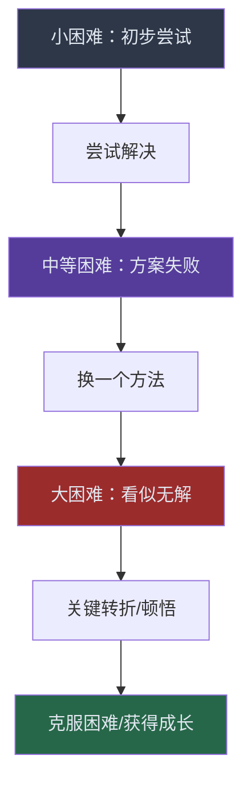
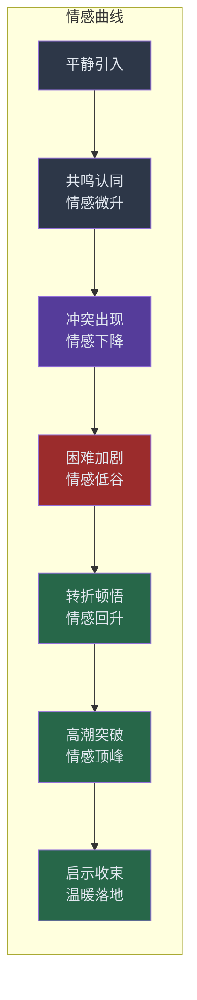

## 三、故事讲述

> "事实告诉人们信息，故事赋予信息生命。"——奇普·希思（Chip Heath），《让创意更有黏性》作者

故事是演讲中最强大的武器。当你在台上说出"让我分享一个数据"时，听众的布洛卡语言区（负责处理语言的区域）开始工作；但当你开始讲故事时，听众的大脑会像亲身经历一样全面激活——听觉皮层、视觉皮层、运动皮层、甚至味觉和嗅觉皮层都会参与处理。普林斯顿大学神经科学家尤里·哈森（Uri Hasson）的研究发现，讲故事时，讲述者和听众的大脑活动会出现"神经耦合"（neural coupling）——听众的大脑开始同步模仿讲述者的脑活动模式。这意味着**故事不是信息传递，而是经验传递**。

一个被数据堆满的演讲，三天后听众可能只记住5%的内容。但如果其中穿插了故事，记住率可以飙升到65%以上——这是斯坦福大学市场营销学教授詹妮弗·阿克（Jennifer Aaker）反复验证过的结论。故事能将抽象概念转化为可感知的体验，将冰冷的数字转化为带温度的记忆。

本章将从故事的底层原理讲起，带你掌握故事结构设计、素材采集、现场演绎和高级技巧，最终建立一套属于你自己的故事讲述体系。

### 3.1 为什么故事如此有效：底层原理

在学习技巧之前，先理解原理。知道"怎么做"是工匠，知道"为什么"才是大师。

#### 3.1.1 神经科学解释：大脑的故事模式

人类大脑在处理信息时有两种模式，丹尼尔·卡尼曼在《思考，快与慢》中将其命名为系统1（直觉、快速）和系统2（理性、慢速）。

| 处理模式 | 触发方式 | 大脑消耗 | 记忆留存 | 情感卷入 |
|---------|---------|---------|---------|---------|
| 系统2（分析模式） | 数据、逻辑、论证 | 高能耗，容易疲劳 | 短期记忆为主 | 低 |
| 系统1（故事模式） | 叙事、场景、情感 | 低能耗，自动处理 | 长期记忆，画面化 | 高 |

当你用数据说服听众时，你要求他们启动系统2进行理性分析——这很累，而且大脑会本能地抵抗。但当你讲故事时，系统1自动接管，听众在毫不费力的状态下就接受了你传递的信息，而且因为情感卷入，记忆会更加深刻持久。

**催产素效应**：神经经济学家保罗·扎克（Paul Zak）的研究表明，当人们沉浸在故事中时，大脑会释放催产素——一种与同理心、信任和社交连接相关的神经递质。催产素水平越高，听众越愿意合作、分享和行动。这就是为什么TED演讲者几乎都会用故事开场——不是因为规定如此，而是因为故事能直接改变听众的生化状态。

#### 3.1.2 心理学解释：故事满足的基本需求

从心理学角度看，故事满足了人类几个基本的心理需求：

1. **意义建构需求**：人天生需要为事件赋予意义。孤立的数据和事实让人困惑，故事将碎片编织成有因果关系的整体，让世界变得"可理解"。
2. **代入体验需求**：人类通过模仿学习。故事提供了一种安全的"虚拟体验"——听众可以在不承担真实风险的情况下，体验他人的成功和失败，从中提取教训。
3. **情感调节需求**：好故事能引发共鸣、感动、振奋等积极情绪，这些情绪本身就有价值，同时也让信息更容易被接受。
4. **社交归属需求**：分享故事是建立人际连接的基本方式。一个真诚的个人故事能迅速拉近讲述者与听众之间的心理距离。

#### 3.1.3 修辞学解释：亚里士多德的三要素

早在两千多年前，亚里士多德就提出了说服的三要素：

- **Logos（逻辑）**：论证的合理性——故事提供了逻辑的载体
- **Ethos（人格）**：讲述者的可信度——故事展现你的真实经历和品格
- **Pathos（情感）**：唤起听众情感——这是故事的核心强项

一个完整的演讲说服需要三者兼备，而故事是唯一能同时调动三种要素的工具。一段真诚的个人经历（Ethos）包含具体的因果逻辑（Logos）并能引发听众情感共鸣（Pathos），三者融为一体，这就是故事为什么比任何其他修辞手段都更有力量。

### 3.2 故事的结构模型

好故事不是灵感的产物，而是精心设计的结果。掌握故事结构，你就能把任何素材变成引人入胜的叙事。

#### 3.2.1 STAR模型：职场演讲的首选

STAR模型是结构化讲故事的经典框架，特别适合工作汇报、项目复盘和面试场景。

| 要素 | 英文 | 含义 | 关键点 |
|------|------|------|--------|
| S | Situation（情境） | 故事发生的背景 | 用具体细节让听众快速进入场景 |
| T | Task（任务） | 面临的挑战或目标 | 明确说明难度和紧迫性 |
| A | Action（行动） | 你采取了什么行动 | 突出决策过程和关键选择 |
| R | Result（结果） | 行动带来的结果 | 用数据量化，用感悟收尾 |

**STAR模型的实战示例**：

假设你要在汇报中展示自己的项目管理能力：

> **（S）** 去年Q3，我们团队接到了一个紧急任务——要在6周内完成新产品上线，而正常周期是12周。团队只有5个人，其中2个是刚入职的新人。
>
> **（T）** 我面临的核心挑战是：如何在资源减半、时间减半的情况下保证质量不打折。
>
> **（A）** 我做了三件事：第一，把项目拆成最小可交付单元，每天验收一次，快速暴露问题；第二，安排老带新的结对编程，新人上手速度提升了一倍；第三，主动跟产品方砍掉了30%的低优先级需求，把精力集中在核心功能上。
>
> **（R）** 最终我们按期上线，首月用户满意度达到4.6分（满分5分），零P0级故障。更重要的是，两个新人在这个项目中快速成长，一个季度后都能独立负责模块了。这个经历让我深刻理解到：项目管理的核心不是"管"，而是"聚焦"。

**STAR模型的使用要点**：

- **情境部分不超过整体的20%**：很多人的错误是花太多时间铺垫背景，听众还没进入正题就失去了耐心。
- **任务部分要突出"张力"**：任务的难度和紧迫性决定了故事的吸引力。如果任务太简单，故事就没有看点。
- **行动部分是核心，占40%-50%**：听众最想听的是"你做了什么"和"你为什么这么做"。不要只列行动，要解释决策背后的思考。
- **结果部分要有"翻转"**：如果结果完全在意料之中，故事就缺乏惊喜。最好的结果叙事是"看似不可能，但做到了"。

#### 3.2.2 英雄之旅：打动人心的经典叙事

约瑟夫·坎贝尔（Joseph Campbell）在《千面英雄》中揭示了人类最古老的故事结构——英雄之旅（Hero's Journey）。从《奥德赛》到《星球大战》，从《西游记》到《哈利·波特》，全世界最深入人心的故事都遵循这个结构。

英雄之旅包含12个阶段，可以分为三个大幕：

**第一幕：出发（离开舒适区）**

1. **平凡世界**：英雄的日常生活，展示"一切正常"的状态。这个阶段的目的是让听众产生认同——"这个人跟我一样普通"。
2. **冒险召唤**：出现一个打破常规的事件——一个机会、一个危机、一个无法忽视的问题。这是故事的"钩子"。
3. **拒绝召唤**：英雄的犹豫和恐惧。"我真的能行吗？""这太冒险了。"这个阶段极其重要——它展示了英雄的人性弱点，让听众更加共情。
4. **遇见导师**：获得指引、建议、工具或信念。导师可以是一个人、一本书、一次顿悟，甚至是失败本身。
5. **跨越门槛**：英雄做出决定，踏上征程。这是故事的第一个高潮——不可逆转的选择。

**第二幕：试炼（面对挑战）**

6. **考验、盟友与敌人**：英雄遇到各种挑战，结识帮助者和阻碍者。这个阶段展示英雄如何成长。
7. **接近最深的洞穴**：英雄面临最大的恐惧和障碍。紧张感持续攀升。
8. **磨难**：最严峻的考验——可能是失败、背叛、丧失。英雄在最低谷中找到内在力量。

**第三幕：回归（带着收获回来）**

9. **奖赏**：英雄获得宝物——可以是外在的成功，也可以是内在的成长和领悟。
10. **回归之路**：带着收获返回，但可能面临最后的挑战。
11. **复活**：经历最终考验，完成彻底的蜕变。
12. **携万灵药归来**：英雄带着"灵药"回到日常世界——这灵药就是他要分享给听众的启示。

**演讲中的简化版英雄之旅**：

在5-15分钟的演讲中，你不需要完整走完12个阶段。一个高效的简化版本：

**为什么"拒绝召唤"阶段如此关键**：很多演讲者为了塑造完美形象，会跳过犹豫和恐惧，直接从"遇到挑战"跳到"成功克服"。但这恰恰是最大的错误。听众不会被"我天生就很强"打动，他们会被"我也很害怕，但我还是去做了"打动。脆弱性（vulnerability）是建立信任最快的方式。

#### 3.2.3 起承转合：东方叙事传统

起承转合是东方叙事的基本框架，简洁而有力，特别适合3-5分钟的短故事。

| 阶段 | 功能 | 时间占比 | 技巧要点 |
|------|------|---------|---------|
| **起** | 铺设情境，引入人物 | 20% | 用一句话抓住注意力，快速建立代入感 |
| **承** | 发展矛盾，积累张力 | 30% | 层层递进，让困难逐步升级 |
| **转** | 关键转折，打破预期 | 30% | 出人意料但合乎情理的转折点 |
| **合** | 收束故事，点明启示 | 20% | 回扣主题，留下余味 |

**起承转合 vs STAR模型的选择**：

- **STAR模型**适合：工作汇报、项目复盘、案例分析等偏理性的场景。结构清晰，逻辑性强，适合需要展示因果关系的叙事。
- **起承转合**适合：开场故事、个人分享、激励演讲等偏感性的场景。节奏感强，更有文学性，适合需要情感冲击力的叙事。
- **英雄之旅**适合：长篇叙事、主题演讲、创业故事等需要深度共鸣的场景。层次丰富，适合完整的人物成长弧线。

#### 3.2.4 问题-方案-结果模型：说服性演讲的利器

当你需要说服听众接受某个观点或方案时，这个模型最为高效：

1. **问题（Problem）**：描述听众正在经历的痛点，越具体越好。让听众内心产生"对，我就是这样"的认同。
2. **方案（Solution）**：展示你的解决方案。如果方案包含故事（比如"我曾经也遇到这个问题，后来我发现……"），说服力会倍增。
3. **结果（Result）**：用具体结果证明方案有效。数据、对比、前后变化，都是强有力的证据。
4. **行动号召（Call to Action）**：告诉听众下一步应该做什么。

### 3.3 故事的五个核心要素

一个好故事由五个要素构成，缺少任何一个，故事就会显得"不对劲"。

#### 3.3.1 要素一：具体可感的人物

好故事需要一个让听众能够代入的人物。不是"有一个人"，而是一个有名有姓、有处境有情感的活生生的人。

**为什么"具体"如此重要**：心理学中有一个概念叫"可识别受害者效应"（Identifiable Victim Effect）。人们对一个具体的、可识别的个体的同情心，远远超过对抽象群体的同情。"一个叫小明的程序员，连续加班三天后在工位上崩溃了"远比"很多程序员工作压力大"更有冲击力。

**让人物立起来的四个维度**：

1. **身份标签**：给听众一个快速代入的锚点。"一个在北京租房的90后""一个刚转行做产品经理的前教师"。
2. **处境描述**：人物处于什么状态？面临什么压力？这让听众判断"我和他是否相似"。
3. **内心世界**：人物在想什么？害怕什么？渴望什么？内心独白是建立共情的捷径。
4. **具体行为**：不要说"他很努力"，要说"他每天早上5点起床，先花一小时看技术文档，然后花两小时写代码练手"。

#### 3.3.2 要素二：真实的冲突

冲突是故事的引擎。没有冲突的"故事"只是一段流水账。注意：冲突不一定是人与人之间的对抗，它可以是任何形式的张力。

**三种冲突类型**：

- **内心冲突**（人与自己）：恐惧、犹豫、自我怀疑、价值观的撕裂。这类冲突最容易引发共鸣，因为每个人都会经历。
  - 示例："我知道应该接受那个offer，但每次想到要离开待了五年的团队，胸口就像压了一块石头。"
- **人际冲突**（人与人）：意见分歧、利益冲突、误解、对抗。这类冲突最有戏剧性，但要小心——在演讲中讲人际冲突时，不要让自己看起来在"抱怨"或"甩锅"。
  - 示例："产品和技术团队在评审会上僵持不下，产品说'用户要的就是这个功能'，技术说'这个架构根本撑不住'。"
- **环境冲突**（人与环境/系统）：资源不足、时间紧迫、技术限制、政策变化、市场突变。这类冲突最客观，适合职场和商业场景。
  - 示例："竞品突然宣布免费开放我们收费的核心功能，整个行业格局一夜之间变了。"

**冲突升级技巧**：好故事的冲突不是一次性抛出的，而是层层递进的。每一层冲突的解决会引出更大的冲突，直到推向最高潮。这就是所谓的"上升动作"（rising action）。

#### 3.3.3 要素三：感官细节

感官细节是故事的"3D眼镜"——它把平面的叙述变成三维的体验。普林斯顿大学的研究证实，当演讲者使用感官语言时，听众大脑中对应的感官区域会被激活，产生"感同身受"的效果。

**五感描写清单**：

| 感官 | 描写角度 | 示例 |
|------|---------|------|
| 视觉 | 颜色、光线、大小、形状、动态 | "会议室的白板上密密麻麻写了十几个方案，又被一条条划掉，最后只剩下三个" |
| 听觉 | 声音大小、音质、节奏 | "凌晨两点的办公室，只剩下键盘敲击声和空调嗡嗡的低鸣" |
| 触觉 | 温度、质地、疼痛、压力 | "那天下着大雨，我跑到客户公司时衬衫已经湿透了，贴在背上又冷又黏" |
| 味觉 | 酸甜苦辣、口腔感受 | "验收通过后大家点了外卖庆祝，那是我吃过的最香的麻辣烫" |
| 嗅觉 | 气味、空气质感 | "走进那个老办公室，扑面而来的是旧纸张和灰尘混合的味道" |

**感官细节的使用原则**：

- **少而精**：不是越多越好。一两个精准的感官细节比五个泛泛的描写更有效。选择最能推动故事情感的细节。
- **服务于情感**：每个感官细节都应该有目的——不是为了"描写而描写"，而是为了唤起特定的情感。"灰色的天空"暗示低落，"键盘声和低鸣"暗示孤独和坚持。
- **让听众自己推断**：不要说"他很紧张"，而是说"他反复搓着手指，嘴角微微发颤"——让听众自己得出"他很紧张"的结论。这就是"展示，不要讲述"（Show, don't tell）的写作原则。

#### 3.3.4 要素四：情感共鸣

故事的力量来自情感。没有情感的故事只是一份事件记录。但情感不是喊出来的，而是通过细节和结构"让听众自己感受到的"。

**制造情感共鸣的四种技巧**：

1. **展示脆弱性**：分享你真实的失败、恐惧和不完美。当你说"我当时真的很害怕"时，听众不会觉得你弱——他们会觉得你真实，从而产生信任。
2. **制造反差**：先抑后扬、先喜后悲、期望与现实的落差——反差越大，情感冲击越强。"我花三个月准备的提案，客户只看了第一页就否了"——这样的反差让听众的注意力瞬间集中。
3. **使用"我也是"时刻**：在故事中植入一个听众会点头的瞬间。"我相信你们也有过这样的经历——周日晚上，一想到明天要上班，胃就开始发紧"。这个瞬间让听众觉得"他理解我"。
4. **留白与沉默**：在最触动人心的时刻，不要急于说下去。沉默2-3秒，让情感在空气中发酵。停顿本身就是一种强大的情感表达。

**情感曲线设计**：好故事的情感不是一条直线，而是一条有起伏的曲线。你需要在演讲前就规划好情感的走势。

#### 3.3.5 要素五：明确的启示

故事的最后一块拼图是启示——你希望听众从故事中"带走"什么。没有启示的故事就像一封没有签名的信，让人觉得"所以呢？"

**启示的三种呈现方式**：

1. **显性点题**：在故事结束后直接说明。"这个经历教会我一个道理：真正的勇气不是不害怕，而是害怕了还去做。"这种方式最清晰，适合理性导向的听众。
2. **隐性暗示**：不直接说出启示，而是通过故事的结局让听众自己领悟。"他后来成了那家公司最年轻的CTO。"——听众自然会推导出"坚持和勇气带来成功"。这种方式更有回味，适合感性导向的听众。
3. **问题引导**：用一个反问句把启示转化为听众的自我反思。"如果当初他选择了放弃，今天的他会是什么样？"这种方式最具互动性，能让听众主动参与思考。

**启示与主题的连接**：启示不是故事的"附属品"，它是你选择讲这个故事的根本原因。在构思故事之前，先确定你想传递的核心信息（key message），然后反推：什么样的故事能够最有力地承载这个信息？

### 3.4 故事的素材来源与故事库建设

很多人抱怨"我没有故事可讲"。事实是：你每天都在经历故事，只是你没有学会"看见"它们。

#### 3.4.1 五个故事来源

| 来源 | 特点 | 适用场景 | 注意事项 |
|------|------|---------|---------|
| **个人经历** | 最真实、最有感染力 | 任何场景 | 需要克服"分享个人经历很尴尬"的心理障碍 |
| **他人故事** | 素材丰富、视角多样 | 案例分析、行业分享 | 必须获得当事人许可，或隐去可识别信息 |
| **历史事件** | 权威感强、经得起验证 | 教育培训、主题演讲 | 要查证事实准确性，不要以讹传讹 |
| **新闻时事** | 时效性强、贴近现实 | 开场引入、引发共鸣 | 选择持久性强的事件，避免过度消费悲剧 |
| **寓言传说** | 寓意深刻、文化底蕴 | 文化交流、价值传递 | 要给老故事注入新解读，不要重复听众已知的寓意 |

#### 3.4.2 故事采集的日常练习

建立故事库不是一个周末就能完成的事，而是一种需要持续培养的思维习惯。

**每日故事捕捉法**：

每天花5分钟，回忆当天发生的三件事，问自己：
1. 这件事有什么冲突或张力？
2. 这件事中有什么让我意外的地方？
3. 这件事能说明什么道理？
4. 如果要在演讲中用这件事，开头怎么说？

把答案写下来。不需要写完整的故事，几句话的速记就够了。一个月后你会发现，你已经积累了将近100个故事素材。

**"故事雷达"思维**：

训练自己用"故事视角"观察生活。当你听到一则新闻、经历一件事、读到一篇文章时，自动问自己："这里面有故事吗？"以下这些"信号"通常意味着好的故事素材：

- 一个出人意料的转折
- 一次从失败到成功的逆袭
- 一个反常识的结论
- 一次令人心碎的丧失
- 一个"小人物做了大事"的时刻
- 一次打破常规的选择

#### 3.4.3 个人故事库的分类体系

建议按照"主题×情感"两个维度来组织你的故事库：

**按主题分类**：

- 勇气与突破：面对恐惧、做出艰难选择的故事
- 失败与重启：跌倒后爬起来、从失败中学习的故事
- 坚持与耐心：长期主义、延迟满足的故事
- 创新与变革：打破常规、创造新事物的故事
- 合作与领导：团队协作、带领团队的故事
- 意外与转折：计划外的发现、偶然带来必然的故事

**按情感基调分类**：

- 振奋型：让人心潮澎湃、想要立刻行动的故事
- 温暖型：让人感到人性美好、内心柔软的故事
- 震撼型：让人感到意外、重新审视认知的故事
- 幽默型：让人发笑、放松警惕的故事（幽默是最好的破冰工具）

**按演讲位置分类**：

- 开场故事：短小精悍，3分钟内讲完，目的是抓住注意力
- 中间故事：详细展开，用于论证和支持核心论点
- 结尾故事：有余味，留思考空间，目的是强化记忆

### 3.5 故事讲述的现场演绎技巧

一个好故事，写在纸上只能得60分。能不能拿满分，取决于你怎么"演"出来。

#### 3.5.1 节奏控制：故事的呼吸

节奏是故事演绎中最重要也最容易被忽视的要素。很多演讲者语速均匀如念稿，好故事讲成了催眠曲。

**节奏控制的四大手法**：

1. **关键时刻放慢语速**：当故事到达冲突、转折或高潮时，刻意放慢速度，每个字都清晰地送到听众耳边。这种"慢"会制造出极强的张力——听众知道重要的话要来了，会不自觉地集中注意力。

2. **在转折点前停顿**：停顿是演讲中最强大也最廉价的工具。当你准备揭示一个关键信息时，停顿2-3秒。这几秒的沉默会让整个房间安静下来，所有人的注意力都会聚焦在你身上。
   - "他看着老板的眼睛，说了一句话，彻底改变了整个项目的走向。"（停顿3秒）"他说：'这个需求，我不做。'"

3. **叙述性段落保持中速**：背景介绍、过渡衔接等非关键部分，用正常语速推进即可，不要在这些地方浪费情感资源。

4. **紧张情节适当加速**：当故事进入紧迫的时刻（倒计时、紧急状况、追逐等），适当加快语速可以营造紧迫感。但加速不能以牺牲清晰度为代价。

#### 3.5.2 声音变化：用声音塑造角色

你的声音是一支"单人乐队"——音量、音调、语速、音色的变化可以创造出不同的"声部"。

| 声音维度 | 变化方式 | 效果 | 应用场景 |
|---------|---------|------|---------|
| **音量** | 提高：强调关键信息；降低：制造亲密感和悬念 | 控制注意力的聚焦点 | 高：高潮和结论；低：内心独白、秘密 |
| **音调** | 升调：疑问、惊讶；降调：确定、权威 | 传递情绪和态度 | 升调：冲突出现时；降调：做出判断时 |
| **语速** | 快：紧迫、兴奋；慢：庄重、深情 | 调节故事的节奏感 | 快：紧张情节；慢：启示和感悟 |
| **音色** | 沙哑：疲惫、沧桑；明亮：兴奋、希望 | 增强画面感 | 根据故事中的人物状态调整 |

**"角色切换"技巧**：当你在故事中引入多个人物的对话时，可以用声音的微小变化来区分角色。不需要夸张地"扮演"，只需要在音调和语速上做微调：

- 你自己的话：正常音调
- 对方的话：音调略微降低或升高
- 内心独白：音量略微降低，语速略慢

#### 3.5.3 肢体语言：让身体参与叙事

肢体语言是故事演绎的"放大器"。恰当的肢体动作能让故事从"听到"升级为"看到"。

**眼神运用**：

- **讲述回忆时**：目光微微向右上方或远方看去，仿佛在回忆。这会给听众一个视觉暗示——你在"看见"过去的画面。
- **与听众对话时**：直接注视特定的听众，而不是扫视全场。选择一个听众说完整句话，再转向另一个人。
- **关键时刻**：在故事最紧张或最感人的瞬间，低下头或移开目光一两秒。这种"不忍直视"的动作会强烈地传递情感。

**手势运用**：

- **大小手势**：描述宏观场景时用大手势（张开双臂），描述细节时用小手势（双手收拢）。手势的大小会自然地帮助听众理解场景的"尺度"。
- **方向手势**：用左手表示"过去"，右手表示"未来"；用左手表示"一方的观点"，右手表示"另一方的观点"。这种空间映射能帮助听众更好地理解逻辑关系。
- **暂停手势**：双手停在空中不动——这个动作配合停顿，能制造极强的悬念效果。

**空间移动**：

- 讲不同人物的对话时，可以向舞台不同方向移动两步，用物理空间来"扮演"不同角色。
- 从舞台一侧走到另一侧，可以象征性地表达"从过去到现在""从问题到解决""从失败到成功"的转变。
- 走向听众（向前走几步）可以制造亲密感；退回舞台中央可以表达"回到客观视角"。

#### 3.5.4 开场与收尾：故事的"第一印象"和"最后一击"

**故事开场的五种钩子**：

1. **悬念式**："2019年3月15日，我的手机响了17次。每一个电话都让我的心沉下去一截。"
2. **对话式**："'你确定？'他盯着我，眼睛里全是怀疑。'确定。'我说，尽管我的手在桌子下面抖。"
3. **画面式**："凌晨三点的深圳，南山科技园B座23楼，只剩一盏灯还亮着。"
4. **反常识式**："我人生中最成功的一次演讲，开头就犯了一个致命错误。"
5. **提问式**："你有没有经历过这样的时刻——所有人都看着你，等你做决定，而你完全不知道该怎么办？"

**故事收尾的三种手法**：

1. **回扣开头**：在结尾呼应开场的画面、台词或问题，形成首尾呼应的闭环。
   - 开场："凌晨三点，只剩一盏灯还亮着。"
   - 收尾："现在回头想想，那盏凌晨三点的灯，照亮的不是项目，而是我自己的路。"
2. **留白**：故事讲到最关键的地方戛然而止，给听众留下思考空间。
   - "他没有说话，只是站起来，走出了会议室。"（停顿）"三个月后，他带着一个全新的方案回来了。"
3. **升华**：从个人故事上升到普遍真理。
   - "这不是我一个人的故事。我相信在座的每一位，都有过类似的挣扎。区别只在于——你是选择了继续走，还是停下了。"

### 3.6 常见故事讲述误区与纠正

#### 误区一：故事太长，淹没主题

**症状**：一个故事讲了10分钟，听众早已忘记你为什么要讲这个故事。

**纠正方法**：遵循"三分钟法则"——除非是演讲的核心故事（整场演讲就讲一个故事），否则单个故事控制在3分钟以内。问自己："如果砍掉这句话，故事还能成立吗？"能砍就砍。

#### 误区二：过度自我美化

**症状**：故事里的"我"无所不能、从不犯错、一眼看穿一切。

**纠正方法**：展示真实的你——包括你的犹豫、错误和不完美。听众不信任"完人"，他们信任"和我一样有弱点但依然努力的人"。

#### 误区三：启示与故事脱节

**症状**：故事讲完了，突然转到一个跟故事毫无关系的结论。

**纠正方法**：在准备阶段就确定"这个故事要证明什么"，然后从结论倒推，确保故事的每个环节都服务于这个结论。

#### 误区四：只有"告诉"没有"展示"

**症状**："他很努力""她很聪明""那次经历让我成长了很多"——全是抽象的描述。

**纠正方法**：用具体的行为和细节替代抽象的形容词。不要说"他很努力"，说"他连续三周每天工作到凌晨一点，代码提交记录排满了整个屏幕"。

#### 误区五：忽视听众背景

**症状**：对技术人员讲创业鸡汤，对销售团队讲纯技术细节。

**纠正方法**：选故事前先回答三个问题：听众是谁？他们关心什么？他们经历过什么？用听众熟悉的场景和语言讲你的故事。

#### 误区六：一个故事硬塞多个启示

**症状**：一个故事结尾列了三个"教训"，每个都不够深入。

**纠正方法**：一个故事只承载一个启示。如果需要多个启示，就讲多个故事。

### 3.7 数据故事：让数字会说话

在商业和技术演讲中，你不可避免地需要呈现数据。但纯数据是枯燥的——人类大脑天生不擅长处理抽象数字。"数据故事"（Data Storytelling）就是把数据转化为叙事的技术。

#### 3.7.1 数据故事的三层结构

1. **数据（Data）**：原始的事实和数字——这是基础层。
2. **叙事（Narrative）**：用一条故事线串联数据——这是骨架。
3. **可视化（Visualization）**：用图表让数据"看得见"——这是皮肤。

三层缺一不可。只有数据没有叙事，听众会迷失在数字中；只有叙事没有数据，缺乏说服力；没有可视化，数据的冲击力减半。

#### 3.7.2 让数据讲故事的四种技巧

**技巧一：找参照系**

孤立的数字没有意义。"我们的用户增长了300%"——听起来不错，但300%到底是从10个涨到40个，还是从100万涨到400万？给数字一个参照系，听众才能理解它的分量。

- 不好："今年营收达到5000万。"
- 好："今年营收5000万——相当于去年的3倍，在全行业平均增速只有15%的背景下，我们跑赢了大盘20倍。"

**技巧二：用对比制造冲击**

人类对对比极其敏感。单说"我们的产品快"没有感觉，但"竞品需要3秒打开，我们只需要0.3秒"就立刻有冲击力。

**技巧三：把数字变成画面**

数字本身是冰冷的，但当你把它转化成一个具体的画面时，它就有了温度。

- 不好："我们每天处理1亿条数据。"
- 好："1亿条数据是什么概念？如果把每条数据打印在一张A4纸上，堆起来的高度相当于33座珠穆朗玛峰。"

**技巧四：用趋势讲故事**

单个数据点是静止的，但一组数据点连成趋势线就是一条叙事弧线。

- 不好："现在客户满意度是4.2分。"
- 好："去年这个时候，客户满意度是2.8分——我们在行业排名倒数第三。六个月的改进之后，今天是4.2分，行业第三。这不是终点，但这条上升曲线证明了一件事：方向对了，坚持就有回报。"

### 3.8 高级技巧：故事讲述的进阶修炼

#### 3.8.1 嵌套故事（故事中的故事）

在一个主故事中嵌入另一个故事，可以创造叙事的层次感和深度。

结构示例：
- 主故事：我如何从一个内向的程序员成长为一个能做千人演讲的人
  - 嵌套故事1：我第一次做技术分享时的灾难经历
  - 嵌套故事2：一位导师教我的"演讲心法"
  - 嵌套故事3：我在一次失败后重新站起来的经历

注意：嵌套故事不宜超过两层，否则听众会迷失在"故事套故事"中。

#### 3.8.2 多视角叙事

同一个事件，从不同角色的视角讲述，可以呈现更丰富、更立体的画面。

- 视角A（客户）："那天我收到一封邮件，打开一看，你们系统又崩了。我气得差点把电脑摔了。"
- 视角B（工程师）："凌晨两点收到告警，我从床上弹起来打开电脑，看到满屏红色心跳加速。"
- 视角C（你/项目经理）："第二天早上走进办公室，两封投诉邮件在等我。我知道这个项目到了最危险的时刻。"

三个视角拼在一起，比单一视角讲述了更完整、更有张力的故事。

#### 3.8.3 "可复用故事"的模块化设计

高级演讲者会把故事模块化，像乐高积木一样根据不同场景灵活组合。

一个故事通常可以拆成三个模块：
- **情境模块**（30秒版/1分钟版/3分钟版）：随时根据时间限制选择精简或展开
- **冲突模块**：根据听众类型选择突出"内心冲突""人际冲突"或"环境冲突"
- **启示模块**：同一个故事可以根据不同主题引出不同的启示

例如，同样是"创业失败"的故事：
- 在"勇气"主题的演讲中：突出"明知可能会失败还是去做了"的启示
- 在"团队"主题的演讲中：突出"一个人扛不住但团队可以"的启示
- 在"创新"主题的演讲中：突出"那次失败孕育了后来真正的突破"的启示

#### 3.8.4 幽默在故事中的运用

幽默是最被低估的演讲工具。笑声不仅能缓解紧张，还能加深记忆——心理学研究表明，带有幽默的信息比严肃信息的记忆留存率高15%-20%。

**故事中的幽默来源**：

1. **自嘲**：拿自己开涮是最安全的幽默方式。"我做了精心准备，排练了十遍，结果上台第一句话就把公司名说错了。"
2. **反差**：期望与现实的巨大落差产生喜剧效果。"我以为'敏捷开发'就是加班加得快——后来才知道不是这么回事。"
3. **意外**：在听众以为故事要往某个方向走时，突然拐弯。"他沉默了很久，深吸一口气，说：'这个方案……我没什么意见。'全场都愣了——没人想到最难搞的人居然第一个同意了。"

**使用幽默的红线**：

- 不要拿听众或在场的任何人开玩笑
- 不要嘲笑弱势群体
- 不要用可能冒犯特定文化的笑话
- 幽默失败时不要解释"这是一个笑话"——直接继续就好

#### 3.8.5 共鸣故事的设计公式

如果你需要快速构建一个引发共鸣的故事，可以使用以下公式：

[身份代入] + [共同痛点] + [出乎意料的转折] + [超越期待的启示]

展开来说：
1. 开头让听众觉得"这个人跟我一样"（身份代入）
2. 中间触及听众正在经历的困境（共同痛点）
3. 然后给出一个他们没想到的转折（出乎意料）
4. 最后带出一个让他们觉得"我也可以试试"的启示（超越期待）

### 3.9 故事讲述的准备清单

在下一次演讲前，用这个清单检查你的故事准备：

- [ ] **目标明确**：我清楚这个故事要传递的核心信息是什么
- [ ] **结构完整**：故事有清晰的开头、中间和结尾
- [ ] **人物具体**：故事中有具体的、可代入的人物
- [ ] **冲突真实**：故事中有让人感受到张力的冲突
- [ ] **细节生动**：至少有2-3个感官细节
- [ ] **情感递进**：情感有起伏，不是一条直线
- [ ] **启示清晰**：故事的启示与演讲主题紧密相关
- [ ] **时长可控**：故事时长适合演讲的整体节奏
- [ ] **排练充分**：至少完整练习3遍，录下来听一遍
- [ ] **开场有力**：第一句话就能抓住注意力
- [ ] **收尾有余**：结尾留有回味和思考空间
- [ ] **适应听众**：故事的选择和表达方式适合当前听众

### 3.10 从今天开始：你的21天故事训练计划

**第1周：收集**

- 每天用5分钟记录当天发生的3件小事
- 回顾人生中的10个关键转折点，每个写3-5句速记
- 观看3个TED演讲，标记其中的故事部分，分析结构

**第2周：构建**

- 从收集的素材中选出5个最有潜力的故事
- 用STAR模型和起承转合分别重构这5个故事
- 给每个故事加上感官细节和情感描写
- 写出每个故事的30秒版、1分钟版和3分钟版

**第3周：演绎**

- 每天对着镜子练习一个故事，注意节奏和停顿
- 录制视频回看，关注自己的表情和手势
- 找一个朋友或同事，给他们讲一个故事，收集反馈
- 在一次真实场景（会议、聚餐、聊天）中使用一个故事

21天后，你将拥有一个属于自己的故事库，以及将故事从"纸上文字"变成"现场体验"的能力。故事讲述不是天赋，是可以习得的技术——而你已经开始了。
