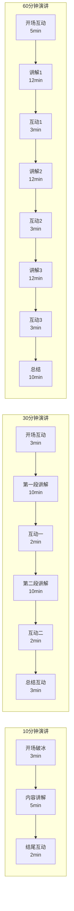
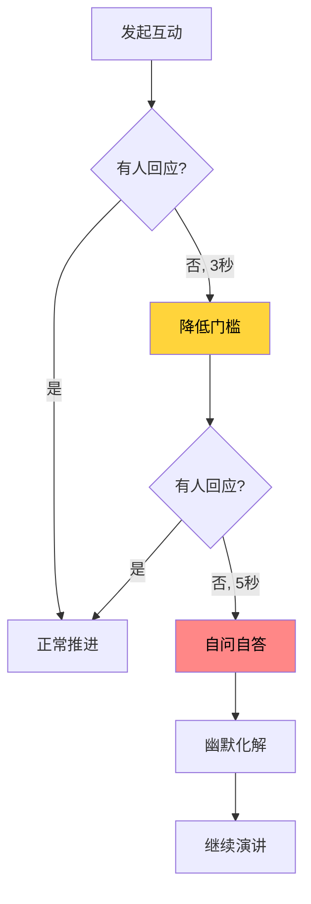

## 四、互动技巧

演讲的本质是信息传递，而信息传递的最高形态不是单向灌输，而是双向共鸣。互动技巧就是将演讲从"独白剧场"变为"对话广场"的核心能力——它不是演讲中的"调味品"，而是决定演讲成败的"主菜"。

一个缺乏互动的演讲，就像一条单行道：演讲者拼命输出，听众被动接收，双方都在各自的轨道上运行，始终没有交汇。而一次精心设计的互动，则像一座桥梁，将演讲者的思想与听众的体验连接在一起，让信息从"听到"升级为"感受到"、从"记住"升华为"认同"。

### 4.1 互动的科学基础：为什么互动有效

在学习具体技巧之前，必须先理解互动为什么有效。这不是"感觉上更好"，而是有坚实的认知科学和心理学基础。

#### 注意力的衰减与重置

认知心理学家 John Medina 在《Brain Rules》中指出：听众的注意力遵循一条衰减曲线——演讲开始后的前10分钟，注意力处于高位；10-15分钟开始明显下滑；15-20分钟降至低谷。如果演讲者不做任何干预，注意力将持续低迷，直到演讲结束。

这条曲线的生理基础是大脑的"定向反应"（Orienting Response）机制——大脑对新刺激会自动投入注意力，但当刺激模式变得单调可预测时，大脑会将其标记为"不重要"并降低资源分配。

互动的作用就是制造"新刺激"：当演讲者突然提问、邀请举手、发起投票时，听众的大脑会被迫从"被动接收"模式切换到"主动处理"模式，注意力被重新激活。

**实践法则**：每10-15分钟设置一个互动环节，将整场演讲切割成多个"注意力周期"，每个周期内完成一个完整的主题讲解+互动巩固循环。

#### 参与感与宜家效应

行为经济学家 Dan Ariely 提出的"宜家效应"（IKEA Effect）表明：人们对自己参与创造的事物，评价会显著高于被动接受的事物。在演讲场景中，当听众通过互动参与了内容的构建——回答一个问题、做出一个选择、分享一个经历——他们对演讲内容的认同度和记忆度会大幅提升。

哈佛商学院的研究进一步证实：参与式学习（Participatory Learning）相比被动听讲，信息留存率从5%提升至75%。这不是微小的改善，而是数量级的飞跃。

#### 社会认同与从众效应

当演讲者邀请全场举手投票时，那些原本犹豫的听众看到周围的人举起手，也会不由自主地跟从。这就是Cialdini所说的社会认同原理（Social Proof）——人们在不确定时，会参照他人的行为来决定自己的行为。

这个原理的实践意义在于：互动不仅仅是个人层面的参与，更是群体层面的氛围营造。当全场大多数人都在举手、鼓掌、回应时，即使是最初持怀疑态度的听众，也会被这种集体氛围所感染。

#### 具身认知与身体参与

认知科学中的"具身认知"理论（Embodied Cognition）认为：认知不仅发生在大脑中，身体的状态也会影响思维和情感。当听众被邀请做肢体动作——握拳、鼓掌、站起来——他们的身体状态会反过来影响心理状态，产生更强的投入感和认同感。

这解释了为什么体育赛事中的"人浪"能让全场观众的情绪同步高涨——不是因为人浪本身有什么意义，而是身体的集体参与创造了情感共鸣。

### 4.2 互动设计框架：何时用、怎么选

互动不是随意插入的，它需要系统设计。以下框架帮助你根据演讲场景做出最佳选择。

#### 互动的三维度选择模型

选择互动方式时，需要同时考虑三个维度：

| 维度 | 考量因素 | 低值 | 高值 |
|------|----------|------|------|
| **规模维度** | 听众人数 | 10人以下小团队 | 500人以上大会场 |
| **能量维度** | 现场氛围 | 安静、正式、保守 | 活跃、开放、热情 |
| **内容维度** | 主题性质 | 深度技术、敏感话题 | 激励、销售、团队建设 |

**选择矩阵**：

| 场景 | 推荐互动方式 | 避免方式 |
|------|-------------|----------|
| 小型会议（10-30人） | 小组讨论、直接提问、现场演示 | 大规模投票、肢体互动 |
| 中型演讲（30-150人） | 举手投票、选择题互动、想象引导 | 一对一提问（风险太高） |
| 大型活动（150人以上） | 现场投票工具、全场肢体互动、幽默互动 | 小组讨论（不可控）、故事邀请（冷场风险） |
| 正式场合 | 思考暂停、反问互动 | 幽默互动（分寸难把握） |
| 轻松场合 | 幽默互动、肢体互动、故事邀请 | 长时间思考暂停（气氛会冷） |

#### 互动的时间布局

一场好的演讲，互动应该像音乐中的"节拍"一样有节奏感：

**关键原则**：
- **开场3分钟内必须有一次互动**——打破"演讲者vs听众"的对立格局
- **每个内容段落结束后安排互动**——巩固记忆、重置注意力
- **结尾前安排一次有力的互动**——让听众带着参与感离开
- **互动间隔不超过15分钟**——超过这个时间，听众的注意力回不来

#### 互动的能量曲线管理

优秀的演讲者像DJ管理舞池能量一样管理现场氛围：

| 阶段 | 能量目标 | 互动策略 |
|------|----------|----------|
| 开场 | 从低到中 | 低门槛互动：举手投票、选择题 |
| 前段 | 维持中等 | 思考暂停、反问互动 |
| 中段 | 从低到高 | 小组讨论、现场演示 |
| 高潮 | 冲击高点 | 全场肢体互动、故事邀请 |
| 结尾 | 从高到稳 | 总结性提问、想象引导 |

### 4.3 十大核心互动技巧详解

#### 技巧一：提问互动

提问是最基础也最强大的互动方式。它不需要任何道具，不受场地限制，适用于几乎所有场景。但提问也是最容易用错的互动方式——一个糟糕的提问比不提问更糟糕。

**三种提问模式及适用场景**

**直接提问**：点名特定听众回答。

> "坐在第三排穿蓝色衬衫的这位女士，您觉得这个方案怎么样？"

- 适用场景：小型会议、培训课堂、需要打破沉默时
- 核心技巧：先用目光接触建立连接，再提问，避免"突袭式"提问
- 风险控制：选择看起来友善、有表达欲的听众，避免选择明显走神或低头看手机的人

**举手式提问**：面向全场的低门槛提问。

> "在座的各位，有多少人曾经在工作中遇到过沟通障碍？请举手。"

- 适用场景：任何规模的演讲，特别是开场破冰
- 核心技巧：问题要简单、答案要明确（是/否、有/没有），不需要听众组织语言
- 进阶用法：先问一个大多数人会举手的问题，再问一个只有少数人举手的问题，形成对比

**反问式提问**：不需要听众回答，用问题引导思考。

> "如果我们继续用老方法，三年后会怎样？答案不言自明。"

- 适用场景：需要强调观点、制造戏剧性停顿时
- 核心技巧：反问后必须有停顿（至少3秒），让问题在听众脑中"发酵"
- 常见错误：反问后立刻自答，完全浪费了反问的效果

**提问互动的致命错误**：

| 错误 | 后果 | 正确做法 |
|------|------|----------|
| 问题太宽泛（"大家怎么看？"） | 冷场，没人知道怎么回答 | 限定选择范围或给出选项 |
| 提问后不等回答 | 听众觉得你在走过场 | 至少等5秒，目光扫视全场 |
| 只问知道答案的人 | 听众感觉被"表演" | 至少给2-3个人机会回答 |
| 对错误答案表现出否定 | 整场再也没人愿意回答 | 用"这是一个有趣的角度"来过渡 |

#### 技巧二：举手投票

举手投票是提问的"简化版"——它不需要听众开口说话，只需要一个动作，因此门槛更低，参与率更高。

**标准流程**：

1. **铺垫**：解释为什么要做这个投票，与演讲内容的关联
2. **说明**：清楚描述投票规则（"认为A的举左手，认为B的举右手"）
3. **执行**：倒数"3、2、1"，然后说"请举手"
4. **观察**：扫视全场，大致统计比例
5. **利用结果**：将投票结果与演讲内容衔接

**高级用法——"二次投票"**：

先做一次投票，讲完一段内容后，就同一个问题再投一次。如果结果发生变化，这个变化本身就是最好的教学素材。

> "刚才有30%的人认为这个方案可行。好，听完接下来的分析后，我们再投一次——认为可行的请举手。"

> "现在有70%的人认为可行了。是什么改变了你们的想法？这就是数据的力量。"

**注意事项**：
- 问题必须简单到不需要思考的程度
- 不要问敏感或尴尬的问题（"谁对自己的收入不满意？"——没人愿意在公开场合暴露）
- 如果预计大多数人不会举手，换个角度问（"谁从来没遇到过这个问题？"比"谁遇到过这个问题？"更安全）

#### 技巧三：思考暂停

思考暂停是最安静的互动，但效果可能比你想象的更强大。它的本质是给听众一个"思维任务"，让他们的大脑从被动接收模式切换到主动处理模式。

**设计思考暂停的四个要素**：

| 要素 | 说明 | 示例 |
|------|------|------|
| **明确的问题** | 听众需要想什么 | "你职业生涯中最重要的一个决定是什么？" |
| **明确的时间** | 给多久来想 | "给自己15秒钟" |
| **明确的提示** | 帮助听众进入状态 | "闭上眼睛，回到那个场景" |
| **明确的衔接** | 暂停后如何接回 | "好，现在睁开眼睛，我们来看看……" |

**思考暂停的时长控制**：
- 10秒：适合简单的自我反思（"想一想你今天来这里的目的是什么"）
- 15-20秒：适合较深的回忆或评估（"回忆一下你最近一次做出重大改变的经历"）
- 30秒：上限，超过30秒听众会开始走神或感到不耐烦

**为什么思考暂停如此有效**？

认知心理学中的"生成效应"（Generation Effect）表明：自己生成的信息比被动接收的信息记忆更深刻。当演讲者让听众自己思考一个答案，即使这个答案没有说出来，听众对后续内容的接受度也会大幅提升——因为他们的大脑已经被"激活"了。

**进阶用法——"写下来"**：

> "请大家拿出手机或纸笔，用30秒写下你认为最重要的一个沟通原则。只写一个。"

写下来的参与门槛比纯思考更高，但效果也更好。因为书写是一个更强的"具身认知"信号——身体在动，大脑在处理，记忆被强化。

#### 技巧四：现场演示

现场演示是将抽象概念转化为具身体验的最佳方式。当听众亲眼看到一个原理被"活"出来，他们的理解深度远超纯语言讲解。

**现场演示的三种类型**：

**道具演示**：使用实物道具来说明概念。

> （拿出一根橡皮筋）"这根橡皮筋代表你的舒适区。你看，它有弹性——你可以拉伸它，但它总是会弹回来。人的成长就是这样：你需要持续施力，才能让舒适区变大。"

- 适用场景：说明抽象概念、物理原理、隐喻
- 核心技巧：道具要简单、直观，不需要解释就能看懂

**志愿者演示**：邀请听众上台参与。

> "我需要一位志愿者。谁愿意上来？好，这位先生请到台上来。现在请你背对着大家站好——这就是大多数人沟通时的状态：只顾自己说，不看对方的反应。"

- 适用场景：需要打破第四面墙、创造戏剧性时刻
- 核心技巧：提前锁定1-2个"志愿者"（可以是同事或朋友），避免冷场

**自体演示**：演讲者自己做动作。

> "请大家看我现在的姿势——（站直，双手交叉抱胸）——如果我用这个姿势跟你说话，你什么感觉？（停顿）防御、封闭、不信任。现在——（打开双手，身体微微前倾）——同样的内容，这个姿势呢？开放、欢迎、信任。"

- 适用场景：肢体语言、行为示范、任何需要"表演"的场景
- 核心技巧：动作要夸张到最后一排都能看清

**演示失败的应急预案**：

| 失败类型 | 应对策略 |
|----------|----------|
| 道具忘带/损坏 | 立刻切换为语言描述："假设我手里有一个……" |
| 志愿者不配合 | 幽默化解："看来我今天的魅力还不够"，然后自己完成演示 |
| 技术故障（投影/音响） | 走到听众中间，用近距离演示替代 |
| 演示效果不明显 | 提前准备好"如果失败怎么说"的话术 |

#### 技巧五：小组讨论

小组讨论是大规模互动中唯一能让每个人都开口说话的方式。它的能量等级很高，适合用在演讲的中段，用来打破长时间听讲的疲劳。

**标准操作流程**：

1. **分组**（15秒）：明确分组方式——"和你左右两边的人组成三人小组"
2. **布置任务**（15秒）：给出具体、有边界的讨论问题
3. **计时**：明确告知时间，并在中途提醒
4. **巡视**：在听众讨论时走动，偶尔俯身倾听，给个别小组反馈
5. **收束**：时间到，要求全场安静（拍手三下是最有效的信号）
6. **分享**：请2-3个小组分享讨论结果
7. **总结**：将分享内容与演讲主题衔接

**讨论问题的设计原则**：

| 原则 | 说明 | ❌ 错误示例 | ✅ 正确示例 |
|------|------|------------|------------|
| 具体性 | 问题要有明确边界 | "谈谈你对沟通的看法" | "举一个你成功说服别人的例子" |
| 时限性 | 2分钟内能完成 | "深入讨论一下这个话题" | "用一句话概括你的核心观点" |
| 可分享性 | 结果能简短表达 | "你们觉得呢？" | "你们小组得出的结论是什么？" |

**小组讨论的风险控制**：
- 时间失控：设一个可见的计时器，30秒倒计时时大声提醒
- 讨论偏题：巡视时发现偏题的小组，轻轻引导回来
- 收束困难：用拍手+举手+倒数的方式强制收束（"3、2、1，好，请安静"）
- 分享冷场：提前安排2个小组作为"种子选手"，确保至少有分享

#### 技巧六：现场投票/数字互动

数字工具让大型场合的实时互动成为可能。当500人同时在手机上投票，结果实时显示在大屏幕上——这种"集体参与+即时可视化"的体验，是传统举手投票无法比拟的。

**常用工具对比**：

| 工具 | 特点 | 适用场景 | 注意事项 |
|------|------|----------|----------|
| **Slido** | 专业会议互动平台，支持投票/问答/词云 | 国际会议、企业年会 | 需要提前注册，英文界面 |
| **微信小程序** | 国内听众无需额外安装 | 国内企业培训、行业活动 | 功能相对简单 |
| **腾讯文档** | 实时协作，适合开放式收集 | 工作坊、头脑风暴 | 需要微信登录 |
| **问卷星** | 功能丰富，支持多种题型 | 培训评估、市场调研 | 结果展示不够实时 |
| **Mentimeter** | 界面美观，支持词云/排名 | 创意类、设计类活动 | 国内访问可能不稳定 |

**数字互动的标准流程**：

1. **提前测试**（活动前一天）：确认网络、工具、投影全部正常
2. **准备备选方案**：如果工具故障，立刻切换到举手投票
3. **现场引导**：用大屏幕展示二维码，给听众30秒扫码时间
4. **确认参与率**：看参与人数是否达到预期（通常70%以上算成功）
5. **实时展示**：结果出来后，花30秒分析和点评
6. **与内容衔接**：将数据结果作为下一个论点的起点

**数字互动的高级玩法**：
- **词云**：让听众每人输入一个词，汇总生成词云，最常出现的词最大——视觉冲击力强
- **实时问答**：听众匿名提交问题，其他人点赞，演讲者回答点赞最多的问题
- **渐进式投票**：同一个问题在演讲的不同阶段投票，展示听众态度的变化
- **竞猜**：给出一个数据，让听众猜答案，揭晓时制造惊喜

#### 技巧七：故事邀请

故事邀请是风险最高但回报也最高的互动方式。当一个听众站起来分享自己的真实经历时，整个演讲的性质发生了变化——它不再是"一个人讲给大家听"，而是"一群人共同创造意义"。

**故事邀请的标准话术模板**：

> "在继续之前，我想花2分钟请大家分享。有没有人愿意简单说一个自己在[主题]方面的经历？不需要很长，30秒就好。谁愿意？"

**降低冷场风险的五种策略**：

1. **种子选手**：提前安排1-2个人准备好故事，如果冷场就由他们先打破沉默
2. **缩小范围**：如果全场没人举手，缩小到特定群体（"做销售的朋友有没有？"）
3. **降低门槛**：从"分享故事"降级为"举手表态"（"有没有人有过类似经历？"）
4. **自嘲开场**：先分享自己的一个糗事，降低听众的心理门槛
5. **点名暗示**：提前与某位听众沟通（茶歇时聊天），在互动时说"我记得刚才和XX聊过，他有个很好的例子……"

**故事邀请后的处理**：

听众分享完后，演讲者的回应至关重要：

| 回应类型 | 效果 | 示例 |
|----------|------|------|
| 简单感谢 | 及格 | "谢谢你的分享。" |
| 具体肯定 | 良好 | "你提到的那个细节特别生动——'客户沉默了5秒钟'，这个观察非常敏锐。" |
| 深度连接 | 优秀 | "你的经历恰好印证了我们刚才讲的'镜像效应'——你下意识地模仿了客户的语速，这就是建立信任的关键。" |

#### 技巧八：想象引导

想象引导是所有互动技巧中最具"沉浸感"的一种。当听众闭上眼睛，跟随你的声音进入一个想象的场景时，他们的大脑处理模式会发生根本性变化——从分析模式（Analytical Mode）切换到体验模式（Experiential Mode），这使得他们更容易被情感打动，也更容易记住内容。

**想象引导的四段式结构**：

1. **过渡**：告诉听众要做什么（"现在请大家闭上眼睛"）
2. **设定场景**：用感官语言描绘环境（"你站在一间宽敞的会议室里"）
3. **深化体验**：加入情感和细节（"你感到紧张，手心微微出汗"）
4. **收束**：引导回来（"现在慢慢睁开眼睛，回到当下"）

**完整示例**：

> "请大家闭上眼睛，深呼吸一次。（停顿3秒）
>
> 想象一下：现在是五年后的今天。你坐在一间明亮的办公室里，桌上放着一份报告——上面写着你今年的业绩。你翻开第一页，看到了一个数字。这个数字让你笑了。
>
> 你的团队成员推门进来，对你说了一句话。你听到这句话时，心里涌起一种感觉。记住这种感觉。
>
> （停顿5秒）
>
> 好，现在慢慢睁开眼睛，回到当下。谁愿意说说，你刚才想到了什么？"

**想象引导的注意事项**：
- 语速要比平时慢30%-50%，语调要柔和、平稳
- 每句话之间留2-3秒的停顿，给听众时间构建画面
- 使用具体感官细节（"你闻到咖啡的香气"比"你在一个舒适的环境里"更有效）
- 不要引导听众进入负面场景（"想象你被解雇了"——绝对不要这样做）
- 提前告知有不愿闭眼的听众可以不闭眼，不要强制

#### 技巧九：幽默互动

幽默是最强大的社交润滑剂。一个恰到好处的幽默互动能瞬间拉近演讲者与听众的距离，让整个氛围变得轻松愉快。但幽默也是一把双刃剑——用得好是锦上添花，用得不好则是画蛇添足。

**幽默互动的五种类型**：

| 类型 | 说明 | 示例 |
|------|------|------|
| **自嘲式** | 拿自己开涮，最安全的幽默 | "我今天嗓子有点哑，大家忍一下——反正你们也习惯了开会听沙哑的声音。" |
| **观察式** | 基于现场的即时观察 | "我看前排这位朋友一直在点头，等下结束后我要请你吃饭——因为你是我今天最忠实的支持者。" |
| **反差式** | 制造预期与现实的落差 | "这个方法听起来很简单对吧？（停顿）确实很简单。问题是——简单的事情最难坚持。" |
| **互动式** | 让听众参与制造幽默 | "我来做一个现场调查：有多少人早上是被闹钟叫醒的？（举手）好，有多少人是被deadline吓醒的？（举手更多）看来deadline才是真正的生产力工具。" |
| **回调式** | 引用之前发生的事 | "还记得开场时小王分享的那个故事吗？看来他今天回去就要用上我们刚讲的技巧了——小王，加油！" |

**幽默互动的红线**：
- 不拿听众的外貌、口音、种族、性别开玩笑
- 不嘲笑任何个人或群体
- 不讲与主题无关的段子（那不是幽默，是跑题）
- 不在严肃话题（灾难、死亡、疾病）后立刻幽默
- 如果你不确定会不会冒犯人，那就不要讲

**如何培养幽默感**：

幽默感不是天赋，而是技能。以下是可训练的方法：
1. **积累素材库**：每天记录1-2个有趣的观察或段子
2. **练习节奏感**：幽默的关键在于"铺垫+停顿+包袱"的节奏
3. **观察反馈**：注意哪些话能引起笑声，哪些不能
4. **从自嘲开始**：自嘲是最安全的幽默，也是最容易练习的
5. **模仿高手**：看TED演讲中的幽默段落，分析其结构

#### 技巧十：肢体互动

肢体互动是所有互动方式中"能量等级"最高的——它让听众从坐着变成站着、从安静变成活跃、从旁观变成参与。一个成功的全场肢体互动能将现场氛围推向高潮。

**经典肢体互动模板**：

**"抓住与释放"**：
> "请各位跟我一起做：伸出右手，握拳——这就是'抓住机会'。（停顿）然后放开——这就是'释放恐惧'。再做一次：抓住、释放。记住这个动作——它代表的就是今天的核心理念。"

**"站起来"**：
> "觉得自己今天学到了至少一个有用知识的，请站起来。"（全场起立后）"好，请坐。觉得自己能在明天的工作中用上这些知识的，请再站起来。"（部分人起立）"好，请坐。觉得自己已经准备好立刻行动的——最后站起来一次。"

**"人浪式鼓掌"**：
> "我们来做一个特殊的鼓掌。从左边开始，每人拍三下手，像人浪一样传过去。准备——开始！"

**肢体互动的设计原则**：
- 动作必须简单到不需要解释（握拳、鼓掌、举手、站起来）
- 演示者必须自己先做，而不是口头描述
- 动作要有象征意义，与演讲内容关联
- 持续时间不超过30秒——太长会让听众觉得幼稚
- 不要强迫身体不便的听众参与（"站不起来的朋友可以举手代替"）

### 4.4 互动的风险管理：冷场、失控与应急

互动是有风险的。一个失败的互动比没有互动更糟糕——它不仅浪费时间，还会让演讲者失去权威感。因此，你必须为每一种可能的失败做好准备。

#### 冷场应对方案

冷场是互动最常见的失败形式。以下是分级应对策略：

**降低门槛的具体话术**：
- 从"谁愿意分享？"降级为"有没有人有过类似经历？举手就好"
- 从"举手"降级为"点头也行"
- 从"全场互动"缩小到"旁边的两个人互相说一句"

**自问自答的过渡话术**：
> "好，我来给大家一个参考答案。我之前遇到过一个案例……"（自然过渡到准备好的案例）

**幽默化解的话术**：
> "看来我的问题太难了。没关系，这正是我们接下来要解决的。"
> "大家这么安静，说明你们在认真思考——这比急着回答更好。"

#### 听众失控的应对

| 失控类型 | 表现 | 应对 |
|----------|------|------|
| **过度活跃** | 讨论停不下来，噪音太大 | 拍手三下 + 倒数 + "请安静" |
| **偏离主题** | 讨论内容完全跑题 | "这是一个好话题，但我们先回到今天的主线" |
| **对抗性回应** | 听众公开质疑或挑衅 | "我理解你的观点，感谢你的坦诚。我们可以会后详细讨论" |
| **过度分享** | 某人讲了5分钟还没停 | "非常精彩的分享！因为时间关系，我们先请下一位" |

#### 技术故障应急

数字互动工具出故障是常事。永远准备一个"无技术"备选方案：

| 故障 | 备选方案 |
|------|----------|
| 网络断了 | 切换为举手投票 |
| 投票工具挂了 | 切换为口头回应（"觉得A的喊A，觉得B的喊B"） |
| 二维码扫不出来 | 口播网址，或改为举手 |
| 麦克风失灵 | 走到听众中间，近距离互动 |

### 4.5 不同场景的互动策略

#### 线上演讲/视频会议

线上演讲的互动难度远高于线下——你看不到听众的表情，听不到他们的反馈，甚至连他们是否在听都不知道。但线上互动并非不可能，只是需要不同的策略。

**线上互动的特殊技巧**：
1. **聊天区互动**：要求听众在聊天区打字回答（"请在聊天区打一个数字，1到10，代表你对这个话题的了解程度"）
2. **表情符号反应**：利用平台的点赞、鼓掌、举手表情功能
3. **弹幕式提问**：鼓励听众随时在聊天区提问，演讲者定期挑选回答
4. **分组讨论室**：Zoom/腾讯会议的Breakout Room功能，将听众分成小组讨论
5. **共享白板**：用在线白板工具让听众实时协作

**线上互动的频率要更高**：因为线上注意力衰减更快（大约每5-7分钟就需要一次干预），互动频率应该比线下翻倍。

#### 培训/工作坊

培训场景的互动可以更深入、更频繁，因为听众的预期就是"参与式学习"。

**培训互动的特殊策略**：
- **开场破冰**：用一个与主题相关的游戏或活动开场
- **每隔15分钟**：切换教学方式（讲授→练习→讨论→演示→讲授）
- **即时练习**：讲完一个知识点后，立刻给听众一个2分钟的练习任务
- **同伴教学**：让听众两两配对，互相讲解刚学到的内容
- **结束复盘**：让每个人用一句话说出今天最大的收获

#### 大型活动/论坛

大型活动（200人以上）的互动需要更多技术支持和更精心的设计。

**大型活动互动的特殊挑战**：
- 听众看不到彼此，社会认同效应减弱
- 声音传播困难，口头回应不现实
- 个体参与感降低，容易沦为"看客"

**解决方案**：
- 使用数字工具进行全场投票
- 设计不需要说话的互动（举手、站起来、拍手）
- 用大屏幕实时显示互动结果
- 邀请"区域代表"分享（"请每个区域派一位代表"）

### 4.6 互动的进阶心法

#### 从"技巧"到"本能"的修炼路径

初学者把互动当作"插入"演讲的元素——像往菜里加盐一样。但真正的高手，互动已经融入了演讲的DNA——他们不是在"做互动"，而是在"与听众对话"。

**修炼的四个阶段**：

| 阶段 | 特征 | 修炼方法 |
|------|------|----------|
| **新手期** | 机械地在固定时间点"插入"互动 | 准备互动脚本，逐字演练 |
| **成长期** | 能根据现场情况调整互动方式 | 每次演讲后复盘：哪些互动有效，哪些失败 |
| **熟练期** | 互动自然融入演讲节奏，不着痕迹 | 尝试即兴互动，不提前准备话术 |
| **大师期** | 互动成为本能，能瞬间感知听众状态并做出反应 | 大量实战，刻意练习，寻求反馈 |

#### 互动的"二八法则"

80%的互动效果来自20%的技巧。如果你只能掌握三种互动方式，选择这三个：

1. **提问互动**——最通用、最灵活、最强大
2. **思考暂停**——最安静、最低风险、最深影响
3. **肢体互动**——最高效、最直接、最能提升氛围

这三种覆盖了几乎所有场景，且相互配合良好。

#### 互动的最高境界：让听众忘记这是"互动"

最高级的互动是如此自然，以至于听众根本意识不到自己在"参与"——他们觉得自己只是在和一个有趣的人聊天。这需要大量的练习、对人性的深刻理解，以及对现场氛围的精准感知。

记住：互动的目的不是让听众"动起来"，而是让听众"参与进来"。身体的参与只是手段，心灵的参与才是目的。

### 4.7 常见误区与纠正

| 误区 | 为什么是错的 | 正确做法 |
|------|-------------|----------|
| "互动越多越好" | 过多互动打断思路，让演讲碎片化 | 每10-15分钟一次，每次不超过2-3分钟 |
| "互动只是为了活跃气氛" | 如果互动与内容无关，就是浪费时间 | 每次互动都要服务于一个具体的教学目标 |
| "没人回应说明听众不感兴趣" | 可能是问题太难、门槛太高、时机不对 | 检查问题设计，降低门槛，调整时机 |
| "互动是即兴的，不需要准备" | 即兴互动的失败率远高于准备好的互动 | 每个互动都有预案，包括失败后的应对 |
| "我性格内向，做不了互动" | 互动是技能，不是性格 | 从最安全的方式（思考暂停）开始练习 |
| "大型场合没法做深度互动" | 数字工具让大型互动成为可能 | 善用投票工具、聊天区、分组功能 |
| "互动一定要有人回答" | 思考暂停、想象引导都是不需要回答的互动 | 根据场景选择合适的互动类型 |
| "线上演讲没法做有效互动" | 线上互动只是方式不同，不是不能做 | 调高频率，善用聊天区和表情功能 |

### 4.8 实战练习清单

**初级练习（本周可完成）**：

- [ ] 在下次会议中使用一次"举手投票"，观察效果
- [ ] 准备一个30秒的"想象引导"话术，在朋友面前练习
- [ ] 用手机计时器练习"思考暂停"——15秒的沉默，感受它有多长

**中级练习（一个月内完成）**：

- [ ] 在一次5人以上的场合，使用至少3种不同的互动技巧
- [ ] 为一次重要演讲设计完整的互动方案（时间点+方式+备选方案）
- [ ] 录制自己做互动的视频，分析：节奏、等待时间、表情、手势

**高级练习（持续精进）**：

- [ ] 在一次100人以上的场合进行互动，复盘成功与失败
- [ ] 尝试"二次投票"——同一问题在演讲前后各投一次，展示变化
- [ ] 设计一个"全场肢体互动"，在演讲高潮处使用
- [ ] 收集听众反馈，专门分析互动环节的满意度

### 4.9 本节小结

互动技巧的核心不在于"做了什么"，而在于"为什么做"和"怎么做好"。记住三个关键原则：

1. **服务内容**：每一次互动都必须服务于演讲的核心信息，而不是为了互动而互动
2. **降低门槛**：让听众参与的成本越低越好——举手比说话容易，点头比举手容易
3. **准备预案**：为每一种可能的失败准备应对方案，你永远不会后悔多准备了一个Plan B

互动是演讲中最考验功力的环节，因为它需要你同时关注内容、听众、氛围和自己的状态。但正因如此，它也是最能体现演讲者水平的环节——一个能让全场听众都参与进来的演讲者，才是真正的大师。
