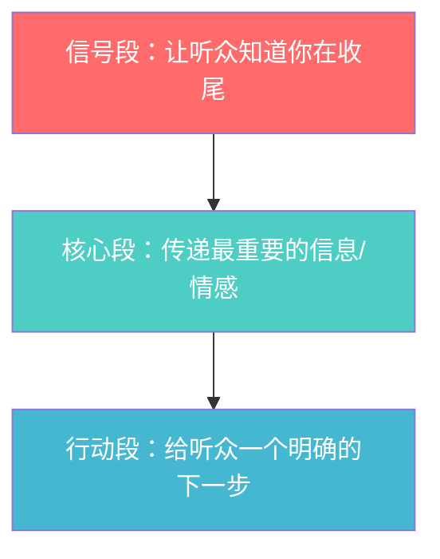
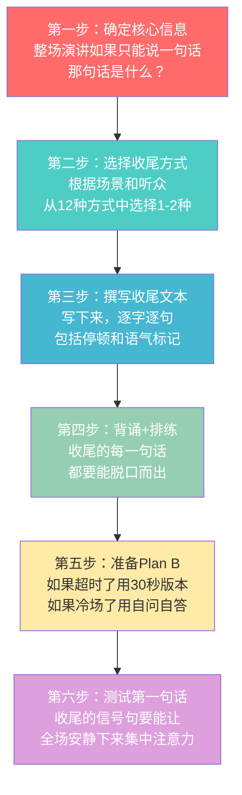

## 五、收尾技巧

结尾是演讲的"最后一击"——它是听众最后听到的内容，也是大脑编码记忆时权重最高的部分。一场90分的演讲如果收尾只有50分，听众离场时的感受就是70分；而一场70分的演讲如果收尾做到95分，听众的记忆会被改写为85分。结尾不是"说完了"的信号，而是整场演讲的战略制高点。

### 5.1 为什么结尾如此重要：认知科学视角

#### 峰终定律（Peak-End Rule）

诺贝尔奖得主丹尼尔·卡尼曼（Daniel Kahneman）在研究"体验自我"与"记忆自我"的差异时发现了峰终定律：**人们对一段经历的整体评价，主要取决于两个时刻——最强烈的瞬间（峰值）和结束的瞬间（终点）**，而不是经历的总时长或平均体验。

这个发现来自一个经典实验：受试者被要求将手浸入14°C的冰水中60秒（痛苦体验），另一组则浸入14°C冰水60秒后，水温悄悄升到15°C再持续30秒（延长但减轻的体验）。结果第二组——尽管总痛苦时间更长——却对整个体验的评价更积极，因为结尾的温度提升改变了记忆编码。

**对演讲的启示：**

| 认知机制 | 演讲应用 |
|---------|---------|
| 近因效应（Recency Effect） | 最后说的话最容易被记住，要留给最重要的信息 |
| 情绪锚定（Emotional Anchoring） | 结尾的情绪基调会"染色"听众对整场演讲的记忆 |
| 闭环效应（Closure Effect） | 未完成的结尾会产生蔡格尼克效应，听众带着未解决的不适离开 |
| 模式识别（Pattern Recognition） | 听众会用结尾来"理解"开头和中间，结尾是整场演讲的注释 |

#### 首因-近因序列效应

心理学中的序列位置效应（Serial Position Effect）表明，在一个信息序列中，开头（首因效应）和结尾（近因效应）的信息被记住的概率最高，中间部分最容易被遗忘。这意味着结尾是你最后一次"抢占记忆高地"的机会。

#### 情绪的"最后一帧"效应

脑科学研究表明，杏仁核（amygdala）在经历结束时会对当前情绪状态进行一次"快照"，这个快照会被存储为整段经历的情绪标签。换句话说，听众带着什么情绪离开会场，他们就会把这种情绪"归因"到整场演讲上。

**实操含义：** 如果你的结尾让听众感到振奋、被启发、被感动，他们会觉得整场演讲都是振奋/启发/感动的。如果结尾让他们感到无聊或困惑，前面再精彩的段落也会被"污染"。

---

### 5.2 收尾的核心框架：三段式闭环

一个完整的收尾不是一句话，而是一个结构化的闭环。无论你用哪种结尾方式，都应该包含以下三步：

**信号段**的作用是切换听众的心理状态——从"还在接收新信息"切换到"准备做总结和行动"。典型信号句：
- "在结束之前，我想说最重要的一件事……"
- "今天的所有内容，如果只能记住一个点……"
- "最后，请允许我……"

**核心段**是你的收尾主体，承载你要留下的核心信息。这一段的长度应该占整个收尾的60%-70%。

**行动段**是把认知转化为行动的"临门一脚"。让听众知道"接下来该做什么"。

---

### 5.3 十二种收尾方式详解

以下按场景分类，从最常用到进阶技巧逐一展开。每种方式都包含：原理、适用场景、具体模板、真实案例、使用禁忌。

#### 5.3.1 总结回顾式

**原理：** 利用"信息压缩"的认知机制，将整场演讲的核心信息压缩成一个容易记忆的结构，降低听众的认知负荷。

**适用场景：** 信息密度高的演讲（工作汇报、学术报告、产品发布、培训课程）

**具体模板：**

> "今天我们聊了三件事。
> 第一，[核心观点1]，记住[一句话浓缩]。
> 第二，[核心观点2]，关键数字是[数据]。
> 第三，[核心观点3]，这三件事的共同点是[统领性结论]。
> 如果你只记住一件事，请记住[最重要的一件]。"

**真实案例：**
亚马逊CEO安迪·贾西在2023年股东大会的收尾："今天我想强调三个事实：AWS的增长率已经触底反弹，利润率正在创历史新高，AI将成为我们下一个十年最大的增长引擎。这三个事实指向同一个结论——亚马逊最好的日子还在前面。"

**进阶技巧——"数字归纳法"：**
用一个数字来统领总结，会让记忆效率翻倍。"三个原则"比"几个原则"更容易记住。TED演讲者常用的数字是3（认知心理学证实3是最佳记忆单元）。

**使用禁忌：**
- 不要逐字重复正文已经说过的话——用新的语言、更高的视角来概括
- 不要超过5个要点——超过5个就失去了"压缩"的意义
- 不要在总结中引入新信息——这会破坏闭环感

#### 5.3.2 行动号召式（Call to Action）

**原理：** 将认知转化为行动是说服的最终目的。行动号召利用"承诺一致性"心理——当众人口头或心理上做出承诺后，会倾向于付诸行动以保持一致性。

**适用场景：** 说服型演讲、商业提案、公益倡导、销售演示、团队动员

**具体模板：**

> "所以我想请在座的每一位做一个承诺：[具体行动]，从[具体时间]开始，持续[具体时长]。你可以现在就拿出手机，[具体的第一步]。"

**真实案例：**
- 马丁·路德·金的"我有一个梦想"结尾不是一个抽象的愿望，而是具体的行动："让自由之声从每一个山坡响起来！"
- 乔布斯2005年斯坦福毕业演讲："Stay hungry, Stay foolish"——简单、具体、可执行
- 环保演讲："回家后做的第一件事——打开你的电费账单，看看上个月用了多少度电。然后从今天开始，每天少用10%。"

**行动的"SMART"原则：**
| 维度 | 说明 | 示例 |
|------|------|------|
| Specific（具体） | 不说"注意健康"，说"每天走8000步" | "从明天起，每天早上7:30走路上班" |
| Measurable（可衡量） | 给一个数字或标准 | "坚持21天"、"减少30%的屏幕时间" |
| Achievable（可达成） | 不要一开始就要求大改变 | "先从每天5分钟冥想开始" |
| Relevant（相关） | 行动必须和演讲主题直接相关 | 演讲讲时间管理→行动是"今晚列出明天的3件要事" |
| Time-bound（有时限） | 给一个明确的开始和结束时间 | "从今晚开始，坚持一周" |

**使用禁忌：**
- 行动不能太模糊——"大家加油"不是行动号召
- 行动不能太宏大——"改变世界"不如"今天少用一个塑料袋"
- 不要同时号召太多行动——一个演讲一个核心行动

#### 5.3.3 首尾呼应式

**原理：** 利用叙事的"闭环效应"——人类大脑天生追求完整性，当一个开头的"悬念"在结尾被解开时，会产生强烈的满足感和记忆深刻度。心理学称之为"蔡格尼克效应"的正向释放。

**适用场景：** 所有类型，尤其适合故事型、叙事型演讲

**具体模板：**

> 开头："[故事/场景/问题]……"
> 结尾："还记得开头我提到的[故事/场景/问题]吗？[给出结局/答案/新视角]。"

**真实案例：**
西蒙·斯涅克在TED演讲"伟大的领导者如何激励行动"中，开头讲了莱特兄弟的故事（不是最有资源的团队却先发明了飞机），结尾回到同一个故事："莱特兄弟之所以成功，不是因为他们有更好的资源，而是因为他们有'为什么'。在座的各位，你们的'为什么'是什么？"

**进阶技巧——"意义翻转"：**
不只是回到同一个故事，而是在结尾赋予故事全新的含义。开头的故事是"张三创业失败了"，结尾说"但现在我们知道，那次失败是他最重要的投资——投资于自己的认知升级"。同一个故事，不同的意义，冲击力加倍。

**使用禁忌：**
- 不要让呼应显得刻意——听众应该感到"自然而然"，而不是"哦他又提那个了"
- 呼应不能只是重复，必须有增量信息

#### 5.3.4 金句结尾式

**原理：** 一句精炼的格言或金句能够以极低的信息密度承载极高的情感密度，是记忆的"压缩包"。人类大脑对韵律感强、对仗工整、意象鲜明的句子有天然的记忆偏好。

**适用场景：** 激励型演讲、毕业典礼、年会致辞、品牌发布

**具体模板：**

> "最后，我想用一句话来结束今天的分享——这句话不是我说的，是[出处]说的：'[金句]'。"

**真实案例：**
- 乔布斯斯坦福演讲："Stay hungry, Stay foolish."
- J.K.罗琳哈佛毕业演讲："我们不需要魔法来改变世界，我们已经在自己身上拥有了所有的力量——去想象一个更好的世界。"
- 温斯顿·丘吉尔："这不是结束，这甚至不是结束的开始，但这可能是开始的结束。"

**金句的构造方法：**

| 技法 | 说明 | 示例 |
|------|------|------|
| 对仗 | 两个平行结构形成张力 | "不是因为看到希望才坚持，而是因为坚持才看到希望" |
| 反转 | 打破预期，制造认知冲击 | "最大的风险不是冒险，而是什么都不做" |
| 具象化 | 用具体意象承载抽象道理 | "每一行代码都是写给未来的信" |
| 悬念 | 留一个未完成的思考 | "如果这件事你已经知道了答案，你还需要演讲吗？" |

**使用禁忌：**
- 不要用被用烂的名言——"失败是成功之母"已经失去了冲击力
- 不要用与主题无关的金句——金句再好，不对题就是噪音
- 不要声称金句是自己的——如果是别人说的，诚实引用

#### 5.3.5 愿景描绘式

**原理：** 人类大脑对"画面"的记忆强度是抽象概念的6倍（认知神经科学中的"图优效应"，Picture Superiority Effect）。当你的结尾能让听众在脑海中"看到"一个具体的未来画面时，这个画面会比任何道理都更持久。

**适用场景：** 激励型演讲、战略宣讲、团队动员、产品愿景发布

**具体模板：**

> "想象一下[具体时间]的场景：[具体的画面——谁在做什么、看到什么、感受到什么]。这不是一个遥远的梦想，这取决于我们今天做的[具体行动]。"

**真实案例：**
伊隆·马斯克在SpaceX早期演讲中的结尾："想象一下2030年的火星。人类的第一座城市正在建设中。当你抬头看夜空时，那颗红色的星星不再只是一个光点——它是人类的第二个家。而我们，今天在座的每一个人，都是这个故事的第一章。"

**描绘愿景的五感原则：**
不要只说"未来会更好"，要用五感来构建画面：
- **视觉**：你看到什么？颜色、光线、场景
- **听觉**：你听到什么？欢呼、安静、音乐
- **触觉**：你感受到什么？温暖、震动、拥抱
- **情感**：你感到什么？自豪、安心、激动
- **社交**：谁在你身边？家人、同事、陌生人

**使用禁忌：**
- 愿景不能空泛——"我们会越来越好"不是愿景，是鸡汤
- 愿景不能脱离现实——必须让听众觉得"有可能实现"
- 愿景必须和行动挂钩——光描绘美好未来不说怎么到达是画饼

#### 5.3.6 问题留白式

**原理：** 人类大脑对未完成的问题有天然的"解决冲动"（蔡格尼克效应）。一个好问题会在听众脑海中持续"运行"，即使演讲已经结束。这让你的演讲影响力突破了时空限制。

**适用场景：** 启发性演讲、哲学类主题、教育类演讲、思想领导力展示

**具体模板：**

> "最后我想留给大家一个问题。不需要现在回答，但请在今晚入睡前想一想：[深刻的问题]？"

**真实案例：**
- 肯·罗宾逊TED演讲结尾："我们现在需要问自己的问题是：每个孩子都擅长不同的东西，我们的教育系统是不是该思考一下，怎样才能帮助他们找到自己的天赋？"
- 布琳·布朗TED演讲结尾："你上一次不带任何防备地展示脆弱是什么时候？"

**好问题的标准：**
1. **开放性**——不能用"是/否"回答
2. **个人化**——每个听众都会代入自己的经历
3. **挑战性**——触碰听众的舒适区边界
4. **简洁性**——一句话说清楚
5. **无标准答案**——引发持续思考

**使用禁忌：**
- 不要问封闭式问题——"大家觉得今天讲得好不好？"没有意义
- 不要问太多问题——一个演讲只留一个核心问题
- 不要问让听众难堪的问题

#### 5.3.7 故事闭环式（高级）

**原理：** 在演讲的不同节点讲述同一个故事的不同部分，结尾回到故事并给出结局。这比首尾呼应更复杂——它在演讲中间穿插了故事的"钩子"，让听众一直期待结局。

**适用场景：** 长篇演讲（20分钟以上）、TED风格演讲、个人成长主题

**具体操作：**

开头：引入故事（只讲一半，停在悬念处）
中间：在关键论点处穿插故事的新细节
结尾：给出故事的结局，并将其与演讲主题升华

**真实案例：**
安德鲁·所罗门TED演讲"养育超出你想象的孩子"中，开头讲了一个母亲养育特殊需求孩子的故事，中间穿插了更多案例，结尾回到那个母亲的故事："上周我收到了那位母亲的邮件，她说——'我不后悔任何一天。'这就是爱的定义。"

#### 5.3.8 情感升华式（高级）

**原理：** 前面的演讲以理性和逻辑为主，结尾突然转向情感，形成"理性铺垫→情感爆发"的冲击效果。这是因为持续的理性输出会让听众的"情感阈值"降低，此时一个适度的情感释放会产生放大效应。

**适用场景：** 严肃议题、公益主题、纪念活动、告别演讲

**操作要领：**
1. 前80%的演讲保持理性克制
2. 在结尾选择一个情感"开关"——可以是一个故事、一个画面、一句发自内心的话
3. 情感要真实，不能表演——听众能识别虚假的情感
4. 情感的强度要和前面的理性形成对比，但不要过度

**真实案例：**
奥巴马在查尔斯顿枪击案后的悼词中，前面都是克制的分析和呼吁，结尾突然唱起了"Amazing Grace"——这个从理性到情感的突然转换，让全场动容，成为美国政治演讲史上最经典的瞬间之一。

#### 5.3.9 数据震撼式

**原理：** 一个精心选择的、出人意料的数据，比千言万语更有冲击力。数据本身是冰冷的，但当它揭示了听众不知道的真相时，会产生强烈的"认知冲击"。

**适用场景：** 数据驱动的演讲、商业提案、社会问题演讲、科学研究报告

**具体模板：**

> "在你听完我今天所有的话之后，我只想让你记住一个数字：[数字]。这是[解释这个数字意味着什么]。"

**真实案例：**
"全球每6秒钟就有一个孩子死于饥饿。在我说完这句话的时间里，已经有两个孩子离开了这个世界。"

**使用禁忌：**
- 数据必须精确——一个被质疑的数据会毁掉整场演讲的信任
- 数据需要语境——"100万"本身没有意义，要告诉听众"100万意味着什么"
- 不要在结尾堆砌数据——一个冲击力强的数据就够了

#### 5.3.10 幽默收尾式

**原理：** 幽默能降低听众的心理防御，让信息更容易被接受。结尾的笑声会让听众带着愉悦的情绪离开，而愉悦情绪会被"归因"到整场演讲上（情绪归因效应）。

**适用场景：** 轻松场合、内部分享、行业聚会、团队演讲

**操作要领：**
1. 最好是和演讲内容相关的自嘲或反转，而不是无关的段子
2. 笑话要放在倒数第二句——最后一句应该是一个有力量的陈述
3. 不要让幽默"稀释"你要留下的核心信息

**真实案例：**
艾伦·德杰尼厄斯在杜兰大学毕业演讲中的结尾："如果你从今天的演讲中只记住一件事，我希望是——我真的不知道我在说什么。但如果你记住了两件事，第二件是：跟随你的热情，不要害怕失败。谢谢。"

#### 5.3.11 道具演示式

**原理：** 具象的物体比抽象的语言更能激活大脑的多感觉通道。当听众看到、甚至触摸到一个实物时，记忆的编码路径从单一的"语义记忆"扩展为"情景记忆"，深刻度成倍增加。

**适用场景：** 产品发布、教育类演讲、创新主题、工作坊

**操作要领：**
1. 道具必须和你的核心信息直接相关
2. 道具的出现要出人意料——在结尾之前不要暴露
3. 给道具赋予象征意义，而不只是展示功能

**真实案例：**
乔布斯在初代iPhone发布时，把它从牛仔裤口袋里掏出来的那一刻——"今天，苹果重新发明了手机"——那个小小的实物比任何PPT都更有说服力。

#### 5.3.12 沉默式收尾（高级）

**原理：** 在演讲的高潮处突然沉默几秒，利用"信息真空"制造紧张感，让听众的大脑在沉默中主动加工你说的最后一句话。沉默越长（3-7秒），最后一句话的记忆编码越深刻。

**适用场景：** 极其严肃的主题、终极宣言、哲学类演讲

**操作要领：**
1. 在说出核心信息后，停下，看着听众，保持3-7秒的沉默
2. 然后用一个简单的动作收尾——点头、鞠躬、转身
3. 不要开口打破沉默——沉默本身就是结尾

**风险提示：** 这是最高级的收尾技巧，使用不当会显得尴尬。只在你对现场氛围有极强掌控力时使用。

---

### 5.4 收尾的时长与节奏控制

收尾不是最后30秒的事，而是最后10%-15%的演讲时间。

| 演讲总时长 | 建议收尾时长 | 说明 |
|-----------|-------------|------|
| 5分钟 | 30-45秒 | 一句话总结+行动号召 |
| 15分钟 | 1.5-2分钟 | 信号段+核心段+行动段 |
| 30分钟 | 3-4分钟 | 可以用故事+总结+行动的完整结构 |
| 60分钟+ | 5-8分钟 | 可以用多层收尾：子主题总结→总主题升华→行动号召 |

**节奏控制的三个关键时刻：**

1. **减速信号**：在收尾开始前30秒，语速降低20%，音量微微提高。这个信号会告诉听众："注意，重要的来了。"
2. **核心句的停顿**：在说出最重要的一句话之前，停顿2-3秒。停顿之后的话会被大脑标记为"重要信息"。
3. **最后一句的上扬或下沉**：如果用问句结尾，语调上扬；如果用陈述句结尾，语调下沉并加强。两种都传达"结束了"的信号，但问句更开放，陈述句更有力。

---

### 5.5 Q&A环节的深度技巧

Q&A不是演讲的"附加部分"，而是你和听众建立深度连接的黄金机会。很多人在Q&A环节翻车——不是因为内容不好，而是因为缺乏应对策略。

#### 5.5.1 Q&A的战略位置选择

Q&A放在演讲最后还是演讲中间？这不是随意的选择。

| 位置 | 优势 | 劣势 | 适用场景 |
|------|------|------|---------|
| 演讲最后 | 传统形式，听众习惯 | 容易被最后一个烂问题毁掉结尾 | 大多数场合 |
| 演讲倒数第二环节 | Q&A之后你还有机会用一个强力结尾"覆盖"可能的负面体验 | 需要额外准备一个简短的收尾 | 重要演讲、大型场合 |
| 演讲中间穿插 | 互动感强，听众注意力高 | 节奏难以控制 | 小型分享、培训课程 |

**最佳实践：** 把Q&A放在倒数第二环节，Q&A结束后用一个30秒-1分钟的预设收尾做终场。这样即使Q&A中出现了尴尬的冷场或刁钻的问题，你还有一个"安全网"。

> "好，Q&A就到这里。在结束之前，我想回到今天最重要的一个点——[核心信息]。谢谢大家。"

#### 5.5.2 回答问题的STAR-L框架

标准的STAR方法在演讲场景中不够用，我扩展为STAR-L：

| 步骤 | 动作 | 示例 |
|------|------|------|
| **S**（Situation） | 复述并确认问题，确保你和听众都理解了问题 | "你问的是关于中小企业如何在预算有限的情况下做品牌推广，对吗？" |
| **T**（Thought） | 分享你的思考过程，而不只是结论 | "这个问题让我想到三个层面——短期能做的、中期应该做的、长期必须做的" |
| **A**（Answer） | 给出明确、具体的答案 | "短期我建议做三件事：第一……" |
| **R**（Redirect） | 将回答引回演讲主题或更广泛的讨论 | "这其实呼应了我今天讲的第一个观点——资源有限不是借口，方向清晰才是关键" |
| **L**（Link） | 连接到其他听众可能的类似疑问 | "我猜在座可能也有人面临类似的问题，刚才的方法同样适用于……" |

#### 5.5.3 七种困难问题的应对策略

| 问题类型 | 应对策略 | 话术模板 |
|---------|---------|---------|
| **你真的不知道答案** | 诚实承认+承诺跟进 | "这个问题超出了我目前的知识范围，但我很感兴趣。我会在今天结束后研究一下，也欢迎你留个联系方式，我们一起探讨" |
| **带有敌意的挑战** | 先认可情绪+再回应内容 | "我能感受到你对这个问题有很强的看法。让我先确认我理解了你的核心顾虑——[复述]。我的看法是……" |
| **与主题无关** | 优雅收束+留后路 | "这是个好问题，但它可能需要一个专门的讨论。我们演讲后单独聊？" |
| **过于复杂/长** | 拆解问题+确认理解 | "我听到了两个层面的问题——一个是关于[层面1]，一个是关于[层面2]。我先回答第一个……" |
| **你自己也不确定** | 分享你的思考框架 | "说实话，这个问题我也在思考中。我的当前假设是……但我会继续验证" |
| **陷阱型问题** | 不直接回答+转移焦点 | "这个问题的答案取决于很多前提条件。更有意义的讨论可能是……" |
| **沉默无人提问** | 自问自答+降低门槛 | "经常有人问我这样一个问题——[你准备好的问题]。我的回答是……" |

#### 5.5.4 冷场应对方案

Q&A无人提问是演讲者的噩梦。以下是四级递进的应对策略：

**第一级——等待+鼓励：** 说完"有问题吗？"之后，安静等待5-7秒。不要急着填补沉默。然后说："通常第一个问题需要一点酝酿时间。"再等3秒。

**第二级——自问自答：** "我先抛砖引玉。很多人在听完这部分后会问：[你准备好的问题]。我的回答是……"

**第三级——定向邀请：** "我注意到刚才讲到[某点]的时候，有几位在点头/做笔记——你们有什么想深入讨论的吗？"

**第四级——收束转入：** "看来今天的干货大家还需要消化一下。没关系，我留了联系方式，欢迎随时交流。"

---

### 5.6 收尾的七大禁忌与纠正

| 禁忌 | 为什么有害 | 纠正方法 |
|------|-----------|---------|
| **"我讲完了"** | 暗示你只是在完成任务，不是在给予价值。听众会觉得"所以呢？跟我有什么关系？" | 用"今天我们一起发现了……"替代 |
| **结尾加新内容** | 信息过载会让听众来不及消化，新信息也会干扰对核心内容的记忆 | 在结尾只做"压缩"和"升华"，不"扩展" |
| **"由于时间关系……"** | 这是在告诉听众"我准备得不够充分"或"你们不值得我多花时间"，信任度直线下降 | 把未讲的内容留到下次，或者在开头就调整预期 |
| **"谢谢大家"作为唯一结尾** | 感谢是礼貌，但不是收尾——它没有留下任何信息或情感 | 感谢放在收尾的最后一句，但前面必须有实质内容 |
| **语速突然加快** | 传达焦虑和不自信，听众会认为你想尽快逃离讲台 | 即使超时了，也要保持甚至放慢收尾的语速 |
| **低头念稿** | 结尾是和听众建立连接的最后机会，低头念稿切断了这个连接 | 收尾的每一句话都应该背下来，并且看着听众说 |
| **用"总之"开始结尾** | "总之"是一个廉价的信号词，它告诉听众"前面的你不用记了" | 用"如果今天只记住一件事——"来替代 |

---

### 5.7 演讲结束后的"最后一分钟"

演讲的最后声音落下的那一刻，并不意味着你的工作结束了。之后的60秒同样关键。

#### 5.7.1 走下台的30秒

- **保持姿态**：不要一说完就低头看手机、长舒一口气、或者快速逃离现场
- **保持目光接触**：走下台的过程中，继续看听众，微笑，点头
- **不要急于收设备**：从容地合上电脑、收好遥控笔——你的肢体语言仍在被观察

#### 5.7.2 听众互动的30秒

演讲结束后，听众可能会围过来。这是建立深度连接的黄金窗口：

1. **优先回应那些看起来"犹豫要不要过来"的人**——他们的问题通常更有深度
2. **认真倾听，不急于打断**——很多"问题"其实是听众想分享自己的经历
3. **准备一张"深度交流卡"**——名片或带有你联系方式的小卡片，方便那些想要进一步交流的人
4. **收集一个关键反馈**——问一个具体的问题："今天哪一部分对你最有用？"而不是泛泛的"觉得怎么样"

#### 5.7.3 复盘清单

演讲结束后24小时内，花15分钟完成以下复盘：

- [ ] 哪个笑点/共鸣点效果超出预期？为什么？
- [ ] 哪个地方出现了走神/看手机的迹象？可能是什么原因？
- [ ] Q&A中被问到的最有挑战的问题是什么？我回答得好吗？
- [ ] 如果重来一次，我会在哪里做不同的选择？
- [ ] 听众反馈中出现最多的关键词是什么？

---

### 5.8 不同场景的收尾策略速查表

| 场景 | 推荐收尾方式 | 关键要点 | 时长建议 |
|------|------------|---------|---------|
| 工作汇报 | 总结回顾+行动号召 | 用数据做总结，用下一步做收尾 | 1-2分钟 |
| TED/演讲比赛 | 首尾呼应+情感升华 | 故事收束，留一个金句 | 1-2分钟 |
| 产品发布 | 愿景描绘+数据震撼 | 用数据证明可能性，用愿景激发向往 | 2-3分钟 |
| 团队动员 | 行动号召+愿景描绘 | 具体到每个人该做什么，然后描绘成果 | 2-3分钟 |
| 学术报告 | 总结回顾+问题留白 | 压缩核心发现，留一个开放问题给领域 | 1-2分钟 |
| 培训课程 | 总结回顾+行动号召 | 回顾关键知识点，给课后作业 | 2-3分钟 |
| 毕业典礼 | 金句结尾+愿景描绘 | 一句值得被记住的话+一个值得追求的未来 | 3-5分钟 |
| 品牌故事 | 故事闭环+情感升华 | 回到品牌初心故事，连接用户情感 | 2-3分钟 |
| 路演/融资 | 数据震撼+行动号召 | 用数据证明市场，用行动说"现在就投" | 1-2分钟 |

---

### 5.9 收尾准备的工作流

**收尾的"电梯测试"：** 如果你的收尾不能在30秒内说完核心内容（假设有人突然告诉你"还剩30秒"），说明你的收尾太复杂了。准备一个30秒版本、一个1分钟版本、一个3分钟版本，根据实际情况灵活切换。

---

### 5.10 进阶：大师级收尾的底层逻辑

超越具体技巧，大师级收尾遵循三个底层逻辑：

**逻辑一：从"信息"到"意义"**

新手的收尾是在传递信息（"今天我们讲了三点……"），大师的收尾是在赋予意义（"这三点指向一个我们无法回避的事实……"）。信息让人知道，意义让人行动。

**逻辑二：从"我"到"你"到"我们"**

收尾的主语演变路径应该是：从"我今天讲了"（演讲者的视角）→"你可能会想"（听众的视角）→"我们一起能做到"（共同体的视角）。用"我们"结尾会让听众感到自己是故事的一部分，而不只是旁观者。

**逻辑三：从"确定性"到"可能性"**

演讲的正文应该给确定性（数据、逻辑、方法），但结尾应该打开可能性（"如果……会怎样？"）。确定性让人信任你，可能性让人追随你。

> "一个好的结尾不是句号，而是一个省略号——它让听众在离场后继续思考、继续对话、继续行动。你的演讲真正的影响力，不在讲台上的40分钟，而在听众离开后的40天。"

***
