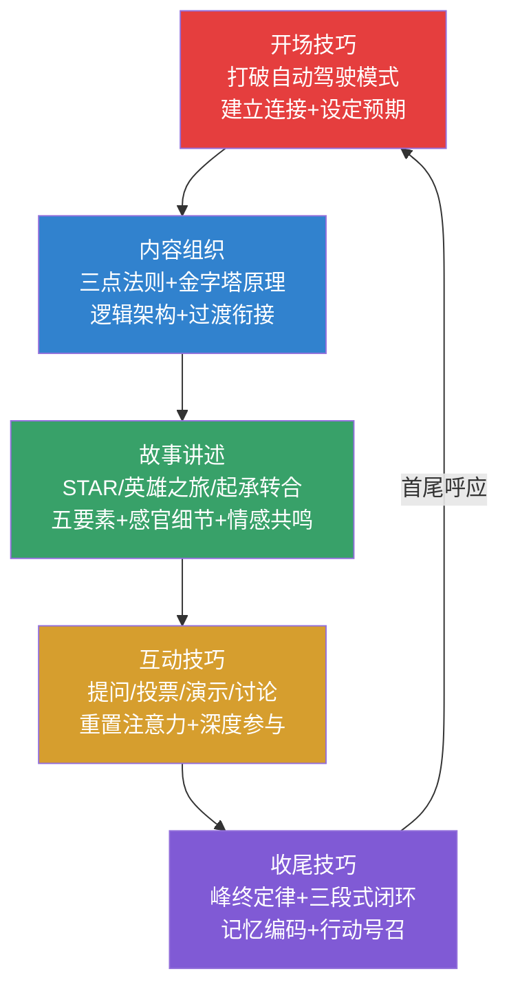

## 本节小结

本节从认知科学和心理学出发，系统讲解了演讲表达的五大核心技巧——开场、内容组织、故事讲述、互动、收尾。这五个技巧不是彼此孤立的"模块"，而是一个有机整体：开场决定听众是否愿意听，内容组织决定听众能否听懂，故事讲述决定听众能否被打动，互动决定听众能否深度参与，收尾决定听众能否记住并行动。

### 五项技巧的核心要点回顾

#### 一、开场技巧：黄金30秒定成败

开场的底层逻辑建立在四条心理学原理之上：首因效应（听众对最先接收的信息权重最大）、注意力曲线（开场质量决定了注意力峰值的起点高度）、好奇心缺口（信息不对称产生的求知驱动力）、情绪启动效应（情绪状态先于理性分析影响判断）。

开场必须在30秒内完成三个必达任务：

1. **打断"自动驾驶模式"**——用意外刺激把听众从低能耗状态中唤醒
2. **建立"这和我有关"的连接**——通过痛点连接、身份连接或利益连接，回答听众内心无声的问题
3. **设定预期"值得听下去"**——用具体的价值承诺支撑听众的时间投资

七种经典开场方式各有适用场景和操作边界：

| 开场方式 | 核心机制 | 最佳适用场景 | 时长建议 |
|---------|---------|------------|---------|
| 惊人事实/数据 | 激活好奇心缺口 | 商业演讲、学术报告 | 30-45秒 |
| 提问开场 | 切换被动→主动模式 | 团队培训、内部分享 | 20-40秒 |
| 故事开场 | 神经耦合+催产素释放 | TED式演讲、个人分享 | 60-90秒 |
| 名言引用 | 借来的权威背书 | 领导力、创新主题 | 20-30秒 |
| 悬念开场 | 蔡加尼克效应 | 主题演讲、发布会 | 30-45秒 |
| 幽默开场 | 多巴胺+内啡肽释放 | 轻松场合、团队内部 | 20-40秒 |
| 场景描绘 | 具身认知效应 | 激励演讲、情感共鸣 | 30-60秒 |

开场的五大禁忌：道歉式开场（"我没怎么准备"）、废话式开场（过度寒暄）、读PPT标题式、过度铺垫式、时间过长的开场。这些错误都在消耗听众最珍贵的"注意力窗口"。

#### 二、内容组织：构建听众大脑的"信息骨架"

内容组织是整场演讲的骨架，其重要性建立在认知负荷理论（约翰·斯威勒，1988）、组块理论（乔治·米勒，1956）、首因-近因效应和图式理论（皮亚杰）四大认知原理之上。核心目标是：**最小化外在认知负荷，最大化相关认知负荷**。

"三点法则"是演讲中最强大的组织工具——"三"之所以成为魔法数字，是工作记忆容量、模式识别机制、修辞传统和神经科学闭合信号四条规律的交汇。三点法则有五种组织结构：

- **并列式**：三个独立维度，全面覆盖
- **递进式**：重要性/难度递增，制造紧迫感
- **时间式**：过去→现在→未来，自然流畅
- **问题式**：问题→原因→方案，逻辑严密
- **故事式**：起因→经过→结果，情感驱动

金字塔原理（芭芭拉·明托，1987）是内容组织的宏观框架，四条核心原则：结论先行（演绎法优于归纳法）、以上统下、归类分组（MECE检验）、逻辑递进。

在微观层面，演讲主体有六种常用逻辑架构：PREP结构（观点-理由-案例-重申）、问题-原因-方案、时间线、比较对照、由浅入深、Monroe激励序列（注意→需求→满足→可视化→行动）。

过渡是连接内容的桥梁——有效的过渡可以将听众对后续内容的理解度提升30%以上。八种高级过渡技巧：总结-预告、问题、对比、数字路标、故事、金句、互动、视觉过渡。

#### 三、故事讲述：大脑最强大的"信息压缩格式"

故事不是演讲的"调味品"，而是最强大的信息传递载体。神经科学研究证实：听故事时，讲述者和听众的大脑活动出现"神经耦合"——故事不是信息传递，而是**经验传递**。数据堆满的演讲三天后记住率约5%，穿插故事后飙升至65%以上。

故事的底层优势来自三个维度：神经科学维度（催产素释放→同理心和信任感）、心理学维度（满足意义建构、代入体验、情感调节、社交归属四大需求）、修辞学维度（同时调动亚里士多德的Logos、Ethos、Pathos三要素）。

三种核心故事结构：

- **STAR模型**（情境→任务→行动→结果）：职场演讲首选，结构清晰，逻辑性强
- **英雄之旅**（12阶段，可简化为7步）：打动人心的经典叙事，适合深度共鸣
- **起承转合**（东方传统）：简洁有力，适合3-5分钟短故事

故事的五个核心要素缺一不可：具体可感的人物（可识别受害者效应）、真实的冲突（内心/人际/环境三类冲突层层递进）、感官细节（五感描写让平面叙述变三维体验）、情感共鸣（展示脆弱性、制造反差、"我也是"时刻、留白与沉默）、明确的启示（显性点题/隐性暗示/问题引导三种呈现方式）。

高级技巧包括：数据故事（数据+叙事+可视化三层结构）、嵌套故事、多线叙事。日常练习方面，建立"故事雷达"思维，用"主题×情感"两个维度构建个人故事库。

#### 四、互动技巧：从"独白剧场"到"对话广场"

互动的科学基础：注意力衰减曲线（每10-15分钟需要重置）、宜家效应（参与创造→评价提升）、社会认同与从众效应、具身认知（身体状态影响思维和情感）。

互动设计需同时考虑规模、能量、内容三个维度，选择矩阵如下：

| 场景规模 | 推荐互动方式 | 避免方式 |
|---------|------------|---------|
| 小型（10-30人） | 小组讨论、直接提问、现场演示 | 大规模投票 |
| 中型（30-150人） | 举手投票、选择题、想象引导 | 一对一提问 |
| 大型（150人+） | 数字投票工具、全场肢体互动 | 小组讨论 |

十大核心互动技巧：提问互动（三种模式——直接/举手/反问）、举手投票（二次投票是进阶利器）、思考暂停（生成效应——自己想出来的比听到的记得更牢）、现场演示（道具/志愿者/自体三种类型）、小组讨论（标准七步流程）、数字互动（Slido/微信小程序/问卷星等工具对比）、故事邀请（五种降低冷场风险的策略）、想象引导（四段式结构——过渡→设定→深化→收束）、幽默互动（五种类型，自嘲最安全）、肢体互动（能量等级最高，持续不超过30秒）。

互动的风险管理至关重要：冷场有四级递进应对策略（等待→降低门槛→自问自答→幽默化解）；听众失控有分级方案（过度活跃/偏离主题/对抗性回应/过度分享）；技术故障永远准备"无技术"备选方案。

#### 五、收尾技巧：峰终定律决定记忆编码

诺贝尔奖得主丹尼尔·卡尼曼的峰终定律揭示：人们对经历的整体评价取决于最强烈的瞬间（峰值）和结束的瞬间（终点），而非总时长或平均体验。杏仁核在经历结束时对情绪状态进行"快照"——听众带着什么情绪离开，就会把这种情绪归因到整场演讲。

完整的收尾遵循三段式闭环：信号段（告知听众在收尾）→核心段（传递最重要的信息/情感，占60-70%）→行动段（给出明确的下一步）。

十二种收尾方式按场景分类：总结回顾（信息压缩）、行动号召（SMART原则）、首尾呼应（闭环效应）、金句结尾（记忆压缩包）、愿景描绘（图优效应——画面记忆强度是抽象概念的6倍）、问题留白（蔡格尼克效应持续运行）、故事闭环（穿插式叙事的终极释放）、情感升华（理性铺垫→情感爆发）、数据震撼、幽默收尾、道具演示、沉默式收尾（最高级技巧，3-7秒沉默后用动作收尾）。

Q&A环节的战略最佳实践：放在倒数第二环节，Q&A结束后用预设收尾做"安全网"。回答问题用STAR-L框架（复述→思考→回答→重定向→连接）。七种困难问题（不知道答案/敌意挑战/无关问题/过于复杂/不确定/陷阱型/冷场）各有应对话术。

收尾的七大禁忌："我讲完了"、结尾加新内容、"由于时间关系"、"谢谢大家"作为唯一结尾、语速突然加快、低头念稿、用"总之"开头。

### 五项技巧的内在逻辑关系

五项技巧不是线性的"先后顺序"，而是相互支撑、相互渗透的系统：

**互相渗透的关系**：

- 开场中可以使用故事（故事开场）、互动（提问开场）、甚至收尾的呼应技巧（悬念开场在收尾时揭晓）
- 内容组织为故事提供骨架（STAR模型本身就是一种组织结构），为互动提供切入点（每个论点后都是互动的自然位置）
- 故事贯穿于开场、内容主体和收尾——它是整场演讲的"血液"
- 互动不仅存在于中间段落，开场的举手投票和收尾的行动号召都是互动的变体
- 收尾的首尾呼应技巧直接与开场的悬念形成闭环

### 从技巧到能力的进阶路径

掌握这五项技巧不是一次性的学习，而是一个渐进的过程。建议按以下路径分阶段练习：

**第一阶段（入门期，1-2个月）：打好单一技巧的基础**

选择一两种最契合你日常场景的技巧，有意识地在每次演讲中练习。工作汇报场景优先练"内容组织+收尾技巧"，团队分享场景优先练"开场技巧+互动技巧"，个人成长场景优先练"故事讲述"。

**第二阶段（成长期，3-6个月）：建立技巧组合的意识**

开始在一场演讲中同时运用多项技巧：用故事开场、用三点法则组织内容、用提问互动重置注意力、用总结+行动号召收尾。重点练习技巧之间的"过渡"——让技巧的切换自然流畅，而不是生硬拼接。

**第三阶段（精进期，6个月以上）：形成个人风格**

超越具体技巧的"套用"，根据现场氛围灵活调整。大师级演讲者的共同特征是：听众感觉不到"技巧"的存在——一切看起来自然而然，但实际上每个停顿、每个手势、每个故事都有精心设计的底层逻辑。

**持续精进的核心习惯**：

1. **每次演讲后做15分钟复盘**——记录哪些技巧有效、哪些需要改进
2. **建立并维护个人故事库**——每天花5分钟捕捉生活中的故事素材
3. **观摩优秀演讲并拆解结构**——看TED演讲时，标注每个技巧的使用位置和效果
4. **录下自己的演讲回看**——你会发现自己没有意识到的习惯和问题
5. **寻找安全的练习场**——在低风险场合（朋友聚会、部门周会）先练，再在高风险场合（客户提案、公开演讲）使用

### 五项技巧的关键数据速查

| 技巧 | 核心时间窗口 | 认知科学依据 | 关键数字 |
|------|------------|------------|---------|
| 开场 | 前30秒 | 首因效应+注意力曲线 | 3个必达任务，7种方式 |
| 内容组织 | 全程 | 认知负荷理论+组块理论 | 4±1个工作记忆组块，3个核心要点 |
| 故事讲述 | 全程穿插 | 神经耦合+催产素效应 | 3分钟法则，5个核心要素 |
| 互动 | 每10-15分钟 | 定向反应+宜家效应 | 10种技巧，3维度选择 |
| 收尾 | 最后10%-15%时间 | 峰终定律+近因效应 | 12种方式，3段式闭环 |

掌握这些技巧需要时间和练习。建议先选择一两种最契合你当前场景和需求的技巧，在下一次演讲中有意识地尝试——哪怕只是一个更有力的开场停顿、一个更具体的故事细节、一次更有效的听众互动，都是巨大的进步。然后逐步扩展你的技巧库，直到这些技巧内化为你的本能反应。
