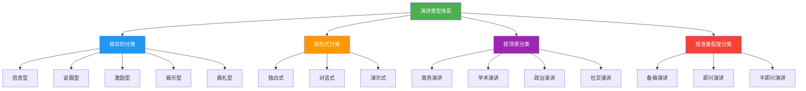
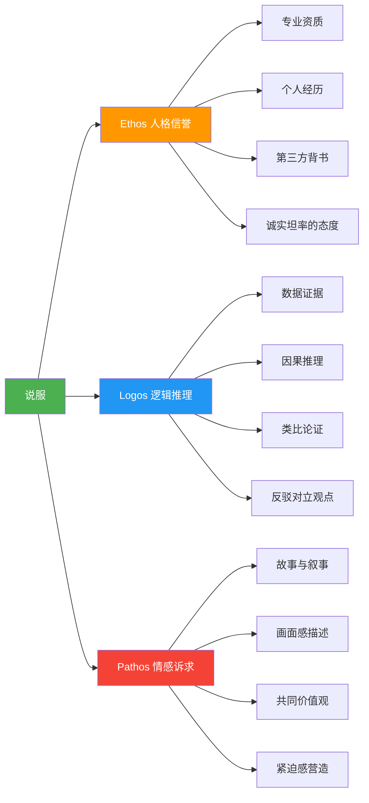
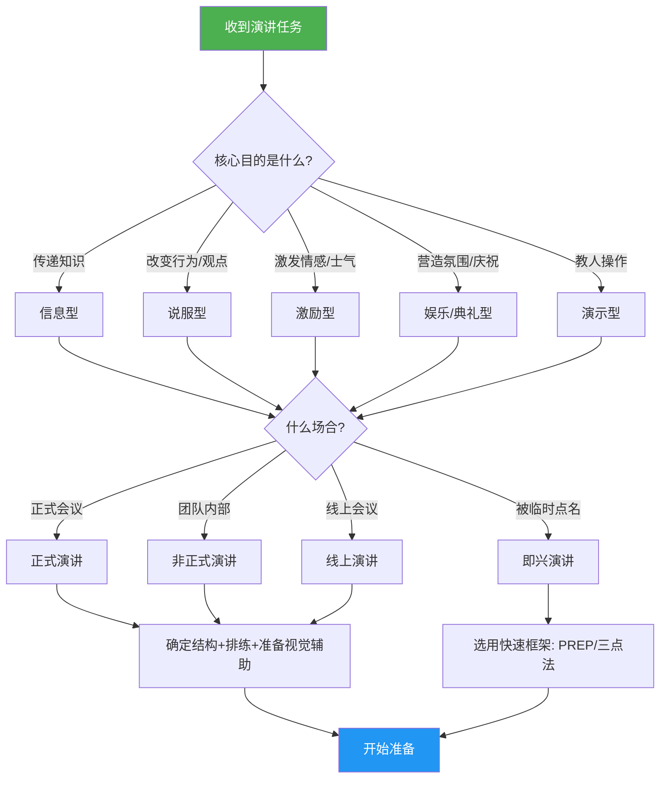

## 一、演讲的类型

演讲不是千篇一律的"上台说话"。一场产品发布会、一次毕业典礼致辞、一段婚礼祝词、一场学术答辩——它们虽然都被归入"演讲"，但从目的、结构、技巧到评价标准都截然不同。**理解演讲的类型体系，是系统掌握演讲表达的第一步**：它帮助你明确"我到底要做什么"，进而选择最合适的策略、结构和表达方式。

### 1.1 为什么需要分类

很多人觉得"演讲就是演讲"，不需要分类。这种认知会导致一个严重问题——**用信息型演讲的方式去做说服型演讲，用娱乐型演讲的节奏去做典礼型演讲**，结果听众觉得"哪里不对"，演讲者自己也觉得"效果不好但不知道为什么"。

分类的价值在于：

- **明确目标**：不同类型有不同的核心目标（传递信息 vs 改变行为 vs 激发情感），目标决定策略
- **选择结构**：信息型用"总-分-总"，说服型用"问题-方案-行动"，典礼型用"叙事-升华"，结构选错满盘皆输
- **匹配风格**：语言风格、互动方式、情感投入程度都要因类型而异
- **评估效果**：信息型看"听众记住了多少"，说服型看"听众是否采取了行动"，标准不同

以下按**目的维度**和**形式维度**两大主线展开，这是最实用、最常用的分类方式。

---

### 1.2 按目的分类：你到底想达成什么

目的是演讲最本质的分类依据。同一场演讲可能兼具多重目的，但一定有一个**主导目的**，它决定了演讲的整体策略。

#### 1.2.1 信息型演讲（Informative Speech）

**核心目标**：向听众传递知识、数据、事实或概念，让听众"知道"原本不知道的东西。

**定位**：演讲者扮演"教育者"或"知识传播者"的角色。成功标准不是演讲者有多厉害，而是**听众是否真正理解并记住了关键信息**。

**典型场景**：

| 场景 | 具体例子 | 时长参考 |
|------|----------|----------|
| 学术讲座 | 教授讲授量子计算基础 | 45-90分钟 |
| 技术分享 | 工程师介绍新架构设计方案 | 15-30分钟 |
| 产品培训 | 销售团队学习新产品功能 | 30-60分钟 |
| 工作报告 | 季度业务数据汇报 | 10-20分钟 |
| 新闻发布会 | 公司宣布重大事项 | 15-30分钟 |
| 科普演讲 | TED式知识分享 | 5-18分钟 |

**关键特征**：

1. **内容准确客观**：以事实和数据为支撑，不夸大、不误导。信息型演讲中，准确性是底线——一次数据错误可能摧毁整场演讲的可信度
2. **结构清晰逻辑严密**：听众需要一条清晰的"认知路径"，常见结构包括时间顺序、空间顺序、因果链、问题-解答、分类列举
3. **语言通俗易懂**：面对非专业听众时，要将专业术语翻译成日常语言。爱因斯坦说过："如果你不能简单地解释它，说明你还没有真正理解它"
4. **善用视觉辅助**：图表、流程图、示意图比纯文字有效10倍。信息型演讲是最依赖PPT的类型
5. **控制信息密度**：人脑短期记忆容量有限（米勒定律：7±2），一场15分钟的信息型演讲，核心信息点不超过5个

**写作与准备要点**：

- **开场先给"地图"**：告诉听众"今天我会讲3个方面"，让他们有心理预期
- **每个知识点配一个具体例子**：抽象概念+具体案例是信息传递的黄金组合
- **使用类比降低理解门槛**："数据库索引就像书的目录"比"数据库索引是一种B+树数据结构"有效得多
- **结尾做总结回顾**：重申3-5个关键信息点，帮助听众从短期记忆转入长期记忆

**常见误区**：

- ❌ 信息量过大，试图在一场演讲中讲完一整本书的内容
- ❌ 全程照念PPT上的文字，沦为"读稿机器"
- ❌ 以为"我说了=听众懂了"，忽略检验理解的环节
- ✅ 正确做法：精选核心信息，用多种方式（讲述、举例、图示、互动）反复强化

#### 1.2.2 说服型演讲（Persuasive Speech）

**核心目标**：改变听众的观点、态度或行为。不仅要让听众"知道"，更要让他们"相信"并"行动"。

**定位**：这是最具挑战性的演讲类型。你面对的往往不是"空白画布"般的听众，而是带着既有观点、疑虑甚至反对立场的人。

**典型场景**：

| 场景 | 说服目标 | 难度 |
|------|----------|------|
| 投资路演 | 让投资人掏钱 | ★★★★★ |
| 商业提案 | 让客户签合同 | ★★★★☆ |
| 政治演说 | 让选民投票 | ★★★★★ |
| 内部提案 | 让领导批准项目 | ★★★☆☆ |
| 公益倡导 | 让公众改变行为 | ★★★★☆ |
| 法庭辩护 | 让法官/陪审团采信 | ★★★★★ |

**亚里士多德的说服三要素（Rhetoric Triangle）**：

这是说服型演讲的理论基石，2300年来从未过时：

- **Ethos（人格信誉）**：听众首先要相信"这个人值得听"。建立Ethos的方式包括：展示专业背景、引用权威背书、展现诚实态度（主动承认局限性反而增加可信度）
- **Logos（逻辑推理）**：用事实、数据、因果关系支撑论点。逻辑是说服的骨架——没有逻辑的情感煽动只是空洞的口号
- **Pathos（情感诉求）**：触动听众的情感，让他们在感性层面认同你。人是情感动物，纯粹的逻辑往往不够——"人们会忘记你说过什么，但永远不会忘记你让他们感受过什么"（玛雅·安杰洛）

**说服型演讲的经典结构——门罗激励序列（Monroe's Motivated Sequence）**：

这是经过大量实验验证的说服框架，由普渡大学教授Alan Monroe于20世纪30年代提出：

| 步骤 | 名称 | 目的 | 时间占比 | 具体做法 |
|------|------|------|----------|----------|
| 1 | 注意（Attention） | 抓住听众注意力 | 10-15% | 用惊人的事实、尖锐的问题或生动的故事开场 |
| 2 | 需求（Need） | 揭示问题的严重性 | 20-25% | 用数据和案例证明"这个问题必须解决" |
| 3 | 满足（Satisfaction） | 提出解决方案 | 25-30% | 清晰阐述你的方案是什么、为什么有效 |
| 4 | 形象化（Visualization） | 描绘行动/不行动的后果 | 15-20% | "如果采纳，未来会怎样；如果不采纳，又会怎样" |
| 5 | 行动（Action） | 给出明确的下一步 | 10-15% | "现在就请……"——具体的行动号召 |

**实战技巧**：

- **预判反对意见并主动回应**：不要等听众质疑，在演讲中就说出他们的疑虑并给出解答。这叫"预防接种"（Inoculation），比被动回应有效得多
- **用"即使你不同意A，你也必须同意B"的让步策略**：先承认对方部分合理性，再转向你的论点
- **从听众的利益出发，而非你的需求**："这个方案能帮你节省30%的时间"比"我们部门需要这个预算"有说服力得多
- **结尾的行动号召必须具体可执行**："请在本周五前填写反馈表"比"希望大家支持"强100倍

**常见误区**：

- ❌ 只讲自己的立场，不考虑听众的反对意见——这会让听众产生防御心理
- ❌ 逻辑严密但缺乏情感——听众理智上同意但情感上无动于衷，最终不会行动
- ❌ 用恐吓代替说服——过度恐吓会让听众关闭心理防线
- ✅ 正确做法：Ethos+Logos+Pathos三管齐下，从听众的利益和情感出发

#### 1.2.3 激励型演讲（Inspirational Speech）

**核心目标**：激发听众的热情、信心和行动力。不重在"让人知道"或"让人相信"，而是**"让人热血沸腾"**。

**定位**：激励型演讲往往在关键时刻出现——团队面临困境需要士气、公司转型需要共识、社会变革需要凝聚力量。它是最依赖演讲者个人魅力和真诚感的类型。

**典型场景**：

- 团队动员大会（项目冲刺前、危机应对时）
- 毕业典礼致辞
- 年会/峰会开场演讲
- 退役告别演讲
- 纪念日/周年庆典演讲

**关键特征**：

1. **以情感驱动为主，逻辑论证为辅**：激励型演讲的力量来自情感共鸣，而非数据堆砌
2. **大量使用故事、隐喻和修辞**：个人经历、团队故事、历史典故是最好的"燃料"
3. **反复使用排比和回环**：马丁·路德·金的"I have a dream"反复出现8次，排比产生节奏感和力量感
4. **演讲者必须展现真诚的热情和信念**：听众能敏锐感知"表演出来的热情"和"发自内心的信念"之间的区别
5. **结尾描绘鼓舞人心的愿景**：让听众看到一个值得为之奋斗的未来

**经典案例分析——《我有一个梦想》**：

马丁·路德·金在1963年华盛顿大游行上的这篇演讲是激励型演讲的教科书级范例。它的成功秘诀：

- **没有罗列任何统计数据**，完全靠情感和愿景驱动
- **使用"我有一个梦想"的排比句式**，从第10段开始反复出现，每次叠加一个新的画面，形成情感的层层递进
- **大量使用隐喻和意象**："从绝望之岭劈出一块希望之石"——把抽象的种族平等愿景转化为可感知的画面
- **从共同的价值观出发**：开篇就引用《独立宣言》和《解放黑人奴隶宣言》，将诉求锚定在美国人共同认同的价值观上

**激励型演讲的"三幕结构"**：

| 幕 | 内容 | 情感曲线 |
|----|------|----------|
| 第一幕：共情 | 描述当下的困境和挑战，让听众感到"你理解我" | 低谷——共鸣 |
| 第二幕：转折 | 指出突破口或转机，唤醒希望和信心 | 上升——希望 |
| 第三幕：愿景 | 描绘一个美好的未来，号召共同行动 | 高潮——行动 |

**常见误区**：

- ❌ 空喊口号没有实质内容——"加油！我们一定行！"这种话毫无力量
- ❌ 情感过度失控——哽咽可以有，但全程哭腔会让人不舒服
- ❌ 激励完没有行动指引——听众热血沸腾但不知道"接下来我该做什么"
- ✅ 正确做法：用真实故事建立共情，用清晰愿景点燃热情，用具体行动落地转化

#### 1.2.4 娱乐型演讲（Entertaining Speech）

**核心目标**：让听众感到愉悦和放松，在轻松氛围中传递某种信息、价值观或感悟。

**定位**：娱乐型演讲不是"不严肃的演讲"，而是一种高难度的表达形式——让人笑比让人哭难得多，而让人在笑的同时有所思考，更是难上加难。

**典型场景**：

- 婚礼致辞（伴郎/伴娘/父母/新人）
- 颁奖典礼感言
- 晚宴/聚会祝酒词
- 脱口秀/喜剧演出
- 退休欢送会致辞
- 校友聚会发言

**关键特征**：

1. **幽默是核心工具，但不是唯一工具**：好的娱乐型演讲 = 幽默 + 洞察 + 真情。纯搞笑是单口喜剧，不是演讲
2. **节奏轻松自然**：不拘泥于严格结构，像在和朋友聊天
3. **内容高度个人化**：讲自己的故事、自己的糗事、自己的感悟——真实比精彩更重要
4. **把握幽默的分寸**：幽默的目标是"让大家一起笑"，而不是"拿别人开涮"。避免涉及种族、性别、宗教、外貌等敏感话题

**幽默的技术拆解**：

幽默不是天赋（至少不完全是），它有可学习的技术框架：

- **意外反转（Incongruity）**：先铺垫一条逻辑线，然后突然转向一个出人意料的方向。"我准备了三小时的演讲稿……然后发现今天不是我发言"
- **自嘲（Self-deprecation）**：拿自己开涮是最安全的幽默方式。它展现自信（能自嘲说明内心强大），也让听众放松
- **三段式笑话（Rule of Three）**：前两个正常，第三个出人意料。"这份工作需要三种能力：专业技能、团队协作，以及在领导说'这个很简单'时保持微笑的能力"
- **回调（Callback）**：后面提到前面讲过的内容，形成呼应。听众会因为"我记住了前面的梗"而产生愉悦感

**常见误区**：

- ❌ 讲网上抄来的段子——不真诚，听众能感觉到
- ❌ 幽默建立在贬低他人之上——婚礼上嘲笑新郎的前任是最差的娱乐型演讲
- ❌ 全程搞笑没有"落点"——好的娱乐型演讲最后要有一个温暖或深刻的收尾
- ✅ 正确做法：从真实经历中提炼幽默，在笑声中传递真情

#### 1.2.5 典礼型演讲（Ceremonial Speech）

**核心目标**：在特定仪式或庆典场合中，赋予事件以意义、表达敬意或纪念。典礼型演讲常常被忽视，但它是人类社会最古老的演讲形式之一。

**定位**：典礼型演讲不是"走过场"。一场好的毕业致辞能让学生铭记一生，一场好的悼词能让逝者的形象永远鲜活。它承载的是**集体情感的表达和仪式感的塑造**。

**典型场景**：

| 场景 | 演讲者角色 | 核心任务 |
|------|-----------|----------|
| 毕业典礼 | 校长/嘉宾 | 寄语未来，传递人生智慧 |
| 婚礼 | 伴郎/伴娘/父母 | 祝福新人，分享回忆 |
| 葬礼/追悼会 | 亲友/同事 | 缅怀逝者，安慰生者 |
| 就职典礼 | 新任领导 | 宣示愿景，承诺担当 |
| 退休仪式 | 同事/领导 | 回顾贡献，表达感谢 |
| 获奖感言 | 获奖者 | 感谢致意，分享感悟 |
| 纪念日 | 代表人物 | 铭记历史，启迪未来 |

**关键特征**：

1. **以情感为核心**：典礼型演讲的目的不是传递信息或说服，而是表达和唤起情感
2. **高度依赖"共同记忆"**：好的典礼演讲会唤起在场所有人共同经历过的记忆，创造情感共振
3. **语言偏向文学化**：可以适当使用诗意的语言、优美的排比、深远的隐喻
4. **时长通常较短**：5-15分钟为宜。典礼场合的注意力窗口更短，冗长是最大的敌人
5. **开头和结尾是重中之重**：听众对开头和结尾的记忆远强于中间部分（首因效应+近因效应）

**毕业致辞的结构模板**：

1. 开场：一个个人故事或观察（1-2分钟）
   → 拉近距离，建立共情
   
2. 主题：一个核心观点/人生教训（2-3分钟）
   → 不要试图讲3个道理，深耕1个就够
   
3. 展开：2-3个具体例子/故事（3-5分钟）
   → 真实经历 > 名人轶事 > 道理说教
   
4. 回扣：将主题与毕业生的当下处境连接（1-2分钟）
   → "你们即将面临……"
   
5. 收尾：一句隽永有力的结束语（30秒）
   → 这是全篇最重要的一句话

**常见误区**：

- ❌ 堆砌名人名言和心灵鸡汤——典礼场合的听众对虚假感极其敏感
- ❌ 讲太久——典礼是集体活动，不是个人专场
- ❌ 忘记主角——婚礼致辞的主角是新人，不是伴郎自己
- ✅ 正确做法：真诚 + 简短 + 一个好故事 + 一句好收尾

#### 1.2.6 演示型演讲（Demonstrative Speech）

**核心目标**：向听众展示"如何做某事"，让听众在看完演讲后具备操作能力。

**定位**：演示型演讲是信息型演讲的"实操升级版"——信息型让人"知道是什么"，演示型让人"知道怎么做"。它是技术分享、产品教学、烹饪节目等场景的核心形式。

**典型场景**：

- 技术工作坊（"如何用Docker部署应用"）
- 产品演示（"新功能操作指南"）
- 烹饪/手工教学
- 医疗急救培训
- 软件使用教程

**关键特征**：

1. **步骤清晰可执行**：每一步都要具体到"做什么、怎么做、做到什么程度"
2. **视觉辅助必不可少**：演示型演讲是最依赖"看得见"的类型——屏幕共享、实物展示、现场操作
3. **边做边讲**：不是先讲完理论再操作，而是操作一步讲解一步
4. **预设故障方案**：演示环节可能出错（网络断了、软件崩了、道具坏了），必须有备选方案
5. **控制节奏**：听众需要时间消化每一步，不能跑得太快

**结构框架**：

1. 为什么要做这件事（2分钟）
   → 激发动机，让听众觉得"我需要学这个"
   
2. 准备工作清单（2分钟）
   → 需要什么工具、材料、环境
   
3. 分步演示（主干，占60-70%时间）
   → 每步：操作 → 讲解要点 → 常见错误 → 小结
   
4. 完整回顾（2-3分钟）
   → 串起来从头做一遍，强化记忆
   
5. Q&A + 补充资源（剩余时间）
   → 提供文档、代码、参考资料链接

---

### 1.3 按形式分类：你以什么方式讲

#### 1.3.1 正式演讲（Formal Speech）

**定义**：有明确的议程安排、时间限制和场地布置，演讲者与听众之间存在物理和心理距离。

**特征**：
- 着装正式，站位固定（讲台/舞台）
- 语言规范，少用口语和俚语
- 结构完整，通常有PPT等辅助材料
- 有主持人介绍、时间提醒等仪式感元素
- 互动有限，通常在Q&A环节

**适用场景**：公司年会、行业峰会、学术会议、政府发布会

**准备重点**：提前确认设备（投影、麦克风、翻页笔）、排练至少3遍、准备应对技术故障的预案

#### 1.3.2 非正式演讲（Informal Speech）

**定义**：氛围轻松，在日常工作或社交场景中自然发生的"发言"。

**特征**：
- 语言口语化，可以使用行话和幽默
- 互动性强，随时可以被打断或提问
- 时间灵活，可长可短
- 不一定有PPT，可能是围坐讨论的形式

**适用场景**：团队站会、项目复盘、部门分享、小组讨论、茶歇时的"随便说两句"

**注意**：非正式不等于不准备。"随便说两句"如果逻辑混乱、重点不清，反而比正式演讲更伤形象——因为近距离场景下，听众的注意力更集中

#### 1.3.3 即兴演讲（Impromptu Speech）

**定义**：在没有充分准备（甚至完全没有准备）的情况下进行的演讲。被突然点名发言、会议中被要求表态、社交场合被推举讲话——这些都属于即兴演讲。

**这是对演讲者综合能力的终极考验**，因为没有PPT、没有讲稿、没有排练，你只有几秒钟的思考时间和一个正在等待的听众群体。

**即兴演讲的快速框架——PREP法**：

| 步骤 | 含义 | 时间 | 示例 |
|------|------|------|------|
| P - Point | 观点 | 10秒 | "我认为这个方案可行" |
| R - Reason | 原因 | 30秒 | "因为成本可控且技术成熟" |
| E - Example | 例子 | 30秒 | "上季度我们用类似方案在XX项目中节省了20%" |
| P - Point | 重申 | 10秒 | "所以我支持推进这个方案" |

**其他即兴框架**：

- **时间线法**：过去→现在→未来。"三年前我们还在……，今天我们已经……，未来我们会……"
- **问题-方案法**：是什么→为什么→怎么办。适合被问到"怎么看这个现象"时使用
- **三点法**：直接列出三个要点。人脑喜欢"三"这个数字，三个点既有内容又不过载

**即兴演讲的训练方法**：

1. **每日练习**：每天随机一个话题，用PREP法讲1分钟，录下来回听
2. **词汇联想**：随机一个词，围绕它讲30秒，训练快速组织语言的能力
3. **新闻评论**：看到一条新闻，立刻用"我怎么看+为什么+举例+总结"的框架发表评论
4. **参加即兴演讲俱乐部**：如Toastmasters的Table Topics环节，专门训练即兴演讲

#### 1.3.4 线上演讲（Virtual/Online Speech）

**定义**：通过视频会议平台（Zoom、腾讯会议、Teams等）进行的远程演讲。2020年后已成为一种独立的、重要的演讲形式，而非线下演讲的"权宜替代品"。

**与线下演讲的核心差异**：

| 维度 | 线下演讲 | 线上演讲 |
|------|----------|----------|
| 注意力 | 听众在物理空间中，分心成本高 | 听众在自己的空间，随时可能切屏、看手机 |
| 互动 | 举手、鼓掌、点头等自然反馈 | 只有聊天框和表情回应，反馈延迟且有限 |
| 气场 | 肢体语言、空间感、声音共鸣 | 只有一个小方框，气场大幅削弱 |
| 技术依赖 | 投影和麦克风 | 网络、摄像头、麦克风、平台软件——任何一环都可能出问题 |
| 疲劳感 | 适度 | "Zoom疲劳"是真实存在的认知现象 |

**线上演讲的特殊要求**：

1. **前3分钟决定成败**：线上听众的注意力窗口比线下短得多，开场必须迅速抓住注意力
2. **每5-7分钟设一个互动点**：投票、提问、聊天框互动——防止听众"静音后去做别的事"
3. **语言密度要更高**：线下可以靠走动、手势、停顿来填充节奏，线上每一秒都要有信息量
4. **视觉辅助更加重要**：线上演讲中PPT几乎等于你的"脸"，设计质量要求更高
5. **技术排练必不可少**：提前测试网络、摄像头角度、灯光、麦克风、屏幕共享

**线上演讲的设备建议**：

- **摄像头**：与眼睛平齐（不要俯拍或仰拍），画面中头顶留一拳空间
- **灯光**：面光优先，避免背光（窗户在背后会让你变成剪影）
- **麦克风**：外接麦克风效果远好于笔记本内置麦克风
- **背景**：简洁干净，避免杂乱或虚拟背景的"抠图穿帮"
- **网络**：有线连接比WiFi稳定，关闭其他大流量应用

#### 1.3.5 半即兴演讲（Semi-Impromptu Speech）

**定义**：有大纲但没有逐字稿，有准备但保留临场发挥空间。这是**实际工作中最常见的演讲形式**——你知道大概要讲什么，但具体措辞和展开方式在台上根据现场情况调整。

**准备方法**：

1. **准备"内容积木"**：把核心观点、关键数据、精彩案例分别写成独立的小卡片
2. **确定主线逻辑**：先讲什么、后讲什么、怎么转折——这条线是固定的
3. **灵活组装**：根据现场气氛和时间情况，决定哪些"积木"用、哪些跳过、哪些展开

这种准备方式比逐字背稿更灵活，比完全即兴更安全，是职业演讲者最常用的策略。

---

### 1.4 按场景分类：你在什么地方讲

#### 1.4.1 商务演讲

包括商业提案、投资路演、产品发布、客户汇报等。核心特点是**结果导向**——每一场商务演讲都对应一个明确的商业目标（签单、融资、品牌曝光）。

商务演讲的特殊要求：
- 数据说话，不靠感觉
- 结构化表达（金字塔原理、MECE原则）
- 时间极度宝贵，必须在最短时间内传递最大价值
- 关注决策者的需求，而非自己的表达欲

#### 1.4.2 学术演讲

包括论文答辩、学术报告、研讨会发言等。核心特点是**严谨性**——每一个论点都要有文献支撑，每一个数据都要标明来源。

学术演讲的特殊要求：
- 研究背景 → 方法 → 结果 → 讨论的IMRaD结构
- 数据可视化要求高（图表规范、误差标注）
- 同行评审式思维：预判听众的质疑并提前回应
- 语言精确，避免模糊表述

#### 1.4.3 政治演讲

包括竞选演说、政策宣讲、施政报告等。核心特点是**大众传播**——面向最广泛的受众，语言必须通俗有力。

政治演讲的特殊要求：
- 金句和口号比长篇大论更有效
- 情感共鸣 > 逻辑论证
- 善用叙事（讲"人"的故事比讲政策有效）
- 注意场合和时局的敏感性

#### 1.4.4 社交演讲

包括婚礼致辞、生日祝词、朋友聚会发言等。核心特点是**关系维护**——你不只是在"讲话"，你是在维系和深化一段关系。

社交演讲的特殊要求：
- 真诚是第一要义
- 了解听众的关系网络（谁和谁是什么关系）
- 幽默适度，不抢主角风头
- 时长从短，宁短勿长

---

### 1.5 混合类型：真实世界的演讲更复杂

现实中的演讲往往不是纯粹的某种类型，而是多种类型的混合。识别主导类型，兼顾次要类型，是高阶演讲能力的体现。

**常见混合模式**：

| 混合组合 | 典型场景 | 策略 |
|----------|----------|------|
| 信息+说服 | 学术论文答辩 | 以信息传递为基础，核心目的是说服评委"这项研究有价值" |
| 信息+演示 | 技术分享会 | 先讲原理（信息），再做Demo（演示） |
| 说服+激励 | 内部改革动员 | 用数据证明改革必要性（说服），用愿景激发行动力（激励） |
| 激励+典礼 | 毕业典礼致辞 | 典礼的仪式感框架 + 激励型的情感内核 |
| 娱乐+典礼 | 婚礼致辞 | 典礼的庄重氛围 + 娱乐的幽默元素 |
| 信息+娱乐 | 科普演讲/TED | 在娱乐性的形式中传递严肃的知识 |

**如何判断主导类型**：问自己一个问题——**"如果听众只记住一件事，我希望是什么？"**
- 如果是"一个知识/信息"→ 信息型为主
- 如果是"一个观点/决定"→ 说服型为主
- 如果是"一种感受/信念"→ 激励型为主
- 如果是"一段快乐时光"→ 娱乐型为主
- 如果是"一种仪式感/纪念"→ 典礼型为主

---

### 1.6 如何为你的演讲定位类型

面对一个具体的演讲任务，用以下流程确定类型和策略：

**实操检查清单**：

- [ ] 我的演讲主导类型是什么？（信息/说服/激励/娱乐/典礼/演示）
- [ ] 听众是谁？他们对这个话题的已有认知程度如何？
- [ ] 场合是正式还是非正式？线上还是线下？
- [ ] 我有多少时间？（决定内容深度和信息量）
- [ ] 听众听完后，我希望他们"知道什么/相信什么/感受到什么/去做什么"？
- [ ] 需要准备哪些视觉辅助材料？
- [ ] 是否需要为即兴环节准备"应急框架"？

---

### 1.7 不同类型演讲的能力侧重

成为全能型演讲者需要全面发展，但在不同阶段可以有所侧重：

| 能力维度 | 信息型 | 说服型 | 激励型 | 娱乐型 | 典礼型 | 演示型 |
|----------|--------|--------|--------|--------|--------|--------|
| 逻辑组织 | ★★★★★ | ★★★★★ | ★★★☆☆ | ★★☆☆☆ | ★★★☆☆ | ★★★★☆ |
| 情感表达 | ★★☆☆☆ | ★★★★☆ | ★★★★★ | ★★★★☆ | ★★★★★ | ★★☆☆☆ |
| 幽默感 | ★☆☆☆☆ | ★★☆☆☆ | ★★☆☆☆ | ★★★★★ | ★★★☆☆ | ★☆☆☆☆ |
| 专业知识 | ★★★★★ | ★★★★☆ | ★★☆☆☆ | ★★☆☆☆ | ★★☆☆☆ | ★★★★★ |
| 互动能力 | ★★★☆☆ | ★★★★☆ | ★★★☆☆ | ★★★★★ | ★★☆☆☆ | ★★★★☆ |
| 临场应变 | ★★★☆☆ | ★★★★☆ | ★★★☆☆ | ★★★★★ | ★★★☆☆ | ★★★★★ |
| 视觉设计 | ★★★★★ | ★★★★☆ | ★★★☆☆ | ★★☆☆☆ | ★★☆☆☆ | ★★★★★ |

**建议的练习顺序**：

1. **入门**：从信息型开始——结构最清晰，对情感和幽默的要求最低
2. **进阶**：练习说服型——学会Ethos/Logos/Pathos的综合运用
3. **高阶**：挑战激励型和典礼型——这是最考验个人魅力和真诚感的类型
4. **专项**：根据个人优势和职业需要，重点发展某个方向

> **关键认知**：演讲类型的划分不是为了给你贴标签，而是帮你在每次站上讲台之前问自己一个正确的问题——**"这次，我要让听众带走什么？"** 这个问题的答案，决定了你的一切策略选择。
