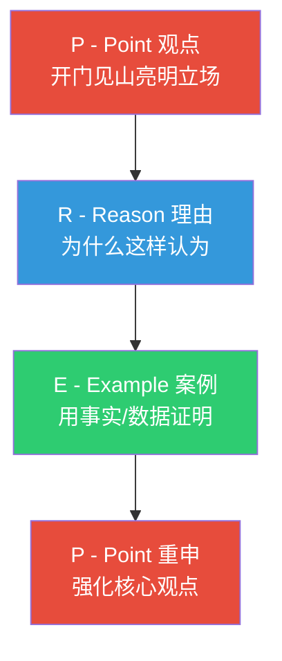
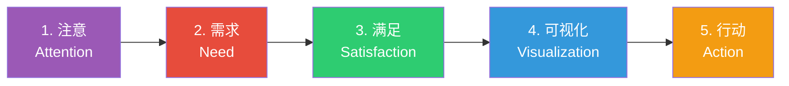

## 二、演讲的结构

演讲的结构如同建筑的钢筋骨架——听众看不到它，但它决定了整座建筑能否屹立不倒。一个结构清晰的演讲，能让听众毫不费力地跟上你的思路；而一个结构混乱的演讲，哪怕内容再精彩，也会让听众迷失在信息的迷宫里。

认知心理学家John Sweller的认知负荷理论指出，人的工作记忆容量有限（通常只能同时处理4±1个信息块）。好的演讲结构本质上是一种**认知卸载工具**——它为听众提供信息的"收纳框架"，让他们不必自己费力组织信息，从而把注意力集中在理解和思考上。

本章将系统讲解演讲结构的原理、模型和实操方法，帮助你从"想到哪说到哪"进化到"精准设计每一段内容的位置和功能"。

### 2.1 为什么结构如此重要

#### 结构对听众的影响

哈佛大学教育学院的研究发现，结构化信息的回忆率比非结构化信息高出40%以上。原因在于：

- **锚定效应**：清晰的结构为听众提供了记忆锚点，他们可以沿着结构线索回忆内容
- **预期管理**：当听众知道"接下来会讲什么"时，焦虑感降低，认知资源可以用于深度理解
- **意义建构**：结构帮助听众理解信息之间的关系（并列、递进、因果），而不是把每句话当作孤立的碎片

#### 结构对演讲者的影响

结构不仅帮助听众，也帮助演讲者本人：

- **降低紧张感**：有结构就像有了路线图，即使中途忘词也能快速找回位置
- **控制节奏**：结构天然划分了时间块，避免前松后紧或前紧后松
- **增强自信**：当你知道每一部分的功能和目标时，表达自然更加从容

#### 结构缺失的典型症状

| 症状 | 诊断 | 后果 |
|------|------|------|
| 听众频繁走神 | 缺乏清晰的逻辑主线 | 信息传达率低于20% |
| 演讲者频繁跑题 | 没有结构约束，思维发散 | 严重超时或草草收场 |
| 听众记不住重点 | 信息平铺，没有层次 | 演讲结束后无人讨论 |
| 开头冗长，结尾仓促 | 时间分配没有结构指导 | 虎头蛇尾，印象打折 |
| 听众提问重复已有内容 | 结构混乱导致听众漏听 | 演讲者疲于重复 |

### 2.2 经典三段式结构：开头-主体-结尾

这是最基本也是最可靠的演讲结构，几乎适用于所有类型的演讲。它之所以经久不衰，是因为它符合人类认知信息的自然模式——我们天生期待"开始-发展-结束"的叙事弧线。

#### 开头（Opening）—— 占比约10-15%

开头的唯一使命是**抓住听众的注意力**。神经科学研究表明，听众在演讲开始的30秒内就会形成对演讲者的第一印象，大脑的"网状激活系统"会在此刻决定是否将注意力资源分配给眼前的演讲者。换句话说，如果开头没有抓住人，后续内容再好也可能石沉大海。

**开头必须完成的四项任务**：

1. **建立连接**：让听众觉得"这和我有关"。你可以提及听众的痛点、共同的经历、当下的环境
2. **明确价值**：告诉听众"听这个演讲你能得到什么"。人类大脑对收益高度敏感
3. **激发好奇**：制造认知缺口——让听众意识到自己"不知道某件重要的事"
4. **建立信任**：快速证明你有资格讲这个话题（但不要自吹自擂，用事实说话）

**六种经过验证的开头方式及详细技巧**：

| 方式 | 做法 | 适用场景 | 注意事项 |
|------|------|----------|----------|
| 提问开场 | 提出一个让听众必须思考的问题 | 教学型、思辨型演讲 | 问题必须具体且与听众相关，不要问"大家好吗" |
| 数据冲击 | 用一个令人惊讶的数据打破预期 | 数据驱动的演讲、商业汇报 | 数据必须权威来源，且要翻译成听众能感知的含义 |
| 故事引入 | 讲一个与主题相关的个人经历或案例 | 情感型、叙事型演讲 | 故事必须简短（60秒内），且与核心论点直接相关 |
| 名言引用 | 引用一句切题的名言 | 学术型、思想型演讲 | 引用必须准确，且要解释为什么这句名言与今天的主题相关 |
| 震撼呈现 | 展示一张图片、一段视频或一个实物 | 产品发布、创意展示 | 视觉冲击必须与主题紧密相关，避免为震撼而震撼 |
| 核心观点先行 | 直接抛出演讲的核心结论 | 时间紧凑的商务演讲 | 适合高水平听众，对普通听众可能缺乏铺垫 |

**开头的致命错误**：

- **道歉式开头**："我今天没什么准备""我不太擅长演讲"——这等于告诉听众不值得听
- **冗长的背景介绍**：听众需要先知道"为什么我要听"，而不是"事情的来龙去脉"
- **虚假的互动**："大家今天心情好吗？"——这种互动毫无信息量，反而浪费注意力

#### 主体（Body）—— 占比约70-80%

主体是演讲的核心部分，承载着所有的信息、论证、故事和情感。主体设计的关键不是"说什么"，而是"以什么顺序说、怎样连接"。

**主体组织的五大原则**：

**1. 三点法则（Rule of Three）**

认知心理学中的"米勒法则"指出，人的短期记忆最容易处理三个信息块。这不是巧合——人类文化中充满了"三"的结构：三位一体、三个愿望、三幕剧。在演讲中，将主体控制在三个核心论点，是最高效的组织方式。

- 2个论点显得单薄，说服力不足
- 3个论点刚好形成稳固的三角支撑
- 4个以上论点会导致听众记忆疲劳

**2. 递进逻辑**

论点的排列顺序不是随意的，应该遵循一种递进关系：

- **重要性递增**：把最有力的论点放在最后（峰终定律）
- **难度递增**：先讲容易理解的，再讲需要思考的
- **时间递进**：按时间线展开，符合自然认知
- **空间递进**：从宏观到微观，或从局部到整体

**3. 平行结构**

每个论点采用相似的展开方式。例如，如果你的三个论点分别用"理论→案例→数据"的方式展开，那么三个论点都用同样的模式。平行结构大幅降低听众的认知负荷。

**4. 过渡与衔接**

论点之间必须有明确的过渡，就像公路的指示牌：

- **显式过渡**："讲完了成本问题，我们来看看收益方面"
- **问题过渡**："那么效率提升了多少呢？"
- **对比过渡**："如果说前面讲的是挑战，那么接下来看到的将是机遇"

**5. 呼应与回调**

在主体中适当回调前面讲过的内容，形成内部呼应。比如："还记得我开头提到的那个数据吗？现在我们可以用第二个论点来解释它为什么会这样。"

#### 结尾（Closing）—— 占比约10-15%

心理学中的"近因效应"（Recency Effect）表明，听众对最后听到的内容记忆最深。结尾是你的"最后一击"，决定了演讲结束后听众带走什么。

**结尾必须完成的四项任务**：

1. **总结提炼**：用一两句话概括核心信息（不是重复所有内容）
2. **强化记忆**：让核心观点以最精炼的形式再出现一次
3. **激发行动**：告诉听众"接下来你该做什么"
4. **情感升华**：在理性的基础上增加情感的冲击力

**六种经过验证的结尾方式**：

| 方式 | 做法 | 效果 |
|------|------|------|
| 首尾呼应 | 回扣开头的故事、问题或数据 | 形成闭环，结构美感强 |
| 行动号召 | 明确告诉听众一个具体的下一步 | 适合需要推动变革的演讲 |
| 名言收束 | 用一句有力的名言画上句号 | 余韵悠长，适合思想型演讲 |
| 故事结尾 | 讲一个意味深长的短故事 | 情感共鸣强，记忆持久 |
| 愿景描绘 | 描绘行动之后的美好未来 | 激励效果最强 |
| 开放问题 | 提出一个让听众回去继续思考的问题 | 适合教育型、研讨型演讲 |

**结尾的致命错误**：

- **"我就讲到这里"**：这不是结尾，这是投降。你等于把收尾的主动权交给了随机性
- **突然引入新信息**：结尾不是展开新话题的地方
- **冗长的感谢**：简单一句"谢谢"即可，不要把结尾变成感谢清单

### 2.3 八大演讲结构模型

不同类型的演讲需要不同的结构。以下是八种经过实践检验的结构模型，每种都有明确的适用场景和操作步骤。

#### 模型一：PREP结构（观点-理由-案例-重申）

PREP是最简洁有力的说服型结构，特别适合时间有限的场合。它的核心逻辑是"观点→支撑→回归"的闭环。

**操作步骤**：

1. **P（Point）**：用一句话明确表达你的观点，不要铺垫，直接说出来
2. **R（Reason）**：给出2-3个支持理由，每个理由用一句话概括
3. **E（Example）**：提供一个具体的案例、数据或故事来证明你的理由
4. **P（Point）**：用不同的措辞重申你的观点，最好加上"所以"或"因此"

**完整示例**：

> （P）远程办公应该成为公司的长期政策。
>
> （R）原因有三个：第一，它能降低30%的办公场地成本；第二，它能扩大人才招聘的地理范围；第三，多项研究显示远程员工的平均工作时长反而更长。
>
> （E）以GitLab为例，这家拥有1500多名员工的公司从创立之初就实行全员远程办公。2023年的财报显示，其人均产出比同行业平均水平高出22%，员工满意度达到4.3分（满分5分），而年度离职率仅为8%，远低于行业平均的18%。
>
> （P）因此，远程办公不仅不是生产力的敌人，反而是提升效率和人才竞争力的战略武器。我们应该果断拥抱它。

**适用场景**：即兴发言（1-3分钟）、会议讨论、电梯演讲、观点表达

**局限性**：不适合复杂论证或多角度分析，过于简单的结构可能让高水平听众觉得缺乏深度

#### 模型二：问题-解决结构（Problem-Solution）

这是说服型演讲最经典的结构，核心逻辑是"制造痛苦→提供解药"。人对问题的敏感度天然高于对方案的敏感度——先让人感受到痛，解决方案才会显得有价值。

**五步操作法**：

1. **问题描述**：用具体场景描述当前面临的问题，让听众感同身受
2. **影响分析**：用数据说明问题的严重性和紧迫性（"如果不解决，三年内会损失……"）
3. **根因分析**：简要说明问题的深层原因（避免方案显得"头痛医头"）
4. **解决方案**：提出你的方案，并解释它如何从根本上解决问题
5. **行动号召**：告诉听众具体该怎么做，给出第一步

**适用场景**：商业提案、投资路演、公益倡导、政策建议、产品推介

**变体——PAS结构（Problem-Agitate-Solution）**：

在问题和方案之间增加"煽动"步骤——把问题的后果放大，让听众从"觉得有问题"升级到"必须马上解决"。营销领域广泛使用这种结构。

#### 模型三：STAR结构（情境-任务-行动-结果）

STAR结构源自行为面试技术，但它在演讲中同样高效，特别适合讲述个人经历或案例分析。

- **S（Situation）**：描述背景情境，设定舞台
- **T（Task）**：说明你面临的任务或挑战
- **A（Action）**：详细描述你采取的行动
- **R（Result）**：展示行动带来的具体结果和数据

**操作要点**：

- 情境部分控制在20%以内，重点在行动和结果
- 结果必须尽可能量化（"效率提升35%"而非"效率大幅提升"）
- 如果结果不完美，诚实呈现，并说明你从中学到了什么

**适用场景**：经验分享、案例复盘、个人成长演讲、面试表达

#### 模型四：时间线结构（Chronological）

按照时间顺序组织内容，是最符合人类直觉的结构。大脑天然理解"先发生→后发生"的因果链。

**三段式时间线**：

- **过去**：背景和起源（"我们是怎么走到今天的"）
- **现在**：现状和分析（"我们正在面对什么"）
- **未来**：展望和规划（"我们要去哪里，怎么去"）

**适用场景**：项目汇报、公司战略演讲、个人成长分享、历史回顾、产品发展历程

**变体——倒叙结构**：

先讲结果（未来/现在的精彩成果），再倒回去讲过程。这种结构的悬念感更强，适合需要吸引注意力的场合。TED演讲中大量使用倒叙结构。

#### 模型五：总分总结构

先给出总体结论，然后从多个角度分别论述，最后再次总结升华。这是学术界和商务领域最常用的结构。

**操作步骤**：

1. **总**：提出核心观点或结论（让听众一开始就知道你要说什么）
2. **分**：从3-5个角度分别论证，每个角度独立成段
3. **总**：回归核心观点，并上升到更高的层面

**与PREP的区别**：PREP只有一个核心论点加一个案例；总分总可以有多个分论点，适合更复杂的论证。

**适用场景**：学术报告、工作总结、分析性演讲、政策建议

#### 模型六：Monroe激励序列（Monroe's Motivated Sequence）

由美国普渡大学传播学家Alan Monroe在20世纪30年代提出的五步说服结构，至今仍是说服性演讲的黄金标准。它的核心逻辑是按照人的心理接受过程逐步推进。

**详细操作指南**：

1. **注意（Attention）**：用震撼的事实、故事或问题抓住注意力。这一步的目标不是介绍主题，而是制造情感冲击。
2. **需求（Need）**：将注意力转化为具体的问题意识。用数据和案例说明这个问题真实存在、影响重大、且不能忽视。
3. **满足（Satisfaction）**：提出解决方案。方案必须直接对应第二步指出的问题，形成精准匹配。
4. **可视化（Visualization）**：描绘方案实施后的美好前景（正面可视化），以及不实施方案的可怕后果（负面可视化）。这一步利用的是"损失厌恶"心理。
5. **行动（Action）**：给听众一个具体的、可执行的下一步。不是"希望大家支持"，而是"请现在拿出手机扫码加入"。

**为什么Monroe序列有效**：

它精准地映射了人的决策心理过程：引起注意→认识问题→接受方案→想象结果→采取行动。大量实验表明，按照这个顺序组织的说服性演讲，转化率比随机顺序高出50%以上。

**适用场景**：销售演示、公益演讲、政策倡导、变革推动、众筹路演

#### 模型七：SCQA结构（情境-冲突-问题-答案）

这是麦肯锡咨询公司广泛使用的结构，特别适合分析型和咨询型演讲。

- **S（Situation）**：描述大家都认同的背景事实
- **C（Complication）**：指出发生了什么变化或出现了什么障碍
- **Q（Question）**：自然地引出核心问题（"那我们该怎么办？"）
- **A（Answer）**：给出你的答案和方案

**示例**：

> （S）过去三年，我们的线上销售额以每年25%的速度增长。（C）但今年上半年增速骤降到5%，主要原因是获客成本上升了3倍。（Q）面对获客成本飙升、增长放缓的双重压力，我们如何找到新的增长引擎？（A）我的答案是：构建私域流量体系，将获客成本降低60%……

**适用场景**：商业汇报、咨询建议、问题分析、战略演讲

#### 模型八：嵌套结构（Nested Loops）

嵌套结构是TED演讲中最常见的高级技巧——在演讲的主线中插入次级故事或案例，形成"故事套故事"的层次感。

**基本模式**：

故事A开始 → 故事B开始 → 故事C（完整）→ 故事B结束 → 故事A结束

**为什么有效**：

- 悬念感：未完成的故事会产生认知缺口，驱动听众持续关注
- 层次感：多个故事的交叉让内容更立体
- 首尾呼应：最外层故事的收束带来强烈的满足感

**操作注意**：

- 嵌套不要超过三层，否则听众会迷失
- 每个故事必须与核心主题相关，不是为了炫技
- 收束顺序必须与开启顺序相反（先开的后收）

**适用场景**：TED演讲、个人成长分享、思想传播型演讲

### 2.4 如何选择合适的结构

面对八种结构模型，如何为你的演讲选择最合适的那一种？以下是决策框架：

| 你的演讲目标 | 首选结构 | 备选结构 |
|-------------|---------|---------|
| 说服听众接受一个观点 | PREP | 问题-解决 |
| 推动听众采取行动 | Monroe序列 | 问题-解决 |
| 分享个人经历或案例 | STAR | 时间线 |
| 汇报项目或工作进展 | 总分总 | 时间线 |
| 分析问题并提出方案 | SCQA | 问题-解决 |
| 传递复杂思想或理念 | 嵌套结构 | 总分总 |
| 即兴发言（1-3分钟） | PREP | 三点法 |
| 激励或鼓舞团队 | Monroe序列 | 嵌套结构 |

**选择结构的三个决策问题**：

1. **听众需要被说服还是被教育？** 说服用Monroe或问题-解决，教育用总分总或时间线
2. **时间有多长？** 3分钟以内用PREP，10分钟以上可以用复杂结构
3. **内容是分析性的还是叙事性的？** 分析用SCQA或总分总，叙事用时间线或嵌套

### 2.5 结构设计的六大核心原则

#### 原则一：一个核心信息（One Big Idea）

每场演讲只能有一个核心信息。认知心理学的"鸡尾酒会效应"表明，人在嘈杂环境中只能选择性注意一个信息源。演讲就是你的"鸡尾酒会"——如果你同时发出太多信号，听众的注意力会选择全部屏蔽。

**自检方法**：用一句话概括你的演讲。如果你不能用一句话说清楚，说明你还没有想清楚。古罗马演说家西塞罗说过："如果你不能用一句话概括你的演讲，说明你还没有想清楚。"

**常见错误**：试图在一场30分钟的演讲里覆盖5个主题。结果是每个主题都蜻蜓点水，听众什么都没记住。

#### 原则二：金字塔原理（Pyramid Principle）

芭芭拉·明托在《金字塔原理》中提出的组织方法论，对演讲结构设计同样适用。

核心逻辑：**结论先行，自上而下**。先给出核心观点，再提供支撑论据，最后补充细节。

为什么有效：

- 听众在开头最清醒，此时给出结论能确保最重要的信息被接收到
- 即使听众中途走神，也已经拿到了核心信息
- 结论先行能让听众带着框架去理解后续内容，降低认知负荷

**操作方法**：

核心结论
├── 论点1
│   ├── 论据1.1
│   └── 论据1.2
├── 论点2
│   ├── 论据2.1
│   └── 论据2.2
└── 论点3
    ├── 论据3.1
    └── 论据3.2

#### 原则三：信号词与路标（Signposting）

在演讲中使用明确的信号词，就像在高速公路上设置路标。听众不像读者可以回翻，他们必须实时跟上你的逻辑。信号词是他们唯一的导航工具。

**关键位置的信号词**：

| 位置 | 信号词示例 |
|------|----------|
| 开启新论点 | "首先""第一个角度""另一个维度" |
| 递进关系 | "更重要的是""不仅如此""更进一步" |
| 转折关系 | "然而""但是""有趣的是" |
| 因果关系 | "因此""所以""这导致了" |
| 总结收束 | "总而言之""回到核心""最终" |
| 举例说明 | "具体来说""比如说""以……为例" |

#### 原则四：适度重复（Strategic Repetition）

关键信息至少重复三次：开头引入、主体展开、结尾强化。心理学中的"纯粹曝光效应"（Mere Exposure Effect）表明，人们倾向于对多次接触的信息产生好感和信任。

**重复的技巧**：

- 不是原封不动地重复，而是用不同的角度、不同的案例、不同的措辞来表达同一个核心信息
- 每次重复应该比上一次更深入或更具体
- 马丁·路德·金的"I have a dream"重复了9次，但每次都描绘了不同的愿景画面

#### 原则五：峰终定律（Peak-End Rule）

诺贝尔奖得主Daniel Kahneman发现，人对一段经历的记忆主要由两个时刻决定：**最强烈的瞬间**（峰值）和**结束的瞬间**（终值）。

**应用方法**：

- 在主体中安排一个"高光时刻"——可以是最震撼的数据、最感人的故事、最出人意料的观点
- 把最有力的内容放在结尾，而不是开头
- 即使中间有些平淡，只要峰值和终值足够强，听众对整场演讲的评价就会很高

#### 原则六：时间比例法则

不同长度的演讲，各部分的时间比例不同：

| 演讲总时长 | 开头 | 主体 | 结尾 |
|-----------|------|------|------|
| 3分钟 | 30秒（17%） | 2分钟（66%） | 30秒（17%） |
| 10分钟 | 1分钟（10%） | 8分钟（80%） | 1分钟（10%） |
| 30分钟 | 3分钟（10%） | 24分钟（80%） | 3分钟（10%） |
| 60分钟 | 5分钟（8%） | 50分钟（83%） | 5分钟（8%） |

注意：随着演讲时长增加，开头和结尾的比例应适当降低，把更多时间留给主体内容。

### 2.6 高级结构技巧

#### 技巧一：回调与呼应（Callback）

在演讲的后半部分引用前面讲过的内容，形成内部呼应。这不仅能加强记忆，还能给听众一种"一切都在设计之中"的专业感。

**示例**：在结尾时说"还记得我开头提到的那位老人吗？他后来告诉我，正是那次对话改变了他的一生。"

#### 技巧二：结构可视化

在演讲开始时告诉听众你的结构蓝图："今天我会讲三个部分。第一，我们面对的问题；第二，我提出的方案；第三，如何落地执行。"这相当于给听众一张地图，让他们随时知道自己的位置。

#### 技巧三：节奏变化

结构不仅是逻辑框架，也是节奏框架。在高密度的信息段之后安排一个故事或互动，在情感高潮之后给一段平静的总结。这种张弛有度的节奏能防止听众疲劳。

#### 技巧四：结构留白

不要把每一秒都填满内容。在关键论点之间留出2-3秒的停顿，让听众有时间消化。留白不是浪费时间，而是给信息落地的时间。

### 2.7 常见结构误区与纠正

| 误区 | 表现 | 纠正方法 |
|------|------|----------|
| 无结构即兴 | 想到哪说到哪，逻辑跳跃 | 至少用PREP做最小结构化 |
| 结构过于复杂 | 五六层嵌套，听众迷失 | 控制在三层以内，核心论点不超过三个 |
| 结构与内容脱节 | 声称用问题-解决结构，但解决方案和问题不对应 | 逐项检查方案是否精准回应了问题 |
| 忽略过渡 | 论点之间直接跳跃，没有衔接 | 每个论点结束后用一句话连接下一个 |
| 结尾草率 | "我今天就讲到这里，谢谢" | 用1分钟准备一个有力量的结尾 |
| 开头冗长 | 5分钟背景介绍才进入正题 | 开头控制在总时长的10-15%以内 |
| 峰值缺失 | 信息密度均匀，没有高光时刻 | 刻意设计一个震撼时刻放在演讲的后1/3 |

### 2.8 不同场景的结构模板

#### 会议发言（3分钟）

[15秒] 观点先行："我建议我们选择方案A。"
[90秒] 三个理由（每个30秒）
[45秒] 一个数据/案例支撑
[30秒] 重申观点 + 具体建议

#### 产品发布会（30分钟）

[3分钟] 用户痛点故事
[5分钟] 行业趋势和数据
[15分钟] 产品演示（三个核心功能，每个5分钟）
[5分钟] 用户证言和数据对比
[2分钟] 价格和行动号召

#### 毕业典礼致辞（15分钟）

[2分钟] 个人故事开场
[3分钟] 核心观点："三个人生建议"
[8分钟] 三个建议（每个用故事+观点展开）
[2分钟] 愿景描绘 + 祝福

#### 学术报告（45分钟）

[5分钟] 研究背景和问题
[5分钟] 文献综述（现有方法的不足）
[20分钟] 方法和实验（核心贡献）
[10分钟] 结果和讨论
[5分钟] 结论和未来工作

### 2.9 结构自检清单

在最终确定演讲结构之前，用以下清单逐项检查：

- [ ] 整场演讲只有一个核心信息，能用一句话概括
- [ ] 开头在30秒内建立了连接和价值承诺
- [ ] 主体部分的核心论点不超过三个
- [ ] 论点之间有明确的逻辑关系（递进/并列/因果）
- [ ] 每个论点都有论据支撑（数据/案例/逻辑推理）
- [ ] 使用了信号词帮助听众导航
- [ ] 关键信息至少出现了三次
- [ ] 结尾有明确的收束（不以"谢谢"草草了事）
- [ ] 时间分配符合比例法则
- [ ] 设计了至少一个"高光时刻"
- [ ] 整体结构能用一张图画出来
