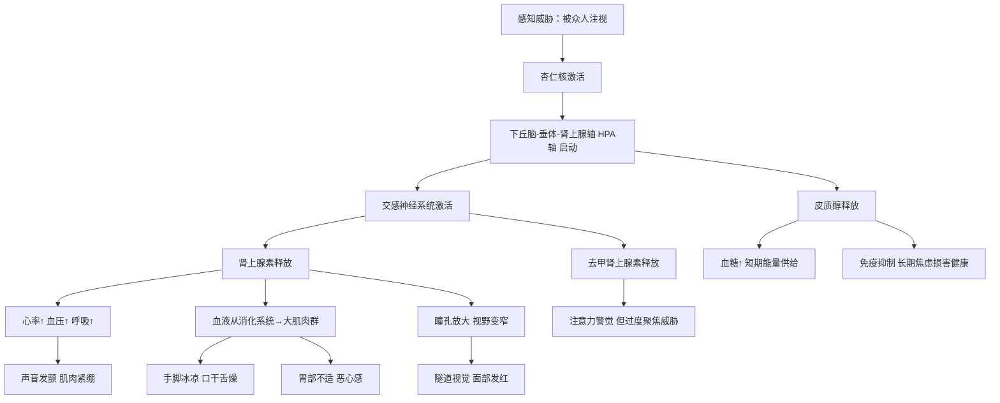

## 三、演讲紧张心理：从理解到掌控的完整指南

> "紧张不是你的敌人，它是你身体在告诉你：这件事对你很重要。"
> —— 改编自Susan Cain《安静》

演讲紧张（Stage Fright），学名"怯场焦虑"（Glossophobia），是人类最普遍的心理现象之一。美国国家心理健康研究所（NIMH）的数据显示，约75%的人在公众演讲时会感到不同程度的紧张，约10%的人达到临床诊断标准的社交焦虑障碍水平。在"美国人最害怕的事物"调查中，公众演讲常年排名第一，甚至排在死亡之前——正如Jerry Seinfeld的经典调侃："在葬礼上，大多数人宁愿躺在棺材里，也不愿致悼词。"

但紧张并非不可战胜。本章将从科学原理出发，经由自我诊断，抵达一套完整的应对体系——让你不仅能"忍受"紧张，更能"驾驭"紧张。

### 3.1 紧张的科学本质：你的大脑在做什么

理解紧张的生理机制是掌控它的第一步。当你真正明白"为什么会紧张"，你就不会再为紧张本身而焦虑——这是一个元认知层面的解脱。

#### 3.1.1 进化心理学视角

从进化心理学的角度看，演讲紧张源于人类数百万年积累的生存本能。在原始社会中，被一群同类同时注视通常意味着两种极端情境：

1. **你是部落首领**——被崇拜、被追随（极少数情况）
2. **你是被审判的对象**——可能被驱逐、被攻击甚至被消灭（多数情况）

大脑的杏仁核（Amygdala）在检测到"被众人注视"这一信号时，无法区分"做报告"和"被审判"，它会自动触发"战斗-逃跑-僵住"（Fight-Flight-Freeze）三联反应。这套系统在原始环境中救过无数人的命，但在会议室里却成了障碍。

#### 3.1.2 神经内分泌反应链

当大脑感知到演讲情境为"潜在威胁"时，会启动一条精确的神经内分泌反应链：

**关键点**：这些反应在原始环境中是救命的——血液涌向大肌肉群是为了让你跑得更快，心跳加速是为了供给更多氧气。但在现代演讲场景中，你既不需要跑，也不需要打架，这些反应反而成了障碍。理解这一点非常重要——**你的紧张不是"心理素质差"，而是进化赋予的正常生理反应**。

#### 3.1.3 杏仁核劫持与前额叶下线

神经科学家Joseph LeDoux的研究揭示了一个关键机制：感官信息在大脑中有两条通路——"低路"（Low Road）和"高路"（High Road）。

| 通路 | 路径 | 速度 | 特点 |
|------|------|------|------|
| 低路 | 感官 → 丘脑 → 杏仁核 | 约12毫秒 | 快但粗糙，无法分辨具体情境 |
| 高路 | 感官 → 丘脑 → 前额叶皮层 → 杏仁核 | 约24毫秒 | 慢但精确，能做理性判断 |

当"低路"先到达杏仁核并触发恐惧反应后，它会抑制前额叶皮层的活动——这就是为什么人在极度紧张时会"大脑一片空白"。前额叶皮层负责工作记忆、逻辑推理和语言组织，它一旦被抑制，你就失去了最需要的认知功能。

**好消息**：通过训练，你可以缩短从"杏仁核激活"到"前额叶接管"的时间。经验丰富的演讲者并不是不紧张，而是他们的大脑能更快地从恐惧反应切换到理性模式。

#### 3.1.4 紧张的"倒U型曲线"

心理学家Yerkes和Dodson提出的"耶克斯-多德森定律"（Yerkes-Dodson Law）揭示了紧张与表现之间的关系——不是线性的，而是倒U型的：

| 紧张水平 | 表现状态 | 典型体验 |
|----------|----------|----------|
| 过低 | 缺乏动力，注意力涣散 | "反正无所谓"，表现平平 |
| 适度 | 最佳唤醒状态，注意力集中 | "我准备好了，来吧" |
| 过高 | 认知过载，表现崩溃 | "完了完了，脑子转不动了" |

这个模型告诉我们：**目标不是消除紧张，而是将紧张控制在最佳区间**。完全不紧张反而不好——适度的紧张能提升你的专注力和能量。

### 3.2 自我诊断：你的紧张属于哪种类型

在选择应对策略之前，先弄清楚你的紧张主要表现在哪些层面。大多数人以某一种或两种表现为主，针对性地解决效果远好于"一把抓"。

#### 3.2.1 三维诊断框架

**认知层面（想什么）：**

- [ ] 大脑一片空白，忘记准备好的内容
- [ ] 思维混乱，无法组织语言
- [ ] 过度关注自己的表现，而非听众的需求
- [ ] 灾难化思维："如果我忘词了怎么办？""如果大家觉得我很蠢呢？"
- [ ] 对自己的声音、外貌、动作产生强烈的自我意识
- [ ] 预设失败："我肯定会搞砸的"

**生理层面（身体反应）：**

- [ ] 心跳加速、呼吸急促
- [ ] 手心出汗、身体发抖
- [ ] 口干舌燥、声音发颤
- [ ] 胃部不适、恶心感
- [ ] 面部发红、脖子发僵
- [ ] 双腿发软、膝盖打颤

**行为层面（做什么）：**

- [ ] 语速过快，试图尽快结束
- [ ] 避免眼神接触，盯着PPT或天花板
- [ ] 身体僵硬，不敢移动
- [ ] 双手不知道放在哪里
- [ ] 使用大量填充词（"嗯"、"那个"、"就是说"）
- [ ] 回避演讲机会，找各种理由推脱

**计分方法**：在你勾选的项目旁标注频率——偶尔（1分）、经常（2分）、每次（3分）。总分越高，说明紧张程度越深，需要越系统的干预。

#### 3.2.2 紧张等级评估

| 等级 | 总分 | 描述 | 推荐策略 |
|------|------|------|----------|
| 轻度 | 1-5分 | 上台前有点紧张，讲开就好了 | 基础准备 + 深呼吸即可 |
| 中度 | 6-12分 | 明显影响表现，但能完成演讲 | 认知重构 + 身体调节 + 脱敏训练 |
| 重度 | 13-20分 | 严重影响表现，可能中途卡壳或逃避 | 全套策略 + 考虑专业心理咨询 |
| 临床级 | 21分以上 | 无法完成演讲，影响日常生活和职业发展 | 建议寻求专业心理治疗 |

### 3.3 六层应对体系：从根源到表层的系统方案

应对演讲紧张不是"一招鲜"，而是一个多层体系。下面从最根本的认知层到最表层的行为层，逐层递进。

#### 3.3.1 第一层：认知重构——改变你"怎么想"

认知重构（Cognitive Reframing）是改变对演讲紧张的认知解读，是所有策略中最根本的一层。

**哈佛商学院Alison Wood Brooks的实验**：她让受试者在演讲、唱歌、数学测试前分别对自己说"我很冷静"或"我很兴奋"。结果发现，说"我很兴奋"的人在所有任务中表现都显著更好。原理在于：紧张和兴奋在生理上几乎完全相同（心跳加速、肾上腺素分泌、注意力集中），区别仅在于大脑对这些信号的"标签"。当你贴上"紧张"标签时，大脑解读为"有危险"；贴上"兴奋"标签时，大脑解读为"有机会"。

**四步认知重写法**：

| 自动思维（负面） | 重写版本（正面） | 重写逻辑 |
|------------------|------------------|----------|
| "我很紧张" | "我很兴奋，我的身体在给我能量" | 紧张与兴奋生理相同，重新标签即可 |
| "我害怕出错" | "我期待这次挑战，出错也是学习" | 将威胁重构为成长机会 |
| "他们都在评判我" | "他们希望我成功，没人希望听一场烂演讲" | 听众的默认立场是善意的 |
| "我必须完美" | "我只需要真诚和有价值的内容" | 降低不切实际的自我标准 |
| "如果忘词了就完了" | "忘词了可以看笔记，可以暂停，可以互动" | 为最坏情况准备具体应对方案 |
| "别人比我强多了" | "我有自己的视角，这正是他们请我来的原因" | 重新定义"价值"——不是比谁强，是提供独特视角 |

**操作方法**：在演讲准备期间，把你的每个负面想法写下来，然后逐一重写。把重写后的版本写在一张小卡片上，演讲前默读一遍。这个过程需要反复练习，不是一次就能改变的——认知神经科学告诉我们，形成新的神经通路需要大约21天的持续练习。

#### 3.3.2 第二层：接纳承诺——与紧张共处

**接纳承诺疗法（ACT, Acceptance and Commitment Therapy）** 是近年来心理治疗领域的重要突破。与传统的"对抗紧张"思路不同，ACT主张"接纳紧张，承诺行动"。

**白熊效应**：心理学家Daniel Wegner的经典实验证明，当你告诉自己"不要想白熊"时，你反而会更频繁地想到白熊。同理，当你告诉自己"不要紧张"时，紧张反而会加剧——因为你在持续监控"我紧张了没有"，这个监控本身就在制造紧张。

**ACT四步法**：

1. **觉察（Notice）**：对自己说"我注意到我正在感到紧张"——用第三人称描述，而不是"我很紧张"。这种"认知解离"（Cognitive Defusion）创造了一个观察距离。
2. **接纳（Accept）**：对自己说"紧张是可以的，它不会伤害我，我不需要消除它"——允许紧张存在，不与之对抗。
3. **锚定（Anchor）**：将注意力转移到感官体验上——脚踩地面的感觉、手里翻页器的触感、麦克风的温度。这叫"接地技术"（Grounding）。
4. **承诺（Commit）**：问自己"即使紧张，我仍然想要传达的核心信息是什么？"——将注意力从自我转移到目的。

**关键洞见**：你不需要等到"不紧张了"才能开始演讲。你可以带着紧张去演讲。很多顶级演讲者——包括TED演讲者、诺贝尔奖得主——上台时仍然会紧张，但紧张不再阻止他们行动。

#### 3.3.3 第三层：身体调节——从身体入手改变心理

身体和心理是一体两面的。通过调节身体状态，可以直接影响神经内分泌系统，从而改变心理状态。

**方法一：4-7-8呼吸法（Andrew Weil博士推荐）**

这是目前最被验证有效的呼吸调节技术之一，通过激活副交感神经系统来对抗交感神经的"战斗或逃跑"反应。

操作步骤：
1. 找一个相对安静的地方，站或坐均可
2. 用鼻子缓慢吸气，心中默数4秒
3. 屏住呼吸，心中默数7秒
4. 用嘴巴缓慢呼气（发出"呼"的声音），心中默数8秒
5. 重复3-5组

原理：延长的呼气阶段会刺激迷走神经，激活副交感神经系统，直接降低心率和皮质醇水平。在上台前5-10分钟做3-5组，效果最佳。

**方法二：生理叹息法（Physiological Sigh）**

斯坦福大学Andrew Huberman教授的研究发现了一种更快速的即时镇定技术——"生理叹息法"，这是人体自发平复情绪时会自然做出的呼吸模式：

操作步骤：
1. 快速连续吸两口气——先正常吸一口，在此基础上再短促地补吸一口（把肺完全充满）
2. 然后通过嘴巴缓慢地、完全地呼出
3. 重复1-3次即可见效

原理：双吸气能最大程度地扩张肺泡表面积，增加氧气交换；而长呼气则最大化CO₂排出并激活副交感神经。Huberman实验室的对照实验显示，这种方法比传统冥想呼吸在降低心率方面快约40%。

**方法三：渐进式肌肉放松（PMR）**

由Edmund Jacobson在1938年提出，至今仍是临床心理学中最常用的放松技术之一。

操作步骤（演讲前10-15分钟，可在洗手间完成）：
1. **脚部**：用力蜷缩脚趾5秒 → 完全放松10秒，感受紧张消散的感觉
2. **小腿**：绷紧小腿肌肉5秒 → 放松10秒
3. **大腿**：夹紧大腿5秒 → 放松10秒
4. **腹部**：收紧腹部5秒 → 放松10秒
5. **肩膀**：耸肩到耳朵5秒 → 放松10秒（这是最重要的部位之一）
6. **双手**：握拳5秒 → 放松10秒
7. **面部**：皱紧整张脸5秒 → 放松10秒

原理：通过"先紧张后放松"的对比，神经系统会感知到"放松状态"，并主动趋向这个状态。特别适合"身体僵硬"型紧张者。

**方法四：能量姿势（Power Posing）**

哈佛商学院Amy Cuddy的研究（2012年TED演讲观看量超过6000万）提出：在上台前摆出"扩展性姿势"2分钟，可以提升主观自信感。

- **超人姿势**：双脚与肩同宽，双手叉腰，挺胸抬头
- **胜利姿势**：双臂高举呈V字，像赢得比赛一样

操作方法：演讲前在洗手间或后台，保持上述姿势2分钟。

注意：后续研究（2017年元分析）对激素水平变化提出了质疑，但多项研究确认了一个不可否认的事实——主观上的自信提升和焦虑降低效果是真实存在的。这可能与"具身认知"（Embodied Cognition）有关：身体的姿势会反向影响大脑的情绪判断。

#### 3.3.4 第四层：充分准备——用确定性对抗不确定性

紧张的本质是"不确定性"——你不确定自己能否讲好，不确定听众会如何反应，不确定会不会出意外。而准备就是用"确定性"来填满"不确定性"的空洞。

**七步准备法**：

| 步骤 | 内容 | 时间节点 | 具体操作 |
|------|------|----------|----------|
| 1. 内容准备 | 撰写完整演讲稿或大纲 | 演讲前1-2周 | 写逐字稿 → 精简为大纲 → 提炼为关键词卡片 |
| 2. 结构化记忆 | 记住框架而非逐字稿 | 演讲前3-5天 | 用"桩子法"记住5-7个核心要点及顺序 |
| 3. 场地踏勘 | 提前熟悉演讲环境 | 演讲前1天或当天早到 | 站在讲台上感受空间，测试视线和音响 |
| 4. 设备测试 | 测试所有技术设备 | 演讲前30分钟 | 投影仪、麦克风、翻页器、网络连接 |
| 5. 预演 | 完整彩排 | 演讲前1-3天 | 至少3次，第1次对镜子，第2次录像，第3次对人 |
| 6. 意象排练 | 脑中"放映"整场演讲 | 演讲当天早上 | 闭眼想象自己自信地从头讲到尾，包括互动和掌声 |
| 7. 安全网搭建 | 为最坏情况准备应对方案 | 演讲前 | 见下文"安全网清单" |

**安全网清单**（为最坏情况准备应对方案）：

- **忘词**：准备3张关键词卡片，放在讲台上；设计3个万能过渡句："让我换个角度来看这个问题"、"这引出了一个很重要的点"、"我想先听听大家的看法"
- **设备故障**：PPT无法播放时，准备好口述版本；麦克风失灵时，知道如何提高音量
- **冷场**：准备3个互动问题，如"在座有多少人遇到过这种情况？"
- **超时/欠时**：准备可灵活增减的内容模块（"弹性内容"）
- **听众挑战**：准备"三步回应法"——确认问题 → 给出回答 → 延伸讨论

**"过度准备"的信号和处理**：如果你发现自己花太多时间准备——写了10页逐字稿、改了20版PPT、连续3天失眠——你可能陷入了"过度准备"。过度准备的根源是"用准备来缓解焦虑"，但超过某个阈值后，准备反而会加剧焦虑（因为你投入越多，越害怕失败）。此时需要做的不是更多准备，而是回到认知重构和接纳层面。

#### 3.3.5 第五层：逐步脱敏——用经验重塑大脑

脱敏（Desensitization）是行为心理学中最经典的技术之一。其核心原理是：当大脑反复接触一个"假威胁"（演讲不会真的让你被驱逐或消灭）并且每次都安全地度过之后，杏仁核会逐渐降低对该刺激的恐惧反应。

**六级脱敏训练路径**：

| 级别 | 场景 | 人数 | 持续时间 | 心理挑战 | 成功标准 |
|------|------|------|----------|----------|----------|
| L1 | 对镜子练习 | 0人（只有自己） | 5分钟 | 最低——只面对自己 | 能完整讲完不中断 |
| L2 | 录制视频自看 | 0人 | 5-10分钟 | 接受自己的声音和形象 | 看完视频不删掉 |
| L3 | 对1-2个信任的朋友 | 1-2人 | 10分钟 | 从零观众到有观众的跳跃 | 朋友给出正面反馈 |
| L4 | 小型团队分享 | 5-10人 | 10-15分钟 | 面对不太熟的人 | 能保持眼神接触 |
| L5 | 正式会议演讲 | 20-50人 | 15-30分钟 | 正式场合的压力 | 能应对提问环节 |
| L6 | 大型场合演讲 | 100人以上 | 30分钟以上 | 聚光灯效应 | 能享受演讲过程 |

**加速脱敏的三个关键原则**：

1. **不要跳级**：每个级别至少成功3次后再进入下一级。跳级会导致失败体验，反而强化恐惧。
2. **记录每次体验**：用一个简单的日志记录每次演讲后的感受——"紧张程度1-10分"、"表现自评1-10分"、"最困难的时刻是什么"。几周后回看，你会清晰地看到进步曲线。
3. **寻求反馈**：每次演讲后主动问2-3个听众："你觉得哪里讲得好？哪里可以改进？"外部视角能校正你的自我评估。

**如何快速找到练习机会**：
- 加入Toastmasters（国际演讲会）——全球最大的演讲练习社区，在中国主要城市都有分会
- 在公司主动申请做周会分享、项目汇报
- 参加线上读书会、技术沙龙，主动报名分享
- 在社交平台开直播，从5分钟开始
- 给家人朋友"讲课"——把你学到的东西讲给别人听

#### 3.3.6 第六层：即时技术——演讲现场的应急方案

以上五层都是"提前准备"，但如果你已经站在台上了，以下技术可以在几分钟内快速降低紧张水平。

**上台前30秒（后台准备）**：

1. **生理叹息**：快速双吸气+长呼气，做1-3次（最快起效的呼吸法）
2. **接地练习**：感受双脚踩在地面上的重量，双手握一下翻页器或笔的触感
3. **自我对话**：在心里对自己说"我准备好了，我有有价值的东西要分享"
4. **微笑**：即使是刻意的微笑也能触发面部反馈效应，降低皮质醇

**上台后前30秒（开场阶段）**：

1. **站定再开口**：走到位置后，先站定2-3秒，环视听众，再开始说话。不要边走边说。
2. **慢速开场**：你的第一句话比你想象的慢50%来说。慢速开场能帮你控制呼吸节奏，并给听众留下"从容"的第一印象。
3. **找到友善面孔**：在听众中找到3-4个看起来友善、在点头的人，把他们当作你的"锚点"，眼神在这几个人之间自然移动。
4. **使用手势**：双手自然展开做手势，而不是插在口袋里或交叉在胸前。手势能释放多余的身体能量。

**演讲中途如果突然紧张**：

1. **暂停的力量**：停顿3-5秒——对你来说感觉很长，对听众来说完全正常。停顿反而显得你有掌控力。
2. **喝口水**：这是最自然的暂停方式，没有任何人会觉得奇怪。
3. **走动一下**：从讲台一端走到另一端，身体的移动能打破僵住的状态。
4. **转向互动**：说"我想先了解一下，你们觉得呢？"——把焦点从自己转移到听众。
5. **看笔记**：没有人在意你看笔记。果断低头看一眼，比在台上卡壳30秒好一百倍。

### 3.4 真实案例：从恐惧到自如的蜕变

#### 案例一：技术总监的周会恐惧症

**背景**：张某，35岁，某互联网公司技术总监。技术能力极强，但每次开周会做汇报都紧张到手抖，声音发颤。他甚至因为这个原因拒绝了两次晋升机会（因为晋升意味着更频繁的高管汇报）。

**诊断**：认知层面为主——"如果我说错一个数据，高管们会觉得我不配这个位置"。这属于典型的"冒充者综合征"（Impostor Syndrome）+ 灾难化思维。

**干预过程**：
1. **认知重构**：将"他们会觉得我不配"改为"他们请我汇报是因为需要我的专业判断"。每次汇报前，花5分钟列出"我在这个项目中做的3个关键贡献"。
2. **充分准备**：用"一页纸法"准备汇报——每个要点只用一页PPT，每页只放3个关键数据。这样即使忘词，看一眼PPT就能想起来。
3. **逐步脱敏**：先在组内做小范围分享（5人），然后在部门周会汇报（15人），最后在高管会议汇报（8人但压力更大）。
4. **安全网**：准备了一份"应急话术卡"——"让我确认一下这个数据"（争取时间看笔记）、"关于这个问题，我想听听你们的看法"（转移焦点）。

**结果**：3个月后，张某在360人年会上做了一次15分钟的技术分享，事后评价为"全场最佳"。他说："我现在上台还是会紧张，但紧张不再控制我了——它变成了我的能量。"

#### 案例二：研究生的论文答辩恐惧

**背景**：李某，26岁，计算机专业硕士研究生。论文答辩前一周开始失眠，答辩当天紧张到呕吐。

**诊断**：生理层面为主——严重的躯体化反应。同时有"我必须完美通过"的认知扭曲。

**干预过程**：
1. **身体调节**：每天练习4-7-8呼吸法和渐进式肌肉放松，让身体习惯在紧张时"自动"启动放松反应。
2. **意象排练**：每天闭眼10分钟，完整想象答辩过程——从走进教室、自我陈述、回答提问到鞠躬致谢。想象越细节越好，包括灯光、声音、温度。
3. **认知重构**：将"必须完美通过"改为"答辩是学术对话，不是审判。老师提问是因为对我的研究感兴趣"。
4. **模拟答辩**：找了3个同学和1个导师做模拟答辩，反复练习回答"你为什么选这个方法"、"你的创新点是什么"等高频问题。

**结果**：答辩当天仍然紧张，但没有呕吐，声音稳定，回答清晰。答辩委员会给了"优秀"评价。

### 3.5 特殊人群与特殊场景

#### 3.5.1 内向者的演讲策略

Susan Cain在《安静》中指出，内向者并不一定害怕演讲，但他们消耗能量的方式不同——社交场景对内向者来说是"耗电"，对内向者来说需要更多的"充电"时间。

内向者的独特优势：
- **深度思考**：内向者倾向于先想后说，这使得他们的内容更有深度
- **倾听能力**：内向者天然善于倾听，这让他们的演讲更贴合听众需求
- **书面表达**：很多内向者写作能力极强，可以利用这一优势——先写好精美的逐字稿，再转化为口头表达

内向者的具体策略：
1. **演讲前独处15分钟**：在安静的环境中做准备，不要在社交中消耗能量
2. **选择深度而非广度**：与其泛泛而谈，不如深入一个点——这是内向者的强项
3. **利用"充电"间歇**：长时间的会议或活动中，安排10-15分钟的独处时间
4. **选择1对1交流**：演讲结束后，与其在人群中周旋，不如与2-3个感兴趣的人深入交流

#### 3.5.2 即兴演讲的紧张应对

即兴演讲（没有准备时间的发言）是最容易引发紧张的场景。以下是一个"30秒即兴演讲框架"：

1. **观点（5秒）**：先说结论——"我认为……"
2. **原因（10秒）**：给出一个核心理由——"因为……"
3. **例子（10秒）**：举一个具体的例子——"比如说……"
4. **总结（5秒）**：重申观点——"所以……"

这个框架（PREP: Point-Reason-Example-Point）可以让你在任何场合都能在30秒内组织出一段有逻辑的发言。

#### 3.5.3 线上演讲的特殊挑战

远程办公时代，线上演讲（视频会议、直播）已成为常态。线上演讲的紧张源与线下不同：

| 挑战 | 原因 | 应对方法 |
|------|------|----------|
| 看不到听众反应 | 无法通过反馈调整节奏 | 提前准备互动问题，主动收集反馈 |
| 镜头焦虑 | 看到自己的画面加剧自我意识 | 关闭"自我视图"或缩小自己的画面窗口 |
| 技术不确定性 | 担心掉线、卡顿、回声 | 提前测试设备，准备备用方案（手机热点、电话拨入） |
| 家庭环境干扰 | 担心家人打扰、背景杂乱 | 提前沟通，使用虚拟背景，准备好耳机 |

#### 3.5.4 需要专业帮助的信号

以下情况建议寻求专业心理咨询或治疗：

- 紧张导致你长期回避重要的职业机会
- 演讲前出现严重的躯体症状（呕吐、腹泻、心跳过速到需要就医）
- 即使经过多次练习和尝试，紧张程度没有任何降低
- 紧张已经泛化到其他社交场景（开会发言、打电话、甚至发消息）
- 出现了"预期焦虑"——演讲前数周就开始失眠、焦虑

专业治疗手段包括：
- **认知行为疗法（CBT）**：最有效的心理治疗方案，6-12次通常可见显著改善
- **暴露疗法**：在安全环境中系统地面对恐惧刺激
- **EMDR**：眼动脱敏再加工，适用于有创伤经历的演讲焦虑
- **药物治疗**：β-受体阻滞剂（如普萘洛尔）可阻断肾上腺素的物理效应，适合偶尔需要应对重要场合的情况。但药物应在医生指导下使用，不建议长期依赖

### 3.6 误区与纠正

| 常见误区 | 为什么是错的 | 正确做法 |
|----------|-------------|----------|
| "我必须完全消除紧张" | 完全消除紧张既不可能也不理想——适度紧张能提升表现 | 目标是将紧张控制在最佳区间，而非消除 |
| "紧张说明我不适合做演讲" | 75%的人都紧张，包括职业演讲者 | 紧张是正常的，关键是如何应对 |
| "背熟稿子就不紧张了" | 逐字背诵反而增加紧张——忘一个字就会卡壳 | 记框架和关键词，用自己的话展开 |
| "多喝点酒壮壮胆" | 酒精会损害判断力、语言能力和协调性 | 用深呼吸和身体调节替代 |
| "看天花板/墙壁能减少紧张" | 避开眼神接触会让听众感觉你不在状态 | 找3-4个友善面孔作为"锚点" |
| "等我不紧张了再上台" | 永远不会有"不紧张"的时候，等待只会强化恐惧 | 带着紧张上台，行动本身就是最好的治疗 |
| "演讲就是表演，我需要变成另一个人" | 做作的表演反而让听众不舒服 | 做自己，真诚比技巧更重要 |

### 3.7 从"应对紧张"到"享受演讲"：进阶思维

当你熟练掌握了以上策略，你会发现一个有趣的现象：紧张不再是你的障碍，而变成了你的动力来源。

**重新定义紧张**：顶尖运动员在大赛前也会紧张，但他们不称之为"紧张"，而称之为"准备好上场了"。这种语言上的转换不是自欺欺人，而是真实的认知转变——当你积累足够多的成功经验后，你的大脑会自动将"心跳加速"重新编码为"我准备好了"。

**演讲心流（Flow）**：心理学家Mihaly Csikszentmihalyi提出的"心流"状态——当你完全沉浸在演讲中，忘记了时间、忘记了自我、只剩下你和听众之间的信息流动。这不是神话，而是大量练习后的自然结果。很多演讲者描述这种体验为"演讲的高潮"——一种极度愉悦和充实的感觉。

到达这个阶段的标志：
- 你开始主动寻找演讲机会，而不是被动接受
- 你能在演讲中即兴发挥，而不是机械执行准备好的内容
- 你能在听众的反应中"感受"到共鸣，并据此调整你的表达
- 演讲结束后你感到"充电"而不是"耗尽"

这就是从"应对紧张"到"享受演讲"的最终跨越。路很长，但每一步都值得。
