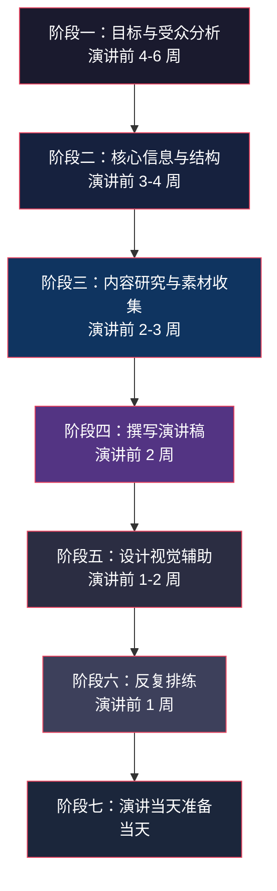
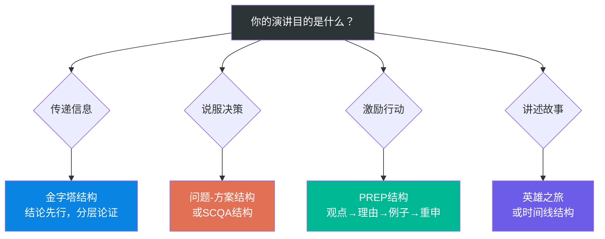
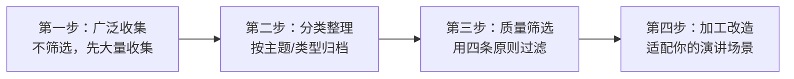
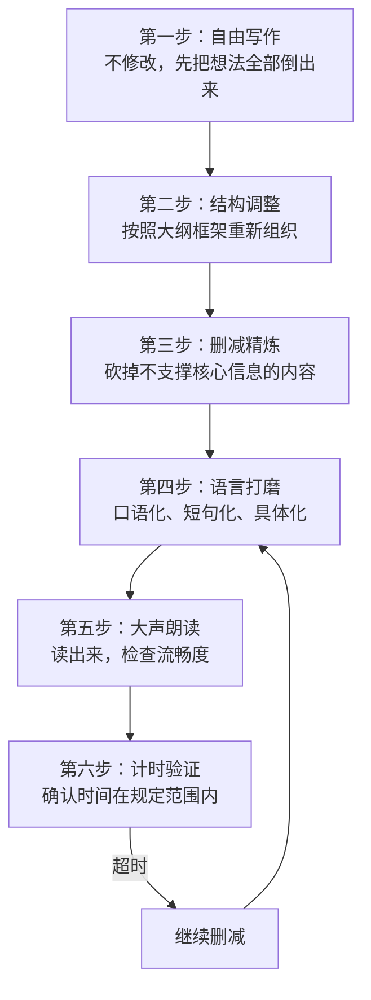
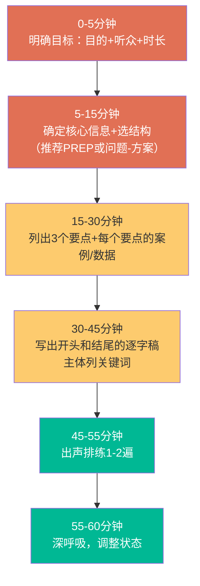

## 四、演讲的准备流程

> "如果我有八小时来砍一棵树，我会花六小时来磨斧头。"——亚伯拉罕·林肯

一场成功的演讲，80%取决于准备阶段。这不是一句鸡汤，而是经过大量实证研究支撑的结论。卡内基培训中心对超过50万名演讲者的跟踪数据显示：准备时间与演讲效果的相关系数高达0.72，远高于天赋（0.31）和经验（0.45）。换句话说，一个精心准备的普通人，往往比一个临场发挥的天才表现得更好。

本节将演讲准备拆解为七个阶段，构成一个完整的系统化流程。每个阶段都包含理论依据、具体方法、实操工具和常见误区，确保你不仅知道"做什么"，更理解"为什么这样做"以及"怎么做才对"。

### 4.1 阶段一：明确目标与受众分析（演讲前4-6周）

这是整个准备流程的地基。跳过这一步直接写内容，就像不看地图就出发——你可能走得很快，但方向完全错误。

#### 4.1.1 明确演讲目标：用SMART框架锚定方向

在开始准备内容之前，你需要用结构化的方式回答三个核心问题。注意，不是模糊地"想一想"，而是用SMART原则（Specific具体、Measurable可衡量、Achievable可实现、Relevant相关、Time-bound有时限）来严格定义。

**问题一：这次演讲的核心目的是什么？**

演讲目的通常分为四大类型，每种类型的准备策略截然不同：

| 目的类型 | 核心诉求 | 准备重心 | 典型场景 |
|----------|----------|----------|----------|
| **告知型** | 传递知识和信息 | 逻辑清晰、信息结构化、可视化 | 培训讲座、技术分享、学术报告 |
| **说服型** | 改变观点或决策 | 证据链、反驳预设、情感共鸣 | 商业路演、项目提案、政策倡导 |
| **激励型** | 激发行动和热情 | 故事驱动、情感节奏、号召行动 | 年会演讲、动员大会、毕业致辞 |
| **娱乐型** | 提供愉悦体验 | 幽默技巧、节奏感、意外惊喜 | 婚礼致辞、脱口秀、晚会主持 |

**问题二：你希望听众在听完后做什么？**

这个问题决定了你的"行动号召"（Call to Action）。一个没有明确行动号召的演讲，就像一封没有地址的信——写得再好也到不了目的地。

具体化的行动号召示例：
- 模糊版："希望大家重视团队协作" → 有效版："下周一开始，每个项目组每周五下午增加30分钟复盘会"
- 模糊版："我们的产品很有前景" → 有效版："我邀请各位在本月25日前签署这份投资意向书"
- 模糊版："大家要努力学习" → 有效版："从今天开始，每人每天花20分钟读一篇技术文章，下周分享你的收获"

**问题三：衡量演讲成功的标准是什么？**

必须在演讲前就定义"成功"长什么样，否则你无法评估自己的表现，也无法改进。

可量化的成功标准示例：
- 告知型：听众能复述3个以上核心知识点（通过问卷或互动测试验证）
- 说服型：决策者的支持率从30%提升到60%以上
- 激励型：演讲后一周内，团队主动加班率/申请参与新项目人数显著增加
- 娱乐型：听众平均笑声次数达到每5分钟一次，满意度评分≥4.5/5

#### 4.1.2 受众分析：建立听众画像

了解听众是准备演讲的基石。心理学中的"知识的诅咒"（Curse of Knowledge）告诉我们：一旦你知道了某件事，就很难想象不知道它是什么感觉。很多演讲失败的原因就是演讲者站在自己的知识水平上自说自话，完全忽略了听众的认知起点。

**第一层：基本信息（Who are they?）**

| 分析维度 | 具体问题 | 对演讲的影响 |
|----------|----------|--------------|
| 人数 | 10人/100人/1000人？ | 决定互动方式和演讲风格 |
| 年龄段 | 平均年龄和跨度 | 决定案例选择和语言风格 |
| 教育背景 | 学历水平、专业领域 | 决定专业术语的使用程度 |
| 职业角色 | 决策者/执行者/学生 | 决定论证角度和诉求重点 |
| 与你的关系 | 同事/客户/陌生人/上级 | 决定开场方式和信任建立策略 |
| 文化背景 | 国籍、宗教、价值观 | 决定禁忌避让和表达方式 |

**第二层：心理信息（What do they think?）**

这是最容易被忽略但影响最大的维度：

- **认知起点**：他们对这个话题了解多少？是完全小白、有一定基础还是专家？这决定了你从哪里开始讲。对专家讲基础内容是浪费时间，对小白讲高级内容是对牛弹琴。
- **态度倾向**：对你的观点是支持、中立还是反对？面对支持者，你需要强化信念；面对中立者，你需要建立逻辑；面对反对者，你需要先承认对方的合理之处，再提出你的论据。
- **核心关切**：他们最关心什么？最大的顾虑是什么？找到这个"痛点"，你的演讲就能直击内心。
- **来听动机**：是自愿来的还是被强制的？自愿来的听众已经给了你信任分，强制来的你需要先"赢回"他们的注意力。

**第三层：情境信息（What's the context?）**

情境因素看似次要，实际影响巨大：

- **时间段**：上午9-11点是认知高峰期，适合复杂内容；下午2-3点是"午后低谷"，需要更多互动和刺激；晚上听众疲劳度最高，必须用强节奏和故事来维持注意力。
- **活动位置**：开场演讲有"新鲜感红利"，但也需要为全场定调；中间演讲面临注意力衰减；压轴演讲有"终点效应"加持，但听众可能已经心不在焉。
- **前序内容**：听众在你之前听了什么？如果前面都是枯燥的数据汇报，你的生动演讲会形成强烈对比（正面）；如果前面刚有一个精彩演讲，你需要差异化而不是硬碰硬。
- **场地条件**：大礼堂适合宏大叙事和情感号召；小会议室适合对话式和数据密集型内容；户外场地需要考虑噪音干扰和视觉效果衰减。

**实操工具：听众画像模板**

听众画像卡
━━━━━━━━━━━━━━━━━━━━━━━━━━━━━━━━
基本信息：
  人数：______  场地：______  时间：______
  年龄段：______  主要职业：______
  与我的关系：______

心理画像：
  认知起点：□小白  □有一定基础  □专家
  态度倾向：□支持  □中立  □反对
  核心关切：______
  来听动机：□自愿  □组织安排  □其他______

情境因素：
  我是第______个演讲者
  前面的演讲主题：______
  听众已听______小时
  场地类型：□大礼堂  □中型会议室  □小型房间  □户外

基于画像的策略调整：
  开场方式：______
  语言风格：______
  互动频率：□高  □中  □低
  内容深度：______
━━━━━━━━━━━━━━━━━━━━━━━━━━━━━━━━

#### 4.1.3 常见误区

| 误区 | 问题 | 正确做法 |
|------|------|----------|
| "我的内容好就行，不用管听众" | 忽略受众导致信息传递失败 | 内容要针对听众的认知起点和核心关切来设计 |
| "目标太虚也没关系" | 没有明确目标就无法衡量效果 | 用SMART原则定义，确保可量化 |
| "只要准备PPT就够了" | 把准备等同于做幻灯片 | PPT只是准备流程中的第五步，前面还有四步 |
| "演讲目的是说服" | 所有演讲都想说服听众 | 不同目的需要完全不同的策略，先定位再准备 |

### 4.2 阶段二：确定核心信息与结构（演讲前3-4周）

目标明确了，听众画像建好了，接下来要做的不是直接写内容，而是先确定"说什么"和"怎么说"的骨架。

#### 4.2.1 提炼核心信息：一句话测试

你的整个演讲应该围绕一个核心信息（Core Message）展开。如果听众走出会场后只能记住一句话，那这句话是什么？

**核心信息的四个标准**：
1. **简洁**：不超过25个字，能在3秒内说完
2. **具体**：有明确的信息量，不是废话
3. **有记忆点**：有画面感或情感冲击
4. **有立场**：体现你的独特视角，不是人云皆云

**反面案例 vs 正面案例**：

| 反面（太模糊） | 正面（具体有力） |
|----------------|------------------|
| "团队合作很重要" | "一个高效团队的产出是同等人数个人的3.7倍" |
| "AI正在改变世界" | "未来三年，不会用AI的人将被会用AI的人淘汰" |
| "我们要创新" | "不创新就等死，但乱创新就是找死" |

**实操方法：电梯演讲测试**

假设你走进电梯，只有30秒（大约一栋10层楼的时间）向身边的人介绍你的演讲，你会说什么？如果你在30秒内说不清楚核心信息，说明你还没想清楚。

#### 4.2.2 选择结构框架

结构是演讲的骨架。没有骨架的内容是一团肉，站不起来。根据演讲目的和场景，选择最合适的结构：

| 结构类型 | 适用场景 | 框架说明 |
|----------|----------|----------|
| **时间线结构** | 叙事、历史回顾 | 按时间顺序展开：过去→现在→未来 |
| **问题-方案结构** | 提案、说服 | 痛点→原因分析→解决方案→行动号召 |
| **PREP结构** | 快速发言、观点阐述 | Point观点→Reason理由→Example例子→Point重申 |
| **金字塔结构** | 汇报、学术 | 结论先行→分类论证→逐层展开 |
| **SCQA结构** | 商业演示、咨询 | Situation情境→Complication冲突→Question问题→Answer答案 |
| **英雄之旅** | 励志、品牌故事 | 平凡世界→冒险召唤→考验→蜕变→回归 |

**选择结构的决策逻辑**：

#### 4.2.3 绘制内容大纲

确定结构后，用思维导图或大纲工具将主要论点和支撑材料可视化地组织起来。

**大纲的三层结构**：

核心信息：一句话
├── 引言（10-15%）
│   ├── 开场钩子（故事/问题/数据/悬念）
│   ├── 建立信任（为什么听众应该听你说）
│   └── 路线图（今天讲什么，怎么讲）
├── 主体（70-80%）
│   ├── 论点一（25%）
│   │   ├── 核心论述
│   │   ├── 证据/案例
│   │   └── 小结 + 过渡
│   ├── 论点二（25%）
│   │   ├── 核心论述
│   │   ├── 证据/案例
│   │   └── 小结 + 过渡
│   └── 论点三（20-30%）
│       ├── 核心论述
│       ├── 证据/案例
│       └── 小结
└── 结尾（10-15%）
    ├── 总结核心信息
    ├── 行动号召
    └── 收尾金句

**工具推荐**：
- **XMind / MindNode**：思维导图，适合发散思维阶段
- **Workflowy / Dynalist**：大纲工具，适合层级结构
- **Notion / 飞书文档**：支持大纲+数据库+协作
- **纸笔**：最原始但最有效，手写有助于思考

#### 4.2.4 常见误区

| 误区 | 问题 | 正确做法 |
|------|------|----------|
| "想到什么写什么" | 缺乏结构导致逻辑混乱 | 先选结构框架，再填充内容 |
| "内容越多越好" | 信息过载导致听众什么都记不住 | 控制在3-5个核心论点，少即是多 |
| "核心信息不重要" | 没有核心信息的演讲像散沙 | 必须用一句话提炼，贯穿始终 |
| "开头结尾随便写" | 忽略了首因效应和近因效应 | 开头和结尾是投入产出比最高的部分 |

### 4.3 阶段三：内容研究与素材收集（演讲前2-3周）

骨架搭好了，现在要往上面"长肉"。素材是演讲的血肉，没有素材的演讲是干巴巴的说教。

#### 4.3.1 五类素材及其作用

不同类型的素材在演讲中扮演不同的角色，一个优秀的演讲通常需要五类素材的组合：

**1. 数据和事实——建立可信度**

数据是演讲的"硬通货"。它让听众觉得"这个人不是在瞎说"。

使用原则：
- 精确比笼统有力："节省了37.2%的成本"比"大幅节省成本"更有说服力
- 数据要有来源："根据麦肯锡2024年报告……"
- 大数字要转化：不要说"损失了1.2万亿元"，要说"相当于全国每人损失了857元"
- 数据要可视化：能用图表就不用文字描述

案例：TED演讲中，汉斯·罗斯林（Hans Rosling）用动态气泡图展示全球健康数据的变化趋势，将枯燥的统计数字变成了引人入胜的故事，该演讲获得超过1400万次观看。

**2. 案例和故事——制造感染力**

人类大脑天生对故事敏感。神经科学研究表明，听故事时大脑会释放催产素（增强共情）和多巴胺（增强记忆），而听纯数据时大脑活动区域主要集中在语言处理区，记忆效果远不如故事。

好案例的标准：
- **具体**：有时间、地点、人物、经过
- **相关**：与听众的生活或工作场景有关
- **有冲突**：有困难、有转折、有结果
- **有教训**：能直接支撑你的论点

来源渠道：
- 个人亲身经历（最真实、最有说服力）
- 行业案例（权威机构、知名企业的真实事件）
- 历史事件（经得起验证，有纵深感）
- 新闻热点（时效性强，容易引发共鸣）

**3. 名言和引用——借力权威**

引用权威人物的话可以"借力"——借用他人的权威性来增强你的论点。

使用技巧：
- 选择听众认可的权威（对工程师引用乔布斯比引用莎士比亚有效）
- 不要过度使用（一场演讲2-3处足够）
- 引用后要解读，不要让听众自己猜
- 不确定出处时不要编造（网络上大量"伪名言"）

**4. 类比和隐喻——降低理解门槛**

当你的内容涉及复杂概念时，类比是最强大的武器。它把陌生的东西变成熟悉的，把抽象的变成具体的。

经典类比案例：
- "互联网就像信息高速公路"——让90年代的人理解了互联网
- "DNA是生命的蓝图"——让普通人理解了基因的作用
- "云服务器就像自来水，用多少付多少"——让非技术人员理解了云计算

**5. 视觉元素——增强记忆**

人脑处理图像的速度是文字的6万倍。一项由微软研究院开展的实验表明，3天后人们能记住10%的文字信息，但能记住65%的视觉信息。

视觉元素包括：
- 数据图表（柱状图、饼图、折线图）
- 信息图（复杂流程的可视化）
- 照片和视频（真实场景的还原）
- 实物道具（现场演示，冲击力最强）

#### 4.3.2 素材收集的系统方法

不要等到需要素材时才临时搜索。建立一个"素材库"，持续积累，按主题分类管理。

**素材收集四步法**：

**素材筛选的四条原则**：

| 筛选维度 | 问自己的问题 | 淘汰标准 |
|----------|-------------|----------|
| 相关性 | 是否直接支持核心信息？ | 绕弯子才能扯上关系的，淘汰 |
| 可理解性 | 听众能否理解和认同？ | 需要大量背景知识才能理解的，改造或淘汰 |
| 新鲜感 | 听众是否已经听过太多次？ | "烂大街"的例子换掉，除非你有全新解读 |
| 可靠性 | 来源是否权威可查？ | 无法查证来源的，淘汰 |

**素材来源渠道**：

| 来源 | 优势 | 劣势 | 适合素材类型 |
|------|------|------|-------------|
| 学术论文/研究报告 | 权威、精确 | 难读、更新慢 | 数据、理论 |
| 行业白皮书/调查报告 | 实用、有行业视角 | 可能有利益倾向 | 数据、案例 |
| 书籍/传记 | 深度、系统 | 需要时间消化 | 故事、理论 |
| 新闻/社交媒体 | 时效性强 | 真假难辨 | 热点案例 |
| 个人经历 | 独特、真实 | 视角有限 | 故事、教训 |
| 纪录片/访谈 | 生动、有画面感 | 需要版权意识 | 视频素材 |

#### 4.3.3 常见误区

| 误区 | 问题 | 正确做法 |
|------|------|----------|
| "素材越多越好" | 堆砌素材导致重点模糊 | 每个论点选1-2个最有力的素材即可 |
| "数据一定比故事好" | 不同场景需要不同素材 | 数据建立信任，故事制造共鸣，组合使用 |
| "网上搜到的就是对的" | 网络信息真假混杂 | 所有数据和案例都要交叉验证来源 |
| "临时找素材就行" | 临时搜索质量不高 | 建立长期素材库，持续积累 |

### 4.4 阶段四：撰写演讲稿（演讲前2周）

素材齐了，现在要"组装"成一篇有血有肉的演讲稿。这一步的核心决策是：写逐字稿还是写大纲？

#### 4.4.1 逐字稿 vs 大纲：选择适合你的方式

| 方式 | 适用场景 | 优势 | 劣势 |
|------|----------|------|------|
| **逐字稿** | 正式典礼、新闻发布会、政策宣读 | 精确控制每一句话，避免口误 | 容易产生"背诵感"，失去自然交流 |
| **关键词大纲** | 培训、分享、日常汇报 | 自然流畅，像在对话 | 可能跑题，时间不好控制 |
| **混合模式**（推荐） | 大多数场景 | 兼顾精确和自然 | 需要额外区分哪些写全、哪些列提纲 |

**混合模式的具体做法**：

1. **开头（前2分钟）**：写逐字稿并背熟。开场决定了听众的第一印象，不能有任何犹豫和卡壳。
2. **结尾（最后1-2分钟）**：写逐字稿并背熟。结尾是听众记忆最深的部分（近因效应），必须干净有力。
3. **过渡句**：写逐字稿。段落之间的衔接处最容易卡壳，提前准备好过渡句可以保证流畅。
4. **主体部分**：写关键词大纲。列出每个论点的关键词和关键句，其余用自然语言展开。
5. **故事/案例**：写出关键情节节点。故事需要有结构（起承转合），但不必逐字背诵。

#### 4.4.2 语言风格：写给人"听"的文字

演讲稿和文章的根本区别在于：文章是写给人"看"的，演讲稿是写给人"听"的。人的眼睛可以回看，但耳朵只有一次机会。

**六条语言法则**：

**法则一：口语化**
- 书面语："鉴于当前经济形势之严峻，我们必须采取行之有效的措施。"
- 口语化："经济不好，这是事实。但我们不能坐以待毙，得想招。"
- 测试方法：写完一段后大声读出来，如果读着别扭，就需要改。

**法则二：短句为主**
- 长句（50字以上）：在书面语中读者可以反复阅读理解，但在口语中听众只听到一串声音，来不及理解就过去了。
- 短句（15-20字）：一句话一个意思，听众容易跟上。
- 节奏技巧：长短交替。短句制造力度。长句制造铺垫和期待，然后用一个短句来一个有力的收尾，形成节奏感。

**法则三：具体而非抽象**
- 抽象："这个项目取得了显著成效。"
- 具体："这个项目上线三个月，日活用户从200增长到15000，增长了75倍。"
- 规则：能用数字就不用形容词，能举例子就不讲道理。

**法则四：主动语态**
- 被动："这个问题被认为是由于系统设计缺陷导致的。"
- 主动："系统设计有缺陷，导致了这个问题。"
- 主动语态更直接、更有力、更容易理解。

**法则五：少用术语，必须用时要解释**
- 除非听众全是同行专家，否则避免使用未解释的术语。
- 如果必须用，第一次出现时给一个通俗解释："API——简单说就是不同软件之间对话的语言。"

**法则六：使用"你"和"我们"**
- "你"让听众觉得你在跟他一个人说话。
- "我们"制造共同体感，拉近距离。
- 避免全程用"我"开头，那会显得自说自话。

#### 4.4.3 写作的实操流程

**时间控制的黄金法则**：
- 中文演讲的正常语速：每分钟200-250字
- 激动时语速会加快到每分钟300字以上
- 互动、停顿、翻页等会消耗时间
- 预留总时长10-15%的缓冲时间
- 因此：20分钟演讲的稿件目标字数 = 20 × 200 × 0.85 = 约3400字

#### 4.4.4 常见误区

| 误区 | 问题 | 正确做法 |
|------|------|----------|
| "把文章读出来就是演讲" | 书面语不适合口头表达 | 按照口语化原则重新改写 |
| "逐字背稿最安全" | 背诵感强，一旦忘词全盘崩溃 | 用混合模式：关键部分写全，主体列大纲 |
| "写完就定稿了" | 没有经过朗读检验的稿子是半成品 | 必须大声朗读，至少修改3遍 |
| "开头可以即兴" | 开场是最关键的2分钟 | 开头必须逐字稿并背熟 |

### 4.5 阶段五：设计视觉辅助（演讲前1-2周）

视觉辅助（最常见的形式是PPT/幻灯片）是演讲的"视觉骨架"。用好了锦上添花，用错了画蛇添足。

#### 4.5.1 视觉辅助的本质定位

先理解一个核心原则：**PPT是演讲的辅助工具，不是演讲本身。**

检验标准：如果你的PPT不需要你就能传达所有信息，那它应该是一份文档，而不是演示文稿。PPT上的文字应该只是"提示"，而不是"全文"。

反面典型：密密麻麻的文字堆满每一张幻灯片，演讲者转身对着屏幕念，听众心想"我直接看PPT就好了，为什么要听你讲？"

#### 4.5.2 PPT设计的十条原则

| 序号 | 原则 | 说明 |
|------|------|------|
| 1 | 一页一要点 | 每张PPT只传达一个信息，超过一个就分页 |
| 2 | 一图胜千言 | 能用图片就不用文字，能用图表就不用描述 |
| 3 | 字体够大 | 标题≥32号，正文≥24号，确保最后一排也能看清 |
| 4 | 对比度足够 | 深色背景配浅色文字，或反之，绝不浅配浅 |
| 5 | 限制颜色 | 主色不超过3种，使用品牌色或对比色组合 |
| 6 | 留白充足 | 不要填满每一寸空间，留白让重点更突出 |
| 7 | 动画克制 | 淡入淡出足够，飞入、旋转等花哨动画分散注意力 |
| 8 | 统一风格 | 所有页面使用一致的字体、颜色、布局模板 |
| 9 | 数据可视化 | 数字超过3个就用图表，柱状图/饼图/折线图 |
| 10 | 去掉无用元素 | 删除logo（除非必要）、页码（没人看）、装饰线 |

#### 4.5.3 不同类型演讲的PPT策略

| 演讲类型 | PPT风格 | 说明 |
|----------|---------|------|
| 学术报告 | 数据密集型 | 允许较多文字和图表，重点在数据准确 |
| 商业路演 | 视觉冲击型 | 大图+关键数字，留白多，设计感强 |
| 技术分享 | 代码+图解型 | 代码块要高亮，架构图要清晰 |
| 培训教学 | 渐进展示型 | 用动画逐步展示要点，避免一次全放 |
| TED式演讲 | 极简型 | 几乎无文字，大图或纯色背景+一句话 |

#### 4.5.4 除了PPT还有什么？

PPT不是唯一的视觉辅助工具，根据场景可以选择：

| 工具 | 适用场景 | 优势 |
|------|----------|------|
| **白板/翻页纸** | 小型会议、头脑风暴 | 即兴互动感强 |
| **实物道具** | 产品发布、科学演示 | 冲击力最强，记忆度最高 |
| **现场演示** | 技术分享、产品展示 | 最有说服力，但风险也最大 |
| **视频片段** | 案例展示、情感渲染 | 视听结合，感染力强 |
| **在线投票/互动工具** | 大型活动、培训 | 提升参与感（如Slido、Mentimeter） |

#### 4.5.5 常见误区

| 误区 | 问题 | 正确做法 |
|------|------|----------|
| "PPT做得越炫越好" | 设计喧宾夺主，注意力在幻灯片而非演讲者 | 设计服务于内容，风格要克制 |
| "把演讲稿贴到PPT上" | 听众在读PPT和听你讲之间分心 | PPT是提示，不是全文，关键内容你说出来 |
| "用模板就行" | 千篇一律的模板缺乏辨识度 | 在模板基础上调整，加入品牌元素或个人风格 |
| "最后才做PPT" | PPT设计和内容撰写应该是同步的 | 内容大纲确定后就开始设计，两者迭代优化 |

### 4.6 阶段六：反复排练（演讲前1周）

排练是准备流程中投入产出比最高的环节。很多演讲失败不是因为内容不好，而是因为没有排练过。排练不是"再看一遍稿子"，而是一套有层次、有方法的系统训练。

#### 4.6.1 排练的五个层次

排练必须循序渐进，从低强度到高强度，每个层次解决不同的问题：

**第一层：默读排练（Mind Walk）**
- 目的：熟悉内容的逻辑流程，检查结构是否通顺
- 方法：默读大纲或稿子，在脑中"放映"整个演讲
- 重点：发现逻辑断裂处、过渡不自然的地方
- 时长：15-20分钟
- 次数：1-2次

**第二层：出声排练（Vocal Rehearsal）**
- 目的：感受语言的节奏和韵律，发现读着别扭的句子
- 方法：在房间里大声朗读，不需要站立或加手势
- 重点：标记需要停顿的地方、需要放慢的地方、需要加重的地方
- 时长：20-30分钟
- 次数：2-3次

**第三层：站立排练（Stand-Up）**
- 目的：模拟真实的演讲姿态，练习手势和走位
- 方法：站起来，面对一面墙或空椅子，加入手势和走动
- 重点：避免不自觉的小动作（摸头发、晃身体、双手插兜）
- 时长：等于演讲时长
- 次数：2-3次

**第四层：完整排练（Full Run-Through）**
- 目的：模拟真实演讲的完整体验，包括PPT操作和时间控制
- 方法：使用PPT、翻页器、计时器，在类似演讲场地的环境中进行
- 重点：检查PPT的切换时机、时间分配是否合理、技术设备是否正常
- 时长：等于演讲时长
- 次数：至少3次，理想5次

**第五层：观众排练（Audience Rehearsal）**
- 目的：获取真实反馈，发现自己看不到的问题
- 方法：找2-5个人作为模拟听众，演讲结束后请他们给出具体反馈
- 重点：收集"哪里不清楚""哪里无聊""哪里最好"的具体反馈
- 时长：演讲时长 + 反馈时间
- 次数：1-2次

**找什么样的人当模拟听众？**
- 最好包含一个"目标受众的代表"（和真实听众背景相似）
- 至少一个"不熟悉你话题的人"（帮你检查是否讲得清楚）
- 一个"敢于直言的人"（帮你发现你不愿承认的问题）

#### 4.6.2 排练中的技术要点

**时间管理**

排练时必须计时，这是铁律。超时是最常见的排练问题，也是最容易在正式演讲中被"抓"的问题。

| 情况 | 应对策略 |
|------|----------|
| 超时5%以内 | 正常，留有缓冲，不需要调整 |
| 超时5-15% | 标记可以压缩的部分，准备"可删减段落" |
| 超时15%以上 | 必须删减内容，不是加快语速。删不掉就说明核心信息没提炼好 |
| 不足（少了15%以上） | 说明内容太薄，需要增加案例或深入展开 |

**录音/录像回放**

这是很多人不愿意做但效果最好的方法。用手机录一段自己的排练，然后回放检查：

- **语言层面**：有没有口头禅（"嗯""然后""就是说"）？语速是否均匀？有没有读错字？
- **声音层面**：音量够不够？音调有没有变化（避免全程一个调子）？语速是太快还是太慢？
- **身体语言**：表情自然吗？手势有效吗？站姿稳定吗？有没有不自觉的小动作？
- **眼神**：是否在与"观众"有眼神交流？有没有一直盯着PPT或地板？

**模拟意外**

正式演讲中意外是常态，不是例外。排练时必须主动模拟各种意外场景：

| 意外场景 | 排练方法 |
|----------|----------|
| 忘词了 | 练习用自己的话复述要点（而不是停下来回忆原话） |
| PPT出故障 | 练习不用PPT讲完整个演讲 |
| 设备没声音 | 练习不依赖麦克风的大声说话技巧 |
| 听众提问太难 | 练习"这个问题很好，我需要查证后回复您"的话术 |
| 时间被压缩 | 练习从30分钟压缩到15分钟的"删减版" |

#### 4.6.3 排练的常见误区

| 误区 | 问题 | 正确做法 |
|------|------|----------|
| "心里过一遍就行" | 默想和实际演讲差距巨大 | 至少要出声排练，最好站着排练 |
| "排练次数太多会"油"" | 所谓的"油"是因为排练方法不对 | 排练的是结构和流程，不是逐字背诵 |
| "准备太充分会失去新鲜感" | 新鲜感不等于临场发挥 | 充分准备让你有精力关注现场反馈，反而更灵活 |
| "一次完整排练就够了" | 一次无法发现所有问题 | 完整排练至少3次，每次间隔一天 |

### 4.7 阶段七：演讲当天的准备

所有前期准备在这一天汇聚。当天的目标不是"临时抱佛脚"，而是"调整到最佳状态"。

#### 4.7.1 身体状态管理

演讲是一项体力活。一场30分钟的演讲，演讲者的能量消耗相当于快走40分钟。身体状态直接影响思维清晰度和表达活力。

**演讲前2小时**

| 事项 | 原因 | 具体建议 |
|------|------|----------|
| 适量进食 | 空腹低血糖会导致思维迟钝，太饱会犯困 | 七分饱，以碳水+蛋白质为主（如全麦面包+鸡蛋） |
| 控制咖啡因 | 适量提神，过量加剧紧张和手抖 | 最多一杯咖啡，如果平时不喝咖啡就不要在演讲当天喝 |
| 轻度运动 | 帮助血液循环，降低皮质醇（压力激素） | 10-15分钟散步或拉伸，不要剧烈运动 |
| 快速浏览大纲 | 强化记忆，建立信心 | 不是重新学习，而是"激活"已有的记忆 |
| 穿着准备 | 穿舒适且符合场合的衣服 | 提前试穿，确保不会因为衣服不适分心 |

**演讲前30分钟**

| 事项 | 原因 | 具体建议 |
|------|------|----------|
| 到达场地检查设备 | 设备故障是演讲最常见的意外 | 测试投影、麦克风、翻页器、网络连接 |
| 与早到的听众交流 | 建立人与人的连接感，降低"上台面对陌生人"的压力 | 简单寒暄，了解他们来听的原因 |
| 找安静处做深呼吸 | 激活副交感神经，降低心率和紧张感 | 4-7-8呼吸法：吸气4秒，屏息7秒，呼气8秒，重复3次 |

**演讲前5分钟**

- 站在讲台位置，感受空间大小和听众距离
- 做几次深呼吸，调整到平稳的呼吸节奏
- 微笑——即使是刻意微笑，也能通过面部反馈机制（Facial Feedback Hypothesis）触发大脑的积极情绪
- 默念你的核心信息，告诉自己："我已经准备好了，我有有价值的东西要分享"

#### 4.7.2 心理状态管理

紧张是正常的，甚至是有益的。研究表明，适度的紧张（肾上腺素水平适度升高）能提升专注力和表现。问题不是"消除紧张"，而是"管理紧张"。

**认知重构：从"紧张"到"兴奋"**

哈佛商学院艾莉森·伍德·布鲁克斯（Alison Wood Brooks）的研究发现：在演讲前对自己说"我很兴奋"的人，比对自己说"我很冷静"的人表现更好。因为紧张和兴奋在生理反应上几乎相同（心跳加速、手心出汗、呼吸加快），区别只在于你如何解读这种生理状态。

具体做法：当感到紧张时，不要说"我要冷静下来"，而是说"我的身体已经准备好了，我感到兴奋"。

**提前到达的心理价值**

提前到达场地不仅是为了检查设备，更是为了心理适应。心理学中的"单纯曝光效应"（Mere Exposure Effect）告诉我们：人对熟悉的环境会感到更安全。提前在场地里待15-20分钟，让你的大脑把这个空间从"陌生环境"重新归类为"熟悉环境"，紧张感会显著降低。

#### 4.7.3 演讲当天检查清单

演讲当天检查清单
━━━━━━━━━━━━━━━━━━━━━━━━━━━━━━━━
□ 设备检查
  □ 投影仪/屏幕连接正常
  □ PPT文件能正常打开（带U盘备份+云备份）
  □ 翻页器电池充足
  □ 麦克风/扩音设备正常
  □ 网络连接正常（如需联网演示）
  □ 视频/音频能正常播放

□ 个人准备
  □ 穿着舒适且得体
  □ 吃了适量食物
  □ 带了水（不要带碳酸饮料，容易打嗝）
  □ 带了大纲/提示卡
  □ 做了深呼吸和积极暗示

□ 现场确认
  □ 确认演讲时长和信号（超时提醒方式）
  □ 确认Q&A环节的安排
  □ 确认现场是否有助手帮忙处理技术问题
  □ 确认后排视角（字体大小是否足够）
━━━━━━━━━━━━━━━━━━━━━━━━━━━━━━━━

### 4.8 快速准备：时间不够时的压缩策略

上述七阶段是理想情况。现实中你可能接到一个"明天就要讲"或"两小时后就要讲"的任务。时间再紧，也不能跳过两个关键环节：**明确目标**和**排练**。

#### 4.8.1 三天紧急准备方案

当只有三天准备时间时：

| 时间 | 任务 | 时长 |
|------|------|------|
| **第1天** | 明确目标和受众（30分钟）→ 确定核心信息（15分钟）→ 选结构框架（15分钟）→ 列大纲（1小时）→ 收集关键素材（2小时） | 约4小时 |
| **第2天** | 写演讲稿/大纲（2小时）→ 做PPT（1.5小时）→ 出声排练2次（1小时） | 约4.5小时 |
| **第3天** | 站立排练2次（1小时）→ 完整排练2次（1.5小时）→ 修改优化（30分钟）→ 现场准备 | 约3小时 |

#### 4.8.2 一小时极速准备方案

当你只有一个小时准备一场即兴或半即兴的演讲：

**极速准备的核心心法**：不要追求完美，追求"完成"。一个结构完整、有开头有结尾有论点的演讲，即使每个部分都不够精致，也远好过一个开头精彩但中途跑题、没有结尾的演讲。

### 4.9 准备流程全景时间线

| 阶段 | 时间节点 | 核心任务 | 关键产出 | 投入时间 |
|------|----------|----------|----------|----------|
| 一 | 前4-6周 | 明确目标，分析受众 | 目标陈述 + 听众画像 | 2-3小时 |
| 二 | 前3-4周 | 确定核心信息，选结构 | 一句话核心信息 + 结构框架 + 大纲 | 3-4小时 |
| 三 | 前2-3周 | 收集素材，研究内容 | 素材库（数据、案例、名言、图片） | 5-8小时 |
| 四 | 前2周 | 撰写演讲稿/大纲 | 完整稿件或详细大纲 | 4-6小时 |
| 五 | 前1-2周 | 设计视觉辅助 | PPT或道具 | 3-5小时 |
| 六 | 前1周 | 反复排练 | 至少5次排练（含2次观众排练） | 6-10小时 |
| 七 | 演讲当天 | 现场准备，调整状态 | 设备就绪 + 身心就绪 | 1-2小时 |
| **总计** | | | | **24-38小时** |

一场30分钟的专业演讲，准备时间在24-38小时是正常的。这看起来很多，但换算一下：如果你一个月讲一次，每天只需要花不到1.5小时。而且随着经验积累，准备效率会越来越高。

### 4.10 不同场景的准备策略速查

| 场景 | 准备重点 | 时间建议 | 特别注意 |
|------|----------|----------|----------|
| **公司内部汇报** | 数据准确、结论清晰、行动明确 | 1-2天 | 领导最关心"所以呢？"和"怎么做？" |
| **客户演示/路演** | 痛点切入、方案展示、信任建立 | 1-2周 | 充分了解客户的行业和需求 |
| **技术分享/培训** | 逻辑清晰、示例丰富、可操作性强 | 1周 | 准备可运行的Demo和动手练习 |
| **大型会议/TED式** | 故事驱动、情感共鸣、视觉冲击 | 3-4周 | 需要专业级的排练和舞台技巧 |
| **即兴发言** | 核心信息快速提炼、PREP结构 | 5-30分钟 | 不要追求完美，追求清晰 |
| **线上直播/录播** | 网络稳定、画面清晰、互动设计 | 1周 | 准备备选方案应对技术故障 |

### 4.11 常见问题与应对策略

**Q1：准备时间只有理想时间的十分之一，怎么办？**

回答：保留两个核心步骤——明确目标（哪怕只花5分钟想清楚"我讲这个的目的是什么"）和排练（哪怕只出声排练1遍）。其他步骤可以压缩，但这两步不能跳过。

**Q2：准备太充分会不会显得不自然？**

回答：这是一个常见误解。准备的是"结构和流程"，不是"每一句话的措辞"。充分的准备让你不需要在台上思考"下一页讲什么"，从而有更多精力关注现场氛围和听众反馈，反而更自然、更灵活。

**Q3：如何判断自己准备够了？**

回答：三个信号表明你已经准备好了：（1）不看任何提示也能完整讲出核心信息和三个主要论点；（2）排练时的时间误差在5%以内；（3）你对"最坏的情况"（忘词、设备故障、时间被压缩）都有应对方案。

**Q4：每次都按这个流程准备太耗时了，有简化版吗？**

回答：随着经验积累，很多步骤会内化为习惯。例如受众分析会变成你的直觉，素材库会越来越丰富，排练效率会越来越高。最终你会形成自己的"准备SOP"，而不是每次都从头走完整流程。
