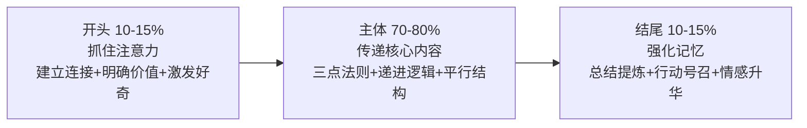
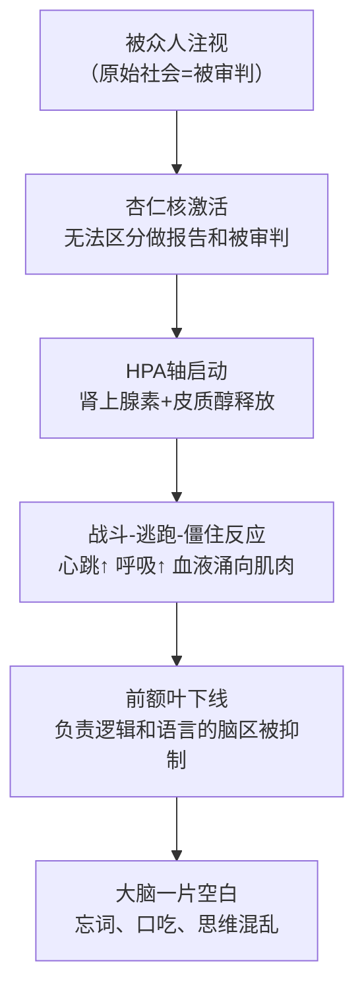
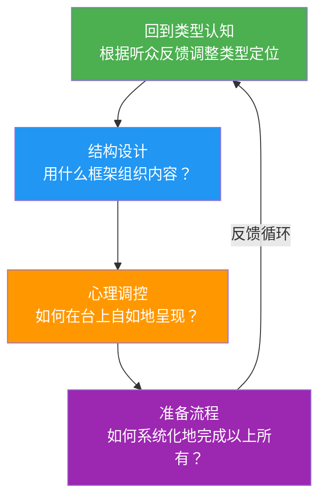

## 本节小结：理论基础全景回顾

理论是行动的罗盘。在本节中，我们从四个维度系统构建了演讲表达的理论基础——类型认知、结构设计、心理调控、准备流程。这四个维度并非彼此孤立，而是构成一个完整的认知框架：**先明确"讲什么类型"，再设计"用什么结构"，然后解决"怎么克服紧张"，最后落地"如何系统准备"**。四者环环相扣，缺一不可。

下面，我们逐一回顾每个维度的核心要点，并揭示它们之间的深层联系。

---

### 一、演讲的类型：明确目标是所有策略的起点

#### 核心知识体系

本节首先建立了一个多维分类体系，帮助你回答"我到底要做什么"这个最基本的问题：

**按目的分（最核心的分类维度）：**

| 类型 | 核心目标 | 成功标准 | 关键策略 |
|------|----------|----------|----------|
| 信息型 | 让听众"知道" | 听众能复述关键信息 | 逻辑清晰、通俗易懂、控制信息密度（≤5个核心点） |
| 说服型 | 让听众"相信并行动" | 听众改变观点或采取行动 | Ethos+Logos+Pathos三管齐下、Monroe激励序列 |
| 激励型 | 让听众"热血沸腾" | 听众情感被激发、愿意共同行动 | 故事驱动、排比回环、真诚信念、愿景描绘 |
| 娱乐型 | 让听众"愉悦放松" | 听众在笑声中有所感悟 | 意外反转、自嘲、三段式笑话、真实经历 |
| 典礼型 | 赋予事件"仪式意义" | 听众获得情感共鸣和意义感 | 真诚+简短+一个好故事+一句好收尾 |
| 演示型 | 让听众"学会操作" | 听众具备动手能力 | 步骤清晰、边做边讲、预设故障方案 |

**按形式分（决定表达方式）：**

- **正式演讲**：有议程、有距离感，要求语言规范、结构完整
- **非正式演讲**：氛围轻松、互动性强，但"非正式≠不准备"
- **即兴演讲**：无准备的终极考验，PREP法（观点→理由→例子→重申）是救命框架
- **线上演讲**：注意力窗口更短（前3分钟定生死），每5-7分钟设互动点，技术排练必不可少
- **半即兴演讲**：有大纲无逐字稿，准备"内容积木"灵活组装——这是工作中最常见的形式

#### 关键认知升级

1. **分类决定策略**：用信息型的方式去做说服型演讲，结果一定是"听众觉得哪里不对"。先定位类型，再选择策略。
2. **亚里士多德的说服三角**（Ethos人格信誉 + Logos逻辑推理 + Pathos情感诉求）是2300年不过时的说服基石，三者缺一不可。
3. **即兴演讲不是天赋**，而是可以训练的技能——PREP法、时间线法、三点法提供了即学即用的框架。

---

### 二、演讲的结构：好的结构是听众的认知导航系统

#### 核心知识体系

结构不是束缚，而是解放——它解放了听众的认知资源，让他们不必费力组织信息，只需专注于理解和思考。

**经典三段式（适用所有演讲）：**

**八种结构模型（按场景选择）：**

| 模型 | 核心逻辑 | 适用场景 | 关键操作 |
|------|----------|----------|----------|
| PREP | 观点→理由→案例→重申 | 即兴发言、会议讨论 | 开门见山，30秒内亮明立场 |
| 问题-解决 | 制造痛苦→提供解药 | 商业提案、投资路演 | 先让人感受到痛，方案才有价值 |
| STAR | 情境→任务→行动→结果 | 经验分享、案例复盘 | 结果必须量化，行动部分占60% |
| 时间线 | 过去→现在→未来 | 项目汇报、战略演讲 | 最符合直觉，也可倒叙制造悬念 |
| 总分总 | 结论→分论点→升华 | 学术报告、工作总结 | 结论先行，自上而下 |
| Monroe序列 | 注意→需求→满足→可视化→行动 | 说服性演讲、变革推动 | 映射人的决策心理过程，转化率高50%+ |
| SCQA | 情境→冲突→问题→答案 | 商业汇报、咨询建议 | 麦肯锡经典框架 |
| 嵌套结构 | 故事套故事 | TED演讲、思想传播 | 悬念感+层次感，嵌套不超过三层 |

**六大核心设计原则：**

1. **一个核心信息**：每场演讲只能有一个核心——用一句话概括，说不清楚就是没想清楚
2. **金字塔原理**：结论先行，自上而下，确保听众第一时间拿到最重要的信息
3. **信号词与路标**：听众不能回翻，你必须用"首先""然而""因此"等信号词做实时导航
4. **适度重复**：关键信息至少出现三次（开头引入→主体展开→结尾强化），每次用不同角度
5. **峰终定律**：人对经历的记忆由最强烈的瞬间和结束的瞬间决定——刻意设计高光时刻
6. **时间比例法则**：演讲越长，开头结尾占比应越低，把时间留给主体

#### 关键认知升级

1. **结构缺失有明确症状**：听众走神（缺主线）、频繁跑题（无约束）、记不住重点（信息平铺）——这些都是结构问题，不是内容问题。
2. **结构选错满盘皆输**：说服型用信息型的结构，听众会说"道理我都懂但我不想动"——因为缺少Monroe序列中的"需求"和"行动"环节。
3. **结构不仅是逻辑框架，也是节奏框架**：高密度信息段之后安排故事或互动，张弛有度才能防止疲劳。

---

### 三、演讲紧张心理：从科学理解到系统掌控

#### 核心知识体系

75%的人在公众演讲时会感到紧张——这不是你的个人缺陷，而是进化赋予的正常生理反应。

**紧张的科学机制：**

关键洞见：紧张和兴奋在生理上几乎完全相同，区别仅在于大脑的"标签"——哈佛实验证明，说"我很兴奋"比说"我很冷静"表现更好。

**六层应对体系（从根源到表层）：**

| 层级 | 策略 | 核心原理 | 关键操作 |
|------|------|----------|----------|
| 第一层 | 认知重构 | 改变对紧张的解读 | 将"我很紧张"重写为"我很兴奋，身体在给我能量" |
| 第二层 | 接纳承诺（ACT） | 与紧张共处而非对抗 | 白熊效应：越说"不要紧张"越紧张，接纳反而消解 |
| 第三层 | 身体调节 | 从身体入手改变心理 | 4-7-8呼吸法、生理叹息法、渐进式肌肉放松 |
| 第四层 | 充分准备 | 用确定性对抗不确定性 | 七步准备法+安全网清单（忘词/设备故障/冷场应对） |
| 第五层 | 逐步脱敏 | 用经验重塑大脑 | 六级训练路径：镜子→视频→1人→5人→50人→100人+ |
| 第六层 | 即时技术 | 现场应急方案 | 上台前30秒：生理叹息+接地练习；台上：暂停+喝水+走动 |

**两个真实蜕变案例：**

- 技术总监张某：从"周会恐惧症"到360人年会"全场最佳"——3个月，认知重构+充分准备+逐步脱敏
- 研究生李某：从答辩前呕吐到答辩"优秀"——每天练习呼吸法+意象排练+模拟答辩

#### 关键认知升级

1. **目标不是消除紧张，而是控制在最佳区间**（耶克斯-多德森倒U型曲线）：完全不紧张反而表现平平，适度紧张=最佳唤醒状态。
2. **"等不紧张了再上台"是最大的误区**——永远不会有那个时刻，行动本身就是最好的治疗。
3. **紧张的终极转化**：当积累足够多的成功经验后，大脑会自动将"心跳加速"重新编码为"我准备好了"——从"应对紧张"到"享受演讲"的跨越。

---

### 四、演讲的准备流程：80%的成功来自准备

#### 核心知识体系

卡内基培训中心数据：准备时间与演讲效果的相关系数高达0.72，远高于天赋（0.31）和经验（0.45）。精心准备的普通人 > 临场发挥的天才。

**七阶段系统化流程：**

| 阶段 | 时间节点 | 核心任务 | 关键产出 |
|------|----------|----------|----------|
| 一：目标与受众分析 | 前4-6周 | SMART目标+听众画像 | 明确的目的、可量化的成功标准、三维听众画像 |
| 二：核心信息与结构 | 前3-4周 | 一句话核心信息+结构框架 | 电梯演讲测试通过的内容大纲 |
| 三：内容研究与素材收集 | 前2-3周 | 五类素材收集+质量筛选 | 数据、案例、名言、类比、视觉元素的素材库 |
| 四：撰写演讲稿 | 前2周 | 混合模式：开头结尾逐字稿+主体大纲 | 口语化、短句化、具体化的演讲稿 |
| 五：设计视觉辅助 | 前1-2周 | PPT设计或替代方案 | 一页一要点、字体够大、对比度充足的幻灯片 |
| 六：反复排练 | 前1周 | 至少3次完整彩排 | 对镜子→录像→对人，逐步升级 |
| 七：演讲当天准备 | 当天 | 场地踏勘+设备测试+心理准备 | 一切就绪，只等上台 |

**语言风格六条法则：**

1. **口语化**：大声读出来，别扭就改
2. **短句为主**：15-20字一句，长短交替制造节奏
3. **具体而非抽象**：能用数字就不用形容词
4. **主动语态**：更直接、更有力
5. **少用术语**：必须用时第一次就给通俗解释
6. **使用"你"和"我们"**：制造对话感和共同体感

#### 关键认知升级

1. **准备≠做PPT**：PPT只是七步中的第五步，前面还有目标、受众、结构、素材、文稿五座大山。
2. **混合模式是最优解**：开头和结尾逐字稿（首因效应+近因效应），主体关键词大纲（保持自然），过渡句提前写好（防卡壳）。
3. **排练的层次性**：第1次对镜子（检查内容），第2次录像（检查姿态和语速），第3次对人（检查互动和感染力）。

---

### 四个维度的深层联系

这四个维度不是并列的知识点，而是一条环环相扣的因果链：

- **类型决定结构**：说服型演讲用Monroe序列，信息型用总分总，类型选错结构就错
- **结构降低紧张**：有结构就像有了路线图，即使忘词也能快速找回位置——结构是"认知安全网"
- **准备消除不确定性**：紧张的本质是不确定性，而七步准备法用确定性填满不确定性
- **排练建立脱敏**：每一次排练都是一次脱敏训练，从镜子到观众，逐步重塑大脑的恐惧反应

这四个维度共同构成了一个自我强化的正向循环：**理解类型→设计结构→管理心理→系统准备→上台实践→积累经验→更深理解**。每一轮循环都让你离"享受演讲"更近一步。

---

### 从理论到实践的桥梁

理论基础是地基，但它本身不是建筑。掌握了以上四个维度，你已经具备了"知道该怎么做"的能力。接下来的核心技巧部分，将解决"具体怎么做"的问题：

| 理论基础（你已掌握） | 核心技巧（即将学习） |
|---------------------|---------------------|
| 知道演讲有六种类型 | 学会针对每种类型的开场技巧 |
| 知道八种结构模型 | 学会如何组织内容让结构"活"起来 |
| 知道紧张的科学机制 | 学会讲故事的技巧（最有效的紧张解药） |
| 知道七步准备流程 | 学会互动技巧（让听众从被动接收变为主动参与） |
| — | 学会收尾技巧（让最后一击精准有力） |

一句话总结：**理论告诉你"为什么"，技巧告诉你"怎么做"。知其然更知其所以然，上台时你才能从容不迫。**
