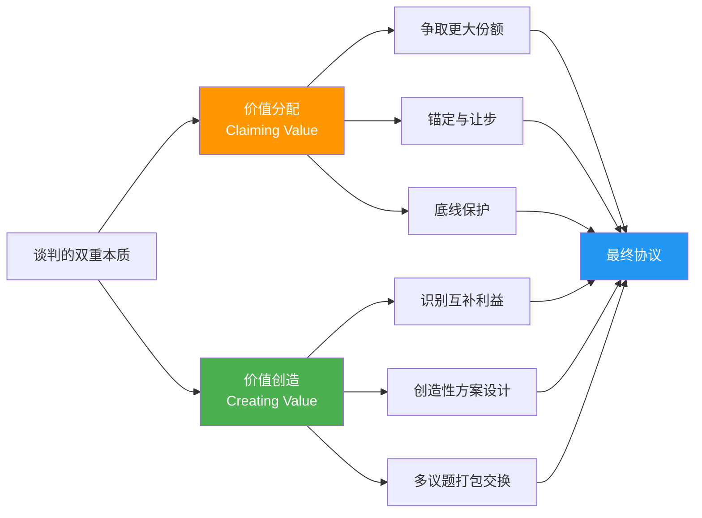
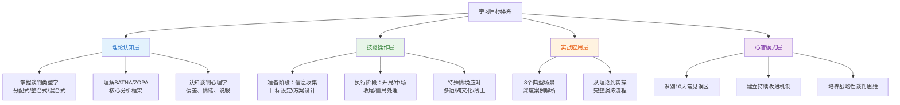
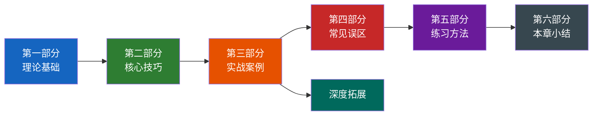
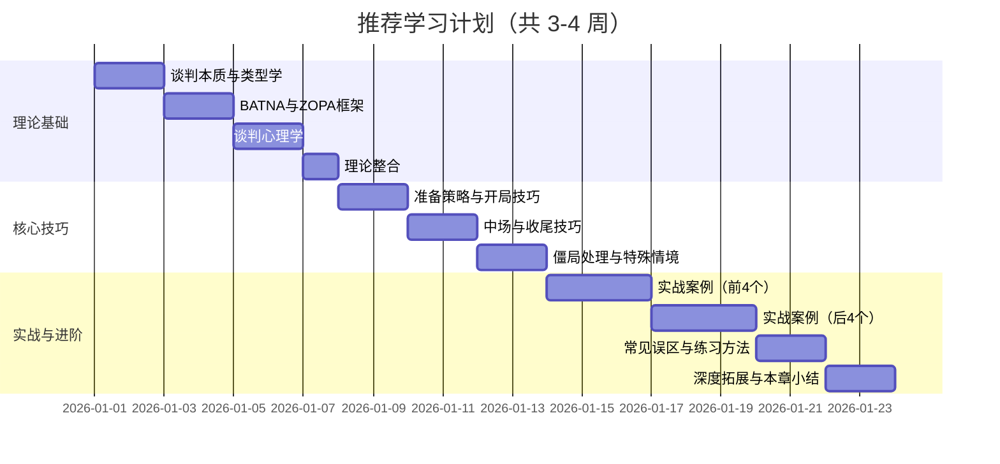
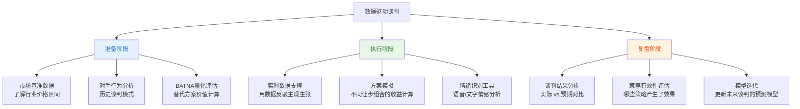

# 第七章 谈判技巧：章节概览

> "在谈判桌上，你得到的不是你应得的，而是你协商到的。"
> —— 切斯特·卡拉斯（Chester Karrass）

## 一、谈判的本质与重要性

### 1.1 什么是谈判

谈判是人类社会中最基本、最普遍的沟通形式之一。从词源上看，"谈判"对应的英文 Negotiation 源于拉丁语 *negotiari*，由 *neg-*（不）和 *otium*（闲暇）组成，字面意思是"不闲着"——暗示谈判是一种需要投入精力的主动行为。

从学术定义来看，谈判包含三个层次：

- **广义定义**：两个或多个主体之间，为了达成相互可接受的协议而进行的沟通过程。这个过程涉及信息的交换、利益的权衡、方案的创造和决策的形成。
- **狭义定义**：在特定情境下，各方就稀缺资源的分配、分歧的解决或共同利益的创造，通过有策略的互动来达成一致意见的行为过程。
- **战略性定义**：一种复杂的社会互动，参与者通过影响对方的认知、情感和行为，来实现自己预设目标的系统性过程。

### 1.2 谈判的双重本质：价值创造与价值分配

谈判的核心在于**价值创造与价值分配**的双重过程。这一认知是现代谈判理论最重要的突破。

**价值分配**（Claiming Value）是指在固定的利益总量中争取更大的份额——这是大多数人对谈判的直觉理解。比如商品砍价、薪资协商中的数字博弈，本质上都是在一块大小不变的"蛋糕"上争夺。

**价值创造**（Creating Value）则指向一个更深层的可能性：通过创新思维、利益交换和方案设计，扩大整体利益池。比如，一家公司在薪资谈判中无法给出更高年薪，但可以提供远程工作权限、额外假期、培训预算和股权期权——总体价值远超单一数字。

优秀的谈判者懂得在两者之间灵活切换：先通过合作性探索"把蛋糕做大"，再在分配阶段争取合理份额。这种从"零和博弈"到"正和博弈"的思维转变，是由哈佛大学谈判项目的罗杰·费舍尔和威廉·尤里在经典著作《谈判力》（*Getting to Yes*）中系统阐述的，被称为"原则谈判"（Principled Negotiation）范式。

### 1.3 谈判无处不在

谈判技能已经超越了传统的商业和政治领域，渗透到生活的方方面面。下面这张表展示了不同生活场景中谈判的典型形态：

| 场景 | 谈判议题 | 谈判对象 | 核心挑战 |
|------|---------|---------|---------|
| 求职面试 | 薪资、职级、福利、入职时间 | HR + 用人主管 | 信息不对称、议价能力评估 |
| 房屋租赁 | 租金、押金、维修责任、租期 | 房东或中介 | 时间压力、市场行情判断 |
| 团队协作 | 任务分工、资源分配、截止日期 | 同事或上级 | 权力不对等、关系维护 |
| 家庭决策 | 假期安排、财务规划、子女教育 | 家庭成员 | 情感因素、长期关系 |
| 客户沟通 | 价格、交付条件、售后条款 | 客户 | 关系维护与利润平衡 |
| 供应商管理 | 采购价、付款周期、质量标准 | 供应商 | 长期合作 vs 短期利益 |

据统计，一个普通职场人每周平均参与 5-8 次非正式谈判，但大多数人并未意识到自己正在谈判——这正是谈判技能最大的提升空间：**意识到谈判的存在，就已经赢了一半。**

### 1.4 谈判与相关概念的辨析

谈判经常与以下概念混淆，但它们有着本质区别：

| 概念 | 本质 | 方向性 | 关键差异 |
|------|------|--------|---------|
| **谈判** | 双向或多向的互动过程 | 双向 | 各方都有否决权，需要达成共识 |
| **说服** | 单向的影响过程 | 单向 | 说服者主动，被说服者被动接受或拒绝 |
| **争论** | 观点的对抗 | 对立 | 侧重于"谁对谁错"，而非利益协调 |
| **妥协** | 各方放弃部分利益 | 退让 | 通常意味着双方都不满意 |
| **调解** | 中立第三方介入协调 | 三方 | 调解者无决策权，当事方做最终决定 |
| **仲裁** | 第三方做出裁决 | 三方 | 仲裁者有约束性决策权 |

理解这些区别至关重要：很多人在应该谈判的时候选择了说服（单向输出不考虑对方需求），或在可以创造价值的时候选择了妥协（各退一步而非寻找第三条路）。

## 二、本章学习目标

通过本章的系统学习，你将获得以下能力提升：

**具体而言：**

1. **理解谈判的理论框架**：掌握谈判的类型分类（分配式、整合式、混合式）、核心分析概念（BATNA、ZOPA）以及谈判心理学原理（锚定效应、框架效应、损失厌恶等），建立对谈判本质的深层认知。

2. **掌握系统化的谈判技巧**：从准备阶段的信息收集与方案设计，到执行阶段的开局、中场、收尾全流程，再到僵局处理与特殊情境应对，形成完整的技能体系。

3. **应用实战场景分析**：通过薪资谈判、采购谈判、商务合作、租房谈判、客户续约、项目范围界定、团队资源分配、合作伙伴关系构建等 8 个典型场景的深度解析，将理论知识转化为可迁移的实践能力。

4. **识别并避免常见误区**：了解过度竞争心态、忽视 BATNA、情绪化决策、锚定偏差依赖等 10 个认知和行为陷阱，提升谈判决策质量。

5. **建立持续改进机制**：通过科学的每日/每周/进阶练习方法，实现谈判能力的阶梯式提升。

## 三、章节结构导航

本章按照"道→法→术→器→练"的逻辑展开，共包含六大板块。建议按照顺序学习，因为后续内容建立在前面的理论基础之上。

### 第一部分：理论基础（理论基础/）

本部分构建谈判的认知底座，包含 6 个子章节：

| 节 | 主题 | 核心内容 | 关键概念 |
|----|------|---------|---------|
| 第一节 | 谈判的本质与定义 | 谈判的多维定义、核心要素、与相关概念的辨析 | 七大核心要素：参与者、议题、利益、选项、标准、替代方案、承诺 |
| 第二节 | 谈判的类型学 | 按性质（分配/整合/混合）、参与者数量、关系性质、正式程度的四维分类 | 零和博弈 vs 正和博弈，一次性 vs 重复性谈判的策略差异 |
| 第三节 | BATNA：最佳替代方案 | BATNA 的概念框架、战略意义、开发强化方法与沟通策略 | 决策基准功能、议价能力来源、BATNA 与底线的区别 |
| 第四节 | ZOPA：协议区间理论 | ZOPA 的数学表达、动态特性、识别定位技术、策略定位 | 锚定策略、让步模式、ZOPA 不存在时的应对策略 |
| 第五节 | 谈判心理学 | 认知偏差（锚定、框架、损失厌恶）、情绪管理、说服心理学 | 六大核心偏差的识别与应对，情绪的策略性运用 |
| 第六节 | 理论整合：谈判的战略框架 | 将前五节理论整合为可操作的战略决策模型 | 理论→策略→执行的完整映射关系 |

**为什么理论很重要？** 很多人急于学习"话术"和"技巧"，跳过理论直接进入实操。这就像学开车只记操作步骤却不理解交通规则——在简单路况下能应付，遇到复杂情况就会手足无措。理论提供的不是具体答案，而是**分析框架**——当你面对任何谈判情境时，都能快速判断：这是什么类型的谈判？我的 BATNA 是什么？ZOPA 在哪里？对方可能受到哪些心理偏差的影响？

### 第二部分：核心技巧（核心技巧/）

本部分是全章的操作手册，覆盖谈判全流程，包含 6 个子章节：

| 节 | 主题 | 核心内容 | 实用工具 |
|----|------|---------|---------|
| 第一节 | 准备策略：谈判成功的基石 | 信息收集方法、目标设定体系（理想/期望/底线）、方案设计、团队角色分配 | 谈判准备清单、信息收集矩阵、目标层次模型 |
| 第二节 | 开局技巧：奠定谈判基调 | 开场策略选择、锚定效应的运用、关系建立、议程设定权的争夺 | 开场策略决策树、锚定校准公式 |
| 第三节 | 中场技巧：推动谈判进程 | 让步策略（递减让步、条件让步、打包让步）、信息交换、创造性方案生成、压力管理 | 让步计算器、利益交换矩阵 |
| 第四节 | 收尾技巧：达成高质量协议 | 协议确认方法、承诺获取技术、关系维护策略、协议书面化 | 收尾检查清单、协议模板 |
| 第五节 | 僵局处理：突破谈判困境 | 僵局诊断方法、突破策略（引入新议题、改变框架、休会、第三方介入）、备选方案激活 | 僵局诊断流程图、突破策略选择矩阵 |
| 第六节 | 特殊情境下的谈判技巧 | 多方谈判、跨文化谈判、线上谈判、高压谈判等复杂场景 | 场景适配策略清单 |

**一个关键认知：** 谈判不是线性的。虽然我们按"准备→开局→中场→收尾"的顺序讲解，但实际谈判中你可能在中场发现问题需要回到准备阶段补充信息，在收尾阶段发现新议题需要重新回到中场协商。高手与新手的区别之一，就是高手能在这些阶段之间灵活切换，而新手往往被线性流程束缚。

### 第三部分：实战案例（实战案例/）

本部分通过 8 个典型场景的深度案例分析，展示理论知识的实际应用。每个案例都包含：背景描述 → 谈判前准备 → 谈判过程还原 → 策略分析 → 结果复盘。

| 案例 | 场景 | 核心挑战 | 涉及的关键理论 |
|------|------|---------|---------------|
| 案例一 | 薪资谈判：职场人士的价值实现 | 信息不对称、议价能力不确定 | BATNA、锚定效应、价值创造 |
| 案例二 | 采购谈判：供应链管理的成本优化 | 多供应商比价、质量与成本平衡 | ZOPA 定位、客观标准、让步策略 |
| 案例三 | 商务合作：战略联盟的利益平衡 | 多议题复杂利益交织、长期关系考量 | 整合式谈判、利益识别、创造性方案 |
| 案例四 | 租房谈判：居住空间的权益保障 | 时间压力、市场信息不足 | BATNA、锚定、信息收集 |
| 案例五 | 客户续约：商业关系的持续维护 | 客户要求降价、竞争威胁 | 价值创造、关系管理、替代方案 |
| 案例六 | 项目范围：工作边界的合理界定 | 需求蔓延、范围模糊 | 立场 vs 利益、客观标准、承诺管理 |
| 案例七 | 团队资源：内部协调的效率提升 | 资源稀缺、多方竞争 | 多边谈判、联盟策略、公平标准 |
| 案例八 | 合作伙伴：长期关系的战略构建 | 信任建立、风险分担、利益分配 | 重复博弈、声誉管理、整合式谈判 |
| 综合分析 | 跨场景谈判原则提炼 | 从 8 个案例中提炼共性原则 | 理论→实践的映射关系 |

**案例学习方法提示：** 阅读每个案例时，先尝试自己分析"如果是我，我会怎么做"，再对照案例中的策略选择。这种"先预测再对照"的学习方式，比被动阅读的效果高出 3-4 倍（基于教育心理学中的"生成效应"研究）。

### 第四部分：常见误区（04-常见误区.md）

本部分识别并解析谈判中常见的 10 个认知和行为误区。每个误区都配有具体场景案例、心理学原理解释和系统化的纠正策略。

**误区总览：**

| 编号 | 误区名称 | 核心问题 | 后果 |
|------|---------|---------|------|
| 1 | 过度竞争心态 | 把谈判当战争，非赢即输 | 破坏关系、错失双赢机会 |
| 2 | 忽视 BATNA | 不准备替代方案就上谈判桌 | 议价能力弱、被迫接受差条件 |
| 3 | 情绪化决策 | 被愤怒、恐惧或兴奋左右判断 | 做出非理性让步或冲动拒绝 |
| 4 | 过度依赖锚定 | 被对方的初始报价严重带偏 | 判断失准、让步过多或过少 |
| 5 | 信息过度暴露 | 急于展示诚意而泄露过多信息 | 丧失议价优势 |
| 6 | 立场固化 | 坚守立场而非探索利益 | 僵局频发、协议难以达成 |
| 7 | 零和思维 | 假设所有议题都是此消彼长 | 忽视价值创造机会 |
| 8 | 时间压力误判 | 高估或低估截止日期的影响 | 决策质量下降 |
| 9 | 关系与实质混淆 | 在关系层面妥协来解决实质问题 | 短期和谐、长期不满 |
| 10 | 胜利者诅咒 | 达成协议后反而觉得吃亏 | 协议执行动力不足、关系受损 |

### 第五部分：练习方法（05-练习方法.md）

谈判是一项技能（skill），而非知识（knowledge）。就像游泳不能只看书、骑车不能只听课一样，谈判能力必须通过刻意练习才能内化。本部分提供三级练习体系：

| 练习层级 | 时间投入 | 频率 | 内容 | 目标 |
|---------|---------|------|------|------|
| **每日微练习** | 5-15 分钟 | 每天 | 谈判场景快速分析、BATNA 思维训练、情绪觉察练习 | 培养谈判思维习惯 |
| **每周深度练习** | 1-2 小时 | 每周 1-2 次 | 角色扮演模拟谈判、案例分析讨论、让步策略计算 | 强化核心技能 |
| **进阶实战训练** | 半天-全天 | 每月 1-2 次 | 复杂场景多轮模拟、跨文化谈判演练、真实谈判复盘 | 建立实战信心 |

### 第六部分：本章小结（06-本章小结.md）

总结本章核心要点，提炼关键原则清单，提供进一步学习路径建议。

### 深度拓展（07-深度拓展.md）

为高级读者提供的补充内容，包括：哈佛谈判项目的完整理论体系、谈判学的学术前沿、跨文化谈判的深层分析、数据驱动谈判的实操指南。

## 四、核心概念速查表

在正式学习之前，先建立对本章核心概念的初步认知。随着学习深入，你会不断回到这个表格，赋予每个概念更丰富的内涵。

| 概念 | 全称 | 一句话解释 | 首次出现 |
|------|------|-----------|---------|
| **BATNA** | Best Alternative to a Negotiated Agreement | 谈判破裂时你能采取的最佳替代方案 | 理论基础·第三节 |
| **ZOPA** | Zone of Possible Agreement | 各方都能接受的协议区间 | 理论基础·第四节 |
| **锚定效应** | Anchoring Effect | 初始信息会严重扭曲后续判断 | 理论基础·第五节 |
| **框架效应** | Framing Effect | 同一信息的不同表述方式导致不同决策 | 理论基础·第五节 |
| **损失厌恶** | Loss Aversion | 人们对损失的敏感度约为收益的 2 倍 | 理论基础·第五节 |
| **价值创造** | Value Creating | 通过合作扩大整体利益池 | 第一部分 |
| **价值分配** | Value Claiming | 在固定利益中争取更大份额 | 第一部分 |
| **递减让步** | Diminishing Concessions | 让步幅度逐步缩小，暗示接近底线 | 核心技巧·第三节 |
| **打包交换** | Logrolling | 将多个议题捆绑，在不同议题上各有得失 | 核心技巧·第三节 |
| **客观标准** | Objective Criteria | 市场数据、行业标准、先例等中立依据 | 理论基础·第四节 |

## 五、学习建议

### 5.1 学习顺序与节奏

建议按照章节顺序学习，因为后续内容建立在前面的理论框架之上。推荐的学习节奏：

**关键原则：不要贪快。** 谈判技能的学习类似于学习一门乐器——你可以一天看完所有乐理，但只有通过反复练习，手指才能找到正确的位置。每个理论概念学完后，花 10 分钟思考"我在生活中哪里可以用到这个概念"，比继续往后读更有价值。

### 5.2 主动学习方法

谈判技能的学习不能仅停留在理论层面。以下方法经教育心理学研究验证有效：

**方法一：即时微实践**

学习每个技巧后，当天就在一个低风险场景中尝试。比如学完"锚定效应"后，在下次购物时主动先报价，观察锚定如何影响后续对话。低风险场景（买菜、约时间、选餐厅）是最佳练习场——即使搞砸了也没有严重后果。

**方法二：谈判日志**

建立一份谈判日志，每次谈判（无论正式还是非正式）后花 5 分钟记录：

日期：___________
场景：___________
我的BATNA：___________
对方可能的BATNA：___________
我的策略选择：___________
实际过程（关键转折点）：___________
结果：___________
我做得好的地方：___________
可以改进的地方：___________
下次我会：___________

**方法三：角色扮演对练**

找一个学习伙伴，每周进行 1-2 次角色扮演练习。一个人扮演甲方、一个人扮演乙方，使用本章提供的案例场景。练习后交换角色复盘。研究表明，角色扮演中的错误是最高效的学习信号——因为错误带来的不适感会加深记忆。

**方法四：录像复盘（进阶）**

在征得对方同意的前提下，录制你的角色扮演或真实谈判过程。回放时关注：你的肢体语言是否自信？你是否在关键时刻沉默了足够长的时间？你的让步模式是否合理？录像能揭示你自己察觉不到的行为模式。

### 5.3 情境化应用

不同的谈判场景需要不同的策略组合。在应用所学技巧时，务必考虑以下变量：

| 变量 | 影响维度 | 策略调整方向 |
|------|---------|-------------|
| **关系重要性** | 一次性交易 vs 长期合作关系 | 关系越重要，越倾向合作策略 |
| **时间压力** | 有充裕时间 vs 紧迫截止日期 | 时间越紧，越需要快速定位 ZOPA |
| **信息不对称** | 信息对等 vs 严重信息不对称 | 信息劣势方应先收集信息再谈判 |
| **权力关系** | 平等 vs 明显权力不对等 | 弱势方需更依赖 BATNA 和客观标准 |
| **文化背景** | 同文化 vs 跨文化 | 跨文化场景需额外关注沟通风格差异 |
| **议题复杂度** | 单一议题 vs 多议题 | 多议题可用打包交换创造价值 |
| **情绪温度** | 冷静理性 vs 情绪高涨 | 高情绪场景先降温再谈判 |

**核心原则：没有万能的谈判策略，只有适配特定情境的最优策略组合。** 这也是为什么本章同时提供理论框架和实战案例——理论告诉你"有哪些工具"，案例教你"在什么场景下用哪个工具"。

### 5.4 持续反思

优秀的谈判者都是反思型学习者。谈判能力的提升不是线性的，而是螺旋式的：学习新概念 → 实践中应用 → 反思中发现盲区 → 学习更深概念 → 再实践。每一次循环都会让你的理解更上一层楼。

建议在学习本章的过程中建立三个反思习惯：

1. **事前预判**：在每次谈判前，花 2 分钟写下你的策略选择和预期结果
2. **事中觉察**：在谈判过程中，有意识地观察自己和对方的行为模式
3. **事后复盘**：在每次谈判后，对照事前预判分析偏差原因

## 六、谈判能力自评框架

在开始学习之前，建议先进行自我评估，明确自己的起点位置。以下评估包含 4 个维度、16 个具体指标，每个指标按 1-5 分自评（1=完全不具备，5=非常熟练）。

### 6.1 准备能力

| 指标 | 1 分（不具备） | 3 分（基本具备） | 5 分（非常熟练） | 自评 |
|------|---------------|-----------------|-----------------|------|
| **信息收集** | 不做任何调研就上谈判桌 | 收集基本信息但不够深入 | 系统化收集对方、市场、自身三方信息 | ___ |
| **目标设定** | 只有一个模糊的目标 | 设定明确的期望目标 | 设定理想/期望/底线三级目标体系 | ___ |
| **方案设计** | 只准备一个方案 | 准备 2-3 个备选方案 | 设计多种方案组合并考虑议题打包 | ___ |
| **BATNA 准备** | 不考虑替代方案 | 知道自己的替代方案 | 系统评估并强化 BATNA | ___ |

### 6.2 执行能力

| 指标 | 1 分（不具备） | 3 分（基本具备） | 5 分（非常熟练） | 自评 |
|------|---------------|-----------------|-----------------|------|
| **开场策略** | 被动等待对方先开口 | 能设定基本议程 | 根据情境选择最优开场策略和锚定点 | ___ |
| **提问技巧** | 只会陈述自己的需求 | 能问出基本问题 | 使用多层次提问深入挖掘对方利益 | ___ |
| **让步管理** | 随意让步，没有节奏 | 有基本的让步计划 | 精确控制让步幅度、速度和条件 | ___ |
| **僵局应对** | 陷入僵局就放弃 | 尝试基本的破冰方法 | 灵活运用多种突破策略 | ___ |

### 6.3 心理素质

| 指标 | 1 分（不具备） | 3 分（基本具备） | 5 分（非常熟练） | 自评 |
|------|---------------|-----------------|-----------------|------|
| **情绪管理** | 容易被情绪左右 | 能意识到情绪并基本控制 | 在高压下保持冷静并策略性运用情绪 | ___ |
| **抗压能力** | 对方施压就妥协 | 能承受一定压力 | 在极端压力下保持判断力 | ___ |
| **耐心** | 急于达成协议 | 能保持适度耐心 | 愿意花时间等待最优协议 | ___ |
| **认知偏差觉察** | 完全不了解偏差 | 知道常见偏差但难以识别 | 能实时识别自己和对方的偏差行为 | ___ |

### 6.4 关系管理

| 指标 | 1 分（不具备） | 3 分（基本具备） | 5 分（非常熟练） | 自评 |
|------|---------------|-----------------|-----------------|------|
| **信任建立** | 不重视关系建设 | 能建立基本信任 | 快速建立深层信任并维持长期关系 | ___ |
| **冲突处理** | 回避冲突或激烈对抗 | 能处理基本冲突 | 将冲突转化为建设性对话 | ___ |
| **同理心** | 只关注自己的需求 | 能理解对方立场 | 深入理解对方的利益、情感和约束 | ___ |
| **承诺管理** | 达成协议后就不管了 | 能确保基本的协议执行 | 系统管理承诺的获取、记录和跟踪 | ___ |

**评分汇总：**

| 维度 | 总分（满分 20） | 等级判断 |
|------|----------------|---------|
| 准备能力 | ___ | 8分以下：重点关注；8-14分：中等水平；15分以上：良好 |
| 执行能力 | ___ | 同上 |
| 心理素质 | ___ | 同上 |
| 关系管理 | ___ | 同上 |
| **总分（满分 80）** | ___ | **32分以下：初学者，从头学起；32-56分：中级，重点关注薄弱项；56分以上：高级，聚焦深度拓展** |

**使用建议：** 将评估结果记录下来。学完本章后重新评估一次，对比前后差异。最显著的进步通常出现在你初始评分最低的维度——因为那里的学习边际收益最大。

## 七、现代谈判的新趋势

### 7.1 数字化谈判：屏幕背后的博弈

随着远程工作和数字化转型的普及，线上谈判已经成为新常态。McKinsey 2023 年的调查数据显示，超过 67% 的 B2B 谈判至少部分通过视频会议完成，而在 2019 年这个数字仅为 23%。

**数字化谈判的核心挑战：**

| 挑战 | 具体表现 | 应对策略 |
|------|---------|---------|
| **非语言线索缺失** | 视频中难以捕捉微表情、肢体语言、呼吸节奏等细微信号 | 增加语言反馈频率（"我理解你的意思"），主动询问对方感受，善用聊天窗口补充表达 |
| **注意力分散** | 对方可能同时查看邮件、处理其他事务 | 缩短单次谈判时长（控制在 60-90 分钟），增加互动环节，提前发送议程让对方有准备 |
| **信任建立困难** | 缺少面对面的社交互动（如共进午餐），信任积累更慢 | 开场花 5-10 分钟进行非正式交流，使用视频而非仅语音，共享屏幕展示资料增加透明度 |
| **技术障碍** | 网络延迟、音画不同步、平台切换混乱 | 提前测试设备和网络，准备备用沟通渠道（电话/微信），指定技术负责人 |
| **跨时区协调** | 全球化谈判需要兼顾不同时区 | 使用 World Time Buddy 等工具找重叠时段，轮换"不方便"的一方，异步沟通与同步会议结合 |

**数字化谈判的独特优势：**
- 聊天窗口可以用于私下与团队成员沟通策略
- 会议记录和屏幕共享让信息更透明
- 时间限制天然存在，有助于避免冗长无效的讨论
- 可以同时查看资料而不显得不礼貌

### 7.2 跨文化谈判：理解差异，驾驭差异

全球化背景下，跨文化谈判能力日益重要。不同文化背景下的谈判风格存在系统性差异，不了解这些差异可能导致严重误解。

**霍夫斯泰德文化维度在谈判中的体现：**

| 文化维度 | 高分文化特征 | 低分文化特征 | 谈判影响 |
|---------|------------|------------|---------|
| **权力距离** | 尊重层级，决策集中（如中国、日本） | 平等对话，授权决策（如北欧、以色列） | 高权力距离文化需与有决策权的人谈判 |
| **个人主义/集体主义** | 个人利益优先（如美国、澳大利亚） | 集体和谐优先（如日本、韩国） | 集体主义文化更重视关系和面子 |
| **不确定性规避** | 需要详细合同和规则（如德国、日本） | 接受模糊性和灵活性（如英国、美国） | 规避型文化需要更详尽的协议条款 |
| **长期导向** | 重视长期关系和耐心（如中国、日本） | 重视短期结果和效率（如美国、英国） | 长期导向文化需要更多前期关系投资 |
| **沟通风格** | 高语境：含义隐含在上下文中（如日本） | 低语境：含义直接表达（如美国、德国） | 高语境文化需"听话听音"，注意弦外之音 |

**跨文化谈判的五条实践原则：**

1. **做功课**：谈判前了解对方文化的谈判礼仪、禁忌和偏好。不要假设"商业就是商业"——在很多文化中，关系比合同更重要。
2. **调整节奏**：美国谈判者通常希望快速推进，日本谈判者倾向于缓慢建立共识，中东谈判者重视社交环节。按对方的节奏来，而非自己的。
3. **注意面子**：在东亚文化中，让对方"丢面子"（如当众指出错误、直接拒绝）可能导致谈判彻底破裂。学会私下沟通敏感问题。
4. **书面确认**：不同文化对"口头承诺"的约束力有不同理解。任何重要共识都应书面确认，且使用双方都能准确理解的语言。
5. **请本地向导**：如果涉及重大谈判，聘请了解当地文化的顾问或中间人。他们能帮你避免你自己都不知道的文化陷阱。

### 7.3 数据驱动的谈判：用数据武装直觉

大数据和人工智能为谈判提供了全新的工具和方法论。数据不会取代谈判者的判断力，但能显著提升判断质量。

**数据在谈判各阶段的应用：**

**实操建议：**
- **建立你的数据资产**：每次谈判后记录关键数据点（价格、条款、让步幅度、时长）。这些数据积累起来就是你最宝贵的谈判资源。
- **使用客观标准**：当你有市场数据、行业报告或第三方评估作为支撑时，你的主张会比"我觉得"有力 10 倍。
- **量化你的 BATNA**：不要说"我可以找别的供应商"，而要说"供应商 B 的报价是 X 元，交付周期 Y 天，质量评级 Z 分"——具体的数字比模糊的替代方案更有说服力。
- **利用 AI 辅助分析**：使用 AI 工具分析对手公开的财务数据、市场行为和历史谈判记录，寻找规律和突破口。

## 八、本章的学习价值

本章不仅仅是一本谈判技巧手册，更是一套完整的谈判能力发展系统。它的核心价值体现在四个层面：

### 8.1 理论深度

本章提供扎实的理论基础，帮助你理解谈判的本质规律。从哈佛谈判项目的"原则谈判"四支柱理论，到卡尼曼和特沃斯基的前景理论在谈判中的应用，再到谢林（Thomas Schelling）的博弈论战略分析——你不只是学到"怎么做"，更理解"为什么这样做有效"。理论让你在面对全新场景时能够自主推理，而非生搬硬套。

### 8.2 实践导向

本章通过 8 个真实场景的深度案例分析，以及系统化的练习方法，确保知识向能力的有效转化。每个理论概念都有对应的实操练习，每个技巧都有具体的使用场景和注意事项。

### 8.3 系统思维

本章帮助你建立完整的谈判思维框架。你不是学到一堆零散的技巧，而是形成一种系统化的分析能力：面对任何谈判情境，都能快速定位关键变量、评估策略选项、选择最优行动方案。

### 8.4 持续发展

本章提供科学的练习方法和自评工具，支持长期能力建设。学完本章不是终点，而是起点——通过持续的练习、反思和实战，你的谈判能力将不断精进。

---

**准备好开始了吗？** 从[第一部分：理论基础](理论基础/)开始，建立你的谈判认知底座。记住，最好的谈判者不是天生的——他们通过学习和练习变得优秀。你已经迈出了最重要的一步：决定认真学习谈判。
