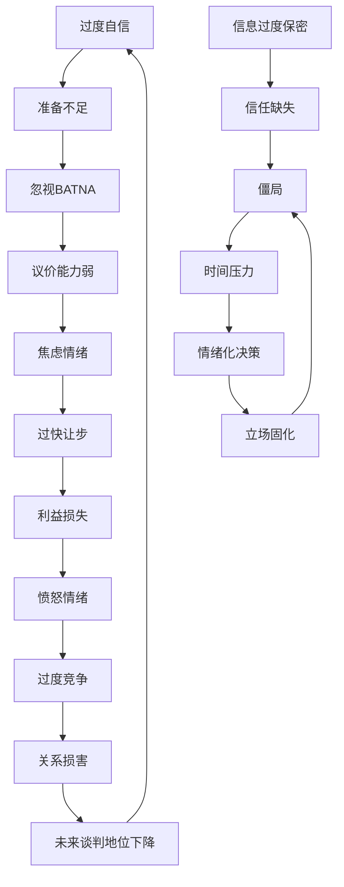

# 第七章 谈判技巧：常见误区

## 引言：为什么高手也会踩坑

谈判中的误区不是"不懂道理"造成的——恰恰相反，很多误区源于人们在日常生活中形成的直觉和经验。认知心理学家丹尼尔·卡尼曼（Daniel Kahneman）在《思考，快与慢》中指出，人类大脑有两套思维系统：系统1是快速、直觉的，系统2是慢速、理性的。谈判中的误区，大多是系统1在主导决策时产生的系统性偏差。

哈佛大学谈判项目（Harvard Negotiation Project）的研究表明，即使是经验丰富的谈判者，也会反复陷入相同的认知陷阱——因为他们从未真正识别和纠正这些模式。一份对500名企业高管的调查显示，73%的受访者承认在最近一次重要谈判中至少犯了本章所述误区中的两个。

本章的目的是帮你建立一套"谈判免疫系统"——不是告诉你"应该怎么做"，而是让你在每一个具体场景中能够识别"我正在犯什么错"，以及"此刻最有效的纠偏动作是什么"。

---

## 误区一：过度竞争心态——把谈判当作战争

### 1.1 误区表现

许多谈判者将谈判视为零和博弈（zero-sum game），认为一方的所得必然是另一方的所失。这种"赢-输"思维在心理学上被称为**固定馅饼偏见**（fixed-pie bias）——人们本能地假设谈判的"馅饼"大小是固定的，分配就是一切。

典型行为包括：

- 坚持极端立场，把让步视为"损失"而非"交换"
- 使用威胁、最后通牒、施压等强硬手段
- 隐藏所有信息，拒绝任何透明度
- 将对方的让步视为自己的胜利，而非双方的进展
- 在谈判桌前表现出攻击性姿态：交叉双臂、提高音量、频繁打断

### 1.2 误区危害

**关系损害**：过度竞争会破坏双方信任基础。麻省理工学院的Max Bazerman教授研究发现，第一次谈判中采取极端竞争策略的谈判者，在后续谈判中获得的收益平均降低23%——因为对方会以同等甚至更强的竞争策略"回报"。

**价值损失**：当双方都在争夺固定馅饼时，没有人去思考如何把馅饼做大。例如，两家公司谈判合作分成，如果只关注50:50还是60:40，就忽略了合作本身可能创造的新市场、新技术或新渠道。

**谈判破裂**：哈佛商学院的数据显示，在B2B谈判中，约35%的谈判破裂并非因为根本利益不可调和，而是因为一方或双方的竞争姿态导致对方退出。

**声誉影响**：在行业圈子中，"难合作"的标签传播速度远超你的想象。LinkedIn的一项调查显示，68%的采购经理会因为供应商的谈判风格而在未来拒绝合作。

### 1.3 纠正策略

**思维转变**：从"赢-输"思维转向"赢-赢"思维。关键认知是——谈判不是切蛋糕，而是种蛋糕。你需要找到让双方都受益的方案。

**利益分析法**：深入挖掘各方的根本利益，寻找共同点。每个立场背后都有利益，每个利益背后都有需求。例如：

| 立场（Position） | 利益（Interest） | 需求（Need） |
|---|---|---|
| "我要降价10%" | 控制预算压力 | 季度成本不超标 |
| "我要求独家合作" | 保护市场份额 | 避免竞品蚕食 |
| "我要加快交付" | 赶上产品发布窗口 | 季度营收目标 |

**价值创造清单**：在谈判前列出所有可能创造价值的维度——不只是价格，还包括付款周期、交付时间、质量保证、售后服务、独家权益、数据共享、联合营销等。

**实践技巧**：

1. 在谈判前，把议题分为三类：必须赢的（核心利益）、可以灵活的（交换筹码）、可以赠送的（低成本高价值）
2. 练习"视角切换"——用5分钟扮演对方，写出对方最关心的3件事
3. 准备至少一个"做大馅饼"的提案，比如："如果我们把合同期从1年延长到3年，价格上我可以给到您满意的水平"
4. 开场时使用合作性语言："今天的目标是我们双方都觉得这个结果值得"

---

## 误区二：忽视BATNA——不了解自己的最佳替代方案

### 2.1 误区表现

BATNA（Best Alternative to a Negotiated Agreement，最佳替代方案）是Roger Fisher和William Ury在《Getting to Yes》中提出的概念。简单来说，BATNA就是"如果这次谈判没谈成，我最好的选择是什么"。

许多谈判者犯两个错误：一是根本没准备BATNA就开始谈判，二是低估自己的BATNA价值。这导致他们在谈判中缺乏底气，容易接受不合理的条件。

典型行为包括：

- 没有替代方案就开始谈判，仿佛"必须谈成"
- 低估自己的BATNA价值，觉得自己"别无选择"
- 没有积极开发和强化BATNA
- 在谈判中过度依赖对方，丧失议价能力
- 把BATNA和"威胁离开"混为一谈

### 2.2 误区危害

**议价能力弱**：没有BATNA的谈判者就像没有底牌的扑克玩家——对方只要施加足够压力，你就会妥协。研究表明，拥有强BATNA的谈判者，最终获得的收益比没有BATNA的谈判者高出20%-40%。

**决策质量低**：当你觉得"别无选择"时，你可能会接受一个比你的BATNA还差的协议。例如，你有一份月薪15000的offer在手（你的BATNA），但因为急于入职，接受了一份月薪12000的工作——这比不谈判直接接受BATNA还差。

**压力过大**：没有BATNA会制造巨大的心理压力，导致焦虑、急于求成、频繁让步。这种压力还会被对方感知到，进一步削弱你的谈判地位。

**错失机会**：你可能把所有注意力放在当前谈判上，忽略了真正更好的替代方案。

### 2.3 纠正策略

**系统评估BATNA**：在谈判前，花时间全面评估你的替代方案。具体步骤：

1. **头脑风暴**：列出所有可能的替代方案，不管看起来多不现实
2. **可行性评估**：评估每个方案的可行性、成本和收益
3. **排序**：将可行方案按优先级排序，排名第一的就是你的BATNA
4. **强化**：思考如何提升BATNA的吸引力和可行性

**BATNA评估清单**：

| 评估维度 | 你的评估 |
|---|---|
| 替代方案是什么？ | 具体描述 |
| 可行性如何？ | 高/中/低 |
| 需要多少时间和资源？ | 具体数字 |
| 收益/回报如何？ | 量化评估 |
| 风险是什么？ | 列出主要风险 |
| 如何在谈判前强化它？ | 具体行动 |

**实践技巧**：

1. 对于薪资谈判：同时面试3-5家公司，手握多个offer就是最强BATNA
2. 对于商业谈判：同时接触多个潜在合作伙伴，避免"独家依赖"
3. 在谈判中，不需要直接说出"我有BATNA"，但可以暗示："我们也在评估其他方案"
4. 每周更新一次BATNA评估，确保它反映了最新情况
5. 关键原则：你的底线（walk-away point）应该永远不比你的BATNA差

---

## 误区三：锚定陷阱——被对方的初始要求过度影响

### 3.1 误区表现

锚定效应（Anchoring Effect）是行为经济学中最稳健的发现之一。Amos Tversky和Daniel Kahneman的经典实验表明，即使锚点是随机数字（比如转轮盘得到的数字），也会显著影响人们对后续问题的判断。

在谈判中，先提出数字的一方会"设定锚点"，将谈判的参考框架拉向自己有利的方向。许多谈判者没有意识到这一点，不自觉地围绕对方的锚点展开谈判。

典型行为包括：

- 对方报价100万，你就开始在100万附近讨价还价，即使你原本的评估是60万
- 忽略市场数据和客观标准，只关注对方给出的数字
- 对明显不合理的锚点做出过大让步，觉得"折中一下应该合理"
- 在对方设锚后才开始思考自己的合理价位

### 3.2 误区危害

**谈判空间被压缩**：如果对方报价100万而你本想出60万，当你围绕100万谈判时，"折中"的结果可能是80万——比你本应争取到的价格高出20万。

**价值损失**：Northwestern University的研究发现，在薪酬谈判中，先出价的一方平均多获得8%-10%的收益。如果你总是被动接受对方的锚点，你每次都在"赠送"这部分价值。

**信心受损**：面对高昂的锚点，谈判者容易产生"我不够格""对方一定有道理"的心理暗示，导致后续谈判中更加被动。

**决策偏差**：锚点会扭曲你对合理范围的判断。你可能会觉得"打个对折应该差不多了"，而这个"对折"本身就建立在错误的参考点上。

### 3.3 纠正策略

**主动锚定**：如果你有充分的信息和准备，争取先出价。你的锚点应该"激进但合理"——足够激进以争取空间，但不至于让对方觉得你在浪费时间。

一个有效的锚点公式是：锚点 = 你的目标价格 × 1.2~1.5（买方）或 目标价格 × 0.7~0.8（卖方）。

**客观标准重构**：当对方设锚后，用客观数据重新锚定。例如：

> "感谢您的报价。根据我们对市场上同类供应商的调研，过去12个月的成交价格范围在X-Y之间。我们可以在这个区间内讨论。"

**质疑方法**：要求对方解释锚点的合理性——这不是对抗，而是把模糊的锚点转化为可讨论的依据：

- "您能帮我理解这个价格是如何构成的吗？"
- "这个报价基于哪些具体的成本因素？"
- "市场上有哪些参照支持这个定价？"

**心理脱锚练习**：

1. 在听到对方报价后，停顿3-5秒，提醒自己"这是一个锚点，不是参考"
2. 默念你自己的评估值，重新建立心理基准
3. 用"我注意到这个数字与市场情况有较大出入，让我们从客观数据开始"来打断锚定效应

**实践技巧**：

1. 谈判前确定你的锚点，并准备3个支持理由（数据、案例、逻辑）
2. 收集充分的市场数据——你掌握的信息越多，越不容易被锚点左右
3. 如果你不确定合理范围，宁可先出价，也不要被动接受对方的锚
4. 准备好"重新锚定"的话术模板，在需要时迅速切换谈判框架

---

## 误区四：情绪化决策——让情绪主导谈判过程

### 4.1 误区表现

情绪在谈判中不是敌人——适度的情绪表达可以传递信号、施加压力、建立连接。问题在于让情绪**主导**决策，而非**服务**于策略。

耶鲁大学管理学院的Daylian Cain教授研究发现，在谈判中经历愤怒情绪的谈判者，其决策质量下降幅度相当于IQ暂时降低15-20点。而焦虑情绪则让谈判者过早做出让步——平均多让出12%的价值。

典型行为包括：

- 愤怒时发出威胁或做出不可挽回的强硬表态
- 焦虑时频繁让步，急于结束谈判
- 兴奋时忽略细节条款，事后发现被"钻了空子"
- 受伤/委屈时采取报复性策略，损害自身利益
- 将对方的情绪表达误读为"他们不行了"或"他们在虚张声势"

### 4.2 误区危害

**决策质量下降**：情绪会关闭大脑前额叶皮层（负责理性思考）的功能，让你更多依赖杏仁核（负责情绪反应）做出"战或逃"决策。

**关系破坏**：一次情绪失控可能毁掉多年建立的商业关系。研究显示，谈判中的情绪爆发导致的关系修复成本，平均需要6-8次正面互动才能弥补。

**错失机会**：愤怒时你可能拒绝一个其实不错的方案；焦虑时你可能接受一个很差的方案。

**后悔决策**：哥伦比亚大学的研究发现，谈判后最常见的后悔不是"没争取更多"，而是"情绪化时说了不该说的话"。

### 4.3 纠正策略

**情绪觉察三层模型**：

1. **身体信号识别**：心跳加速、肌肉紧绷、呼吸变浅——这些是情绪升起的早期预警
2. **情绪命名**：在心里说"我现在感到愤怒/焦虑/沮丧"——神经科学研究表明，仅仅是命名情绪就能降低杏仁核的活跃度（"affect labeling"效应）
3. **策略性选择**：问自己"在这个情绪状态下做出的决定，24小时后我会怎么看？"

**暂停机制**：当你感到情绪即将失控时，使用以下话术争取缓冲时间：

- "这个提议很重要，我需要几分钟思考一下"
- "我们休息10分钟，喝杯咖啡继续"
- "我想确认一些信息，明天再回复您可以吗？"

**情绪转化为谈判工具**：心理学家发现，适度表达情绪（而非压抑或爆发）可以增强谈判效果。关键是区分"情绪表达"和"情绪失控"：

| 方式 | 示例 | 效果 |
|---|---|---|
| 情绪压抑 | "我没问题，继续吧" | 对方无法感知你的真实关切 |
| 情绪失控 | "这太离谱了！你们在耍我！" | 破坏关系，失去理性 |
| 策略性表达 | "坦率说，这个方案让我感到不太舒服，因为……" | 传递信号，推动调整 |

**实践技巧**：

1. 谈判前进行5分钟正念呼吸练习，降低基础焦虑水平
2. 为谈判设定"情绪触发清单"——提前知道什么话题容易让你失控，并准备应对方案
3. 使用"我语"表达不满："我感到失望，因为我们的预期差距太大"，而不是"你们太贪婪了"
4. 谈判后进行"情绪复盘"——记录哪些时刻情绪影响了你的判断，下次如何应对
5. 如果你是团队谈判，指定一位"冷静观察者"专门监测团队成员的情绪状态

---

## 误区五：信息过度保密——拒绝分享任何信息

### 5.1 误区表现

"信息就是力量"——这句话没错，但很多谈判者把它极端化了，变成了"任何信息都不能分享"。结果是双方都守口如瓶，谈判变成了猜谜游戏，效率极低，信任为零。

典型行为包括：

- 对所有问题都回答模糊或拒绝回答
- 不分享自己的利益、优先级和约束条件
- 不提供任何支持自己立场的证据或数据
- 期待对方先透露所有信息
- 甚至对行业公开信息也遮遮掩掩

### 5.2 误区危害

**信任缺失**：行为经济学中的"互惠原则"（reciprocity）告诉我们，人类天性倾向于回报对方的行为。你分享信息，对方也会倾向于分享；你封锁信息，对方也会封锁。最终双方都在信息真空中做出次优决策。

**价值创造受阻**：你不说你的优先级，我就不知道什么对你重要；我不知道什么对你重要，就无法提出对双方都有利的交换方案。信息不透明是"做大馅饼"最大的障碍。

**谈判效率低**：当双方都不分享信息时，每一轮谈判都是试探和猜谜，可能需要5-10轮才能达成本来2-3轮就能完成的协议。

**僵局风险**：信息不透明容易导致误判——你以为对方在某个议题上坚决不让步，实际上那只是他们的"试探性立场"，如果你不分享自己的优先级，僵局就不可避免。

### 5.3 纠正策略

**信息分类管理**：将谈判信息分为四类，明确哪些可以主动分享、哪些需要等价交换、哪些必须保密：

| 信息类型 | 是否分享 | 示例 |
|---|---|---|
| 公开信息 | 主动分享 | 行业数据、公司简介、公开案例 |
| 交换信息 | 等价交换 | 优先级、时间约束、替代方案 |
| 信号信息 | 策略性释放 | "我们也在和其他供应商谈" |
| 核心机密 | 绝对保密 | 底线价格、内部预算、战略意图 |

**互惠披露法**：先主动分享一个低风险信息，然后要求对方也分享对等信息：

> "为了让讨论更高效，我可以分享一下我们最关心的三个要素是质量、交付时间和付款灵活性。您能告诉我您方的优先级排序吗？"

**渐进披露策略**：根据谈判进展和信任建立程度，逐步增加信息分享的深度：

- 第一轮：分享公开信息和行业数据
- 第二轮：分享你的优先级排序和基本约束
- 第三轮：分享具体需求和可接受范围
- 最终轮：在接近达成协议时，分享底线信息

**实践技巧**：

1. 谈判前制作"可分享信息清单"和"保密信息清单"
2. 使用"交换框架"："如果我能分享X，您是否可以分享Y？"
3. 分享信息时强调其价值："分享这个信息是希望我们能更高效地找到双方都满意的方案"
4. 对方分享信息后，立即给予积极反馈："感谢您分享这些，这很有帮助"

---

## 误区六：立场固化——坚守立场而非关注利益

### 6.1 误区表现

这是谈判领域最经典、最普遍的误区之一。Roger Fisher在《Getting to Yes》中将"立场"（position）和"利益"（interest）区分开来——立场是"我想要什么"，利益是"我为什么想要"。当谈判双方都固守立场时，就像两辆车迎面对开，谁也不让谁。

典型行为包括：

- 坚持特定的数字或条件，不愿探索其他可能
- 将立场视为不可改变的底线
- 当对方不接受立场时，感到沮丧或愤怒
- 反复强调"我就是需要这个"，而不解释为什么
- 在立场被挑战时变得更加顽固（承诺升级效应）

### 6.2 误区危害

**解决方案受限**：一个立场可以对应无数种满足背后利益的方案。当你只盯着一个立场，你就把所有其他可能性都排除了。

经典案例：两个孩子争一个橙子。如果只看立场，就是"我要这个橙子" vs "我也要这个橙子"，解决方案是各分一半。但如果深入了解利益，一个孩子要橙子皮做蛋糕，另一个要橙子汁喝——两个人都可以得到整个橙子想要的部分。

**僵局频发**：研究显示，在立场式谈判中，双方首次报价的差异越大，谈判越容易破裂——即使双方的根本利益是可以兼容的。

**价值损失**：你可能为了坚守一个对你其实不那么重要的立场，而在其他对你更重要的议题上做出让步。

### 6.3 纠正策略

**利益挖掘技术**：用"5个为什么"方法深入挖掘立场背后的利益：

> 对方立场："我要独家代理权"
> 为什么？→ 因为我不想和竞争对手分享这个市场
> 为什么？→ 因为我在当地投入了大量资源开发客户
> 为什么这很重要？→ 因为我需要保护我的投资回报
> 深层利益 → 要求：投资保护 + 市场回报保障

**方案多元化**：将每个立场转化为利益后，用头脑风暴产生多个满足同样利益的方案：

| 立场 | 利益 | 可能方案 |
|---|---|---|
| "我要独家代理" | 投资保护 | 独家代理 / 优先续约权 / 投资补偿条款 / 分区域代理 |
| "我要降价20%" | 控制成本 | 阶梯定价 / 批量折扣 / 延长账期 / 捆绑服务 |
| "我要缩短工期" | 赶上线窗口 | 并行施工 / 分批交付 / 优先级模块先行 / 增加资源投入 |

**议题扩展法**：当两个议题无法调和时，添加新的议题维度创造交换空间。例如价格谈不拢，可以加入付款方式、合同期限、售后服务、数据共享等议题，让双方在不同议题上各有所得。

**实践技巧**：

1. 准备一系列探索性问题：
   - "这对你来说为什么重要？"
   - "如果这个问题解决了，对你意味着什么？"
   - "你最担心的是什么？"
   - "什么样的结果会让你觉得值得？"
2. 将每个立场转化为背后的利益需求，写在纸上
3. 用头脑风暴技巧，为每个利益至少产生3个可能的满足方案
4. 练习从不同角度审视问题——如果我是对方的老板、对方的客户、对方的员工，我会怎么看？

---

## 误区七：过度自信——高估自己的判断和控制力

### 7.1 误区表现

过度自信（overconfidence）是人类最普遍的认知偏差之一。在谈判中，它表现为高估自己的信息质量、判断准确性和对谈判进程的控制力。

诺贝尔奖得主Richard Thaler的研究发现，人们对自己的判断过于自信的程度，在以下三种情况下最为严重：（1）信息量大但质量不确定时；（2）有初步成功经验时；（3）在熟悉的环境中谈判时——这三个条件恰恰是商业谈判的典型场景。

典型行为包括：

- 低估对手的准备程度和谈判能力
- 高估自己对谈判节奏和方向的控制
- 忽视潜在的风险和意外情况
- 不做充分准备，觉得"靠经验就能搞定"
- 对自己的预测过于确定，不预留弹性空间

### 7.2 误区危害

**准备不足**：过度自信最常见的后果就是减少准备工作。斯坦福大学的研究发现，自信程度与准备时间呈负相关——越自信的谈判者准备时间越短，而最终收益也越低。

**风险忽视**：过度自信让你看不到风险。你以为"对方一定会接受"，结果对方拒绝了；你以为"他们没有替代方案"，结果他们已经有了更好的选择。

**应对失误**：当出现意外情况时，过度自信的谈判者往往措手不及，因为他们从未准备过应急方案。

**学习停滞**：过度自信的人很少反思自己的错误——他们倾向于把成功归因于自己的能力，把失败归因于外部因素。

### 7.3 纠正策略

**预验尸法（Pre-mortem）**：这是Gary Klein提出的决策工具。在谈判前，假设谈判已经失败了，然后问自己："是什么原因导致了失败？"这种方法比传统的风险评估更有效，因为它绕过了"一切都会顺利"的乐观偏见。

**准备检查清单**：

- [ ] 我是否了解对方的BATNA？
- [ ] 我是否准备了至少3个可能的意外情况及应对方案？
- [ ] 我是否收集了足够的市场数据和客观标准？
- [ ] 我是否咨询了不同领域的同事或顾问？
- [ ] 我是否进行了模拟谈判或角色扮演？
- [ ] 我的预测是否考虑了最坏情况？

**外部视角**：寻求他人的不同观点，特别是那些不在你的"信息茧房"中的人。研究发现，引入一个外部视角可以将预测准确率提高25%-30%。

**实践技巧**：

1. 为每次重要谈判安排一位"魔鬼代言人"——专门挑战你的假设和预测
2. 给自己的预测附加一个置信区间："我认为成交价在80-100万之间，70%把握"
3. 为最坏情况准备应急计划——如果谈判破裂，你的具体下一步是什么？
4. 建立复盘机制，每次谈判后记录：哪些预测准确？哪些偏离了？为什么？

---

## 误区八：忽略非语言信号——只关注言语内容

### 8.1 误区表现

Albert Mehrabian教授的经典研究（虽然常被误读）指出了一个重要事实：在情感和态度的传递中，非语言信号扮演着极其重要的角色。在谈判中，对方的肢体语言、面部表情、语调变化、沉默和犹豫，往往比他们说出的话更真实地反映了他们的想法和感受。

典型行为包括：

- 只听对方说什么，不观察怎么说
- 忽略对方的犹豫、紧张或不确定信号
- 不注意自己的非语言信号可能传递的信息
- 过度依赖语言沟通，忽略沉默、停顿、语速变化等线索
- 在对方明显不舒服或想结束时继续施压

### 8.2 误区危害

**信息缺失**：研究表明，谈判中约60%-80%的信息通过非语言渠道传递。忽略这些信号，你可能只看到了冰山一角。例如，对方说"这个价格可以接受"，但身体后倾、双手抱胸、语调平淡——这很可能意味着他们虽然口头同意，但内心并不满意，未来可能在执行环节出问题。

**误读意图**：你可能把对方的"深思"误读为"犹豫"，把"不安"误读为"不满"，从而做出错误的应对。

**错失让步信号**：经验丰富的谈判者会通过微妙的非语言信号暗示他们的底线和灵活空间——如果你捕捉不到这些信号，就可能在对方已经准备好让步时继续施压，反而引起反感。

### 8.3 非语言信号解读框架

谈判中常见的非语言信号及其可能含义（注意：任何单一信号都不应作为确定性判断，需要结合上下文和信号群综合解读）：

**积极信号**（对方可能准备接受或让步）：
- 身体前倾，表示感兴趣和投入
- 频繁点头，表示认同或至少理解
- 放松的姿态，开放的手势
- 主动做笔记或查看合同细节
- 语速加快，表示兴奋或急于推进

**消极信号**（对方可能不满或准备拒绝）：
- 身体后倾或转向门口，表示想离开
- 双手抱胸，表示防御或封闭
- 频繁看表或手机，表示不耐烦
- 语速变慢、停顿增多，表示犹豫或不满
- 摸鼻子、揉眼睛，可能是不适或隐瞒的信号

**关键原则**：当语言和非语言信号不一致时，非语言信号往往更可靠。

### 8.4 纠正策略

**观察训练**：分配你的注意力——在对方发言时，大约60%放在内容上，40%放在观察非语言信号上。这需要刻意练习，最初可能会觉得"分心"，但随着练习会变成习惯。

**一致性检查**：注意对方的语言内容和非语言信号是否一致。不一致时，用探索性问题确认："我注意到您似乎有些顾虑，能分享一下吗？"

**自我觉察**：你的非语言信号也在"说话"。紧张时避免快速抖腿、频繁触摸面部；自信时保持开放姿态、稳定的目光接触。

**实践技巧**：

1. 观看谈判录像（比如YouTube上的公开谈判），练习识别非语言信号
2. 在谈判中每隔10-15分钟做一次"全景扫描"——快速评估对方的整体状态
3. 学习"镜像"技巧：适度模仿对方的姿态和语速，可以建立无意识的信任感
4. 对于线上谈判（视频会议），更要注意对方的面部表情和语调变化，因为肢体语言的可见性降低了

---

## 误区九：时间管理不当——缺乏时间意识和策略

### 9.1 误区表现

时间是谈判中最容易被忽视的变量。它既是一种约束条件，也是一种策略工具。很多谈判者要么被时间压力裹挟做出仓促决定，要么无限拖延导致机会流失，更不会策略性地运用时间因素。

典型行为包括：

- 在"最后期限"压力下仓促做出决定
- 不设定谈判时间框架，导致谈判无限延长
- 不懂得识别对方是否在人为制造时间压力
- 在最后时刻才做出重大让步
- 不会利用时间差来争取思考空间

### 9.2 误区危害

**决策质量下降**：Wharton商学院的研究发现，在时间压力下，谈判者让步的幅度平均增加15%-25%，而获得的对等回报没有相应增加。

**效率低下**：没有时间框架的谈判容易陷入反复讨论同一个议题的循环。

**被操控**：有经验的谈判者会故意制造时间压力来迫使对方让步——如果你不识别这种策略，就容易中招。

**错失时机**：过度拖延可能导致对方失去耐心、转向其他合作伙伴、或者市场条件发生变化。

### 9.3 纠正策略

**时间框架规划**：在谈判前设定明确的时间目标和里程碑：

| 阶段 | 时间分配 | 目标 |
|---|---|---|
| 开场与建立关系 | 10%-15% | 建立信任，确认议程 |
| 信息交换 | 20%-25% | 了解对方需求和优先级 |
| 核心谈判 | 40%-50% | 讨论关键议题，探索方案 |
| 收尾与确认 | 15%-20% | 确认协议，处理细节 |

**识别虚假时间压力**：当对方说"今天必须决定"或"这个报价只到周五"时，先确认这是真实约束还是策略性施压：

- "如果我们在下周一之前做出决定，会影响什么？"
- "这个时间限制是基于什么具体原因？"
- "如果我们需要更多时间，有什么替代方案？"

**时间策略运用**：

- **争取时间**：当对方施加时间压力时，"我需要和团队确认一下"是合法的缓冲
- **创造紧迫感**：当你有真实的截止日期时，适度分享可以推动谈判进程
- **控制节奏**：如果你需要时间思考，可以要求休息或延期
- **利用沉默**：在关键提议后保持沉默，给对方时间消化和回应

**实践技巧**：

1. 谈判前确认双方的时间约束，并在开场时公开讨论时间安排
2. 准备"需要时间考虑"的多种话术：
   - "这是一个重要的决定，我想确保我们考虑周全"
   - "让我回去和财务团队确认一下这些数字"
   - "我习惯在重大决定前过夜再看看"
3. 如果对方制造虚假时间压力，礼貌但坚定地要求延长："我理解您的时间要求，但仓促决定对我们双方都不利"
4. 设定自己的"思考截止点"——在什么时间节点之前，你不会做出最终决定

---

## 误区十：关系与利益失衡——要么过度重视关系，要么完全忽视

### 10.1 误区表现

关系和利益是谈判中永恒的张力。过度关系导向的谈判者为了"不得罪人"而频繁让步；过度利益导向的谈判者为了"赢"而伤害长期关系。两种极端都会导致次优结果。

典型行为包括：

- **过度关系导向**：不敢提要求，怕"伤感情"；对方一施压就妥协；把"做个好人"看得比"做对的事"更重要
- **过度利益导向**：只看眼前交易，不考虑长期合作；用"赢者通吃"心态压榨对方最后一分价值
- **情境错配**：在一次性交易中过度投入关系维护（浪费资源），在长期合作关系中过度追求短期利益（损害根基）
- **缺乏灵活性**：不能根据谈判进展动态调整关系与利益的平衡

### 10.2 误区危害

**利益损失**：过度关系导向的谈判者平均多让出10%-20%的价值。这不是"善意"，而是对自己和自己所代表的利益相关者的不负责。

**关系损害**：过度利益导向的谈判可能在当前交易中"赢"了，但失去了未来的合作机会。在中国商业文化中，"关系"（guanxi）的重要性尤其显著——一次"吃干抹净"的行为可能导致永久性关系断裂。

**策略失效**：在错误的情境中使用错误的关系策略，效果适得其反。例如，在一次性的政府采购招标中过度投资关系，在长期战略合作伙伴谈判中过度追求价格优势。

### 10.3 关系-利益矩阵

根据谈判性质，选择合适的策略定位：

| | 短期/一次性交易 | 长期/持续关系 |
|---|---|---|
| **高利益** | 坚定但公正：追求利益最大化，但保持职业风度 | 伙伴思维：共同创造价值，合理分配 |
| **低利益** | 效率优先：快速达成，不浪费时间 | 信任投资：建立信任基础，为未来高价值合作铺路 |

### 10.4 纠正策略

**情境评估**：在谈判前回答以下问题：

1. 这是一次性交易还是长期关系的开始？
2. 这段关系对我未来的价值有多大？
3. 行业圈子中，声誉对我有多重要？
4. 对方是决策者还是代理人？

**平衡策略**：哈佛谈判项目提出的"双维度谈判"（Two-Dimensional Negotiation）框架建议同时关注"实质性结果"和"关系质量"：

- **实质性维度**：我能获得什么样的条件和价格？
- **关系维度**：谈判结束后，双方的关系是变好了、不变还是变差了？

最优结果是两个维度都正向——你获得了好的条件，同时关系也得到了加强。

**冲突分层处理**：当利益冲突和关系紧张同时出现时，先处理关系问题，再处理利益问题。方法包括：

- 承认对方的关切："我理解这对您来说很重要"
- 将人和问题分开："我们对这个问题有不同看法，但这不影响我对您的尊重"
- 共同面对问题："让我们一起看看有没有双方都能接受的方案"

**实践技巧**：

1. 谈判前评估关系的重要性和长期价值，确定策略定位
2. 设定关系底线（"即使放弃这笔交易，我也不会做X"）和利益底线（"低于Y我不会接受"）
3. 在关系敏感的谈判中，使用"关系维护性话术"：
   - "我们的目标是找到一个让双方都觉得公平的方案"
   - "即使这次没谈成，我也希望我们能保持良好的关系"
   - "我非常重视我们的合作关系，所以我希望我们能坦诚讨论"
4. 在每次让步时附加关系价值："在这个问题上我可以做出调整，希望这能为我们的长期合作奠定更好的基础"

---

## 误区之间的相互作用：系统性风险

以上10个误区不是孤立存在的——它们往往相互触发、相互加强，形成恶性循环。理解这些互动关系，才能从根本上提升谈判质量。

### 误区联动关系图

### 典型连锁反应案例

**场景：供应商谈判**

1. **过度自信** → 没做充分准备，没有认真评估BATNA
2. **忽视BATNA** → 谈判中发现自己"别无选择"，开始焦虑
3. **情绪化决策** → 焦虑让谈判者急于达成协议，频繁让步
4. **立场固化** → 因为焦虑，反而在某些非核心立场上顽固坚持（作为心理补偿）
5. **忽略非语言信号** → 没有注意到对方其实也有妥协意愿
6. **关系与利益失衡** → 最终要么让步过多损害利益，要么僵局导致关系破裂

**打破链条的关键**：在第1步就做好充分准备（对抗过度自信），在第3步启动暂停机制（对抗情绪化），在第5步加强观察（对抗忽略非语言信号）。打断任何一个环节，都能防止连锁反应的升级。

---

## 综合纠正策略：建立系统性的谈判免疫系统

### 1. 谈判前准备检查清单

这是你最重要的防线。一份完整的准备检查清单应该覆盖：

**信息层面：**
- [ ] 我的BATNA是什么？对方的可能BATNA是什么？
- [ ] 我掌握了哪些客观数据（市场价格、行业标准、历史案例）？
- [ ] 对方的核心利益和优先级是什么？
- [ ] 有哪些议题可以创造交换空间？

**策略层面：**
- [ ] 我的锚点是什么？支持理由是什么？
- [ ] 我的底线在哪里？比我的BATNA高/低多少？
- [ ] 我准备了哪些可分享的信息？
- [ ] 我预计对方会使用哪些策略？我的应对方案是什么？

**情绪层面：**
- [ ] 我的情绪触发点是什么？如何应对？
- [ ] 我准备了哪些暂停/缓冲话术？
- [ ] 我是否有足够的休息和心理准备？

### 2. 谈判中实时自检机制

在谈判过程中，每30-45分钟做一次快速自检：

1. **锚点检查**：我是否还在围绕对方的锚点谈判？我需要重新锚定吗？
2. **情绪检查**：我的情绪状态如何？是否需要暂停？
3. **信息检查**：我是否分享了足够的信息？对方是否在过度保密？
4. **立场vs利益检查**：我们是在讨论立场还是利益？是否需要深入挖掘？
5. **时间检查**：时间管理是否得当？是否需要调整节奏？

### 3. 谈判后复盘模板

每次谈判后，花15-30分钟填写以下复盘模板：

谈判主题：___________
日期：___________
参与方：___________

【结果评估】
- 实质性结果（1-10分）：___
- 关系结果（1-10分）：___
- 相比BATNA如何：___

【误区自检】
我犯了哪些误区？（勾选）
□ 过度竞争  □ 忽视BATNA  □ 锚定陷阱  □ 情绪化决策
□ 信息过度保密  □ 立场固化  □ 过度自信  □ 忽略非语言信号
□ 时间管理不当  □ 关系与利益失衡

【改进计划】
- 下次我需要改进的具体点：___
- 我会采取的具体行动：___
- 我需要学习/练习的技能：___

### 4. 渐进式技能提升路径

| 阶段 | 目标 | 练习重点 |
|---|---|---|
| 入门（1-3个月） | 识别误区 | 每次谈判后复盘，识别自己犯了哪些误区 |
| 进阶（3-6个月） | 预防误区 | 谈判前检查清单覆盖所有误区 |
| 熟练（6-12个月） | 策略运用 | 利用对误区的理解，识别和应对对方的误区 |
| 精通（12个月+） | 自如切换 | 在不同情境中灵活运用策略，帮助团队成员避免误区 |

---

## 结语：从误区识别到谈判直觉

识别误区是谈判能力提升的起点，但不是终点。最终目标是将这些知识内化为"谈判直觉"——不是不再犯错，而是犯错时能立刻察觉并纠正。

真正的谈判高手有三个特征：

**第一，他们知道自己会犯错**。过度自信本身就是误区之一。高手会主动设置"刹车机制"——检查清单、团队复盘、外部顾问——来弥补个人认知的局限。

**第二，他们能识别对方的误区**。当你理解了这些误区的模式和触发条件，你就能在谈判中识别出对方正在犯的错误，并策略性地应对。例如，对方在情绪化时，你保持冷静就是优势；对方过度自信时，你用客观数据重新锚定就能扭转局面。

**第三，他们不断进化**。每次谈判都是一次学习机会。通过持续的复盘和实践，你的"误区雷达"会越来越灵敏，你的纠正速度会越来越快。这不仅仅是谈判技巧的提升——这是认知能力的系统性升级。
