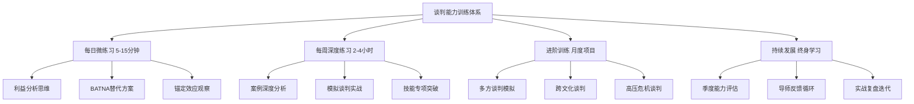

# 第七章 谈判技巧：练习方法

## 引言：谈判能力的科学训练

谈判能力不是天赋，而是一套可以通过系统性训练习得的复合技能。认知心理学家安德斯·埃里克森（Anders Ericsson）在"刻意练习"理论中指出：任何复杂技能的精进都需要三个条件——明确的训练目标、即时的反馈机制、以及持续走出舒适区的挑战。谈判能力的训练完全遵循这一规律。

本章提供的不是空洞的"多练习"建议，而是一套分层递进、可量化追踪的完整训练体系。从每天5分钟的思维微训练，到每周2小时的模拟实战，再到多方博弈和跨文化谈判的进阶训练，每个环节都有具体的操作步骤、评估标准和真实案例参照。无论你是从未系统学过谈判的初学者，还是希望突破瓶颈的资深商务人士，都能在本章找到适合自己的训练路径。

## 第一节 每日练习：培养谈判思维习惯

刻意练习的核心不在于时间长度，而在于训练的专注度和针对性。每天15分钟的高质量训练，胜过每周一次漫无目的的2小时"学习"。本节设计的三类每日微练习分别针对谈判的三个底层能力：利益识别思维、替代方案思维、和情境感知能力。

### 1.1 利益分析练习：从立场到利益的思维转换

这是哈佛谈判项目（Harvard Negotiation Project）提出的核心理念之一。大多数人在谈判中只关注"对方要什么"（立场），而忽略了"对方为什么想要"（利益）。立场是对立的，利益往往是兼容的。每天练习这种思维转换，能从根本上改变你处理分歧的方式。

**练习方法**：

1. 选择一个日常分歧场景（不需要是正式谈判）
2. 用"立场-利益-需求"三层模型进行分析
3. 至少设计两个满足各方核心利益的创造性方案

**完整案例演示**：

假设你和室友就空调温度产生分歧。

| 维度 | 你的立场/利益 | 室友的立场/利益 |
|------|--------------|----------------|
| 立场 | "空调调到24度" | "空调调到28度" |
| 表层利益 | 觉得热，想要凉爽 | 觉得冷，想要温暖 |
| 深层利益 | 睡眠质量好，第二天精力充沛 | 身体怕冷，避免感冒影响工作 |
| 隐含需求 | 对温度的控制感 | 被尊重和考虑的感受 |

分析完毕后，创造性方案自然浮现：
- **方案A**：购买一个USB小风扇放在你床头，空调保持26度——你的体感温度降低，室友不会太冷
- **方案B**：空调定时功能，前半夜24度（你入睡时凉爽），后半夜自动升到27度（室友凌晨不会冷醒）
- **方案C**：你使用薄被，室友使用厚被，空调保持26度——各自通过被褥调节体感

这个练习的精髓在于：当你养成"追问背后利益"的习惯后，面对真正的商业谈判或薪资谈判时，你能迅速穿透对方的表面立场，找到双方共赢的可能性空间。

**进阶变体**：当你能熟练完成上述分析后，尝试加入"约束条件"维度——分析各方有什么限制使得他们只能选择某种立场。这能帮助你理解为什么有些谈判看似无解，实际上是因为约束条件没有被识别出来。

### 1.2 BATNA替代方案思维训练

BATNA（Best Alternative to a Negotiated Agreement，最佳替代方案）是谈判中最强大的概念之一。你的BATNA越强，你在谈判中的议价能力就越强。但大多数人只在正式谈判前才想到BATNA，而没有将其内化为一种日常思维模式。

**训练目标**：让BATNA思维成为你的本能反应——面对任何请求、邀约或决策，第一反应是"如果我拒绝，我的下一个最佳选择是什么？"

**每日练习步骤**：

1. 选择当天遇到的一个决策点（可以很小）
2. 列出至少3个替代方案
3. 为每个替代方案评估"价值分数"（1-10分，综合考虑时间成本、金钱成本、情感收益、长期价值）
4. 确定最佳替代方案，思考它与当前选项的差距

**实际案例**：

场景：同事邀请你周末参加一个行业交流活动。

| 替代方案 | 时间成本 | 金钱成本 | 社交收益 | 知识收益 | 综合得分 |
|---------|---------|---------|---------|---------|---------|
| 参加活动 | 6小时 | 200元 | 8 | 7 | 7.5 |
| 在家阅读行业报告 | 3小时 | 0元 | 2 | 8 | 5.0 |
| 约一个行业前辈喝咖啡 | 2小时 | 100元 | 9 | 9 | 9.0 |
| 录制一期个人播客 | 4小时 | 0元 | 5 | 6 | 5.5 |

在这个案例中，"约前辈喝咖啡"可能是比参加活动更好的BATNA——时间更短、关系更深入、信息质量更高。但如果你主动拒绝了同事的邀请，你需要用不伤害关系的方式进行，比如："这周末已经有安排了，不过我们下周可以一起约行业里的张总聊聊？"——这实际上是在用更强的BATNA重新定义谈判框架。

**常见训练误区**：
- **误区一**：只列出替代方案但不评分——没有量化比较，BATNA只是空谈
- **误区二**：低估自己BATNA的价值——很多人低估"不达成协议"这个选项的价值，导致在谈判中过度让步
- **误区三**：不更新BATNA——BATNA是动态的，随着新信息出现需要重新评估

### 1.3 锚定效应观察训练

锚定效应（Anchoring Effect）是丹尼尔·卡尼曼（Daniel Kahneman）在《思考，快与慢》中重点阐述的认知偏差。在谈判中，第一个提出数字的人往往能"锚定"后续讨论的范围。但锚定效应远不止于数字——它存在于时间预期、质量标准、甚至情感基调中。

**每日观察任务**：

在一天中留意以下场景，记录你观察到的锚定效应：

| 场景类型 | 观察要点 | 记录模板 |
|---------|---------|---------|
| 购物场景 | 原价标注如何影响你对折扣价的判断 | 原价___元，折扣价___元，我的购买意愿___ |
| 工作场景 | 领导先说"这个项目很难"vs"这个项目有挑战"如何影响团队预期 | 锚定词___，团队反应___ |
| 新闻场景 | 媒体用"激增50%"vs"增加5个百分点"描述同一数据 | 数据事实___，表达方式___，我的感受___ |
| 社交场景 | 朋友说"有件小事想请你帮忙"vs"有个大忙想请你帮" | 锚定描述___，实际请求___，差异感___ |

**进阶练习：主动设置锚点**

当你在日常生活中需要提出请求或建议时，有意识地练习锚定策略：

- **向上的锚定**：如果你想请3天假，先说"我可能需要一周时间"，然后"协商"到3天——对方会觉得3天很合理
- **框架锚定**：不说"这个方案有3个缺点"，而说"这个方案有7个优点和3个需要注意的地方"——同样的信息，不同的心理框架

> **关键原则**：锚定不是欺骗，而是信息呈现的策略。一个好的锚点应该基于合理依据，能够在被质疑时自圆其说。如果对方质疑你的锚点，你需要准备好支撑理由——否则锚定会适得其反，损害你的可信度。

### 1.4 提问技巧微练习

提问是谈判中最被低估的技能。大多数人把精力放在"怎么说"上，而忽略了"怎么问"。好的提问能够：收集关键信息、引导对方思考、发现隐藏利益、化解僵局、建立信任。

**每日练习**：在当天的对话中有意识地使用以下三种提问技巧中的至少一种。

| 提问类型 | 目的 | 话术模板 | 使用时机 | 效果评估要点 |
|---------|------|---------|---------|------------|
| 开放式提问 | 了解对方的完整想法 | "您能详细说说对这个问题的看法吗？" | 对话开始，需要收集信息时 | 对方回答的长度和深度 |
| 探索性提问 | 挖掘立场背后的利益 | "这个条件对您来说最重要的原因是什么？" | 对方提出要求后 | 是否发现了新的利益点 |
| 假设性提问 | 测试可能性而不做承诺 | "如果我们能在时间上做一些调整，您会怎样考虑？" | 僵局时探索突破口 | 对方是否打开了新的讨论空间 |
| 澄清性提问 | 确认理解，避免误解 | "您说的'尽快'具体是指什么时间范围？" | 对方使用模糊语言时 | 是否消除了歧义 |
| 引导性提问 | 将讨论引向有利方向 | "考虑到长期合作，您是否认为这个方案更可持续？" | 需要推动对方接受某个观点时 | 对方是否倾向于你的方向 |

**每日提问记录模板**：

日期：______
提问内容：______
提问类型：______
对方反应：______
获得的信息：______
是否发现了新利益点：是/否，具体是______
改进方向：______

**进阶练习：提问链设计**

单一提问的力量有限，真正的高手会设计"提问链"——一组逻辑递进的提问，逐步引导对方走向你期望的结论。例如在薪资谈判中：

1. "您觉得我过去半年的工作表现如何？"（引导对方肯定你的价值）
2. "在您看来，我目前负责的项目对公司业务的影响有多大？"（量化你的贡献）
3. "市场上同等资历和业绩的人才，薪资水平大概是什么范围？"（引入市场锚点）
4. "基于这些，您觉得怎样的薪资调整是比较合理的？"（让对方先出价）

这条提问链的逻辑是：价值确认→贡献量化→市场对标→自然引出结论。对方在回答前三个问题的过程中，已经在心理上为加薪做好了准备。

### 1.5 情绪觉察练习

情绪是谈判中最容易被忽略、却最具破坏力的因素。研究表明，人在情绪激动时做出的决策，有超过70%在冷静后被认为是不理想的。情绪觉察训练的目标不是"消灭情绪"（这既不可能也不可取），而是建立对情绪的早期预警系统，让你能在情绪主导决策之前介入调节。

**每日情绪日志**：

日期/时间：______
情绪状态：______（用具体词汇：焦虑、不耐烦、兴奋、防御、挫败...）
触发事件：______
身体信号：______（心跳加速、肩膀紧绷、呼吸变浅、手心出汗...）
自动化反应：______（你想立即做什么）
实际采取的行动：______
行动效果评估：______

**关键的身体信号对照表**：

| 身体信号 | 通常对应的情绪 | 在谈判中的表现 | 调节方法 |
|---------|--------------|--------------|---------|
| 心跳加速、手心出汗 | 紧张/恐惧 | 过度让步或攻击性回应 | 4-7-8呼吸法（吸气4秒、屏息7秒、呼气8秒） |
| 肩膀紧绷、下巴收紧 | 愤怒/挫败 | 语气变硬、立场固化 | 暂停30秒，握拳再松开，重复3次 |
| 呼吸变浅、胃部不适 | 焦虑/不安 | 语速加快、逻辑混乱 | 请求暂停，喝一口水，重新整理思路 |
| 身体后仰、双臂交叉 | 防御/不信任 | 拒绝接受新信息 | 主动改变身体姿态，向前倾，打开双臂 |

**3秒暂停法则**：当觉察到强烈情绪时，给自己3秒钟。这3秒用来：识别情绪→命名情绪→选择回应。在谈判中可以说"让我想一下这个问题"来为自己争取这3秒钟，这比在情绪驱使下直接回应要明智得多。

## 第二节 每周练习：强化核心技能

每日练习培养的是思维习惯和感知能力，而每周的深度练习则是对具体谈判技能的刻意强化。建议每周安排2-4小时用于以下训练，其中至少1小时用于模拟实战。

### 2.1 案例深度分析（60-90分钟）

案例分析是提升策略思维最有效的方法之一，但大多数人的案例分析流于表面——看一遍故事，得出"这个策略很好"的结论就结束了。真正有效的案例分析需要拆解到可复用的决策逻辑层面。

**四层分析框架**：

| 分析层次 | 核心问题 | 产出 |
|---------|---------|------|
| 第一层：事实还原 | 发生了什么？各方做了什么？ | 完整的事实时间线 |
| 第二层：策略识别 | 各方为什么这么做？策略是什么？ | 策略清单和决策逻辑 |
| 第三层：效果评估 | 哪些策略有效？哪些失败？为什么？ | 因果关系分析 |
| 第四层：迁移应用 | 如果是我，会怎么做？哪些可以复用？ | 个人策略库更新 |

**经典案例分析示范**：

案例：2008年微软收购雅虎谈判

事实时间线：
- 2008年2月1日：微软公开提出以每股31美元、总价446亿美元收购雅虎
- 2月11日：雅虎董事会拒绝，称报价"严重低估"公司价值
- 4月：微软将报价提高到每股33美元
- 5月：雅虎坚持要求每股37美元
- 5月3日：微软撤回收购要约

策略分析：
微软的策略：
- 公开报价（制造公众压力）→ 强制锚定效应
- 提价幅度有限（从31到33，仅6.5%）→ 传达"这是底线"的信号
- 最终撤回 → 展示BATNA（不收购也能发展）

雅虎的策略：
- 公开拒绝 → 维护股东信心和公司尊严
- 要求更高价格（37美元）→ 反向锚定
- 但高估了自己的BATNA → 实际上没有更好的替代买家

效果评估：
- 微软：短期看收购失败，但避免了溢价收购的风险。后续与雅虎达成搜索合作协议，以更低的成本获得了核心价值
- 雅虎：拒绝收购后股价暴跌，此后再未恢复，最终在2016年以48亿美元被Verizon收购——远低于微软当年的报价

可迁移的策略教训：
1. 公开谈判有双刃剑效应：增加压力但也限制灵活性
2. 不要高估自己的BATNA：雅虎以为自己有更多选择，实际上没有
3. 撤回有时是最佳策略：微软通过撤回获得了后续更有利的合作条件
4. 价格锚定需要有依据：雅虎的37美元缺乏市场支撑，反而损害了可信度

**每周案例来源建议**：

- 周一：从商业新闻中寻找一个正在进行的谈判案例
- 周三：回顾自己本周经历的一个协商场景
- 周末：选择一个历史经典案例做深度分析（推荐来源：哈佛商业评论谈判案例库、沃顿商学院案例集）

### 2.2 模拟谈判实战（90-120分钟）

模拟谈判是将理论转化为肌肉记忆的关键环节。但低质量的模拟（随便找个场景、随便聊聊、没有复盘）不仅浪费时间，还可能固化错误习惯。以下是高质量模拟谈判的完整操作流程。

**模拟谈判质量标准**：

| 质量维度 | 低质量模拟 | 高质量模拟 |
|---------|----------|----------|
| 场景设计 | 随意设定，无背景信息 | 基于真实案例改编，有详细背景材料 |
| 角色准备 | 即兴上场 | 提前30分钟研究角色，准备策略 |
| 过程记录 | 无记录 | 第三方观察员记录关键决策点 |
| 复盘深度 | "我觉得还行" | 逐个决策点分析，量化评估 |
| 反馈质量 | "你做得不错" | "你在第15分钟的让步太快，没有附加条件" |

**标准模拟流程（120分钟版本）**：

阶段一：准备（30分钟）
├── 场景分配：发放背景材料（5分钟）
├── 角色研究：各自研究角色立场、利益、BATNA（15分钟）
├── 策略制定：写下开场策略、底线、让步计划（10分钟）
│
阶段二：模拟（40-50分钟）
├── 开场陈述：每方3分钟（6分钟）
├── 自由谈判：30-40分钟
├── 第三方观察员：记录关键时刻、情绪变化、策略转折
│
阶段三：复盘（40分钟）
├── 各方自述感受和策略意图（10分钟）
├── 观察员反馈关键发现（10分钟）
├── 逐个关键时刻分析（15分钟）
└── 提炼可复用策略和改进方向（5分钟）

**推荐模拟场景库**（从易到难）：

| 难度 | 场景 | 核心挑战 | 练习重点 |
|-----|------|---------|---------|
| ★☆☆ | 二手物品买卖 | 信息不对称，价格锚定 | 基础出价和让步 |
| ★★☆ | 薪资谈判 | 权力不对等，关系维护 | BATNA运用，价值呈现 |
| ★★☆ | 供应商合同续签 | 长期关系vs短期利益 | 创造性方案设计 |
| ★★★ | 项目范围争议 | 多议题权衡，时间压力 | 打包策略，条件交换 |
| ★★★ | 合资企业条款谈判 | 复杂利益结构，法律约束 | 多方利益平衡 |

**没有练习伙伴时的替代方案**：

1. **AI角色扮演**：使用AI工具扮演谈判对手，设定具体角色和立场进行对话练习。虽然缺少真实的情绪博弈，但对策略推理和话术组织很有帮助
2. **自我博弈**：用两本不同颜色的笔记本，分别代表双方，交替写下每一方的发言和策略——这迫使你真正站在对方角度思考
3. **录像自评**：对着摄像头模拟一个完整的开场陈述，然后回放观察自己的语气、表情、肢体语言

### 2.3 压力测试练习（90分钟）

现实中的谈判很少在舒适的环境中进行。你需要训练自己在时间压力、信息不完整、情绪干扰等约束条件下仍能做出理性决策的能力。

**四种压力情境设计**：

| 压力类型 | 具体设计 | 训练目标 |
|---------|---------|---------|
| 时间压力 | 必须在15分钟内达成协议 | 快速识别核心议题，放弃次要议题 |
| 信息不完整 | 关键数据缺失（如市场价、对方底线） | 在不确定性下做出合理判断 |
| 情绪对抗 | 对方使用人身攻击、威胁、最后通牒 | 保持理性，将讨论拉回利益层面 |
| 多议题并行 | 同时讨论价格、交付时间、质量标准、付款方式 | 议题管理和打包策略 |

**压力下常用应急策略**：

- **时间压力应对**："我理解时间紧迫，但仓促达成一个双方都不满意的协议比花30分钟达成一个好协议更糟糕。让我们聚焦在最重要的两个议题上。"——重新定义时间框架
- **信息缺失应对**："这个数据我现在没有准确数字，但根据市场的一般情况，范围大概是X到Y。如果我们今天需要定下来，我建议先按Y来考虑。"——坦诚但不示弱
- **情绪攻击应对**：不回应攻击内容，只回应事实部分。对方说"你们的方案太荒谬了"，你回应"您觉得哪个部分需要调整？具体是什么让您觉得不合理？"——将情绪转化为具体问题

### 2.4 技能专项突破

每周选择一个具体技能进行集中训练，比泛泛练习所有技能更有效。建议按以下顺序循环训练，每项技能用2周时间集中突破。

**技能突破训练顺序与方法**：

**第1-2周：让步策略**

让步不是退让，而是用可控的损失换取更大的收益。关键不在于"让不让"，而在于"怎么让"。

递减式让步训练：
第一轮：报价10000元
对方压价后：降到9500元（让步500元，幅度5%）
再次压价后：降到9300元（让步200元，幅度2.1%）
继续压价后：降到9250元（让步50元，幅度0.5%）

信号效果：每次让步幅度递减，传递"接近底线"的信号

条件性让步话术训练：
错误示范："好吧，我降200块。"（无条件让步=示弱）
正确示范："如果您能将付款周期从60天缩短到30天，我可以在价格上做200元的调整。"（让步有对价=专业）

**第3-4周：创造性方案设计**

当谈判陷入"你多我就少"的零和思维时，创造性方案能打开新的价值空间。

头脑风暴训练规则：
1. 先列出双方的所有利益点（不是立场，是利益）
2. 对每个利益点问"除了钱，还有什么方式能满足这个利益？"
3. 将不同利益点交叉组合，产生新的方案
4. 至少产生10个方案后再开始评估

经典创造性方案案例：
僵局：供应商坚持涨价10%，采购方坚决不同意任何涨价。

双方利益分析：
- 供应商：原材料成本上涨，需要保证利润率
- 采购方：年度预算已锁定，无法增加采购成本

创造性方案：
1. 不涨价，但采购方承诺将采购量增加20%（供应商通过规模效应弥补成本）
2. 分阶段涨价：本次涨3%，半年后根据市场情况再议
3. 不涨价，但付款周期从30天改为15天（供应商现金流改善）
4. 采购方提供原材料供应商资源共享（帮助供应商降低采购成本）
5. 签订2年长期合同换取不涨价（供应商获得稳定订单）
6. 采购方接受替代材料方案（成本更低但满足使用要求）

**第5-6周：高级提问与信息收集**

## 第三节 进阶训练：复杂情境应对

当基础技能已经内化后，你需要进入更复杂的训练环境来突破能力天花板。进阶训练的频率不需要很高（每月1-2次），但每次训练的质量和强度要足够。

### 3.1 多方谈判模拟（2-3小时）

多方谈判与双方谈判的本质区别在于：你不再面对一个对手，而是面对一个动态的多方博弈网络。联盟的形成和瓦解、议程的控制权、信息的不对称分布——这些因素使得多方谈判的复杂度呈指数级增长。

**三方谈判完整模拟设计**：

场景：公司内部三个部门争夺下一年度300万元的额外预算

角色A - 市场部总监：
- 目标：争取150万（50%）用于数字营销转型
- 底线：100万，否则无法完成增长KPI
- BATNA：向总部申请独立预算（成功率30%）
- 策略倾向：强调增长数据，联合研发部对抗运营部

角色B - 研发部总监：
- 目标：争取120万（40%）用于新一代产品研发
- 底线：80万，否则项目延期
- BATNA：申请外部投资（需要6个月，但金额更大）
- 策略倾向：强调技术壁垒，数据驱动论证

角色C - 运营部总监：
- 目标：争取80万（27%）用于流程自动化
- 底线：50万
- BATNA：分两年从现有预算中挤出（可行但效率低）
- 策略倾向：强调效率提升的直接ROI，灵活寻找联盟

约束条件：
- 三人必须达成一致，否则CEO将按4:3:3的固定比例分配
- 每人有15分钟阐述方案，然后30分钟自由讨论

**多方谈判的关键技能训练**：

| 技能 | 训练方法 | 评估标准 |
|------|---------|---------|
| 联盟识别 | 在谈判开始前5分钟内识别潜在联盟 | 是否准确预测了联盟关系 |
| 议程控制 | 主动提出讨论框架和顺序 | 讨论是否按你提议的结构进行 |
| 信息管理 | 决定什么信息公开、什么信息保留 | 是否在关键时点释放了有利信息 |
| 离间与联合 | 灵活调整联盟策略 | 是否在谈判中改变了联盟格局 |

### 3.2 跨文化谈判训练（2小时）

全球化背景下，跨文化谈判能力越来越重要。文化差异不仅影响沟通风格，更影响谈判的底层逻辑——什么是"公平"、什么是"承诺"、什么算"达成协议"，在不同文化中可能有截然不同的含义。

**核心文化维度对谈判的影响**：

| 文化维度 | 一端特征 | 另一端特征 | 对谈判的影响 |
|---------|---------|----------|------------|
| 语境依赖 | 高语境（中日韩、阿拉伯）：含义在言外 | 低语境（美德北欧）：含义在字面 | 高语境文化中，"再考虑考虑"可能意味着拒绝 |
| 时间观念 | 多元时间（拉美、中东）：灵活，关系优先 | 单元时间（德日美）：准时，效率优先 | 多元时间文化中，急于推进谈判会被视为不尊重 |
| 关系导向 | 关系优先（中国、日本）：先建信任再谈生意 | 任务优先（美国、德国）：直接进入主题 | 对中国商人来说，不一起吃饭就谈合同是不礼貌的 |
| 决策方式 | 集体决策（日本）：共识需要时间 | 个人决策（美国）：授权代表可当场拍板 | 与日本企业谈判，不要期望当场签协议 |
| 风险态度 | 风险规避（日本）：需要详细数据和保证 | 风险接受（美国硅谷）：愿意赌一把 | 给风险规避文化呈现充分的安全措施和背书 |

**跨文化谈判实战模拟**：

场景：中国科技公司与德国汽车零部件企业谈判合资事宜

中方角色卡：
- 董事长带队（体现重视）
- 先安排3天参观工厂和宴请（建立关系）
- 谈判中常用"原则上同意"（留有余地）
- 关注长期合作关系和市场准入
- 决策需要回总部讨论

德方角色卡：
- 技术总监+法务总监出席（专业导向）
- 希望第一天就进入条款讨论（效率导向）
- 对"原则上同意"感到困惑（需要明确的yes/no）
- 关注技术标准和知识产权保护
- 代表有明确授权范围

模拟训练目标：
- 中方练习：如何在保持关系建设的同时推进实质讨论
- 德方练习：如何理解和适应"间接沟通"而不感到沮丧
- 双方练习：建立一个双方文化都能接受的谈判节奏

### 3.3 高压危机谈判模拟（90分钟）

高压谈判的特殊性在于：你没有时间从容地运用所有技巧，你必须在极端压力下做出快速、高质量的决策。这种能力只能通过反复的高压模拟来培养。

**危机谈判模拟设计**：

情境：你的核心供应商突然通知你，由于原材料短缺，下周起无法按原价供货，
需要涨价25%。而你下周有一个重要的客户交付，如果延期将面临合同违约金
50万元。

约束条件：
- 你有2小时做出决策
- 可选方案：接受涨价、寻找替代供应商、与客户重新谈判交付时间、法律途径
- 每个方案都有15分钟的评估时间
- 必须在时间结束前选择一个方案并制定执行计划

高压因素注入：
- 评估到一半时，模拟"供应商又来消息：另一家竞争对手也在询价"
- 评估到三分之二时，模拟"客户打电话催问交付进度"

**高压决策检查清单**（在压力下按此清单逐项确认，避免遗漏关键因素）：

□ 核心利益是什么？（不能妥协的是什么）
□ BATNA是什么？（不达成协议的后果和替代方案）
□ 时间约束是什么？（哪些时间点是真正硬性的）
□ 谁是关键决策人？（需要谁的批准）
□ 最小可接受方案是什么？（底线在哪里）
□ 有没有被忽略的信息来源？（还能找谁了解情况）
□ 风险最坏情况是什么？（如果判断错误，最差结果是什么）

### 3.4 实战应用项目

所有训练最终都必须在真实场景中接受检验。以下是一个结构化的"真实谈判准备与复盘"项目框架。

**谈判前准备清单（提前1周完成）**：

一、信息收集（30%的准备时间应花在这里）
□ 对方的背景、需求、限制条件
□ 对方的BATNA是什么？
□ 市场行情和行业惯例
□ 对方决策人的个人风格和偏好
□ 过往合作历史中的关键节点

二、目标设定
□ 理想目标（Best Case）：______
□ 可接受目标（Target）：______
□ 底线目标（Walk-away）：______
□ BATNA（不达成协议的替代方案）：______

三、策略设计
□ 开场策略：______
□ 锚定点设定：______（第一个数字/条件是什么）
□ 让步计划：______（分几步让，每步让多少，附加什么条件）
□ 破冰/僵局方案：______
□ 收尾策略：______

四、话术准备
□ 开场白：______
□ 核心价值陈述：______
□ 常见反对意见的回应：______
□ 让步话术：______
□ 收尾话术：______

**谈判后复盘模板（谈判后24小时内完成）**：

一、结果对比
- 预期目标 vs 实际结果：______
- 差异原因：______

二、策略评估
- 有效的策略：______（为什么有效）
- 失效的策略：______（为什么失效）
- 意外发现：______（对方的反应中有什么没想到的）

三、技能评估（1-10分）
- 信息收集充分度：______
- 开场控制力：______
- 提问质量：______
- 情绪管理：______
- 让步策略执行：______
- 应变能力：______

四、可迁移经验
- 本次谈判中发现的通用规律：______
- 下次谈判会做的改变：______
- 需要进一步练习的技能：______

## 第四节 训练计划与进度管理

### 4.1 12周初学者训练计划

| 周次 | 每日练习（15分钟） | 每周重点（2-3小时） | 学习目标 | 检验标准 |
|------|-------------------|-------------------|---------|---------|
| 1-2 | 利益分析+提问练习 | 2个案例分析 | 理解立场vs利益的区别 | 能在5分钟内完成一份利益分析 |
| 3-4 | BATNA思维+情绪觉察 | 1次简单模拟谈判 | 掌握BATNA评估方法 | 能为任何决策列出3个替代方案 |
| 5-6 | 锚定观察+提问深化 | 2次模拟+1次案例分析 | 理解锚定效应和提问策略 | 能在模拟中成功运用锚定策略 |
| 7-8 | 综合练习 | 1次压力测试+1次专项训练 | 掌握让步策略和条件交换 | 让步总是附加条件，不再无条件退让 |
| 9-10 | 综合练习 | 1次多方模拟+1次跨文化训练 | 应对复杂谈判场景 | 能在三方谈判中识别并利用联盟机会 |
| 11-12 | 综合练习+实战准备 | 1次真实谈判+完整复盘 | 将训练转化为实战能力 | 完成一次真实谈判并写出完整复盘报告 |

### 4.2 进阶训练计划（3-6个月）

完成12周基础训练后，进入进阶阶段。核心变化是从"学习技巧"转向"形成风格"——找到最适合自己性格和场景的谈判方式。

**月度训练结构**：

- **第1-2月**：高级策略训练——多议题打包、时间压力下的决策、复杂信息环境中的判断
- **第3-4月**：专业场景训练——根据你的行业和职业，选择2-3个高频谈判场景进行深度训练
- **第5-6月**：个人风格打磨——分析你的谈判录像，识别你的自然风格优势和盲区，进行针对性优化

**进阶阶段的关键指标**：

| 能力维度 | 初学者表现 | 进阶者表现 | 专家表现 |
|---------|----------|----------|---------|
| 准备阶段 | 基本信息收集 | 系统化的信息战略 | 能预判对方的策略和底线 |
| 开场阶段 | 按脚本执行 | 灵活调整开场策略 | 通过开场就能建立优势框架 |
| 中场阶段 | 被动回应 | 主动引导议题 | 同时管理多个议题和多方关系 |
| 收尾阶段 | 达成协议就结束 | 确保协议可执行 | 在收尾时锁定长期关系价值 |
| 复盘能力 | 记录结果 | 分析策略得失 | 提炼可迁移的决策框架 |

### 4.3 谈判能力自评量表

每月使用以下量表评估自己的谈判能力，追踪进步轨迹。

评估日期：______
评估人：______

一、准备能力（满分30分）
- 信息收集系统性（1-10）：______
- 目标设定合理性（1-10）：______
- 方案设计创造性（1-10）：______

二、执行能力（满分40分）
- 开场控制力（1-10）：______
- 提问与倾听质量（1-10）：______
- 让步策略执行（1-10）：______
- 情绪管理能力（1-10）：______

三、关系管理（满分20分）
- 信任建立速度（1-10）：______
- 冲突处理效果（1-10）：______

四、学习能力（满分10分）
- 复盘深度和质量（1-10）：______

总分：______ / 100

与上次评估对比：______
最需要提升的维度：______
下月训练重点：______

## 第五节 训练资源与工具

### 5.1 推荐学习资源

**经典书籍**（按阅读顺序推荐）：

| 书名 | 作者 | 核心价值 | 适合阶段 |
|------|------|---------|---------|
| 《谈判力》Getting to Yes | 费舍尔、尤里 | 原则谈判法的奠基之作，建立正确谈判观 | 入门必读 |
| 《优势谈判》You Can Negotiate Anything | 赫布·科恩 | 丰富的实战案例和具体话术 | 入门-进阶 |
| 《谈判天才》Negotiation Genius | 巴泽曼、马尔霍特拉 | 行为经济学视角的谈判策略 | 进阶必读 |
| 《关键对话》Crucial Conversations | 帕特森等 | 高风险沟通场景的处理方法 | 通用提升 |
| 《影响力》Influence | 西奥迪尼 | 理解说服背后的心理学原理 | 进阶必读 |
| 《绝不妥协》Never Split the Difference | 克里斯·沃斯 | FBI人质谈判技巧的商业应用 | 进阶-高阶 |
| 《思考，快与慢》Thinking, Fast and Slow | 卡尼曼 | 理解决策中的认知偏差 | 高阶理解 |

**在线学习资源**：

- Coursera：耶鲁大学"Introduction to Negotiation"专项课程——学术严谨，案例丰富
- 哈佛谈判项目（Harvard Negotiation Project）官网资源——原则谈判法的权威来源
- LinkedIn Learning：按场景分类的谈判技巧短课程——适合碎片化学习
- B站/YouTube：搜索"谈判案例分析"——中文社区有不少实战拆解视频

### 5.2 训练工具箱

**谈判准备清单**（打印出来，每次谈判前逐项确认）：

信息层
□ 对方是谁？决策人是谁？
□ 对方的核心利益是什么？（不只是他们说的，而是真正的）
□ 对方的BATNA是什么？
□ 我的BATNA是什么？
□ 市场基准是什么？（价格/条件/行业惯例）

目标层
□ 我的理想目标：______
□ 我的可接受目标：______
□ 我的底线：______
□ 我准备在哪些议题上让步？

策略层
□ 我的开场策略：______
□ 我的锚定点：______
□ 我的让步计划：______
□ 僵局时的B计划：______

心理层
□ 我的情绪触发点是什么？如何管理？
□ 对方可能的情绪触发点是什么？如何避免？
□ 我需要保持什么样的心理状态？

### 5.3 建立学习社群

独自练习谈判的效率有限，你需要一个练习社群。以下是组建和运营谈判学习小组的具体方法。

**小组组建**：
- 人数：3-5人（太少缺乏多样性，太多难以协调）
- 选择标准：学习意愿强、愿意接受反馈、时间承诺稳定
- 会面频率：每周1次，每次2-3小时

**标准会面流程**：

第一部分：案例分享（30分钟）
- 每人分享本周遇到/观察到的一个谈判场景
- 小组运用四层分析框架进行讨论

第二部分：模拟谈判（60-90分钟）
- 1-2轮模拟谈判，轮流担任谈判方和观察员
- 每轮结束后15分钟结构化复盘

第三部分：技能分享（30分钟）
- 每人分享一个本周学到或练习的技巧
- 讨论技巧的适用场景和注意事项

第四部分：下周计划（10分钟）
- 设定下周的个人练习目标
- 安排下次模拟场景和角色

**反馈的黄金法则**：在小组中给出反馈时，使用SBI模型——
- **S（Situation）**：具体场景——"在模拟的第15分钟"
- **B（Behavior）**：具体行为——"你直接给出了最终报价"
- **I（Impact）**：影响——"这让对方失去了还价空间，反而促使他们采取更强硬的态度"

这种反馈方式比"你让步太快了"更有操作性——它指出了具体的时间点、行为和因果关系。

## 结语：从练习到精通的路径

谈判能力的提升遵循"学习曲线"规律：初期进步快（从不知道到知道），中期会出现平台期（知道但做不到），突破平台期后进入持续精进阶段（做到并能教别人）。

**突破平台期的关键策略**：

1. **录像回看**：把自己的模拟谈判录下来回看。大多数人第一次看到自己在谈判中的表现时都会震惊——你自以为的"冷静自信"，录像里可能是"紧张僵硬"。视觉反馈是突破自我认知盲区最有效的方式
2. **换位训练**：在模拟谈判中强制自己扮演对方角色。当你必须为"对手"的立场辩护时，你才能真正理解对方的利益和策略
3. **导师反馈**：找一个比你更有谈判经验的人定期给你反馈。自我评估的局限性在于：你不知道你不知道什么
4. **刻意不适**：主动进入你不擅长的谈判场景。如果你习惯温和的协商风格，刻意练习一次强硬的立场谈判；如果你总是对抗性的，刻意练习一次合作性谈判

**最后的提醒**：

谈判能力的提升不是线性的，而是螺旋上升的。你会经历这样的循环：学了一个新技巧→在模拟中成功运用→在实战中尝试→发现实际效果和模拟不一样→分析原因→调整技巧→再次尝试。每一次循环都会让你的理解更深一层。

坚持比完美更重要。每天15分钟的刻意练习，3个月后你会发现自己看待世界的方式都变了——你会自然地看到每一场互动中的利益结构、替代方案和策略空间。这就是谈判思维真正内化的标志。

从今天开始，不要只读这一章。打开你的备忘录，写下你明天遇到的第一个分歧场景，用"立场-利益-需求"三层模型分析它。这就是你的第一步。
