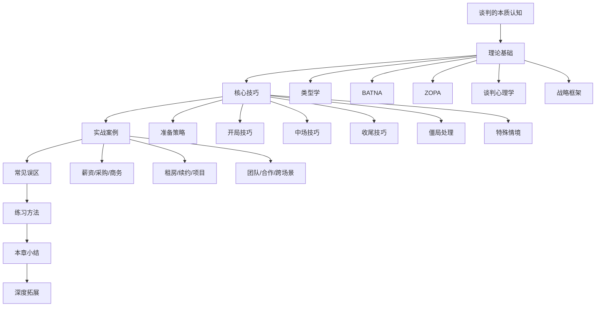
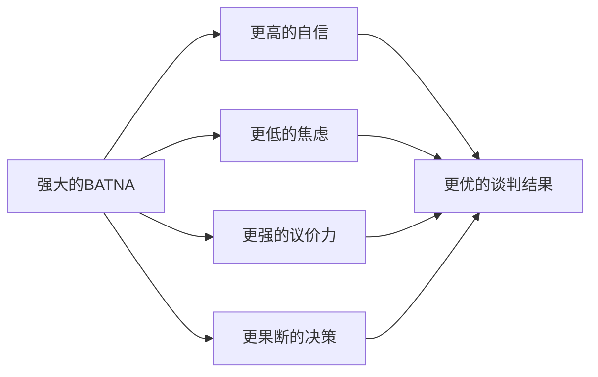
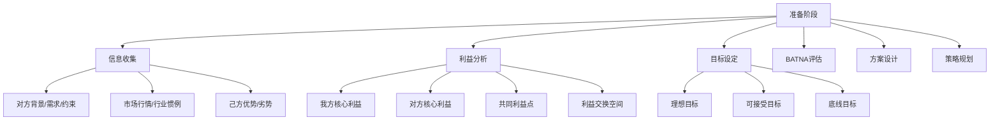
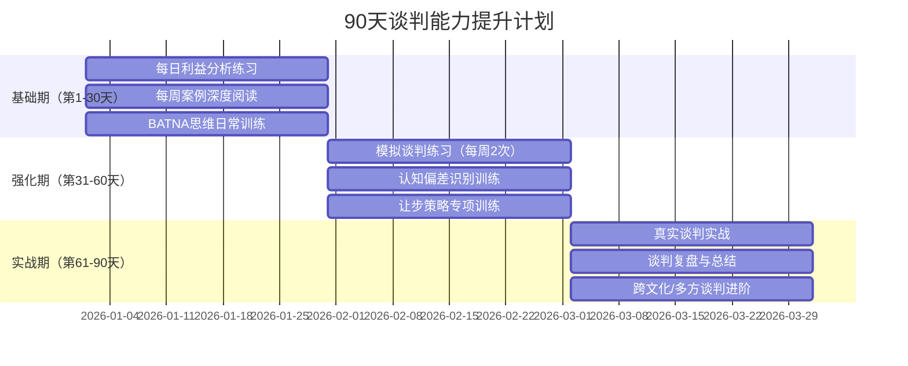

# 第七章 谈判技巧：本章小结

本章从谈判的本质认知出发，系统构建了从理论到实战的完整知识体系。本小结不是简单的要点罗列，而是对全章内容的**结构化提炼**与**实战化整合**，帮助读者建立可复用的谈判思维框架，并为后续的能力精进提供清晰路径。

## 一、全章知识脉络总览

整个第七章遵循**道→法→术→器→用**的递进逻辑：

| 层级 | 内容 | 核心问题 |
|------|------|----------|
| 道（本质） | 谈判是价值创造与分配的双重过程 | 谈判到底是什么？ |
| 法（理论） | 类型学、BATNA、ZOPA、心理学 | 谈判的底层逻辑是什么？ |
| 术（技巧） | 准备→开局→中场→收尾→僵局处理 | 具体怎么做？ |
| 器（工具） | 检查清单、模板、分析框架 | 用什么工具辅助？ |
| 用（实战） | 8个典型场景的完整拆解 | 真实场景怎么用？ |

## 二、核心理论框架精要

### 2.1 谈判类型学：三种模式的本质差异

谈判不是铁板一块，不同类型需要截然不同的策略。理解类型学是选择正确策略的前提。

| 维度 | 分配式谈判 | 整合式谈判 | 混合式谈判 |
|------|-----------|-----------|-----------|
| **本质** | 分蛋糕 | 做大蛋糕 | 既做大又分配 |
| **利益关系** | 此消彼长（零和） | 共同增长（正和） | 部分冲突、部分一致 |
| **信息策略** | 保守、策略性披露 | 开放、主动分享 | 选择性披露 |
| **关系取向** | 短期、一次性 | 长期、建设性 | 灵活调整 |
| **典型场景** | 跳蚤市场砍价、一次性采购 | 战略合作、长期供应协议 | 薪资谈判、商务合作 |
| **核心能力** | 议价、施压、信息不对称利用 | 创造性思维、信任建设 | 情境判断、策略切换 |

**实战要点**：现实中绝大多数谈判是混合式的——既有需要分配的固定资源（如价格、数量），也有可以共同创造的增量价值（如付款方式、交付时间、附加服务）。高手的标志是能在分配与整合之间自如切换。

### 2.2 BATNA：谈判力量的真正来源

BATNA（Best Alternative To a Negotiated Agreement，最佳替代方案）是费舍尔和尤里在《谈判力》中提出的核心概念。它回答一个根本问题：**如果这次谈判达不成协议，你最好的退路是什么？**

BATNA的力量机制：

**BATNA评估四步法**：

1. **穷举替代方案**：如果谈判失败，你有哪些选择？逐一列出，不要自我设限
2. **评估可行方案**：剔除明显不可行的选项，对剩余方案进行可行性评估
3. **择优选定**：对可行方案进行综合评估（成本、收益、风险、时间），选定最佳方案
4. **持续强化**：BATNA不是静态的，需要持续投入资源去改善它

**BATNA的策略性运用**：

- **不急于亮出BATNA**：过早暴露会削弱策略价值，但也不要虚构不存在的BATNA
- **了解对方的BATNA**：对方的BATNA决定了他们的底线，了解它能帮你判断让步空间
- **提升BATNA是持续工程**：在谈判开始前就应该投入资源改善BATNA，而非临时抱佛脚

**常见误区**：许多人把"威胁退出"当作BATNA使用，但真正的BATNA是你**实际上已经准备好**的替代方案，而不是口头威胁。如果你说"不答应我就走"，但其实走不了，这不仅不是BATNA，反而会暴露你的弱点。

### 2.3 ZOPA：谈判的空间与边界

ZOPA（Zone of Possible Agreement，协议区间）是买卖双方底线之间的重叠区域。理解ZOPA能帮你回答两个关键问题：**这笔交易能不能成？** 以及 **合理的成交区间在哪里？**

ZOPA的数学表达：

卖方底线 ≤ ZOPA ≤ 买方底线

示例：薪资谈判
- 候选人底线（可接受最低）：月薪 15K
- 公司预算上限：月薪 20K
- ZOPA = [15K, 20K]
- 候选人期望：18K（位于ZOPA内部偏上）
- 如果候选人底线是 22K，则无ZOPA，谈判无法达成

**ZOPA的三种情况**：

| 情况 | 条件 | 结果 | 策略 |
|------|------|------|------|
| 正ZOPA | 双方底线有重叠 | 可以达成协议 | 在ZOPA内争取最优位置 |
| 零ZOPA | 双方底线恰好相等 | 刚好可以达成 | 抓紧成交，不要贪心 |
| 负ZOPA | 双方底线无重叠 | 无法达成协议 | 立即止损，启动BATNA |

**关键洞察**：ZOPA往往不是固定的——通过创造性方案（如改变付款方式、调整交付时间、增加附加条款）可以扩大ZOPA，使原本无法达成的谈判变为可能。这就是整合式谈判的价值所在。

### 2.4 谈判心理学：五个核心认知偏差

谈判桌上的决策并不完全理性，认知偏差深刻影响着每个人的判断。识别这些偏差，既能避免自己犯错，也能在适当时机策略性地引导对方。

| 偏差 | 机制 | 在谈判中的表现 | 应对策略 |
|------|------|---------------|---------|
| **锚定效应** | 第一个数字会"锚定"后续判断 | 谁先出价谁设定了讨论基准 | 主动锚定，用数据支撑你的锚点 |
| **框架效应** | 同样的信息，表述方式不同导致不同判断 | "九折优惠"比"收取10%费用"更受欢迎 | 用对你有利的框架表达提案 |
| **损失厌恶** | 失去的痛苦是获得快乐的2倍 | 人们更怕失去已有的东西 | 将对方的"损失"转化为你的"收获"表述 |
| **确认偏差** | 只关注支持自己观点的信息 | 对不利于自己的论据视而不见 | 主动寻找反对证据，保持开放心态 |
| **沉没成本谬误** | 因为已经投入太多而不愿放弃 | "已经谈了这么久，将就一下吧" | 每次决策只看未来收益，不看过去投入 |

**情绪管理的三层模型**：

1. **觉察**：识别自己的情绪状态——我现在是愤怒、焦虑还是兴奋？情绪的生理信号（心跳加速、手心出汗、语速变快）是最早的预警
2. **暂停**：当情绪升温时，主动叫暂停——"我需要整理一下思路，我们休息10分钟"
3. **调节**：使用具体的调节技术——深呼吸（4-7-8呼吸法）、换位思考（如果我是对方会怎么想）、重新框架（这不是攻击，是商业讨论）

## 三、核心技能体系精要

### 3.1 准备阶段：谈判成功的80%

哈佛商学院的研究表明，谈判结果的80%在正式开始前就已经决定了。准备阶段是整个谈判中最被低估、但最具杠杆效应的环节。

**准备阶段六大模块**：

**三层目标体系的设定逻辑**：

- **理想目标**（Anchor Point）：你最希望达成的结果，是开局报价的基础。设定依据是市场行情+己方独特价值+合理溢价
- **可接受目标**（Target Point）：你认为公平合理的结果，是谈判过程中努力争取的核心区域
- **底线目标**（Walk-away Point）：低于这个标准就启动BATNA退出。设定依据是己方BATNA的价值+机会成本

### 3.2 开局阶段：奠定基调的黄金5分钟

开局阶段的核心任务是**设定议程、建立锚点、营造氛围**。研究表明，开局5分钟内建立的互动模式会持续影响整个谈判进程。

**开局策略矩阵**：

| 情境 | 推荐策略 | 具体做法 | 注意事项 |
|------|---------|---------|---------|
| 己方强、对方弱 | 强势锚定 | 提出较高但合理的要求，主导议程 | 不要过度，留有谈判空间 |
| 双方均衡 | 协作开局 | 共同设定议程，表达合作意愿 | 避免过早暴露底线 |
| 己方弱、对方强 | 价值展示 | 强调己方独特价值，争取时间 | 充分准备，用数据说话 |
| 不确定对方底细 | 试探性开局 | 用开放性问题收集信息 | 多听少说，观察反应 |

### 3.3 中场阶段：推进与博弈的核心战场

中场是谈判中最复杂、时间最长的阶段。核心任务是**信息交换、方案探索、让步管理、僵局突破**。

**让步策略的四个原则**：

1. **递减让步**：每次让步的幅度递减，暗示你正在接近底线。例如：先让1000，再让500，再让200——对方会意识到继续施压的收益在递减
2. **有条件让步**：每次让步都要求对方给予对等回报。"如果我们可以接受这个价格，你们能否将付款周期从30天缩短到15天？"
3. **不急于还价**：收到对方报价后不要立即还价，先表达惊讶或提出疑问，为自己争取思考时间
4. **记录让步轨迹**：明确记录每一次让步，避免在混乱中重复让步或做出不自知的让步

**创造性方案的生成方法**：

当双方陷入固定利益的争夺时，使用以下方法打破僵局：

- **扩大蛋糕**：还有没有其他可分配的资源？时间、数量、服务、独家权、推荐机会
- **不同偏好交换**：对方更看重什么？你更看重什么？用你不太在意的换取你非常在意的
- **未来期权**：如果现在无法达成一致，可以设定一个试用期或阶段评估节点
- **切割与重组**：将一个大议题拆成多个小议题，每个小议题的ZOPA可能不同

### 3.4 收尾阶段：锁定成果的关键三步

谈判的最后阶段容易功亏一篑。许多优秀的谈判因为收尾不当而失去成果。

**收尾三步法**：

1. **总结确认**：逐一复述已达成的共识，确保双方理解一致——"让我确认一下我们刚才达成的几点共识……"
2. **书面锁定**：将口头协议尽快转化为书面文件，哪怕是简单的备忘录——"我先把今天谈的要点整理一份会议纪要，发给您确认"
3. **关系维护**：在协议达成后表达对合作关系的重视——"非常高兴我们达成了这个协议，期待后续合作顺利"

### 3.5 僵局处理：五种突破策略

僵局不等于失败，它是谈判过程中的正常现象。处理僵局的关键是**不要把僵局个人化**，而是把它当作需要解决的技术问题。

| 策略 | 适用场景 | 具体做法 | 效果 |
|------|---------|---------|------|
| **暂停冷却** | 情绪升温、双方疲惫 | "我们休息15分钟，喝杯咖啡再继续" | 降低情绪温度，重获理性思考 |
| **换题讨论** | 某个议题卡住 | "这个议题我们先放一放，先讨论另一个" | 跳出死胡同，在其他议题上积累共识 |
| **换人谈判** | 个人关系僵化 | 引入新的谈判代表或上级 | 打破人际僵局，引入新视角 |
| **换法思考** | 双方立场对立 | "我们换一个角度，如果……" | 用假设性问题探索新的可能性 |
| **引入调解** | 双方无法自行解决 | 邀请中立第三方参与 | 借助外部视角打破内部僵局 |

## 四、8大实战场景的核心教训

本章通过8个真实场景的深度分析，提炼出最具迁移价值的实战智慧：

### 4.1 薪资谈判：价值证明是核心

**关键教训**：薪资谈判的本质不是"要钱"，而是"证明你值这个价"。

成功模式：
- **数据化价值呈现**：用具体的业绩数据、项目成果、市场薪资数据支撑你的要求
- **整体薪酬思维**：不要只盯着基本工资——奖金、期权、培训机会、弹性工作、职位晋升路径都是可谈判的
- **时机选择**：在业绩出色或刚完成重要项目时谈判，而非入职前单方面被定价

### 4.2 采购谈判：总成本视角

**关键教训**：最低价不等于最优价。

成功模式：
- **TCO（总拥有成本）分析**：采购价格只是冰山一角——运输、库存、质量风险、交付延迟、售后服务的隐性成本可能远超表面差价
- **长期关系定价**：短期的价格优势如果损害了供应商关系，长期来看可能付出更高代价
- **多供应商策略**：永远保持2-3个合格供应商，这是最强的BATNA

### 4.3 商务合作：利益平衡的艺术

**关键教训**：最好的合作协议是双方都觉得"赚了"。

成功模式：
- **价值创造优先**：先讨论如何把蛋糕做大，再讨论如何分配
- **风险共担机制**：好的合作不是单方面承担风险，而是根据各方能力合理分配
- **退出条款**：在合作开始时就约定退出机制，这不是不信任，而是对双方的保护

### 4.4 跨场景通用原则

从8个案例中提炼的跨场景通用原则：

| 原则 | 说明 | 典型违反场景 |
|------|------|-------------|
| **准备充分** | 80%的结果在准备阶段决定 | 临时上阵、信息不足的谈判 |
| **利益导向** | 关注利益而非立场 | 在价格上死磕而忽略其他可交换项 |
| **BATNA优先** | 先强化退路再上谈判桌 | 没有备选方案就去谈判 |
| **让步有策略** | 每次让步都要有条件、有节奏 | 无条件让步、大步让步 |
| **关系可持续** | 长期关系比单次收益更重要 | 赢了谈判、输了合作 |

## 五、10大误区的深层解析与纠正

误区不仅仅是"知道就好"，每个误区背后都有深层的心理机制和具体的纠正方法：

### 误区1：过度竞争心态——把谈判当打仗

**心理根源**：进化心理学中的"战斗或逃跑"本能，在谈判桌上演变为"我要赢"的冲动。

**危害**：过度竞争导致对方防御性增强、信息封锁、关系破裂，最终可能得到一个"赢了面子输了里子"的结果。

**纠正方法**：
- 在准备阶段就明确：我的目标是达成对我有利的协议，而不是"打败"对方
- 每次感到竞争冲动时问自己："这样做是在帮我达成协议，还是在满足我的ego？"
- 练习使用"我们"而非"你vs我"的语言框架

### 误区2：忽视BATNA——空手上阵

**心理根源**：乐观偏差——"应该能谈成吧"。

**危害**：没有BATNA的谈判者在面对压力时无路可退，被迫接受不利条件。

**纠正方法**：
- 谈判前强制完成BATNA评估清单
- 对BATNA进行时间投入——如果目前BATNA较弱，先花时间去强化它
- 设定明确的"底线触发"条件：低于X就启动BATNA

### 误区3：锚定陷阱——被对方牵着走

**心理根源**：大脑倾向于以第一个接收到的数字为基准进行调整，即使这个数字完全不合理。

**危害**：被对方的高锚点影响，最终成交价偏离合理范围。

**纠正方法**：
- **抢先锚定**：如果你有信息优势，主动提出第一个数字
- **反击锚定**：如果对方先出价，明确指出这个数字不合理，并用数据重新锚定——"根据市场数据，这个行业的均价是……"
- **延迟回应**：不要对锚点立即做出反应，先收集更多信息

### 误区4：情绪化决策——被情绪绑架

**心理根源**：杏仁核劫持——强烈情绪绕过前额叶的理性分析，直接驱动行为。

**危害**：在愤怒时做出不可挽回的让步或威胁，在焦虑时过早妥协，在兴奋时忽略风险。

**纠正方法**：
- 建立情绪觉察习惯：每30分钟做一次内心check-in
- 为高风险谈判设定"冷静期"规则：任何重大决定都延迟至少24小时
- 谈判前进行情绪准备：预演可能的刺激场景及应对方式

### 误区5：信息过度保密——封闭沟通

**心理根源**：信息即力量的本能认知。

**危害**：过度保密导致对方无法理解你的需求，无法找到创造性方案，谈判陷入僵局。

**纠正方法**：
- 区分"需要保密的信息"（底线、BATNA细节）和"应该分享的信息"（偏好、优先级、约束条件）
- 使用"有条件的分享"：先分享一条信息，观察对方反应和回报
- 记住：分享偏好和优先级不等于暴露底线

### 误区6-10：快速纠正指南

| 误区 | 核心问题 | 一句话纠正 | 实操方法 |
|------|---------|-----------|---------|
| **立场固化** | 死守表面立场不放 | 立场是利益的一种表达，换个方式表达同样的利益 | 问自己"为什么我要这个？"三遍，找到根本利益 |
| **过度自信** | 低估对方、高估自己 | 你的对手可能比你准备得更充分 | 强制进行"红队分析"——扮演对方推演最坏情况 |
| **忽略非语言** | 只听内容不看信号 | 对方说"没问题"但双臂交叉、身体后仰，这说明有问题 | 练习"三分听七分看"——观察微表情、肢体语言、语调变化 |
| **时间管理失当** | 被对方操控节奏 | 谁控制了时间，谁就控制了谈判 | 主动设定时间框架："今天我们需要在两小时内达成初步共识" |
| **关系利益失衡** | 要么讨好要么对抗 | 不同情境需要不同的平衡点 | 用"关系-利益矩阵"评估：这次谈判的关系重要性和利益重要性各是多少分？ |

## 六、七条核心原则速查

这七条原则是全章的精髓提炼，建议打印出来放在每次谈判前的准备清单中：

### 原则一：准备决定成败

> "不准备就准备失败。" ——本杰明·富兰克林

准备不仅仅是"想想怎么谈"，而是一个结构化的过程：信息收集→利益分析→目标设定→BATNA评估→方案设计→策略规划→角色演练。每一步都不能省略。哈佛谈判项目的研究显示，准备充分的谈判者比缺乏准备的对手平均多获得20%-30%的利益。

### 原则二：利益重于立场

> "立场是对立的，利益可能是重叠的。"

经典案例：两个人争一个橙子（立场对立），但一个人要橙汁，一个人要橙皮做蛋糕（利益不冲突）。如果没有深入挖掘利益，他们会把橙子切成两半，谁都没有得到最好的结果。每次听到对方的立场时，问一句"您为什么需要这个？"——答案往往是更大的利益空间。

### 原则三：BATNA是力量之源

> "谈判力量不来自你的嗓门大小，而来自你的退路好坏。"

BATNA是你唯一不需要对方同意就能获得的东西。一个强大的BATNA让你在谈判中更从容、更自信、更有耐心。投入资源强化BATNA，其回报率远高于投入资源在谈判技巧本身。

### 原则四：创造价值而非争夺价值

> "优秀的谈判者做大蛋糕，平庸的谈判者分小蛋糕。"

创造性方案的核心是**差异化偏好**——每个人对不同议题的重视程度不同。找出这些差异，用你不太在意的换取你非常在意的，双方都能比"各让一步"获得更好的结果。

### 原则五：关系与利益并重

> "不要为了赢一场战斗而输掉整场战争。"

在一次性谈判中，可以更关注利益；在长期关系中，关系本身就是一种利益。判断标准：这次谈判结束后，你和对方是否还需要合作？如果答案是肯定的，那么关系的价值应该被纳入你的利益计算。

### 原则六：灵活适应情境

> "没有最好的策略，只有最适合当前情境的策略。"

面对不同的对手、议题、文化背景、时间压力，策略需要灵活调整。僵化地使用同一种策略，就像用同一把钥匙开所有的锁。情境判断能力是高级谈判者的核心差异化能力。

### 原则七：持续学习改进

> "每一次谈判都是一堂课，关键是你是否在听课。"

谈判能力不是一蹴而就的，而是通过"实践→复盘→改进→再实践"的循环螺旋上升的。建立谈判日志，记录每次谈判的关键决策、结果和反思，是加速成长的最有效方法。

## 七、系统化训练路径

### 7.1 90天谈判能力提升计划

### 7.2 每日微练习（5-15分钟）

这些练习可以融入日常生活，不需要专门的时间和场地：

| 练习 | 时间 | 做法 | 训练目标 |
|------|------|------|---------|
| 利益分析 | 3分钟 | 看到任何冲突新闻，分析各方的根本利益 | 从立场到利益的思维转换 |
| BATNA思维 | 3分钟 | 面对任何决策，列出至少3个替代方案 | 拓展选择思维 |
| 提问训练 | 5分钟 | 针对一个话题，练习提出5个不同类型的开放性问题 | 提问技巧 |
| 观察练习 | 5分钟 | 在咖啡店、地铁等公共场所观察人际互动，分析非语言信号 | 非语言信号识别 |

### 7.3 每周深度练习（2-3小时）

| 练习 | 时间 | 做法 | 训练目标 |
|------|------|------|---------|
| 案例深度分析 | 60分钟 | 选一个真实谈判案例，用本章框架完整拆解 | 理论应用能力 |
| 模拟谈判 | 60分钟 | 与伙伴进行角色扮演，结束后互相反馈 | 实战技能 |
| 周度复盘 | 30分钟 | 回顾本周的谈判/沟通经历，提炼经验教训 | 反思学习能力 |

### 7.4 进阶训练方向

当基础能力扎实后，向以下方向拓展：

- **多方谈判**：3方及以上的谈判涉及联盟形成、议程操控、利益平衡，复杂度指数级上升
- **跨文化谈判**：不同文化的沟通风格、决策方式、时间观念差异巨大，需要文化智商
- **高压谈判**：危机谈判、时间压力谈判、情绪对抗谈判，需要极强的心理素质
- **数字化谈判**：远程/异步谈判中的新挑战——缺乏非语言信号、注意力分散、技术障碍

## 八、进一步学习资源

### 8.1 经典书单（按深度分级）

**入门级**（建立基础认知）：
- 《谈判力》（Getting to Yes）——费舍尔、尤里：谈判领域的"圣经"，核心概念的源头
- 《优势谈判》（You Can Negotiate Anything）——赫布·科恩：实操性极强的谈判指南

**进阶级**（深化理论理解）：
- 《谈判天才》（Negotiation Genius）——巴泽曼、马尔霍特拉：哈佛商学院的系统化谈判方法论
- 《不妥协的谈判》（Beyond Reason）——费舍尔、夏普：情绪和关系在谈判中的角色

**专业级**（领域深耕）：
- 《关键对话》（Crucial Conversations）——帕特森等：高风险沟通场景的处理框架
- 《影响力》（Influence）——西奥迪尼：说服心理学的六大原理
- 《思考，快与慢》（Thinking, Fast and Slow）——卡尼曼：理解认知偏差的底层机制

### 8.2 相关学科知识

谈判不是孤立的技能，它与多个学科深度交叉：

- **行为经济学**：理解人的非理性决策模式，帮助你预测对方行为并设计更有效的方案
- **博弈论**：理解策略互动的数学模型，尤其在多方谈判和重复博弈中价值巨大
- **社会心理学**：理解群体动态、从众效应、社会认同等，帮助你在多方谈判中管理联盟
- **沟通学**：谈判是沟通的高级形式，倾听、提问、反馈等基本功是谈判的基石

## 结语

谈判是沟通表达的高级形态，是现代社会中每个人必须掌握的核心能力。无论你是职场新人还是资深管理者，无论你面对的是薪资协商、商务合作还是家庭决策，本章提供的理论框架、实战技巧和训练路径都能为你提供系统化的指导。

但知识不等于能力——**谈判能力只能在实践中获得**。从今天开始，把每一次沟通都当作练习谈判的机会：买菜时练习锚定效应，与同事讨论方案时练习利益分析，与家人商量假期计划时练习创造性方案。

优秀的谈判者不是天生的，而是在"准备→实践→复盘→改进"的循环中锻造出来的。保持学习心态，勇于在真实场景中应用，善于从每次经历中提炼经验——你一定能够成为出色的谈判者。

**谈判能力的提升之旅，从每一次有意识的实践开始。**

---

**本章关键词**：谈判技巧、BATNA、ZOPA、谈判心理学、准备策略、开局技巧、中场技巧、收尾技巧、僵局处理、创造性方案、价值创造、关系管理、实战案例、常见误区、认知偏差、情绪管理、让步策略、跨文化谈判、多方谈判

**推荐书目**：
1. 《谈判力》（Getting to Yes）——罗杰·费舍尔、威廉·尤里
2. 《谈判天才》（Negotiation Genius）——马克斯·巴泽曼、迪帕克·马尔霍特拉
3. 《优势谈判》（You Can Negotiate Anything）——赫布·科恩
4. 《关键对话》（Crucial Conversations）——科里·帕特森等
5. 《影响力》（Influence: The Psychology of Persuasion）——罗伯特·西奥迪尼
6. 《思考，快与慢》（Thinking, Fast and Slow）——丹尼尔·卡尼曼
7. 《不妥协的谈判》（Beyond Reason）——罗杰·费舍尔、丹尼尔·夏普
