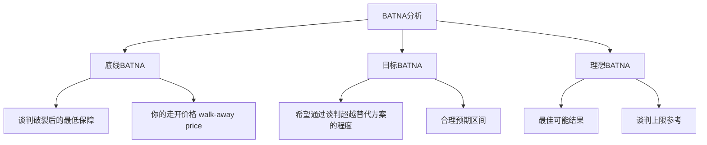
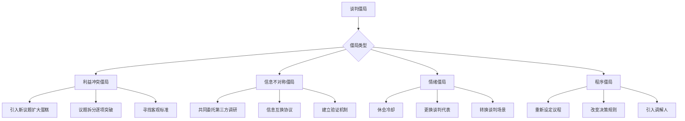
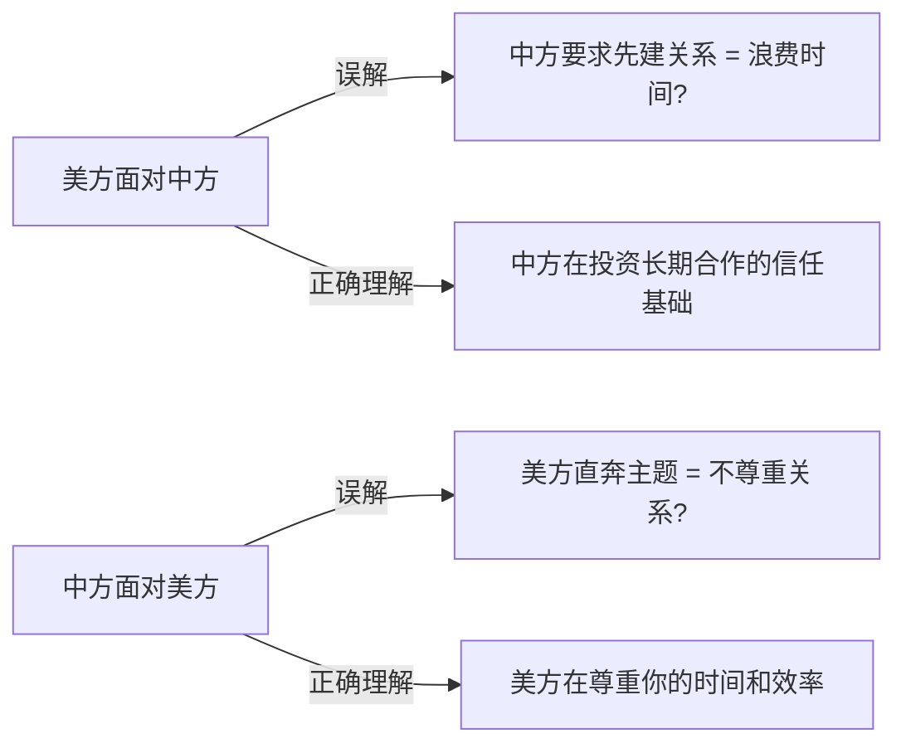
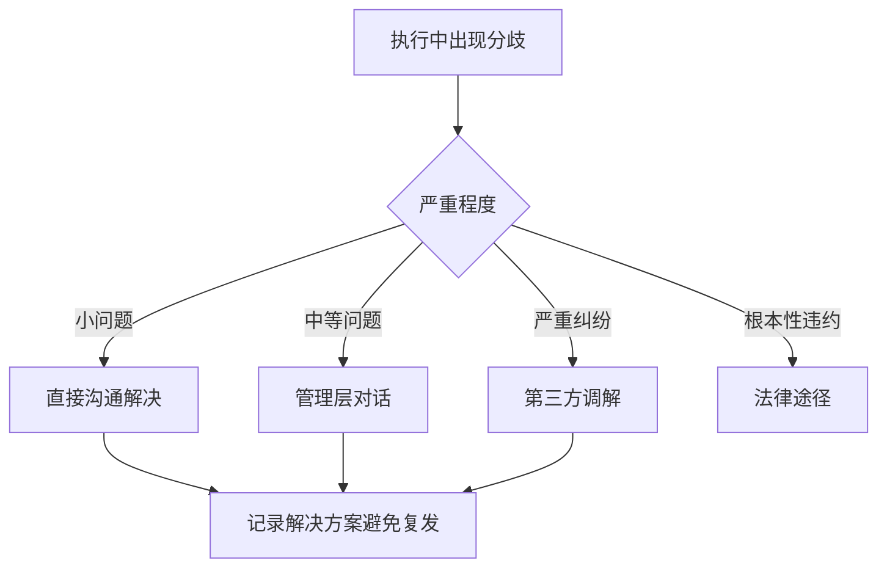
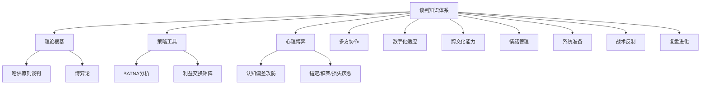

# 第七章 谈判技巧 - 深度拓展

本章深度拓展将从理论根基、策略工具、心理博弈、多方协作、数字化适应、跨文化差异六大维度，对谈判技巧进行系统性深挖。每个维度遵循"原理→方法→实操→案例→误区→进阶"的完整链条，确保道法术器贯通。

---

## 一、哈佛谈判项目的核心发现

哈佛大学谈判项目(Harvard Negotiation Project)是全球最具影响力的谈判研究机构之一，由罗杰·费舍尔(Roger Fisher)和威廉·尤里(William Ury)于1979年创立。该项目的诞生背景是冷战时期的军备谈判——费舍尔观察到美苏谈判中大量"立场之争"导致双方陷入僵局，由此提出"原则谈判"(Principled Negotiation)框架，彻底改变了人们对谈判的认知。

### 1.1 原则谈判的四大支柱

**第一支柱：把人和问题分开(Separate the People from the Problem)**

谈判中最大的误区之一是将对方视为"敌人"。哈佛谈判项目的研究表明，任何谈判都包含两个层面：实质性问题(substantive problem)和关系性问题(relationship problem)。当这两个层面纠缠在一起时，谈判者容易陷入"立场之争"，忽视利益的本质。

**深层机制**：人类大脑在感知威胁时会激活杏仁核，触发"战斗或逃跑"反应。当对方的言辞被大脑解读为"人身攻击"而非"问题讨论"时，前额叶皮层（负责理性思考）的功能会被抑制。这就是为什么情绪化谈判中，双方会做出明知不理性却无法控制的让步或强硬。

**实践策略**：

- **感知检查(Perception Checking)**：不假设对方的意图，而是用"我理解到的是……这准确吗？"来确认
- **问题外化**：将问题与人分离——"我们都面临着同一个挑战"而非"你制造了问题"
- **邀请参与**：让对方成为问题解决的参与者，而非问题的制造者
- **关系缓冲**：在关系层面建立信任，即使在实质问题上存在分歧——比如在谈判间隙分享轻松话题
- **情绪标注**：直接说出你观察到的情绪——"我感觉到这个话题让你有些不舒服，我们是否需要调整讨论方式？"——神经科学研究表明，命名情绪本身就能降低杏仁核的激活程度

**真实案例**：1978年戴维营谈判中，埃及总统萨达特和以色列总理贝京在谈判初期陷入僵局，双方将领土问题与个人恩怨纠缠在一起。美国调解人基辛格采取"穿梭外交"策略，将双方隔离在不同地点，由中间人传递信息，有效将"人"与"问题"分离，最终促成了历史性的和平协议。

**第二支柱：关注利益而非立场(Focus on Interests, Not Positions)**

立场(position)是谈判者明确提出的要求，而利益(interest)是驱动这些要求的深层需求。费舍尔的经典例子是：两个人争一个橙子（立场之争），但一个人需要橙子皮做蛋糕，另一个人需要橙子汁做饮料（利益兼容）。

**挖掘深层利益的系统方法**：

| 方法 | 操作 | 示例 |
|------|------|------|
| 反复追问"为什么" | 通过3-5层追问揭示深层动机 | "为什么这对你很重要？" → "因为我们需要确保供应链稳定" → "为什么稳定比低成本更重要？" |
| 追问"为什么不" | 了解拒绝方案的真正原因 | "为什么不能接受分期付款？" → 发现对方现金流紧张，不是原则问题 |
| 利益图谱绘制 | 将所有利益可视化为网络图 | 画出己方、对方、第三方的利益关系图，找到交叉点 |
| 利益排序 | 了解各项利益的优先级 | 通过试探性提案观察对方反应强度，推断优先级 |
| 利益分类 | 区分实质性利益、过程利益、关系利益 | 对方可能不只关心价格（实质），还关心是否被尊重（关系）、决策过程是否公平（过程） |

**利益的三层结构**：

```mermaid
graph TD
    A[表面立场: "我要降价20%"] --> B[中间利益: "控制预算"]
    B --> C[深层需求: "向老板证明我的谈判能力"]
    A --> D[中间利益: "确保性价比"]
    D --> E[深层需求: "项目不超支就不会被追责"]
    C --> F[元需求: 职业安全感]
    E --> F
```

**第三支柱：创造互利选项(Generate Options for Mutual Gain)**

谈判中最常见的陷阱是"零和思维"——认为一方的收益必然等于另一方的损失。哈佛谈判项目的研表表明，大多数谈判都存在"扩大蛋糕"的可能性，关键在于将"分蛋糕"的思维转变为"做蛋糕"。

**创造选项的四个障碍及应对**：

| 障碍 | 表现 | 应对策略 | 具体操作 |
|------|------|---------|---------|
| 过早判断 | 一提出想法就自我否定 | 先头脑风暴，不评价 | 设定15分钟"禁止批评"规则，只产出不评价 |
| 寻找唯一答案 | 认为只有接受或拒绝 | 强制生成至少5个方案 | 使用"如果……会怎样？"句式强迫扩展思维 |
| 假设固定蛋糕 | 认为利益总量不变 | 探索"扩大蛋糕"的可能性 | 引入新议题、延长合作期限、增加合作维度 |
| 认为对方的问题是对方的事 | 不考虑对方需求 | 设计"给予而不损失"的方案 | 列出"对你成本低但对对方价值高"的选项清单 |

**创造性选项的实操工具——"利益交换矩阵"**：

构建一个矩阵，行是所有可谈判的议题，列是各方对每个议题的偏好强度（1-10分）。找到"你的低优先级 = 我的高优先级"的议题组合，这些就是互惠交换的黄金地带。

例如在薪资谈判中：

| 议题 | 你的优先级 | 对方优先级 | 交换潜力 |
|------|-----------|-----------|---------|
| 基本工资 | 9 | 6 | 低 |
| 签约奖金 | 7 | 8 | 中 |
| 远程办公 | 4 | 9 | **高** |
| 年假天数 | 3 | 7 | **高** |
| 股票期权 | 8 | 5 | 中 |

上表显示：你最不在意的"远程办公"和"年假"恰好是对方最在意的，这些议题上的让步对你成本极低但对对方价值极高。

**第四支柱：坚持客观标准(Insist on Using Objective Criteria)**

当双方陷入分歧时，诉诸客观标准能够避免"意志的较量"(battle of wills)。这不仅让谈判更高效，也让双方都能"保全面子"——"不是我让步了，是数据/标准这么要求的"。

**六大类客观标准**：

1. **市场价值**：同类商品/服务的市场价格、最近成交价
2. **行业标准**：行业惯例、协会推荐标准、ISO等国际标准
3. **法律法规**：相关法律条文、判例法、监管规定
4. **专家意见**：第三方专业评估、审计报告、鉴定结论
5. **先例**：双方以往的交易记录、同行业类似交易
6. **科学数据**：实验数据、统计分析、可量化的绩效指标

**使用客观标准的程序正义**：

不仅要使用客观标准，还要确保标准的**选择过程**是公平的。双方应共同商定使用哪些标准，而非一方单方面强加。具体操作：

- 先就"我们用什么标准来评判"达成一致
- 如果双方提出不同标准，讨论每种标准的合理性和适用性
- 必要时引入双方都信任的第三方来评估标准的适用性

### 1.2 BATNA概念的深远影响

BATNA(Best Alternative to a Negotiated Agreement，最佳替代方案)是哈佛谈判项目最具影响力的概念之一。它重新定义了谈判中的"力量"——真正的谈判力量不在于威胁或施压，而在于拥有良好的替代方案。

**BATNA的三层次模型**：



**BATNA的量化评估方法**：

不要停留在"如果谈不拢我就找别家"这种模糊认知，而要精确计算：

1. **列出所有替代方案**：谈判破裂后你能做的所有事情（不是只有"最好"的那个）
2. **评估每个方案的可行性**：考虑时间成本、金钱成本、成功概率
3. **为每个方案赋值**：用具体数字（金额、时间、质量评分）衡量每个替代方案的价值
4. **确定BATNA**：取可行方案中的最优值——这就是你的底线

**示例**：你正在和供应商A谈判采购价格。你的替代方案有：
- 供应商B报价：¥95/件，交期4周，质量评级B+
- 供应商C报价：¥102/件，交期2周，质量评级A
- 自主生产：¥88/件，但需要6个月建立产线，初始投入¥50万

如果你的项目急需供货，供应商C是你的BATNA（¥102/件）。如果你有6个月时间，自主生产才是BATNA。BATNA不是静态的——它随你的处境而变。

**提升BATNA的策略**：

- **谈判前**：开发多个替代方案，不要"孤注一掷"
- **谈判中**：持续改善替代方案（比如同时和多家供应商接触）
- **信息策略**：适度让对方了解你的替代方案——不是威胁，而是提供信息
- **对方BATNA分析**：评估对方的替代方案，了解其底线在哪里

**BATNA的常见误区**：

| 误区 | 正确认知 |
|------|---------|
| BATNA好就可以傲慢 | BATNA好意味着你可以自信而非傲慢——傲慢会损害关系 |
| BATNA差就只能妥协 | BATNA差时应优先改善替代方案，而非降低谈判目标 |
| BATNA是固定的 | BATNA在整个谈判过程中是动态变化的，需要持续监控 |
| 只看自己的BATNA | 了解对方的BATNA同样重要——它决定了对方的底线 |

### 1.3 谈判力量的七种来源

哈佛谈判项目识别了谈判力量的多种来源，理解这些来源有助于你系统性地增强谈判地位：

| 力量来源 | 本质 | 增强方法 | 注意事项 |
|---------|------|---------|---------|
| 信息力量 | 掌握对方不知道的信息 | 谈判前深入调研，访谈行业人士 | 信息优势是暂时的，要利用窗口期 |
| 专家力量 | 特定领域的专业知识 | 建立个人专业品牌，发表行业观点 | 专家意见需要有据可查 |
| 合法力量 | 基于规则、标准或法律的权威 | 熟悉相关法规、行业标准、合同条款 | 法律力量需要可执行性支撑 |
| 关系力量 | 与对方建立的信任和连接 | 长期维护行业关系网 | 关系力量需要真诚，不能只是利用 |
| 时间力量 | 对时间压力的承受能力 | 提前启动谈判，给自己留时间余量 | 制造虚假紧迫感会损害信任 |
| BATNA力量 | 拥有良好的替代方案 | 持续开发和维护多个替代方案 | BATNA需要可验证，不能虚张声势 |
| 投入力量 | 对方已投入的沉没成本 | 让对方在谈判中逐步投入（分阶段承诺） | 利用沉没成本需注意伦理边界 |

---

## 二、博弈论在谈判中的应用

博弈论(Game Theory)是研究决策者在互动情境中如何做出最优选择的数学理论，由冯·诺伊曼和摩根斯坦在1944年的《博弈论与经济行为》中奠基，后经约翰·纳什等人的发展成为现代经济学的核心工具。它为谈判提供了精确的分析框架和策略工具。

### 2.1 基本博弈模型

**囚徒困境(Prisoner's Dilemma)**

这是最著名的博弈模型，完美诠释了个体理性与集体理性的矛盾：

|  | 合作 | 背叛 |
|--|------|------|
| **合作** | (3, 3) | (0, 5) |
| **背叛** | (5, 0) | (1, 1) |

在一次性博弈中，"背叛"是每个参与者的占优策略(dominant strategy)，尽管双方"合作"会带来更好的总体结果(3,3)优于(1,1)。这一模型解释了为什么许多谈判会陷入僵局或以双输告终——双方都选择了"理性"的背叛。

**囚徒困境在商业谈判中的真实映射**：

想象两家竞争企业在定价谈判中：
- 双方都维持高价：各赚300万（合作,合作）
- 一方降价另一方不降：降价方赚500万，不降方亏100万（背叛,合作）
- 双方都降价：各赚100万（背叛,背叛）

理性计算导致双方都降价，结果是行业利润整体缩水。这就是为什么卡特尔（如OPEC）试图通过协议将博弈从"一次性"变为"重复性"。

**破解囚徒困境的实操策略**：

1. **建立重复博弈关系**：将一次交易变为长期合作，增加未来互动的预期
2. **透明信息分享**：减少信息不对称，让双方都能看到合作的全貌
3. **引入第三方监督**：合同条款、第三方托管、行业监管
4. **建立声誉机制**：在行业中建立"可信赖"的声誉，让背叛的声誉成本高于短期收益
5. **小步试探策略**：先做出小规模合作，观察对方反应，逐步扩大合作范围

**最后通牒博弈(Ultimatum Game)**

在这个博弈中，提议者提出如何分配一笔钱（比如100元），响应者可以选择接受或拒绝。如果拒绝，双方都得不到任何钱。

理性预测：提议者应该只给响应者1元，响应者应该接受任何正数金额。
实际结果：提议者通常会给出40-50%的比例，而响应者会拒绝低于20-30%的分配方案。

**神经经济学解释**：fMRI研究显示，当人们收到"不公平"的分配方案时，大脑中与厌恶情绪相关的脑岛(insula)会被强烈激活，这种"恶心感"驱使人们宁可损失金钱也要惩罚不公平行为。

**对谈判的核心启示**：

- **公平性不是可选项，而是必需品**——即使你提出的方案在经济上"最优"，如果对方认为不公平，他们宁可两败俱伤
- **锚定与公平的博弈**：先报价可以设置锚点，但如果锚点过于极端会引发对方的"公平性警报"
- **分配正义 vs 程序正义**：人们不仅关注结果是否公平，还关注过程是否公平——让对方参与决策过程能显著提升方案接受度

### 2.2 重复博弈与合作演化

罗伯特·阿克塞尔罗德(Robert Axelrod)在1980年代组织了一场著名的计算机锦标赛，邀请博弈论专家提交重复囚徒困境的策略。出乎所有人意料，最简单的策略——"以牙还牙"(Tit-for-Tat)——赢得了比赛。

**"以牙还牙"策略的四个关键特征**：

1. **善良性(Niceness)**：从不首先背叛——这建立了合作的起点
2. **可激怒性(Retaliation)**：对背叛行为立即回应——这防止了被持续利用
3. **宽容性(Forgiveness)**：一旦对方恢复合作，立即原谅——这避免了报复螺旋
4. **清晰性(Clarity)**：行为模式简单明确——这让对方能快速理解你的策略

**进阶变体——"慷慨的以牙还牙"(Generous Tit-for-Tat)**：

原始策略有一个缺陷：在存在噪声（误解）的环境中，双方可能陷入无休止的报复循环。改进版在对方偶尔"背叛"时，有10-30%的概率"忽略"这次背叛，继续合作。这在现实中对应的是"大度一些，不要斤斤计较"。

**在谈判中的具体应用**：

- 谈判开始时采取合作姿态（善意开局）
- 对对方的合作给予对等或略超预期的回报（互惠升级）
- 对对方的机会主义行为做出明确但适度的回应（而非过度报复）
- 如果对方恢复合作，立即回到合作轨道（不记仇）
- 如果误解导致冲突，主动澄清并给予对方"无罪推定"

### 2.3 纳什均衡与谈判僵局

纳什均衡(Nash Equilibrium)是指在给定其他参与者策略的情况下，没有任何参与者有动机单方面改变自己策略的状态。纳什因这一发现获得1994年诺贝尔经济学奖。

在谈判中，僵局往往就是一个纳什均衡——双方都不愿意做出让步，因为任何单方面的让步都会被视为"损失"。比如在价格谈判中，卖方坚持¥100，买方坚持¥80，双方都不愿先让步——这就是一个纳什均衡。

**打破纳什均衡的五种策略**：

1. **改变博弈结构**：引入新的议题——"价格我们暂时搁置，先讨论交期和付款条件"
2. **创造新的选项**：寻找双方都没考虑过的第三方案——"如果我们签两年合同而不是一年呢？"
3. **改变信息结构**：分享新的信息改变对方认知——"我刚得到市场报告，原材料价格下月将上涨15%"
4. **改变时间结构**：设定最后期限制造决策压力——"这个报价本周五之前有效"
5. **引入外部力量**：请双方都信任的第三方调解

### 2.4 谢林点与协调博弈

托马斯·谢林(Thomas Schelling)在《冲突的策略》中提出了"谢林点"(Schelling Point/Focal Point)概念：在没有沟通的情况下，人们倾向于选择那些"显而易见"的协调点。

**在谈判中的应用**：

- **锚定在"自然"的数字上**：整数、半数、行业标准价格更容易被接受
- **利用先例**："上次我们是这样处理的"——先例就是一种谢林点
- **创造共同参照系**：引入双方都认可的第三方标准，使其成为协调点

### 2.5 博弈论的局限性与正确使用姿势

尽管博弈论提供了强大的分析工具，但其在现实谈判中的应用存在明确边界：

| 假设 | 现实 | 对策 |
|------|------|------|
| 完全理性 | 人类决策受情绪、认知偏差影响 | 用博弈论分析框架，但留出"非理性余量" |
| 信息完全或可获取 | 现实中信息严重不对称 | 把信息不对称本身作为博弈变量来分析 |
| 参与者数量明确 | 现实中可能有"隐藏"的利益相关方 | 画出完整的利益相关方地图 |
| 收益可量化 | 很多收益（面子、关系、声誉）难以量化 | 对不可量化的收益给出主观估值 |
| 一次性或有限次博弈 | 现实中多数谈判嵌入长期关系 | 将长期关系的未来价值纳入当前计算 |

**正确使用姿势**：博弈论是谈判策略的"思维训练器"，而非"自动决策机"。用它来系统思考可能的策略组合，但最终决策要结合具体情境、关系动态和直觉判断。

---

## 三、谈判中的认知偏差利用与防御

认知偏差(cognitive biases)是人类决策中的系统性偏差，由丹尼尔·卡尼曼(Daniel Kahneman)和阿莫斯·特沃斯基(Amos Tversky)在1970年代的开创性研究中系统揭示。了解这些偏差不仅能帮助谈判者避免自身犯错，还能在适当的时候利用对方的偏差来获得优势——前提是不跨越伦理边界。

### 3.1 锚定效应(Anchoring Effect)

**原理**：人们在做决策时会过度依赖第一个接收到的信息（"锚"），即使这个信息与决策无关。卡尼曼的经典实验中，让受试者先看到一个随机数字（转盘停在65或10），再估计非洲国家在联合国中的比例——看到65的人平均估计45%，看到10的人平均估计25%。

**在谈判中的表现**：先报价的一方会设置一个"锚"，影响后续的讨价还价过程。康奈尔大学的研究表明，在二手车谈判中，卖方先报价的情况下最终成交价平均高出8-12%。

**进攻策略（主动设锚）**：

- 如果你有信息优势，主动报价以设置有利的锚
- 锚点应"大胆但合理"——极端到足以将谈判区间拉向你，但不至于让对方觉得荒谬而直接终止谈判
- 报价时提供理由——"基于X、Y、Z因素，我们的报价是……"有理由的锚比无理由的锚影响力更强
- 准备多个"锚"，根据对方反应灵活调整

**防御策略（对抗对方的锚）**：

- **识别锚点**：意识到"这是一个锚"本身就是削弱其影响力的第一步
- **重新设锚**：不要在对方的锚点附近讨价还价，而是提出你自己的锚——"我理解你的报价，但根据我的评估……"
- **分解锚点**：将对方的整体报价拆分为各个组成部分，逐项评估
- **延迟回应**：如果对方突然抛出一个极端锚，不要立即回应——"让我先消化一下这个信息"

### 3.2 损失厌恶(Loss Aversion)

**原理**：卡尼曼和特沃斯基的前景理论(Prospect Theory)揭示，人们对损失的敏感度约为对同等收益的2倍。失去100元带来的痛苦约为获得100元带来的快乐的2倍。这一发现为卡尼曼赢得了2002年诺贝尔经济学奖。

**在谈判中的高级应用**：

- **框架转换**：将你的提案框架为"避免损失"而非"获得收益"——"如果我们不达成协议，你将失去……"比"如果你同意，你将获得……"更有说服力
- **让步心理学**：在让步时强调你的"损失"——"我做出这个让步意味着我放弃了……"——这会让对方更珍惜你的让步，并感到有义务回报
- **沉没成本效应**：对方在谈判中投入的时间、精力和已做出的承诺会让他们更不愿意放弃——分阶段谈判、逐步增加对方投入
- **保留效应**：强调对方"已经拥有"的东西可能因谈判失败而失去——"你目前享有的服务水平如果更换供应商可能会下降"

**防御策略**：

- 意识到自己是否因为"害怕失去"而做出不理性决策
- 将每个决策重新框架为"从零开始"——"如果我今天没有这个合作关系，我会选择建立它吗？"
- 区分真实损失和"感觉像损失"——有些"损失"只是没达到预期

### 3.3 框架效应(Framing Effect)

**原理**：同样的信息以不同方式呈现会导致不同的决策。经典实验：描述一种疾病治疗方案为"存活率90%"时，78%的人选择治疗；描述为"死亡率10%"时，只有39%的人选择治疗——数据完全相同。

**谈判中的框架策略**：

| 正面框架 | 负面框架 | 适用场景 |
|---------|---------|---------|
| "这个方案有90%的成功率" | "这个方案有10%的失败率" | 推销你的提案时用正面框架 |
| "接受这个方案你将节省20万" | "不接受这个方案你将损失20万" | 对风险厌恶型对手用负面框架 |
| "这是行业内最优的条件" | "错过这个机会很难再有" | 制造紧迫感时用负面框架 |
| "我们在原方案基础上做了升级" | "我们不得不修改原方案" | 关系敏感时用正面框架 |

**高级框架技巧——"重新定义问题"**：

当陷入僵局时，尝试重新定义问题本身：
- 从"谁该付更多"到"如何分担风险"
- 从"价格是多少"到"价值如何衡量"
- 从"谁先让步"到"我们一起找到公平的方案"

### 3.4 可得性启发(Availability Heuristic)

**原理**：人们倾向于根据最容易想起的信息来判断事件的可能性或重要性。新闻中的飞机失事报道让人高估飞行风险，尽管统计数据表明驾车比飞行危险得多。

**谈判中的应用策略**：

- **提供生动案例**：具体的、有故事性的案例比抽象的数据更容易被记住和引用——"上个月我的一个客户面临同样的情况，他们选择了……结果……"
- **预热信息**：在正式谈判前通过行业媒体或第三方渠道"预热"你希望强调的信息——这样当谈判中提起时，对方会觉得"我也听说过"
- **重复核心信息**：研究表明信息出现3次以上会显著增加其"可得性"——在不同场景中重复你的核心价值主张
- **视觉化数据**：图表比表格更易记，故事比图表更易记——将关键数据转化为视觉化呈现

### 3.5 禀赋效应(Endowment Effect)

**原理**：人们对自己拥有的东西赋予更高的价值。杜克大学的经典实验：获得篮球赛门票的学生平均愿意以$2,400出售，而没有门票的学生平均只愿花$170购买——同一张票，价差14倍。

**在谈判中的高级应用**：

- **"试用"策略**：让对方先体验你的产品/服务/方案——一旦他们产生"拥有感"，放弃的意愿会大幅降低
- **融入对方元素**：在你的提案中融入对方已有的观点或已使用的方案——"这建立在你上次提到的……基础上"
- **交换而非放弃**：在让步时要求对方"交换"而非单方面放弃——"我可以在这个议题上调整，作为交换……"
- **强调已有投入**：提醒对方在现有关系中已获得的好处和已建立的合作默契

### 3.6 确认偏差(Confirmation Bias)

**原理**：人们倾向于寻找、解释和记住支持自己已有信念的信息，而忽略或贬低与之矛盾的信息。这是最难克服的认知偏差之一，因为"你不知道你不知道什么"。

**在谈判中的双面应用**：

**进攻**（利用对方的确认偏差）：
- 了解对方已有的信念和假设
- 将你的方案包装成对方信念的"自然延伸"——"正像你一直强调的……，这个方案恰好……"
- 避免直接挑战对方的核心信念——这只会让他们更坚定

**防御**（避免自己的确认偏差）：
- 主动寻找反驳自己立场的信息
- 指定团队中一人扮演"魔鬼代言人"
- 在谈判前假设"对方可能是对的"，然后寻找证据

### 3.7 其他关键偏差速查表

| 偏差 | 原理 | 谈判应用 |
|------|------|---------|
| 现状偏差 | 人们倾向于维持现状而非改变 | 将改变描述为"微调"而非"革命" |
| 光环效应 | 对某人某方面的好印象扩展到其他方面 | 建立专业形象后，你的方案更容易被接受 |
| 从众效应 | 人们倾向于跟随多数人的选择 | "80%的客户选择了这个方案" |
| 过度自信偏差 | 人们高估自己判断的准确性 | 利用：对方可能高估自己BATNA；防御：为自己的预测留安全边际 |
| 互惠偏差 | 收到好处后感到回报义务 | 先做出小让步，激发对方的互惠心理 |
| 稀缺效应 | 稀缺的东西更有吸引力 | "这个条件只在本次谈判中有效" |

### 3.8 认知偏差的伦理边界

利用认知偏差进行谈判需要谨慎把握伦理边界：

**可接受的**：
- 适度的框架调整——同样的事实，选择更有利于你的呈现方式
- 战略性的信息时机选择——在合适的时机展示信息
- 利用自然存在的偏差——对方因锚定效应做出判断时顺势推进

**灰色地带**：
- 刻意制造虚假锚点
- 利用对方的紧迫感压力
- 选择性呈现数据

**不可接受的**：
- 故意提供虚假信息
- 利用对方的认知障碍（如醉酒、疲劳、情绪崩溃）
- 伪造第三方背书

**底线原则**：如果对方知道了你的策略后会觉得被欺骗，那就越界了。

---

## 四、谈判准备的系统化框架

谈判的胜负往往在坐到谈判桌之前就已经决定了。系统化的准备是区分优秀谈判者和平庸谈判者的关键因素。

### 4.1 PREPARE七步准备法

| 步骤 | 内容 | 具体操作 |
|------|------|---------|
| **P** - 问题(Problem) | 明确谈判涉及的所有议题 | 列出议题清单，区分核心议题和可交换议题 |
| **R** - 研究(Research) | 收集对方和市场的信息 | 调研对方公司、谈判代表、行业数据、先例 |
| **E** - 评估(Evaluate) | 分析各方的利益和BATNA | 画出利益图谱，量化各方BATNA |
| **P** - 选项(Prepare options) | 设计多个可能的方案 | 用利益交换矩阵生成至少5个方案 |
| **A** - 议程(Agenda) | 设计谈判流程和节奏 | 决定先谈什么、后谈什么、何时休会 |
| **R** - 角色(Roles) | 分配团队角色和权限 | 主谈、观察者、记录员、技术顾问 |
| **E** - 应急(Emergency) | 准备应对意外情况 | 设计BATNA激活触发点、退场策略 |

### 4.2 信息收集清单

**关于对方**：
- 公司财务状况、近期新闻、战略方向
- 谈判代表的个人背景、谈判风格、决策权限
- 对方的BATNA（他们还有什么选择？）
- 对方的约束条件（预算限制、时间压力、内部政治）
- 对方过去与其他谈判对手的交易记录

**关于市场**：
- 行业标准价格、常见条款
- 竞争对手的报价和条件
- 法律法规和合规要求
- 市场趋势和预测

**关于自己**：
- 你的BATNA及其可靠性
- 你的让步空间和底线
- 你的核心利益和优先级
- 你的团队的强项和弱项

### 4.3 谈判日剧本(Talk Script)

准备一份"谈判剧本"不是为了机械执行，而是为了在压力下保持策略清晰：

开场（5-10分钟）
├── 寒暄与关系建立
├── 设定积极基调
└── 确认议程

信息交换阶段（15-30分钟）
├── 倾听对方需求（不急于回应）
├── 提出探索性问题
└── 确认理解对方核心利益

提案阶段（20-40分钟）
├── 提出初始方案（含合理锚点）
├── 说明方案背后的逻辑
└── 邀请对方反馈

讨价还价阶段（30-60分钟）
├── 有计划地让步（每次让步要求对等回报）
├── 引入客观标准
└── 识别创造性解决方案

收尾阶段（10-20分钟）
├── 总结已达成的共识
├── 明确下一步行动
└── 确认执行细节

---

## 五、高级谈判战术与反制

### 5.1 经典战术识别与应对

| 战术 | 描述 | 识别信号 | 反制策略 |
|------|------|---------|---------|
| 好人/坏人(Good Cop/Bad Cop) | 一个强硬一个温和，迫使你向"好人"靠拢 | 两个对手态度截然不同 | 识别模式后直接指出，或同时对两人施压 |
| 低价诱饵(Low Ball) | 先给极低价格，后在细节中加价 | 初始报价好得不像真的 | 要求所有条件书面化后再回应 |
| 最后通牒(Ultimatum) | "这是我最后的报价" | "不接受就走" | 测试其真实性——"那我也只能遗憾地终止" |
| 蚕食策略(Salami) | 逐个提出小要求，每次都很"合理" | 频繁出现"小的附加请求" | 在协议前明确"这是最终版本" |
| 虚假紧迫感 | "这个报价只在今天有效" | 制造不合理的时间压力 | 验证紧迫感的真实性，必要时调用BATNA |
| 高球策略(High Ball) | 极端高要求后做"巨大让步" | 初始要求极端，让步幅度大但底线仍然很高 | 立即重新设锚，不被"让步幅度"迷惑 |
| 沉默战术 | 用沉默制造压力 | 对方在你报价后长时间沉默 | 适应沉默，不要因不安而自行降价 |

### 5.2 高级反制策略——"元谈判"技巧

当你识别出对方在使用战术时，最有效的反制往往不是"针锋相对"，而是将"战术使用"本身作为谈判议题：

- "我注意到我们都在使用一些策略来推进谈判。也许我们可以更直接地讨论各自的核心需求？"
- "我们已经在这个价格上讨论了很长时间。让我们暂时搁置数字，先讨论一下什么对你来说真正重要？"

这种"元谈判"(meta-negotiation)——关于"我们如何谈判"的谈判——能够打破战术循环，回到实质性讨论。

### 5.3 僵局突破的系统方法

谈判僵局通常源于四种原因，每种有不同的突破路径：



**具体操作——"议题拆包"技术**：

当一个大的僵局无法突破时，将它拆分为多个小议题：

- 原僵局："总价格谈不拢"
- 拆包后："基础价格"、"付款条件"、"数量折扣"、"附加服务"、"售后保障"
- 效果：每个小议题都有独立的让步空间，总能找到突破口

---

## 六、多边谈判策略

多边谈判(multilateral negotiation)涉及三个或更多参与方，其复杂性远超双边谈判。WTO谈判、企业并购中的多方利益协调、政府部门间的政策制定，都是典型的多边谈判场景。

### 6.1 多边谈判的独特挑战

与双边谈判相比，多边谈判面临四个维度的复杂性升级：

| 维度 | 双边谈判 | 多边谈判 |
|------|---------|---------|
| 关系管理 | 1条关系线 | N×(N-1)/2条关系线（5方=10条） |
| 联盟动态 | 无 | 联盟形成、瓦解、重组不断发生 |
| 议题复杂度 | 两方利益 | 多方利益交织，议题关联性强 |
| 决策机制 | 双方同意即可 | 需要共识/多数决/加权投票等机制 |
| 信息管理 | 双向信息流 | 多向信息流，信息泄露风险高 |

### 6.2 联盟策略

**最小获胜联盟(Minimum Winning Coalition)**：政治学家兰斯菲尔德(Riker)提出的理论——最优策略是形成恰好能够获胜的最小联盟，因为这样每个成员分得的"蛋糕"最大。

**联盟的生命周期**：

1. **识别阶段**：评估各方的利益和优先级，找到共同利益点
2. **组建阶段**：与潜在盟友私下接触，试探合作意愿
3. **巩固阶段**：明确联盟内部的利益分配和协调机制
4. **运作阶段**：在正式谈判中协调立场和策略
5. **调整阶段**：根据谈判进展调整联盟组合
6. **解散/转型阶段**：谈判结束后联盟的退出或转型

**联盟管理的五个关键原则**：

- **互惠**：确保每个联盟成员都获得与其贡献匹配的收益
- **透明**：联盟内部保持信息通畅，减少猜疑
- **灵活**：联盟成员可能因为形势变化而调整立场，要留有余地
- **退出**：为联盟成员提供"体面退出"的路径
- **保密**：联盟策略对外保密，但在联盟内部不过度隐瞒

### 6.3 议题交易(Issue Linkage)

多边谈判中最重要的策略之一是议题交易——将多个议题捆绑在一起，使每个参与者都能在自己最关心的议题上获得收益。

**操作示例**：一家企业同时与三家供应商谈判整体采购协议：

| 议题 | 供应商A | 供应商B | 供应商C |
|------|---------|---------|---------|
| 电子元器件 | ★★★核心业务 | ★一般 | ★★副业 |
| 包装材料 | ★一般 | ★★★核心业务 | ★一般 |
| 物流服务 | ★一般 | ★一般 | ★★★核心业务 |

最优策略：将三个议题捆绑，要求每家在自己核心业务上给出最优价格，换取另外两个议题的非最优地位——三家都赢。

### 6.4 主席国/调解者角色

在多边谈判中，调解者或"主席国"扮演着结构性力量角色：

- **议程权力**：决定讨论顺序——先谈容易达成共识的议题能建立"动量"
- **信息桥梁**：在各方之间传递信息，帮助澄清误解
- **方案设计者**：提出折衷方案——因为调解者"没有利益立场"，其提案更容易被接受
- **节奏管理者**：决定何时加速、何时休会、何时施加时间压力
- **公平守护者**：确保小方的声音被听到，防止强势方主导

### 6.5 多边谈判的实用框架

**"同心圆"模型**：

内圈：直接利益相关方（参与谈判的核心成员）
中圈：间接利益相关方（受影响但不直接参与的组织/个人）
外圈：观察者和公众（媒体、行业分析师、社会舆论）

策略差异：内圈用直接谈判，中圈用咨询和信息分享，外圈用公共沟通和关系管理。

**"议题树"模型**：将复杂议题分解为子议题树状结构，每个分支可以有不同的参与方、时间表和决策机制。例如"国际贸易协议"可以分解为"关税"、"知识产权"、"服务贸易"、"争端解决"等子树。

**"阶段化"模型**：将谈判分为准备阶段（双边接触）、探索阶段（多方会议）、聚焦阶段（关键议题突破）、收尾阶段（协议文本定稿）。

---

## 七、在线谈判的特殊考量

数字化时代改变了谈判的进行方式。麦肯锡2023年的研究显示，B2B商业谈判中超过60%的前期沟通通过线上完成，而在疫情后这个比例进一步上升。

### 7.1 在线谈判的结构性优劣势

| 维度 | 优势 | 劣势 | 应对策略 |
|------|------|------|---------|
| 信息 | 电子通信自动记录，可反复查阅 | 文字缺乏语调，易产生误读 | 重要信息用视频确认 |
| 时间 | 异步沟通允许更多思考时间 | 决策节奏可能被拖延 | 设定明确的回复期限 |
| 情绪 | 文字缓冲减少冲动反应 | 难以读取对方真实反应 | 定期安排视频"温度检查" |
| 成本 | 无需差旅，地理不限 | 技术故障可能中断沟通 | 准备备用沟通渠道 |
| 注意力 | 可同时查阅资料辅助决策 | 多任务处理降低专注度 | 关键议题要求开摄像头 |

### 7.2 渠道选择决策矩阵

不是所有谈判议题都适合同一种沟通渠道：

| 议题类型 | 最佳渠道 | 次选渠道 | 不推荐 |
|---------|---------|---------|--------|
| 高复杂度+高情感 | 视频会议 | 电话 | 邮件 |
| 高复杂度+低情感 | 视频会议 | 共享文档协作 | 即时消息 |
| 低复杂度+高情感 | 电话 | 视频 | 邮件 |
| 低复杂度+低情感 | 邮件 | 即时消息 | 视频会议 |
| 正式协议签署 | 电子签名平台 | 邮件确认 | 即时消息 |

### 7.3 在线谈判的策略调整

**增强虚拟存在感**：

- 使用高质量音视频设备（这是投资而非花费）
- 优化灯光（面部前方45度柔光）和背景（简洁、专业）
- 保持"虚拟眼神接触"——看着摄像头而非屏幕
- 使用手势和面部表情增强表达力
- 穿着与面谈时一样正式——心理学研究表明着装影响自信和说服力

**异步谈判策略**：

- 写邮件前先列提纲，确保逻辑清晰——对方读邮件时你不在场，无法即时澄清
- 使用"24小时冷却规则"——不在情绪激动时发送邮件
- 结构化格式：标题→背景→方案→理由→行动项→时间线
- 每封邮件末尾明确下一步行动和回复期限

**在线谈判中的信任建设**：

- 正式谈判前安排一次非正式的视频聊天——"把人当人看"
- 适度的自我披露——分享个人背景、兴趣，建立人格化连接
- 遵守每一个承诺，无论多小——在线环境中信任的建立更慢、破坏更快
- 使用视频而非仅音频——看到人脸能激活信任的神经回路
- 共享屏幕展示数据和方案——透明度建立信任

### 7.4 混合谈判（线上+线下）的节奏管理

现代谈判越来越多采用混合模式——前期线上沟通，关键节点线下会面，后续线上跟进。

**最佳实践**：

1. 信息收集和初步接触：线上（高效、低成本）
2. 关系建立和核心议题讨论：线下（信任建立、非语言信息）
3. 细节确认和文档化：线上（可追溯、精确）
4. 最终签约：线下或正式电子签名（仪式感、法律效力）

---

## 八、跨文化谈判的深层差异

文化差异对谈判风格有深远影响。理解这些差异不是为了"套路化"不同文化的人，而是为了更好地理解和适应不同的谈判风格。人类学家爱德华·霍尔(Edward Hall)指出："文化就像水对鱼——我们浸泡其中，很少意识到它的存在。"

### 8.1 霍夫斯泰德文化维度与谈判

荷兰社会心理学家吉尔特·霍夫斯泰德(Geert Hofstede)通过大规模跨文化研究，提出了六个文化维度。每个维度都直接影响谈判风格：

**权力距离(Power Distance)**：

- 高权力距离文化（中国、印度、马来西亚）：谈判团队中等级分明，最终决策权在高层，低层成员可能不敢当场表态
  - 策略：确认对方的决策链，确保关键决策者在场或已授权
- 低权力距离文化（北欧、以色列、澳大利亚）：谈判团队成员有更大自主权，扁平化决策
  - 策略：任何团队成员都可能做出承诺，重视每个人的意见

**个人主义vs集体主义**：

- 个人主义文化（美国、英国、澳大利亚）：关注个人利益和成就，个人可以独立做出承诺
  - 策略：直接与决策者对话，关注其个人KPI和动机
- 集体主义文化（日本、韩国、中国）：关注群体和谐和面子，决策需要内部共识
  - 策略：给予对方时间进行内部协商，不要在公开场合制造"对人"的压力

**不确定性规避(Uncertainty Avoidance)**：

- 高不确定性规避文化（德国、日本、法国）：偏好详细的合同和明确的条款，风险厌恶
  - 策略：准备详尽的合同文本、风险分析和应急预案
- 低不确定性规避文化（英国、美国、新加坡）：接受模糊性和灵活性，愿意在不确定性中行动
  - 策略：框架合同、灵活条款、"先做起来"的思路

**长期导向vs短期导向**：

- 长期导向文化（中国、日本、韩国）：重视关系建设，愿意牺牲短期利益换取长期合作
  - 策略：投资关系建设，展示长期合作意愿，不要急于"一锤子买卖"
- 短期导向文化（美国、英国、尼日利亚）：关注即时结果和量化指标
  - 策略：用数据和ROI说话，设定明确的时间表和里程碑

### 8.2 高语境vs低语境沟通

爱德华·霍尔(Edward Hall)提出的高语境/低语境概念是跨文化谈判中最具实操价值的框架之一：

**高语境文化**（中国、日本、韩国、阿拉伯国家、拉丁美洲）：

- 信息大量依赖语境、非语言暗示和关系背景
- "是"可能意味着"我听到了"/"我会考虑"而非"我同意"
- 直接拒绝被视为不礼貌，常用"这很困难"代替"不"
- 关系先于交易——先做朋友，再做生意
- 沉默可能是深思，不是尴尬

**低语境文化**（美国、德国、北欧国家、荷兰）：

- 信息主要通过明确的语言传递
- "是"意味着"是"，"不"意味着"不"
- 直接表达被视为诚实和高效
- 交易先于关系——先确认商业可行性，再建关系
- 沉默通常被解读为没有意见或不舒服

**实际操作建议**：

与高语境文化谈判时：
- 学会"听弦外之音"——注意语气、停顿、眼神、身体语言
- 不要逼迫对方当场给明确答复
- 投资非正式社交时间（饭局、茶叙）
- 通过中间人传递敏感信息

与低语境文化谈判时：
- 直接表达你的需求和底线
- 用书面形式确认口头承诺
- 不要过度解读对方的直率——这不是不友好
- 用数据和逻辑支撑你的立场

### 8.3 面子与关系的深层文化逻辑

在东亚文化中，"面子"(face)是谈判中的核心概念。面子不仅关乎个人尊严，更关乎社会地位和人际关系网络。社会学家胡先缙将面子分为"脸"(道德品质)和"面子"(社会声望)两个维度。

**面子管理的四大策略**：

1. **避免公开冲突**：不同意见私下沟通，公开场合维护对方形象
2. **互惠面子**：在适当场合给予对方"面子"（赞扬、请教、尊重头衔），建立互惠关系
3. **间接表达异议**：使用"我很认同您的方向，有一个小细节想请教……"而非"我不同意"
4. **中间人缓冲**：敏感信息通过中间人传递，为双方保留回旋余地

**"关系"(Guanxi)的运作逻辑**：

关系不是简单的"人脉"，而是一种基于互惠义务的社会资本网络：
- 关系是长期投资——今天的小帮助换取未来的大回报
- 关系需要维护——节日问候、适时联络、帮忙介绍
- 关系有"账户"——只有存入（帮忙）才能取出（请求帮助）
- 关系可以传递——A可以将你介绍给B，这相当于A为你"担保"

### 8.4 时间观念的差异

**单线性时间观(Monochronic)**（美国、德国、瑞士、北欧）：
- 时间是线性、可分割的资源
- 强调准时、日程表、效率
- "时间就是金钱"
- 一次只做一件事

**多线性时间观(Polychronic)**（中东、拉丁美洲、南亚、非洲）：
- 时间是流动的、弹性的
- 关系比时间表更重要
- 同时处理多件事是常态
- 迟到不一定是不尊重

**在跨文化谈判中**：



**实用建议**：提前了解对方的时间文化，调整你的时间预期。如果你习惯准时而对方文化习惯弹性，准备一些"缓冲时间"和备用活动。

### 8.5 跨文化谈判的准备清单

- [ ] 研究对方文化的谈判风格（但避免刻板印象）
- [ ] 了解对方的决策流程和权限层级
- [ ] 学习基本的问候语和商务礼仪
- [ ] 准备符合对方文化的名片、礼物等商务用品
- [ ] 了解当地的社交禁忌（话题、手势、颜色等）
- [ ] 安排当地顾问或文化中介
- [ ] 准备多种沟通方式（直白版+委婉版）
- [ ] 调整时间预期和决策节奏

---

## 九、情绪管理与谈判心理韧性

谈判不仅是智力的较量，更是情绪的博弈。神经科学研究表明，情绪不是理性的敌人——适当的情绪管理能显著提升谈判表现。

### 9.1 情绪在谈判中的双重角色

**情绪作为信息**：
- 你的焦虑可能在告诉你："这里的风险我还没完全理解"
- 对方的愤怒可能在告诉你："这个议题触及了他的核心利益"
- 你的兴奋可能在告诉你："这个方案对你非常有利——但冷静下来再决定"

**情绪作为工具**：
- 策略性愤怒可以传达"我在这个问题上不会让步"的信号
- 表达失望可以促使对方重新考虑其方案
- 真诚的热情可以感染对方，增强合作意愿

### 9.2 情绪管理的实操技术

**谈判前——情绪预设**：

1. **心态校准**：谈判前花5分钟可视化最佳结果和最差结果——研究表明这能降低焦虑约30%
2. **身体准备**：充足的睡眠、适度运动、避免空腹谈判——血糖低时人的决策能力下降
3. **角色预演**：与同事模拟可能的困难场景，提前"排练"情绪反应

**谈判中——实时调节**：

1. **呼吸技术**：感到情绪激动时，进行4-7-8呼吸（吸气4秒、屏住7秒、呼气8秒），能在60秒内降低心率和焦虑
2. **暂停策略**：任何一方都可以要求暂停——"让我们休息10分钟"——这不是软弱，是专业
3. **情绪标注**：对自己说"我现在感到愤怒"——神经科学研究表明命名情绪能降低杏仁核激活程度
4. **认知重评**：将对方的强硬行为重新解读为"他在执行他的策略"而非"他在针对我"

**谈判后——情绪复原**：

1. 谈判结束后不要立即复盘——给情绪24小时的"冷却期"
2. 与可信任的人讨论谈判过程（情绪出口）
3. 进行体育运动或其他消耗性活动来释放残留压力

### 9.3 应对高压谈判的心理工具

在极端高压的谈判场景（如危机谈判、重大商业纠纷）中，额外的心理工具：

- **命名恐惧**：写下你最担心的结果，然后评估其实际概率——恐惧被写下来后通常会缩小
- **最坏情况分析**：问自己"最坏的结果是什么？我能承受吗？"——通常答案是"能"
- **锚定在价值上**：提醒自己"我代表的不只是我自己"——这能提升心理承受力
- **找到内在力量**：回忆你过去成功应对压力的经历——"我之前也做到了"

---

## 十、谈判后的系统化复盘与关系维护

谈判不是在签订协议的那一刻结束的。系统化的复盘和持续的关系维护是将单次谈判转化为长期合作价值的关键。

### 10.1 协议执行中的关系管理

**即时跟进（谈判后24小时内）**：

- 发送感谢邮件，表达对合作的积极态度
- 书面确认协议的关键条款和双方承诺——防止"记忆偏差"
- 明确执行时间表、联络人和沟通机制
- 表达对未来合作的期待

**定期联络机制**：

| 时间节点 | 行动 | 目的 |
|---------|------|------|
| 协议执行第1周 | 进度确认 | 确保执行启动顺利 |
| 执行第1个月 | 正式review会议 | 识别早期问题 |
| 每季度 | 关系评估会议 | 维护关系、讨论优化 |
| 重要节日/事件 | 个人化问候 | 维护情感连接 |
| 行业重大变化 | 主动信息分享 | 展示伙伴关系而非纯交易 |

**冲突解决的层级策略**：



### 10.2 系统化复盘框架

每次谈判结束后进行系统化复盘，是提升谈判能力最有效的单一方法。建议在谈判结束后48小时内完成：

**REVIEW复盘法**：

| 维度 | 问题 | 记录 |
|------|------|------|
| **R**esults（结果） | 结果与目标相比如何？ | 量化差距 |
| **E**xpectations（预期） | 有哪些预期之外的情况？ | 意外清单 |
| **V**alidation（验证） | 我的信息/假设哪些是正确的？哪些是错误的？ | 信息验证表 |
| **I**mpact（影响） | 我的哪些策略/行为产生了最大影响？ | 因果分析 |
| **E**volution（进化） | 如果重来一次，我会怎么做？ | 改进清单 |
| **W**orth（价值） | 这次谈判的长期关系价值如何？ | 关系评估 |

### 10.3 从"交易"到"关系"的范式转变

传统谈判关注单次交易的结果，而现代谈判更关注长期关系的建设。这种转变不仅是策略调整，更是思维范式的转变：

| 传统范式 | 关系范式 |
|---------|---------|
| 最大化单次收益 | 最大化长期价值 |
| 信息保密 | 适度信息共享 |
| 赢-输思维 | 共赢思维 |
| 谈判结束=关系结束 | 谈判结束=关系开始 |
| 合同约束 | 信任+合同双重约束 |
| 竞争对手 | 潜在合作伙伴 |

### 10.4 构建谈判能力提升系统

**个人层面**：

- 建立"谈判日志"——每次谈判后记录关键决策和结果
- 每季度回顾谈判日志，识别模式和进步
- 阅读谈判领域经典著作（见推荐书单）
- 参加谈判模拟训练——哈佛PON提供在线课程

**团队层面**：

- 建立团队谈判知识库——收集和分享谈判案例
- 定期进行谈判模拟演练
- 制定团队谈判手册——标准化流程和最佳实践
- 建立"谈判后复盘"的团队文化

**推荐进阶书单**：

| 书名 | 作者 | 核心价值 |
|------|------|---------|
| 《谈判力》(Getting to Yes) | Fisher & Ury | 原则谈判的奠基之作 |
| 《绝不妥协》(Never Split the Difference) | Chris Voss | FBI人质谈判师的实战技巧 |
| 《谈判的艺术》(The Art of Negotiation) | Michael Wheeler | 创造性谈判和即兴能力 |
| 《影响力》(Influence) | Robert Cialdini | 说服力的心理学原理 |
| 《思考，快与慢》(Thinking, Fast and Slow) | Daniel Kahneman | 认知偏差的系统性研究 |
| 《冲突的策略》(The Strategy of Conflict) | Thomas Schelling | 博弈论在冲突中的应用 |

---

## 本章小结

谈判是一门融合了心理学、策略学、沟通学、文化学和博弈论的综合艺术。从哈佛谈判项目的原则方法到博弈论的精确分析，从认知偏差的攻防策略到系统化的准备框架，从高级战术的识别反制到多边谈判的联盟博弈，从在线谈判的适应性调整到跨文化谈判的敏感性培养，从情绪管理的心理韧性到谈判后的复盘与关系维护——每一个维度都需要深入的学习和持续的实践。

本章深度拓展的十个维度构成了一个完整的谈判知识体系：



真正的谈判高手追求三重境界：

1. **技术层**：掌握工具和方法，能在具体谈判中运用策略
2. **思维层**：理解底层原理，能灵活应对未曾预见的情况
3. **哲学层**：追求共赢的智慧，将谈判视为创造价值而非分配利益

希望本章的深度拓展内容能够为你的谈判之路提供系统性的知识框架和可执行的实操工具，帮助你在任何谈判桌上都能从容应对、创造价值。
