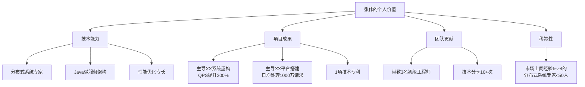
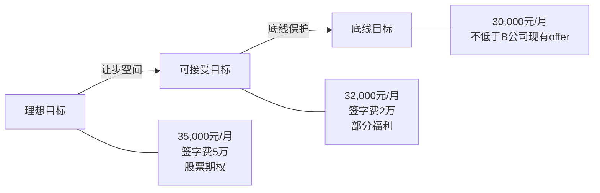
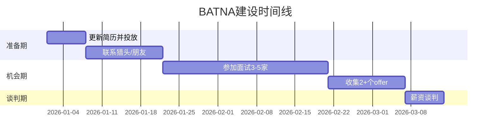

## 案例一：薪资谈判——职场人士的价值实现

薪资谈判是每个职场人士都会面对的核心场景。它不仅关乎收入数字，更是你对自身价值的认知、表达和兑现过程。本案例以一名高级软件工程师的真实谈判为蓝本，完整拆解从准备到收尾的每一步决策逻辑，帮助你掌握薪资谈判的底层方法论。

### 为什么薪资谈判如此重要

很多职场人选择"随缘"或"听公司安排"，认为谈薪资是件尴尬的事。这种心态的代价是巨大的：

| 场景 | 月薪差额 | 10年累计差距（含年度调薪5%） |
|------|----------|-------------------------------|
| 接受初始offer vs 谈判后+20% | 6,000元 | 约94万元 |
| 接受初始offer vs 谈判后+30% | 9,000元 | 约141万元 |

薪资谈判的回报率极高——一次30分钟的对话，可能带来百万级的终身收入差距。更重要的是，入职薪资是后续所有加薪、奖金、股权的基数，"起点效应"会贯穿整个职业生涯。

### 案例背景

张伟，28岁，某互联网公司高级软件工程师，工作经验3年。核心技术栈为Java微服务+分布式系统，月薪25,000元。

**当前处境：**
- 收到另一家知名科技公司（以下简称B公司）的口头offer，月薪30,000元
- B公司的招聘经理在面试中多次暗示"急需该技术栈人才"
- 现任公司（A公司）通过直属领导表达了挽留意愿，但尚未给出具体方案
- 张伟希望争取到35,000元的月薪

**关键约束条件：**
- 行业处于招聘旺季，同级别岗位竞争激烈
- 张伟的分布式系统经验在市场上稀缺，同级别候选人不多
- B公司该岗位的招聘已持续3个月，团队缺人导致项目进度受阻

### 第一阶段：信息收集与分析

谈判的胜负在坐到谈判桌之前就已经决定了80%。信息是谈判的弹药——你掌握的信息越多，你的议价空间越大。

#### 市场薪资调研

张伟通过多个渠道收集了行业薪资数据：

**数据来源与方法：**

1. **招聘平台数据**：在拉勾、Boss直聘上搜索"高级Java工程师"，记录薪资范围
2. **行业报告**：参考猎聘、脉脉发布的年度薪资报告
3. **人脉调研**：通过前同事、校友群了解同级别公司的实际薪资水平
4. **猎头反馈**：与2-3位技术方向的猎头沟通，获取一手市场行情

**调研结果：**

| 公司类型 | 月薪范围 | 中位数 | 备注 |
|----------|----------|--------|------|
| 一线互联网大厂 | 32,000-45,000 | 38,000 | 含绩效浮动部分 |
| 知名科技公司（B公司级别） | 28,000-40,000 | 35,000 | 固定薪资为主 |
| 中型互联网公司 | 22,000-32,000 | 27,000 | 福利差异大 |
| 创业公司 | 20,000-35,000 | 25,000 | 股权补偿占比高 |

> **关键发现**：同级别工程师在B公司这一梯队的薪资中位数为35,000元，B公司给的30,000元低于市场中位数，存在谈判空间。

#### 个人价值盘点

张伟系统梳理了自己的核心价值点：

**价值量化清单（谈判弹药库）：**

每个价值点都需要转化为可量化的数据，因为数字比形容词有说服力100倍：

1. **XX系统重构项目**：将核心系统的QPS从3,000提升到12,000，服务器成本降低40%，每年节省约200万元
2. **XX平台搭建**：从0到1主导建设，日均处理请求1000万，支撑了公司核心业务线的增长
3. **技术专利**：一项分布式缓存相关的发明专利，可直接应用于B公司的业务场景
4. **团队带教**：带教3名初级工程师，其中2人已能独立负责模块，降低了团队的招聘压力

#### 对方信息分析

张伟通过面试过程中的观察和调研，分析了B公司的立场：

**公司侧信息：**
- 该岗位招聘已3个月，面试了约20人，只有2人进入终面
- 团队因缺人导致Q2的项目延期，业务方有压力
- B公司近期完成了一轮融资，财务状况良好
- 该技术栈（分布式系统+Java微服务）在B公司内部属稀缺资源

**HR侧信息：**
- HR有月度招聘KPI压力，该岗位是重点HC
- HR的薪资审批权限为30,000-35,000元，超过35,000元需要总监审批
- HR倾向于快速关闭该岗位，减少招聘周期

> **关键判断**：B公司有真实的紧迫需求，且HR有一定审批空间，谈判窗口是打开的。

#### BATNA分析

BATNA（Best Alternative To a Negotiated Agreement，最佳替代方案）是谈判力量的根本来源。张伟的BATNA矩阵如下：

| 替代方案 | 可行性 | 质量评分 | 说明 |
|----------|--------|----------|------|
| A公司继续工作 | 高 | 6/10 | 薪资偏低但稳定，领导器重 |
| B公司现有offer（30K） | 高 | 7/10 | 平台更好，薪资有提升空间 |
| C公司（另一家面试中） | 中 | 5/10 | 还在二面，不确定性高 |
| 猎头推荐的其他机会 | 中 | 6/10 | 有2个正在接触的岗位 |

**BATNA强度评估：中上** —— 有确定的offer保底，同时有其他机会在推进，不会被迫接受任何不合理条件。

### 第二阶段：目标设定与策略规划

#### 三层目标体系

没有明确目标的谈判就像没有导航的驾驶——你可能会到达某个地方，但大概率不是你想去的地方。

**设定原则：**

1. **理想目标要有依据**：不是拍脑袋的数字，而是基于市场中位数（35K）和自身价值溢价
2. **可接受目标要有弹性**：在理想和底线之间留出让步空间，让对方有"赢"的感觉
3. **底线目标要守住**：低于底线宁可不谈，因为糟糕的协议不如没有协议

**注意：底线目标绝对不能泄露给对方。** 如果HR知道你的底线是30K，他们最多给到30K。

#### 谈判策略规划

| 策略 | 具体方法 | 心理学原理 | 执行要点 |
|------|----------|------------|----------|
| 锚定策略 | 先报38,000元 | 锚定效应：第一个数字会影响整个谈判的参照点 | 语气自信但不傲慢，给出合理依据 |
| 价值前置 | 谈钱之前先展示价值 | 互惠原则：先给予再索取 | 用具体数字和案例说话 |
| 竞争暗示 | 暗示有其他选择 | 稀缺性效应：越稀缺越有价值 | 不要具体说是谁，保持模糊 |
| 创造性方案 | 突破预算用签字费/期权补偿 | 框架效应：换一种方式呈现同样价值 | 准备2-3种组合方案 |
| 时间压力 | 适当表达有时间限制 | 紧迫感促使决策 | "另外一家在等我回复" |

#### 应对预案

提前准备对方可能的反对意见和应对方式：

**预案一：HR说"超出预算"**
- 应对：表达理解，但用市场数据证明薪资合理性
- 话术："我理解公司有预算框架。不过根据我的调研，这个level的市场中位数是35K，我相信公司给出的薪资应该具有市场竞争力。"

**预案二：HR说"我们给不了这么高"**
- 应对：转向创造性方案
- 话术："薪资结构我们可以灵活讨论。如果基本薪资有上限，签字费、期权、或者签约奖金是否可以考虑？"

**预案三：HR说"你才3年经验"**
- 应对：用成果而非年限衡量价值
- 话术："我理解经验年限是一个参考维度。不过我相信公司更看重的是能解决什么问题——我主导的系统重构直接带来了200万的成本节约。"

**预案四：HR施压"这个offer有时效"**
- 应对：保持冷静，不要被时间压力绑架
- 话术："我非常重视这个机会，也希望尽快确定。不过这是个重要决定，我需要2-3天综合考虑。"

### 第三阶段：谈判实录与解析

#### 开局——锚定与价值展示

张伟选择在收到口头offer后的第二天进行正式谈判，通过电话+邮件的方式。

**张伟的开场白（逐句解析）：**

> "感谢贵公司和面试团队对我的认可，我也非常期待能加入团队。"
>
> *（先表达善意和兴趣，建立积极的谈判氛围）*
>
> "在讨论具体薪资之前，我想先确认一下我对这个岗位的理解——团队目前最紧迫的需求是分布式系统的架构升级和性能优化，对吗？"
>
> *（通过提问确认对方痛点，为后续的价值展示做铺垫）*
>
> "基于我在分布式系统方面6年（含实习）的深度经验，以及我之前在类似规模系统上的优化成果——将QPS从3,000提升到12,000、每年节省约200万服务器成本——结合目前的市场行情，我期望的薪资是税前38,000元。"
>
> *（锚定高位，同时给出具体的价值依据，让锚点不显得突兀）*

**为什么锚定38K而不是35K？**

谈判学中有个经典原则：**锚点要高于你的实际期望，给双方留出谈判空间。** 如果张伟直接报35K，最终很可能谈到32K。锚定38K，即使被压下来，大概率也能落在33-35K区间。

锚定效应示意：

张伟报38K ——HR压到32K——张伟坚持35K——最终达成33K+签字费
张伟报35K ——HR压到30K——张伟坚持33K——最终达成31K
张伟报30K ——HR说"好的"——没有谈判空间

#### 中场交锋——价值坚守与灵活让步

**第一轮：HR回应**

> HR："张伟，我们非常认可你的能力。不过38K确实超出了这个岗位的预算范围。我们能给到的最高预算是32K。"

**张伟的应对（逐层解析）：**

> "我理解公司的薪资体系有框架。不过我想分享几个信息供您参考——"
>
> *（不直接对抗，而是用信息影响对方判断）*
>
> "第一，我注意到这个岗位已经招聘了一段时间，团队目前的项目进度因为人手不足有一定延迟。如果我能快速到岗并解决分布式系统的问题，这个价值是远超几千元的月薪差额的。"
>
> *（暗示紧迫性 + 价值 > 价格）*
>
> "第二，根据我了解的市场行情，3年经验的高级分布式系统工程师，行业薪资中位数在35K左右。我相信B公司作为行业头部企业，薪资应该对标市场中位数以上。"
>
> *（用市场数据校正对方的锚点）*
>
> "第三，我目前也收到了其他公司的offer，综合条件和贵公司接近。但我个人更倾向于加入贵公司，因为技术方向更匹配。所以我也希望在薪资上能有一个双方都满意的结果。"
>
> *（暗示竞争 + 表达诚意，让对方知道你不是在漫天要价）*

**谈判心理学要点：**

张伟的回应体现了三个关键原则：
1. **不对抗**：没有说"32K太低了"，而是"我分享几个信息供参考"
2. **用事实说话**：市场数据、项目成果、竞争态势，都是客观信息
3. **给对方台阶**：承认对方的难处，同时提供决策依据

**第二轮：HR试探底线**

> HR："35K确实很难批。你看这样，32K加上年终奖大概4个月，综合年薪也不低了。"

**张伟的应对：**

> "年终奖确实是有吸引力的部分。不过年终奖的不确定性比较大，受公司业绩和个人绩效评估影响。我更希望在固定薪资上能有一个让我安心的数字，这样我也能更全身心地投入工作。"
>
> *（不被模糊的承诺替代确定的收入——年终奖变数大，不能算作确定性收入）*
>
> "我想提一个方案供您参考——如果基本薪资能达到33K，加上2万元的签字费，我可以接受。"

#### 创造性方案——突破预算约束

当双方在数字上陷入僵局时，创造性方案是打破僵局的关键。

**张伟的折中方案拆解：**

| 薪酬组成 | 公司视角 | 张伟视角 |
|----------|----------|----------|
| 基本月薪33K | 在32K预算上小幅上浮，可报批 | 接近可接受目标，有面子 |
| 签字费2万 | 一次性成本，不影响后续薪资基数 | 实打实的现金收入 |
| 第一年后股票期权 | 延迟支出，绑定人才 | 长期收益，看好公司发展 |

**为什么签字费是好方案？**

签字费（Signing Bonus）在薪资谈判中是一个"万能解药"：
- 对公司：一次性支出，不进入薪资基数，不影响后续年度加薪
- 对个人：到手现金，确定性高
- 对谈判：打破了"月薪"这个单一维度的僵局

#### 收尾——确认细节与书面化

最终达成的协议：

| 项目 | 金额/条件 | 备注 |
|------|-----------|------|
| 基本月薪 | 33,000元（税前） | 高于初始offer 10% |
| 签字费 | 20,000元 | 入职满1个月后发放 |
| 股票期权 | 第二年授予 | 具体数量待HR确认 |
| 年终奖 | 2-4个月 | 根据绩效评定 |
| 试用期薪资 | 100%发放 | 非80% |

**关键收尾动作：**

1. **电话确认后立即发邮件**：将口头达成的协议以书面形式发给HR确认
2. **邮件模板**：
   主题：薪资方案确认 - 张伟 - 高级软件工程师

   XX您好，

   感谢今天的沟通。以下是我理解的薪资方案，请确认：

   1. 基本月薪：税前33,000元/月
   2. 签字费：20,000元（入职满1个月后发放）
   3. 股票期权：入职第二年授予（具体数量另行确认）
   4. 年终奖：2-4个月，根据绩效评定
   5. 试用期：3个月，薪资100%发放

   如有出入请指正。期待收到正式offer letter。

   张伟
3. **等正式offer letter再做最终决定**：口头承诺不算数，一切以书面offer为准
4. **不要立即接受**：收到正式offer后，表达感谢并要求1-2天考虑时间

### 第四阶段：关键技巧深度解析

#### 锚定效应的正确使用

锚定效应（Anchoring Effect）是诺贝尔经济学奖得主丹尼尔·卡尼曼提出的认知偏差。人类在做判断时，会过度依赖第一个接触到的信息（锚点）。

**正确用法：**
- 锚点要高于你的期望值15%-25%
- 锚点要有合理依据（市场数据、个人价值）
- 语气自信但不傲慢
- 给出锚点后停顿，让对方先回应

**错误用法：**
- 锚点离谱（报50K期望30K）——失去可信度
- 没有依据（"我觉得我值这个价"）——缺乏说服力
- 语气强硬（"低于这个免谈"）——破坏谈判关系

#### BATNA的建设与运用

BATNA不是到了谈判桌上才有的——它需要提前几个月建设。

**BATNA建设时间线：**

**BATNA运用的分寸：**

- **可以暗示**："我目前也在和其他几家公司沟通"、"对方给的方案也不错"
- **不要威胁**："你不给我就去别家"——这会直接终止谈判
- **不要撒谎**：编造不存在的offer，一旦被识破会彻底失去信任
- **不要详述**：不要说具体公司名和具体数字，保持信息优势

#### 价值展示的STAR法则

在薪资谈判中展示价值，推荐使用STAR法则：

| 要素 | 含义 | 示例 |
|------|------|------|
| **S**ituation | 当时的情境 | "公司核心系统的QPS只有3,000，无法支撑业务增长" |
| **T**ask | 你的任务 | "我负责主导系统的架构重构" |
| **A**ction | 你的行动 | "我设计了分布式缓存方案，引入了消息队列做异步处理" |
| **R**esult | 量化结果 | "QPS从3,000提升到12,000，服务器成本降低40%，年节省200万" |

> **关键：Result必须是量化的数字。** "提升了系统性能"远不如"QPS从3,000提升到12,000"有说服力。

#### 让步策略

谈判中的让步不是示弱，而是策略。

**让步的四条规则：**

1. **不要第一次就让步**：对方报低后你直接降价，说明你的初始报价有水分
2. **每次让步幅度递减**：第一次让2K，第二次让1K，第三次让500——递减幅度暗示你正在接近底线
3. **每次让步都要交换条件**："如果基本薪资我可以让步到33K，那签字费是否可以增加？"
4. **让步要慢，不要爽快**：即使你能接受33K，也要表现出"这个数字我需要考虑一下"

**本案例中张伟的让步轨迹：**

38,000 → 35,000(市场数据支撑) → 33,000(换取签字费+期权)
每一步都有明确的交换条件，而不是无条件退让

### 常见薪资谈判误区

#### 误区一：先报期望薪资的人吃亏

**真相**：在信息不对称的谈判中，谁先出价谁就设定了锚点。如果你的锚点高于对方预期，先报价反而有利。关键是你的报价要有依据、有底气。

#### 误区二：HR说什么就是什么

**真相**：HR的"预算上限"很多时候是谈判策略，不是真正的硬限制。公司有正常的审批流程，特殊情况可以特批。但要通过展示价值来争取特批，而不是硬要求。

#### 误区三：谈薪资会让人觉得"太物质"

**真相**：专业、有理有据的薪资谈判反而会让HR和用人经理觉得你成熟、职业。真正令人反感的是没有依据的狮子大开口，或者威胁式的谈判方式。

#### 误区四：拿到offer就该感恩，不该再谈

**真相**：公司给你offer说明你通过了面试、他们需要你。这时候双方是对等的。拿到offer后的薪资谈判是正常的商业行为，不必觉得亏欠。

#### 误区五：只关注月薪数字

**真相**：总薪酬（Total Compensation）包含月薪、年终奖、签字费、股票期权、福利补贴、社保公积金基数等多个维度。月薪30K+4个月年终奖，可能比月薪33K+2个月年终奖更优。

#### 误区六：谈完薪资就结束了

**真相**：薪资确认后还要关注试用期薪资比例、试用期时长、报到时间、竞业协议、年假天数等细节。这些都可能影响你的实际收入和工作体验。

### 不同场景的策略调整

#### 场景一：应届生首次谈薪

应届生的议价空间相对有限，但仍可以通过以下方式争取：
- 用实习转正的绩效数据说话
- 对比同届同学拿到的offer水平
- 关注户口、租房补贴等隐性福利
- 争取更高的职级（影响后续加薪基数）

#### 场景二：内部加薪谈判

与跳槽不同，内部加薪需要更多的数据支撑：
- 整理过去一年的核心成果和量化数据
- 了解公司的调薪周期和幅度标准
- 找合适的时机（绩效考核后、项目成功后）
- 先和直属领导沟通，获得支持后再走正式流程

#### 场景三：被猎头挖角

被猎头联系时的谈判策略：
- 不要急于透露当前薪资（有些城市法律禁止询问）
- 让猎头先报价，了解对方的薪资范围
- 利用猎头作为中间人缓冲，避免直接冲突
- 要求猎头提供书面的薪资方案

#### 场景四：涨薪幅度受限（如体制内）

在涨薪幅度有硬性约束的环境中：
- 重点争取职级晋升（职级决定薪资上限）
- 关注住房补贴、交通补贴等非工资收入
- 争取培训机会、项目资源等发展性回报
- 用签约奖金、特殊津贴等形式突破常规限制

### 薪资谈判检查清单

在开始薪资谈判之前，逐项确认：

**信息准备：**
- [ ] 完成市场薪资调研（至少3个数据来源）
- [ ] 整理个人价值清单（至少3个量化成果）
- [ ] 了解目标公司的薪资结构（月薪/年终/股权/福利）
- [ ] 分析对方的紧迫程度和约束条件
- [ ] 评估自己的BATNA强度

**目标设定：**
- [ ] 确定理想目标、可接受目标、底线目标
- [ ] 准备2-3种创造性方案组合
- [ ] 准备应对对方反对意见的预案

**执行准备：**
- [ ] 选择合适的沟通方式（电话优于微信，当面最优）
- [ ] 准备好市场数据和价值证明材料
- [ ] 设定谈判时间（不要在周五下午或节假日前）
- [ ] 准备好书面确认邮件模板

**收尾确认：**
- [ ] 口头确认后立即书面记录
- [ ] 等正式offer letter再做最终决定
- [ ] 确认试用期条款、报到时间等细节
- [ ] 给自己1-2天的考虑时间

### 经验总结

本案例的核心启示：

1. **谈判赢在准备**：信息收集、价值盘点、策略规划——这些在坐到谈判桌之前就要完成
2. **价值是谈判的根基**：薪资不是要来的，而是你的价值换来的。用STAR法则量化你的贡献
3. **BATNA是底气**：有好的替代方案，你才能从容地说"不"
4. **锚定要有依据**：报高价不是漫天要价，而是用市场数据和个人价值支撑的合理期望
5. **创造性思维破僵局**：当月薪谈不拢时，签字费、期权、福利都可以成为突破口
6. **书面确认是底线**：口头承诺不算数，一切以正式offer letter为准
7. **保持专业和尊重**：薪资谈判是商业对话，不是对抗。目标是双赢，不是赢了对方

> 最后一个提醒：**不要因为害怕失去offer而不敢谈判。** 如果一家公司因为你合理地讨论薪资就撤回offer，那这家公司本身就不值得加入。专业的公司期待专业的候选人，而专业的候选人会专业地讨论自己的价值。

***
