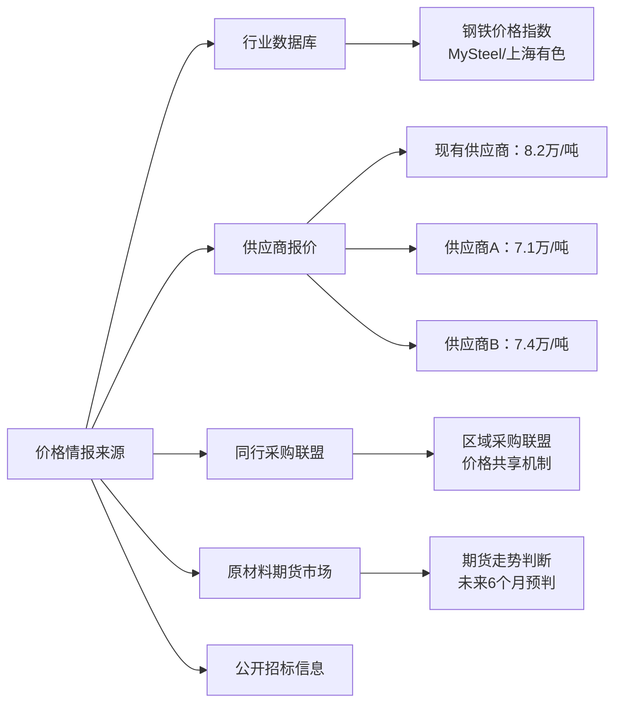
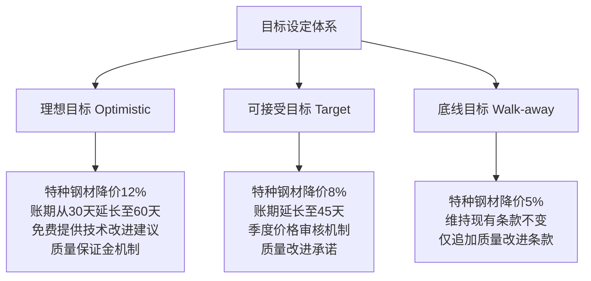
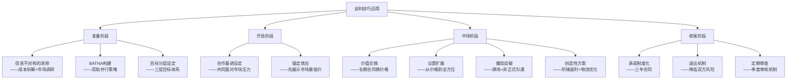
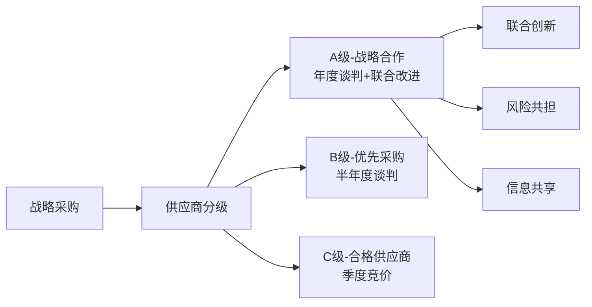

## 案例二：采购谈判——供应链管理的成本优化

采购谈判是企业经营中最频繁、最高频的谈判类型之一。它不仅仅是"砍价"——一次优秀的采购谈判，能够同时优化成本结构、提升供应链韧性、巩固战略供应商关系，甚至为企业构建长期竞争壁垒。本案例通过一家中型制造企业的年度供应商谈判全流程，系统展示从准备到收尾再到执行的完整闭环，帮助读者将前文的理论基础转化为可操作的采购谈判方法论。

---

### 一、案例背景：一家制造企业的供应链困局

#### 1.1 企业概况

华东精密机械有限公司（以下简称"华东精密"）是一家年产值约8000万元的中型制造企业，主营工业自动化零部件。其核心原材料包括特种钢材、精密轴承和电子控制模块，年采购总额约2800万元，占总成本的35%。

#### 1.2 面临的挑战

2024年下半年，华东精密遭遇了典型的供应链三重压力：

| 挑战维度 | 具体表现 | 影响程度 |
|---------|---------|---------|
| **成本压力** | 特种钢材价格上涨12%，客户要求降价5% | 利润率从8%压缩至3% |
| **供应风险** | 主供应商产能不足，交期从15天延长至25天 | 3次客户延期交付 |
| **质量波动** | 来料合格率从99.2%降至97.8% | 客户投诉增加200% |

#### 1.3 核心决策：与谁谈判、谈什么

采购总监王磊需要做出关键决策：继续与合作5年的主供应商谈判，还是引入新供应商进行竞争性谈判？经过初步评估，他决定采取"双轨并行"策略——同时与现有供应商和两家新供应商进行谈判，以最大化自己的谈判地位。

> **理论关联：BATNA的构建**
> 本案例中的"双轨并行"策略，正是第三章所述BATNA（最佳替代方案）的典型应用。当采购方拥有多个可行的替代方案时，其谈判议价能力显著增强。华东精密在谈判前的BATNA价值评估显示：如果现有供应商完全不可用，切换到新供应商的成本约为45万元（包括验证周期3个月、小批量试产10万元、质量风险35万元）。这个数字既是底线，也是谈判中的隐性筹码。

---

### 二、谈判准备：信息收集与策略规划

#### 2.1 信息收集体系

采购谈判的成败，70%取决于准备阶段。王磊组建了三人谈判小组，用两周时间完成了系统的市场调研：

**价格情报收集**

**成本结构拆解**

王磊要求现有供应商提供成本分解表（Cost Breakdown），这是采购谈判中的关键工具：

| 成本项 | 占比 | 可压缩空间 | 分析 |
|-------|------|-----------|------|
| 原材料（钢坯） | 52% | 低 | 大宗商品价格，随行就市 |
| 加工费 | 18% | 中 | 工艺优化、效率提升可节约3-5% |
| 物流运输 | 8% | 中 | 合并运输、优化路线可节约15% |
| 质量管理 | 7% | 低 | 不可压缩，涉及安全 |
| 利润 | 10% | 高 | 供应商利润率高于行业均值（6%） |
| 管理费用 | 5% | 中 | 规模效应可摊薄 |

通过成本拆解，王磊发现：降价空间主要存在于物流优化（约1.2%）和利润压缩（约3-4%），加上加工效率提升的1-2%，综合降价空间在5-8%之间。如果仅靠压利润，最多能降4%——而这会损害长期关系。

**供应商能力评估矩阵**

| 评估维度 | 权重 | 现有供应商 | 供应商A | 供应商B |
|---------|------|-----------|--------|--------|
| 价格竞争力 | 25% | 6分 | 9分 | 8分 |
| 质量稳定性 | 25% | 9分 | 7分 | 7分 |
| 交付能力 | 20% | 7分 | 6分 | 8分 |
| 技术支持 | 15% | 9分 | 6分 | 7分 |
| 财务健康 | 10% | 8分 | 7分 | 8分 |
| 战略配合 | 5% | 9分 | 5分 | 6分 |
| **加权总分** | 100% | **7.65** | **7.05** | **7.35** |

> **关键发现**：现有供应商的综合优势仍然明显，但价格维度的差距（6 vs 9）足以构成谈判杠杆。谈判的目标不是替换供应商，而是用竞争压力驱动价格调整。

#### 2.2 目标设定：三层目标体系

基于信息收集结果，王磊团队设定了精确的三层目标：

**目标设定的底层逻辑**：

- **理想目标**（降12%）：基于新供应商报价差距设定，需要供应商压缩利润+优化物流，实现难度较大但有数据支撑
- **可接受目标**（降8%）：基于成本拆解的综合可压缩空间，供应商可在不损害经营的前提下实现
- **底线目标**（降5%）：基于原材料价格涨幅和历史合作价值的平衡点，低于此线则不值得继续谈判

#### 2.3 策略规划：竞争性谈判与关系型谈判的平衡

采购谈判的特殊性在于：你既要利用竞争压力获取最优条件，又要维护合作关系以保障供应稳定性。这种张力决定了策略设计必须兼顾两个维度。

**核心策略组合**

| 策略 | 具体手法 | 预期效果 | 风险控制 |
|------|---------|---------|---------|
| **竞争施压** | 引入新供应商报价，但不明确排除现有供应商 | 迫使供应商正视价格差距 | 不能泄露具体报价数字，防止供应商直接联系对手 |
| **价值锚定** | 先展示成本拆解数据，证明降价空间客观存在 | 将"愿不愿意降"转化为"能不能降" | 数据来源需可靠，避免被质疑 |
| **利益交换** | 以长期合同+增量订单换取价格让步 | 创造双赢局面 | 合同承诺需有约束力，不能空口许诺 |
| **议题扩展** | 将单一价格议题扩展为账期、质量、服务等多维方案 | 增加谈判的交换空间 | 确保附加议题对己方有实际价值 |
| **时间管理** | 设定谈判截止日期（季度采购计划前完成） | 避免无限期拖延 | 留出足够缓冲时间，避免被对方反利用 |

---

### 三、谈判过程：四阶段全景还原

#### 3.1 开局阶段：定调与信息试探

**第一次会议**（供应商总部，历时2小时）

王磊的开场白经过精心设计，既表达了合作诚意，又明确传递了变革信号：

> "张总，非常感谢贵司过去五年对我们的支持。华东精密今天的成绩，离不开贵司的贡献。正因为珍视这段合作，我今天才亲自带队过来，和您坦诚地聊一聊我们的共同未来。
>
> 坦率地说，我们目前面临着巨大的市场压力——客户在要求降价5%，而原材料价格又在上涨。如果成本结构不优化，我们双方的生意都很难持续。所以今天的目的很简单：一起找到一个让双方都能健康发展的方案。"

**开局策略解析**：

- **合作框架先行**："共同未来"、"双方健康发展"——建立谈判的合作基调，而非对抗
- **坦诚困境**：主动暴露压力，降低对方的防御心理
- **问题外化**：将矛盾从"你我之间"转移到"我们共同面对的市场压力"
- **隐性信号**：暗示如果无法达成协议，合作关系可能不可持续

**供应商的回应与信息试探**：

供应商总经理张志远的回应也很有技巧："王总，您说的情况我理解。但说实话，我们的成本压力也很大。钢坯涨价、人工涨价、环保投入增加……我们的利润空间已经被挤压得很薄了。"

王磊没有立刻反驳，而是追问："张总，能否具体说说，哪些成本项涨了多少？我们一起来分析分析。"——这是有意引导供应商进入成本拆解讨论，也是在收集关键信息。

#### 3.2 中场交锋：施压与博弈

**第二次会议**（一周后，华东精密总部）

王磊提前准备了一份详细的市场调研报告和成本对比分析，在会议开始时展示：

> "张总，这是我们整理的市场情况。目前市场上同规格特种钢材的主流报价在7.1-7.4万/吨之间，而我们目前的采购价是8.2万/吨。差距在15-20%之间。
>
> 当然，我理解不同供应商的品质、服务有差异，不能完全用价格比较。但这个差距确实让我们很难向客户和管理层交代。"

**供应商的防御与反驳**：

张志远立即展开防御："王总，价格低不一定代表总成本低。您算过质量损失成本吗？算过交付延迟的隐性成本吗？我们去年全年来料合格率99.2%，行业平均水平是96.5%。光质量差异这一项，每年就为您节省了至少15万元。"

王磊早有准备，他展示了总拥有成本（TCO）分析：

| TCO构成 | 现有供应商 | 供应商A（预估） | 供应商B（预估） |
|--------|-----------|---------------|---------------|
| 采购单价（万/吨） | 8.20 | 7.10 | 7.40 |
| 质量损失成本（万元/年） | 2.2 | 8.5 | 7.0 |
| 交付延迟成本（万元/年） | 0.5 | 3.0 | 1.5 |
| 库存持有成本（万元/年） | 5.0 | 8.0 | 6.5 |
| 切换成本（万元，一次性） | 0 | 45.0 | 42.0 |
| **年度总成本（万元）** | **约2,318** | **约2,102** | **约2,150** |
| **含切换成本首年** | **约2,318** | **约2,147** | **约2,192** |

> **关键洞察**：即使考虑质量差异和隐性成本，新供应商的价格优势仍然存在（首年节省约126-171万元），但差距比纯价格比较时大幅缩小。这个分析同时向供应商传递了两个信号：（1）我们做了充分的功课；（2）我们没有只看价格，你的质量价值我们认可——但价格差距仍然太大。

**僵局出现**：

经过两轮报价，供应商表示最多只能降价6%，相当于7.71万/吨。王磊认为这与8%的目标仍有差距，双方陷入僵局。

> **理论关联：ZOPA的识别与运用**
> 此时双方的ZOPA（协议区间）已经清晰浮现：供应商的底线约在7.6万/吨（降幅7.3%），采购方可接受上限约8%（7.54万/吨）。区间狭窄但仍然存在，关键在于如何找到双方都能接受的交换条件。

#### 3.3 僵局突破：议题扩展与创造性方案

王磊暂停了正式会议，邀请张志远到茶室进行非正式沟通。这种"换场"策略在谈判中有特殊作用——脱离会议室的正式氛围，降低对抗性，为创造性方案的提出创造空间。

> "张总，我跟您说实话。如果只是价格问题，我个人是能理解您的难处的。但我的老板只给我两个选项：要么找到8%的综合优化方案，要么就启动供应商切换。我当然不想走到那一步——这对咱们双方都是损失。
>
> 我在想，有没有一种方式，不光解决价格问题，还能在其他方面创造价值，让我能向公司交差？"

**创造性方案的提出**：

王磊提出了一揽子方案，将谈判从单一价格议题扩展为多维度的利益交换：

| 交换项 | 采购方让步 | 供应商让步 | 双方获益 |
|-------|-----------|-----------|---------|
| **价格** | 接受6%降价（低于8%目标） | 降幅6%+物流优化1.2%+季度返利1.5%=综合8.7% | 采购方达到综合目标，供应商名义降幅可控 |
| **账期** | 从30天延长至45天 | 接受45天账期 | 供应商现金流改善，采购方降低短期资金压力 |
| **合同周期** | 签订3年长期合同 | 承诺产能保障和优先排产 | 双方降低不确定性，规划更稳定 |
| **订单量** | 承诺年度采购量增长20% | 提供阶梯价格机制 | 供应商规模效应，采购方长期价格递减 |
| **质量** | 愿意参与供应商的质量改进项目 | 设立质量改进基金，目标合格率99.5% | 双方共同降低质量损失成本 |
| **技术合作** | 提供新产品开发的需求预测 | 提前3个月储备产能，缩短交付周期 | 供应链协同效应，降低牛鞭效应 |

> **理论关联：价值创造型谈判**
> 哈佛谈判原则强调"将蛋糕做大"而非"争抢同一块蛋糕"。本案例中，账期、合同周期、订单量增长等议题的引入，让双方在同一笔交易中各自获得了价格之外的价值——供应商获得了稳定的现金流和业务增长预期，采购方则获得了综合成本优化和供应链稳定性。

#### 3.4 收尾阶段：协议固化与风险管控

经过三轮正式谈判和两次非正式沟通，双方就以下方案达成一致：

**最终协议要点**

┌─────────────────────────────────────────────────────┐
│              华东精密 × 鑫源特钢 年度采购协议           │
├─────────────────────────────────────────────────────┤
│ 价格条款                                            │
│   ├─ 基础价格：7.55万/吨（降幅约8%）                  │
│   ├─ 季度返利：采购额满100万返1.5%                   │
│   └─ 物流优化：供应商统一配送，降低运费15%             │
│                                                     │
│ 综合降价效果：约8.7%                                 │
│                                                     │
│ 合作条款                                            │
│   ├─ 合同周期：3年（2025.1-2027.12）                  │
│   ├─ 账期：45天                                      │
│   ├─ 年度采购量：增长20%（约3360万元）                 │
│   └─ 产能保障：优先排产，交期缩短至12天               │
│                                                     │
│ 质量与服务                                          │
│   ├─ 质量目标：合格率≥99.5%                          │
│   ├─ 季度价格审核机制（原材料指数联动）               │
│   ├─ 质量改进基金：双方各出资5万元/年                 │
│   └─ 技术交流：季度技术研讨会                        │
│                                                     │
│ 退出机制                                            │
│   ├─ 任一方提前6个月书面通知可终止合同                │
│   ├─ 质量连续两季度低于99%触发整改程序                │
│   └─ 价格调整以原材料指数为基准，±5%内不触发重谈     │
└─────────────────────────────────────────────────────┘

**风险管控条款的设计**

采购谈判不同于一般商务谈判的地方在于：协议的执行期很长（通常1-3年），期间充满不确定性。因此，协议中必须嵌入风险管控机制：

| 风险类型 | 管控机制 | 触发条件 | 应对措施 |
|---------|---------|---------|---------|
| 原材料价格剧烈波动 | 指数联动定价 | 钢坯指数变动超过±10% | 双方协商调价，不超过±5%不触发 |
| 供应商产能不足 | 产能保障承诺 | 交期延迟超过3天 | 每延迟一天扣除货款0.5% |
| 质量持续不达标 | 质量整改程序 | 连续两季度合格率<99% | 30天整改期，未改善则启动备选供应商 |
| 供应商经营异常 | 财务透明条款 | 季度财务信息共享 | 提前预警，启动应急供应方案 |
| 市场环境重大变化 | 不可抗力条款 | 政策/自然灾害等 | 双方协商调整或终止 |

---

### 四、谈判复盘：技巧解构与数据分析

#### 4.1 关键谈判技巧的系统运用

本案例中运用的谈判技巧，可以映射到本书理论框架的多个层面：

#### 4.2 量化成果分析

谈判结束后，王磊团队对实际效果进行了量化评估：

**直接成本节约**

| 优化项 | 年度节约金额 | 说明 |
|-------|------------|------|
| 价格降幅（8%） | 约224万元 | 基于2800万年采购额 |
| 物流优化（15%运费下降） | 约33.6万元 | 采购额的1.2% |
| 季度返利（1.5%） | 约42万元 | 满额触发 |
| **年度直接节约** | **约299.6万元** | **综合降幅约10.7%** |

**间接价值创造**

| 价值维度 | 量化指标 | 年度价值 |
|---------|---------|---------|
| 交期缩短（25天→12天） | 库存周转率提升 | 节约库存持有成本约40万元 |
| 质量提升（99.2%→99.5%目标） | 质量损失减少 | 预计节约8-12万元 |
| 供应稳定性 | 客户延期交付率下降 | 预计减少违约损失15万元 |
| 技术合作 | 新产品开发周期缩短 | 难以精确量化，战略价值显著 |

**综合评估**：谈判为华东精密带来的年度综合价值约360-370万元，相当于采购总额的12.9%。

#### 4.3 决策时刻的博弈分析

谈判中有三个关键决策点值得深入分析：

**决策点1：是否向供应商透露新供应商的具体报价？**

| 选项 | 优势 | 风险 | 最终选择 |
|------|-----|------|---------|
| 透露具体数字 | 信息透明，增强信任 | 供应商可能直接联系对手核实，或据此调整自己的底线 | ❌ 不透露 |
| 只说价格区间 | 保留不确定性，保留谈判空间 | 供应商可能认为你在虚张声势 | ✅ 采用 |
| 完全不透露 | 保留最大信息优势 | 供应商无紧迫感，不会认真对待 | ❌ 不采用 |

**决策点2：僵局时是继续施压还是做出让步？**

王磊选择了第三条路——议题扩展。这避免了在价格上的直接退让（维护了己方立场的可信度），同时创造了新的交换空间（降低了供应商的让步成本）。

**决策点3：是否接受低于理想目标的方案？**

最终方案的综合降幅（8.7%）介于可接受目标（8%）和理想目标（12%）之间，但包含了大量非价格条款。王磊的判断依据是：这些非价格条款的实际价值（交期、质量、供应稳定性）远超它们的纸面价值，而价格差距可以随时间通过阶梯机制逐步弥补。

---

### 五、供应链视角：采购谈判的战略维度

#### 5.1 从一次谈判到供应链管理

优秀的采购谈判不是孤立事件，而是供应链管理的一个环节。华东精密在本次谈判后，建立了一套系统化的供应商关系管理体系：

**供应商分级标准**

| 级别 | 年采购额 | 合作年限 | 质量表现 | 管理方式 |
|------|---------|---------|---------|---------|
| A级（战略合作） | >500万元 | >3年 | 合格率>99% | 年度谈判+联合改进+信息共享 |
| B级（优先采购） | 100-500万元 | >1年 | 合格率>97% | 半年度谈判+定期审核 |
| C级（合格供应商） | <100万元 | 不限 | 合格率>95% | 季度竞价+年度评估 |

#### 5.2 采购谈判中的博弈论视角

采购谈判本质上是一个不完全信息动态博弈。双方都在试图获取对方的私有信息（真实成本、底线价格、替代方案），同时保护自己的信息。

| 博弈要素 | 采购方 | 供应商 |
|---------|-------|-------|
| 私有信息 | 实际预算、备选方案的详细情况 | 真实成本结构、最大让步空间 |
| 可信承诺 | 长期合同、订单量增长 | 产能保障、质量承诺 |
| 信号传递 | 引入竞争者、展示市场数据 | 强调质量差异、隐性成本 |
| 威胁可信度 | 替代方案的可行性 | 价格底线的真实性 |

本案例中，王磊通过引入真实存在的新供应商（而非虚张声势）建立威胁的可信度；通过成本拆解分析（而非简单地说"太贵了"）传递专业信号；通过承诺长期合同和增量订单（而非口头许愿）建立可信承诺。这三个要素共同作用，推动了谈判的成功。

#### 5.3 采购谈判的伦理边界

在追求最优价格的同时，采购谈判必须坚守伦理底线：

**应该做的**：

- 利用真实的市场信息和竞争压力
- 通过价值创造实现双方共赢
- 尊重供应商的合理利润空间
- 遵守合同承诺，建立长期信任

**不应该做的**：

- 虚构不存在的竞争对手报价
- 利用信息不对称恶意压价
- 以取消合作为威胁要求不合理的让步
- 签约后单方面修改条款

> **警示**：短期的过度压价会带来长期的供应链风险。供应商在利润过低时，可能通过降低原材料品质、减少技术服务投入、降低检测标准等方式"找回"利润——这些隐性质量损失往往远超价格节约。

---

### 六、实操工具箱：采购谈判模板与清单

#### 6.1 谈判准备检查清单

□ 市场调研完成
  □ 收集3家以上供应商报价
  □ 查询行业价格指数
  □ 了解原材料市场走势
  □ 分析竞争对手的采购策略

□ 成本分析完成
  □ 要求供应商提供成本分解表
  □ 标注各成本项的可压缩空间
  □ 计算总拥有成本（TCO）
  □ 设定价格区间（理想/可接受/底线）

□ 供应商评估完成
  □ 质量历史数据统计
  □ 交付表现评估
  □ 财务健康状况了解
  □ 替代方案可行性评估

□ 策略规划完成
  □ 明确己方BATNA
  □ 估计对方BATNA
  □ 设计议题扩展清单
  □ 确定底线和退出条件
  □ 分配谈判角色（主谈/观察/记录）

#### 6.2 成本拆解分析模板

供应商名称：________________
产品规格：________________
分析日期：________________

┌──────────────┬────────┬──────────┬──────────┐
│ 成本项目       │ 金额(元) │ 占比(%)   │ 可压缩空间 │
├──────────────┼────────┼──────────┼──────────┤
│ 原材料        │        │          │ 低/中/高  │
│ 加工/制造     │        │          │ 低/中/高  │
│ 人工成本      │        │          │ 低/中/高  │
│ 质量管理      │        │          │ 低/中/高  │
│ 物流运输      │        │          │ 低/中/高  │
│ 包装          │        │          │ 低/中/高  │
│ 管理费用      │        │          │ 低/中/高  │
│ 利润          │        │          │ 低/中/高  │
├──────────────┼────────┼──────────┼──────────┤
│ 合计          │        │ 100%     │          │
└──────────────┴────────┴──────────┴──────────┘

总拥有成本（TCO）补充项：
- 质量损失成本：______
- 交付延迟成本：______
- 库存持有成本：______
- 管理协调成本：______
- 切换成本（如适用）：______

#### 6.3 谈判话术参考

**价格谈判核心话术**

| 场景 | 话术示例 | 策略逻辑 |
|------|---------|---------|
| 开场定调 | "我们非常重视合作关系，正因如此才坦诚地讨论价格问题" | 合作框架+坦诚信号 |
| 展示市场数据 | "市场上的主流报价区间是XX-XX，我们希望找到双方都能接受的方案" | 数据锚定+模糊处理 |
| 回应"质量好所以贵" | "质量价值我们认可，但TCO分析显示差距仍然有X%，我们需要共同找到方案" | 承认价值+数据反驳 |
| 僵局时 | "价格上我们已经很接近了，不如看看其他方面有没有交换空间" | 议题扩展+降低对抗 |
| 最后施压 | "这是我能拿到的最大授权了，如果这个方案可行，我们今天就能签" | 授权限制+紧迫感 |
| 达成一致 | "非常好的起点，让我们把它落实到书面，确认每个细节" | 立即固化+防止反悔 |

---

### 七、常见误区与避坑指南

#### 7.1 采购谈判中的典型错误

| 错误 | 表现 | 后果 | 纠正方法 |
|------|-----|------|---------|
| **只看单价** | 忽略质量、交期、服务等隐性成本 | 短期便宜，长期更贵 | 始终使用TCO分析框架 |
| **过度压价** | 将供应商利润压缩到不合理的水平 | 供应商偷工减料或退出合作 | 确保供应商有合理利润（行业均值±2%） |
| **虚张声势** | 编造不存在的竞争对手或报价 | 被识破后丧失信誉 | 只使用真实信息，宁可沉默也不撒谎 |
| **忽视关系** | 把供应商当对手而非伙伴 | 缺乏信任，无法获得真正支持 | 建立定期沟通机制，投资关系 |
| **急于成交** | 没有充分准备就进入谈判 | 信息劣势，被动让步 | 遵循"准备时间≥谈判时间"原则 |
| **缺少退出机制** | 合同中没有质量/交期违约条款 | 出问题后无法追责或解约 | 在签约时就设计好退出和追责条款 |

#### 7.2 "砍价型"采购 vs "价值型"采购

砍价型采购（短期思维）          价值型采购（长期思维）
─────────────────────       ─────────────────────
目标：拿到最低价               目标：最优总拥有成本
方法：多方比价+压价            方法：战略协作+价值创造
关系：交易型，随时可替换        关系：伙伴型，深度绑定
风险：质量下降+供应中断        风险：过度依赖单一供应商
结果：短期省钱+长期隐患        结果：持续优化+供应链韧性

优秀的采购谈判者，能在"砍价"和"价值创造"之间找到平衡点。本案例中，王磊既有竞争施压（砍价型手段），又有长期合同和联合改进（价值型手段），最终实现了价格、质量、服务的综合最优。

---

### 八、进阶思考：采购谈判的前沿趋势

#### 8.1 数字化采购谈判

随着采购数字化的推进，传统的"面对面砍价"模式正在被数据驱动的谈判所取代：

- **电子竞标平台**：标准化物料通过在线竞价，价格透明度大幅提升
- **AI价格预测**：基于历史数据和市场指数，AI辅助预测最优采购时机
- **区块链合同**：智能合约自动执行价格联动、返利计算等条款
- **供应商画像系统**：整合历史数据、财务信息、行业口碑，辅助决策

#### 8.2 从谈判到协作：VMI与CPFR模式

最高级的采购关系，已经超越了"谈判"的范畴，进入了协作领域：

- **VMI（供应商管理库存）**：供应商直接管理采购方的库存，根据实时数据自动补货，消除牛鞭效应
- **CPFR（协同规划、预测与补货）**：双方共享需求预测和产能信息，联合制定生产和采购计划
- **联合成本改进（JCI）**：双方工程师共同优化设计和工艺，从源头降低成本

这些模式的前提是高度的信任关系——而这种信任，往往始于一次成功的采购谈判。

#### 8.3 全球化采购谈判的特殊考量

当采购谈判涉及跨境供应商时，需要额外关注：

- **汇率风险管理**：在合同中约定汇率波动的分担机制
- **关税与贸易政策**：关注目标国家的关税变化和贸易壁垒
- **文化差异**：不同文化的谈判风格差异巨大（如日本的共识决策、中东的关系优先）
- **物流与合规**：国际物流的不确定性需要更大的安全库存缓冲
- **知识产权保护**：技术合作中的IP归属需在合同中明确约定

---

### 九、本案例的理论映射

本案例系统运用了本章前述的多项理论工具：

| 理论工具 | 在本案例中的体现 | 章节对应 |
|---------|----------------|---------|
| BATNA | 双轨并行策略，构建替代方案 | 第三节 |
| ZOPA | 通过成本分析识别协议区间 | 第四节 |
| 锚定效应 | 先展示市场最低价，设定价格锚点 | 第五节·谈判心理学 |
| 价值创造 | 议题扩展，将蛋糕做大 | 第四章·第三节 |
| 僵局突破 | 换场+非正式沟通+议题扩展 | 第四章·第五节 |
| 承诺升级 | 三年合同固化合作关系 | 第四章·第四节 |
| 信息不对称 | 成本拆解消除信息差 | 第四章·第一节 |

---

### 十、总结与行动建议

#### 核心要点回顾

1. **准备决定成败**：70%的谈判结果在进入会议室之前已经确定。市场调研、成本分析、供应商评估、策略规划缺一不可
2. **看总成本而非单价**：TCO分析框架是采购谈判的基础工具，避免"便宜买、贵用"的陷阱
3. **竞争施压要真实有效**：引入真实的替代方案，而非虚张声势。威胁的可信度决定谈判力度
4. **议题扩展创造空间**：当价格陷入僵局时，通过账期、合同周期、质量、服务等多维度创造交换空间
5. **关系与价格并重**：最好的采购谈判不是赢得最大的价格让步，而是建立最健康的合作关系
6. **风险管控前置**：在签约时就设计好价格联动、质量追责、退出机制等条款，而非事后补救

#### 行动建议

如果你即将进行一次重要的采购谈判，建议按以下步骤行动：

1. **2周前**：完成市场调研和成本分析，明确价格区间和谈判目标
2. **1周前**：完成供应商评估和BATNA分析，确定策略组合和角色分工
3. **谈判前1天**：团队内部模拟演练，预判对方可能的回应并准备应对方案
4. **谈判中**：按照开局（定调）→中场（施压+交换）→僵局（扩展+创造）→收尾（固化）的节奏推进
5. **谈判后1周**：书面确认协议细节，建立执行跟进机制
6. **执行期间**：按季度审核协议执行情况，及时调整和优化
