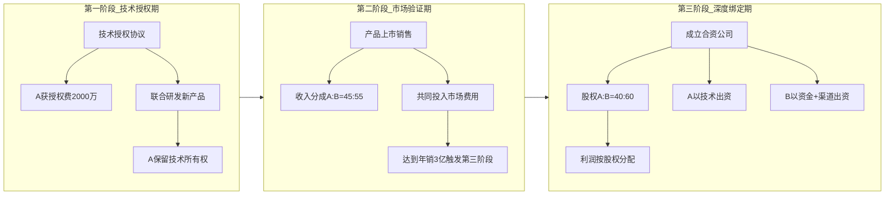

## 案例三：商务合作——战略联盟的利益平衡

战略联盟谈判是商务谈判中最复杂的类型之一。不同于单次交易谈判，战略联盟涉及两个独立组织的长期深度绑定，谈判内容涵盖股权结构、资源投入、利益分配、治理机制、退出路径等数十个变量。本案例以一家技术型公司与一家渠道型公司的合资合作为主线，完整还原从信息准备到协议落地的全过程，拆解每个关键节点的决策逻辑与谈判技巧。

### 战略联盟谈判的核心特征

在进入案例之前，先理解战略联盟谈判与其他谈判的本质区别：

| 维度 | 单次交易谈判 | 战略联盟谈判 |
|------|------------|------------|
| 时间跨度 | 一次性交付 | 3-10年长期合作 |
| 利益结构 | 零和或有限正和 | 高度正和，但分配复杂 |
| 关系要求 | 可以对抗性 | 必须建设性，需长期维护 |
| 变量数量 | 价格、交付、质量 | 股权、治理、IP、退出、竞业等数十项 |
| 风险类型 | 履约风险 | 战略风险、控制权风险、技术泄露风险 |
| 退出成本 | 低 | 极高，涉及资产分割、客户归属 |
| 信息需求 | 对方报价和底线 | 对方战略意图、组织文化、决策机制 |

战略联盟谈判的核心矛盾在于：**合作创造的价值越大，分配争议就越激烈**。双方既需要紧密合作做大蛋糕，又需要在分配机制上保护自身利益。这个矛盾贯穿谈判始终。

### 案例背景

**A公司——技术方**

- 成立8年，员工200人，其中研发人员120人
- 核心产品：工业物联网传感器平台，拥有37项发明专利
- 年营收1.2亿元，利润率25%
- 优势：技术壁垒高，行业口碑好
- 短板：市场拓展能力弱，销售团队仅15人，主要依赖直销
- 战略诉求：将技术优势转化为更大的市场份额，进入智能制造赛道

**B公司——渠道方**

- 成立12年，员工500人，其中销售和渠道团队300人
- 核心业务：工业自动化系统集成，服务2000+制造企业客户
- 年营收5亿元，利润率12%
- 优势：客户资源丰富，品牌认知度高，有成熟的渠道网络
- 短板：产品毛利率低，核心技术依赖外部供应商
- 战略诉求：向上游延伸，掌握核心技术，提升产品毛利率

**合作契机**

智能制造市场规模预计3年内从800亿增长到2000亿。A公司的传感器技术与B公司的渠道网络高度互补，联合推出的智能传感解决方案可覆盖B公司现有客户的60%以上。初步测算，合作产品3年内可实现年销售额3-5亿元。

**核心矛盾**

- A公司认为技术是核心壁垒，应占主导地位
- B公司认为渠道是变现关键，且投入资金更大，应获得更多回报
- 双方都担心合作后核心技术/客户资源被对方获取

### 谈判前的系统准备

#### 信息收集与分析框架

谈判准备的质量直接决定谈判结果。战略联盟谈判需要收集四个维度的信息：

**第一维度：对方的战略意图**

不要只看对方说什么，要分析对方为什么要做这个合作。信息来源包括：行业分析师报告、对方近期的投资并购动态、对方高管的公开演讲、供应链上下游的反馈。

在本案例中，A公司通过分析发现：B公司近两年连续投资了3家传感器相关企业，但效果不佳。这说明B公司对传感器技术有强烈的获取需求，且已尝试过其他路径。这一信息意味着B公司在本次谈判中的替代方案（BATNA）较弱。

**第二维度：对方的财务状况**

通过公开财报、工商信息、供应商访谈等渠道，了解对方的营收结构、现金流状况、负债水平。本案例中，B公司虽然营收规模大，但利润率仅12%，且应收账款周期长达90天。这意味着B公司虽然能提供资金，但现金流并不宽裕，在出资节奏上可能有谈判空间。

**第三维度：行业惯例与标杆案例**

搜集同行业类似合作的条款结构。本案例参考了以下案例：

- 西门子与华为的工业互联网合作：技术授权+联合品牌的模式
- 海尔与软银的机器人合资：按阶段逐步加深股权绑定
- 某传感器企业与集成商的合作失败案例：因股权争议导致合作破裂

**第四维度：法律与合规环境**

技术合作涉及的法律问题包括：知识产权归属与授权、竞业禁止、数据安全、反垄断审查。提前与法律顾问沟通，明确哪些条款是底线，哪些可以灵活处理。

#### BATNA分析：你的最佳替代方案

BATNA（Best Alternative To a Negotiated Agreement）是谈判力量的根本来源。在战略联盟谈判中，双方都需要清晰评估自己的BATNA。

┌─────────────────────────────────────────────────────┐
│                    BATNA分析矩阵                      │
├──────────┬──────────────────┬───────────────────────┤
│          │    A公司BATNA     │     B公司BATNA        │
├──────────┼──────────────────┼───────────────────────┤
│ 替代方案1 │ 自建销售团队      │ 收购其他传感器公司     │
│ 时间成本  │ 2-3年            │ 1-2年                 │
│ 资金成本  │ 3000万+          │ 5000万+               │
│ 成功概率  │ 40%              │ 30%（之前已失败3次）   │
├──────────┼──────────────────┼───────────────────────┤
│ 替代方案2 │ 与其他集成商合作  │ 与A的竞品合作         │
│ 可行性    │ 中等，但缺乏规模  │ 低，A的技术壁垒最高    │
├──────────┼──────────────────┼───────────────────────┤
│ BATNA强度 │    中等偏弱       │      较弱             │
└──────────┴──────────────────┴───────────────────────┘

BATNA分析揭示了一个关键信息：**B公司的替代方案更弱**。这为A公司在股权分配谈判中提供了筹码——但要注意，不能让对方感受到你在利用这个优势，否则会损害合作关系。

#### ZOPA测算：可达成协议的空间

ZOPA（Zone of Possible Agreement）是双方底线之间的重叠区域。本案例的核心ZOPA在股权分配上：

- A公司底线：技术方不低于40%股权
- A公司理想：技术方60%股权
- B公司底线：渠道方不低于40%股权
- B公司理想：渠道方60%或50:50

ZOPA区间：A方40%-60%，B方40%-60%。重叠区域是40%-60%，但双方都想要60%。这意味着需要创造性方案来突破简单的股权比例之争。

#### 谈判团队组建

战略联盟谈判不是一个人的战斗。本案例中A公司的谈判团队构成：

| 角色 | 人选 | 职责 |
|------|------|------|
| 首席谈判官 | 副总裁张总 | 整体策略把控，最终决策 |
| 技术代表 | CTO李博士 | 技术价值论证，知识产权条款 |
| 财务代表 | CFO王总 | 财务模型搭建，估值论证 |
| 法律顾问 | 外聘律所合伙人 | 法律风险评估，协议审核 |
| 商务分析师 | 战略部经理 | 数据支撑，方案测算 |
| 记录员 | 总裁助理 | 会议记录，信息整理 |

每个成员有明确分工：谁主谈、谁记录、谁负责技术论证、谁负责观察对方反应。**黑脸白脸策略**由张总（建设性）和李博士（技术底线强硬）配合执行。

#### 目标设定与优先级排序

使用**多属性效用分析**（Multi-Attribute Utility Analysis）设定目标：

┌─────────────────────────────────────────────────────┐
│              A公司目标优先级矩阵                       │
├──────────────────┬──────┬────────┬─────────┬────────┤
│     目标项        │ 权重 │ 理想值  │ 可接受值 │  底线  │
├──────────────────┼──────┼────────┼─────────┼────────┤
│ 股权比例          │ 25%  │  60%   │  45%    │  40%  │
│ 技术控制权        │ 25%  │ 完全控制│ 共同决策 │ 否决权 │
│ 技术授权费        │ 15%  │ 3000万 │ 2000万  │ 1000万│
│ 利润分配          │ 15%  │  按股权 │ 阶梯分成 │ 40%  │
│ 退出条款          │ 10%  │ 随时退出│ 3年后   │ 5年后 │
│ 竞业限制          │ 10%  │ 无限制  │ 有限制  │ 合理  │
└──────────────────┴──────┴────────┴─────────┴────────┘

**关键原则**：在你最在意的目标上坚守底线，在对方在意但你不太在意的目标上让步。本案例中，A公司最在意的是**技术控制权**和**股权比例**，而在**退出条款**和**竞业限制**上有较大让步空间。

### 谈判过程全记录

#### 第一轮：建立基调与试探（第1次会谈）

**A公司开场策略——愿景引导**

> "张总、王总，感谢贵司的邀请。我们研究了智能制造市场的数据，未来三年市场规模将从800亿增长到2000亿。我们的传感器技术加上贵司的客户网络，有机会在这个市场中拿下至少3%的份额，也就是60亿。这不是一个小生意，这是一个改变行业格局的机会。我们今天不是来争论谁多谁少，而是来讨论怎么一起把这件事做成。"

这段开场白做了三件事：
1. **锚定大数字**——60亿的市场前景让后续的股权分配显得微不足道
2. **强调互补性**——暗示双方缺一不可
3. **设置合作基调**——从"分配"转向"共创"

**B公司的回应——价值重估**

> "完全同意这个市场前景。但我们也想提醒一下，技术再好也需要市场来验证。我们在工业领域有2000多家客户，这些客户关系是十几年积累的。我们的渠道团队能把产品铺到全国30个省市。技术的价值最终要在市场上实现。"

B公司立刻进行了**反击性锚定**——强调渠道价值不可替代。这是典型的价值重估策略：当对方强调技术价值时，用渠道和市场落地能力来重新定义"核心价值"。

**第一轮博弈结果**

双方没有触及具体条款，但完成了三个关键任务：
1. 确认了合作的战略必要性（做大蛋糕的共识）
2. 各自展示了核心筹码（技术壁垒 vs 渠道网络）
3. 试探了对方的态度底线（A方暗示不低于50%，B方暗示不低于50%）

#### 第二轮：方案交锋与僵局（第2-3次会谈）

**B公司提出合资方案**

B公司正式提出：成立合资公司，双方各出资5000万，股权50:50，利润按股权比例分配。

A公司分析这个方案的问题：
- 50:50看似公平，但A公司年营收仅1.2亿，出资5000万压力很大；B公司年营收5亿，出资5000万轻松
- 技术价值被资金价值稀释——A公司的37项专利和8年研发积累只值5000万？
- 50:50的治理结构容易导致决策僵局

**A公司反击——技术估值论证**

A公司CFO和CTO联合做了技术估值报告：

┌─────────────────────────────────────────────────────┐
│              A公司技术资产估值                          │
├────────────────────────┬────────────────────────────┤
│ 37项发明专利估值         │ 1.2亿元（收益法评估）        │
│ 核心算法和数据积累       │ 8000万元（重置成本法）       │
│ 研发团队人力资本         │ 5000万元（招聘+培养成本）    │
│ 技术秘密（Know-how）     │ 3000万元（市场比较法）       │
├────────────────────────┼────────────────────────────┤
│ 技术资产总估值           │ 2.8亿元                     │
├────────────────────────┼────────────────────────────┤
│ B公司拟出资              │ 5000万元现金                │
│ B公司渠道资源估值         │ 1.5亿元（客户终身价值法）    │
│ B公司品牌估值            │ 5000万元                    │
├────────────────────────┼────────────────────────────┤
│ B公司资源总估值           │ 2.5亿元                     │
└────────────────────────┴────────────────────────────┘

基于这个估值，A公司提出：按资源投入估值比例，A公司应占53%，B公司占47%。

**B公司的反驳**

B公司认为A公司的技术估值过高："专利数量不等于商业价值。你们的专利大部分是基础专利，真正能直接变现的不到10项。而且技术会贬值，我们的客户关系会增值。"

双方在估值方法上产生了根本分歧，谈判陷入僵局。

**打破僵局的关键洞察**

A公司的谈判分析师发现了一个关键问题：**双方在用同一把尺子衡量不同的东西**。技术资产和渠道资产本质上不可直接比较，强行用估值比例来分配股权，必然导致争议。

解决方案：**不再争论谁的技术值多少钱，而是设计一个动态分配机制，让实际贡献决定实际回报。**

#### 第三轮：创造性方案设计（第4-5次会谈）

**分阶段合作模式的诞生**

A公司提出"三阶段递进合作"方案，核心逻辑是：**用时间换空间，用业绩换股权**。

**方案解析**

第一阶段解决了A公司最担心的问题——技术还没被市场验证就交出控制权。授权费2000万确保了A公司的保底收益，同时保留技术所有权。

第二阶段用市场结果来检验合作效果。收入分成比例45:55看似A公司让步，但实际上A公司不需要投入渠道资源，45%是净收益。更重要的是，设定了触发条件（年销3亿），只有合作成功才会进入第三阶段。

第三阶段的股权40:60是对B公司的补偿——B公司在前两个阶段投入了更多资金和渠道资源，第三阶段给予更多股权是合理的。同时A公司获得的技术授权费（2000万）+ 前期销售分成，已经获得了足够的回报保障。

**B公司的顾虑与应对**

B公司对这个方案有三个顾虑：

1. "第一阶段的授权费2000万太高了"——A公司回应："这不是一次性买断，是技术使用的入场费。如果合作成功，这2000万在年销3亿的盘子里只占不到7%。"

2. "第二阶段的触发条件太苛刻，年销3亿很难"——A公司回应："可以调整为年销2亿，但第三阶段的股权比例也要相应调整为45:55。"B公司权衡后接受了3亿的门槛。

3. "第三阶段如果我们投入了大量资源，但A公司选择不进入怎么办？"——A公司回应："增加'锁定条款'，如果第二阶段达标，双方有义务进入第三阶段，除非一方支付退出补偿金。"

#### 第四轮：核心条款逐项谈判（第6-8次会谈）

**知识产权条款**

这是谈判中最激烈的条款之一。

| 条款项 | A公司立场 | B公司立场 | 最终结果 |
|--------|----------|----------|---------|
| 合作前IP归属 | A公司完全保留 | A公司完全保留 | A保留，B获永久使用权 |
| 合作中产生的IP | A公司独有 | 合资公司共有 | 合资公司共有，A有优先使用权 |
| 合作后IP归属 | A公司完全保留 | 合资公司保留 | 合资公司保留，A有授权优先权 |
| 竞业限制 | 无 | 双方5年内不得与竞品合作 | 3年内不得与直接竞品合作 |
| 技术泄露赔偿 | — | — | 违约方赔偿5000万+实际损失 |

**治理机制条款**

50:50股权结构最大的风险是决策僵局。即使最终股权比例是40:60，也需要设计完善的治理机制：

┌──────────────────────────────────────────────────────┐
│                 合资公司治理结构                         │
├──────────────────────────────────────────────────────┤
│ 董事会：5人（A方2人 + B方2人 + 独立董事1人）             │
│ 董事长：B方出任（股权较大方）                            │
│ 总经理：A方出任（技术主导方）                            │
├──────────────────────────────────────────────────────┤
│ 决策分级：                                             │
│ ① 日常运营（预算<100万）：总经理决定                     │
│ ② 重大事项（100万-500万）：董事会过半通过                │
│ ③ 战略决策（>500万/股权变更）：董事会2/3通过             │
│ ④ 特别重大（解散/并购）：双方一致同意                    │
├──────────────────────────────────────────────────────┤
│ 僵局解决机制：                                         │
│ 第一步：双方CEO直接协商（7天内）                         │
│ 第二步：独立董事调解（14天内）                           │
│ 第三步：约定仲裁机构裁决（30天内）                       │
└──────────────────────────────────────────────────────┘

**退出条款**

退出条款是战略联盟谈判中最容易被忽视，但后果最严重的条款。必须在合作开始前就约定清楚：

- **主动退出**：任一方可在合作满3年后提出退出，需提前12个月书面通知。退出方的股权由对方按评估价的85%回购。
- **被动退出**：一方严重违约（如技术泄露、资金不到位），守约方有权要求违约方按评估价的70%转让股权。
- **强制退出**：一方发生破产、被收购等重大变化，触发"拖带权"（Drag-along Right）和"跟随权"（Tag-along Right）。
- **退出后的竞业限制**：退出后3年内不得在相同领域与合资公司竞争。

#### 第五轮：收尾与协议签署（第9-10次会谈）

最后两轮谈判聚焦于协议细节的打磨：

1. **法律文本审核**：双方律师逐条审核协议文本，确保法律用语准确
2. **附件清单确认**：技术清单、客户清单、资产评估报告等附件
3. **生效条件设定**：协议签署后30天内完成工商注册，60天内完成资金到位
4. **争议解决条款**：约定北京仲裁委员会仲裁，适用中国法律

最终签署的合作框架协议包含主协议1份、附件8份、补充协议2份，总计约150页。

### 谈判策略深度拆解

#### 策略一：锚定效应的运用

锚定效应是指人们在做决策时，会过度依赖最先获得的信息。在谈判中，先出价/先提方案的一方往往能设定讨论的基准。

本案例中的锚定运用：
- A公司开场锚定"60亿市场"——让后续的千万级授权费显得微小
- B公司锚定"50:50股权"——以对等出资为理由
- A公司用"2.8亿技术估值"反击——重新锚定技术价值
- 最终用"分阶段方案"替代了简单的股权锚定

**实操要点**：锚定要大胆但合理。过于离谱的锚定会让对方失去谈判兴趣。锚定的数字最好有数据支撑（如第三方评估报告、市场数据）。

#### 策略二：议题关联与让步交换

高明的谈判者不会在单个议题上死磕，而是把多个议题关联起来，用一个议题的让步换取另一个议题的进展。

本案例中的议题关联：
- A公司在"第二阶段收入分成比例"（45:55）上让步 → 换取B公司在"触发条件"上接受3亿门槛
- B公司在"总经理由A方出任"上让步 → 换取A公司在"董事长由B方出任"上同意
- A公司在"竞业限制3年"上让步 → 换取B公司在"技术授权费2000万"上接受

**实操要点**：永远不要白白让步。每一次让步都要换取对方的对等让步，并且要让对方知道你的让步是有价值的："如果我们在分成比例上做出调整，我们希望在触发条件上得到相应的考虑。"

#### 策略三：客观标准的引入

当双方在某个问题上争执不下时，引入第三方客观标准可以打破僵局。

本案例中使用的客观标准：
- 技术估值：委托第三方评估机构出具评估报告
- 市场规模：引用IDC、Gartner等权威机构的行业报告
- 行业惯例：列举同行业类似合作的条款结构
- 法律依据：引用相关法律法规对知识产权的规定

**实操要点**：第三方标准要在谈判前就准备好。不要在谈判桌上临时找数据——这会让你显得准备不足。

#### 策略四：利用沉默和时间压力

**沉默的力量**：当对方提出方案后，不要急于回应。沉默会给对方施加心理压力，让他们主动降低要求或补充让步。

**时间压力的运用**：A公司在第6次会谈时提到："我们的研发团队已经有另一个合作机会在谈，如果我们的合作在下个月前不能确定大方向，我们可能需要重新评估优先级。"这不是威胁，而是合理的业务陈述，但它有效地加速了谈判进程。

### 常见陷阱与避坑指南

#### 陷阱一：面子之争掩盖实质利益

谈判双方很容易在"谁说了算""谁的贡献更大"这类面子问题上陷入对抗。本案例中，A公司最初坚持60%股权，部分原因是"技术方应该主导"的自尊心，而非纯粹的经济计算。

**应对方法**：在准备阶段就明确区分"利益"和"立场"。利益是"确保技术不被滥用并获得合理回报"，立场是"我要60%股权"。立场可以灵活，利益必须坚守。

#### 陷阱二：忽略协议执行的可操作性

很多战略联盟协议看起来很完美，但执行起来困难重重。常见问题：
- 利润计算方式不明确——是毛利润还是净利润？研发费用怎么分摊？
- 决策流程太复杂——每个小决定都要开董事会
- 信息共享机制缺失——双方互不信任，不愿分享关键数据

**应对方法**：在谈判中就要求双方业务团队参与，确保协议条款可以落地执行。不要只让律师和高管谈，让实际执行协议的一线人员也参与讨论。

#### 陷阱三：过度依赖关系信任

"我们关系好，出了问题再商量"是战略联盟的大忌。关系信任不能替代制度保障。本案例中，B公司最初建议"先合作，细节以后再定"，被A公司拒绝——因为一旦开始合作，谈判筹码就会发生根本变化。

**应对方法**：越是关系好，越要在合作前把规则定清楚。"亲兄弟明算账"不是不信任，而是保护双方关系的最好方式。

#### 陷阱四：忽视文化差异

A公司是技术驱动型文化，决策相对扁平，工程师文化浓厚。B公司是销售驱动型文化，层级分明，结果导向。这种文化差异在合作中会产生大量摩擦。

**应对方法**：在协议中明确约定管理文化的融合方案。例如：
- 合资公司的绩效考核体系（技术导向 vs 销售导向的平衡）
- 会议决策方式（数据驱动 vs 经验驱动的协调）
- 信息共享频率和方式（周报/月报/季度复盘）

### 谈判结果评估

经过10轮谈判，历时3个月，双方最终达成以下协议：

| 条款项 | 最终方案 | 对比B公司初始方案 |
|--------|---------|-----------------|
| 合作模式 | 三阶段递进 | 直接合资 |
| 第一阶段 | 技术授权费2000万 | 无此阶段 |
| 第二阶段 | 收入分成45:55 | 无此阶段 |
| 第三阶段 | 合资公司，股权40:60 | 合资公司，股权50:50 |
| 技术控制权 | A方保留合作前IP，合资公司IP共有 | 合资公司共有 |
| 总经理 | A方出任 | 未约定 |
| 退出机制 | 3年后可退出，评估价85%回购 | 未约定 |
| 竞业限制 | 3年 | 未约定 |

**A公司收益分析**：
- 保底收益：授权费2000万（第一阶段确定性收入）
- 增长收益：第二阶段销售分成（年销3亿时，45%约1.35亿/年）
- 长期收益：第三阶段40%股权（合资公司估值增长后的资本收益）
- 风险控制：技术IP保留，退出条款保障

**B公司收益分析**：
- 获得核心技术使用权（不再依赖外部供应商）
- 产品毛利率预计从12%提升到25%以上
- 第三阶段获得60%股权（主导合资公司）
- 渠道资源变现：2000+客户资源的价值被充分利用

### 进阶知识：战略联盟谈判的高阶框架

#### 谈判矩阵分析法

对于有多个议题的战略联盟谈判，可以使用谈判矩阵来系统化分析：

┌──────────────────────────────────────────────────────────┐
│                   谈判矩阵分析                             │
├──────────┬───────┬───────┬──────────┬──────────┬──────────┤
│   议题    │ 重要性│ 灵活度│ 对方重要性│ 对方灵活度│  交换价值 │
├──────────┼───────┼───────┼──────────┼──────────┼──────────┤
│ 股权比例  │  高   │  低   │   高     │   低     │  低(僵局)│
│ 授权费    │  高   │  中   │   中     │   高     │  高(可交换)│
│ 总经理    │  中   │  中   │   低     │   高     │  高(可交换)│
│ 退出条款  │  中   │  高   │   低     │   高     │  中      │
│ 竞业限制  │  低   │  高   │   高     │   中     │  高(可交换)│
│ 分成比例  │  高   │  中   │   中     │   中     │  中      │
└──────────┴───────┴───────┴──────────┴──────────┴──────────┘

使用方法：找到"我方灵活度高+对方重要性高"的议题，作为让步筹码；找到"双方都重要+灵活度都低"的议题，设计创造性方案突破。

#### 感知价值管理

同一事物对不同谈判方的感知价值不同。高明的谈判者能找到"你给我对你不重要但对我很重要的东西，我给你对我不重要但对你很重要的东西"的交换机会。

本案例中的感知价值差异：
- "总经理职位"对A公司很重要（确保技术方向），对B公司不太重要（B公司更在意股权）
- "董事长职位"对B公司很重要（控制权象征），对A公司不太重要（A公司更在意实际运营）
- 结果：A公司让出董事长，B公司让出总经理，双方都觉得赚了

#### 多轮博弈的动态策略

战略联盟谈判不是一次性博弈，而是多轮重复博弈。在多轮博弈中，**声誉**和**互惠**是关键变量。

- **声誉建设**：在前几轮谈判中展示诚意和专业性，让对方认为你是一个值得长期合作的伙伴
- **互惠原则**：对方做出让步时，适时给予对等回应。不要每次都要赢
- **承诺升级**：随着谈判深入，双方投入的时间和精力越多，越不愿意放弃。合理利用这个心理，把关键条款放在后面谈

### 总结：战略联盟谈判的核心法则

**法则一：先做朋友，再谈生意**

战略联盟谈判的第一目标不是赢，而是建立信任。前两次会谈的重点应该是理解对方的战略诉求，展示合作诚意，而不是急着推方案。

**法则二：做大蛋糕比分配蛋糕更重要**

把60%的精力放在如何扩大合作价值上，40%的精力放在如何分配上。一个年利润5亿的40%，远比一个年利润1亿的60%要多。

**法则三：用机制代替信任**

不要依赖"我们关系好"来解决未来可能出现的问题。设计合理的治理机制、退出机制、争议解决机制，是保护双方关系的最好方式。

**法则四：创造性方案打破僵局**

当双方在某个问题上僵持不下时，不要在原有框架内继续争论，而是跳出框架设计新的解决方案。本案例中的"三阶段递进合作"就是典型的创造性方案——它把一个"股权50:50还是60:40"的零和问题，转化成了一个"用业绩换股权"的正和问题。

**法则五：谈判结束才是合作的开始**

协议签署不是终点，而是起点。在谈判过程中就要为后续合作埋下良好基础——包括建立双方团队的私人关系、约定定期沟通机制、设计灵活的条款调整空间。

***
