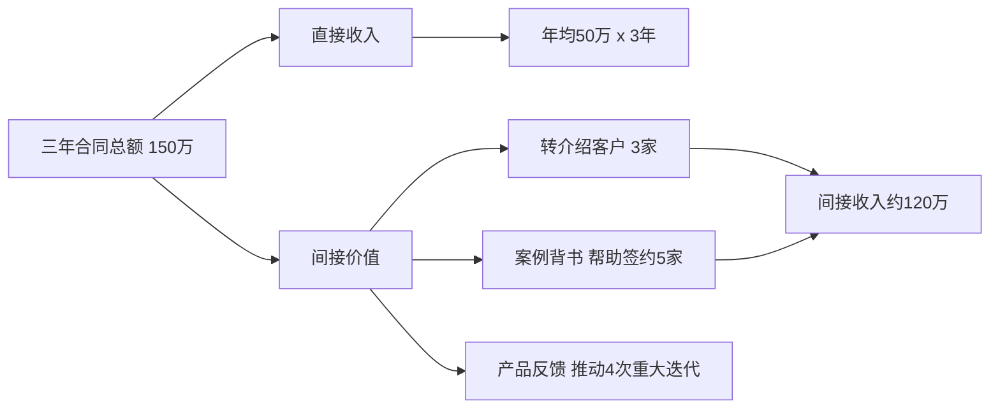
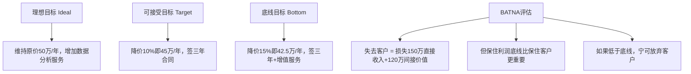
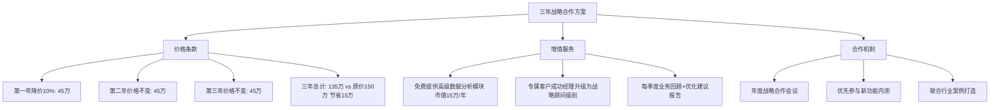
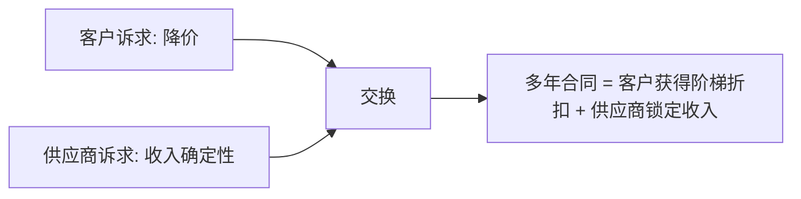
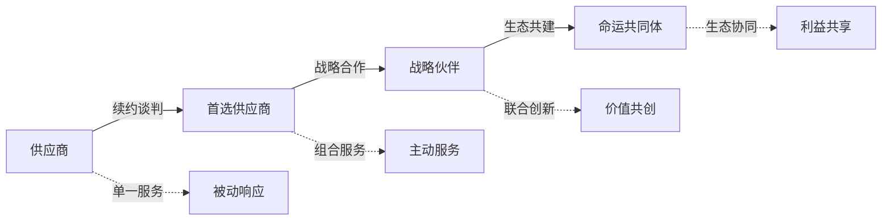

## 案例五：客户续约——商业关系的持续维护

客户续约谈判是商业世界中最常见却最容易被低估的谈判场景。与初次签约不同，续约谈判发生在既有关系的基础上——双方都有历史数据、有合作记忆、有未兑现的承诺。这既是优势（信任基础已建立），也是陷阱（惯性思维导致准备不足）。哈佛商学院的研究表明，获取新客户的成本是维护老客户的5-25倍，而老客户的利润率比新客户高60%-70%。因此，续约谈判不仅仅是"续签合同"，而是对一段商业关系的重新评估和战略升级。

本案例通过一个真实的软件服务续约场景，完整拆解从前期准备到最终签约的全流程，展示如何在客户要求大幅降价的压力下，既守住利润底线，又深化合作关系。

### 一、案例背景

#### 1.1 基本信息

某企业级软件公司（以下简称"甲公司"）的核心产品是一套供应链管理系统，为一家大型制造企业（以下简称"乙公司"）提供SaaS服务。双方合作已满三年，合同即将到期。

- **合同金额**：年服务费50万元
- **服务内容**：系统运维、功能迭代、技术支持、数据备份
- **客户规模**：乙公司年营收约8亿元，使用甲公司系统的采购部门涉及200+用户
- **行业背景**：近三年SaaS市场竞争加剧，多家新进入者以低价策略抢夺市场

#### 1.2 冲突起点

续约前两个月，乙公司采购总监正式提出：

> "市场竞争很激烈，其他供应商的报价比你们低30%。公司要求降本增效，我们希望续约价格下调20%，否则将启动供应商替换流程。"

这意味着年费从50万降到40万，三年合同期内甲公司将损失30万收入。如果接受，利润率将从35%压缩到不足15%，几乎无法覆盖定制化服务的成本。

#### 1.3 核心挑战

这场续约谈判面临三重压力：

| 压力维度 | 具体表现 | 影响程度 |
|---------|---------|---------|
| 价格压力 | 客户要求降价20%，竞争对手报价低30% | 高 |
| 替换威胁 | 客户已接触其他供应商，有真实替换意愿 | 高 |
| 关系惯性 | 三年合作形成的"舒适区"导致准备不足 | 中 |

### 二、谈判准备：比谈判本身更重要的80%

#### 2.1 客户价值全景分析

谈判准备的第一步不是想"怎么拒绝降价"，而是搞清楚"这个客户到底值多少"。甲公司的客户成功团队做了以下分析：

**历史贡献分析**：

**未来潜力评估**：

- 乙公司正在推进数字化转型，未来三年可能追加采购数据分析模块、AI预测模块
- 乙公司的母公司旗下还有6家子公司，存在集团级推广机会
- 乙公司所在的制造业垂直领域是甲公司的战略重点行业

**客户分层定级**：根据RFM模型（最近消费时间、消费频率、消费金额），乙公司属于"战略型客户"——不仅贡献直接收入，还具有行业标杆价值和转介绍潜力。这类客户的续约谈判策略应区别于普通客户。

#### 2.2 竞争对手情报收集

知己知彼是谈判的基本功。甲公司通过以下渠道收集了竞争情报：

**情报来源与分析**：

| 情报来源 | 获取的信息 | 可靠度 |
|---------|-----------|-------|
| 行业展会交流 | 新进入者A公司报价确实低30%，但仅覆盖基础运维 | 高 |
| 客户技术人员反馈 | 客户内部评估认为切换成本约40-60万（含数据迁移、人员培训、业务中断） | 高 |
| 离职员工访谈 | A公司尚未在制造业有成功案例，技术成熟度存疑 | 中 |
| 公开财报/融资信息 | A公司处于烧钱获客阶段，低价策略不可持续 | 中 |

**关键发现**：竞争对手的低价是"入门价"，不含定制开发、数据分析、专属客户成功经理等增值服务。如果客户选择切换，三年总拥有成本（TCO）反而可能更高。

#### 2.3 己方筹码梳理

甲公司盘点了手中的谈判筹码：

1. **迁移成本**：客户切换供应商需要40-60万的隐性成本，包括数据迁移、系统对接、人员培训、业务中断风险
2. **数据资产**：三年积累的业务数据和分析模型，迁移后价值大幅缩水
3. **定制功能**：为乙公司开发的7个定制模块，竞争对手无法直接复制
4. **响应速度**：专属客户成功经理，平均响应时间15分钟，行业内平均2小时
5. **行业Know-How**：三年合作积累的行业理解，新供应商需要重新学习

#### 2.4 目标设定与BATNA评估

运用哈佛谈判法的三层目标设定：

**BATNA（最佳替代方案）分析**：如果谈判破裂，甲公司的替代方案是将服务资源投入到其他潜力客户。但考虑到乙公司的战略价值和转介绍潜力，BATNA并不理想——这说明甲公司应在底线范围内积极争取续约。

#### 2.5 策略规划

基于以上分析，甲公司制定了分阶段策略：

**阶段一：价值重塑（开局）**
- 不急于回应降价要求，先引导客户重新审视合作价值
- 用数据说话，展示三年合作的具体成果

**阶段二：方案创新（中场）**
- 不在"降价多少"上纠缠，而是重新定义交易结构
- 用"增值服务+长期绑定"替代"单纯降价"

**阶段三：锁定承诺（收尾）**
- 将口头共识转化为书面协议
- 建立长期合作的制度化机制

### 三、谈判过程：四个关键回合

#### 3.1 第一回合：开局——建立价值锚点

甲公司客户成功总监王总约见乙公司采购总监李总，开场不谈价格，而是展示合作成果：

> "李总，在讨论续约之前，我想先和您回顾一下过去三年我们共同取得的成果。这不是为了炫耀，而是为了确保我们在同一个事实基础上讨论未来。"

随后展示了精心准备的"三年合作价值报告"：

**价值报告核心数据**：

| 指标 | 甲公司表现 | 行业平均 | 客户获益 |
|-----|-----------|---------|---------|
| 系统可用性 | 99.95% | 99.5% | 减少停机损失约35万/年 |
| 平均故障修复时间 | 1.5小时 | 8小时 | 减少业务中断约20万/年 |
| 定制功能交付 | 7个模块 | 竞争对手需额外付费 | 市场价值约80万 |
| 数据分析报告 | 每月定制报告 | 仅提供标准报表 | 辅助决策，间接节约成本 |
| 培训支持 | 每季度上门培训 | 仅提供在线文档 | 用户上手效率提升40% |

**李总的反应**：表情从最初的"公事公办"变得认真，开始翻阅报告中的具体数据。这说明价值锚点已经开始发挥作用——客户从"价格谈判"心态转向"价值评估"心态。

#### 3.2 第二回合：中场交锋——化解价格压力

李总看完报告后，仍然坚持降价诉求：

> "王总，这些数据我认可。但公司的降本增效是硬指标，我必须给领导一个交代。其他供应商确实便宜30%。"

王总没有直接反驳，而是用"总拥有成本"框架重新定义问题：

> "李总，我完全理解您面临的压力。不过我想请您考虑一个维度——总拥有成本。如果我们看三年的总投入，不仅仅是合同金额。"

随后展示了一张对比分析表：

**三年总拥有成本对比**：

| 成本项目 | 续约甲公司 | 切换到A公司 |
|---------|-----------|------------|
| 三年合同金额 | 135万（降价10%） | 105万（低价30%） |
| 数据迁移成本 | 0 | 25-35万 |
| 系统对接成本 | 0 | 15-20万 |
| 人员培训成本 | 0 | 8-12万 |
| 业务中断风险 | 0 | 预估损失10-20万 |
| 定制功能重开发 | 0 | 40-60万 |
| **三年总成本** | **135万** | **203-247万** |

> "李总，表面上看A公司便宜30%，但如果算上切换成本，三年总成本反而高出50%-80%。而且这还没算业务中断带来的隐性损失。"

**这个回合的关键技巧**：不是否定客户的诉求（"我们不能降价"），而是帮助客户看到更完整的图景（"总成本其实更低"）。

#### 3.3 第三回合：创造性方案——重构交易结构

李总被总成本分析说服了一半，但仍然需要"给领导交代"。王总提出了一个创造性的方案：

> "李总，我有一个想法，既能让您向公司交代降本成果，又能确保服务质量不打折。"

**方案内容**：

**方案设计的底层逻辑**：

1. **价格上的"让步"是真实的**：降价10%，三年节省15万，李总可以向领导汇报"成功压价"
2. **增值服务成本可控**：数据分析模块已开发完成，边际成本接近零，但对客户价值15万/年
3. **长期绑定创造双赢**：三年合同锁定收入，客户获得价格稳定性和优先服务
4. **合作升级创造新价值**：联合案例、行业活动等软性合作，双方都能从中获益

#### 3.4 第四回合：收尾——锁定承诺

李总对方案表示认可，但提出一个修改意见：

> "方案整体不错，但我希望第二年和第三年也能有5%的降价空间，如果你们的服务指标没有达到承诺的水平。"

王总将这个诉求转化为"对赌条款"：

> "完全可以。我们可以加入一个绩效对赌机制：如果我们的系统可用性低于99.9%、平均修复时间超过2小时、或客户满意度低于90%，第二年和第三年各再降5%。反过来，如果指标全部达标，价格维持不变。"

这个对赌条款的设计精妙之处在于：
- **表面上满足了客户的诉求**：保留了降价的可能性
- **实际上对甲公司有利**：历史数据表明这些指标完全可以达标
- **将价格与价值绑定**：强化了"好服务值得好价格"的逻辑

**最终协议要点**：

| 条款 | 内容 |
|-----|------|
| 合同期限 | 三年 |
| 第一年价格 | 45万（降价10%） |
| 第二年价格 | 45万，若服务指标未达标降至42.5万 |
| 第三年价格 | 45万，若服务指标未达标降至42.5万 |
| 增值服务 | 免费提供高级数据分析模块 |
| 服务等级 | 可用性≥99.9%，修复时间≤2小时，满意度≥90% |
| 回顾机制 | 每季度业务回顾会议 |
| 合作升级 | 联合行业案例、优先内测新功能 |

### 四、关键技巧深度拆解

#### 4.1 价值量化：从"我觉得"到"数据显示"

续约谈判中最常见的错误是空谈价值——"我们的服务很好""我们的团队很专业"。客户对此免疫。有效的价值量化需要三个要素：

**量化框架**：

1. **基线对比**：你的服务vs行业平均，差距是多少？
2. **货币换算**：这个差距折算成多少钱？（停机1小时损失多少？响应慢导致什么后果？）
3. **趋势分析**：三年来指标是在改善还是恶化？

**实操模板——服务价值量化表**：

| 服务指标 | 你的表现 | 行业平均 | 差距 | 货币影响/年 |
|---------|---------|---------|------|-----------|
| 系统可用性 | 99.95% | 99.5% | 0.45% | 减少停机损失X万 |
| 响应时间 | 15分钟 | 2小时 | -93% | 减少等待成本X万 |
| 问题解决率 | 98% | 85% | +13% | 减少重复报修X万 |
| 定制交付 | 7模块 | 需额外付费 | 节省X万 | 市场价值X万 |

#### 4.2 总成本视角：改变客户的决策框架

当客户说"别人比你便宜"时，不要陷入"我也可以便宜"的防御模式。正确的做法是改变决策框架——从"合同价格"切换到"总拥有成本"。

**总拥有成本（TCO）的五个维度**：

1. **直接成本**：合同金额、License费、订阅费
2. **切换成本**：数据迁移、系统对接、人员培训、业务中断
3. **运维成本**：日常维护、故障处理、版本升级
4. **机会成本**：使用低质量服务导致的效率损失、错失的业务机会
5. **风险成本**：供应商倒闭、服务中断、数据丢失的潜在损失

**说服话术模板**：

> "我理解价格是重要的考量因素。不过我建议我们换一个视角——看三年的总拥有成本。除了合同金额，还需要考虑[切换成本/运维成本/机会成本]。如果我们把这些都算进去，您会发现[具体结论]。"

#### 4.3 多年绑定：用确定性交换价格

多年合同是续约谈判中最强大的筹码之一，因为它创造了一个"交换物"——客户想要降价，你想要确定性，各取所需。

**多年合同的谈判逻辑**：

**阶梯定价的常见模式**：

| 模式 | 第一年 | 第二年 | 第三年 | 适用场景 |
|-----|-------|-------|-------|---------|
| 前低后高 | 降价15% | 降价10% | 原价 | 客户预算压力大，但长期有增长预期 |
| 统一折扣 | 降价10% | 降价10% | 降价10% | 简单直接，客户容易理解 |
| 前降后稳 | 降价10% | 不变 | 不变 | 本案例采用，平衡短期交代和长期稳定 |
| 绩效挂钩 | 基础价 | 基础价±浮动 | 基础价±浮动 | 服务质量可量化时 |

#### 4.4 增值服务：低成本高感知的让步艺术

降价是"硬让步"——直接减少收入。增值服务是"软让步"——成本可控但客户感知价值高。

**增值服务的选择原则**：

1. **边际成本低**：已开发完成的功能、空闲的计算资源、标准化的培训课程
2. **感知价值高**：客户能明确感受到"赚到了"
3. **增强粘性**：使用越多，切换成本越高
4. **不可替代**：竞争对手难以复制

**常见增值服务清单**：

| 服务类型 | 供应商成本 | 客户感知价值 | 粘性效果 |
|---------|-----------|------------|---------|
| 高级数据分析 | 近零（已开发） | 高（15万/年） | 强（数据积累） |
| 专属客户成功经理 | 中（人力成本） | 高（被重视感） | 强（关系绑定） |
| 优先技术支持 | 低（排班调整） | 高（安全感） | 中 |
| 新功能内测资格 | 近零 | 中（参与感） | 强（习惯养成） |
| 行业报告/白皮书 | 低（内容复用） | 中（信息价值） | 弱 |
| 联合品牌活动 | 中 | 高（曝光价值） | 中（关系深化） |

#### 4.5 绩效对赌：将不确定性转化为谈判筹码

当客户要求"如果服务不好就降价"时，不要抗拒——把它转化为对赌条款。对赌条款的精髓是：**用你有信心达到的指标，换取价格的稳定性**。

**对赌条款设计要点**：

1. **选择可控指标**：选你能确保达标的指标，不要选依赖客户配合的指标
2. **明确测量标准**：用什么工具测量？谁来测量？争议如何解决？
3. **设置合理阈值**：太松客户觉得没诚意，太紧给自己挖坑
4. **双向对赌更公平**：如果超标，可以要求价格上浮或获得额外奖励

**示例条款文本**：

> 服务等级协议（SLA）对赌条款：
> - 系统可用性≥99.9%，由第三方监控工具（如Pingdom）测量
> - 平均故障修复时间≤2小时，以客户提交工单到关闭的时间为准
> - 客户满意度≥90%，以季度满意度调查结果为准
> - 若连续两个季度任一指标未达标，次年价格下调5%
> - 若全年所有指标均达标，供应商获得优先续约权及次年价格上浮3%的权利

### 五、常见误区与纠正

#### 误区一：一听到降价就慌

**错误表现**：客户一提降价，立刻开始计算能降多少，陷入被动。

**纠正方法**：降价诉求是谈判的起点，不是终点。先搞清楚客户的真实需求——是真的预算紧张，还是在试探你的底线，还是被竞争对手施压。不同原因对应不同策略。

#### 误区二：只谈价格不谈价值

**错误表现**：整个谈判围绕"降多少"来回拉锯，最后双方都不满意。

**纠正方法**：在讨论价格之前，先花足够的时间展示价值。客户愿意为价值付费，但前提是他们真正理解了价值。准备一份详尽的"合作价值报告"，用数据说话。

#### 误区三：被动回应而非主动设计

**错误表现**：客户提方案，你只做"是/否"的回应，丧失主动权。

**纠正方法**：永远要带着方案上桌。不是"你要降价我能不能接受"，而是"我有一个方案，既满足你的降本需求，又保证服务质量"。方案设计能力是续约谈判的核心竞争力。

#### 误区四：忽视决策链路

**错误表现**：只和采购对接人谈判，不了解客户的内部决策流程和真正的决策者。

**纠正方法**：搞清楚谁是最终拍板的人。采购总监可能需要向VP或CEO汇报，你需要帮他准备"说服领导的弹药"——数据、对比分析、风险评估。

#### 误区五：把续约当一次性交易

**错误表现**：谈判结束签完合同就不管了，直到下次续约才重新出现。

**纠正方法**：续约谈判的成败在签约后的第一天就开始决定了。建立季度回顾机制，持续量化和展示服务价值，让客户在下次续约前就已经充分认可你的价值。

### 六、进阶技巧：从续约到战略升级

#### 6.1 关系升级路径

续约不应该只是"延续旧合同"，而是推动关系升级的机会：

#### 6.2 客户生命周期管理

成熟的续约谈判不是"到期才谈"，而是一个持续的过程：

| 阶段 | 时间节点 | 关键动作 |
|-----|---------|---------|
| 价值铺垫 | 合同期内持续 | 季度回顾、价值报告、成功案例沉淀 |
| 预热准备 | 到期前6个月 | 内部评估、竞争情报、方案设计 |
| 正式谈判 | 到期前3个月 | 多轮沟通、方案迭代、高层对接 |
| 签约执行 | 到期前1个月 | 合同审核、法律确认、签署 |
| 关系重启 | 签约后立即 | 启动新周期、承诺兑现、新一轮价值积累 |

#### 6.3 处理"被替换"的真实威胁

当客户真的在认真考虑换供应商时，需要额外的策略：

1. **不要恐慌性降价**：这只会让客户觉得你之前的报价有水分
2. **深入了解替换动机**：是真的对服务不满，还是受内部预算压力驱动
3. **提供"试用期"方案**：让客户先体验新功能或增值服务，再做决定
4. **引入高层对话**：有时候采购层面的谈判僵局需要更高层级来打破
5. **接受合理的流失**：如果客户的预算确实无法支撑合理价格，体面地放手比亏本续约更明智

#### 6.4 数字化时代的续约新趋势

| 趋势 | 对续约谈判的影响 | 应对策略 |
|-----|----------------|---------|
| 按需付费模式普及 | 客户对固定年费的接受度下降 | 提供灵活的定价模型（基础费+用量费） |
| AI降低切换成本 | 迁移工具越来越智能，切换变得更简单 | 提升服务深度而非仅靠锁定 |
| 数据合规要求提高 | 数据迁移的合规成本上升 | 将数据治理能力作为差异化价值 |
| 多云/多供应商策略 | 客户倾向不把鸡蛋放一个篮子 | 提供模块化服务，接受部分被替代 |

### 七、实用工具箱

#### 7.1 续约谈判准备检查清单

- [ ] 客户三年来的使用数据分析（活跃度、功能使用率、工单数量）
- [ ] 服务价值量化报告（对比行业基准，折算货币价值）
- [ ] 竞争对手情报汇总（报价、服务范围、客户口碑）
- [ ] 总拥有成本对比分析（续约vs切换的完整成本对比）
- [ ] 客户决策链路图（谁是影响者、决策者、审批者）
- [ ] 己方筹码清单（迁移成本、数据资产、定制功能、关系基础）
- [ ] 三层目标设定（理想/可接受/底线）及BATNA评估
- [ ] 至少两个备选方案（不同价格-服务组合）
- [ ] 绩效对赌条款草案
- [ ] 增值服务清单及成本核算

#### 7.2 价值报告模板结构

1. **执行摘要**：一页纸总结三年合作价值
2. **关键指标对比**：你的表现vs行业平均vs客户期望
3. **货币化价值**：每一项服务的客户获益金额
4. **案例故事**：具体的服务亮点时刻（如某次重大故障的快速响应）
5. **未来规划**：下一阶段的服务升级计划
6. **客户证言**：客户内部用户的正面反馈

#### 7.3 谈判话术速查

| 场景 | 推荐话术 | 避免话术 |
|-----|---------|---------|
| 客户要求降价 | "我理解成本压力，让我们看看怎样在总成本上为您节省" | "我们已经是最优惠的价格了" |
| 客户提到竞争对手 | "了解，竞争对大家都好。不过我们看看切换的总成本" | "他们肯定做不好" |
| 客户威胁不续约 | "如果真的走到那一步，我们希望是基于全面评估的决定" | "你不能这样做" |
| 讨论增值服务 | "这个功能对我们来说边际成本很低，但对您价值很大" | "我们可以免费送你" |
| 签约前最后犹豫 | "我们可以先签一年，如果明年不满意，可以重新谈" | "这已经是最终方案了" |

### 八、经验总结

这场续约谈判最终达成了三年135万的合同，比原始报价仅减少15万（10%），但锁定了三年的收入确定性，并通过增值服务提升了客户粘性。更重要的是，双方关系从"供应商-客户"升级为"战略合作伙伴"。

**核心经验提炼**：

1. **准备比谈判更重要**：80%的功夫花在谈判桌之外——数据分析、情报收集、方案设计
2. **价值量化是王牌**：用数据和货币化的方式展示价值，比任何话术都有效
3. **改变框架而非硬碰硬**：从"价格谈判"转向"总成本谈判"，从"降价"转向"增值服务"
4. **设计双赢方案**：最好的谈判结果不是一方赢一方输，而是双方都觉得赚到了
5. **续约是关系的里程碑而非终点**：每一次续约都是深化关系、升级合作的机会
