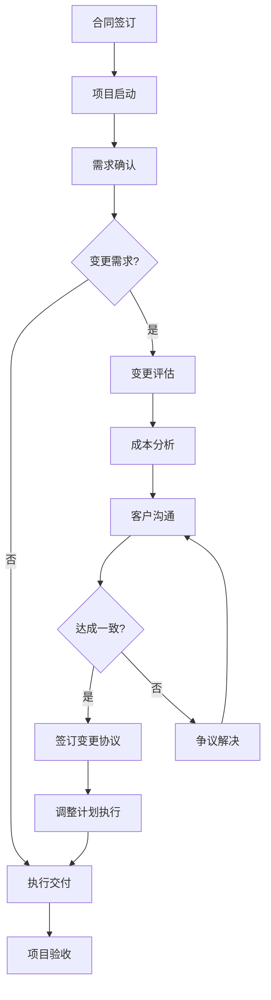
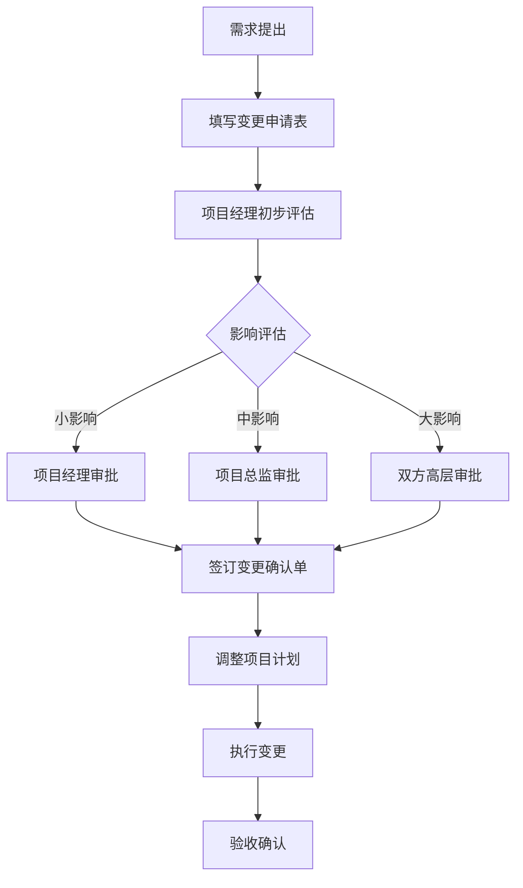

## 案例六：项目范围——工作边界的合理界定

项目范围蔓延（Scope Creep）是服务行业最常见、最具破坏力的问题之一。据PMI《脉搏报告》统计，52%的项目经历过范围蔓延，平均导致项目预算超支31%、工期延误42%。本章通过一个真实的项目范围谈判案例，系统讲解如何在维护客户关系的前提下，合理界定工作边界，建立可持续的项目管理机制。

### 一、范围管理的理论基础

#### 1.1 什么是项目范围蔓延

项目范围蔓延指在项目执行过程中，未经正式审批，不断添加新需求、新功能或新交付物的现象。其本质是**期望管理失效**——客户认为某些工作"应该包含在内"，而服务方认为"超出合同范围"。

范围蔓延的典型特征：

| 特征 | 表现 | 危害 |
|------|------|------|
| 渐进性 | 每次新增需求看似"很小"，但累积效应巨大 | 成本失控、工期延误 |
| 模糊性 | 合同条款不够明确，双方理解存在偏差 | 责任不清、互相推诿 |
| 情感性 | 客户以"关系好""下次合作"为由要求免费服务 | 利润侵蚀、团队士气下降 |
| 被动性 | 服务方为维护关系不敢拒绝，形成恶性循环 | 范围边界持续后退 |

#### 1.2 范围蔓延的根本原因

**客户端原因：**
- 需求不清晰：项目初期未充分梳理需求，执行中不断发现新需求
- 期望偏差：对服务内容的理解与合同约定存在差距
- 成本意识薄弱：不了解每个变更背后的人力和时间成本
- 决策分散：多个部门参与，各部门独立提出需求

**服务方原因：**
- 合同模糊：合同条款不够具体，留下解释空间
- 沟通不及时：发现问题后未及时沟通，导致问题积累
- 能力不足：缺乏专业的范围管理流程和工具
- 关系顾虑：担心提出收费要求影响客户关系

#### 1.3 范围管理的法律与合同基础

有效的范围管理建立在清晰的合同条款之上。关键条款包括：

**工作说明书（SOW）**：明确定义项目交付物、验收标准、排除事项
**变更控制条款**：规定变更的提出、评估、审批、实施流程
**价格调整条款**：明确变更导致的费用调整机制
**争议解决条款**：规定范围争议的解决方式

### 二、案例背景

#### 2.1 项目基本情况

**项目名称**：某消费品品牌全面升级项目
**项目金额**：80万元人民币
**项目周期**：6个月（2024年3月-8月）
**服务方**：创意无限设计公司（30人规模）
**客户方**：某知名消费品集团（年营收5亿元）

**原始合同约定的服务内容：**
1. 品牌战略定位研究
2. 品牌视觉识别系统（VI）设计
3. 品牌应用规范手册（100页）
4. 核心产品包装设计（5个SKU）
5. 品牌宣传物料设计（画册、展架、海报各1套）
6. 2轮修改，每轮不超过15个工作日

**项目执行情况：**
前3个月进展顺利，品牌战略和VI设计获得客户高度认可。第4个月开始，客户市场部、电商部、海外事业部陆续提出新需求：

| 序号 | 需求来源 | 需求内容 | 预估工作量 | 预估成本 |
|------|----------|----------|------------|----------|
| 1 | 市场部 | 新增10个SKU包装设计 | 40人天 | 12万 |
| 2 | 电商部 | 电商平台视觉规范 | 20人天 | 6万 |
| 3 | 电商部 | 产品详情页模板设计（20款） | 30人天 | 9万 |
| 4 | 海外事业部 | 品牌国际化视觉调整 | 25人天 | 7.5万 |
| 5 | 海外事业部 | 海外社交媒体素材设计 | 15人天 | 4.5万 |
| 6 | 市场部 | 品牌宣传片脚本策划 | 10人天 | 3万 |
| 7 | 市场部 | 年度营销活动视觉方案 | 20人天 | 6万 |
| 8 | 电商部 | 直播间视觉设计 | 15人天 | 4.5万 |
| 9 | 海外事业部 | 国际展会展示设计 | 25人天 | 7.5万 |
| 10 | 市场部 | 品牌IP形象设计 | 30人天 | 9万 |
| 11 | 电商部 | 移动端UI适配规范 | 15人天 | 4.5万 |
| 12 | 市场部 | 品牌故事视频制作 | 20人天 | 6万 |
| 13 | 海外事业部 | 多语言品牌手册 | 15人天 | 4.5万 |
| 14 | 电商部 | 社交媒体运营素材包 | 20人天 | 6万 |
| 15 | 市场部 | 品牌年度报告设计 | 15人天 | 4.5万 |
| **合计** | | | **310人天** | **93.5万** |

**问题严重性**：新增需求相当于原项目规模的117%，如果全部免费执行，项目利润率将从25%变为-17%，公司亏损约13.5万元。

#### 2.2 谈判前的困境

**服务方面临的两难选择：**
- **接受所有需求**：项目亏损，团队超负荷，质量下降
- **拒绝所有需求**：客户不满，可能影响后续合作（该客户年贡献营收约200万）
- **部分接受**：如何选择？如何定价？如何沟通？

**时间压力**：距离项目最终交付还有2个月，如果不尽快解决范围问题，项目将无法按时完成。

### 三、谈判准备

#### 3.1 信息收集与分析

**第一步：需求分类与优先级评估**

将15项需求按照业务价值和实施难度进行分类：

| 类别 | 需求编号 | 数量 | 总工作量 | 总成本 | 优先级 |
|------|----------|------|----------|--------|--------|
| 核心业务相关 | 1, 2, 3 | 3项 | 90人天 | 27万 | 高 |
| 战略拓展相关 | 4, 5, 9 | 3项 | 65人天 | 19.5万 | 中高 |
| 营销支持相关 | 6, 7, 12 | 3项 | 50人天 | 15万 | 中 |
| 创新探索相关 | 8, 10, 14 | 3项 | 65人天 | 19.5万 | 中低 |
| 补充完善相关 | 11, 13, 15 | 3项 | 45人天 | 13.5万 | 低 |

**第二步：客户价值分析**

评估该客户的长期价值：

| 维度 | 数据 | 说明 |
|------|------|------|
| 历史合作 | 3年，累计项目金额500万 | 稳定客户 |
| 未来潜力 | 年营收增长20%，品牌投入预算增加 | 增长潜力大 |
| 行业影响 | 行业头部企业，有示范效应 | 品牌价值高 |
| 付款信用 | 历史项目均按时付款 | 信用良好 |
| 推荐价值 | 已推荐3个新客户 | 转介绍价值 |

**结论**：该客户属于高价值客户，值得在合理范围内给予一定优惠，但不能无底线让步。

**第三步：成本结构透明化**

准备详细的成本说明材料，让客户理解每个变更的真实成本：

单个人天成本构成：
├── 设计师薪资：800元/天
├── 项目管理分摊：200元/天
├── 工具与软件分摊：100元/天
├── 公司运营成本分摊：300元/天
└── 合计：1,400元/人天

项目利润率：25%
客户单价：1,400 × 1.25 = 1,750元/人天

**第四步：替代方案研究**

准备2-3个替代方案，供客户选择：

**方案A：全部纳入，调整合同**
- 接受全部15项需求
- 合同金额调整为173.5万（原80万 + 新增93.5万）
- 项目周期延长至10个月

**方案B：优先选择，分批实施**
- 第一批（免费）：选择3项核心业务需求，纳入原合同（成本27万）
- 第二批（收费）：选择4项战略和营销需求，签订补充协议（成本34.5万，优惠价28万）
- 第三批（待定）：剩余8项需求，纳入下一个项目周期

**方案C：整体打包，优惠处理**
- 接受全部15项需求
- 合同金额调整为160万（原80万 + 新增80万，优惠13.5万）
- 项目周期延长至9个月
- 赠送3个月的售后支持

#### 3.2 谈判目标设定

| 目标层级 | 具体内容 | 依据 |
|----------|----------|------|
| **理想目标** | 客户接受方案B，新签补充协议55万 | 覆盖成本+合理利润 |
| **可接受目标** | 客户接受方案C，新签补充协议60万 | 覆盖成本+微利 |
| **底线目标** | 明确范围边界，至少新增收费40万 | 覆盖核心成本 |

#### 3.3 谈判团队与分工

| 角色 | 人员 | 职责 |
|------|------|------|
| 主谈 | 项目总监 | 整体把控、关键决策 |
| 技术支持 | 设计总监 | 解释技术难度和工作量 |
| 商务支持 | 客户经理 | 成本说明、方案呈现 |
| 记录 | 项目经理 | 会议记录、跟进落实 |

#### 3.4 预判客户可能的反应

| 客户可能的反应 | 应对策略 |
|----------------|----------|
| "这些都是小调整，应该包含在内" | 用具体工作量数据说明，展示每个需求的设计流程 |
| "其他公司都是免费做的" | 说明行业标准，提供竞品报价参考 |
| "我们是老客户，应该有优惠" | 承认关系价值，给出老客户专属优惠方案 |
| "预算已经批了80万，没有追加预算" | 提供分批实施方案，或协商内部追加预算 |
| "如果不做这些，项目效果会打折扣" | 分析每个需求的业务价值，帮助客户优先级排序 |

### 四、谈判过程详解

#### 4.1 开局阶段：建立共识，铺垫问题

**场景**：会议室，客户方市场总监、电商总监、采购经理出席

**服务方项目总监发言**：

> "王总、李总、张经理，感谢各位百忙中参加今天的会议。项目进展到今天，品牌战略和VI系统已经获得了各位的高度认可，这是我们双方共同努力的成果。
>
> 今天召集这个会议，是因为我们需要就项目范围进行一次坦诚的沟通。这不是一个对抗性的会议，而是为了确保项目最终能够达到我们共同期望的品质标准。"

**技巧分析**：
- 先肯定成绩，营造良好氛围
- 明确会议目的，避免信息不对称
- 强调"共同目标"而非"利益对立"

#### 4.2 问题呈现阶段：用数据说话

**服务方项目总监继续**：

> "在过去两个月，我们陆续收到了来自市场部、电商部、海外事业部的15项新需求。我们对每项需求进行了详细的工作量评估——"
>
> （展示详细的评估表格）
>
> "这15项需求合计需要310个设计人天，按照我们的标准成本核算，额外成本为93.5万元。这个数字相当于原项目规模的117%。
>
> 我想强调的是，这些需求都是有价值的，我们理解各部门的业务需要。但问题在于，如果全部纳入原合同，项目将面临几个现实困难："

（切换到下一页PPT）

> "第一，质量风险。原合同的80万预算支撑的是5项核心交付物的品质标准。如果工作量增加117%但预算不变，我们只能降低人员配置或压缩设计周期，这直接影响交付品质。
>
> 第二，时间风险。原项目周期6个月，新增工作量需要额外4个月。如果不调整时间线，项目将无法按时完成。
>
> 第三，团队风险。我们的设计团队目前满负荷运转，额外的工作量需要调配其他项目的人力，这会影响其他客户的项目进度。"

**技巧分析**：
- 用具体数据而非模糊描述
- 从客户利益角度（质量、时间）而非自身利益（利润）出发
- 展示专业性，让客户感受到服务方的认真态度

#### 4.3 客户回应阶段：理解与引导

**客户市场总监回应**：

> "我理解你们的工作量增加了，但这些需求都是品牌升级的自然延伸。当初我们签约时，你们就应该预见到这些需求。而且，你们之前做的设计确实不错，但这些周边配套不做的话，品牌升级的效果会大打折扣。"

**服务方回应**：

> "王总，您说的很有道理。品牌升级确实是一个系统工程，周边配套很重要。我想澄清两点：
>
> 第一，关于预见性。在项目启动时，我们确实讨论过品牌升级的整体框架，但当时各部门的具体需求还没有明确。合同中约定的5项交付物，是基于当时的信息做出的合理规划。
>
> 第二，关于效果。我完全同意这些配套对品牌效果很重要。正因为重要，我们才需要认真对待。如果在预算不足的情况下勉强执行，效果反而会打折扣。
>
> 所以，我今天带来的不是'做或不做'的问题，而是'怎么做'的方案。我准备了三个方案供各位选择。"

**技巧分析**：
- 不直接反驳客户，先表示理解
- 用事实澄清误解，而非争论对错
- 将讨论从"是否应该做"转向"如何做"，引导到解决方案

#### 4.4 方案呈现阶段：选择权交给客户

**服务方展示三个方案**：

> "方案一：全面升级方案。接受全部15项需求，合同金额调整为173.5万元，项目周期延长至10个月。这个方案的好处是一次性完成所有品牌相关工作，缺点是需要追加较大预算。
>
> 方案二：核心优先方案。我们根据业务价值将15项需求分为三个优先级。第一批（免费）：3项核心业务需求，纳入原合同。第二批（收费）：4项战略和营销需求，签订补充协议55万元。第三批（待定）：8项创新和补充需求，纳入下一个项目周期。这个方案的好处是分阶段推进，预算压力小，缺点是需要等待。
>
> 方案三：打包优惠方案。接受全部15项需求，合同金额调整为160万元（优惠13.5万），项目周期延长至9个月，赠送3个月售后支持。这个方案的好处是价格优惠，缺点是仍然需要追加预算。"

**技巧分析**：
- 提供多个选择，让客户有决策权
- 每个方案都说明优缺点，体现专业性
- 将"免费/收费"的二元对立转化为"方案选择"的多维讨论

#### 4.5 协商阶段：灵活应变，寻找共识

**客户电商总监提出异议**：

> "方案二听起来不错，但第二批55万太高了。我们的电商预算已经很紧张了，能不能把电商相关的3项需求（第2、3、8项）单独拎出来，给我们一个优惠价？"

**服务方回应**：

> "李总，我理解电商预算的压力。我们单独核算一下电商相关的需求：
>
> 电商平台视觉规范：20人天，6万元
> 产品详情页模板：30人天，9万元
> 直播间视觉设计：15人天，4.5万元
> 合计：65人天，19.5万元
>
> 如果单独打包，考虑到电商是品牌增长的重要渠道，我们可以给出一个老客户优惠价：16万元。同时，我们可以将详情页模板数量从20款减少到15款，进一步降低成本到13万元。
>
> 这样，电商部门可以用相对有限的预算获得核心的视觉支持。"

**技巧分析**：
- 积极回应客户的具体诉求
- 给出具体数字，而非模糊的"可以商量"
- 在让步的同时提出附加条件（减少数量），保护己方利益

#### 4.6 达成协议阶段：明确细节，书面确认

**最终协商结果**：

经过2小时的讨论，双方达成以下协议：

| 项目 | 内容 | 金额 | 时间 |
|------|------|------|------|
| 原合同 | 5项核心交付物 | 80万 | 按原计划 |
| 补充协议一 | 3项核心业务需求（包装10SKU、电商规范、详情页15款） | 40万 | 延长2个月 |
| 补充协议二 | 2项战略拓展需求（海外视觉调整、海外社媒素材） | 12万 | 延长1个月 |
| 后续项目 | 10项剩余需求 | 待定 | 下一项目周期 |
| **合计** | | **132万** | **9个月** |

**附加条款**：
1. 建立正式的变更管理流程，所有新需求必须书面提交
2. 每月召开项目范围评审会议
3. 客户推荐新项目，给予5%的价格优惠
4. 赠送3个月的售后支持期

**书面确认流程**：
1. 当天发送会议纪要，确认协商结果
2. 3个工作日内起草补充协议
3. 双方法务审核
4. 签署补充协议，调整项目计划

### 五、关键技巧深度解析

#### 5.1 成本透明化技术

**为什么要透明化？**

大多数客户并非故意压榨服务方，而是**不了解真实成本**。当客户说"这只是小调整"时，他们往往不知道：
- 一个"小调整"可能需要3个设计师工作2天
- 设计师的成本不仅是工资，还有工具、管理、运营分摊
- 每个需求都需要需求确认→设计→评审→修改→交付的完整流程

**如何透明化？**

**方法一：工作分解结构（WBS）展示**

将每个需求分解为具体的工作步骤，让客户看到真实的工作量：

需求：电商平台视觉规范

工作分解：
1. 需求沟通与确认（0.5人天）
   - 与电商部门沟通具体需求
   - 确认平台规范和设计要求
2. 竞品研究与分析（1人天）
   - 收集行业头部品牌电商视觉案例
   - 分析视觉趋势和用户偏好
3. 视觉规范设计（8人天）
   - 首页视觉规范（2天）
   - 产品页视觉规范（2天）
   - 活动页视觉规范（2天）
   - 移动端适配规范（2天）
4. 内部评审与修改（3人天）
   - 设计团队内部评审（1天）
   - 根据反馈修改（2天）
5. 客户提案与修改（5人天）
   - 第一次提案与沟通（1天）
   - 修改与二次提案（2天）
   - 最终确认（2天）
6. 文档整理与交付（2.5人天）
   - 规范文档编写（1.5天）
   - 源文件整理与交付（1天）

合计：20人天

**方法二：价值对比法**

将设计成本与业务价值进行对比，让客户理解投资回报：

| 需求 | 投入成本 | 业务价值 | ROI |
|------|----------|----------|-----|
| 电商视觉规范 | 6万 | 提升转化率15%，年增营收约200万 | 33倍 |
| 详情页模板 | 9万 | 提升详情页转化率20%，年增营收约300万 | 33倍 |
| 品牌IP形象 | 9万 | 提升品牌认知度，年增品牌价值约500万 | 55倍 |

#### 5.2 选择权给予技术

**原理**：当人们拥有选择权时，会感到被尊重，更容易接受结果。

**应用方式**：

**不要说**："这个需求需要额外收费12万元。"
**而要说**："关于这个需求，我准备了两个方案：方案A是完整版，12万元；方案B是简化版，8万元。您觉得哪个更适合当前的业务需要？"

**选择权设计原则**：
1. 选择数量：2-3个为宜，太多会造成决策疲劳
2. 差异明显：选项之间要有明显的区别，不能只是微调
3. 都可接受：每个选项都是己方可以接受的结果
4. 引导倾向：通过选项设计引导客户选择己方期望的方案

#### 5.3 长期价值锚定技术

**原理**：将当前谈判与长期合作关系绑定，创造"双赢"框架。

**应用方式**：

> "王总，我们合作3年了，累计完成了500万的项目，每个项目都获得了您的认可。这次品牌升级对贵司非常重要，我们希望做到最好。
>
> 我们愿意在价格上做出让步，但前提是建立一个可持续的合作机制。这次的补充协议，不仅是解决当前的范围问题，更是为未来的合作建立规范。"

**关键要素**：
- 提及历史合作的成功案例
- 强调未来合作的潜力
- 将价格让步与长期承诺挂钩

#### 5.4 变更管理流程设计

谈判达成协议后，最重要的是**建立流程**，防止问题再次发生。

**变更管理流程模板**：

**变更申请表模板**：

| 字段 | 内容 |
|------|------|
| 变更编号 | CHG-2024-001 |
| 提出日期 | 2024-06-15 |
| 提出人 | 市场部 张经理 |
| 变更描述 | 新增品牌IP形象设计 |
| 变更原因 | 品牌年轻化战略需要 |
| 预期效果 | 提升品牌亲和力，吸引Z世代消费者 |
| 预估工作量 | 30人天 |
| 预估成本 | 9万元 |
| 时间影响 | 延长项目周期1个月 |
| 审批状态 | 待审批 |
| 审批人 | |
| 审批日期 | |

### 六、常见错误与纠正方法

#### 6.1 谈判前的错误

| 错误 | 表现 | 纠正方法 |
|------|------|----------|
| 未做充分准备 | 对客户提出的需求没有详细评估 | 提前完成工作量评估和成本核算 |
| 目标不明确 | 不知道自己想要什么结果 | 设定理想、可接受、底线三级目标 |
| 忽视客户价值 | 只看当前项目，不考虑长期关系 | 完成客户价值分析，制定差异化策略 |
| 单打独斗 | 一个人应对客户多人 | 组建谈判团队，明确分工 |

#### 6.2 谈判中的错误

| 错误 | 表现 | 纠正方法 |
|------|------|----------|
| 情绪化回应 | 被客户激怒或感到委屈 | 保持专业，用数据说话 |
| 过早让步 | 客户一施压就降价 | 坚持到协商阶段再谈价格 |
| 模糊回应 | "我们可以商量" | 给出具体数字和方案 |
| 只谈价格 | 忽视质量、时间、服务等维度 | 提供多维度的解决方案 |
| 忽视记录 | 口头承诺不落实 | 当天发送会议纪要，书面确认 |

#### 6.3 谈判后的错误

| 错误 | 表现 | 纠正方法 |
|------|------|----------|
| 不签书面协议 | 依赖口头承诺 | 3个工作日内签署补充协议 |
| 不建立流程 | 同样的问题下次还会发生 | 建立变更管理流程 |
| 不复盘总结 | 错失学习机会 | 项目结束后进行复盘 |

### 七、进阶技巧

#### 7.1 预防性范围管理

**最高明的谈判是不需要谈判**——在问题发生之前预防。

**方法一：合同设计阶段**

在合同中加入以下条款：
- 明确的工作范围说明书，包括"包含项"和"排除项"
- 详细的验收标准
- 变更管理流程和费用标准
- 范围争议的解决机制

**方法二：项目启动阶段**

- 召开项目启动会，对齐双方期望
- 发送项目范围确认书，要求客户签字
- 建立定期沟通机制，及时发现潜在需求

**方法三：项目执行阶段**

- 每月发送项目状态报告，包括范围变更记录
- 发现新需求时，第一时间评估并沟通
- 记录所有沟通内容，形成书面档案

#### 7.2 复杂场景应对

**场景一：客户用竞争对手施压**

> 客户："XX公司说他们可以免费做这些。"

**应对**：

> "我理解市场上有不同的服务模式。我想了解的是，XX公司的报价是否包含了与我们相同的服务标准？比如：
> 1. 设计师的资历和经验水平
> 2. 修改次数和响应时间
> 3. 源文件交付和版权归属
> 4. 售后支持和服务保障
>
> 我们可以做一个详细的服务对比，帮助您做出最适合的选择。"

**场景二：客户高层直接施压**

> 客户CEO："这个项目对我们很重要，你们应该全力支持。"

**应对**：

> "张总，我们非常重视与贵司的合作，也理解品牌升级的重要性。正因为重要，我们才需要确保项目能够成功。如果在资源不足的情况下勉强执行，可能会影响最终效果。
>
> 我建议我们共同制定一个分阶段的实施计划，确保每个阶段都有充足的资源支持。您看这样是否更稳妥？"

**场景三：多个部门同时施压**

> 客户各部门："我们部门的需求最紧急，应该优先做。"

**应对**：

> "各位的需求都很重要，我理解各部门的紧迫性。我建议我们一起开一个优先级评审会，按照以下标准进行排序：
> 1. 业务影响度：对营收和市场份额的直接影响
> 2. 战略契合度：与公司整体战略的一致性
> 3. 实施难度：技术复杂度和资源需求
> 4. 时间敏感度：是否有明确的时间节点要求
>
> 我们用数据和标准来决定优先级，而不是谁的声音大。"

#### 7.3 跨文化范围谈判

在国际化项目中，范围管理需要考虑文化差异：

| 文化背景 | 范围管理特点 | 应对策略 |
|----------|--------------|----------|
| 美国 | 合同至上，变更必须书面确认 | 严格执行合同条款，变更走正式流程 |
| 日本 | 重视关系，倾向模糊处理 | 建立信任的同时，逐步引入规范流程 |
| 中东 | 议价文化，期望大幅优惠 | 预留议价空间，用增值服务替代直接降价 |
| 欧洲 | 注重专业性，尊重专业意见 | 用专业数据和案例说服，强调品质保障 |

### 八、工具与模板

#### 8.1 范围管理检查清单

**项目启动阶段**：
- [ ] 工作范围说明书是否包含"排除项"
- [ ] 验收标准是否具体可测量
- [ ] 变更管理流程是否写入合同
- [ ] 变更费用标准是否明确
- [ ] 项目范围确认书是否获得客户签字

**项目执行阶段**：
- [ ] 每月是否发送项目状态报告
- [ ] 新需求是否第一时间评估并沟通
- [ ] 变更是否都有书面记录
- [ ] 范围争议是否及时升级处理

**项目收尾阶段**：
- [ ] 所有交付物是否与合同一致
- [ ] 变更记录是否完整归档
- [ ] 范围管理经验是否复盘总结

#### 8.2 范围谈判话术库

**开场话术**：
- "今天我们需要就项目范围进行一次坦诚的沟通，目的是确保项目最终能够成功。"
- "我们收到了一些新的需求，想和您讨论一下如何更好地满足这些需求。"

**问题呈现话术**：
- "根据我们的评估，这些新增需求需要额外XX人天，相当于原项目规模的XX%。"
- "如果在现有预算下执行这些需求，可能会影响项目质量/进度。"

**方案呈现话术**：
- "我准备了几个方案供您选择，每个方案都有不同的优缺点。"
- "方案A适合预算充足的情况，方案B适合分阶段推进的情况。"

**协商话术**：
- "我理解您的预算限制，我们可以探讨一些灵活的处理方式。"
- "如果您能在XX方面做出调整，我们可以在XX方面给予优惠。"

**收尾话术**：
- "感谢您的理解和支持，我们会在3个工作日内发送补充协议。"
- "这次的沟通为我们未来的合作建立了很好的规范。"

### 九、经验总结与核心要点

#### 9.1 项目范围谈判的核心原则

1. **预防优于治疗**：在合同签订阶段就明确范围边界，比事后谈判更有效
2. **数据驱动决策**：用具体的工作量和成本数据说话，而非主观判断
3. **多方案选择**：提供2-3个方案，让客户有决策权，增加接受度
4. **长期价值导向**：将当前谈判与长期合作关系绑定，创造双赢
5. **流程制度化**：谈判达成的共识要转化为正式流程，防止问题复发

#### 9.2 范围管理成熟度模型

| 等级 | 特征 | 表现 |
|------|------|------|
| L1 初始级 | 无范围管理 | 范围蔓延频繁，项目亏损常见 |
| L2 合同级 | 有合同条款，但执行不力 | 范围问题时有发生，处理被动 |
| L3 流程级 | 有变更管理流程，基本执行 | 范围问题可控，但效率不高 |
| L4 量化级 | 有数据支撑，量化管理 | 范围管理精准，成本可控 |
| L5 优化级 | 持续改进，预防为主 | 范围问题罕见，客户满意度高 |

#### 9.3 从本案例学到的关键教训

**对服务方的启示**：
- 合同条款要尽可能详细，包括"排除项"
- 发现范围问题要第一时间沟通，不要等到问题积累
- 准备充分的数据和方案，展现专业性
- 建立变更管理流程，将共识制度化

**对客户的启示**：
- 项目初期要充分梳理需求，减少后期变更
- 理解服务方的成本结构，尊重专业价值
- 变更需求要走正式流程，避免口头沟通
- 长期合作建立在相互尊重和公平交易的基础上

**对行业的启示**：
- 范围管理是服务行业的核心能力
- 透明化和流程化是解决范围问题的关键
- 专业的范围管理能力是服务方的竞争优势
- 行业需要建立更规范的范围管理标准

---

项目范围谈判的本质是**期望管理**——通过专业、透明、系统的方式，将双方的期望对齐到一个合理的范围。这不是一场零和博弈，而是一次共同寻找最佳解决方案的过程。掌握范围谈判的技巧，不仅能保护服务方的合理利润，更能帮助客户获得真正有价值的成果，实现长期的双赢合作。
