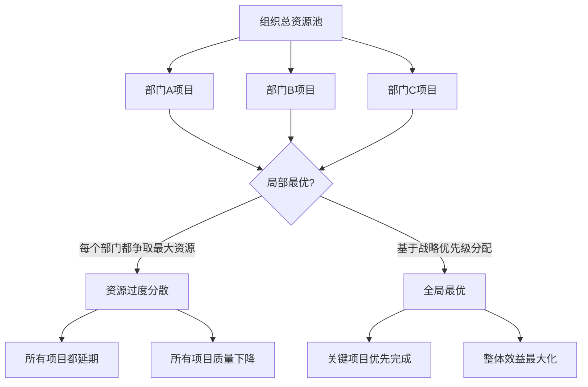
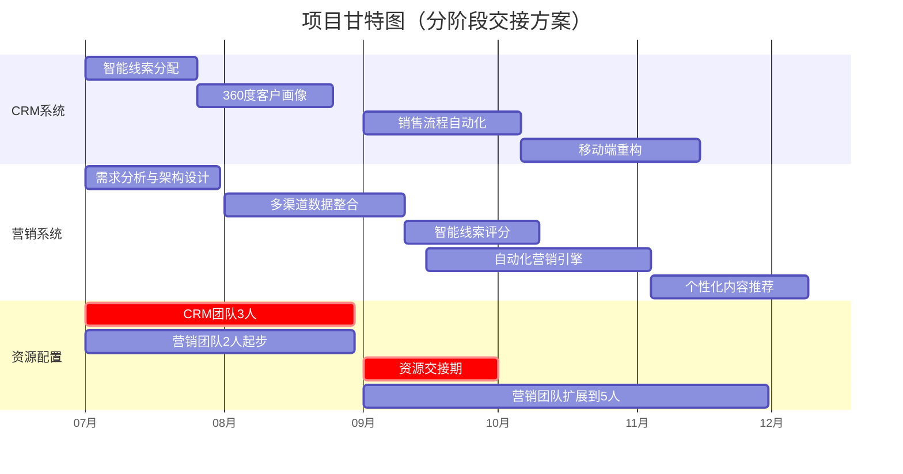
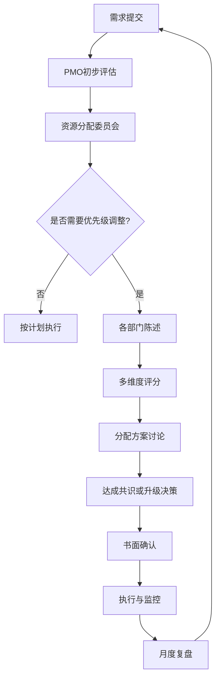

## 案例七：团队资源——内部协调的效率提升

内部资源谈判是组织管理中最频繁却最容易被忽视的谈判场景。据麦肯锡2023年《组织效能报告》统计，中层管理者平均花费28%的工作时间用于跨部门资源协调，而其中超过60%的协调过程缺乏结构化方法，导致资源错配率高达35%。本章通过一个真实的IT开发资源争夺案例，系统讲解如何在内部资源有限的约束下，通过结构化谈判实现多方共赢，将"零和博弈"转化为"正和博弈"。

### 一、内部资源谈判的理论基础

#### 1.1 什么是内部资源谈判

内部资源谈判是指同一组织内部不同部门、团队或项目之间，就有限的公共资源（人力、预算、设备、时间等）进行的协商过程。与外部谈判不同，内部谈判具有以下独特特征：

| 维度 | 外部谈判 | 内部谈判 |
|------|----------|----------|
| 关系性质 | 一次性或阶段性 | 长期持续 |
| 退出选项 | 可以选择不合作 | 必须共存 |
| 信息透明度 | 可选择性披露 | 信息高度共享 |
| 权力结构 | 相对独立 | 受组织层级影响 |
| 争议解决 | 第三方仲裁 | 上级裁决 |
| 目标导向 | 己方利益最大化 | 组织整体利益最大化 |

内部资源谈判的本质是**组织内部的优先级排序问题**——当多个有价值的项目争夺有限资源时，如何做出最优分配决策。

#### 1.2 内部资源谈判的常见场景

**人力资源争夺：**
- 开发团队资源分配（如本案例）
- 设计团队排期冲突
- 运维支持人员调配
- 跨部门借调协商

**预算资源分配：**
- 年度预算编制谈判
- 项目间资金调配
- 突发需求的预算追加
- 共享服务中心成本分摊

**设备与场地资源：**
- 会议室、实验设备预约冲突
- 生产线排期协商
- 测试环境资源共享
- 办公空间重新分配

**时间资源竞争：**
- 产品发布时间窗口争夺
- 技术支持响应优先级
- 共享服务的交付排期
- 跨部门协作的时间协调

#### 1.3 内部资源谈判的核心矛盾

内部资源谈判存在一个根本性矛盾：**局部最优与全局最优的冲突**。

每个部门从自身KPI出发，都认为自己的项目最重要、最紧急。但组织的资源总量是固定的，如果每个部门都追求局部最优，最终可能导致全局次优甚至全局最差的结果。

解决这个矛盾的关键在于：**从"争夺资源"的零和思维，转向"优化配置"的系统思维**。

#### 1.4 内部谈判的博弈论视角

从博弈论角度看，内部资源谈判是一个**重复博弈**（Repeated Game）而非一次性博弈。这意味着：

1. **声誉效应**：本次谈判的表现会影响未来谈判中的可信度
2. **互惠原则**：今天的让步可能换来明天的支持
3. **长期关系价值**：单次"赢"可能损害长期合作关系
4. **信号传递**：谈判方式传递出部门负责人的管理风格和职业素养

因此，内部资源谈判的最优策略不是"最大化己方所得"，而是"最大化长期合作价值"。

### 二、案例背景

#### 2.1 公司基本情况

**公司名称**：远景科技有限公司（虚构）
**公司规模**：500人，年营收3亿元
**行业**：B2B SaaS服务
**组织架构**：扁平化管理，设有市场部、销售部、产品部、技术部、客户成功部等

**IT开发团队现状：**
- 总人数：35人
- 分为3个小组：前端组（12人）、后端组（15人）、移动端组（8人）
- 当前在建项目：6个
- 本季度可调配资源：约10人（部分项目进入维护期）

#### 2.2 争夺双方的需求

**市场部需求——新一代营销自动化系统：**

市场部经理刘明提出，公司现有的营销系统已经使用了4年，存在以下问题：
- 线索获取渠道分散，数据无法打通
- 自动化营销流程简陋，无法支撑精细化运营
- 缺乏AI驱动的智能推荐和个性化触达能力
- 与竞品差距明显，影响市场竞争力

**项目需求明细：**

| 模块 | 功能描述 | 预估工作量 | 优先级 |
|------|----------|------------|--------|
| 多渠道数据整合 | 打通官网、社媒、SEM等8个渠道数据 | 40人天 | P0 |
| 智能线索评分 | 基于行为数据的AI评分模型 | 30人天 | P0 |
| 自动化营销引擎 | 可视化营销流程编排 | 50人天 | P1 |
| 个性化内容推荐 | AI驱动的内容智能匹配 | 35人天 | P1 |
| 营销效果分析 | 多维度ROI分析看板 | 25人天 | P2 |
| **合计** | | **180人天** | |

**预期收益**：获客效率提升30%，年增加收入500万元
**资源需求**：5名开发人员，3个月时间
**时间敏感度**：需要在Q3上线，赶上"金九银十"营销旺季

**销售部需求——CRM系统全面升级：**

销售部经理张伟提出，现有CRM系统存在严重瓶颈：
- 线索分配机制落后，优质线索经常被浪费
- 客户画像维度单一，无法支撑精准销售
- 销售流程自动化程度低，销售代表花大量时间做重复工作
- 移动端体验差，外出拜访时无法高效使用

**项目需求明细：**

| 模块 | 功能描述 | 预估工作量 | 优先级 |
|------|----------|------------|--------|
| 智能线索分配 | 基于能力画像的线索匹配算法 | 25人天 | P0 |
| 360度客户画像 | 整合多维度客户数据 | 30人天 | P0 |
| 销售流程自动化 | 从线索到回款的全流程自动化 | 35人天 | P1 |
| 移动端重构 | 原生App重写，离线支持 | 40人天 | P1 |
| 销售预测与分析 | AI销售预测、漏斗分析 | 20人天 | P2 |
| **合计** | | **150人天** | |

**预期收益**：销售转化率提升20%，年增加收入300万元
**资源需求**：3名开发人员，2个月时间
**时间敏感度**：需要在Q3完成，配合新财年销售策略

#### 2.3 资源冲突的本质

两个项目的需求加起来是330人天、8名开发人员。而本季度可用的开发人员只有10人，扣除日常维护和其他在建项目的支持需求，实际能调配给新项目的人力最多6-7人。

这意味着**两个项目无法同时按原计划推进**，必须做出取舍或寻找创造性方案。

#### 2.4 初始立场的对立

**市场部立场**：
- 营销系统是公司增长的引擎，没有好工具就没有好业绩
- Q3是营销旺季，错过窗口期损失巨大
- 预期收益500万，高于CRM的300万

**销售部立场**：
- CRM是销售团队的命脉，每天都在用
- 系统老旧已经严重影响了销售效率
- 销售团队直接创造收入，应该优先支持

**IT部门立场**：
- 人力确实有限，无法同时满足双方
- 需要一个公平、透明的分配机制
- 希望避免成为"背锅侠"

### 三、谈判准备

#### 3.1 信息收集与分析

**第一步：项目价值评估矩阵**

IT负责人陈工在谈判前，建立了一个多维度的项目评估模型：

| 评估维度 | 权重 | 营销系统评分 | CRM评分 | 评估说明 |
|----------|------|-------------|---------|----------|
| 业务价值（年化收益） | 25% | 9/10 | 7/10 | 营销系统预期收益更高 |
| 战略匹配度 | 20% | 8/10 | 7/10 | 公司战略重点在增长 |
| 时间敏感度 | 20% | 9/10 | 6/10 | 营销有明确的旺季窗口 |
| 技术复杂度 | 15% | 7/10 | 8/10 | CRM移动端重构更复杂 |
| 团队准备度 | 10% | 6/10 | 8/10 | CRM需求文档更完善 |
| ROI回收周期 | 10% | 7/10 | 8/10 | CRM见效更快 |
| **加权总分** | **100%** | **7.85** | **7.15** | 营销系统略高 |

**第二步：资源能力盘点**

| 技能领域 | 可用人数 | 营销系统需求 | CRM需求 | 冲突程度 |
|----------|----------|-------------|---------|----------|
| 前端开发 | 4人 | 2人 | 2人 | 低 |
| 后端Java | 3人 | 2人 | 2人 | 高 |
| 数据工程 | 2人 | 2人 | 1人 | 中 |
| 移动端开发 | 1人 | 0人 | 1人 | 无 |
| AI/算法 | 1人 | 1人 | 1人 | 高 |

**关键发现**：后端Java和AI/算法是最紧缺的技能，也是两个项目的核心争夺点。

**第三步：利益相关方分析**

| 利益相关方 | 核心关切 | 影响力 | 态度 |
|-----------|----------|--------|------|
| CEO | 公司整体增长 | 最高 | 中立，希望双赢 |
| CFO | 投入产出比 | 高 | 偏向ROI更高的方案 |
| 市场部 | Q3营销效果 | 中 | 强烈争取 |
| 销售部 | 销售效率提升 | 中 | 强烈争取 |
| IT部门 | 团队可持续性 | 中 | 中立，希望合理分配 |
| 产品部 | 产品竞争力 | 中 | 支持有战略价值的项目 |

#### 3.2 目标设定

**市场部目标层次：**
- 理想目标：获得5名开发人员，3个月完成全部功能
- 可接受目标：获得3-4名开发人员，优先完成P0功能
- 底线目标：至少获得2名开发人员，确保核心功能启动

**销售部目标层次：**
- 理想目标：获得3名开发人员，2个月完成全部功能
- 可接受目标：获得2-3名开发人员，优先完成P0功能
- 底线目标：至少获得2名开发人员，确保核心功能启动

**IT部门目标：**
- 理想目标：找到双方都能接受的分配方案，建立标准化的资源分配机制
- 可接受目标：至少让一个项目按时启动，另一个项目有明确排期
- 底线目标：避免部门间关系恶化，保持团队士气

#### 3.3 策略规划

**IT负责人陈工的策略框架：**

1. **建立客观标准**：用数据和评分模型代替主观判断，避免"谁嗓门大谁赢"
2. **引入战略视角**：将决策权适度上移，让高管从公司战略角度做裁决
3. **创造增量空间**：寻找突破资源约束的创造性方案
4. **保护各方面子**：让每个部门都觉得自己"赢了"，而不是"输了"

**预判各方可能的反应及应对：**

| 可能的反应 | 应对策略 |
|-----------|----------|
| "我们的项目ROI更高" | 承认数据，但引入多维度评估，不只看ROI |
| "CEO说过要支持增长" | 引入战略讨论，明确增长的具体路径 |
| "你们IT部门效率太低" | 展示团队现状和资源约束的客观数据 |
| "我们可以等，但不能不启动" | 设计分阶段方案，确保双方都有进展 |
| "能不能外包一部分" | 评估外包的可行性和风险 |

### 四、谈判过程详解

#### 4.1 开局阶段：建立共识框架

**场景**：公司大会议室，市场部经理刘明、销售部经理张伟、IT负责人陈工、列席的CTO王总

**IT负责人陈工开场**：

> "刘总、张总，感谢两位百忙中参加今天的资源协调会。今天这个会的目的不是争谁更重要——两个项目对公司都很重要。我们的目标是：在有限的资源下，找到一个让公司整体利益最大化的方案。
>
> 为了让讨论更高效，我提前做了一些准备工作，包括项目评估、资源盘点和几个初步方案。我们先一起看看数据，然后再讨论具体怎么安排。"

**技巧分析**：
- 立场中立，不偏向任何一方
- 将讨论框架从"谁更重要"转移到"如何最优配置"
- 用"我们"而非"你们"，营造协作氛围
- 提前准备数据，引导理性讨论

#### 4.2 信息共享阶段：让数据说话

**陈工展示评估结果**：

> "我用了一个多维度评估模型，从业务价值、战略匹配度、时间敏感度等6个维度对两个项目进行了评分。"
>
> （展示评估矩阵表格）
>
> "从数据上看，两个项目的综合评分差距不大——营销系统7.85分，CRM 7.15分。这说明两个项目确实都很重要，不存在一个'明显应该优先'的情况。
>
> 但有一个关键差异：时间敏感度。营销系统需要在Q3上线才能赶上旺季，而CRM虽然也急，但没有那么明确的时间窗口。这是我们需要重点考虑的因素。"

**市场部刘明回应**：

> "数据很清晰。我补充一点，营销系统如果错过Q3，不仅本季度的收益拿不到，还会影响明年的增长基数。这是一个'错过就没了'的机会。"

**销售部张伟回应**：

> "我同意营销系统有时间压力，但CRM的问题也很紧迫。我们的销售代表每天都在抱怨系统难用，上周有个大客户因为CRM记录混乱差点丢了单子。这是'每天都在发生'的损失。"

**陈工引导**：

> "两位说的都有道理。一个是有时间窗口的机会成本，一个是持续发生的效率损失。这两种损失的性质不同，但都很重要。
>
> 我建议我们不要陷入'谁更重要'的争论，而是讨论'怎么安排能同时满足双方的核心需求'。我准备了几个方案，我们逐一讨论。"

**技巧分析**：
- 用客观数据建立讨论基础，避免各说各话
- 承认双方需求的合理性，不否定任何一方
- 将"二选一"的框架转化为"如何兼顾"的框架
- 及时引导，避免讨论陷入僵局

#### 4.3 方案呈现阶段：多方案选择

**陈工提出三个方案**：

> **方案一：并行启动，资源共享**
>
> "两个项目同时启动，但共享部分资源。具体来说：
> - 前2个月：营销系统2人（需求分析+数据整合），CRM 3人（核心模块开发）
> - 第3个月：CRM转入营销系统团队，营销系统扩展到5人
> - 第4个月：营销系统完成核心功能，CRM完成剩余模块
>
> 这个方案的好处是两个项目都有进展，缺点是两个项目都不能完全按原计划完成。"

> **方案二：分阶段优先，明确排期**
>
> "根据时间敏感度，Q3优先营销系统，CRM排到Q4：
> - Q3（3个月）：全力开发营销系统，5人团队
> - Q4（3个月）：全力开发CRM，3人团队
> - 营销系统可以赶上Q3旺季，CRM在年底前上线
>
> 这个方案的好处是每个项目都能获得完整资源，缺点是CRM需要等待。"

> **方案三：战略裁决，高管决策**
>
> "如果两位无法达成一致，我们可以将两个项目的评估数据提交给CEO和CTO，由管理层从公司战略角度做出裁决。
>
> 这个方案的好处是决策权威性高，缺点是可能影响两位的自主权。"

**技巧分析**：
- 方案一偏向"兼顾"，方案二偏向"取舍"，方案三偏向"裁决"
- 每个方案都有明确的优缺点，让决策者有充分信息
- 方案三的存在给双方施加了适度压力——如果不想让上级决定，就要自己协商
- 将选择权交给双方，尊重他们的自主权

#### 4.4 协商阶段：寻找创造性方案

**市场部刘明回应**：

> "方案二对我们最有利，但我理解张总的感受。不过方案一的并行方案，两个项目都做不完整，这让我很担心。"

**销售部张伟回应**：

> "方案二让我们等一个季度，时间太长了。方案一虽然都有进展，但进展到什么程度？如果CRM只做了一半就停下来，那之前的投入就浪费了。"

**陈工回应**：

> "两位的顾虑很合理。让我提出一个改良方案——我称之为'分阶段交接方案'：
>
> **改良方案：分阶段交接**
>
> 第一阶段（第1-2个月）：
> - CRM团队：3人，完成智能线索分配和360度客户画像（P0功能）
> - 营销系统团队：2人，完成需求分析和多渠道数据整合设计
>
> 第二阶段（第3个月）：
> - CRM团队完成P0后，1人继续做P1，2人转入营销系统
> - 营销系统团队扩展到4人，开发数据整合和线索评分
>
> 第三阶段（第4-5个月）：
> - CRM剩余功能由1-2人完成
> - 营销系统团队5人，完成自动化引擎和个性化推荐
>
> 这个方案的关键创新是：CRM先完成最核心的功能（2个月），然后团队逐步转移给营销系统。这样CRM的核心功能不会被耽误，营销系统也能在Q3上线。"

**销售部张伟追问**：

> "CRM的核心功能2个月能完成吗？如果延期怎么办？"

**陈工回应**：

> "根据我们的评估，P0功能合计55人天，3人团队2个月（约44个工作日 × 3人 = 132人天）是足够的，甚至有缓冲空间。
>
> 如果出现延期，我们有一个保护机制：CRM团队至少保留1人持续支持，不会完全撤走。同时，营销系统的团队可以从2人起步，不依赖CRM团队的转入。"

**市场部刘明追问**：

> "营销系统从2人起步，进度会不会太慢？"

**陈工回应**：

> "前2个月的主要工作是需求分析和架构设计，这些工作2人是够的。而且这2个月正好是CRM完成核心功能的时间，等CRM团队转入后，营销系统进入密集开发阶段，效率反而更高。
>
> 我做了一个甘特图，两位看一下时间线。"

**陈工展示甘特图**：

**技巧分析**：
- 不满足于三个预设方案，在协商中创造新的可能性
- 用具体数据（人天、工作日）回应质疑，增强可信度
- 用甘特图可视化时间线，让各方看到全局
- 设置保护机制（CRM保留1人），降低风险感知

#### 4.5 达成协议阶段：明确细节

**最终协商结果**：

经过90分钟的讨论，三方达成以下协议：

| 阶段 | 时间 | CRM团队 | 营销系统团队 | 关键里程碑 |
|------|------|---------|-------------|-----------|
| 第一阶段 | 第1-2个月 | 3人 | 2人 | CRM完成P0功能 |
| 第二阶段 | 第3个月 | 1人 | 4人（+2人转入） | 营销系统完成数据整合 |
| 第三阶段 | 第4-5个月 | 1人 | 5人（+1人转入） | 营销系统完成核心功能 |
| 第四阶段 | 第6个月 | 完成收尾 | 完成收尾 | 两个系统上线 |

**CRM保障条款**：
- P0功能（智能线索分配、360度客户画像）必须在2个月内完成
- 团队转入营销系统后，至少保留1人支持CRM的P1功能
- 如CRM出现延期风险，IT负责人有权临时调配资源

**营销系统保障条款**：
- Q3结束前必须完成多渠道数据整合、智能线索评分、自动化营销引擎三个核心模块
- 第二阶段开始时，CRM团队2人转入，不迟于第3个月第1周
- 如营销系统出现延期风险，可申请外包支持

**IT部门保障条款**：
- 两个项目各设一名技术负责人，负责日常协调
- 每周召开资源协调会，监控进度和资源使用情况
- 建立资源冲突升级机制：技术负责人无法解决的冲突，48小时内上报CTO

**附加条款**：
- 本方案作为试点，未来跨部门资源分配将建立标准化流程
- 两个项目完成后，进行复盘总结，优化资源分配机制
- 如两个项目都按时完成，IT团队获得季度奖金激励

### 五、关键技巧深度解析

#### 5.1 数据驱动的评估框架

**为什么需要数据驱动？**

内部资源谈判最容易陷入的陷阱是**"谁声音大谁赢"**或**"谁官大谁赢"**。这种结果不仅不公平，还可能导致资源错配——把资源给了最有政治手腕的部门，而不是最需要的部门。

数据驱动的评估框架解决了这个问题：它提供了一个**客观、透明、可重复**的决策依据。

**如何建立评估框架？**

**步骤一：确定评估维度**

选择3-6个与组织战略相关的维度，每个维度必须是可衡量的：

| 维度类型 | 示例 | 数据来源 |
|----------|------|----------|
| 财务维度 | ROI、收入影响、成本节约 | 财务数据、业务预测 |
| 战略维度 | 与公司战略的匹配度 | 战略规划文档 |
| 时间维度 | 时间敏感度、窗口期 | 业务日历、市场节奏 |
| 风险维度 | 不做的风险、延期的风险 | 风险评估 |
| 能力维度 | 团队准备度、技术成熟度 | 团队评估 |

**步骤二：设定权重**

权重反映组织的优先级。权重设定应该：
- 由管理层共同确定，而非单一部门
- 根据组织战略动态调整
- 总权重为100%

**步骤三：独立评分**

每个维度的评分应该：
- 基于客观数据，而非主观感受
- 由中立的第三方（如PMO、IT负责人）初步评分
- 允许各方提供补充数据，但不允许单方面修改评分

**步骤四：综合计算**

将各维度评分加权求和，得到综合得分。得分差异在10%以内的，视为"价值相当"，需要其他因素（如时间敏感度）来决定优先级。

#### 5.2 创造性方案设计

**原理**：大多数内部资源谈判陷入僵局，是因为双方都停留在"二选一"的思维框架中。创造性方案的核心是**打破框架，找到第三种可能**。

**常用创造性方案模式：**

**模式一：时间分片**
- 不是"谁先谁后"，而是"谁在什么时间段"
- 适用于：两个项目都有时间要求，但窗口不完全重叠
- 本案例应用：CRM先做2个月，然后团队转移给营销系统

**模式二：资源共享**
- 不是"你的人"和"我的人"，而是"共同的人"
- 适用于：两个项目需要的技能有重叠
- 应用方式：建立共享资源池，按需调配

**模式三：功能裁剪**
- 不是"做全部"或"不做"，而是"做最重要的部分"
- 适用于：两个项目的功能都可以分优先级
- 应用方式：先完成P0功能，P1/P2留到下一阶段

**模式四：外部补充**
- 不是"内部资源够不够"，而是"能不能从外部补充"
- 适用于：项目时间紧迫，内部资源确实不足
- 应用方式：外包非核心模块、招聘临时人员、使用低代码工具

**模式五：合并简化**
- 不是"两个独立项目"，而是"一个整合项目"
- 适用于：两个项目有技术或业务上的关联
- 应用方式：统一技术架构，共享基础组件

#### 5.3 中立主持人的角色

**为什么需要中立主持人？**

内部资源谈判如果没有中立的主持人，容易出现以下问题：
- 某一方主导讨论，另一方被边缘化
- 讨论陷入细节争论，无法上升到决策层面
- 情绪化发言增多，理性分析减少

**中立主持人的职责：**

1. **设定议程**：明确讨论的步骤和时间安排
2. **引导讨论**：确保各方都有发言机会，避免一方主导
3. **呈现数据**：提供客观的评估数据，建立讨论基础
4. **提出方案**：基于数据提出初步方案，供各方讨论
5. **记录共识**：及时记录达成的共识，避免后续争议
6. **升级决策**：当双方无法达成一致时，建议升级到更高层决策

**本案例中陈工的角色分析**：

陈工作为IT负责人，既是资源的"供给方"，又是会议的"主持人"。这种双重角色有优势也有风险：

| 优势 | 风险 |
|------|------|
| 最了解资源现状 | 可能被认为偏向自己的团队 |
| 有能力提出可行方案 | 可能被质疑方案的客观性 |
| 有技术判断力 | 可能被要求为结果负责 |

陈工通过以下方式化解风险：
- 使用标准化的评估模型，而非个人判断
- 让双方参与评分过程，增加透明度
- 引入CTO列席，确保决策有高层背书
- 将最终决策权交给双方，而非自己裁决

#### 5.4 利益与立场的区分

**原理**：哈佛谈判原则的核心之一是"关注利益，而非立场"。在内部资源谈判中，这一点尤为重要。

**立场（Position）**：部门明确表态的要求
- 市场部立场："我们要5个人，3个月"
- 销售部立场："我们要3个人，2个月"

**利益（Interest）**：部门立场背后的真正需求
- 市场部利益：在Q3营销旺季前上线，抓住增长窗口
- 销售部利益：尽快提升销售效率，减少日常损失

**当关注利益而非立场时，解决方案空间大幅扩展**：

- 市场部不需要"5个人3个月"，需要的是"Q3上线"——如果能找到更高效的方案，人少一点也可以
- 销售部不需要"3个人2个月"，需要的是"尽快见效"——如果核心功能能先上线，其他功能可以等

这就是"分阶段交接方案"能够成功的关键：它没有满足双方的"立场"（各自要多少人），但满足了双方的"利益"（市场部Q3上线、销售部尽快见效）。

### 六、常见错误与纠正方法

#### 6.1 谈判前的错误

| 错误 | 表现 | 后果 | 纠正方法 |
|------|------|------|----------|
| 不做评估就开始谈 | "我觉得我们的项目更重要" | 陷入主观争论 | 建立客观评估框架 |
| 只准备自己的需求 | 不了解对方的需求和约束 | 无法找到创造性方案 | 做全面的利益相关方分析 |
| 没有备选方案 | 只有一个"必须成功"的方案 | 谈判陷入僵局 | 准备3个以上方案 |
| 忽略隐性利益 | 只谈资源数量，不谈其他诉求 | 错失交换机会 | 识别各方的隐性需求 |
| 单独行动 | 不提前沟通，直接在会上摊牌 | 对方措手不及，产生敌意 | 提前非正式沟通 |

#### 6.2 谈判中的错误

| 错误 | 表现 | 后果 | 纠正方法 |
|------|------|------|----------|
| 情绪化发言 | "你们总是这样"、"每次都抢我们的资源" | 破坏讨论氛围 | 用"我"而非"你"的表述方式 |
| 坚守立场不松动 | "我就要5个人，少一个都不行" | 谈判破裂 | 关注利益，灵活调整方案 |
| 过早让步 | 为了和谐直接妥协 | 方案不是最优解 | 充分讨论后再做决定 |
| 人身攻击 | "你们市场部就会画饼" | 关系破裂 | 对事不对人 |
| 不做记录 | 口头承诺不落实 | 后续争议 | 每个共识都书面记录 |
| 跳过方案讨论直接投票 | "我们投票决定" | 少数派不满 | 先穷尽创造性方案 |

#### 6.3 谈判后的错误

| 错误 | 表现 | 后果 | 纠正方法 |
|------|------|------|----------|
| 不跟进执行 | 协议签了就不管了 | 执行偏离 | 建立定期检查机制 |
| 不复盘总结 | 下次还犯同样的错 | 效率不提升 | 项目结束后复盘 |
| 不建立流程 | 每次都从头谈 | 浪费时间 | 将成功经验固化为流程 |
| 秋后算账 | "上次你们占了便宜" | 破坏长期关系 | 向前看，不翻旧账 |

### 七、进阶技巧

#### 7.1 建立资源分配的长效机制

**最高明的内部谈判是不需要谈判**——通过制度化的资源分配机制，减少临时协调的需求。

**资源分配委员会模式：**

| 组成 | 职责 | 频率 |
|------|------|------|
| CTO（主席） | 最终决策 | 每月参加 |
| 各部门负责人 | 提出需求、陈述理由 | 每月参加 |
| PMO负责人 | 数据分析、方案准备 | 每月参加 |
| 财务代表 | 成本效益分析 | 需要时参加 |

**标准化流程：**

#### 7.2 资源共享池模式

对于大型组织，可以建立**资源共享池**，将部分开发人员从"部门专属"变为"项目制调配"：

**资源共享池的运作方式：**
- 核心团队：各部门保留核心团队，负责日常运营和维护
- 共享团队：部分高级开发人员进入共享池，由PMO统一调配
- 项目制运作：共享池人员按项目需求分配，项目结束后回池
- 能力矩阵：建立人员技能矩阵，实现精准匹配

**优势**：
- 减少资源闲置，提高利用率
- 促进跨部门知识流动
- 减少部门间资源争夺

**挑战**：
- 需要强有力的PMO支持
- 人员归属感可能下降
- 需要更精细的项目管理能力

#### 7.3 预防性资源规划

**季度资源规划会议**：

在每个季度开始前，召开全公司资源规划会议：
1. 各部门提前提交下季度项目需求
2. PMO汇总并评估资源缺口
3. 资源分配委员会讨论并确定优先级
4. 形成季度资源分配计划
5. 月度滚动调整

**好处**：
- 避免临时争夺，减少协调成本
- 提前识别资源瓶颈，做好预案
- 让各部门有时间调整计划，减少冲突

#### 7.4 内部谈判的软技能

**倾听与共情**：

内部谈判中最容易犯的错误是"只顾说自己的，不听别人的"。有效的倾听包括：
- 复述对方的核心观点，确认理解正确
- 承认对方的困难和压力
- 用"我理解你的感受"而非"你应该理解我们"

**面子管理**：

在中国组织文化中，"面子"是内部谈判中不可忽视的因素：
- 不要在公开场合否定对方的方案
- 给对方"台阶下"，让对方可以说"我考虑了一下，觉得你的方案也有道理"
- 功劳共享："这是我们共同找到的方案"

**关系投资**：

内部资源谈判的胜负不仅取决于当下的讨论，还取决于平时的关系积累：
- 平时主动帮助其他部门解决问题
- 在不影响己方利益时，适度给予支持
- 建立跨部门的非正式沟通渠道

### 八、经验总结

#### 8.1 核心原则提炼

| 原则 | 说明 | 应用 |
|------|------|------|
| 数据驱动 | 用客观数据代替主观判断 | 建立多维度评估模型 |
| 利益导向 | 关注利益而非立场 | 深入理解各方的真实需求 |
| 创造性方案 | 打破"二选一"的思维框架 | 时间分片、资源共享、功能裁剪 |
| 中立主持 | 引入第三方协调角色 | PMO或跨部门负责人 |
| 长期视角 | 内部谈判是重复博弈 | 注重声誉和关系维护 |
| 流程固化 | 将成功经验制度化 | 建立资源分配委员会 |

#### 8.2 本案例的关键成功因素

1. **IT负责人主动担当**：陈工作为资源供给方，没有被动等待，而是主动组织协调，展示了专业能力和领导力

2. **数据先行**：在讨论之前就完成了多维度评估，为理性讨论奠定了基础

3. **方案创新**："分阶段交接方案"不是简单的妥协，而是基于深入分析的创造性解决方案

4. **保护各方核心利益**：CRM的核心功能不被耽误，营销系统能在Q3上线，IT团队的工作量可控

5. **建立长效机制**：将本次协调的经验固化为资源分配流程，为未来减少冲突

#### 8.3 可复用的工具清单

**评估工具：**
- 多维度项目评估矩阵（Excel模板）
- 资源能力盘点表（人员技能矩阵）
- 利益相关方分析图

**方案工具：**
- 甘特图（时间线可视化）
- 资源分配表（人天/人员分配）
- 方案对比表（多方案优缺点）

**沟通工具：**
- 会议议程模板
- 共识记录模板
- 协议执行跟踪表

**制度工具：**
- 资源分配委员会章程
- 季度资源规划流程
- 资源冲突升级机制

***

内部资源谈判看似是"分蛋糕"的零和博弈，实则是"做大蛋糕"的正和博弈。关键在于：**用数据建立共识，用创意打破僵局，用机制预防冲突**。当组织中的每个管理者都掌握了结构化的内部谈判方法，资源协调将不再是内耗的来源，而是组织效能提升的杠杆。
