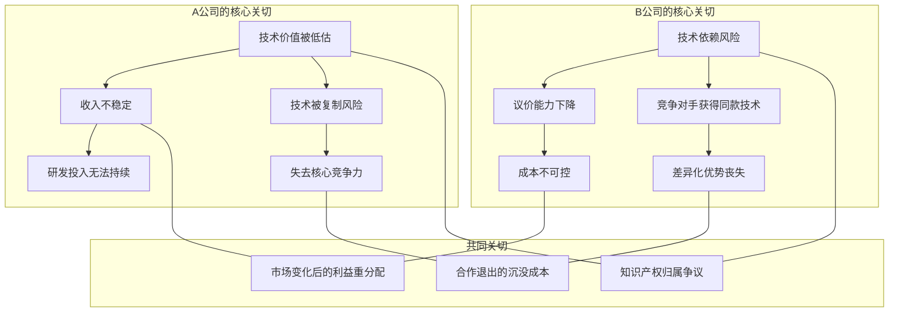
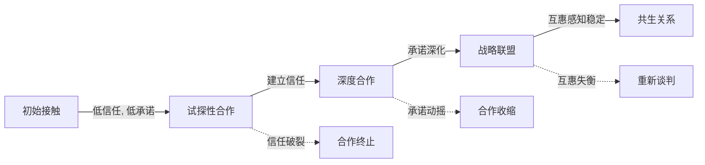
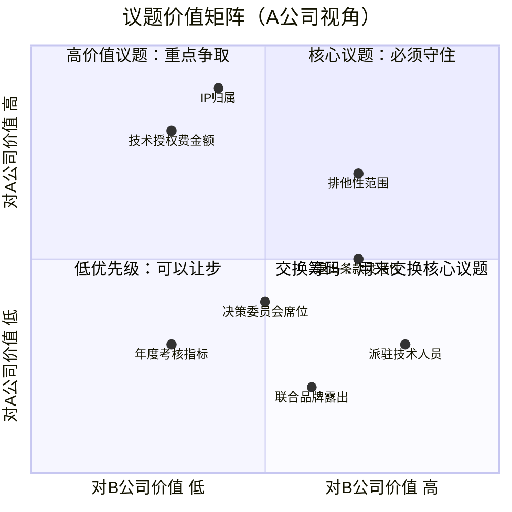

## 案例八：合作伙伴——长期关系的战略构建

战略合作谈判是所有谈判类型中最具复杂性和长期影响力的一种。与一次性交易不同，合作伙伴关系谈判的本质不是"分一块蛋糕"，而是"一起把蛋糕做大"——然后在更丰富的价值创造中找到双方都能接受的分配方式。本案例通过一个技术提供商与行业解决方案商之间的真实战略合作谈判，系统展示长期伙伴关系构建的完整方法论。

### 一、案例背景与冲突诊断

#### 1.1 企业画像

**A公司（技术提供商）**：拥有自主研发的AI视觉检测算法平台，核心技术团队来自中科院自动化所，在工业质检领域拥有12项发明专利。年营收约8000万元，其中70%来自产品授权，30%来自定制开发。面临的问题是：技术领先但行业渗透率不足，缺乏垂直行业的应用场景积累和客户渠道。

**B公司（行业解决方案商）**：深耕汽车零部件制造行业15年，服务超过200家Tier-1供应商，拥有完整的行业Know-how和客户关系网络。年营收约2.5亿元。面临的问题是：客户对智能化质检的需求日益强烈，但自研AI能力不足，外采技术方案的适配性和响应速度无法满足客户要求。

**合作契机**：A公司的技术能力与B公司的行业资源高度互补。如果合作成功，预计可在3年内将联合解决方案的市场规模做到3-5亿元，双方各取所需。但合作模式和利益分配是核心分歧点。

#### 1.2 核心冲突地图



这个冲突地图揭示了一个深层矛盾：A公司想要稳定回报和技术保护，B公司想要独占性和成本可控。双方的诉求在多个维度上存在张力，这正是战略合作谈判的典型特征——不是简单的零和博弈，而是需要在多个议题上进行复杂的利益交换。

#### 1.3 战略合作谈判的特殊性

与普通商务谈判相比，长期战略合作谈判有三个本质区别：

| 维度 | 一次性交易谈判 | 长期战略合作谈判 |
|------|--------------|----------------|
| 时间视角 | 当下利益最大化 | 未来3-10年的价值创造 |
| 信任基础 | 合同约束为主 | 关系信任+制度保障双重机制 |
| 价值逻辑 | 分配既定价值 | 创造新价值后再分配 |
| 风险类型 | 执行风险 | 关系风险+战略风险+执行风险 |
| 退出成本 | 低，交易完成即结束 | 高，涉及资产、人员、客户的重组 |
| 谈判频率 | 一次性或低频 | 持续性，协议执行本身就是长期谈判 |

理解这些区别，是正确准备战略合作谈判的前提。

### 二、理论框架：战略合作的四大支柱

#### 2.1 资源依赖理论（Resource Dependence Theory）

Pfeffer和Salancik在1978年提出的资源依赖理论指出，组织之间的合作本质上是对关键资源的相互依赖。A公司拥有技术资源，B公司拥有市场资源，双方都无法独立高效地获取对方的核心资源，因此产生了合作的内在动力。

**谈判启示**：在谈判中要清晰识别双方的资源互补性，这是合作价值的根本来源。同时要警惕——资源依赖是动态变化的，今天的互补可能在3年后变成竞争。

#### 2.2 交易成本理论（Transaction Cost Economics）

Williamson的交易成本理论解释了为什么企业选择"合作"而不是"市场交易"或"完全合并"。战略合作是介于市场和层级之间的治理结构，其核心挑战是：

- **资产专用性**：双方投入的资源是否只在合作中才有价值？专用性越高，被"锁定"的风险越大
- **不确定性**：未来市场、技术、政策的不确定性如何影响合作？
- **交易频率**：合作的交互频率越高，越需要建立正式治理结构

**谈判启示**：合作模式的设计应该匹配资产专用性和不确定性水平。专用性低、不确定性低的场景适合简单合同；专用性高、不确定性高的场景需要更灵活的治理结构。

#### 2.3 关系资本理论（Relational Capital Theory）

长期合作的成功不仅取决于制度设计，更取决于关系资本的积累。关系资本包含三个维度：

- **信任**：对合作伙伴履约能力和善意的信心
- **承诺**：双方对合作关系的长期投入意愿
- **互惠感知**：双方认为合作收益的分配是公平的



**谈判启示**：关系资本的建设需要时间，不能指望一次谈判就建立战略级信任。阶梯式合作模式的设计正是基于这一理论——通过渐进式投入逐步积累关系资本。

#### 2.4 联盟生命周期理论（Alliance Lifecycle Theory）

Dyer、Singh和Kale等学者的研究表明，战略联盟通常经历五个阶段：伙伴选择→谈判与协议→执行与协调→评估与调整→续约或退出。每个阶段的关键任务不同，谈判的焦点也应该随之调整。

**谈判启示**：不要只关注"签订协议"这一个节点。好的战略合作谈判应该为整个生命周期设计治理机制——包括信息共享、决策流程、绩效评估、利益重分配和退出安排。

### 三、谈判准备：系统性情报与战略设计

#### 3.1 四维信息收集框架

战略合作谈判的信息准备需要覆盖四个维度：

**维度一：对方企业画像**
- 财务状况：近3年营收趋势、利润率、现金流、融资历史
- 战略方向：最近的战略会议纪要、公开演讲、投资动向
- 组织文化：决策风格（集权/分权）、风险偏好、创新容忍度
- 合作历史：过去与其他企业的合作经历，是成功多还是纠纷多？
- 关键人物：决策者、影响者、执行者的个人背景和偏好

**维度二：行业生态分析**
- 竞争格局：行业内是否有其他潜在合作伙伴可选？
- 技术趋势：未来3-5年技术发展方向，当前合作的技术会否被淘汰？
- 政策环境：行业监管政策对合作模式有无限制？
- 标杆案例：同行业类似战略合作的成功/失败案例及其原因

**维度三：法律与合规**
- 知识产权：合作产生的IP如何归属？背景IP如何保护？
- 反垄断：排他性合作是否触发反垄断审查？
- 数据合规：联合方案涉及的数据如何合规处理？
- 争议解决：仲裁还是诉讼？适用法律是哪个法域？

**维度四：内部评估**
- 自身BATNA：如果不与B公司合作，还有哪些替代方案？最优替代方案的价值是多少？
- 核心底线：哪些资源/权利是绝对不能让渡的？
- 可交换筹码：哪些是自己可以灵活让步的，但对对方有高价值的议题？
- 内部共识：公司内部（技术团队、销售团队、管理层）对合作的期望是否一致？

#### 3.2 目标设定的三层架构

| 层级 | A公司目标 | B公司目标 | 差距分析 |
|------|----------|----------|---------|
| 理想目标 | 排他性合作，年固定授权费100万+收益分成15%，保留所有核心IP | 独占技术使用权，按项目付费，无固定费用，参与技术迭代决策 | 差距极大，需要创造性方案 |
| 可接受目标 | 深度合作，合理固定费用+收益分成，核心IP不转让但可授权 | 优先使用权，可控的成本结构，技术适配的灵活性 | 有交集空间，关键是定价机制和独占范围 |
| 底线目标 | 确保合作稳定性和技术价值认可，年收入不低于200万 | 获得可靠的技术供给，成本不超过项目预算的20% | 可调和，需要精确测算 |

#### 3.3 议题矩阵与交换策略

战略合作涉及多个议题，不能孤立谈判每个议题。正确的做法是构建议题矩阵，识别哪些议题对己方价值高、对对方价值低（可以用来交换），反之亦然：



### 四、谈判过程：六阶段深度复盘

#### 4.1 第一阶段：关系建立与议程设定（第1次会谈）

**目标**：建立专业信任，确定谈判框架，避免过早进入具体条款。

**关键对话实录与分析**：

> **A公司CEO**："张总，我们研究了贵司在汽车零部件行业的解决方案能力，非常敬佩。我们相信，AI质检在这个行业的渗透率目前不到10%，未来3-5年会达到40%以上。这个市场机会需要技术能力和行业深度的真正结合，而不是简单的供应商采购。"

*分析：开场聚焦于共同愿景和市场机会，而非己方诉求。"真正的结合"暗示了超越简单买卖关系的期望，"不是简单的供应商采购"设定了合作层级的议程。*

> **B公司CEO**："同意。我们的客户确实对AI质检有强烈需求，但坦率说，之前跟两家技术供应商的合作都不太理想——响应慢，适配差，把我们的行业需求当成普通定制项目处理。"

*分析：B公司透露了过去合作失败的痛点（响应慢、适配差），这是重要的信息——A公司需要在后续谈判中针对性地提出解决方案。同时，"不太理想"暗示B公司对新合作持谨慎态度，需要A公司展示差异化的承诺。*

> **A公司CEO**："这正是我们想解决的问题。我们建议，今天的会谈先确定三个议题：第一，合作的愿景和范围；第二，各自的核心关切；第三，下一步的工作计划。具体的商业条款留到第二次会谈，确保双方对合作本身有共识再谈细节。"

*分析：提出结构化的议程，展示专业性和对过程的掌控力。将商业条款推迟到第二次会谈是正确策略——先建立共识框架，避免在信任不足时陷入数字拉锯。*

**本阶段关键技巧**：
- 聚焦共同利益而非各自立场
- 通过提问获取对方痛点信息
- 控制谈判节奏，不在第一次会谈就进入条款谈判
- 用"愿景-关切-计划"框架引导对话

#### 4.2 第二阶段：核心关切与合作模式框架（第2-3次会谈）

**目标**：明确双方核心关切，探索合作模式的可能空间。

**关键对话**：

> **B公司**："我们的核心诉求是三个字——'稳定性'。技术供给要稳定，成本要可预期，不能合作到一半因为你们内部调整就断供。"

> **A公司**："理解。我们的核心诉求也是三个字——'价值感'。我们的技术投入巨大，需要在合作中得到合理的价值认可，而不是被当成外包技术团队。"

**合作模式讨论**——双方提出了三种模式：

| 模式 | 具体方案 | A公司评估 | B公司评估 |
|------|---------|----------|----------|
| 模式A：项目分成 | 按项目单独结算，A公司获得项目收入的15-20% | ❌ 收入不稳定，技术价值被项目化 | ✅ 灵活，成本与收入挂钩 |
| 模式B：技术授权+收益分成 | 年度固定授权费+解决方案市场收益的分成 | ✅ 稳定收入+增长激励 | ⚠️ 固定成本压力，但可接受 |
| 模式C：合资公司 | 双方出资成立独立运营的合资公司 | ⚠️ 重资产，决策复杂 | ⚠️ 管理成本高，但利益绑定最深 |

**破局策略**——A公司提出"阶梯式合作"概念：

> "我们理解贵司对风险的顾虑。与其一步到位，不如设计一个渐进式的合作路径：第一年用较低的固定投入验证合作效果，第二年根据实际表现加深合作深度，第三年如果一切顺利，再升级到战略联盟级别。每一步都有明确的考核标准，不达标就调整，达标就升级。"

*分析：阶梯式方案巧妙地解决了B公司的核心顾虑（风险可控），同时为A公司争取到了"合作深化"的路径（如果表现好，自然升级到更高投入和回报的模式）。这是一种将时间维度引入谈判的策略——不是在当下确定所有条件，而是设计一个动态演进的规则。*

#### 4.3 第三阶段：具体条款博弈（第4-6次会谈）

**焦点议题一：技术授权费定价**

> **B公司**："年度固定授权费50万对我们来说偏高。考虑到第一年还在磨合期，建议30万。"
>
> **A公司**："30万无法覆盖我们为此项目投入的专属技术适配成本。我换个角度——如果第一年授权费50万，但其中20万可以用联合解决方案的销售收入抵扣，实际上贵司的现金支出是30万，但我们的技术价值得到了50万的账面认可。这对双方的报表和合作心理都是更好的。"

*分析：A公司使用了"框架重构"技巧——不改变实际金额，但改变了呈现方式。50万的"标价"维护了技术价值定位，"抵扣机制"降低了B公司的实际支出，双方都获得了面子和里子。*

**焦点议题二：独占性范围**

> **B公司**："我们要行业独占——在汽车零部件行业，你们不能跟我们的竞争对手合作。"
>
> **A公司**："行业独占对我们的限制太大。我建议这样——'客户独占'而非'行业独占'。即：对于贵司已有的200+客户名单中的企业，我们承诺不直接或通过其他渠道合作；但对行业内的新客户，我们保留直接服务的权利。这样既保护了贵司的核心客户资产，也给了我们市场拓展的空间。"

*分析："客户独占"vs"行业独占"是一个经典的创造性方案。它将"独占"这个模糊概念拆解为更精确的定义，在保护B公司核心利益的同时，为A公司保留了合理的商业空间。*

**焦点议题三：知识产权归属**

> **A公司**："背景IP完全归各自所有，这一点没有讨论空间。合作期间基于双方资源共同开发的新技术，按贡献比例共有。"
>
> **B公司**："同意背景IP各自所有。但'贡献比例'怎么界定？我们在行业数据、场景定义上的贡献怎么量化？"
>
> **A公司**："建议设立一个IP评估委员会，双方各派2人，加1名外部技术专家。共同开发的技术在申请专利前，由委员会评估各方贡献并确定权益比例。争议时外部专家有决定权。"

*分析：IP归属是战略合作中最容易引发纠纷的议题。设立独立评估委员会是一个制度化的解决方案，用程序正义替代了事前的模糊约定。*

#### 4.4 第四阶段：风险防控与退出机制（第7次会谈）

战略合作谈判中最容易被忽视、但最关键的部分是"如何优雅地结束"。在合作开始时就设计退出机制，不是对合作缺乏信心，而是成熟的商业智慧。

**退出条款设计要点**：

| 触发条件 | 处理方式 | 保护措施 |
|---------|---------|---------|
| 一方严重违约 | 守约方可单方终止，违约方赔偿预期收益损失 | 设定违约金上限，避免天文数字索赔 |
| 绩效不达标 | 进入6个月整改期，整改期满仍不达标可终止 | 明确绩效指标的定义和测量方法 |
| 市场环境重大变化 | 双方重新谈判合作条件，90天内未达成一致可终止 | 设定"日落条款"自动终止 |
| 控制权变更 | 另一方有权选择继续或终止合作 | 控制权变更通知义务（提前60天） |
| 不可抗力 | 暂停履行，超过180天可终止 | 定义不可抗力的范围 |

**竞业与不竞争条款**：

> **B公司**："合作终止后2年内，A公司不得在汽车零部件行业直接竞争。"
>
> **A公司**："2年太长。建议12个月，且仅限于合作期间共同开发的解决方案领域，不限制我们用自有技术在其他场景的应用。"

#### 4.5 第五阶段：协议框架确认与细节打磨（第8-10次会谈）

**阶梯式合作方案最终版本**：

```mermaid
graph LR
    subgraph 第一年：基础合作
        Y1A[年度授权费 50万] --> Y1B[项目分成 10%]
        Y1B --> Y1C[A公司远程技术支持]
        Y1C --> Y1D[考核：3个标杆客户落地]
    end

    subgraph 第二年：深度合作
        Y2A[年度授权费 80万] --> Y2B[项目分成 8%]
        Y2B --> Y2C[A公司派驻2名技术专家]
        Y2C --> Y2D[联合解决方案品牌发布]
        Y2D --> Y2E[考核：10个客户, 营收1000万]
    end

    subgraph 第三年：战略联盟
        Y3A[成立联合实验室] --> Y3B[收益分成比例重新协商]
        Y3B --> Y3C[联合市场推广基金]
        Y3C --> Y3D[考核：市场份额目标]
    end

    Y1D -->|达标| Y2A
    Y1D -->|未达标| Y1E[整改或终止]
    Y2E -->|达标| Y3A
    Y2E -->|未达标| Y2F[降级或终止]
```

**关键条款清单**：

1. **合作范围**：汽车零部件行业的AI视觉质检解决方案
2. **排他性**：客户名单内排他（B公司现有200+客户），行业新客户非排他
3. **知识产权**：背景IP各自所有，共同开发IP按贡献比例共有，设立IP评估委员会
4. **技术授权**：第一年50万，第二年80万，第三年协商
5. **收益分成**：第一年10%，第二年8%，第三年协商
6. **人员安排**：第二年起A公司派驻2名技术专家，费用由A公司承担
7. **考核机制**：每年度末评估，未达标进入6个月整改期
8. **退出条款**：违约、绩效不达标、控制权变更、不可抗力四种触发条件
9. **保密义务**：合作期间及终止后3年内
10. **争议解决**：上海国际仲裁中心仲裁

#### 4.6 第六阶段：关系维护与协议执行

协议签署不是谈判的结束，而是长期关系管理的开始。

**关系维护机制**：

- **月度运营会**：双方项目经理参加，讨论执行进展和问题
- **季度战略会**：双方高管参加，评估合作方向和市场变化
- **年度评审会**：全面评估合作绩效，决定是否进入下一阶段
- **非正式交流**：定期的行业活动共同出席、团队建设活动

### 五、深层分析：长期合作谈判的六大陷阱

#### 陷阱一：过度乐观的合作预期

**表现**：双方在谈判时对市场前景过于乐观，设定了不切实际的增长目标。

**案例**：某技术公司与渠道商签订合作协议时预计年增长50%，实际第一年增长仅12%，导致双方对合作效果产生严重分歧。

**防范**：使用保守预测作为基础，设定"基准-乐观-悲观"三种情景下的合作条款。在协议中加入基于实际表现的动态调整机制。

#### 陷阱二：模糊的绩效标准

**表现**："双方共同努力提升市场份额"——这种表述在执行时毫无操作性。

**防范**：每个考核指标都必须满足SMART原则。例如，不是"提升市场份额"，而是"在合作区域内，联合解决方案的客户数量从3个增加到10个，总合同金额不低于1000万元"。

#### 陷阱三：忽视组织文化的匹配

**表现**：两家公司在决策速度、沟通风格、风险偏好上差异巨大，导致执行摩擦不断。

**案例**：A公司是扁平化管理、快速决策的创业公司；B公司是层级分明、流程严谨的传统企业。A公司的项目经理经常需要等待B公司多层审批，项目推进缓慢。

**防范**：在谈判阶段就进行组织文化评估，设计匹配双方节奏的协作流程。设立"快速通道"机制处理紧急事项。

#### 陷阱四：关键人依赖

**表现**：合作关系建立在少数关键人物的个人关系上，一旦人员变动，合作基础动摇。

**防范**：将个人关系制度化——建立正式的合作治理结构（联合委员会、标准操作流程），确保合作不依赖于特定个人。

#### 陷阱五：沉没成本谬误

**表现**：合作已经不成功，但因为已经投入大量时间和资源，双方都不愿终止，继续无效投入。

**防范**：在协议中明确设定"止损点"——当合作绩效连续两个考核周期未达标，且整改无效时，启动退出流程。

#### 陷阱六：信息不对称恶化

**表现**：合作初期信息共享充分，但随着时间推移，一方开始隐瞒关键信息（如客户数据、技术进展），导致信任崩塌。

**防范**：在协议中规定信息共享的范围、频率和方式，设立数据访问权限和审计机制。

### 六、工具箱：战略合作谈判实用模板

#### 6.1 合作伙伴评估矩阵

在进入谈判前，用以下框架评估潜在合作伙伴的匹配度：

| 评估维度 | 权重 | 评分标准（1-5分） | A-B合作评分 |
|---------|------|-----------------|------------|
| 资源互补性 | 25% | 1=高度重叠, 5=完美互补 | 5 |
| 战略目标一致性 | 20% | 1=完全冲突, 5=高度一致 | 4 |
| 组织文化兼容性 | 15% | 1=格格不入, 5=高度相似 | 3 |
| 财务健康度 | 15% | 1=濒临破产, 5=财务优秀 | 4 |
| 管理层承诺度 | 10% | 1=口头支持, 5=全力投入 | 4 |
| 过往合作记录 | 10% | 1=纠纷不断, 5=口碑极佳 | 3 |
| 创新能力 | 5% | 1=停滞不前, 5=持续创新 | 4 |
| **加权总分** | 100% | — | **4.05** |

#### 6.2 合作条款谈判检查清单

- [ ] 合作范围和目标明确定义
- [ ] 各方投入资源（资金、人员、技术、渠道）的清单和估值
- [ ] 收益分配机制（固定+浮动的比例和计算方式）
- [ ] 知识产权归属和使用权限
- [ ] 排他性条款的范围和期限
- [ ] 决策机制（哪些事项需要双方同意，哪些可以单方决定）
- [ ] 绩效考核指标、测量方法和考核周期
- [ ] 信息共享范围和保密义务
- [ ] 退出条件、流程和善后安排
- [ ] 争议解决机制
- [ ] 控制权变更通知义务
- [ ] 不可抗力条款

#### 6.3 长期合作价值评估公式

战略合作的价值不能仅看当前收益，需要用折现现金流（DCF）思维评估长期价值：

合作总价值 = Σ(第t年预期收益 - 第t年合作成本) / (1 + 折现率)^t - 退出成本期望值

其中：
- 预期收益 = 固定收益 + 概率加权的浮动收益
- 合作成本 = 直接投入 + 管理成本 + 机会成本
- 退出成本期望值 = 退出概率 × 退出损失

这个公式帮助谈判者从长期视角评估合作条款是否合理，避免被短期数字迷惑。

### 七、跨域关联：从战略合作谈判到更广阔的知识体系

#### 7.1 与并购（M&A）的关联

战略合作是介于市场交易和完全并购之间的治理形式。当合作关系深化到一定程度，双方可能会考虑并购。在谈判战略合作条款时，应该为这种可能性预留空间——例如，在退出条款中加入"优先收购权"条款。

#### 7.2 与公司治理的关联

合资公司、联合实验室等深度合作形式涉及公司治理问题。董事会构成、投票权分配、关联交易审批等治理条款需要与合作条款协调一致。

#### 7.3 与供应链管理的关联

战略合作谈判中的"资产专用性"和"关系投资"概念直接来自供应链管理理论。供应链中的"战略供应商关系管理"（Strategic Supplier Relationship Management）框架可以直接应用于合作伙伴谈判。

#### 7.4 与知识产权法的关联

合作产生的IP归属是最容易引发法律纠纷的领域。谈判者需要理解专利法、商业秘密法和著作权法的基本原则，特别是在"共同发明"（joint invention）和"衍生作品"（derivative work）的归属上。

### 八、经验总结与核心原则

#### 8.1 十条核心原则

1. **长期思维**：战略合作的价值在于未来，不要被当前的利益分配遮蔽了价值创造的视野
2. **阶梯推进**：信任和承诺需要时间积累，用渐进式合作降低双方的风险感知
3. **制度化信任**：个人关系是起点，但长期合作需要制度保障——治理结构、考核机制、退出流程
4. **多议题打包**：不要逐个议题谈判，要在多个议题之间寻找交换空间
5. **动态调整**：市场在变，合作条款也应该有弹性——设定定期重谈机制
6. **退出先行**：在合作开始时就设计退出机制，这不是悲观，是成熟
7. **价值量化**：所有的"贡献"和"收益"都要有可操作的量化定义
8. **文化匹配**：技术互补容易评估，文化匹配容易忽视——但后者往往是合作失败的真正原因
9. **信息透明**：信息不对称是信任的最大杀手，建立制度化的信息共享机制
10. **持续谈判**：协议签署不是谈判结束，合作执行中的持续沟通和调整才是真正的长期谈判

#### 8.2 一句话检验

如果用一句话检验战略合作谈判的质量，那就是：

> **"当外部环境发生预料之外的变化时，这份协议能否引导双方坐下来重新协商，而不是直接撕毁？"**

好的战略合作协议不是预测所有可能的变化，而是在变化发生时提供一个双方都认可的处理框架。这才是长期关系战略构建的真正精髓。

***
