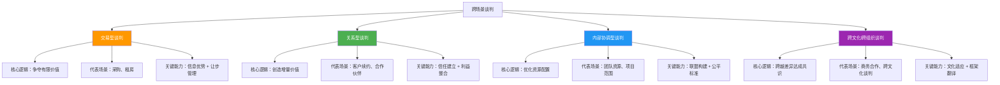
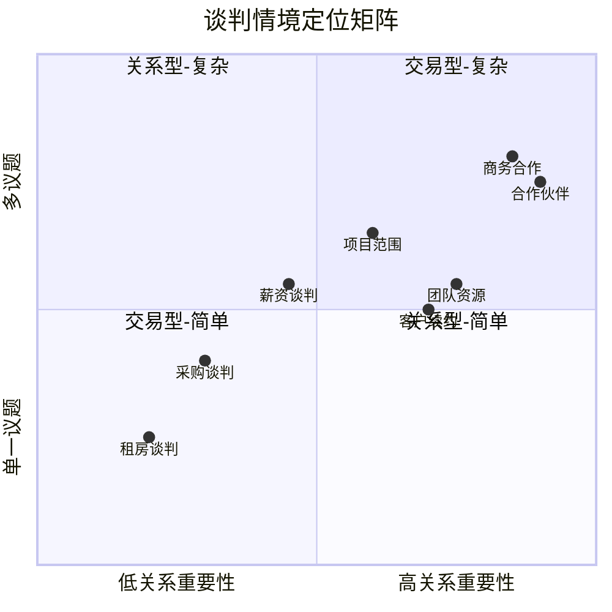
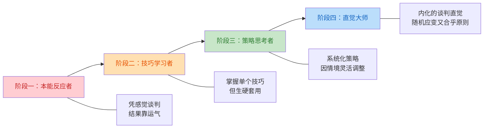

## 综合分析：跨场景谈判原则

前八个案例覆盖了从个人薪资到企业战略合作的完整谈判光谱。本节的任务不是简单重复那些案例的要点，而是从中提炼出**跨越场景边界的底层规律**——那些无论你面对房东、老板、客户还是合作伙伴，都始终适用的原则、方法和心智模型。

### 一、从八个案例中看到了什么

#### 1.1 案例全景回顾

先把八个案例放到一张表里，看清它们各自的坐标位置：

| 案例 | 谈判类型 | 关系性质 | 时间跨度 | 核心矛盾 | 关键理论工具 |
|------|---------|---------|---------|---------|-------------|
| 案例一：薪资谈判 | 混合式（分配+整合） | 阶段性（入职节点） | 一次性决策 | 个人价值认知与企业预算约束的碰撞 | BATNA、锚定效应、价值创造 |
| 案例二：采购谈判 | 偏分配式 | 阶段性（合同周期） | 中期 | 质量与成本的平衡，多供应商竞争 | ZOPA 定位、客观标准、让步策略 |
| 案例三：商务合作 | 整合式 | 长期 | 3-10年 | 多议题利益交织、组织间信任建立 | 整合式谈判、利益识别、创造性方案 |
| 案例四：租房谈判 | 偏分配式 | 阶段性（租期） | 中期 | 时间压力下的信息不对称 | BATNA、锚定、信息收集 |
| 案例五：客户续约 | 混合式 | 长期 | 持续性 | 降价压力与关系维护的张力 | 价值创造、关系管理、替代方案 |
| 案例六：项目范围 | 混合式 | 长期（项目周期） | 中期 | 需求蔓延与边界的博弈 | 立场 vs 利益、客观标准、承诺管理 |
| 案例七：团队资源 | 整合式 | 长期（同事关系） | 持续性 | 资源稀缺下的多方竞争 | 多边谈判、联盟策略、公平标准 |
| 案例八：合作伙伴 | 整合式 | 长期 | 多年 | 信任建立、风险分担与利益分配 | 重复博弈、声誉管理、整合式谈判 |

#### 1.2 四种谈判范式

从上表可以提炼出四种本质不同的谈判范式，每种范式对应一套核心策略逻辑：



**交易型谈判**（案例二、案例四）的核心战场是**价值分配**——蛋糕的大小基本固定，关键在于你切到多大一块。这类谈判中，信息就是武器：你知道的市场行情越多、替代方案越强，你的切刀就越锋利。

**关系型谈判**（案例五、案例八）的核心战场是**价值创造**——蛋糕本身可以做大，关键在于找到双方互补的利益空间。这类谈判中，信任是基础设施：没有信任，再精巧的方案也无法落地。

**内部协调型谈判**（案例六、案例七）的核心战场是**资源优化**——大家在同一条船上，目标是让有限的资源产生最大整体价值。这类谈判中，公平标准和组织利益是合法性的来源：你不能只为自己争，必须证明你的方案对整体最优。

**跨文化/跨组织谈判**（案例三）的核心战场是**差异整合**——不同的组织文化、决策机制和利益诉求需要被理解和桥接。这类谈判中，翻译能力（把对方的诉求翻译成自己能理解的语言）是关键技能。

### 二、贯穿所有场景的六条元原则

所谓"元原则"，是指无论谈判类型如何变化，都始终成立的底层规律。它们不是具体技巧，而是指导技巧选择的**操作系统**。

#### 2.1 原则一：准备决定上限，执行决定下限

八个案例无一例外地印证了同一个事实：**谈判的结果在你坐到谈判桌之前就已经决定了大部分。**

案例一中的薪资谈判者花了一周时间调研市场薪资、梳理自身价值清单、预判HR可能的压价话术，最终拿到了超出期望的offer。案例四中的租房者因为没有提前了解周边租金行情，在房东的锚定报价下被动让步。两者的差距不在于谈判桌上的口才，而在于桌下的功课。

**准备工作的三层架构：**

| 层次 | 内容 | 案例印证 | 时间投入建议 |
|------|------|---------|-------------|
| **信息层** | 收集市场数据、对方背景、行业惯例 | 案例一（薪资调研）、案例二（供应商比价）、案例四（租金行情） | 占准备时间的 40% |
| **策略层** | 设定三级目标（理想/期望/底线）、设计方案组合、预判对方策略 | 案例三（多议题方案设计）、案例六（范围界定策略） | 占准备时间的 35% |
| **心理层** | 评估自身BATNA、预演压力场景、准备情绪管理方案 | 案例五（应对客户压价的心理准备）、案例七（内部谈判的政治敏感度） | 占准备时间的 25% |

一个常见的错误是把所有准备时间都花在信息收集上，忽视策略设计和心理建设。信息告诉你"市场价是多少"，策略决定"我要怎么拿到高于市场价的结果"，心理准备确保"在高压时刻不崩盘"——三者缺一不可。

#### 2.2 原则二：利益而非立场——永远向下挖掘

这是哈佛谈判项目最核心的洞见，在八个案例中反复验证。

**立场**是对方说"我要什么"，**利益**是对方"为什么想要"。案例六中的项目经理坚持"必须在6月30日交付"（立场），但深入追问后发现，他的真正利益是"在Q2结束前向VP展示成果以争取晋升"（利益）。理解了这一点，方案空间就打开了：可以先交付核心模块用于演示，完整交付推迟到7月中旬——双方都赢了。

**利益挖掘的四个层次：**

```mermaid
graph LR
    A[表面立场<br/>"我要降价20%"] --> B[显性利益<br/>"控制成本"]
    B --> C[隐性利益<br/>"向领导证明采购能力"]
    C --> D[深层需求<br/>"职业安全感"]

    style A fill:#FFCDD2,color:#C62828
    style B fill:#FFE0B2,color:#E65100
    style C fill:#C8E6C9,color:#2E7D32
    style D fill:#BBDEFB,color:#1565C0
```

| 层次 | 提问方式 | 案例示例 |
|------|---------|---------|
| 表面立场 | "你希望怎样？" | 案例五：客户说"我要降价15%" |
| 显性利益 | "这对您为什么重要？" | "我们需要控制年度采购预算" |
| 隐性利益 | "这背后还有什么考量？" | "今年公司要求所有供应商降本，我需要交差" |
| 深层需求 | "如果这个问题解决了，对您意味着什么？" | "我能证明自己管理供应链的能力，明年晋升有底气" |

当你挖到深层需求时，解决方案往往不再是"降价"——你可以帮客户准备一份漂亮的降本报告，展示你的产品如何通过效率提升间接节约了成本。客户拿到了他需要的"故事"，你保住了利润率。

#### 2.3 原则三：BATNA 是你的底气，但不是你的武器

BATNA（最佳替代方案）在每个案例中都扮演了关键角色，但很多人对它的理解存在偏差。

**BATNA 的正确定位：**

- **是底线的来源**：你的BATNA决定了你在谈判中能接受的最差条件。案例一中，求职者手握另一家公司的offer（BATNA），因此知道自己的底线在哪里——低于这个数就去另一家。
- **是信心的来源**：知道自己有退路，你就不容易在压力下做出非理性让步。案例四中，租房者如果知道附近还有两套合适的房源（BATNA），就不会因为房东说"今天不定就没了"而仓促签约。
- **不是威胁的武器**：很多人犯的错误是把BATNA当筹码甩出来——"你不同意我就去找别人"。这种方式在交易型谈判中偶尔有效（案例二的采购比价），但在关系型谈判中会严重破坏信任（案例五、案例八中绝不可取）。

**BATNA 的策略性运用方式：**

| 方式 | 适用场景 | 话术示例 | 风险等级 |
|------|---------|---------|---------|
| **隐性支撑** | 所有场景 | 不直接提BATNA，但因有底气而表现从容 | 低 |
| **间接暗示** | 交易型谈判 | "我们也在评估几个方案" | 中 |
| **直接呈现** | 竞争性极强的场景 | "供应商B的报价是X，交付周期Y天" | 高，需谨慎 |
| **威胁摊牌** | 几乎不推荐 | "不接受就算了" | 极高，通常适得其反 |

**核心洞察：BATNA 的真正价值不在于让对方知道你有退路，而在于让你自己知道你有退路。** 前者是战术，后者是心态——心态的影响远大于战术。

#### 2.4 原则四：创造价值先于分配价值

这条原则在关系型谈判（案例三、五、八）中尤为关键，但在所有场景中都有应用空间。

大多数人坐到谈判桌前的第一反应是"我要争取更多"——这是分配思维。但优秀的谈判者会先问"有没有办法让总量变大"——这是创造思维。

**价值创造的三种机制：**

**机制一：利益交换（Logrolling）**

不同议题对双方的重要性不同。在案例三的商务合作中，A公司更在意技术主导权，B公司更在意渠道利润分成——通过在各自高优先级议题上互相让步，双方都获得了比"平分"更好的结果。

示例：薪资谈判中的利益交换
┌─────────────────┬──────────┬──────────┐
│ 议题             │ 求职者优先级 │ 公司优先级  │
├─────────────────┼──────────┼──────────┤
│ 年薪             │ 高        │ 低（预算灵活）│
│ 远程办公         │ 高        │ 中（需要到岗）│
│ 签字费           │ 中        │ 高（一次性成本）│
│ 股权期权         │ 高        │ 低（非现金）  │
│ 试用期长度       │ 低        │ 高（风控需求）│
└─────────────────┴──────────┴──────────┘
→ 最优方案：公司提高年薪 + 更多远程天数 + 股权期权
  求职者接受较长试用期 + 较低签字费
  双方都赢了

**机制二：扩大蛋糕**

找到新的价值来源，让双方的总收益增加。案例八中，A公司和B公司除了直接的合资收益外，还发现了数据协同价值——A公司的检测数据可以帮助B公司优化客户服务，B公司的行业知识可以帮助A公司改进算法。这些增量价值使得"分配"变得不那么尖锐。

**机制三：缩小成本**

不是增加收益，而是减少双方的交易成本和风险。案例五中，服务商面对客户的降价要求，与其在价格上纠缠，不如帮客户优化使用方式、减少不必要的功能模块——客户的实际支出降了，服务商的交付成本也降了，利润率反而提高了。

#### 2.5 原则五：关系是基础设施，不是装饰品

在八个案例中，关系的重要性呈现出一种有趣的模式：

| 场景 | 关系重要性 | 关系破裂的代价 | 关系建设的最佳时机 |
|------|-----------|--------------|-------------------|
| 薪资谈判（案例一） | 中 | 入职后合作不顺畅 | 面试过程中展示专业和真诚 |
| 采购谈判（案例二） | 中 | 供应链断裂风险 | 日常沟通中积累信任 |
| 商务合作（案例三） | 极高 | 合资失败、资源浪费 | 谈判前的非正式接触 |
| 租房谈判（案例四） | 低 | 换房即可 | 快速建立基本信任 |
| 客户续约（案例五） | 极高 | 客户流失、收入断裂 | 合同执行期间持续投入 |
| 项目范围（案例六） | 高 | 项目失败、职业声誉受损 | 需求沟通阶段 |
| 团队资源（案例七） | 高 | 长期协作困难 | 日常工作中的互惠积累 |
| 合作伙伴（案例八） | 极高 | 战略布局失败 | 合作前的试探性项目 |

**一个关键区分：关系投资 ≠ 讨好对方。**

案例七中的内部资源谈判者犯了一个典型错误：为了维护同事关系，在资源分配上不断退让，结果自己的项目严重延期，对方也没有因此更尊重他。真正有效的关系投资是**展示专业能力和合作诚意**，而非无原则的退让。

**关系管理的三层模型：**

1. **信任层**（基础）：说到做到，信息透明，不隐瞒关键事实。案例八中，A公司在谈判初期主动分享了自己的技术局限性，反而赢得了B公司的深度信任。
2. **互惠层**（中层）：在合理范围内主动为对方创造价值。案例五中，服务商在合同外免费帮客户解决了一个技术问题，这笔"关系存款"在续约谈判时产生了利息。
3. **情感层**（高层）：理解对方的情感需求和压力。案例一中，求职者理解HR也在承受招聘KPI压力，主动配合加速流程，最终HR成了争取更好offer的内部盟友。

#### 2.6 原则六：僵局不是终点，是信息

案例三、案例五、案例六、案例八中都出现了不同程度的僵局。对新手来说，僵局意味着失败；对高手来说，僵局是一个**信息信号**——它告诉你某些关键议题还没有被充分理解或创造性地解决。

**僵局的三种类型及应对策略：**

| 僵局类型 | 表现 | 根本原因 | 破局策略 | 案例印证 |
|---------|------|---------|---------|---------|
| **利益性僵局** | 双方在某个议题上立场对立 | 没有充分挖掘深层利益 | 回溯利益、引入新议题、打包交换 | 案例三：股权比例僵局通过引入治理权分配破局 |
| **信息性僵局** | 双方对事实或市场有不同认知 | 信息不对称或解读差异 | 引入客观标准、第三方数据 | 案例二：价格分歧通过行业报告作为锚定基准化解 |
| **情绪性僵局** | 对话氛围恶化、沟通中断 | 累积的挫败感或被冒犯 | 休会冷却、换人沟通、转换场景 | 案例五：客户代表因内部压力情绪爆发，休会后改由双方高管直接对话 |

**一个实用技巧：当僵局出现时，不要急于"解决"它，先"诊断"它。** 问自己三个问题：
1. 我们真的在争论同一个东西吗？（有时双方看似在争论价格，实际上一个在说"成本"，另一个在说"价值"）
2. 对方的底线真的在这里吗？（还是这是一种谈判策略？）
3. 有没有我们忽略的议题可以用来交换？

### 三、跨场景策略适配框架

理论原则需要转化为具体场景中的行动方案。下面这个框架帮助你在任何谈判场景中快速做出策略选择。

#### 3.1 情境诊断矩阵

在开始任何谈判之前，先在以下四个维度上评估你所处的情境：



**根据定位选择核心策略：**

| 象限 | 核心策略 | 优先级排序 | 典型案例 |
|------|---------|-----------|---------|
| **交易型-简单**（低关系+单议题） | 竞争为主，快速定位ZOPA | 信息收集 > 锚定 > 让步管理 | 租房谈判 |
| **交易型-复杂**（低关系+多议题） | 竞争+有限合作，打包交换 | 信息收集 > 议题关联 > 让步管理 | 采购谈判 |
| **关系型-简单**（高关系+单议题） | 合作为主，用客观标准化解分歧 | 信任建立 > 客观标准 > 利益探索 | 薪资谈判 |
| **关系型-复杂**（高关系+多议题） | 深度合作，创造性方案设计 | 信任建立 > 利益挖掘 > 创造性方案 > 分配 | 商务合作、合作伙伴 |

#### 3.2 策略选择决策树

当你面对一个具体谈判场景时，按以下流程做出策略选择：

开始
 │
 ├─ 这个谈判会重复发生吗？（或关系长期重要吗？）
 │   ├─ 是 → 关系优先策略
 │   │     ├─ 对方的BATNA比我强吗？
 │   │     │   ├─ 是 → 强化自身BATNA + 寻找创造性方案扩大蛋糕
 │   │     │   └─ 否 → 保持合作姿态，不滥用优势
 │   │     └─ 有多少个议题可以交换？
 │   │         ├─ 多个 → 打包交换，各自在高优先级议题上让步
 │   │         └─ 单个 → 用客观标准锚定，聚焦价值而非价格
 │   │
 │   └─ 否 → 利益优先策略
 │         ├─ 我的BATNA强吗？
 │         │   ├─ 是 → 可以适度竞争，但仍需保持专业
 │         │   └─ 否 → 先投资BATNA，再上谈判桌
 │         └─ 信息充分吗？
 │             ├─ 是 → 直接进入ZOPA定位
 │             └─ 否 → 先收集信息，推迟实质性谈判

#### 3.3 场景-技巧速查表

| 你遇到的情况 | 对应技巧 | 来源案例 | 具体做法 |
|-------------|---------|---------|---------|
| 对方先报价，价格远超/低于预期 | 锚定重置 | 案例一、四 | 不要被锚定带走，用客观数据重新设定锚点："根据XX数据，市场均价是……" |
| 对方在单个议题上寸步不让 | 利益挖掘 | 案例六 | 问"为什么这个对您特别重要"，找到背后的深层需求 |
| 谈判陷入僵持 | 僵局诊断 | 案例三、五 | 区分是利益性、信息性还是情绪性僵局，对症下药 |
| 对方施压要求快速决定 | BATNA支撑 | 案例四 | 内心确认BATNA，从容回应："我理解时间紧迫，但这个决定需要慎重" |
| 多方参与、利益交织 | 联盟策略 | 案例七 | 识别潜在盟友，建立共同利益基础，用公平标准争取支持 |
| 对方要求降价/让步 | 价值重构 | 案例五 | 不直接拒绝，而是展示价值、提出替代方案："价格可以调整，但需要同步调整XX条款" |
| 需要长期合作但信任不足 | 渐进式信任建设 | 案例八 | 先从低风险的小项目开始合作，用实际成果积累信任 |
| 自己是弱势方 | 客观标准 + BATNA | 案例一、四 | 用市场数据、行业标准、先例来支撑自己的主张，弥补权力差距 |

### 四、谈判者能力模型：从新手到大师

通过分析八个案例中不同水平谈判者的表现差异，可以提炼出一个四阶段能力发展模型。

#### 4.1 四个发展阶段



| 阶段 | 典型表现 | 案例中的体现 | 提升路径 |
|------|---------|-------------|---------|
| **本能反应者** | 要么一上来就让步，要么死守立场不松口；被情绪驱动；不区分立场和利益 | 案例四中租房者直接接受房东报价，案例六中需求方坚持"全部都要" | 学习基础理论，建立谈判意识 |
| **技巧学习者** | 知道BATNA、锚定等概念，但生搬硬套；过度关注单一技巧而忽视整体策略 | 案例二中采购者机械使用"货比三家"话术，却没理解供应商的真实约束 | 通过案例分析理解技巧的适用边界 |
| **策略思考者** | 能根据情境选择策略组合；理解何时竞争、何时合作；主动创造价值 | 案例三中的合资谈判者根据议题灵活切换策略 | 大量实战复盘，建立策略直觉 |
| **直觉大师** | 谈判策略已内化为直觉；能在高压下自然做出正确判断；关注长期格局而非单次得失 | 案例八中的战略合作谈判者，能在复杂博弈中保持全局视野 | 持续实战 + 深度反思 + 跨领域学习 |

#### 4.2 关键能力差距分析

从新手到大师，最核心的三个能力跃迁：

**跃迁一：从"我要什么"到"对方为什么想要"**

新手关注自己的目标，大师关注对方的需求。案例一中的薪资谈判者没有直接说"我要30K"，而是先展示了自己能为公司创造的价值，让对方理解"给你30K是公司赚了"。这种从"推销自己"到"解决对方问题"的转变，是区分初级和中级谈判者的关键分水岭。

**跃迁二：从"一个方案"到"方案空间"**

新手带着一个方案上桌，被拒就束手无策。大师带着一个方案空间上桌——多个方案组合覆盖不同的利益交换可能。案例三中，合资谈判者准备了四种股权结构方案，每种方案搭配不同的治理权和利润分配设计，确保无论对方的优先级是什么，都能找到匹配的方案。

**跃迁三：从"赢这一局"到"赢这盘棋"**

新手追求单次谈判的最大收益，大师关注长期利益网络的最优。案例八中，A公司在首次利润分配上做出了让步（短期少赚），但换到了B公司的独家渠道授权和优先续约权（长期价值远超短期让步）。这种"以空间换时间"的战略眼光，是大师级谈判者的标志性能力。

### 五、跨场景中的心理博弈规律

八个案例中反复出现的心理博弈模式，值得单独提炼。

#### 5.1 三大心理杠杆

**杠杆一：锚定效应——谁先出价谁设定基准**

案例一（薪资谈判）和案例四（租房谈判）是最典型的锚定战场。数据表明，先出价的一方通常会将最终结果拉向自己的方向——但前提是锚定点不能荒谬。过于离谱的锚定会破坏可信度，让对方直接失去谈判兴趣。

**锚定校准公式：**

有效锚定点 = 客观基准 × (1 + 调整系数)

调整系数的取值：
- 保守策略（关系重要时）：5%-15%
- 标准策略（一般场景）：15%-30%
- 激进策略（竞争性场景）：30%-50%

示例：
市场薪资中位数 = 25K
保守锚定 = 25K × 1.10 = 27.5K
标准锚定 = 25K × 1.25 = 31.25K
激进锚定 = 25K × 1.40 = 35K

**杠杆二：框架效应——同一事实的不同讲法**

案例五中，服务商面对客户的降价要求，没有说"我们不能降价"（损失框架），而是说"如果调整服务范围，我们可以把费用优化到您预算范围内"（收益框架）。同一个事实——"不降价"——用不同的框架表达，效果天差地别。

| 场景 | 消极框架（避免） | 积极框架（使用） |
|------|---------------|---------------|
| 拒绝降价 | "我们没法降价" | "我们可以一起找到成本优化方案" |
| 要求让步 | "你必须给我更好的条件" | "如果在这个议题上我能灵活一些，您那边是否也可以考虑……" |
| 指出问题 | "你的方案有严重缺陷" | "如果在XX方面做一些调整，方案的可行性会大幅提升" |
| 提出底线 | "这是我的底线，不能再退了" | "在这个范围内，我能确保方案的高质量执行" |

**杠杆三：损失厌恶——人们对失去的恐惧是获得的两倍**

案例七中的内部资源谈判者利用了这一原理：他没有强调"给我资源后项目能获得什么"（收益框架），而是强调"如果不分配资源，公司将面临什么损失"（损失框架）。后者的效果比前者强两倍——这是行为经济学中经过大量实验验证的结论。

**损失厌恶的策略应用：**

- **呈现不行动的代价**："如果我们不在这个季度完成升级，竞争对手可能会抢先推出同类产品"
- **将让步框架化为"放弃"**："如果要降到这个价格，我需要放弃XX服务条款，您确定这是您想要的吗？"
- **用"保护"替代"争取"**："这个条款是为了保护我们双方的利益，避免未来出现纠纷"

#### 5.2 情绪管理的实操方法

案例五中客户代表情绪爆发、案例一中求职者紧张到语无伦次——情绪是谈判中最容易被忽视也最具破坏力的变量。

**情绪管理的 S.T.O.P. 协议：**

S — Stop（暂停）
    当你感觉到心跳加速、呼吸变浅、思维混乱时，立即创造暂停。
    话术："这个观点很重要，让我想一想。"
    话术："我需要核实一下这个信息，我们休息5分钟？"

T — Take a breath（呼吸）
    4-7-8呼吸法：吸气4秒，屏息7秒，呼气8秒。
    3个循环即可显著降低心率和皮质醇水平。

O — Observe（观察）
    以第三人称视角观察当下的局面：
    - 我的情绪是什么？愤怒？焦虑？兴奋？
    - 对方的情绪是什么？
    - 是什么触发了这个情绪？

P — Proceed with intention（有意识地继续）
    基于观察做出选择，而非被情绪裹挟。
    问自己："如果我现在最冷静的版本在处理这个情况，他会怎么做？"

### 六、从案例到个人：建立你的谈判操作系统

理论和案例都是别人的。真正的成长在于把外部知识内化为你自己的**谈判操作系统**——一套面对任何谈判情境都能自动启动的分析和行动框架。

#### 6.1 谈判前：准备清单

每次谈判前，花15-30分钟完成以下清单：

┌────────────────────────────────────────────────┐
│             谈判准备清单 v2.0                    │
├────────────────────────────────────────────────┤
│                                                │
│ 一、情境诊断                                     │
│ □ 这是什么类型的谈判？（交易/关系/内部/跨文化）      │
│ □ 关系重要性如何？（一次性/阶段性/长期）             │
│ □ 有几个议题？它们对双方的重要性排序？               │
│ □ 时间压力在哪一方？                               │
│                                                │
│ 二、信息收集                                     │
│ □ 市场/行业基准数据：_______________              │
│ □ 对方的背景、需求、约束：_______________          │
│ □ 对方可能的BATNA：_______________               │
│ □ 客观标准（先例、法规、行业惯例）：___________      │
│                                                │
│ 三、策略设计                                     │
│ □ 我的三级目标：                                  │
│   理想目标：_______________                      │
│   期望目标：_______________                      │
│   底线目标：_______________                      │
│ □ 我的BATNA：_______________                    │
│ □ 可能的价值创造点：_______________               │
│ □ 预判对方的策略：_______________                 │
│ □ 准备的方案组合（至少3个）：___________            │
│                                                │
│ 四、心理准备                                     │
│ □ 可能的压力点和应对话术：_______________           │
│ □ 情绪管理计划：_______________                   │
│ □ 僵局备案策略：_______________                   │
│                                                │
└────────────────────────────────────────────────┘

#### 6.2 谈判中：实时检查点

在谈判进行过程中，每隔15-20分钟做一次内心检查：

1. **方向检查**：我们是否在朝着我的期望目标前进？如果没有，哪里出了偏差？
2. **关系检查**：当前的对话氛围如何？对方是开放的还是防御的？
3. **信息检查**：我有没有获得新的信息需要调整策略？对方透露了什么关键信息？
4. **情绪检查**：我的情绪状态如何？对方的情绪状态如何？需要暂停吗？

#### 6.3 谈判后：复盘模板

每次谈判后的结构化复盘，是提升最快的方式：

┌────────────────────────────────────────────────┐
│             谈判复盘模板                         │
├────────────────────────────────────────────────┤
│                                                │
│ 基本信息                                        │
│ 日期：___________  场景：___________             │
│ 对方：___________  持续时间：___________          │
│                                                │
│ 结果评估                                        │
│ 期望目标：___________                           │
│ 实际结果：___________                           │
│ 差距分析：___________                           │
│                                                │
│ 策略复盘                                        │
│ 有效的策略：___________                         │
│ 无效的策略：___________                         │
│ 意外的转折点：___________                       │
│                                                │
│ 对手分析                                        │
│ 对方的谈判风格：___________                      │
│ 对方的核心利益：___________                      │
│ 对方的BATNA（事后推测）：___________              │
│                                                │
│ 自我评估                                        │
│ 做得好的地方：___________                       │
│ 需要改进的地方：___________                      │
│ 下次我会：___________                           │
│                                                │
│ 关键教训                                        │
│ （用一句话总结这次谈判最重要的收获）               │
│ ____________________________________________    │
│                                                │
└────────────────────────────────────────────────┘

#### 6.4 持续改进建议

| 改进维度 | 具体行动 | 频率 | 预期效果 |
|---------|---------|------|---------|
| **复盘分析** | 每次谈判后使用复盘模板，记录关键数据点和策略有效性 | 每次谈判后 | 3个月内建立个人谈判数据库 |
| **技能针对性提升** | 根据复盘发现的薄弱环节，选择对应章节深度学习 | 每两周一次 | 逐步补齐短板 |
| **多样化练习** | 主动在不同场景中练习——购物砍价、日程协调、方案讨论 | 每周至少2次低风险练习 | 扩展技巧的适用边界 |
| **反馈寻求** | 请信任的同事或朋友观察你的谈判过程并给出反馈 | 每月一次 | 发现自己的盲区 |
| **案例研究** | 阅读商业谈判案例、观看谈判类纪录片或播客 | 每周1-2小时 | 拓展策略视野 |
| **模拟练习** | 与学习伙伴进行角色扮演，覆盖不同场景和难度 | 每周1次 | 在安全环境中犯错和学习 |

### 七、跨场景谈判的核心洞察

最后，把本节的全部分析浓缩为七条核心洞察。它们不是技巧清单，而是**看待谈判的方式**——改变你看问题的方式，比记住一百个话术更有价值。

1. **谈判是信息战，更是认知战。** 你掌握的信息决定了你的议价能力，你对信息的解读方式决定了你的策略选择。同一个"对方报价过高"的事实，可以被解读为"对方在试探"或"对方没有诚意"——不同的解读导向完全不同的应对。

2. **没有不好的谈判，只有不适配的策略。** 案例四中的租房者失败了，不是因为他笨，而是因为他用关系型策略应对了一个交易型场景。策略与情境的匹配度，比策略本身的"高明程度"更重要。

3. **让步是工具，不是态度。** 让步应该是有计划的、有条件的、有节奏的——每次让步都应该换来对等的价值。无条件的让步不是善意，是信号：它告诉对方"我还有空间"。

4. **沉默是最被低估的谈判工具。** 案例一中，求职者在HR报出薪资后沉默了10秒——这10秒的沉默让HR主动加了2K。大多数人害怕沉默，急于填补空白，却不知道沉默本身就是一种压力和信息收集手段。

5. **最好的谈判结果是对方也觉得赢了。** 如果你走出谈判室觉得"我大获全胜"，你需要警惕——对方可能在协议执行阶段给你制造麻烦。案例八中的最佳协议，是双方都觉得自己做出了合理的妥协，同时也获得了重要的价值。

6. **谈判能力是可以系统训练的。** 它不是天赋，不是性格，而是一套可以被拆解、学习、练习和优化的技能组合。本章的八个案例、六条元原则、策略适配框架和复盘模板，就是你的训练系统。

7. **每一次谈判都是下一次谈判的准备。** 你今天在租房谈判中积累的锚定经验，明天会用在薪资谈判中。你今天在内部资源协调中建立的同事关系，明天会成为项目合作的信任基础。谈判能力的积累是复利式的——坚持训练，回报会加速到来。

---

> 通过这八个实战案例的综合分析，我们完成了一个完整的循环：从理论基础到核心技巧，从单一场景到跨场景原则。谈判不是一套固定的公式，而是一种**思维方式**——当你学会用谈判的视角看待人与人之间的每一次互动，你会发现，世界比你想象的更有协商空间。
