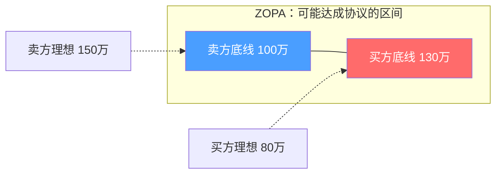

## 第一节 准备策略：谈判成功的基石

> "如果我有八小时砍一棵树，我会花六小时磨斧头。"——亚伯拉罕·林肯

谈判领域有一条被反复验证的铁律：**谈判的结果在双方坐到谈判桌之前就已经决定了80%**。哈佛大学谈判项目（Harvard Negotiation Project）长达四十年的研究表明，准备充分的谈判者获得的协议价值平均比准备不足者高出30%以上。准备不是谈判的前奏，准备本身就是谈判最重要的部分。

本节将系统拆解准备阶段的四大核心模块——信息收集与分析、目标设定与优先级排序、方案设计与策略规划、团队组建与分工协作——每个模块都提供理论框架、实操方法、工具模板和常见误区。

---

### 一、信息收集与分析：知己知彼的系统方法

信息是谈判中最重要的战略资源。谁掌握的信息更全面、更准确，谁就拥有结构性优势。信息不对称（Information Asymmetry）是谈判中利益分配不均的根本原因之一——掌握更多信息的一方能够更准确地评估对方底线，设计更有利的方案，识别对方的虚张声势。

#### 1.1 信息收集的三维模型

信息收集需要覆盖三个维度：**对方信息、议题信息、己方信息**。三者缺一不可，但多数谈判者只关注前两者而忽略第三维——对自身信息的系统梳理。

**第一维：关于对方的信息（外部分析）**

| 信息类别 | 具体内容 | 收集方法 | 谈判价值 |
|---------|---------|---------|---------|
| 组织背景 | 公司规模、财务状况、市场地位、企业文化、股东结构、近期重大事件 | 年报、企查查/天眼查、行业报告、新闻 | 判断对方实力和紧迫程度 |
| 决策机制 | 真正的决策者是谁、决策流程、审批层级、内部利益相关者 | 人际网络、过往合作经验、LinkedIn | 确认谈判对手是否有拍板权 |
| 谈判风格 | 历史谈判案例、惯用策略、决策模式、文化偏好 | 行业口碑、前员工、供应商反馈 | 预判对方行为模式，制定针对性策略 |
| BATNA质量 | 对方的替代方案有哪些、替代方案的成熟度、时间压力 | 市场调研、竞品分析、供应链情报 | 评估对方的议价能力和底线 |
| 个人特征 | 谈判代表的性格、职业背景、压力点、个人诉求 | 社交媒体、共同人脉、面对面观察 | 设计个性化沟通策略 |

**第二维：关于议题的信息（主题分析）**

议题信息决定了你的议价底气。准备不足的谈判者常见的错误是"凭感觉谈价格"，而专业谈判者靠数据说话。

- **市场基准数据**：同类交易的市场价格区间、行业标准利润率、近期可比案例的成交条件。例如，如果你在谈一份软件开发外包合同，你需要知道同类项目在市场上的人天单价范围、工期偏差率、质量保证条款的行业惯例。
- **先例与惯例**：类似谈判的历史结果、行业通行做法、标准合同模板。先例既是参考也是武器——"行业惯例"在谈判中是极具说服力的论据。
- **技术与专业细节**：与议题直接相关的技术参数、质量标准、性能指标。你不需要成为技术专家，但你需要理解关键参数的含义和影响，否则在技术细节上会被对方牵着鼻子走。
- **法律与合规框架**：相关法律法规、监管要求、知识产权归属规则、争议解决机制。法律知识不是律师的专利——谈判者必须知道哪些条款可以谈、哪些是红线。
- **宏观经济与行业趋势**：利率变化、政策导向、技术变革、竞争格局。这些宏观因素决定了谈判的大背景，影响双方的预期和紧迫感。

**第三维：关于己方的信息（内部分析）**

这是最容易被忽视的维度。你必须比对方更了解自己，才能避免在谈判中暴露弱点或错失优势。

- **BATNA深度分析**：我方的最佳替代方案具体是什么？执行BATNA需要多长时间、多少成本？BATNA的确定性有多高？（详见下文1.2节BATNA专题）
- **利益层次梳理**：区分**核心利益**（不可妥协）、**重要利益**（争取但可让步）、**次要利益**（可交换的筹码）。许多谈判者把所有条件都当成核心利益，导致没有交换空间，谈判僵持。
- **资源与筹码盘点**：我方拥有哪些对方需要的东西？除了交易本身，还有哪些资源可以打包交换？时间、信息、关系、品牌背书、未来合作机会都是筹码。
- **内部约束识别**：我方有哪些内部限制——预算上限、审批流程、时间窗口、政治考量？这些约束不一定需要告诉对方，但你自己必须清楚，否则可能做出无法兑现的承诺。
- **弱点与风险预判**：我方的明显弱点是什么？对方可能攻击哪些薄弱环节？提前准备应对话术，避免在谈判中被动。

#### 1.2 信息收集的四种渠道

**公开渠道**是信息收集的起点，成本最低，但竞争者也能获取相同信息，因此不具备信息优势。关键在于**系统化**地整理公开信息，而不是零散浏览。

- **企业信息平台**：企查查、天眼查、国家企业信用信息公示系统——查询股权结构、司法风险、行政处罚、关联公司。
- **财务与行业报告**：上市公司年报、券商研报、行业协会统计、Wind/同花顺数据。即使对方是非上市公司，行业报告也能提供关键的市场基准。
- **新闻与舆情**：百度新闻、微信搜一搜、微博热搜——搜索对方公司近期新闻，关注诉讼、裁员、融资、产品问题等关键信号。
- **专利与知识产权**：国家知识产权局、Google Patents——了解对方的技术布局和核心专利。
- **招聘信息**：猎聘、Boss直聘——对方正在招聘什么岗位？如果是紧急招聘某个技术岗位，可能暗示项目压力或技术短板。

**人际网络**是获取隐性信息的关键渠道，具有不可替代的价值。隐性信息包括决策者的个人偏好、内部权力结构、未公开的经营状况等。

- **行业专家与顾问**：付费咨询行业分析师或独立顾问，他们的行业认知深度远超公开资料。
- **前员工与前合作伙伴**：离职员工往往愿意分享内部信息，但要注意信息的时效性和主观偏差。
- **共同联系人**：通过LinkedIn、行业协会、校友网络找到与对方有交集的人，进行间接了解。
- **供应商与客户**：对方的上下游合作伙伴可以提供关于其信用、风格、真实需求的信息。

**直接观察**提供最真实的第一手信息，但需要创造合适的观察场景。

- **产品与服务体验**：作为客户体验对方的产品或服务，了解其真实质量水平。
- **实地考察**：参观对方的工厂、办公室、门店——员工士气、办公环境、设备状态都是重要信号。
- **会议与活动观察**：在行业会议、展会上观察对方代表的行为、社交圈层、发言风格。

**试探性接触**是在正式谈判前进行的低风险信息收集，既获取信息又不暴露意图。

- **非正式社交**：共进午餐、参加同一个行业活动，以闲聊的方式了解对方的想法和态度。
- **假设性问题**："如果……你们会怎么考虑？"——用假设性提问探测对方的立场和底线，而不暴露自己的意图。
- **小规模测试交易**：先做一个小项目或试订单，通过实际合作观察对方的决策风格、执行能力、信用水平。
- **中介与第三方**：通过双方都信任的第三方传递信息、试探态度，降低直接接触的风险。

#### 1.3 信息分析与情报整合

收集到的信息是零散的，必须经过**结构化分析**才能转化为谈判策略。

**SWOT分析（谈判版）**：

| | 有利因素 | 不利因素 |
|---|---|---|
| **内部** | **S-优势**：我方在此次谈判中的核心筹码（技术、品牌、资源、关系） | **W-劣势**：我方的明显弱点（时间压力、替代方案不足、信息盲区） |
| **外部** | **O-机会**：可以利用的外部条件（对方急需、市场竞争、政策利好） | **T-威胁**：外部风险因素（替代方案恶化、竞争对手介入、政策变化） |

**对方行为模式画像**：基于收集到的信息，构建对方谈判风格的预判模型。参考Thomas-Kilmann冲突模式工具，将对方归入五种基本风格之一（竞争型、合作型、妥协型、回避型、适应型），然后设计针对性策略。

> **常见误区：信息过载与分析瘫痪**
>
> 信息收集不是越多越好。准备阶段最常见的陷阱是花大量时间收集信息，却不知道如何使用。判断标准很简单：**这条信息是否会影响我的谈判策略？**如果答案是"否"，就不要在这条信息上继续投入时间。建议遵循"二八法则"——20%的关键信息决定80%的策略方向。

---

### 二、目标设定与优先级排序：从模糊期望到精确标靶

没有明确目标的谈判就像没有目的地的航行——你可能到达某个地方，但不太可能是你想去的地方。目标设定是准备阶段最关键的心智活动，它决定了你的策略选择、让步节奏和最终判断标准。

#### 2.1 三层目标体系

谈判目标不是单一数字，而是一个**有弹性的目标区间**。哈佛谈判项目提出的三层目标体系（Three-Tier Goal Framework）是目前最成熟的目标设定工具：

**第一层：理想目标（Ideal Target / Aspiration）**

理想目标是你"最希望达成"的结果——如果一切顺利、对方完全配合，你能拿到的最好结果。

设定原则：
- **有依据**：理想目标不是天方夜谭，必须有数据或逻辑支撑。例如，基于市场调研，同品质产品的最高成交价是X元，你的理想目标可以定在X的95%分位。
- **有理由**：你必须能说出"我为什么值得这个价格"。理由越充分，你在谈判中越有底气。
- **略高于对方预期**：理想目标应该略高于你认为对方会接受的上限，为自己留出谈判空间，同时避免开价过高导致对方拒绝谈判。

**第二层：可接受目标（Acceptable Target / Target）**

可接受目标是你"真正预期达成"的结果——综合考虑双方立场、市场条件和谈判动态后，你认为现实可行的结果。

设定原则：
- **满足核心利益**：可接受目标必须覆盖你的全部核心需求。如果在可接受目标下你的某个核心利益受损，说明目标设定有问题。
- **优于BATNA**：可接受目标的价值必须明显高于你的最佳替代方案。如果可接受目标还不如直接走BATNA，那你不应该坐到谈判桌前。
- **在ZOPA范围内**：ZOPA（Zone of Possible Agreement，可能达成协议的区间）是双方底线之间的重叠区域。可接受目标应该落在这个区间内偏有利的一侧。

**第三层：底线目标（Walk-Away Point / Reservation）**

底线目标是你的"绝不可突破"的红线——低于这个结果，你宁可放弃谈判、转向BATNA。

设定原则：
- **严格等于BATNA价值**：底线不应该是你的情绪承受极限，而应该是BATNA的理性价值。如果对方给出的条件还不如你的BATNA，理性选择是离开。
- **保护核心利益**：底线必须确保你的核心利益不受损害。底线以下的结果，即使达成协议，也会造成长期损失。
- **内化不外露**：底线是你内心最深处的秘密，永远不要让对方知道你的底线在哪里。一旦对方知道你的底线，他们就会把价格压到你底线附近。

**三层目标之间的关系示例（以薪资谈判为例）：**

理想目标：年薪45万 + 股票期权 + 弹性工作
可接受目标：年薪40万 + 年终奖3个月 + 每周1天远程
底线目标：年薪35万（不低于当前offer的最高值）
BATNA：另一家公司给的36万年薪offer

注意：底线（35万）略低于BATNA（36万），这是因为BATNA的价值不仅仅是薪资，还包括公司前景、个人发展等综合因素。

#### 2.2 BATNA深度解析

BATNA（Best Alternative To a Negotiated Agreement，最佳替代方案）是谈判准备中最核心的概念，由Roger Fisher和William Ury在《Getting to Yes》中首次提出。你的BATNA决定了你的谈判权力——BATNA越强，你越有底气拒绝不利的协议。

**BATNA评估五步法**：

**第一步：列出所有替代方案**。如果这次谈判破裂，你有哪些选择？尽可能多地列举，包括看似不理想的选项。例如，如果你在和供应商A谈采购价，替代方案包括：转向供应商B、自行生产、推迟采购、改变产品设计减少用量、寻找替代材料等。

**第二步：评估每个方案的可行性**。对每个替代方案进行可行性评估——需要多长时间、多少成本、成功率有多高、存在哪些风险？

**第三步：为最可行的方案制定行动计划**。选择2-3个最可行的替代方案，制定详细的执行计划，包括时间表、资源需求、关键里程碑。**在谈判开始前就开始执行这些计划**——BATNA不是纸上谈兵，而是已经开始推进的真实选项。

**第四步：量化BATNA的价值**。将最佳替代方案转化为可比较的数字——如果是供应商谈判，BATNA的价值就是替代供应商的总成本（价格+切换成本+时间成本+风险成本）。

**第五步：保护和强化BATNA**。在谈判准备阶段和进行期间，持续强化你的BATNA。例如，和替代供应商保持积极沟通、推进备选方案的落地。BATNA越强，你在谈判桌上的议价能力越强。

> **关键认知：BATNA不是"离开谈判桌的威胁"**
>
> 很多人误以为BATNA是用来威胁对方的工具。实际上，BATNA是你自己的安全网和信心来源。你不需要告诉对方你的BATNA是什么（除非主动展示有利于谈判），你需要的是自己心里清楚：如果这笔交易谈不成，你有更好的选择。这种确定感会让你在谈判中更加从容、更有底气。

#### 2.3 ZOPA分析与价值评估

ZOPA（Zone of Possible Agreement）是双方底线之间的重叠区域，只有当双方的底线之间存在重叠时，谈判才有可能达成协议。

在上面的例子中：卖方的底线是100万（低于100万宁可不卖），买方的底线是130万（高于130万宁可不买）。ZOPA是100万到130万的区间。双方理想目标（卖方150万、买方80万）都超出了ZOPA，这很正常——理想目标是开价，真正的交易发生在ZOPA内。

**ZOPA分析的实操要点**：
- 你无法精确知道对方的底线，但可以通过信息收集进行合理估计。
- ZOPA越大，谈判空间越大，双方越容易达成协议。
- ZOPA越小，谈判越艰难，可能需要创造性方案来扩大共同利益。
- 如果ZOPA不存在（双方底线没有重叠），谈判注定失败，除非一方调整底线或引入新的变量。

#### 2.4 议题优先级矩阵

现实谈判通常涉及多个议题——价格、付款方式、交货时间、质量标准、售后服务、合同期限等。你必须对所有议题进行优先级排序，知道哪些议题必须坚守、哪些可以用来交换。

**四象限优先级矩阵**：

| | 让步空间小 | 让步空间大 |
|---|---|---|
| **价值高** | **核心议题**——坚决维护，非到万不得已不让步。例：核心技术参数、品牌使用权限制 | **交换议题**——价值高但有弹性，是最佳交换筹码。例：付款条件（早付可降价）、合同期限 |
| **价值低** | **坚持议题**——适度坚持但不必死守，避免因小失大。例：交付地点、文件格式 | **让步议题**——优先让步以换取核心议题的突破。例：发票类型、会议频率 |

**构建优先级矩阵的步骤**：

1. **列出所有议题**：把谈判涉及的所有议题一一列出，包括显性议题（双方都讨论的）和隐性议题（你在意但对方可能不在意的）。
2. **评估每个议题对你的价值**（1-10分）：这个议题对你的利益影响有多大？
3. **评估你对每个议题的让步空间**（1-10分）：在这个议题上你能接受多大程度的让步？
4. **评估每个议题对对方的可能价值**：推测对方在每个议题上的重视程度——你在意的议题对方不一定在意，反之亦然。
5. **寻找差异化的交换机会**：你重视但对方不重视的议题，和对方重视但你不重视的议题，是天然的交换标的。这种基于偏好差异的交换是"把饼做大"的核心机制。

> **常见误区：只关注价格**
>
> 初级谈判者最常见的错误是把谈判简化为"价格谈判"。实际上，价格只是众多议题之一。把价格之外的议题（付款时间、批量、合同期限、服务等级、独家性、培训支持等）纳入谈判框架，你才能创造更多的交换空间和共同价值。

---

### 三、方案设计与策略规划：从被动回应到主动引领

信息收集和目标设定是"知道自己要什么"，方案设计和策略规划是"知道怎么拿到它"。这是准备阶段最需要创造力和战略思维的环节。

#### 3.1 方案设计的四大原则

**原则一：多元化——设计多个方案，避免单一选项困境**

永远不要只带一个方案上谈判桌。单一选项会制造"接受或拒绝"的对抗局面，而多个选项能激发协作思维。建议准备**3-5个方案**，覆盖不同维度的组合——不是简单的价格高低，而是**议题组合方式的差异**。

例如，在一份商业合作协议中，你可以设计：
- 方案A：高标准合作（深度绑定、高费用、长周期）
- 方案B：标准合作（中等绑定、标准费用、常规周期）
- 方案C：试点合作（低绑定、低费用、短周期，验证后升级）
- 方案D：资源置换合作（非货币合作，双方各取所需）

**原则二：创造性——寻找扩大蛋糕的机会，而非只关注切蛋糕**

分配型谈判（Distributive Negotiation）是零和博弈——你多我就少。整合型谈判（Integrative Negotiation）则追求双赢——通过创造新的价值，让双方都比原来更好。

创造价值的常见方法：
- **利用差异性**：双方的风险偏好不同、时间偏好不同、需求紧迫度不同，这些差异是创造价值的基础。例如，对方急需回款，你更在意价格——用快速付款换取价格优惠。
- **加入新议题**：当现有议题上的利益对立无法调和时，引入新的议题来创造交换空间。例如，价格谈不拢时，加入售后服务、培训支持、独家代理权等新议题。
- **扩大合作维度**：从单次交易扩展到长期合作框架，用未来收益的确定性换取当下条件的灵活性。

**原则三：灵活性——方案应有调整空间，适应谈判动态**

方案设计不是一锤子买卖，而是"预备方案+应变预案"。你需要为每个方案准备几个变体，根据谈判中的实际情况灵活切换。例如，如果对方对方案B的某个条款不满意，你可以快速调出方案B-2（修改了那个条款，但在其他地方做了微调）。

**原则四：可执行性——再好的方案，执行不了就是废纸**

方案必须考虑实际执行条件——资源约束、技术可行性、法律合规性、时间限制。一个理论上完美但无法落地的方案，只会制造后续的争议和不信任。

评估可执行性的清单：
- 需要哪些资源？资源是否就绪？
- 涉及哪些部门？各部门是否配合？
- 有没有法律或合规障碍？
- 时间表是否现实？
- 风险点在哪里？有无应急预案？

#### 3.2 策略规划的五维框架

策略规划需要回答五个核心问题：总体策略是什么、如何开场、如何管理信息流、如何让步、如何收尾。

**第一维：总体策略选择**

根据谈判性质和双方关系，选择合适的总体策略取向：

| 策略类型 | 适用场景 | 核心特征 | 风险 |
|---------|---------|---------|------|
| 竞争策略 | 一次性交易、利益对立明显、对方不讲理 | 争取最大利益、坚守底线、善用压力 | 破坏关系、陷入僵局 |
| 合作策略 | 长期关系、利益有重叠、双方理性 | 共同探索解决方案、坦诚沟通、追求双赢 | 被对方利用、让步过多 |
| 妥协策略 | 时间紧迫、议题简单、双方势均力敌 | 各让一步、快速达成、保全颜面 | 未能充分挖掘共同利益 |
| 回避策略 | 议题不重要、关系风险高、时机不成熟 | 暂时搁置、延后处理、保持现状 | 问题积累、错失时机 |
| 适应策略 | 关系远比议题重要、己方明显弱势 | 满足对方核心需求、换取关系维护 | 被视为软弱、利益持续受损 |

实际谈判中，策略往往是**混合使用**的——在核心议题上采取竞争策略，在次要议题上采取合作或适应策略，在某些敏感议题上暂时回避。

**第二维：开场策略**

开场定基调。研究表明，谈判的前5-10分钟对整个谈判的氛围和走向有决定性影响。开场策略的核心选择是：

- **锚定策略（Anchoring）**：率先提出你的条件，利用"锚定效应"影响对方的参照点。行为经济学研究表明，先出价的一方通常会将最终结果拉向自己的方向。适用场景：你对市场行情足够了解，有信心开出合理的锚点。
- **延迟策略（Delaying Opening）**：先让对方出价，收集更多信息后再回应。适用场景：你对对方底线不够了解，或者市场行情模糊，需要通过对方的开价来判断。

**第三维：信息策略**

信息是谈判中的双刃剑——透露信息可以建立信任、展示诚意，但也可能暴露弱点。信息策略的核心原则是**有计划地透露信息，有目的地获取信息**。

- **先给后取**：先分享一些低敏感度的信息，建立信任和互惠感，然后要求对方也分享信息。
- **条件交换**："如果你能告诉我你们的预算范围，我可以提供更精确的方案。"——把信息透露设计成一种交换行为。
- **分层披露**：将信息分为"可以主动透露"、"被问到时可以说"、"绝对不能透露"三个层级。

**第四维：让步策略**

让步是谈判的核心艺术。无序的让步会传递"我还有更多空间"的信号，而精心设计的让步则能传递诚意、推进谈判。

- **递减让步法**：每次让步的幅度逐渐缩小，暗示你正在接近底线。例如：先让5万→再让3万→再让1万→最后只让5000。对方会解读为"空间越来越小了"。
- **条件让步法**：每次让步都附加条件。"如果我可以降价5%，你能把付款周期从60天缩短到30天吗？"——让步不是白给的，每次让步都在换取对方的让步。
- **打包让步法**：不要一个议题一个议题地让步，而是把多个议题打包讨论。"我可以在这个议题上让步，但需要你在另外两个议题上配合我。"——打包让步可以掩盖你真正重视的议题。

**第五维：收尾策略**

很多谈判不是谈崩了，而是谈"散"了——双方都觉得差不多了但就是收不了尾。收尾策略的关键是知道何时推进结束，以及如何推进。

- **假设成交法**："如果我们确定用这个方案，下一步您看是先签意向书还是直接拟合同？"——用假设性语言推动对方从"要不要"的决策切换到"怎么做"的决策。
- **总结推进法**："我们今天在A、B、C三个议题上已经达成了一致，剩下D议题我的建议是……"——通过总结已达成的共识，制造"只差一步"的心理压力。
- **时限激励法**："这个报价本周五之前有效"——适度创造时间压力，推动对方做出决定。但要注意，虚假时限会损害信任。

#### 3.3 情景推演与应变预案

策略规划的最后一环是**情景推演**——预想谈判中可能出现的各种情况，提前准备应对方案。

**必须推演的五种情景**：

1. **最佳情景**：对方完全接受你的方案。你要准备好"快速成交"的流程——合同模板、审批流程、签字安排。
2. **典型情景**：双方在某些议题上存在分歧。你要准备好让步方案和替代提议。
3. **僵局情景**：双方在核心议题上无法妥协。你要准备好打破僵局的方法——引入新议题、换个谈法、暂时休会、引入第三方调解。
4. **对抗情景**：对方使用强硬策略——最后通牒、威胁退出、道德绑架。你要准备好识别和应对每种策略的具体方法。
5. **意外情景**：出现你没有预料到的信息、议题或人员变动。你要准备好暂停谈判、重新评估的程序。

---

### 四、谈判团队组建与分工协作

多数人认为谈判是"一个人的事"，但实际上，几乎所有重要的商业谈判和外交谈判都是团队协作。团队谈判的优势在于：专业互补、分工协作、观察全面、决策理性。

#### 4.1 团队角色设计

一个完整的谈判团队通常包含以下角色：

**首席谈判代表（Lead Negotiator）**

团队的灵魂人物，负责总体策略、关键决策和对外沟通。这个角色不一定是职位最高的人，而是**谈判能力最强、最能控制节奏的人**。核心能力包括：策略思维、情绪管理、临场应变、语言表达。

**技术支持（Technical Expert）**

提供与议题相关的专业知识、数据分析和技术论证。在对方抛出技术论据时，技术支持负责验证和回应。关键原则：**只在自己的专业领域发言**，不越界讨论商务条件。

**法律顾问（Legal Advisor）**

确保协议的法律合规性，审核合同条款，识别法律风险。在涉及知识产权、合规要求、争议解决机制等法律议题时，法律顾问是核心发言人。

**记录员（Note-taker）**

详细记录谈判过程中的所有承诺、条件变动、信息透露。记录员是团队的"记忆"——在谈判中出现理解分歧时，记录是最终裁决的依据。**记录不仅记对方说了什么，也要记己方说了什么**，避免自相矛盾。

**观察员（Observer）**

观察对方团队成员的行为、表情、反应，捕捉语言之外的信息。例如：对方的首席代表在某个议题上犹豫时，是否看向团队中的某个人？那个人可能是真正的决策者。观察员通常保持安静，只在休息时间向团队分享观察结果。

#### 4.2 团队协调机制

**谈判前协调**：
- **策略会议**：全体成员参加，讨论总体策略、目标设定、角色分工。
- **模拟演练**：由团队成员扮演对方进行模拟谈判，检验策略的有效性、发现薄弱环节。
- **暗号系统**：约定内部沟通的暗号——当首席代表需要技术支持介入时用什么信号？当法律顾问认为某个条款有风险时如何提醒？暗号可以是语言的（"这个问题我想确认一下技术细节"）、手势的（摸眼镜、翻文件）、或请求休会。

**谈判中协调**：
- **休会沟通**：遇到意料之外的情况，主动请求休会（"我们需要内部讨论一下"），利用休息时间重新评估策略。
- **角色切换**：根据议题的不同，灵活切换发言人——讨论技术细节时让技术支持主导，讨论法律条款时让法律顾问主导。
- **信息同步**：确保所有成员对当前谈判状态有一致的理解，避免成员之间的信息不对称导致口径不一。

**谈判后协调**：
- **即时复盘**：每次谈判结束后，团队立即进行简短复盘——什么策略有效？什么策略失效？对方暴露了哪些信息？
- **策略调整**：基于复盘结果，调整下一轮谈判的策略和方案。
- **经验沉淀**：将谈判中学到的经验和教训记录下来，为团队积累谈判知识库。

#### 4.3 一个人的谈判：单独谈判者的准备策略

不是所有谈判都有条件组建团队。当你独自上阵时，需要通过以下方法弥补团队缺失：

- **找"影子团队"**：即使对方只看到你一个人，你也可以在幕后有顾问、同事或朋友提供支持。谈判前和他们讨论策略，谈判后和他们复盘。
- **自带多重角色**：你既是谈判者也是自己的观察员，需要刻意保持"元认知"——一边参与谈判，一边观察自己的状态和对方的反应。
- **利用"需要请示"**：单独谈判的一个天然优势是"我需要回去和团队商量"——这给了你暂停谈判、重新评估的合理借口，而团队谈判中首席代表通常有决策权，反而不方便用这个策略。

---

### 五、心理与环境准备

除了信息、目标、方案、团队这四大模块，准备阶段还有两个容易被忽略但影响巨大的因素：心理状态和物理环境。

#### 5.1 心理准备

谈判不仅是智力博弈，更是心理博弈。你的心理状态直接影响你的决策质量、情绪控制和沟通效果。

**建立谈判自信的三个方法**：

1. **充分准备带来的确定感**：当你对信息、目标、方案都了如指掌时，焦虑自然减少。自信不是"自我感觉良好"，而是"我做了充分的准备，我对这个领域的了解不比任何人少"。
2. **BATNA带来的安全感**：当你知道"即使谈崩了我也有退路"，你就不会因为害怕失去而接受不利条件。BATNA越强，你越能从容面对压力。
3. **模拟演练带来的熟悉感**：通过模拟谈判提前体验真实场景，减少未知带来的恐惧。就像演员在正式演出前要彩排一样。

**管理谈判焦虑**：
- 识别焦虑的来源——是害怕失败？害怕冲突？害怕被看穿？针对性地准备应对方案。
- 使用"最坏情况分析法"：问自己"最坏能坏到什么程度？"通常你会发现最坏的情况并没有想象中那么可怕，而且你有应对方案。
- 调整心态框架：把谈判从"我必须赢"转变为"我在寻找一个双方都能接受的方案"——后者压力更小，反而更容易取得好结果。

#### 5.2 环境与后勤准备

物理环境对谈判心理有微妙但真实的影响。

**主场优势**：在自己的地盘上谈判，你更放松、更熟悉环境，而对方需要适应。如果可以选择，尽量争取在自己的办公室或选择中立场所。

**座位安排**：并排坐比面对面坐更有利于合作氛围；圆形桌比长条桌更平等；避免让对方坐在背对门口的位置（会增加不安感）。

**物资准备**：合同模板、计算器、笔记本电脑、打印资料、名片、饮用水——确保所有可能用到的物资都准备就绪。在谈判中翻找资料或借用文具会显得不专业。

**时间选择**：避免在临近午饭或下班时间开始谈判（双方注意力下降、急于结束）；避免在周一上午（状态不佳）或周五下午（心不在焉）安排重要谈判。

---

### 六、常见准备误区与纠正

| 误区 | 表现 | 后果 | 纠正方法 |
|------|------|------|---------|
| 准备不足就上阵 | "差不多就行，到时候随机应变" | 被对方牵着走，做出冲动决策 | 严格按准备清单逐项完成 |
| 只准备自己的立场 | 只想"我要什么"，不想"对方要什么" | 无法预测对方行为，错失交换机会 | 强制自己写出对方的利益分析 |
| 把所有议题同等对待 | 没有优先级排序，每个条件都"很重要" | 没有让步空间，谈判僵持 | 使用四象限矩阵明确优先级 |
| BATNA停留在想象中 | 列出了替代方案但从未实际推进 | 谈判中缺乏底气，BATNA形同虚设 | 在谈判前就启动BATNA的实际执行 |
| 方案设计过于单一 | 只带一个方案上桌 | 对方拒绝后措手不及 | 准备3-5个不同维度的方案 |
| 忽略团队角色演练 | 角色分工只停留在纸面 | 谈判中配合混乱、口径不一 | 至少进行一次模拟演练 |
| 过度准备导致僵化 | 准备太详细，不允许现场灵活调整 | 错失谈判中出现的新机会 | 准备"框架+预案"而非"逐字稿" |
| 忽略心理和后勤准备 | 只关注"谈什么"，不关注"怎么谈" | 状态不佳、现场出状况影响发挥 | 将心理调整和后勤检查纳入准备清单 |

---

### 七、准备阶段自检清单

在进入正式谈判之前，使用以下清单确认准备工作的完整性：

**信息模块** ☐
- [ ] 已收集对方的组织背景、决策机制、谈判风格信息
- [ ] 已评估对方BATNA的质量和可能的底线范围
- [ ] 已收集议题相关的市场数据、先例、法律框架
- [ ] 已完成己方的BATNA分析并启动BATNA的实际推进
- [ ] 已梳理己方的利益层次和筹码清单

**目标模块** ☐
- [ ] 已设定三层目标：理想目标、可接受目标、底线目标
- [ ] 已确认可接受目标优于BATNA
- [ ] 已估算ZOPA范围
- [ ] 已对所有议题进行优先级排序
- [ ] 已识别可交换的议题组合

**方案模块** ☐
- [ ] 已设计3-5个不同维度的方案
- [ ] 每个方案都经过可执行性评估
- [ ] 已选择总体策略取向
- [ ] 已设计开场策略、信息策略、让步策略、收尾策略
- [ ] 已完成至少三种情景的推演和预案

**团队模块** ☐
- [ ] 已确定团队角色分工
- [ ] 已约定内部暗号和沟通机制
- [ ] 已进行至少一次模拟演练
- [ ] 已准备必要的物资和文件

**心理与环境模块** ☐
- [ ] 已通过BATNA建立安全感
- [ ] 已通过模拟演练建立熟悉感
- [ ] 已确认谈判的时间、地点、座位安排
- [ ] 已检查所有后勤物资
