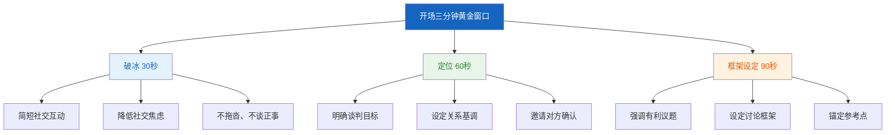
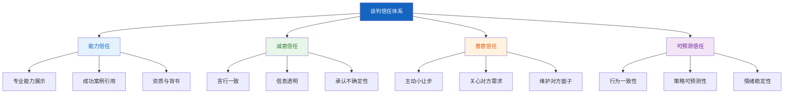

## 第二节 开局技巧：奠定谈判基调

> "你永远没有第二次机会来制造第一印象。"——威尔·罗杰斯（Will Rogers）

谈判的开局不是简单的寒暄和客套，而是一场精密的**心理定调**过程。哈佛大学谈判项目的研究表明，谈判前5-10分钟建立的基调（Tone）和框架（Frame）对最终协议的走向有显著影响——不是决定性的，但足以将结果推向某个方向。一个精心设计的开局能够在谈判开始前就为你赢得结构性优势：设定有利的参考点、建立恰当的关系温度、掌控议题的讨论节奏。

本节将系统拆解开局阶段的四大核心模块——开场策略选择与决策框架、锚定效应的策略性运用、关系建立与信任培养、议程设定与节奏控制——以及两个实战维度：第一印象管理和开局常见错误。

---

### 一、开场策略选择与决策框架

开场策略的选择不是随意的，它取决于四个关键变量：**谈判性质**（分配式还是整合式）、**关系定位**（一次性还是长期）、**信息优势**（你对市场和对方了解多少）、**权力态势**（你强还是对方强）。盲目选择开场策略，就像医生不诊断就开药——偶尔有效，多数时候有害。

#### 1.1 三种基本开场策略

##### 合作性开场（Collaborative Opening）

**核心逻辑**：通过展示诚意和善意，营造互信氛围，引导对方也采取合作态度。这不是"软弱"，而是一种**战略性善意**——在长期关系中，合作性开场的总体回报远高于竞争性开场。

**适用情境**：
- 双方存在长期合作关系或有建立长期关系的意愿
- 利益有明显重叠区域，合作空间大
- 对方的谈判风格偏向理性与合作
- 议题复杂，需要双方共同创造解决方案

**具体做法**：

1. **表达对合作的期待**——不是空洞的"希望合作愉快"，而是具体说明为什么合作对双方有价值。"我们在过去两年的合作中，帮助双方的客户满意度提升了15%，我相信这次续约能在此基础上更进一步。"
2. **强调共同利益和目标**——主动识别并表述双方的共同利益，将谈判定位为"我们一起解决问题"而非"我和你争利益"。
3. **提出公平的程序建议**——主动提议一个公平透明的谈判流程，展示你对过程公正性的重视。
4. **分享非敏感信息建立信任**——适度透露一些背景信息（市场趋势、行业动态），营造信息共享的氛围，引导对方也分享信息。

**示例话术**：

> "很高兴我们有机会坐下来讨论这个合作。在过去的合作中，我们双方都获益良多——你们的产品线扩展了30%，我们的供应链稳定性提升了显著。我相信通过这次深入沟通，我们一定能设计出一个对双方都更有利的合作框架。我先分享一下我们对市场趋势的分析，也期待听听你们的观察。"

**为什么有效**：这段话术同时完成了三个任务——回顾共同历史（建立信任基础）、用数据展示互惠关系（证明合作价值）、主动分享信息（激发互惠心理）。心理学中的**互惠原则**（Reciprocity Principle）表明，当一方主动分享信息时，另一方会感受到分享的心理压力。

##### 竞争性开场（Competitive Opening）

**核心逻辑**：通过展示实力、设定高标准锚点和暗示替代方案，建立心理优势。竞争性开场的本质是**信号发送**——向对方传递"我不需要这笔交易，但你可能需要"的信息。

**适用情境**：
- 一次性交易，不需要维护长期关系
- 己方有明显的BATNA优势或市场优势
- 对方可能采取竞争策略，需要先发制人
- 你需要通过高标准锚点争取更大的谈判空间

**具体做法**：

1. **高锚点设定**：提出一个有依据但偏高的初始要求，为后续让步创造空间。锚点不是漫天要价——它必须有合理依据，否则会被对方直接拒绝，反而损害你的可信度。
2. **实力展示**：通过数据、案例或第三方背书，展示你的专业能力和市场地位。"我们去年完成了3个类似规模的项目，客户续约率100%。"
3. **替代方案暗示**：不直接威胁，而是间接暗示你有其他选择。"我们目前有3个供应商在洽谈，但基于之前的沟通印象，我们优先考虑与贵司合作。"
4. **专业但坚定的态度**：保持礼貌和专业，但在关键议题上立场清晰、不含糊。

**示例话术**：

> "基于我们对市场的深入调研和成本分析，我们认为每件X元的价格是公平合理的——这个价格对应的是行业前20%的品质标准和72小时的交付承诺。我们也收到了其他几家供应商的报价，但综合考虑合作历史，我们更倾向与贵司合作。当然，前提是条件合理。"

**为什么有效**：这段话术包含了一个有依据的锚点（"市场调研和成本分析"）、一个价值论证（"行业前20%品质标准"）、一个替代方案暗示（"其他几家供应商"）、一个合作意向但有条件的信号（"前提是条件合理"）。对方接收到的信息是：这个人有准备、有选择、有底线，但也愿意合作。

##### 程序性开场（Procedural Opening）

**核心逻辑**：通过主动设定谈判的程序和规则，掌控谈判的节奏和框架。程序性权力是一种**被低估的权力形式**——谁决定了"怎么谈"，谁就在很大程度上决定了"谈什么"和"谈成什么样"。

**适用情境**：
- 议题复杂、涉及多个维度
- 多方参与谈判
- 双方对谈判流程没有明确共识
- 你需要通过议程设计来创造策略优势

**具体做法**：

1. **提出议程建议**：主动设计谈判议程，包括议题顺序、讨论时间、休息安排。议程设计本身就是一种策略——把对你有利的议题放在前面（利用"首因效应"），把对方关心但你有弹性的议题放在后面（作为收尾时的交换筹码）。
2. **设定时间框架**：明确谈判的总时长和每个议题的时间分配。时间框架能防止谈判陷入无休止的纠缠，也为你创造合理的时间压力。
3. **明确决策权限**：开场时就说明谁有决策权、需要经过什么审批流程。这既避免了对方"找你领导谈"的策略，也给了你"需要请示"的退路。
4. **建立记录和确认机制**：提议每讨论完一个议题就做口头确认，由一方做记录。这能防止后续出现"我记得不是这样说的"争议。

**示例话术**：

> "为了确保我们今天能高效地讨论所有议题，我准备了一个建议议程，大家看看是否合适。我建议我们先用10分钟确认今天要讨论的议题清单和优先级，然后依次讨论价格、交付条件和售后条款，每个议题大约20分钟。中间我们休息一次。如果某个议题一时无法达成一致，我们先标记下来，最后统一处理。大家觉得这样安排可以吗？"

**为什么有效**：这段话术展示了你做了充分准备（"准备了一个建议议程"），同时用了邀请协商的语气（"大家看看是否合适"、"大家觉得这样安排可以吗"）——不是单方面强加议程，而是"建议+协商"，体现了尊重和合作。但事实上，你已经通过提出议程建议，掌握了议程设计的主动权。

#### 1.2 开场策略决策矩阵

面对一个具体的谈判场景，如何选择最合适的开场策略？以下决策矩阵提供了系统化的判断框架：

| 判断维度 | 倾向合作性开场 | 倾向竞争性开场 | 倾向程序性开场 |
|---------|-------------|-------------|-------------|
| **关系性质** | 长期合作、多次互动 | 一次性交易、短期关系 | 复杂项目、多方参与 |
| **信息态势** | 信息较对称 | 我方信息优势明显 | 信息复杂，需结构化 |
| **权力关系** | 双方势均力敌 | 我方有BATNA优势 | 权力关系模糊 |
| **议题特征** | 利益重叠大、可创造价值 | 利益对立明显、分配为主 | 议题多、需要排序管理 |
| **时间压力** | 时间充裕 | 时间紧迫 | 时间充裕但议题多 |
| **情绪温度** | 双方情绪平稳 | 需要展示决心 | 需要建立秩序 |

**关键认知：大多数谈判需要混合策略**。你可能以合作性开场建立关系，然后在具体议题上转入竞争性锚定，再通过程序性手段管理复杂议程。策略之间不是非此即彼，而是根据谈判的动态灵活组合。

#### 1.3 开场的"三分钟黄金窗口"

谈判心理学研究表明，开场的前三分钟会形成一个**初始框架**（Initial Frame），影响后续至少30分钟的讨论方向。这个窗口期内你需要完成以下任务：

1. **破冰（30秒）**：简短的社交互动——问候、天气、交通，但不要拖沓。破冰的目的是降低双方的社交焦虑，不是建立友谊。
2. **定位（60秒）**：用一两句话明确这次谈判的定位——"我们今天的目标是找到一个对双方都公平的年度合作框架"。定位决定了讨论的基调。
3. **框架设定（90秒）**：通过你的第一段正式发言，设定讨论的框架——强调什么、忽略什么、如何看待议题。框架设定是开局中最微妙也最有影响力的行为。

---

### 二、锚定效应的策略性运用

锚定效应（Anchoring Effect）是谈判中**最具操作性的心理学原理**之一。诺贝尔经济学奖得主丹尼尔·卡尼曼（Daniel Kahneman）和阿莫斯·特沃斯基（Amos Tversky）在1974年的经典论文《不确定条件下的判断：启发式与偏差》中首次系统描述了这一效应。此后四十年的研究反复验证：锚定效应不仅强大，而且顽固——即使人们知道锚定效应的存在，仍然难以完全免疫。

#### 2.1 锚定效应的心理学机制

锚定效应为什么如此强大？因为它作用于人类认知的底层机制：

**机制一：不充分调整（Insufficient Adjustment）**

当人们接收到一个初始数值（锚点）后，会以这个数值为起点进行调整来形成自己的判断。但这种调整通常是**不充分的**——人们调整的幅度远小于应有的幅度。实验表明，即使实验者明确告知受试者锚点是随机生成的，锚点仍然显著影响受试者的估值。

**机制二：确认性信息搜索（Confirmatory Hypothesis Testing）**

接收到锚点后，人们会不自觉地搜索**支持**这个锚点的信息，而不是客观评估所有信息。例如，当卖方开价100万时，买方会不自觉地寻找"这个价格可能合理的理由"，而不是全面评估这个价格是否合理。

**机制三：数值可及性（Numeric Accessibility）**

锚点使相关的数值信息在记忆中更容易被提取。当卖方说"100万"时，"100万"附近的数值在买方脑中变得更"可及"，从而影响买方对合理价格区间的判断。

**在谈判中的具体表现**：

- 初始报价对最终成交价有显著的统计相关性。Galinsky和Mussweiler（2001）的研究发现，先出价的一方在最终协议中平均获得更好的结果。
- 即使锚点明显不合理（比如开价高出市场价50%），它仍然会影响最终结果——虽然效果比合理锚点弱，但方向一致。
- 经验丰富的谈判者受锚定效应影响较小，但并非完全免疫。专家级谈判者受锚定效应影响的幅度约为新手的60%-70%。
- 锚定效应在**不确定性越高**的情境中越强。当你对谈判议题的真实价值越不确定，锚点的影响力越大。

#### 2.2 主动锚定：如何设定有效的锚点

设定锚点是开局中最重要的策略行为之一。一个好的锚点能为你争取到最大的谈判空间；一个糟糕的锚点可能直接破坏谈判。

##### 锚定校准公式

锚点的设定需要在**极端性**和**可信度**之间找到最佳平衡点。过于保守的锚点（接近你的可接受目标）会压缩你的谈判空间；过于激进的锚点（脱离现实）会被对方拒绝，损害你的可信度。

**校准公式**：

最优锚点 = 你的理想目标 + （理想目标 - 期望目标）× 调节系数

其中调节系数根据情境调整：
- 市场信息充分、对方专业：调节系数 0.5-1.0（保守锚定）
- 信息不对称、对方不熟悉行情：调节系数 1.0-2.0（适度激进）
- 对方急需达成协议：调节系数 1.5-2.5（可以更激进）

**示例**：你在卖一套二手房
- 理想目标（最高可成交价）：350万
- 期望目标（预期成交价）：320万
- 底线目标（最低接受价）：300万
- 调节系数：1.0（市场信息充分）
- 最优锚点 = 350 + (350 - 320) × 1.0 = 380万

这个380万的开价给你留出了30万的让步空间（380→350），而且350万正好是你的理想目标。

##### 有效锚点的四个条件

| 条件 | 说明 | 正面示例 | 反面示例 |
|------|------|---------|---------|
| **可信度** | 锚点必须有合理依据，能自圆其说 | "基于同小区最近3个月的成交均价，加上装修溢价" | "我觉得值这个价"（没有依据） |
| **具体性** | 具体数字比模糊范围更有效 | "每平米38,500元" | "大概3万5到4万之间"（给了对方低端锚定的机会） |
| **极端性** | 在合理范围内尽可能争取更大空间 | 开价380万（理想350万+30万空间） | 开价355万（几乎等于理想目标，没有让步余地） |
| **表达自信** | 语气坚定但不咄咄逼人 | "经过详细分析，我们的定价是……" | "不知道合不合理，但我觉得……"（自我怀疑削弱锚点力量） |

##### 锚定的时机选择

**先发制人锚定 vs 后发制人锚定**：

| | 先发制人（我先出价） | 后发制人（等对方出价） |
|---|---|---|
| **优势** | 设定对我有利的参考点，掌控谈判框架 | 收集更多信息后再回应，避免过早暴露 |
| **风险** | 如果不了解市场，可能开价过低或过高 | 被对方的锚点锁定，被动应对 |
| **适用场景** | 我对市场行情足够了解，有信心开出合理锚点 | 市场行情模糊，对方的开价本身就是重要信息 |
| **研究支持** | Galinsky & Mussweiler (2001) 研究表明先出价方平均获得更好的结果 | 当对方对议题价值不确定时，先让对方出价可以暴露其判断 |

**决策原则**：如果你对议题的市场价值有充分了解，**先出价**设定锚点。如果你对市场价值不确定，或者对方的开价本身就是有价值的信息，**先倾听**。但注意：倾听不等于被动——你可以在对方出价后用"重新锚定"策略来破解对方的锚点。

#### 2.3 应对对方锚定的四大策略

当对方先出价并且锚点对你不利时，你需要系统化的应对策略。以下是四种经过验证的反锚定策略，按有效性从高到低排列：

##### 策略一：重新锚定（Re-anchoring）

**原理**：用一个更有利的新锚点覆盖对方的锚点。不要在对方的锚点基础上讨价还价——那意味着你已经接受了对方的框架。

**操作方法**：
1. 完全忽略对方的锚点，不要评价它、不要回应它
2. 提出你自己的锚点，并提供充分的依据
3. 将讨论框架从"对方的开价"转移到"客观标准"

**示例话术**：

> 对方："这个项目我们的报价是200万。"
> 你："感谢你们的报价。根据我们对市场上同类项目的调研——包括A公司去年完成的类似项目（130万）和B公司的行业基准报告（120-150万区间），我们认为基于项目的实际工作量和市场行情，140万是一个更合理的起点。我们来详细看一下这个报价的依据？"

**为什么有效**：你没有说"200万太贵了"（这等于在对方的框架里讨论），而是直接提出了一个新锚点（140万）并用客观数据支撑。讨论的框架从"200万是否合理"变成了"市场行情到底是多少"。

##### 策略二：质疑解构（Deconstructing the Anchor）

**原理**：要求对方详细解释锚点的构成和依据，通过逐项分析来暴露锚点的不合理性。

**操作方法**：
1. 用开放式提问要求对方解释："能具体说说这个报价是怎么构成的吗？"
2. 逐项分析每个组成部分，用数据和事实质疑不合理的部分
3. 将总价分解为多个子项，找到可以单独谈判的突破口

**示例话术**：

> "200万的报价我想详细了解一下构成。其中人力成本是多少、设备成本是多少、管理费用是多少？每项的计算依据是什么？因为根据我们的理解，这个项目的标准工作量大约是XX人天，按照行业平均人天单价，人力部分应该在……"

**为什么有效**：模糊的总数被分解为具体的子项后，对方很难为每个子项都辩护。你不需要挑战整个报价——只需要在几个子项上证明不合理，就能有效地拉低整体锚点。

##### 策略三：引入多重参考点（Multiple Reference Points）

**原理**：单一锚点的影响力最强。引入多个参考点可以稀释对方锚点的影响，让判断回归更理性的区间。

**操作方法**：
1. 引入市场价格、历史先例、竞争对手报价等多个参考点
2. 展示一个价格区间而非单一数字
3. 用多个数据源交叉验证

**示例话术**：

> "关于价格，我想提供几个参考：行业报告的平均数据是XX，我们过去三年的合作价格是XX，最近收到的另一家供应商报价是XX，市场调研机构给出的合理区间是XX到XX。综合这些参考，我认为合理的价格应该在XX附近。"

**为什么有效**：当只有一个锚点时，人的注意力集中在那个点上。当有4-5个参考点时，任何一个单一数字的影响力都被稀释了。注意力从"对方说的200万"转移到了"综合各方面的数据，合理区间是多少"。

##### 策略四：框架转换（Frame Shifting）

**原理**：改变讨论的维度，从对方设定的框架切换到对你更有利的框架。

**操作方法**：
1. 从价格框架转向价值框架："与其讨论价格，不如讨论这个项目能带来的价值"
2. 从总额框架转向单价框架："200万听起来很多，但我们按人天算一下……"
3. 从短期框架转向长期框架："如果考虑三年合作的总成本……"

**示例话术**：

> "我理解200万是基于这个项目本身的工作量评估。但我更建议我们从长期合作的角度来看——如果我们确定3年的合作框架，按照每年的项目量来定价，整体的单位成本对双方都更有利。"

#### 2.4 锚定效应的边界条件

锚定效应并非万能——了解它的局限性同样重要：

| 边界条件 | 说明 | 策略启示 |
|---------|------|---------|
| **极端锚点效果递减** | 锚点越极端，可信度越低，效果越弱 | 锚点要有依据，不能漫天要价 |
| **专家效应** | 领域专家受锚定影响较小 | 面对专家时，锚点需要更精确的依据 |
| **情绪效应** | 负面情绪可能削弱锚定效应 | 对方愤怒时，锚定策略效果下降 |
| **警告效应** | 提前告知锚定效应可以部分削弱其影响 | 面对有准备的对手时，需要更强的锚点 |
| **动机效应** | 高动机（有足够时间和激励仔细思考）可以削弱锚定 | 对方有充分时间考虑时，锚点需要更合理 |

---

### 三、关系建立与信任培养

谈判不是在真空中发生的——它发生在人与人之间。即使是最纯粹的商业交易，关系质量也会影响谈判的效率和结果。关系好不一定能谈成，但关系差一定谈不成。

#### 3.1 信任的四个维度

谈判中的信任不是单一的概念，而是一个多维度结构。理解信任的构成，你才能有针对性地建立信任。

| 维度 | 含义 | 建立方式 | 损害行为 |
|------|------|---------|---------|
| **能力信任** | 相信对方有能力履行承诺 | 展示专业能力、引用成功案例、提供资质证明 | 夸大能力、承诺超出能力范围 |
| **诚意信任** | 相信对方不会故意欺骗 | 言行一致、主动分享信息、承认不确定 | 前后矛盾、隐藏关键信息、被发现说谎 |
| **善意信任** | 相信对方会考虑我的利益 | 主动做出小让步、关心对方需求、维护对方面子 | 只顾自己利益、利用对方弱点 |
| **可预测信任** | 相信对方行为有规律可循 | 行为一致、策略透明、情绪稳定 | 行为反复无常、情绪化决策 |

#### 3.2 开局阶段的信任建立技术

开局阶段的信任建立不需要长篇大论——几个精心设计的行为就能奠定基调。

##### 技术一：专业形象塑造

第一印象在3秒内形成，而且一旦形成就很难改变。在谈判中，专业形象传递的能力信任是最快速的信任建立方式。

**着装与仪态**：着装比对方正式半级（不要太随意也不要太刻意）；坐姿挺直但不僵硬；保持适度的眼神接触（60%-70%的时间）；握手有力但不捏痛。

**准备展示**：在开场的自然对话中，不经意地展示你做了充分准备。"我注意到贵公司上个月获得了XX行业的创新奖，恭喜。"这句话同时传递了三个信息：我关注你们的动态、我做了功课、我尊重你们的成就。

**专业术语的恰当使用**：使用对方行业的专业术语，展示你对领域的理解。但注意不要过度——过度使用术语会显得在炫耀，而非真正理解。

##### 技术二：相似性连接

心理学研究一致表明，人们更信任与自己相似的人。这不是说你需要假装和对方一样，而是要**找到并强调真实的共同点**。

**三种有效的相似性连接**：
1. **背景相似**：同校、同乡、同行、有共同认识的人。"我看到您也是XX大学毕业的，我2015届的。"
2. **经历相似**：类似的职业经历、面对过类似的挑战。"我之前也在甲方待过，非常理解你们对交付时间的焦虑。"
3. **观点相似**：对行业趋势、问题本质有共同看法。"我也认为这个行业的下一个增长点在于……"

**注意**：相似性连接必须是真实的。编造共同点一旦被拆穿，信任会瞬间归零。

##### 技术三：渐进式信息分享

信任的本质是一个**递进式的过程**——你先分享一些低敏感度的信息，对方如果也分享了信息，你就再分享一些更高敏感度的信息。这个过程就像"信任的阶梯"，一步一步向上走。

**信息敏感度分层**：

| 层级 | 信息类型 | 示例 | 分享时机 |
|------|---------|------|---------|
| 第一层 | 公开信息 | 行业趋势、市场数据 | 开场阶段 |
| 第二层 | 背景信息 | 公司战略方向、一般性需求 | 初步建立信任后 |
| 第三层 | 偏好信息 | 具体的优先级、偏好排序 | 中场阶段，信任基本建立 |
| 第四层 | 约束信息 | 预算限制、时间压力、内部约束 | 深度信任后，或策略性分享 |

**关键原则**：信息分享是双向的。如果对方拒绝分享信息，你也应该适当收敛。单方面透明不是信任建设，是信息泄露。

##### 技术四：可靠性信号

信任不仅靠言语建立，更靠行为积累。开局阶段的几个"小行为"能传递强烈的可靠性信号：

- **准时到达**：迟到传递的信号是"我的时间比你的重要"。提前5分钟到达是最理想的时间——太早显得焦虑，迟到则损害信任。
- **兑现小承诺**：如果你说"我会把资料发给你"，当天就发。小承诺的兑现是大承诺可信度的预测指标。
- **记住细节**：记住对方在之前沟通中提到的细节并在后续引用。"你上次提到你们对交付时间特别看重，我们在方案中特别做了优化。"这传递的信号是"我在认真听你说的每一句话"。
- **保持一致**：你的立场、论据和态度应该在不同场合保持一致。如果你在邮件中说"价格有商量余地"，在谈判桌上又说"价格没得谈"，信任会立刻崩塌。

#### 3.3 关系类型识别与策略适配

不同的关系类型需要不同的开局策略。错误地判断关系类型会导致策略失配——比如在一次性交易中投入过多关系建设，或者在长期合作中使用过于强硬的竞争策略。

| 关系类型 | 特征 | 开局重点 | 信任投资水平 | 底线保护力度 |
|---------|------|---------|------------|------------|
| **交易型关系** | 一次性互动、明确的起止时间、以结果为导向 | 快速建立能力信任、展示专业性、设定清晰的谈判框架 | 低（不需要深度信任） | 高（保护核心利益） |
| **合作型关系** | 多次互动、有一定的情感连接、注重公平 | 建立诚意信任和善意信任、展示长期合作意愿、寻找共同利益 | 中（需要适度信任） | 中（在核心利益上坚持，在非核心利益上灵活） |
| **战略型关系** | 长期伙伴、深度利益绑定、共同成长 | 全维度信任建设、展示战略视野、强调共同愿景和价值创造 | 高（深度信任是合作基础） | 低（更关注共同利益最大化） |

---

### 四、议程设定与节奏控制

谁控制了议程，谁就控制了谈判。议程设定权（Agenda-Setting Power）是谈判中最容易被忽视、但影响力最大的权力形式之一。议程决定了哪些议题被讨论、讨论的顺序、每个议题花多少时间——这些程序性选择会直接影响实质性结果。

#### 4.1 议程设计的六大原则

##### 原则一：先易后难 vs 先难后易

两种策略各有优劣，选择取决于情境：

| 策略 | 逻辑 | 适用场景 | 风险 |
|------|------|---------|------|
| **先易后难** | 先在简单议题上达成共识，建立合作惯性和信任，再处理困难议题 | 信任基础薄弱、议题之间有交换空间、双方有合作意愿 | 简单议题花太多时间，到困难议题时精力和耐心不足 |
| **先难后易** | 先攻克核心议题，建立框架协议，剩余议题自然解决 | 核心议题是关键、时间紧迫、核心议题不解决其他议题无意义 | 核心议题僵持导致谈判过早破裂 |
| **混合策略** | 从一个中等难度的议题开始热身，然后处理核心议题，最后用简单议题收尾 | 大多数谈判场景 | 需要对议题难度有准确判断 |

**实际建议**：大多数情况下，**先易后难**是最安全的选择。它通过渐进式推进来积累信任和合作动力，降低双方的防御心理。但如果时间非常紧迫，或者核心议题是所有其他议题的前提条件，则应该**先难后易**。

##### 原则二：议题打包而非逐项讨论

逐项讨论（Issue-by-Issue）是谈判中最常见的错误之一。当议题被逐个讨论时，每个议题都变成了一个小型的零和博弈——你在这个议题上让一步，我在那个议题上让一步，双方都在"失血"。

**打包讨论**（Package Deal）则将多个议题放在一起讨论，利用双方在不同议题上的偏好差异来创造交换空间。"我可以在议题A上让步，但需要你在议题B和C上配合我"——这种打包交换比逐项讨价还价的效率高得多。

##### 原则三：时间分配的战略性

时间分配本身就是一种策略。花更多时间讨论你重视的议题，花更少时间讨论对方重视的议题。

- **我方优势议题**：分配更多时间，深入讨论，充分论证，争取让对方接受对我有利的条件
- **对方优势议题**：适当压缩时间，快速通过，避免过多纠缠
- **可交换议题**：给予中等时间，留有弹性，作为后续交换的筹码

##### 原则四：里程碑确认机制

每讨论完一个议题（或一组议题），花1分钟做**口头确认**："我们刚才确认的是……对吗？"这种里程碑确认有三个好处：
1. 防止后续出现理解偏差
2. 制造"正在取得进展"的心理感受，推动谈判前进
3. 每一次确认都是一个"微型承诺"，增加对方的退出成本

##### 原则五：弹性预留

议程不是铁板——必须留有15%-20%的弹性时间。谈判中一定会出现你没有预料到的议题、突发的情绪冲突、需要额外讨论的细节。没有弹性的议程会导致两种糟糕的结果：要么被迫延长谈判时间（疲劳战），要么跳过重要议题（遗漏）。

##### 原则六：议程的"所有权"设计

谁提出议程，谁就拥有了议程的"所有权"——后续调整议程时，你需要和"所有者"协商。因此，**主动提出议程建议**是一种低成本、高回报的策略：你掌控了议程的初始框架，同时通过邀请对方修改来体现合作诚意。

#### 4.2 议程控制的实战技巧

##### 技巧一：议题排序的心理学

**首因效应与近因效应**：人们对序列中最先出现和最后出现的信息记忆最深。利用这一原理，把对你最有利的议题放在议程的**开头或结尾**，把中等重要的议题放在中间。

**情绪曲线管理**：谈判的精力和情绪不是恒定的——通常在开始时最高，中间疲劳，结束前因为时间压力再次升高。把需要创造性思维的议题安排在精力高峰期（开头），把相对机械的议题（如确认条款细节）安排在精力低谷期（中间）。

##### 技巧二：议程调整的策略

当对方提出修改议程时，不要本能地拒绝——这会显得不合作。也不要无条件接受——这会失去控制权。正确的做法是**有条件地接受**：

> "您建议先讨论价格，我理解您的优先级。如果我们先花15分钟快速过一下项目范围，确保双方对交付内容的理解一致，再讨论价格会更高效。这样可以吗？"

这段话术的精髓在于：表面上接受了对方的建议（先讨论价格），但实际上加入了一个前置条件（先确认项目范围），保护了你的策略利益。

##### 技巧三：时间压力的策略性运用

时间压力是谈判中一把双刃剑——适度的时间压力推动决策，过度的时间压力导致糟糕的决策。

**策略性时间管理**：
- **创造建设性紧迫感**："今天下午3点我还有一个会议，所以我们最好在2:30之前把主要议题都过一遍。"——给双方一个合理的截止时间。
- **打破对方的时间压力**：如果对方说"今天必须决定"，你可以回应"我理解时间的重要性。一个草率的决定对双方都不好，不如我们今天先确定框架，明天再确认细节？"
- **利用休会**：当讨论陷入僵局或情绪升温时，主动提议休息10-15分钟。"我们休息10分钟，喝杯咖啡，然后带着新的视角继续？"休会不仅是降温，也是你和团队内部沟通策略的机会。

---

### 五、第一印象管理：超越言语的信号传递

第一印象不仅来自你说了什么，更来自你没说的——你的外表、仪态、非语言行为、甚至你到达谈判地点的方式。社会心理学研究表明，第一印象在3-7秒内形成，而且一旦形成就具有极强的**锚定效应**和**持续效应**（Primacy Effect）——后续信息很难改变第一印象。

#### 5.1 非语言信号清单

| 信号类别 | 积极信号 | 消极信号 | 谈判影响 |
|---------|---------|---------|---------|
| **眼神** | 适度接触（60%-70%）、看对方时微微点头 | 回避眼神、盯着资料不看人、过度凝视 | 信心、诚意、尊重程度的判断 |
| **姿态** | 坐姿挺直但放松、身体微微前倾 | 后仰（防御/傲慢）、双臂交叉（封闭）、频繁变换坐姿（焦虑） | 开放度、兴趣度、压力水平的判断 |
| **手势** | 手掌朝上（开放/诚实）、适度的手势辅助表达 | 指向对方（攻击性）、摸鼻子/嘴（可能在隐藏）、握拳（紧张） | 真诚度、控制力的判断 |
| **声音** | 语速适中、音量稳定、停顿有力 | 语速过快（紧张）、声音过小（不自信）、过多填充词（准备不足） | 专业度、可信度的判断 |
| **时间** | 准时到达（提前3-5分钟）、节奏从容 | 迟到、匆忙、频繁看表 | 尊重度、重视程度的判断 |

#### 5.2 环境因素的策略性利用

**座位选择**：
- **并排坐**比**面对面坐**更有利于合作——减少了对抗感，更像"共同面对问题"。
- **圆形桌**比**长条桌**更平等——没有"主位"暗示的权力差异。
- **避免让对方坐在背对门口或窗户的位置**——背后的空间感不安全感会增加对方的防御心理。
- **如果你是主场**，选择让你能控制门口和视野的位置——这给你一种微妙的心理掌控感。

**温度与舒适度**：
- 研究表明，手里拿着热饮的人对陌生人的评价更积极（Williams & Bargh, 2008）。在谈判开始时递上一杯热茶或咖啡，不只是礼貌——它在生理层面影响对方的信任感受。
- 房间温度过低会让人们更警觉和对立；温度适中则促进合作感。

**物理距离**：
- 商务谈判的理想距离是1.2-1.5米——太近让人不适，太远显得疏远。
- 如果桌子很宽，可以在桌上放一些共享物品（资料、水杯）来弥补物理距离。

---

### 六、开局常见错误与纠正

即使是经验丰富的谈判者，也容易在开局阶段犯以下错误。识别这些错误是避免它们的第一步。

#### 6.1 错误一：过早暴露底线

**典型表现**："我们的底线是……"、"最多我们能接受……"、"最低不能低于……"

**为什么有害**：底线是你最后的安全网，过早暴露意味着对方可以直接把价格压到你的底线附近，你没有任何谈判空间。

**纠正方法**：永远从理想目标开始谈判，用让步来逐步接近底线，而不是从底线开始。即使对方直接问"你们的底线是多少"，也不要回答——"底线取决于整个方案的综合条件，我们先讨论方案细节。"

#### 6.2 错误二：急于进入实质讨论

**典型表现**：寒暄不到30秒就直入主题，"我们直接说正事吧"。

**为什么有害**：跳过了关系建立阶段，双方还没有建立基本的信任和舒适感。结果是谈判从一开始就充满了防御性——双方都在保护自己，没有人真正开放地探索可能性。

**纠正方法**：在正式开始前花5-10分钟进行非正式交流。可以聊聊行业动态、对方公司的近况、甚至天气——关键是降低社交焦虑、建立人际连接。这不是浪费时间，这是在为后面的高效沟通铺路。

#### 6.3 错误三：被对方的锚点带着走

**典型表现**：对方提出一个很高的开价后，你直接在对方的开价基础上砍价，而不是提出自己的参考点。

**为什么有害**：你接受了对方的框架。即使你成功"砍"了一些价，最终结果仍然在对方的锚点附近。

**纠正方法**：使用本节2.3节的四大反锚定策略——特别是重新锚定和引入多重参考点。永远不要在对方的锚点基础上讨价还价。

#### 6.4 错误四：过度讨好

**典型表现**：过分客气、急于取悦对方、主动做出不必要的让步来"表示诚意"。

**为什么有害**：过度讨好传递的信号是"我比你更需要这笔交易"——这直接削弱了你的议价能力。同时，过早的无条件让步会让对方认为你还有更多让步空间。

**纠正方法**：友好但不讨好，合作但有原则。诚意通过**言行一致**和**公平对待**来展示，而不是通过单方面让步。

#### 6.5 错误五：忽略对方的开场信号

**典型表现**：只关注自己的开场计划，不注意对方在开场阶段传递的信号——对方的情绪状态、关注重点、决策焦虑。

**为什么有害**：你错过了最重要的信息收集窗口。对方在开场阶段的行为往往暴露了他们的真实优先级、压力点和BATNA质量。

**纠正方法**：在开口之前先**倾听和观察**。注意对方的用词选择、情绪状态、关注的议题——这些都是制定后续策略的宝贵信息。

#### 6.6 错误六：议程控制权拱手让人

**典型表现**：对方提出议程，你不假思索地接受；或者对方不断切换议题，你被动跟从。

**为什么有害**：你失去了对谈判节奏的控制。对方可以通过议题切换来打乱你的策略，在你最薄弱的议题上施压。

**纠正方法**：主动提出议程建议，或者在对方提出议程后进行合理的修改。当对方试图切换议题时，温和但坚定地把讨论拉回来："这个议题很重要，我们一会儿专门讨论。现在让我们先把当前议题讨论完。"

---

### 七、开局阶段自检清单

在正式进入谈判的实质性讨论之前，使用以下清单确认开局工作的完整性：

**开场策略 ☐**
- [ ] 已根据关系性质、信息态势、权力关系选择合适的开场策略
- [ ] 已完成开场三分钟黄金窗口的规划（破冰→定位→框架设定）
- [ ] 已准备开场话术，包括定位语和框架设定语
- [ ] 已为混合策略场景准备策略切换预案

**锚定策略 ☐**
- [ ] 已决定先发制人还是后发制人
- [ ] 已通过校准公式计算最优锚点
- [ ] 已为锚点准备充分的依据和数据
- [ ] 已准备至少两种反锚定策略，应对对方先出价的情况

**关系建设 ☐**
- [ ] 已分析关系类型（交易型/合作型/战略型）并制定相应的信任建设策略
- [ ] 已准备相似性连接点（共同背景、经历、观点）
- [ ] 已规划信息分享的层级和顺序
- [ ] 已注意非语言信号（着装、仪态、准时、环境）

**议程管理 ☐**
- [ ] 已设计议程框架，包括议题顺序和时间分配
- [ ] 已确定议题打包方案（哪些议题一起讨论）
- [ ] 已预留弹性时间（15%-20%）
- [ ] 已准备议程调整时的应对话术

**错误防范 ☐**
- [ ] 已明确哪些信息绝对不能在开局阶段透露（底线、BATNA细节、内部约束）
- [ ] 已提醒自己不要急于进入实质讨论
- [ ] 已准备反锚定策略，防止被对方锚点带着走
- [ ] 已安排团队中的观察员关注对方的开场信号

---

### 八、开局策略的进阶思考

#### 8.1 情绪框架：开局不只是信息交换

大多数谈判教材把开局描述为"信息交换"和"框架设定"的过程，但忽略了一个关键维度：**情绪框架的建立**。情绪框架（Emotional Frame）是指谈判双方在情感层面形成的互动模式——是紧张防御还是轻松探索，是对抗竞争还是合作共创。

研究表明，开局阶段的情绪基调对谈判的**过程质量**（双方是否满意谈判方式）和**结果质量**（协议的综合价值）都有显著影响。一个轻松但专业的开局氛围能促进信息分享和创造性思维，而一个紧张对立的开局则会激活双方的防御机制，降低信息分享意愿。

**建立积极情绪框架的方法**：
- 以一个积极的正面事件开头："听说贵公司的新产品在市场上反响很好，恭喜。"
- 使用幽默——适度的、不冒犯的幽默是快速降低社交焦虑的最有效方式
- 展示自信但不傲慢——自信是感染性的，当你表现出"我很享受这次谈判"的态度时，对方也会受到影响

#### 8.2 文化敏感性：开局策略的文化适配

开局策略不是全球通用的——不同文化对"好的开始"有截然不同的定义。

| 文化背景 | 开局特点 | 注意事项 |
|---------|---------|---------|
| **中国** | 重视关系建设、先聊生活再谈生意、注重面子 | 不要在开局就直接进入价格谈判；给对方留足面子；不要当众质疑对方的主张 |
| **美国** | 倾向快速进入正题、注重效率、直接表达 | 不要花太长时间寒暄；直接但不粗鲁；数据驱动的论证更有说服力 |
| **日本** | 重视礼节和形式、交换名片有严格规矩、共识导向 | 开局阶段要极其注重礼节；不要急于推进；决策过程可能比你预期的慢 |
| **中东** | 社交环节很长、关系比合同重要、尊重等级 | 不要急于进入商业讨论；喝茶/咖啡是必要的社交仪式；尊重对方的等级和地位 |
| **德国** | 注重准备和精确、议程导向、逻辑严密 | 带着详细的议程和数据来；不要即兴发挥太多；守时是绝对必要的 |

#### 8.3 谈判开局的"逆向思维"

在某些特殊情况下，反常规的开局策略反而能取得意想不到的效果：

**故意示弱**：当你明显处于强势地位时，故意展示谦逊和诚意可以降低对方的防御心理。"我们虽然是甲方，但我们清楚地知道，好的合作是双方都能获益的。所以我们非常重视你们的需求和顾虑。"

**打破常规**：当谈判陷入固定模式时，主动打破预期。"我知道按惯例应该由我方先开价，但今天我想先听听你们的期待——因为我觉得你们对这个项目的需求比我们更清楚。"

**战略性沉默**：在关键的开场时刻（比如双方刚坐下来），刻意保持3-5秒的沉默。这种沉默不是尴尬，而是一种**力量信号**——它传递的信息是"我不急于填满空白，我对这次谈判有充分的信心"。

---

> **本节核心要点**：开局不是热身，它是**定调**。你在开局阶段做出的每一个选择——选择什么开场策略、设定什么锚点、建立什么关系温度、设计什么议程——都在为后面的谈判铺设轨道。轨道铺好了，后面的谈判就顺了；轨道铺歪了，后面要花十倍的力气来纠正。准备充分的开局者不是在赌博，而是在**制造确定性**。
