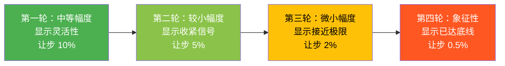
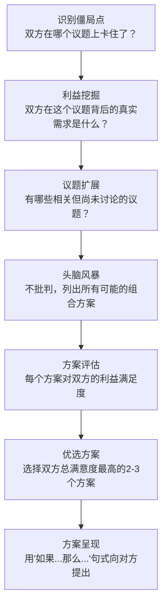

## 第三节 中场技巧：推动谈判进程

> "谈判的胜负不在开局的气势，而在中场的韧性。"——罗杰·道森（Roger Dawson），《优势谈判》

开局定基调，收尾定协议，而**中场**定的是你能否从开局的优势（或劣势）出发，一步步把谈判推向对你有利的方向。中场是谈判中持续时间最长、变数最多、技术密度最高的阶段。开局你准备好的话术和策略可能在前三十分钟就用完了，而真正的较量——利益交换、信息博弈、情绪拉锯——全在中场展开。

中场阶段的核心任务可以概括为四件事：**让步**（如何给、给多少、什么时候给）、**信息交换**（如何获取对方真实意图同时保护自己的底线）、**方案创造**（如何突破零和思维找到双赢解）、**压力攻防**（如何在施压与受压之间保持主动）。这四件事不是独立进行的，而是交织在一起——你在让步的同时也在交换信息，在创造方案的同时也在管理压力。

本节将逐一拆解这四大模块的底层逻辑、具体技术和常见陷阱。

---

### 一、让步策略与技巧

让步是谈判中最核心也最容易犯错的动作。一次糟糕的让步可以让你损失数万、数十万甚至整个谈判的主动权。让步不是"退让"，而是一种**策略性信号**——你通过让步的幅度、速度、方式和条件，向对方传递关于你的底线、耐心和偏好的信息。

#### 1.1 让步的底层逻辑

谈判学者霍华德·拉法（Howard Raiffa）在《谈判的艺术与科学》中指出，让步的本质是**信息传递**。每一次让步都在回答对方一个隐含的问题："你离底线还有多远？"因此，让步的幅度和节奏直接决定了对方对你底线的判断。

**关键认知**：对方不会根据你的让步金额来判断你的诚意，而是根据你的**让步模式**（pattern）来推断你的底线。如果你第一轮让10万，第二轮让5万，第三轮让2万，对方会推断你的底线大概在"再让1万就到底了"。但如果你第一轮让2万，第二轮让5万，第三轮让10万——对方会认为你的底线还远得很，因为他们看到的是"越让越大方"。

#### 1.2 让步的四大基本原则

| 原则 | 含义 | 违反的后果 |
|------|------|-----------|
| **条件性** | 每次让步必须换取对方的对等让步 | 单方面让步会被视为软弱，对方会继续索取 |
| **递减性** | 让步幅度逐轮递减，显示正在接近底线 | 等额或递增让步会让对方认为你还远未到底 |
| **节奏性** | 让步速度适中——不急于回应，也不故意拖延 | 过快让步显得没有原则，过慢显得没有诚意 |
| **清晰性** | 让步内容明确具体，避免模糊表述 | 模糊让步会导致后续执行时的理解分歧 |

#### 1.3 四种让步模式对比

不同的让步模式传递完全不同的信号。选择哪种模式取决于你想要营造的心理效果。

| 模式 | 描述 | 信号传递 | 适用场景 | 风险 |
|------|------|---------|---------|------|
| **等额递减让步**（推荐） | 每轮让步幅度逐轮递减：10→5→2→0.5 | "我在接近底线，空间越来越小" | 大多数谈判场景 | 低 |
| **等额让步** | 每轮让步幅度相同：5→5→5→5 | "我还有空间，只是还没到我的底线" | 需要维持谈判节奏时 | 中——对方可能期待更多轮 |
| **一次性让步** | 第一轮做出较大让步，之后不再让步 | "这是我的诚意，也是我的极限" | 时间紧迫或需要快速建立信任时 | 高——对方可能认为你还有空间 |
| **随机让步** | 让步幅度不规则：2→8→1→5 | 混乱信号，对方无法判断底线 | 几乎不推荐 | 高——破坏信任，让对方困惑 |

**推荐的四轮递减模型**：

**实战示例**——供应商价格谈判：

假设你的目标价是100万，初始报价是85万，你的底线是95万。总让步空间10万。

- 第一轮：从85万让到90万（让5万）——"考虑到长期合作，我们可以做出调整"
- 第二轮：从90万让到93万（让3万）——"这是我们非常大的诚意了"
- 第三轮：从93万让到94.2万（让1.2万）——"我需要向领导申请，这确实超出我的权限"
- 第四轮：从94.2万让到94.5万（让0.3万）——"这是我能做到的极限了"

注意：每一轮都要附加一个**理由**（长期合作、权限限制、申请领导等），理由的作用不是说服对方，而是给对方一个**台阶**——让他可以向自己的团队解释"为什么我接受了这个价格"。

#### 1.4 让步的话术框架

让步不是简单地说"那我便宜一点吧"。每一次让步都是一次**微型谈判**，需要包含三个要素：**条件**（我要什么回报）、**让步内容**（我给什么）、**理由**（为什么我愿意给）。

**框架一：条件式让步**（最常用）

> "如果您能同意[条件X]，我们可以考虑在[议题Y]上做出调整。"

示例："如果您能接受60天账期（条件），我们可以将单价降低3%（让步）。这对我们资金周转确实有压力，但为了长期合作我们愿意承担（理由）。"

**为什么有效**：条件式让步让对方明白让步是有成本的，不是廉价的善意。心理学中的**认知失调理论**指出，人们更珍惜来之不易的东西——你的让步越"费力"，对方越会珍惜。

**框架二：解释性让步**

> "考虑到[关系/合作背景]，我们愿意在[议题]上做出让步，但这对我们来说确实需要[具体代价]。"

示例："考虑到我们过去三年的合作关系，我们愿意在这个条款上做出让步，但这需要我们重新调整整个项目的排期，对我们团队的压力不小。"

**框架三：换取式让步**

> "我们理解[对方关切]对您很重要。作为交换，希望您也能理解我们在[对方议题]上的立场。"

示例："我们理解交付时间对您很重要。如果我们同意在两周内交货，希望您也能理解我们在付款条件上的要求——我们需要50%预付款来安排加急生产。"

#### 1.5 让步的常见陷阱

**陷阱一：无条件让步**

错误示例："好吧，那我们降5%。"——没有任何附加条件，对方会立刻追问："再降5%呢？"

纠正：任何让步都必须有条件。即使条件很小（"那您确认今天能签吗？"），也要有。

**陷阱二：过快让步**

对方刚提出要求，你立刻答应。这传递的信号是："你要求的远低于我的底线。"

纠正：即使你已经决定让步，也要制造一个**合理的时间间隔**。可以说"我需要和团队确认一下"，哪怕你心里已经有答案。

**陷阱三：让步后反悔**

做出让步后又收回，这会严重损害信任。对方会觉得你说的任何话都不可信。

纠正：在做出让步前确认内部权限。如果不确定，用"如果...我们可以..."的条件句式，给自己留后路。

**陷阱四：情绪化让步**

在压力或情绪下做出的让步往往超出你的底线。

纠正：设定一个**预设让步空间**（在准备阶段就决定好最大可以让多少），任何超出这个空间的要求都需要暂停谈判、内部商议。

---

### 二、信息交换技巧

谈判的本质是**不完全信息博弈**——双方都不完全知道对方的真实底线、优先级和替代方案。谁掌握的信息更多，谁的谈判地位就更强。中场阶段的信息交换不是"聊天"，而是一场精心设计的**情报行动**。

#### 2.1 信息交换的四大策略

| 策略 | 操作方式 | 目的 | 风险控制 |
|------|---------|------|---------|
| **渐进式披露** | 逐步分享信息，根据对方反应调整下一步 | 试探对方底线，避免一次性暴露过多 | 设定每轮信息分享的"上限"，不超出预设范围 |
| **选择性披露** | 有策略地选择分享哪些、隐藏哪些 | 强化自己的优势议题，弱化劣势议题 | 确保分享的信息可验证，否则会损害可信度 |
| **互惠性披露** | 分享信息的同时要求对方分享对等信息 | 建立信息交换的公平规范 | 用"我也想知道..."句式，降低索取感 |
| **验证性披露** | 主动分享可验证的真实信息 | 建立可信度，为后续关键信息的传递做铺垫 | 在非关键议题上先展示诚实，关键议题时对方更易相信你 |

#### 2.2 提问技术深度拆解

提问是获取信息最有效的工具。不同类型的提问获取不同类型的信息。

**开放式提问**——获取大范围信息

作用：让对方自由表达，暴露其优先级、关切和思维方式。

> "您能详细说明一下您对这个项目时间线的看法吗？"
> "您认为理想的解决方案应该包含哪些要素？"

技巧：在开放式问题后**保持沉默**至少5秒。大多数人对沉默不适，会继续说下去，往往会透露更多信息。

**探索性提问**——深入特定议题

作用：在对方给出笼统回答后，追问具体细节。

> "您提到的'合理价格'具体是指什么范围？"
> "如果我们在价格上做出让步，您会在哪些方面给我们更多支持？"

技巧：使用**"具体来说..."**这个追问公式。当对方说"我们希望价格更有竞争力"，追问"具体来说，您期望的单价范围是多少？"

**假设性提问**——测试对方的灵活性

作用：通过假设情境，了解对方在不同条件下的态度变化。

> "如果我们能够提前交付，这对您的决策会有什么影响？"
> "假设我们同意这个方案，您还需要哪些配套措施？"

技巧：假设性提问的关键词是**"如果"**和**"假设"**——这两个词把问题定位在虚拟情境中，降低对方的防御心理。

**澄清性提问**——消除模糊表述

作用：将对方模糊的表述转化为具体承诺或条件。

> "您刚才说的'尽快'具体是指什么时间框架？"
> "您提到的'灵活'具体体现在哪些方面？"

技巧：对方越模糊的表述，越需要澄清。模糊往往是**策略性的**——对方故意保持模糊以保留后路。你的任务是把模糊变成具体。

**漏斗式提问法**——系统性信息收集

第一层（开放式）：您对这次合作有什么整体期望？
    ↓ 根据回答找到关键议题
第二层（探索性）：您刚才提到交付时间很关键，具体是什么驱动了这个需求？
    ↓ 深入了解背后的原因
第三层（澄清性）：您说"非常紧迫"，是指必须在Q2内完成，还是Q3初也可以接受？
    ↓ 锁定具体范围
第四层（假设性）：如果我们能在6月底交付第一批，剩余部分7月中旬完成，这个方案可行吗？
    ↓ 测试对方的反应底线

#### 2.3 倾听——被低估的信息获取工具

谈判中最有效的信息获取方式往往不是提问，而是**倾听**。哈佛商学院的研究表明，顶级谈判者在谈判中说话的时间不超过40%，而普通谈判者往往超过60%。

**三个层次的倾听**：

**第一层：主动倾听（Active Listening）**

核心动作：保持眼神接触、点头、简短回应（"我明白"、"请继续"）。

目的：让对方感到被尊重，愿意继续说下去。这不是礼貌表演——当一个人感到被倾听时，大脑会释放催产素（oxytocin），降低防御心理，更容易透露真实想法。

**第二层：反思性倾听（Reflective Listening）**

核心动作：用自己的话重述对方的观点，然后确认。

话术模板："您刚才说的是[用自己的话重述]，我理解得对吗？"

目的：双重价值——(1)确认你没有误解；(2)让对方感到被深度理解。当对方说"对，就是这样"时，他会更愿意在接下来的讨论中对你坦诚。

**第三层：同理心倾听（Empathic Listening）**

核心动作：识别对方话语背后的情感和需求，而不只是内容。

示例：对方说"我们真的不能再等了"——表面信息是"时间紧迫"，深层信息可能是"我的老板在催我"或"我们的竞争对手正在抢占市场"。

回应："我能感受到这个时间点对你们的压力。能告诉我是什么因素让这个时间特别关键吗？"——这个回应同时表达了理解和好奇心，比"我们也很赶"有效得多。

#### 2.4 识别对方的信息策略

当你在收集对方信息的同时，对方也在收集你的信息。你需要识别并应对对方的信息策略。

| 对方行为 | 可能的信息策略 | 应对方式 |
|---------|--------------|---------|
| 不断追问你的成本结构 | 探测你的底线和利润空间 | 用"这涉及商业机密"拒绝，或给出一个模糊范围 |
| 频繁提及竞争对手 | 制造竞争压力，迫使你让步 | 了解竞争对手情况后自信回应："是的，我了解市场情况，我们的价值在于..." |
| 反复确认你的交期 | 可能其内部有紧迫时间线 | 这是对方的弱点——可以作为谈判筹码 |
| 问你的备选方案 | 评估你的BATNA | 不要透露真实BATNA，可以说"我们有几个方案在考虑" |

---

### 三、创造性方案开发

当双方在某个议题上僵持不下时，最常见的错误是继续在同一个维度上拉锯——你出80，我要120，你出85，我要115。这种"切蛋糕"式的谈判叫做**分配式谈判**（Distributive Negotiation），它的本质是零和博弈。

真正的谈判高手在中场阶段会做一件关键的事：**把单一维度的谈判扩展为多维度的价值创造**。这叫做**整合式谈判**（Integrative Negotiation），其核心理念来自哈佛谈判项目的经典著作《Getting to Yes》：不要在立场上争执，要在利益上寻找交集。

#### 3.1 从立场到利益：思维转换

| 维度 | 立场（Position） | 利益（Interest） |
|------|-----------------|-----------------|
| 定义 | "我要什么" | "我为什么需要这个" |
| 示例 | "我要100万" | "我需要覆盖成本并获得20%利润率" |
| 特点 | 刚性、排他性 | 柔性、可替代性 |
| 突破口 | 只有一个解——谁赢谁输 | 多个解——找到满足双方利益的方式 |

**实战示例**：

僵局：供应商报价120万，采购方预算上限100万，双方在价格上互不让步。

转换为利益分析：
- 供应商的利益：覆盖成本（80万）+ 20%利润率 + 稳定订单量 + 付款确定性
- 采购方的利益：总采购成本控制在预算内 + 质量保证 + 供货稳定 + 售后保障

创造性方案：
1. **价格+量**：单价降到105万，但承诺两年内采购量翻倍——供应商通过规模效应实现利润率，采购方通过长期承诺获得折扣
2. **价格+账期**：单价降到100万，但采购方预付50%并缩短账期至30天——供应商降低资金成本
3. **价格+服务**：单价降到105万，供应商免费提供安装调试和一年延保——降低采购方的总拥有成本

这三个方案没有改变"蛋糕的大小"，而是**重新切割了蛋糕**——通过引入其他议题（量、账期、服务），创造出双方都能接受的组合。

#### 3.2 价值创造的四大策略

**策略一：差异互补（Logrolling）**

原理：双方对不同议题的重视程度不同。你把对对方重要但对你不重要的议题让给对方，换取对方在对你重要但对对方不重要的议题上的让步。

操作步骤：
1. 列出所有议题
2. 对每个议题按重要性打分（1-10）
3. 找到双方评分差异最大的议题——这就是交换空间
4. 在你低分议题上让步，换取对方在你高分议题上的让步

示例：

| 议题 | 你的重要性 | 对方的重要性 | 交换策略 |
|------|-----------|-------------|---------|
| 价格 | 10 | 6 | 你在价格上坚守 |
| 交期 | 4 | 9 | 你在交期上让步 |
| 付款方式 | 8 | 3 | 你在付款方式上坚守 |
| 质保期 | 2 | 7 | 你在质保期上让步 |

结果：你在交期和质保期上让步（对你不重要），换取对方在价格和付款方式上的让步（对你重要）。双方都觉得自己赢了。

**策略二：扩大蛋糕（Expanding the Pie）**

原理：找到双方的**共同利益**，通过合作把整体价值做大，而不是在固定资源中争夺份额。

方法：
- 引入外部资源（政府补贴、第三方投资、共同开发）
- 延长时间维度（长期合同带来的规模效应）
- 降低交易成本（共享物流、联合采购）

**策略三：风险分担（Risk Sharing）**

原理：很多谈判僵局的根源不是利益冲突，而是**风险厌恶**——对方不是不想答应，而是怕答应后出问题。

方法：
- 阶梯定价：根据实际效果调整价格
- 试用期/试点项目：降低对方的决策风险
- 担保和补偿条款：为对方的潜在损失兜底

**策略四：时间维度交换**

原理：同一资源在不同时间点的价值不同。

方法：
- 分期付款vs一次性付款
- 优先供货权vs标准供货期
- 期权/优先续约权

#### 3.3 打破思维定势的四把钥匙

当你和对方在一个问题上反复拉锯时，问题往往不在问题本身，而在于你们**看待问题的方式**。

**钥匙一：改变参考点**

不是"我应该从他那里得到多少"，而是"这个方案和我的最佳替代方案（BATNA）相比如何"。当参考点从"理想结果"变为"BATNA"时，很多原本觉得不可接受的方案突然变得可以接受了。

**钥匙二：质疑隐含假设**

很多谈判僵局来自双方共同接受但从未质疑的假设。

示例：两部门争夺一个高级程序员的使用权。隐含假设："这个人只能属于一个部门。"质疑后："可不可以让他60%时间在A部门，40%在B部门？或者让他带一个junior，两边都能用？"

**钥匙三：引入新维度**

当现有议题无法解决僵局时，添加一个全新的议题。

示例：薪资谈判中公司无法给出更高的base salary。引入新维度：签字奖金、股票期权、远程办公天数、培训预算、title提升。

**钥匙四：极端思考法**

故意考虑极端方案，然后向回收缩——这能帮你发现中间地带的可能性。

"如果预算是无限的，你会怎么解决这个问题？"——对方的回答会暴露其真实优先级。"如果我们完全不做这个项目会怎样？"——对方的回答会暴露其真实需求强度。

#### 3.4 创造性方案开发流程

---

### 四、压力管理与应对

中场阶段是施压和受压最频繁的阶段。对方会使用各种策略迫使你做出让步，你也需要在合适的时机施加压力推动谈判进展。关键不是"不施压"或"不怕压"，而是**理解压力的本质并策略性地管理它**。

#### 4.1 五种常见施压策略识别

| 压力类型 | 典型话术 | 背后逻辑 | 真实性判断 |
|---------|---------|---------|-----------|
| **时间压力** | "我们必须今天做出决定" "这个报价有效期到周五" | 制造紧迫感，压缩你的思考和比较时间 | 问自己：真的有截止日期吗？是谁设定的？ |
| **竞争压力** | "我们有其他更好的选择" "你们的竞争对手报价更低" | 让你觉得如果不让步就会失去机会 | 问自己：对方真的有替代方案吗？还是在虚张声势？ |
| **最后通牒** | "这是我们的最终报价" "要么接受，要么算了" | 试图终止讨价还价，锁定当前报价 | 问自己：这真的是最终报价吗？大多数"最终报价"都不是 |
| **情感压力** | "这对我们的关系很重要" "你这样做让我很失望" | 利用你的内疚感或关系维护意愿 | 问自己：如果我让步，对方会因此更尊重我们的关系吗？ |
| **信息压力** | "我们知道你们的成本结构" "我了解你们的内部情况" | 暗示掌握你的信息，迫使你做出让步以避免"被揭穿" | 问自己：对方真的知道吗？还是在试探？ |

#### 4.2 受压时的五步应对框架

当你感受到压力时，不要立刻反应。按以下五步操作：

**第一步：识别——这是什么类型的压力？**

在心里给对方的策略贴标签："这是时间压力"、"这是情感绑架"。仅仅是贴标签这个动作，就能降低压力对你情绪的影响——心理学称之为**情绪标注**（Affect Labeling），UCLA的Matthew Lieberman的研究表明，将情绪用语言标注出来，可以显著降低杏仁核的激活水平。

**第二步：暂停——给自己争取思考时间**

无论对方施加什么压力，你都有权暂停。话术：

- "这是个重要的决定，我需要几分钟考虑一下。"
- "我理解时间紧迫，但为了确保我们做出正确的决定，让我核实一下。"
- "您提到了一些新的信息，我需要和团队确认。"

**关键原则**：永远不要在压力下做重大决定。如果对方坚持"现在就决定"，标准回答是："如果这是一个好的方案，明天它仍然是一个好的方案。如果它明天就不是好方案了，那它本来就不是好方案。"

**第三步：质疑——要求对方解释压力的合理性**

- 对时间压力："这个截止日期是谁设定的？如果今天无法决定，具体会产生什么后果？"
- 对竞争压力："我很感兴趣您提到的其他选择。能分享一下他们的具体方案吗？这样我也可以评估一下。"
- 对最后通牒："我理解这是您目前的最佳方案。不过我想确认一下——如果我们在X和Y上达成一致，价格上是否还有讨论的空间？"

**第四步：锚定——用你的参考点替换对方的参考点**

当对方说"市场价就是150万"时，不要在他设定的参考点上争论。重新锚定："根据我们对三家供应商的调研，同等规格的产品市场价在110-130万之间。150万是高端定制的价位。"

**第五步：推进——将压力转化为议题**

不要停留在"接受压力"或"对抗压力"的二元选择中。将压力转化为具体议题："我理解时间对您很重要。让我们讨论一下，什么样的时间安排是双方都能接受的？"

#### 4.3 策略性施压——何时以及如何施加压力

施压不是"恐吓"，而是**创造动力**推动谈判向达成协议的方向前进。

**原则一：施压必须有依据**

虚张声势偶尔有效，但如果被识破会严重损害你的可信度。你的压力必须基于真实的优势——真实的替代方案、真实的市场信息、真实的时间约束。

**原则二：施压必须有梯度**

不要一开始就施加最大压力。从温和的压力开始，逐步升级：

温和压力：强调合作的共同利益
    ↓
中等压力：暗示你有其他选择
    ↓
强压力：明确展示你的替代方案
    ↓
最强压力：设定明确的截止日期或条件

**原则三：施压和释放交替**

持续施压会让对方产生对抗心理。有效的施压模式是"压力-释放"交替：施加压力后，立刻提供一个出路（"但如果我们能在X上达成一致，这个问题就解决了"）。

#### 4.4 场间休息策略

中场阶段的一个重要但常被忽视的技巧是**策略性暂停**——也就是"休息一下"。休息不是真的去喝水，而是一个高度策略性的工具。

**何时需要场间休息**：
- 谈判陷入僵局，继续讨论只会加剧对抗
- 对方抛出你没有预料到的信息或要求
- 你需要和团队内部对齐立场
- 情绪开始升温，需要冷静
- 你需要重新评估方案或请示上级

**如何策略性地使用休息**：

1. **提出休息的时机**——在对方提出重大要求后立刻提出休息："这是一个重要的提议，我需要和团队讨论一下。我们休息15分钟好吗？"这同时完成了两件事：给自己思考时间和传递"你的要求我需要认真对待"的信号。

2. **休息时做什么**：
   - 回顾谈判进展：哪些议题已达成共识，哪些还有分歧
   - 评估对方的真实优先级：从到目前为止的让步模式推断
   - 调整后续策略：根据新信息修改让步空间和方案
   - 团队内部对齐：确保所有人说的口径一致
   - 准备2-3个可能的推进方案

3. **返回后的开场**——不要直接回到争议点。先做一个积极的总结："我们刚才的讨论很有价值，让我们看看有没有办法往前推进。"然后提出你在休息期间准备的方案。

#### 4.5 中场谈判节奏控制

谈判的节奏就像音乐的节奏——太快会让人跟不上，太慢会让人失去耐心。中场阶段的节奏控制直接影响谈判效率和最终结果。

**节奏过快的信号和调整**：

信号：议题一个接一个快速推进，没有深入讨论就进入下一个；感觉"走马观花"；决策看起来很草率。

调整：主动放慢——"让我们在这一点上多花些时间，确保双方的理解是一致的。"

**节奏过慢的信号和调整**：

信号：同一个议题反复讨论没有进展；感觉"原地踏步"；双方开始变得疲惫和不耐烦。

调整：主动加速——"我们在这一点上已经讨论了很长时间。让我提出一个具体的方案，看看能否作为讨论的基础。"或者提议休息后转换议题，从容易达成共识的议题入手建立势头。

**议题排序策略**：

| 策略 | 操作 | 适用场景 |
|------|------|---------|
| **先易后难** | 先解决双方容易达成共识的议题 | 建立合作氛围和谈判势头 |
| **先难后易** | 先处理最核心的分歧 | 时间紧迫或需要先确认核心议题是否可行 |
| **捆绑讨论** | 将多个相关议题打包讨论 | 议题之间存在交换空间时 |
| **平行推进** | 同时讨论多个议题 | 避免在单一议题上僵持 |

#### 4.6 中场阶段的常见错误

**错误一：过早亮底牌**

在信息不充分时就透露自己的底线或最大让步空间。对方会立刻锁定这个数字作为锚点。

纠正：保持信息优势，通过提问获取对方信息，而不是通过自我暴露来"示好"。

**错误二：只关注价格，忽视其他议题**

很多谈判者把90%的时间花在价格上，而忽略了交期、付款方式、质保、服务等议题——而这些议题往往有更大的交换空间。

纠正：在准备阶段就列出所有可谈判的议题，并评估每个议题的优先级。

**错误三：被对方的框架限制**

对方说"我们的预算只有100万"，你就围绕100万来设计方案。但对方的"预算"可能只是谈判起点，不是真正的约束。

纠正：当对方提出约束时，温和地质疑："这个预算是完全固定的，还是有一定的灵活空间？如果方案的价值足够大，有没有可能申请调整？"

**错误四：情绪化反应**

对方使用挑衅性语言或不合理要求时，情绪化反应（愤怒、沮丧、防御）会导致你偏离策略。

纠正：记住一个原则——**对方的情绪是对方的问题，你的反应是你选择的**。深呼吸，在心里默数5秒，然后用策略性的方式回应。

**错误五：不做记录**

中场阶段信息量大、讨论内容复杂，不做记录会导致后续出现"我以为我们说的是..."的分歧。

纠正：每轮讨论后做简要记录。每达成一个共识，用一句话确认并记录："所以我们在交付时间上达成的共识是——6月底前完成第一批交付。您确认吗？"

---

### 五、中场技巧的理论支撑

理解技巧背后的理论，能帮助你在千变万化的谈判场景中灵活运用，而不是死记硬背话术。

#### 5.1 互惠原则（Reciprocity）

罗伯特·西奥迪尼在《影响力》中指出，人类有一种根深蒂固的心理倾向——当别人给了我们什么，我们会感到有义务回报。在谈判中，这意味着：你做出一个让步后，对方会感到心理压力需要也做出让步。

**应用**：在非关键议题上主动让步，激发对方的互惠心理，为关键议题的谈判创造有利条件。

#### 5.2 锚定效应（Anchoring）

丹尼尔·卡尼曼和阿莫斯·特沃斯基的研究表明，人们对数值的估计会严重受到第一个接触的数字影响。在中场阶段，即使开局已经设置了锚点，你仍然可以通过**重新锚定**来改变参考框架。

**应用**：当对方的报价明显偏高时，不要在对方的数字上讨价还价——直接提出你的数字作为新的参考点，并给出理由（"根据市场调研/行业标准/我们的成本分析..."）。

#### 5.3 损失厌恶（Loss Aversion）

人们对于"失去"的敏感度大约是"获得"的两倍。这意味着：告诉对方"如果不达成协议，你会损失X"比"如果达成协议，你会获得X"更有说服力。

**应用**：在推动协议时，强调不达成协议的损失："如果我们今天不能达成共识，项目将延迟两个月，按您的测算每月损失约50万，这意味着100万的额外成本。"

#### 5.4 承诺与一致性（Commitment and Consistency）

西奥迪尼指出，一旦人们做出了承诺（哪怕是小承诺），他们倾向于保持一致。在中场阶段，你可以通过获取对方的小承诺来引导最终的大承诺。

**应用**：先确认容易达成共识的议题："我们都同意质量是最重要的，对吗？"然后在后续讨论中引用这个承诺："您刚才同意质量是最重要的，那么在价格和质量之间，我们应该优先保证质量，对吗？"

---

### 六、实战检查清单

在中场阶段的每个关键节点，用以下清单自检：

**让步检查** ✓
- [ ] 我的每次让步都有条件吗？
- [ ] 让步幅度是递减的吗？
- [ ] 我给出了让步的理由吗？
- [ ] 让步后我确认了对方的承诺吗？

**信息检查** ✓
- [ ] 我问了足够多的问题吗？
- [ ] 我真的理解了对方的真实需求吗？
- [ ] 我有没有不小心泄露了自己的底线？
- [ ] 我确认了对方模糊表述的具体含义吗？

**方案检查** ✓
- [ ] 我是否在所有维度上寻找了交换空间？
- [ ] 我是否质疑了隐含的假设？
- [ ] 我提出了至少2-3个可选方案吗？
- [ ] 方案是否同时满足了双方的核心利益？

**压力检查** ✓
- [ ] 我识别出了对方的压力策略吗？
- [ ] 我有没有在压力下做出仓促决定？
- [ ] 我的施压是否有真实依据？
- [ ] 我是否在适当时机使用了场间休息？

**节奏检查** ✓
- [ ] 讨论是否在某个议题上停滞过久？
- [ ] 是否有议题被跳过或草率处理？
- [ ] 我是否在关键节点做了记录和确认？
- [ ] 双方的情绪状态是否在可控范围内？
