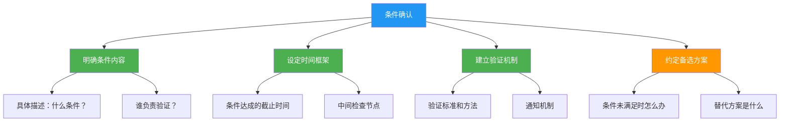
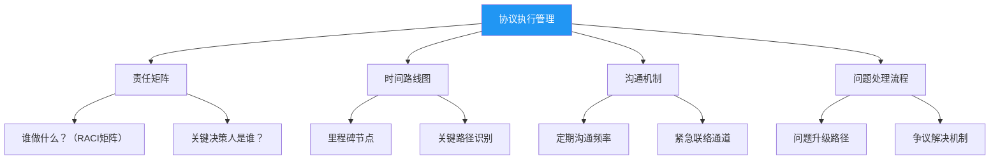
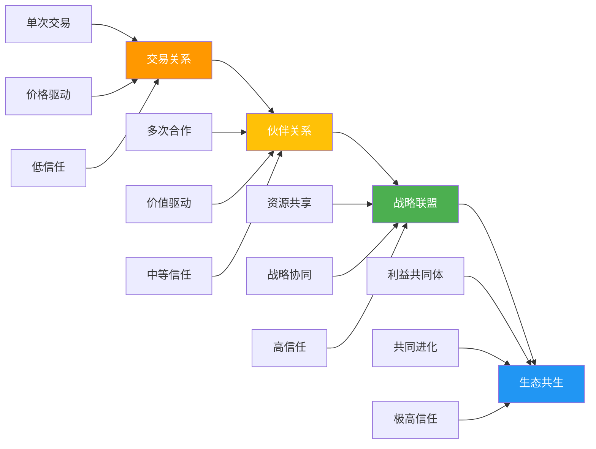

## 第四节 收尾技巧：达成高质量协议

> "谈判中80%的价值产生在最后20%的时间里。"
> —— 切斯特·卡拉斯（Chester Karrass）

谈判收尾是整个谈判过程中最被低估、也最容易出错的阶段。许多谈判者在开局和中场表现出色，却在临门一脚时功亏一篑——要么草率收场留下隐患，要么过度纠结错失达成协议的最佳时机。哈佛大学谈判项目的研究表明，约40%的谈判价值是在收尾阶段被创造或流失的，而谈判者在收尾阶段犯的错误，平均导致最终协议价值降低15%-22%。

本节将系统讲解收尾阶段的三大核心任务：**协议确认**（确保共识准确落地）、**承诺获取**（锁定各方行动意愿）、**关系维护与后续跟进**（为长期合作奠基）。每一项任务都有理论支撑、方法论指导和可操作的工具模板。

---

### 4.1 收尾阶段的心理学基础

在深入技巧之前，理解收尾阶段的心理动态至关重要。这一阶段有三个独特的心理现象在起作用，它们决定了谈判者的行为模式和决策质量。

#### 4.1.1 终点效应（End-of-Negotiation Effect）

认知心理学中的**终点效应**指出，人们对一段体验的评价主要取决于其高峰时刻和结束时刻（丹尼尔·卡尼曼的"峰终定律"）。在谈判中，这意味着：

- **结束时的体验决定了对方对整场谈判的记忆和评价**。即使过程中有不愉快，一个顺利、体面的收尾能大幅提升对方的满意度
- **最后几分钟的印象权重最高**。对方会用收尾时你的态度来"反推"你整场谈判的诚意
- **收尾时的善意比过程中更有力**。一个在收尾时做出的微小让步，其心理影响力是在开局时的两到三倍

#### 4.1.2 承诺升级与沉没成本

谈判进入收尾阶段时，双方都已经投入了大量时间、精力和情感。这种投入会产生**承诺升级**（Escalation of Commitment）倾向——人们不愿"白费"之前的付出，因此更容易接受并非最优的方案。

聪明的谈判者会：
- **利用对方的沉没成本心理**，在收尾时温和提醒双方已经达成的共识："我们已经在六个条款上达成了一致，只差最后两个细节了"
- **警惕自身的沉没成本陷阱**，不因为"已经谈了这么久"而接受一个低于自己底线的协议

#### 4.1.3 紧迫感与时间压力

收尾阶段天然伴随着时间压力。研究表明，时间压力会：

- **降低信息处理的深度**——人们更依赖启发式判断而非系统分析
- **增加让步的可能性**——为了尽快结束，人们倾向于做出更大的让步
- **降低对细节的关注**——容易忽略协议中的关键条款或隐藏陷阱

**应对策略**：在收尾前给自己留出"冷静窗口"。即使对方施压说"今天必须签"，也要争取至少一个内部审核周期。可以说："我们非常想推进这个合作，为了确保执行质量，我需要在明天上午完成内部确认。"这不是拖延，而是对双方负责。

---

### 4.2 协议确认技巧：让共识变成铁板钉钉

协议确认是收尾的基础任务。它不是简单地问一句"你同意吗"，而是一个系统性的校准过程，确保双方对每一项共识的理解完全一致。最常见的"谈判成功后执行失败"案例，根源都在于协议确认阶段的疏漏。

#### 4.2.1 总结确认法——逐条校准，消除歧义

总结确认法是最基本也最可靠的确认方式。它的核心原则是：**你说一遍，对方说一遍，书面记录一遍**——三重确认消除理解偏差。

**标准四步流程**：

| 步骤 | 操作 | 目的 | 注意事项 |
|------|------|------|----------|
| 1. 要点汇总 | 将所有已达成共识的议题逐一列出 | 确保没有遗漏 | 从最重要的议题开始，按优先级排序 |
| 2. 逐条确认 | 对每个要点复述具体内容，获得对方确认 | 消除理解歧义 | 用"我们的共识是……，对吗？"的句式 |
| 3. 模糊点澄清 | 识别并解决任何不明确的表述 | 堵住潜在漏洞 | 重点关注数字、日期、条件、例外情况 |
| 4. 整体确认 | 对全部共识做一次完整复述并获得最终确认 | 锁定完整方案 | 形成完整的"协议全景图" |

**实战话术模板**：

开场："让我们花几分钟时间梳理一下今天的成果，确保我们对每个细节的理解完全一致。"

逐条确认："第一个议题是交付时间。我们的共识是第一批货物在8月15日前发出，
每月分三批完成，到10月底前全部交付。您确认这是我们的理解吗？"

模糊点澄清："关于'合格标准'，我们提到的是ISO 9001认证体系，具体的检测
指标和允许的误差范围，是否需要在书面协议中进一步细化？"

整体确认："好的，那让我完整回顾一下：我们今天在价格（单价38元，年采购量
超过10万件时降至35元）、交付（8月至10月分批）、质量标准（ISO 9001+抽检
合格率98%以上）、付款（月结30天）四个方面达成了共识。请您确认。"

**常见错误与纠正**：

- **错误一：只总结有利自己的要点**。纠正：完整覆盖所有议题，包括对你不利的让步。对方会注意到你的选择性总结，并因此降低信任
- **错误二：用模糊语言概括**。纠正：在关键数字和日期上必须精确。"大概8月"不如"8月15日"，"量大优惠"不如"超过10万件时单价降3元"
- **错误三：自己总结不等对方确认**。纠正：每一条都必须获得对方的明确回应，不能把沉默当作默认

#### 4.2.2 书面确认法——化口头共识为文字契约

口头共识的价值约等于零。人类记忆的不可靠性、利益变动的可能性、人员更替的现实性，都决定了**只有书面化的协议才具有可执行性**。

**适用场景**：

- 涉及金额超过月收入10%的商业谈判
- 有多项条款和条件的复杂协议
- 涉及三个及以上参与方的多方谈判
- 任何需要后续执行和验证的承诺

**书面确认的操作流程**：

第一步：现场起草要点清单
  ├── 使用"协议备忘录"（MOU）或"谈判纪要"格式
  ├── 逐条列出：条款编号 + 具体内容 + 责任方 + 时间节点
  ├── 双方当场审阅，标注需要修改的部分
  └── 签署要点清单作为临时确认

第二步：正式协议起草
  ├── 基于要点清单由法律/专业人员起草正式协议
  ├── 包含：权利义务、违约责任、争议解决、不可抗力
  └── 设定审阅和签署的明确时间节点

第三步：协议签署
  ├── 逐页签字（长协议需要页签+骑缝签）
  ├── 标注签署日期
  ├── 各方留存原件或经认证的副本
  └── 必要时进行公证或备案

**协议备忘录模板示例**：

```markdown
谈判备忘录 — [项目名称]
日期：YYYY年MM月DD日
参与方：甲方[公司名] / 乙方[公司名]

一、已达成共识
1. [条款1]：具体内容、责任方、时间节点
2. [条款2]：具体内容、责任方、时间节点
...

二、待进一步协商
1. [议题]：双方立场概述、下次协商时间
...

三、下一步行动
1. 甲方负责[具体事项]，截止日期[日期]
2. 乙方负责[具体事项]，截止日期[日期]

甲方签字：__________ 乙方签字：__________
```

**线上谈判的书面确认**：当谈判通过视频会议进行时，书面确认更为关键。建议在会议结束后2小时内发出"会议纪要确认邮件"，内容包括：已达成共识的要点、待跟进事项、下一步行动和时间节点、下次会议安排。邮件末尾加上"请在24小时内确认，如有理解偏差请及时回复"。

#### 4.2.3 条件确认法——为不确定性留出空间

并非所有谈判都能当场达成无条件协议。在现实中，许多承诺都附带条件——需要上级审批、需要第三方配合、需要满足特定前提。条件确认法的作用是：**把附条件的承诺变成结构化的、可追踪的行动方案**。

**条件确认的四要素**：



**实战案例**：

场景：你与一家供应商谈判年度采购合同，对方表示"需要总部批准才能给出5%的折扣"。

**错误做法**："好的，那等您总部批准了再说。"——这种模糊承诺等于没有承诺。

**正确做法**：

"理解，这个折扣需要总部审批。为了让双方都能高效推进，我想确认几个细节：

1. 审批流程需要哪些材料？我可以提供我们的年度采购预测报告来支持您的申请
2. 审批通常需要多长时间？我们希望在月底前完成合同签署
3. 如果总部批准的折扣低于5%，比如只给到3%，我们是否可以讨论其他补偿条款，
   比如延长付款周期或增加免费样品？
4. 如果审批未能通过，您手上有什么备选方案能满足我们的合作需求？
5. 我们能否约定下周五之前得到初步反馈？届时我们电话沟通结果"

**条件确认的常见陷阱**：

| 陷阱 | 表现 | 后果 | 纠正 |
|------|------|------|------|
| 开放式等待 | "等你消息" | 无限拖延，协议搁浅 | 必须设明确的反馈时间节点 |
| 单方面风险 | 条件未满足只有我方受损 | 利益不对等 | 约定双方的备选方案 |
| 隐藏条件 | 对方用"需要审批"作为拖延借口 | 被操控 | 要求参与或了解审批流程 |
| 条件模糊 | "满足一定条件后" | 执行时产生争议 | 条件必须可量化、可验证 |

---

### 4.3 承诺获取技巧：从"同意"到"行动"

协议确认解决的是"我们达成了一致"，承诺获取解决的是"对方会真正去做"。哈佛商学院的研究发现，**约35%的谈判协议在执行阶段出现偏差或违约**，其中近一半的原因是承诺本身的"质量"不够——模糊、缺乏约束、没有跟进机制。

#### 4.3.1 承诺的质量层级

承诺不是一个"有或没有"的二元概念，而是一个从弱到强的连续光谱。理解承诺的层级，能帮助你判断当前的承诺水平是否足够，以及需要采取什么措施来升级承诺。

| 层级 | 类型 | 约束力 | 可靠性 | 适用场景 | 示例 |
|------|------|--------|--------|----------|------|
| 1 | 口头意向 | 极低 | 20%-30% | 初步接触、意向摸底 | "我回去跟团队商量一下" |
| 2 | 口头承诺 | 低 | 40%-50% | 日常协商、低风险事项 | "没问题，这个方案我支持" |
| 3 | 书面记录 | 中等 | 60%-70% | 正式谈判、中等风险 | 邮件确认、会议纪要 |
| 4 | 正式协议 | 高 | 80%-90% | 商业合同、重要事项 | 合同签署、协议书 |
| 5 | 行动承诺 | 最高 | 90%+ | 关键条款、高风险 | 付款、交付、公开宣布 |

**关键洞察**：层级越高，承诺的可靠性越强，但获取成本也越高。你需要根据事项的重要性和风险等级，选择合适的承诺层级。对于年采购额100万的合同，口头意向远远不够；而对于下周会议的时间安排，口头承诺通常就够了。

#### 4.3.2 获取高质量承诺的五种方法

**方法一：具体化——把模糊变成精确**

承诺越具体，违约成本越高。"我会尽快处理"是低质量承诺，"我将在本周三下午5点前把方案发到您的邮箱"是高质量承诺。

具体化的四个维度：

- **做什么**：明确具体行动，不是模糊意向
- **谁来做**：指定具体负责人，不是"我们"
- **什么时候**：精确到日期甚至时间，不是"尽快"
- **达到什么标准**：可衡量的交付物，不是"差不多就行"

**实战示例对比**：

低质量承诺：
"我们会尽快把测试报告给你们。"

高质量承诺：
"我们的测试负责人张工将在本周五（7月11日）下午3点前，将包含
性能测试、压力测试和安全测试三个模块的完整报告（PDF格式），
发送到您的邮箱project@client.com，同时抄送给王总。"

**方法二：书面化——让承诺有据可查**

心理学中的**承诺一致性原理**（罗伯特·西奥迪尼《影响力》）表明，人们一旦把承诺写下来，遵守承诺的概率会显著提升。书面化本身就是一个强化承诺的心理机制。

书面化的三个层次：

1. **即时记录**：谈判中当场记录在笔记本或电脑上，让对方看到你在记录
2. **确认邮件**：谈判结束后立即发出确认邮件，抄送所有相关方
3. **正式文件**：对重要承诺形成正式的协议文件，签署盖章

**方法三：公开化——利用社会压力**

当承诺在第三方（同事、领导、合作伙伴）面前做出时，违约的社会成本大幅增加。这就是心理学中的**公开承诺效应**。

操作方式：

- **多人会议**：在有其他参与方的会议上做出承诺
- **抄送领导**：将承诺确认邮件抄送给对方的上级
- **联合公告**：对于重要合作，发布联合新闻稿或内部公告
- **会议记录**：将承诺写入正式会议记录，分发给所有参与方

**方法四：行动化——用即时行动锁定承诺**

最可靠的承诺不是说出来或写出来的，而是做出来的。要求对方立即采取一个小的行动，比任何口头或书面承诺都更有约束力。

立即行动的策略：

谈判中可以要求的即时行动：
├── 当场签署意向书或框架协议
├── 立即安排下一步的具体会议（发送日历邀请）
├── 当场提供所需的资料、数据或样品
├── 通过邮件/即时通讯发送确认信息
├── 现场拨打电话通知相关方（如对方的供应商、合作方）
└── 支付定金或预付款

**方法五：条件化——把承诺与后果挂钩**

当对方承诺的事项对你至关重要时，可以将承诺与具体的后果条款挂钩。这不是威胁，而是建立公平的风险分配机制。

操作方式：

- **奖励条款**："如果在8月底前完成交付，我们将在后续订单中给予优先供应商地位"
- **惩罚条款**："如果延迟交付超过两周，每延迟一天扣除合同金额的0.5%"
- **对赌条款**："如果产品质量合格率达到99%以上，后续合作单价上浮3%"
- **退出条款**："如果三个月内未能达到预期销量，任何一方有权终止合作"

#### 4.3.3 获取承诺的话术体系

不同场景需要不同的话术策略。以下是经过实战验证的四种话术模式：

**模式一：直接请求法——适合双方意向明确时**

"基于我们今天的讨论，我相信这个方案对双方都有价值。
您能否现在确认，我们可以按照这个方案推进？"

使用时机：双方已经充分讨论，分歧基本解决，只剩下"是否点头"的问题。

**模式二：假设成交法——适合对方犹豫时**

"假设我们按照今天讨论的方案执行，您觉得第一批订单
安排在下个月的第一周是否合适？还是第二周更方便？"

原理：不问"要不要做"，而是问"怎么做"——在语言层面把"是否合作"默认为已确定，让对方在两个具体的执行方案之间选择，而不是在"合作"和"不合作"之间选择。

**模式三：条件交换法——适合双方各有所需时**

"如果我们在付款周期上同意从月结30天调整为月结45天，
您能否在价格上给我们3%的额外折扣？"

原理：用一个你可让步的议题去换取对方在另一个议题上的承诺。这不仅获取了承诺，还创造了价值。

**模式四：时间锚定法——适合需要推动决策时**

"我们的预算在本月底需要完成锁定。如果能在本周五之前
得到您的确认，我可以确保下周一就启动采购流程。"

注意：给出的理由必须是真实、合理的。虚假的紧迫感一旦被识破，信任将遭到毁灭性打击。

**模式五：损失规避法——适合对方拖延不决时**

"我理解您需要时间考虑。不过我想坦诚地说，我们目前的
这个优惠方案是基于本月的市场条件设计的，下个月原材料
价格调整后，同样的条件可能就无法提供了。"

原理：行为经济学中的**损失规避**（Loss Aversion）研究表明，人们对"失去"的敏感度是"获得"的两倍。强调不行动可能带来的损失，比强调行动的好处更能推动决策。

---

### 4.4 处理收尾阶段的最后障碍

即使谈判进入尾声，仍然可能出现意想不到的障碍。这些"最后一公里"的问题如果不妥善处理，可能导致前功尽弃。

#### 4.4.1 最后一刻的新要求

**场景**：双方已经基本达成一致，对方突然提出一个新的要求或条件。

**应对策略**：

1. **不要立即反应**。深呼吸，给自己3-5秒的思考时间。本能的拒绝或接受都可能不是最优选择
2. **评估要求的合理性**。这个要求是确实存在的合理需求，还是对方的"最后捞一笔"策略？
3. **区分核心要求和边缘要求**。如果是边缘要求（不影响核心利益），适当满足可以促成协议；如果是核心要求（触及底线），则需要坚守
4. **使用"条件交换"策略**。"我可以考虑在这个方面做出调整，但同时我需要您在另一个方面也做一些配合"

**话术示例**：

"您提的这个点我理解。不过这超出了我们今天讨论的范围，
如果要纳入的话，我需要重新评估整体方案。我们可以有两个
选择：一是先把今天达成的共识落实下来，这个议题作为下一轮
讨论的重点；二是今天一起解决，但整体方案可能需要做相应调整。
您倾向于哪个？"

#### 4.4.2 对方突然沉默或消失

**场景**：谈判进展顺利，但对方在收尾阶段突然不回消息、不接电话、拖延决策。

**可能原因与应对**：

| 可能原因 | 识别信号 | 应对策略 |
|----------|----------|----------|
| 内部决策流程 | "需要请示领导" | 主动了解对方决策链，协助准备内部汇报材料 |
| 在比较其他选项 | 对细节问题不再追问 | 适度施压："我们的时间窗口"，同时提升方案吸引力 |
| 对某个条件不满但未明说 | 回复变慢、语气变冷 | 主动询问："是否有任何顾虑我们可以讨论" |
| 策略性拖延 | 制造时间压力 | 坚守自己的时间节点，不让对方的拖延策略奏效 |

#### 4.4.3 情绪干扰收尾

谈判接近尾声时，积累的紧张和压力可能导致情绪突然爆发。研究表明，收尾阶段的情绪失控比任何其他阶段都更容易导致谈判破裂，因为双方都已经到了耐心的极限。

**情绪管理策略**：

- **识别情绪信号**：当自己或对方开始提高音量、加快语速、频繁使用绝对化词语（"绝对不行""不可能"），说明情绪正在升温
- **主动暂停**："我注意到我们都对这个议题非常投入。不如我们休息10分钟，喝杯咖啡，然后回来继续？"
- **重构问题**：把"你为什么不能接受？"转换为"我们怎样才能找到一个双方都能接受的方案？"
- **分离人与事**："我理解您对这个条款的顾虑，这不是对您个人的挑战，我们一起看看怎么解决"

---

### 4.5 协议执行管理：谈判的延伸战场

签署协议不是谈判的终点，而是合作的起点。一项对300家企业的调查显示，**约60%的商业纠纷源于协议执行阶段的问题**，而非谈判阶段的缺陷。优秀的谈判者在收尾时就会为执行阶段做好准备。

#### 4.5.1 执行管理的四根支柱



**第一根支柱：责任矩阵（RACI）**

在收尾阶段，就应该明确每个执行事项的RACI角色：

- **R（Responsible）负责执行**：具体做事的人
- **A（Accountable）最终负责**：对结果负责的决策者
- **C（Consulted）需要咨询**：执行前需要征求意见的人
- **I（Informed）需要通知**：执行后需要知道结果的人

| 执行事项 | 甲方 R/A | 甲方 C/I | 乙方 R/A | 乙方 C/I | 截止日期 |
|----------|----------|----------|----------|----------|----------|
| 签署正式合同 | 法务部/A | 财务部/I | 法务部/A | 业务部/I | 7月15日 |
| 支付预付款 | 财务部/R | 采购部/I | — | — | 合同签署后5天 |
| 提交设计方案 | — | — | 设计部/R | 项目部/A | 7月25日 |
| 方案评审 | 技术部/R | 产品部/C | — | — | 收到后3天 |

**第二根支柱：时间路线图**

将协议中的所有执行事项编排成一张时间路线图，识别关键路径（哪些事项的延迟会导致整体延迟）。

时间路线图示例：
第1周：合同签署 → 预付款 → 项目启动会
第2-3周：需求确认 → 设计方案
第4周：方案评审 → 修改
第5-8周：开发执行
第9周：测试验收
第10周：终验 → 尾款

**第三根支柱：沟通机制**

在收尾阶段就约定好执行期间的沟通机制，避免日后因为"你没告诉我"而产生纠纷：

- **日常沟通**：指定双方联络人，建立即时通讯群组
- **周报机制**：每周五发送执行进度周报，包含本周完成、下周计划、风险预警
- **月度会议**：每月一次正式回顾会议，评估执行情况，调整计划
- **紧急联络**：约定紧急问题的联络方式和响应时间（如"紧急事项电话联系，2小时内回复"）

**第四根支柱：问题处理流程**

再完美的协议也无法预见所有情况。在收尾阶段就建立问题处理的"预设通道"：

问题升级路径：
Level 1：执行层直接沟通解决（1-2个工作日）
Level 2：双方项目负责人协商（3-5个工作日）
Level 3：高层管理人员介入（5-10个工作日）
Level 4：第三方调解或仲裁

#### 4.5.2 常见执行风险与预防

| 风险类型 | 典型场景 | 预防措施 |
|----------|----------|----------|
| 范围蔓延 | 对方不断提出协议外的额外要求 | 明确定义"范围变更"流程，任何新增需求需重新评估和确认 |
| 质量争议 | 对"合格"的定义不同 | 在协议中附详细的验收标准和检测方法 |
| 时间延迟 | 对方执行不力导致延误 | 设定里程碑节点和延迟预警机制 |
| 人员变动 | 对方换人导致沟通断裂 | 约定人员变更的通知义务和交接流程 |
| 环境变化 | 市场、政策发生重大变化 | 设定"重新谈判"触发条件和机制 |

---

### 4.6 关系维护与长期合作建设

谈判不只是解决眼前的问题，更是建立长期合作网络的机会。斯坦福商学院的研究表明，**与固定合作伙伴的长期谈判关系，相比不断更换合作方，平均能创造高出18%-25%的总价值**——因为信任降低了交易成本，深入了解提升了方案匹配度。

#### 4.6.1 收尾时的关系维护动作

收尾阶段的最后几分钟，是建立长期关系的关键窗口。以下动作成本极低，但回报巨大：

**动作一：真诚感谢**

不是套路化的"谢谢"，而是具体的、有针对性的感谢：

低效感谢："感谢您的时间。"
高效感谢："感谢您在交付时间上做出的灵活调整，这对我们赶上产品
发布窗口非常关键。我也很欣赏您在技术方案上的专业建议，确实比我们
最初设想的方案更优。期待合作。"

**动作二：肯定对方的价值**

在收尾时给予对方正面评价，能为未来的合作奠定情感基础：

- "您今天提出的数据共享方案很有创意，这是我没有想到的角度"
- "跟您谈判非常高效，您的准备工作做得很扎实"

**动作三：明确未来合作的可能性**

在收尾时种下未来合作的种子：

- "这次合作如果顺利，我们很愿意在明年的项目中优先考虑贵方"
- "我注意到贵方在XX领域也有业务，如果后续有相关需求我会第一时间联系您"

#### 4.6.2 长期关系的四层递进



**第一层：交易关系**——以单次交易为基础，关注价格和条款，信任度低，每次合作都需要重新谈判。

**第二层：伙伴关系**——多次合作形成的稳定关系，开始关注整体价值而非单一价格，建立了一定的信任和默契。这个层级的关键里程碑是：双方愿意在没有正式合同的情况下启动小额合作。

**第三层：战略联盟**——在特定领域形成深度合作，共享资源和信息，协同战略目标。例如：联合研发、独家供应、市场联合开拓。

**第四层：生态共生**——双方的业务高度互补，形成了"一荣俱荣"的共生关系。这种关系的核心特征是：面对外部竞争时，双方会本能地站在同一阵线。

#### 4.6.3 关系维护的日常习惯

长期关系不是靠偶尔的大动作维护的，而是靠持续的小习惯：

- **信息共享**：看到对对方有价值的信息（行业报告、政策变化、市场动态），主动转发。成本极低，但体现你在日常关注对方
- **节日问候**：重要节日发送个性化的问候信息，不是群发模板
- **成就祝贺**：关注对方的公司动态（融资、获奖、新产品），及时祝贺
- **问题预警**：如果你在行业内听到可能影响对方的信息，第一时间通报
- **引荐资源**：当你的网络中有对对方有价值的人脉时，主动牵线搭桥

---

### 4.7 跨文化谈判收尾的特殊考量

在全球化背景下，不同文化背景的谈判对手对收尾的理解和期待存在显著差异。忽略这些差异可能导致误解甚至谈判破裂。

#### 4.7.1 主要文化维度的收尾差异

| 文化维度 | 低语境文化（美、德、北欧） | 高语境文化（中、日、韩） |
|----------|--------------------------|--------------------------|
| 协议形式 | 重视详细书面合同 | 重视口头共识和关系基础 |
| 签约速度 | 倾向于快速签约 | 可能需要较长时间确认 |
| 灵活度 | 合同签署后严格执行 | 合同可随情况调整 |
| 关系维护 | 专业关系为主 | 个人关系和专业关系并重 |
| 时间观念 | 严格的时间节点 | 时间更有弹性 |

#### 4.7.2 与不同文化背景谈判者的收尾技巧

**与欧美谈判者收尾**：

- 准备详细的书面协议，逐条确认
- 明确时间节点和违约责任
- 直接表达期望和底线
- 以握手和签名作为正式确认

**与东亚谈判者收尾**：

- 注重前期关系建设，不要急于收尾
- 给对方留出内部沟通和"面子"空间
- 书面协议作为关系的补充而非替代
- 收尾后加强关系维护动作

**与中东/拉美谈判者收尾**：

- 尊重对方的节奏，不要过于急切
- 个人信任比合同条款更重要
- 在正式场合外建立个人联系
- 合同条款可适当留有弹性

---

### 4.8 收尾阶段的常见误区

#### 误区一：急于结束，忽略细节

**表现**：谈判耗时较长，谈判者疲惫，想尽快结束，在没有充分确认的情况下就"签字走人"。

**后果**：协议中存在模糊条款或遗漏，执行阶段产生争议。一项调查显示，因"签约匆忙"导致的商业纠纷占总纠纷量的22%。

**纠正**：收尾前做一次完整的"协议检查清单"：

协议检查清单：
□ 所有议题是否都已讨论并达成共识？
□ 关键数字（价格、数量、日期）是否准确无误？
□ 各方的权利和义务是否明确界定？
□ 违约责任和争议解决机制是否清楚？
□ 是否有未预见的极端情况需要约定？
□ 协议文本是否与口头讨论完全一致？
□ 双方签字人是否有足够的授权？

#### 误区二：过度让步以求"成交"

**表现**：在收尾阶段，为了达成协议而做出过多让步，特别是当谈判已经投入大量时间后，"不想空手而归"的心态驱动下放弃底线。

**后果**：虽然达成协议，但协议价值低于你的BATNA（最佳替代方案），实际上不如不签。

**纠正**：在进入收尾阶段前，回顾自己的BATNA和底线。如果对方的要求突破底线，宁可暂停也不签一个亏损的协议。可以说："我们非常希望达成合作，但目前的条件对我们来说还不够理想。我建议我们各自回去再评估一下，下周重新讨论。"

#### 误区三：忽视"软性"承诺

**表现**：只关注正式合同条款，忽略了对方在谈判中做出的"软性"承诺（如"我们会优先处理""我们会提供额外支持"）。

**后果**：这些口头承诺不会出现在合同中，执行阶段往往无法兑现。

**纠正**：将所有对你有价值的"软性"承诺转化为书面记录。即使是会议纪要中的一个条目，也比口头承诺更有约束力。

#### 误区四：收尾时"加塞"新议题

**表现**：在协议即将达成时，突然提出之前未讨论的新要求或新条件。

**后果**：对方会感到被欺骗和操控，信任关系受到严重损害。哈佛商学院的研究显示，在收尾阶段"加塞"新议题的行为，导致谈判破裂的概率增加40%。

**纠正**：如果确实有遗漏的议题，诚实表达："我发现我们还有一个方面没有讨论到。我建议我们先把已达成共识的部分确定下来，然后用20分钟讨论这个新议题。"

#### 误区五：签署后不跟进

**表现**：合同签完就放一边，直到出了问题才翻出来看。

**后果**：执行偏差无法及时发现和纠正，小问题积累成大纠纷。

**纠正**：在签署后的24小时内，发出"合作启动邮件"，包含：执行时间路线图、各方联络人信息、第一次进度回顾的时间安排。这一个动作就能将执行阶段的问题率降低30%以上。

---

### 4.9 不同谈判场景的收尾策略

#### 4.9.1 薪资谈判收尾

**关键要点**：

- 将口头承诺的薪资、福利、职位、职责全部书面化（offer letter 或录用确认）
- 确认入职日期、试用期安排、汇报关系
- 了解薪资调整机制和评估周期
- 确认非薪资部分（远程工作、培训预算、年假天数等）

**话术示例**：

"非常感谢这个机会，我对这个方案很满意。为了确保我们双方的理解
一致，我想确认一下：基本年薪是XX万，绩效奖金上限为XX万，
每年X月进行薪资评估，入职日期为X月X日，试用期X个月。另外，
远程工作的安排是每周X天，这些都准确吗？请问正式的offer letter
什么时候可以收到？"

#### 4.9.2 采购谈判收尾

**关键要点**：

- 逐条确认：单价、总价、折扣条件、付款方式和周期
- 明确交付条款：交货时间、地点、运输方式、验收标准
- 质量保障：检测标准、不合格品处理、退换货条款
- 售后服务：保修期、响应时间、备件供应

#### 4.9.3 商务合作谈判收尾

**关键要点**：

- 明确合作范围和边界：做什么、不做什么
- 利益分配机制：收入分成、成本分担、知识产权归属
- 退出机制：什么条件下可以终止、终止后的善后安排
- 排他性条款：是否排他、排他范围和期限

#### 4.9.4 劳动争议/纠纷谈判收尾

**关键要点**：

- 明确赔偿/补偿金额和支付方式
- 保密条款和竞业限制（如有）
- 双方的声明和承诺（不得再提起诉讼等）
- 各方签字确认，必要时公证

---

### 4.10 收尾技巧的进阶修炼

#### 4.10.1 "协议架构师"思维

初级谈判者在收尾时关注的是"把谈好的东西写下来"。高级谈判者在收尾时会重新审视整体方案的结构，寻找优化空间——有时候换一种利益分配的方式，能在不改变总价值的情况下大幅提升双方的满意度。

例如：一家公司和员工谈薪资，总预算50万。初级方案是直接给50万年薪。高级方案是：40万基本年薪 + 5万绩效奖金 + 3万培训预算 + 2万远程工作补贴。虽然总价值相同，但后者通过多个分配维度，满足了员工的多层次需求，员工满意度显著更高。

#### 4.10.2 预判对方的收尾策略

了解常见的收尾策略，既能帮助你更好地应对，也能让你在自己使用时更加有效：

| 策略 | 原理 | 识别信号 | 应对方法 |
|------|------|----------|----------|
| 假装走开 | 制造紧迫感和损失感 | "这是最后的机会" | 回归BATNA评估，不被情绪操控 |
| 最后一分钟添加 | 利用沉没成本心理 | "还有一件小事" | 坚持重新评估整体方案 |
| 分而治之 | 对多个决策者施加不同压力 | 分别找不同人谈 | 统一内部口径，指定唯一谈判代表 |
| 红脸白脸 | 一人施压一人示好 | 两个态度截然不同的人 | 识别策略后，与"红脸"直接对话 |
| 时间陷阱 | 利用截止日期施压 | "今天下午5点前必须决定" | 提前设好自己的时间框架 |

#### 4.10.3 收尾后的复盘习惯

每一次谈判收尾后，花15分钟做一次复盘记录：

谈判复盘记录模板：

1. 谈判目标 vs 实际结果
   - 原定目标是什么？
   - 实际达成的协议是什么？
   - 差距在哪里？原因是什么？

2. 收尾过程回顾
   - 哪些确认动作做得好？
   - 哪些细节被遗漏了？
   - 对方的收尾策略是什么？我的应对有效吗？

3. 承诺质量评估
   - 对方的承诺在哪个层级？
   - 是否需要进一步升级承诺？
   - 有哪些承诺没有书面化？

4. 关系维护计划
   - 24小时内需要做什么跟进？
   - 第一周内需要做什么？
   - 长期关系维护计划是什么？

5. 经验教训
   - 这次收尾中最大的收获是什么？
   - 下次遇到类似场景我会怎么改进？

---

### 本节核心要点回顾

1. **收尾决定价值**：谈判中80%的价值在最后20%的时间里被创造或流失，不可轻视收尾阶段
2. **三重确认原则**：你说一遍、对方说一遍、书面记录一遍——确保共识准确无误
3. **承诺有层级**：从口头意向到行动承诺，选择与事项重要性匹配的承诺层级
4. **从承诺到行动**：通过具体化、书面化、公开化、行动化、条件化五种方法提升承诺质量
5. **执行从收尾开始**：在签署协议时就建立责任矩阵、时间路线图、沟通机制和问题处理流程
6. **关系是长期资产**：每一次谈判都是建立长期合作网络的机会，收尾阶段的真诚和专业是最有效的关系投资
7. **文化敏感性**：不同文化背景的谈判者对收尾的理解和期待不同，需要灵活调整策略
8. **复盘是成长的引擎**：每次谈判收尾后的复盘记录，是提升收尾技巧最有效的途径
