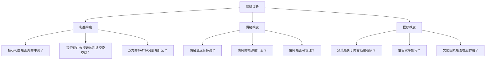

## 第五节 僵局处理：突破谈判困境

谈判僵局不是失败的信号，而是谈判进入深水区的标志。哈佛谈判项目的研究表明，约87%的复杂谈判会在某个阶段遭遇僵局，而其中超过70%的僵局是可以被有效突破的。真正的谈判高手不是那些从不遭遇僵局的人，而是那些能将僵局转化为谈判推进力的人。

本节将系统讲解僵局的本质机理、诊断方法、突破策略、实战技巧和预防机制，帮助你在任何谈判中都能从容应对"谈不下去"的时刻。

### 5.1 僵局的本质与类型

#### 5.1.1 什么是谈判僵局

谈判僵局（Negotiation Deadlock）是指谈判双方在某个或多个议题上无法达成一致，谈判进程停滞不前的状态。它不等于谈判破裂——僵局是暂时的停顿，破裂是永久的终止。两者的根本区别在于：僵局中双方仍有继续谈判的意愿，只是找不到突破口；破裂则是至少一方决定放弃谈判。

理解僵局的本质，需要区分三个层次：

- **表面僵局**：双方在具体条款上无法达成一致，但根本利益并非不可调和
- **深层僵局**：双方的核心利益存在结构性冲突，需要创造性方案才能突破
- **虚假僵局**：一方故意制造僵局以获取谈判优势，实际上存在妥协空间

区分这三种僵局是选择正确突破策略的前提。虚假僵局需要识别对方的策略意图，深层僵局需要利益重构，表面僵局则往往只需要调整谈判方式。

#### 5.1.2 立场性僵局

立场性僵局是最常见的僵局类型，约占所有谈判僵局的45%。它发生在双方各自固守明确的立场（Position），而没有深入探索立场背后的利益（Interest）时。

**典型表现：**

| 信号 | 示例 |
|------|------|
| 反复强调同一要求 | "我们的底价就是150万，低于这个数免谈" |
| 拒绝讨论替代方案 | "没有其他选择，只有这一种方案" |
| 使用绝对化语言 | "这是不可谈判的""我们绝不可能接受" |
| 回避解释原因 | "这不需要理由，就是我们的要求" |

**深层成因分析：**

1. **锚定效应**：先入为主的数字或条件形成了强大的心理锚点，导致双方围绕锚点做微小调整而非根本性思考。行为经济学研究表明，即使锚点是随机产生的，人们也会不自觉地被其影响。

2. **损失厌恶**：人们对损失的敏感度约为获得同等收益的2-2.5倍。在谈判中，这意味着任何让步都会被感知为"损失"，因此双方都不愿率先妥协。

3. **面子与承诺一致性**：一旦公开表明立场，改变立场就会被视为"丢面子"或"自相矛盾"。社会心理学中的承诺一致性原理使人们倾向于坚持已公开声明的立场。

4. **零和思维**：将谈判视为"你赢我输"的竞争，而非合作解决问题的过程。这种思维框架从根本上阻止了创造性方案的产生。

**诊断要点：** 如果双方在表达立场时频繁使用"必须""一定""绝不"等绝对化词汇，且立场之间存在明确的数字或条件差距，大概率是立场性僵局。

#### 5.1.3 利益性僵局

利益性僵局约占谈判僵局的25%，它比立场性僵局更难突破，因为双方的根本需求确实存在冲突。但"根本冲突"并不意味着"不可调和"——大多数利益性僵局的根源在于双方只看到了冲突的利益维度，而忽略了其他可能的利益交换空间。

**典型表现：**

- 双方对核心价值的评估存在根本分歧
- 可分配资源确实有限，无法满足双方核心需求
- 双方的底线存在重叠区域（即没有ZOPA——可达成协议区间）

**深层成因分析：**

1. **资源稀缺性**：当争夺的对象是不可分割或不可替代的资源时（如独家代理权、特定地块），利益冲突最为尖锐。

2. **价值观差异**：双方对"什么是重要的"有根本不同的判断。例如，一方重视长期合作关系，另一方只关注本次交易的利润最大化。

3. **信息不对称**：双方掌握的信息不同，导致对同一事物的价值评估差异巨大。买方可能不了解卖方的成本结构，卖方可能不了解买方的预算上限。

4. **时间偏好差异**：一方急需短期回报，另一方可以等待长期收益。这种差异如果被识别出来，反而可以成为突破的契机。

**关键认知：** 即使在利益性僵局中，也几乎总存在未被发现的利益交换空间。谈判学者Howard Raiffa的研究表明，多议题谈判中存在帕累托改进空间的概率超过90%。

#### 5.1.4 情绪性僵局

情绪性僵局约占谈判僵局的20%，它的破坏力最大，因为它直接攻击谈判的沟通基础。一旦情绪失控，理性讨论就无法继续，双方从"解决问题"模式切换为"攻击对方"模式。

**典型表现：**

| 阶段 | 行为信号 | 语言信号 |
|------|----------|----------|
| 初始 | 频繁打断对方、翻白眼、双臂交叉 | "你这是什么意思？""你到底想怎样？" |
| 升级 | 提高音量、拍桌子、离席 | "你这是不尊重我们""太荒谬了" |
| 失控 | 摔门、人身攻击、威胁退出 | 人身侮辱、威胁性语言 |

**深层成因分析：**

1. **感知不公**：当一方觉得自己被不公平对待时（被欺骗、被忽视、被轻视），愤怒情绪会迅速升温。公平感是人类最基本的心理需求之一。

2. **累积效应**：谈判中持续的小摩擦和分歧会逐渐累积，最终在某个触发点爆发。这就像气球慢慢充气，最终在一个看似微不足道的点上爆裂。

3. **身份威胁**：当谈判触及一方的身份认同（如"你的方案意味着我们的前期工作都白做了"），防御性反应会迅速升级为攻击性行为。

4. **压力传导**：谈判代表可能承受来自上级、股东或家人的压力，这些压力在谈判桌上以不恰当的方式释放。

**关键认知：** 情绪性僵局中的"情绪"往往不是真正的问题，而是更深层利益诉求的表达方式。愤怒背后可能是恐惧（害怕损失），冷漠背后可能是失望（期望落空），攻击背后可能是无助（感到没有其他选择）。

#### 5.1.5 程序性僵局

程序性僵局约占谈判僵局的10%，看似最"无害"，但如果处理不当，会演变为信任危机。它发生在双方对"怎么谈"产生分歧时，本质上反映的是权力关系和信任程度的问题。

**典型表现：**

- 对谈判议程和顺序有不同意见
- 对谁应该参与谈判有争议
- 对决策流程和时间表有分歧
- 对信息披露的程度和方式有不同期望

**深层成因分析：**

1. **文化差异**：不同文化背景的谈判者对谈判过程有截然不同的期望。高语境文化（如中国、日本）注重关系建立和间接沟通，低语境文化（如美国、德国）注重效率和直接表达。当两种文化碰撞时，程序性僵局尤为常见。

2. **权力博弈**：对程序的争议往往是对权力的争夺。谁设定议程、谁先出价、谁决定时间表，这些看似程序性的问题实际上都在定义"谁占主导地位"。

3. **信任缺失**：当双方缺乏信任时，对程序的每一个细节都会产生怀疑——"他们为什么要改变议程？""他们是不是想拖延时间？"

### 5.2 僵局诊断框架

在选择突破策略之前，必须先准确诊断僵局的类型和成因。错误的诊断会导致错误的策略选择，甚至使僵局恶化。

#### 5.2.1 三维诊断模型

用以下三个维度对僵局进行诊断，每个维度用1-5分进行评估：

**诊断流程：**

1. **分离立场与利益**：列出双方的所有立场，然后追问每个立场背后的利益。用"为什么你需要这个？"来穿透立场，发现真正的利益。
2. **评估情绪温度**：观察非语言信号（语速、音量、身体姿态），评估当前情绪状态。情绪温度高于3分时，应优先处理情绪问题。
3. **检验程序假设**：确认双方对谈判程序的理解是否一致。很多程序性僵局源于"我以为你知道""我以为你会同意"的假设偏差。

#### 5.2.2 僵局类型快速判断表

| 判断标准 | 立场性 | 利益性 | 情绪性 | 程序性 |
|----------|--------|--------|--------|--------|
| 核心冲突点 | 具体条件 | 底层需求 | 关系/尊重 | 流程/规则 |
| 对方语言特征 | "必须/绝不" | "这对我们很重要" | "你们太过分了" | "我们应该先..." |
| 情绪强度 | 低-中 | 中 | 高 | 低-中 |
| 是否存在ZOPA | 是 | 可能没有 | 是 | 是 |
| 推荐首要策略 | 利益探索 | 创造性方案 | 情绪降温 | 程序协商 |
| 突破难度 | ★★☆ | ★★★★ | ★★★ | ★★☆ |

#### 5.2.3 BATNA分析——判断僵局的真实压力

理解僵局的真实压力，需要评估双方的BATNA（Best Alternative to Negotiated Agreement，最佳替代方案）。BATNA决定了你"不达成协议"的成本，也决定了你在僵局中的承受能力。

**BATNA评估清单：**

1. 如果谈判失败，你的替代方案是什么？
2. 替代方案的可行性有多高？（1-10分）
3. 替代方案的满意度有多高？（与当前谈判可能的结果相比）
4. 实施替代方案的时间成本和经济成本是多少？
5. 对方的BATNA可能是什么？

**BATNA与僵局策略的关系：**

- **你的BATNA强 + 对方BATNA弱**：你有时间等待，可以适当施压，但不要过度——逼迫对方接受不合理条件会损害长期关系
- **你的BATNA弱 + 对方BATNA强**：你需要更积极地创造价值、寻找创新方案，而不是在现有选项上硬撑
- **双方BATNA都强**：僵局的代价对双方都不高，因此突破需要更大的价值创造
- **双方BATNA都弱**：这是最有利的突破时机——双方都有强烈的达成协议的动力

### 5.3 突破僵局的核心策略

#### 5.3.1 暂停策略——给谈判按下"重启键"

暂停不是"认输"或"拖延"，而是一种主动的策略选择。神经科学研究表明，人在情绪激动时，前额叶皮层（负责理性思考）的活动会受到抑制，而杏仁核（负责情绪反应）的活动会增强。暂停的作用就是让杏仁核冷静下来，恢复前额叶皮层的正常功能。

**适用情境：**

- 双方情绪明显升温，理性讨论变得困难
- 需要时间消化新的信息或提议
- 需要与内部团队或决策者协商
- 谈判进入关键阶段，需要重新评估策略
- 发现了新的信息，需要重新计算方案

**操作方法——四级暂停法：**

| 暂停级别 | 时长 | 适用场景 | 操作方式 |
|----------|------|----------|----------|
| 微暂停 | 5-10分钟 | 轻微情绪波动，需要整理思路 | "让我们喝杯咖啡，5分钟后继续" |
| 短暂停 | 30分钟-2小时 | 中度僵局，需要内部讨论 | "今天先到这里，明天上午10点继续" |
| 中暂停 | 1-3天 | 深度僵局，需要重大调整 | "我们需要时间研究新方案，下周再安排" |
| 长暂停 | 1-2周 | 结构性僵局，需要根本性改变 | "我们各自回去评估一下，两周后再碰面" |

**暂停期间的关键动作：**

1. **回顾与反思**：梳理谈判进展，识别僵局的真正原因。不要只看表面分歧，要追问"为什么对方坚持这一点？"
2. **方案创新**：利用暂停时间开发新的方案和选项。邀请团队中的"局外人"参与头脑风暴——他们往往能看到谈判桌上的人看不到的可能性。
3. **非正式接触**：通过非正式渠道（午餐、电话、中间人）了解对方的真实关切。在非正式场合，人们往往会透露在正式谈判中不会说的信息。
4. **内部对齐**：确保自己团队内部对策略和底线的理解一致。团队内部的分歧如果被对方察觉，会被利用来施加压力。

**话术示例：**

> "我注意到我们的讨论变得有些紧张，这说明我们都在认真对待这个问题。我建议我们休息一下，整理一下思路，下午两点再继续。我相信短暂的暂停能帮助我们找到更好的解决方案。"

> "今天讨论的议题很复杂，我需要和我的团队商量一下。我们可以明天上午继续吗？这样我能给你一个更经过深思熟虑的回应。"

#### 5.3.2 换人策略——用新面孔打破僵局

换人策略的本质是引入"新鲜视角"和"关系重置"。当谈判代表之间形成了负面情绪循环或信任破裂时，更换人员可以切断这种循环，为谈判注入新的可能性。

**适用情境：**

- 谈判代表之间发生了人际冲突或信任危机
- 现有团队无法提供新的思路或方案
- 需要提升或降低谈判的层级
- 涉及技术问题需要专业人员介入
- 对方对某位代表有强烈的负面情绪

**换人的四种方式：**

1. **引入新面孔**：增加一位之前未参与的谈判人员。新人的加入会改变团队动态，带来新的思维方式，也给双方一个"重新开始"的机会。

2. **提升层级**：邀请更高层级的决策者介入。高层领导的参与传递了"我们重视这个谈判"的信号，也往往意味着更大的决策权限和更灵活的谈判空间。

3. **引入专家**：在涉及专业问题时，引入技术专家、财务顾问或行业分析师。专家的参与可以提供客观的数据支持，将"我觉得"转变为"数据表明"。

4. **更换角色**：保持团队成员不变，但调整角色分工。让之前主导谈判的人退居支持角色，让之前沉默的成员主导讨论。

**操作注意事项：**

- 不要在对方看来像是"逃跑"或"推卸责任"。换人的理由应该是"为了更好地推进谈判"，而不是"因为我们谈不下去了"
- 新加入的人员需要充分了解之前的谈判背景和已达成的共识
- 换人后不要否定之前的讨论成果，要在此基础上推进
- 与对方事先沟通换人的安排，给予对方准备时间

#### 5.3.3 换题策略——改变谈判的焦点

当在某个议题上陷入僵局时，暂时搁置该议题，转向其他议题的讨论。这种策略利用了"部分协议"（Partial Agreement）的力量——在其他议题上取得进展可以增强双方的合作信心，也为僵局议题的解决创造了新的筹码。

**适用情境：**

- 在单一议题上反复讨论但无进展
- 谈判涉及多个议题
- 某个议题需要更多信息才能做出决定
- 双方在其他议题上更容易达成共识

**操作方法——议题置换矩阵：**

将所有谈判议题按照"双方分歧程度"和"对双方的重要程度"进行分类：

| | 对我方重要 | 对我方不重要 |
|---|---|---|
| **对对方重要** | 核心议题（需创造性方案） | 让步议题（可换取对方让步） |
| **对对方不重要** | 筹码议题（可要求对方让步） | 低优先级议题（先达成共识） |

**换题的顺序建议：**

1. 先解决双方分歧小、重要性低的议题，建立合作信心
2. 再处理对我方不重要但对对方重要的议题（主动让步，换取对方在核心议题上的灵活性）
3. 然后处理对我方重要但对对方不重要的议题（要求对方让步）
4. 最后回到核心议题——此时双方已经建立了合作惯性，且有了更多的让步筹码

**话术示例：**

> "我注意到我们在价格问题上还需要更多思考。不如我们先讨论一下交付时间表和售后服务方案，这些议题可能更容易达成共识。等我们在这些问题上取得进展后，再回来看价格问题，也许会有新的思路。"

#### 5.3.4 换法策略——改变谈判的方式和形式

当谈判的"内容"没有问题，但"方式"出了问题时，换法策略是最有效的选择。不同的谈判形式适合不同的场景，没有一种方式是万能的。

**六种换法方式：**

1. **从集体讨论到双边会谈**：当多人参与的会议陷入混乱或面子问题时，改为一对一私下交流。私下场合中，双方可以更坦诚地表达真实关切，不用担心在对方面前"丢面子"。

2. **从面对面到书面沟通**：当情绪干扰理性时，改为书面提案和回应。书面沟通强制双方放慢节奏，更理性地组织论点，也避免了面对面交流中的情绪对抗。

3. **从对抗式到合作式**：改变谈判桌的物理布局（从对面而坐到并排而坐），改变语言框架（从"你们的要求"到"我们共同面对的问题"），引入合作性工具（如共同的问题分析白板）。

4. **引入可视化工具**：将抽象的数字和条件转化为图表、模型或原型。可视化可以帮助双方更直观地理解方案的影响，减少因理解偏差导致的僵局。

5. **改变谈判环境**：从正式的会议室转移到非正式的场所（餐厅、咖啡厅、户外）。环境的改变会影响人们的心理状态和行为模式。

6. **引入结构化流程**：当讨论失去方向时，引入结构化的谈判框架（如"利益-选项-标准"三步法），确保讨论的每一步都有明确的目标和产出。

### 5.4 创造性突破技巧

当常规策略无法打破僵局时，需要运用创造性思维，从根本上改变谈判的格局。

#### 5.4.1 利益重构——重新定义问题

利益重构的核心思想是：当双方在某个维度上无法达成一致时，引入新的维度来重新定义问题。这就像从二维平面思考升级到三维立体思考——在二维平面上看起来不可调和的冲突，在三维空间中可能完全不存在。

**四种利益重构方法：**

**方法一：从价格到总价值**

价格是最常见的谈判僵局点。将"价格"重构为"总价值"或"总拥有成本"（TCO），可以开辟新的讨论空间。

示例场景——软件采购价格僵局：

| 维度 | 买方原视角 | 重构后的视角 |
|------|------------|--------------|
| 软件价格 | "200万太贵了" | 软件只是TCO的一部分 |
| 实施成本 | 未考虑 | 包含在方案中 |
| 培训费用 | 未考虑 | 供应商承担 |
| 年维护费 | 未考虑 | 锁定3年费率 |
| 效率提升 | 未量化 | 预估年节省80万 |
| 5年TCO | 200万 | 350万，但收益600万+ |

**方法二：从数量到结构**

当双方在数量上无法达成一致时，改变数量的结构或定义。

示例场景——采购量僵局：

- 原僵局："我们必须采购10万件，低于10万件不谈"
- 重构方案："我们可以承诺10万件的总量，但分4个季度交付，每季度2.5万件。同时保留20%的弹性调整空间。"

**方法三：从当前到时间维度**

将静态的条件转化为动态的时间安排。

示例场景——付款条件僵局：

- 原僵局："我们要求预付50%，你们最多接受预付20%"
- 重构方案："预付30%，验收后付40%，运行稳定6个月后付剩余30%。如果提前验收，给予额外2%的折扣。"

**方法四：从双边到多边**

当双方的资源无法满足彼此需求时，引入第三方来扩大"蛋糕"。

示例场景——技术授权费僵局：

- 原僵局：授权方要求10%的分成，被授权方只能接受5%
- 重构方案：引入投资方，三方合作开发市场。授权方以技术入股占30%，被授权方以运营能力占40%，投资方以资金占30%。

#### 5.4.2 选项扩展——创造更多可能性

选项扩展的理论基础来自"单一文本法"（Single Text Method）——与其在多个对立方案中选择，不如创造一个全新的综合方案。但在此之前，需要先有足够多的原始选项作为素材。

**头脑风暴四原则：**

1. **不评判**：在产生阶段，不对任何想法进行评价。"这个不行"会杀死创造力。
2. **求数量**：数量带来质量。至少产生10个以上的备选方案。
3. **欢迎疯狂想法**：极端的想法往往能启发真正可行的创新方案。
4. **组合与改进**：在他人想法的基础上发展，而不是批评。

**选项扩展的五种技术：**

1. **分割法**：将一个大议题分割成多个小议题，每个小议题独立协商。例如，将"合同总金额"分割为"基础费用+绩效奖金+里程碑付款"。

2. **组合法**：将多个相关议题打包，创造"一揽子方案"。打包后，议题之间可以互相补偿，整体满意度可能高于单独协商每个议题。

3. **变量化法**：将固定条件转化为可变条件。例如，将"固定价格100万"转化为"基础价格80万+绩效浮动±20万"。

4. **交叉法**：利用双方对不同议题的不同偏好进行交叉让步。例如，在价格上让步换取更长的合同期，在交付时间上让步换取更好的付款条件。

5. **外延法**：引入谈判范围之外的新资源或新议题。例如，在设备采购中加入"供应商提供免费培训""供应商参与联合研发"等额外价值。

#### 5.4.3 客观标准引入——用事实打破主观分歧

当双方在主观判断上无法达成一致时，引入客观标准可以将"我觉得"转变为"事实表明"。这是哈佛谈判法的核心原则之一——基于原则的谈判（Principled Negotiation）。

**可引用的客观标准类型：**

| 标准类型 | 示例 | 适用场景 |
|----------|------|----------|
| 市场数据 | 行业报告、市场价格指数、可比交易数据 | 价格谈判 |
| 法律法规 | 合同法、行业监管规定、国际公约 | 条款谈判 |
| 行业惯例 | 行业标准合同、通行做法、最佳实践 | 程序谈判 |
| 专家意见 | 独立第三方评估、行业专家建议 | 价值评估 |
| 历史先例 | 双方或行业内类似交易的先例 | 条件设定 |
| 科学数据 | 测试报告、实验数据、技术验证 | 质量/性能谈判 |

**引入客观标准的话术框架：**

> "我理解我们在这个问题上有不同的看法。也许我们可以参考一下行业内的通行做法。根据[具体来源]的数据，[具体的客观标准]。我们可以以这个为基础来讨论吗？"

**注意事项：**

- 客观标准必须是双方都能接受的。不要试图强加只对自己有利的"标准"
- 提前准备好多个客观标准，以防对方不接受某一个
- 客观标准是参考而非判决，最终仍需双方协商
- 对方可能质疑标准的相关性或可靠性，要准备好解释和辩护

#### 5.4.4 假设性方案测试——低风险的探索方式

当双方都不敢提出具体方案时，可以用"假设性"语言来测试对方的反应，而不必承担承诺的风险。

**话术模式：**

> "假设我们能够在[对方关心的点]上做出调整，你们是否愿意在[我方关心的点]上考虑一些灵活性？"

> "如果我们能找到一种方案，既满足你们的核心需求，又能让我们接受，你们愿意探索一下吗？"

> "让我假设性地提一个方案，看看你的反应。如果我们在价格上接受[数字X]，但将付款条件调整为[条件Y]，这个方向是否值得进一步讨论？"

这种"假设性"框架给了双方安全的退出空间——如果对方反应不好，你可以说"这只是一个假设性的问题"，而不会显得你在正式让步。

### 5.5 第三方介入策略

当双方自身的努力无法突破僵局时，引入第三方是一种成熟且有效的选择。第三方介入不是"认输"，而是"用更聪明的方式解决问题"。

#### 5.5.1 调解（Mediation）

调解是最灵活的第三方介入方式。调解人不做出决定，而是帮助双方更好地沟通、理解彼此的需求，并找到双方都能接受的解决方案。

**调解的核心价值：**

1. **恢复沟通**：调解人作为"翻译者"，帮助双方理解对方的真实意图，减少误解
2. **情绪管理**：调解人可以介入情绪升级的时刻，帮助双方冷静下来
3. **打破思维定势**：调解人可以提出双方未曾想到的方案，拓宽思维空间
4. **保全面子**：双方可以将"让步"归因于调解人的建议，而非自己的"软弱"

**调解的适用条件：**

- 双方仍愿意继续沟通
- 双方都认可调解人的中立性
- 谈判涉及复杂的情感因素
- 双方需要维护长期关系

**选择调解人的标准：**

- 行业经验和专业知识
- 调解技能和经验
- 双方的信任和尊重
- 真正的中立性（与双方都没有利益关系）
- 文化敏感性（跨文化谈判中尤其重要）

#### 5.5.2 仲裁（Arbitration）

仲裁比调解更"硬核"——仲裁人听取双方意见后，做出具有约束力的裁决。仲裁适用于双方确实无法自行达成协议，但又不想走诉讼程序的情况。

**仲裁的类型：**

| 类型 | 约束力 | 适用场景 |
|------|--------|----------|
| 约束性仲裁 | 裁决必须执行 | 双方同意由第三方做出最终决定 |
| 非约束性仲裁 | 裁决仅为建议 | 双方希望获得专业意见但保留决定权 |
| 最后出价仲裁 | 选择一方的最终出价 | 双方都不愿做出更多让步 |
| 高低仲裁 | 裁决被限制在双方设定的范围内 | 需要控制裁决的风险范围 |

**最后出价仲裁（Final Offer Arbitration）的特别说明：**

这种仲裁方式要求双方各自提出最终方案，仲裁人只能选择其中一个，不能做出折中裁决。这种机制的妙处在于：它迫使双方都提出更合理的方案——因为如果你的方案太极端，仲裁人会选择对方的方案。因此，最后出价仲裁往往在裁决之前就促使双方自行达成协议。

#### 5.5.3 专家评估

专家评估适用于涉及专业判断的僵局——如技术性能、资产价值、损失评估等领域。

**操作流程：**

1. 双方共同选定或各自推荐专家
2. 明确评估的范围、标准和方法
3. 专家独立进行评估
4. 专家提交评估报告
5. 双方基于评估结果进行后续谈判

**关键注意事项：**

- 评估标准和方法必须事先达成一致
- 专家的资质和独立性必须经得起审查
- 评估结果应该作为参考而非最终判决
- 双方应该保留在评估结果基础上继续协商的权利

### 5.6 高级突破技术

#### 5.6.1 "红线"技术——画定底线的智慧

当你需要在某个问题上坚守底线时，与其说"我们绝不可能接受"（这会引发对抗），不如清楚地画出你的"红线"，并解释红线的原因。

**话术框架：**

> "我需要坦诚地告诉你，在[具体问题]上，我们有一条不可逾越的线。这条线的根源是[根本原因]。我希望你能理解这对我们的重要性。在这个前提下，我非常愿意在[其他问题]上寻找创造性的解决方案。"

这种表达方式的优势在于：
- 清楚地传达了你的底线，避免对方继续试探
- 解释了底线的原因，让对方理解这不是"任性"
- 主动打开了其他议题的谈判空间
- 保持了合作的态度

#### 5.6.2 "可变菜单"技术——用结构化的选择破解僵局

当对方拒绝你的单一方案时，提供一个结构化的"菜单"，让对方在多个选项中选择。这利用了"选择效应"——人们在有选择时更容易做出决定。

**示例——供应商付款条件菜单：**

> "关于付款条件，我们准备了三个方案供你选择：
>
> **方案A（标准方案）**：签订合同时支付30%，交付验收后支付60%，质保期满后支付10%
>
> **方案B（优惠方案）**：签订合同时支付50%，交付验收后支付50%——总金额给予3%的折扣
>
> **方案C（长期方案）**：按季度付款，分8个季度付清——合同期延长至3年，包含免费维护升级"

菜单的优势在于：
- 对方感觉拥有选择权和控制感
- 每个选项都对你可接受
- 对方的选择揭示了他们的真实偏好

#### 5.6.3 "打包与拆包"技术

**打包**（Logrolling）：将多个议题捆绑在一起协商。当一方在议题A上让步、另一方在议题B上让步时，双方都能在自己更关心的议题上获得更好的结果。

**拆包**（Unbundling）：当整体方案被拒绝时，将其拆解为独立的组成部分，逐个讨论。这可以帮助识别真正的障碍点在哪里。

**操作原则：**
- 打包时，将你不太在意的议题与你很在意的议题捆绑，换取对方在你在意的议题上的让步
- 拆包时，先拆解出双方都认为容易解决的部分，再集中精力讨论困难的部分
- 不要一次打包太多议题——议题越多，评估越困难，越容易产生新的分歧

#### 5.6.4 "后门协议"技术

当正式谈判渠道无法推进时，通过非正式渠道达成局部共识，再将共识"移植"到正式谈判中。

**操作步骤：**

1. 在正式谈判间隙，与对方的关键人员进行一对一私下交流
2. 在私下场合中，坦诚地探讨双方的真实关切和可能的妥协空间
3. 达成初步共识后，由双方各自在内部"推销"这个方案
4. 在正式谈判中提出经过内部协商的方案，争取正式确认

**注意事项：**
- 私下交流不等于"背后交易"——目的是促进沟通，不是绕过程序
- 私下达成的共识在正式确认前不具有约束力
- 确保私下交流的内容不被误传或曲解

### 5.7 僵局预防机制

最好的僵局处理是预防——在僵局形成之前就消除其产生的条件。

#### 5.7.1 前期预防——打好谈判的基础

**1. 充分的背景调研**

在进入谈判之前，尽可能多地收集信息：

- 对方的组织结构和决策流程
- 对方的核心利益和优先级
- 对方的BATNA和可能的底线
- 对方谈判代表的风格和偏好
- 行业背景和市场环境
- 历史上的类似谈判案例

**2. 关系建立**

在正式谈判开始之前，投入时间和精力建立人际关系。研究表明，在非正式场合建立的个人关系可以显著降低谈判中的对抗性。可以采取的方式包括：共同参加行业活动、共进晚餐、参观对方的设施等。

**3. 期望管理**

在谈判开始前，通过适当的信号管理对方的期望。如果对方期望过低，可能会产生不必要的僵局；如果对方期望过高，谈判结果可能会让对方失望。通过前期沟通、信息透露和适当的"吹风"，将双方的期望引导到合理的区间。

**4. 程序约定**

在谈判开始前，就以下程序性问题达成一致：
- 谈判的议程和顺序
- 参与人员和各自的权限
- 信息共享的规则和范围
- 时间安排和里程碑
- 僵局出现时的处理机制（如"如果我们在某议题上讨论超过1小时仍无进展，暂停该议题，转向下一个"）

#### 5.7.2 过程预防——在谈判中保持健康状态

**1. 定期总结与确认**

每隔一段时间（或每讨论完一个议题），暂停讨论，总结已达成的共识。这有三个作用：防止共识被推翻、增强双方的合作信心、及时发现误解。

> "让我总结一下我们目前达成的共识：第一，...；第二，...；第三，...。我理解得对吗？"

**2. 情绪监控**

时刻关注双方的情绪状态。当发现情绪升温的信号时（语速加快、音量提高、开始打断对方），主动介入降温：

> "我能感受到我们都对这个问题很投入，这说明这个问题对我们都很重要。让我们暂停一下，喝杯水，然后再继续。"

**3. 建立"停车场"**

对于暂时无法解决或讨论中突然出现的新议题，建立一个"停车场"（Parking Lot）——记录下来，约定稍后讨论。这避免了讨论偏离主线，也确保了每个议题都能被妥善处理。

**4. 维护建设性氛围**

- 使用"我们"而非"你vs我"的语言框架
- 肯定对方的合理观点，即使你不同意结论
- 避免使用"但是"来否定对方——用"同时"来补充
- 在提出反对意见前，先总结对方的论点（证明你理解了）

#### 5.7.3 结构预防——用机制保障谈判进程

**1. 议题分解**

将复杂的谈判议题分解为更小、更易管理的子议题。每个子议题独立讨论并达成共识，最终汇总为整体协议。这比试图一次性解决一个巨大问题要有效得多。

**2. 利益优先级排序**

在谈判开始时，要求双方（或自己内部）对所有议题进行优先级排序。这有助于识别哪些议题是"必须争取的"，哪些是"可以妥协的"，为后续的让步和交换提供依据。

**3. 备选方案准备**

为每个关键议题准备至少3个备选方案。当首选方案被拒绝时，立即提出替代方案，避免谈判因"没有其他选择"而陷入僵局。

**4. 退出机制约定**

在谈判开始前就约定"如果谈判破裂怎么办"——包括信息保密、已披露信息的处理、未来重新谈判的可能性等。这种约定可以降低僵局的风险，因为双方都知道即使谈判失败，也有明确的处理方式。

### 5.8 常见误区与纠正

#### 误区一：僵局等于谈判失败

**错误认知：** "出现僵局说明我们的谈判策略有问题，应该尽快达成协议。"

**正确认知：** 僵局是谈判的正常组成部分，它往往意味着谈判进入了实质性阶段。急于打破僵局可能导致过早妥协，接受对自己不利的条件。正确的做法是保持冷静，分析僵局原因，选择合适的突破策略。

#### 误区二：施压是打破僵局的最佳方式

**错误认知：** "对方不让步，我们就加大压力，逼他们就范。"

**正确认知：** 施压可能在短期内迫使对方做出让步，但会严重损害双方关系，导致对方在其他问题上报复性地强硬。更严重的是，过度施压可能导致对方的BATNA变得更差——如果他们实在无法接受你的条件，他们会选择退出谈判，而这对你也不利。

#### 误区三：沉默就是拒绝

**错误认知：** "对方不说话了，说明他们不同意，我们应该主动让步。"

**正确认知：** 对方的沉默可能有多种含义：他们在思考、他们在等待你先让步、他们在内部讨论、他们在用沉默施压。不要因为对方的沉默就急于降低自己的条件。可以主动询问："我注意到您在思考，您对这个方案有什么看法？"

#### 误区四：所有僵局都可以打破

**错误认知：** "只要方法得当，任何僵局都能突破。"

**正确认知：** 确实存在无法打破的僵局——当双方的BATNA都优于谈判可能的结果时，达成协议反而是不理性的选择。识别这种局面并果断退出，比在死胡同里继续浪费时间和资源更为明智。退出不等于失败，而是一种理性的决策。

#### 误区五：换人就是认输

**错误认知：** "换人会让对方觉得我们不行了。"

**正确认知：** 换人是一种成熟的策略选择，关键在于如何呈现。如果换人的理由是"引入更适合的专业人士"或"提升谈判层级以加速决策"，对方通常会将其视为积极信号，而非软弱表现。

### 5.9 实战案例分析

#### 案例一：技术授权谈判中的利益性僵局

**背景：** A公司（技术方）与B公司（应用方）就某项AI技术的授权使用进行谈判。A公司要求15%的收入分成，B公司最多能接受8%。双方在这一核心条款上僵持了两周。

**僵局诊断：** 表面上是利益性僵局（核心利益冲突），但深入分析发现，双方的根本关切不同——A公司担心技术被低估和滥用，B公司担心过高的分成侵蚀利润、影响市场竞争力。

**突破策略——利益重构+选项扩展：**

谈判团队引入了以下创新方案：
1. 采用阶梯式分成：年收入500万以下8%，500万-2000万12%，2000万以上15%。这保护了B公司的早期利润空间，也让A公司在技术成功时获得更高的回报。
2. A公司以技术入股B公司的新业务线，持有10%的股份。这让A公司分享长期增长的收益，而非只关注短期分成。
3. 设定技术使用的"独占期"为2年，之后A公司可以授权其他企业使用。这让B公司在早期获得竞争优势，也让A公司的技术获得更广的市场覆盖。

**结果：** 双方在3天内达成协议。两年后，B公司的新业务线年收入突破5000万，A公司的综合回报率超过了最初要求的15%分成。

#### 案例二：跨文化采购谈判中的程序性僵局

**背景：** 中国某制造企业与德国供应商进行设备采购谈判。中方习惯先建立关系、逐步推进；德方要求首先确认技术规格和合同条款。双方对谈判的"正确方式"产生了严重分歧，导致前两次谈判几乎没有实质性进展。

**僵局诊断：** 典型的程序性僵局，根源是文化差异和信任不足。中方认为德方"太生硬，只关心合同"；德方认为中方"效率太低，不认真对待技术问题"。

**突破策略——换法+程序协商：**

1. 中方邀请德方代表参观工厂，了解生产环境和实际需求（改变谈判环境）
2. 双方同意采用"双轨制"：上午进行技术讨论（德方主导），下午进行商务和关系建设（中方主导）
3. 引入一位熟悉中德双方文化的第三方顾问，帮助翻译"言外之意"
4. 设定明确的议程和时间表，满足德方对效率的需求；同时保留非正式交流的时间，满足中方对关系的需求

**结果：** 在新的谈判框架下，双方在第三次谈判中就完成了技术规格确认和主要商务条款的协商，并建立起了良好的工作关系。

#### 案例三：并购谈判中的情绪性僵局

**背景：** X公司拟收购Y公司。在谈判过程中，Y公司创始人感到自己的公司被"低估"，在一次谈判中突然情绪激动，公开质疑X公司的诚意，一度威胁终止谈判。

**僵局诊断：** 情绪性僵局，根源是Y公司创始人的身份认同受到威胁——他一手创立的公司即将"被别人拥有"，收购价格的讨论让他感觉自己的毕生心血被贬低。

**突破策略——暂停+利益重构：**

1. X公司CEO亲自打电话给Y公司创始人，表达了对其创业成就的真诚敬佩，提议暂停正式谈判，改为非正式会面
2. 在非正式会面中，X公司CEO坦诚地分享了自己创业时的经历和感受，建立了情感连接
3. X公司修改了收购方案：保留Y公司创始人作为"联合创始人"的头衔，邀请其加入X公司董事会，并设立以Y公司创始人名字命名的创新基金
4. 在估值方面，引入了业绩对赌条款——如果Y公司在收购后3年内达到约定业绩目标，X公司将追加支付

**结果：** Y公司创始人重新感受到被尊重和重视，谈判在一周内恢复并顺利完成。

### 5.10 僵局处理的自我检查清单

在每次面临谈判僵局时，用以下清单进行自我检查：

**诊断阶段：**
- [ ] 我是否准确识别了僵局的类型（立场/利益/情绪/程序）？
- [ ] 我是否了解了对方坚持立场背后的真实利益？
- [ ] 我是否评估了双方的BATNA？
- [ ] 我是否考虑了文化、关系、时间等因素的影响？

**策略选择阶段：**
- [ ] 我选择的策略是否匹配僵局的类型？
- [ ] 我是否考虑了多种策略的组合使用？
- [ ] 我是否有备选策略？
- [ ] 我是否评估了策略实施的风险？

**执行阶段：**
- [ ] 我的沟通方式是否保持了合作性（而非对抗性）？
- [ ] 我是否给了对方足够的面子和台阶？
- [ ] 我是否在推进的同时保持了灵活性？
- [ ] 我是否记录了每一轮讨论的进展和共识？

**复盘阶段：**
- [ ] 僵局是否真的被解决了，还是只是被掩盖了？
- [ ] 解决方案是否真正满足了双方的核心利益？
- [ ] 我从这次僵局中学到了什么，可以应用到未来的谈判中？
- [ ] 双方的关系是被增强了还是被损害了？

### 5.11 本节核心要点回顾

1. **僵局不是失败**：它是谈判进入深水区的信号，70%以上的僵局可以被有效突破
2. **诊断先于策略**：在选择突破策略之前，必须准确诊断僵局的类型和成因
3. **四类僵局各有对策**：立场性僵局靠利益探索，利益性僵局靠创造性方案，情绪性僵局靠降温和关系修复，程序性僵局靠协商和换法
4. **BATNA是底牌**：了解双方的BATNA，才能准确判断僵局的真实压力和突破的可行空间
5. **创造力是核心武器**：利益重构、选项扩展、客观标准引入是突破僵局最有力的工具
6. **预防优于治疗**：充分准备、关系建立、程序约定、过程管理可以显著降低僵局发生的概率
7. **知道何时放手**：当僵局确实无法打破时，果断退出比继续消耗更为理性
