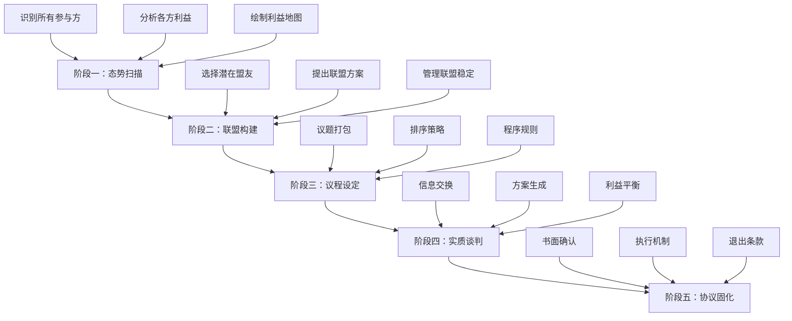
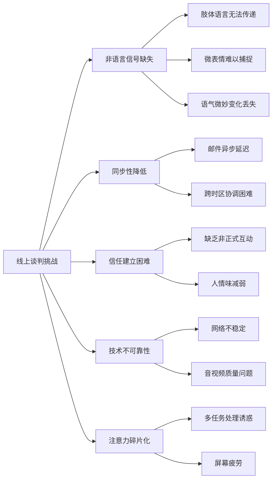

## 第六节 特殊情境下的谈判技巧

标准的双边谈判场景在教科书中最为常见，但现实世界的谈判往往发生在更复杂的情境中——多方参与的会议桌、跨越文化边界的商务会谈、隔着屏幕的远程协商、或者分秒必争的高压决策。这些特殊情境要求谈判者在掌握基本功之后，进一步发展出针对性的策略能力。本节系统梳理四类最具挑战性的谈判情境，从问题诊断到策略构建，再到实操工具，帮助谈判者在非标准场景中同样游刃有余。

---

### 6.1 多方谈判技巧

#### 6.1.1 多方谈判的本质特征

多方谈判（Multi-party Negotiation）是指三个或以上具有独立利益诉求的参与者同时参与的协商过程。与双边谈判相比，多方谈判在结构上产生了质的变化——不再是"我方对彼方"的二元对抗，而是一个动态的多方博弈网络。

哈佛谈判项目的研究者Robert Mnookin在其著作《Beyond Winning》中指出，多方谈判的核心困难在于组合爆炸：当参与者数量为 n 时，可能的双边关系为 n(n-1)/2，可能的联盟组合为 2ⁿ - n - 1。5个参与方就有10条双边关系线和26种潜在联盟，7个参与方则飙升到21条关系线和120种联盟可能。这种复杂性不是线性增长，而是指数级增长。

**多方谈判的四个结构性难题：**

| 难题 | 具体表现 | 对谈判的影响 |
|------|----------|------------|
| 联盟动态 | 参与者可能随时结盟或背叛 | 你的盟友可能变成对手的盟友 |
| 议程控制权 | 谁决定讨论什么、按什么顺序讨论 | 议程顺序直接影响最终结果 |
| 信息不对称加剧 | 每个人知道的信息集合不同 | 难以判断谁在隐瞒什么 |
| 决策规则模糊 | 多数决？一致同意？加权投票？ | 不同规则产生完全不同的结果 |

#### 6.1.2 联盟策略：多方博弈的核心技术

在多方谈判中，单打独斗几乎注定失败。联盟（Coalition）是多方谈判的基本单元——你需要找到足够多的盟友来形成多数，同时防止对手建立反联盟。

**联盟构建的四步法：**

**第一步：绘制利益地图。** 列出所有参与方及其核心利益诉求，用矩阵标注各方之间的利益重叠度和冲突度。

```text
           参与方A   参与方B   参与方C   参与方D
参与方A     —        高重叠    中等      低冲突
参与方B     高重叠    —        低冲突    高冲突
参与与C     中等      低冲突    —        高重叠
参与方D     低冲突    高冲突    高重叠    —
```

**第二步：识别潜在盟友。** 优先选择利益重叠度高、冲突度低的参与方作为结盟对象。但要注意——"最相似的"不一定是"最好的盟友"，有时候一个在特定议题上与你互补的中间派更有价值。

**第三步：提出联盟价值主张。** 不要只是说"我们应该站在一起"，而要具体说明联盟能给对方带来什么。有效的联盟提案包括：明确的利益分配方案、共同的对手威胁分析、以及退出联盟的成本评估。

**第四步：管理联盟稳定性。** 联盟不是签了就完事。你需要持续监控盟友的忠诚度，及时回应盟友的关切，并在必要时调整利益分配以维持联盟凝聚力。

**联盟策略中的关键原则：**

- **最小获胜联盟原则（Minimum Winning Coalition）**：政治学家William Riker提出的经典理论——建立刚好能达成目标的最小联盟，而不是越大越好。联盟越大，每个成员分到的利益越少，维持联盟的成本越高。
- **联盟不可替代性**：让自己成为多个潜在联盟都需要的关键节点，这样无论哪个联盟形成，你都有谈判筹码。
- **备选联盟策略（BATNA in Coalition）**：始终保有加入另一个联盟的选项，不要把所有鸡蛋放在一个篮子里。

#### 6.1.3 议程管理与程序控制

在多方谈判中，"程序"本身就是一种武器。讨论什么、不讨论什么、先讨论什么、用什么标准评估方案——这些程序性决定往往在实质性讨论开始之前就已经预设了结果。

**议程控制的实操技巧：**

1. **议题打包（Issue Bundling）**：将对你有利的议题和对其他方有利的议题打包在一起讨论，创造跨议题的交换空间。例如："我们可以同时讨论价格和交货期，因为这两个问题互相关联。"

2. **排序策略（Sequencing）**：先讨论容易达成共识的议题，建立合作惯性和信任基础，再处理争议性大的议题。或者反过来——先锁定关键议题的框架，让后续讨论在此框架内进行。

3. **程序性提案（Procedural Suggestions）**：在讨论陷入僵局时，主动提出程序性建议。例如："我们已经讨论了两个小时还没有共识，建议我们先各自列出不可让步的三个要点，再找交集。"这种提案看似中立，实则可以引导讨论方向。

4. **时间管理**：控制每个议题的讨论时长，避免在对你不利的议题上耗时过多。可以建议设置"时间箱"（Time Box），每个议题限时30分钟，到期转入下一议题或投票表决。

#### 6.1.4 多方谈判中的信息管理

信息在多方谈判中的流动路径远比双边谈判复杂——你不仅要知道对手掌握什么信息，还要考虑信息在参与者之间传递的路径和失真。

**信息管理的三个层次：**

- **选择性披露**：决定哪些信息向所有人公开、哪些只向特定参与方透露、哪些严格保密。公开信息用于建立信任和设定议程，选择性透露用于建立双边联盟，保密信息留作最后的谈判筹码。
- **信息收集**：通过非正式渠道（茶歇闲聊、单独会面）收集其他参与方的真实立场和底线。多方谈判的正式场合往往只是冰山一角，真正的交易在走廊里达成。
- **信息验证**：对收到的信息保持审慎。某参与方告诉你"那边已经同意了80万的报价"，可能是事实，也可能是策略性误导。通过多个渠道交叉验证关键信息。

#### 6.1.5 多方谈判实战框架

一个完整的多方谈判流程可以分为五个阶段：



---

### 6.2 跨文化谈判技巧

#### 6.2.1 文化差异的系统识别

跨文化谈判的挑战不仅仅在于语言障碍，更深层的困难来自不同文化对"谈判"这件事本身的理解差异。荷兰社会心理学家Geert Hofstede的文化维度理论为理解这些差异提供了系统框架，但在谈判情境中，我们需要更精细的分析工具。

**谈判相关的六大文化维度：**

| 维度 | 高端特征 | 低端特征 | 对谈判的影响 |
|------|----------|----------|------------|
| 权力距离 | 等级分明，尊重权威 | 平等意识强，可挑战上级 | 高权力距离文化中，谈判团队层级严格，决策权集中于最高层 |
| 个人主义 vs 集体主义 | 个人利益优先，决策独立 | 集体利益优先，共识决策 | 集体主义文化谈判周期更长，因为需要内部协调 |
| 不确定性规避 | 规则导向，厌恶风险 | 灵活变通，容忍模糊 | 高规避文化要求详细合同条款，低规避文化更依赖关系 |
| 长期导向 vs 短期导向 | 重视长期关系，耐心布局 | 关注即时结果，效率优先 | 长期导向文化谈判节奏更慢，但协议执行率更高 |
| 高语境 vs 低语境 | 含蓄表达，读空气 | 直接明确，有话直说 | 高语境文化中，"不"可能说成"这个比较困难" |
| 单一时间 vs 多元时间 | 守时，按计划行事 | 灵活，同时处理多件事 | 多元时间文化对截止日期的遵守度更低 |

**六大谈判文化原型：**

基于大量实证研究，可以将主要商业文化归纳为六种谈判原型：

1. **美国型**：直接、效率导向、重视数据和逻辑、个人决策权大、"让我看看数字"
2. **日本型**：间接、关系导向、重视和谐与面子、集体决策（稟議制度）、"让我们再研究一下"可能是拒绝
3. **德国型**：严谨、准备充分、重视规则和流程、对细节要求极高、"合同的每一条都必须明确"
4. **中国型**：关系（guanxi）驱动、先交朋友后谈生意、重视中间人、酒桌文化的作用
5. **中东型**：热情好客、重视个人信誉和家族声誉、谈判节奏灵活、宗教因素的考量
6. **北欧型**：平等意识强、低调务实、不喜欢虚夸、重视可持续和公平

#### 6.2.2 跨文化谈判的准备清单

**谈判前的文化准备工作：**

- [ ] 研究对方文化的基本谈判风格和禁忌
- [ ] 了解对方的决策流程（个人决策还是集体决策？审批层级？）
- [ ] 确认商业礼仪规范（名片交换、称呼方式、着装要求）
- [ ] 了解时间观念（准时的标准、谈判的预期时长）
- [ ] 确认是否需要翻译人员，以及翻译人员的专业背景
- [ ] 了解当地的送礼文化和禁忌
- [ ] 确认饮食禁忌（宗教、素食等），安排合适的餐饮
- [ ] 研究该文化中的关系建立方式（是否需要先建立个人关系再谈正事）
- [ ] 了解对方文化对"合同"的理解（是法律约束还是关系承诺？）

#### 6.2.3 高语境与低语境沟通的实操指南

Edward T. Hall提出的高语境/低语境框架是跨文化谈判中最实用的工具之一。理解并适应对方的语境模式，是跨文化谈判成功的基础。

**高语境文化的沟通特征与应对：**

在高语境文化（中国、日本、韩国、阿拉伯国家等）中，大量的信息通过非语言线索、情境背景和关系脉络传递，而非通过明确的语言表达。这意味着：

- **含义在言外**：对方说"我们需要再考虑一下"，在低语境文化中可能意味着需要更多信息，在高语境文化中可能意味着拒绝但不想当面说出来。
- **面子至关重要**：不要在公开场合让对方难堪。如果有分歧，通过私下渠道沟通比在会议上直接指出更有效。
- **关系先于交易**：不要急于进入实质讨论。花时间建立个人关系，共进晚餐，了解对方的背景和兴趣，这些"非正式"接触往往是谈判成功的关键。
- **耐心解读信号**：注意对方的肢体语言、沉默的含义、语气的变化。在日本文化中，长时间的沉默可能是在认真考虑你的提议，而不是拒绝。

**低语境文化的沟通特征与应对：**

在低语境文化（美国、德国、北欧等）中，信息主要通过明确的语言传递，人们期望直接、清晰的表达：

- **说你所想，想你所说**：不要期待对方"猜"你的意思。如果你对某个条款不满意，直接说出来。
- **书面确认口头承诺**：低语境文化更依赖书面文件。每次会议后发送会议纪要，确认达成的共识。
- **数据驱动**：准备好数据和证据支持你的立场。"我觉得这个价格不合理"不如"根据市场数据，同类产品的平均价格是X"有效。
- **时间就是金钱**：准时到场，按时结束，不要花太多时间在寒暄上。

#### 6.2.4 跨文化谈判中的常见陷阱

**陷阱一：自我参照标准（SRC）**。不自觉地用自己的文化框架去解读对方的行为。例如，美国人可能把日本谈判者的沉默理解为不感兴趣或犹豫不决，而实际上对方可能在进行内部协调。

**纠正方法**：每当对对方行为产生判断时，先停下来问自己："如果从对方的文化视角来看，这个行为可能意味着什么？"使用"文化暂停"（Cultural Pause）技巧——在做出反应前给自己10秒钟的文化反思时间。

**陷阱二：表面的文化适应**。学习了一些文化礼仪（比如交换名片用双手），就认为自己理解了对方的文化。但真正的文化理解是深层的——理解对方的价值观、决策逻辑和关系网络。

**纠正方法**：至少阅读两本关于对方文化的深度书籍（不是旅行指南），与有该文化经验的人深入交谈，并在谈判中始终保持学习者心态。

**陷阱三：文化刻板印象**。把文化特征过度简化为刻板印象，忽视个体差异。不是所有中国人都含蓄，不是所有美国人都直接。

**纠正方法**：将文化知识作为起点而非结论。在谈判中观察具体的个人风格，灵活调整。文化维度是概率分布，不是二元分类。

---

### 6.3 线上谈判技巧

#### 6.3.1 线上谈判的结构性挑战

远程工作和数字化转型使得线上谈判从"补充手段"变成了"常态形式"。然而，大量研究表明，线上谈判的效果普遍低于面对面谈判。哈佛商学院的一项研究发现，完全通过邮件进行的谈判，其双方满意度比面对面谈判低约23%，达成的协议创造性也显著更低。

**线上谈判的五大结构性缺陷：**



**非语言信号缺失的影响**：面对面沟通中，非语言信号（肢体语言、面部表情、语调）传递了约55%-70%的信息（Mehrabian的7-38-55法则）。在线上环境中，这些信号大幅衰减。你无法看到对方在听到你的报价时是否下意识地皱眉，也无法感受到对方在讨论某个条款时的紧张情绪。这使得"读取房间气氛"这一关键谈判技能几乎无法施展。

#### 6.3.2 线上谈判的工具选择矩阵

不同的谈判情境适合不同的线上工具。选择错误的工具会放大线上谈判的结构性缺陷。

| 谈判类型 | 推荐工具 | 原因 | 注意事项 |
|----------|----------|------|----------|
| 正式商务谈判 | 视频会议（Zoom/Teams）+ 电子白板 | 最接近面对面体验，支持实时互动 | 确保画质和音质，准备备用方案 |
| 条款细节协商 | 视频会议 + 共享文档（Google Docs） | 可以实时编辑和标注合同文本 | 分配文档编辑权限，使用评论功能 |
| 简单报价交换 | 邮件 | 留下书面记录，给对方思考时间 | 注意措辞的精准性，避免歧义 |
| 关系建立阶段 | 视频会议 + 后续邮件总结 | 视频传递温度，邮件确认内容 | 视频不宜太长（30-45分钟为宜） |
| 跨时区谈判 | 录制视频消息 + 邮件 + 定期视频会议 | 异步沟通解决时差问题 | 录制视频控制在5分钟内，重点突出 |
| 敏感话题讨论 | 电话（一对一） | 专注对话内容，减少视觉干扰 | 适合已经建立信任的双方 |

#### 6.3.3 视频谈判的实操优化

**会前准备清单：**

- [ ] 技术测试：提前15分钟检查摄像头、麦克风、网络连接
- [ ] 环境布置：选择安静、光线充足、背景整洁的场所
- [ ] 备用方案：准备手机热点作为网络备用，准备电话号码作为视频备用
- [ ] 材料准备：将所有需要展示的文件提前加载好，练习屏幕共享操作
- [ ] 姿态练习：调整摄像头角度（平视或略高于视线），确保面部在画面中央

**会中互动技巧：**

1. **放大表情和语调**：由于视频压缩和画面尺寸限制，面部表情需要比面对面时更明显才能被对方感知。微笑时笑得更大一些，点头时更明显一些。语调的起伏也要适当放大，避免平铺直叙。

2. **战略性使用静音**：在对方发言时保持静音避免回声，在己方思考时短暂静音可以争取思考时间。但不要长时间静音——对方会以为你掉线了。

3. **主动确认理解**：由于信号延迟和质量损失，误解的风险更高。每讨论完一个要点，主动确认："我理解你的意思是XXX，对吗？"这不仅是确认理解，也是给对方修正的机会。

4. **利用聊天窗口**：在视频会议的聊天窗口中实时记录要点、分享链接和数据。这比口头报出一个长URL或一串数字更高效，也留下了书面记录。

5. **虚拟白板的使用**：使用Miro、MURAL等虚拟白板工具进行头脑风暴、方案比较或利益地图绘制。视觉化呈现比纯口头讨论更高效，尤其是在多方视频会议中。

#### 6.3.4 邮件谈判的策略性运用

邮件谈判看似是最简单的形式，但实际上充满了策略性考量。

**邮件谈判的优势运用场景：**

- **需要思考时间的复杂条款**：邮件给双方留出充分的研究和内部咨询时间，避免在实时谈判中被逼做出仓促决定。
- **情绪管理**：当你对对方的某个立场感到愤怒或不满时，邮件允许你在冷静后再回复，避免情绪化反应。
- **书面记录**：所有沟通都有迹可查，减少后续的"我记得当时说的是……"争议。

**邮件谈判的风险与对策：**

| 风险 | 表现 | 对策 |
|------|------|------|
| 语气误读 | 你以为的直截了当，对方读出了攻击性 | 发送前让第三方阅读，确认语气是否恰当 |
| 信息过载 | 长篇大论的邮件被忽略或只读了一半 | 一封邮件只讨论一个主题，关键信息放在开头 |
| 回复延迟 | 对方迟迟不回复，你不知道是策略还是疏忽 | 设定明确的回复期望："请在本周五前回复" |
| 缺乏人情味 | 纯公事公办的邮件难以建立信任 | 适当加入个人化内容，如提及之前的交流 |
| 转发风险 | 你的邮件可能被转发给不在谈判桌上的人 | 每封邮件都假设会被第三方看到，措辞谨慎 |

#### 6.3.5 线上谈判的信任建设

线上环境中信任建设的难度显著增加，但并非不可能。关键是将"信任建设"从被动的自然发生变为主动的刻意设计。

**线上信任建设的五种方法：**

1. **视频破冰（Virtual Icebreaker）**：在正式谈判开始前，花5-10分钟进行非正式聊天。话题可以是对方的办公环境、当地的天气、最近的行业新闻等。这个看似无关紧要的环节实际上在建立"这个人是可以正常交流的"这一基本信任。

2. **透明度展示**：主动分享你的工作环境、日程安排甚至一些个人生活片段。这种适度的自我暴露能拉近距离。例如："我现在在家办公，孩子们可能会偶尔跑进来，请见谅。"

3. **超预期响应**：对邮件和消息的回复比对方预期的更快、更详尽。在线上环境中，响应速度和质量是可靠性的重要信号。

4. **一致性的言行**：说到做到，承诺的回复时间、准备材料的截止日期严格遵守。线上环境减少了社交压力，违约的"心理成本"更低，因此守约的信号价值更高。

5. **定期同步**：不要只在需要讨论具体条款时才联系。定期发送进展更新、行业信息分享，保持连接感。

---

### 6.4 高压谈判技巧

#### 6.4.1 高压谈判的心理学基础

高压谈判（High-pressure Negotiation）是指在时间紧迫、利害重大、情绪激烈条件下进行的协商。这类谈判不仅考验策略能力，更考验心理韧性。理解压力对认知和决策的影响，是应对高压谈判的前提。

**压力对谈判者的四重影响：**

1. **认知窄化（Cognitive Narrowing）**：压力下大脑的前额叶皮层活动降低，思考范围收窄，容易只看到眼前最紧迫的问题而忽略整体利益和长远影响。哈佛心理学家Daniel Gilbert的研究表明，高压下人们的决策质量下降约30%。

2. **情绪劫持（Amygdala Hijack）**：Daniel Goleman提出的情绪智力概念——在高压下，杏仁核（大脑的"恐惧中心"）可能劫持理性思维，导致"战斗或逃跑"反应。在谈判中的表现为：要么过度攻击（拍桌子、威胁），要么过快让步（"算了，你说什么就是什么"）。

3. **锚定效应放大**：高压下人们更容易受到第一个数字或第一个方案的影响。时间压力越大，越倾向于围绕初始锚点做调整，而不是从头思考合理的方案。

4. **群体极化（Group Polarization）**：在团队谈判中，压力可能导致团队立场趋向极端化——要么集体强硬，要么集体妥协，失去平衡判断。

#### 6.4.2 时间压力的应对策略

时间压力是高压谈判中最常见的元素。对方可能会人为制造时间压力来迫使你让步。

**识别真实时间压力与人为时间压力：**

| 判断维度 | 真实时间压力 | 人为时间压力 |
|----------|------------|------------|
| 原因 | 有客观原因（合同到期、政策变动、预算周期） | 原因模糊或可协商 |
| 表现 | 对方也表现出紧迫感和焦虑 | 对方态度从容，只有你在被催促 |
| 灵活性 | 时间节点有一定弹性 | "这是最后期限，不能改"但不解释为什么 |
| 替代方案 | 双方都面临错过期限的损失 | 只有你面临损失 |

**应对时间压力的四种策略：**

**策略一：质疑截止日期。** "您提到周五是最后期限，能告诉我这个期限背后的原因吗？如果我们在下周一达成协议，是否还来得及？"很多"最后期限"经过追问后会发现其实有弹性。

**策略二：分解时间压力。** 不要试图在一个截止日期前解决所有问题。将谈判分解为多个子议题，按优先级排序。"我们可能无法在周五前谈完所有条款，但我们能否先锁定价格和付款条件，把交货细节留到下周？"

**策略三：利用时间压力反制。** 如果对方设置了一个对你不利的时间压力，可以反过来设置一个对对方不利的对冲期限。"好的，既然你们希望周五前确定，那我需要你们在周三前提供最新的技术规格，否则我无法在周五前给出报价。"

**策略四：战略性拖延。** 当你判断对方的时间压力大于你时，适度拖延可以增加对方的让步意愿。但要谨慎使用——过度拖延会破坏关系，而且如果判断错误（其实你的时间压力更大），可能适得其反。

#### 6.4.3 高压情绪管理

**情绪管理的"STOP"技术：**

在高压谈判中感到情绪失控时，使用STOP技术快速恢复冷静：

- **S（Stop/暂停）**：身体暂停——停止说话，做一个深呼吸。可以说"让我想一想"或"这个很重要，我需要认真考虑"来争取暂停时间。
- **T（Take a breath/深呼吸）**：进行4-7-8呼吸法——吸气4秒，屏住7秒，呼气8秒。这能激活副交感神经，降低心率和皮质醇水平。
- **O（Observe/观察）**：客观观察自己的情绪状态。"我现在感到愤怒/焦虑/恐惧，这是正常的反应，但这不代表我需要按照这个情绪行动。"
- **P（Proceed consciously/有意识地行动）**：在情绪平复后，有意识地选择下一步行动。而不是被情绪驱动做出反应。

**团队谈判中的情绪管理：**

在团队谈判中，可以利用"角色分工"来分散情绪压力：

- **主谈人（Lead Negotiator）**：负责实质讨论，保持冷静和理性
- **观察员（Observer）**：观察对方的反应和团队内部的情绪变化，在需要时发出信号
- **记录员（Note-taker）**：记录讨论要点和承诺，确保不遗漏关键信息
- **暂停触发者（Break Caller）**：有权在感觉到团队情绪失控时要求休息

这种分工让主谈人可以专注于内容，而不必同时管理自己和团队的情绪。

#### 6.4.4 高压谈判中的战术技巧

**战术一：控制节奏。** 高压谈判中，谁控制节奏谁就占据主动。放慢节奏可以争取思考时间，加快节奏可以施加压力。在对方施压时，故意放慢说话速度，停顿更长时间再回应，可以打破对方的施压节奏。

**战术二：议题切换。** 当在某个议题上陷入僵局或受到压力时，主动切换到另一个议题。"关于价格的问题我们先放一下，让我先了解一下你们对付款方式的要求。"这可以打破僵局，也可能在其他议题上找到突破口。

**战术三：最后通牒的应对。** 面对"要么接受要么拉倒"（Take it or leave it）的最后通牒，不要立即回应。可以：(1) 询问原因——"能帮我理解一下为什么这是你们的最终方案吗？"；(2) 重述利益——"我理解你们的立场，但我希望我们都清楚这个方案对双方的长期影响"；(3) 提出替代方案——"如果这个方案不行，我们是否可以考虑另一个结构？"；(4) 冷静接受BATNA——如果最后通牒确实不如你的替代方案，果断退出。

**战术四：以退为进。** 在对方高压施压时，表面上接受对方的一个要求，但同时提出一个对等或更大的对冲要求。"我可以接受你们的价格，但需要把付款周期从30天缩短到15天。"这种策略将对方的"胜利"变成一个需要付出代价的交换。

#### 6.4.5 高压谈判后的复盘

高压谈判结束后，无论结果如何，系统性复盘是提升能力的关键。

**复盘五问：**

1. **压力点在哪里？** 识别谈判中最大的压力来源是什么——时间？对方态度？自己的情绪？
2. **决策质量如何？** 哪些决定是在冷静理性下做出的，哪些是在压力下做出的？压力下的决定质量如何？
3. **情绪何时失控？** 有没有情绪影响决策的时刻？触发因素是什么？
4. **策略是否有效？** 使用的策略在高压环境下是否如预期般发挥作用？
5. **下次如何改进？** 如果重新来一次，在哪个节点可以做出不同的选择？

---

### 6.5 综合应用：特殊情境的通用原则

无论面对哪种特殊谈判情境，以下原则始终适用：

**原则一：准备的深度决定表现的高度。** 特殊情境对准备的要求比标准情境更高。多方谈判需要绘制利益地图，跨文化谈判需要文化研究，线上谈判需要技术测试，高压谈判需要情绪预案。准备越充分，现场需要临场发挥的部分越少，出错的概率越低。

**原则二：情境意识（Situational Awareness）是核心能力。** 时刻关注"现在发生了什么"——不仅是谈判内容，还有参与者的状态、技术的运行情况、文化信号的传递。这种全方位的觉察力是应对复杂情境的基础。

**原则三：灵活性优于完美计划。** 特殊情境中，你的初始计划被打乱的概率极高。与其执着于计划A，不如培养快速调整计划B、计划C的能力。这需要事先准备多个备选方案，也需要在谈判中保持开放心态。

**原则四：事后复盘是进步的引擎。** 每次特殊情境谈判后进行系统性复盘，记录有效的策略和犯过的错误，逐步积累属于自己的情境知识库。随着经验的积累，你对特殊情境的应对会从"刻意使用技巧"进化为"自然而然的反应"。

通过系统性地掌握这些特殊情境谈判技巧，谈判者能够突破标准场景的局限，在各种复杂环境中保持策略性的思考和行动，最终达成高质量的协议。特殊情境不是谈判的例外，而是谈判的常态——真正的谈判高手，是在任何情境下都能从容应对的人。
