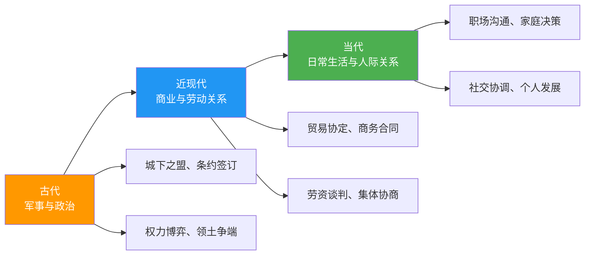
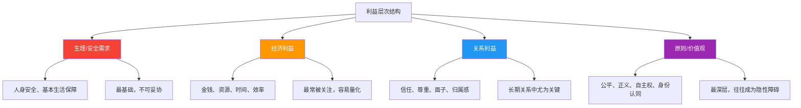
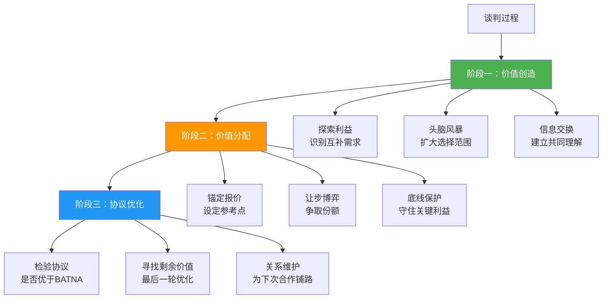

## 第一节 谈判的本质与定义

> "一切事物的本质，决定了它的边界与可能性。"
> —— 亚里士多德

要掌握任何技能，首先必须理解它的本质。谈判看似人人都会——从菜市场讨价还价到跨国并购协议，从家庭假期安排到国际外交斡旋，人类每天都在进行着无数次谈判。但绝大多数人对谈判的理解停留在表面，导致他们在关键时刻要么错失利益，要么破坏关系，要么两者兼失。

本节将从词源学、学术定义、核心要素、双重本质、学科根基五个维度，系统拆解"谈判到底是什么"。这不是无聊的理论罗列——每一条定义背后都对应着不同的实战策略取向。

### 1.1 词源与语义演变

**"谈判"一词的语言密码**

理解一个概念的词源，往往能揭示其最原始的含义内核。

| 语言 | 词汇 | 词源构成 | 原始含义 |
|------|------|---------|---------|
| 英语 | Negotiation | 拉丁语 *negotiari* = *neg-*（不）+ *otium*（闲暇） | "不闲着"——一种需要投入精力的主动行为 |
| 中文 | 谈判 | "谈"（言语交流）+ "判"（判断裁决） | 通过言语交流做出判断和决定 |
| 日语 | 交渉（こうしょう） | "交"（交互）+ "渉"（涉水、经历） | 双方共同经历一段艰难的过程 |
| 德语 | Verhandlung | *ver-*（相互）+ *Handlung*（行动） | 相互之间的行动往来 |

这些词源共同指向谈判的几个根本属性：

1. **主动性**：谈判不是被动等待，而是主动投入精力的过程（英语词源）
2. **言语性**：谈判的核心载体是语言沟通，通过"谈"来实现"判"（中文词源）
3. **双向性**：谈判是交互的过程，不是单方面的行为（日语、德语词源）
4. **艰难性**：谈判往往涉及利益冲突和观念差异，需要跨越障碍（日语词源"涉水"）

**语义演变的三个阶段**

谈判一词的内涵随着人类社会的发展经历了显著扩展：

- **古代**（公元前~17世纪）：谈判主要是国家行为，与战争、外交、条约紧密相关。《孙子兵法》中"上兵伐谋，其次伐交"的"伐交"，就是指通过外交谈判（而非战争）来达成战略目标。
- **近现代**（17~20世纪中叶）：随着商业文明发展，谈判进入经济领域。19世纪劳动关系的兴起催生了集体谈判（Collective Bargaining）的概念。1935年美国《国家劳动关系法》首次将集体谈判权写入法律。
- **当代**（20世纪中叶至今）：谈判概念全面泛化。哈佛大学谈判项目（Harvard Negotiation Project）的建立标志着谈判成为独立学科。今天，"谈判"已涵盖从国际外交到日常人际互动的全部范围。

### 1.2 谈判的多维定义

学术界和实践领域对谈判有着多层次的定义，每种定义侧重不同的维度：

#### 1.2.1 广义定义

> 谈判是两个或多个主体之间，为了达成相互可接受的协议而进行的沟通过程。这个过程涉及信息的交换、利益的权衡、方案的创造和决策的形成。

这个定义强调了四个关键要素：

- **多方参与**：谈判至少需要两方，单方面无法构成谈判
- **可接受性**：目标不是一方压倒另一方，而是各方都能接受的结果
- **过程性**：谈判不是一次性的事件，而是展开的过程
- **综合性**：包含信息交换、利益权衡、方案创造、决策形成四个子过程

**适用场景**：这个定义适用于日常生活中的绝大多数情境——和同事讨论分工、和朋友商量聚餐时间、和家人安排假期计划，都可以用这个框架来理解。

#### 1.2.2 狭义定义

> 在特定情境下，谈判各方就稀缺资源的分配、分歧的解决或共同利益的创造，通过有策略的互动来达成一致意见的行为过程。

狭义定义增加了三个关键限定：

- **稀缺性**：谈判之所以发生，是因为资源（时间、金钱、机会、注意力）是有限的。如果每个人都能得到想要的一切，就不需要谈判
- **策略性**：谈判不是随意聊天，而是有意识地选择说什么、不说什么、何时说、怎么说
- **一致性的必要**：不同于说服（可以说服失败）或争论（可以各执一词），谈判必须以达成某种一致为目标

**适用场景**：商业交易、薪资协商、合同签订、资源分配等正式情境。

#### 1.2.3 战略性定义

> 谈判是一种复杂的社会互动，其中参与者通过影响对方的认知、情感和行为，来实现自己预设目标的系统性过程。

战略性定义将谈判提升到更高的层次：

- **社会互动**：谈判不是机械的信息交换，而是人与人之间的社会行为，受到社会规范、关系动态、权力结构的影响
- **影响的三维度**：认知（对方怎么想）、情感（对方怎么感受）、行为（对方怎么做）——优秀的谈判者同时在这三个维度上施加影响
- **系统性**：谈判是一个系统，其中每个要素都相互关联。改变一个变量（比如引入新的替代方案），会连锁影响其他所有变量

**适用场景**：重大商业谈判、外交谈判、并购交易、战略合作等高风险情境。

#### 1.2.4 博弈论视角的定义

> 谈判是一个非合作博弈中的协调问题，各方在信息不完全的条件下，通过策略性行为寻求纳什均衡或帕累托最优解。

博弈论为谈判提供了精确的数学语言：

- **非合作博弈**：各方独立做出决策，而非事先达成有约束力的协议
- **信息不完全**：各方不知道对方的真实偏好、底线和替代方案（这也是为什么信息收集如此重要）
- **纳什均衡**：没有任何一方能通过单方面改变策略而改善自己处境的状态
- **帕累托最优**：在不损害任何一方利益的前提下，无法再改善任何一方的状态

**为什么需要理解博弈论定义？** 因为它解释了谈判中很多反直觉现象的根本原因：为什么信息不对称会导致"赢者的诅咒"？为什么"以退为进"有时反而能获得更好结果？为什么在重复博弈中合作比竞争更有利？这些问题的答案都藏在博弈论的数学结构中。

### 1.3 谈判的七大核心要素

任何谈判——无论是一分钟的快速协商还是数月的复杂交易——都包含以下七个核心要素。缺少任何一个，要么谈判无法成立，要么结果质量大打折扣。

#### 1.3.1 参与者（Parties）

参与者是谈判的主体，至少包含两方。

| 参与者类型 | 特点 | 策略含义 |
|-----------|------|---------|
| **个人** | 决策权集中，反应快速，但可能受情绪影响大 | 直接沟通，关注个人动机和情感需求 |
| **团队** | 内部需要协调，决策链条长，但可以分工配合 | 识别真正的决策者，利用团队内部分歧 |
| **组织** | 有制度约束和审批流程，决策相对理性但缓慢 | 理解决策流程，准备书面提案 |
| **国家/政府** | 受国内政治、国际法、公众舆论多重约束 | 关注政治可行性，考虑面子和象征意义 |

**关键洞察**：谈判桌上的人数≠真正的参与者数量。很多时候存在"不在场的参与者"——对方的老板、家人、董事会、选民。理解这些不在场参与者的影响力，往往是破局的关键。

**识别真正决策者的方法**：

1. **直接询问**："如果我们今天达成一致，您这边的审批流程是怎样的？"——这个问题不会冒犯对方，却能帮你判断对方是否有最终决定权
2. **观察信号**：谁在关键时刻做最终表态？谁的反对会导致方案被推翻？
3. **历史参考**：过去的谈判中，最终拍板的是谁？
4. **制度分析**：组织的决策权限规定是怎样的？

#### 1.3.2 议题（Issues）

议题是需要讨论和决定的具体事项。议题的选择和管理是谈判策略的核心组成部分。

**议题的三个层次**：

1. **表层议题**：双方明确提出讨论的事项（如价格、数量、交付日期）
2. **深层议题**：影响表层议题的隐藏因素（如供应商的产能瓶颈、买方的预算周期）
3. **关系议题**：双方关系本身涉及的事项（如信任度、尊重感、话语权）

**议题管理策略**：

| 策略 | 操作方式 | 适用场景 |
|------|---------|---------|
| **议题拆分** | 将复杂议题分解为可独立协商的子议题 | 议题过于复杂，难以一揽子解决 |
| **议题打包** | 将多个议题捆绑协商，利用不同议题间的价值差异 | 多个议题存在互补性偏好 |
| **议题排序** | 先易后难建立势头，或先难后易展现诚意 | 根据情境选择最优顺序 |
| **议题引入** | 主动提出新议题改变谈判格局 | 当前议题对己方不利 |
| **议题搁置** | 暂时搁置争议议题，先处理其他事项 | 争议议题可能因后续进展而自然解决 |

#### 1.3.3 利益（Interests）

利益是各方参与谈判的根本需求和动机。这是谈判理论中最核心的概念之一——区分"立场"（Position）和"利益"（Interest）是谈判能力提升的第一个关键跃迁。

**立场 vs 利益的本质区别**：

> 立场是你说你想要什么，利益是你为什么想要它。

一个经典案例完美诠释了这个区别：两个人争夺一个橙子——这是立场冲突。但深入了解后发现，一个人需要橙子皮做蛋糕，另一个人需要橙子汁喝。如果只看到立场（都要橙子），结果是一人一半，双方都不满意。如果看到利益（一个要皮、一个要汁），就能找到各取所需的完美方案。

**利益的四个层次**：

**挖掘深层利益的提问技术**：

| 提问类型 | 示例问题 | 目的 |
|---------|---------|------|
| **为什么** | "您为什么需要在月底前交付？" | 理解需求背后的驱动因素 |
| **如果...会怎样** | "如果交付时间推迟两周，对您有什么影响？" | 评估利益的优先级和紧迫性 |
| **什么对您最重要** | "在这个方案中，什么对您来说是最重要的？" | 直接识别核心利益 |
| **理想状态** | "您理想中的完美方案是什么样的？" | 了解对方的最高期望 |
| **替代方案** | "如果我们在这个点上无法达成一致，您会怎么做？" | 间接评估对方的BATNA |

#### 1.3.4 选项（Options）

选项是可能的解决方案或协议形式。选项的数量和质量直接决定谈判结果的上限。

**为什么选项很重要？** 当双方只面对一个方案时，谈判退化为"接受或拒绝"的二元选择——这必然导致一方不满。当存在多个选项时，双方可以在不同的选项组合中寻找最优解，谈判空间显著扩大。

**创造选项的四种方法**：

1. **头脑风暴**：在不评判可行性的前提下，列出所有能想到的方案。关键是把"想方案"和"选方案"分开——先发散后收敛
2. **利益映射**：将各方的核心利益列出来，然后寻找能满足不同利益组合的方案
3. **标杆借鉴**：参考类似情境中被证明有效的解决方案
4. **逆向思考**：如果现有方案都行不通，什么样的"疯狂"方案可能有效？

#### 1.3.5 标准（Criteria）

标准是评估方案合理性的客观依据。引入客观标准是将谈判从"意志的较量"升级为"理性的讨论"的关键一步。

**常见的客观标准类型**：

| 标准类型 | 示例 | 说服力来源 |
|---------|------|-----------|
| **市场价格** | 行业平均薪资、同类产品售价 | 市场供需的客观反映 |
| **行业惯例** | 供应商通常提供30天账期 | 行业长期实践中形成的合理规范 |
| **法律/法规** | 最低工资标准、消费者保护法 | 国家强制力保障的底线 |
| **第三方评估** | 房产评估报告、技术鉴定意见 | 独立第三方的专业判断 |
| **历史先例** | 上次合作的条款、同类交易的条件 | 已被验证的合理参照 |
| **科学数据** | 临床试验结果、环境影响评估 | 可验证的客观事实 |

**使用客观标准的技巧**：

- 提前准备好数据来源，确保可追溯、可验证
- 用"我们如何公平地解决这个问题？"来引导讨论，而非"我要求..."
- 准备多个标准——如果对方拒绝一个标准，可以引入另一个
- 注意标准的适用性——不同地区、不同行业、不同规模的参考标准可能不同

#### 1.3.6 替代方案（Alternatives）

替代方案是谈判破裂时的备选路径。其中最重要的是BATNA（Best Alternative to a Negotiated Agreement，最佳替代方案），将在本章第三节深入讨论。

这里需要理解的是：替代方案不仅仅是"Plan B"，它是你的**力量来源**。拥有强BATNA的谈判者在桌上有更强的自信、更高的要求、更少的焦虑。反之，没有BATNA的谈判者就像没有底牌的扑克玩家——只能被对手牵着走。

**替代方案的战略作用**：

- **决策基准**：任何方案如果不如你的BATNA，就应该拒绝
- **议价筹码**：让对方知道你有好的替代方案，会促使对方提高出价
- **心理锚点**：有了BATNA，你不会因为恐惧谈判破裂而接受不公平的条件
- **创造力来源**：当你知道"大不了走另一条路"时，反而更敢于提出创造性方案

#### 1.3.7 承诺（Commitments）

承诺是各方对协议内容的保证。承诺的质量决定协议能否落地执行。

**承诺的三个维度**：

1. **明确性**：承诺的内容是否清晰无歧义？"尽快完成"vs"在7月15日前完成"——前者几乎等于没有承诺
2. **可执行性**：承诺是否在承诺者的控制范围内？承诺者是否有能力和意愿兑现？
3. **约束力**：承诺的违约成本是什么？口头承诺、书面协议、法律合同的约束力逐级递增

**管理承诺的实操建议**：

- 重要承诺必须书面化，使用具体的时间、数字和标准
- 在达成最终承诺前，先用"假设性承诺"测试对方反应："如果我们同意X，您是否能同意Y？"
- 区分"硬承诺"（不可变更）和"软承诺"（有调整空间），为后续协商留余地
- 建立承诺跟踪机制，定期确认各方的承诺履行进度

### 1.4 谈判的双重本质：价值创造与价值分配

理解谈判的双重本质——**价值分配（Claiming Value）**与**价值创造（Creating Value）**——是从谈判新手到高手的关键认知跃迁。这一理论框架由哈佛大学谈判项目的罗杰·费舍尔（Roger Fisher）和威廉·尤里（William Ury）在经典著作《谈判力》（*Getting to Yes*, 1981）中系统阐述。

#### 1.4.1 价值分配：零和博弈的逻辑

价值分配是指在固定的利益总量中争取更大的份额——一块大小不变的"蛋糕"，你多切一块，我就少一块。

**价值分配的典型场景**：

- 薪资谈判中，公司预算固定为50万，你多要1万，公司就少1万
- 二手房交易中，卖家想要高价，买家想要低价，差价就是博弈空间
- 离婚财产分割中，总资产固定，一方多得意味着另一方少得

**价值分配的核心策略**：

| 策略 | 原理 | 风险 |
|------|------|------|
| **锚定先手** | 首先出价设定参考点，影响对方判断 | 出价过高可能吓退对方 |
| **信息控制** | 不暴露自己的底线和真实偏好 | 过度保密可能导致信任缺失 |
| **让步管理** | 递减式让步，暗示已接近底线 | 让步过快可能让对方觉得还有空间 |
| **时间压力** | 利用截止日期增加对方决策压力 | 操纵时间可能损害长期关系 |

#### 1.4.2 价值创造：正和博弈的逻辑

价值创造是指通过创新思维、利益交换和方案设计，扩大整体利益池——不是争切同一块蛋糕，而是把蛋糕做大。

**价值创造的底层逻辑**：

价值创造之所以可能，根本原因在于**各方对不同议题的价值评估存在差异**。对于同一件事，不同人赋予的权重不同。

**经典案例：薪资谈判中的价值创造**

一家公司无法提供候选人要求的30万年薪（预算上限25万），双方在薪资数字上的博弈空间有限（价值分配）。但当双方把更多议题纳入讨论：

| 议题 | 对候选人的价值 | 对公司的成本 | 价值差异 |
|------|-------------|-------------|---------|
| 远程办公（每周2天） | 高（节省通勤3小时/周） | 低（已有基础设施） | 创造价值 |
| 培训预算（2万/年） | 高（技能提升=长期收入增长） | 中（计入培训预算） | 创造价值 |
| 弹性工作时间 | 高（生活质量提升） | 低（不影响产出） | 创造价值 |
| 股权期权 | 高（长期收益潜力） | 低（不占用现金预算） | 创造价值 |
| 年假增加5天 | 高（休息权） | 中（需要安排替代） | 部分创造 |
| 签约奖金（一次性） | 中（一次性收入） | 中（一次性支出） | 较小 |

当把这些议题打包后，候选人获得了远超30万薪资的综合价值，而公司的实际成本远低于30万现金支出——双方都比纯薪资博弈的结果更好。

**价值创造的五种方法**：

1. **议题扩容**：将更多相关议题纳入谈判范围，创造交换空间
2. **互补利益识别**：找到"对A价值高但对B成本低"的议题
3. **差异利用**：各方的风险偏好、时间偏好、信息优势不同，利用这些差异进行交换
4. **创造性方案**：跳出既有框架，寻找全新的解决路径
5. **成本分担**：共同承担某项成本，比各自承担更经济

#### 1.4.3 双重本质的动态切换

优秀的谈判者不是固定在某一种模式，而是在两者之间灵活切换。

**切换的时机判断**：

- 当对方开始讨论具体数字和条款时，从价值创造切换到价值分配
- 当谈判陷入僵局时，从价值分配退回价值创造——可能有未被发现的利益交换空间
- 当核心利益已基本确定时，进入协议优化阶段——检查是否有遗漏的价值可以提取

### 1.5 谈判的学科根基

谈判不是凭直觉或经验的"技巧"，它植根于多个成熟学科的理论土壤中。理解这些学科根基，有助于建立更完整的谈判认知框架。

#### 1.5.1 博弈论：策略互动的数学分析

博弈论为谈判提供了分析策略互动的精确工具。

**关键概念在谈判中的应用**：

| 博弈论概念 | 谈判中的含义 | 实战启示 |
|-----------|-------------|---------|
| **纳什均衡** | 没有单方能通过改变策略获利的状态 | 理解为什么某些谈判会僵持——双方都处于各自的"最优反应" |
| **帕累托最优** | 不损害任何一方就无法改善的状态 | 好的谈判结果应该接近帕累托最优——没有"浪费"的价值 |
| **囚徒困境** | 个体理性导致集体非理性的结构 | 解释为什么信任如此重要——没有信任，合作无法实现 |
| **重复博弈** | 同一对局者多次博弈 | 在长期关系中，合作策略（如"以牙还牙"）优于一次性竞争策略 |
| **不完全信息博弈** | 各方不知道对方的真实类型或偏好 | 解释为什么信息收集和信号传递如此关键 |

**托马斯·谢林（Thomas Schelling）的贡献**：谢林在《冲突的策略》（*The Strategy of Conflict*, 1960）中提出了"焦点"（Focal Point）理论——当双方需要协调但无法沟通时，会自然聚焦到某个"显眼"的选项上。在谈判中，这意味着锚定效应不仅仅是一种心理偏差，更是一种协调机制。

#### 1.5.2 行为经济学：人类决策的真实模式

传统经济学假设人是完全理性的，但行为经济学揭示了人类决策中的系统性偏差。这些偏差在谈判中尤为显著。

**丹尼尔·卡尼曼（Daniel Kahneman）和阿莫斯·特沃斯基（Amos Tversky）的前景理论（Prospect Theory）**是理解谈判行为的核心框架。其关键发现：

1. **损失厌恶**（Loss Aversion）：人们对损失的敏感度约为同等收益的2倍。在谈判中，这意味着"失去100元"带来的痛苦远大于"得到100元"的快乐，导致人们对保护现有利益的执着程度远超争取新利益
2. **参考点依赖**：人们不是评估绝对价值，而是评估相对于某个参考点的变化。谈判中的初始报价就充当了参考点——这就是锚定效应的底层机制
3. **确定性效应**：人们对确定性结果的偏好不成比例地高。在谈判中，提供确定性的保障（如"保证"、"最低标准"）比不确定的承诺更有吸引力
4. **框架效应**：同一信息的不同表述方式会导致截然不同的决策。"这个方案有70%的成功率"和"这个方案有30%的失败率"——说的是同一件事，但人们对前者的接受度显著更高

**行为经济学在谈判中的实操启示**（详见本章第五节）：

- 利用损失厌恶：将你的让步框架为"帮对方避免损失"而非"给对方好处"
- 利用锚定效应：率先提出有利但合理的初始报价
- 利用框架效应：用积极框架包装你的方案
- 防御对方的偏差运用：识别对方是否在使用这些策略影响你

#### 1.5.3 社会心理学：人际影响的科学

社会心理学解释了谈判中人际互动的深层机制。

**罗伯特·恰尔迪尼（Robert Cialdini）的六大影响力原则**在谈判中高度适用：

| 原则 | 原理 | 谈判中的应用 |
|------|------|-------------|
| **互惠** | 人们倾向于回报他人的善意 | 主动做出小让步，激发对方的回报心理 |
| **承诺与一致** | 人们希望自己的行为与之前的承诺保持一致 | 让对方先做出小承诺，逐步升级到大承诺 |
| **社会认同** | 人们参考他人的行为来决定自己的行为 | "大多数客户都选择了这个方案" |
| **权威** | 人们倾向于服从权威 | 引用专家意见、行业标准、权威数据 |
| **喜好** | 人们更容易被自己喜欢的人说服 | 在谈判前建立个人关系和好感 |
| **稀缺** | 人们对稀缺资源赋予更高价值 | "这个条件只在本周有效" |

#### 1.5.4 沟通学：信息传递的科学

谈判本质上是一个沟通过程。沟通学的理论直接适用于谈判：

- **倾听理论**：主动倾听（Active Listening）不仅能获取信息，还能建立信任和情感连接
- **提问技术**：开放式问题拓展讨论空间，封闭式问题推进决策
- **非语言沟通**：肢体语言、面部表情、语音语调传递的信息量远超语言本身
- **叙事理论**：用故事而非数据说服人——好的谈判者也是好的故事讲述者

### 1.6 谈判与相关概念的本质区别

谈判经常与以下概念混淆。理解它们的区别不仅是学术上的精确性问题，更直接影响实战策略选择——选错了模式，结果必然不理想。

#### 1.6.1 谈判 vs 说服

**本质区别**：方向性不同。

- **说服**是单向的影响过程：A试图改变B的认知或行为，B是被动的接受者（或拒绝者）
- **谈判**是双向或多向的互动过程：各方都有主动权，都需要做出让步或提供价值

**为什么区分很重要**：

很多谈判失败的原因恰恰是当事人把"谈判"做成了"说服"——只关注输出自己的观点，不关注对方的需求和利益。这种做法在弱势地位时尤其有害：当你的BATNA很弱时，单方面说服几乎不可能成功，但如果能找到对方的利益点进行交换，仍然可能达成好的结果。

**实战判断**：如果你的方案只需要对方"同意"而不需要对方"给出什么"，那可能是说服。如果双方都需要做出承诺和让步，那就是谈判。

#### 1.6.2 谈判 vs 争论

**本质区别**：目标不同。

- **争论**的目标是证明"我是对的，你是错的"——赢的标准是对方承认失败
- **谈判**的目标是达成"各方都能接受的方案"——赢的标准是各方的利益都得到合理满足

**为什么区分很重要**：

当谈判退化为争论时，双方的注意力从"解决问题"转移到"证明自己"。面子和自尊心开始主导决策，理性分析退居其次。在谈判中，你不需要证明对方是错的，你只需要找到一个对方愿意接受的方案。

**实战判断**：如果你发现自己在反复强调"但是我的理由是..."，很可能已经陷入了争论模式。切换回谈判模式的方法：停止证明自己正确，转而询问"您觉得什么样的方案对我们双方都合理？"

#### 1.6.3 谈判 vs 妥协

**本质区别**：结果的质量不同。

- **妥协**意味着各方都放弃部分利益——通常是"各退一步，谁都不满意"
- **谈判**（尤其是整合式谈判）可能通过创造性方案实现价值增值——各方的核心利益都得到满足

**为什么区分很重要**：

很多人的谈判策略就是"我让一步，你也让一步"——这看起来公平，但实际上可能浪费了大量价值。如果双方各退一步得到的方案是55分，而通过创造性思维可能找到80分的方案，那么"公平的妥协"实际上是对双方的损失。

**实战判断**：如果你的方案是"折中"，先暂停一下，问自己：是否存在一种方案能让双方都得到比折中更多的价值？通常答案是"有"，只是需要更多的创造性思考。

#### 1.6.4 谈判 vs 调解 vs 仲裁

**本质区别**：第三方的角色和权力不同。

| 维度 | 谈判 | 调解 | 仲裁 |
|------|------|------|------|
| **参与方** | 当事方直接进行 | 当事方 + 中立第三方 | 当事方 + 有决策权的第三方 |
| **第三方权力** | 无第三方 | 协助沟通，无决策权 | 有权做出约束性裁决 |
| **结果约束力** | 取决于各方承诺 | 取决于各方是否接受建议 | 具有法律约束力 |
| **关系影响** | 可能更好也可能更差 | 通常有利于维护关系 | 可能损害关系 |
| **成本** | 低（仅时间成本） | 中（需支付调解费用） | 高（需支付仲裁费用） |
| **适用场景** | 双方有意愿且有能力直接解决 | 双方有意愿但沟通困难 | 双方无法自行解决，需要强制裁决 |

**选择框架**：先尝试谈判（成本最低、自主性最强）→ 谈判失败时考虑调解（保留灵活性）→ 调解失败时考虑仲裁（强制解决）。

### 1.7 为什么理解谈判的本质如此重要

很多急于学"话术"和"技巧"的人会问：这些理论有什么用？直接教我怎么砍价不好吗？

这个问题本身暴露了一种危险的思维方式——把谈判等同于"讨价还价"。理解谈判本质的价值体现在三个层面：

#### 1.7.1 认知层面：从本能反应到策略选择

不理解谈判本质的人，在谈判中的行为往往是本能驱动的——被激怒就反击，被施压就退让，看到利益就争夺。理解了谈判的双重本质、核心要素和心理机制后，你的行为从"反应"变成了"选择"：

- 面对对方的挑衅，你选择不被情绪左右，而是分析对方的行为目的
- 面对僵局，你选择退回价值创造阶段寻找新方案，而不是继续硬碰硬
- 面对不合理的要求，你选择用客观标准来回应，而不是用情绪对抗

#### 1.7.2 适应层面：从生搬硬套到灵活应对

只有技巧没有理论的人，在面对新情境时往往手足无措——因为他们的技巧是针对特定场景设计的，换一个场景就失效。而理解了谈判本质的人，能够在任何新情境中自主推理出应对策略：

- 这是什么类型的谈判？分配式？整合式？混合式？
- 我的核心利益是什么？对方的核心利益可能是什么？
- 有哪些议题可以用来创造价值？
- 我的BATNA强吗？对方的BATNA可能是什么？
- 有哪些客观标准可以引用？

这些问题不需要死记硬背——当你理解了谈判的本质框架，它们会自然出现在你的分析流程中。

#### 1.7.3 发展层面：从一次性技巧到终身能力

谈判能力不是一套固定的技巧集，而是一种持续发展的思维模式。理解本质的人能够：

- **从每次谈判中学习**：每次谈判结束后，不是简单地想"这次赢了/输了"，而是分析"我在价值创造和价值分配之间的切换是否合理？我是否正确识别了各方的核心利益？"
- **跨场景迁移**：在商业谈判中学到的原理，可以迁移到家庭沟通、团队协作、社交互动中
- **持续进化**：随着经验积累，对谈判本质的理解会不断深化，策略选择也会越来越精准

### 1.8 自测：你是否真正理解了谈判的本质

在继续学习之前，用以下五个问题检验你的理解深度：

1. **价值创造 vs 价值分配**：你能举出一个你最近经历的谈判，说明其中哪些部分是价值创造，哪些部分是价值分配吗？
2. **立场 vs 利益**：回想一次你和别人的分歧——你能区分出哪些是"立场"，哪些是"利益"吗？
3. **要素完整性**：你能用七大核心要素（参与者、议题、利益、选项、标准、替代方案、承诺）来描述一次你参与过的谈判吗？
4. **概念区分**：在你最近的一次"谈判"中，你实际上是在谈判、说服、争论还是妥协？
5. **学科连接**：你能想到一个谈判场景，其中"损失厌恶"或"锚定效应"显著影响了结果吗？

如果这些问题让你感到困难——恭喜你，这正是学习的最佳起点。如果这些答案你都很清楚——继续深入，后面的章节会为你提供更多维度的深度分析。

---

> **下一节预告**：理解了"谈判是什么"之后，我们将进入"谈判有哪些类型"——[第二节：谈判的类型学](02-第二节谈判的类型学.md)。不同类型的谈判需要截然不同的策略，混淆类型是导致策略失配的根本原因之一。
