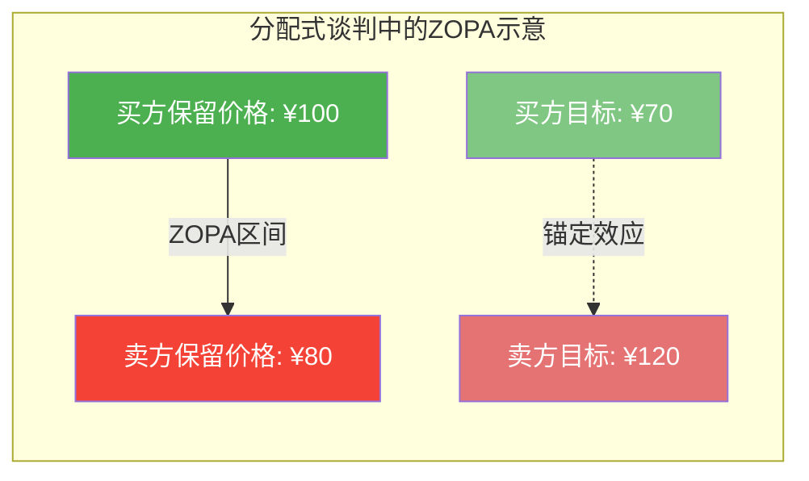
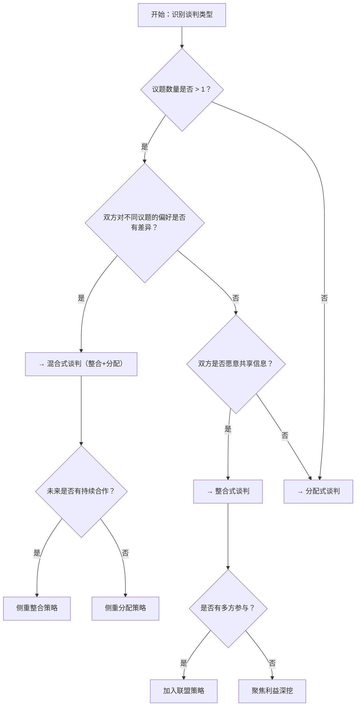

## 第二节 谈判的类型学

谈判并非铁板一块的单一活动。不同类型的谈判，其底层逻辑、策略工具箱和成功标准截然不同。把整合式谈判的策略生搬硬套到分配式谈判中，或者在多边谈判里按双边谈判的思路行事，不仅无法达成目标，反而可能损害自身利益。

谈判类型学的价值在于：**在开口之前，先判断你面对的是什么牌局**。正如军事指挥官需要先识别战场地形再部署兵力，谈判者需要先识别谈判类型再选择策略。

### 2.1 按利益结构分类：蛋糕怎么分

这是谈判学中最根本的分类维度，直接决定了策略选择的方向。

#### 2.1.1 分配式谈判（Distributive Negotiation）

分配式谈判，也称为"零和谈判"或"固定蛋糕谈判"，是指谈判各方在**固定总量的利益**中进行分配的过程。一方所得即为另一方所失，双方的利益完全对立。

**博弈论基础**：分配式谈判本质上是一个**零和博弈**（Zero-Sum Game）。在博弈论的框架中，所有参与者的收益之和恒等于零——你多拿一块钱，对方就少一块钱。这意味着不存在"把蛋糕做大"的空间，唯一的任务是确定切分线画在哪里。

**核心特征**：

| 维度 | 具体表现 |
|------|----------|
| 利益关系 | 完全对立，此消彼长 |
| 信息策略 | 高度保密，隐藏真实底线（BATNA和保留价格） |
| 关系取向 | 通常不需要维护长期关系 |
| 沟通风格 | 竞争性、对抗性 |
| 成功标准 | 获得尽可能接近自己目标价格的结果 |

**关键概念——ZOPA与锚定**：

在分配式谈判中，有两个概念至关重要：

- **保留价格（Reservation Price）**：你愿意接受的最低/最高限度。低于这个价格，你宁愿不成交。
- **ZOPA（Zone of Possible Agreement，可能达成协议的区间）**：买方保留价格与卖方保留价格之间的重叠区域。如果买方最多愿意付100元，卖方最少愿意接受80元，ZOPA就是80-100元。
- **锚定效应（Anchoring Effect）**：第一个出价会像锚一样影响后续谈判的走向。心理学研究表明，即使参与者知道初始数字是随机的，最终结果仍会向锚点偏移。

**典型场景**：

- **二手车交易**：买家希望低价，卖家希望高价，车辆价值有市场参考但谈判空间明确。一辆市场均价8万元的二手车，买家开价7万，卖家要价9.5万，最终可能在7.8-8.5万之间成交。
- **薪资谈判**：求职者希望高薪，企业希望控制人力成本，预算区间有限。HR拿到的预算范围是15-20K，求职者期望22K，最终可能在18-20K达成协议。
- **房产买卖**：买卖双方围绕价格展开博弈，中介从中撮合。卖方挂牌500万，买方还价450万，经过多轮博弈可能在470-480万成交。
- **劳务纠纷赔偿**：工伤赔偿、合同违约赔偿等，总额有法律上限，双方在区间内争夺。

**六种核心策略**：

1. **锚定策略（Anchoring）**：率先提出有利于己方但不离谱的初始要求。研究显示，先出价的一方在分配式谈判中平均获得更好的结果。但锚点必须"有道理"——开价过高会被视为不真诚，直接破坏谈判。经验法则：在你的乐观目标基础上再加10-20%作为开价。

2. **信息控制策略**：谨慎披露己方的BATNA（最佳替代方案）和保留价格。在分配式谈判中，信息就是弹药——你知道对方的底线越精确，你的议价能力越强。反之，暴露自己的底线等于缴械。核心原则：**问尽可能多的问题，说尽可能少的实话**。

3. **递减让步策略（Concession Pattern）**：采用幅度递减的让步模式，向对方传递"接近底线"的信号。例如：第一次让步2000元，第二次让步1000元，第三次让步500元。每次让步幅度减半，暗示空间已经不多了。切忌等额让步——如果你每次让500元，对方会预期你还能让很多次。

4. **时间压力策略（Deadline Pressure）**：利用截止日期增加对方的决策压力。研究表明，谈判中90%的让步发生在最后10%的时间内。如果你有更充裕的时间，或者能制造时间压力（"这个报价今天有效"），你就拥有优势。

5. **红脸白脸策略（Good Cop/Bad Cop）**：一人扮演强硬的"白脸"提出苛刻要求，另一人扮演友善的"红脸"提出折中方案。对方为了与"红脸"达成协议，往往会在"红脸"的方案上做出让步——而这个方案本身就是你计划中的目标。

6. **最后通牒策略（Ultimatum）**：给出"要么接受要么放弃"的最终报价。这是一种高风险策略——在一次性谈判中可能有效（对方没有回旋余地），但在重复性谈判中会严重损害关系。使用前提：你确实准备好了走开（walk away），否则虚张声势被识破后会失去所有筹码。

**真实案例：好莱坞编剧薪资谈判**

2023年美国编剧工会（WGA）与电影电视制片人联盟（AMPTP）的薪资谈判是典型的分配式谈判。编剧要求提高流媒体作品的残余报酬，制片方则试图压低成本。双方围绕一个固定的资金池展开争夺。编剧通过罢工制造时间压力（每停工一天，制片方损失数百万美元），最终在148天后达成协议，编剧获得了约2.33亿美元的额外补偿。这个案例同时展示了分配式谈判中"时间压力"和"BATNA"（罢工作为替代方案）的力量。

#### 2.1.2 整合式谈判（Integrative Negotiation）

整合式谈判，也称为"双赢谈判"或"扩大蛋糕谈判"，是指谈判各方通过**创造性思维**，寻求扩大整体利益的机会，实现各方利益的共同增长。

**博弈论基础**：整合式谈判对应的是**正和博弈**（Positive-Sum Game）。通过发现和利用双方偏好的差异、创造新的价值元素，总收益可以大于初始状态。这不是一方"善良"地让利给另一方，而是通过信息交换和创造性方案设计，找到对双方都更有利的结果。

**核心特征**：

| 维度 | 具体表现 |
|------|----------|
| 利益关系 | 部分重叠，存在共同利益空间 |
| 信息策略 | 选择性共享，强调透明以发现整合机会 |
| 关系取向 | 重视长期合作关系的建立和维护 |
| 沟通风格 | 合作性、探索性 |
| 成功标准 | 双方都获得超过各自保留价格的结果 |

**整合式谈判的四个前提条件**：

不是所有谈判都能变成整合式谈判。以下四个条件必须同时满足至少三个：

1. **利益可分割且存在差异**：双方对不同议题的重视程度不同，才存在交换空间。如果双方最在意的恰好是同一个东西，整合空间极小。
2. **信息可以一定程度共享**：如果双方完全不沟通真实需求，就无法发现整合机会。
3. **双方有合作意愿**：至少双方都不想"鱼死网破"。
4. **存在可扩展的议题**：谈判桌上有不止一个议题可以讨论。单一议题的谈判本质上就是分配式的。

**五种核心策略**：

1. **利益深挖策略（Interest-Based Bargaining）**：不要只关注对方"要什么"（立场），要理解对方"为什么要"（利益）。哈佛谈判项目的经典案例：两个人争一个橙子（立场冲突），如果深挖利益会发现——一个人要橙汁，一个人要橙皮做蛋糕。通过理解底层需求，双方各得所需。

2. **多议题打包策略（Logrolling）**：将多个议题捆绑谈判，利用双方对不同议题的价值评估差异进行交换。你最在意价格，对方最在意交期——你接受稍高的价格以换取更早的交期，对方接受稍晚的交期以换取更高的价格。双方都用"对自己不太重要但对对方很重要"的让步，换取"对自己很重要"的利益。

3. **头脑风暴策略（Brainstorming）**：在决策阶段之前，设立一个专门的"创意阶段"，双方不带评判地提出尽可能多的方案。关键规则：不批评、不承诺、追求数量、鼓励疯狂的想法。很多整合性方案都是从看似荒谬的想法中演化出来的。

4. **客观标准策略（Objective Criteria）**：引入双方都无法否认的外部标准来解决分歧——市场行情、行业标准、专家评估、法律条文、类似案例的先例。这避免了"你说你的我说我的"意志力较量，把谈判从"谁更强硬"转变为"什么是合理的"。

5. **桥接策略（Bridging）**：当现有选项都无法满足双方时，创造一个全新的方案。这需要跳出既有框架思考。经典案例：两家公司争一个写字楼的顶层空间——一家要用来做会议室（需要大空间但使用频率低），一家要用来做档案室（需要恒温恒湿但不在乎空间大小）。最终方案：共同使用，会议室在不使用时由档案管理方存放可移动的档案柜。

**真实案例：迪士尼与皮克斯的并购谈判**

2006年迪士尼以74亿美元收购皮克斯。谈判前，皮克斯创始人乔布斯对迪士尼前CEO艾斯纳极度不信任，差点让合作彻底破裂。新任CEO伊格尔上任后采取了整合式策略：他主动向乔布斯展示了迪士尼皮克斯合作的巨大协同价值（整合点），提出让皮克斯保持独立运营和创意自主权（满足皮克斯的核心利益），同时通过股权交换而非现金收购的方式让乔布斯成为迪士尼最大个人股东（创造新的价值元素）。结果：迪士尼获得了皮克斯的创意引擎，乔布斯获得了巨额财富和对迪士尼的影响力，双方的利益都得到了超越简单现金交易的满足。

#### 2.1.3 混合式谈判（Mixed-Value Negotiation）

现实中的大多数谈判都是混合式谈判——**同一场谈判中，某些议题是分配性的，某些议题是整合性的**。

**博弈论基础**：混合式谈判对应的是**变和博弈**（Variable-Sum Game）。总收益的大小取决于参与者的行为方式——合作可以做大蛋糕，但分配环节仍然是零和的。这意味着谈判者需要在"做大蛋糕"和"争夺份额"之间不断切换。

**真实场景举例——采购谈判**：

一家零售商与供应商谈判年度合同，涉及以下议题：

| 议题 | 利益关系 | 类型 |
|------|----------|------|
| 单价 | 零和：零售商要低价，供应商要高价 | 分配性 |
| 付款周期 | 零和：零售商想延长，供应商想缩短 | 分配性 |
| 采购量 | 整合：更大的量降低供应商单位成本，零售商获得更低价格 | 整合性 |
| 物流安排 | 整合：供应商统一配送降低双方物流成本 | 整合性 |
| 售后服务 | 部分整合：更好的售后减少零售商损失，但增加供应商成本 | 混合 |

**核心策略——"先整合，后分配"**：

混合式谈判的黄金法则是：**先在整合性议题上做大蛋糕，再在分配性议题上分蛋糕**。

具体操作：
1. **议题分析阶段**：逐一识别每个议题的利益结构（分配性/整合性/混合性）
2. **整合探索阶段**：在整合性议题上充分探索，扩大总体价值
3. **打包交换阶段**：将整合性议题和分配性议题捆绑，进行一揽子交换
4. **最终敲定阶段**：在分配性议题上用传统的分配式策略收尾

**常见误区**：

- **误区一：把所有议题都当分配式谈判**。很多谈判者习惯性地"寸土必争"，在本可以双赢的议题上浪费时间和关系资本。
- **误区二：在分配性议题上过度合作**。有些谈判者过于追求"双赢"，在本质上是零和的议题上（如价格）做出不必要的让步。
- **误区三：议题逐个谈判**。逐个议题谈判会导致在每个议题上都陷入分配式拉锯。正确的做法是将多个议题打包，利用"议题间补偿"（cross-issue trade-off）来实现整体最优。

### 2.2 按参与者数量分类：几个人坐在桌边

#### 2.2.1 双边谈判（Bilateral Negotiation）

两个参与方之间的谈判，是最常见也最基础的谈判形式。

**特点**：
- 关系清晰：只有"我"和"你"，信息处理和心理博弈相对简单
- 决策快速：不需要等待多方协调，可以灵活调整策略
- 责任明确：谁承诺了什么一目了然，执行监督成本低
- 心理压力直接：一对一的对抗感更强，需要更强的心理素质

**策略要点**：
- 善用BATNA：在双边谈判中，你的BATNA（最佳替代方案）是你最重要的筹码。如果你有更好的替代选择，你可以更有底气地拒绝不合理的要求。
- 注意关系管理：即使是一次性谈判，过度强硬也可能带来声誉损失（对方可能告诉别人你很难缠）。
- 控制信息流：一对一的环境中，信息泄露的风险更高（没有第三方作为缓冲），需要更加注意信息管理。

#### 2.2.2 多边谈判（Multilateral Negotiation）

三个或更多参与方之间的谈判。复杂度呈指数级增长。

**与双边谈判的关键差异**：

| 维度 | 双边谈判 | 多边谈判 |
|------|----------|----------|
| 利益关系 | 一对一直接对立/合作 | 多对多，形成复杂网络 |
| 联盟可能性 | 不存在 | 核心策略要素 |
| 决策速度 | 快 | 慢，需要多方协调 |
| 信息管理 | 相对简单 | 复杂，存在信息不对称 |
| 议程控制 | 双方协商 | 可能成为权力工具 |
| "搭便车"问题 | 不存在 | 常见 |

**多边谈判中的联盟策略**：

在多边谈判中，**联盟（Coalition）**是核心概念。联盟是两个或多个参与者为了在谈判中增加影响力而结成的临时合作体。

联盟形成的关键规则：
1. **最小获胜联盟原则**：人们倾向于形成刚好够票数的联盟，而不是越大越好——联盟越大，每个成员分到的份额越小。
2. **最小资源联盟原则**：用最少的"出价"成本赢得投票权——优先拉拢那些"代价最低"的盟友。
3. **联盟的不稳定性**：任何联盟成员都可能被对手"挖角"，只要对手给出比现有联盟更好的条件。因此联盟需要持续维护。

**多边谈判的实用技巧**：

1. **议程控制**：议题的讨论顺序直接影响结果。先讨论的议题会消耗更多谈判资源和耐心，后讨论的议题往往能在更紧迫的氛围下达成协议。争取控制议程——把自己最在意的议题放到最后。
2. **信息网络建设**：在正式谈判之外，与各方建立双边沟通渠道。了解每个参与者的真实利益和优先级，才能设计有效的联盟策略。
3. **程序性权力运用**：投票规则（简单多数、2/3多数、一票否决）决定了联盟的最小规模。在谈判开始前，如果能影响程序规则，就等于在起跑线上占了便宜。

**真实案例：气候变化国际谈判**

《巴黎协定》的谈判涉及近200个国家，是典型的超大规模多边谈判。发达国家和发展中国家形成了复杂的联盟网络：G77+中国联盟要求"共同但有区别的责任"，小岛国联盟（AOSIS）要求更激进的减排目标，石油输出国则试图弱化减排力度。最终能够达成协议，关键在于：（1）将议题分解为国家自主贡献（NDC），允许各国自行设定目标（降低分配性冲突）；（2）建立绿色气候基金，由发达国家出资帮助发展中国家（创造整合性元素）；（3）采用"共识"而非投票的决策机制（避免简单的多数压制少数）。

### 2.3 按关系时间跨度分类：只做一次还是长期合作

#### 2.3.1 一次性谈判（One-Shot Negotiation）

各方预期（或至少认为）未来不再有业务往来。典型的例子包括：旅游景点的商贩与游客、二手车交易、事故赔偿协商等。

**策略特点**：
- **结果导向**：当前利益最大化是首要目标，关系维护的权重很低
- **信息不对称利用**：没有声誉约束，利用信息优势获取更好条件的空间更大
- **强硬策略可行**：最后通牒、极端锚定等策略的成本较低（不用担心对方报复）
- **承诺约束较弱**：口头承诺的可信度较低，需要书面协议或第三方担保

**心理学陷阱**：一次性谈判中最常见的错误是**过度竞争导致谈判破裂**。即使没有未来合作预期，谈崩了对双方都是损失——你本可以得到的那部分ZOPA利益归零了。研究表明，即使是"一次性"谈判，采用适度合作策略的人平均获得的结果优于极端竞争者。

#### 2.3.2 重复性谈判（Repeated Negotiation）

各方预期未来会有持续的合作关系。供应商与长期客户、雇主与员工、合资伙伴之间的谈判都属于此类。

**策略特点**：
- **关系维护优先**：短期利益的让步可能换来长期合作的红利
- **声誉效应**：你在这次谈判中的行为会影响对方下次的策略选择。"以牙还牙"策略（Tit-for-Tat）在重复博弈中被证明是最有效的策略之一——先合作，然后模仿对方上一轮的行为。
- **信任积累**：通过小的、低风险的合作行为逐步建立信任，降低未来的交易成本
- **信息共享深度增加**：长期合作中，双方会逐渐共享更多信息，这为整合式谈判创造了更好的条件

**"以牙还牙"策略的进化版本**：

博弈论中最著名的研究之一——罗伯特·阿克塞尔罗德（Robert Axelrod）的锦标赛实验表明，在重复博弈中，**"宽容的以牙还牙"（Generous Tit-for-Tat）**是最优策略之一：
1. **第一步合作**：先释放善意
2. **镜像对方**：对方合作你就合作，对方背叛你就背叛
3. **偶尔原谅**：对方偶尔一次背叛不要一直记仇，给对方改过的机会
4. **可识别性**：让对方清楚地知道你在用这个策略——透明性反而增强了合作

### 2.4 按正式程度分类：西装革履还是咖啡桌边

#### 2.4.1 正式谈判（Formal Negotiation）

具有明确的程序、规则和记录的谈判过程。典型场景：国际条约谈判、并购交易、劳动合同集体协商、法律调解等。

**特点**：
- 有书面议程、时间表和议题清单
- 可能有多方参与：律师、顾问、翻译、记录员
- 协议具有法律约束力，需要正式签署
- 沟通经过仔细斟酌，较少即兴发挥
- 有正式的记录和存档

**准备要点**：
1. **法律尽调**：了解相关法律法规、行业标准、类似案例的判例
2. **团队分工**：主谈、副谈、观察员、记录员各司其职
3. **材料准备**：数据支撑、方案文件、协议草案、备选方案
4. **流程预设**：议程、时间节点、休息安排、决策机制

#### 2.4.2 非正式谈判（Informal Negotiation）

程序灵活、关系导向的谈判过程。典型场景：同事之间的工作分工、朋友之间的旅行计划、夫妻之间的家务分配等。

**特点**：
- 程序可以随时调整，没有固定流程
- 更依赖人际信任和默契
- 协议可能以口头形式存在
- 沟通风格更加轻松自然

**风险提示**：非正式谈判的最大风险是**模糊性**。"我以为我们说好了"是非正式谈判后最常见的争议来源。即使是非正式谈判，也应该在关键决策点做简要的书面确认（哪怕是微信消息记录）。

### 2.5 按权力关系分类：谁更有筹码

这是很多谈判教材忽略但实际上非常重要的分类维度。

#### 2.5.1 对等谈判（Symmetrical Negotiation）

双方的权力大致均衡——BATNA相当、信息对称、对对方的需求程度相当。

**特点**：
- 策略的"精巧度"比"资源量"更重要
- 谈判结果更依赖技巧而非地位
- 双方更容易达成公平的协议

#### 2.5.2 不对等谈判（Asymmetrical Negotiation）

一方拥有明显的优势——更强的BATNA、更多的信息、更大的权力。

**弱方策略**：
1. **增强BATNA**：在谈判开始前，尽可能开发替代选项。有选择权的弱者比没有选择权的弱者有强得多的谈判地位。
2. **组建联盟**：弱者联合起来可以改变力量对比。
3. **利用规则和制度**：法律保护、行业规范、舆论压力都可以约束强者的行为。
4. **选择战场**：如果对方在正式谈判中占优，尝试把谈判引向非正式渠道（关系、情感、道德诉求）。
5. **创造依赖**：通过提供独特的、不可替代的价值来增强自己的谈判地位。

**强方策略**：
1. **克制使用权力**：过度使用优势地位会损害长期关系和声誉。
2. **关注执行可行性**：强制达成的协议执行效果往往很差，对方可能会消极配合。
3. **公平感管理**：即使你能拿到更多，让对方"感觉公平"对长期合作至关重要。

### 2.6 按文化背景分类：跨文化的谈判差异

在全球化的商业环境中，文化差异是影响谈判策略选择的重要因素。

**霍夫斯泰德文化维度对谈判风格的影响**：

| 文化维度 | 低分端特征 | 高分端特征 | 对谈判的影响 |
|----------|------------|------------|--------------|
| 个人主义vs集体主义 | 集体决策，关系优先 | 个人决策，效率优先 | 集体主义文化更看重关系建立阶段 |
| 权力距离 | 平等协商 | 尊重等级，等待指示 | 高权力距离文化中决策可能更慢 |
| 不确定性规避 | 接受模糊性 | 需要明确规则 | 高规避文化偏好详细书面协议 |
| 长期导向 | 关注短期结果 | 关注长期关系 | 长期导向文化更愿意在初期让步 |

**中西方谈判风格差异**：

中国谈判者的典型特征：
- **关系先行**：先建立信任关系（关系/人脉），再谈具体事务
- **间接沟通**：不直接说"不"，通过暗示、沉默、转移话题来表达反对
- **面子文化**：避免让对方"丢面子"，也注意维护自己的面子
- **整体思维**：倾向于"打包"讨论所有议题，而不是逐个击破
- **耐心策略**：愿意花更长时间来建立关系和达成共识

西方谈判者（尤其美国）的典型特征：
- **任务导向**：快速进入正题，关系建立可以在谈判过程中同步进行
- **直接沟通**：明确表达立场和反对意见，认为直接是效率和诚实的表现
- **合同导向**：重视书面协议的细节和法律约束力
- **线性思维**：按议程逐个议题讨论和决策
- **效率驱动**：注重时间成本，倾向于加速谈判进程

**跨文化谈判的实用建议**：

1. **做功课**：在谈判前了解对方文化的谈判风格和禁忌
2. **适应节奏**：不要强迫对方按照你的节奏来，给关系建立阶段留出时间
3. **双重确认**：跨文化谈判中的误解风险更高，重要事项用书面形式确认
4. **请本地人**：如果涉及重大谈判，聘请了解双方文化的中间人或顾问
5. **避免刻板印象**：文化倾向是统计趋势，不是个体特征——每个人都是独特的

### 2.7 谈判类型诊断：如何识别你面对的谈判类型

在选择策略之前，你需要准确判断谈判的类型。以下是诊断框架：

**五步诊断清单**：

1. **利益结构**：总利益是固定的还是可扩展的？议题之间是否存在差异偏好？
2. **参与者数量**：只有两方还是多方？是否存在联盟空间？
3. **时间维度**：一次性还是重复性？关系维护有多重要？
4. **权力关系**：双方的BATNA是否对等？信息是否对称？
5. **文化背景**：双方的沟通风格和决策方式是否兼容？

**记住**：谈判类型不是一成不变的。一个开始时看起来像分配式的谈判，通过创造性思考可能转变为整合式谈判。一个看似双边的谈判，引入第三方可能改变力量对比。优秀的谈判者会不断重新评估谈判的性质，并相应调整策略。

### 2.8 常见误区与纠正

| 误区 | 为什么错误 | 正确做法 |
|------|-----------|----------|
| "所有谈判都应该追求双赢" | 有些谈判本质上是分配性的，强行"双赢"等于让利 | 先判断类型，再选策略 |
| "强硬的人赢更多" | 在重复性谈判中，过度强硬损害关系和声誉 | 根据时间维度调整强硬程度 |
| "信息越多越好" | 在分配式谈判中暴露底线等于缴械 | 选择性共享信息，先问后说 |
| "先出价吃亏" | 研究表明先出价的锚定效应通常占优 | 在有充分信息的前提下主动锚定 |
| "谈判是零和的" | 大多数谈判都有整合空间，只看到分配是思维懒惰 | 创造性思考，寻找扩大蛋糕的机会 |
| "一对一最高效" | 复杂议题可能需要多方参与才能找到最优解 | 根据议题复杂度决定参与范围 |

### 2.9 进阶：谈判类型的动态转化

高水平的谈判者不仅能够识别谈判类型，还能**主动改变谈判的类型结构**——把分配式谈判转化为混合式甚至整合式谈判。

**三种转化技术**：

1. **增加议题**（Expanding the Pie with More Issues）：当谈判只剩一个分配性议题时，引入新的议题可以创造整合空间。例如：价格谈不拢时，引入付款方式、交期、售后服务、未来合作等议题，通过多议题打包找到双方都能接受的方案。

2. **引入共同对手**：两个竞争者之间可能是零和博弈，但如果引入一个共同的威胁或竞争对手，双方就有了合作的基础。商业中常见的"竞合"（Coopetition）关系就是这种转化的典型——两家竞争公司在面对更大的市场威胁时选择合作。

3. **改变时间框架**：一次性谈判容易陷入零和思维，但如果能够建立长期关系，短期的让步可以在长期的合作中获得回报。将"这一次"的谈判扩展为"一系列"的谈判，就能把分配式博弈转化为重复博弈，从而为合作策略创造空间。

这些转化技术是谈判艺术的高阶运用，需要对人性、利益结构和策略设计有深刻的理解。掌握了类型识别和类型转化，你就拥有了在任何谈判中游刃有余的基础能力。
