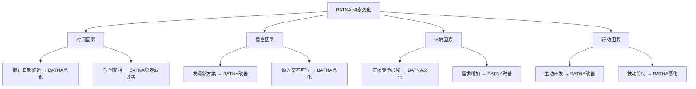
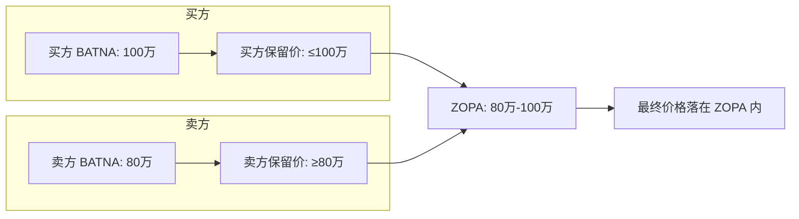
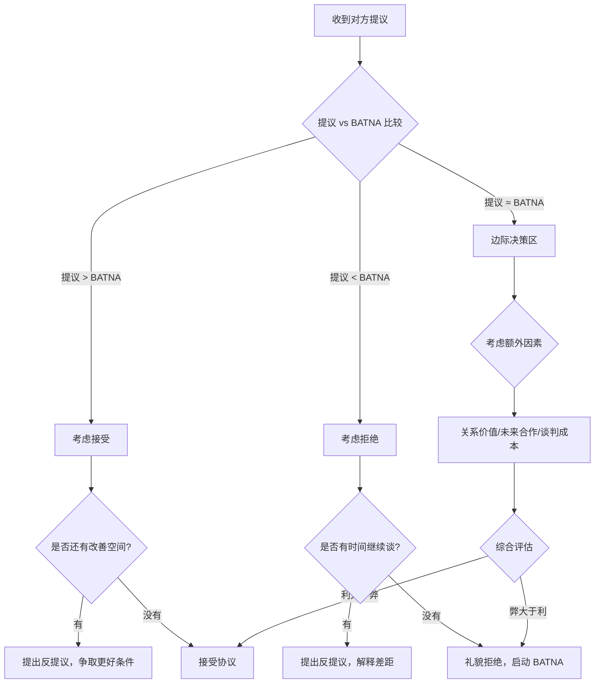

## 第三节 BATNA：最佳替代方案

BATNA 是谈判学中最核心的概念之一，也是区分业余谈判者与专业谈判者的关键分水岭。很多人在谈判桌上感到紧张、被动、不敢拒绝，根本原因不是口才不好，而是没有准备好 BATNA——或者根本不知道自己有没有。本节将系统讲解 BATNA 的原理、评估、开发、运用和进阶策略，帮助你建立真正的谈判底气。

### 3.1 BATNA 的概念框架

#### 3.1.1 什么是 BATNA

BATNA（Best Alternative to a Negotiated Agreement），中文译为"最佳替代方案"，指谈判者在当前谈判破裂时，能够采取的最优替代行动方案。这个概念由哈佛大学谈判项目（Harvard Negotiation Project）的罗杰·费舍尔（Roger Fisher）和威廉·尤里（William Ury）在 1981 年出版的经典著作《谈判力》（Getting to Yes）中首次系统阐述。

费舍尔和尤里之所以提出这个概念，是因为他们观察到一个普遍现象：大多数谈判者把注意力放在"对方能给我什么"上，却忽略了"如果对方不给我，我还能怎么办"。这种思维盲区导致谈判者在面对强势对手时毫无还手之力。

**一个简单的例子**：你去一家公司面试，对方开出月薪 8000 元。如果你手里只有一个 offer，你可能犹豫再三还是接受了。但如果你同时拿到了另外两家公司的 offer，分别是 10000 元和 12000 元，你的态度会完全不同——你可以自信地说"这个薪资低于我的预期"，因为你有 12000 元的 BATNA。BATNA 改变的不是你的口才，而是你的底气。

#### 3.1.2 BATNA 与相关概念的区别

很多谈判者混淆 BATNA 与其他几个关键概念，导致在实际操作中犯错。以下表格厘清它们之间的关系：

| 概念 | 全称 | 含义 | 与 BATNA 的关系 |
|------|------|------|-----------------|
| BATNA | Best Alternative to a Negotiated Agreement | 谈判破裂后的最佳替代方案 | 本体 |
| WATNA | Worst Alternative to a Negotiated Agreement | 谈判破裂后的最差替代方案 | BATNA 的底线参照 |
| ZOPA | Zone of Possible Agreement | 双方都能接受的协议区间 | BATNA 决定了你在 ZOPA 中的位置 |
| 保留价格 | Reservation Price | 你愿意接受的最低/最高价格 | 由 BATNA 推导得出 |
| 目标价格 | Target Price | 你期望达成的理想条件 | 独立于 BATNA 的期望值 |

**关键区别**：

- **BATNA ≠ 底线**：BATNA 是一个完整的替代方案（"我去找另一家公司"），而底线是一个数字或条件（"低于 9000 我不谈"）。底线由 BATNA 推导而来，但二者不是同一个东西。很多谈判者说"我的 BATNA 是 9000 元"，这是概念混淆——应该说"我的 BATNA 是接受另一家 10000 元的 offer，所以我的底线是 9500 元"。

- **BATNA ≠ 威胁**：BATNA 是你自己的退路，不是用来恐吓对方的武器。把 BATNA 当威胁使用（"你不答应我就走"）往往适得其反，因为对方可能测试你是否真的会走。正确做法是让对方感受到你有选择，但不直接说出来。

- **BATNA ≠ 愿望**：很多人把"我希望找到更好的"当成 BATNA，但没有实际行动。真正的 BATNA 是已经存在或正在推进的可行方案，不是空想。

#### 3.1.3 BATNA 的动态本质

BATNA 不是一成不变的。它会随着以下因素的变化而变化：

- **时间推移**：临近截止日期时，BATNA 会恶化。比如求职者在失业第 6 个月的 BATNA 远差于失业第 1 周的 BATNA。
- **信息获取**：了解到新的替代方案会改善 BATNA，发现原方案不可行会恶化 BATNA。
- **外部环境**：市场行情、竞争对手行动、政策变化都会影响 BATNA。
- **自身行动**：主动开发替代方案会改善 BATNA，被动等待会恶化 BATNA。

### 3.2 BATNA 的战略意义

#### 3.2.1 决策基准功能

BATNA 最基本的功能是为谈判者提供评估任何提议的基准。没有 BATNA 的谈判者就像没有锚的船，无法判断一个提议到底是好是坏。

**决策公式**：

- 协议价值 > BATNA 价值 → **接受协议**（因为你得到了比退路更好的结果）
- 协议价值 < BATNA 价值 → **拒绝协议，启动 BATNA**（因为退路比协议更好）
- 协议价值 = BATNA 价值 → **边际决策**（考虑谈判成本、关系维护等额外因素）

这个公式看起来简单，但在实际操作中有两个常见陷阱：

**陷阱一：忽略隐性成本。** 比较协议价值和 BATNA 价值时，不能只看表面数字。接受协议可能有隐性成本（如搬家、适应新环境），启动 BATNA 也可能有隐性成本（如时间、精力、机会成本）。必须把所有成本纳入计算。

**陷阱二：情绪干扰判断。** 当你已经在谈判中投入了大量时间和精力时（沉没成本效应），即使协议不如 BATNA，你也可能不愿意放弃。记住：已经投入的成本无法收回，决策应该只看未来的收益和成本。

#### 3.2.2 议价能力的来源

BATNA 是谈判力量最重要的来源之一，甚至可以说是最根本的来源。为什么？因为谈判的本质是选择——当你有更好的选择时，你不需要依赖对方，对方就失去了对你施压的杠杆。

**BATNA 如何影响谈判行为**：

| BATNA 质量 | 心理状态 | 行为表现 | 谈判结果 |
|------------|----------|----------|----------|
| 强大 | 自信、从容 | 敢于拒绝不合理要求，不急于妥协 | 更可能获得有利条件 |
| 一般 | 谨慎、焦虑 | 倾向于尽快达成协议，容易让步 | 结果取决于对方态度 |
| 弱势 | 紧张、依赖 | 害怕谈判破裂，频繁让步 | 容易接受不利条件 |
| 不存在 | 绝望 | 无论什么条件都接受 | 通常是最差结果 |

哈佛商学院的一项研究发现，在模拟谈判中，拥有强 BATNA 的谈判者平均获得比弱 BATNA 谈判者高出 15%-20% 的谈判价值。这不是因为他们的口才更好，而是因为他们在关键节点敢于说"不"。

**真实案例**：2014 年，特斯拉（Tesla）在选址建设超级工厂（Gigafactory）时，同时在内华达州、亚利桑那州、新墨西哥州、德克萨斯州和加利福尼亚州五个州进行选址谈判。这五个州互为彼此的 BATNA——每个州都知道如果自己不给出足够优惠的条件，特斯拉会去其他州。最终内华达州以 13 亿美元的税收优惠胜出，但如果没有其他四个州的竞争，特斯拉很难拿到如此优厚的条件。这就是 BATNA 在商业谈判中的威力。

#### 3.2.3 风险管理功能

BATNA 是谈判中最重要的风险管理工具。没有 BATNA 的谈判者面临的核心风险是"被迫接受比不谈判更糟糕的结果"——这在博弈论中被称为"赢家的诅咒"（Winner's Curse）的一种变体。

**没有 BATNA 的风险清单**：

1. **被锁定风险**：一旦对方知道你没有替代方案，他们会利用这一点压低条件。
2. **沉没成本陷阱**：投入越多越不舍得放弃，即使结果已经不如预期。
3. **时间压力风险**：没有退路的谈判者更容易在截止日期前做出非理性让步。
4. **情绪决策风险**：焦虑和恐惧导致判断力下降，做出后悔的决定。
5. **关系依赖风险**：过度依赖单一关系（供应商、客户、雇主），失去议价能力。

#### 3.2.4 BATNA 与 ZOPA 的交互关系

理解 BATNA 如何影响谈判区间（ZOPA），是掌握谈判策略的关键。

ZOPA（Zone of Possible Agreement）是双方保留价格之间的区间。BATNA 决定了保留价格，保留价格决定了 ZOPA 的边界。当双方的 BATNA 差距越大（即一方选择多、另一方选择少），BATNA 强的一方越能在 ZOPA 中争取到靠近对方保留价格的有利位置。

### 3.3 BATNA 的评估方法

很多谈判者知道自己"应该"有 BATNA，但不知道如何系统地评估 BATNA 的质量。以下是完整的评估框架。

#### 3.3.1 BATNA 评估的四维模型

评估任何替代方案的质量，需要从四个维度打分：

| 评估维度 | 关键问题 | 评分标准（1-5分） |
|----------|----------|-------------------|
| **可行性** | 这个方案能实现吗？ | 1=几乎不可能，5=已基本确定 |
| **成本** | 执行这个方案需要多少资源？ | 1=成本极高，5=成本很低 |
| **收益** | 这个方案能带来多大价值？ | 1=价值很低，5=价值很高 |
| **风险** | 这个方案的不确定性有多大？ | 1=风险极大，5=风险很小 |

**评估示例**：假设你在薪资谈判中，评估"接受另一家公司的 offer"这个替代方案：

- 可行性：4 分（已经拿到 offer，但需要体检等流程）
- 成本：3 分（需要搬家，适应新环境）
- 收益：4 分（薪资比当前高 20%）
- 风险：3分（新公司试用期有不确定性）
- 综合得分：(4+3+4+3)/4 = 3.5 分

#### 3.3.2 BATNA 质量等级划分

根据综合评估结果，BATNA 可以分为以下等级：

| 等级 | 综合得分 | 策略指导 |
|------|----------|----------|
| **A 级（优秀）** | 4.0-5.0 | 可以强势谈判，敢于拒绝，适度透露 BATNA |
| **B 级（良好）** | 3.0-3.9 | 可以自信谈判，保持适度强硬，模糊透露 BATNA |
| **C 级（一般）** | 2.0-2.9 | 需要谨慎谈判，避免暴露 BATNA 细节，专注改善 BATNA |
| **D 级（弱势）** | 1.0-1.9 | 需要优先改善 BATNA 再上谈判桌，谈判中绝对保密 |

#### 3.3.3 BATNA 评估清单

在进入任何重要谈判之前，用以下清单系统评估你的 BATNA 状态：

**第一层：方案识别**
- [ ] 我是否至少识别了 3 个替代方案？
- [ ] 这些方案是否涵盖了不同类别（如换供应商、自己生产、暂不采购）？
- [ ] 我是否咨询了同事、顾问或行业专家以发现盲点？

**第二层：方案评估**
- [ ] 我是否对每个方案进行了四维评估？
- [ ] 我是否考虑了隐性成本（时间、机会成本、关系成本）？
- [ ] 我是否评估了每个方案的时间窗口（是否有时效限制）？

**第三层：方案准备**
- [ ] 我的最佳替代方案是否已经启动或至少有了初步进展？
- [ ] 我是否有具体的行动计划来执行 BATNA？
- [ ] 我的 BATNA 是否得到了可信第三方的验证（如市场报价、行业数据）？

**第四层：信息管理**
- [ ] 我是否了解对方可能的 BATNA？
- [ ] 我是否准备好了关于 BATNA 的沟通策略？
- [ ] 我是否识别了可能影响 BATNA 的外部因素？

### 3.4 BATNA 的开发与强化

#### 3.4.1 BATNA 开发的四步法

**第一步：发散识别替代方案**

用头脑风暴的方式列出所有可能的替代方案，包括看似不现实的方案。关键原则是"先不评判，先穷尽"。

发散技巧：
- **类别切换法**：从不同类别思考替代方案。比如采购谈判中，替代方案可以是换供应商、自己生产、改变技术方案、推迟采购、减少需求量等。
- **逆向思考法**：如果谈判破裂，最坏的结果是什么？从最坏结果出发，逆向推导可能的出路。
- **跨界借鉴法**：其他行业或领域面对类似问题是怎么解决的？
- **专家咨询法**：向有经验的前辈、顾问或行业分析师请教，他们往往能看到你的盲点。

**第二步：收敛评估筛选**

对第一步产生的所有方案进行四维评估（可行性、成本、收益、风险），筛选出 top 3 方案。

**第三步：深化最佳方案**

对排名第一的方案进行深入开发：
- 制定详细的执行计划（Who/What/When/Where/How）
- 识别执行中可能遇到的障碍和解决方案
- 建立关键节点和里程碑
- 获取对方的初步承诺或意向（如另一家供应商的报价单）

**第四步：并行推进备选方案**

不要把所有希望寄托在一个 BATNA 上。同时推进排名第二和第三的方案，作为 BATNA 的 BATNA。这不仅提供了额外的安全网，还可能发现比原方案更好的选择。

#### 3.4.2 不同场景下的 BATNA 开发策略

**求职/薪资谈判场景**：

| BATNA 类型 | 具体方案 | 开发动作 | 优先级 |
|-----------|----------|----------|--------|
| 同行业 offer | 获得其他公司的 offer | 投递简历、面试、拿到书面 offer | 高 |
| 创业/自由职业 | 开始自己的业务或接单 | 注册平台、接小项目试水 | 中 |
| 继续深造 | 读研/读博/考证 | 申请学校、报名考试 | 中 |
| 现状维持 | 留在当前公司 | 与领导沟通加薪可能性 | 低 |

**供应商采购谈判场景**：

| BATNA 类型 | 具体方案 | 开发动作 | 优先级 |
|-----------|----------|----------|--------|
| 替代供应商 | 找到其他供应商 | 市场调研、索取报价、样品测试 | 高 |
| 自主生产 | 自己生产所需部件 | 评估建线成本、技术可行性 | 中 |
| 替代材料 | 使用替代材料或技术 | 技术评估、原型测试 | 中 |
| 暂不采购 | 推迟或取消采购需求 | 评估业务影响、寻找临时替代 | 低 |

**房产买卖谈判场景**：

| BATNA 类型 | 具体方案 | 开发动作 | 优先级 |
|-----------|----------|----------|--------|
| 其他房源 | 看其他合适的房子 | 实地看房、了解价格 | 高 |
| 租房过渡 | 先租房等待更好机会 | 了解租金行情、联系中介 | 中 |
| 自建房 | 在合适的地块自建 | 了解土地价格和建房流程 | 低 |
| 暂不购买 | 继续等待市场变化 | 分析市场走势、设定触发条件 | 中 |

#### 3.4.3 强化 BATNA 的五个策略

1. **并行探索**：不要串行地一个一个尝试，而是同时推进多个替代方案。就像投资需要分散风险一样，BATNA 也需要分散。同时接触 3-5 个潜在替代方案，比一个一个排队尝试效率高得多。

2. **资源投入**：BATNA 不会自己变强。你需要投入时间、精力甚至金钱来开发它。很多人抱怨自己的 BATNA 不够强，但从不花时间去改善——这就像抱怨武器不好却从不练习。具体行动包括：每周花固定时间拓展替代方案、为关键 BATNA 投入预算（如请猎头帮忙找工作）、建立和维护相关人脉。

3. **关系建设**：与潜在的替代合作伙伴保持关系。不要等到需要的时候才去联系。定期与行业内的其他供应商、客户、雇主保持互动，这样当你需要启动 BATNA 时，可以快速激活这些关系。

4. **信息收集**：持续收集关于替代方案的市场信息。了解行情、价格走势、竞争对手动态。信息是 BATNA 的基础——你知道的替代方案越多、越详细，你的 BATNA 就越强。

5. **能力提升**：增强自己执行替代方案的能力。如果 BATNA 是自主生产，就提前学习相关技术。如果 BATNA 是换行业，就提前积累目标行业的知识和技能。能力越强，BATNA 的可行性评分就越高。

### 3.5 BATNA 的运用策略

有了 BATNA 之后，如何在谈判中正确运用它，是一门需要精细把握的艺术。

#### 3.5.1 BATNA 沟通的三种模式

**模式一：直接披露**

适用条件：BATNA 非常强大且可信（有书面证明），对方也了解行业情况。

操作方式：坦诚而自信地说明你的替代方案。例如："我们收到了另外两家供应商的报价，分别是 X 和 Y。我们更希望和你们合作，但需要你们的报价有竞争力。"

效果：直接建立可信的议价立场。但风险是如果对方验证后发现你的 BATNA 没有那么强，会严重损害你的信誉。

**模式二：暗示引导**

适用条件：BATNA 中等偏强，不想完全暴露底牌。

操作方式：通过间接信息让对方感知你有替代方案。例如："我们在评估多个选择""市场上的选择比以前多了""我们的时间线允许我们再看看"。

效果：保留了灵活性，同时给对方施加适度压力。这是最常用的策略。

**模式三：完全保密**

适用条件：BATNA 较弱或不存在。

操作方式：不提及任何替代方案，专注于谈判本身的价值创造。把注意力放在"这个协议对我们双方有什么好处"上，而不是"我不接受会怎样"。

效果：避免暴露弱点，但需要注意不要被对方探测到你没有退路。

#### 3.5.2 探测对方 BATNA 的技巧

了解对方的 BATNA 和强化自己的 BATNA 同样重要。以下是几种有效的探测方法：

1. **开放式提问**："除了我们之外，你们还在考虑哪些选择？""如果这次没谈成，你们的计划是什么？"这些问题不会让对方觉得被冒犯，但能获得有价值的信息。

2. **市场调研**：通过公开信息、行业报告、人脉网络了解对方的替代方案。比如你是一家供应商，你了解到客户所在行业的其他供应商正在降价促销，那么客户的 BATNA 可能比你以为的更强。

3. **试探性提议**：提出一个略低于对方预期的条件，观察对方的反应。如果对方迅速拒绝并提到其他选择，说明他们有不错的 BATNA。如果对方犹豫不决，可能说明他们的 BATNA 不强。

4. **时间压力测试**：观察对方对时间的态度。如果对方不着急，说明他们有退路。如果对方不断催促，可能说明他们的时间窗口很紧，BATNA 在恶化。

#### 3.5.3 BATNA 运用的决策流程

### 3.6 BATNA 的心理学维度

#### 3.6.1 影响 BATNA 评估的认知偏差

人在评估自己的 BATNA 时，会受到多种认知偏差的影响：

**过度自信偏差**：高估自己 BATNA 的可行性和价值。比如"我肯定能找到更好的工作"，但实际上并没有开始投简历。纠正方法：用四维评估模型进行量化打分，用事实而非感觉来判断。

**损失厌恶偏差**：对启动 BATNA 的潜在损失过度敏感。比如"如果我拒绝这个 offer 去另一家公司，万一下一家不好怎么办？"这种恐惧会导致你接受不满意的协议。纠正方法：理性计算期望价值，接受适度的不确定性是正常的。

**锚定效应**：被第一次接触到的信息锚定，影响后续判断。比如第一个供应商报价 100 万，你就觉得 100 万是合理的，即使市场价可能是 80 万。纠正方法：在评估 BATNA 前先独立研究市场行情。

**沉没成本谬误**：因为已经在谈判中投入了大量时间精力，不愿意放弃即使不满意的协议。纠正方法：提醒自己过去的投入已经无法收回，决策应该只看未来的收益。

**现状偏好偏差**：倾向于维持现状，即使改变可能带来更好的结果。比如"虽然这个供应商不太好，但换供应商太麻烦了"。纠正方法：定期审视当前方案的实际成本，与替代方案进行客观比较。

#### 3.6.2 BATNA 与情绪管理

BATNA 不仅是理性的工具，也是情绪管理的工具。拥有强大 BATNA 的谈判者在谈判中表现得更加从容和自信，这种心理优势会转化为实际的谈判优势。

**无 BATNA 的情绪陷阱**：
- 焦虑："如果谈不成怎么办？"
- 恐惧："我不能失去这个机会。"
- 愤怒："对方太不公平了，但我没办法。"
- 绝望："我只能接受他们的条件。"

**有 BATNA 的情绪优势**：
- 从容："如果这个谈不成，我还有其他选择。"
- 自信："我不需要接受不合理的条件。"
- 平和："我可以耐心等待更好的机会。"
- 主动权："是我在选择，不是我在乞求。"

### 3.7 BATNA 的常见误区与纠正

#### 误区一：混淆 BATNA 与底线

**错误表现**："我的 BATNA 是 9000 元。"

**问题分析**：BATNA 是一个完整的替代方案，不是一个数字。9000 元可能是一个保留价格或底线，但它不是 BATNA 本身。

**正确表述**："我的 BATNA 是接受 B 公司 10000 元的 offer。基于这个 BATNA，我在当前谈判中的底线是 9500 元（需要一定的溢价来覆盖跳槽风险和转换成本）。"

#### 误区二：静态看待 BATNA

**错误表现**："我之前评估过 BATNA，够用了。"

**问题分析**：BATNA 是动态的。市场在变，对方的选择在变，你的选择也在变。一个月前评估的 BATNA 可能已经过时。

**纠正方法**：在重要谈判的每个关键节点重新评估 BATNA。尤其是在以下时刻：对方提出新条件时、谈判进入僵局时、外部环境发生变化时、时间窗口即将关闭时。

#### 误区三：过度依赖 BATNA

**错误表现**："我有很好的 BATNA，所以不需要认真准备谈判。"

**问题分析**：强大的 BATNA 可能导致过度自信，使谈判者错失比 BATNA 更好的协议。BATNA 是保底方案，不是最优方案。谈判的目标是获得比 BATNA 更好的结果。

**纠正方法**：始终把目标设定在高于 BATNA 的水平。用 BATNA 作为底线，但以创造最大价值为目标。

#### 误区四：忽视对方的 BATNA

**错误表现**："我只管自己的 BATNA，不需要考虑对方。"

**问题分析**：谈判是双向的。对方的 BATNA 决定了他们的底线和行为。不了解对方的 BATNA，你就不知道对方的让步空间有多大，也就无法制定有效的策略。

**纠正方法**：花至少 30% 的准备时间来分析对方的 BATNA。问自己：如果这次没谈成，对方会怎么做？对方还有什么其他选择？对方的时间压力是什么？

#### 误区五：虚构 BATNA

**错误表现**："我可以骗对方说我有其他选择。"

**问题分析**：虚构 BATNA 是高风险低收益的策略。一旦被识破，你的信誉将严重受损，对方会质疑你说的每一句话。在长期关系中（如供应商合作、企业合伙），这可能导致关系破裂。

**纠正方法**：永远不要编造 BATNA。如果你的 BATNA 不够强，把精力放在真正开发一个 BATNA 上，而不是编造一个。如果你确实有一些替代方案（即使不完美），可以用暗示的方式表达，而不需要夸大。

#### 误区六：BATNA 只关注价格

**错误表现**："我的 BATNA 就是找一个更便宜的。"

**问题分析**：BATNA 的价值是多维度的。价格只是其中一个因素。时间、质量、风险、关系、便利性都是重要的考虑因素。

**纠正方法**：用多维度来评估 BATNA。有时候一个价格略高但风险更低的替代方案，可能是更好的 BATNA。

### 3.8 进阶：BATNA 在复杂谈判中的应用

#### 3.8.1 多方谈判中的 BATNA

当谈判涉及三方或更多方时，BATNA 的分析变得更加复杂。你需要同时考虑自己的 BATNA 和每一方的 BATNA，以及各方之间的关系。

**多方谈判的 BATNA 矩阵**：

| 议题 | 我的 BATNA | 对方 A 的 BATNA | 对方 B 的 BATNA | 我的优势 |
|------|-----------|-----------------|-----------------|----------|
| 价格 | 另一家报价 85 万 | 无其他客户 | 有其他供应商 | 强 |
| 交期 | 可接受延迟 | 急需货物 | 不着急 | 中 |
| 质量 | 有替代材料 | 对质量要求高 | 可接受标准品 | 弱 |

通过这种矩阵分析，你可以针对不同议题制定不同的策略：在你 BATNA 强的议题上可以强硬，在你 BATNA 弱的议题上需要寻找其他杠杆。

#### 3.8.2 长期关系中的 BATNA 管理

在长期合作关系（如供应商管理、战略合作、雇佣关系）中，BATNA 的运用需要更加谨慎。过度强调 BATNA 可能损害信任关系，但完全没有 BATNA 又会让你处于被动。

**平衡策略**：
1. **内部准备，外部温和**：在内部做好 BATNA 的开发和评估，但在与长期合作伙伴的互动中保持建设性态度。
2. **定期审视，持续优化**：每年或每半年评估一次 BATNA，确保它仍然有效。
3. **多样化合作**：不要把所有鸡蛋放在一个篮子里。保持与 2-3 个潜在合作伙伴的关系，即使目前只与一个合作。
4. **价值创造优先**：在长期关系中，优先通过创造共同价值来改善结果，而不是通过威胁退出。

#### 3.8.3 BATNA 与锚定策略的结合

在谈判开始时，你可以将 BATNA 与锚定策略结合使用。具体做法是：在谈判初期，通过暗示你的 BATNA 来设定一个有利的锚点。

**示例**：你在与一家广告公司谈判营销服务费用。你的 BATNA 是另一家公司报价 50 万。你可以在开场时说："我们收到了几家公司的方案，价格区间在 45-60 万之间。我们更看重质量，但也需要价格在合理范围内。"这句话同时做了两件事：设定了一个价格锚点（45-60 万），并暗示你有替代选择。

### 3.9 BATNA 实操模板

以下是一个实用的 BATNA 准备模板，可以在任何重要谈判前填写使用：

**模板：BATNA 准备工作表**

┌─────────────────────────────────────────────────────┐
│                   BATNA 准备工作表                     │
├─────────────────────────────────────────────────────┤
│ 谈判主题：___________________                        │
│ 谈判对象：___________________                        │
│ 预计时间：___________________                        │
├─────────────────────────────────────────────────────┤
│ 一、我的替代方案                                      │
│                                                     │
│ 方案1：__________________                            │
│   可行性(1-5)：___ 成本(1-5)：___                     │
│   收益(1-5)：___  风险(1-5)：___ 综合：___            │
│   当前状态：□构想中 □已启动 □已确认                    │
│   需要的行动：___________________                    │
│                                                     │
│ 方案2：__________________                            │
│   可行性(1-5)：___ 成本(1-5)：___                     │
│   收益(1-5)：___  风险(1-5)：___ 综合：___            │
│   当前状态：□构想中 □已启动 □已确认                    │
│   需要的行动：___________________                    │
│                                                     │
│ 方案3：__________________                            │
│   可行性(1-5)：___ 成本(1-5)：___                     │
│   收益(1-5)：___  风险(1-5)：___ 综合：___            │
│   当前状态：□构想中 □已启动 □已确认                    │
│   需要的行动：___________________                    │
├─────────────────────────────────────────────────────┤
│ 二、我的 BATNA 评估                                   │
│                                                     │
│ 最佳方案：___________________                        │
│ BATNA 等级：□A级 □B级 □C级 □D级                      │
│ 保留价格/底线：___________________                    │
│ 目标价格：___________________                        │
├─────────────────────────────────────────────────────┤
│ 三、对方的 BATNA 分析                                 │
│                                                     │
│ 对方可能的替代方案：___________________               │
│ 对方的 BATNA 强度：□强 □中 □弱 □不确定                │
│ 对方的时间压力：□大 □中 □小 □不确定                   │
│ 对方可能的底线：___________________                   │
├─────────────────────────────────────────────────────┤
│ 四、沟通策略                                          │
│                                                     │
│ BATNA 披露策略：□直接 □暗示 □保密                     │
│ 关键话术：___________________                        │
│ 如果对方问起替代方案怎么回答：___________________      │
├─────────────────────────────────────────────────────┤
│ 五、风险预案                                          │
│                                                     │
│ 如果谈判破裂：___________________                    │
│ 如果对方有更强的 BATNA：___________________           │
│ 如果时间不够：___________________                    │
└─────────────────────────────────────────────────────┘

### 3.10 本节要点回顾

1. BATNA 是谈判破裂后的最佳替代方案，是谈判力量的根本来源。
2. BATNA ≠ 底线，≠ 威胁，≠ 愿望。它是一个可执行的完整方案。
3. 用四维模型（可行性、成本、收益、风险）系统评估 BATNA 的质量。
4. BATNA 是动态的，需要持续开发、强化和更新。
5. 运用 BATNA 时要根据强度选择沟通策略：强则适度透露，弱则绝对保密。
6. 避免六大误区：混淆底线、静态看待、过度依赖、忽视对方、虚构 BATNA、只看价格。
7. 在复杂谈判中，用 BATNA 矩阵分析多方博弈，在长期关系中平衡 BATNA 运用与关系维护。
8. 进入任何重要谈判前，先填写 BATNA 准备工作表。
