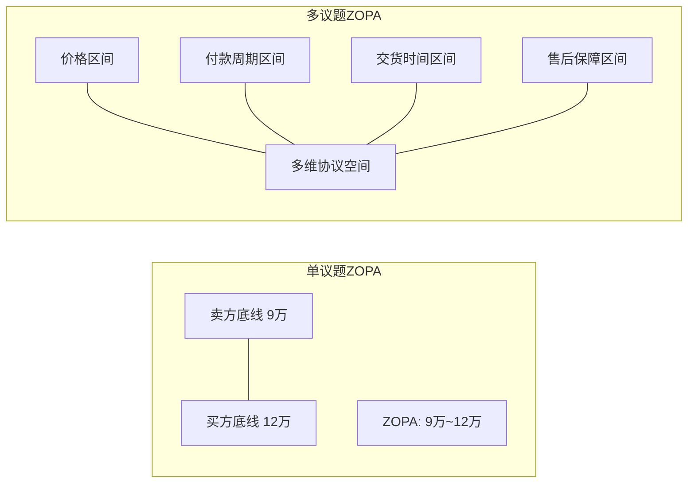
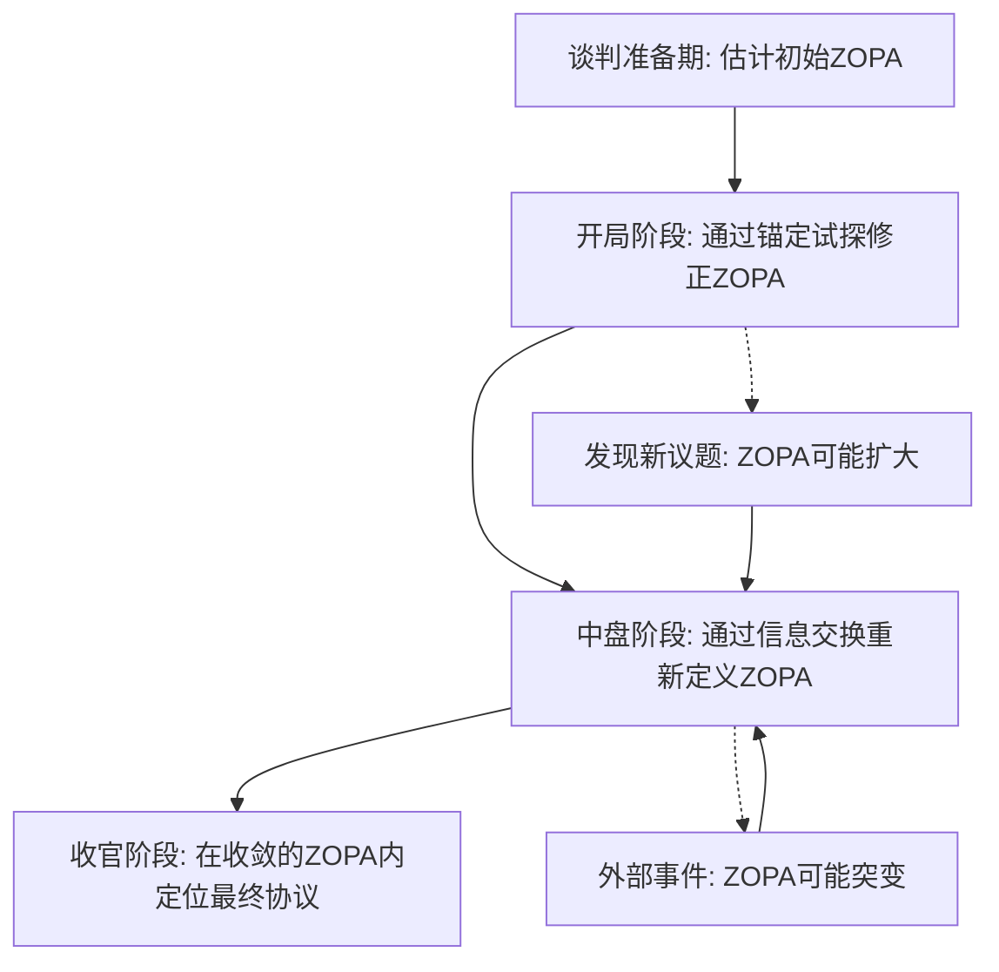

## 第四节 ZOPA：协议区间理论

ZOPA（Zone of Possible Agreement，协议区间）是谈判学中最核心的分析工具之一。它回答了一个根本性问题：这场谈判是否有可能达成协议？如果可能，最优解在哪个区间内？理解ZOPA不仅帮助你判断是否应该进入谈判，更能指导你在谈判桌上的每一个策略决策。

### 4.1 ZOPA的概念框架

ZOPA是指谈判各方可以达成协议的价格（或条件）区间。在这个区间内，最终协议对每一方而言都优于各自的BATNA（最佳替代方案）。ZOPA的存在是谈判能够成功的必要前提——没有ZOPA，再高超的谈判技巧也无法凭空创造价值。

**与BATNA的关系**：ZOPA和BATNA是同一枚硬币的两面。BATNA决定了你的底线在哪里，而ZOPA是各方底线之间的重叠区域。你的BATNA越强，你在ZOPA内获得有利位置的能力就越强。

#### 4.1.1 数学表达

设卖方的最低可接受价格为 S_min（卖方底线），买方的最高可接受价格为 B_max（买方底线）：

| 条件 | 结果 | 含义 |
|------|------|------|
| B_max > S_min | ZOPA = [S_min, B_max] | 存在正向协议区间，双方都有获利空间 |
| B_max < S_min | ZOPA不存在 | 双方底线无重叠，谈判在当前条件下无法达成 |
| B_max = S_min | ZOPA = 一个点 | 仅有一个可能的协议点，谈判空间极窄 |

**数值示例**：你打算买一辆二手车，最高愿意出12万元（你的BATNA是去4S店买新车，花费15万，因此你的B_max = 12万）。卖家的BATNA是继续开这辆车或者挂到二手车平台（平台抽成后到手约9万），因此S_min = 9万。ZOPA = [9万, 12万]，区间宽度为3万。最终成交价将落在这个区间内，具体位置取决于双方的谈判策略和信息掌握程度。

#### 4.1.2 多议题ZOPA

现实谈判往往涉及多个议题（价格、付款周期、交货时间、售后保障等），此时ZOPA从一维区间扩展为多维空间。多议题ZOPA的核心优势在于可以进行**价值交换**——在你不太在意的议题上让步，换取对方在你高度在意的议题上的让步。

**多议题ZOPA的计算要点**：每个议题都有各自的底线和优先级。当议题之间存在利益互补时（你对价格敏感而我对交期敏感），多议题ZOPA的总体空间会比逐个议题单独谈判时更大。这就是为什么**打包谈判**通常比**逐项谈判**更容易达成双赢。

### 4.2 ZOPA的动态特性

ZOPA不是一个静态的、在谈判开始前就固定不变的区域。它在整个谈判过程中持续变化，受到双方行为、外部事件和信息流动的多重影响。

#### 4.2.1 ZOPA的存在条件

ZOPA的存在取决于以下四个关键因素：

**1. BATNA的质量差异**
双方BATNA的优劣对比决定了底线的位置。如果一方的BATNA极差（比如急需用钱的卖家），其底线会更低，ZOPA向对其不利的方向扩展。BATNA质量差异越大，ZOPA越宽，但BATNA弱的一方在ZOPA内的议价能力也越低。

**2. 价值评估差异**
同一事物对不同人有不同的主观价值。一家创业公司对你来说可能只值500万（基于财务模型），但对战略买家来说可能值2000万（基于协同效应）。这种评估差异直接创造了巨大的ZOPA。

**3. 风险偏好差异**
风险厌恶型的谈判者会接受更低的确定性回报，而风险偏好型的谈判者会追求更高但不确定的回报。同样的ZOPA在不同风险偏好下，实际谈判区间会有所不同。

**4. 时间压力的不对称性**
谁更急迫，谁的底线就会移动。供应商月底冲业绩时，其S_min会下降；买方生产线等米下锅时，其B_max会上升。时间压力是ZOPA动态变化的最大驱动力之一。

#### 4.2.2 ZOPA的大小影响因素

**扩大ZOPA的因素**：

- **议题数量增加**：每增加一个可交换的议题，就增加了一个价值创造的维度。采购谈判中除了价格，还可以谈付款账期、物流费用、质量保证、独家供货权等
- **创造性解决方案**：跳出固有框架寻找新选项。例如用版税替代一次性付款、用联合开发替代直接采购
- **客观标准引入**：引入行业基准、市场价格指数、第三方评估报告等客观参照系，可以拉近双方的价值评估差距
- **信息的充分交换**：双方越了解对方的需求和约束，越能找到互利方案。信息不对称往往导致ZOPA被错误估计
- **关系资本的积累**：长期合作的信任关系可以降低交易成本，相当于间接扩大了ZOPA

**缩小ZOPA的因素**：

- **立场僵化**：双方固守初始立场不愿调整，人为压缩了实际可用的谈判空间
- **信息不透明**：互相隐瞒真实意图和底线，导致双方都高估了对方的底线，ZOPA被主观缩小
- **过度竞争心态**：零和思维导致双方只关注分配而忽视创造，把原本可以做大的蛋糕限制在固定大小
- **锚定效应的扭曲**：极端的初始报价可能导致对方产生敌意，反而缩紧了对方的底线
- **外部约束条件**：法规限制、上级审批、预算上限、合规要求等硬性约束会收窄ZOPA
- **情绪因素**：愤怒、不信任、面子问题等情绪因素会让一方拒绝接受本来可以接受的条件

#### 4.2.3 ZOPA的时序演变

**关键认知**：成熟的谈判者不会把ZOPA的估计视为一次性工作。他们会在每个阶段根据新获得的信息重新评估ZOPA，并据此调整策略。

### 4.3 ZOPA的识别与定位

识别ZOPA是谈判准备中最关键的环节。错误的ZOPA估计会导致两种致命后果：一是以为没有ZOPA而放弃了一场本来可以成功的谈判；二是在ZOPA之外进行了大量无用的讨价还价。

#### 4.3.1 信息收集策略

识别ZOPA的本质是信息博弈——你需要尽可能准确地估计对方的底线，同时保护自己的底线不被探知。

**关于对方的信息**（最重要）：

- **对方的BATNA是什么？** 这是推算对方底线的关键。如果对方的BATNA是和你的竞争对手签约，你需要了解竞争对手的报价范围
- **对方的真正需求和优先级是什么？** 对方嘴上说的和实际想要的可能完全不同。采购经理说"价格第一"，但实际可能更怕交货延迟影响其KPI
- **对方的决策标准和审批流程是什么？** 了解对方内部的决策机制可以帮你判断哪些条件有弹性，哪些是硬约束
- **对方的时间压力和约束条件？** 对方是否有deadline？是否有内部预算周期？是否有竞争对手在施压？

**关于市场的信息**：

- **可比交易数据**：同类产品/服务在市场上的成交价格区间是多少？行业报告、公开招标记录、新闻报道都是数据来源
- **行业惯例和标准**：付款账期通常怎么定？折扣率通常多少？保修期通常多久？这些惯例就是ZOPA的参考坐标
- **市场供需状况**：买方市场还是卖方市场？供需关系直接决定ZOPA的整体偏向

**关于自己的信息**：

- **我方的BATNA是什么？** 这决定了你的底线，是整个ZOPA分析的出发点
- **我方各议题的优先级和弹性？** 哪些议题是我方绝对不能让步的？哪些是可以交换的筹码？
- **我方对不同方案的价值评估？** 建立内部的量化评分体系，为后续的价值交换做准备

#### 4.3.2 ZOPA定位技术

**试探性提议法**

通过提出试探性提议并观察对方反应来推断ZOPA边界。核心是设计"探测气球"——看似随意的提议，实际经过精心设计以获取最大信息量。

操作要点：试探性提议应贴近你估计的对方底线附近，但不要太极端。如果对方迅速拒绝，说明你在ZOPA之外；如果对方犹豫但没有拒绝，说明你正在接近ZOPA的边界；如果对方开始还价，说明你在ZOPA之内。

**假设性提问法**

通过提出假设性问题来探索对方的底线，而不暴露自己的底线。常用话术包括：

- "如果付款周期从30天延长到60天，价格方面是否还有商量的余地？"
- "如果我们一次性采购量翻倍，单价能做到什么水平？"
- "假设我们把合同期从一年改为三年，你的报价会怎么调整？"

这些问题的价值在于：它们在不暴露底线的前提下，通过改变条件来试探对方在不同议题上的弹性。

**第三方信息法**

通过市场调研、行业报告、公开数据、中间人信息等第三方渠道来估计ZOPA。这是最安全的信息收集方式，因为不涉及直接试探对方。

**锚定探测法**

提出一个极端但合理的初始报价，观察对方的反应强度和反驳理由。对方的反应包含大量信息——如果对方说"这个价格太离谱了，我们从来没做过这么低的"，你就可以推断对方的实际交易价格区间。

**历史数据分析法**

分析类似谈判的历史数据来预测ZOPA。如果你所在的企业有多次同类采购记录，历史成交价就是ZOPA的最佳参考。如果缺乏自有数据，行业公开数据、招标公告、财务报表中的相关数据都可以作为分析基础。

### 4.4 ZOPA内的策略定位

确认ZOPA存在后，下一个问题是：在ZOPA内，你应该占据什么位置？这个位置直接决定了你从协议中获得的价值大小。

#### 4.4.1 锚定策略

锚定效应（Anchoring Effect）是行为经济学中最稳健的发现之一：人们的判断会被最初接收到的信息强烈影响。在谈判中，谁先提出报价，谁就在ZOPA内设置了锚点。

**锚定的科学原理**：Kahneman和Tversky的经典实验表明，即使锚点是随机生成的数字（比如转盘上的数字），也会显著影响人们对后续问题的估计。在谈判中，初始报价作为锚点的影响力更强，因为它被赋予了合理的意义。

**锚定操作指南**：

1. **锚点应极端但合理**：极端到对你有利但不会让对方直接离场。合理意味着你能为这个价格/条件提供至少3个有说服力的理由
2. **锚点应接近ZOPA的边界**：理想的锚点位于对你最有利的ZOPA边界附近。如果你是卖家，锚点应靠近B_max；如果你是买方，锚点应靠近S_min
3. **先发锚定优于后发**：在信息充足的情况下，抢先报价可以设置对你有利的谈判基准。但在信息极度不对称时，让对方先报价可以帮助你获取信息
4. **锚点需要叙事支撑**：一个没有理由的极端报价会被视为不专业。准备一组有说服力的理由来支撑你的锚点（市场数据、成本分析、差异化价值等）

**应对对方锚定的反制策略**：

- **立即重新锚定**：提出自己的报价，用新的锚点覆盖对方的锚点
- **质疑锚点的合理性**：通过提问拆解对方报价的依据，削弱其锚定效应
- **搁置议题**：先讨论其他议题，降低初始锚点的心理影响力
- **引入客观标准**：用市场数据、行业基准等客观参照来中和极端锚点

#### 4.4.2 让步策略

让步是谈判中最核心的行为，每一次让步都在传递信息。糟糕的让步模式会暴露你的底线，压缩你的收益。

**让步的五项原则**：

1. **递减让步**：每次让步的幅度应该逐渐减小。这向对方传递的信号是"我在接近底线"。例如：先让5000，再让2000，再让500，最后让100。反过来，如果你的让步越来越大，对方会认为你还有很大的让步空间

2. **有条件让步**：永远不要无条件让步。每次让步都要换取对方的对等让步。话术模板："如果你能接受X条件，我可以在Y议题上做出调整"。这确保了让步是价值交换而非单方面退让

3. **有节奏让步**：不要在压力下快速做出一系列让步，也不要故意拖延让对方失去耐心。理想的节奏是在每次让步之间留出足够的思考和讨论时间

4. **有理由让步**：每次让步都要给出一个合理的理由（成本变化、竞争压力、对长期合作的考虑等）。无理由的让步会被视为底线还很远

5. **不等价交换**：在不同议题之间进行不等价交换。用你不太在意的议题让步，换取对方在你高度在意的议题上的让步。这要求你提前做好议题优先级排序

**常见让步模式对比**：

| 模式 | 示例（总让步空间100） | 传递的信号 | 效果评估 |
|------|----------------------|------------|----------|
| 递减型 | 40→30→20→10 | 接近底线 | 优秀：引导对方快速成交 |
| 均匀型 | 25→25→25→25 | 还有空间 | 差：对方会继续施压 |
| 递增型 | 10→20→30→40 | 底线很远 | 极差：对方会持续索取 |
| 一次性让步 | 100→0→0→0 | 一步到底 | 灾难：对方认为你还有空间 |

#### 4.4.3 信息管理策略

在ZOPA内定位的核心是信息管理。你需要保护自己的底线信息，同时尽可能多地探知对方的底线信息。

**保护己方信息的策略**：

- 提前确定哪些信息是绝对不能透露的（底线、BATNA详情、内部预算）
- 准备好"模糊回应话术"应对对方的直接探测："这个数字我们需要内部讨论"、"这取决于整体方案的综合条件"
- 避免在非正式场合（餐叙、闲聊）泄露敏感信息

**获取对方信息的策略**：

- 多问开放式问题，让对方多说
- 关注对方的非语言信号（犹豫、皱眉、停顿可能暗示接近对方底线）
- 通过多轮小额试探逐步逼近对方的真实底线
- 利用"假设性提问"在不暴露自身意图的情况下探测对方弹性

### 4.5 ZOPA不存在时的策略

当分析显示不存在ZOPA时，不意味着谈判必须终止。成熟的谈判者有多种手段来创造或发现ZOPA。

#### 4.5.1 创造ZOPA的五种路径

**路径一：扩大议题范围**

单一议题（如价格）没有ZOPA时，通过引入更多议题来创造交换空间。案例：一家SaaS公司和客户在年费价格上僵持不下（客户预算80万，公司底价100万）。通过引入"合同期限延长至3年"、"包含实施服务"、"优先技术支持"等议题，最终以年费85万+3年合同+首年免费实施达成协议——公司获得了长期稳定收入，客户获得了更低的年度总成本和附加价值。

**路径二：引入创造性解决方案**

跳出"只谈价格"的框架寻找新方案。经典案例：两家公司争一块地皮，一方要建工厂（需要大面积平坦用地），另一方要建酒店（需要临街面）。看似零和竞争，但实际可以分区使用——工厂在后方，酒店在临街面，ZOPA从不存在变为双方满意。

**路径三：改变各方的BATNA**

如果你能改善自己的BATNA（比如找到更好的替代供应商），你的底线会上移，ZOPA可能产生。反之，如果你能让对方的BATNA变差（比如让对方了解到其替代方案的风险），对方的底线会下移。

**路径四：引入客观标准**

当双方的主观评估差异过大时，引入第三方评估、行业标准、市场基准等客观参照系可以缩小评估差距。例如在企业估值谈判中，引入独立的财务审计和行业PE倍数作为定价参考。

**路径五：时间维度的变化**

暂时搁置谈判，等待外部环境变化。市场行情变动、政策调整、竞争格局变化等外部事件可能改变各方的BATNA，从而创造新的ZOPA。

#### 4.5.2 ZOPA不存在时的退出决策

并非所有谈判都值得坚持。当以下条件同时满足时，理性选择是退出：

- 已经尝试了所有创造ZOPA的路径
- 自己的BATNA优于任何可能达成的协议
- 继续谈判的时间成本和机会成本过高
- 对方的底线位置有明确证据支撑，不存在估计误差

**退出的话术设计**：退出不等于关系破裂。好的退出话术应该为未来合作留下空间："基于目前的条件，我们暂时无法达成一致。如果未来情况有变化，我们随时欢迎继续讨论。"

### 4.6 多方谈判中的ZOPA

当谈判参与者超过两方时，ZOPA的分析变得更加复杂。多方ZOPA需要同时满足所有参与方的底线要求。

#### 4.6.1 多方ZOPA的特殊挑战

- **联盟动态**：任意两方可能结盟对第三方施压，ZOPA随联盟组合变化
- **信息复杂度指数增长**：N方谈判的信息量是双方谈判的N倍
- **决策规则多样**：一致同意、多数票决、加权投票等不同决策规则对ZOPA的影响不同
- **策略互动更难预测**：一方的行为可能同时影响其他所有方的底线

#### 4.6.2 多方ZOPA的管理策略

**议题分解法**：将大谈判拆解为多个双边谈判，逐个确定各议题的ZOPA，再进行综合打包。

**联盟管理**：识别潜在联盟，主动参与或拆解联盟以维护己方利益。在多方谈判中，"谁和谁站在一起"往往比"具体条件是什么"更重要。

**程序性安排**：通过设定议程、讨论顺序、投票规则等程序性安排来引导ZOPA向有利于己方的方向移动。

### 4.7 ZOPA分析的常见误区

**误区一：把ZOPA估计当作精确数字**

ZOPA的边界是模糊的估计值，不是精确数字。对方的底线会随信息、情绪、外部事件变化。正确做法是把ZOPA当作一个有弹性的范围，而不是一条精确的线。

**误区二：只关注价格议题**

把ZOPA简化为"价格区间"是最常见的错误。现实中任何议题都有各自的ZOPA，而且议题之间存在联动关系。一个议题上的让步可能改变另一个议题的ZOPA。

**误区三：忽视自己的底线变化**

谈判者往往花大量精力去估计对方的底线，却忽视自己的底线也在变化。沉没成本效应会让你在已经投入大量时间和精力后不愿退出，相当于变相降低了你的底线。

**误区四：过早暴露底线**

一旦对方知道你的底线，你在ZOPA内的议价能力就几乎为零。底线信息的保护应该贯穿整个谈判过程，而不仅仅是在开局阶段。

**误区五：把ZOPA当作固定分配**

ZOPA不是一个需要"切分"的固定蛋糕。通过议题交换、创造性方案、长期关系建设，ZOPA的总体空间是可以扩大的。固定分配思维是达成最优协议的最大障碍。

### 4.8 ZOPA分析实操模板

在进入正式谈判前，使用以下模板系统化地完成ZOPA分析：

**第一步：识别所有议题**

列出本次谈判涉及的所有议题，并为每个议题标注优先级（高/中/低）。

| 议题 | 我方优先级 | 我方理想值 | 我方底线 | 对方估计底线 | 对方估计优先级 |
|------|-----------|-----------|---------|-------------|---------------|
| 议题1 | 高 | | | | |
| 议题2 | 中 | | | | |
| 议题3 | 低 | | | | |

**第二步：评估各方BATNA**

写下己方和对方的最佳替代方案，评估其质量（强/中/弱）。

**第三步：估计ZOPA**

为每个议题估计协议区间，标注确信度（高/中/低，取决于信息充分程度）。

**第四步：设计谈判策略**

根据ZOPA分析结果，确定锚点位置、让步模式、信息收集优先级和可能的价值交换方案。

**第五步：设定退出条件**

明确在什么条件下应该退出谈判，避免因沉没成本而接受劣于BATNA的协议。

### 4.9 本节小结

ZOPA分析是谈判准备的核心框架。它将模糊的"能不能谈成"转化为可分析、可估计、可操作的系统性工作。掌握ZOPA理论需要理解以下要点：

1. **ZOPA是谈判成功的必要前提**——没有ZOPA意味着在当前条件下无法达成双方都满意的协议
2. **ZOPA是动态的**——它随信息、行为、外部事件持续变化，需要在整个谈判过程中反复评估
3. **ZOPA是多维的**——多议题谈判中的ZOPA是多维空间，议题交换可以扩大总体空间
4. **ZOPA是可创造的**——当初始分析显示ZOPA不存在时，通过扩大议题、引入创新方案、改变BATNA等手段可以创造ZOPA
5. **ZOPA分析是信息博弈**——保护己方底线的同时探知对方底线，是ZOPA定位的核心技能
6. **ZOPA内的定位决定了你的收益份额**——锚定策略、让步策略和信息管理策略共同决定了你在ZOPA内最终占据的位置

ZOPA与BATNA的配合使用，构成了谈判策略的完整分析框架：BATNA告诉你"什么时候该走"，ZOPA告诉你"如果留下，最优解在哪里"。
