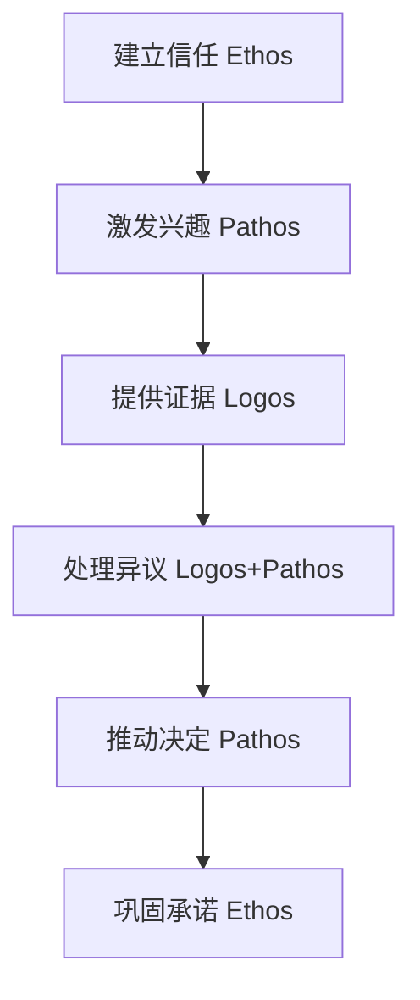

## 第五节 谈判心理学

谈判的本质是人与人之间的心理博弈。无论谈判标的是一笔数十亿的并购交易，还是一次薪资协商，最终决定结果的往往不是条款本身，而是双方心理力量的对比与运用。理解谈判心理学，不是为了操纵对手，而是为了更清醒地认识自己和对方的决策机制，从而做出更理性的判断、争取更公平的结果。

本节将系统性地拆解谈判中涉及的核心心理机制——从认知偏差到情绪管理，从说服原理到博弈策略，从个体心理到跨文化差异——为读者提供一套完整的谈判心理学知识框架。

---

### 5.1 谈判心理学的理论基础

#### 5.1.1 双系统思维与谈判决策

诺贝尔经济学奖得主丹尼尔·卡尼曼（Daniel Kahneman）在《思考，快与慢》中提出的双系统理论，是理解谈判心理的基石。

| 维度 | 系统1（快思维） | 系统2（慢思维） |
|------|----------------|----------------|
| 运作方式 | 自动、直觉、无意识 | 手动、分析、有意识 |
| 速度 | 毫秒级 | 秒到分钟级 |
| 能耗 | 低（节省认知资源） | 高（消耗脑力） |
| 谈判中的表现 | 判断对方是否可信、感知威胁、产生情绪反应 | 分析报价合理性、计算让步空间、制定策略 |
| 常见偏差 | 锚定效应、首因效应、光环效应 | 确认偏差、沉没成本谬误 |
| 可靠性 | 快速但容易出错 | 慢速但更准确 |

**谈判中的双系统冲突**：

在高压谈判环境中，系统1主导决策是最大的隐患。例如：对方突然抛出一个极低的报价，系统1会立刻产生愤怒和抵触情绪，导致谈判者做出冲动回应（如直接拒绝或威胁离场）。而系统2的正确反应应该是：暂停——分析对方为何给出这个报价——评估自己是否有更好的替代方案——再做出理性回应。

**实践方法：谈判中的"双系统检查清单"**

1. 收到对方提议后，先等待10秒再回应（给系统2启动时间）
2. 问自己："如果没有情绪干扰，我会怎么看待这个提议？"
3. 用数据和事实验证直觉判断
4. 在重大决策前，要求暂停休息（"我需要和团队讨论一下"）
5. 建立"决策日志"，记录每次重大决策的依据，事后复盘

#### 5.1.2 前景理论与谈判价值评估

卡尼曼和特沃斯基（Tversky）的前景理论（Prospect Theory）揭示了人类在风险决策中的三个关键规律：

**规律一：参照点依赖**

人们对结果的评估不是基于绝对值，而是基于相对于某个参照点的变化。在谈判中，这意味着：
- 如果你先报价100万，对方砍到80万，对方觉得自己"赚了"20万
- 如果你先报价60万，最终80万成交，对方觉得自己"亏了"20万
- 同样的80万成交价，心理感受完全不同

**实战应用**：管理参照点是谈判的核心技术。永远不要让对方把"最理想结果"设为参照点。在开场时通过信息铺垫，将对方的参照点引导到一个对你有利的位置。

**规律二：损失厌恶系数**

实验反复证实，损失的心理痛苦约是同等收益的2到2.5倍。这在谈判中有深远影响：
- 让步的痛苦 > 获得对等让步的快乐 → 谈判者倾向于过度坚持
- "不成交"被感知为"损失"时，会让步更多 → 将不成交的后果框架化为损失
- 已投入的沉没成本被当成"损失"，不愿放弃 → 导致非理性的坚持

**规律三：确定性效应**

人们对确定的结果赋予不成比例的权重。在谈判中：
- "保证给你X"比"很可能给你X"有更大的心理影响力
- 确定的小让步比不确定的大让步更能促进协议
- 这也是为什么"锁定"已达成的共识如此重要

#### 5.1.3 心理契约与隐性期望

心理契约（Psychological Contract）是谈判中经常被忽略的维度。除了白纸黑字的正式协议，双方还存在大量未明说的心理期望：

- **公平期望**：我让步了，你也应该让步
- **尊重期望**：我的观点应该被认真对待
- **时间期望**：谈判应该在合理时间内完成
- **信任期望**：你提供的信息应该是真实的
- **关系期望**：谈判结束后我们应该保持良好关系

当心理契约被破坏时，即使正式协议达成，执行阶段也会出现问题。对方可能在执行中消极抵抗、寻找借口拖延、或者在下一次谈判中采取报复性立场。

**如何管理心理契约**：
1. 在谈判开始时明确双方的期望和底线
2. 在过程中主动管理对方的期望值
3. 让步时确保对方感知到公平性（"我对等让步"）
4. 结束时确认双方的心理感受，而非仅确认条款

---

### 5.2 认知偏差在谈判中的影响

认知偏差是系统性偏离理性的思维模式。在谈判的高压环境下，这些偏差会被放大。以下是谈判中最关键的12种认知偏差。

#### 5.2.1 锚定效应（Anchoring Effect）

**定义**：人们在做决策时，会过度依赖最初获得的信息（锚点），即使这个信息可能不相关或不准确。

**经典实验**：特沃斯基和卡尼曼的"幸运轮实验"——让受试者看一个随机数字（如65或10），然后估计联合国中非洲国家的比例。看到65的组平均估计45%，看到10的组平均估计25%。完全随机的数字深刻影响了判断。

**在谈判中的具体表现**：
- 先报价的一方往往占据优势，因为后续的讨价还价围绕这个锚点展开
- 即使锚点明显不合理（如漫天要价），最终成交价也会向锚点方向偏移
- 缺乏经验的谈判者更容易被锚点"锁住"，不敢大幅偏离对方的初始报价
- 锚定效应在信息不对称时更显著——你知道得越少，越依赖对方提供的锚点

**主动运用策略**：

1. **抢先设定锚点**：如果你对市场有充分了解，争取先报价。锚点应设在对你有利但不至于吓跑对方的位置。研究表明，极端但有理由支撑的锚点比温和的锚点更有效。
2. **破坏对方的锚点**：当对方先报价时，不要在其基础上讨价还价。明确表示"这个数字与我的理解差距很大"，然后用你自己的数据重新设定锚点。
3. **多锚点稀释策略**：引入多个参考数据点（行业标准、竞争对手报价、历史交易数据），削弱单一锚点的影响力。例如："根据A公司的报价、行业平均水平和去年的合同价格，合理范围应该在X到Y之间。"
4. **"走开"锚点**：设定一个BATNA（最佳替代方案），让对方知道如果价格不在此范围内你会直接离开。这等于设定了一个"底线锚"。

**防御策略**：
- 识别锚点：意识到对方正在设定锚点，提醒自己这个数字可能是策略性的
- 用自己的分析取代：在进入谈判前做好功课，建立自己的价值评估体系
- 延迟反应：不要立即对锚点做出回应，给自己时间分析

#### 5.2.2 框架效应（Framing Effect）

**定义**：同一个问题，用不同的方式呈现，会导致不同的决策结果。

**经典实验**："亚洲疾病问题"——600人面临一种致命疾病。方案A："确定救活200人"vs方案B："1/3概率救活600人，2/3概率无人获救"。大多数人选择A。但换一种表述："400人确定死亡"vs"1/3概率无人死亡，2/3概率600人死亡"，大多数人选择B。两个问题的数学期望完全相同，但框架不同导致选择逆转。

**在谈判中的表现与应用**：

| 场景 | 损失框架（更可能引发风险偏好） | 收益框架（更可能引发保守选择） |
|------|-------------------------------|-------------------------------|
| 降价请求 | "如果我们降价，我们将损失X万利润" | "如果我们维持价格，我们将获得X万利润" |
| 合同条款 | "缺少这个条款，你将面临X风险" | "加上这个条款，你将获得X保障" |
| 时间压力 | "如果不今天签约，明天这个优惠就没了" | "今天签约的话，你将获得额外优惠" |
| 让步策略 | "我无法再降了，否则我要亏本" | "我可以给你这个优惠，虽然我的利润很薄" |

**高级框架技术**：

1. **重新定义谈判标的**：不要在"价格"这个单一框架里争。引入"总成本""长期价值""风险分担""付款条件"等框架，将零和博弈变为多维度的价值创造。
2. **参照系转换**：将你的提议与更大的参照系对比。"这个项目需要100万，但它解决的问题每年造成500万的损失。"
3. **时间框架**：将一次性支出框架化为每日成本。"每天只需270元"比"每年10万"听起来友好得多。
4. **社会框架**：将个人利益框架化为群体利益。"这不仅对你个人有利，对你整个部门的KPI都有帮助。"

#### 5.2.3 确认偏差（Confirmation Bias）

**定义**：人们倾向于寻找、解释和记住那些证实自己已有信念的信息，而忽视或贬低相反的证据。

**在谈判中的致命影响**：

确认偏差是谈判中最危险的偏差之一，因为它会形成信息茧房：

- **信息选择偏差**：你只收集支持自己立场的数据，忽略反面证据
- **解释偏差**：对方说了模棱两可的话，你倾向于往支持自己的方向解读
- **记忆偏差**：记住对方说过的对你有利的话，忘记不利的话
- **过度自信**：因为只看到支持性证据，你对自己的立场过度自信
- **战略误判**：因为低估对方的论点，你没有准备好应对策略

**案例**：某公司在收购谈判中，买方团队坚信目标公司被低估了。他们只关注了目标公司的营收增长数据，忽略了利润率下降和客户集中度过高的风险。收购完成后，才发现核心客户在谈判期间就已经在考虑更换供应商。

**系统性克服方法**：

1. **红队演练**：指派团队成员扮演对方，专门找自己立场的漏洞。要求他们用最强的论点反驳你。
2. **预设失败分析**：在谈判前问自己："如果我的判断是错的，最可能错在哪里？"
3. **外部视角**：寻求与本次谈判无利益关系的第三方意见。
4. **强制对立面**：每个支持自己立场的论点，都要求自己写出至少一个反驳论点。
5. **信息审计**：定期检查自己收集的信息是否平衡——你是否只看了支持自己的数据？

#### 5.2.4 损失厌恶（Loss Aversion）

**定义**：人们对损失的敏感度远高于对同等收益的敏感度。大量实验反复证实，损失带来的心理痛苦约是同等收益带来的快乐的2到2.5倍。

**在谈判中的深层影响**：

损失厌恶不仅影响决策，还扭曲了谈判者的整个行为模式：

- **让步僵化**：每个让步都被感知为"损失"，导致谈判者过度坚持，即使让步是理性的
- **现状偏好**：人们倾向于维持现状，因为改变意味着可能的损失
- **禀赋效应**：人们对自己拥有的东西赋予过高价值（"我的东西值更多"），导致不合理的要价
- **沉没成本陷阱**：已经投入的时间、精力和金钱被当作"损失"，不愿放弃一个注定失败的谈判
- **风险规避的非对称性**：在收益领域规避风险（见好就收），在损失领域追求风险（孤注一掷）

**利用策略（伦理范围内）**：

1. **收益损失重述**：将你的提议框架化为"避免损失"而非"获得收益"。"如果我们无法达成协议，你将失去X、Y、Z"比"如果你同意，你将获得X、Y、Z"更有说服力。
2. **渐进让步**：将大让步拆分为小让步。一次性让步10万与分三次让步3万+3万+4万相比，后者的总让步更大，但对方感知到的"损失"更小。
3. **锁定已达成共识**：在谈判中一旦达成某个条款，立刻记录下来。这创造了"已有收益"，让对方不愿意为修改它而"损失"已有的进展。
4. **创造"失去"的紧迫感**：强调当前优惠的时效性，激活对方的损失厌恶。

**防御策略**：
- 区分"真正的损失"和"感知的损失"——问自己："如果这是一个全新的提案，我会接受吗？"
- 对沉没成本保持警觉——已经投入的不应该影响未来的决策
- 建立客观的评估标准，减少主观感受的影响

#### 5.2.5 过度自信偏差（Overconfidence Bias）

**定义**：人们倾向于高估自己的知识、能力和判断的准确性。

**三种表现形式**：

1. **过度精确**：对自己估计的范围过于狭窄。例如，你认为价格会在90-100之间，但实际波动范围是70-120。
2. **过度置信**：对自己判断的正确性过度确信。"我肯定对方会接受这个报价"——但实际接受率只有60%。
3. **优于平均效应**：认为自己在各方面都优于平均水平。87%的MBA学生认为自己的成绩在班级前50%。

**对谈判的具体危害**：
- 准备不充分（"我已经知道对方会怎么做"）
- 低估对方的替代方案和底线
- 过于乐观估计谈判结果，没有准备B计划
- 在应该让步时坚持，导致谈判破裂
- 忽略重要信息（"那不重要，我了解情况"）

**系统性对策**：

1. **事前尸检（Pre-mortem）**：在谈判前假设"这次谈判失败了"，然后倒推可能的原因。
2. **校准训练**：用历史数据检验自己的预测准确率。如果你的90%置信区间只有50%的覆盖率，说明你过度自信。
3. **决策清单**：建立必须检查的清单，确保你考虑了所有关键因素。
4. **魔鬼代言人**：指派团队成员专门挑战你的假设和判断。
5. **概率思维**：用概率而非确定性来表达判断。"有70%的可能性对方会接受"比"对方一定会接受"更安全。

#### 5.2.6 其他关键认知偏差

**可得性偏差（Availability Bias）**：基于最容易想到的信息做判断。
- 谈判表现：过度依赖最近的案例或印象最深的经验
- 应对：使用系统性的数据分析，而非凭记忆和印象

**沉没成本谬误（Sunk Cost Fallacy）**：因为已经投入而不愿放弃。
- 谈判表现："我们已经谈了三个月了，不能空手而归"——导致接受一个糟糕的协议
- 应对：问自己"如果今天才开始这个谈判，我会同意这些条款吗？"

**代表性偏差（Representativeness Bias）**：基于刻板印象做判断。
- 谈判表现：因为对方的公司规模、行业或职位而预设其谈判风格
- 应对：根据实际行为调整判断，而非初始印象

**自利偏差（Self-serving Bias）**：将成功归因于自己，将失败归因于外部。
- 谈判表现：认为达成的好条款是自己的功劳，不利条款是对方强势的结果
- 应对：客观评估双方的贡献和让步

**后见之明偏差（Hindsight Bias）**：事后觉得结果是"早就知道的"。
- 谈判表现：谈判结束后认为"我就知道会这样"，阻碍了真正的学习
- 应对：在谈判前记录自己的预测，事后与实际结果对比

**群体思维（Groupthink）**：团队为了和谐而压制不同意见。
- 谈判表现：团队成员有不同看法但不敢提出，导致集体误判
- 应对：指定"红队"角色，匿名收集不同意见

---

### 5.3 情绪在谈判中的作用

情绪不是谈判的干扰因素——它是谈判的核心驱动力之一。神经科学家安东尼奥·达马西奥（Antonio Damasio）的研究表明，没有情绪参与的决策甚至无法做出。问题不在于"要不要有情绪"，而在于如何理解、管理和策略性地运用情绪。

#### 5.3.1 情绪的神经科学基础

谈判中的情绪反应涉及多个脑区的协同：

- **杏仁核**：情绪的"警报系统"，在感知威胁时触发恐惧或愤怒反应（速度极快，约12毫秒）
- **前额叶皮层**：理性控制中心，负责情绪调节和理性分析（速度较慢，需要200-500毫秒）
- **岛叶**：处理内感受信号（如"直觉""gut feeling"），影响风险评估
- **伏隔核**：奖励系统，处理预期收益带来的愉悦感

**关键认知**：杏仁核的反应速度远快于前额叶皮层。这意味着在高压谈判中，你的情绪反应会先于理性判断到达。这解释了为什么人在谈判中容易做出冲动回应——这不是性格缺陷，而是大脑的硬编码。

**"杏仁核劫持"（Amygdala Hijack）**：当情绪强度超过前额叶的调节能力时，人会进入"战斗或逃跑"模式。表现为：声音提高、语言攻击性增强、逻辑能力下降、做出极端行为（如拍桌子、威胁离场）。

**预防杏仁核劫持的方法**：
1. **4-7-8呼吸法**：吸气4秒，屏息7秒，呼气8秒。激活副交感神经系统，降低皮质醇水平。
2. **命名情绪**：研究显示，简单地用语言命名自己的情绪（"我现在感到愤怒"），就能降低杏仁核活跃度约30%。
3. **物理中断**：感觉情绪升温时，要求暂停（"我需要喝杯水"），利用物理动作打断情绪回路。
4. **认知重评**：重新解释引发情绪的事件。"对方不是在针对我个人，他只是在为他的组织争取利益。"

#### 5.3.2 情绪的双重角色

**积极情绪在谈判中的作用**：

| 积极情绪 | 谈判效果 | 科学依据 |
|----------|---------|---------|
| 好心情 | 促进创造性思维，发现更多整合性解决方案 | Isen et al. (1987) 的实验证实积极情绪提升创造性问题解决能力 |
| 信任感 | 增加信息分享，减少防御性行为 | 哈佛商学院研究显示，高信任谈判的整合性收益高出25% |
| 兴趣 | 增加对新方案的开放性 | 兴趣驱动探索行为，有助于发现双赢机会 |
| 感激 | 促进互惠和合作 | 表达感激可增加对方的让步意愿达20% |
| 幽默 | 缓解紧张气氛，建立人际连接 | 适度幽默降低皮质醇水平，增加合作倾向 |

**消极情绪在谈判中的影响**：

| 消极情绪 | 谈判效果 | 科学依据 |
|----------|---------|---------|
| 愤怒 | 可能增加对方让步，但也可能导致报复和关系损害 | Van Kleef et al. (2006) 发现愤怒增加对手让步，但仅限于低依赖关系 |
| 焦虑 | 降低信息处理能力，导致次优决策 | 焦虑占用工作记忆资源，减少可用于谈判的认知能力 |
| 沮丧 | 降低坚持度，可能导致过早让步 | 沮丧与习得性无助相关，降低对结果的期望 |
| 厌恶 | 增加退出意愿，减少让步 | 厌恶激活"远离"动机，减少合作 |
| 恐惧 | 增加风险规避，倾向于接受安全选项 | 恐惧驱动保护行为，降低对高风险高回报方案的接受度 |

#### 5.3.3 情绪管理的系统方法

**自我情绪管理的四层模型**：

第一层：觉察（Awareness）
├── 身体信号：心跳加速、肌肉紧张、呼吸变浅
├── 思维信号：极端化思维、灾难化想象、注意力狭窄
└── 行为信号：说话变快、声音变大、动作变多

第二层：理解（Understanding）
├── 触发因素：对方的什么行为/语言引发了这个情绪？
├── 核心关切：这个情绪背后是哪个核心利益被威胁？
└── 历史模式：我以前在类似情境中有过类似反应吗？

第三层：调节（Regulation）
├── 即时策略：深呼吸、命名情绪、暂停休息
├── 认知策略：重新评估、换位思考、校准期望
└── 行为策略：改变身体姿态、喝水、记录想法

第四层：策略表达（Strategic Expression）
├── 建设性表达："我感到失望，因为我们的期望差距很大"
├── 策略性愤怒：适度表达不满以显示底线
└── 情感连接：表达同理心和理解

**对方情绪管理的ALTA模型**：

1. **Acknowledge（确认）**：识别并承认对方的情绪。"我理解这个决定让你们感到不安。"注意：确认情绪不等于认同其观点。
2. **Listen（倾听）**：给予对方充分的表达空间。不要打断，不要急于反驳。很多时候，对方需要的只是被听到。
3. **Translate（转化）**：帮助对方将情绪转化为具体需求。"你的担心是关于交付时间还是付款条件？"将模糊的不满转化为可谈判的具体问题。
4. **Address（解决）**：针对具体需求提出解决方案。"关于交付时间，我理解你的担忧。我来分享一下我们的计划……"

#### 5.3.4 情绪在谈判中的策略性运用

**策略性愤怒**：

愤怒是谈判中最常被策略性使用的情绪，但也是最危险的。

有效使用的条件：
- 你有足够的替代方案（BATNA强大），愤怒表达的是真实底线而非虚张声势
- 对方高度依赖于达成协议
- 关系性质允许直接的情绪表达（非长期合作关系）
- 文化背景支持直接的情绪表达（如以色列、法国谈判风格）

无效或有害的情况：
- 对方有更强的替代方案，你的愤怒会被视为不专业
- 长期合作关系中，愤怒可能永久损害信任
- 在高权力距离文化中（如日本、韩国），愤怒被视为失礼
- 虚假的愤怒容易被识破，一旦识破则信用破产

**战略性同理心**：

同理心是谈判中最被低估的情绪工具。它不是"软弱"的表现，而是精准的信息收集手段。

操作步骤：
1. 在心理上暂时站在对方的位置，感受他们的压力和关切
2. 将你的理解用语言表达出来："如果我是你，面对董事会的压力，我也会希望尽快签约。"
3. 从同理心中提取信息：对方真正关心的是什么？他们组织内部有什么压力？
4. 利用这些信息设计能满足对方核心需求的方案

**注意区分**：同理心 ≠ 同情 ≠ 让步。你可以理解对方的处境而不做出任何让步。理解是一种信息策略，不是一种让步策略。

**情绪传染与调节**：

情绪具有传染性（镜像神经元机制）。你可以利用这一点：
- **正面传染**：保持冷静、自信、积极的态度，对方的情绪会逐渐被你同化
- **打破负面螺旋**：当谈判陷入互相指责的负面情绪循环时，主动改变语气和话题
- **节奏控制**：在紧张时刻放慢语速、降低音量，对方会自然地跟随你的节奏

---

### 5.4 说服心理学在谈判中的应用

说服不是操纵。说服是基于心理学原理，通过有说服力的沟通方式，让对方看到你的提议的真实价值。罗伯特·西奥迪尼（Robert Cialdini）在《影响力》中提出的六大原则，至今仍是说服科学的基石。

#### 5.4.1 西奥迪尼的六大影响力原则

**原则一：互惠原则（Reciprocity）**

原理：人类社会的合作基础是互惠。当一个人获得好处时，会产生强烈的回报义务感。

谈判中的应用：
- **先手让步**：率先做出一个小让步，激活对方的互惠义务。但这个让步需要被对方感知为"真实的牺牲"，而非策略性表演。研究显示，率先让步的一方平均获得更好的谈判结果（因为激活了对方的互惠义务）。
- **信息互惠**：主动分享有价值的信息，对方会倾向于回报以信息。
- **互惠升级**：从小的互惠开始，逐步升级。先帮对方解决一个小问题，建立互惠关系后，再提出更大的请求。
- **差异化让步**：让步要有差异性。每次都让步同样幅度，对方会觉得你的空间很大。逐渐递减的让步幅度（10→5→2→1）传递"接近底线"的信号。

陷阱：对方可能拒绝你的让步以避免互惠义务。应对：确保你的让步对对方有真实价值，使其难以拒绝。

**原则二：承诺与一致性原则（Commitment and Consistency）**

原理：人们倾向于保持言行一致。一旦做出承诺，后续的行为会自动向承诺方向靠拢。

谈判中的应用：
- **逐步承诺升级**：先获得小承诺（"你同意成本控制是重要的对吧？"），再将小承诺与大请求连接（"既然我们都认为成本控制重要，那这个方案正好解决这个问题"）。
- **书面化**：将口头共识书面化。书面承诺的心理约束力远大于口头承诺。
- **公开承诺**：如果对方在公开场合（如会议纪要、邮件抄送）做出了承诺，其遵守的意愿会大幅增加。
- **自我生成承诺**：让对方自己说出结论，而非你强加。"你认为合理的范围是多少？"比"你应该接受这个价格"更有效。

注意：一致性原则的运用必须基于真实的逻辑连接，而非虚假的关联。用虚假关联强行一致性会被识破，导致信任崩塌。

**原则三：社会认同原则（Social Proof）**

原理：人们在不确定时，会参考他人的行为来决定自己的行为。

谈判中的应用：
- **行业案例**："70%的同类企业选择了这个方案"——用统计数据展示普遍性
- **标杆客户**："我们的客户包括X、Y、Z"——权威客户的背书
- **趋势描述**："市场正在向这个方向发展"——利用从众心理
- **第三方背书**：引用行业报告、专家意见或媒体报道

高级技巧：社会认同在信息不对称时最有效。当对方缺乏独立判断能力时，他们会更加依赖他人的选择。

**原则四：喜好原则（Liking）**

原理：人们更容易被自己喜欢的人说服。喜欢来源于：相似性、赞美、合作、熟悉度。

谈判中的应用：
- **寻找共同点**：共同的学校、城市、兴趣爱好、行业背景
- **真诚赞美**：对对方的准备充分、专业能力给予真实认可（虚假赞美效果适得其反）
- **镜像模仿**：适度模仿对方的语速、姿态、用词（过度模仿会让人不安）
- **共同敌人**：建立"我们一起解决问题"的伙伴心态，而非对立关系
- **多次接触**：多次非谈判性质的接触增加熟悉度和好感

数据支撑：研究表明，仅仅是名字相似就能增加好感和合作意愿（"名字字母效应"）。

**原则五：权威原则（Authority）**

原理：人们倾向于服从权威——专家、领导者、有资质的人。

谈判中的应用：
- **展示专业性**：引用行业研究、学术论文、专业数据
- **资质展示**：在适当时机展示团队的专业背景和成功案例
- **权威背书**：引用行业领袖或权威机构的认可
- **数据驱动**：用数据和分析替代主观意见

注意：权威原则的使用需要可信度支撑。如果你声称的权威性与对方的了解不符，反而会损害信任。

**原则六：稀缺原则（Scarcity）**

原理：人们对稀缺资源赋予更高价值。当失去某种自由时，人们会更渴望获得它。

谈判中的应用：
- **时间稀缺**："这个优惠只在本周有效"
- **数量稀缺**："我们这个季度只剩两个名额"
- **机会稀缺**："这是唯一的上市前融资窗口"
- **独特稀缺**："这个方案是针对你们的情况量身定制的，无法复制到其他客户"

关键约束：稀缺必须是真实的或至少是合理的。虚假的稀缺被识破后，会严重损害信任和长期关系。

#### 5.4.2 亚里士多德的说服三要素

早在2300多年前，亚里士多德就提出了说服的三个核心要素，至今仍然适用：

| 要素 | 含义 | 谈判中的应用 |
|------|------|-------------|
| Ethos（品格） | 说话者的可信度和道德权威 | 展示专业知识、诚实态度和良好声誉 |
| Pathos（情感） | 唤起听众的情感共鸣 | 用故事和比喻打动人心，但不操纵 |
| Logos（逻辑） | 论证的逻辑严密性 | 用数据、事实和推理支撑你的立场 |

**最佳说服顺序**：先建立品格信任（Ethos）→ 再激发情感共鸣（Pathos）→ 最后用逻辑论证（Logos）→ 再以情感激发行动（Pathos）。

#### 5.4.3 逻辑说服与情感说服的平衡

**逻辑说服的优势与局限**：
- 优势：适用于复杂议题、理性决策者、长期关系中的可信度建设
- 局限：纯逻辑难以激发行动，容易被对方用更复杂的逻辑反驳
- 最佳场景：B2B谈判、技术条款讨论、价格评估

**情感说服的优势与局限**：
- 优势：激发行动动力，建立个人连接，适用于所有人群
- 局限：可能被视为操纵，难以持久，文化差异影响大
- 最佳场景：关系建立阶段、激励对方冒险、突破僵局

**综合运用的说服框架**：

1. **开场**：用共同点和专业展示建立信任（Ethos，30秒）
2. **激发**：用一个故事或场景描述引发情感共鸣（Pathos，2分钟）
3. **论证**：用数据和逻辑支撑你的方案（Logos，核心时间）
4. **处理反对**：用逻辑回应异议，用同理心化解情绪（Logos+Pathos）
5. **推动**：回到愿景和价值，激发行动（Pathos，结尾）
6. **巩固**：确认承诺，建立长期关系基础（Ethos）

---

### 5.5 谈判中的心理博弈

#### 5.5.1 博弈论基础与谈判心理

博弈论为谈判策略提供了严谨的分析框架。以下是谈判中最相关的博弈模型：

**囚徒困境与谈判**：

经典的囚徒困境揭示了合作与背叛之间的张力。在一次性谈判中，双方都有"背叛"的诱惑（如隐瞒信息、虚张声势）。但在重复谈判中，合作策略（如"以牙还牙"策略）通常能获得更好的长期结果。

**实际应用**：
- 如果你预期与对方有长期关系，投资于合作策略（如诚实分享信息、建立信任）
- 如果是一次性谈判，保持适度警惕，但不要过度背叛（行业圈子比你想象的小）
- "以牙还牙"策略的核心：先合作，然后完全复制对方上一轮的策略

**纳什均衡与谈判僵局**：

纳什均衡是指在给定对方策略的情况下，没有任何一方可以通过单方面改变策略而获益的状态。谈判僵局往往是一个纳什均衡——双方都不愿意先让步。

**打破僵局的方法**：
1. 改变博弈结构（引入新的议题或价值创造机会）
2. 改变信息结构（分享之前未透露的信息）
3. 改变时间结构（设置新的截止日期或暂停谈判）
4. 引入第三方（调解人、新参与者）

#### 5.5.2 承诺可信度管理

在谈判中，你说的话是否有分量，取决于你的承诺可信度（Credibility of Commitment）。

**可信度的来源**：

1. **言行一致的历史记录**：你过去是否兑现了承诺？这是最强的可信度信号。
2. **承诺的具体性**："我保证给你最好的价格"是弱承诺；"我保证不低于X价"是强承诺。越具体，越可信。
3. **沉没成本信号**：你已经为这个承诺投入了资源（时间、金钱、声誉），说明你不会轻易食言。
4. **第三方担保**：银行信用证、政府背书、行业仲裁机制等，提供了承诺的外部保障。
5. **公开承诺**：在多人面前做出的承诺比私下承诺更有约束力。
6. **选择的限制**：让对方看到你没有其他选择，你的承诺就更可信。"我的CEO只授权我在这个范围内谈"比"我的空间很大"更可信。

**可信度信号的层级**：

最弱 ─────────────────────────────────── 最强

口头暗示  口头承诺  邮件确认  书面协议  公证  第三方担保  法律合同

**虚张声势的可信度管理**：

在谈判中，适度的信息策略性呈现是被允许的（如不主动暴露底线），但明确的虚假陈述（如谎称有替代方案）则存在伦理和法律风险。

评估你的"虚张声势"是否会被识破的三个维度：
1. **可验证性**：对方能否验证你的说法？如果能，不要虚张声势。
2. **一致性**：你的说法是否与你之前的行为一致？不一致会暴露。
3. **专业性**：对方是否是经验丰富的谈判者？老手通常能识别虚张声势。

#### 5.5.3 时间压力的心理效应

时间是谈判中最强大的心理武器之一。

**截止日期效应的科学解释**：

研究表明，临近截止日期时，人体会释放更多皮质醇（压力激素），导致：
- 决策速度加快（可能跳过重要分析）
- 风险偏好改变（从规避转向冒险，或反之）
- 认知灵活性下降（更固守原有立场）
- 让步意愿上升（急于结束不确定性）

**时间压力的策略运用**：

1. **设置真实截止日期**：如果确实有时间限制（如季度末、董事会会议），提前告知对方
2. **利用对方的时间压力**：识别对方是否有真实的截止日期，利用其时间紧迫感
3. **打破虚假时间压力**：对方人为制造的时间压力（"今天必须签约"），应对方式是冷静评估——如果条款不合理，宁可不签
4. **节奏控制**：不要让对方控制谈判节奏。如果对方加速，你可以减速（"我需要更多时间分析这些数据"）

**应对时间压力的实战清单**：
1. 在进入谈判前，明确自己的时间底线（超过什么时间就不签了）
2. 识别对方的时间压力是真实的还是人为制造的
3. 在感到时间压力时，有意识地放慢决策速度
4. 准备好"这超出了我今天的授权范围"的话术，用于争取时间
5. 永远不要在时间压力下做出不可逆的重大让步

#### 5.5.4 信息不对称的心理博弈

**信息优势的获取策略**：

1. **提问技术**：用开放式问题收集信息（"你能告诉我你们选择供应商的标准吗？"）
2. **间接探测**：通过假设性问题试探对方的底线（"如果价格在X范围内，你有兴趣吗？"）
3. **沉默策略**：提出要求后保持沉默。大多数人对沉默感到不安，会主动补充信息。
4. **社会工程**：在非正式场合（如用餐、茶歇）收集信息，人们的防备心在这些时刻最低。
5. **第三方信息**：通过对方的供应商、客户或前员工了解信息（但注意商业道德边界）

**信息劣势的应对策略**：

1. **承认不知道**：假装知道不知道的事会暴露更多弱点。坦诚"我不确定，让我确认一下"更安全。
2. **提出校验问题**：用你知道答案的问题测试对方的诚实度。
3. **收集信号**：关注对方的非语言信号（肢体语言、语调变化、犹豫），这些往往比语言更真实。
4. **创造"烟雾弹"**：主动提供一些无关紧要的信息，让对方以为掌握了你的底线。
5. **暂缓决定**：当信息不足时，不要急于做出决定。"让我回去研究一下"是完全合理的。

#### 5.5.5 策略性行为模式

**黑脸白脸策略（Good Cop / Bad Cop）**：

这是最经典的谈判策略之一。一个人扮演强硬角色（黑脸），施加压力；另一个人扮演友善角色（白脸），提供解决方案。对方往往会向白脸靠拢，接受比原本预期更差的条件。

识别信号：两人交替出现明显的态度差异；白脸总是在黑脸之后"帮你说话"。

应对方式：
1. 识别策略后直接点破："你们是在用黑脸白脸策略吗？"——通常会让策略失效
2. 忽略黑脸，只与白脸沟通
3. 指定一个"黑脸"在自己团队中，对等博弈
4. 对白脸的"好意"保持警惕——白脸的提议通常仍然对你不利

**最后通牒策略（Ultimatum）**：

"接受这个条件，否则我走人。" 这是一种高风险策略，只有在你的BATNA确实很强时才有效。

应对方式：
1. 评估对方的BATNA——他真的有其他选择吗？
2. 不要立即回应，表示需要时间考虑
3. 反向最后通牒："我的底线是X，如果你的条件低于此，我们也只能走人"
4. 重新定义谈判框架，引入新的议题

**红鲱鱼策略（Red Herring）**：

提出一个你其实并不在意的假议题，在此议题上"艰难让步"，让对方觉得他们赢得了重要让步，实际上你得到了你真正想要的东西。

应对方式：
1. 识别对方真正关心的议题——是什么议题对方始终不松口？
2. 区分对方的"利益"和"立场"——立场可以变，利益是真实的
3. 不要因为你"赢了"某个议题就放松警惕

---

### 5.6 文化心理学与谈判

#### 5.6.1 霍夫斯泰德文化维度与谈判

荷兰社会心理学家吉尔特·霍夫斯泰德（Geert Hofstede）的研究为跨文化谈判提供了系统性的分析框架。

**维度一：个人主义 vs 集体主义**

| 特征 | 个人主义文化（美国、英国、澳大利亚） | 集体主义文化（中国、日本、韩国） |
|------|--------------------------------------|----------------------------------|
| 决策方式 | 个人有权做决策 | 需要团队/组织共识 |
| 沟通风格 | 直接、明确 | 间接、含蓄 |
| 关系建设 | 跳过关系直接谈业务 | 先建关系再谈业务 |
| 合同重点 | 法律条文 | 关系和信任 |
| 冲突处理 | 直面冲突 | 避免正面冲突 |
| 典型谈判风格 | 快速、效率导向 | 慢节奏、过程导向 |

**维度二：权力距离**

高权力距离文化（马来西亚、菲律宾、中国）：
- 谈判代表可能没有最终决策权，需要向上级请示
- 等级和头衔很重要，需要与对等级别的人员谈判
- 尊重和面子是核心关注点

低权力距离文化（丹麦、瑞典、新西兰）：
- 谈判代表通常有较大决策权
- 不太关注等级差异，强调平等参与
- 直接的意见表达被接受

**维度三：不确定性规避**

高不确定性规避文化（日本、希腊、葡萄牙）：
- 需要详细的合同和明确的条款
- 对模糊和变化的容忍度低
- 倾向于遵循既定流程和规则

低不确定性规避文化（新加坡、丹麦、英国）：
- 合同可以更灵活，接受"框架性协议"
- 对变化和不确定性的容忍度高
- 更依赖关系而非合同

**维度四：长期导向 vs 短期导向**

长期导向文化（中国、日本、韩国）：
- 重视关系建立和长期利益
- 愿意在短期内做出让步以获得长期关系
- 谈判节奏较慢，需要多次会面

短期导向文化（美国、英国、加拿大）：
- 注重即时结果和效率
- 快速进入实质问题
- 更关注本次交易的利益

**维度五：男性化 vs 女性化**

男性化文化（日本、匈牙利、奥地利）：
- 强调竞争和成就
- 谈判风格倾向于强硬
- 关注"赢"

女性化文化（瑞典、挪威、荷兰）：
- 强调合作和生活质量
- 谈判风格倾向于协作
- 关注"双赢"

#### 5.6.2 主要文化的谈判风格速查

**中国谈判风格**：
- 关系（关系）是基础，"无关系不商务"
- 面子（面子）极其重要，避免让对方在公开场合丢脸
- 谈判节奏慢，需要耐心，多次会面是正常的
- 间接沟通，需要"读懂言外之意"
- 合同被视为关系的开始而非结束

**美国谈判风格**：
- 直接、坦率，"说到做到"
- 时间就是金钱，追求效率
- 合同是法律文件，条款必须明确
- 个人主义，谈判代表通常有决策权
- 竞争导向，喜欢"赢"

**日本谈判风格**：
- 关系和信任是前提
- 决策过程缓慢，需要"根回し"（Nemawashi，事前疏通）
- 间接沟通，"是"不一定代表同意
- 集体决策，谈判代表可能没有最终决定权
- 高度重视细节和精确性

**德国谈判风格**：
- 高度重视准备和计划
- 直接、有条理、注重细节
- 严格遵守时间和议程
- 合同条款必须明确，不接受模糊
- 专业能力是信任的基础

**中东谈判风格**：
- 关系建设是谈判的核心
- 谈判是社交活动，可能在用餐中进行
- 时间概念灵活
- 讨价还价是预期的
- 宗教和文化因素需要尊重

#### 5.6.3 跨文化谈判的实操策略

1. **文化准备清单**：
   - 了解对方文化的谈判风格和禁忌
   - 研究对方的社交礼仪（问候方式、名片交换、用餐礼仪）
   - 了解对方的时间观念和决策流程
   - 准备适当的礼物（如果文化要求）

2. **沟通适应**：
   - 高语境文化（中国、日本）：注意言外之意、非语言信号、沉默的含义
   - 低语境文化（美国、德国）：关注语言本身的含义，直接提问
   - 使用简单的语言，避免俚语和文化特定的比喻
   - 必要时使用翻译，但要确保翻译理解谈判语境

3. **节奏适应**：
   - 不要用自己的时间标准要求对方
   - 在关系导向的文化中，投入足够的时间建立关系
   - 准备好多次会议的心理预期

4. **决策过程适应**：
   - 了解对方的决策层级和流程
   - 不要催促集体决策文化的谈判者
   - 在高权力距离文化中，确保与有决策权的人沟通

---

### 5.7 谈判中的群体心理

#### 5.7.1 团队谈判的心理动态

当谈判涉及多方和团队时，群体心理开始发挥作用。

**群体极化（Group Polarization）**：团队讨论后，立场往往变得比个人立场更极端。
- 原因：团队成员倾向于表达更极端的观点来获得认同
- 影响：谈判团队可能采取比个人更激进的立场
- 应对：在讨论中鼓励表达不同意见，引入外部视角

**群体思维（Groupthink）**：团队为了维持和谐而压制异议。
- 识别信号：全体一致的过度自信、对外部意见的蔑视、自我审查
- 经典案例：1961年猪湾入侵事件——肯尼迪团队没有一个人质疑计划的可行性
- 预防方法：指定"魔鬼代言人"、匿名投票、邀请外部专家

**社会惰化（Social Loafing）**：团队越大，个人的努力越少。
- 在谈判中：大型谈判团队中，部分成员可能"搭便车"
- 应对：明确每个人的职责和贡献要求

#### 5.7.2 多方谈判的心理策略

在多方谈判（如多方合资、行业联盟）中，心理动态更加复杂：

1. **联盟形成**：各方会自然地寻找盟友。尽早识别可能的联盟，主动建立自己的联盟。
2. **第三方调解**：引入中立的第三方可以降低群体对立。
3. **信息管理**：在多方谈判中，信息泄露的风险更高。管理好哪些信息可以在哪些场合分享。
4. **议程控制**：控制议题顺序是重要的心理策略。先讨论容易达成共识的议题，建立合作势头。

---

### 5.8 谈判心理的伦理边界

#### 5.8.1 操纵与影响的区别

| 维度 | 影响（Influence） | 操纵（Manipulation） |
|------|------------------|---------------------|
| 信息 | 基于真实信息 | 使用虚假或误导性信息 |
| 目的 | 寻求双方都接受的方案 | 单方面获利，损害对方利益 |
| 透明度 | 策略可以被公开审视 | 策略需要被隐藏 |
| 自主性 | 尊重对方的自主决策 | 剥夺对方的自主判断能力 |
| 长期效果 | 建立信任和关系 | 损害信任和关系 |
| 伦理标准 | 黄金法则："我愿意别人这样对待我吗？" | 只关注自己的利益 |

#### 5.8.2 伦理红线

以下行为属于明确的伦理违规，在任何文化中都不可接受：

1. **明确的谎言**：关于事实的虚假陈述（如伪造财务数据）
2. **身份欺骗**：冒充他人身份或冒充不具有的授权
3. **胁迫**：使用暴力、威胁或其他形式的胁迫
4. **利用对方的无能力**：利用对方醉酒、疾病或其他无法做出理性判断的状态
5. **窃取商业秘密**：通过非法手段获取对方的商业信息

#### 5.8.3 灰色地带的决策框架

面对伦理灰色地带时，使用以下测试：

1. **报纸测试**：如果这个行为被报道在报纸上，你会感到羞耻吗？
2. **反转测试**：如果对方对你使用同样的策略，你觉得公平吗？
3. **普遍化测试**：如果所有人都使用这个策略，谈判还能进行吗？
4. **关系测试**：这个行为会影响你与对方的长期关系吗？
5. **法律测试**：这个行为是否可能违反法律？

---

### 5.9 谈判心理的自我修炼

#### 5.9.1 谈判者的心理素质模型

一个优秀的谈判者需要具备以下心理素质：

1. **情绪韧性**：在高压环境下保持冷静，在挫折后快速恢复
2. **认知灵活性**：能够从多个角度看问题，快速调整策略
3. **共情能力**：理解对方的感受和需求，同时保持客观判断
4. **延迟满足**：为了长期利益而放弃短期收益
5. **不确定性容忍**：在信息不完整时仍能做出决策
6. **自我意识**：清楚自己的偏见、情绪和行为模式

#### 5.9.2 谈判心理训练方法

**日常训练**：

1. **冥想练习**：每天10分钟的正念冥想，提高情绪觉察能力和调节能力。研究显示，8周的正念训练可以显著降低杏仁核的过度反应。

2. **偏差日记**：每次重大决策后，记录你当时的判断和依据，事后与实际结果对比。识别自己最常犯的认知偏差。

3. **角色扮演练习**：与同事进行模拟谈判，刻意练习不同的情绪管理策略和说服技术。

4. **复盘习惯**：每次谈判后进行系统复盘——
   - 我的目标是什么？达到了吗？
   - 我在哪个环节出现了情绪波动？
   - 我被对方的什么策略影响了？
   - 下次可以改进什么？

5. **跨文化学习**：阅读不同文化的谈判案例，观看国际谈判纪录片，增加文化敏感性。

**高压力谈判前的准备**：

1. **预演最坏情况**：在脑中预演谈判破裂的场景，降低对最坏结果的恐惧
2. **身体准备**：充足的睡眠、适量的运动、避免咖啡因过量
3. **信息准备**：整理所有关键数据和论点，准备便携的参考材料
4. **BATNA确认**：在进入谈判前明确你的替代方案，增强心理安全感
5. **设定心理预期**：接受谈判可能不会完全按计划进行，保持灵活心态

#### 5.9.3 谈判心理的常见误区

| 误区 | 真实情况 | 纠正方法 |
|------|---------|---------|
| "好谈判者都是天生的" | 谈判技能可以通过学习和练习大幅提升 | 系统学习+刻意练习+复盘 |
| "谈判就是压价" | 谈判是价值创造的过程，不仅仅是分配 | 关注利益而非立场，寻找整合性方案 |
| "情绪在谈判中应该完全被压制" | 情绪是信息来源和策略工具，需要管理而非压制 | 学习情绪管理和策略性表达 |
| "强硬就是好策略" | 最有效的策略取决于情境、关系和文化 | 根据具体情境选择策略 |
| "赢了就是好谈判" | 最好的谈判是双方都满意的可持续结果 | 关注长期关系和执行可行性 |
| "谈判前准备就够了" | 谈判后的复盘和学习同样重要 | 建立系统的复盘习惯 |
| "信息越多越好" | 关键是质量而非数量，过多信息反而导致决策困难 | 聚焦关键信息，建立分析框架 |
| "对方的让步就是我的胜利" | 过度的让步可能导致协议执行困难或关系损害 | 关注可执行性和长期关系 |

---

### 5.10 本节小结

谈判心理学是一个多维度的知识体系，涵盖了认知偏差、情绪管理、说服原理、博弈策略、文化差异和群体动力学等方面。核心要点如下：

1. **认识自己**：了解自己的认知偏差模式、情绪触发点和决策习惯，是成为优秀谈判者的第一步
2. **理解对方**：对方的每一个行为背后都有心理动因，理解这些动因比反驳其表面立场更重要
3. **管理情绪**：情绪不是敌人，而是需要管理的资源。策略性地运用情绪可以增强说服力
4. **坚守伦理**：影响力和操纵之间的界限在于信息的真实性和对对方自主性的尊重
5. **持续学习**：谈判心理的修炼是终身的旅程，每次谈判都是学习的机会
6. **文化敏感**：在全球化的今天，理解文化差异不是加分项而是必备能力
7. **系统思维**：将各种心理学原理整合成系统性的谈判策略，而非碎片化地使用个别技巧
