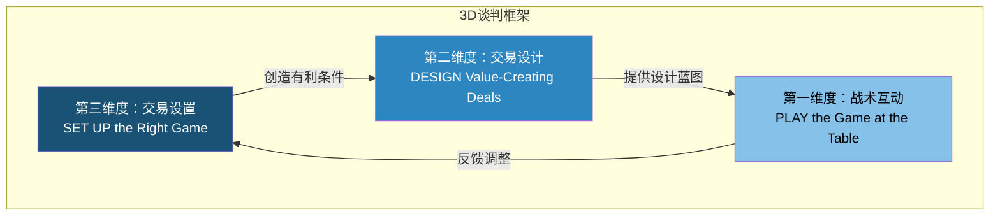
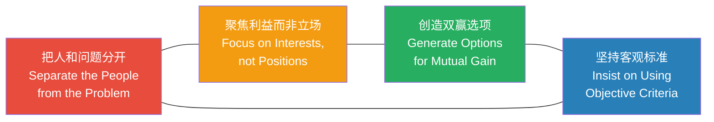
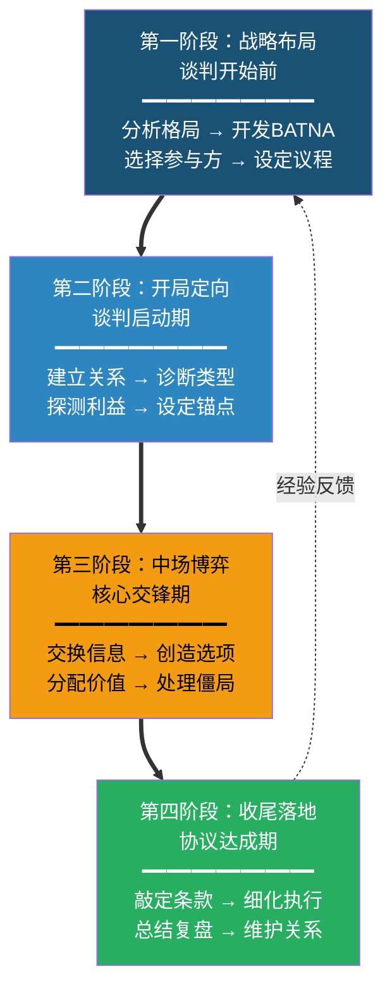
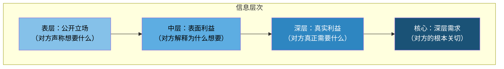
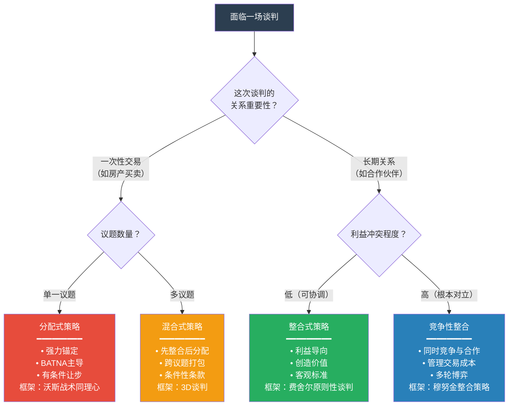
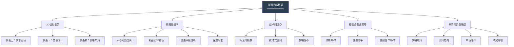

## 第六节 理论整合：谈判的战略框架

> "理论的价值不在于它的优美，而在于它能否指导行动。"
> —— 库尔特·勒温（Kurt Lewin）

前面五节分别拆解了谈判的定义与本质（第一节）、类型学（第二节）、BATNA理论（第三节）、ZOPA与协议区间（第四节）、谈判心理学（第五节）。每一节都是一个独立的知识模块——但谈判从来不是在真空中发生的。一个真实的谈判场景，需要你同时调用BATNA分析来评估自己的底牌，用ZOPA理论来定位协议空间，用心理学原理来管理对方的预期和情绪，还要根据谈判类型灵活切换策略。

本节的任务就是把这些散落的理论珠子串成一条项链——构建一套可操作的整合性谈判战略框架。读完本节，你将拥有一张"谈判全景地图"，在任何谈判情境下都能快速定位自己的位置、选择合适的工具、制定有效的策略。

---

### 6.1 为什么需要整合框架？

#### 6.1.1 单一理论的局限性

任何单一理论都有其边界。以下是每种理论的"盲区"：

| 理论 | 核心贡献 | 盲区 |
|------|---------|------|
| BATNA | 评估自身替代方案，确定底线 | 不告诉你如何创造价值、如何管理关系 |
| ZOPA | 量化协议区间，判断谈判可行性 | 不处理"区间不存在"时该怎么办，不涉及心理博弈 |
| 分配式/整合式类型学 | 识别谈判性质，选择基本策略 | 真实谈判是混合式的，需要动态切换 |
| 谈判心理学 | 理解认知偏差和情绪机制 | 心理战术需要嵌入整体策略才能发挥作用 |

真正的谈判高手，不是精通某一种理论，而是能在不同理论之间自如切换——就像一个医生不会只用听诊器，而是根据症状组合使用各种诊断工具。

#### 6.1.2 整合框架的核心思想

整合框架的核心思想可以用一句话概括：**谈判是一个多维度、多阶段、多角色的动态决策过程，需要在"桌面上"（战术互动）、"桌面下"（交易设计）和"桌面前"（战略布局）三个层面同时发力。**

这个思想来自哈佛商学院教授詹姆斯·塞贝纽斯（James Sebenius）和大卫·拉克斯（David Lax）在1986年合著的《谈判者困境》（The Manager as Negotiator）中首次提出的三维框架，后来在《3D谈判》（3-D Negotiation, 2006）中系统化为一套完整的战略方法论。

---

### 6.2 3D谈判框架：全景地图

#### 6.2.1 框架概览

**核心洞察**：大多数谈判者把100%的精力放在"第一维度"（谈判桌上的交锋），但真正决定谈判结果的往往是"第三维度"（谈判开始前的布局）。塞贝纽斯的研究表明，在成功的大型谈判中，战略布局对结果的影响权重超过60%，而桌面上的战术只占20%左右，剩余20%来自交易设计。

#### 6.2.2 第一维度：战术互动（At the Table）

这是大多数人理解的"谈判"——双方坐在谈判桌前，你来我往地交锋。第一维度的核心问题是：**在给定的谈判格局中，如何通过沟通技巧最大化自己的成果？**

**第一维度的关键能力矩阵：**

| 能力 | 具体技能 | 对应理论支撑 |
|------|---------|-------------|
| 信息管理 | 提问技巧、信息收集、信息披露策略 | 谈判心理学中的信息不对称理论 |
| 锚定与定价 | 开场报价、锚定效应运用 | 前景理论、锚定效应（第五节5.1.2） |
| 让步管理 | 让步幅度、让步节奏、条件式让步 | 谈判心理学中的互惠原理 |
| 僵局处理 | 重构议题、引入调解、暂时搁置 | 第五节认知灵活性理论 |
| 情绪管理 | 自我调节、识别对方情绪、利用情绪 | 第五节双系统思维理论 |
| 说服与影响 | 社会证据、权威性、稀缺性 | 第五节说服原理（Cialdini六原则） |

**第一维度的三个战术原则：**

**原则一：过程即内容。** 谈判的流程设计本身就在传递信息。如果你主动提出"我们先从最容易达成共识的议题开始"，你实际上在暗示对方你是整合式谈判者，希望双赢。如果你一上来就抛出最强硬的立场，你传递的信号是分配式谈判的意图。

**原则二：信息是货币。** 在谈判中，信息的价值与稀缺性成正比。你掌握的关于对方需求、底线、BATNA的信息越丰富，你的谈判力量越强。但信息交换是双向的——你不能只索取不付出。优秀的谈判者擅长用"低价值信息"交换"高价值信息"。例如：你分享自己对行业趋势的看法（低价值，对方也能查到），换取对方透露他目前面临的最大挑战（高价值，直接指向他的真实需求）。

**原则三：感知决定现实。** 谈判中不存在"客观真实的价值"——每个议题的价值完全取决于双方的感知。同一份合同，对A公司来说可能是"救命稻草"，对B公司来说只是"锦上添花"。理解并管理这种感知差异，是第一维度的核心艺术。

#### 6.2.3 第二维度：交易设计（Deal Design）

第二维度关注的是协议本身的结构——**如何设计一个既能满足双方核心利益、又能创造额外价值的交易？**

大多数谈判者犯的错误是：把谈判当成"分蛋糕"的过程。但优秀的交易设计可以"把蛋糕做大"，让双方都获得超过预期的收益。

**交易设计的五个工具：**

**工具一：议题捆绑（Issue Bundling）**

单独讨论每个议题时，每个议题都是零和博弈。但当你把多个议题捆绑在一起讨论时，可以利用双方在不同议题上的偏好差异来创造价值。

**案例**：两家公司谈判合作。公司A更在意合作期限（希望长期），公司B更在意利润分成比例（希望更高比例）。单独谈判时，每个议题都需要拉锯。但如果设计一个方案——"合作期5年（满足A），前两年利润分成60:40（满足B），后三年调整为50:50"——双方都得到了自己最在意的东西。

**工具二：差异利用（Exploiting Differences）**

双方在以下方面的差异越大，创造价值的空间越大：

| 差异类型 | 示例 | 创造价值的机制 |
|---------|------|--------------|
| 风险偏好差异 | 一方风险厌恶，一方风险中性 | 风险厌恶方获得固定收益，风险中性方获得浮动收益 |
| 时间偏好差异 | 一方急需短期现金流，一方看中长期回报 | 前期支付较少、后期支付较多的分期方案 |
| 预期差异 | 对未来市场走向看法不同 | 设定基于业绩的调整条款（earn-out） |
| 边际价值差异 | 同一资源对双方的边际价值不同 | 交换双方边际价值低但对对方价值高的资源 |
| 能力差异 | 一方有技术，一方有渠道 | 能力互补型合作结构 |

**工具三：条件性条款（Contingent Agreements）**

当双方对未来的预期存在分歧时，与其僵持不下，不如设计"条件性条款"——如果X发生，则执行方案A；如果Y发生，则执行方案B。

**案例**：卖方认为产品上线后年收入能达到500万，买方认为只有200万。双方无法在估值上达成一致。解决方案：设计earn-out条款——"首期支付200万估值的对价，如果三年内年收入超过300万，差额部分按约定比例追加支付。"这样双方的预期差异反而成了交易的推动力。

**工具四：非对称交易（Asymmetric Deals）**

寻找那些对你成本低但对对方价值高、反之亦然的"低成本高价值交换"。

经典案例：在劳动合同谈判中，员工可能更在意弹性工作时间（对公司成本几乎为零），而公司更在意竞业限制条款（对员工的约束成本很高）。一个"弹性工作+严格竞业"的组合，可能比"固定工时+宽松竞业"对双方都更有吸引力。

**工具五：程序性安排（Procedural Devices）**

有时候打破僵局不需要改变实质条件，只需要改变决策程序。例如：
- **轮流优先选择**：双方轮流在争议资产中选择自己最想要的
- **切割-选择法**（I Cut, You Choose）：一方切割蛋糕，另一方先选——这会激励切割者设计最公平的方案
- **第三方评估**：引入独立评估机构来确定争议金额

#### 6.2.4 第三维度：交易设置（Setup）

这是3D框架中最具战略价值、也最容易被忽视的维度。第三维度的核心问题是：**在坐到谈判桌之前，如何创造对自己最有利的谈判格局？**

**第三维度的战略布局清单：**

**布局一：参与方的选择与安排（Who）**

谈判桌上有谁，直接决定了谈判的格局。塞贝纽斯用了一个生动的比喻：谈判就像一场棋局，"棋盘的大小"（参与者数量和利益关系）比"棋艺"（战术技巧）更能决定胜负。

- **引入有利的第三方**：如果对方的BATNA很强，你可以引入一个新参与者来削弱它。例如：一家供应商在价格谈判中强势，你可以邀请其竞争对手参与竞标，即使最终仍选原供应商，你的BATNA已经改善。
- **排除不利的参与者**：如果某个参与方的存在让谈判复杂化（例如对方公司内部的强硬派），可以尝试通过程序安排将其排除在核心谈判之外。
- **利用"委托人-代理人"关系**：当对方的决策者和谈判代表不是同一人时，你可以利用这个结构——对谈判代表表示理解，同时通过正式渠道影响决策者。

**布局二：议题的设计与排序（What）**

议题的定义方式直接影响谈判结果。一个议题可以被扩大、缩小、拆分或捆绑：

- **扩大议题**（Enlarging the Pie）：引入新议题来创造交换空间。例如，价格谈不拢时，引入交货期、付款方式、售后支持等议题。
- **缩小议题**（Narrowing）：当议题过于复杂时，将其拆分为更小的、可独立谈判的单元。
- **议题排序**（Sequencing）：先谈容易达成共识的议题，建立合作惯性和信任，再谈困难议题。或者反过来，先解决最困难的"锚定议题"，其他议题自然围绕它展开。

**布局三：BATNA的开发与强化（Walk-Away）**

这是第三维度中最核心的布局。第三节已经详细讨论了BATNA理论，这里只强调一个战略视角：**BATNA不是谈判的被动准备，而是谈判格局的主动塑造。**

- **开发BATNA的时间窗口**：BATNA的开发必须在谈判开始前完成。一旦谈判启动，你的时间和注意力被消耗，开发BATNA的能力下降。
- **信号传递**：你需要让对方感知到（而非直接声称）你有强有力的BATNA。直接说"我有别的选择"往往不可信；但通过行为暗示——例如谈判节奏不急不缓、偶尔提到"我们也在评估其他方案"——会更有效。
- **削弱对方的BATNA**：你可以通过改变对方的选择集来削弱其BATNA。例如，与对方的竞争对手建立关系，让对方意识到你不是他唯一的买家。

**布局四：程序与规则的设定（How）**

谈判的程序安排——在哪里谈、什么时间谈、用什么语言谈、谁先发言——都在塑造谈判的动态。

| 程序要素 | 战略考量 |
|---------|---------|
| 地点选择 | 在己方场地谈判有"主场优势"——你更放松，对方更紧张 |
| 时间安排 | 对方有时间压力时，拖延策略更有效；你有时间压力时，避免被动 |
| 议程设定 | 谁控制议程，谁就控制谈判的节奏和焦点 |
| 团队组成 | 对方派出高层级代表时，你也需要匹配级别，否则会被"压制" |
| 沟通渠道 | 面对面谈判适合建立关系；书面谈判适合复杂条款的精确表达 |

---

### 6.3 其他经典整合框架

3D谈判框架并非唯一的整合方案。以下三个框架从不同角度提供了互补视角，在不同情境下各有优势。

#### 6.3.1 罗杰·费舍尔的"原则性谈判"（Principled Negotiation）

由哈佛谈判项目的罗杰·费舍尔（Roger Fisher）和威廉·尤里（William Ury）在《谈判力》（Getting to Yes, 1981）中提出。这是影响最广泛的整合性谈判框架，其核心是四个原则：

**原则一：把人和问题分开**

谈判中的"人的问题"包括情绪、感知、沟通障碍。费舍尔的建议是：对人温和，对事强硬。具体做法：
- **建立"同理心账户"**：在进入实质性分歧前，先通过倾听和确认对方的感受来"存款"。当后来需要表达强硬立场时，你已经有了足够的"情感余额"。
- **使用"我"语句**而非"你"语句："我感到这个方案对我方的风险过大"比"你给的方案不公平"更不容易引发防御反应。
- **区分"意图"和"影响"**：即使对方的行为给你造成了负面影响，也不要假设对方是故意的。先询问对方的意图，再讨论影响。

**原则二：聚焦利益而非立场**

立场是"我要什么"，利益是"我为什么想要"。两个立场之间往往是不可调和的（"我要100万" vs "我只出60万"），但两个利益之间可能完全兼容（"我需要覆盖成本" vs "我需要控制预算"）。

**挖掘利益的四个提问技术：**

1. **追问"为什么"**："你为什么需要这个条款？"——但注意语气，避免让对方觉得你在质疑他。
2. **追问"如果不呢"**："如果这个条件无法满足，对你来说会怎样？"——这能揭示对方的真实底线。
3. **关注对方的约束**："你在这个议题上有哪些内部约束？"——理解约束比理解诉求更有价值，因为约束是真实的，诉求可能是夸大的。
4. **探测多方利益**：对方代表的不是他个人，而是背后的一群人——他的老板、股东、客户。理解这些"幕后利益方"的需求，能帮你设计更全面的方案。

**原则三：创造双赢选项**

费舍尔提出了"画大饼"（inventing options for mutual gain）的四个步骤：
1. 头脑风暴阶段——不评判，只发散
2. 从双方视角评估每个选项
3. 寻找"低成本高价值"的交换机会
4. 设计让双方都能向自己阵营"交差"的方案

**原则四：坚持客观标准**

当双方的利益冲突无法通过创造性方案解决时，引入客观标准来裁决——市场价格、行业惯例、专家评估、法律判例、科学数据。关键在于：标准必须是双方在谈判开始前就能认同的，而不是一方事后找来支持自己立场的。

**案例**：两家公司就技术许可费争执不下。一方要求按销售额10%收取，另一方只接受5%。解决方案：引入行业标准——调查同类技术许可的平均费率为7%，以此为基础谈判上下浮动区间，而不是在5%和10%之间拉锯。

#### 6.3.2 克里斯·沃斯的"战术同理心"框架

前FBI首席谈判专家克里斯·沃斯（Chris Voss）在《掌控谈话》（Never Split the Difference, 2016）中提出了一套基于实战（人质谈判）的整合框架。与学术派不同，沃斯的框架极度强调情绪管理和心理影响力。

**核心工具链：**

**工具一：战术同理心（Tactical Empathy）**

不是"感同身身受"的软性共情，而是一种战略性的心理工具——通过精准识别和标注对方的情绪，来降低对方的防御心理、建立信任、引导对方走向合作。

- **标注（Labeling）**：用"看起来……"、"听起来……"、"似乎……"开头，准确描述对方当下的情绪状态。例如："听起来你对这个时间安排很担忧。"对方通常会纠正或确认——无论哪种结果，你都获得了信息，而且对方会感到被理解。
- **校准式提问（Calibrated Questions）**：用"什么"和"如何"开头的开放式问题，把对方从对抗模式引导到解决问题模式。例如："我们怎样才能让这个方案对你方也有效？"比"你能不能接受这个方案？"更有建设性。
- **镜像（Mirroring）**：重复对方话语的最后2-3个关键单词，让对方继续展开。这是最简单但最有效的信息收集工具。

**工具二：战略性"不"（Getting to No）**

沃斯认为，让对方说"不"比让对方说"是"更有价值。当对方说"是"时，他们可能只是为了结束对话而敷衍你；但当对方说"不"时，他们感到安全、掌控了局面，反而更愿意表达真实想法。

**实操方法**：不要问"你同意吗？"，而是问"这个方案对你来说不合理吧？"——对方说"不，我觉得可以讨论"之后，他会更放松地进入实质谈判。

**工具三：校准"午夜意外"（The Accusation Audit）**

在谈判开场前，主动列出对方可能对你提出的所有负面指控，然后逐一正面回应。例如："你可能觉得我们在价格上太贪心了，没有考虑你们的成本压力。"——这种"先发制人的道歉"会解除对方的心理弹药。

#### 6.3.3 罗伯特·穆努金的"赢家的诅咒"与整合策略

哈佛法律谈判中心主任罗伯特·穆努金（Robert Mnookin）在《超越赢家的诅咒》（Beyond Winning, 2000）中提出了一个更深层的整合框架。他的核心观点是：**谈判的根本障碍不是利益冲突，而是"交易成本"——信息不完整、信任不足、战略行为导致的摩擦。**

穆努金的四步整合策略：

| 步骤 | 核心任务 | 关键行动 |
|------|---------|---------|
| 诊断障碍 | 识别是什么阻止了双方达成共识 | 区分"实质性障碍"（利益冲突）和"程序性障碍"（缺乏信任、信息不对称） |
| 管理竞争 | 在分配式环节保护自身利益 | 明确底线、控制信息释放节奏、保留退出选项 |
| 克服合作障碍 | 在整合式环节创造价值 | 共享利益信息、联合问题解决、设计激励兼容方案 |
| 管理妥协 | 在无法双赢时做出公平让步 | 基于客观标准、相互让步、引入第三方裁决 |

穆努金的独特贡献在于他明确指出：**在同一次谈判中，你必须同时具备竞争和合作的能力，并且知道何时该竞争、何时该合作。** 永远竞争会破坏关系、错失创造价值的机会；永远合作则会被对手利用。真正的谈判智慧在于在竞争和合作之间找到平衡。

---

### 6.4 整合框架的实战应用：四阶段模型

将上述理论综合提炼为一个可操作的四阶段实战模型。这个模型适用于绝大多数商务谈判场景，从供应商采购到合资企业谈判。

#### 6.4.1 第一阶段：战略布局（谈判开始前）

**时间窗口**：谈判正式启动前2-6周（复杂交易可能需要更长时间）

**核心任务清单：**

**任务一：情境分析与类型诊断**

用第二节的类型学框架，回答以下问题：

┌─────────────────────────────────────────────────────────┐
│ 谈判类型诊断问卷                                          │
├─────────────────────────────────────────────────────────┤
│ 1. 这次谈判是分配式、整合式还是混合式？                     │
│    □ 纯分配式（单一议题，利益完全对立）                     │
│    □ 纯整合式（多议题，利益可协调）                         │
│    □ 混合式（既有分配部分也有整合部分）                     │
│                                                          │
│ 2. 双方关系的性质是什么？                                  │
│    □ 一次性交易（如房产买卖）                              │
│    □ 长期关系（如供应商合作）                              │
│    □ 竞合关系（如行业联盟内的合作）                        │
│                                                          │
│ 3. 谈判环境的特征？                                       │
│    □ 信息充分/信息不对称                                   │
│    □ 时间充裕/有明确截止日期                               │
│    □ 多方参与/双边谈判                                    │
│    □ 有先例可循/全新议题                                  │
│                                                          │
│ 4. 我方的优势和劣势分别是什么？                            │
│    优势：_______________                                  │
│    劣势：_______________                                  │
└─────────────────────────────────────────────────────────┘

**任务二：BATNA开发与强化**

基于第三节的理论，执行以下步骤：

1. **列出所有替代方案**：如果这次谈判破裂，你有哪些选择？尽量穷举。
2. **评估每个方案的可行性**：考虑时间成本、资金成本、机会成本。
3. **选择最优替代方案**：这就是你的BATNA。
4. **强化BATNA**：在谈判开始前，投入时间和资源去改善你的最优替代方案。这是你能做的最高ROI（投资回报率）的准备工作。
5. **估算对方的BATNA**：从对方的角度思考——如果他不跟你谈，他有什么选择？

**BATNA强度评估矩阵：**

| 评估维度 | 你的BATNA | 对方的BATNA |
|---------|-----------|-------------|
| 可行性（是否切实可行？） | __/10 | __/10 |
| 吸引力（达成后的满意度？） | __/10 | __/10 |
| 时间成本（需要多久？） | __/10 | __/10 |
| 转换成本（切换到替代方案的代价？） | __/10 | __/10 |
| **综合强度** | **__/40** | **__/40** |

BATNA综合强度差值 ≥ 10分时，强势一方可以采取更进取的策略；差值 < 5分时，双方力量接近，更适合整合式谈判。

**任务三：ZOPA估算**

基于第四节的理论，估算协议区间：

1. 估算你的底线（reservation price）——低于这个价格你宁可执行BATNA
2. 估算对方的底线
3. 如果你的底线优于对方的底线 → ZOPA存在，谈判有可能达成协议
4. 如果你的底线劣于对方的底线 → ZOPA不存在，你需要要么改善自己的BATNA、要么影响对方的感知

**任务四：议题清单与优先级排序**

议题优先级排序模板：

议题名称 | 我方优先级(1-5) | 对方优先级(预估) | 可让步空间 | 是否可交易
-------- | -------------- | ---------------- | --------- | ---------
价格     |      5         |       5          |   小      |    是
付款周期  |      3         |       4          |   中      |    是
交货时间  |      4         |       2          |   大      |    是
质量标准  |      5         |       3          |   小      |    否
售后支持  |      2         |       5          |   大      |    是

**关键洞察**：找双方优先级不一致的议题——你重视但对方不在意的，和对方重视但你不在意的——这些就是创造"免费价值"的空间。在上例中，你可以用"延长售后支持"（对你成本低）换取"更快的付款周期"（对你价值高）。

#### 6.4.2 第二阶段：开局定向（谈判启动期）

**时间窗口**：第一次正式会面前30分钟到前两次会谈

**核心任务清单：**

**任务一：建立关系基调**

开局的前15分钟往往决定了整个谈判的基调。研究表明，谈判双方在开场阶段形成的"关系框架"（合作型vs对抗型）会对后续互动产生持续影响（Thompson & Hastie, 1990）。

| 开局行为 | 传递的信号 | 后续影响 |
|---------|-----------|---------|
| 主动寒暄、寻找共同点 | "我重视这段关系" | 降低对方防御心理 |
| 先讨论中性议题 | "我们是来解决问题的，不是来对抗的" | 为整合式谈判奠定基础 |
| 直接进入核心诉求 | "我是来达成目标的" | 容易触发对方的竞争心态 |
| 提出夸张的初始要求 | "我是强硬的谈判者" | 引发对抗，但也会重设锚点 |

**任务二：探测谈判类型**

不要假设对方会跟你用同一种方式谈判。开局阶段需要快速判断对方的真实谈判风格：

- **观察信号**：对方派出的团队构成（法务主导=防御型，商务主导=交易型，高管主导=战略型）
- **试探性议题**：抛出一个中等难度的议题，观察对方的反应——立刻拒绝=分配型，提出替代方案=整合型，要求更多信息=分析型
- **直接提问**："我们是希望把所有议题放在一起讨论，还是逐个解决？"——对方的回答能直接暴露其谈判偏好

**任务三：设定锚点**

锚定效应（第五节5.1.2）是谈判中最强大的心理工具之一。开局阶段的初始报价会成为整个谈判的参照点。关于锚点设定，有两个流派：

- **激进锚定派**（沃斯）：设定一个极端但合理的锚点，利用锚定效应把最终结果拉向自己。风险：可能引发对方的强烈反弹，甚至导致谈判破裂。
- **合理锚定派**（马尔汉德罗）：设定一个在可辩护范围内偏高的锚点。优点：更安全，不会破坏关系；缺点：锚定效应较弱。

**建议策略**：在关系重要、时间充裕、信息充分的情境下，使用合理锚定；在一次性交易、对方信息不足、你有强势BATNA的情境下，可以使用激进锚定。

#### 6.4.3 第三阶段：中场博弈（核心交锋期）

**时间窗口**：谈判的核心阶段，可能持续数小时到数月

**核心任务清单：**

**任务一：信息交换与利益诊断**

中场阶段的核心工作是"去伪存真"——从对方的言语、行为、情绪反应中提取关于其真实利益、优先级和底线的信息。

**信息收集的"洋葱模型"：**

逐层深入的方法：

| 层次 | 提问方式 | 示例 |
|------|---------|------|
| 表层 | "你的目标是什么？" | "我们要30%的利润分成" |
| 中层 | "这个目标背后的原因是？" | "因为我们的投入成本很高" |
| 深层 | "如果成本问题能解决，你还需要30%吗？" | "不一定，但我们需要保证投资回报率" |
| 核心 | "投资回报率对你们意味着什么？" | "董事会要求三年内回本，否则这个项目会被砍" |

当你到达核心层时，你发现对方的真实需求不是"30%的利润分成"，而是"三年内投资回本"。这个需求可能有很多不同的满足方式——比如阶梯式分成、里程碑付款、利润保底条款——这些都在对方的原始立场中看不到。

**任务二：价值创造**

基于第二维度的交易设计工具，系统性地创造价值：

1. **扩展议题集**：把所有可能的议题都摆到桌面上
2. **打包交易**：利用优先级差异设计捆绑方案
3. **引入条件性条款**：用未来的不确定性创造当前的共识
4. **利用风险偏好差异**：设计让风险厌恶方获得确定性、风险偏好方获得上行空间的方案

**价值创造的"联合问题解决"对话模板：**

"我理解你方在这个议题上的考量。我们在这个议题上有一些灵活性，
 但我方在[另一个议题]上有一些特殊的需要。如果我们能在这两个议题
 上找到一个对双方都有利的组合方案，也许我们都不需要在每个单一
 议题上做最大化的争取。你觉得我们有没有可能做这种跨议题的交换？"

**任务三：价值分配**

当所有价值创造的可能都已穷尽，接下来就是分配问题。分配式博弈的关键原则：

- **锚定先手**：有研究表明，先报价的一方在多数情况下会获得更好的结果（Galinsky & Mussweiler, 2001）。但前提是你有充分的信息来设定合理的锚点。
- **条件式让步**：每一次让步都必须附带条件。"如果你能在交货期上提前两周，我可以在价格上做X%的调整。"——无条件让步会被对方视为"还有空间"的信号。
- **让步递减**：让步的幅度应该递减（第一次5%，第二次3%，第三次1%），传递"接近底线"的信号。如果让步幅度递增，对方会认为你的底线还有很大距离。

**任务四：僵局处理**

当谈判陷入僵局时，可以使用以下策略（按激进程度递增）：

1. **重构议题**：改变议题的定义方式或拆分/捆绑议题
2. **暂时搁置**：先跳过困难议题，谈其他议题，积累合作惯性后再回来
3. **引入新变量**：添加双方之前未讨论的议题来创造新的交换空间
4. **改变参与者**：引入新的决策者、专家或调解人
5. **改变环境**：从会议室转移到非正式场合（晚餐、散步），降低对抗氛围
6. **最后通牒**（慎用）：设置截止日期或最终报价，迫使对方做出决定

#### 6.4.4 第四阶段：收尾落地（协议达成期）

**核心任务清单：**

**任务一：协议条款的精确化**

口头达成的共识和白纸黑字的协议之间，往往存在巨大的差距。收尾阶段的关键是确保每一项共识都被精确地转化为可执行的条款。

**协议审查清单：**

□ 所有关键条款是否明确、无歧义？
□ 数字（金额、比例、期限）是否准确？
□ 例外情况和特殊条款是否覆盖？
□ 争议解决机制是否明确（仲裁/诉讼/协商）？
□ 执行时间表和里程碑是否清晰？
□ 违约责任和补救措施是否规定？
□ 不可抗力条款是否覆盖？
□ 保密条款是否适当？
□ 退出机制是否公平？

**任务二：承诺的可信化**

协议的价值取决于双方是否会真正执行。以下机制可以增强承诺的可信度：

- **分阶段执行**：把大承诺分解为小步骤，每完成一步都有验证
- **保证金/违约金**：让违约的代价大于违约的收益
- **公开承诺**：在更多人面前做出的承诺更不容易违反
- **声誉机制**：在行业圈子里，声誉损失的威慑力往往比法律制裁更有效

**任务三：关系维护**

谈判不是终点，而是关系的起点。尤其在长期关系型谈判中，收尾阶段需要：

1. **总结共同成就**：强调双方通过合作创造的价值，而非各自的让步
2. **表达尊重**：感谢对方在困难议题上的灵活性
3. **建立后续沟通机制**：设定定期回顾会议，处理执行中的问题
4. **复盘反思**：记录这次谈判中的经验教训，为下一次谈判积累知识

---

### 6.5 框架选择指南：什么情境用什么框架？

面对真实的谈判场景，你不需要记住所有理论，而是需要一个"快速决策树"来选择最合适的框架。

**决策树使用说明：**

1. 先判断关系性质——这决定了你愿意为达成协议付出多少关系成本
2. 再判断议题结构——单一议题倾向分配式，多议题倾向整合式
3. 最后判断利益冲突程度——低冲突用纯整合，高冲突用竞争性整合

**重要提醒**：在真实谈判中，你几乎不会只用一种框架。更常见的情况是：在开局用费舍尔的"原则性谈判"建立关系，在中场用3D框架的"交易设计"创造价值，在价格分配环节用沃斯的"战术同理心"争取优势，在收尾用穆努金的"交易成本管理"确保执行。

---

### 6.6 常见误区与纠正

#### 误区一："整合式谈判就是让步"

**错误认知**：很多谈判者把"双赢"理解为"双方各退一步"。这实际上是在分配式思维下强行"平均分配"，结果往往是谁都不满意。

**正确认知**：整合式谈判的核心不是让步，而是创造新的价值。通过议题打包、条件性条款、差异利用等手段，让双方都获得比预期更多的东西。"双赢"不是"各取50%"，而是"双方都获得对自己最重要的东西"。

**案例**：一家科技公司和一家制造公司就合资企业谈判。科技公司坚持要51%的股权，制造公司也坚持要51%。这不是一个可以通过"各退到50%"来解决的问题——因为50:50会导致决策僵局。真正的整合方案是：科技公司获得51%股权和产品决策权，制造公司获得49%股权但拥有供应链决策权和利润优先分配权。双方都得到了自己最在乎的东西。

#### 误区二："3D框架只需要关注第三维度"

**错误认知**：读完本节后，有些读者可能会得出"桌面上的技巧不重要，关键是谈判前的布局"的结论。

**正确认知**：三个维度是缺一不可的。再好的战略布局，如果在桌面上犯了严重错误（比如情绪失控、信息泄露），也可能功亏一篑。再精妙的交易设计，如果没有合理的格局设置（比如BATNA太弱），也可能被对方的强势策略压垮。正确的理解是：**优先投入时间在第三维度（因为ROI最高），但不忽视任何一个维度。**

#### 误区三："心理战术可以替代实质价值创造"

**错误认知**：受某些谈判"大师"的影响，一些谈判者过度迷恋心理操控技巧——锚定、施压、制造紧迫感——而忽视了实质性的价值创造。

**正确认知**：心理战术是放大器，不是替代品。如果你手上没有好的方案（创造价值），再强的锚定技巧也只是在一个更小的蛋糕上争夺更大的份额。沃斯的战术同理心之所以有效，不是因为它能操纵对手，而是因为它能帮助你更快地到达对方的"深层需求"（信息洋葱的第四层），从而设计出更有创造性的方案。

#### 误区四："框架是死板的，谈判需要灵活"

**错误认知**："我的谈判风格是随机应变，不需要框架。"

**正确认知**：真正的灵活来自于深厚的内功。一个学习了系统框架的谈判者，就像一个精通了基本功的武术家——看似随意的出手都符合力学原理。而一个"纯靠直觉"的谈判者，就像一个没有基本功的街头打架者——有时赢，有时输，但不知道为什么赢、为什么输。框架不是束缚你的牢笼，而是帮你快速识别情境、选择工具的导航系统。

#### 误区五："所有谈判都可以双赢"

**错误认知**：盲目追求双赢，即使面对纯粹的分配式谈判也坚持"一定能找到共同利益"。

**正确认知**：有些谈判确实接近零和——例如二手房交易中，卖方多赚的一块钱就是买方多付的一块钱。在这种情境下，与其浪费时间寻找不存在的"创造价值"机会，不如专注于：(1)强化自己的BATNA，(2)合理设定锚点，(3)管理对方的心理预期。整合框架的价值不在于让你在所有情况下都"双赢"，而在于让你准确判断什么时候应该整合、什么时候应该竞争。

---

### 6.7 高阶议题：框架的局限与前沿发展

#### 6.7.1 传统框架的局限性

以上所有框架都诞生于20世纪80年代至21世纪初，它们有一些共同的局限：

- **偏重理性假设**：这些框架假设谈判者是理性的、自利的，能够准确评估自己的利益。但行为经济学的研究表明，人类决策远比这复杂——受框架效应、损失厌恶、社会偏好等多种因素影响。
- **偏重双边谈判**：这些框架主要针对两方之间的谈判。但现实中，多方谈判（如多国贸易谈判、企业内部多方利益协调）日益常见，多方博弈的动态远比双边复杂。
- **偏重离散交易**：这些框架假设谈判有明确的开始和结束。但现代商业中的很多"谈判"实际上是持续的关系管理——合作伙伴之间的利益协调没有终点。
- **跨文化适用性**：这些框架主要基于美国和西欧的商业环境发展。在东亚、中东、拉美等文化中，谈判的规范、节奏和策略选择可能有显著差异。

#### 6.7.2 前沿发展方向

**发展一：AI辅助谈判**

人工智能正在改变谈判的方式。AI工具可以：
- 分析历史谈判数据，预测对方的底线和策略模式
- 在复杂多议题谈判中实时计算最优打包方案
- 通过自然语言处理分析对方的情绪状态和真实意图
- 模拟不同策略下的可能结果

但AI目前无法替代的领域包括：关系的建立与维护、跨文化敏感性的判断、创造性方案的提出。在可预见的未来，AI将更多地作为谈判者的"战略顾问"而非"替代者"。

**发展二：在线争议解决（ODR）**

随着电子商务和远程工作的普及，越来越多的谈判通过在线平台进行。这带来了新的挑战：非语言信息的缺失、异步沟通带来的误解、数字平台的程序设计对谈判动态的影响。

**发展三：神经谈判学（Neuro-Negotiation）**

fMRI（功能性磁共振成像）研究表明，谈判中的决策过程涉及大脑多个区域的复杂交互——前额叶皮层负责理性分析，杏仁核处理情绪反应，纹状体评估奖赏预期。这些发现正在为谈判培训提供新的切入点：通过正念训练增强前额叶的调控能力，通过模拟训练降低杏仁核的过度反应。

---

### 6.8 本节知识图谱

将本节所涉及的所有理论和工具整合为一张知识图谱，供你快速查阅和复习：

---

### 6.9 实战练习

#### 练习一：框架匹配训练

针对以下五个谈判场景，选择最合适的整合框架，并说明理由：

| 场景 | 描述 | 你的选择 | 理由 |
|------|------|---------|------|
| A | 与房东就租金续约谈判，关系良好 | _____ | _____ |
| B | 参与公司竞标，对方有3家供应商可选 | _____ | _____ |
| C | 与合资伙伴就新产品的利润分配谈判 | _____ | _____ |
| D | 收购一家初创公司，对方创始人对估值有很高预期 | _____ | _____ |
| E | 与同事就项目资源分配的内部谈判 | _____ | _____ |

**参考答案**：
- A：费舍尔原则性谈判（关系重要，可以聚焦利益、用客观标准）
- B：3D谈判框架（需要在第三维度强化BATNA，通过引入竞争改善格局）
- C：穆努金整合策略（长期关系中的复杂利益协调，需要同时竞争和合作）
- D：3D谈判框架+条件性条款（需要交易设计来桥接估值分歧，如earn-out条款）
- E：费舍尔原则性谈判（内部谈判关系最重要，需要聚焦共同目标）

#### 练习二：四阶段模拟

选择你即将面临的一场真实谈判（可以是工作中的，也可以是生活中的），按照四阶段模型完成以下准备工作：

第一阶段：战略布局
├── 情境分析：谈判类型诊断（填写6.4.1中的诊断问卷）
├── BATNA分析：我方和对方的BATNA评估（填写评估矩阵）
├── ZOPA估算：是否存在协议区间？
└── 议题清单：列出所有议题并排序（填写优先级模板）

第二阶段：开局定向（计划）
├── 关系建设：开场策略是什么？
├── 类型探测：如何判断对方的谈判风格？
└── 锚点设定：初始报价是多少？理由是什么？

第三阶段：中场博弈（预案）
├── 信息收集：需要从对方获得哪些关键信息？
├── 价值创造：有哪些跨议题交换的可能？
└── 僵局预案：如果关键议题陷入僵局，如何处理？

第四阶段：收尾落地（预案）
├── 协议审查：需要确保哪些条款明确无误？
└── 承诺可信化：如何确保对方会执行协议？

#### 练习三：跨框架对比

同一场景，分别用费舍尔的"原则性谈判"和沃斯的"战术同理心"设计两种不同的谈判策略，对比它们的优劣。这能帮助你理解不同框架的适用边界。

**场景**：你是一家小型软件公司的CEO，正在与一家大型企业谈判年度采购合同。对方的采购经理以强硬著称，过去两年一直在压低你们的价格。今年合同续约在即，你需要在保住客户的同时改善利润率。

---

### 6.10 延伸阅读

| 著作 | 作者 | 核心贡献 | 适合阶段 |
|------|------|---------|---------|
| 《谈判力》（Getting to Yes） | Fisher & Ury | 原则性谈判四原则 | 入门必读 |
| 《3D谈判》（3-D Negotiation） | Lax & Sebenius | 三维战略框架 | 进阶必读 |
| 《掌控谈话》（Never Split the Difference） | Chris Voss | 战术同理心与实战技巧 | 进阶推荐 |
| 《超越赢家的诅咒》（Beyond Winning） | Robert Mnookin | 谈判中的交易成本与整合策略 | 高阶推荐 |
| 《谈判天才》（Negotiation Genius） | Bazerman & Malhotra | 行为决策与谈判偏差 | 高阶推荐 |
| 《高难度谈话》（Difficult Conversations） | Stone, Patton & Heen | 谈判中的对话技巧 | 实用推荐 |

---

本节是整个"谈判技巧"理论基础部分的总结与升华。从第一节的"谈判是什么"出发，经过类型学、BATNA、ZOPA、心理学的逐层铺垫，最终在本节完成了理论的整合。下一节将进入核心技巧的实操部分——如何在真实的谈判桌上运用这些理论。
