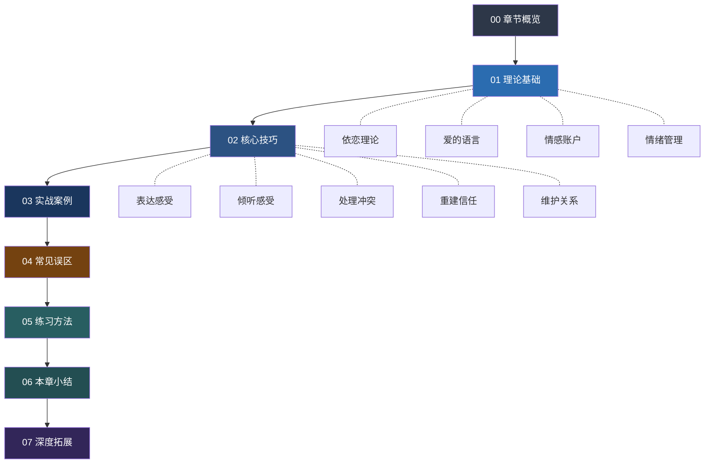
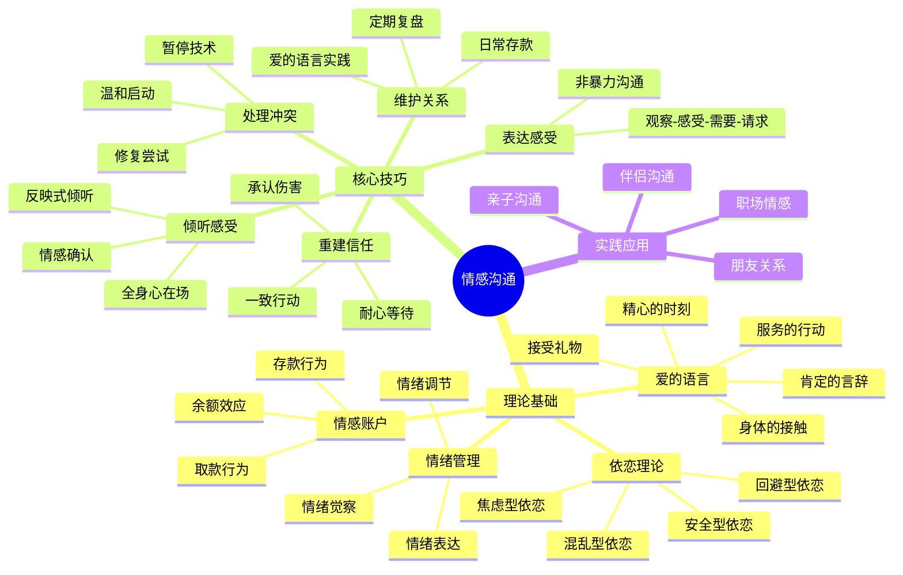

# 第八章 情感沟通

## 章节概览

### 引言

人是情感的动物。无论我们在职场中多么理性专业，回到家庭、面对亲密关系、面对深夜独处的自己时，情感始终是我们最深层的驱动力。情感沟通——即在人际关系中表达、接收和回应彼此情感需求的能力——是所有深层关系的基石。它不仅决定了我们能否建立真正的亲密连接，更影响着我们一生的幸福感受和心理健康。

然而，情感沟通恰恰是大多数人在成长过程中最少被教导的技能。我们的学校教育侧重知识传授和逻辑训练，家庭教育中"不哭""不许发脾气""男孩子要坚强"的指令更是从小压抑了我们对情感的认知和表达能力。许多人在成年后面对亲密关系中的情感需求时，会感到手足无措——不是不想沟通，而是真的不知道如何沟通。

更深层的问题在于：很多人把情感沟通和"说好听的话"画上等号，把"不吵架"等同于"关系好"。这种认知偏差导致人们要么回避冲突、压抑真实感受，最终导致关系的慢性窒息；要么在冲突中用攻击性的方式"表达"情感，把沟通变成互相伤害。真正的远见是——学习如何在关系中既保持真实，又保持连接。

本章将系统地探讨情感沟通的理论基础、核心技巧、常见误区和实践方法，帮助读者建立一套完整的情感沟通能力体系。无论你是刚开始建立亲密关系的年轻人，还是在长期关系中感到疲惫的伴侣，亦或希望修复与父母、子女关系的普通人，都能从本章中找到可操作的方法。

***

### 本章学习目标

通过本章的学习，你将能够：

1. **理解情感沟通的心理学基础**：掌握依恋理论、爱的语言、情感账户和情绪管理四大理论框架，从根源上理解人类情感需求的本质
2. **掌握核心沟通技巧**：学会表达感受、倾听感受、处理冲突、重建信任和维护关系的具体方法
3. **应对真实情感场景**：通过八个典型场景的案例分析，获得可直接应用的沟通策略
4. **规避常见误区**：识别情感沟通中的十个典型陷阱，避免无意识地破坏关系
5. **建立持续练习体系**：通过每日和每周的系统化练习，将情感沟通转化为本能反应

更具体地说，完成本章学习后，你将在以下维度实现能力提升：

| 能力维度 | 学习前（典型状态） | 学习后（目标状态） |
|----------|-------------------|-------------------|
| 情绪觉察 | 只能笼统地说"不开心""烦" | 能精确识别并命名20+种情绪 |
| 表达能力 | 用指责和抱怨代替表达需求 | 能用非暴力沟通四步法清晰表达 |
| 倾听能力 | 听到内容，忽略感受 | 能听到感受背后的需要 |
| 冲突处理 | 回避或升级，没有中间路线 | 能在分歧中保持连接、寻找共识 |
| 信任维护 | 关系靠"感觉"维护，没有方法论 | 有系统的日常情感投资习惯 |
| 误区识别 | 不知道自己在哪里踩了坑 | 能识别十个典型陷阱并及时纠正 |

***

### 为什么情感沟通如此重要

#### 第一，情感连接是人类的基本需求

心理学家亚伯拉罕·马斯洛的需求层次理论中，归属与爱的需求位于金字塔的中间位置——它不是奢侈品，而是人类生存和发展的基本需求。大量的心理学研究表明，缺乏情感连接的人更容易出现抑郁、焦虑、免疫功能下降等问题。

哈佛大学长达85年的"成人发展研究"（Harvard Study of Adult Development）——这是人类历史上持续时间最长的幸福感纵向研究——发现了一个压倒性的结论：决定人生幸福的最重要因素不是财富、名誉或成就，而是高质量的人际关系。研究第四任负责人罗伯特·瓦尔丁格（Robert Waldinger）在TED演讲中总结道："好的人际关系让我们更健康、更幸福。就这么简单。"而高质量关系的核心，正是情感层面的深度连接。

进一步的神经科学研究表明，人类大脑中存在"社会疼痛"（social pain）机制——被排斥和被忽视所激活的脑区，与身体疼痛所激活的脑区高度重叠。这意味着情感连接的缺失，在大脑层面等同于真实的疼痛体验。我们的身体不是一个独立运行的机器，它是一个关系性的存在——我们从出生到死亡，都需要与他人建立情感纽带才能健康地存活。

#### 第二，情感沟通能力直接影响关系质量

世界知名的婚姻研究专家约翰·戈特曼（John Gottman）在华盛顿大学建立了"爱情实验室"（Love Lab），通过数十年的实证研究，跟踪了超过3000对夫妻的互动模式。他的核心发现是：

- 能够准确识别和回应伴侣情感需求的夫妻，其婚姻满意度和持久度远远高于缺乏这种能力的夫妻
- 仅凭观察夫妻讨论分歧时5分钟的互动视频，戈特曼团队就能以超过90%的准确率预测他们是否会离婚
- 决定婚姻存亡的关键指标不是"是否吵架"，而是**正面互动与负面互动的比例**——稳定幸福的婚姻中，这个比例至少是5:1（即每1次负面互动需要5次正面互动来平衡）

戈特曼还发现了婚姻的"末日四骑士"（Four Horsemen of the Apocalypse）——批评（Criticism）、蔑视（Contempt）、防御（Defensiveness）、冷战（Stonewalling）。这四种沟通模式是关系破裂的最强预测因子，而它们全部属于情感沟通的范畴。

这些研究数据说明一个不容回避的事实：情感沟通不是"锦上添花"的软技能，而是关系存亡的硬指标。

#### 第三，情感沟通是可以学习的

与某些人认为的"情感表达是天生的""有些人就是不会表达"不同，大量研究表明，情感沟通能力完全可以通过学习和练习来提升。大脑具有神经可塑性（neuroplasticity）——即使是成年人，通过持续的有意识练习，也能建立新的神经通路，改变旧有的情感反应模式。

心理学中的"情绪聚焦疗法"（Emotionally Focused Therapy, EFT）由苏·约翰逊（Sue Johnson）博士开发，已通过超过30年的临床研究验证。EFT的研究数据显示：经过8-20次会谈，约70%-75%的夫妻能够从关系困境中恢复，约90%的夫妻报告关系有显著改善。这证明情感沟通模式不是固定不变的，而是可以通过系统化的学习实现根本性转变。

另一个值得参考的数据来自企业领域：哈佛商业评论的一项综述研究发现，在高管领导力评估中，情商（Emotional Intelligence）对工作表现的影响力是智商的两倍；而在高层管理者中，情商贡献了将近90%的差异。这意味着情感沟通能力的提升，不仅改善私人关系，也直接影响职业发展。

#### 第四，情感沟通是数字时代最稀缺的能力

在即时通讯、社交媒体和短视频主导的时代，人们的沟通方式正在发生深刻变化：

- **碎片化**：深度对话被短消息和表情包取代，人们越来越不习惯用完整的句子表达复杂的情感
- **间接化**：很多人在微信上比面对面更能表达情感，数字屏幕提供了一层"安全距离"，但也削弱了真实连接的深度
- **表演化**：社交媒体鼓励展示"精心策划"的情感生活，真实的情感表达空间被压缩
- **即时化**：人们习惯了即时回复，对"需要时间想一想""等我冷静了再谈"的容忍度越来越低

在这种背景下，能够进行深度、真实、有温度的情感沟通，正在成为一种越来越稀缺的核心能力。

***

### 情感沟通能力自测

在正式开始学习之前，建议你花几分钟完成以下自测。这不是科学诊断量表，而是帮助你快速识别自己当前的情感沟通状态，以便在后续学习中有针对性地关注薄弱环节。

**请对以下10个陈述进行评分（1=完全不符合，5=完全符合）：**

| 序号 | 陈述 | 评分 |
|------|------|------|
| 1 | 我能够清楚地知道自己此刻在感受什么情绪 | ____ |
| 2 | 当伴侣/家人表达负面情绪时，我知道如何回应而不是感到慌张 | ____ |
| 3 | 我能用"我感到……"而非"你总是……"的方式表达自己的不满 | ____ |
| 4 | 发生冲突时，我能在不伤害对方的前提下表达自己的立场 | ____ |
| 5 | 我能识别伴侣/家人主要的"爱的语言"并用它表达关心 | ____ |
| 6 | 当对方说"你不懂我"时，我知道如何调整自己的倾听方式 | ____ |
| 7 | 我有定期向重要的人表达情感的习惯，而不只是在特殊场合 | ____ |
| 8 | 关系出现裂痕时，我知道如何重建信任而不只是道歉 | ____ |
| 9 | 我能区分"发泄情绪"和"表达感受"的不同 | ____ |
| 10 | 我了解自己的依恋风格，并知道它如何影响我的关系 | ____ |

**评分说明：**

- **40-50分**：你的情感沟通基础扎实，本章将帮助你从"好"到"精通"，重点阅读深度拓展部分
- **25-39分**：你有一定的意识但缺乏系统方法，本章的理论和技巧部分将为你提供完整的框架
- **10-24分**：不要气馁——这意味着你有最大的成长空间，而且改善的效果会最明显。建议从头到尾顺序阅读，每节都进行实践

***

### 本章内容结构

本章共分为七个部分，按照"理论→技巧→案例→误区→练习→小结→拓展"的逻辑递进编排：

**各节内容详解：**

| 节次 | 主题 | 核心内容 | 包含子节 | 关键收获 |
|------|------|----------|----------|----------|
| 00 | 章节概览 | 整体框架、学习目标、自测工具、内容导航 | - | 建立全局认知，识别自身起点 |
| 01 | 理论基础 | 依恋理论、爱的语言、情感账户、情绪管理 | 4个主题 + 小结 | 掌握四大理论框架，理解情感沟通的底层逻辑 |
| 02 | 核心技巧 | 表达感受、倾听感受、处理冲突、重建信任、维护关系 | 5个主题 + 小结 | 获得可直接使用的沟通方法和话术模板 |
| 03 | 实战案例 | 八个典型情感场景的完整分析 | 8个场景 + 总结 | 从真实场景中理解理论和技巧的应用方式 |
| 04 | 常见误区 | 十个情感沟通陷阱及应对策略 | 10个误区 | 识别并规避最具破坏性的沟通模式 |
| 05 | 练习方法 | 系统化的每日与每周练习方案 | 日常练习 + 周期练习 | 建立持续提升的练习习惯 |
| 06 | 本章小结 | 关键要点回顾与行动建议 | 核心认知回顾 + 行动清单 | 整合所学，制定个人行动计划 |
| 07 | 深度拓展 | 依恋理论最新研究、文化差异、职场应用等 | 多个深度话题 | 为高级读者提供更宽广的视野 |

***

### 各节内容预览

#### 01 理论基础：理解情感沟通的底层逻辑

本节是整章的认知地基。没有理论的理解，技巧就只是"话术"，知其然而不知其所以然。

- **依恋理论**：英国精神分析师约翰·鲍尔比提出，后经玛丽·安斯沃思的实验研究完善。你将了解四种依恋风格（安全型、焦虑型、回避型、混乱型）如何在童年形成，以及它们如何深刻影响你成年后的情感沟通模式。特别是"追逃模式"——焦虑型和回避型伴侣的经典困境——理解它是打破恶性循环的第一步。

- **爱的语言**：美国婚姻咨询师加里·查普曼提出，将爱的表达分为五种基本类型——肯定的言辞、精心的时刻、接受礼物、服务的行动、身体的接触。核心洞见是：每个人接收爱的"频道"不同，用错频道，再多的爱也传不到对方心里。

- **情感账户**：史蒂芬·柯维提出的比喻模型。每一次积极互动是"存款"，每一次消极互动是"取款"。你将学到情感账户的五条运作规律——特别是"小额高频存款比偶尔大额存款更有效"这一反直觉的发现。

- **情绪管理**：情感沟通的底层能力。你将学习情绪觉察（知道自己在感受什么）、情绪调节（从被情绪控制到与情绪共处）和情绪表达（表达而非发泄）三个层次的具体方法。

#### 02 核心技巧：五个可直接使用的沟通方法

本节将理论转化为行动。每个技巧都有清晰的步骤、具体的话术模板和常见错误的纠正方法。

- **表达感受**：马歇尔·卢森堡的非暴力沟通（NVC）四步法——观察、感受、需要、请求——是表达感受最有效的框架。你将学到如何用"我感到……因为你做了……我需要……你能不能……"的结构，把"你怎么总是这样"转化为有建设性的沟通。

- **倾听感受**：大多数人以为自己在听，实际上只是在等对方说完好轮到自己。你将学习倾听的三个层次（听内容→听感受→听需要）和五个核心技巧：全身心在场、情感确认、反映式倾听、提问而非假设、容忍沉默。

- **处理冲突**：冲突不是关系的敌人，处理不当的冲突才是。你将学到戈特曼提出的"温和启动"（soft startup）技术、修复尝试（repair attempts）的使用方法，以及在情绪升级时按下暂停键的正确方式。

- **重建信任**：当关系出现裂痕时，道歉只是第一步。你将了解信任重建的完整流程——从承认伤害到持续一致的行为改变，从接受对方的愤怒到耐心等待信任恢复的时间周期。

- **维护关系**：日常的情感投资是关系健康的根基。你将学到建立日常情感互动习惯的具体方法，包括"六秒钟的吻""黄金六小时"和"每周两小时约会"等戈特曼研究验证的实践。

#### 03 实战案例：八个真实情感场景的深度分析

本节通过八个覆盖不同关系类型和情感困境的真实场景，展示理论和技巧在实际情境中的应用：

| 场景 | 关系类型 | 核心困境 | 主要涉及技巧 |
|------|----------|----------|-------------|
| 场景一：伴侣争吵"你总是不在家" | 亲密关系 | 缺席与被忽视感 | 非暴力沟通、情感确认 |
| 场景二：与父母沟通"你怎么还不结婚" | 亲子关系 | 代际观念冲突、边界感 | 倾听感受、温和启动 |
| 场景三：朋友误会"你在背后说我坏话" | 友谊 | 信任受损、信息不对称 | 反映式倾听、信任重建 |
| 场景四：表白"我喜欢你很久了" | 暗恋/追求 | 脆弱性表达、被拒绝风险 | 表达感受、时机选择 |
| 场景五：分手"我觉得我们不合适" | 关系结束 | 伤害最小化、尊严维护 | 情绪管理、清晰表达 |
| 场景六：挽回"我不想失去你" | 关系修复 | 信任重建、改变证明 | 信任重建、行动承诺 |
| 场景七：日常关心"今天辛苦了" | 日常互动 | 情感账户存款、习惯养成 | 爱的语言、日常维护 |
| 场景八：重大决定"买房/生子/换城市" | 重大决策 | 双方需求协调、共同决策 | 全部技巧综合运用 |

每个案例均包含：**背景描述 → 错误示范 → 正确示范 → 原理解析 → 关键要点**的完整分析链路。

#### 04 常见误区：十个情感沟通陷阱

很多人在情感沟通中反复踩坑，不是因为态度不好，而是因为认知有偏差。本节列出十个最具破坏性的误区，包括但不限于：

- 把"不吵架"等同于"关系好"（冷和平比热冲突更危险）
- 用"我是为你好"包装控制欲
- 在冲突中翻旧账（这不是在解决问题，而是在积累弹药）
- 用沉默惩罚对方（冷暴力是情感虐待的一种形式）
- 期望对方"应该知道"你的感受（没有人是读心术大师）

每个误区都配有**具体场景描述、错误行为分析、正确替代方案和心理学原理解释**。

#### 05 练习方法：从知道到做到的桥梁

"知道"和"做到"之间的巨大鸿沟，只有通过持续练习才能跨越。本节提供系统化的练习方案：

- **每日练习**：情绪标签练习、感恩表达、6秒暂停、每日"存款"清单
- **每周练习**：关系复盘、深度对话、爱的语言实践
- **进阶练习**：冲突模拟、依恋模式觉察、情感日记

练习方案遵循行为科学中的"小步渐进"原则——从每天5分钟的微小练习开始，逐步建立习惯，而非一开始就设定过高的目标导致放弃。

#### 06 本章小结与行动建议

将整章内容提炼为可执行的行动清单，帮助你在合上书后知道下一步该做什么。

#### 07 深度拓展

为希望深入了解的读者提供额外内容：依恋理论的神经科学基础、文化差异对情感沟通的影响、情感沟通在职场中的应用、数字时代的情感沟通新挑战等。

***

### 知识地图：情感沟通的核心概念及其关联

***

### 本章与其他章节的关系

情感沟通不是孤立存在的能力模块，它与本书其他章节有着紧密的关联：

| 相关章节 | 与情感沟通的关系 | 如何协同使用 |
|----------|-----------------|-------------|
| 第一章 倾听技巧 | 倾听是情感沟通中"接收"端的核心能力 | 情感沟通中的"倾听感受"建立在通用倾听能力之上 |
| 第二章 表达技巧 | 清晰表达是情感沟通中"发送"端的基础 | 非暴力沟通框架是通用表达技巧在情感场景的专门化 |
| 第三章 非语言沟通 | 情感传递中非语言信息占60%-90% | 语气、表情、身体语言是情感沟通的"第二频道" |
| 第四章 冲突管理 | 情感冲突是人际冲突最核心的类型 | 冲突管理提供框架，情感沟通提供内容 |
| 第五章 共情能力 | 共情是情感沟通中"理解对方"的核心能力 | 情感确认和反映式倾听都需要共情能力作为支撑 |
| 第九章 亲密关系沟通 | 本章是亲密关系沟通的情感子系统 | 亲密关系沟通提供场景，本章提供情感维度的工具 |

如果你是按顺序阅读本书的读者，前面章节所建立的倾听、表达、非语言沟通和共情能力，将在本章中得到整合和深化。如果你是直接跳到本章的读者，也完全可以独立学习——本章的内容是自包含的，遇到需要前置知识的地方会有回指链接。

***

### 阅读建议

#### 通用建议

**循序渐进：** 建议按照节次顺序阅读。理论基础（01）为后续所有内容提供认知框架，如果你跳过理论直接看技巧，可能会知其然而不知其所以然。先理解"为什么"，再学习"怎么做"，最后通过案例和练习巩固——这是最高效的学习路径。

**结合自身经历：** 在阅读每一节时，试着回忆自己过去的相关经历。理论只有与个人经验结合，才能真正内化为能力。建议准备一个笔记本（或手机备忘录），随时记录联想到的个人经历和感悟。

**实践优先：** 情感沟通是一项"手艺"，仅靠阅读无法掌握。每读完一节，立即尝试在真实关系中应用。不必等到"完全准备好"——在不完美中实践，比在完美中等待更有价值。

**保持耐心：** 情感沟通模式的改变需要时间。你可能在学习新方法后仍然会在压力下回到旧模式，这是完全正常的。大脑的神经可塑性研究表明，建立新的行为模式通常需要21天到66天的持续练习。关键不是一夜之间变成沟通高手，而是在每次"失误"后都有所觉察和调整。

#### 不同读者的个性化路径

**快速入门路径（2-3小时）：**
如果你时间有限，建议阅读顺序为：00（本概览）→ 02（核心技巧）→ 04（常见误区）→ 06（本章小结）。这条路径跳过理论深度，直接给你可用的工具和需要避免的坑，适合急需改善关系的读者。

**系统学习路径（5-8小时）：**
完整按照 00→01→02→03→04→05→06→07 的顺序阅读。这是最完整的学习体验，每节的理论和实践相互印证，适合希望从根本上提升情感沟通能力的读者。

**深度研究路径（10+小时）：**
在系统学习路径的基础上，结合每节末尾的延伸阅读推荐，阅读原始研究文献和相关书籍。适合心理咨询师、教练、教育工作者等专业人士，或对情感心理学有浓厚兴趣的读者。

**伴侣共读路径：**
如果可能的话，邀请你的伴侣一起阅读本章。读完每节后，花15-30分钟讨论：这一节的内容让你联想到了什么？我们在关系中有哪些类似的模式？我们可以一起尝试哪些新的方法？共读本身就是一次高质量的情感沟通实践。

***

### 本章关键词速查

以下是本章涉及的核心概念及其简要定义，方便你在阅读过程中快速回顾：

| 关键词 | 英文 | 简要定义 |
|--------|------|----------|
| 依恋风格 | Attachment Style | 由早期照顾经验塑造的情感连接模式，分为安全型、焦虑型、回避型和混乱型 |
| 爱的五种语言 | Five Love Languages | 加里·查普曼提出的五种表达和接收爱的方式：肯定言辞、精心时刻、接受礼物、服务行动、身体接触 |
| 情感账户 | Emotional Bank Account | 将关系中的信任和情感比作银行账户，积极互动存款，消极互动取款 |
| 情绪调节 | Emotion Regulation | 在体验情绪的同时保持选择行为的能力，而非被情绪控制 |
| 非暴力沟通 | Nonviolent Communication (NVC) | 马歇尔·卢森堡提出的沟通框架：观察→感受→需要→请求 |
| 情感确认 | Emotional Validation | 承认对方的情绪是真实的、可理解的，不等于同意其观点或行为 |
| 冲突修复 | Conflict Repair | 在冲突过程中使用修复尝试来防止关系升级和破裂的技术 |
| 信任重建 | Trust Rebuilding | 在信任受损后通过持续一致的行为来恢复信任的系统过程 |
| 杏仁核劫持 | Amygdala Hijack | 丹尼尔·戈尔曼提出的概念，强烈情绪状态下杏仁核"接管"理性思维的现象 |
| 情商 | Emotional Intelligence (EQ) | 识别、理解和管理自己及他人情绪的能力 |
| 追逃模式 | Pursue-Withdraw Pattern | 焦虑型依恋者追、回避型依恋者逃的恶性互动循环 |
| 修复尝试 | Repair Attempt | 在冲突升级前或升级中，一方尝试缓和关系的行为或言语 |
| 温和启动 | Soft Startup | 用温和、不指责的方式开启一个困难话题的技巧 |
| 情绪聚焦疗法 | Emotionally Focused Therapy (EFT) | 苏·约翰逊开发的伴侣治疗模式，基于依恋理论 |

***

*情感沟通不是一种天赋，而是一种可以习得的能力。它不需要你变成另一个人，只需要你更诚实地面对自己，更温柔地对待他人。从这里开始，你将走进情感沟通的完整世界——从理解人性的底层逻辑，到掌握每个具体场景的应对方法。准备好了吗？让我们从理论基础开始。*
