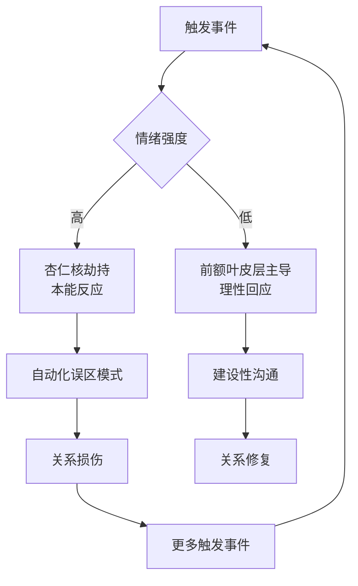

# 04 常见误区：情感沟通中的十个典型陷阱

> 情感沟通中的错误模式往往不是因为"不懂道理"，而是因为自动化的情绪反应绕过了理性思考。本章深入剖析十个最常见的误区，从心理学机制到具体纠正方法，帮助你识别并打破这些破坏性模式。

***

## 为什么我们会反复掉进同一个陷阱

在进入具体误区之前，先理解一个核心概念：**情感沟通中的错误模式不是随机发生的，它们有可预测的心理学根源。**

神经科学研究表明，当人处于情绪激动状态时，杏仁核（amygdala）会接管大脑的决策功能，前额叶皮层（负责理性思考和冲动控制）的活动会显著降低——这就是心理学家丹尼尔·戈尔曼所说的"杏仁核劫持"（amyddala hijack）。在这种状态下，人会本能地退回到最熟悉的行为模式，即使那些模式已经被反复证明是无效的。

**为什么了解误区本身不够？**

很多人读完"沟通技巧"后觉得"道理我都懂"，但实际场景中依然犯同样的错误。这是因为：

1. **自动化反应的速度远快于理性思考**：杏仁核的反应速度是前额叶的数倍，情绪爆发往往在你意识到之前就已经发生
2. **童年习得的模式根深蒂固**：你在原生家庭中学到的沟通方式会成为"默认设置"，成年后不自觉地重复
3. **误区模式有短期"收益"**：冷暴力能暂时避免冲突、翻旧账能暂时释放积怨——但代价是长期的关系损伤

打破误区模式需要的不仅是认知层面的"知道"，还需要反复练习来建立新的神经通路。这就像学习驾驶：刚开始需要刻意思考每个动作，熟练后才能自动化。

***

## 误区一：把"忍耐"当作"包容"

### 表现

很多人将情感沟通中的"不表达"误认为是"大度"和"包容"。他们选择压抑自己的不满、委屈和需要，觉得"说了也没用""说了会吵架""忍忍就过去了"。

常见场景：

- 伴侣反复做某件让你不舒服的事，你每次都选择沉默
- 朋友开了让你不舒服的玩笑，你笑着附和，内心却在流血
- 家人对你的人生选择指手画脚，你从不表达自己的立场
- 同事抢了你的功劳，你觉得"计较这些不好"

### 心理学机制

忍耐和包容在表面上看起来相同——都是"不计较"——但内在的心理过程完全不同：

| 维度 | 包容 | 忍耐 |
|------|------|------|
| 内在感受 | 平静，真的放下了 | 压抑，内心仍有波澜 |
| 情绪状态 | 接纳后的真实平和 | 否认后的虚假平静 |
| 对关系的影响 | 增进理解 | 积累怨恨 |
| 身体反应 | 无明显应激反应 | 慢性压力（肌肉紧张、睡眠问题） |
| 长期结果 | 关系健康 | 某一天突然爆发或逐渐冷漠 |
| 自我认知 | "我选择不计较" | "我不得不忍" |

心理学中的**压抑-反弹效应**（ironic rebound effect）告诉我们：越是刻意压抑某个想法或情绪，它越会以更强烈的方式反弹。这就是为什么"忍到忍不了"的爆发往往比及时表达要猛烈得多——它是所有被压抑情绪的集中释放。

长期忍耐还会导致**述情障碍**（alexithymia）——逐渐丧失识别和表达自己情绪的能力。忍耐太久的人，到后来可能真的不知道自己在感受什么了。

### 为什么这是误区

忍耐的代价是多层面的：

**身体层面**：长期压抑情绪会导致皮质醇（压力激素）水平持续升高，与心血管疾病、免疫功能下降、消化系统问题等密切相关。心身医学（psychosomatic medicine）的大量研究证实，被压抑的情绪会以身体症状的形式"说话"——失眠、胃痛、头痛、肩颈僵硬，这些都可能是忍耐的代价。

**心理层面**：忍耐会逐渐侵蚀自我价值感。每一次选择忍耐，你都在向自己传递一个信息："我的感受不重要"。长期下来，你可能真的开始相信这一点。

**关系层面**：当你选择忍耐，你就剥夺了对方了解你真实感受的机会，也剥夺了关系成长的可能性。真正的亲密关系建立在真实的基础上——如果对方看到的永远是你的"忍耐版本"而非真实版本，那这段关系的亲密度是有天花板的。

### 正确做法

**第一步：区分"可以放下"和"需要表达"**

不是所有事情都需要表达。学会使用"72小时测试"：如果这件事三天后你仍然在意，那就需要表达；如果三天后你已经忘了或觉得无所谓，那它确实是可以放下的小事。

**第二步：用"积累表达"替代"忍耐积累"**

当你决定要表达时，不要等到积怨爆发，而是在事情刚发生或刚积累到可感知的程度时就表达：

> "有件事我想跟你说。之前几次我都忍着没提，但我发现它一直在影响我，所以我想早点跟你说清楚……"

**第三步：区分"表达感受"和"指责对方"**

表达的目的是让对方了解你的感受，而不是让对方认错：

- ❌ "你每次都这样，太自私了！"（指责）
- ✅ "当你那样做的时候，我感到被忽视了。"（表达感受）

### 进阶：建立"情绪日志"习惯

如果你长期习惯忍耐，可以尝试每天花 5 分钟写情绪日志：

日期：____
今天让我不舒服的事：____
我的感受：____（用具体的情绪词，如"委屈""不被尊重""被忽视"）
我选择表达还是放下：____
如果放下，三天后是否还在意：____（三天后回来填写）

这个练习能帮你逐渐恢复对自身情绪的感知能力。

***

## 误区二：用"你总是/你从来不"开头

### 表现

在表达不满时，用绝对化的概括来描述对方的行为：

- "你总是迟到！"
- "你从来不关心我！"
- "你每次都这样！"
- "你永远只想到自己！"
- "你就没有一次记得过！"

### 心理学机制

绝对化语言在心理学中被称为**过度概括**（overgeneralization），是认知行为疗法（CBT）中识别出的典型**认知扭曲**之一。当人处于情绪激动状态时，大脑倾向于用简化的模式来处理信息——"你总是"比"你最近三次中两次迟到了"更容易脱口而出，也更能表达当下的愤怒。

但这种简化是有代价的。约翰·戈特曼（John Gottman）在其长达四十年的婚姻研究中发现，**批评**（criticism，即对对方人格的攻击，而非对具体行为的反馈）是"末日四骑士"之首——预测关系破裂的四大因素之一。"你总是……"这种句式，本质上就是对人格的定义。

### 为什么这是误区

绝对化语言有两个致命问题：

**第一，它几乎不可能是真的。** 对方不可能"从来不"关心你或"总是"迟到。一旦你使用了绝对化语言，对方只需要举出一个反例就能"推翻"你的说法，对话立刻变成争辩事实，而不是讨论感受。你们会陷入一场毫无建设性的"举反例大赛"：

> "你从来不帮我做家务！"
> "我上周不是帮你洗碗了吗？"
> "就那一次！"
> "怎么就一次了？上个月我也……"

这场争论的结果？两个人都不开心，原始问题完全没被讨论。

**第二，它是一种人格攻击。** 当你对一个人说"你总是……"，你不是在描述一个行为，而是在定义他是一个什么样的人。没有人喜欢被贴标签。对方接收到的信息不是"我这次迟到了"，而是"我是一个总是迟到的、不可靠的人"。这种被定义的感觉会立刻触发防御机制，对话就此失去建设性。

### 正确做法

用具体的、特定的描述替代绝对化的概括。这是**非暴力沟通**（Nonviolent Communication, NVC）框架中"观察"步骤的核心——描述客观事实，而非主观判断。

| 错误示范 | 正确示范 |
|----------|----------|
| "你从来不帮我做家务。" | "这周一到周三的晚餐后，洗碗都是我一个人做的。" |
| "你总是不在乎我的感受。" | "昨天那件事让我觉得你没有考虑我的感受。" |
| "你每次都迟到！" | "今天和上周三我们约好的时间你都迟到了。" |
| "你永远只想到自己！" | "这次的安排没有考虑到我的需求，我感到被忽视。" |

**转换公式：**

把"你总是/从来不 + [负面人格描述]"转换为"[具体时间/事件] + [具体行为] + [我的感受]"

示例：
- "你总是不听我说话" → "刚才我跟你说话的时候你在看手机，我觉得自己不被重视"
- "你从来不关心我" → "我生病那天你没有问过我一句，我感到有些孤单"

### 为什么这个转换如此有效

具体化的描述之所以有效，是因为它：

1. **可验证**：对方无法反驳"今天你迟到了15分钟"这个事实
2. **不触发防御**：你在描述一个行为，而不是定义一个人格
3. **指向改变**：具体的描述让对方知道该改变什么，而"你总是"让人觉得无从改起
4. **维护尊严**：行为可以改变，但人格标签会让对方感到绝望

***

## 误区三：用"对不起，但是……"道歉

### 表现

道歉时在"对不起"后面加上"但是"、"不过"或"如果你觉得"：

- "对不起，但是我当时真的很累。"
- "对不起，不过你也有问题。"
- "对不起，如果你觉得受伤了的话。"
- "我道歉，但我不是故意的。"
- "好好好，对不起行了吧？"

### 心理学机制

有效的道歉需要包含五个要素，心理学家亚伦·拉扎尔（Aaron Lazare）在《道歉》一书中总结为：

1. **承认事实**：明确说出你做了什么
2. **承担责任**：承认这是你的错
3. **理解影响**：表明你理解这对对方造成了什么伤害
4. **表达悔意**：真诚地感到抱歉
5. **提出修复**：愿意采取行动弥补

"对不起，但是……"的问题在于，它在第一步就打了折扣——"但是"之后的内容实质上是在撤回前面的道歉。

### 为什么这是误区

**"但是"之前的话都是铺垫，"但是"之后才是真正的意思。** 这是语言学中的基本规律。加了"但是"的道歉，本质上是在说："我道歉，但这不是我的错/你也有责任/你的感受可能是你自己想多了。"

更深层的问题是"假道歉"的几种变体：

| 假道歉类型 | 示例 | 实际含义 |
|-----------|------|----------|
| 转移责任型 | "对不起，但是我当时真的很累" | 我有正当理由，错不在我的行为而在你的反应 |
| 反击型 | "对不起，不过你也有问题" | 我道歉了，但你也不是无辜的 |
| 否认感受型 | "对不起，如果你觉得受伤了" | 你的受伤可能是你自己的问题 |
| 敷衍型 | "好好好，对不起行了吧" | 我不觉得我错了，但我不想继续吵了 |
| 条件型 | "我道歉，但你以后也别再这样了" | 我的道歉是有条件的 |

这些假道歉不但不能修复关系，反而可能让对方更生气——因为你连道歉都不真诚。研究表明，接受一个不真诚的道歉，比不接受任何道歉更让人感到愤怒。

### 正确做法

**道歉就是道歉，不要混合其他内容。** 遵循以下结构：

**第一步：纯粹地道歉**

明确说出你做了什么、你承认那是错的：

> "对不起，我昨天对你发了脾气。那是我的错。"

**第二步：承认对方的感受**

> "我知道那让你很难过/很生气/很委屈。"

**第三步：表达修复意愿**

> "我能做什么来弥补？"

**第四步（如有需要）：独立地解释**

如果你确实需要解释当时的情况，用一个独立的句子，不要用"但是"连接：

> "当时的情况是……"（不是"但是当时的情况是……"）

**第五步（如有需要）：独立地讨论对方的责任**

如果对方确实也有责任，那是一个独立的话题，不要塞在道歉里一起谈：

> "等这件事处理完之后，我想和你聊聊另一个问题，是关于……"

### 进阶：道歉的层次模型

Level 1（基本）：承认错误 + 表达歉意
    "对不起，我迟到了。"

Level 2（中等）：承认错误 + 表达歉意 + 理解影响
    "对不起，我迟到了。让你在冷风里等了半小时，一定很不舒服。"

Level 3（高级）：承认错误 + 表达歉意 + 理解影响 + 提出修复
    "对不起，我迟到了。让你在冷风里等了半小时，一定很不舒服。今天的晚饭我来安排，你什么都不用操心。"

Level 4（深度）：承认错误 + 表达歉意 + 理解影响 + 提出修复 + 行为改变承诺
    "对不起，我迟到了。让你在冷风里等了半小时，一定很不舒服。今天的晚饭我来安排。以后我会提前出门，如果实在来不及，我会提前告诉你让你先找地方等。"

大多数关系中的道歉只需要达到 Level 2-3。Level 4 适用于严重的或反复发生的错误。

***

## 误区四：要求对方"别哭了/别生气了/想开点"

### 表现

当对方面临强烈情绪时，急于让对方停止情绪表达：

- "别哭了，哭有什么用？"
- "别生气了，至于吗？"
- "你就不能想开点？"
- "开心点，没什么大不了的。"
- "别想那么多了。"
- "好了好了，别难过了。"

### 心理学机制

情绪有一个被广泛误解的特性：**情绪需要被"经历"才能消退。** 心理学中有一个概念叫**情绪波浪**（grief wave），指的是情绪像波浪一样，来了、达到顶峰、然后自然消退——但前提是你要让它"流过"你，而不是试图阻断它。

当你要求对方"别哭了"，你实际上是在要求他们阻断情绪波浪。这会导致两种后果之一：

1. **情绪被压抑，但没有消失**：它会以其他形式表现出来——失眠、身体不适、突然在其他小事上爆发
2. **对方感到被否定**：不仅原本的情绪没有处理，还新增了"我的感受不被接受"的二次伤害

约翰·鲍尔比（John Bowlby）的**依恋理论**告诉我们，在亲密关系中，当一个人表达脆弱情绪时，他实际上是在发出"依恋信号"——"我需要你靠近我、保护我、理解我。"如果你的回应是"别哭了"，你就是在拒绝这个依恋信号，对方的不安全感会加剧而非缓解。

### 为什么这是误区

这些话的潜台词是：**你的情绪是不对的/没用的/不应该有的。** 即使你的出发点是心疼对方，效果却是让对方觉得自己的感受被否定了。

情绪不是水龙头，不能说关就关。神经科学研究表明，强烈情绪一旦被激活，需要 20-30 分钟才能在生理层面完全消退（这是心率、皮质醇水平、肌肉张力等指标的恢复时间）。你要求对方"别生气"，是在对抗生理规律。

更关键的是，很多人说"别哭了"时，真正的潜台词是："你的情绪让我不舒服，请停止。"——这是在满足你自己的需要，而非对方的。面对他人的强烈情绪会引发我们自身的不适感（镜像神经元的作用），我们本能地想终止这种不适，而不是去容纳对方的情绪。

### 正确做法

**核心原则：允许情绪存在，提供陪伴而非指令。**

| 错误示范 | 正确示范 | 为什么有效 |
|----------|----------|-----------|
| "别哭了。" | "哭吧，我在这里陪着你。" | 允许情绪释放，提供安全感 |
| "别生气了。" | "你有权利生气。我能做点什么吗？" | 肯定情绪的合理性，提供支持 |
| "想开点。" | "这件事确实让人很难受。你想聊聊吗？" | 验证感受，邀请但不强迫 |
| "没什么大不了的。" | "这对你来说很重要，我理解。" | 尊重对方的价值判断 |
| "好了好了。" | "慢慢来，不着急。" | 给予时间和空间 |

**"情绪容纳"的具体步骤：**

1. **暂停你的建议冲动**：在你想说"你应该……"的时候，先停下来
2. **用身体语言表达陪伴**：靠近对方、轻拍背部、握住对方的手（如果对方接受身体接触）
3. **用简短的语言确认**："嗯""我理解""这确实很难"
4. **等待对方情绪自然消退**：不要催促
5. **在对方平静后，询问需求**："你现在需要什么？需要我帮忙想想办法，还是只是需要有人陪？"

### 特殊情况处理

**如果对方的情绪表达方式是有破坏性的**（比如摔东西、辱骂、自伤），你需要做的是：

1. 首先确保安全（移除危险物品、保护自己和对方）
2. 用平静但坚定的语气说："我理解你现在非常愤怒/痛苦，但摔东西/伤害自己不是解决问题的方式。我在这里，等你准备好了我们再谈。"
3. 这不是"否定情绪"，而是"设定行为边界"——情绪可以有，但表达方式需要不伤害自己和他人

***

## 误区五：在争吵中翻旧账

### 表现

在当前的冲突中，把过去已经解决或者从未提出过的问题拿出来作为论据：

- "你还好意思说我？你去年那次……"
- "你每次都这样，就跟上次一样！"
- "你以为你之前做的那些事我都忘了吗？"
- "你好意思说我？你妈上次来的时候你做了什么？"
- "你不也……吗？"（whataboutism）

### 心理学机制

翻旧账的心理学本质是**未处理的积怨（resentment）在寻找出口**。当过去的伤害没有被正式处理和疗愈时，它们不会消失，而是储存在情绪记忆中。一旦新的冲突触发了类似的情绪，旧伤就会同时被激活——这就是为什么一次小事争吵会迅速升级为"总账清算"。

神经科学的角度：情绪记忆储存在杏仁核中，它的特点是**高度持久、难以消退**，且容易被类似的情境触发。这就是为什么一个旧伤口即使在意识层面已经被"原谅"，在情绪层面可能仍然敏感。

### 为什么这是误区

翻旧账有两个核心问题：

**第一，它让当前的冲突扩大化。** 本来只需要解决一个问题，翻旧账之后变成了要同时解决十个问题。人类的注意力和情绪处理能力是有限的——当话题不断跳跃，双方都会感到 overwhelmed（不堪重负），最终哪个问题都解决不了。

**第二，它传递了一个毁灭性的信息：我一直在记着你犯过的每一个错。** 这会让对方感到：

- **无论怎么做都无法弥补**：旧账清单可能无限长，对方会产生绝望感——"反正我怎么做你都不会放下"
- **不被信任**：你记住了每一个错误，说明你从未真正原谅过之前的任何一个
- **关系无进步**：如果三年前的错误还在被提出来，那这三年的改变有什么意义？

### 正确做法

**原则：一次只讨论一件事。**

在冲突升级之前，用"聚焦法"拉回当前议题：

> "我现在想先说清楚今天的事。关于之前那件事，如果你觉得也需要谈，我们可以另外找时间专门聊。"

**关于"旧账"的正确处理方式：**

1. **如果旧账从未被正式处理**：承认它需要被处理，但选择一个独立的时间和空间来谈，而不是塞在当前冲突里
2. **如果旧账已经被"原谅"但仍在翻**：这说明当初的原谅不够彻底——你需要诚实地问自己，当初是真的放下了，还是只是"算了"
3. **如果你发现自己总是翻旧账**：这可能说明你有未被处理的深层需求——不是"那件事"本身的问题，而是那件事背后让你感到的某种需求（被尊重、被重视、被理解）从未被满足

**"未愈合伤口"的独立处理流程：**

1. 选择一个双方都平静的时间（不是在争吵中）
2. 告诉对方你想谈一件"过去的事"："有件事一直在我心里，我想跟你聊聊，不是为了追究，而是我想真正放下它。"
3. 用非暴力沟通的方式表达：那次事件 + 你的感受 + 你当时需要什么 + 你现在需要什么
4. 倾听对方的回应
5. 共同寻找一个"完结仪式"——比如对方的一次正式道歉、一个承诺、或一个象征性的行动

***

## 误区六：用冷暴力代替沟通

### 表现

生气时不说话、不理人、拒绝回应对方的任何尝试：

- "没什么。"（实际上很生气）
- 摔门离开，不接电话，不回消息
- 持续几天的冷淡和沉默
- 在同一个屋檐下完全无视对方的存在
- 对方主动示好时冷脸回应
- "我没事"（语气明显在说"我有事"）

### 心理学机制

冷暴力在心理学中被称为**石墙行为**（stonewalling），是戈特曼"末日四骑士"之一。研究表明，它是预测关系破裂的最强因素之一——甚至比频繁争吵更有害。

为什么？因为争吵至少说明双方还在乎、还在投入精力试图解决问题。冷暴力传递的信息是："你已经不值得我花费任何精力了。"这是对关系的最深层否定。

神经科学研究发现了一个惊人的事实：**被冷暴力激活的脑区，与身体疼痛激活的脑区高度重叠。** 社会神经科学家马修·利伯曼（Matthew Lieberman）的 fMRI 研究证实，社会排斥（被无视、被排斥）会激活前扣带皮层（anterior cingulate cortex）——这个区域同时负责处理身体疼痛。被无视真的会"痛"，这不是矫情，而是神经层面的事实。

### 为什么这是误区

**冷暴力是情感沟通中最具破坏力的行为之一**，原因如下：

1. **它是关系的"毒药"**：冷暴力不断累积，直到一方彻底放弃——"我已经对你无话可说了"
2. **它不能解决问题，只能推迟问题**：当冷战结束后，问题还在那里，甚至因为压抑而变得更加严重
3. **它会形成恶性循环**：冷暴力→对方更焦虑地追逼→你更想逃避→冷暴力加剧
4. **它摧毁安全感**：被冷暴力的一方会逐渐形成"关系不安全"的信念——"他随时可能不理我"
5. **它是一种权力控制**：无论是否有意，冷暴力客观上制造了权力不对等——你掌控了关系的"开关"

**冷暴力的深层来源：**

很多人使用冷暴力不是因为"故意伤害对方"，而是因为：

- **回避型依恋模式**：在原生家庭中，冲突从未被正面处理过，你学会了"冷处理"作为默认策略
- **情绪过载**：你确实需要冷静，但不知道如何表达"我需要时间"
- **无力感**："说了也没用"——你对沟通已经失去信心
- **惩罚心理**：你想让对方"尝尝被忽视的滋味"（这是最具破坏力的动机）

### 正确做法

**关键区分：冷暴力 ≠ 需要冷静**

| 维度 | 冷暴力 | 需要冷静 |
|------|--------|----------|
| 沟通 | 不解释地消失 | 明确告知"我需要时间" |
| 意图 | 惩罚对方或逃避问题 | 为了更好地回来解决问题 |
| 时间 | 不确定，可能是几天 | 有明确的时间承诺 |
| 后续 | 对方要主动来求和 | 自己主动回来继续沟通 |
| 对方感受 | 焦虑、被抛弃、不安全 | 理解、尊重、被信任 |

**如果你需要冷静，这样说：**

> "我现在情绪很激动，说出来的话可能会伤害你。我需要 20 分钟冷静一下。20 分钟后我回来，我们再继续谈。"

> "我现在不想说话，但不是因为不在乎你。我只是需要时间整理一下自己的情绪。一个小时后我来找你。"

**关键要素：**

1. **解释原因**："我情绪激动"——让对方知道不是因为他"不值得"
2. **给出时间**："20 分钟""一个小时"——让对方知道这不是无限期的冷战
3. **承诺回来**："我会回来继续谈"——让对方知道你不会逃跑
4. **遵守承诺**：说 20 分钟就 20 分钟回来——这是建立信任的关键

### 修复已有的冷暴力模式

如果你已经养成了冷暴力的习惯，改变需要分三步走：

1. **自我觉察**：在你想"冷处理"的时刻，停下来问自己——"我现在是在保护自己，还是在惩罚对方？"
2. **学习替代语言**：把"不想说话"替换为"我需要冷静一下，____分钟后回来"
3. **事后复盘**：每次使用"需要冷静"而非冷暴力后，和对方确认——"我刚才那样说，你的感受是什么？"这能帮你验证新方式是否有效

***

## 误区七：把"解决问题"等同于"关心"

### 表现

当对方向你倾诉感受或困扰时，你立刻跳到解决方案模式：

- 对方："今天工作好累。" 你："那你换一份工作呗。"
- 对方："我跟朋友吵架了，好难过。" 你："你当时应该这样那样说……"
- 对方："我觉得自己什么都做不好。" 你："你可以去报个课程提升一下。"
- 对方："最近压力好大。" 你："你试试冥想/运动/早睡。"
- 对方："我和我妈又吵架了。" 你："你应该跟你妈好好沟通。"

### 心理学机制

这个误区有深层的性别和人格因素。研究显示，男性在面对他人的负面情绪时，比女性更容易进入"修复模式"——这部分与社会化过程有关（"男子汉要解决问题"），部分与大脑处理情绪信息的方式有关。

但无论性别，"问题解决型回应"的背后往往是：

1. **对他人情绪的不适感**：对方的负面情绪让你不舒服，你想尽快"修复"这种不适
2. **能力焦虑**：你觉得自己"应该"帮上忙，而"给建议"是你知道的最直接的方式
3. **共情能力的局限**：你难以区分"对方需要情感支持"和"对方需要实际帮助"

心理学家约翰·戈特曼提出的**"滑动门时刻"**（sliding door moment）概念完美诠释了这个场景：当对方向你发出情感连接的信号时，你有两个选择——"转向"（turning toward，回应情感）或"转离"（turning away，忽略或跳过）。每次你选择"转离"，关系的情感银行账户就少了一笔存款。

### 为什么这是误区

**很多时候，对方倾诉的目的不是寻求解决方案，而是需要情感上的共鸣和理解。** 当你立刻给出建议时，你传递的信息是：

- "你的情绪是一个需要被解决的问题"（而非"你的感受我听见了"）
- "你不够有能力自己解决"（而非"我相信你能处理好"）
- "我不耐烦听你的感受，直接说解决方案吧"（而非"我愿意陪伴你经历这个过程"）

更重要的是，**大多数人在感受到被理解之前，是无法接受建议的。** 这是心理学的基本规律：当一个人的情绪没有被回应时，他的大脑仍然处于"情绪脑"模式，理性建议根本进不去。你说了也白说。

### 正确做法

**核心原则：先连接情感，再讨论方案。**

使用"情感优先"的三步回应法：

**第一步：回应情绪（必须）**

> "听起来你今天真的很辛苦。"
> "跟朋友吵架一定很难受。"
> "你最近承受了很多压力。"

**第二步：深入了解（推荐）**

> "工作中遇到什么事了？"
> "你现在最在意的是什么？"
> "你最难受的是哪个部分？"

**第三步：询问需求（关键）**

> "你现在需要我帮你想想怎么办，还是只是想找人说说？"

这一步至关重要——它把选择权交给了对方。很多时候，当你真正听完和理解了对方，他自己就能找到解决方案。他需要的不是你的建议，而是你的理解。

**一个实用的判断技巧：**

如果你不确定对方需要什么，注意这些信号：

| 对方可能需要情感支持的信号 | 对方可能需要实际建议的信号 |
|---------------------------|---------------------------|
| 反复描述感受（"太难受了""好累"） | 明确提问（"你觉得我该怎么办？"） |
| 使用情绪词（"委屈""失望""害怕"） | 询问具体信息（"你有没有遇到过这种情况？"） |
| 寻求认同（"你说我是不是太敏感了？"） | 列出选项让你帮忙分析 |
| 不需要你回应，只是在倾诉 | 主动向你求助 |

### 进阶：回应情感的具体话术库

当你不确定该说什么时，以下话术可以帮到你：

**确认感受：**
- "你的感受完全可以理解。"
- "换做是我，我也会很难受。"
- "这件事确实让人很沮丧。"

**表达好奇：**
- "你愿意多说一些吗？"
- "后来呢？"
- "那件事对你来说意味着什么？"

**表达陪伴：**
- "我在这里。"
- "不管怎样，我都在你身边。"
- "你不是一个人面对这些。"

**避免说的话：**
- ❌ "你应该……"（在对方未请求建议时）
- ❌ "至少你还有……"（否定对方的痛苦）
- ❌ "别人比你更惨"（比较痛苦）
- ❌ "这没什么大不了的"（否定重要性）
- ❌ "你想太多了"（否定思考的价值）

***

## 误区八：在公开场合批评或取笑伴侣

### 表现

在朋友聚会、家庭聚餐等公开场合：

- 当众指出伴侣的缺点或错误
- 跟别人分享伴侣的糗事来取乐
- 在外人面前贬低伴侣的能力或决定
- 用"开玩笑"来掩饰批评："哈哈，他就是这么笨。"
- 在朋友面前抱怨伴侣的种种不是
- 当众纠正伴侣的说法或做法

### 心理学机制

公开批评之所以比私下批评更具杀伤力，是因为它同时触发了两种伤害：

1. **来自批评本身的伤害**：和私下批评一样让人痛苦
2. **来自公开羞耻的伤害**：在第三者面前被贬低，会触发深层的羞耻感（shame）——这是一种极其痛苦的、涉及自我价值核心的情绪

心理学家布琳·布朗（Brené Brown）的研究区分了**内疚（guilt）** 和**羞耻（shame）**：内疚是"我做了一件坏事"，羞耻是"我是一个坏人"。公开批评极易触发羞耻感——"在别人面前，我的伴侣认为我是不好的。"

约翰·戈特曼的研究更直接地指出：**蔑视（contempt）是预测关系破裂最强的因素，其准确率高达 93%。** 公开贬低伴侣正是蔑视的典型表现——它传递的信息是"你在我眼里的地位如此之低，我可以在外人面前随意贬低你。"

### 为什么这是误区

**公开批评是一种"双重伤害"——既伤了关系，又伤了尊严。**

1. **它在"观众"面前放大了伤害**：私下被批评已经让人难受，在公开场合被批评更是让人感到羞耻和被背叛
2. **它破坏了关系的"安全基地"**：伴侣应该是你最安全的港湾。如果连在公开场合都不能被维护，安全感从何而来？
3. **它向外界传递了关系的负面信号**：外人看到的是"这个人不尊重自己的伴侣"——这对双方的社会形象都有损害
4. **"开玩笑"的掩饰不成立**：即使你"只是开玩笑"，但如果对方没有笑，那它就不是玩笑。真正善意的幽默是双方都笑的，而不是一方在笑、另一方在忍

### 正确做法

**在公开场合的核心原则：维护伴侣的尊严，如同维护自己的尊严。**

具体做法：

1. **在朋友面前多说伴侣的好话**：这不仅让伴侣感到被尊重，也向外界传递了你们关系的积极信号
2. **如果有不满，私下沟通**：找一个只有你们两个人的时间和空间
3. **如果朋友起哄让你"爆料"伴侣的糗事**，转移话题或说："这个我得回去跟他/她私下聊。"
4. **如果你的伴侣在公开场合做了让你不满的事**，不要当场发作，事后私下沟通

**如果你想幽默地互动**，遵循以下边界：

- ✅ 双方都享受这种互动
- ✅ 内容是善意的
- ✅ 不涉及对方的敏感点
- ✅ 对方在场且能随时叫停
- ❌ 对方不在场时"替"对方讲糗事
- ❌ 涉及对方的外貌、能力、家庭等敏感话题
- ❌ 对方明显不自在时继续

***

## 误区九：把"不说话"当作"没有意见"

### 表现

在关系中做重大决定时，一方沉默不语，另一方就默认他同意了：

- "你当时也没说不同意啊？"
- "我问了你，你什么都没说，我以为你没意见。"
- "你要是不同意你怎么不说？"
- "你现在又来说不同意，当初干嘛去了？"

### 心理学机制

沉默是一个**高度多义的信号**——它可以表示同意、不同意、在思考、不知道怎么表达、觉得说了也没用、害怕冲突、等待对方先表态、情绪过载……将沉默默认为同意，是一种**归因错误**——你用自己最方便的解释替代了真实的可能。

在亲密关系中，很多人选择沉默不是因为没有意见，而是因为：

- **害怕引发冲突**：过去表达不同意见曾经导致争吵
- **觉得自己的意见不重要**：长期被忽视后形成的习得性无助
- **习惯了顺从**：原生家庭中养成的"不要给大人添麻烦"的模式
- **对关系中的沟通已经失去信心**："说了也没用，不如不说"
- **权力不对等**：关系中存在隐性的控制，沉默是"安全"的选择

### 为什么这是误区

**将沉默默认为同意，本质上是在逃避沟通责任。**

更深层的问题是：**当这些沉默累积到一定程度，可能会以更剧烈的方式爆发。** "我忍了你这么多年"这句话背后，往往是无数次没有被注意到的沉默。沉默者的内心独白是：

> "每一次我沉默，你都当成同意。你从来没有问过我真正怎么想。你关心过我的意见吗？"

当忍耐到达临界点，爆发的烈度和突然性往往让另一方完全摸不着头脑——"我一直以为你没意见啊？"——这是因为长期的"默认同意"掩盖了真实的意见分歧。

### 正确做法

**主动邀请对方表达，而不是默认沉默等于同意。**

**对于"等待方"：**

1. **主动邀请**："我想听听你的想法。你对这件事怎么看？"
2. **创造安全的表达环境**："不管你怎么想，我都想听。没有对错之分。"
3. **用开放性问题替代封闭性问题**：
   - ❌ "你同意吗？"（对方只需要点头/摇头）
   - ✅ "你对这件事的感受是什么？你最在意的是什么？"（邀请展开）
4. **给足时间**：有些人需要时间思考，不要急于要求即时回应
5. **反复确认**："你说的我理解了，你的意思是……对吗？"

**对于"沉默方"：**

1. **从小事开始练习表达自己的偏好**：今天想吃什么、周末想去哪里
2. **使用"表达困难"的元沟通**："我想说但不知道怎么表达，给我一点时间。"
3. **认识到表达不同意见不是"找麻烦"**：它是关系健康的基本要素
4. **如果对方给了安全的表达环境，尝试信任它**：从小事开始验证

### 进阶：建立"定期沟通"机制

为了避免沉默积累，可以建立一个定期的"关系检查"机制：

每周/每月一次，花 20-30 分钟，轮流回答以下问题：

1. 这段时间，你对我们的关系最满意的是什么？
2. 这段时间，你有什么不太舒服但没说的？
3. 有什么我可以做得更好的？
4. 你最近的个人需求是什么？我能帮什么忙？

规则：
- 不打断
- 不辩解
- 只倾听和确认
- 等一方说完后，另一方才开始

这种机制能系统性地防止"沉默积累→突然爆发"的模式。

***

## 误区十：以为"说了对不起"就应该"立刻被原谅"

### 表现

道歉后对方还在生气或伤心，就觉得不耐烦：

- "我都说对不起了，你还想怎样？"
- "你到底要我怎么样？我都道歉了！"
- "你这样揪着不放有意思吗？"
- "我们能翻篇了吗？"
- "你到底要生气多久？"
- "我都道歉了你还这样，是不是你太小气了？"

### 心理学机制

**道歉是你的责任，原谅是对方的权利。** 这两件事发生在不同的时间线上。

信任可以被一个行为瞬间摧毁，但重建需要无数个行为的累积。这是心理学中的**不对称原理**——破坏的速度远远快于重建的速度。就像一栋楼可以一分钟内被炸毁，但建造它需要几年。

依恋理论提供了另一个视角：当你伤害了伴侣，你动摇了他对这段关系的"安全依恋"。安全依恋的重建需要：

1. **对方确认你的道歉是真诚的**（而非只为了平息争吵）
2. **对方观察到你的行为发生了实际改变**（而不仅仅是口头承诺）
3. **对方在多次互动中逐渐恢复对关系的安全感**

这个过程不可能被压缩——你不能要求对方"加速"原谅，就像你不能要求骨折"加速"愈合。

### 为什么这是误区

**催促对方原谅，本质上是在说：** "我不想承受你还在受伤带来的不适感，请尽快结束这种不适。"这是在关注自己的感受，而非对方的。

更糟糕的是，催促原谅会产生以下后果：

1. **让对方感到内疚**："我还在生气是不是我的错？"——这反而把受害者变成了"加害者"
2. **让对方觉得你的道歉不真诚**：如果你真的理解自己造成的伤害，你会给对方足够的时间
3. **中断了修复过程**：原谅需要时间来"发酵"，催促会打断这个过程
4. **制造新的伤害**：在原有伤害的基础上，新增"你不原谅我就是你小气"的二次伤害

### 正确做法

**道歉之后，给对方时间和空间：**

> "我知道你需要时间，我愿意等。"
> "你慢慢来，不管多久我都接受。"
> "我不想催你，但我想让你知道，我会用行动来证明我的改变。"

**用持续的行动来证明改变，而非用言语催促原谅：**

- 如果你道歉说"以后会更关心你"，那就接下来的日子持续地表现出关心
- 如果你道歉说"不会再说那种话"，那就从今以后真的不说
- 如果你道歉说"会更尊重你的感受"，那就从现在开始，在每一个小事上展示尊重

**关于"多久才能原谅"的现实预期：**

| 伤害类型 | 预期修复时间 | 说明 |
|----------|-------------|------|
| 小事（迟到、忘记买菜） | 几小时到一天 | 一个真诚的道歉通常足够 |
| 中等伤害（说了伤人的话、忽视重要日子） | 几天到一两周 | 需要道歉 + 后续行为改变 |
| 严重伤害（背叛信任、重大欺骗） | 几周到几个月 | 需要持续的行动证明 + 可能需要专业帮助 |
| 核心伤害（反复的同一伤害、深层背叛） | 几个月甚至更久 | 可能需要伴侣治疗，且对方有权选择不原谅 |

**如果你发现过了很长时间对方仍然无法释怀：**

1. 温和地询问："你觉得我们现在怎么样？有什么我可以做的吗？"
2. 不要追问"你原谅我了没有？"
3. 如果超过合理时间（比如几个月）仍然没有任何缓解，建议寻求专业的情感咨询帮助
4. 诚实地评估：你的行为是否真的发生了改变？还是你只是道歉了但行为依旧？

***

## 误区总结与自测

### 十大误区一览表

| 误区 | 核心问题 | 正确方向 | 心理学根源 |
|------|----------|----------|-----------|
| 把忍耐当包容 | 压抑感受 | 区分小事包容和大事表达 | 压抑-反弹效应 |
| "你总是"开头 | 绝对化概括 | 用具体事件描述 | 认知扭曲（过度概括） |
| "对不起，但是" | 假道歉真辩解 | 纯粹道歉，分开讨论 | 自我防御机制 |
| "别哭了" | 否定情绪 | 允许情绪，提供陪伴 | 镜像神经元不适 + 依恋理论 |
| 翻旧账 | 冲突扩大化 | 一次只讨论一件事 | 未处理的情绪记忆 |
| 冷暴力 | 惩罚性沉默 | 明确告知需要冷静 | 回避型依恋 + 情绪过载 |
| 只解决问题 | 忽视情感需求 | 共情优先，建议在后 | 滑动门时刻 |
| 公开批评 | 伤害尊严 | 私下沟通，公开维护 | 羞耻感 + 蔑视预测理论 |
| 沉默=同意 | 假设代替询问 | 主动邀请表达 | 习得性无助 + 归因错误 |
| 催促原谅 | 关注自己不适 | 给时间和行动证明 | 信任重建的不对称性 |

### 自测：你最容易掉进哪个陷阱？

以下问题帮你快速识别自己的沟通盲区。对每个问题回答"是"或"否"，统计你回答"是"的题目对应的误区编号：

1. 我经常在事后回想"当时我应该说出来" → 误区一
2. 我在生气时容易使用"总是""从来"这类词 → 误区二
3. 我道歉时经常忍不住加"但是"或解释 → 误区三
4. 我看到别人哭或生气时第一反应是想让他们停下来 → 误区四
5. 吵架时我会想起以前的很多事 → 误区五
6. 我生气时会选择不说话、不理人 → 误区六
7. 朋友向我倾诉时我总是先想怎么帮他解决 → 误区七
8. 我在朋友面前说过伴侣的糗事或缺点 → 误区八
9. 伴侣不说话时我通常默认他没有意见 → 误区九
10. 我道歉后如果对方没很快原谅我会感到不耐烦 → 误区十

**结果解读：**

- **0-2 个"是"**：你的情感沟通基础比较扎实，继续精进即可
- **3-5 个"是"**：你有 2-3 个需要重点改善的沟通模式
- **6+ 个"是"**：建议系统性地学习情感沟通技能，可以考虑从非暴力沟通（NVC）入手

### 改变的路径

识别误区只是第一步。真正改变一个沟通习惯，需要经过以下阶段：

大多数人读完一篇关于误区的文章后，会从"无意识无效"进入"有意识无效"——这已经是巨大的进步，因为你开始能观察到自己的行为了。

从"有意识无效"到"有意识有效"需要反复练习。建议：

1. **每次只聚焦改变一个误区**：同时改十个习惯会让你哪个都改不好
2. **选择你最容易犯的那一个**：从自测中"是"的题目里选一个
3. **在低风险的场景中先练习**：比如先在朋友关系中练习，再在亲密关系中使用
4. **记录每次练习的结果**：什么有效、什么需要调整
5. **对自己有耐心**：改变一个习以为常的模式通常需要 21-66 天（根据习惯研究的数据），不要因为几次失败就放弃

***

## 这些误区背后的共同规律

这十个误区的共同特点是：**表面上是沟通方式的问题，实质上是缺乏对对方情感的真正关注。**

纠正这些误区不需要多么高超的技巧，只需要一个根本性的转变——把注意力从"我想说什么"转向"对方需要听到什么"，从"我想表达我的不满"转向"我想维护这段关系"，从"我要赢这场争吵"转向"我们要一起解决这个问题"。

这个转变不容易，但每一次你成功地避开一个误区，都是在为你们的关系存入一笔"情感存款"。戈特曼的研究发现，稳定幸福的关系中，正面互动与负面互动的比例至少是 5:1——也就是说，每一次负面互动需要五次正面互动来平衡。避开误区，就是在减少"取款"；学会正确的情感沟通，就是在增加"存款"。
