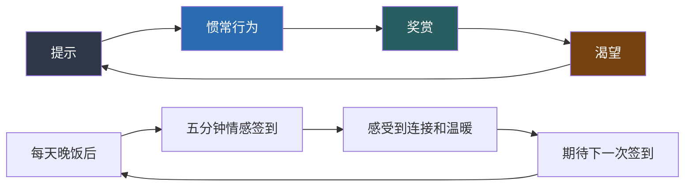

# 05 练习方法

> 从每日微习惯到每周深度训练，从个人自我修炼到关系共同成长——一套完整的、经过行为科学验证的情感沟通练习体系。

***

## 一、为什么"知道"和"做到"之间隔着一条鸿沟

在前面四节中，你已经了解了情感沟通的理论基础（依恋理论、爱的语言、情感账户、情绪管理）、核心技巧（表达感受、倾听感受、处理冲突、重建信任、维护关系）、实战案例和常见误区。如果你只是阅读了这些内容，你可能会有一种"我全懂了"的错觉。

但请诚实地问自己：你上一次在伴侣面前发火的时候，还记得非暴力沟通的四步法吗？你上一次感到被忽视的时候，能够准确地命名自己的情绪吗？

**知识和能力之间存在本质区别。** 你不会因为读了一本游泳教材就会游泳，不会因为看了钢琴教学视频就能弹奏肖邦。情感沟通也是一项技能——它需要反复练习，直到新的反应模式取代旧的本能反应，成为你的"自动驾驶"行为。

### 1.1 习惯养成的科学原理

行为科学的研究为我们提供了关于习惯养成的关键洞见：

**习惯回路模型。** 查尔斯·杜希格在《习惯的力量》中提出，每个习惯都由三个要素组成：**提示（Cue）→ 惯常行为（Routine）→ 奖赏（Reward）**。要建立情感沟通的新习惯，你需要明确这三个要素。例如："每天晚饭后（提示），和伴侣进行五分钟情感签到（惯常行为），感受到彼此的温暖和连接（奖赏）。"

**微习惯策略。** 斯坦福大学行为设计实验室的BJ·福格教授提出：行为改变的关键不是意志力，而是从极小的行动开始。"每天做两个俯卧撑"比"每天健身一小时"更容易坚持。同样，"每天写一个情绪词"比"每天写完整的情绪日记"更容易形成习惯。本节的练习设计遵循这一原则——从每天2-5分钟的微小行动开始。

**习惯叠加。** 将新习惯附加在已有的稳定习惯之后，可以显著提高成功率。例如："刷完牙后（已有习惯），花两分钟做情绪觉察练习（新习惯）"，或者"午饭后散步时（已有习惯），给伴侣发一条关心的消息（新习惯）。"

**21天到66天。** 伦敦大学学院的研究表明，形成一个稳定的新习惯平均需要66天，而非流行的"21天"说法。更重要的是：偶尔遗漏一天不会破坏习惯的养成，不必因为某天没做到就自暴自弃。

### 1.2 练习的核心原则

在开始具体的练习方案之前，请牢记以下五个原则：

**原则一：从最小可行行动开始。** 不要试图一次性改变所有沟通习惯。选择一个最能解决你当前困境的练习，从它开始。当它变成习惯后（约2-3周），再增加新的练习。

**原则二：过程重于结果。** 练习的目的不是"做得完美"，而是"持续在做"。即使你今天的非暴力沟通说得很别扭，即使你在情绪觉察中只识别出了"不爽"这一个词，这都比什么都没做好一万倍。

**原则三：允许反复。** 你一定会有回到旧模式的时候——在压力下、在疲惫时、在被触发的时候。这不是失败，而是正常的学习曲线。关键是在"回到旧模式"之后，能更快地觉察到，并更快地调整回来。

**原则四：与关系中的人沟通你的练习。** 如果你的练习涉及伴侣或家人，提前告诉他们你在学习情感沟通。这不是示弱，而是邀请对方成为你的练习伙伴。"我在读一本关于情感沟通的书，想尝试一些新的沟通方式，可能有时候会有点不自然，希望你能给我一些反馈"——这句话本身就是一次高质量的情感沟通。

**原则五：定期复盘调整。** 每两周回顾一次自己的练习情况：哪些练习对你最有帮助？哪些练习你总是跳过？跳过的原因是什么？根据实际情况调整练习方案，而不是死板地执行计划。

***

## 二、每日练习：建立情感沟通的微习惯

每日练习是整个练习体系的基础。它们设计为每天只需要2-10分钟，可以融入日常生活的节奏中。以下是六个核心每日练习，建议从其中2-3个开始，逐步扩展。

### 练习1：情绪日签——建立你的情绪词汇库

**每天5分钟 | 可独立完成 | 适合所有水平**

**目的：** 提升情绪觉察能力，建立识别和命名情绪的习惯。这个练习的底层原理是神经科学中的"情绪标签化"（Affect Labeling）效应——当你用语言准确命名一个情绪时，大脑杏仁核的活跃度会降低，情绪的强度会自然减弱。换句话说，准确地识别和命名情绪本身就具有调节情绪的效果。

**方法：**

每天在固定时间（建议睡前），回答以下三个问题并记录：

1. **今天我最主要的情绪是什么？** 用具体的词汇，而非"还好""一般""不开心"这类笼统的描述
2. **是什么事件触发了这个情绪？** 具体描述事件，越详细越好
3. **这个情绪背后有什么需要没有被满足或被满足了？** 这一步将情绪与需要连接起来

**示例记录：**

> 日期：周三
> 情绪：沮丧、自我怀疑、夹杂着一点愤怒
> 事件：开会时提了一个建议，被领导当众直接否定了，还说"这个想法不成熟"
> 需要：需要被尊重和被认真对待。即使建议不好，也希望被以不伤害自尊的方式回应
> 身体感受：胸口发闷，肩膀紧绷

**进阶路径：**

| 阶段 | 时间 | 要求 | 示例 |
|------|------|------|------|
| 入门期 | 第1-2周 | 每天识别1个主要情绪 | "不开心""生气" |
| 成长期 | 第3-4周 | 每天识别2-3个不同情绪 | "沮丧+自我怀疑+一点愤怒" |
| 精进期 | 第5-6周 | 注意情绪间的细微差别 | "失落"≠"悲伤"，"焦虑"≠"害怕" |
| 高级期 | 第7周起 | 连接情绪与身体感受 | "胸口发闷=焦虑，下巴紧绷=压抑的愤怒" |

**情绪词汇进阶表：**

很多人情绪词汇匮乏，以下是一份从基础到进阶的情绪词汇表，帮助你更精确地描述内心体验：

| 基础词 | 中级词 | 高级词 |
|--------|--------|--------|
| 不开心 | 失落、沮丧、郁闷 | 空虚、虚无感、存在性倦怠 |
| 生气 | 愤怒、恼火、烦躁 | 暴怒、义愤、无力的愤怒 |
| 害怕 | 担心、焦虑、不安 | 恐惧、惊慌、存在性焦虑 |
| 难过 | 悲伤、伤心、心痛 | 哀恸、绝望、深切的哀伤 |
| 开心 | 高兴、愉快、满足 | 欣喜、狂喜、宁静的喜悦 |
| 尴尬 | 羞愧、不好意思、难堪 | 屈辱、羞耻、暴露感 |
| 孤单 | 寂寞、被忽视、被冷落 | 孤立、被遗弃感、存在性孤独 |
| 感动 | 温暖、感恩、被爱 | 深深的感恩、无条件的爱、敬畏 |

**为什么有效：** 加利福尼亚大学洛杉矶分校（UCLA）的马修·利伯曼（Matthew Lieberman）教授通过fMRI脑成像研究证实，当被试者用语言标注负面情绪时（如"我现在感到焦虑"），大脑右侧腹外侧前额叶皮层（rVLPFC）的活动增强，同时杏仁核的活动显著降低。这一过程被称为"命名即驯服"（Name it to tame it）。利伯曼在实验中发现，仅仅是用一个词来描述情绪，就能将杏仁核的激活降低约30%。

***

### 练习2：五分钟情感签到——与重要的人保持情感同步

**每天5分钟 | 需要伴侣或家人配合 | 适合所有水平**

**目的：** 建立日常情感沟通的固定节奏，保持对彼此内心世界的实时了解。这个练习来自情绪聚焦疗法（EFT）的核心理念——定期的情感分享是关系健康的"基础代谢"，就像人每天都需要吃饭喝水一样，关系每天都需要情感层面的连接。

**方法：**

每天找一个固定的时间（晚饭后、睡觉前、一起散步时），与伴侣或家人进行五分钟的情感签到：

1. **分享者** 用2-3分钟分享今天最重要的一件事以及它带给自己的感受
2. **倾听者** 用1-2分钟做反映式倾听和情感确认
3. 然后角色互换

**分享者的表达框架：**

"今天发生了一件事……（描述事件）
我感到……（说出情绪）
因为……（说明在意的是什么/什么需要没有被满足）"

**示例：**
> "今天下午我们组的项目方案被甲方退回来了（事件）。我感到很挫败，还有一些焦虑（情绪）。因为这个方案我花了很多心血，而且下周一就要交付了，我担心时间不够（需要/在意的是什么）。"

**倾听者的回应框架：**

"我听到你说……（复述事件的核心）
你感到……对吗？（确认情绪）
这完全可以理解。/你需要……这很重要。（情感确认）"

**示例：**
> "你们的方案被打回来了，你花了那么多心血的项目被退了，你肯定很受挫。下周一就要交，时间压力也很大。你需要什么？需要我帮你做点什么吗？"

**练习规则：**

| 规则 | 说明 | 原因 |
|------|------|------|
| 分享时只说感受，不给建议 | 倾听者不要说"你应该……" | 签到的目的是情感连接，不是问题解决 |
| 倾听时只做确认，不评判 | 不说"你这样想不对""有什么好生气的" | 评判会关闭对方的情感通道 |
| 如果今天不想分享 | 可以说"今天我不想说，但我很好" | 尊重个人边界，但保持连接仪式 |
| 不要在签到中翻旧账 | 签到只关注"今天" | 避免把安全的连接时刻变成冲突 |
| 设好闹钟 | 严格控制在5分钟内 | 避免变成冗长的谈话，保持仪式感 |

**为什么有效：** 苏·约翰逊（Sue Johnson）博士在情绪聚焦疗法（EFT）的研究中发现，伴侣之间定期的情感分享能够显著提高关系满意度。具体机制是：它创造了一个安全的"情感通道"，让双方习惯于用感受而非事件来交流，同时每天确认"我的感受被看见了"这一基本需求，防止情感账户的慢性透支。戈特曼的研究也支持这一点——幸福的伴侣每天都有"转向"（turning towards）彼此情感需求的行为，而这种日常小互动的累积效应远大于偶尔的大事件。

**不同场景的变体：**

- **异地恋：** 每晚视频通话时进行，可以用"今天我的情绪颜色是……"的比喻方式让签到更有趣
- **与孩子：** 对年幼的孩子，可以用"今天最开心的事和最不开心的事"作为简化版
- **与父母：** 可以从每周2-3次开始，不必强求每天
- **独居/单身：** 可以用"情绪日记"替代，或与好友通过语音消息进行

***

### 练习3：一个非暴力沟通句子——刻意练习表达框架

**每天5分钟 | 可独立完成 | 中级水平**

**目的：** 训练用"观察-感受-需要-请求"（NVC）的四步框架来表达。这个练习的重点不是在真实对话中"表演"非暴力沟通，而是通过书面练习让这个框架内化为你的思维方式。就像练字要先临帖，你需要先在纸上反复练习正确的结构，才能在压力下自然地使用它。

**方法：**

每天选择一件让自己有情绪反应的事情（不论大小），用非暴力沟通的四步框架写一个完整的句子：

观察：（客观描述发生了什么，只说事实）
感受：（说出你的情绪，用"我感到……"开头）
需要：（揭示情绪背后的需要）
请求：（提出一个具体、可行、允许拒绝的请求）

**完整示例：**

> **场景：** 同事把他的工作推给你做
>
> **观察：** 今天下午，小李把他负责的数据报表发给我，说他太忙了做不完，请我帮忙
> **感受：** 我感到不满和委屈，还有一些无奈
> **需要：** 因为我需要公平——我自己的工作量已经很大了，额外承担别人的工作让我觉得自己的时间和精力没有被尊重
> **请求：** 下次他再这样，我可以跟他说："我理解你很忙，但我自己手头的工作也排得很满。我们可以一起看看你的时间安排，或者跟领导商量一下优先级？"

**练习进阶路径：**

| 阶段 | 练习方式 | 时长 | 目标 |
|------|----------|------|------|
| 入门 | 纸上书写完整四步 | 每天5分钟 | 熟悉框架结构 |
| 进阶 | 心中默想四步但不写 | 随时 | 提高反应速度 |
| 实战 | 在真实对话中使用 | 随时 | 从刻意到自然 |
| 精通 | 自动化使用，不再需要想框架 | 自动 | 内化为本能 |

**练习中的常见问题：**

- **"我找不到自己的需要是什么"** —— 试试这个思考路径：这个情绪告诉我，我在乎什么？如果这件事完全不重要，我会不会有这个情绪？不重要的事情不会引起强烈情绪，所以情绪的存在本身就指向了你真正在乎的东西。
- **"观察和感受分不开"** —— 一个简单的检验方法：你的句子中有没有"你"字？如果有，那很可能是评判而非观察。"你很自私"是评判，"你没有征求我的意见就做了决定"是观察。
- **"我写了请求但觉得说出来很矫情"** —— 这很正常。书面练习的目的就是让你先在安全的纸上空间里体验这个过程，等你习惯了，自然就能在对话中说出来。

**注意事项：** 即使你最终不会按练习中的方式原封不动地说出来，光是这个梳理过程本身就能帮助你更好地理解自己的感受和需要。当你理解了自己的感受和需要，即使不用NVC的句式，你的沟通质量也会提高。

***

### 练习4：情感存款行动——持续向关系注入正能量

**每天2分钟计划+执行 | 需要关系对象 | 适合所有水平**

**目的：** 养成主动向关系中"存款"的习惯。回顾情感账户理论，关系质量取决于日常积极互动的持续积累。这个练习就是把"理论上的存款"变成"每天的行动"。

**方法：**

每天早上花2分钟想一想：**今天我能为我最重要的人做一件什么小事？**

然后在当天完成它。关键要求：**具体、微小、每天做。**

**存款行动灵感清单：**

按爱的五种语言分类，方便你根据对方的语言类型选择最有效的方式：

| 爱的语言 | 低成本存款（每天可做） | 中等存款（每周1-2次） | 高价值存款（每月1次） |
|----------|----------------------|----------------------|----------------------|
| 肯定言辞 | 一句具体赞美："你今天这件衣服真好看" | 写一张小纸条放在对方能看到的地方 | 写一封正式的感谢信或情书 |
| 精心时刻 | 放下手机，全神贯注听对方说5分钟 | 一起散步20分钟，不带手机 | 安排一次只属于两人的约会 |
| 接受礼物 | 买一杯对方喜欢的饮品 | 带回对方随口提过想吃的小零食 | 准备一份与对方某次提到的回忆相关的礼物 |
| 服务行动 | 帮对方做一件他通常要做的事 | 主动承担对方最不喜欢的家务 | 完成对方一直想做但没时间做的某件事 |
| 身体接触 | 出门前的拥抱（至少6秒）、回家时的亲吻 | 并肩坐在沙发上，轻轻靠着对方 | 给对方做一次按摩 |

**关键原则：**

- **不要等到"有灵感"或"有时间"** —— 情感存款最重要的是持续性，而非偶尔的大手笔。每天一个6秒的拥抱，远胜于一年一次的豪华旅行。
- **要具体** —— "谢谢你对我好"是模糊的，"谢谢你昨天特意绕路给我买了那杯咖啡"是具体的。具体的感谢比笼统的更有力。
- **记录和回顾** —— 用手机备忘录或日历标记每天做了什么。一周结束后回顾，你会惊讶于这些小事的累积效应。

**记录模板：**

周一：出门前拥抱了6秒 + 赞美了他做的早餐
周二：主动洗了碗 + 发了一条"想你"的消息
周三：买了他喜欢的奶茶
……
周末回顾：这周做了7件存款行动。对方的反应——周三收到奶茶时笑了很久。
下周改进：试试写一张小纸条。

**为什么有效：** 戈特曼的研究发现，幸福的婚姻中，伴侣之间的日常积极互动与消极互动的比例至少是5:1。这意味着你需要持续地、有意识地创造积极互动。情感存款行动就是把这个比例变得可操作——每天至少做一件"存款"行为，同时尽量减少"取款"行为。

***

### 练习5：情绪暂停练习——训练你的神经系统

**每天2分钟 | 可独立完成 | 适合所有水平**

**目的：** 训练在情绪上涌时按下暂停键的能力。这个练习的原理是：通过反复练习特定的呼吸节奏，你实际上在"编程"你的自主神经系统。当你在冲突中感到情绪上涌时，你的身体会自动记得这个节奏，帮助你从应激状态中恢复。

**方法：**

每天找一个安静的时刻（起床后、午休时、睡前），练习"盒子呼吸法"：

吸气 —— 4秒
屏气 —— 4秒
呼气 —— 4秒
屏气 —— 4秒

重复4-6轮，整个过程约2分钟。

**为什么选择盒子呼吸法：** 这是美国海军海豹突击队使用的压力管理技术。它的原理是：延长呼气时间（相对于吸气）能激活副交感神经系统（"休息和消化"系统），而有节奏的屏气能打断杏仁核劫持的恶性循环。4秒的节奏对大多数人来说既不太快也不太慢，容易记忆和执行。

**进阶练习体系：**

| 级别 | 内容 | 目的 |
|------|------|------|
| 基础版 | 纯呼吸练习，关注呼吸本身 | 建立呼吸节奏的肌肉记忆 |
| 中级版 | 呼吸结束后，想象一个让你不舒服的场景，观察身体反应，然后用呼吸缓解 | 在安全环境中练习情绪调节 |
| 高级版 | 在日常遇到小情绪时（堵车、排队、被催促），立即做2-3轮盒子呼吸 | 在真实场景中建立新的反应模式 |
| 实战版 | 在冲突中感到情绪上涌时，对对方说"我需要一分钟"，然后做盒子呼吸 | 在关系冲突中实际应用 |

**其他有效的情绪暂停技巧：**

除了盒子呼吸法，以下方法也被研究证明对情绪调节有效：

- **5-4-3-2-1感官锚定法**：看到5样东西、触摸4样东西、听到3种声音、闻到2种气味、尝到1种味道。这个练习通过将注意力从情绪转移到感官体验上来打断焦虑循环。
- **冷水刺激**：用冷水洗手或洗脸。低温刺激能激活迷走神经，快速降低心率和情绪强度。这是辩证行为疗法（DBT）中推荐的危机干预技术。
- **身体运动**：站起来走几步、做几个伸展动作。身体运动能消耗应激激素（如皮质醇和肾上腺素），帮助身体恢复平衡。

***

### 练习6：感恩三件事——培养积极情感的底色

**每天3分钟 | 可独立完成 | 适合所有水平**

**目的：** 培养关注积极事物的习惯，为情感沟通创造正面的情绪底色。研究表明，经常体验感恩情绪的人更倾向于主动维护关系、更善于识别他人的情感需求。

**方法：**

每天睡前写下今天三件让你感恩的事。要求：**具体且与人相关。**

感恩的事              | 与谁有关    | 我的感受
——————————————————————————————————————————————
同事帮我检查了报告中的错误 | 小王       | 感动、被支持
下班路上看到很美的晚霞    | （与自然有关）| 平静、美好
伴侣给我留了一半水果     | 伴侣       | 温暖、被在乎

**为什么要"与人相关"：** 积极心理学之父马丁·塞利格曼的研究发现，感恩练习中"与人相关的感恩"比"与事相关的感恩"对幸福感的提升效果更强。因为人类的幸福核心是关系，把感恩聚焦在关系上，既提升了个人幸福感，也强化了维护关系的动力。

**进阶版：** 每周选一天，将本周某一件感恩的事直接告诉相关的人。"谢谢你上周帮我检查报告，帮我避免了一个大错误"——这既是感恩练习，也是情感存款行动。

***

## 三、每周练习：深化情感连接的定期训练

每日练习负责"保持基本运转"，每周练习则负责"深度维护和升级"。它们需要更多时间和投入，但带来的情感回报也更大。

### 练习7：深度情感对话——超越日常琐事的连接

**每周一次 | 30-60分钟 | 需要伴侣或亲密朋友 | 中级水平**

**目的：** 超越日常的"今天吃什么""孩子作业做了吗"，深入了解彼此的内心世界。戈特曼的研究表明，幸福的伴侣对彼此有深入的了解（他称之为"爱情地图"），而且他们会持续更新这个了解。人是不断变化的，三年前的他和今天的他可能有不同的担忧和梦想。

**方法：**

每周安排一次与伴侣或亲密朋友的深度对话。选择一个安静、不被打扰的时间和环境。每次围绕一个主题进行分享。

**深度对话问题库（按主题分类）：**

**第一周：童年与成长**

这些问题帮助你理解对方情感模式的根源：

- "你记忆中最幸福的一个童年瞬间是什么？那时候的你是什么样的？"
- "你成长过程中对你影响最大的一件事是什么？它如何塑造了今天的你？"
- "你小时候最害怕什么？现在呢？"
- "你第一次感到真正被爱是什么时候？"
- "你的父母之间是如何表达爱的？这种方式对你有什么影响？"
- "你在成长过程中最缺失的一样东西是什么？"

**第二周：当下的感受**

这些问题帮助你了解对方此刻的内心状态：

- "最近你最担心的一件事是什么？你愿意跟我说说吗？"
- "你觉得我最不了解你的一个方面是什么？"
- "在我们的关系中，什么时候你感到最安全？什么时候最不安全？"
- "你最近一次感到特别开心是因为什么？"
- "有没有什么话你一直想对我说但不知道怎么开口？"
- "如果用一种天气来形容你最近的心情，会是什么？"

**第三周：需要与期待**

这些问题帮助你更精准地理解对方的情感需求：

- "你最近最需要但我没有给你的是什么？"
- "你觉得什么样的陪伴对你最有意义？"
- "你希望我在哪些方面更多地支持你？"
- "如果我只能改变一件事来让你更幸福，你希望是什么？"
- "你觉得自己在关系中最被忽视的一个需要是什么？"
- "你需要多少独处时间和多少相处时间？你的理想比例是怎样的？"

**第四周：梦想与未来**

这些问题帮助你们建立共同的方向感：

- "你对未来五年最期待的是什么？最害怕的是什么？"
- "如果你可以改变自己一个特点，你会改变什么？为什么？"
- "你小时候最大的梦想是什么？现在呢？这个梦想还在吗？"
- "十年后你希望我们的关系是什么样的？"
- "你人生中最想完成但还没有完成的一件事是什么？"
- "你希望后人记住你的什么？"

**对话规则：**

1. **先各自选择3个问题**，然后轮流分享
2. **分享时，另一人只倾听**，不打断，不评判，不给建议
3. **分享结束后**，倾听者做情感确认："你刚才说的让我感受到……谢谢你愿意告诉我这些。"
4. **对话结束时**，双方互相感谢："谢谢你愿意跟我分享这些。这些对我来说很重要。"
5. **不要在深度对话中讨论分歧或冲突** —— 这是一个纯粹的连接时刻

**常见问题及应对：**

| 问题 | 应对策略 |
|------|----------|
| "我们说着说着就吵起来了" | 严格遵守规则：深度对话中只倾听和确认，不讨论、不反驳。如果感觉要失控，暂停并约定另外找时间讨论分歧 |
| "我觉得这些问题太矫情了" | 从你最不排斥的问题开始。深度对话不需要一步到位——也许第一次只能聊到表层，随着练习的深入，会自然触及更深的层面 |
| "伴侣不愿意参加" | 自己先开始写（用日记的形式回答这些问题），然后偶尔分享一个片段给对方。不要强求，让对方看到你的变化，自然会产生兴趣 |
| "聊完之后反而觉得更不安了" | 这可能是因为你听到了一些让你不舒服的真实感受。把这看作是信任的信号——对方愿意对你说真话，说明他信任这段关系。不安的感受可以通过后续的沟通来处理 |

**为什么有效：** 戈特曼的"爱情地图"理论指出，幸福伴侣对彼此内心世界的了解程度远高于不幸伴侣。更关键的是，这种了解是持续更新的——人会变，对伴侣的了解也需要持续更新。每周的深度对话就是更新"爱情地图"的机制。

***

### 练习8：冲突复盘——从每次摩擦中学习

**每周一次 | 15-30分钟 | 可独立或与伴侣一起 | 中级水平**

**目的：** 从过去的冲突中学习，识别自己的沟通模式，避免重复同样的错误。大多数人对自己的冲突模式缺乏觉察——他们只是在每次冲突中本能地反应，然后在事后感到后悔或困惑。冲突复盘就是把"本能反应"变成"有意识的学习"。

**方法：**

每周找一个安静的时间，回顾本周是否有过任何不愉快的互动（不一定是大吵，哪怕是小摩擦、一个不舒服的瞬间也行），然后用以下框架进行复盘：

1. 发生了什么？（客观描述事件，像给外人讲一个故事一样）
2. 我当时的感受是什么？（识别自己的情绪，用具体的词汇）
3. 对方可能的感受是什么？（换位思考，尝试猜测）
4. 冲突背后的深层需要是什么？（穿透表面，找到双方的核心需求）
5. 我做得好的部分是什么？（肯定自己的进步，哪怕很小）
6. 我可以改进的部分是什么？（具体到"下次我可以说……""下次我先做……"）
7. 如果重来一次，我会怎么说/怎么做？（具体化改进方案，在心里排练一遍）

**完整复盘示例：**

> **事件：** 周四晚上，我跟伴侣说"你怎么又没洗碗"，他立刻回了一句"你就知道说我"，然后我们冷战了一晚上。
>
> **我的感受：** 不满（碗没洗）、委屈（我只是说了事实）、愤怒（他反过来指责我）
>
> **对方可能的感受：** 被指责（"又"这个字让他觉得被翻旧账）、委屈（他今天加班很累）、防御（觉得我在攻击他）
>
> **深层需要：** 我需要公平——家务应该共同分担。他需要被理解——他今天很累，希望我看到他的辛苦而不是只看到他没做的事。
>
> **我做得好的部分：** 在他说"你就知道说我"之后，我选择了沉默而不是继续争论。虽然沉默不完美，但比以前的升级争吵要好。
>
> **可以改进的部分：** 开头的方式。"你怎么又没洗碗"带有指责和翻旧账的意味。我可以说："我看到碗还没洗，你今天是不是特别累？"
>
> **如果重来：** 走到他身边，看看他的状态，说："你今天加班辛苦了。碗我来洗吧。"（先存款，明天再找合适的时机讨论家务分工的问题。）

**注意事项：**

- **复盘不是为了"我当初应该怎么赢"**，而是为了"我当初怎么能更好地连接"
- **如果涉及伴侣，可以一起复盘**，但要确保双方都心平气和时进行。如果一方还在情绪中，先各自复盘，之后再分享
- **不需要每次都找到"答案"** —— 有时候觉察到模式本身就是进步。"我发现自己每次被忽视时都会用愤怒来表达"——这个觉察本身就很有价值
- **给自己积极反馈** —— 注意到自己的微小进步。"上次类似的情况我直接摔门了，这次我至少忍住没说更难听的话"——这就是进步

***

### 练习9：写一封感谢信——训练正面情感的表达能力

**每周一封 | 15分钟 | 可独立完成 | 适合所有水平**

**目的：** 训练表达正面情感的能力，强化关系中的积极互动。很多人在表达不满时口若悬河，在表达感恩时却词穷。这个练习帮助你突破这个不对称。

**方法：**

每周给一个重要的人写一封简短的感谢信或感谢消息。不需要写得很长，3-5句话就好。关键：**具体化。**

**模板：**

亲爱的______，

我想感谢你______（具体的事）。
你这样做让我感到______（你的情绪）。
因为你在我生命中的存在，我______（积极的影响）。

谢谢你。

**不同对象的示例：**

| 对象 | 感谢信示例 |
|------|----------|
| 伴侣 | "亲爱的，谢谢你这周每天早上帮我泡好咖啡再叫我起床。这让我每天出门的时候都觉得被在乎着。有你在身边，我的日子过得比以前温暖很多。" |
| 父母 | "妈，谢谢你上周帮我带孩子，我知道你自己的膝盖也不舒服。你总是默默地帮我分担，让我在最累的时候有个依靠。谢谢你，我真的很幸运有你这样的妈妈。" |
| 朋友 | "老张，谢谢你上次听我吐槽工作的事。你没有急着给我建议，就是安静地听，这让我觉得不孤单。能有你这样的朋友，我觉得很踏实。" |
| 同事 | "小王，谢谢你帮我处理了那个报表。你总是那么靠谱，跟你合作让我很放心。" |
| 自己 | "亲爱的自己，谢谢你这周在情绪最低落的时候还是坚持完成了所有练习。你没有放弃，这本身就是一种勇敢。" |

**关键要求：**

- **不要笼统** —— "谢谢你对我好"太抽象了。"谢谢你昨天特意绕路给我买了那杯咖啡"才有力量
- **表达感受而非评价** —— "你很贴心"是评价，"你这样做让我感到被在乎"是感受
- **如果可以，直接发给对方** —— 如果你觉得太正式，可以改为发一条微信或口头说出来。但写下来的过程本身就有价值，即使你不发出去

**进阶版：** 写完后，如果条件允许，当面读给对方听。面对面的感恩表达是最有力的情感存款方式之一。

***

### 练习10：角色互换练习——真正理解对方的视角

**每周一次 | 20-30分钟 | 需要伴侣配合 | 高级水平**

**目的：** 培养换位思考能力，打破"我才是受害者"的自我中心视角。这个练习有时候会带来"顿悟"时刻——当你站在对方的角度说出那些话时，你可能会突然理解为什么他会那样反应。

**方法：**

选择本周你们讨论过或争论过的一个话题（最好是已经冷却下来的），进行角色互换：

**第一步：你扮演对方**
用对方的立场和感受来表达："我是（对方的名字），当（事件）发生的时候，我感到……因为对我来说……很重要。我真正需要的是……"

**第二步：对方扮演你**
用你的立场和感受来表达。

**第三步：分享感受**
各自说说在扮演对方时的感受——有什么是你之前没想到的？有什么是你突然理解了的？

**示例：**

> **原争论：** 一方想在周末去看望父母，另一方想在家休息
>
> **你扮演对方：** "我是小美，当你说想在周末去看你爸妈的时候，我感到有些疲惫和不被理解。因为我这一周工作压力特别大，周六是我唯一可以补觉和放松的时间。对我来说，休息不是偷懒，而是我恢复能量的方式。我需要的是你理解我并不是不想见你的父母，而是我现在真的需要休息。"
>
> **你的真实感受：** "我在扮演你的时候，突然意识到你这周确实很累。我只想着要尽孝心，没有看到你真的撑不住了。"

**规则：**

| 规则 | 说明 |
|------|------|
| 忠实于对方的真实感受 | 不要扮演你"觉得"对方应该有的感受，而是尽量去感受对方真实的感受 |
| 如果不确定，先问 | "你是这样想的吗？" —— 对方可能会纠正你的理解，这本身就是沟通 |
| 不要变成比较 | 不要把这个练习变成证明"我比你更理解你"的工具 |
| 从轻松的话题开始 | 先用不那么敏感的话题练习，等双方都适应了再处理敏感议题 |
| 结束后拥抱 | 身体接触能帮助你们从"角色"回归到"伴侣" |

***

## 四、每月练习：关系健康的全面体检

### 练习11：情感沟通"体检"——用数据追踪关系质量

**每月一次 | 30-60分钟 | 需要伴侣配合 | 中级水平**

**目的：** 定期评估和调整关系中的情感沟通状态，就像每年体检能及早发现身体问题一样，定期的关系体检能帮助你们及早发现和修复潜在的情感隐患。

**方法：**

每月找一个安静的时间（比如月初的第一个周末），和伴侣一起回答以下问题，并打分（1-10分）：

**情感沟通体检表：**

| 维度 | 评估问题 | 你的分数 | 对方分数 | 差异 |
|------|----------|---------|---------|------|
| 表达安全度 | 我在这段关系中能自在地表达任何感受，包括负面的吗？ | ___/10 | ___/10 | ___ |
| 倾听质量 | 当我表达时，我觉得对方真的在听、在理解我吗？ | ___/10 | ___/10 | ___ |
| 冲突处理 | 我们能建设性地处理分歧吗？冲突后能修复关系吗？ | ___/10 | ___/10 | ___ |
| 情感连接 | 我觉得我们之间有深度的情感连接，而不只是生活搭子吗？ | ___/10 | ___/10 | ___ |
| 信任程度 | 我信任对方会尊重和保护我的脆弱吗？ | ___/10 | ___/10 | ___ |
| 欣赏表达 | 我经常感到被欣赏和被感谢吗？ | ___/10 | ___/10 | ___ |
| 独立空间 | 我在关系中有足够的个人空间吗？ | ___/10 | ___/10 | ___ |
| 共同成长 | 我觉得我们在一起变得更好了吗？ | ___/10 | ___/10 | ___ |
| 亲密质量 | 我们的亲密关系（情感和身体）让我满意吗？ | ___/10 | ___/10 | ___ |
| 共同愿景 | 我们对未来有共同的方向感吗？ | ___/10 | ___/10 | ___ |

**对话规则：**

1. **先各自独立打分**，然后分享——不要在对方打分时"偷看"或施加影响
2. **分享时只说"我"的感受** —— "我在这个维度上只打了4分，因为我觉得……"，而不是"你打那么高分说明你根本不知道我的感受"
3. **对于分数较低的项目**，讨论："我们可以做什么来改善这个维度？" —— 聚焦于解决方案，而不是追究责任
4. **关注差异** —— 如果同一个维度，你打4分，对方打8分，这个差异本身就是一个需要沟通的信号
5. **不要追求完美分数** —— 6-8分的范围是健康的。10分的关系可能意味着双方在回避冲突，而不是真正和谐
6. **对比上个月的分数** —— 观察趋势比单次分数更重要。一个维度从4分涨到5分就是进步

**体检后的行动模板：**

本月体检结果：
最高分维度：倾听质量（8分）
最低分维度：亲密质量（4分）

需要改善的：
1. 亲密质量（4分）—— 计划：每周安排一次"无手机约会"
2. 共同愿景（5分）—— 计划：本月底花一个下午讨论未来五年的规划

保持做得好的：
1. 倾听质量（8分）—— 继续每天的情感签到

下个月重点关注：亲密质量

**为什么有效：** 将关系质量"数据化"有两个好处。第一，它把模糊的"感觉不太好"变成了具体可讨论的维度，让沟通有了抓手。第二，定期追踪分数趋势，能在问题还很小的时候就发现——远比等到"爆发"了再处理要好得多。

***

### 练习12：关系复盘日——更宏观的视角

**每月一次 | 1-2小时 | 需要伴侣配合 | 高级水平**

**目的：** 跳出日常琐事，从更宏观的视角审视关系的状态、方向和需要。如果说每天的情感签到是"日常维护"，每周的深度对话是"定期保养"，那么每月的关系复盘就是"年度大检修"。

**方法：**

每月选一个周末下午或晚上，找一个安静舒适的环境，进行1-2小时的关系复盘。

**复盘框架：**

**Part 1：感恩与肯定（15分钟）**
- 本月你最感激对方的一件事是什么？
- 本月对方做得最好的一个改变是什么？
- 本月你最欣赏对方的一个瞬间是什么？

**Part 2：回顾与学习（20分钟）**
- 本月我们最大的一次冲突/摩擦是什么？我们从中学到了什么？
- 本月我们的沟通模式有什么变化？（好的和不好的）
- 上个月的改善计划执行得怎么样？

**Part 3：需要与期待（20分钟）**
- 下个月我最需要对方做的一件事是什么？
- 我最近有什么新的感受或想法想分享？
- 有什么话题是我一直想谈但还没有开口的？

**Part 4：共同计划（15分钟）**
- 下个月我们要一起做的一件特别的事是什么？
- 下个月的重点改善目标是什么？
- 我们需要调整哪些日常习惯？

***

## 五、个性化练习方案：不同依恋风格的专项训练

不同依恋风格的人在情感沟通中有不同的薄弱环节，因此需要针对性的练习。以下是基于依恋风格的专项练习建议。

### 5.1 焦虑型依恋者的专项练习

焦虑型依恋者的核心挑战是：对被抛弃的恐惧导致过度反应和过度需求。

**练习A：自我安抚日记**

当你感到焦虑（比如对方没有及时回复消息），在做出任何反应之前，先完成这个日记：

1. 我现在的焦虑程度（1-10分）：___
2. 我脑海中在编造的故事是什么：___
3. 这个故事有客观证据支持吗：___
4. 最可能的实际情况是什么：___
5. 即使最坏的情况是真的，我能应对吗：___
6. 我能为自己做一件让自己感觉好一点的事吗：___

**练习B：独立活动时间**

每周安排至少2小时完全属于自己的时间——做一件只与自己有关的事（阅读、运动、兴趣爱好）。这个练习的目的不是"减少对伴侣的需要"，而是"在独处中也能感受到自己的完整性"。焦虑型依恋者的底层信念是"没有你我就不完整"，而独立活动时间在帮助你挑战这个信念。

**练习C：延迟反应训练**

当对方没有及时回复消息时，练习等待。从等待15分钟开始，逐步延长到1小时。在等待期间，做自我安抚日记或从事其他活动。这个练习不是压抑你的焦虑，而是在焦虑中学会容纳它、与它共处，而不是立刻做出反应。

### 5.2 回避型依恋者的专项练习

回避型依恋者的核心挑战是：对亲密的本能回避导致情感表达不足。

**练习A：每日一句情感表达**

每天至少向伴侣或亲密的人说一句包含情感的话。可以很小：

- "今天看到你做的晚饭，我觉得很温暖"
- "你不在的时候我有点想你"
- "谢谢你帮我做的那件事，我感到被在乎"

这个练习的目的不是让你"变成一个感性的人"，而是扩展你的情感表达能力。回避型依恋者的底层信念是"表达需要是软弱的"，而这个练习在帮你体验到：表达需要可以是力量而非软弱。

**练习B：主动分享脆弱**

每周至少一次，主动分享一个你通常不会分享的感受或经历。可以从很小的事开始：

- "今天工作上出了一个小错，我觉得有点丢脸"
- "我有时候不确定自己做得够不够好"

分享脆弱不是示弱，而是邀请对方走进你的内心世界。对回避型依恋者来说，这是最难但最有价值的练习。

**练习C：身体接触扩展**

每天至少一次主动的身体接触——一个拥抱、牵一下手、拍一下肩膀。回避型依恋者往往对身体接触感到不自在，但研究表明，身体接触能促进催产素分泌，增强信任感和亲密感。从你感到舒适的程度开始，逐步扩展。

### 5.3 安全型依恋者的练习重点

如果你是安全型依恋者，你的练习重点是：

- **成为伴侣的"安全基地"** —— 学习如何在伴侣情绪波动时不被卷入，同时保持温暖和支持
- **引导伴侣的成长** —— 用你的安全感带动伴侣走出不安全的模式
- **维护自己的边界** —— 安全型依恋者有时会过度迁就伴侣，需要练习在关心对方的同时也照顾自己的需要

***

## 六、练习计划总览：分阶段的行动方案

### 入门阶段（第1-4周）：建立基础习惯

这个阶段的核心目标是**建立最基础的每日习惯**，让情感练习成为你生活的一部分。

| 频率 | 练习名称 | 时长 | 核心目的 |
|------|----------|------|----------|
| 每天 | 情绪日签 | 5分钟 | 建立情绪觉察习惯 |
| 每天 | 情感存款行动 | 2分钟 | 养成主动关心的习惯 |
| 每天 | 情绪暂停呼吸练习 | 2分钟 | 训练神经系统 |
| 每周 | 写一封感谢信 | 15分钟 | 训练正面情感表达 |

**入门阶段总投入：每天约9分钟 + 每周15分钟**

**入门阶段检查清单：**
- [ ] 我已经连续7天完成情绪日签
- [ ] 我能识别并命名至少5种不同的情绪
- [ ] 我已经完成了4封感谢信
- [ ] 我能在情绪上涌时主动使用盒子呼吸法
- [ ] 我的伴侣/家人知道我在学习情感沟通

### 进阶阶段（第5-8周）：增加互动练习

在入门阶段的基础上，增加需要与他人互动的练习。

| 频率 | 练习名称 | 时长 | 核心目的 |
|------|----------|------|----------|
| 每天 | 五分钟情感签到（与伴侣） | 5分钟 | 建立日常情感连接 |
| 每天 | 一个非暴力沟通句子 | 5分钟 | 练习NVC框架 |
| 每天 | 感恩三件事 | 3分钟 | 培养积极情感底色 |
| 每周 | 深度情感对话 | 30-60分钟 | 深入了解彼此 |
| 每周 | 冲突复盘 | 15-30分钟 | 从冲突中学习 |

**进阶阶段总投入：每天约20分钟 + 每周45-90分钟**

**进阶阶段检查清单：**
- [ ] 我已经能够使用NVC四步法在纸上写出完整的表达
- [ ] 我和伴侣建立了固定的情感签到时间
- [ ] 我们已经进行了至少2次深度情感对话
- [ ] 我能够识别自己的冲突模式，并在复盘中找到改进方案
- [ ] 我的情绪觉察精度提高了——能区分"失落"和"悲伤"等细微差别

### 深化阶段（第9周起）：全面深化

在前两个阶段的基础上，增加进阶练习，全面深化情感沟通能力。

| 频率 | 练习名称 | 时长 | 核心目的 |
|------|----------|------|----------|
| 每周 | 角色互换练习 | 20-30分钟 | 培养换位思考能力 |
| 每月 | 情感沟通"体检" | 30-60分钟 | 定期评估和调整 |
| 每月 | 关系复盘日 | 1-2小时 | 宏观审视关系方向 |
| 持续 | 依恋风格专项练习 | 融入日常 | 针对性改善薄弱环节 |

**深化阶段新增：**
- 开始在真实对话中使用NVC框架（而只是纸上练习）
- 将情绪暂停练习升级为在冲突中的实战使用
- 开始关注对方的爱的语言并调整自己的表达方式

***

## 七、练习中的常见困难及深度应对

### 困难1："我坚持不下来"

**本质原因：** 目标太大，启动阻力太高。

**具体应对策略：**

| 策略 | 操作方法 |
|------|----------|
| 缩小到不可失败 | 如果"每天写情绪日记"坚持不下来，先改成"每天在手机上打一个情绪词" |
| 习惯叠加 | 把新习惯附加在已有习惯之后：刷完牙→做2分钟呼吸练习 |
| 设置可见提醒 | 在床头贴一张纸条："今天的情绪是什么？"或在手机上设一个每日提醒 |
| 找一个练习伙伴 | 和伴侣或朋友约定一起练习，互相监督和鼓励 |
| 允许"最低配" | 如果今天实在没心情做完整版，做个最低配版就好。做了2分钟也比0分钟好 |
| 跟踪连续天数 | 用日历或App记录连续完成的天数。视觉化的连续记录会给你"不想中断"的动力 |

**关键认知：** 不需要一次性开始所有练习。从最小的一个开始——比如每天的情绪日签只需要5分钟。当它成为习惯后再增加新的练习。研究表明，习惯的形成不在于坚持的天数是否连续，而在于"做了多少次"——偶尔遗漏一天不会破坏习惯的养成。

### 困难2："我觉得很刻意、很不自然"

**本质原因：** 所有新技能在开始时都会经历"有意识无能力"阶段。

**具体应对策略：**

- **接受"刻意"是必经之路** —— 就像学开车时觉得每个动作都要想，但熟练后就变成了自动驾驶。刻意练习是通向自然表达的唯一路径
- **先在纸上练** —— 如果在对话中使用NVC框架让你觉得尴尬，先在日记中练习。纸上的"刻意"没有社交压力
- **从安全的场景开始** —— 不要在最激烈的冲突中尝试新技巧。先在日常小事中练习——"今天天气很好，我心情不错"——在轻松的场景中建立信心
- **给自己积极反馈** —— 每次你成功地使用了新技巧（哪怕很别扭），在心里给自己一个肯定："我做到了"

### 困难3："伴侣不愿意配合"

**本质原因：** 对方可能把你的"练习"理解为"你觉得我有问题"。

**具体应对策略：**

| 情况 | 应对方法 |
|------|----------|
| 对方觉得你在"表演" | 解释你的真实动机："我在学习更好地表达自己，不是在做戏" |
| 对方觉得你在"改造"他/她 | 强调："我在改变的是我自己，不是在改变你" |
| 对方不感兴趣 | 从自己做起。你先改变自己的沟通方式，对方自然会感受到不同 |
| 对方有抵触情绪 | 给对方空间，不要强求。一个人的改变就能改变整个关系的动力学 |

**关键认知：** 不要等对方一起改变。约翰·戈特曼的研究发现，即使是单方面的沟通方式改善，也能显著改变关系的互动模式。你的改变会被对方感知到，并引发对方的回应性改变——这就是关系系统中的"涟漪效应"。

### 困难4："练习后反而觉得更不顺利了"

**本质原因：** 这是正常的学习曲线效应，被称为"能力觉醒期"（conscious incompetence）。

当一个人开始学习一项新技能时，会经历四个阶段：

你现在处于第二阶段——"有意识无能力"。在这个阶段，你同时在"使用"和"监控"自己的沟通，所以会觉得比以前更"笨拙"。但这是进步的标志——你已经开始看到自己以前看不到的模式了。随着练习的深入，新的模式会逐渐变得自然（进入第三和第四阶段）。

### 困难5："我不知道自己做得对不对"

**本质原因：** 情感沟通没有标准答案，这让追求"确定性"的人感到不安。

**具体应对策略：**

- **关注对方的反应** —— 对方是否更愿意和你分享感受了？冲突后的恢复时间是否缩短了？这些都是"做得对"的信号
- **定期复盘** —— 每周的冲突复盘会告诉你，你的新方式是否有效
- **和伴侣讨论** —— "我最近在尝试用新的方式表达感受，你觉得有变化吗？"这本身就是一次高质量的情感沟通
- **接受不完美** —— 情感沟通没有100%的"正确率"。即使是沟通专家也会有失误的时候。重要的是持续地尝试和调整

### 困难6："我没有时间"

**具体应对策略：**

重新审视你的时间分配。每天9分钟（入门阶段的全部投入），大约是你刷朋友圈时间的1/5。如果你觉得关系值得投入，9分钟一定找得到。

| 省时策略 | 说明 |
|----------|------|
| 情感签到可以合并到已有场景 | 晚饭时、散步时、一起做家务时都可以进行 |
| 情绪日签可以在通勤时做 | 在心里回答三个问题，不用写下来 |
| 感谢信可以变成微信消息 | 3句话，30秒就能写完 |
| 呼吸练习可以在睡前做 | 不需要额外找时间，躺在床上就能做 |

### 困难7："我试了NVC，对方反而更生气了"

**可能原因：**

1. **你的语气暴露了真实情绪** —— 用愤怒的语气说"我感到受伤"，对方听到的是攻击而非表达
2. **时机不对** —— 在对方情绪最激动的时候尝试"理性沟通"，会被理解为"你在教我做事"
3. **NVC不是万能钥匙** —— 有些情境需要先处理情绪，再进行结构化沟通

**应对方法：**

- 先处理情绪（暂停、呼吸、各自冷静），等双方都平静了再用NVC框架沟通
- NVC框架先在纸上练习，直到它成为自然反应，再在对话中使用
- 如果对方对"NVC句式"敏感，可以在心里用这个框架组织思路，但用更自然的语言说出来

***

## 八、寻求专业支持：什么时候需要帮助

### 8.1 需要专业帮助的信号

如果你发现以下任何一种情况，建议寻求专业的心理咨询或夫妻治疗：

| 信号 | 具体表现 |
|------|----------|
| 反复循环 | 你们反复在同一个问题上争吵，每次都说"下次不会了"，但下次还是老样子 |
| 情绪失控 | 某一方有严重的情绪管理困难——频繁的暴怒、长期的冷漠、无法控制的哭泣 |
| 信任破裂 | 关系中存在严重的信任危机——出轨、长期欺骗、财务隐瞒 |
| 原生家庭影响 | 你发现自己在重复父母的关系模式，即使你知道那样不好 |
| 情感隔离 | 你觉得自己对伴侣已经"没有感觉了"——不是生气，而是"什么感觉都没有" |
| 不知所措 | 你想系统地提升情感沟通能力，但不确定从何开始，需要专业的引导 |

### 8.2 如何选择合适的心理咨询师

| 考量维度 | 具体建议 |
|----------|----------|
| 资质 | 选择有国家心理咨询师资格证或注册心理师资格的专业人员。夫妻/伴侣治疗建议找接受过EFT（情绪聚焦疗法）或Gottman方法培训的咨询师 |
| 匹配度 | 第一次咨询后评估：你是否感到被理解？你是否能在这个人面前说真话？咨询师和来访者之间的"治疗关系"本身就是疗愈的一部分 |
| 方式 | 伴侣治疗和个人咨询可以同时进行——个人咨询处理你的内在模式，伴侣治疗处理你们的互动模式 |
| 频率 | 通常建议每周一次，每次50分钟。伴侣治疗可能会更长（75-90分钟）。大多数伴侣治疗的疗程在8-20次之间 |
| 费用 | 国内心理咨询的费用从300元到1500元/次不等。如果经济压力大，可以选择医院心理科（有医保报销），或寻找实习咨询师（有督导，费用较低） |

### 8.3 如何说服伴侣一起去做伴侣治疗

这是最常见的困难之一。以下是一些建议：

- **不要在冲突中提出** —— 在平静的时候、在一个积极的语境中提出
- **用"我们"而非"你"** —— "我觉得我们可以一起学习更好的沟通方式"，而不是"你需要去跟咨询师谈谈"
- **正面框架** —— "这不是因为我们有问题，而是因为我们值得更好的关系"
- **给对方选择权** —— "你可以先了解了解，不想去也没关系"
- **从自己开始** —— 如果伴侣实在不愿意，你可以先做个人咨询。当对方看到你的变化，可能会更愿意参与

**关键认知：** 寻求专业帮助不是"关系有问题"的标志，而是"我们在认真对待这段关系"的表现。最好的运动员也有教练——在情感沟通这个领域，心理咨询师就是你的教练。

***

## 九、推荐资源：持续学习的路径

### 9.1 推荐书目

| 书名 | 作者 | 核心内容 | 适合阶段 |
|------|------|----------|----------|
| 《非暴力沟通》 | 马歇尔·卢森堡 | 表达感受和需要的四步框架 | 入门必读 |
| 《亲密关系》 | 罗兰·米勒 | 关系心理学的全面教材 | 系统学习 |
| 《爱的五种语言》 | 加里·查普曼 | 理解不同的爱的表达方式 | 入门必读 |
| 《幸福的婚姻》 | 约翰·戈特曼 | 基于研究的婚姻维护策略 | 进阶必读 |
| 《依恋的力量》 | 阿米尔·莱文 | 成人依恋风格的理解和应用 | 进阶 |
| 《情绪急救》 | 盖伊·温奇 | 处理情感创伤的实用指南 | 入门 |
| 《情绪》 | 莉莎·费德曼·巴瑞特 | 情绪的建构理论，打破传统情绪认知 | 深度研究 |
| 《关系的重建》 | 约翰·戈特曼 | 婚姻研究的最新成果 | 深度研究 |
| 《自我觉醒》 | 丹尼尔·戈尔曼 | 情商的最新理解和应用 | 进阶 |
| 《正念的奇迹》 | 一行禅师 | 用正念觉察情绪和提升在场感 | 辅助练习 |

**阅读方法：** 不要只读不练。每读完一章，选择一个你觉得最有用的点，本周就在关系中实践它。一本300页的书，如果只有一个关键理念被你真正实践了，就比读了100本书但一个都没有实践更有价值。

### 9.2 推荐的练习辅助工具

| 工具类型 | 推荐 | 用途 |
|----------|------|------|
| 情绪追踪App | Daylio、Moodflow | 每日情绪记录，自动分析趋势 |
| 日记本 | 实体笔记本 | 情绪日签、NVC练习、冲突复盘 |
| 提醒工具 | 手机闹钟/日历 | 固定练习时间提醒 |
| 冥想App | Headspace、潮汐 | 呼吸练习和正念训练引导 |
| 关系评估问卷 | Gottman Relationship Checkup | 在线关系评估（需付费） |

***

## 十、练习效果的评估：你怎么知道自己在进步

### 10.1 进步的客观指标

以下是一些可以帮助你评估自己是否在进步的具体指标：

| 指标 | 衡量方式 | 进步信号 |
|------|----------|----------|
| 情绪识别精度 | 你能用多少种情绪词汇描述自己的感受？ | 从"不开心"→"我感到被忽视、有点失落、还有一点委屈" |
| 冲突恢复时间 | 从冲突发生到关系恢复正常，需要多长时间？ | 从冷战3天→1天→几个小时 |
| NVC使用熟练度 | 你需要多长时间在心里组织NVC表达？ | 从10分钟→5分钟→自然反应 |
| 情感签到参与度 | 对方是否主动参与情感签到？ | 从"被你拖着做"→"主动跟你分享" |
| 冲突频率和烈度 | 争吵的次数是否减少？激烈程度是否降低？ | 摔门的次数减少了 |
| 亲密感 | 对方是否更愿意跟你分享脆弱的感受？ | 从"对方什么都不说"→"对方主动告诉你他害怕的事" |

### 10.2 进步的主观感受

除了客观指标，你也可以通过以下主观感受来判断进步：

- 你在冲突中感到**更少的恐惧**和**更多的信心** —— 你知道该怎么处理
- 你对伴侣的感受**更好奇**而非**更防备** —— "他为什么这样？"取代了"他又这样！"
- 你更愿意**主动道歉** —— 因为你知道道歉是力量而非软弱
- 你更能**容纳对方的负面情绪** —— 对方哭泣或生气时，你不再感到恐慌
- 你开始**享受情感沟通** —— 从"不得不做"变成"我想要更了解你"

***

## 小结

情感沟通的练习就像健身——你不会因为去了一次健身房就变得强壮，但如果你坚持每天做一点点，几个月后你会发现惊人的变化。

以下是行动清单，你可以保存或截图：

【情感沟通练习·行动清单】

□ 第1周开始：
  □ 每天5分钟情绪日签
  □ 每天2分钟情感存款行动
  □ 每天2分钟盒子呼吸练习

□ 第3周加入：
  □ 每天5分钟情感签到（与伴侣）
  □ 每天5分钟NVC句子练习
  □ 每周一封感谢信

□ 第5周加入：
  □ 每周一次深度情感对话
  □ 每周一次冲突复盘

□ 第9周加入：
  □ 每周一次角色互换练习
  □ 每月一次关系体检

□ 持续：阅读推荐书目，做依恋风格专项练习

□ 随时：如果需要，寻求专业帮助

最重要的是：**从今天开始，从最小的一步开始。** 不需要等到"准备好了"——你永远不会完全准备好。在不完美的实践中进步，远比在完美的计划中等待更有价值。

> "我们不是因为有能力才去做，而是因为去做了才有能力。" —— 玛雅·安杰洛

***

*情感沟通是一项可以终身精进的技艺。这些练习不是考试，没有标准答案。它们是你与自己、与重要的人之间关系的养料。种下去，耐心浇灌，静待花开。*
