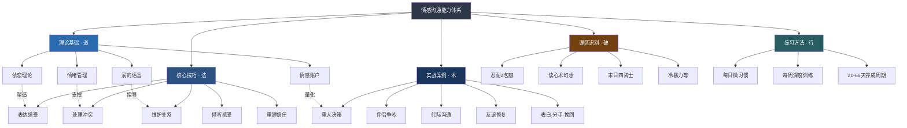
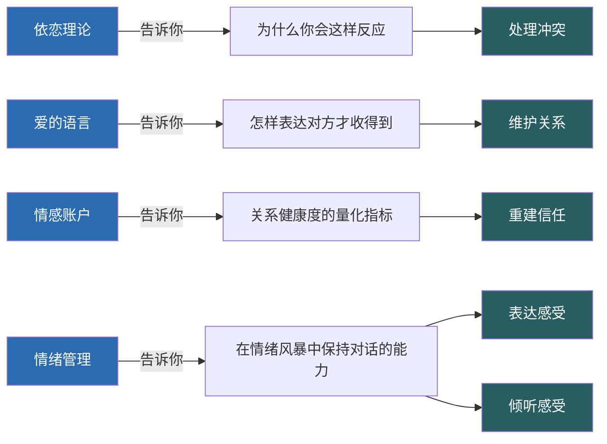

# 06 本章小结

> 从理论根基到实战应用，从认知重建到行为改变——回顾情感沟通的完整知识体系，整合所学，制定你的个人行动计划。

***

## 一、本章知识全景

情感沟通的学习路径遵循"道→法→术→器"的逻辑：先理解底层原理（理论基础），再掌握通用方法（核心技巧），然后在真实场景中反复练习（实战案例），同时警惕常见的认知陷阱（误区识别），最终通过系统化的训练将知识转化为本能（练习方法）。

这五个模块不是孤立的知识点，而是相互咬合的齿轮。依恋理论解释了"为什么你会这样反应"，情绪管理给了你"在反应之前暂停的能力"，非暴力沟通提供了"暂停之后说什么"的框架，情感账户帮助你"量化关系的健康度"，而练习方法确保这一切不会停留在"我知道了"的层面。

***

## 二、核心认知回顾

### 1. 情感沟通的本质

情感沟通不是"说好听的话"，不是"哄人开心"，更不是"压抑自己的需求去迁就对方"。它的本质是：**在关系中真实地表达自己、真诚地理解对方的能力**。

这个定义里有两个关键词：

**真实**——不是表演出来的温柔，不是话术包装的操控，而是敢于说出"我害怕""我需要你""我受伤了"。真实的表达有风险，它让脆弱暴露在外，但也是建立深度连接的唯一路径。

**理解**——不是"我听到了你的话"，而是"我感受到了你的感受"。理解意味着暂时放下自己的立场，进入对方的内心世界，哪怕你并不认同对方的观点。

核心的态度是：你是否愿意在关系中展现脆弱，是否愿意花时间去理解另一个人的内心世界。技巧可以学，但如果没有这个态度，技巧只是空壳。

### 2. 四大理论基础

| 理论 | 提出者 | 核心洞见 | 对情感沟通的意义 |
|------|--------|---------|----------------|
| 依恋理论 | 鲍尔比 & 安斯沃思 | 童年经历塑造了你在关系中的情感模式 | 理解自己和对方的"情感操作系统"，识别追逃模式，找到改变的入口 |
| 爱的语言 | 加里·查普曼 | 每个人接收爱的"频道"不同 | 用对方能接收的方式去爱，而非你习惯的方式；避免"以己度人" |
| 情感账户 | 史蒂芬·柯维 | 关系质量取决于日常互动的存取积累 | 小额高频存款比偶尔大额存款更有效；账户余额决定对方如何解读你的行为 |
| 情绪管理 | 戈尔曼 / 普拉奇克 | 管理情绪不是消灭情绪，而是保持选择行为的能力 | 情绪觉察→情绪调节→情绪表达，三个层次逐级递进 |

这四个理论之间的关系：依恋风格影响你的情绪调节能力，情绪调节能力决定了你在冲突中能否保持对话，爱的语言决定了你如何有效地向情感账户存款，而情感账户的余额又影响了在冲突中对方对你的解读倾向。它们构成了一个自我强化的循环——正向或负向，取决于你如何运作。

### 3. 五大核心技巧

**（一）表达感受：用非暴力沟通替代评判和指责**

非暴力沟通（NVC）四步法——观察、感受、需要、请求——是表达感受最有效的框架。核心转换是：把"你怎么总是这样"替换为"我观察到……我感到……因为我需要……你能不能……"。

关键区分：观察 vs 评判（"你这周加班三天" vs "你总是不在家"），感受 vs 想法（"我感到孤独" vs "我觉得你不爱我"），请求 vs 命令（"你能不能这周有两天八点前回家" vs "你以后必须每天早点回来"）。

**（二）倾听感受：不只听内容，更要听感受和需要**

倾听有三个层次：听内容（表面）→ 听感受（共情）→ 听需要（深层）。真正的情感沟通发生在后两个层次。

五个核心技巧：全身心在场（放下手机、眼神接触）、情感确认（"你的感受完全可以理解"）、反映式倾听（用自己的话复述对方的感受）、提问而非假设（"你现在是什么感受？"而非"你是不是很生气？"）、容忍沉默（给对方整理思绪的时间）。

情感确认是其中最强大也最容易被忽视的技巧。它的反面——无效化（"这有什么好生气的""你想太多了"）——是情感沟通中最具杀伤力的模式之一。

**（三）处理冲突：在分歧中保持连接**

冲突本身不损害关系，处理冲突的方式才是关键。戈特曼研究发现的"末日四骑士"——批评、蔑视、防御、冷战——是关系破裂的最强预测因子。

替代方案是六步法：温和启动（用"我"开头而非"你"开头）→ 倾听对方 → 找到共同需求 → 共同寻找方案 → 达成共识 → 修复收尾。当情绪升级时，使用"暂停技术"——明确告知"我需要20分钟冷静，稍后回来继续谈"——而不是摔门而去。

**（四）重建信任：当关系出现裂痕**

信任的恢复没有捷径，只有时间加一致性。完整流程：承认伤害（不辩解、不最小化）→ 承担责任（"这是我的错"而非"如果你觉得受伤了"）→ 表达悔意 → 提出具体的修复方案 → 持续一致的行为改变。

道歉是"部分退款"，不能撤销交易。最好的策略不是事后道歉，而是事前预防。

**（五）维护关系：日常情感投资**

日常的情感投资比冲突处理更加重要。戈特曼的5:1法则告诉我们，稳定幸福的婚姻中，正面互动与负面互动的比例至少是5:1。

具体实践包括：每天的情感签到（5分钟问"你今天感觉怎么样"）、定期的关系复盘、了解并使用对方的爱的语言、保持"六秒钟的吻"和身体接触的习惯。关系质量取决于日常的互动模式，而非偶尔的高光时刻。

### 4. 八大实战场景要点

| 场景 | 核心困境 | 关键技巧 | 最重要的认知转变 |
|------|---------|---------|----------------|
| 伴侣争吵"你总是不在家" | 被忽视感 | 非暴力沟通 + 情感确认 | 从"攻击-防御"到"表达需要-回应需要" |
| 父母催婚"你怎么还不结婚" | 代际观念冲突 | 倾听感受 + 理解背后焦虑 | 从"对抗观点"到"理解情感" |
| 朋友误会"你在背后说我坏话" | 信任受损 | 反映式倾听 + 直接核实 | 从"急于辩解"到"先理解对方受伤" |
| 表白"我喜欢你很久了" | 脆弱性暴露 | 清晰表达 + 接受不确定性 | 勇气不是不怕被拒，而是怕了仍然去做 |
| 分手"我觉得我们不合适" | 伤害最小化 | 清晰 + 温柔 + 尊严 | 分手也是一种情感沟通，方式决定伤疤大小 |
| 挽回"我不想失去你" | 信任重建 | 行动承诺 + 耐心等待 | 挽回靠的不是语言，是持续一致的行为改变 |
| 日常关心"今天辛苦了" | 情感账户存款 | 爱的语言 + 微小习惯 | 日常的5分钟比纪念日的5小时更重要 |
| 重大决定"买房/生子/换城市" | 需求协调 | 全部技巧综合运用 | 先处理情感，再处理事务 |

### 5. 十大误区速览

| 误区 | 核心问题 | 正确替代 |
|------|---------|---------|
| 把"忍耐"当作"包容" | 压抑≠接纳，忍耐积累怨恨 | 真正的包容是内心平静地接纳，不是咬牙切齿地忍 |
| 期望对方"读心术" | "你应该知道我在想什么" | 没有人是读心术大师，清晰表达是你的责任 |
| 用"我是为你好"包装控制 | 善意的控制仍然是控制 | 尊重对方的选择权，建议而非指令 |
| 在冲突中翻旧账 | 积累弹药而非解决问题 | 聚焦当下议题，一事一议 |
| 用沉默惩罚对方 | 冷暴力是情感虐待的一种 | 表达"我需要空间"而非消失 |
| 把"不吵架"等同"关系好" | 冷和平比热冲突更危险 | 健康的关系不是没有冲突，而是能安全地处理冲突 |
| 用愤怒掩盖其他情绪 | 愤怒是"二级情绪"，常掩盖恐惧和悲伤 | 学会识别愤怒背后真正的感受 |
| 用"补偿"替代"日常" | 偶尔大额存款不如持续小额 | 关系靠日常维护，不靠事后弥补 |
| 在公开场合讨论私事 | 有观众时双方都会更防御 | 敏感话题选择私密、安全的环境 |
| 急于"解决问题"而非"理解感受" | 跳过情感步骤直接给方案 | 先共情，再讨论解决方案 |

***

## 三、最关键的三个洞见

如果整章只记住三件事，请记住这三件：

### 洞见一：感受没有对错

"你不应该这么想"是情感沟通中最具杀伤力的一句话。感受是人对情境的真实反应，它不会因为被告知"不应该"而消失——就像你不会因为被告知"你不应该冷"就真的暖和起来。

允许自己有感受，也允许对方有感受——这是情感沟通的前提。当你对自己说"我现在感到嫉妒，这没什么丢人的"，你已经迈出了情绪觉察的第一步。当你对对方说"你生气是可以理解的"，你已经为对方打开了继续表达的安全通道。

情感确认不是同意对方的观点或行为，而是承认对方的情绪是真实的、可理解的。这个区分至关重要——你可以说"我理解你为什么生气"，同时仍然持有不同的立场。

### 洞见二：连接比正确更重要

在亲密关系中，"赢了争论，输了关系"是最常见的悲剧。戈特曼的研究表明，决定婚姻存亡的关键不是"是否吵架"，而是正面互动与负面互动的比例。那些能够长久维持幸福关系的伴侣，不是不吵架，而是在吵架中仍然保持对彼此的尊重和连接。

当你发现自己在争论中"越来越有道理"时，停下来问问自己：**我想要的是正确，还是连接？** 有时候，一句"你说得对，我理解你的感受"比十条有力的论据更能修复关系。

这个洞见的深层含义是：情感沟通的目标不是达成共识，而是保持连接。你可以在观点上完全不同的同时，在情感上保持亲密。

### 洞见三：改变从一个人开始

不要等对方一起改变。系统理论告诉我们，改变系统中的一个元素就能改变整个系统。当你不再是那个用攻击回应攻击的人，当你开始用"我感到"替代"你总是"，当你在冲突中第一个按下暂停键——整个关系的动力学就变了。

这不是说你一个人要承担所有责任，而是说：你只能控制自己的行为，而你的行为改变会引发对方的反应改变。一个巴掌拍不响——当你不再拍那个巴掌，对方也找不到拍的对象了。

心理学中的"情绪感染"（emotional contagion）研究证实，情绪会在人际间传递。当你变得更加平静、更加开放、更加有安全感时，对方的情绪状态也会受到影响。这就是"改变一个人就能改变一段关系"的科学基础。

***

## 四、能力自检清单

读完本章后，用以下清单评估自己的情感沟通能力现状。这不是考试，而是帮助你找到最需要加强的环节：

| 能力项 | 自评（1-5） | 具体表现 |
|--------|------------|---------|
| 情绪觉察 | ____ | 能精确命名自己当下的情绪，而非笼统地说"不开心" |
| 非暴力表达 | ____ | 能用"观察-感受-需要-请求"的框架表达不满 |
| 深度倾听 | ____ | 能听到对方话语背后的感受和需要，而不只是内容 |
| 情感确认 | ____ | 能在不认同对方观点的情况下，承认对方感受的合理性 |
| 冲突处理 | ____ | 能在分歧中保持对话，不升级为攻击或退缩为沉默 |
| 信任维护 | ____ | 有持续的情感投资习惯，而非只在危机时才关注关系 |
| 误区识别 | ____ | 能在自己即将踩坑时觉察到，并及时调整 |
| 暂停能力 | ____ | 能在情绪升级时主动喊暂停，冷静后回来继续谈 |
| 依恋觉察 | ____ | 了解自己的依恋风格，知道什么情境会触发自己的模式 |
| 爱的语言 | ____ | 知道重要他人的爱的语言，并有意识地使用 |

**评分说明：**
- **40-50分**：基础扎实，重点阅读"深度拓展"部分，将能力从"好"推向"精通"
- **25-39分**：有意识但缺系统方法，建议回顾核心技巧并开始每日练习
- **10-24分**：最大的成长空间——意味着改善效果会最明显。从头到尾顺序阅读，每节进行实践

***

## 五、行动清单

读完本章后，请立即做以下五件事。不是明天，不是下周，是现在：

### 行动一：识别自己的依恋风格（5分钟）

回想你在关系中面对冲突、亲密和分离时的典型反应：

- 当伴侣说"我们需要谈谈"时，你的第一反应是什么？——恐慌（焦虑型）、想逃（回避型）、还是平静地准备倾听（安全型）？
- 当对方没有及时回复消息时，你会连续发消息追问（焦虑型）、干脆不再联系（回避型）、还是想着"可能在忙"继续做自己的事（安全型）？
- 当关系变得亲密时，你感到安心（安全型）、需要更多确认（焦虑型）、还是本能地想拉开距离（回避型）？

理解自己的模式是改变的第一步。你不需要给自己的依恋风格贴标签——大多数人都不是纯粹的某一类型——但觉察自己的倾向性，能帮你在关键时刻做出有意识的选择而非自动化反应。

### 行动二：做一次情绪日签（3分钟）

今晚睡前回答三个问题：

1. **今天我最主要的情绪是什么？** ——用具体的词汇：不是"还行"，而是"满足""焦虑""无聊""被认可的喜悦""轻微的失落"
2. **什么事件触发了它？** ——具体到时间、地点、人物、对话内容
3. **背后有什么需要？** ——这个情绪在告诉你什么？你需要被理解、被尊重、被看见、被接纳，还是需要安全感、自主权、成就感？

这三个问题看似简单，但坚持做一周，你会发现自己对情绪的觉察力显著提升。神经科学中的"情绪标签化"效应表明：当你用语言准确命名一个情绪时，大脑杏仁核的活跃度会降低，情绪的强度会自然减弱。命名本身就是调节。

### 行动三：今天为一个重要的人做一件小事（1分钟）

不需要等到有灵感，不需要等到特殊场合。一个拥抱、一句"今天辛苦了"、一条"突然想到你"的消息、帮忙倒一杯水——这就是情感账户的日常存款。

记住情感账户的核心规律：**小额高频存款比偶尔大额存款更有效**。每天的一个小关心，持续一年，效果远超年底一次豪华旅行。关系质量取决于日常的互动模式，而非偶尔的高光时刻。

### 行动四：复盘最近一次冲突（10分钟）

回忆最近一次与重要他人的冲突，然后：

1. 用"观察"的视角重述事件——去掉评判性词汇，只保留事实
2. 识别自己当时的感受——不是想法（"他不在乎我"），而是感受（"孤独、委屈、被忽视"）
3. 找到感受背后的需要——你需要被尊重、被重视、被理解？
4. 用NVC四步法重新组织一遍你要说的话
5. 想象如果重来一次，你会怎样说

这个复盘不是为了自责，而是为了建立新的神经通路。每一次有意识的复盘，都在强化"遇到冲突→觉察→选择新方式"的回路，让它在下一次真实冲突中更容易被激活。

### 行动五：选择一个练习开始做（2分钟）

不要试图同时开始所有练习。从以下三个中选一个你认为最有用的，从今天开始：

| 练习 | 时间 | 难度 | 最适合 |
|------|------|------|--------|
| 情绪日签 | 每天3分钟 | ★☆☆ | 情绪觉察力弱的人 |
| 每日情感存款 | 每天1分钟 | ★☆☆ | 日常情感投资不足的人 |
| NVC日记 | 每天5分钟 | ★★☆ | 想提升表达能力的人 |
| 6秒暂停练习 | 随时 | ★★☆ | 容易情绪失控的人 |
| 每周关系复盘 | 每周15分钟 | ★★★ | 想系统化提升的人 |

行为科学的研究告诉我们：形成一个稳定的新习惯平均需要66天，而非流行的"21天"说法。更重要的是，偶尔遗漏一天不会破坏习惯的养成——不必因为某天没做到就自暴自弃，第二天继续就好。

***

## 六、知识整合：四大理论如何指导五大技巧

理解理论和技巧之间的对应关系，能帮助你在实际场景中快速找到合适的方法：

具体对应关系：

| 技巧 | 主要理论支撑 | 应用方式 |
|------|------------|---------|
| 表达感受 | 情绪管理 + 非暴力沟通 | 情绪觉察让你知道自己在感受什么，NVC框架告诉你如何组织语言 |
| 倾听感受 | 依恋理论 + 情感确认 | 理解对方的依恋风格，知道什么样的回应能让对方感到安全 |
| 处理冲突 | 依恋理论 + 情绪管理 | 识别依恋触发器，在杏仁核劫持之前按下暂停键 |
| 重建信任 | 情感账户 | 信任是账户余额的体现，重建需要持续一致的存款行为 |
| 维护关系 | 爱的语言 + 情感账户 | 用对方的语言存款，保持5:1的正负互动比例 |

***

## 七、从本章到下一章

情感沟通能力是所有深层关系沟通的基石。在下一章的"深度拓展"中，我们将探讨依恋理论的神经科学基础、文化差异对情感沟通的影响、情感沟通在职场中的应用、数字时代的情感沟通新挑战等进阶话题。

如果你觉得自己还需要更多练习时间，完全可以先停在这里，花一到两周时间执行本章的练习方案，等核心技巧变成习惯后再进入深度拓展。情感沟通是一项"手艺"，正如没有人能在上完一节课后就成为钢琴家，也没有人能在读完一章后就成为沟通高手——但每一次你选择用"我感到"替代"你总是"，每一次你选择倾听而非反驳，每一次你选择拥抱而非摔门——你都在成为一个更好的沟通者，也在构建一段更深的关系。

***

## 八、写在最后

最后，记住这一点：**你不需要完美。**

你只需要比昨天的自己好一点点。那些偶尔的失误、情绪的失控、说错的话——都是学习过程的一部分。关键不是永不犯错，而是每次犯错后都有所觉察，然后选择修复。

情感沟通的学习是一生的功课。它不会因为你读完这一章就结束，也不会因为你某次沟通失败就前功尽弃。它是螺旋上升的过程——你会前进，会后退，会在某个深夜突然想起白天的对话然后懊悔"当时应该那样说"——这些都是正常的，都是成长的一部分。

> "亲密关系中最重要的不是找到一个完美的人，而是学会用不完美的方式去爱一个不完美的人。"

愿你在每一段关系中，都能更勇敢地表达，更温柔地倾听。
