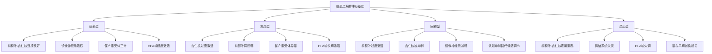
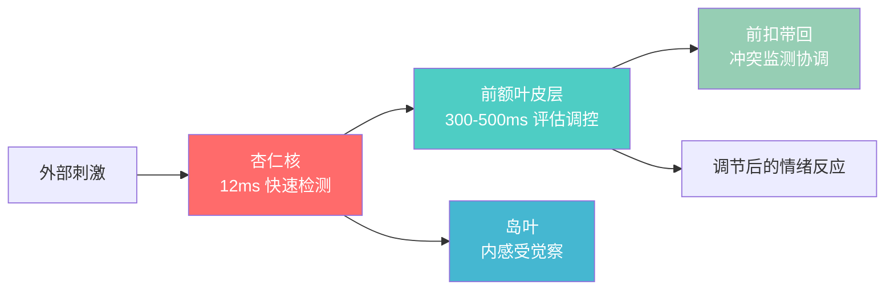
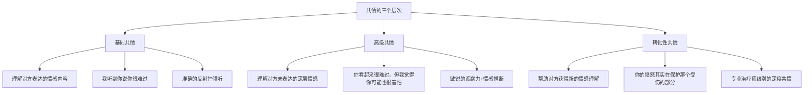
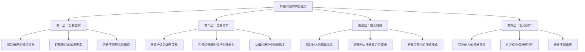

# 第八章 情感沟通 - 深度拓展

本章将情感沟通从"感受层面"推向"科学层面"和"专业层面"。我们将深入探讨依恋理论的神经科学基础、情绪调节的脑机制、情感粒度理论、性别与文化对情感表达的影响、创伤知情沟通方法、数字时代的情感沟通挑战、情感沟通在心理治疗中的高级应用、自我同情作为情感沟通的底层基础、职场中的情感动力学与职业倦怠预防，以及面向日常高频场景的急救速查方案。这些深度内容将帮助你从"凭感觉沟通"升级为"理解底层机制后有策略地沟通"。

```mermaid
graph TD
    A[情感沟通深度拓展] --> B[依恋理论与神经科学]
    A --> C[情绪调节的脑机制]
    A --> C2[情感粒度与情绪科学]
    A --> D[性别差异与社会化]
    A --> E[文化对情感表达的影响]
    A --> F[创伤知情沟通]
    A --> G[数字时代情感沟通]
    A --> H[心理治疗中的高级应用]
    A --> J[自我同情：情感沟通的底层基础]
    A --> K[职场情感沟通]
    A --> L[急救速查手册]
    A --> I[综合应用框架]

    B --> B1[四种依恋风格的神经基础]
    B --> B2[依恋的可塑性与转变路径]

    C --> C1[Gross五层调节模型]
    C --> C3[人际神经生物学视角]

    K --> K1[情感劳动与职业倦怠]
    K --> K2[团队情感动力学]
    K --> K3[向上管理与冲突修复]

    H --> H1[共情三层次]
    H --> H2[EFT情感层次]
    H --> H3[CBT认知重构]
    H --> H4[ACT承诺行动]
    H --> H5[IFS内在家庭系统]

    L --> L1[七大高频场景速查]
    L --> L2[万能沟通公式]

    style A fill:#2c3e50,color:#fff
    style B fill:#e74c3c,color:#fff
    style C fill:#e67e22,color:#fff
    style C2 fill:#d35400,color:#fff
    style D fill:#f39c12,color:#fff
    style E fill:#2ecc71,color:#fff
    style F fill:#1abc9c,color:#fff
    style G fill:#3498db,color:#fff
    style H fill:#9b59b6,color:#fff
    style J fill:#e91e63,color:#fff
    style K fill:#607d8b,color:#fff
    style L fill:#00bcd4,color:#fff
    style I fill:#34495e,color:#fff
```



---

## 一、依恋理论的最新研究

依恋理论(Attachment Theory)由英国精神分析学家约翰·鲍尔比(John Bowlby)于1950年代创立，最初用于解释婴儿与照顾者之间的情感纽带。1970年代，玛丽·安斯沃思(Mary Ainsworth)通过著名的"陌生情境实验"(Strange Situation Procedure)将依恋类型系统化。1980年代，辛迪·哈赞(Cindy Hazan)和菲利普·谢弗(Philip Shaver)将依恋理论扩展到成人亲密关系领域。经过半个多世纪的发展，依恋理论已成为理解成人亲密关系和情感沟通的核心框架。

### 1.1 依恋风格的神经科学基础

现代神经科学研究揭示了不同依恋风格背后的脑机制差异。理解这些机制不是为了给自己贴标签，而是为了理解"为什么我会这样反应"以及"这种反应是可以改变的"。



**安全型依恋(Secure Attachment)**：

安全型依恋者的大脑具有一套高效的情绪调节回路。前额叶皮层（尤其是腹内侧前额叶，vmPFC）与杏仁核之间存在良好的白质连接，这意味着"理性脑"能够有效调控"情绪脑"。具体表现为：

- **前额叶-杏仁核回路**：连接良好，情绪信号能够被及时评估和调节。当遇到威胁时，杏仁核发出警报，前额叶迅速评估威胁的真实程度，避免过度反应。2012年发表在《Biological Psychiatry》上的fMRI研究显示，安全型个体的vmPFC在情绪刺激呈现后200-300ms即可启动调节信号，而不安全型个体需要500ms以上。
- **镜像神经元系统**：活跃度高，使安全型个体能够自然地"感受到"他人的情绪状态。这不仅是共情的神经基础，也是安全型个体善于"读懂"社交情境的原因。Gallese等人的研究证实，安全型个体在观察他人情感表达时，其运动前皮层和顶下小叶的镜像神经元激活强度显著高于不安全型个体。
- **催产素系统**：催产素受体基因（OXTR）表达正常，使个体能够在亲密关系中建立信任和安全感。催产素不仅促进亲密行为，还能降低杏仁核的应激反应。2014年Feldman等人在《Psychoneuroendocrinology》发表的研究发现，安全型依恋的母亲与婴儿互动时，双方的催产素水平呈同步上升模式，这种"催产素共振"是亲子情感连接的生物化学基础。
- **HPA轴（下丘脑-垂体-肾上腺轴）**：适度激活，皮质醇水平在压力后能够迅速恢复正常。这意味着安全型个体在经历压力事件后具有较强的恢复力。Gunnar等人的纵向研究发现，安全型依恋的儿童在接种疫苗等压力事件后，皮质醇在30分钟内即可恢复基线水平，而不安全型儿童可能需要60分钟以上。

**焦虑型依恋(Anxious Attachment)**：

焦虑型依恋者的大脑处于一种"过度警觉"状态。杏仁核像一个灵敏度过高的烟雾报警器，经常在没有真正危险时发出警报。

- **杏仁核过度激活**：对人际威胁信号（如伴侣的冷淡、未回复的信息）高度敏感。研究显示，焦虑型个体的杏仁核对负面面部表情的反应强度比安全型个体高出30-40%。特别值得注意的是，焦虑型个体的杏仁核不仅对明显的威胁信号过度反应，还会将中性模糊信号偏向威胁方向解读——这种"敌意归因偏向"(hostile attribution bias)是焦虑型个体频繁产生关系焦虑的神经基础。
- **前额叶调控不足**：虽然前额叶皮层尝试对杏仁核进行调控，但连接效率较低。这导致焦虑型个体在情绪激动时难以"冷静下来"，需要更长的恢复时间。2016年Dewall等人在《Cerebral Cortex》发表的研究发现，焦虑型个体的前额叶-杏仁核白质纤维束(uncinate fasciculus)的完整性低于安全型个体，这意味着调控信号的"传输带宽"不足。
- **催产素受体异常**：OXTR基因的某些变异（如rs53576位点的A等位基因）与焦虑型依恋相关。这种变异导致个体对催产素的敏感性降低，需要更多的亲密信号才能感到安全。这意味着焦虑型伴侣需要更多的确认和回应——这不是"需求太多"，而是他们大脑的化学系统确实需要更多的输入才能达到安全型个体的基线水平。
- **HPA轴长期激活**：慢性压力导致皮质醇水平长期偏高，不仅影响身体健康（免疫功能下降、睡眠质量下降），还进一步削弱前额叶的调控能力，形成恶性循环。Miller等人的元分析显示，慢性压力下皮质醇对前额叶的神经毒性作用会导致海马体体积减小2-4%，这反过来又削弱了情境记忆的编码能力——焦虑型个体可能更容易记住关系中的负面事件，而遗忘正面事件。

**回避型依恋(Avoidant Attachment)**：

回避型依恋者的大脑采用了一种"情感隔离"策略。这不是"没有感情"，而是大脑主动压制了情感的体验和表达。

- **前额叶过度激活**：尤其是背外侧前额叶（dlPFC），这个区域负责认知控制和抑制。回避型个体通过强大的认知控制来"关闭"情感体验，这是一种习得性的自我保护机制。DeWall等人的研究发现，回避型个体在观看伴侣的亲密照片时，dlPFC的激活程度反而高于观看陌生人照片——这说明他们需要额外的认知资源来压制亲密情感的自动激活。
- **杏仁核被抑制**：情感信号在到达意识层面之前就被过滤掉了。脑成像研究显示，回避型个体在观看情感图片时，杏仁核的激活程度显著低于安全型个体。但这并不意味着他们"没有感受"——皮肤电导和心率等生理指标显示，回避型个体的生理层面仍然有情绪反应，只是这些反应没有进入意识。这种"身体知道但意识不知道"的分裂状态，是回避型个体难以表达情感的神经基础。
- **镜像神经元减弱**：共情能力在神经层面受到限制。但这种限制是功能性的而非结构性的——在安全的治疗环境中，镜像神经元系统的活动可以重新被激活。这一发现至关重要：它意味着回避型个体的"冷漠"是可逆的习得模式，而非不可改变的人格特质。
- **认知抑制策略**：回避型个体习惯用"想"来替代"感受"，用理性分析来处理情感问题。这种策略在短期内有效，但长期可能导致情感隔离和关系疏离。研究发现，长期使用情感抑制策略的个体，其心血管疾病风险比适度表达情感的个体高出25-30%（Gross & Levenson, 1997）。

**混乱型依恋(Disorganized Attachment)**：

混乱型依恋是最复杂的一种依恋风格，通常与早期创伤经历（如虐待、忽视或照顾者的不可预测行为）相关。其神经特征包括：

- **前额叶-杏仁核连接紊乱**：大脑的"控制中心"和"警报系统"之间的通信出现问题。有时过度激活（焦虑表现），有时过度抑制（回避表现），切换不可预测。这种模式被称为"矛盾策略"——在同一个互动中可能交替出现接近和回避行为。
- **情绪调节系统失灵**：缺乏一致的情绪调节策略。在压力下可能同时表现出接近和回避的矛盾行为——既渴望亲密又害怕亲密。这种矛盾不是"不稳定"，而是因为照顾者本身就是恐惧的来源——孩子在照顾者那里既寻求安全又感到恐惧，大脑无法形成一致的应对策略。
- **HPA轴失调**：皮质醇反应模式异常，可能表现为基线水平偏高但应激反应迟钝（"冻住"反应），或基线正常但应激反应过度（"战斗或逃跑"）。这意味着混乱型个体在不同时间可能表现出截然不同的生理状态。
- **解离倾向**：在高度压力下，混乱型个体可能出现解离反应——感觉与自己的身体或现实脱离。这是一种神经层面的"断路保护"机制。解离反应在脑成像中表现为前额叶活动的急剧下降和默认模式网络的异常激活，类似于大脑在极度压力下"部分关机"以保护自己。

### 1.2 依恋的内部工作模型与元认知

依恋理论的核心概念之一是"内部工作模型"(Internal Working Model, IWM)——即个体基于早期依恋经验形成的关于"自我是否值得被爱"和"他人是否可靠"的核心心理表征。

**内部工作模型的双维度**：

| 维度 | 积极模型 | 消极模型 |
|------|---------|---------|
| 自我模型 | "我是值得被爱的，我的需求是合理的" | "我不值得被爱，我的需求是负担" |
| 他人模型 | "他人是可靠的，会回应我的需求" | "他人是不可靠的，会拒绝或伤害我" |
| 四种组合 | 积极自我+积极他人=安全型 | 消极自我+积极他人=焦虑型 |
| | 积极自我+消极他人=回避型 | 消极自我+消极他人=混乱型 |

**元认知能力与依恋安全性的关系**：

Peter Fonagy提出的"心智化"(mentalization)能力——即理解自己和他人行为背后的心理状态的能力——与依恋安全性密切相关。安全型个体通常具有更强的心智化能力，他们能够：

- 区分"我感觉"和"事实是"——"我感到被抛弃"不等于"他真的要抛弃我"
- 理解行为的多重原因——"他不回消息可能有很多原因，不一定是因为不在乎"
- 将情感体验与行为反应分离——"我可以感到愤怒，但不必立即发火"

发展心理学家Mary Main通过成人依恋访谈(AAI)发现，一个成年人的依恋安全性不仅取决于他们的童年经历本身，更取决于他们对童年经历的"元认知加工"——即他们是否能够连贯、反思性地叙述自己的依恋经历，而不是回避或被淹没。一个童年经历不愉快但能够连贯叙述的人，比一个童年经历愉快但叙述混乱的人更可能是安全型依恋。这一发现为"依恋风格可以改变"提供了强有力的理论支持——通过发展心智化能力，即使早期经历不理想，也能发展出安全型依恋模式。

### 1.3 依恋风格与沟通模式

不同依恋风格的人在情感沟通中表现出截然不同的模式。理解这些模式不是为了给对方贴标签，而是为了识别"他这样反应不是不爱我，而是他的依恋系统在起作用"。

**安全型沟通者的特征**：

安全型沟通者具有一种"情感弹性"——他们能够在表达情感和保持理性之间灵活切换，能够在亲密和独立之间找到平衡。

| 维度 | 具体表现 | 底层机制 |
|------|----------|----------|
| 表达需求 | 能够直接、清晰地说出"我需要什么" | 早期经验中需求被回应，建立了"表达需求是安全的"信念 |
| 倾听他人 | 能够专注于对方的感受而不急于解决 | 前额叶调控良好，不被对方的情绪"淹没" |
| 处理冲突 | 视冲突为关系中的正常现象，能够建设性地讨论 | 不将冲突等同于关系威胁，杏仁核不过度激活 |
| 容忍模糊 | 能够接受关系中的不确定性和暂时的距离 | 不需要持续的确认来维持安全感 |
| 情感修复 | 在关系受到伤害后能够主动修复 | 信任修复是可能的，不将伤害等同于永久性背叛 |

**焦虑型沟通者的特征**：

焦虑型沟通者的核心驱动力是对"被抛弃"的恐惧。他们的沟通行为往往是为了获取安全感的确认。

- **过度表达与寻求确认**：焦虑型沟通者倾向于反复确认对方的感受和关系状态。"你还爱我吗？""你是不是生气了？""你为什么不回我消息？"这些问题的背后是对关系安全感的渴求。这不是"粘人"或"控制"，而是依恋系统在持续发出"关系可能不安全"的警报。
- **过度解读信号**：对伴侣的语气变化、回复速度、表情变化高度敏感，容易将中性信号解读为威胁信号。一条延迟回复的消息可能被解读为"他不在乎我了"。认知神经科学研究发现，焦虑型个体在处理模糊社交信息时，其杏仁核会自动将信号偏向威胁方向解读——这不是"想太多"，而是大脑的默认处理模式。
- **情绪化表达**：在冲突中容易被情绪淹没，难以保持理性。可能会说出伤害性的话，事后后悔。这不是"不讲理"，而是情绪调节系统在压力下失灵——前额叶皮层的调控能力被杏仁核的强烈激活所"压倒"。
- **追逐-退缩循环**：当焦虑型个体感到不安全时，会通过"追逐"行为（反复联系、追问、要求承诺）来寻求安全感。但这种追逐往往会触发伴侣的回避反应，形成"越追越远"的恶性循环。

**回避型沟通者的特征**：

回避型沟通者的核心驱动力是对"被控制"或"被吞没"的恐惧。他们的沟通行为往往是为了维持情感独立性。

- **情感压抑与理性化**：回避型沟通者倾向于将情感问题"理智化"。"你想太多了""这没什么大不了的""我们谈谈解决方案吧"——这些回应的背后是回避情感深度接触的习惯。这不是"冷血"，而是大脑使用认知抑制策略来避免情感激活可能带来的失控风险。
- **情感话题上的距离感**：当对话进入情感深度时，回避型个体可能会感到不适，表现为转移话题、开玩笑缓解紧张或直接沉默。这种不适感在生理层面表现为心率上升和皮肤电导增加——他们的身体在发出"危险"信号，尽管意识层面可能无法识别这种不适的来源。
- **冲突中的退缩**：在冲突升级时，回避型个体倾向于"关闭"——停止回应、离开现场或进入"内心关闭"状态。这不是"不在乎"，而是情感系统的自我保护。Gottman研究所发现，回避型伴侣在冲突中出现的"石墙"反应(stonewalling)，其心率通常超过100次/分钟——这说明他们并非"无感"，而是被情感淹没后的"系统崩溃"。
- **独立性需求强烈**：回避型个体可能将伴侣的情感需求视为"过度依赖"，将自己的情感节制视为"成熟"。这种认知差异是关系冲突的重要来源。

**焦虑-回避配对的典型困境**：

当焦虑型和回避型成为伴侣时，会形成心理学中所谓的"焦虑-回避陷阱"(Anxious-Avoidant Trap)。这种配对之所以常见，是因为焦虑型的"追逐"恰好激活了回避型的"退缩"，而回避型的"退缩"又恰好激活了焦虑型的"追逐"，形成一个自我强化的负性循环。


**打破循环的关键**：
- **焦虑型需要做的**：觉察自己的追逐行为背后的恐惧，尝试用"我感到不安，我需要一些确认"替代"你为什么不回我消息"。给自己设定一个"冷静窗口"——在感到不安时等待15-30分钟再联系。练习自我安抚：当焦虑升起时，将手放在胸口，对自己说"我现在感到害怕，这是我的依恋焦虑在起作用，我现在是安全的"。
- **回避型需要做的**：觉察自己的退缩行为背后的恐惧，尝试用"我需要一些时间整理思绪，但我没有离开"替代直接沉默。给伴侣一个明确的"我会回来"信号。练习在不适中停留——即使感到被"压迫"的冲动，也尝试在对话中多待30秒，观察不适感是否真的会继续上升。
- **双方需要做的**：理解对方的行为是依恋系统的自动反应，不是对自己的"攻击"或"不在乎"。将问题定义为"我们的依恋系统在互相干扰"，而非"你不爱我"或"你太烦了"。建立"暂停协议"：当任何一方感到情绪即将失控时，可以说"我需要暂停一下"，在约定时间（如20分钟）内回到对话。

### 1.4 依恋风格的自测量表

了解自己的依恋风格是改善情感沟通的第一步。以下是基于ECR（Experiences in Close Relationships）量表简化版的自测工具。

**请回顾你在亲密关系中的一般感受，对以下陈述进行1-7分评分（1=非常不同意，7=非常同意）**：

**焦虑维度（计算总分，满分35分）**：
1. 我担心伴侣不会像我在乎ta一样在乎我。
2. 我害怕被抛弃。
3. 我对关系有很多不确定感。
4. 我需要频繁确认伴侣是爱我的。
5. 当伴侣不在身边时，我会感到焦虑和不安。

**回避维度（计算总分，满分35分）**：
1. 我觉得向伴侣敞开心扉很困难。
2. 我不喜欢依赖伴侣或让伴侣依赖我。
3. 当伴侣想要更亲密时，我会感到不舒服。
4. 我更倾向于自己处理问题而不是向伴侣寻求帮助。
5. 我重视独立胜过亲密。

**评分解读**：

| 焦虑分 | 回避分 | 依恋风格 |
|--------|--------|----------|
| 低(<18) | 低(<18) | 安全型 |
| 高(≥18) | 低(<18) | 焦虑型 |
| 低(<18) | 高(≥18) | 回避型 |
| 高(≥18) | 高(≥18) | 混乱型 |

> **重要提示**：这是一个简化的自测工具，不能替代专业的心理评估。依恋风格是一个连续谱而非离散分类，大多数人在不同维度上都有不同程度的得分。这个自测的目的是帮助你了解自己的倾向，而非给自己贴标签。

**更专业的评估方式**：

如果自测后想获得更准确的评估，可以考虑以下专业工具：

- **ECR-R（修订版亲密关系经历量表）**：包含36个条目，是学术研究中最广泛使用的成人依恋量表。
- **AAI（成人依恋访谈）**：由Mary Main开发，是一种半结构化的访谈工具，通过分析个体对童年经历的叙述方式来评估依恋模式。AAI被认为是成人依恋评估的"金标准"，但它需要经过专业培训的施测者。
- **AAS（成人依恋量表）**：由Hazan和Shaver开发，是一个简短的自评量表，适合快速筛查。

### 1.5 依恋风格的可塑性：如何向安全型转变

依恋风格并非一成不变的"人格标签"。神经科学研究证实，大脑具有终身可塑性(neuroplasticity)，依恋模式可以通过持续的努力发生改变。这种改变不是"假装安全"，而是大脑神经回路的实际重塑。

**"赚得的安全感"(Earned Security)概念**：

发展心理学家将那些在不安全依恋环境中长大、但通过后天努力建立起安全依恋模式的个体称为"赚得安全感"(earned security)的人。与"持续安全型"(continuous security，即从小就有安全依恋体验的人)相比，赚得安全感的人同样能够在亲密关系中建立健康的连接。研究显示，赚得安全感与持续安全型在关系满意度和情绪调节能力上没有显著差异——这证明了依恋风格是可以改变的。

**向安全型转变的四条路径**：

**路径一：心理治疗**

与安全型的治疗师建立治疗关系，是改变依恋模式最有效的途径之一。治疗师提供的"安全基地"允许来访者在没有关系风险的情况下，重新体验安全的依恋互动。

- **精神动力学治疗**：关注早期依恋经历对当前关系模式的影响，通过"矫正性情感体验"来修复依恋创伤。治疗师通过一致、可靠、非评判的回应，让来访者体验到"表达需求是安全的"。
- **情感聚焦疗法(EFT)**：直接处理依恋相关的情感，帮助来访者识别和表达依恋需求。EFT的核心是帮助来访者接触到被防御机制掩盖的深层依恋情感（如被抛弃的恐惧、被吞没的恐惧），并在安全的治疗关系中重新加工这些情感。
- **EMDR（眼动脱敏再处理）**：特别适用于与早期创伤相关的混乱型依恋，通过双侧刺激帮助大脑重新处理创伤记忆。EMDR的原理是创伤记忆以碎片化的方式存储在大脑中，双侧刺激帮助大脑将这些碎片整合为连贯的记忆，从而降低其情感强度。
- **图式治疗(Schema Therapy)**：专门针对早期不适应图式（如"被抛弃图式""情感剥夺图式"）的治疗方法，结合了认知行为、体验性和关系性技术。

**路径二：正念冥想**

正念冥想通过增强"元觉察能力"——即观察自己的思维和情感而不被其裹挟的能力——来改善情绪调节。

- 研究显示，8周的MBSR（正念减压）训练能够增厚前额叶皮层，缩小杏仁核体积，增强两者之间的连接。
- 具体练习：每天15-20分钟的呼吸觉察冥想，重点练习"注意到情绪升起→不急于反应→观察情绪变化→选择如何回应"的过程。
- 对于焦虑型个体，正念帮助"退后一步"观察焦虑而非被焦虑控制；对于回避型个体，正念帮助"靠近一步"感受被压抑的情感。

**路径三：安全的关系体验**

与安全型依恋的伴侣或朋友建立稳定的关系，是改变依恋模式的强大催化剂。心理学家称之为"习得性安全"(earned security)。

- 安全型伴侣能够提供一致的情感回应，帮助焦虑型伴侣降低警觉性，帮助回避型伴侣重新学会信任。
- 关键不是找到一个"完美"的伴侣，而是找到一个"足够好"的伴侣——愿意理解你的依恋需求，能够在关系中保持一致性。
- 这种改变是渐进的：每一次被安全地回应，都在强化"表达需求是安全的"神经回路。

**路径四：有意识的自我训练**

- **情感日记**：每天记录自己的情绪触发事件、自动反应和实际后果。这种"情感考古"帮助你识别依恋模式的触发机制。
- **暂停练习**：在情绪反应和行为之间插入一个"暂停"——深呼吸，问自己"我现在的情绪反应有多少是对当前事件的，有多少是对过去经历的反应？"
- **需求表达练习**：从低风险的情境开始练习直接表达需求。例如，先在朋友面前练习说"我今天需要一些安慰"，再逐步在亲密关系中应用。
- **元认知练习**：定期问自己"我现在对伴侣行为的解读，有多少是基于事实，有多少是基于我的恐惧？"这种练习能够增强心智化能力，帮助焦虑型个体减少灾难化解读，帮助回避型个体增加情感觉察。

**转变的时间线**：

依恋风格的改变不是一朝一夕的事。研究表明，持续的安全关系体验和有意识的自我训练通常需要6个月到2年的时间才能在依恋模式上产生显著变化。关键因素包括：改变的动机强度、安全关系体验的质量和频率、是否有专业支持、以及个体的神经可塑性水平。不要因为短期内看不到明显变化而气馁——每一次"按下暂停"、每一次"选择不同的回应方式"，都在重塑你的大脑回路。

### 1.6 依恋理论在日常沟通中的实操应用

**识别依恋触发器**：

依恋触发器是指那些激活依恋系统、引发强烈情绪反应的情境。不同依恋风格的触发器不同：

| 依恋风格 | 常见触发器 | 典型反应 | 健康应对 |
|----------|-----------|----------|----------|
| 焦虑型 | 伴侣未及时回复消息、伴侣与他人亲密互动、关系中出现沉默 | 焦虑、反复联系、寻求确认 | 触觉察"这是我的依恋焦虑在起作用"，给自己15分钟冷静期再回应 |
| 回避型 | 伴侣要求更多亲密、伴侣表达强烈情感、感到被"需要"的压力 | 不适、退缩、转移话题、沉默 | 觉察"这是我的回避系统在起作用"，尝试在不适中停留30秒再回应 |
| 混乱型 | 伴侣同时表达爱意和不满、关系中的矛盾信号、亲密与冲突交替 | 混乱、矛盾行为、解离 | 觉察"这是我的依恋系统在混乱中"，使用接地技术回到当下 |

**成为伴侣的安全基地**：

安全基地不是一个"完美"的人，而是一个"可靠"的人。以下是具体做法：

- **一致性**：在情感回应上保持相对一致，避免"有时过度热情，有时完全冷淡"的不可预测模式。
- **可及性**：让伴侣知道你在他们需要时是"可达的"。这不意味着24小时在线，而是让伴侣知道当他们需要你时，你会回应。
- **回应性**：当伴侣表达情感需求时，给予回应而非忽视。回应不需要完美，只需要让对方知道"我听到了，我在乎"。
- **非评判性**：当伴侣的依恋行为被触发时（如焦虑型的追问或回避型的退缩），理解这是依恋系统在起作用，而非"他/她就是这么烦人"。

**依恋导向的对话脚本**：

当焦虑型伴侣感到不安时：
- ❌ "你能不能别总是这样？我受够了你的疑神疑鬼。"
- ✅ "我能感觉到你现在不太安心。我在这里，我没有要离开。你需要我做什么来让你感觉好一些？"

当回避型伴侣需要空间时：
- ❌ "你总是这样逃避！你根本不在乎这段关系！"
- ✅ "我注意到你需要一些空间。我尊重这一点。你能告诉我大概需要多长时间吗？这样我就不会胡思乱想。"

当混乱型伴侣出现矛盾行为时：
- ❌ "你到底想要什么？你一会儿要亲近一会儿又要远离！"
- ✅ "我注意到你现在好像很矛盾。这没关系，我们不用急着搞清楚。我在这里陪着你，等你准备好了再告诉我你的感受。"

---

## 二、情绪调节的神经科学

情绪调节(emotion regulation)是情感沟通的核心能力。一个情绪调节能力差的人，即使掌握了再多的沟通技巧，在情绪激动时也会"回到原点"。理解情绪调节的神经机制，是提升情感沟通能力的基础工程。

### 2.1 情绪调节的脑机制

大脑的情绪调节系统可以理解为一个"多层防护网络"，每一层负责不同速度和不同精度的调节。



**杏仁核(Amygdala)——情绪的"第一响应者"**：

杏仁核是大脑的"警报系统"，负责检测环境中的威胁和重要信号。它的处理速度极快（约12毫秒），远快于意识层面的认知处理（约300-500毫秒）。这意味着在你"意识到"自己害怕之前，杏仁核已经发出了恐惧信号。

杏仁核的快速反应是进化的产物——在危险环境中，"先害怕后思考"比"先思考后害怕"更有利于生存。但在现代社交环境中，这种快速反应经常"误报"——将伴侣的皱眉解读为"关系威胁"，将领导的沉默解读为"工作危机"。

**前额叶皮层(Prefrontal Cortex)——情绪的"指挥中心"**：

前额叶皮层是大脑最晚成熟的区域（约25岁才完全发育），负责评估情绪反应的适当性，并对杏仁核进行"自上而下"的调控。它的工作方式类似于一个经验丰富的消防队长——先评估"这真的是火灾吗"，再决定"需要派多少消防车"。

前额叶皮层包含多个功能亚区：
- **腹内侧前额叶(vmPFC)**：负责情绪评估和价值判断，是认知重评的核心区域。
- **背外侧前额叶(dlPFC)**：负责工作记忆和认知控制，是情绪压抑的核心区域。
- **眶额叶(OFC)**：负责社会行为调节和冲动控制。

**岛叶(Insula)——身体感受的"翻译官"**：

岛叶负责内感受(interoception)——即对身体内部状态的感知。当你感到"心里不舒服""胃里打结""胸口发闷"时，这些身体感受就是岛叶在工作。岛叶将身体信号"翻译"为情感体验，帮助你"感受到"自己的情绪状态。

研究显示，岛叶活跃度高的人通常情感体验更丰富、共情能力更强。而岛叶活跃度低的人可能难以识别自己的情绪状态（述情障碍，alexithymia）。2012年发表在《Nature Reviews Neuroscience》上的综述文章指出，岛叶是"身体状态的神经地图"，它整合来自心脏、肺、肠道、皮肤等内脏器官的信号，构建出身体状态的整体感知，这种感知构成了情感体验的"基底色"。

**前扣带回(Anterior Cingulate Cortex, ACC)——冲突的"调解员"**：

前扣带回负责监测"预期"和"现实"之间的差距。当你期望伴侣理解你但感到被误解时，前扣带回会发出"冲突信号"，提示你需要采取调节行动。它在情绪调节中扮演"协调者"的角色，帮助前额叶皮层和杏仁核之间的信息传递更加高效。

ACC包含两个功能亚区：背侧ACC(dACC)负责认知冲突监测，腹侧ACC(vACC)负责情感冲突监测。当伴侣的言语和表情不一致时（如说"我没事"但语气冰冷），vACC会发出"不匹配"信号，引发不适感——这就是为什么我们能在伴侣说"没事"时直觉地感到"不对劲"。

**迷走神经理论(Polyvagal Theory)**：

斯蒂芬·波格斯(Stephen Porges)提出的多迷走神经理论为理解情绪调节提供了另一个重要视角。迷走神经是连接大脑和身体的最长脑神经，它有两个分支：

- **腹侧迷走神经**（进化较新）：支持社会参与系统——当感到安全时，激活面部表情、声音语调、倾听能力等社交功能。
- **背侧迷走神经**（进化较古老）：当感到极度威胁且无法战斗或逃跑时，激活"冻结"反应——情感麻木、解离、关机状态。
- **交感神经系统**：激活"战斗或逃跑"反应——焦虑、愤怒、警觉。

理解这三种状态对于情感沟通至关重要：当一个人处于背侧迷走神经激活状态（冻结/麻木）时，任何沟通技巧都不会起作用——你需要先帮助对方从"冻结"状态回到"社会参与"状态。具体方法包括：温和的语调、缓慢的动作、安全的物理环境、不施加压力的陪伴。波格斯将这种从冻结状态回到社会参与状态的过程称为"神经感知"（neuroception）——大脑在意识层面之下评估环境是否安全，并据此调节神经系统的状态。

**迷走神经状态在日常沟通中的识别**：

| 状态 | 生理表现 | 行为表现 | 沟通策略 |
|------|---------|---------|---------|
| 腹侧迷走（安全） | 呼吸平稳、肌肉放松、面部表情丰富 | 能够倾听、表达清晰、保持眼神接触 | 正常沟通，保持连接 |
| 交感激活（战斗/逃跑） | 心率加快、肌肉紧绷、呼吸浅快 | 说话声音大/快、打断对方、防御性姿态 | 放慢语速、降低音量、给予空间 |
| 背侧迷走（冻结） | 呼吸极浅、肌肉僵硬、表情空白 | 沉默、目光呆滞、无反应 | 轻声说话、减少刺激、等待而非追问 |

### 2.2 情感粒度：情绪科学的新视角

传统的情绪理论认为，人类有几种基本情绪（如愤怒、悲伤、恐惧、快乐等），其他情绪都是这些基本情绪的变体或混合。但神经科学家丽莎·费尔德曼·巴瑞特(Lisa Feldman Barrett)提出的"情绪建构理论"(Theory of Constructed Emotion)彻底改变了这一认知。

**情绪建构理论的核心观点**：

巴瑞特的核心发现是：大脑中没有"情绪中心"，也没有"愤怒回路"或"恐惧回路"。相反，情绪是大脑基于过去经验、当前身体状态和环境线索"实时建构"出来的。同样的生理激活（如心跳加速、手心出汗）可以被建构为"焦虑"，也可以被建构为"兴奋"——取决于你过去的经验和当前的语境。

**情感粒度(Emotional Granularity)的概念**：

情感粒度是指个体区分和命名不同情绪状态的精细程度。情感粒度高的人能够区分"失望"和"沮丧"、"焦虑"和"恐惧"、"恼怒"和"愤怒"之间的微妙差别；情感粒度低的人只能笼统地感到"不舒服"或"不好"。

研究显示，情感粒度高的人具有更强的情绪调节能力——这不是因为他们"更善于管理情绪"，而是因为他们能够更精确地识别自己的情绪状态，从而选择更有针对性的调节策略。例如，当一个人能够识别自己"不是生气，而是感到被忽视"时，他更可能选择直接表达需求，而非通过愤怒来间接表达。

**提升情感粒度的实操方法**：

1. **扩展情感词汇表**：学习和使用更精确的情感词汇。以下是中文情感词汇的精细分类：

| 基础情绪 | 细分情绪 | 英文对照 |
|----------|---------|---------|
| 愤怒 | 恼怒、愤慨、怨恨、恼火、不忿、窝火、憋屈 | annoyance, indignation, resentment, frustration |
| 悲伤 | 忧伤、哀伤、惆怅、落寞、心酸、伤感、失落 | melancholy, grief, wistfulness, loneliness |
| 恐惧 | 不安、担忧、焦虑、惊慌、恐慌、畏惧、战栗 | unease, worry, anxiety, panic, dread |
| 快乐 | 欣喜、愉悦、满足、惬意、舒畅、欣喜若狂、怡然 | delight, pleasure, contentment, bliss, ecstasy |
| 厌恶 | 反感、厌烦、嫌弃、鄙视、排斥、不屑 | distaste, annoyance, contempt, aversion |
| 惊讶 | 惊讶、震惊、诧异、意外、愕然、瞠目 | surprise, astonishment, shock, amazement |

2. **情绪标注练习**：每天至少3次停下来问自己"我现在的情绪是什么？"并尝试用尽可能精确的词汇命名。不要满足于"不太好"，继续追问"是失望？是焦虑？是疲惫？是孤独？"
3. **身体-情绪关联练习**：当感受到身体不适时，同时记录身体感受和情绪名称。例如："胃部紧缩→焦虑""胸口发闷→悲伤""肩膀紧绷→压力"。这种练习帮助你建立身体信号与情绪状态之间的精确映射。
4. **情境-情绪日记**：记录事件→身体感受→情绪命名→行为反应。这种四栏记录帮助你识别情绪建构的完整过程。

### 2.3 Gross的情绪调节过程模型

詹姆斯·格罗斯(James Gross)提出的情绪调节过程模型是该领域最具影响力的理论框架。这个模型的独特价值在于：它不是告诉你"应该调节情绪"，而是告诉你"在情绪产生的哪个阶段进行调节最有效"。


模型的核心思想是：**越早干预，调节效果越好，消耗的认知资源越少。**

**第一层：情境选择(Situation Selection)**——在情绪产生之前

主动选择进入或回避特定情境，从源头上管理情绪输入。

- **实操案例**：如果你知道和某个亲戚聚餐会引发焦虑，可以选择缩短聚餐时间或安排其他家人在场作为"缓冲"。这不是逃避，而是有策略地管理情绪环境。
- **注意事项**：过度使用情境选择策略（如回避所有可能引发负面情绪的情境）可能导致生活范围缩小和社会功能受损。健康的使用方式是"选择性回避"——回避那些真正有害的情境，而非所有不舒服的情境。

**第二层：情境修正(Situation Modification)**——改变当前情境

当你已经身处某个情境中时，尝试改变情境的某些方面来调节情绪。

- **实操案例**：在紧张的家庭聚餐中，你可以改变座位安排（让你坐在更舒适的家人旁边），引入轻松的话题（"最近有什么好看的电影"），或提议一个活动（"吃完饭我们去散步吧"）。
- **实操案例**：在工作中与同事产生分歧时，可以提议"我们去会议室安静地谈"（改变物理环境），或"我们先各自整理一下想法，明天再讨论"（改变时间框架）。

**第三层：注意分配(Attentional Deployment)**——转移注意力

将注意力从情绪刺激上转移，或更深入地关注情绪刺激。

- **分心(Distraction)**：将注意力从情绪刺激上移开。例如，在演讲焦虑时，将注意力集中在讲稿的内容上而非自己的紧张感。
- **沉思(Rumination)**：反复思考情绪事件的原因和后果。这是消极的注意分配，会加剧负面情绪。
- **担忧(Worry)**：对未来可能发生的负面事件的反复思考。与沉思类似，但指向未来。
- **实操建议**：当发现自己陷入沉思或担忧时，有意识地将注意力转移到当下——关注呼吸、关注身体感受、关注环境中的具体物体。这不是"逃避问题"，而是打破负面思维循环。

**第四层：认知重评(Cognitive Reappraisal)**——改变对事件的解释

这是Gross模型中最核心、最有效的情绪调节策略。认知重评不是"自欺欺人"，而是"换一个角度看问题"。

- **实操案例**：当你被领导批评时——
  - 自动化思维："领导对我有意见，我在这个公司没有前途了。"
  - 认知重评："领导指出了具体问题，这说明他关注我的成长。如果他不关心，根本不会花时间批评。"
- **实操案例**：当伴侣忘记了你们的纪念日——
  - 自动化思维："他根本不在乎我，不在乎我们的关系。"
  - 认知重评："他最近工作压力很大，忘记了不代表不在乎。我可以提醒他，然后一起安排一个补过的方式。"
- **认知重评的神经机制**：认知重评激活前额叶皮层（尤其是vmPFC），通过自上而下的调控降低杏仁核的激活程度。研究显示，成功使用认知重评时，杏仁核的激活降低约30-50%。

**第五层：反应调节(Response Modulation)**——改变已产生的情绪表达

这是在情绪已经产生之后进行的调节，效果最差、消耗最大。

- **表达抑制(Suppression)**：抑制情绪的外在表达。研究一致表明，情绪压抑虽然能暂时隐藏情绪，但会导致：
  - 生理压力增加（心率上升、皮肤电导增加）
  - 记忆力下降（因为认知资源被用于压抑情绪）
  - 社交互动质量下降（对方能感受到你的"不自然"）
  - 长期使用与抑郁和焦虑风险增加相关
- **适度使用场景**：在某些文化或职业环境中，适度的情绪抑制是必要的社交技能。关键在于区分"策略性使用"和"习惯性使用"。

**五种策略的效能对比**：

| 策略 | 干预时机 | 认知消耗 | 短期效果 | 长期效果 | 适用场景 |
|------|----------|----------|----------|----------|----------|
| 情境选择 | 情绪产生前 | 低 | 高 | 中 | 可预见的高风险情境 |
| 情境修正 | 情绪产生初期 | 中 | 中-高 | 高 | 已身处不理想情境 |
| 注意分配 | 情绪产生初期 | 低-中 | 中 | 中 | 无法改变情境时 |
| 认知重评 | 情绪产生中期 | 中 | 高 | 高 | 大多数情绪情境 |
| 表达抑制 | 情绪已产生 | 高 | 低 | 低 | 仅限短期应急使用 |

### 2.4 情绪调节的社会维度

情绪不仅是个体的内部体验，更是社会互动的核心媒介。理解情绪的社会维度，是理解情感沟通的关键。

**共同调节(Co-regulation)**：

共同调节是指两个或多人通过情感互动相互调节情绪状态。这不是"让对方替你管理情绪"，而是"在关系中建立安全的情感连接，使双方都能更好地调节自己"。

- **亲子共同调节**：母亲的温柔声音、稳定的拥抱、一致的回应，帮助婴儿建立基本的情绪调节能力。这是依恋系统形成的基础。
- **伴侣共同调节**：在压力事件后，伴侣的一个拥抱、一句"我在"、一个理解的眼神，能够直接降低皮质醇水平，激活催产素释放。
- **朋友共同调节**：和信任的朋友分享困扰，不是为了得到解决方案，而是为了在被倾听和被理解的过程中完成情绪的加工和释放。

**情绪传染(Emotional Contagion)**：

情绪会在人与人之间"传染"，而且这个过程往往是无意识的。研究表明，情绪传染主要通过三种途径发生：

- **面部表情模仿**：当我们看到他人的面部表情时，我们的面部肌肉会无意识地模仿对方的表情（面部反馈假说）。这种模仿反过来会引发相应的情绪体验。
- **语调传染**：一个人的语调会无意识地影响听者的语调和情绪状态。焦虑的语调会传染焦虑，平静的语调会传染平静。
- **身体姿态同步**：在互动中，人们会无意识地同步彼此的身体姿态和节奏。这种同步增强了情感连接，也是情绪传染的通道之一。

**实操意义**：在情感沟通中，你的情绪状态会直接影响对方的情绪状态。如果你想让对方平静下来，你自己先平静下来比任何言语技巧都有效。

**社会支持(Social Support)**：

社会支持是情绪调节最重要的外部资源之一。研究显示，仅仅是知道有人在身边支持，就能显著降低压力反应。社会支持的形式包括：

- **情感支持**：被倾听、被理解、被关心。这是情感沟通中最核心的支持形式。
- **信息支持**：提供建议、信息和指导。在对方已经完成情感表达之后提供，效果最好。
- **工具性支持**：提供实际的帮助，如帮忙处理事务、分担工作。行动支持有时比言语支持更有说服力。
- **陪伴支持**：仅仅是"在场"——一起坐着、一起散步、一起吃饭——就能提供显著的情绪调节效果。

### 2.5 情绪调节的系统训练方案

情绪调节不是天赋，而是可以通过训练提升的技能。以下是基于科学研究的系统训练方案。

**训练一：正念冥想——增强情绪觉察力**

正念冥想的核心不是"消除情绪"，而是"在情绪升起时能够觉察到它，而不被它自动控制"。

具体练习步骤：
1. 每天选择固定时间，坐姿舒适，闭眼或半闭眼
2. 将注意力集中在呼吸上，感受气息进出身体的感觉
3. 当思维或情绪出现时（一定会出现），注意到它，给它一个简单的标签（"焦虑""回忆""计划"），然后将注意力温柔地拉回呼吸
4. 从每天10分钟开始，逐步增加到20-30分钟
5. 坚持8周以上，这是研究证明大脑结构开始发生变化的时间窗口

**训练二：呼吸调节——快速调节自主神经系统**

特定的呼吸模式能够直接调节自主神经系统，是最快捷的情绪调节工具。

- **4-7-8呼吸法**：吸气4秒→屏气7秒→呼气8秒。重复4-8个循环。原理是延长呼气时间能够激活副交感神经系统（"休息和消化"系统），降低心率和血压。
- **生理叹息法(Physiological Sigh)**：连续两次快速吸气（第二次吸入更多空气）→一次缓慢长呼气。这是斯坦福大学Andrew Huberman教授推荐的快速平静技术，一个循环即可显著降低焦虑水平。
- **方块呼吸法**：吸气4秒→屏气4秒→呼气4秒→屏气4秒。循环4-8次。这种方法在军事和急救领域广泛使用，适合需要快速恢复冷静的高压情境。

**训练三：身体运动——改善情绪基线水平**

有氧运动能够促进大脑释放内啡肽、血清素和多巴胺，这些神经递质能够改善情绪状态。

- 研究显示，30分钟的中等强度有氧运动（如快走、慢跑、游泳）能够产生与抗抑郁药物相当的情绪改善效果。
- 运动的情绪调节效果不仅限于运动后——规律运动能够改善情绪基线水平，使日常情绪状态更加稳定。
- 对于情感沟通而言，建议在重要的情感对话之前进行20-30分钟的运动，这能帮助你在对话中保持更好的情绪状态。

**训练四：认知重构——改变情绪的"思维土壤"**

认知重构是认知行为疗法(CBT)的核心技术，通过识别和改变负面的思维模式来调节情绪。

ABC模型练习：
- **A(Activating Event)**：触发事件。例：伴侣一整天没有回复我的消息。
- **B(Belief)**：自动化信念。例："他不在乎我了""他故意冷落我""我们的关系出了问题"。
- **C(Consequence)**：情绪和行为后果。例：焦虑、愤怒、反复发消息质问。
- **D(Dispute)**：质疑信念。例："'不在乎我'有什么证据？有什么反证？他以前有过一整天不回消息的情况吗？后来怎么解释的？"
- **E(Effective New Belief)**：新信念。例："他可能今天工作特别忙。如果明天还不回复，我可以平静地问问他今天的情况。"

**训练五：身体扫描——增强内感受觉察**

身体扫描是一种正念练习，专门训练岛叶的功能——即对身体内部状态的感知能力。提升内感受觉察力能够帮助你更早地觉察到情绪的升起（因为情绪总是先在身体中出现，然后才进入意识层面）。

具体步骤：
1. 平躺或坐姿，闭眼
2. 从脚趾开始，将注意力缓慢地向上移动——脚趾、脚底、脚踝、小腿、膝盖、大腿……直到头顶
3. 在每个身体部位停留15-30秒，觉察那里的感觉——温度、紧绷、放松、疼痛、麻木
4. 如果某个部位有特别的感受（如胸口发闷、胃部紧缩），在那个感受上多停留一会儿，观察它，不试图改变它
5. 全程约15-20分钟

**训练六：接地技术——从情绪洪流中回到当下**

接地技术(grounding techniques)是一种快速将注意力从情绪和思维中拉回到当下的方法，特别适用于情绪即将"淹没"你的时刻。

**5-4-3-2-1感官接地法**：
- 说出你看到的5样东西
- 说出你听到的4种声音
- 说出你感受到的3种触觉（如脚底踩在地上的感觉、手触摸桌面的感觉）
- 说出你闻到的2种气味
- 说出你尝到的1种味道

这个练习的强大之处在于：它迫使大脑将注意力从内部的情绪风暴转移到外部的感官输入，从而打破情绪的"螺旋式上升"。

**建立个人情绪调节工具箱**：

每个人的情绪调节"配方"不同。建议你尝试以上所有训练方法，然后建立一个属于自己的"情绪调节工具箱"：

| 情绪强度 | 推荐策略 | 示例 |
|----------|----------|------|
| 轻微不适（2-3/10） | 认知重评、注意力转移 | "换个角度想"、散步、听音乐 |
| 中等困扰（4-6/10） | 呼吸调节、身体运动、正念 | 4-7-8呼吸、快走20分钟、10分钟冥想 |
| 强烈情绪（7-8/10） | 接地技术、感官刺激 | 5-4-3-2-1法、冷水洗脸、握冰块 |
| 情绪淹没（9-10/10） | 暂停、离开、寻求支持 | "我需要20分钟"、打电话给信任的朋友 |

---

## 三、情感沟通中的性别差异

性别差异在情感沟通中是一个复杂且敏感的话题。本节的核心立场是：性别差异是真实存在的，但它是统计平均意义上的，个体差异往往大于群体差异。理解性别差异的目的是增进相互理解，而非给任何人贴标签或限制任何人的情感表达方式。

### 3.1 情绪表达的性别差异

**面部表情与非语言信号**：

研究表明，女性在面部表情的识别和表达上通常优于男性。具体表现为：

- 女性识别微妙情绪变化的准确率比男性高约10-15%（Hall, 1978年元分析）。
- 女性在非语言解码任务中表现更好，特别是对悲伤和恐惧的识别。
- 女性更善于使用面部表情传递情感信息，男性则更多依赖语调和身体语言。

但需要注意的是，这种差异部分是社会化的结果。研究显示，当男孩被鼓励表达情感时，他们的情绪识别能力可以提升到与女孩相当的水平。

**情感词汇与语言表达**：

女性在情感词汇的使用上更为丰富和精确。具体表现为：

- 女性更倾向于使用具体的、分化的情感词汇。例如，"失望""委屈""焦虑""不安""纠结"——这些词汇之间有微妙但重要的区别。
- 男性则倾向于使用更笼统的词汇。例如，"不舒服""不爽""没感觉""还好"——这些词汇覆盖了更广泛的情绪状态。
- 这种差异在情感沟通中的实际影响是：当女性说"我很失望"时，她期望对方能理解"失望"和"生气""难过"之间的区别。而当男性说"我不舒服"时，他可能认为这已经充分表达了自己的状态。

**一个常见的沟通错位场景**：

女性："我今天和同事吵架了，我真的很委屈。"
男性回应A："那你下次别理她就好了。"（提供解决方案）
男性回应B："有什么好委屈的，又不是什么大事。"（弱化情感）

女性的真实需求：她希望对方能理解"委屈"的具体含义——她觉得自己被冤枉了，觉得自己的努力没有被看到，觉得对方应该和她站在一起。她需要的是"我理解你为什么委屈"，而非"问题怎么解决"。

### 3.2 沟通目的的性别差异

心理学家黛博拉·坦嫩(Deborah Tannen)在《你只是不明白》(You Just Don't Understand)中揭示了男女在沟通目的上的根本差异。

**报告式沟通(Report Talk) vs 关系式沟通(Rapport Talk)**：

| 维度 | 报告式沟通 | 关系式沟通 |
|------|-----------|-----------|
| 核心目的 | 传递信息、解决问题 | 建立连接、分享感受 |
| 典型表现 | 分析问题→提出方案→给出建议 | 分享体验→寻求理解→确认关系 |
| 成功标准 | 问题是否被解决 | 感受是否被理解 |
| 谈话风格 | 目标导向、逻辑清晰 | 过程导向、情感丰富 |
| 挫败感来源 | "你为什么不听我的建议？" | "你为什么不理解我的感受？" |

**关键理解**：男性倾向于"报告式沟通"不是因为"冷血"或"不关心"，而是因为在他们的社会化过程中，"解决问题"被训练为表达关心的方式。当一个男性听到伴侣的情感困扰时，他的第一反应是"怎么帮她解决"——这恰恰是他表达在乎的方式。

**化解这种错位的实操方法**：

- **对女性而言**：在分享情感困扰时，可以明确告诉对方你需要什么。例如："我现在需要你听我说，不需要你帮我解决。"这种直接的"元沟通"能够帮助对方调整自己的沟通模式。
- **对男性而言**：在听到伴侣的情感表达时，先暂停"解决问题"的冲动，练习"先回应情感，再讨论方案"的模式。一个简单的公式："听起来你今天很不容易（情感回应）。你想聊聊吗？还是需要我帮你想想怎么办？（提供选择）"
- **对双方而言**：认识到对方的沟通方式是出于关心，而非不关心。这种认知转变本身就是改善情感沟通的关键一步。

### 3.3 社会化对性别差异的影响

性别差异在情感沟通中的表现，很大程度上是社会化(socialization)的结果，而非"天生如此"。

**对男孩的社会化模式**：

- "男儿有泪不轻弹"——将哭泣与脆弱关联，限制了悲伤和无助情感的表达
- "要坚强""要勇敢"——将情感表达与"不够男子汉"关联
- "不要像女孩子一样"——将情感表达与女性化关联，形成了"表达情感=不够男人"的认知
- "男子汉大丈夫"——将情感节制与成熟、可靠关联

这些社会化信息的长期影响是：许多成年男性在面对自己的情感时，不是"没有感受"，而是"不知道如何表达感受"或"表达感受让他们感到不安全"。

**对女孩的社会化模式**：

- "要温柔""要体贴"——鼓励共情和关怀能力的发展
- "不要太强势""不要太aggressive"——限制愤怒和攻击性情感的表达
- "要照顾别人的感受"——将他人的情感需求放在自己之前
- "好女孩不应该生气"——将愤怒与"不好"关联

这些社会化信息的长期影响是：许多成年女性在表达愤怒或为自己争取权益时感到困难，或者在照顾他人和照顾自己之间感到撕裂。

### 3.4 情感劳动：被忽视的性别维度

社会学家阿莉·霍赫希尔德(Arlie Hochschild)在1983年提出的"情感劳动"(emotional labor)概念揭示了情感沟通中一个被系统性忽视的性别维度。情感劳动是指为了维护关系和谐而进行的情绪管理和调节工作——包括压抑自己的负面情绪、表达对方期待的情绪、主动修复关系裂痕、记住对方的情感偏好等。

在大多数文化中，情感劳动不成比例地由女性承担。这种不对等表现为：

- **关系维护的"隐形工作"**：记住家人的生日和纪念日、主动发起深度对话、察觉关系中的紧张信号、在冲突后率先修复——这些工作通常是"看不见"的，只有在被停止时才会被注意到。
- **情绪的"二班制"**：许多女性不仅需要在工作中管理自己的情绪（对客户微笑、对同事友善），回到家后还需要继续进行情感劳动（安抚伴侣的情绪、照顾孩子的情感需求）。这种"二班制"的情感劳动是导致女性情感耗竭的重要原因。
- **"妈妈追踪"(Mental Load)**：在家庭中，情感劳动往往与认知劳动交织在一起——"记住孩子的疫苗接种时间""规划家庭聚会""注意到伴侣的情绪变化并及时回应"——这些工作需要持续的注意力和精力。

**实操建议**：

- **意识到情感劳动的存在**：第一步是"看见"那些被忽视的隐形工作。伴侣双方可以各自列出自己在关系中承担的情感劳动，然后进行对比和讨论。
- **重新分配情感劳动**：关系中的情感劳动应该由双方共同承担。这不是"你做一半我做一半"的机械分割，而是根据各自的能力和意愿进行合理分配。
- **认可情感劳动的价值**：情感劳动是维持关系运转的重要工作，应该被看见、被认可、被感谢。

### 3.5 超越性别刻板印象

理解性别差异的目的是增进相互理解，而非强化刻板印象。以下是具体建议：

- **对个体的尊重**：每个人的沟通风格都是独特的，不要假设"因为他是男的所以他会怎样"或"因为她是女的所以她会怎样"。先了解这个人，再了解他的沟通风格。
- **灵活的沟通能力**：无论你的性别是什么，都可以培养"报告式"和"关系式"两种沟通能力。在需要解决问题时使用报告式，在需要建立连接时使用关系式。
- **对限制性规范的挑战**：如果你是男性，允许自己表达脆弱和悲伤；如果你是女性，允许自己表达愤怒和力量。情感表达不应被性别限制。
- **对伴侣的耐心**：当伴侣的沟通风格与你不同时，理解这可能与社会化经历有关，而非"不爱你"或"不理解你"。

---

## 四、文化对情感表达的影响

文化是塑造情感表达方式的深层力量。不同文化对情感的体验、表达和管理有着截然不同的规范和期待。在全球化时代，跨文化情感沟通能力已成为一项重要的社交技能。

### 4.1 情感的文化建构

情感社会建构理论认为，情感不仅是生物本能的反应，更是文化建构的产物。不同文化创造了不同的情感概念，这些概念反过来塑造了人们体验情感的方式。

**文化独特的情感概念**：

| 语言 | 情感概念 | 含义 | 文化背景 |
|------|----------|------|----------|
| 日语 | 物の哀れ (mono no aware) | 对事物无常的感伤之美，一种温柔的忧伤 | 日本美学的核心概念，源自佛教无常观 |
| 葡萄牙语 | saudade | 对失去之物的深切思念，混合着甜蜜和苦涩 | 葡萄牙和巴西文化的核心情感，与大航海时代的离别经历相关 |
| 德语 | Schadenfreude | 对他人不幸的暗自窃喜 | 虽然在英语中没有对应词汇，但这种情感普遍存在 |
| 韩语 | 정 (jeong) | 人与人之间深层的情感纽带，超越爱情和友情 | 韩国社会关系的核心概念 |
| 菲律宾语 | gigil | 看到可爱事物时想要捏它的冲动 | 菲律宾文化中特有的情感词汇 |
| 中文 | 面子 | 与社会地位、尊严和形象相关的情感体验 | 中国社会关系的核心概念，影响着几乎所有社交互动 |
| 日语 | 甘え (amae) | 对他人的依赖和撒娇，一种被允许的依赖需求 | 日本人际关系的核心概念，由精神分析学家土居健郎系统阐述 |
| 丹麦语 | hygge | 一种温暖、舒适、亲密的情感氛围 | 北欧文化中对"生活质感"的情感追求 |
| 德语 | Weltschmerz | 对世界不完美的悲伤，一种存在性的忧郁 | 浪漫主义哲学传统中的核心情感 |
| 印地语 | jugaad | 在困境中灵活应变的创造性情感 | 印度文化中"智慧应对困难"的情感体验 |

这些情感概念的存在说明：**文化不仅影响我们如何表达情感，还影响我们能够体验到什么样的情感。** 当一种文化创造了"面子"这个概念后，人们就获得了一种新的方式来体验和理解社交情境中的情感。

### 4.2 集体主义vs个人主义文化中的情感表达

**集体主义文化中的情感规则**（以中国、日本、韩国为代表）：

- **适当性优先**：情感表达的首要标准是"适当"而非"真实"。在特定的社会角色和关系中，有特定的"适当"情感表达方式。
- **含蓄表达**：直接、强烈的情感表达可能被视为不成熟或缺乏修养。"含蓄"被视为一种美德。
- **面子文化**：在公开场合表达脆弱、失败或负面情感可能损害"面子"。因此，许多情感在公开场合被压抑，只在私下或亲密关系中表达。
- **关系导向**：情感表达的目的是维护关系和谐，而非表达个体感受。如果表达真实感受会破坏关系和谐，集体主义文化更倾向于压抑真实感受。
- **代际差异**：年轻一代在全球化影响下，情感表达方式正在发生变化，更趋向直接和个性化。

**个人主义文化中的情感规则**（以美国、澳大利亚、英国为代表）：

- **真实性优先**：情感表达的首要标准是"真实"。"说出你的感受"被视为健康的沟通方式。
- **直接表达**：情感的直接表达被视为勇气和真诚的表现。"I feel..."是常见的情感表达句式。
- **个体权利**：每个人有权表达自己的情感，他人有义务尊重这种表达。
- **自我探索**：理解和表达自己的情感被视为个人成长的重要组成部分。
- **内在体验**：情感的价值在于它是个体真实内在体验的反映，表达情感是"忠于自己"的表现。

### 4.3 中国文化中的情感沟通深层逻辑

中国文化中的情感沟通具有一些独特的深层逻辑，这些逻辑往往被简化为"含蓄"或"面子"，但其背后有着更复杂的文化机制。

**"以忍为高"的文化范式**：

中国传统文化中，"忍"被视为一种重要的美德。从"小不忍则乱大谋"到"忍一时风平浪静"，忍耐被赋予了道德和策略的双重价值。这种文化范式在情感沟通中的影响是：表达负面情感（尤其是愤怒）被视为"修养不够"或"不够成熟"。但这不意味着中国人"没有情感"——而是情感的表达被高度情境化：在不同的人面前、在不同的场合中、在不同的关系阶段，有截然不同的"适当"表达方式。

**"情"与"理"的文化张力**：

中国文化中"情理"二字的组合本身就揭示了一个核心张力：情感（情）和理性（理）不是对立的，而是需要平衡的。"通情达理"是最高的人格赞美——既要有情感，又不能被情感控制。这种文化逻辑影响了中国人的情感沟通方式：直接的情感表达（如西方的"I feel..."句式）在中国文化中可能被视为"只顾情不顾理"，而完全理性化的沟通又可能被视为"不通人情"。

**"关系中的自我"**：

西方心理学通常假设有一个独立的、有边界的"自我"，情感表达是这个自我的外在表现。但在中国文化中，"自我"更多是关系性的——我是什么样的人取决于我在什么关系中。这意味着情感表达不仅是个体的选择，更是关系的产物。同一个中国人在面对父母、朋友、领导、伴侣时，可能会表现出完全不同的情感风格——这不是"虚伪"，而是中国文化中"自我"的关系性本质。

**"不说破"的沟通美学**：

中国文化中存在一种"不说破"的沟通美学——真正重要的情感信息不是通过直接的语言表达的，而是通过语境、暗示、行为和关系动态传递的。例如，一个中国母亲可能不会直接说"我爱你"，但她会通过反复叮嘱你穿暖和、给你留最好吃的食物、在你不在时为你攒好东西来表达爱意。这种表达方式需要接收者有更高的"解码"能力——能够读懂字面意思之外的深层含义。

**中国家庭情感沟通的典型场景与对话示范**：

场景一：父母的"刀子嘴豆腐心"

> 母亲："你看你瘦的，在外面是不是不好好吃饭？每次都叫外卖，那东西能有营养吗？"
> 子女（错误回应）："妈你别管了，我又不是小孩了。"
> 子女（正确回应）："妈，我知道你是担心我。最近确实忙，吃饭不太规律。你放心，我会注意的。周末我做顿好的给你看看。"

解读：母亲的唠叨不是"控制"，而是中国式爱意的表达。直接拒绝会让母亲感到"自己的关心不被需要"，而先接住情感（"我知道你是担心我"），再回应内容，既满足了母亲的情感需求，又保持了自己的自主性。

场景二：父亲的含蓄关心

> 父亲（通过微信转发了一篇养生文章）
> 子女（错误回应）：不回复，或"这些文章都是假的"
> 子女（正确回应）："爸，谢谢你的提醒。这篇文章说的有道理，我会注意的。你和妈也要注意身体啊。"

解读：父亲转发文章是一种"安全"的关心方式——不需要直接说"我想你了"或"我担心你"，通过分享信息来传递情感。子女的回应不仅是对信息的回应，更是对父亲情感需求的回应。

场景三：伴侣之间的"你看着办"

> 一方："今晚吃什么？"
> 另一方："随便。"
> 一方（错误回应）："每次都随便，你就不能给个主意吗？"
> 一方（正确回应）："我今天想吃点辣的，要不我们去吃那家川菜？还是你有什么想吃的？"

解读：在中国文化中，"随便"可能是真的无所谓，也可能是一种"不想给你添麻烦"的体贴，还可能是"我希望你主动做决定"的暗示。与其追问"你到底想要什么"，不如主动给出选项，降低对方的决策负担。

### 4.4 情感规则(Display Rules)的跨文化差异

保罗·埃克曼(Paul Ekman)提出的"情感规则"概念解释了不同文化中情感表达的规范差异。情感规则是指"在特定社会情境中，应该表达哪些情感、如何表达、表达到什么程度"的隐性社会规范。

**四种基本情感规则**：

- **放大规则(Amplification)**：夸大情感表达的强度。例如，在拉丁美洲文化中，悲伤的表达可能比实际感受更加戏剧化；在地中海文化中，愤怒的表达可能比实际感受更加强烈。
- **缩小规则(De-amplification)**：抑制情感表达的强度。例如，在东亚文化中，即使感到强烈的愤怒或悲伤，外在表达可能相当克制。
- **中性化规则(Neutralization)**：用中性表情替代真实情感。例如，在日本文化中，服务行业人员用"微笑"来替代不适或不满——这不是虚伪，而是文化规定的情感规则。
- **掩饰规则(Masking)**：用一种情感替代另一种情感。例如，用微笑掩饰尴尬，用平静掩饰愤怒。

**跨文化误解的常见场景**：

场景一：一位日本同事在收到坏消息后微笑着说"没关系"。一位美国同事可能认为"他真的不介意"。但实际上，"没关系"加上微笑可能是日本文化中"缩小规则"和"掩饰规则"的组合——他可能非常在意，但文化规范不允许在工作场合表达负面情感。

场景二：一位拉丁美洲朋友在讲述自己的困难时情绪激动、声音提高。一位北欧朋友可能认为"他太情绪化了"。但实际上，这种情感表达在拉丁美洲文化中是正常的、适当的，甚至是表达真诚的方式。

场景三：一位中国朋友在聚餐时说"不用了不用了"，但实际上内心想要。这是中国"含蓄"文化中的"面子规则"——直接接受可能被视为"不好意思"，需要对方坚持几次才"被迫接受"。不了解这一规则的人可能在对方第一次拒绝时就停止了，导致双方都不满意。

### 4.5 跨文化情感沟通的实操建议

**基本原则**：

1. **了解对方文化的情感规则**：在跨文化互动之前，花时间了解对方文化中的情感表达规范。这不需要成为文化专家，只需要了解基本的"可以"和"不可以"。
2. **不要用自己的标准评判对方**：对方的情感表达方式不比你的方式"更压抑"或"更夸张"，只是不同文化的不同表达规范。
3. **关注情感内容而非表达形式**：在跨文化沟通中，努力识别对方情感表达背后的真正情感内容，而非被表达形式所迷惑。
4. **学习对方文化中的情感词汇**：学习对方语言中表达情感的常用词汇和表达方式，这能帮助你更准确地理解对方的情感状态。
5. **在不确定时询问**：当不确定对方的情感表达是否代表了真实感受时，礼貌地询问比猜测更有效。

**处理跨文化情感冲突的步骤**：

1. **暂停判断**：当你对对方的情感表达方式感到困惑或不适时，先暂停，提醒自己"这可能是文化差异"。
2. **询问而非假设**：使用开放性问题了解对方的感受。例如："我想确认一下我是否正确理解了你的感受，你刚才说的'没关系'，是真的不介意，还是觉得不太方便说？"
3. **表达自己的文化背景**：帮助对方理解你的情感表达方式。例如："在我成长的环境中，人们习惯直接说出感受，所以当我问你'你是不是生气了'，不是质疑你，而是想确认你的感受。"
4. **寻找共同的情感语言**：虽然表达方式不同，但人类的基本情感是共通的。寻找双方都能理解和接受的情感表达方式。

---

## 五、创伤知情沟通

创伤知情沟通(Trauma-Informed Communication)是一种认识到创伤对个体行为和沟通影响的沟通方式。它不是要求你成为心理治疗师，而是让你在日常互动中能够识别创伤的信号，避免二次伤害，并提供安全的沟通环境。

### 5.1 创伤的普遍性与影响

根据世界卫生组织的数据，全球约70%的成年人曾经历过至少一次创伤性事件。这意味着在你的日常沟通对象中，很可能有相当一部分人有创伤经历。

**常见创伤类型**：

- 童年期虐待或忽视（身体、情感、性虐待；情感或身体忽视）
- 家庭暴力（目睹或经历）
- 性侵犯或性骚扰
- 战争、暴力冲突或政治迫害
- 严重事故或自然灾害
- 重大疾病或医疗创伤
- 丧失亲人（尤其是突然或暴力性的丧失）
- 霸凌（校园或职场）
- 长期的情感忽视或情感虐待

**复杂性创伤(Complex Trauma)与单次创伤的区别**：

创伤可以分为单次创伤（如一次事故、一次自然灾害）和复杂性创伤（长期反复的创伤暴露，如童年持续的虐待或忽视）。复杂性创伤的影响通常更为深远，因为它不仅造成创伤记忆，还塑造了个体的核心自我认知和关系模式。

复杂性创伤的特殊影响包括：
- **身份认同紊乱**：对"我是谁"的连续感受被破坏
- **关系模式困难**：在亲密关系中反复出现不安全的模式
- **情绪调节的结构性困难**：不仅是"难以调节"，而是缺乏基本的调节能力
- **解离**：一种"断路保护"机制——大脑在无法承受时自动"关闭"
- **对权威和权力关系的特殊敏感**：因为创伤往往与权力失衡相关

**创伤对大脑的持久影响**：

创伤不仅是一段"记忆"，它会改变大脑的结构和功能：

- **杏仁核增大**：对威胁信号更加敏感，警觉性长期偏高
- **海马体缩小**：影响记忆的编码和提取，导致创伤记忆以碎片化的方式存储
- **前额叶皮层功能下降**：情绪调节和冲动控制能力减弱
- **HPA轴失调**：压力反应系统长期处于激活或抑制状态
- **肠道菌群变化**：近年研究发现，创伤经历可以改变肠道微生物组的组成，而肠道菌群又通过"肠-脑轴"影响情绪和行为

这些大脑变化直接影响个体的情绪调节、人际关系和沟通方式。

### 5.2 创伤如何影响沟通

理解创伤对沟通的具体影响，是实施创伤知情沟通的前提。

**信任困难**：

创伤经历（尤其是来自亲密关系的创伤）可能导致个体对他人普遍不信任。在沟通中表现为：

- 难以分享个人信息，即使是看似无害的信息
- 对他人的善意持怀疑态度（"他为什么对我好？他有什么目的？"）
- 在关系中保持距离，难以建立亲密
- 对承诺和一致性高度敏感（一次失约可能被解读为"不可信赖"）

**情绪调节困难**：

创伤可能损害前额叶皮层对杏仁核的调控能力，导致：

- 情绪反应过度：对小刺激产生大反应（"过度反应"）
- 情绪麻木：对应该有情感反应的情境没有感觉（"情感隔离"）
- 情绪快速切换：在过度激活和麻木之间快速切换
- 情绪表达与感受不一致：面部表情或语调与内心感受不匹配

**触发反应(Triggering)**：

某些看似无害的刺激可能触发创伤记忆，导致强烈的情绪或行为反应。触发物可能是：

- 感官刺激：某种声音、气味、味道、触感或视觉画面
- 情境模式：某种关系动态、权力结构或社交情境
- 语言模式：某些词汇、语气或表达方式
- 时间节点：周年日、节假日或与创伤相关的时间

**回避行为**：

创伤幸存者可能回避某些话题、情境或人际关系，以保护自己免受再次伤害：

- 话题回避：不愿讨论与创伤相关的话题
- 情境回避：避免可能触发创伤记忆的场景
- 关系回避：在关系变得亲密时退缩
- 情感回避：避免体验某些类型的情感（如愤怒、悲伤、恐惧）

**解离反应(Dissociation)**：

在高度压力下，创伤幸存者可能出现解离——感觉与自己的身体或现实脱离。在沟通中表现为：

- 突然"走神"，眼神变得空洞
- 对话中突然"卡住"或停止回应
- 事后对对话内容没有记忆
- 表现出与之前不同的人格状态

### 5.3 创伤知情沟通的六大原则

美国药物滥用和心理健康服务管理局(SAMHSA)提出了创伤知情方法的六大原则。以下将每个原则转化为具体的沟通行为。

**原则一：安全(Safety)**

安全是创伤知情沟通的基础。创伤幸存者的核心需求是"感到安全"——不仅是物理安全，更是情感安全。

具体做法：
- **建立清晰的边界和预期**：在沟通开始前说明沟通的目的、内容和时间预期。"我想和你聊聊最近的工作情况，大概需要20分钟，你可以随时告诉我你需要休息。"
- **让对方有控制感**：给予选择权。"你想从哪个话题开始？""你愿意和我坐近一点还是保持现在的距离？"
- **避免突然的变化**：突然提高音量、突然改变话题、突然的肢体接触——这些都可能触发创伤反应。
- **提供"退出"选项**：让对方知道在任何时候都可以暂停或离开。"如果你觉得不舒服，我们可以随时停下来。"

**原则二：信任与透明(Trustworthiness and Transparency)**

创伤经历往往破坏了个体对他人和世界的信任。在沟通中建立信任需要持续的努力。

具体做法：
- **清楚说明你的意图**：不要让对方猜测你的目的。"我问你这个问题是因为我想更好地理解你的处境，不是在质疑你。"
- **遵守承诺**：如果你说了"我会保密"，就一定要保密。如果你说了"明天给你回复"，就一定要在明天回复。对于信任受损的人来说，一致性是重建信任的基石。
- **承认不确定性**：当你不知道答案时，坦诚地说"我不确定，让我查一下"比给出不确定的答案更值得信任。
- **保持行为的一致性**：不要"有时很温暖，有时很冷淡"。对于有创伤经历的人来说，不可预测性本身就是一种威胁信号。

**原则三：同伴支持(Peer Support)**

同伴支持是指有相似经历的人之间的相互支持。在创伤知情沟通中，这意味着尊重和鼓励创伤幸存者之间的互助。

具体做法：
- **尊重同伴关系**：如果对方从有相似经历的朋友那里获得支持，不要试图替代或贬低这种支持。
- **避免比较**：不要说"别人也经历过类似的事，他们都挺过来了"。每个人的创伤体验和恢复过程都是独特的。
- **分享应对经验**（如果你有相关经历）：适度的自我暴露可以增强连接，但要注意焦点始终在对方身上。

**原则四：合作与互助(Collaboration and Mutuality)**

创伤经历往往与权力失衡相关。在沟通中强调合作而非权威，能够降低创伤幸存者的防御。

具体做法：
- **让对方参与决策**：不要替对方做决定。"你觉得我们应该怎么处理这个问题？"而非"你应该这样做。"
- **平衡权力关系**：避免"我比你更知道什么对你好"的态度。即使你是专家、领导或长辈，也要尊重对方的自主权。
- **使用"我们一起"的语言**：""我们一起想想怎么解决"而非"你应该如何如何"。

**原则五：赋能与选择(Empowerment, Voice, and Choice)**

创伤经历往往剥夺了个体的控制感和自主权。赋能是创伤知情沟通的核心目标之一。

具体做法：
- **提供选择而非指令**：即使是简单的选择也能增强控制感。"你想现在谈还是明天谈？""你想在办公室聊还是出去走走？"
- **认可对方的长处**：注意并指出对方的优势和能力。"你能在这么困难的情况下坚持到现在，说明你有很强的韧性。"
- **支持自我决定**：即使你不完全同意对方的决定，也要尊重他们的自主权。"我理解你的选择。如果你需要我的支持，我随时在这里。"
- **避免"你应该"的语言**：""你应该""你必须""你需要"——这些语言剥夺了对方的选择权。

**原则六：文化、历史与性别议题(Cultural, Historical, and Gender Issues)**

创伤经历受到文化、历史和社会背景的深刻影响。

具体做法：
- **尊重文化差异**：不同文化对创伤的定义、表达和处理方式不同。不要用你的文化标准来评判对方的创伤经历。
- **认识历史创伤**：某些群体（如原住民、种族歧视受害者、政治迫害幸存者）的创伤具有集体性和历史性。理解这种历史背景有助于更好地理解个体的创伤经历。
- **避免偏见和歧视**：不要假设"男性不应该被创伤影响"或"女性更容易被创伤影响"。创伤影响不分性别、年龄和社会地位。

### 5.4 创伤知情沟通的语言技巧

**使用"赋能"语言而非"缺陷"语言**：

| 避免使用 | 建议使用 | 原因 |
|----------|----------|------|
| "你有什么问题？" | "你经历了什么？" | 前者暗示"你有缺陷"，后者承认"你经历了困难" |
| "你怎么了？" | "你最近怎么样？" | 前者暗示"你有问题"，后者表达关心 |
| "精神病患者" | "有心理健康挑战的人" | 前者将人等同于疾病，后者将人与疾病分离 |
| "你应该克服" | "你正在努力应对" | 前者暗示"你做得不够好"，后者认可对方的努力 |
| "你为什么不能...？" | "什么让你觉得这很难？" | 前者暗示指责，后者表达理解 |

**倾听技巧**：

- **不打断**：让对方按照自己的节奏讲述。创伤叙述往往是非线性的，不要试图"整理"对方的讲述。
- **不评判**：即使对方的反应在你看来"过度"，也不要评判。你不是他们，你不知道在他们的经历中，这种反应是否是"合理"的。
- **不急于给建议**：创伤幸存者通常需要的是被倾听和被理解，而非被告知"应该怎么做"。
- **使用反射性倾听**：用自己的话复述对方的感受。"听起来你当时感到非常害怕和无助。"
- **确认对方的感受**："你的感受是完全可以理解的。"这句话对于创伤幸存者有强大的疗愈作用。

**身体语言**：

- **保持开放的姿势**：不要交叉双臂或双腿，面向对方，保持适度的眼神接触。
- **避免突然的动作**：突然的动作可能触发创伤反应。动作要缓慢、可预测。
- **尊重个人空间**：不要在未经许可的情况下靠近对方或触碰对方。问"我可以坐近一点吗？"而非直接靠近。
- **保持温和的语调**：平稳、温和的语调有助于创伤幸存者感到安全。

**环境设置**：

- **确保空间安全**：让对方知道出口在哪里，不要让对方感到"被困住"。
- **减少感官刺激**：如果可能，选择安静、光线柔和的环境。
- **提供基本需求**：水、纸巾、舒适的座位——这些小细节能帮助对方感到被照顾。
- **尊重隐私**：确保对话不会被意外打断或被他人听到。

### 5.5 躯体体验：创伤的身体维度

心理学家彼得·莱文(Peter Levine)提出的"躯体体验"(Somatic Experiencing, SE)理论为理解创伤和情感沟通提供了一个关键的身体视角。莱文的核心发现是：创伤不仅存在于头脑中，更存在于身体中。

**创伤的身体记忆**：

创伤经历会在身体中留下"印记"——肌肉的持续紧绷、呼吸模式的改变、姿态的固化。这些身体记忆往往比心理记忆更持久，也更容易被触发。例如，一个在童年遭受过身体虐待的人，可能在伴侣抬手时无意识地全身紧绷——即使伴侣只是在伸懒腰。

**"未完成的动作"概念**：

莱文观察到，创伤往往伴随着"未完成的生存反应"——在创伤发生时，身体本能地想要"战斗或逃跑"，但由于各种原因这些反应被压制了（如孩子无法对父母反击）。这些未完成的反应被"冻结"在身体中，成为日后情绪和行为问题的根源。

**躯体体验在情感沟通中的应用**：

1. **关注身体信号**：在情感沟通中，注意自己和对方的身体变化——呼吸加快、肌肉紧绷、声音颤抖、姿势变化。这些身体信号往往比语言更真实地反映情感状态。
2. **允许身体反应**：当感到强烈的愤怒、恐惧或悲伤时，不要急于压制。尝试允许身体感受这些情绪——握拳、颤抖、流泪——这些是身体在释放"冻结"的能量。
3. **接地技术**：当注意到身体出现创伤反应（如解离、冻结、过度激活）时，使用接地技术帮助回到当下：双脚踩在地面上，感受地面的支撑；握紧拳头再放开，感受肌肉的放松和紧绷。
4. **运动释放**：在强烈的情感对话之后，进行轻度运动（散步、拉伸）帮助身体释放积累的紧张。这不是"逃避"，而是帮助神经系统完成"未完成的动作"。

### 5.6 替代性创伤与自我照顾

长期进行创伤知情沟通的人（包括心理治疗师、社会工作者、医护人员，甚至经常倾听朋友创伤经历的普通人）可能经历替代性创伤(vicarious trauma)——即在倾听他人创伤经历的过程中，自己也出现创伤反应。

**替代性创伤的信号**：

- 睡眠问题：难以入睡、噩梦增多
- 情绪变化：无故的焦虑、悲伤、愤怒或情感麻木
- 认知变化：对世界的信任感下降、安全感降低
- 行为变化：回避社交、过度警觉、容易惊吓
- 关系变化：对亲密关系的投入减少、性欲变化

**自我照顾策略**：

- **觉察而非忽视**：定期检查自己的身心状态，识别替代性创伤的早期信号。
- **建立情感边界**：区分"共情"和"吸收"。共情是理解对方的感受，吸收是把对方的痛苦变成自己的痛苦。
- **定期"清空"**：在倾听创伤故事之后，通过运动、冥想、与朋友交流等方式释放积累的情感。
- **维持生活平衡**：确保工作之外有快乐、轻松的活动和关系。
- **寻求专业支持**：如果你的工作经常涉及创伤知情沟通，定期接受专业督导是必要的。

---

## 六、数字时代的情感沟通

数字技术彻底改变了人类情感沟通的方式。微信、短信、语音消息、视频通话——每一种媒介都有其独特的情感传递特性和局限性。理解数字媒介对情感沟通的影响，是现代人必备的沟通素养。

### 6.1 媒介丰富度理论与情感沟通

媒介丰富度理论(Media Richness Theory)由Daft和Lengel于1986年提出，该理论认为不同的沟通媒介在传递情感信息的能力上有显著差异。

**不同媒介的情感传递能力对比**：

| 媒介 | 情感信息丰富度 | 优势 | 局限 | 适用场景 |
|------|---------------|------|------|----------|
| 面对面 | 最高 | 语言+语调+面部表情+身体语言+触觉，信息最完整 | 需要双方在同一时间和地点 | 深度情感对话、冲突修复、重要告白 |
| 视频通话 | 高 | 语言+语调+面部表情，接近面对面 | 身体语言受限，可能出现技术延迟 | 异地情侣日常交流、远程家庭沟通 |
| 语音通话 | 中-高 | 语言+语调，能传递情感温度 | 缺少面部表情和身体语言 | 日常关心、紧急情感支持 |
| 语音消息 | 中 | 语言+语调，可反复收听 | 缺少即时互动，对方可能延迟收听 | 分享心情、表达关心、不适合实时通话时 |
| 文字消息 | 低 | 可斟酌用词，留下记录 | 缺少语调、面部表情，容易被误读 | 日常联络、简单信息传递、不适合表达复杂情感 |
| 表情包/emoji | 补充性 | 能弥补文字的情感缺失 | 含义模糊，不同人解读不同 | 辅助文字表达，缓解紧张气氛 |

**文字消息的情感沟通陷阱**：

文字消息是现代人最常用的情感沟通方式，但它也是最容易产生误解的方式。原因在于：

- **缺乏语调线索**：同样一句"随便你"，可以是温柔的退让，也可以是冷漠的放弃，还可以是愤怒的反击。文字无法传递这些区别。
- **延迟回复的解读**：在面对面沟通中，对方的沉默只是一种反应；但在文字沟通中，对方的"已读不回"会被赋予各种意义——"他在生气""他不在乎我""他在和别人聊天"。
- **标点符号的情感重量**：在中文文字沟通中，"好"和"好。"和"好……"传递的情感完全不同。一个句号可能被解读为"冷淡"，一个省略号可能被解读为"不情愿"。
- **打字与真实情感的时差**：文字消息允许编辑和修改，这意味着对方收到的"最终版本"可能经过了多次修饰——有时更克制，有时更夸张，但都不完全等于发送者的真实情感状态。

### 6.2 文字情感沟通的实操策略

**发送情感消息时**：

- **增加语调线索**：使用语气词（"嗯嗯""哈哈""嗯……"）、emoji、或直接说明你的语气。"我在认真和你说哦"比"我在和你说"更不容易被误读。
- **重要情感内容用语音或电话**：当你需要表达深层情感、讨论敏感话题、或修复关系裂痕时，尽量使用语音或视频，而非文字。
- **避免在情绪激动时发长文字**：情绪激动时写出的长文字往往逻辑混乱、语气激烈，而且一旦发出就无法收回。先在备忘录里写下来，过30分钟再决定是否发送。
- **明确表达需求**：不要期待对方能"读懂"文字背后的情感。"我现在心情不太好，想和你聊聊"比"唉"更有效。

**接收情感消息时**：

- **善意推定原则**：当文字消息的含义模糊时，默认假设对方是善意的。"好的"很可能就是"好的"，而非"冷漠的好的"。
- **不确定就问**：当不确定对方的情感状态时，直接问比猜测更有效。"你发的'哦'让我有点不确定你的感受，你是开心还是不太舒服？"
- **不要用回复速度衡量在乎程度**：对方没有立即回复可能是因为在开会、在开车、在吃饭——有无数种可能，而"不在乎你"只是其中一种，而且往往是最不可能的一种。

### 6.3 社交媒体对情感沟通的影响

**社交媒体情感沟通的特点**：

- **公开性**：在社交媒体上表达情感意味着这些情感被公开化。这改变了情感表达的性质——人们更倾向于表达"适合公开"的情感，而非"真实"的情感。
- **表演性**：社交媒体上的情感表达往往带有一定的"表演"成分——精心选择的照片、斟酌过的文字、刻意营造的氛围。这种表演性可能导致"社交媒体版的我"与"真实的我"之间的分裂。
- **比较效应**：看到他人在社交媒体上展示的"幸福生活"，容易引发嫉妒、自卑和不满。这种比较效应可能损害个体对自身关系的满意度。
- **替代性满足**：在社交媒体上获得的点赞和评论可能替代了真实关系中的情感满足，导致个体减少在真实关系中的情感投入。

**健康使用社交媒体的建议**：

- **区分"分享"和"寻求认可"**：在社交媒体上分享生活是正常的，但如果你发帖的主要目的是获得点赞和评论来确认自己的价值，这可能是一个信号——你需要在真实关系中寻找更多的情感满足。
- **限制浏览时间**：研究显示，每天使用社交媒体超过2小时与焦虑和抑郁风险增加相关。设定每日使用时间限制，将更多时间用于面对面的情感交流。
- **记住"社交媒体不等于现实"**：你在社交媒体上看到的是他人生活中最光鲜的片段，而非全部。不要用他人的"精选集"来衡量自己的"完整版"。

### 6.4 远程关系中的情感沟通

随着全球化和数字化的发展，越来越多的人需要维护远距离的亲密关系（异地恋、海外留学生家庭、远程工作者等）。远程关系中的情感沟通面临着独特的挑战。

**远程关系的情感沟通挑战**：

- **物理接触缺失**：拥抱、牵手、亲吻——这些通过身体接触传递的情感信号在远程关系中完全缺失。
- **日常共同体验减少**：一起吃饭、一起散步、一起看电视——这些看似平凡的共同体验是关系中情感连接的重要来源。
- **时区和时间差**：不同步的作息时间限制了实时沟通的机会。
- **技术依赖**：关系的质量在很大程度上取决于技术工具的质量——网络不稳定、视频卡顿都可能影响情感交流。

**远程关系情感沟通的实操建议**：

- **建立固定的"约会时间"**：每周固定时间进行高质量的视频通话，像面对面约会一样认真对待——放下手机、关掉其他应用、专注于彼此。
- **创造共同体验**：一起看同一部电影、一起玩同一个游戏、一起点同一家外卖——通过创造"同时同在"的体验来弥补物理距离。
- **善用语音消息**：语音消息比文字更有温度，而且对方可以在方便的时候收听。每天发一两条语音消息分享日常，保持情感的持续流动。
- **计划下一次见面**：有明确的下一次见面日期能够提供心理上的"锚点"，减少距离带来的不确定感。

### 6.5 AI时代的情感沟通新挑战

随着AI技术的发展，情感沟通正面临前所未有的新挑战和新可能性。

**AI伴侣与虚拟情感关系**：

AI聊天伴侣（如Replika、Character.AI等）的出现引发了一个根本性的问题：与AI的"情感交流"是否构成真正的情感沟通？从神经科学的角度看，与AI的互动确实可以激活人类大脑中的情感和社交区域——镜像神经元会对AI的"共情回应"产生反应，催产素可能在"被理解"的体验中释放。但AI缺乏真实的情感体验、身体感受和关系中的脆弱性——这些恰恰是人类情感连接的核心维度。

**AI对现实关系的影响**：

- **情感期望的提高**：与AI互动时获得的"完美回应"（永远耐心、永远理解、从不疲劳）可能提高人们对现实伴侣的情感期望，导致对真实关系中的"不完美"更加不耐受。
- **社交技能的退化**：过度依赖AI进行情感交流可能削弱在真实关系中表达和识别情感的能力。AI的"无条件接受"不会帮助你学习如何处理冲突、如何修复关系、如何在被拒绝后继续尝试。
- **隐私与情感数据化**：与AI的情感对话被记录和分析，这意味着你最私密的情感表达被转化为数据——这种"情感数据化"的长期影响尚不明确。

**视频通话疲劳(Zoom Fatigue)**：

远程工作和视频通话的普及带来了"视频通话疲劳"现象。斯坦福大学Jeremy Bailenson教授的研究发现，视频通话疲劳的原因包括：

- **持续的眼神接触**：在视频通话中，所有参与者似乎都在直视你——这在现实社交中只有亲密关系或冲突中才会出现。
- **自我形象的持续监控**：你可以在屏幕角落看到自己的脸——这相当于一面"永远不消失的镜子"，持续消耗认知资源。
- **身体活动受限**：视频通话要求你在摄像头范围内保持相对静止，限制了自然的身体活动。
- **认知负载增加**：需要更多的注意力来解读延迟的、不完整的情感线索。

**应对建议**：
- 在可能的情况下，选择语音而非视频通话
- 使用"画廊视图"的替代布局，减少直接眼神接触
- 定期关闭自己的视频画面（如果对方同意的话）
- 在视频通话之间安排5-10分钟的"无屏幕"休息时间

---

## 七、情感沟通在心理治疗中的应用

心理治疗是情感沟通的最高级应用场景。本节不是要让读者成为治疗师，而是从专业治疗中提炼出适用于日常情感沟通的核心原理和技巧。

### 7.1 共情：情感沟通的终极能力

卡尔·罗杰斯(Carl Rogers)将共情(empathy)列为心理治疗的三大核心条件之一（另外两个是无条件积极关注和真诚）。他将共情定义为"感知另一个人的内在世界，如同感知自己的，但从未失去'如同'的品质"。

**共情的三个层次**：



**基础共情**：准确地理解和回应对方表达的情感。这是大多数人在日常沟通中可以练习和提升的层次。

- 核心技能：反射性倾听——用自己的话复述对方的感受。
- 例：对方说"我今天被领导批评了，心里很不舒服。" 基础共情回应："听起来你今天经历了一些不愉快的事情，被批评让你感到不舒服。"
- 常见误区：急于提供解决方案（"那你下次注意点就好了"）或弱化情感（"这有什么大不了的"）。

**高级共情**：不仅理解对方表达的情感，还能感知对方未表达的深层情感。这需要敏锐的观察力和情感推断能力。

- 核心技能：观察非语言信号（面部表情、语调、身体语言）与语言内容之间的不一致。
- 例：对方说"我没事"，但声音微微颤抖，眼神回避。高级共情回应："你说你没事，但我感觉你可能有一些不太想说出来的东西。如果你想聊，我在这里。"
- 注意事项：高级共情需要谨慎使用，因为你对对方深层情感的推断可能是错误的。使用试探性语言（"我猜测...""我不确定，但..."）而非断言性语言。

**转化性共情**：不仅理解对方的情感，还能帮助对方获得新的情感理解和体验。这是专业治疗师级别的深度共情。

- 核心技能：在理解对方情感的基础上，帮助对方看到情感背后的需求、模式或意义。
- 例：对方反复表达对伴侣的愤怒。转化性共情回应："我注意到每次你提到伴侣时，都会有一股强烈的愤怒。我在想，这种愤怒的背后，是不是有一个更深层的伤害——也许是你觉得在这段关系中没有被真正看见？"
- 在日常沟通中，这种深度共情不总是必要的，但在亲密关系中，偶尔的转化性共情能够帮助伴侣之间建立更深的理解。

**共情与同情的区别**：

很多人混淆共情(empathy)和同情(sympathy)。两者的区别对于情感沟通至关重要：

| 维度 | 共情(Empathy) | 同情(Sympathy) |
|------|---------------|----------------|
| 站位 | "我感受到你的感受" | "我为你感到难过" |
| 距离 | 与对方在同一水平线上 | 在对方之上或之外 |
| 效果 | 让对方感到被理解、不孤独 | 让对方感到被怜悯、被俯视 |
| 神经机制 | 激活镜像神经元系统 | 激活与自我相关的脑区 |
| 日常表现 | "我能理解你为什么这样感受" | "你真可怜""真替你难过" |

### 7.2 情感聚焦疗法(EFT)的核心原理

情感聚焦疗法(Emotion-Focused Therapy, EFT)由莱斯利·格林伯格(Leslie Greenberg)创立，其核心理念是：情感改变是治疗性改变的关键。EFT对日常情感沟通最重要的启示是"区分不同层次的情感"。

**四种情感类型**：

理解这四种情感类型，对于日常情感沟通极为重要——它帮助你识别"表面情绪"背后的"真实情绪"。

- **初级适应性情感(Primary Adaptive Emotion)**：对情境的直接、健康的情感反应。例如，面对丧失时的悲伤，面对边界被侵犯时的愤怒，面对危险时的恐惧。这种情感提供了重要的信息，应该被倾听和表达。
- **初级适应不良情感(Primary Maladaptive Emotion)**：基于早期经历的情感反应，在当前情境中不再适用。例如，一个在童年被忽视的人，当伴侣暂时不在身边时感到被遗弃的恐惧——这种恐惧来自早期经历，而非当前关系的真实状况。
- **次级情感(Secondary Emotion)**：作为对初级情感的反应而产生的情感。例如，用愤怒掩盖悲伤（初级情感），用冷漠掩盖受伤，用笑掩盖尴尬。次级情感是一种"保护层"，表面之下隐藏着更脆弱的初级情感。
- **工具性情感(Instrumental Emotion)**：为了达到某种目的而表达的情感。例如，用哭泣来获取关注，用愤怒来控制对方，用脆弱来获取照顾。工具性情感可能不是"假的"，但它的目的是外在的而非自我表达。

**情感层次的识别对日常沟通的意义**：

当你或对方表现出强烈的情感时，问自己："这是表面的次级情感，还是深层的初级情感？"

例：你的伴侣突然大发雷霆，说"你从来不考虑我的感受！"
- 表面情感（次级）：愤怒
- 深层情感（初级）：可能是悲伤（"我觉得不被重视"）、恐惧（"我害怕失去你"）、或受伤（"我觉得被忽略了"）
- 沟通策略：不要被表面的愤怒激怒，尝试回应深层的情感。"你听起来很生气，而且我觉得你可能也感到受伤了。你愿意告诉我你真实的感受吗？"

**EFT中的"情感调节三步法"**：

1. **觉察(Access)**：帮助对方（或自己）觉察到正在经历的情感。"你现在感受到什么？"
2. **调节(Regulate)**：如果情感过于强烈，先帮助自己或对方回到一个可以承受的水平。呼吸调节、接地技术。
3. **表达(Arrive/Articulate)**：在情感可以被承受的范围内，清晰地表达出来。"我感到受伤，因为我需要被重视。"

### 7.3 认知行为疗法(CBT)在情感沟通中的应用

虽然CBT以认知为核心，但它对情感沟通的贡献在于帮助人们识别"思维-情感-行为"之间的自动化循环。

**识别自动化思维**：

自动化思维是那些在情绪事件后自动浮现的想法，它们往往快速、简短、被当作"事实"而非"解释"。

常见的情感沟通中的自动化思维：
- "他不回消息 = 他不在乎我"（读心术）
- "她说'没事' = 她在生我的气"（读心术）
- "这次争吵 = 我们的关系完了"（灾难化）
- "他又犯了同样的错误 = 他永远不会改变"（过度概括）
- "我表达了我的需要但她没有立刻满足 = 她不爱我"（非黑即白）

**认知重构练习**：

当识别到自动化思维后，可以用以下问题来检验和重构：

1. 支持这个想法的证据是什么？反对的证据是什么？
2. 除了这个解释，还有没有其他可能的解释？
3. 如果我的好朋友遇到同样的情况，我会怎么看待？
4. 一年后回头看，我会怎么看待这件事？
5. 这个想法帮助我解决问题了吗？还是让我更加痛苦？

### 7.4 接受承诺疗法(ACT)在情感沟通中的视角

接受承诺疗法(Acceptance and Commitment Therapy, ACT)提供了一种独特的情感沟通视角——它不试图改变或消除不愉快的情感，而是改变我们与情感的关系。

**ACT的核心理念——心理灵活性**：

ACT的创始人史蒂文·海耶斯(Steven Hayes)提出，心理健康的核心不是消除痛苦，而是发展"心理灵活性"——即在当下的体验中保持觉察，与内在体验保持开放的关系，并根据自己的价值观采取行动。

**ACT对情感沟通的三大启示**：

**启示一：认知解离(Cognitive Defusion)**

认知解离是指将自己从想法中"松绑"——不再将想法等同于事实，而是将想法视为"大脑产生的文字"。

在情感沟通中的应用：
- ❌ 将想法等同于事实："他不回消息就是不在乎我"→然后基于这个"事实"采取行动（质问、冷战）
- ✅ 认知解离后："我注意到大脑产生了一个想法——'他不在乎我'。这可能对，也可能不对。我可以先观察一下再决定如何回应。"

**启示二：接纳(Acceptance)**

接纳不是"忍受"或"喜欢"，而是停止与不愉快的情感作斗争。研究表明，越是试图压制或消除某种情感，这种情感反而越强烈（"白熊效应"）。

在情感沟通中的应用：
- 当感到嫉妒、焦虑、不安时，不要急于判断"我不应该有这种感觉"
- 尝试对自己说"我现在感到嫉妒，这种感觉不舒服，但我可以和它共处一会儿"
- 当你停止与情感作斗争时，情感往往会更快地自然消退

**启示三：价值导向行动(Values-Based Action)**

ACT强调，有意义的生活不是没有痛苦的生活，而是按照自己的价值观生活的生活。

在情感沟通中的应用：
- 问自己"在关系中，我最看重什么？"——是诚实？是连接？是尊重？是成长？
- 当冲突发生时，不是问"我怎样才能不生气"，而是问"在这一刻，什么样的回应方式最符合我在关系中的价值观？"
- 这种从"情感驱动行为"到"价值驱动行为"的转变，是情感沟通成熟的重要标志

### 7.5 叙事疗法的视角：重写情感故事

叙事疗法(Narrative Therapy)为情感沟通提供了一个独特的视角——我们如何讲述自己的情感故事，直接影响我们如何体验情感。

**核心理念**：人不是问题，问题才是问题。当一个人说"我是一个容易焦虑的人"时，焦虑已经成了他身份的一部分。但如果说"我正在经历焦虑"，焦虑就成了一个暂时的状态，而非永久的身份。

**在情感沟通中的应用**：

- **外化问题**：不要说"你太敏感了"，而是说"你对这件事的感受特别强烈"。将问题从人身上"外化"出来，减少防御。
- **寻找例外**：每个人的情感故事都有"例外"——那些与主流叙事不符的时刻。"你提到你在大多数社交场合都感到焦虑，但有没有哪个场合你感到比较自在？那时有什么不同？"
- **重写故事**：帮助对方看到他们的故事可以有另一种讲述方式。"你觉得自己'不会表达情感'，但从另一个角度看，你其实是在用自己的方式关心别人——只是这种关心还没有被对方看到。"

### 7.6 内在家庭系统(IFS)在情感沟通中的应用

理查德·施瓦茨(Richard Schwartz)创立的"内在家庭系统"(Internal Family Systems, IFS)理论为情感沟通提供了一个革命性的视角——我们的内心不是一个单一的"自我"，而是由多个"部分"(parts)组成的"内在家庭"。

**IFS的核心模型**：

IFS认为每个人的内心都包含三个类型的"部分"：

- **流亡者(Exiles)**：承载着脆弱、痛苦、羞耻和恐惧的部分。它们通常是早期创伤经历的"记忆载体"——那个害怕被抛弃的孩子、那个感到羞耻的少年。这些部分被保护性部分压制，因为它们的痛苦太强烈，直接面对可能让人无法正常生活。
- **管理者(Managers)**：试图预防流亡者被激活的部分。它们通过控制、完美主义、讨好、情感隔离等策略来维持日常生活的秩序。例如，回避型依恋模式中的"情感隔离"就是管理者部分在起作用。
- **消防队员(Firefighters)**：当流亡者被激活时，采取紧急行动来压制痛苦的部分。它们的策略包括暴怒、暴食、酗酒、冲动行为——这些策略虽然可能带来短期的缓解，但长期往往造成更多的问题。

**IFS对情感沟通的启示**：

理解IFS模型可以帮助你：

1. **识别对方反应背后的"部分"**：当伴侣大发雷霆时，这可能不是他们的"真实自我"，而是"消防队员"部分在保护更脆弱的"流亡者"部分。
2. **对自己保持好奇**：当你发现自己在情感沟通中出现自动化反应时，问自己"这是我的哪个部分在反应？它在保护什么？"
3. **培养"自我"(Self)的领导力**：IFS认为，除了这些"部分"之外，每个人都有一个核心的"自我"——它具有好奇、平静、清晰、自信、创造力、慈悲和联结的品质。在情感沟通中，目标是让"自我"而非"部分"来引领对话。

### 7.7 情感沟通在家庭治疗中的核心洞察

家庭治疗为情感沟通提供了独特的"系统视角"——个体的情感和行为不是孤立的，而是嵌入在家庭关系系统中的。

**情感三角(Triangulation)**：

情感三角是指当两个人之间出现紧张时，将第三个人拉入关系中来缓解压力的模式。

- **典型场景**：夫妻之间出现矛盾，母亲转向孩子寻求情感支持，或将孩子拉入夫妻之间的冲突。"你去和你爸爸说，让他...""你看看你爸/妈..."
- **对情感沟通的危害**：被三角化的孩子承担了不属于他们的情感负担，夫妻之间的直接沟通被回避，问题没有被真正解决。
- **破解方法**：将问题带回原来的两人关系中解决。"这是我和你爸爸/妈妈之间的事，我们会自己处理。你不需要替我们操心。"

**情感分化(Differentiation)**：

情感分化是指在保持情感连接的同时，维持独立的自我意识。分化程度高的人能够在关系中做到：

- 在不失去自我的前提下与伴侣亲密
- 在不同意对方的同时保持情感连接
- 在对方情绪激动时保持自己的情绪稳定
- 表达自己的真实感受而不担心被拒绝

分化不是"冷漠"或"不在乎"，而是"在乎但不被吞噬"。

**分化程度的自我评估**：

| 低分化表现 | 高分化表现 |
|-----------|-----------|
| 伴侣的情绪就是你的情绪 | 你能觉察到伴侣的情绪，但保持自己的情绪独立 |
| 为了避免冲突而放弃自己的立场 | 能够在不攻击对方的前提下坚持自己的立场 |
| 对方不开心你就觉得是自己的错 | 能够区分"对方的情绪"和"我的责任" |
| 离开对方就感到焦虑和空虚 | 享受亲密，也能享受独处 |

---

## 八、自我同情：情感沟通的底层基础

### 8.1 为什么自我同情是情感沟通的基础

克里斯汀·内夫(Kristin Neff)提出的"自我同情"(self-compassion)理论揭示了一个被大多数情感沟通指南忽略的关键事实：**你如何对待自己的情感，决定了你如何对待他人的情感。**

一个不断批判自己情感的人（"我不应该生气""我太敏感了""我怎么这么脆弱"），很难真正接纳他人的情感。一个能够温柔地对待自己痛苦的人，才能真正地共情他人的痛苦。

**自我同情的三个核心成分**：

1. **自我善待(Self-Kindness)**：当自己痛苦时，给予自己温暖和理解，而非批判和苛责。"我现在很难过，这是可以的。"
2. **共同人性(Common Humanity)**：认识到痛苦和不完美是人类共同经历的一部分，而非"只有我一个人这样"。"所有人都会在关系中受伤，我不是唯一一个。"
3. **正念(Mindfulness)**：觉察当下的情感体验，既不压抑也不夸大。"我注意到我在感到悲伤。"

**自我同情的神经机制**：

研究显示，自我同情练习能够：
- 激活大脑的"照料系统"(caregiving system)，释放催产素和内啡肽
- 降低杏仁核的激活程度，减少威胁反应
- 增强前额叶皮层的调节功能
- 降低皮质醇水平，减少慢性压力反应

### 8.2 自我同情的实操练习

**练习一：自我同情的内在对话**

当遭遇情感痛苦时，用以下三个步骤进行内在对话：

1. **正念觉察**："这是一个痛苦的时刻。"（而非"这没什么大不了的"或"我怎么这么没用"）
2. **共同人性**："我不是唯一经历这种痛苦的人。痛苦是人类经历的一部分。"
3. **自我善待**："愿我善待自己。愿我给自己所需要的关怀。"（可以将手放在心脏位置，感受手掌的温暖）

**练习二：给自己的信**

当你在情感沟通中感到受伤、失败或羞耻时，写一封给自己的信——以一个无条件爱你的朋友的视角。这封信应该包含：
- 对你痛苦的理解和确认
- 对你挣扎的认可（"在这种情况下，任何人都会感到困难"）
- 温柔的鼓励而非批判

**练习三：自我同情的暂停**

在情感沟通中，当你注意到自我批判的声音升起时（"我怎么又说了这种话""我不应该有这种感觉"），做一个简短的自我同情暂停：

1. 暂停一下，深呼吸
2. 用手触碰心脏或面部，给予身体温暖
3. 对自己说"这很难，但我在这里陪着自己"
4. 然后继续对话

### 8.3 自我同情与他人的关系

**"氧气面罩原则"**：就像飞机上的安全指示——先给自己戴好氧气面罩，再帮助他人。在情感沟通中，这意味着你必须先学会接纳和善待自己的情感，才能真正地接纳和善待他人的情感。

研究显示，自我同情水平高的人在亲密关系中：
- 更能够直接表达需求（因为不怕被拒绝）
- 更能够在冲突后主动修复（因为不会因为"失败"而过度自责）
- 更能够接纳伴侣的不完美（因为已经接纳了自己的不完美）
- 更能够在伴侣痛苦时保持稳定（因为不会被对方的情绪"淹没"）

---

## 九、职场情感沟通

职场是现代人花时间最多的社会环境，却往往是最被忽视情感需求的场域。许多组织文化试图营造"理性"和"专业"的氛围，但研究一致表明：情感维度是职场绩效、团队协作和个人幸福感的核心驱动因素。本节将从情感劳动、领导力、团队动力、冲突管理、向上沟通和职业倦怠六个维度，系统阐述职场情感沟通的科学与实操。

### 9.1 职场中的情感劳动

社会学家阿莉·霍赫希尔德(Arlie Hochschild)在1983年提出"情感劳动"(emotional labor)概念，指在工作中为了完成角色要求而进行的情绪管理和调节工作。情感劳动是无形的，但它的消耗是真实的。

**职场情感劳动的两种类型**：

| 维度 | 表面行为(Surface Acting) | 深层行为(Deep Acting) |
|------|------------------------|----------------------|
| 定义 | 表达与内心感受不一致的情感 | 尝试改变内心感受以产生适当的情感 |
| 典型表现 | 对客户微笑时内心烦躁，对领导的批评保持平静时内心愤怒 | 在重要会议前主动调整情绪状态，尝试从客户角度理解问题 |
| 心理成本 | 高——"情感失调"导致情感耗竭、工作满意度下降、离职意愿增加 | 低——表达的情感更真实，心理负担较小 |
| 对他人的影响 | 客户和同事能感知到"不自然"，信任感下降 | 情感表达更真诚，互动质量更高 |
| 长期后果 | 与抑郁、焦虑和职业倦怠显著相关(Hülsheger & Schewe, 2011) | 与更高的工作满意度和更好的客户关系相关 |

**识别你的情感劳动负荷**：

以下信号表明你的情感劳动可能已经超载：

- 每天下班后感到"被掏空"，即使工作量并不大
- 对工作中的社交互动感到厌烦和抵触
- 在工作和私人生活之间出现"情感切换困难"——回家后仍然带着工作中的情绪
- 开始对同事或客户产生"去人性化"的看法（"这些人真烦"）
- 出现身体症状：头痛、胃痛、失眠——但体检没有发现器质性问题

**降低情感劳动成本的实操策略**：

1. **从表面行为转向深层行为**：当你需要表达某种情感时，不要只是"装"，而是尝试找到一个真实的角度来体验这种情感。例如，面对一个难缠的客户，不要只是"装作耐心"，而是尝试想"他可能正在经历很大的压力，他的急躁不是针对我个人的"。这种认知转换（类似认知重评）能够显著降低心理成本。

2. **建立情感缓冲区**：在高强度情感劳动的间隙，给自己安排5-10分钟的"情感真空"——不与任何人互动，不做任何需要情感投入的事。可以在会议室独坐、去楼下走一圈、或戴上耳机听一首歌。

3. **区分"角色"和"自我"**：有意识地提醒自己"这是工作角色需要的情感表达，不是我的真实感受"。这种"角色分离"能够保护你的核心情感不被消耗。

4. **找到情感劳动的"补偿"**：在工作中寻找能够带来真实正面情感的时刻——与某个同事的愉快交流、完成一项挑战性任务的成就感、帮助客户解决问题后的满足感。这些"情感补偿"能够帮助你维持情感收支平衡。

### 9.2 领导者的情感沟通

领导者的情感沟通能力直接影响团队的绩效和氛围。研究表明，领导者的"情绪传染效应"比普通团队成员强3-4倍——一个焦虑的领导者会传染焦虑给整个团队，一个平静自信的领导者同样会传递稳定感。Daniel Goleman的研究发现，领导者的情商(EQ)对团队绩效的贡献度高达58-70%，远超智商和专业技能。

**领导者情感沟通的核心原则**：

1. **情绪透明度**：适当地表达自己的情感（包括不确定性、压力和困惑），能够增强团队的信任感。"这个项目确实让我感到压力很大，但我相信我们一起能够找到解决方案。"透明不等于情绪化——透明是选择性地分享真实感受，情绪化是无法控制地释放情绪。

2. **情感边界**：领导者需要在共情和决策之间保持平衡。过度共情可能导致决策犹豫（"我不忍心拒绝他的请求"），情感隔离可能导致团队疏离（"领导根本不在乎我们"）。理想的领导者是一个"温暖但坚定"的人——理解你的感受，同时做出必要的决定。

3. **安全的表达空间**：创造一种团队成员可以表达情感（包括负面情感）的环境。"在这里，你可以说出你的担忧，这不会影响你的绩效评估。"Google的"亚里士多德项目"(Project Aristotle)发现，心理安全感是高效团队的第一特征——团队成员是否敢于承担风险而不害怕被惩罚或嘲笑。

4. **情感预判与主动关怀**：在团队面临高压时期（如项目截止日期、组织变革、裁员传闻），领导者应该主动感知团队的情感状态并给予回应。不要等到有人崩溃了才关注——"最近大家压力都很大，我注意到了。我们聊聊怎么调整节奏。"

**领导者的情感沟通实操工具箱**：

| 场景 | 错误示范 | 正确示范 | 底层逻辑 |
|------|---------|---------|---------|
| 员工犯错 | "这个错误太低级了，你怎么会犯？" | "这个结果不是我们期望的。我们一起看看哪里出了问题，以及怎么避免下次再发生。" | 对事不对人，将错误视为学习机会而非人格缺陷 |
| 员工情绪低落 | "别想那么多，把工作做好就行。" | "我注意到你最近状态不太对，如果需要聊聊我在这里。不聊也行，如果需要调整工作节奏我们可以商量。" | 提供支持但不施压，尊重对方的选择权 |
| 裁员/重组消息 | 冷冰冰的邮件通知，或假装什么都没发生 | 面对面（或视频）传达，承认困难："我知道这个消息让很多人不安，我能感受到。我会尽我所能保持透明，有新消息第一时间告诉大家。" | 在不确定时期，领导者的情感在场比信息本身更重要 |
| 团队冲突 | "你们自己解决，别来烦我。" | "我听到了双方的诉求。让我们先暂停争论，各自写下自己最核心的需求，然后一起找交集。" | 扮演调解者而非裁判，帮助双方找到共同利益 |
| 员工离职 | 生气、冷淡、或"你走了就别回来" | "我尊重你的选择，也感谢你在团队的贡献。如果将来有机会再合作，门一直开着。" | 保持尊严和温暖，维护长期关系 |

### 9.3 团队情感动力学

团队不是一个简单的"人员集合"，而是一个"情感系统"。理解团队中的情感动力学，是提升团队协作效能的关键。

**团队情感传染的规律**：

情绪在团队中的传染遵循几条关键规律：

- **权力不对称传染**：领导者的情绪传染力远大于普通成员。一个焦虑的领导者能让整个团队陷入焦虑，而一个焦虑的基层成员对团队整体情绪的影响相对有限。
- **负面情绪优先**：负面情绪比正面情绪传染得更快、更广。团队中一个愤怒或焦虑的成员比一个快乐的成员更容易影响整体氛围。心理学家Roy Baumeister称之为"负面偏差"(negativity bias)。
- **情感同步效应**：在高效团队中，成员的情绪状态会逐渐趋于同步——这种"情感同步"不仅增强团队凝聚力，还与更高的团队绩效相关。相反，低效团队往往缺乏情感同步，成员各自为政。

**建设团队情感安全的实操方法**：

1. **在会议开始时进行"签到"(Check-in)**：花2-3分钟让每个人用一句话分享当前的状态。"我今天心情不错""我昨晚没睡好，可能有点迟钝""我对今天的讨论有点紧张"。这个简单的练习让每个人的情感状态被看见，建立了心理安全感。

2. **正常化负面情感**：当团队成员表达焦虑、沮丧或不满时，不要急于"修复"或"否定"。先确认："有这种感受是正常的，我们一起看看能做什么。"当负面情感被允许表达时，它的破坏力反而会降低。

3. **庆祝"小胜利"**：定期识别和庆祝团队中的小成就——完成一个阶段性任务、解决一个棘手问题、甚至只是度过了一个艰难的一周。正面情感的累积能够增强团队的"情感韧性"，帮助团队更好地应对压力。

4. **建立"情感急救"机制**：当团队经历重大挫折（如项目失败、重要成员离职、被客户投诉）时，及时组织一次"情感处理"对话——不是分析问题原因（那是事后复盘的事），而是让团队成员有机会表达和处理情感。"这件事对我们每个人的影响不同，我想听听大家现在的感受。"

### 9.4 职场冲突中的情感沟通

职场冲突不可避免，但冲突的结果——破坏关系还是增进理解——取决于情感沟通的质量。

**职场冲突的三层结构**：

| 层次 | 表面表现 | 深层情感 | 未被满足的需求 |
|------|---------|---------|--------------|
| 任务冲突 | "这个方案行不通" | 对专业能力被否定的恐惧 | 被尊重、被认可 |
| 流程冲突 | "为什么总是我在做这些？" | 对公平性的愤怒和委屈 | 被公平对待、工作量合理分配 |
| 关系冲突 | "他就是针对我" | 受伤、不被信任的痛苦 | 被信任、被善意对待 |

**职场冲突的情感沟通四步法**：

**第一步：自我冷静（5-30分钟）**

在冲突发生后，不要立即回应。使用前面学到的呼吸调节技术，将情绪从"战斗/逃跑"状态降低到可以理性思考的水平。

判断标准：当你能够不带愤怒或委屈地复述对方说的话时，你准备好了。

**第二步：理解对方的情感需求（而非表面诉求）**

对方说"这个方案行不通"，表面诉求是"换方案"，深层需求可能是"请尊重我的专业判断"。理解这一点，你就能从"方案之争"转向"尊重与被尊重"的对话。

**第三步：使用"我"陈述句表达自己的感受和需求**

错误示范："你总是推翻我的方案，你根本不尊重我！"（指责）
正确示范："当我的方案被直接否定时，我感到自己的专业能力没有被看到。我希望我们能一起讨论方案的优缺点，而不是直接下结论。"（表达感受+提出需求）

**第四步：寻找共同目标，协商解决方案**

"我们两个的目标是一样的——让项目成功。在这个前提下，我们怎么整合各自的方案？"将对话从"谁对谁错"转向"怎么一起做好"。

**职场冲突修复的关键话术**：

| 场景 | 修复话术 | 效果 |
|------|---------|------|
| 自己在冲突中说了过分的话 | "昨天我说的那些话太过分了，我向你道歉。当时我情绪上来了，但这不是借口。" | 承认错误+不找借口+真诚道歉 |
| 对方在冲突中说了过分的话 | "你昨天说的话让我很受伤。我相信你不是故意的，但我需要你知道那些话对我的影响。" | 表达感受+给予善意+设立边界 |
| 冲突后的第一次碰面 | "昨天的事我还在想，我觉得我们都有情绪化的部分。方便的话，我想找个时间好好聊聊。" | 主动破冰+共同承担责任+表达沟通意愿 |
| 长期关系裂痕的修复 | "我意识到我们之间的误解可能不是一天两天的事了。我很珍惜和你的合作关系，我希望我们能找到更好的相处方式。" | 承认长期问题+表达重视+开放态度 |

### 9.5 向上管理中的情感沟通

向上管理不是"拍马屁"，而是在与上级的互动中有效地管理情感维度，建立信任和理解。

**理解上级的情感需求**：

上级也是人，他们也有情感需求——被尊重、被支持、被信任、被理解。许多下属在与上级沟通时只关注"信息传递"（汇报工作进展），而忽略了"情感连接"（让上级感到你是可靠的、值得信赖的）。

**向上情感沟通的实操策略**：

1. **了解上级的沟通偏好**：有些上级喜欢详细的书面报告，有些喜欢简洁的口头汇报；有些喜欢直接的问题和方案，有些喜欢先了解背景再进入正题。观察并适应上级的偏好，不是"讨好"，而是"有效沟通"。

2. **在汇报坏消息时管理情感**：坏消息不可避免。错误的做法是隐瞒、拖延或推卸责任。正确的做法是：①尽早告知（不要让上级从别人那里听到）；②说明影响和你的应对方案；③表达你的责任感而非恐惧。"我需要告诉你一个不太好的消息。[事实]。这会导致[影响]。我的应对方案是[方案]。我会持续跟进并在[时间]给你更新。"

3. **适度的情感共鸣**：当上级表达压力或挫折时，不要急于提供解决方案或假装没听到。一个简单的回应就能建立情感连接："这个项目确实很复杂，我能理解你的压力。我能做些什么来分担？"

4. **在关键时刻提供情感支持**：组织变革、重大项目、危机时刻——这些是上级最需要情感支持的时候。你的"在场"和"可靠"本身就是一种强大的情感支持。

### 9.6 职业倦怠的情感预警与干预

世界卫生组织(WHO)在2019年将职业倦怠(Burnout)正式纳入ICD-11，定义为"因长期未能成功管理的工作场所压力而导致的综合征"。职业倦怠不仅是"累了"，它有三个核心维度：情感耗竭、去人格化和成就感降低。

**职业倦怠的情感预警信号**：

```mermaid
graph TD
    A[职业倦怠的三个维度] --> B[情感耗竭]
    A --> C[去人格化]
    A --> D[成就感降低]

    B --> B1[每天下班后感到被掏空]
    B --> B2[对工作中的社交互动感到厌烦]
    B --> B3[情绪调节能力明显下降]
    B --> B4[出现睡眠问题和身体不适]

    C --> C1[将同事/客户视为"物"而非"人"]
    C --> C2[用标签化语言描述他人"这人就是烦"]
    C --> C3[减少工作中的情感投入]
    C --> C4[对他人的情感需求变得不耐烦]

    D --> D1[觉得自己的工作没有意义]
    D --> D2[对曾经有成就感的任务失去兴趣]
    D --> D3[开始怀疑自己的专业能力]
    D --> D4[频繁出现"不想上班"的想法]

    style A fill:#e74c3c,color:#fff
    style B fill:#e67e22,color:#fff
    style C fill:#f39c12,color:#fff
    style D fill:#9b59b6,color:#fff
```

**职业倦怠的情感干预策略**：

1. **重建情感边界**：明确工作时间和个人时间的界限。下班后不查看工作消息（至少在大部分时间做到），不在个人时间反复思考工作问题。这不是"不负责任"，而是保护你的情感资源以维持长期的工作效能。

2. **寻找工作中的"意义锚点"**：职业倦怠的核心驱动力之一是"失去意义感"。重新连接到工作的意义——你帮助了谁？你的工作创造了什么价值？即使在看似枯燥的工作中，也可以找到微小的意义时刻。

3. **建立工作中的"情感安全网"**：在工作中至少有一个可以真实表达情感的同事或朋友。不是为了抱怨，而是为了在感到疲惫或沮丧时有人能理解和支持。

4. **与上级沟通你的状态**：如果可能，向上级坦诚你目前的状态。"我最近感到有些吃不消，我想和你讨论一下如何调整工作节奏。"一个好领导会理解并帮助你找到解决方案。如果你的领导不理解，这本身就是一个需要认真考虑的信号。

5. **寻求专业帮助**：如果职业倦怠已经影响到你的身心健康、人际关系和生活质量，不要犹豫寻求专业心理咨询。职业倦怠不是"软弱"，它是长期压力对身心系统的客观损伤。

### 9.7 职场情感沟通的中国语境特殊性

中国职场有其独特的情感沟通文化，理解这些特殊性对于在中国职场中有效沟通至关重要。

**"面子"在职场中的情感运作**：

在中国职场中，"面子"不仅是个人的尊严问题，更是关系网络中的"社交货币"。给领导"面子"（在公开场合尊重领导的权威）、给同事"面子"（不在公开场合指出对方的错误）、给自己"面子"（不表现出脆弱和无能）——这些"面子规则"深刻影响着职场中的情感表达。

实操建议：
- 在公开场合给对方"面子"，在私下场合进行真诚的反馈
- 批评时使用"三明治法"（肯定+批评+期望），维护对方的"面子"
- 当你给别人"面子"时，对方会以"人情"的形式回报你——这是中国职场关系的基本交换逻辑

**"关系"对职场情感沟通的影响**：

中国职场中的"关系"(guanxi)不是简单的社交网络，而是一套复杂的情感-利益交换体系。"关系好"意味着更高程度的信任、更多的信息共享和更灵活的协作方式。

- 在"关系"的框架下，情感沟通的核心不是"直接表达感受"，而是"通过情感互动维护和深化关系"
- 送礼、请客、帮忙——这些在中国职场中不是"虚伪"，而是"关系建设"的必要投入
- 在"关系"的语境中，"沉默"和"含蓄"不是"缺乏沟通"，而是一种特殊形式的沟通——需要你具备"读懂言外之意"的能力

**"人情"与情感边界**：

在中国职场中，"人情"是一个核心概念。接受别人的帮助意味着欠下"人情债"，帮助别人意味着积累"人情储蓄"。这种"人情"体系影响着职场中的情感互动：

- 当同事帮了你一个忙，你需要以某种形式"还人情"——这是一种隐性的社会契约
- 在请求帮助时，中国人往往先做大量铺垫（寒暄、关心近况），再"不经意"地提出请求——这是因为直接提请求可能被视为"不懂人情"
- 理解"人情"的运作逻辑，能够帮助你更有效地在职场中建立和维护关系

---

## 十、情感沟通的综合应用框架

### 10.1 情感沟通的四层能力模型



**四层能力的发展顺序**：

这四层能力不是同时发展的，而是有明确的先后顺序。你无法有效地觉察他人的情感，如果你连自己的情感都无法觉察。你无法在互动中调节情绪，如果你连自己的情绪都无法调节。

| 发展阶段 | 核心能力 | 关键训练 | 常见瓶颈 |
|----------|---------|---------|---------|
| 第一层：自我觉察 | 识别自己的情绪 | 情感日记、身体扫描、正念 | 述情障碍——"我不知道自己在感受什么" |
| 第二层：自我调节 | 管理自己的情绪 | 呼吸调节、认知重评、接地技术 | 情绪淹没——"我控制不住自己" |
| 第三层：他人觉察 | 识别他人的情绪 | 反射性倾听、观察非语言信号 | 投射——"我以为他和我一样" |
| 第四层：互动调节 | 在关系中调节情绪 | 共情回应、冲突修复、需求表达 | 追逐-退缩循环——"越沟通越糟" |

### 10.2 情感沟通的HEAR模型

在日常情感对话中，可以使用HEAR模型作为实操框架：


- **H - Hold Space（创造安全空间）**：放下手机，关掉干扰，用身体语言告诉对方"我在这里，我准备好了"。不急于回应，不急于解决问题。
- **E - Empathize（共情回应）**：用反射性倾听回应对方的情感。"听起来你今天经历了很多，我能感受到你很累。"
- **A - Ask（深度询问）**：用开放性问题帮助对方深入表达。"你能多说说当时你的感受吗？""这件事对你来说最困难的部分是什么？"
- **R - Reflect（反思总结）**：在对话结束时，总结你听到的核心情感和需求。"今天你和我分享了你在工作中的压力和不被理解的感受，你需要的是有人能看到你的努力。我理解得对吗？"

### 10.3 日常情感沟通的实操清单

**每日练习**：
- [ ] 每天花5分钟觉察自己的情绪状态，用具体的情感词汇命名
- [ ] 在重要对话前做3次生理叹息呼吸
- [ ] 练习一次"先回应情感，再讨论方案"的沟通
- [ ] 记录一次情感触发事件和自己的自动化反应
- [ ] 进行一次自我同情的内在对话

**每周练习**：
- [ ] 和伴侣/朋友进行一次15分钟的"无手机"深度对话
- [ ] 练习一次认知重评——将负面事件换一个角度解释
- [ ] 回顾一次沟通中的"错位"——分析双方的沟通目的差异
- [ ] 进行一次"情感修复"——修复本周发生的一次小摩擦
- [ ] 识别自己本周使用了哪些情感调节策略，评估效果

**每月练习**：
- [ ] 和伴侣/亲密朋友讨论一次彼此的依恋需求
- [ ] 回顾自己的情感沟通模式，识别需要改进的方面
- [ ] 学习一个新的情绪调节技术并尝试应用
- [ ] 进行一次跨文化或跨性别的深度情感对话，练习理解差异
- [ ] 写一封给自己的自我同情信

### 10.4 常见情感沟通误区与纠正

| 误区 | 背后的问题 | 纠正方法 |
|------|-----------|----------|
| "我理解你的感受"说得太快 | 没有真正倾听就给出共情回应 | 先完整倾听，再用自己的话复述对方的感受，最后确认"我理解得对吗？" |
| 用"但是"连接情感和建议 | "但是"会否定前面的共情 | 将"我理解你，但是..."改为"我理解你。同时，我也在想..." |
| 认为"好的情感沟通=没有冲突" | 回避冲突而非建设性地处理冲突 | 理解冲突是关系中的正常现象，关键是冲突后能否修复 |
| 试图"修复"对方的情绪 | 将情绪视为"问题"而非"信息" | 学会"陪伴"而非"修复"——"我在这里，你需要什么？" |
| 在自己情绪激动时试图沟通 | 情绪淹没状态下无法有效沟通 | 先用暂停技巧稳定情绪，再回到对话中。"我需要20分钟冷静一下，然后我们再继续。" |
| 假设对方"应该知道"你的感受 | 没有直接表达需求 | 使用"我"陈述句直接表达："我感到...当我...因为我需要..." |
| 把文字消息当作唯一沟通方式 | 文字缺乏语调和表情线索 | 重要情感内容用语音或视频，文字仅用于日常联络 |
| 在社交媒体上比较自己的关系 | 将他人的"精选集"与自己的"完整版"比较 | 限制社交媒体浏览时间，将注意力放在自己的关系质量上 |
| 对自己的情感进行"二次评判" | 批判自己的情感反应本身 | 使用自我同情：接受"我现在有这种感觉"，然后选择如何回应 |
| 只关注"说什么"忽略"怎么说" | 语调、表情、时机比内容更重要 | 在重要对话前调整自己的状态，确保语言和非语言信号一致 |

### 10.5 情感沟通能力的进阶路径

```mermaid
graph TD
    A[入门：觉察] --> B[初级：表达]
    B --> C[中级：倾听]
    C --> D[高级：共情]
    D --> E[精通：修复]

    A --> A1[识别自己的基本情绪]
    A --> A2[用"我"陈述句表达感受]

    B --> B1[区分情感和想法]
    B --> B2[表达脆弱而不感到羞耻]

    C --> C1[反射性倾听]
    C --> C2[不急于给建议]

    D --> D1[感知未表达的情感]
    D --> D2[在冲突中保持共情]

    E --> E1[主动修复关系裂痕]
    E --> E2[将冲突转化为深度连接]

    style A fill:#2ecc71,color:#fff
    style B fill:#27ae60,color:#fff
    style C fill:#f39c12,color:#fff
    style D fill:#e67e22,color:#fff
    style E fill:#e74c3c,color:#fff
```

每个阶段的进阶标志：
- **入门→初级**：从"不知道自己在感受什么"到"能说出'我感到焦虑'"。
- **初级→中级**：从"只关注自己的感到"到"能听到对方的感受"。
- **中级→高级**：从"听到对方说了什么"到"听到对方没说什么"。
- **高级→精通**：从"理解情感"到"在情感破裂后重建连接"。

---

## 十一、情感沟通急救速查手册

以下是日常生活中最常见的情感沟通困境的快速应对指南。建议收藏本节，在需要时快速查阅。

### 11.1 七大高频情感沟通场景速查

**场景一：伴侣突然发火**

| 步骤 | 做什么 | 说什么 |
|------|--------|--------|
| 1. 稳住自己 | 深呼吸3次，不被对方的情绪"卷入" | （内心默念）"这是他的情绪，不是我的错" |
| 2. 接住情绪 | 不辩解、不反击、不冷处理 | "我能感受到你现在很生气。" |
| 3. 探索需求 | 理解愤怒背后的真正需求 | "你能告诉我，是什么让你这么生气吗？" |
| 4. 表达立场 | 在理解对方后，温和地表达自己的感受 | "我理解你的感受。同时，当你用这种方式说话时，我也会感到受伤。" |
| 5. 共同解决 | 将注意力转向问题本身 | "我们怎么一起解决这个问题？" |

**场景二：孩子哭闹/发脾气**

| 年龄段 | 错误做法 | 正确做法 |
|--------|---------|---------|
| 2-5岁 | "别哭了！再哭我不要你了！" | 蹲下来，平视孩子："你现在很生气/很难过，对不对？妈妈/爸爸在这里。"先安抚情绪，再处理事情 |
| 6-12岁 | "这有什么好哭的，你是大孩子了。" | "我看到你很伤心。你想告诉我发生了什么吗？"等孩子平静后，引导他用语言表达感受 |
| 13-18岁 | "你翅膀硬了是吧？" | 给空间但保持可及："我现在不打扰你，如果你想聊聊，随时来找我。"尊重青少年的自主需求 |

**场景三：朋友向你倾诉痛苦**

| 错误回应 | 正确回应 | 底层逻辑 |
|---------|---------|---------|
| "我理解你的感受"（说得太快） | 先安静听完，再用自己的话复述 | 真正的共情需要先完整倾听 |
| "你应该这样做..." | "你现在最需要的是什么？是有人听你说，还是想一起想想办法？" | 尊重对方的需求，不强加自己的解决方案 |
| "我比你更惨..." | "你的感受是真实的，你的痛苦不需要和任何人比较。" | 不转移焦点，让对方的感受被看见 |
| "别想了，开心点！" | "这种感觉确实很难受。你不需要现在就'好起来'。" | 允许负面情绪存在，不急于"修复" |

**场景四：被领导批评**

| 阶段 | 做什么 | 说什么/做什么 |
|------|--------|-------------|
| 当下 | 深呼吸，不辩解，不情绪化 | "我听到了，让我消化一下。" |
| 10分钟后 | 整理批评的具体内容 | 区分"情绪性批评"（领导也在气头上）和"实质性批评"（确实有问题） |
| 当天 | 回应具体问题 | "关于你提到的[具体问题]，我想了一下，我的改进方案是[方案]。" |
| 一周后 | 跟进改进效果 | "上次你提到的[问题]，我做了[改进]，你觉得有改善吗？" |

**场景五：父母催婚/催生**

| 错误回应 | 正确回应 | 效果 |
|---------|---------|------|
| "你别管我的事！" | "爸妈，我知道你们是关心我。我现在有自己的节奏，等有好消息一定第一时间告诉你们。" | 先接住情感（"我知道你们关心"），再设立边界（"我有自己的节奏"），最后给定心丸（"有消息会告诉你们"） |
| 沉默不回应 | "我理解你们的担心。我现在的想法是[简短说明]。我相信到了合适的时候，一切都会水到渠成。" | 不回避但也不展开争论，用温和但坚定的方式表达立场 |

**场景六：与伴侣的冷战**

| 你的情况 | 行动方案 |
|---------|---------|
| 你是先低头的一方 | 先调整好自己的情绪，然后说："这几天我们都没说话，我很难受。我不想和你冷战。我们能聊聊吗？"——注意：先低头不是"认输"，是"在乎关系" |
| 你是等对方低头的一方 | 问自己：是"对错"重要，还是"关系"重要？如果关系更重要，主动打破僵局："我知道我们都有情绪，但我更不想失去你。" |
| 双方都想和好但不知道怎么开口 | 用一个"低成本"的动作破冰：倒一杯水放在对方面前、发一个之前约定好的"和好信号"表情包、做一顿对方喜欢吃的饭 |

**场景七：同事在背后说你坏话**

| 阶段 | 做什么 | 说什么 |
|------|--------|--------|
| 情绪处理 | 先处理自己的愤怒和受伤 | （自我对话）"我现在很生气，这是正常的。让我冷静下来再决定怎么做。" |
| 信息确认 | 确认信息来源的可靠性 | 不要仅凭一面之词就下结论 |
| 直接沟通 | 与当事人私下对话 | "我听到了一些关于我的说法，我想直接和你确认。如果是真的，我希望我们能坦诚地谈谈。" |
| 设立边界 | 如果对方不改，采取适当措施 | "我尊重你有自己的看法，但我希望如果有意见可以直接告诉我，而不是通过第三方。" |

### 11.2 情感沟通的"万能公式"

当不知道怎么开口时，使用以下公式：

**"我感到[情绪]，当[具体事件]，因为我需要[深层需求]。我希望[具体请求]。"**

示例：
- "我感到**被忽视**，当**你一直在看手机不和我说话时**，因为我需要**和你有质量的相处时间**。我希望**我们每天能有至少20分钟放下手机好好聊天**。"
- "我感到**焦虑**，当**项目的进度没有被及时更新时**，因为我需要**对项目状态有清晰的把握**。我希望**每天下班前花5分钟同步一下进展**。"
- "我感到**委屈**，当**我的努力没有被看到时**，因为我需要**被认可和尊重**。我希望**当我做得好的时候，你能告诉我**。"

**使用这个公式的注意事项**：
- 情绪词要精确——不要用"不爽""不舒服"，而是用"焦虑""委屈""受伤""失望"
- 事件要具体——不要用"你总是""你从来不"，而是描述一个具体的事件
- 需求要深层——不要停留在"我希望你回我消息"，而是"我需要感到被重视"
- 请求要可行——不要用"你以后不要再让我失望了"，而是给出具体的、可执行的请求

---

## 本章小结

情感沟通不是一个"技巧"，而是一种"能力"——它建立在对人类情感系统的深度理解之上。

本章的深度拓展内容覆盖了十二个核心维度：

1. **依恋理论**：理解你的情感沟通模式如何被早期经历塑造，以及如何通过有意识的努力向更安全的模式转变。关键要点：依恋风格不是标签，而是可以改变的神经回路模式。内部工作模型和心智化能力是改变的核心。

2. **情绪调节神经科学**：理解情绪在大脑中如何产生和调节，掌握在情绪产生的不同阶段进行干预的策略。关键要点：越早干预效果越好，认知重评是最有效的调节策略。迷走神经理论提供了理解"冻结"和"社会参与"状态的关键框架。

3. **情感粒度**：理解情绪不是离散的"基本情绪"，而是大脑实时建构的产物。关键要点：提升情感粒度——学会精确命名情绪——是提升情绪调节能力的"杠杆点"。

4. **性别差异**：理解社会化如何塑造了不同性别的情感表达方式，超越刻板印象，培养灵活的沟通能力。关键要点：理解"报告式"和"关系式"沟通的差异，认识情感劳动的不对等分配，练习"先回应情感再讨论方案"。

5. **文化影响**：理解文化如何塑造情感的体验和表达，在跨文化沟通中保持开放和尊重。关键要点：情感规则因文化而异，中国文化中的"忍""面子""关系性自我"和"不说破"有独特的深层逻辑，不要用自己的标准评判他人的情感表达。

6. **创伤知情沟通**：认识到创伤对沟通的深层影响，在日常互动中提供安全的沟通环境。关键要点：安全、信任和赋能是创伤知情沟通的三大基石。理解复杂性创伤、躯体体验和替代性创伤，避免二次伤害。

7. **数字时代沟通**：理解不同数字媒介对情感传递的影响，在文字沟通中避免误解，在远程关系中维持情感连接。关键要点：重要情感内容用语音或视频，文字沟通遵循善意推定原则。警惕AI伴侣对现实关系期望的影响。

8. **专业治疗应用**：从心理治疗的专业实践中提炼出适用于日常情感沟通的核心原理。关键要点：区分不同层次的情感（EFT），学会深度共情（罗杰斯），识别自动化思维（CBT），发展心理灵活性（ACT），理解内在的"部分"（IFS），重写情感故事（叙事疗法）。

9. **自我同情**：认识到善待自己的情感是善待他人情感的前提。关键要点：自我善待、共同人性和正念是自我同情的三个核心成分。"先给自己戴好氧气面罩"——自我同情不是自私，而是情感沟通能力的底层基础设施。

10. **职场情感沟通**：理解职场中情感维度的运作机制，从情感劳动、领导力、团队动力、冲突管理、向上沟通到职业倦怠的全面应对。关键要点：从表面行为转向深层行为降低情感劳动成本，领导者的情绪传染力是普通成员的3-4倍，心理安全感是高效团队的第一特征，职业倦怠需要早期识别和系统干预。

11. **急救速查手册**：七大高频场景（伴侣发火、孩子哭闹、朋友倾诉、被领导批评、父母催婚、冷战、同事背后说坏话）的即时应对方案，以及情感沟通"万能公式"——"我感到[情绪]，当[事件]，因为我需要[需求]，我希望[请求]"。

12. **综合应用框架**：将所有理论和方法整合为可操作的日常实践体系。关键要点：四层能力模型（觉察→调节→他人觉察→互动调节），HEAR模型（创造空间→共情→询问→反思），日常练习清单。

真正的情感沟通能力不是"记住这些知识"，而是在日常互动中持续练习——从自我觉察开始，到自我调节，再到理解他人，最终实现有深度、有温度的人际连接。每一步都不容易，但每一步都值得。
