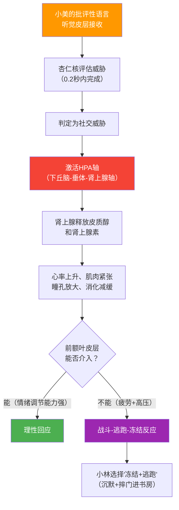
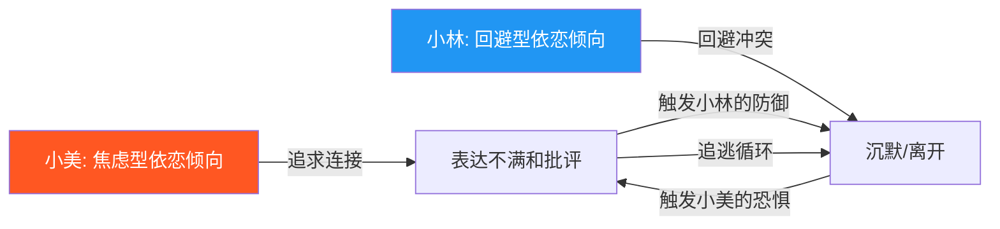
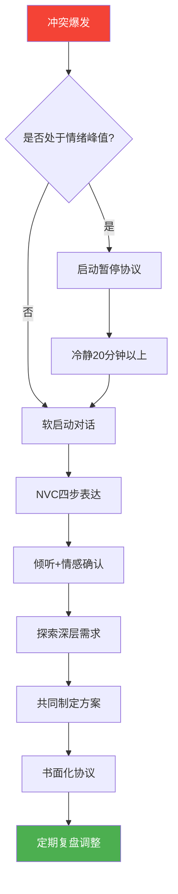

## 场景一：伴侣争吵——"你总是不在家"

亲密关系中的冲突是人类情感体验中最复杂、最具破坏力、也最具修复潜力的场景之一。"你总是不在家"这五个字，浓缩了无数伴侣从热恋走向倦怠、从甜蜜走向怨怼的核心矛盾——**陪伴的质量与数量之争**。本节将从一个真实感极强的案例出发，层层拆解冲突的生理机制、心理动力、沟通结构和修复路径，提供从"急救止血"到"长期免疫"的完整方案。

### 1.1 场景全景还原

小林和小美结婚三年，有一个两岁的女儿。小林是互联网公司的产品经理，最近负责的新项目临近上线，连续两个月加班到九十点甚至更晚。小美是自由职业的设计师，自从有了孩子后，她把大部分工作时间压缩到白天孩子午睡和去早教班的间隙，晚上全程带娃。

今晚九点十五分，小林拖着疲惫的身体打开家门。客厅灯亮着，小美坐在沙发上，手机屏幕的光映在她脸上——她刚哄完孩子睡觉，本来想看会儿剧，但看了十分钟就放下了，一直在等小林回来。

小美一看到小林，积攒了一整天的疲惫和委屈瞬间涌上来："你又这么晚！你心里到底有没有这个家？"

小林今天在公司被老板批评了项目进度，开了一天的会，连午饭都没顾上吃。他听到这句话，第一反应是委屈和愤怒："我这么辛苦还不是为了这个家？你就不能体谅一下？"

小美的声音更大了："体谅？我每天一个人带孩子、做饭、收拾家务，你体谅过我吗？孩子发烧那次你都不在，是我一个人抱着她去医院的！"

小林沉默了。他不知道该说什么——一方面他确实觉得愧疚，另一方面他又觉得自己的辛苦不被看见。最后他选择了最省力的方式：摔门进了书房。

小美独自坐在客厅，眼泪掉了下来。她心里想的不只是今晚，而是这几个月来无数个独自面对一切的夜晚。

#### 1.1.1 被忽略的非言语细节

文字记录只能捕捉对话内容，但冲突中真正传递情绪的往往是非言语信号。如果我们用"慢镜头"回放这个场景，会看到更多关键信息：

**小美的非言语信号：**
- 小林进门时，小美没有起身，没有抬头——这是一个"被动等待"的姿态，说明她已经在情绪上做好了"失望"的准备
- "手机屏幕的光映在她脸上"——她不是在玩手机，而是放下了手机在发呆，这说明她内心有未处理的情绪需要出口
- 说"你心里到底有没有这个家"时，声音尖锐、语速加快——这是应激状态下的典型表现，声带紧张导致音调升高

**小林的非言语信号：**
- "拖着疲惫的身体"——肩膀低垂、步态沉重，这本身就是一种"我很累了请不要攻击我"的无声请求
- 摔门而非关门——力度的失控说明他的情绪已经溢出了理性管控的阈值
- 沉默不是思考，而是"冻结反应"（freeze response）——大脑的前额叶皮层在应激状态下暂时"离线"，他不是不想说，而是真的说不出

**环境的非言语信号：**
- 晚上九点、客厅灯亮着、孩子已睡——整个空间处于一种"静默等待"的张力中，这种张力在小林推门的瞬间被引爆
- 书房成了"安全避难所"——小林选择去书房而不是卧室，暗示他需要一个"独属于自己的空间"来恢复控制感

### 1.2 冲突升级的生理机制

在分析沟通技巧之前，我们需要先理解一个被大多数人忽略的事实：**争吵在本质上是一场生理事件，而不仅仅是心理事件。**

#### 1.2.1 应激反应链

当小美说出"你心里到底有没有这个家"时，小林的大脑经历了以下过程：

这里有几个关键数据：
- **杏仁核的反应速度**：比前额叶快约200毫秒。在你"想清楚"之前，身体已经进入了应激状态。
- **皮质醇的持续时间**：一次应激事件产生的皮质醇需要20-60分钟才能代谢完毕。这意味着小林在摔门进书房后，至少需要20分钟才能从生理上恢复到可以理性对话的状态。
- **累积效应**：小林连续两个月高强度工作，他的基线皮质醇水平已经偏高。在这种状态下，他需要更少的刺激就能触发应激反应——这就是为什么"你又这么晚"这种话在平时可能只是让他不舒服，在疲劳状态下却能直接引爆。

#### 1.2.2 情绪淹没

戈特曼将这种状态称为"情绪淹没"（Emotional Flooding）——当消极情绪的强度超过一个人的处理能力时，认知功能会急剧下降。具体表现为：

| 被淹没时的变化 | 具体表现 | 对沟通的影响 |
|---|---|---|
| 心率超过100次/分钟 | 呼吸变浅、手心出汗 | 无法进行复杂思考 |
| 前额叶活动降低 | 想不出合适的话 | 说不出"我需要冷静一下" |
| 记忆检索受限 | 只能回忆起负面事件 | "翻旧账"的生理基础 |
| 共情能力下降 | 无法理解对方的立场 | 听不进去任何解释 |
| 战斗/逃跑本能启动 | 攻击或回避 | 摔门或冷暴力 |

**关键洞察**：小林的摔门不是"性格不好"或"不尊重小美"，而是在情绪淹没状态下，大脑自动选择了"逃跑"这一最节省能量的应对方式。理解这一点，不是为了给摔门找借口，而是为了找到真正的解决路径——**不是教他在被淹没时"忍住"，而是教他在被淹没之前就识别信号并主动调节。**

#### 1.2.3 女性与男性的应激差异

神经科学研究显示，男性和女性在冲突中的应激反应存在统计学差异（注意：是群体趋势，不是个体命运）：

- **男性更容易触发"冻结-逃跑"反应**：睾酮水平较高与更强的战斗/逃跑倾向相关，但在亲密关系冲突中，大多数男性选择逃跑（回避）而非战斗（攻击），因为攻击伴侣违反了社会规范
- **女性更容易触发"战斗-连接"反应**：催产素水平较高使得女性在应激状态下更倾向于寻求连接——即使这种连接的方式是愤怒的指责，其底层动机仍然是"我需要你回应我"
- **恢复时间差异**：男性从情绪淹没中恢复的平均时间比女性长约10-15分钟，这解释了为什么小林需要"冷静一下"而小美更希望"现在就谈"

**应用建议**：这些差异不是借口，而是信息。了解这些差异后，双方可以制定更合理的冲突管理策略——比如约定"暂停至少20分钟"，而不是"我冷静了就出来"（因为"冷静了"是主观感受，20分钟是客观标准）。

### 1.3 问题深度诊断

这场争吵表面上是关于"回家时间"的分歧，但深层包含了至少六个维度的沟通障碍。我们用本章前面学到的理论框架逐一拆解。

#### 1.3.1 末日四骑士分析

戈特曼研究所发现的"末日四骑士"在这场对话中出现了三个（准确地说是三个半）：

| 骑士 | 小美的表现 | 小林的表现 | 毒性分析 |
|---|---|---|---|
| **批评** | "你总是不在家"——攻击人格而非描述行为；"你心里到底有没有这个家"——质疑对方的品格和爱 | "你就不能体谅一下"——暗示对方缺乏同理心 | 批评将矛盾从"行为问题"升级为"人格问题"，让对方无法通过改变行为来解决 |
| **防御** | — | "我这么辛苦还不是为了这个家"——拒绝倾听对方的需要，将焦点转移到自己的付出 | 防御的本质是"反指控"——不是在回应对方的感受，而是在说"你应该换一个指控" |
| **石墙** | — | 摔门进书房——完全关闭沟通通道 | 石墙是最致命的骑士，因为它传递的信息是"你的情绪不值得我回应" |
| **蔑视** | "你心里到底有没有这个家"——质疑对方的爱和品格 | — | 蔑视是四骑士中预测离婚准确率最高的单一指标，因为它攻击的是对方的核心人格 |

戈特曼的研究指出，批评和蔑视是冲突升级的主要推手，而防御和石墙则让冲突无法被修复。当四骑士长期驻扎在关系中时，关系满意度每年下降约12%。更危险的是**四骑士的"传染性"**——蔑视催生防御，防御催生批评，批评催生石墙，形成一个自我强化的恶性循环。

#### 1.3.2 依恋模式视角

从依恋理论的角度看，小美和小林的互动模式非常典型——焦虑型与回避型的"追逃循环"（pursuit-withdrawal pattern）：

小美的核心恐惧是"被抛弃"和"不被重视"。当小林连续晚归，她的依恋系统被激活——"他不在家→他不在乎我→我可能失去他"。这种恐惧以愤怒的形式表达出来，因为愤怒比恐惧更有力量感。心理学家苏·约翰逊（Sue Johnson）将此称为"绝望的抗议"（desperate protest）——表面上是攻击，底层是"请你看到我，我需要你"。

小林的核心需要是"被认可"和"被理解"。当小美用批评开场，他的依恋系统也被激活——"她在攻击我→我的努力不被看见→我在这个家里没有价值"。他选择离开，不是因为不在乎，而是因为他不知道如何在被攻击的状态下保持连接。

**追逃循环的隐藏代价**：这个循环最阴险的地方在于——小美越追，小林越逃；小林越逃，小美越追。双方都在用"本能反应"应对恐惧，结果却把对方推得更远。而且，这个循环会随着每一次重复而加深——下一次冲突时，小美会在更短的时间内进入愤怒状态（因为上次的恐惧还没被修复），小林会在更短的时间内选择离开（因为上次留下了"说什么都没用"的记忆）。

#### 1.3.3 情感账户透支

用情感账户模型来分析：小林和小美的账户已经严重透支。

| 类型 | 具体事件 | 金额类比 |
|---|---|---|
| **大额取款** | 孩子发烧那次小美独自去医院 | 相当于一次巨额透支 |
| **大额取款** | 连续两个月缺乏陪伴 | 相当于每月大额固定支出 |
| **小额取款** | 每天晚归、到家后疲惫不语 | 相当于每日小额扣费 |
| **小额取款** | 没有主动关心小美的状态 | 相当于忽略账单提醒 |
| **存款几乎为零** | 没有惊喜、没有感谢、没有主动分担 | 相当于零收入 |
| **隐性负债** | 小美对"独自面对一切"的恐惧在累积 | 相当于高利贷——越拖利息越高 |

情感账户的透支让每一次小摩擦都变成了大冲突——因为双方都在"亏空"状态下运作，已经没有缓冲余量了。打个比方：账户充裕时，对方忘了倒垃圾你可能一笑而过；账户透支时，对方忘了倒垃圾你会觉得"他根本不在乎这个家"。

#### 1.3.4 爱的语言错位

小美最核心的爱的语言很可能是**精心时刻（Quality Time）**和**服务的行动（Acts of Service）**——她需要小林的陪伴，也需要有人分担家务和育儿。而小林表达爱的方式是**服务的行动**——他认为拼命工作赚钱就是对家庭的付出。

这不是谁对谁错的问题，而是双方用不同的语言在"说爱"，却听不懂对方在说什么。类比一下：小林在用英语说"I love you"，小美在用中文等"我爱你"——意思一样，但接收不到。

**爱的语言错位的检测方法**：问自己两个问题——①"我最常抱怨伴侣什么？"（你的抱怨指向你未被满足的爱的语言）；②"我最常为伴侣做什么？"（你做的事情指向你表达爱的语言）。小美最常抱怨的是"不在家"，说明她的核心语言是精心时刻；小林最常做的是"加班赚钱"，说明他的表达语言是服务的行动。

#### 1.3.5 非暴力沟通四个维度的缺失

| NVC维度 | 小美的实际表达 | 应该有的表达 | 为什么会有这个差异 |
|---|---|---|---|
| **观察** | ❌ "你又这么晚"（"又"是评判） | ✅ "这周你有五天都是九点以后回来" | 在情绪激动时，大脑倾向于使用模糊的全称判断（"总是""从来""又"），因为精确描述需要前额叶的参与，而前额叶在应激状态下功能减弱 |
| **感受** | ❌ "你心里有没有这个家"（这是评判，不是感受） | ✅ "我感到孤独和疲惫" | 大多数人从小被教导"不许哭""别生气"，长大后很难区分"感受"和"评判"——我们习惯于评判他人，而不是表达自己的脆弱 |
| **需要** | 完全未表达 | ✅ "我需要你的陪伴和支持" | 表达需要意味着暴露脆弱——"我需要你"这句话对很多人来说比"你做错了"更难说出口 |
| **请求** | ❌ 隐含的命令（你必须早点回来） | ✅ "这周能不能有两天七点前回来？" | 在愤怒状态下，人倾向于发号施令而非请求，因为命令让人感觉更有控制力 |

#### 1.3.6 元沟通的缺失

"元沟通"（meta-communication）指的是"关于我们如何沟通的沟通"。在这场冲突中，双方完全没有元沟通——没有人在说"我们的对话方式出了问题"。

元沟通的例子：
- "我觉得我们现在都在气头上，说出来的话可能会伤人，能不能先暂停一下？"
- "我发现每次我表达不满，你就会沉默，然后我就更生气——我们能不能打破这个模式？"
- "我不是在攻击你，我是在告诉你我很难过——你能听到这个区别吗？"

元沟通是"跳出棋盘看棋局"的能力，它需要更高的心理化水平（mentalization）——即意识到"我有情绪，你也有情绪，我们的互动方式本身是一个可以被观察和调整的对象"。

### 1.4 完整重建方案

#### 1.4.1 第一阶段：自我调节（冲突前的准备）

**核心理念**：最好的冲突管理不是在冲突中"控制情绪"，而是在冲突发生前就建立好情绪调节的基础设施。

**小林的自我调节工具箱：**

**① 生理调节技术——4-7-8呼吸法**

当小林感受到自己开始紧张（心跳加速、肩膀紧绷、思维变窄）时：

吸气4秒 → 屏住7秒 → 呼气8秒 → 重复3-4轮

这个方法的原理：延长呼气时间激活副交感神经系统（"休息-消化"模式），直接对抗应激状态下的交感神经系统（"战斗-逃跑"模式）。

**② 认知调节技术——"故事检查"**

在回应小美之前，快速检查自己脑中正在上演的"故事"：

| 自动化故事 | 检查问题 | 替代故事 |
|---|---|---|
| "她在攻击我" | "她真的在攻击我，还是在表达痛苦？" | "她在用愤怒掩盖恐惧" |
| "我的努力不被看见" | "她不看见我的努力，还是她有自己的苦？" | "她有自己的压力，我们都需要被理解" |
| "说什么都没用" | "真的什么话都没用，还是我过去用错了方式？" | "也许我需要换一种回应方式" |

**③ 行为调节技术——"到家前三分钟"**

小林在电梯里或楼道里时，给自己三分钟做以下准备：
1. 深呼吸三次
2. 提醒自己："小美一个人带了一天孩子，她可能很累、很需要我"
3. 准备一句关心的话："今天怎么样？孩子乖不乖？"
4. 放下"解决问题"的模式，进入"倾听连接"的模式

**小美的自我调节工具箱：**

**① 感受区分练习**

在开口之前，先用10秒钟回答："我现在的真实感受是什么？"

小美脑中的自动化反应是"愤怒"，但如果深入感受，她会发现愤怒下面还有：
- **孤独**："我一个人在家待了一整天"
- **恐惧**："他是不是不在乎我了？"
- **疲惫**："我太累了"
- **悲伤**："我怀念以前的日子"

找到最底层的那个感受，用它来开场——"我很想你"比"你又这么晚"有效一百倍。

**② 接地技术（Grounding）**

当情绪太强烈以至于无法理性思考时，使用5-4-3-2-1接地带：
- 看到**5**样东西（沙发、台灯、窗外的树……）
- 触摸**4**样东西（衣服的质感、沙发的温度……）
- 听到**3**种声音（空调声、远处的车声……）
- 闻到**2**种气味（饭菜的味道、空气清新剂……）
- 尝到**1**种味道（嘴里残留的薄荷味……）

这个方法的原理：将注意力从"内心的情绪风暴"拉回到"外部的感官现实"，打断杏仁核的应激循环。

#### 1.4.2 第二阶段：情绪降温（冲突当夜）

当争吵已经开始升级，最重要的是先"止血"，而不是立刻解决问题。

**小林的正确做法（代替摔门离开）：**

> "小美，我现在情绪很激动，脑子有点转不动。我需要冷静一下，不是要逃避你。我去书房待十五分钟，然后我出来咱们好好聊，好吗？"

这段话做了四件事：
1. **告知**自己的状态——"我情绪激动"，让对方知道你的沉默不是冷漠
2. **承诺**会回来——"十五分钟后出来"，给对方一个确定性
3. **区分**暂停和石墙——"不是要逃避你"，打消对方被抛弃的恐惧
4. **设置时间边界**——"十五分钟"，而不是"等我冷静了"（主观、不可预期）

**小美的正确做法（如果小林提出暂停）：**

允许对方暂停。焦虑型依恋者最难做到的就是这一点，因为对方的离开会触发深层恐惧。但你需要知道：**暂停不等于抛弃，沉默不等于冷漠。** 如果你能在对方需要空间时给予空间，这本身就是一种深刻的爱的表达。

如果实在难以承受，可以说："好，你去冷静，但你一定要回来。我就在这里等你。"——这句话既给了对方空间，也确认了自己的安全感。

**暂停期间各自该做什么：**

| 小林在书房 | 小美在客厅 |
|---|---|
| 4-7-8呼吸法3-4轮 | 5-4-2-1接地技术 |
| 问自己："小美真正想告诉我什么？" | 问自己："我想达到什么目的？" |
| 写下3个关键词：自己想表达的核心感受 | 写下3个关键词：自己真正需要的是什么 |
| 设定闹钟15分钟 | 如果情绪太强，也做一个简短的呼吸练习 |

#### 1.4.3 第三阶段：软启动对话（冷静后）

情绪降温后（至少20分钟，研究表明应激激素需要这么长时间才能下降），双方需要重新开始对话。发起对话的方式至关重要——戈特曼的研究表明，冲突的前3分钟决定了96%的结果。

**小美的软启动版本：**

> "老公，你回来了。（停顿，深呼吸）这周你有五天都是九点以后才回来，今晚又是九点多。我一个人带孩子一整天，到晚上真的很累，也很想你。我感到有点孤独和委屈，因为我需要你的陪伴和支持。你这周能不能至少有两天在七点之前回来？我们可以一起吃晚饭，一起陪孩子玩一会儿。"

拆解这段话的NVC结构：

| 步骤 | 内容 | 技巧要点 |
|---|---|---|
| 观察 | "这周你有五天都是九点以后才回来" | 具体数据，没有"总是""又" |
| 感受 | "我感到孤独和委屈" | 用情绪词汇，而非评判 |
| 需要 | "因为我需要你的陪伴和支持" | 揭示感受背后的需要 |
| 请求 | "这周能不能有两天七点前回来" | 具体、可行、允许拒绝 |

**小林的回应版本：**

> （放下包，走向小美，坐下）"亲爱的，我听到你说的了。你一个人带孩子确实很辛苦，我回来这么晚你一定很累，也很想我能多陪陪你。（情感确认）我最近工作压力确实很大，项目快到截止日期了，但我不应该让你一个人扛所有的事。（承担责任）这周我尽量调整一下，周三和周五早点回来，好吗？（提出方案）"

这段回应做了三个关键动作：
1. **情感确认**——"你一定很累，也很想我能多陪陪你"，这是把对方的感受用自己的话重述一遍，让对方知道"我听懂了"
2. **承担责任**——"我不应该让你一个人扛"，而不是"我不是故意的"（后者是否认，前者是承担）
3. **具体方案**——"周三和周五早点回来"，而不是模糊的"我以后注意"

**小林回应中的非言语要素（同样重要）：**
- **放下包**——象征"卸下外部世界的负担，现在全部注意力给你"
- **走向小美**——用空间距离的缩短表达"我想靠近你"
- **坐下**——降低身体高度，减少威胁感，同时暗示"我不急着走，我愿意花时间听"

#### 1.4.4 识别与回应"修复尝试"

戈特曼研究中一个极其重要的发现是：**决定冲突走向的不是冲突有多激烈，而是双方能否识别并回应对方的"修复尝试"（repair attempt）。**

修复尝试是任何旨在阻止消极互动升级的言语或行为。它可以是一个笑话、一个拥抱、一句"我理解你"、一个自嘲、甚至只是改变语调。

在这个案例中，如果对话出现以下修复尝试，另一方需要学会"接住"：

| 修复尝试 | 如果被接住 | 如果被忽略 |
|---|---|---|
| 小美说"我知道你也很辛苦" | 小林感到被理解，更愿意倾听 | 小林觉得这是"转折后又要批评我" |
| 小林说"你说得对，我确实回来太少了" | 小美感到被看见，情绪缓和 | 小美觉得这是敷衍 |
| 小林轻轻握住小美的手 | 体温传递的安全感比语言更直接 | 小美甩开——修复失败，冲突升级 |
| 小美声音变柔、语速放慢 | 小林的应激系统降级 | 小林没注意到——错失转折点 |

**练习方法**：每天有意识地发起至少一个修复尝试（可以很小），并观察对方的反应。如果对方没接住，直接说出来："我刚才其实想缓和一下，你注意到了吗？"

#### 1.4.5 第四阶段：深层需求探索

表面问题解决后（调整回家时间），还需要探索更深层的需求，否则同样的冲突会以不同形式反复出现。

**对话示例：**

> 小美："其实不只是回家时间的问题。有时候我觉得我们的生活好像只剩下'上班-带娃-睡觉'这三件事了。我怀念以前我们能一起出去走走、聊聊天的日子。"
>
> 小林："我也是。说实话，我每天加班也觉得很累，但我一直在想'再撑一撑就好了'。可项目一个接一个，好像永远撑不到头。"
>
> 小美："那你有没有想过，也许我们需要一起想个办法？不是你一个人扛工作压力，也不是我一个人扛家里。"
>
> 小林："你说得对。我们是一个团队。"

这段对话触及了真正的核心问题：
- **小美的深层需求**：不只是一起吃晚饭，而是"我们还是一个整体"的感觉
- **小林的深层需求**：不被当作"只知道工作的机器"，而是"我的付出被看见"
- **共同的需求**：重新成为合作伙伴，而不是各自为战

**深层需求探索的引导问题：**
1. "在你理想的一天中，我们的生活是什么样的？"（探索愿景）
2. "如果有一个魔法能改变一件事，你最想改变什么？"（探索优先级）
3. "你小时候家里是怎么处理这种问题的？"（探索原生家庭的影响）
4. "你觉得我做的哪件事让你最感到被爱？"（探索爱的语言）

#### 1.4.6 第五阶段：制定具体协议

空洞的承诺（"我以后多陪你"）毫无意义。双方需要制定具体的、可执行的、可检验的协议。

**家庭时间协议模板：**

| 项目 | 具体内容 | 频率 | 责任人 | 验证标准 |
|---|---|---|---|---|
| 每周家庭晚餐 | 周三、周五七点前到家，一起做饭吃饭 | 每周2次 | 小林负责提前安排工作 | 手机日历提醒+打卡 |
| 独处时间 | 周六上午小美外出（咖啡馆/逛街/见朋友），小林独自带娃 | 每周1次 | 小林全权负责 | 小美出门前拍张照发朋友圈 |
| 约会夜 | 每月一次，请家人帮忙看孩子，两人单独出去 | 每月1次 | 轮流安排 | 提前两周定日期 |
| 日常连接 | 每天中午通一个电话，哪怕只有五分钟 | 每天 | 谁方便谁先打 | 设定12:30闹钟 |
| 家务分担 | 列出家务清单，重新分配 | 持续 | 共同协商 | 贴在冰箱上的分工表 |
| 情绪检查 | 每周日晚上，孩子睡后，互相问"这周你过得怎么样" | 每周1次 | 轮流发起 | 设定周日21:00提醒 |

**协议制定的SMART原则：**
- **S**pecific（具体）：不是"多陪陪"，而是"周三周五七点前到家"
- **M**easurable（可衡量）：不是"少加班"，而是"每周加班不超过三天"
- **A**chievable（可实现）：不是"每天六点回来"（不现实），而是"两天七点前"（可操作）
- **R**elevant（相关）：每条协议都要对应一个具体的情感需要
- **T**ime-bound（有时限）：不是"以后"，而是"从下周开始，试行一个月后复盘"

**协议的"试行期"设计**：不要说"我们永远这样做"，而是"先试一个月"。这降低了双方的心理压力——如果做不到，不是"违约"，而是"需要调整"。

#### 1.4.7 道歉的语言学框架

一个有效的道歉不是简单说"对不起"，而是包含六个层次。缺少任何一个层次，道歉的效果都会大打折扣：

| 层次 | 内容 | 示例（小林） | 缺失时的问题 |
|---|---|---|---|
| ① 表达歉意 | 说出"对不起" | "对不起，我让你一个人承受了这么多" | 对方不确定你是否真的觉得自己有错 |
| ② 承认具体行为 | 指出你做了什么 | "我连续两个月几乎每天都很晚回来" | "对不起"太空洞，对方不知道你到底理解了什么 |
| ③ 承认对方的影响 | 说出你的行为给对方造成了什么 | "你一个人带孩子、做家务，肯定很累很委屈" | 对方觉得你只是在道歉，不是在理解 |
| ④ 承担责任 | 不找借口 | "不管工作多忙，我都不应该让你一个人扛" | "但是"后面的任何内容都会消解前面的道歉 |
| ⑤ 提出补救方案 | 你打算怎么做 | "周三和周五我会提前安排好工作，七点前到家" | 没有方案的道歉是空头支票 |
| ⑥ 请求原谅 | 给对方选择权 | "你能原谅我吗？我知道信任需要时间重建" | 对方觉得你是被迫道歉，不是真心的 |

**道歉的大忌——"但是"型道歉：**
- ❌ "对不起，但是我真的很忙"→这不是道歉，这是辩护
- ❌ "对不起，但是你也有问题"→这不是道歉，这是反指控
- ✅ "对不起。"→句号，不是逗号

### 1.5 变体场景与应对策略

这个核心场景在生活中有多种变体，每种变体需要的策略略有不同。

#### 1.5.1 变体一：伴侣出差频繁

> "你一个月有二十天在出差，这个家对你来说就是个旅馆吗？"

**额外挑战**：出差通常不可控（公司安排），双方需要区分"能改变的"和"不能改变的"。

**策略调整**：
- 在不能改变出差频率的情况下，聚焦于"出差期间如何保持连接"
- 具体方案：出差期间每天视频通话15分钟、出差回来第一天设为"家庭日"、出差前一起规划这段时间谁负责什么
- 关键话术："我知道出差不是你能选择的，但我们能不能一起想想，怎么让这段时间对我们都好过一点？"

**出差期间的"远程情感存款"清单：**
- 每天发一条"今天的趣事"——不是"吃了吗"这种例行公事，而是真正分享你的生活
- 出差地寄一张明信片或买一个小礼物——物理物品承载的情感重量远超消息
- 视频通话时不只是"汇报情况"——看看对方的脸，说"我想你了"
- 出差前在冰箱上留一张纸条——"冰箱里有你爱吃的蛋糕，三天后见"

#### 1.5.2 变体二：伴侣沉迷工作/爱好

> "你下班回来就打游戏/刷手机/看球赛，我跟你说什么都心不在焉。"

**额外挑战**：人在家里但心不在——这种"物理在场但心理缺席"比纯粹不在家更伤人，因为它传递的信号是"我在你旁边，但我选择不关注你"。

**策略调整**：
- 区分"需要独处时间"和"忽视伴侣"——每个人都需要独处充电，这本身不是问题
- 核心问题不是"你打游戏"，而是"我们在一起的高质量时间太少"
- 具体方案：约定每天有30分钟"无手机时间"，双方都放下设备，面对面交流；独处时间双方各取所需，但提前说好，而不是用逃避的方式

**"手机干扰"的特殊分析**：数字时代，"不在家"有了新的形式。伴侣可能物理上在同一个房间，但精神上完全沉浸在手机里。研究表明，"phubbing"（phone snubbing，手机冷落）与关系满意度下降存在显著相关。手机冷落比缺席更具伤害性的原因是：**它让被冷落的一方感到自己不如一块屏幕有价值。**

#### 1.5.3 变体三：新婚/恋爱初期

> "我们才刚在一起，你就开始不着家了，以后怎么办？"

**额外挑战**：这个阶段双方还在建立关系模式，现在的处理方式会奠定未来的基调。

**策略调整**：
- 这是一个"关系模式定义"的窗口期，抓住机会建立好的沟通习惯
- 趁情感账户还有余额（热恋期的积累），讨论双方对未来生活节奏的期待
- 关键话术："我们刚在一起，正好可以聊聊，我们都希望以后的生活是什么样的？"

**恋爱初期的"预防性对话"清单：**
1. "你理想中的一周是什么样的？工作和生活怎么分配？"
2. "你独处的时候需要多少时间？我怎么知道你需要独处了？"
3. "如果我们中的一个很忙，另一个会觉得被忽略吗？怎么防止这种情况？"
4. "你小时候家里人是怎么相处的？你希望我们的家像那样吗？"

#### 1.5.4 变体四：有孩子后

这正是本案例的场景。有孩子后的"不在家"问题比二人世界时更尖锐，原因在于：

- 育儿的工作量是全天候的，留守方几乎没有喘息空间
- 经济压力增加（房贷、奶粉、早教），外出工作方更有"正当理由"加班
- 双方注意力都转移到孩子身上，夫妻关系容易被忽视
- 睡眠不足导致情绪耐受度降低
- 社会支持系统被压缩——带孩子后社交圈急剧缩小，留守方的情感出口变窄

**特别注意**：有孩子后的头三年是婚姻满意度的低谷期。这不是"不爱了"，而是角色转换带来的阵痛。双方都需要有意识地维护夫妻关系——你们不只是"孩子的爸爸妈妈"，还是"彼此的伴侣"。

**产后伴侣关系的特殊挑战：**
- **身体恢复期的亲密需求变化**：产后女性的身体需要时间恢复，亲密关系的表达方式需要调整
- **育儿理念的分歧**：两个不同原生家庭的人对"怎么养孩子"有不同看法，这会成为新的冲突源
- **角色认同的转换**：从"XX的伴侣"到"XX的妈妈/爸爸"，身份认同的转变会带来失落感
- **"丧偶式育儿"的怨恨**：如果一方长期缺席育儿，另一方的怨恨会累积到危险水平

#### 1.5.5 变体五：数字时代的"已读不回"

> "我给你发消息你都不回，你到底在干什么？"

这是数字时代特有的"不在家"变体。伴侣可能物理上在同一个城市，但消息已读不回、电话不接、朋友圈里给别人点赞却不回复伴侣的消息。

**特殊分析**：
- "已读不回"触发的焦虑比"没看到"更强烈，因为"已读"意味着"你看到了，但你选择不回应我"
- 对焦虑型依恋者来说，消息的回复速度直接与"我在你心中的位置"挂钩
- 很多冲突不是因为内容，而是因为"你为什么不回我消息"

**应对策略**：
- 建立"消息回复预期"：比如"工作时间我可能没法秒回，但午饭和下班后一定会回"
- 区分"紧急"和"不紧急"：约定一个信号（比如连发三条表示紧急），避免把所有消息都当作紧急
- 理解"不回消息"的多种可能：在开会、手机静音、正在思考怎么回、需要独处时间——而不是自动解读为"不在乎"

### 1.6 常见错误与纠正

#### 1.6.1 错误一：用"忙"作为万能挡箭牌

> ❌ "我也想早点回来，但我有什么办法？工作就是这么多。"

**问题**：这句话听起来像是在说"问题无法解决"，但实际上是在拒绝参与问题解决的过程。它的潜台词是："你的需要不在我优先级的前列。"

**纠正**：承认困境的同时，表达解决问题的意愿。

> ✅ "我知道这段时间我回来太晚了，你承受了很多。工作确实很忙，但我不想让它成为我们之间的障碍。我们能不能一起想想办法？"

**更深层的纠正**：反思"忙"是否真的是无法改变的。很多时候，"忙"是一种选择——选择加班而不是拒绝不合理的工作量，选择追求完美而不是接受"够好"。问自己：如果明天是世界末日，我还会选择加班吗？如果答案是不会，说明"忙"不是绝对的。

#### 1.6.2 错误二：翻旧账

> ❌ "你上次答应我的事也没做到，你有什么资格说我？"

**问题**：把当下的问题和过去的问题混在一起，让对话变成"谁的错更多"的竞赛。翻旧账的潜台词是："我不是唯一有错的人"——它的目的不是解决问题，而是在道德上打平。

**纠正**：一次只讨论一个话题。如果过去的事仍然困扰你，另外找时间单独谈。

> ✅ "你上次说的事我们另外找时间聊。今天我想先谈谈我最近的感受，可以吗？"

**翻旧账的心理机制**：为什么会翻旧账？因为过去受伤的记忆没有被修复，它一直在"等待处理"。当新的冲突出现，旧伤被同时激活——"旧伤+新痛"的叠加使得情绪远超当前事件的合理范围。解决方法不是"不许翻旧账"，而是"给旧账一个专门的时间去处理"。

#### 1.6.3 错误三：虚假的"我没事"

> ❌ "（冷着脸）没事，你忙你的吧。"

**问题**：说没事但表情和语气完全不是"没事"——这是在用被动攻击的方式表达不满。对方要么相信你说的"没事"（你更生气），要么知道你在说谎但不知道你到底想要什么（两个人都很累）。

**纠正**：如果现在不想谈，可以说"我现在不太想聊这个，但我需要一些时间想想，我们明天再谈好吗？"——既诚实，又给了自己缓冲空间。

**被动攻击的代价**：被动攻击看似"没有在吵架"，但它比直接冲突更具破坏性。直接冲突至少暴露了问题，被动攻击把问题埋进地下——它不会消失，只会在未来以更扭曲的形式爆发。

#### 1.6.4 错误四：只改行为不改态度

> ❌ "好好好，我以后早点回来就是了。"（语气不耐烦）

**问题**：行为上的改变如果没有态度上的配合，对方是能感受到的。被迫的改变比不改变更伤人——因为它传递的信息是"我不认为你的需要是合理的，但我不想再吵了"。

**纠正**：在答应改变之前，先确认自己理解了对方为什么有这个需要。如果觉得方案不合理，提出替代方案，而不是勉强答应后心怀不满。

> ✅ "我理解你需要我多在家。周三和周五七点前到家我觉得可以试试，但周五可能有困难——我能不能改成周四？"

#### 1.6.5 错误五：一方完全妥协

> ❌ 小林为了不吵架，彻底放弃加班，结果项目被延误，被公司批评。

**问题**：单方面的牺牲不可持续。小林如果把所有的压力都吞下去，迟早会以更激烈的方式爆发（突然辞职、外遇、情绪崩溃）。

**纠正**：真正的解决方案一定兼顾双方的需要。如果一个方案让其中一方持续牺牲，它就不是一个好的方案。好的方案是"双方都稍微调整一点"，而不是"一方完全改变"。

#### 1.6.6 错误六：用"为了孩子"绑架关系

> ❌ "要不是为了孩子，我早就不想过了。"

**问题**：这句话的破坏力极大——它同时传达了三个信息：①我不幸福；②这段关系本身不值得维持；③你只是因为孩子才有存在的价值。它把孩子变成了"人质"，把伴侣变成了"附属品"。

**纠正**：孩子需要的是一个健康的家庭环境，而不是两个痛苦地绑在一起的父母。如果关系有问题，解决问题才是为了孩子；而不是忍耐才是为了孩子。

#### 1.6.7 错误七：公开场合批评伴侣

> ❌ 在朋友聚会上说："他天天加班，家里什么都不管。"

**问题**：在第三方面前批评伴侣会严重损害对方的自尊和信任。它不仅是一个沟通错误，更是一个信任背叛——"你把我们的私事公之于众"。

**纠正**：关系中的问题只在关系内部讨论。如果需要倾诉，找一个双方都信任的朋友或专业咨询师，而不是在社交媒体或公开场合。

### 1.7 进阶：深层修复与长期维护

#### 1.7.1 理解"争吵"的功能性

大多数人把争吵视为关系的"故障"，但心理学家约翰·戈特曼的研究表明：**幸福的夫妻和不幸福的夫妻吵架的频率几乎没有区别**。区别在于吵架的方式。

争吵本身有三个正面功能：
1. **信号功能**：告诉你某个需要长期没有被满足
2. **释放功能**：压抑的不满需要出口，适度的争吵比冷暴力健康得多
3. **调整功能**：每一次成功的冲突解决都是在优化你们的合作模式

所以目标不是"不吵架"，而是"吵完之后关系更好了"。

**区分"建设性冲突"和"破坏性冲突"：**

| 维度 | 建设性冲突 | 破坏性冲突 |
|---|---|---|
| 焦点 | 具体行为和事件 | 人格和品格 |
| 语气 | 不舒服但尊重 | 蔑视和嘲讽 |
| 倾听 | 尝试理解对方的立场 | 只等对方说完好反驳 |
| 修复 | 有修复尝试，且被接住 | 修复尝试被忽略或拒绝 |
| 结果 | 达成共识或妥协 | 双方各退一步，问题悬而未决 |
| 事后 | 关系有改善 | 关系有损伤 |

#### 1.7.2 建立"关系复盘"机制

每月找一个双方都放松的时间，进行20-30分钟的关系复盘。复盘不是翻旧账，而是有结构地回顾和调整。

**复盘三问模板：**

1. **这个月有什么让你感到被爱的时刻？**（识别有效的爱的表达）
2. **这个月有什么让你感到委屈或不满的事？**（及时释放情绪，避免积累）
3. **下个月我们可以做什么让彼此更开心？**（共同制定改进方案）

复盘时的规则：
- 先倾听，后回应
- 不打断对方
- 对事不对人
- 每次至少说出一个对方做得好的地方
- 复盘后有一个"收尾仪式"——拥抱、一起喝杯茶、或一起散步

**复盘的时机选择**：
- ✅ 双方都休息好了、心情平稳的时候
- ✅ 孩子不在身边或已经睡着的时候
- ❌ 刚吵完架（情绪还在）
- ❌ 一方刚下班很累的时候
- ❌ 即将出门赶时间的时候

#### 1.7.3 日常情感投资清单

预防胜于治疗。以下是一些低成本但高效的情感存款方式：

**每日（每项不超过5分钟）：**
- 出门前的拥抱（至少6秒，研究表明6秒以上的拥抱能释放催产素）
- 一句具体的赞美或感谢（"谢谢你今天做的饭，红烧肉特别好吃"而不是"你真好"）
- 一条关心的消息（"今天开会顺利吗？"）
- 晚上睡前说"晚安"+ 一个身体接触（亲额头、握手、拍肩）

**每周（每项30分钟-2小时）：**
- 一次无干扰的对话（放下手机，面对面）
- 一次共同活动（一起做饭、散步、看一部电影）
- 一次身体亲密（不一定是性，可以是按摩、牵手散步）
- 一次"分享时刻"——各自分享本周最开心和最难过的一件事

**每月（每项半天）：**
- 一次约会（不必昂贵，重点是"只有我们两个人"）
- 一次"感谢信"或"欣赏信"（写下这个月你感激对方的三件事）
- 一次"关系复盘"（见上文）

**每年：**
- 一次"关系旅行"——不需要远，哪怕只是住一晚酒店、换个环境
- 一次"关系目标设定"——像企业做年度规划一样，为你们的关系也设定目标

#### 1.7.4 当问题反复出现——识别深层模式

如果同样的争吵反复发生——"你总是不在家"说了无数次，对方也改了无数次但总是回到老样子——那说明你们可能触及了一个更深层的模式问题。

可能的深层原因：

**① 权力不平衡**
一方在关系中长期处于"付出更多"的位置，累积的怨气不会因为"早点回家"而消失。需要重新审视关系中的权力结构——谁在做决定？谁在牺牲？谁的需求总是排在前面？

**② 需求错位**
双方对"好的亲密关系"有根本不同的定义（一个需要高密度陪伴，一个需要大量独处空间）。这种错位不是通过"多陪陪"能解决的——它需要双方重新定义"陪伴"的含义。

**③ 未处理的历史创伤**
小美的"你总是不在家"可能触发了她童年时期被忽视的记忆——小时候父母忙碌、独自成长的经历。这种情绪的强度远超当下情境，因为她体验到的不只是"丈夫不在家"，而是"我又一次被忽略了"。这种情况下，伴侣治疗需要同时处理历史创伤。

**④ 回避型-焦虑型的追逃循环**
如果不打破这个模式，任何表面的改变都会被模式拉回去。打破循环需要双方同时工作——焦虑方学习自我安抚和给空间，回避方学习情感表达和主动连接。

**⑤ 关系中的"未完成事件"**
某个过去的重大冲突从未被真正解决——比如一次背叛、一次重大决策中的分歧、一次深深的失望。这个"未完成事件"像一个黑洞，不断吸收当下的情感能量。需要专门的时间和空间去面对和处理它。

#### 1.7.5 寻求专业帮助的路径指南

当自我调节和双方努力都无法突破时，专业帮助不是"关系失败"的标志，而是"我们愿意为关系投入更多"的证明。

**何时该寻求专业帮助：**
- 同样的问题反复出现超过三个月
- 一方或双方出现身体症状（失眠、食欲变化、频繁生病）
- 沟通已经完全停滞（任何话题都会吵架，或者已经不说话了）
- 出现信任危机（背叛、欺骗）
- 一方有心理健康问题（抑郁、焦虑、成瘾）

**专业帮助的类型：**

| 类型 | 适用场景 | 特点 | 时长 |
|---|---|---|---|
| **情绪聚焦疗法（EFT）** | 依恋问题、情感疏离 | 目前研究支持最强的伴侣治疗 | 8-20次 |
| **戈特曼方法** | 沟通问题、冲突模式 | 基于40年实证研究 | 12-20次 |
| **认知行为伴侣治疗（CBCT）** | 具体行为改变 | 短期、聚焦 | 8-12次 |
| **心理动力学伴侣治疗** | 深层模式、原生家庭影响 | 探索无意识动力 | 长期 |
| **个体治疗** | 个人创伤、心理健康 | 只有一方参与 | 灵活 |

**选择咨询师的建议：**
1. 查看资质：是否有伴侣/家庭治疗的专业认证
2. 初次咨询时感受：你是否觉得被理解、不被评判
3. 咨询师是否保持中立：好的咨询师不会"站队"
4. 如果试了两三次感觉不合适，换人是正常的

#### 1.7.6 关系健康自评工具

以下是一个简化的关系健康自评，帮助你判断当前的关系状态。每题1-5分（1=完全不符合，5=完全符合）：

**沟通维度：**
1. 我们能够坦诚地讨论大多数话题（ ）
2. 争吵后我们能够修复关系（ ）
3. 我感到被对方倾听和理解（ ）
4. 我们不使用蔑视、嘲讽或冷暴力（ ）

**连接维度：**
5. 我知道对方最近在烦恼什么（ ）
6. 我们有固定的"在一起"的时间（ ）
7. 我感到在关系中被珍视（ ）
8. 我们有共同的目标和愿景（ ）

**冲突维度：**
9. 争吵的焦点是事情而不是人格（ ）
10. 我们能够达成双方都能接受的妥协（ ）

**评分标准：**
- **40-50分**：关系健康，继续保持
- **30-39分**：有一些需要关注的领域，建议定期复盘
- **20-29分**：多个领域需要改善，建议阅读相关书籍或参加工作坊
- **10-19分**：关系处于危机状态，强烈建议寻求专业帮助

**使用方法**：双方各自独立打分，然后交换对比。差异最大的题目就是最需要讨论的领域。

### 1.8 实操练习

#### 练习一：改写开场白

把以下"硬启动"改为"软启动"，使用NVC四步法（观察-感受-需要-请求）：

1. "你天天就知道加班，家里什么事都不管！"
2. "你回来就知道往沙发上一躺，我是你的保姆吗？"
3. "人家老公都知道陪老婆逛街，你呢？"
4. "你答应过我的事又没做到，你说的话还能信吗？"

**参考改写：**

1. "这周你加班了四天，我一个人在家带孩子做家务，感到很疲惫，也需要一些支持。这周末你能不能帮我带半天孩子，我休息一下？"
2. "我看到你回来就躺在沙发上，我理解你工作很累，但我一个人忙了一天也很疲惫。你能不能先帮我把碗洗了，然后我们一起休息？"
3. "我最近特别想和你一起出去走走，不只是买东西，就是想和你单独待一会儿。这周末我们能抽出两个小时一起逛逛吗？"
4. "你上次说周三会早点回来，但还是加班了。我感到有些失望，因为对我来说，说到做到是很重要的。下次如果你不确定能不能做到，可以提前告诉我吗？"

**练习要点**：关键不是"把话说得更温柔"，而是把"你做错了"的框架转换为"我需要什么"的框架。前者引发防御，后者引发共情。

#### 练习二：角色互换

找一个安静的时间，和伴侣做这个练习：

1. 小美扮演小林，用小林的视角描述"为什么我经常加班"
2. 小林扮演小美，用小美的视角描述"为什么你不在家让我这么难受"
3. 各自听完后，用自己的话复述对方的核心感受和需要
4. 讨论：有没有什么以前没注意到的角度？

**练习的深层价值**：角色互换不是"理解对方的逻辑"，而是"体验对方的情绪"。当你用第一人称说出"我每天一个人在家带孩子，很累也很想你"时，你体验到的不只是这句话的信息，还有这句话的情感重量。

#### 练习三：情感账户审计

各自拿出一张纸，分两栏：

| 这个月你做的让我感动的事 | 这个月让我感到受伤的事 |
|---|---|
| （至少写3件） | （诚实写出） |

写完后交换，先只看不说话，然后从"感谢"开始讨论——感谢对方写了什么让你知道，也感谢对方的诚实。

**审计的注意事项**：
- "感动的事"不需要是大事——"你那天帮我倒了杯水"也算
- "受伤的事"要具体描述事件，而不是评判对方的人格
- 如果一方写不出"感动的事"，这是一个需要认真对待的信号——说明情感账户已经严重透支

#### 练习四：修复尝试的识别与回应

连续一周，每天记录：
1. 对方发起了哪些修复尝试？（可能是很小的动作：一个微笑、主动倒水、改变话题）
2. 我是否接住了这些尝试？
3. 如果没有接住，是什么阻止了我？

一周后交换记录，讨论：
- 你发起修复尝试时，希望对方怎么回应？
- 你接住修复尝试时，心里是什么感觉？

#### 练习五：暂停协议的演练

在没有冲突的状态下，预演暂停协议：
1. 设定一个"暂停信号"——可以是手势（比一个T）、暗号（"我需要按下暂停键"）或物品（拿起一个特定的抱枕）
2. 练习说出暂停请求："我现在情绪太激动了，需要冷静一下，20分钟后我们继续谈。"
3. 练习回应暂停请求："好的，20分钟后我们继续。我就在这里。"
4. 分别体验"提出暂停"和"接受暂停"的感受

在平静时反复演练，冲突时才能自然调用——就像消防演习一样。

### 1.9 关键数据与研究支持

- 戈特曼研究所追踪3000对夫妻超过20年的研究发现：**冲突的前3分钟对话模式，可以预测这段关系是否会在未来6年内结束，准确率高达96%。**
- 同一研究发现：幸福的夫妻在冲突中，积极互动与消极互动的比例至少为5:1。
- 哈佛大学长达85年的"幸福研究"（Harvard Study of Adult Development）结论：**良好的亲密关系是人生幸福感最强的预测因素，超过财富、名声和社会地位。**
- 神经科学研究表明：被伴侣忽视激活的大脑区域，与身体疼痛的区域相同——"你总是不在家"带来的痛苦不是矫情，而是真实的神经层面的疼痛。
- 皮质醇研究：一次激烈争吵产生的皮质醇需要20-60分钟才能代谢完毕。在此期间进行的任何对话，质量都会大打折扣。
- 拥抱研究：6秒以上的拥抱能显著提升催产素水平，降低皮质醇水平。每天一个6秒拥抱，是成本最低的情感存款方式。
- "phubbing"研究：伴侣间频繁的手机冷落与关系满意度下降存在显著相关，其负面影响甚至超过了争吵。
- EFT（情绪聚焦疗法）的元分析显示：70-75%的伴侣在接受治疗后从困境状态恢复到满意状态，90%的人报告有显著改善。

***
