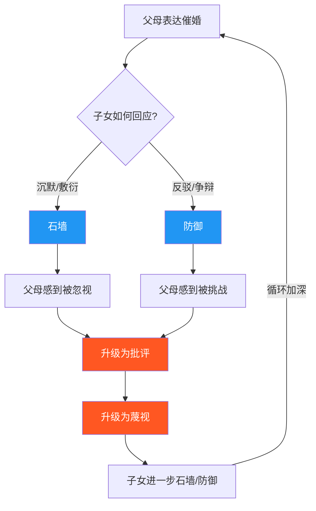
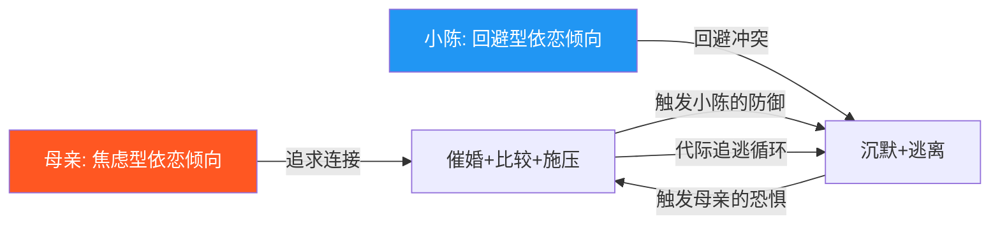
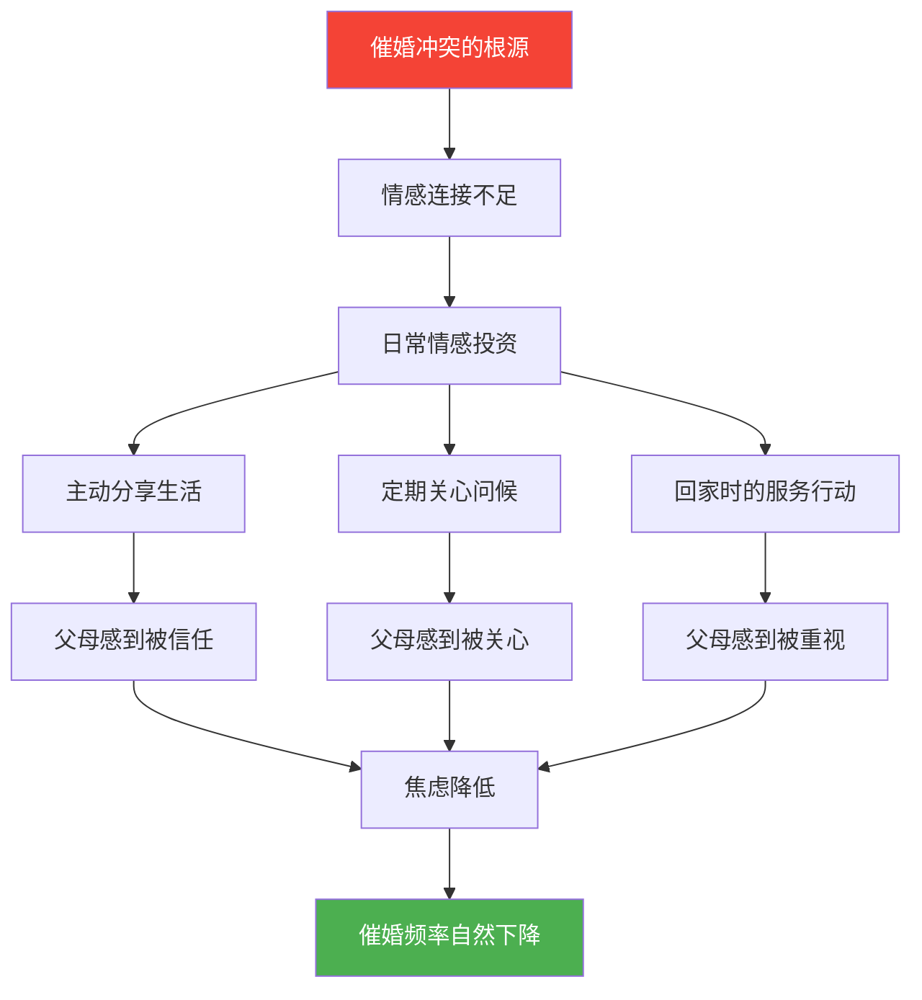
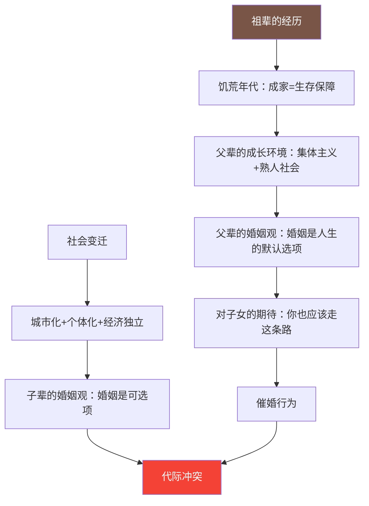

## 场景二：与父母沟通——"你怎么还不结婚"

> *"每次回家都像上刑场。"* 这是一个30岁程序员在高铁上发给好友的消息。这短短一句话，浓缩了数百万中国年轻人在"催婚"这件事上的真实感受——不是不想沟通，而是不知道怎么沟通；不是不爱父母，而是不知道怎么在不伤害彼此的前提下说出真话。

### 2.1 场景全景还原

小陈今年30岁，在一线城市做软件开发，工作稳定，收入不错，业余时间喜欢健身和旅行。他目前单身，不是不想找对象，而是没有遇到合适的人，也不想为了结婚而将就。

这次春节回家，是小陈今年第一次回老家。腊月二十八到家，行李还没放稳，母亲就端着水果进了他的房间，坐在床边，看似随意地开口了：

"你看隔壁小王，比你小两岁，都生二胎了。你表姐家的孩子今年都会走路了。你连个对象都没有，到底要拖到什么时候？"

小陈心里一紧，笑着说："妈，这种事急不来的。"

母亲的脸色变了："急不来？你都三十了！你以为你还是二十出头的小年轻？你以为好姑娘会一直等着你？你就不能让我省省心？"

小陈沉默了。他放下手机，看着天花板，不知道该说什么。

母亲继续说："我跟你爸每天在家，就盼着你能成个家。你倒好，一个人在外面过得自在，你想过我们的感受吗？"

小陈站起来说"我去倒杯水"，走出了房间。母亲看着他的背影，叹了口气，眼眶泛红。

除夕夜的年夜饭上，父亲也加入了："你妈说得对，男人三十而立，成家是大事。你别光想着工作，该考虑个人问题了。"

小陈低头扒饭，含糊地说"知道了"。

大年初二，亲戚聚会。三姑问："小陈有对象了没？"二姨说："我认识一个不错的姑娘，在银行上班，要不要介绍？"舅舅拍着他的肩膀："别太挑了，差不多就行了。"

小陈全程保持微笑，内心却像被架在火上烤。初五他就借口公司有事，提前回了北京。

在高铁上，他给好友发了一条消息："每次回家都像上刑场，以后真不想回去了。"

---

这个场景在中国家庭中极其普遍。它不是简单的"催婚"二字能概括的，而是涉及代际观念差异、情感表达方式冲突、边界感缺失、文化价值观碰撞等多个深层维度。很多年轻人像小陈一样，选择了沉默和逃离——但沉默和逃离并没有解决问题，反而在亲子之间筑起了一道越来越厚的墙。

**为什么这个场景值得深入分析？**

因为它是一个"范式冲突"——父母和子女活在两套不同的操作系统里，用着不同的"语言"谈论同一件事。要解决这个冲突，不能只靠话术技巧，必须深入到认知框架、情感需求和文化语境的层面，才能找到真正的沟通路径。

### 2.2 问题深度诊断

这场沟通表面上是关于"什么时候结婚"的分歧，但深层包含了至少五个维度的沟通障碍。我们逐一拆解。

#### 2.2.1 末日四骑士分析

戈特曼研究所发现的"末日四骑士"虽然最初用于伴侣关系研究，但其沟通模式同样适用于亲子关系。在这场催婚对话中，四骑士出现了三个：

| 骑士 | 母亲的表现 | 父亲的表现 | 小陈的表现 |
|------|-----------|-----------|-----------|
| **批评** | "你连个对象都没有"——将个人选择等同于能力缺陷 | "你别光想着工作"——否定小陈的生活方式 | — |
| **蔑视** | "你以为你还是二十出头的小年轻"——贬低小陈的判断力 | "差不多就行了"——暗示小陈的择偶标准不合理 | — |
| **石墙** | — | — | 沉默、含糊应答、提前返京——完全关闭沟通通道 |
| **防御** | — | — | "这种事急不来的"——回避而非回应 |

注意这里的动态：父母主要使用批评和蔑视（"末日四骑士"中的前两个），小陈主要使用石墙和防御（后两个）。这形成了一个恶性循环——父母越施压，小陈越回避；小陈越回避，父母越焦虑，施压越猛烈。

**四骑士在催婚场景中的激活机制**：

#### 2.2.2 代际依恋模式视角

从依恋理论的角度看，这个场景呈现了典型的"代际焦虑-回避追逃模式"：

**母亲的内心世界**：母亲的催婚不是出于控制欲，而是源于深层的焦虑和恐惧。这种焦虑有三个来源：

1. **生存焦虑的代际投射**：母亲那一代人经历过物质匮乏的年代，在他们的认知体系中，"成家"意味着经济安全和生活稳定。她担心儿子一个人在外面"没人照顾"，这种担心是真实的，尽管在现代社会中它的逻辑已经不太成立。

2. **社会比较带来的压力**：在老家的社交圈里，"孩子结没结婚"是父母之间最常见的比较话题。每次别人问"你儿子结婚了没"，母亲都感到一种社交层面的窘迫。这不是虚荣心，而是在熟人社会中维护自尊的本能反应。

3. **对时间流逝的恐惧**：母亲内心有一个隐含的倒计时——"我还能看到孙子吗？""我还有精力帮你带孩子吗？"这种对衰老和死亡的焦虑，以催婚的形式表达出来。

**小陈的内心世界**：小陈的沉默不是不在乎，而是不知道如何在不伤害父母的前提下表达自己的真实想法。他的回避有三个来源：

1. **无力感**：他已经多次尝试过解释，但每次都被"你不懂""等你到了我这个年纪就明白了"打断。反复的无效沟通让他学会了沉默。

2. **愧疚与愤怒的交织**：他一方面觉得"父母说得也有道理，我确实让他们操心了"，另一方面又觉得"我的人生为什么要被别人定义"。这两种矛盾的情绪让他无法平静地表达。

3. **文化枷锁**：在中国传统文化中，"孝"的定义往往包含"顺"——顺从父母的意愿。直接反驳父母会被视为"不孝"，这种文化压力让小陈即使有理也说不出口。

#### 2.2.3 情感账户透支

用情感账户模型来分析，小陈和父母之间的账户处于"长期低余额"状态：

| 账户维度 | 存款行为（缺失的） | 取款行为（频繁的） |
|---------|------------------|------------------|
| 日常关心 | 缺少主动打电话、分享生活细节 | 只在被催促时才联系，形成"催→烦→躲"的循环 |
| 情感表达 | 很少说"我想你们""谢谢你们" | 催婚对话本身就是大额取款 |
| 共同活动 | 一年回家次数有限，每次时间短 | 回家期间的催婚冲突消耗了本就不多的相处时间 |
| 认可与尊重 | 很少表达对父母付出的感恩 | 沉默和逃离被父母解读为"不在乎我们" |
| 信息共享 | 对自己的感情生活闭口不谈 | 信息不透明加剧了父母的焦虑 |

情感账户的低余额意味着：每一次催婚冲突都在透支本就不多的情感储备，而父母和小陈都没有意识到需要"存款"。

#### 2.2.4 爱的语言错位

| 人物 | 最核心的爱的语言 | 如何表达爱 | 如何接收爱（被爱的感受） |
|------|----------------|-----------|---------------------|
| **母亲** | 服务的行动 + 精心时刻 | 做一桌好菜、准备年货、嘘寒问暖 | 孩子愿意回家、愿意和自己聊天、生活安定 |
| **父亲** | 肯定的言辞 | 默默工作养家、提供经济支持 | 孩子事业有成、家庭完整 |
| **小陈** | 精心时刻 + 肯定的言辞 | 偶尔打电话、过年回家 | 父母理解自己的选择、认可自己的生活方式 |

核心错位在于：父母用"催婚"表达的是"我爱你、我担心你"，但小陈接收到的是"你在控制我、你不认可我"。小陈用"沉默"表达的是"我不想和你们吵架"，但父母接收到的是"你不在乎我们"。

#### 2.2.5 非暴力沟通四个维度的缺失

| NVC维度 | 母亲的实际表达 | 应该有的表达 |
|---------|--------------|-------------|
| **观察** | ❌ "你连个对象都没有"（笼统评判） | ✅ "你今年三十了，目前还是单身状态" |
| **感受** | ❌ "你就不能让我省省心"（指责，不是感受） | ✅ "我感到担心和焦虑" |
| **需要** | 完全未表达真实需要 | ✅ "我希望你能有一个互相陪伴的人，这样我才能放心" |
| **请求** | ❌ 隐含的命令（你必须马上找对象） | ✅ "你能不能跟我说说你对这件事的想法？" |

| NVC维度 | 小陈的实际表达 | 应该有的表达 |
|---------|--------------|-------------|
| **观察** | ❌ 完全未表达 | ✅ "妈，每次我回家你都会问我什么时候结婚" |
| **感受** | ❌ 沉默（感受完全压抑） | ✅ "我感到压力很大，也有点难过" |
| **需要** | 完全未表达 | ✅ "我需要你相信我有能力处理好自己的感情生活" |
| **请求** | ❌ "知道了"（敷衍，不是真正的回应） | ✅ "你能不能给我一些时间和信任？" |

#### 2.2.6 文化维度分析

这个场景不能脱离中国文化语境来理解。在西方个人主义文化中，成年人对父母说"这是我的事"是被接受的；但在中国集体主义文化中，"婚姻"从来不只是个人的事——它是家族延续、孝道实践和社会期待的交汇点。

| 文化维度 | 父母的认知框架 | 小陈的认知框架 | 冲突点 |
|---------|--------------|--------------|-------|
| **婚姻的意义** | 人生的必经之路，家族延续的义务 | 个人选择，可有可无 | 对婚姻本质的理解不同 |
| **孝的定义** | 顺从父母意愿 = 孝 | 过好自己的人生 = 孝 | 对孝道的诠释不同 |
| **成功的标准** | 家庭完整、儿孙满堂 | 事业有成、自我实现 | 价值观的代际差异 |
| **时间观念** | "三十而立"，有严格的年龄焦虑 | 现代社会结婚年龄普遍推迟 | 对时间紧迫性的感知不同 |
| **面子文化** | 孩子未婚让父母在社交圈"没面子" | 个人幸福不应为面子服务 | 对社会评价的态度不同 |

#### 2.2.7 经济独立与议价权

一个常被忽略的维度是经济因素。在中国社会中，经济独立程度直接影响子女在家庭中的话语权：

| 经济状态 | 子女的心理状态 | 父母的催婚策略 | 沟通难度 |
|---------|--------------|--------------|---------|
| **完全经济独立** | "我没有求你什么，你凭什么管我" | "你翅膀硬了是吧" | 高——双方都有底气 |
| **部分依赖（如房贷帮还）** | "我确实还欠他们" | "你花我们的钱还不听话" | 很高——愧疚感被放大 |
| **完全不独立** | 无力反驳 | "你吃我的住我的" | 极高——没有平等对话的基础 |

**建议**：如果你在经济上仍然依赖父母，催婚冲突会更难处理，因为经济依赖会让"个人选择权"的主张缺乏底气。在这种情况下，优先解决经济独立问题，比学习沟通技巧更为根本。经济独立不是为了让父母"管不着"你，而是为了让亲子关系回归到"平等对话"的基础之上。

#### 2.2.8 性别差异维度

催婚对男性和女性的压力机制有显著差异：

| 维度 | 男性被催婚的典型表达 | 女性被催婚的典型表达 |
|------|-------------------|-------------------|
| **核心焦虑** | "三十而立，男人要有家" | "女人过了30就不好找了" |
| **压力来源** | 家族延续、社会成功标准 | 生育时钟、年龄焦虑、"贬值"叙事 |
| **亲戚话术** | "别太挑了" | "差不多就行了，女人不能太优秀" |
| **隐含逻辑** | 成家 = 成熟 = 社会认可 | 结婚 = 人生完整 = 生育保障 |
| **对个人价值的影响** | 暗示事业成功还不够 | 暗示个人成就不如婚姻重要 |

女性面临的催婚压力往往更复杂，因为它叠加了年龄歧视和生育焦虑的双重枷锁。一个35岁事业有成的女性被催婚时，隐含的信息是"你再优秀，没结婚就是不完整"——这种对个人价值的否定比单纯的催婚更具有伤害性。

### 2.3 完整重建方案

#### 2.3.1 第一阶段：情绪觉察与自我准备（回家前）

在与父母进行深度沟通之前，小陈需要先做好自己的内在功课。仓促上阵只会重蹈覆辙。

**自我觉察练习**：在回家之前，找一个安静的时间，回答以下问题：

1. 当父母催婚时，我内心最真实的感受是什么？（不是"烦"这个笼统的词，而是精确的情绪——是愤怒？委屈？无力？愧疚？还是恐惧？）
2. 我为什么一直没有和父母认真谈过这件事？我在害怕什么？
3. 我能理解父母催婚背后的真正需要吗？如果我是他们，我会怎么想？
4. 我对婚姻的真实态度是什么？我希望父母了解我的哪些想法？
5. 我愿意在这次沟通中做出哪些让步？我的底线在哪里？

**沟通前的心理建设**：

- **放弃改变父母的执念**：你不可能通过一次对话就让父母停止催婚。目标不是"让他们不再催"，而是"让他们理解我的想法，减少伤害性的表达方式"。
- **接受代际差异的客观存在**：父母那一代人的婚姻观是在他们的时代背景下形成的，你不需要认同，但需要理解。
- **做好情绪预案**：预想最坏的情况（父母大发雷霆、亲戚集体围攻），提前想好自己的应对方式，避免在情绪失控时做出后悔的事。

#### 2.3.2 第二阶段：选择时机与场景设计（回家当天）

**时机选择**的关键原则：

- **不在冲突中沟通**：当母亲正在催婚时，不是沟通的最佳时机。那时候双方都在情绪中，任何解释都会被当作"借口"。
- **不在公共场合沟通**：年夜饭桌上、亲戚聚会时，绝对不是谈这件事的场合。父母在公开场合催婚往往有"面子"的因素，你当众反驳会让他们更难堪。
- **选择轻松、私密的时刻**：饭后散步、一起做家务、晚上在客厅看电视时——这些"肩并肩"的时刻比"面对面"的正式谈话更容易打开话题。

**场景设计**：小陈可以在到家后的第二天（第一天先缓冲，不要急），主动创造一个沟通的机会。

> 小陈主动走到厨房，帮母亲洗菜切菜："妈，我帮你。你歇一会儿。"

这个动作本身就是一笔情感存款。在帮厨的过程中，母亲心情放松，小陈可以自然地开启话题。

#### 2.3.3 第三阶段：主动软启动对话

**核心原则**：不要等父母来催——当他们已经开口时，你处于被动回应的位置，很容易落入"攻击-防御"的循环。主动开启话题，你掌握对话的节奏和方向。

**小陈的主动沟通话术（版本一：温和型）**：

> "妈，我知道你一直在操心我的终身大事。每次你问我，其实是因为你关心我、担心我一个人在外面过得不好。（先确认母亲的善意——这是情感确认）我想跟你说说我的真实想法，你能听我说完吗？（征得许可）"

等待母亲回应后继续：

> "我不是不想找对象，我也希望有一个人能互相陪伴、互相支持。（表达共同的愿望）但我不想为了结婚而随便找一个人。如果找了一个不合适的人，天天吵架或者过不到一起去，那比单身更痛苦，你也会更担心。（解释自己的逻辑）我现在的生活其实挺好的——工作稳定，身体健康，也有自己的朋友圈。我不是在'拖'，我是在等一个对的人。（重新定义"不结婚"的状态）"

> "每次你催我的时候，我其实心里很难受。不是因为烦你，而是因为我觉得自己让你失望了。（表达真实的感受——不是愤怒，而是愧疚和心痛）我知道你希望我过得好，我也希望你能相信我有这个能力。你能给我一些时间和信任吗？（提出请求）"

**这段话的结构拆解**：

| 步骤 | 内容 | 技巧要点 |
|------|------|---------|
| 情感确认 | "你关心我、担心我" | 先确认父母的善意出发点，让父母感到被理解 |
| 征得许可 | "你能听我说完吗？" | 给予父母尊重，避免单方面输出 |
| 表达立场 | "我不是不想找，而是在等对的人" | 消除父母的误解（以为你不想结婚） |
| 解释逻辑 | "不合适的人比单身更痛苦" | 用父母能理解的逻辑，而非抽象的"个人选择" |
| 表达感受 | "我觉得自己让你失望了" | 展示脆弱性，激发父母的保护欲而非防御 |
| 提出请求 | "给我一些时间和信任" | 具体、温和、允许拒绝 |

**小陈的主动沟通话术（版本二：深层型——适合关系较好、沟通基础较好的家庭）**：

> "爸、妈，我想跟你们聊一件对我很重要的事。不是要吵架，是想让你们更了解我。（设定基调）"

> "我知道你们催我结婚，出发点完全是为我好。你们担心我一个人在外面孤独，担心我老了没人照顾，也可能在亲戚面前觉得没面子。（主动说出父母的隐含需求——这会让父母觉得'被理解了'）这些我都理解。"

> "但我想让你们知道：结婚对我来说不是一件可以'赶进度'的事。我希望找到一个真正合适的人，一起建立一个温暖的家。如果我只是为了完成任务而结婚，那个人不会幸福，我也不会幸福，最终你们也不会开心。（表达自己的婚姻观）"

> "我今年三十岁，在你们看来可能'来不及了'，但在我生活的城市里，三十岁单身很正常。我不焦虑，我希望你们也能少一些焦虑。（重新校准时间框架）"

> "你们最大的担心是什么？能不能直接告诉我？这样我也能跟你们说清楚，而不是每次都不欢而散。（邀请对话）"

#### 2.3.4 第四阶段：倾听父母的真实感受

大多数人在这类对话中只关注"如何说服父母"，而忽略了最关键的一步——**倾听**。

当小陈主动表达完自己的想法后，最有力的下一步是：**闭嘴，听。**

**引导父母表达的提问方式**：

- "妈，你最担心的是什么？"
- "爸，你觉得我现在最大的问题是什么？"
- "你们是不是在亲戚面前会不好意思？"
- "你是不是怕我以后一个人太孤单？"

这些提问的目的不是反驳，而是真正理解父母焦虑的根源。很多时候，当父母的焦虑被真正听见时，他们的催促力度会自动减弱——因为"被听见"本身就是一种安抚。

**倾听时的情感确认话术**：

> "我听到了，你是担心我以后一个人没人照顾。（反映感受）这种担心是很正常的，换成我以后有了孩子，我可能也会这样想。（表达理解）"

> "你觉得在亲戚面前不好意思，我能理解。（确认感受）在咱们老家，这个年纪不结婚确实会被人问。你的感受是真实的，我没有不重视。（不否认、不轻视）"

**情感确认的关键区分**：确认父母的感受 ≠ 接受父母的要求。你可以说"我理解你的担心"而不必说"好，我马上找对象"。情感确认的目的是让对方感到被听见，而不是让对方觉得你同意了。

#### 2.3.5 第五阶段：建立沟通协议

一次对话不能解决所有问题。双方需要建立一个"关于这个话题如何沟通"的长期协议。

**沟通协议模板**：

| 协议项 | 具体内容 | 理由 |
|-------|---------|------|
| **频率约定** | "妈，我们每个月聊一次这件事，平时你别总问，行吗？" | 给父母一个"会被回应"的确定性，减少随机催促 |
| **信息透明** | "如果我有了喜欢的人，我会第一时间告诉你。在那之前，你可以放心，我不是在逃避这件事。" | 减少因信息不透明导致的焦虑 |
| **表达方式** | "你有什么担心可以直接说，但不要拿我和别人比较，那样我会很难受。" | 设立边界，减少伤害性表达 |
| **亲戚场景** | "如果有亲戚问，你可以说'他有自己的打算'，不用替我解释。" | 预先协商公共场合的应对策略 |
| **底线共识** | "我会认真对待这件事，但最终的选择权在我。希望你们尊重这一点。" | 明确不可让步的核心底线 |

#### 2.3.6 第六阶段：日常情感投资

催婚冲突的频繁发生，往往不是因为"结婚"这个话题本身，而是因为亲子之间的情感连接太薄弱——催婚成了父母"和孩子说话"的唯一理由。

**建立日常情感连接的具体方法**：

**每周（每项不超过10分钟）**：
- 主动给父母打一个电话，聊聊自己这周的生活（工作、见闻、吃了什么好吃的）。不是等他们打来问"有对象了没"，而是主动分享——这会让父母觉得"孩子的生活对我是开放的"，焦虑自然降低。
- 在家庭群里发一张自己的照片（做饭、运动、和朋友聚会）。让父母看到"我过得很好"，比任何解释都有说服力。

**每月（每项30分钟）**：
- 和父母视频通话一次，不只是寒暄，而是认真问一句："你们最近身体怎么样？有没有什么新鲜事？"——把关注点从"我的婚事"转移到"他们的生活"。
- 给父母寄一个小东西（不需要贵——一本书、一盒点心、一张明信片）。这是一笔大额情感存款。

**每次回家**：
- 帮父母做几件具体的事（修手机、装软件、教他们用新功能、帮忙打扫卫生）。服务的行动是中国父母最能接收的爱的语言。
- 带父母出去吃一顿饭或者去一个他们没去过的地方。创造新的共同记忆。

### 2.4 变体场景与应对策略

#### 2.4.1 变体一：父母用"别人家孩子"来施压

> "你看隔壁小王都生二胎了，你连个对象都没有。"

**心理机制**：社会比较是人类的基本心理倾向，但在中国家庭中，"别人家孩子"不仅是比较工具，更是父母表达焦虑的间接方式——他们真正想说的不是"你不如别人"，而是"我担心你的未来"。

**应对策略**：

> "妈，小王有小王的人生，我有我的。他结婚早不代表他比我幸福，我单身也不代表我过得不好。你真正想问的是不是'你过得好不好'？我可以告诉你：我过得挺好的。"

这段回应做了两件事：一是温和地打断了比较逻辑，二是将话题从"结婚与否"重新定义为"过得好不好"——后者才是父母真正关心的。

#### 2.4.2 变体二：亲戚集体围攻

> 三姑："有对象了没？" 二姨："我认识一个不错的姑娘。" 舅舅："别太挑了。"

**心理机制**：亲戚的催婚大多不是出于恶意，而是"社交寒暄"——在亲戚聚会中，婚恋话题是打破尴尬的安全话题。但对当事人来说，这种"安全话题"却是一把钝刀。

**应对策略分层**：

| 对象 | 关系亲密度 | 策略 | 话术示例 |
|------|-----------|------|---------|
| 父母 | 最亲密 | 深度沟通（见上文） | "妈，我们找个时间好好聊聊" |
| 爷爷奶奶/外公外婆 | 很亲密 | 温和确认+转移话题 | "知道了奶奶，我会抓紧的。来，尝尝这个菜" |
| 叔叔阿姨/舅舅姑姑 | 中等 | 礼貌回应+设置边界 | "谢谢关心，我有自己的计划。来来来，喝酒喝酒" |
| 远房亲戚/父母的朋友 | 较远 | 微笑+简短回应 | "嗯嗯，谢谢关心" + 立刻转向其他话题 |

**关键原则**：对于非核心关系的亲戚，不需要解释、不需要说服、不需要赢得理解。一句"谢谢关心"就够了。把沟通的能量留给最重要的人——你的父母。

**预先和父母协商**：

> "妈，如果有亲戚问我的事，你就说'他有自己的安排'就行了，不用替我操心，也不用替我解释。你帮我打个掩护，行不？"

这个请求既给了母亲一个"帮忙"的角色（大多数母亲喜欢被孩子需要），也减轻了母亲在亲戚面前的压力。

#### 2.4.3 变体三：父母以健康为由施压

> "我身体一天不如一天了，就想在闭眼之前看到你成个家。"

**心理机制**：这是催婚中最难应对的形式，因为它混合了真实的时间焦虑和情感绑架。父母确实会因为衰老而感到时间紧迫，但"以健康为筹码"也会给孩子带来巨大的心理压力和愧疚感。

**应对策略**：

> "妈，你别这样说，你会健健康康的。（先安抚情绪）我知道你有时间上的担心，我也希望你能看到我成家的那一天。（确认感受）但你越是这样说，我压力越大，反而越难做出好的决定。（坦诚表达影响）我希望你能好好保重身体，这对我来说比什么都重要。我的事我会放在心上的。（重新定义优先级）"

**底线**：如果父母频繁使用健康威胁来施压，这已经从"沟通"滑向了"情感操控"。你有权设立明确的边界："妈，我爱你，但你不能用你的健康来逼我做决定。这样对你、对我都不好。"

#### 2.4.4 变体四：父母安排相亲

> "你二姨介绍了一个姑娘，你初四去见见。"

**心理机制**：相亲是中国父母将催婚从"口头施压"升级为"行动干预"的主要方式。对父母来说，"帮你安排相亲"是一种积极的爱的表达——"我不是光说，我在帮你解决问题"。

**应对策略分两种情况**：

**如果你完全不想相亲**：

> "妈，谢谢你帮我操心。但相亲不是我的方式。我希望通过自己的社交圈认识人，这样更自然，成功率也更高。（解释原因）你能不能告诉二姨，谢谢她的好意，但我暂时不需要？（请求）"

**如果你可以接受偶尔相亲**：

> "好，这次我可以去见。但我有两个条件：第一，你不要事后追问结果，如果合适我自己会说；第二，如果我觉得不合适，你不要劝我'再试试'。（设立边界）这样行吗？"

偶尔接受一两次相亲其实可以是一笔情感存款——它向父母传递了一个信号："我在认真对待这件事"。但前提是你要设好边界，避免陷入"被安排了一轮又一轮"的无底洞。

**相亲后如何拒绝不合适的人选**（话术模板）：

对父母说：

> "我和对方聊了聊，感觉不太合适。不是对方不好，而是我们性格/生活节奏/价值观上有些不太匹配。这种事勉强不来，勉强在一起反而会出问题。谢谢你们的安排，但这个人确实不适合我。"

关键要点：
- 肯定父母的善意（"谢谢你们的安排"）
- 给出具体但不伤人的理由（"性格不太匹配"而非"对方太丑/太穷"）
- 表明自己的判断力（"我认真考虑过了"）
- 坚定但不强硬（"勉强不来"而非"我就是不去"）

#### 2.4.5 变体五：父母的催婚已经持续多年，关系已经僵化

> 小陈已经沉默了五年，每次回家都是同一套剧本。父母越催越凶，小陈越躲越远。双方都已经精疲力竭。

**心理机制**：长期的催婚僵局已经形成了一个固化的互动模式——催、躲、再催、再躲。双方都对这个模式感到疲惫，但都不知道如何打破。每一次重复都在加深"这个问题无法沟通"的信念。

**破局策略**：

当关系已经僵化时，第一步不是"怎么谈结婚"，而是**打破固有模式**。

**方法一：写信/发长消息**

对于面对面沟通已经陷入僵局的家庭，书面沟通是一个有效的替代渠道。文字的优势在于：你可以完整地表达自己的想法而不被打断，父母也可以反复阅读和消化。

> 长消息示例（节选）：
>
> "爸、妈，有些话我一直想说但不知道怎么开口，所以我写下来了。
>
> 首先，我知道你们催我结婚是因为爱我。这些年你们为我操了很多心，我都记在心里。
>
> 但我想让你们知道：每次你们催我的时候，我不是不想回应，而是我不知道该怎么回应。我试过解释，但每次都不欢而散。后来我学会了沉默，但沉默让你们更担心，也让我们的距离越来越远。
>
> 我不想这样。我希望我们之间的关系不要被'结婚'这一个话题绑架。
>
> 我想跟你们分享一下我的真实想法……（展开自己的婚姻观、当前的生活状态、对未来的规划）
>
> 我写这些不是为了说服你们，而是希望你们能更了解我。你们了解得越多，可能就不会那么担心了。
>
> 爱你们的儿子/女儿"

**方法二：通过"中间人"搭建桥梁**

如果直接沟通实在困难，可以找一个双方都信任的中间人（比如一个关系好的姑姑/叔叔、父母信任的朋友），先和中间人聊清楚自己的想法，请中间人帮忙和父母沟通。

**注意**：中间人的角色是"翻译"和"缓冲"，不是"裁判"。不要让中间人去"评理"，而是让他们帮你传达"孩子其实很在乎你们"这个信息。

**方法三：从非婚话题重建连接**

如果催婚话题已经让关系僵化到连正常交流都困难，那就先完全避开婚恋话题，从其他方面重建情感连接。比如：

- 每周给父母发一条他们感兴趣的内容（养生知识、戏曲视频、广场舞教学）
- 帮父母解决一个具体问题（教他们用某个App、帮他们预约体检）
- 分享一个你工作中的好消息（升职、加薪、完成一个大项目）

当亲子关系因为这些"安全话题"而有所回暖后，再尝试引入婚恋话题的深度沟通。

#### 2.4.6 变体六：女方视角——"你都多大了，还不找对象"

女性被催婚的场景有其独特性。除了上述通用策略，女性面临的额外挑战包括：

**生育焦虑的放大**：父母和亲戚最常提到的就是"再不生就来不及了""高龄产妇风险大"。这些说法虽然有一定的医学基础，但被用作催婚工具时，本质上是在将女性的个人价值与生育能力捆绑在一起。

**应对话术**：

> "妈，我知道你担心生育的问题。但现在医学很发达，而且我的身体健康状况你也看到了。比起为了赶生育时间而找一个不合适的人，我更希望先找到对的人，再考虑这些事。如果真的有需要，现在也有很多方式可以保留生育选择（如冻卵），这些我可以自己去了解和安排。"

**"年龄贬值"叙事的应对**：亲戚常说"女人过了30就不好找了""你条件这么好，再不抓紧就浪费了"。这种说法隐含的逻辑是"女性的价值随年龄递减"。

**应对话术**：

> "谢谢关心。不过我觉得一个人的价值不会因为年龄而减少。我现在比25岁时更成熟、更知道自己要什么，这反而是优势。"

#### 2.4.7 变体七：经历过失败感情后的催婚

如果你曾经有过认真的感情但最终没有走到一起，父母可能会说："你之前那个不是挺好的吗？怎么就分了？""你是不是眼光太高了？"

**心理机制**：父母提到你的前任，往往不是真的想念那个人，而是想表达"你曾经有过机会但错过了"的遗憾感。他们也可能在担心你"受到感情伤害后不敢再尝试"。

**应对策略**：

> "那已经是过去的事了，分了有分了的原因。我从那段关系中学到了很多，也更清楚自己想要什么样的伴侣。你放心，我没有因为过去的事就不敢再尝试了。我只是在等一个真正合适的人。"

#### 2.4.8 变体八：父母通过经济手段施压

有些父母会将经济支持与婚姻挂钩："你不结婚，房子我就不帮你买了""你什么时候结婚，什么时候给你那笔钱"。

**心理机制**：这是一种"交易式思维"——父母将经济支持作为"控制"子女人生决策的筹码。这种行为的根源可能是他们觉得"除了钱之外，我没有其他方式影响你了"。

**应对策略**：

> "爸，我理解你想帮我买房的心情，但我不想因为一套房子而做出结婚的决定。婚姻是一辈子的事，不能和经济利益绑定。如果你不愿意帮忙买房，我完全理解，我自己慢慢攒也没问题。但我希望你能支持我的选择，而不是用条件来换。"

**底线**：如果父母确实用经济手段来强制干预你的人生选择，你需要认真评估是否要接受这种"有条件的爱"。经济独立是抵御这种压力的最有效防线。

### 2.5 常见错误与纠正

#### 2.5.1 错误一：用道理反驳感情

> ❌ "现在都什么年代了，你还催婚？你知道北京平均结婚年龄都32了吗？"

**问题**：用数据和道理来反驳父母的情感需求，本质上是在说"你的担心是不理性的"。父母的催婚不是一道数学题，不是你列出数据就能解决的。

**纠正**：先处理情感，再处理事实。

> ✅ "妈，我知道你担心我。我跟你说说我这边的情况——在我生活的城市里，三十岁单身其实很普遍，大家都不着急。所以你不用太担心，我这不是什么'问题'。"

#### 2.5.2 错误二：虚假承诺

> ❌ "好好好，我今年一定找一个。"

**问题**：为了暂时让父母闭嘴而做出的虚假承诺，只会让下次的冲突更严重。当你下次回家还是单身时，父母不仅会催婚，还会加上"你答应过我的"这一条新的弹药。

**纠正**：诚实但温和。

> ✅ "我不能给你一个时间表，但我可以答应你：我会认真对待这件事，不会故意逃避。如果有了进展，我第一时间告诉你。"

#### 2.5.3 错误三：以暴制暴

> ❌ "你烦不烦啊！每次回来都说这个，我都不想回来了！"

**问题**：虽然愤怒是真实的情绪，但以攻击性的方式表达只会让父母感到伤心和被拒绝，然后他们会用更强的催促来回应——因为他们觉得"不管就不行了"。

**纠正**：表达感受，而非发泄情绪。

> ✅ "妈，你每次这样问我，我心里其实很难受。我不是在跟你吵架，我只是想让你知道，这个话题对我来说是有压力的。"

#### 2.5.4 错误四：完全回避

> ❌ 每次回家只待两天，全程和朋友聚会，避开一切和父母独处的机会。

**问题**：回避不会让催婚消失，只会让它在你每次出现时以更集中的方式爆发。更严重的是，回避传递了一个信息："我在逃避你"——这比催婚本身更伤亲子关系。

**纠正**：主动缩短回家时间但提高质量，比被动逃避更有效。

> ✅ 提前和父母沟通："这次我只能待三天，但我会把这三天都留给你和爸。咱们一起做做饭、逛逛街，好好待几天。"

#### 2.5.5 错误五：通过第三方施压反制

> ❌ 让自己的朋友/同事打电话给父母"做思想工作"，或者转发"催婚有害"的文章到家庭群。

**问题**：这是一种被动攻击——你不敢正面沟通，就用间接的方式"教育"父母。父母会感到被联合对付，信任感进一步下降。

**纠正**：如果你希望父母了解某些信息（比如现代婚姻观念的变化），选择分享的方式很重要。不是甩一个链接，而是面对面、用聊天的方式自然带入。

#### 2.5.6 错误六：把自己放在"受害者"位置

> ❌ "你们只关心我结不结婚，从来不关心我过得开不开心。"

**问题**：这句话的逻辑是对的，但表达方式是在控诉。它把父母放在了"加害者"的位置上，让对话变成了一场审判。

**纠正**：把"你不关心我"转化为"我需要你关心我"。

> ✅ "妈，除了结婚的事，我也希望你能问问我工作怎么样、身体好不好、最近有什么开心的事。这样我会觉得你真的在乎我这个人，不只是在乎我什么时候结婚。"

#### 2.5.7 错误七：搬出"独立"当挡箭牌

> ❌ "我是独立的成年人，我的事不用你管。"

**问题**：这句话在道理上完全正确，但在情感上是一把刀。它传达的信息是"我不要你了"——对父母来说，这比"我还没结婚"更让他们恐惧。

**纠正**：在表达独立性的同时，保留情感连接。

> ✅ "妈，我知道你关心我，我也需要你的关心。但这件事我想自己做主。你相信我能处理好，这对我比什么都重要。"

### 2.6 进阶：深层理解与长期修复

#### 2.6.1 理解"催婚"的代际创伤根源

父母对子女婚姻的执念，往往不是从他们自己开始的。追溯上去，你会发现一条代际传递的焦虑链：

当你理解了催婚的代际根源，你会发现一个重要的事实：**父母不是在"为难"你，他们是在用自己时代的经验来"保护"你。** 这种保护方式在他们的年代是合理的，但在今天的社会中可能已经不再适用。

理解不等于接受，但理解可以让你少一些愤怒，多一些耐心。当你带着理解而非敌意去沟通时，对话的质量会完全不同。

#### 2.6.2 建立"家庭叙事"的新框架

长期来看，解决催婚冲突的根本方法不是"让父母不再催"，而是**丰富你们之间的叙事内容**——让"结婚"不再是你们关系中的唯一话题。

**方法：创造新的家庭叙事**

每次回家，主动带入新的话题和活动：

- 和父母一起看一部电视剧，然后讨论剧情
- 教父母使用一个新的App或者功能
- 一起做一道没做过的菜
- 分享你在城市里的趣事和见闻
- 询问父母年轻时的故事（这是最有力的情感存款）

当你们之间的叙事从"你什么时候结婚"扩展到"上次那个电视剧结局怎么样了""你教我的那个功能真好用""你小时候原来这么调皮"时，催婚的话题自然会从"主旋律"降级为"偶尔提及"。

**创造"关键时刻"的情感存款**：

日常的小关心是"小额存款"，但在某些关键时刻做出回应，会产生远超日常的大额情感存款效果：

| 关键时刻 | 存款行动 | 效果 |
|---------|---------|------|
| 父母生日 | 提前准备礼物+当天打电话，最好能回家 | "孩子记得我的生日"——被重视感 |
| 父母体检 | 主动帮他们预约、陪同、解读报告 | "孩子关心我的健康"——被照顾感 |
| 父母生病 | 立刻打电话、必要时请假回家 | "关键时刻孩子在"——安全感 |
| 家庭变故 | 主动承担一部分责任 | "孩子长大了、可以依靠了"——信任感 |
| 传统节日 | 即使不能回家，也要打电话+寄东西 | "孩子心里有这个家"——归属感 |

这些关键时刻的存款效果，可以在情感账户中形成"缓冲余额"——即使偶尔催婚冲突发生，也不会导致账户"透支"。

#### 2.6.3 当催婚背后是控制

在极少数情况下，催婚可能不是出于爱和担心，而是出于控制——父母希望通过控制子女的婚姻来维持自己在家庭中的权威地位。识别这种情况的信号包括：

- 父母不仅催婚，还要求你和特定的人结婚
- 当你拒绝时，父母的反应不是失望而是愤怒，甚至威胁断绝关系
- 父母对你的其他人生决策也高度控制（工作选择、居住城市、消费方式）
- 催婚伴随着情感操控："你不结婚就是不孝""我白养你了"

**应对策略**：面对控制型父母，核心技巧不是"更好的沟通"，而是**坚定的边界设置**。

> "爸、妈，我爱你们，我也尊重你们。但结婚是我的人生大事，决定权在我。你们可以给我建议，但不能替我做决定。如果你们因为这件事要和我断绝关系，那我会很难过，但我不会因此做出违背自己意愿的决定。"

这段话可能看起来很"硬"，但面对控制型关系，清晰的边界比温和的技巧更重要。模糊的边界只会让控制得寸进尺。

如果控制已经严重影响了你的心理健康，建议寻求专业心理咨询师的帮助。家庭系统治疗（Family Systems Therapy）在处理这类问题上有丰富的临床经验。

#### 2.6.4 处理愧疚感

很多年轻人在拒绝父母催婚时，内心会被愧疚感淹没——"他们养我这么大，我连这点要求都不能满足他们。"

这种愧疚感需要被正视和处理，而不是压抑或忽视。

**区分两种愧疚感**：

| 类型 | 来源 | 处理方式 |
|------|------|---------|
| **合理愧疚** | "我确实很久没有关心过父母了" | 行动：增加日常联系和关心 |
| **被强加的愧疚** | "我不结婚就是对不起他们" | 认知重构：你没有义务为了满足他人的期待而牺牲自己的人生选择 |

**认知重构的练习**：

当你感到"不结婚就是不孝"的愧疚时，问自己三个问题：

1. "如果我为了满足父母而和一个不合适的人结婚，最后离婚了，父母会更开心吗？"
2. "如果我有一个孩子，我会希望他/她为了我而和一个不爱的人结婚吗？"
3. "孝顺的定义是'让父母当下满意'还是'让父母最终放心'？"

答案通常很清楚：一个幸福的单身子女，比一个不幸的已婚子女，更能让父母"省心"。

#### 2.6.5 从"对抗"到"同盟"的关系重构

催婚冲突的终极解法，不是"赢了这场辩论"，而是把父母从"对手"变成"队友"。

**具体方法**：邀请父母参与你的生活规划，让他们从"旁观的焦虑者"变成"参与的支持者"。

> "妈，我最近在考虑跳槽的事，你帮我分析分析？（邀请参与非婚恋决策）"

> "爸，我在学做饭，你教我做你那道红烧肉呗？（创造共同活动）"

> "妈，我周末要去参加一个朋友的婚礼，到时候拍照片给你看。（分享社交生活）"

当父母感到自己在你的生活中有位置、有价值时，"结婚"这个话题的紧迫性会自然降低——因为他们不再需要通过催婚来"参与你的生活"。

### 2.7 实操练习

#### 练习一：改写催婚开场白

把以下"攻击性催婚"改为"建设性表达"，使用NVC四步法（观察-感受-需要-请求）：

1. "你看隔壁小王都生二胎了，你连个对象都没有！"
2. "你到底要拖到什么时候？你就不能让我省省心？"
3. "你别太挑了，差不多就行了！"
4. "我跟你爸每天就盼着你能成个家，你倒好，一个人在外面自在！"

**参考改写（从父母视角）**：

1. "你今年三十了，还是一个人。我看到小王家其乐融融的，心里有些羡慕，也有些担心你以后一个人怎么办。你能跟我说说你的想法吗？"
2. "我有时候会着急，因为我觉得时间过得很快。我不是想给你压力，我就是需要知道你有在考虑这件事。你能让我放心一点吗？"
3. "我知道你有自己的标准，我不干涉。但我希望你不要太封闭自己，多认识一些人总是好的。你觉得呢？"
4. "你爸和我最牵挂的就是你。我们不需要你挣多少钱、做多大的官，就希望你能有个伴。你能理解我们的心情吗？"

#### 练习二：角色互换对话

如果你有条件，找一个信任的朋友做这个练习。一个人扮演"被催婚的子女"，一个人扮演"催婚的父母"，进行以下对话：

**第一轮**：完全按照现实中的方式对话（重现真实场景）
**第二轮**：子女使用NVC四步法回应，父母使用情感确认
**第三轮**：互换角色

练习后讨论：
- 作为"父母"时，你感受到了什么？
- 作为"子女"时，你感受到了什么？
- 哪种对话方式让你更愿意继续谈下去？

#### 练习三：写一封不会寄出的信

给父母写一封信，把你想说但一直没有说出口的话全部写下来。这封信不需要寄出——它的目的是帮你整理自己的情绪和想法。

**信的框架**：

1. **感谢**：写下三件你感谢父母的事
2. **感受**：写出催婚让你感受到的真实情绪
3. **理解**：写出你理解的父母的担忧
4. **立场**：写出你对婚姻的真实态度
5. **请求**：写出你希望父母做出的改变
6. **承诺**：写出你愿意做出的改变

写完后，你可能会发现：有些话你在信里能写出来，面对面时也能说出来了。

#### 练习四：情感存款计划

制定一个为期30天的"亲子情感存款计划"，每天至少完成一项：

| 周次 | 存款行动 | 预期效果 |
|------|---------|---------|
| 第1周 | 每天给父母发一条消息（分享一张照片或一段日常） | 建立日常连接的习惯 |
| 第2周 | 每两天打一个5分钟电话，只聊生活不聊婚事 | 让父母习惯"不催婚也能聊天" |
| 第3周 | 每天在心里想一件感谢父母的事，有机会就说出来 | 培养表达感恩的习惯 |
| 第4周 | 给父母寄一件小礼物或写一张卡片 | 创造意外的情感存款 |

30天后回顾：父母的催婚频率有没有变化？你们之间的对话质量有没有改善？

#### 练习五：应对话术速查表

在回家之前，把以下话术存到手机里，作为"紧急应对指南"：

**被直接催婚时**：
> "我知道你关心我，我也在认真对待这件事。你放心，我心里有数。"

**被和别人比较时**：
> "每个人有自己的节奏，我过得挺好的。你别太担心。"

**被介绍相亲对象时**：
> "谢谢你的关心，我目前想先专注自己的节奏。如果有需要，我会主动找你帮忙。"

**被亲戚围攻时**：
> "谢谢关心！来来来，吃菜吃菜。"（然后迅速转移话题）

**情绪快失控时**：
> "妈，我需要出去透透气，一会儿回来。"（物理缓冲，给自己10分钟冷静时间）

### 2.8 关键数据与研究支持

#### 2.8.1 宏观数据

- **代际沟通研究**：中国社会科学院2022年的一项调查显示，76.8%的适婚未婚青年表示曾因婚恋问题与父母产生冲突，其中42.3%表示冲突"严重影响了亲子关系"。催婚是当代中国家庭代际冲突的首要来源。
- **结婚年龄数据**：中国民政部数据显示，2023年中国平均初婚年龄已上升至28.6岁（男）和27.1岁（女），较2010年推迟了约3.5岁。一线城市初婚年龄更高，北京、上海等地男性平均初婚年龄已超过30岁。
- **结婚率持续下降**：2023年全国结婚登记数为768万对，较2013年的1347万对下降了近43%。这意味着"不结婚"已经不是个例，而是一个结构性的社会趋势。
- **单身人口规模**：根据国家统计局和民政部的数据，中国成年单身人口已超过2亿，其中独居成年人口约9200万。"一个人过"正在成为一种被广泛接受的生活方式。

#### 2.8.2 心理学研究

- **催婚的心理影响**：华东师范大学2021年的一项研究发现，长期处于催婚压力下的年轻人，其焦虑水平和抑郁倾向显著高于同龄人。研究还发现，催婚压力越大，年轻人对婚姻的抗拒心理反而越强——形成了"越催越不想结"的逆反效应。
- **代际依恋传递**：发展心理学研究表明，焦虑型依恋风格具有代际传递性——焦虑型父母更容易养育出焦虑型或回避型子女。这意味着如果母亲本身是焦虑型依恋风格，她催婚时的焦虑可能部分源于她自己的依恋模式，而非仅仅是"关心孩子"。
- **情感确认的效果**：心理学家莱恩汉（Marsha Linehan）的辩证行为疗法（DBT）研究证实，情感确认（Validation）能够显著降低对方的情绪强度和防御性。当一个人感到被理解时，其杏仁核的激活水平会下降，前额叶皮层（负责理性思考）的活动会上升——这意味着"让父母感到被理解"不是软弱，而是一种有效的神经科学策略。
- **自我决定理论**：心理学家德西（Edward Deci）和瑞安（Richard Ryan）的自我决定理论指出，人有三种基本心理需求——自主感、胜任感和归属感。催婚之所以让年轻人感到痛苦，是因为它同时威胁了自主感（"我的人生我做主"）和归属感（"父母不理解我"）。有效的沟通策略必须同时保护这两种需求。

### 2.9 常见问题解答

**Q1：如果父母根本不听我说怎么办？**

A：如果面对面沟通每次都失败，尝试以下替代方案：
- 写一封长信或长消息（见2.4.5的"写信"策略）
- 通过双方都信任的中间人传达
- 先从非婚恋话题重建情感连接，等关系回暖后再谈
- 短期策略：设定一个"每年认真谈一次"的频率，平时用"我在认真找"来缓解

**Q2：父母说"你不结婚就是不孝"，我该怎么回应？**

A：这句话的本质是把"孝顺"与"服从"画了等号。你可以这样回应：
> "妈，孝顺有很多种方式。我努力工作、照顾你们的身体、经常回来看你们——这些都是孝顺。如果我为了孝顺而随便找一个人结婚，最后过得不幸福，你也会跟着操心。真正的孝顺是让你最终放心，而不是让你暂时满意。"

**Q3：我已经35岁了，父母的催婚越来越绝望，我该怎么办？**

A：年龄越大，父母的焦虑确实越深。除了通用策略外，额外建议：
- 主动分享你的生活规划（不只是感情，包括职业、财务、健康），让父母看到"你在掌控自己的人生"
- 如果你对婚姻的态度是"可以但不强求"，明确告诉父母，而不是让他们猜
- 考虑带父母参观你的生活（邀请他们来你工作的城市住几天），让他们亲眼看到你过得好

**Q4：我是LGBTQ+群体，被催婚的压力更大怎么办？**

A：这是一个特殊的困境。在中国社会中，出柜与否是一个需要根据个人情况审慎决定的选择。无论你是否选择出柜：
- 如果不出柜：使用通用的沟通策略，同时建立强大的情感支持系统（朋友、社群、心理咨询师）
- 如果考虑出柜：建议在出柜前先做好经济独立和情感准备，选择一个平静的时机，预期父母需要较长的接受过程，必要时寻求专业LGBTQ+友善咨询师的帮助
- 无论哪种选择，你的心理健康是第一位的

**Q5：我已经结婚了，但父母开始催生孩子了，怎么办？**

A：催婚→催生→催二胎……这是一个无限循环。核心策略是一样的：理解父母的善意、表达自己的立场、建立沟通协议。关键是在催婚阶段就建立好沟通模式和边界意识，这样催生阶段就不会措手不及。

**Q6：如果沟通后父母暂时好了，过一段时间又开始催怎么办？**

A：这是完全正常的。行为模式的改变需要时间，一次对话不可能永久改变几十年的习惯。当催婚再次出现时：
- 不要觉得"上次白谈了"——改变是波浪式的，不是直线式的
- 温和地提醒："妈，我们之前聊过这个，你放心，我心里有数。"
- 每次冲突后的冷静对话，都在加深彼此的理解

### 2.10 成功案例：从"年年上刑场"到"终于能好好说话"

**案例背景**：小林（化名），29岁，女，上海互联网行业工作，被催婚5年。前4年的模式和小陈完全一样——沉默、躲避、提前返程。第5年，她决定换一种方式。

**她做了什么**：

1. **回家前两周**：每天给母亲发一条消息——工作餐的照片、周末逛的公园、新买的围巾。这是"情感存款"的第一步。
2. **到家第一天**：帮母亲做了一桌年夜饭（她提前学了母亲最爱的红烧排骨）。母亲很开心，催婚的话一句没提。
3. **到家第二天晚上**：她和母亲一起在厨房收拾的时候，主动开口：
   > "妈，我知道你一直在操心我的事。我想跟你好好聊聊，你愿意听吗？"
4. **母亲的反应**：出乎意料地平静。母亲说："我就是怕你一个人在外面太辛苦。"
5. **小林的回应**："我知道。但我现在过得挺好的，你看我这不是好好的吗？我不是不想找，但我不能为了结婚而结婚。你放心，我心里有数。"
6. **这次对话的结果**：母亲没有立刻停止催婚，但频率明显降低了。更重要的是，母亲开始在电话里问她"工作累不累""身体怎么样"——话题从"结婚"扩展到了"生活"。

**关键转变**：小林说，最大的变化不是母亲不再催了，而是她自己不再把催婚当成"被攻击"，而是理解为"被担心"。这个认知的转变，让她的回应从"防御"变成了"安抚"——而安抚的效果远比防御好得多。

---

*与父母沟通"你怎么还不结婚"，本质上不是一场关于婚姻的辩论，而是一次关于爱、担心和理解的深层对话。父母需要听到的不是"我会结婚"，而是"我在乎你的感受"。你需要听到的不是"你随便找一个"，而是"我们相信你能过好自己的人生"。当双方都能放下对"结论"的执念，转而关注"理解"本身时，这个看似无解的冲突，就有了和解的可能。*

*最后记住：你不需要赢这场对话，你需要的是和父母一起找到一种双方都能接受的相处方式。婚姻是你的选择，但亲子关系是你和父母共同的财富——不要让一个话题毁掉一段本来可以很好的关系。*
